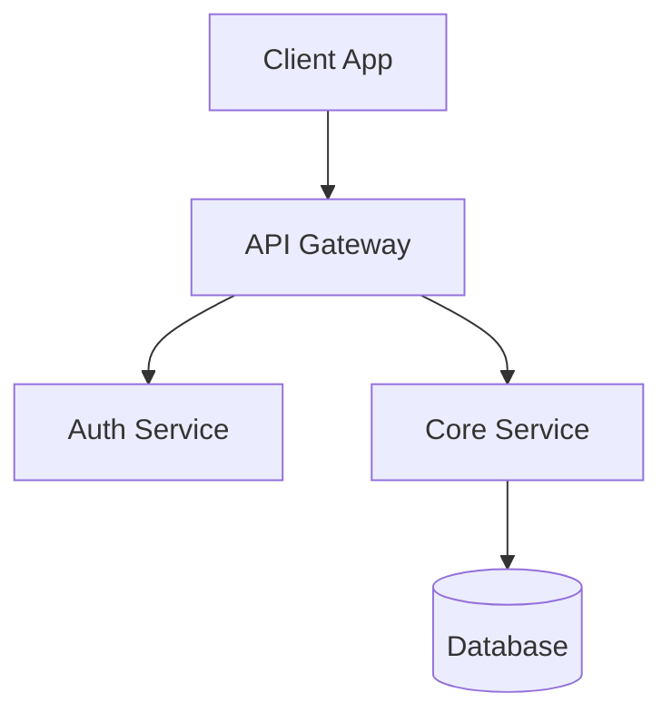
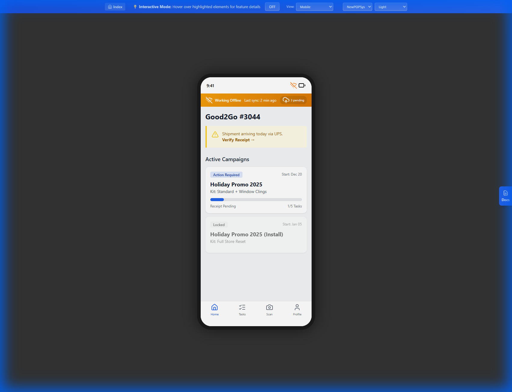
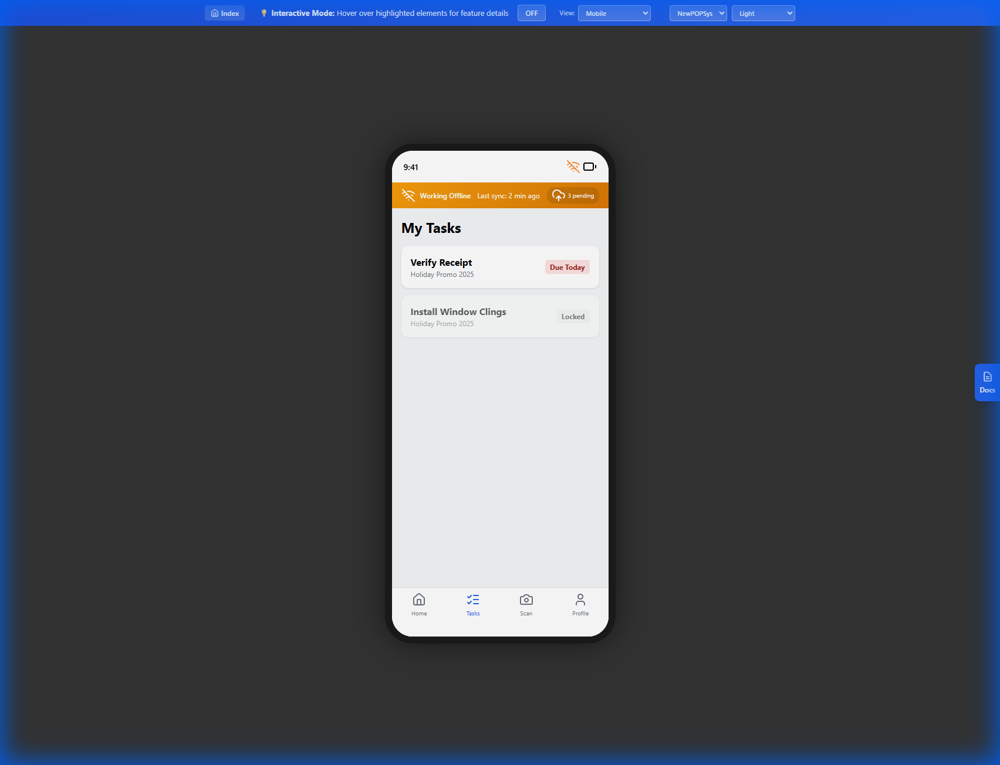
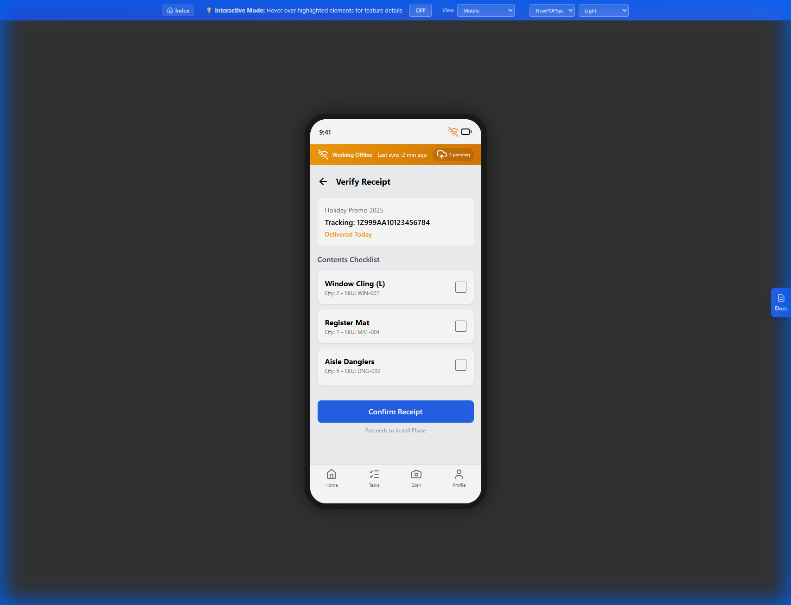
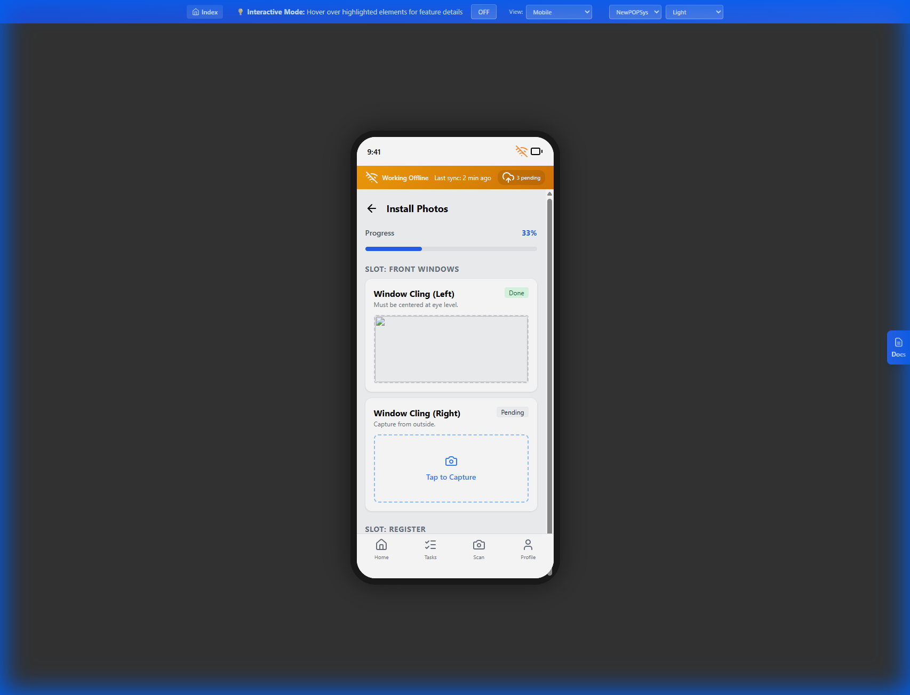
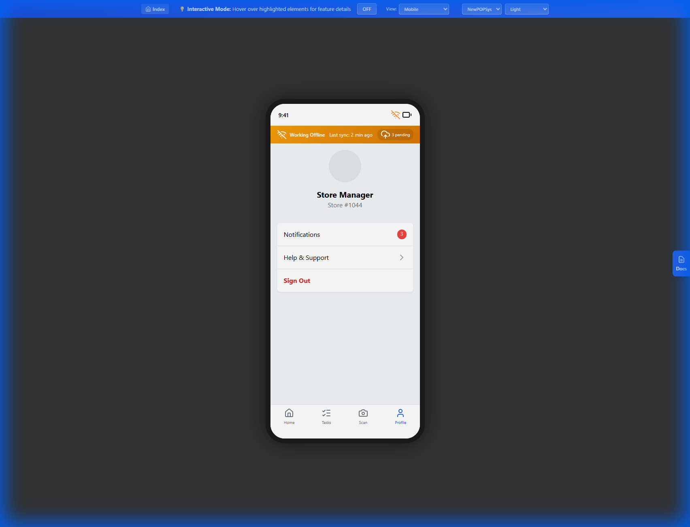



---

# M001 - Login Screen

> **Module**: MobilePWA (Store Execution)
> **Screen ID**: M001
> **Route**: `/app/login`
> **IEEE 830 Section**: 3.2.1 - User Interface Requirements
> **Version**: 1.0
> **Last Updated**: 2026-01-01

---

## 1. Screen Overview

### 1.1 Purpose

The Login screen provides secure authentication for store personnel accessing the NewPOPSys mobile PWA. It implements a simplified store-centric authentication flow using store number and personal PIN, optimized for retail environments where users may share devices but require individual accountability.

### 1.2 Scope

This specification covers:
- Store number input and validation
- PIN-based authentication
- Session token management
- Rate limiting and security controls
- Offline authentication fallback

### 1.3 Screenshot Reference


### 1.4 Source Documents

| Document | Reference |
|----------|-----------|
| Screen Spec | [M01_Login.md](../../../../06_Screen_Specs/M01_Login.md) |
| SUPP Reference | SUPP-036 (Onboarding and Store Foundation) |
| Authentication | [4.3_Authentication_Flows.md](../../04_User_Personas_RBAC/4.3_Authentication_Flows.md) |

---

## 2. User Roles & Permissions

### 2.1 Authorized Roles

| Role | Access Level | Description |
|------|--------------|-------------|
| Store Manager (P07) | Full | Can authenticate and access all store features |
| Store Operator (P08) | Execute | Can authenticate and execute assigned tasks |

### 2.2 Role Requirements

| Req ID | Requirement | Priority |
|--------|-------------|----------|
| REQ-M001-ROLE-001 | System SHALL authenticate users with STORE_MANAGER or STORE_OPERATOR roles | Must |
| REQ-M001-ROLE-002 | System SHALL deny authentication to non-store-level roles | Must |
| REQ-M001-ROLE-003 | System SHALL load user's active store memberships upon successful login | Must |

### 2.3 Permission Constraints

- Only users with active `Membership` records for a store may authenticate
- User must have `is_active = true` status
- Store must have `status = ACTIVE`

---

## 3. UI Components

### 3.1 Component Inventory

| Component ID | Type | Description | Required |
|--------------|------|-------------|----------|
| COMP-M001-001 | Header | Brand logo, "Welcome" text | Yes |
| COMP-M001-002 | Text Input | Store number field (alphanumeric) | Yes |
| COMP-M001-003 | PIN Input | Masked 4-6 digit PIN field | Yes |
| COMP-M001-004 | Button | Primary "Login" button | Yes |
| COMP-M001-005 | Link | "Forgot PIN?" help link | Yes |
| COMP-M001-006 | Text | Error message display area | Conditional |
| COMP-M001-007 | Spinner | Loading indicator during auth | Conditional |

### 3.2 Component Requirements

| Req ID | Requirement | Priority |
|--------|-------------|----------|
| REQ-M001-UI-001 | Store number input SHALL accept alphanumeric characters up to 20 chars | Must |
| REQ-M001-UI-002 | PIN input SHALL mask entered digits with bullets/asterisks | Must |
| REQ-M001-UI-003 | PIN input SHALL accept 4-6 numeric digits | Must |
| REQ-M001-UI-004 | Login button SHALL be disabled until both fields have valid input | Must |
| REQ-M001-UI-005 | Error messages SHALL display below the PIN field in red text | Must |
| REQ-M001-UI-006 | Loading spinner SHALL replace button text during authentication | Should |

### 3.3 Layout Specification



---

## 4. Data Requirements

### 4.1 Input Data

| Field | Type | Validation | Source |
|-------|------|------------|--------|
| `store_number` | String | Required, 1-20 chars, alphanumeric | User input |
| `pin` | String | Required, 4-6 numeric digits | User input |

### 4.2 Output Data

| Field | Type | Description | Destination |
|-------|------|-------------|-------------|
| `access_token` | JWT | Bearer token for API calls | Secure storage |
| `refresh_token` | String | Token for session renewal | Secure storage |
| `user` | Object | User profile data | App state |
| `store` | Object | Active store context | App state |
| `expires_at` | Timestamp | Token expiration time | App state |

### 4.3 Data Model References

| Entity | Fields Used | Access |
|--------|-------------|--------|
| `Store` | id, store_number, name, status, brand_id | Read |
| `User` | id, name, email, is_active, pin_hash | Read |
| `Membership` | user_id, store_id, role | Read |

### 4.4 Data Requirements

| Req ID | Requirement | Priority |
|--------|-------------|----------|
| REQ-M001-DATA-001 | System SHALL validate store_number against active stores | Must |
| REQ-M001-DATA-002 | System SHALL hash PIN before transmission | Must |
| REQ-M001-DATA-003 | System SHALL store tokens in secure keychain/keystore | Must |
| REQ-M001-DATA-004 | System SHALL cache user and store data for offline access | Should |

---

## 5. Business Rules & Validation

### 5.1 Authentication Rules

| Rule ID | Rule | Implementation |
|---------|------|----------------|
| BR-M001-001 | Store number must match an active store | Query `stores` WHERE `store_number` = input AND `status` = 'ACTIVE' |
| BR-M001-002 | User must have membership at the store | Query `memberships` WHERE `store_id` = store.id AND `user_id` = user.id |
| BR-M001-003 | User account must be active | Check `users.is_active = true` |
| BR-M001-004 | PIN must match hashed value | Compare bcrypt hash of input with `users.pin_hash` |

### 5.2 Rate Limiting Rules

| Rule ID | Rule | Parameters |
|---------|------|------------|
| BR-M001-005 | Failed attempts before lockout | 5 attempts |
| BR-M001-006 | Lockout duration | 15 minutes |
| BR-M001-007 | Lockout scope | Per store number + device combination |
| BR-M001-008 | Attempts counter reset | After successful login or lockout expiry |

### 5.3 Session Rules

| Rule ID | Rule | Value |
|---------|------|-------|
| BR-M001-009 | Access token lifetime | 1 hour |
| BR-M001-010 | Refresh token lifetime | 8 hours |
| BR-M001-011 | Session inactivity timeout | 8 hours |
| BR-M001-012 | Maximum concurrent sessions | 1 per user per store |

### 5.4 Validation Requirements

| Req ID | Requirement | Priority |
|--------|-------------|----------|
| REQ-M001-VAL-001 | System SHALL validate store number format before API call | Must |
| REQ-M001-VAL-002 | System SHALL validate PIN is 4-6 numeric digits | Must |
| REQ-M001-VAL-003 | System SHALL enforce rate limiting after 5 failed attempts | Must |
| REQ-M001-VAL-004 | System SHALL block authentication during lockout period | Must |
| REQ-M001-VAL-005 | System SHALL display remaining lockout time to user | Should |

---

## 6. API Integration Points

### 6.1 Authentication Endpoint

| Property | Value |
|----------|-------|
| **Endpoint** | `POST /api/v1/auth/store-login` |
| **Auth Required** | No |
| **Rate Limited** | Yes |

#### Request Schema

```json
{
  "store_number": "STR-001",
  "pin": "1234",
  "device_id": "uuid-v4"
}
```

#### Response Schema (Success - 200)

```json
{
  "access_token": "eyJhbGciOiJIUzI1NiIs...",
  "refresh_token": "eyJhbGciOiJIUzI1NiIs...",
  "expires_at": "2026-01-01T09:00:00Z",
  "user": {
    "id": "uuid",
    "name": "John Doe",
    "email": "john@store.com",
    "role": "STORE_OPERATOR"
  },
  "store": {
    "id": "uuid",
    "store_number": "STR-001",
    "name": "Downtown Location",
    "brand_id": "uuid"
  }
}
```

#### Error Responses

| Status | Code | Message |
|--------|------|---------|
| 401 | `INVALID_CREDENTIALS` | Invalid store number or PIN |
| 403 | `ACCOUNT_INACTIVE` | User account is deactivated |
| 403 | `STORE_INACTIVE` | Store is not active |
| 429 | `RATE_LIMITED` | Too many attempts. Try again in {minutes} minutes |

### 6.2 Token Refresh Endpoint

| Property | Value |
|----------|-------|
| **Endpoint** | `POST /api/v1/auth/refresh` |
| **Auth Required** | Refresh token |

#### Request Schema

```json
{
  "refresh_token": "eyJhbGciOiJIUzI1NiIs..."
}
```

### 6.3 API Requirements

| Req ID | Requirement | Priority |
|--------|-------------|----------|
| REQ-M001-API-001 | System SHALL send device_id with authentication request | Must |
| REQ-M001-API-002 | System SHALL use HTTPS for all authentication requests | Must |
| REQ-M001-API-003 | System SHALL refresh token before expiration | Must |
| REQ-M001-API-004 | System SHALL retry failed requests with exponential backoff | Should |

---

## 7. State Transitions

### 7.1 Authentication State Machine


### 7.2 Rate Limit State Machine


### 7.3 State Requirements

| Req ID | Requirement | Priority |
|--------|-------------|----------|
| REQ-M001-STATE-001 | System SHALL persist authentication state across app restarts | Must |
| REQ-M001-STATE-002 | System SHALL clear authentication state on logout | Must |
| REQ-M001-STATE-003 | System SHALL track failed attempt count in local storage | Must |
| REQ-M001-STATE-004 | System SHALL navigate to Dashboard (M002) on successful auth | Must |

---

## 8. Error Handling

### 8.1 Error Categories

| Category | Handling Approach |
|----------|-------------------|
| Validation Errors | Display inline error messages |
| Network Errors | Retry with offline fallback |
| Authentication Errors | Display generic "invalid credentials" |
| Rate Limit Errors | Display lockout countdown |
| Server Errors | Display generic error with retry option |

### 8.2 Error Messages

| Error Code | User Message | Technical Action |
|------------|--------------|------------------|
| `INVALID_CREDENTIALS` | "Invalid store number or PIN. Please try again." | Log attempt, increment counter |
| `ACCOUNT_INACTIVE` | "Your account has been deactivated. Contact your manager." | No retry allowed |
| `STORE_INACTIVE` | "This store is not active. Contact support." | No retry allowed |
| `RATE_LIMITED` | "Too many attempts. Please wait {X} minutes." | Show countdown timer |
| `NETWORK_ERROR` | "Unable to connect. Check your connection and try again." | Retry button |
| `SERVER_ERROR` | "Something went wrong. Please try again." | Retry with backoff |

### 8.3 Offline Authentication

| Req ID | Requirement | Priority |
|--------|-------------|----------|
| REQ-M001-ERR-001 | System SHALL allow offline login if user has cached credentials | Should |
| REQ-M001-ERR-002 | System SHALL validate PIN locally against cached hash when offline | Should |
| REQ-M001-ERR-003 | System SHALL sync with server when connection is restored | Should |
| REQ-M001-ERR-004 | System SHALL NOT display specific error for security (store vs PIN) | Must |

---

## 9. Accessibility Requirements

### 9.1 WCAG 2.1 AA Compliance

| Req ID | Requirement | WCAG Criterion | Priority |
|--------|-------------|----------------|----------|
| REQ-M001-A11Y-001 | All form fields SHALL have associated labels | 1.3.1 Info and Relationships | Must |
| REQ-M001-A11Y-002 | Error messages SHALL be announced by screen readers | 4.1.3 Status Messages | Must |
| REQ-M001-A11Y-003 | Color SHALL NOT be sole indicator of errors | 1.4.1 Use of Color | Must |
| REQ-M001-A11Y-004 | Touch targets SHALL be minimum 44x44 pixels | 2.5.5 Target Size | Must |
| REQ-M001-A11Y-005 | Form SHALL be navigable via keyboard/switch | 2.1.1 Keyboard | Must |

### 9.2 Assistive Technology Support

| Feature | Implementation |
|---------|----------------|
| Screen Reader | ARIA labels on all interactive elements |
| Voice Control | Named buttons and inputs |
| Large Text | Responsive font scaling up to 200% |
| High Contrast | Respects system high contrast mode |

### 9.3 ARIA Implementation

```html
<form role="form" aria-labelledby="login-heading">
  <h1 id="login-heading">Welcome Back</h1>

  <label for="store-number">Store Number</label>
  <input id="store-number" type="text"
         aria-required="true"
         aria-invalid="false"
         aria-describedby="store-error" />
  <span id="store-error" role="alert"></span>

  <label for="pin">PIN</label>
  <input id="pin" type="password" inputmode="numeric"
         aria-required="true"
         aria-invalid="false"
         aria-describedby="pin-error" />
  <span id="pin-error" role="alert"></span>

  <button type="submit" aria-busy="false">Login</button>
</form>
```

---

## 10. Acceptance Criteria

### 10.1 Functional Acceptance

| AC ID | Criterion | Verification Method |
|-------|-----------|---------------------|
| AC-M001-001 | User can enter store number and PIN | Manual test |
| AC-M001-002 | Valid credentials result in successful authentication | API integration test |
| AC-M001-003 | Invalid credentials display error message | Manual test |
| AC-M001-004 | 5 failed attempts trigger 15-minute lockout | Automated test |
| AC-M001-005 | Successful login navigates to Dashboard | E2E test |
| AC-M001-006 | JWT tokens are stored securely | Security audit |
| AC-M001-007 | Session persists across app restarts | Manual test |
| AC-M001-008 | Forgot PIN link is accessible | Manual test |

### 10.2 Non-Functional Acceptance

| AC ID | Criterion | Target | Verification |
|-------|-----------|--------|--------------|
| AC-M001-NF-001 | Authentication response time | < 2 seconds | Performance test |
| AC-M001-NF-002 | Offline login capability | Yes, with cached credentials | Offline test |
| AC-M001-NF-003 | Screen loads within | < 1 second | Lighthouse audit |
| AC-M001-NF-004 | Accessibility score | 100% WCAG 2.1 AA | axe-core audit |

### 10.3 Security Acceptance

| AC ID | Criterion | Verification |
|-------|-----------|--------------|
| AC-M001-SEC-001 | PIN is never logged or stored in plaintext | Code review |
| AC-M001-SEC-002 | Tokens stored in secure keychain/keystore | Security audit |
| AC-M001-SEC-003 | Rate limiting prevents brute force | Penetration test |
| AC-M001-SEC-004 | No credentials in error messages | Manual review |

---

## 11. Traceability Matrix

| Requirement | Source | Test Case |
|-------------|--------|-----------|
| REQ-M001-ROLE-001 | SUPP-003 | TC-M001-001 |
| REQ-M001-UI-002 | SUPP-036 | TC-M001-002 |
| REQ-M001-VAL-003 | Security Policy | TC-M001-003 |
| REQ-M001-API-002 | Security Policy | TC-M001-004 |
| REQ-M001-A11Y-001 | WCAG 2.1 | TC-M001-005 |

---

*Document Status: Complete*
*IEEE 830 Compliance: Section 3.2.1 - User Interface Requirements*


---

# M002 - Dashboard Screen

> **Module**: MobilePWA (Store Execution)
> **Screen ID**: M002
> **Route**: `/app/dashboard`
> **IEEE 830 Section**: 3.2.1 - User Interface Requirements
> **Version**: 1.0
> **Last Updated**: 2026-01-01

---

## 1. Screen Overview

### 1.1 Purpose

The Dashboard screen serves as the primary hub for store personnel after authentication. It displays active campaigns assigned to the user's store, providing at-a-glance status information and navigation to execution workflows. The dashboard aggregates campaign progress, pending tasks, and urgent notifications.

### 1.2 Scope

This specification covers:
- Campaign card display and filtering
- StorePhase status derivation and display
- Notification badge system
- Quick action navigation
- Data refresh and synchronization

### 1.3 Screenshot Reference



### 1.4 Source Documents

| Document | Reference |
|----------|-----------|
| Screen Spec | [M02_Dashboard.md](../../../../06_Screen_Specs/M02_Dashboard.md) |
| SUPP Reference | SUPP-017 (Campaign Lifecycle) |
| Database Model | [3.1_Database_Model.md](../../03_System_Architecture/3.1_Database_Model.md) |

---

## 2. User Roles & Permissions

### 2.1 Authorized Roles

| Role | Access Level | Visible Campaigns |
|------|--------------|-------------------|
| Store Manager (P07) | Full | All store campaigns |
| Store Operator (P08) | Execute | Assigned campaigns only |

### 2.2 Role Requirements

| Req ID | Requirement | Priority |
|--------|-------------|----------|
| REQ-M002-ROLE-001 | Store Manager SHALL view all campaigns for their store | Must |
| REQ-M002-ROLE-002 | Store Operator SHALL view only campaigns where assigned | Must |
| REQ-M002-ROLE-003 | System SHALL filter campaigns based on user membership scope | Must |

### 2.3 Permission Matrix

| Action | Store Manager | Store Operator |
|--------|---------------|----------------|
| View all campaigns | Yes | No |
| View assigned campaigns | Yes | Yes |
| Access campaign details | Yes | Yes |
| View store analytics | Yes | No |

---

## 3. UI Components

### 3.1 Component Inventory

| Component ID | Type | Description | Required |
|--------------|------|-------------|----------|
| COMP-M002-001 | Header | Store name, notification bell, profile icon | Yes |
| COMP-M002-002 | Notification Badge | Unread count indicator | Conditional |
| COMP-M002-003 | Filter Tabs | Status filter (All, Active, Pending, Complete) | Yes |
| COMP-M002-004 | Campaign Card | Campaign summary with status | Yes |
| COMP-M002-005 | Progress Indicator | Visual progress bar per campaign | Yes |
| COMP-M002-006 | Quick Stats | Summary metrics row | Yes |
| COMP-M002-007 | Pull Refresh | Gesture to refresh data | Yes |
| COMP-M002-008 | Empty State | Display when no campaigns | Conditional |

### 3.2 Component Requirements

| Req ID | Requirement | Priority |
|--------|-------------|----------|
| REQ-M002-UI-001 | Header SHALL display current store name | Must |
| REQ-M002-UI-002 | Notification bell SHALL show unread count badge | Must |
| REQ-M002-UI-003 | Filter tabs SHALL persist selection across sessions | Should |
| REQ-M002-UI-004 | Campaign cards SHALL display StorePhase status | Must |
| REQ-M002-UI-005 | Progress bar SHALL reflect completion percentage | Must |
| REQ-M002-UI-006 | Pull-to-refresh SHALL trigger data sync | Must |

### 3.3 Layout Specification


### 3.4 Campaign Card Detail


---

## 4. Data Requirements

### 4.1 Data Sources

| Entity | Fields | Access |
|--------|--------|--------|
| `StoreAssignment` | id, campaign_id, store_id, status, pinned_layout_id | Read |
| `Campaign` | id, name, brand_id, install_start, install_end, status | Read |
| `Brand` | id, name, logo_url | Read |
| `Store` | id, store_number, name | Read |
| `AssignmentItem` | id, assignment_id, item_status | Read (aggregate) |
| `Notification` | id, user_id, type, read_at | Read |

### 4.2 Computed Fields

| Field | Derivation Logic |
|-------|------------------|
| `store_phase` | Computed from assignment statuses (see 7.1) |
| `completion_percentage` | (completed_items / total_items) * 100 |
| `unread_notifications` | COUNT(notifications WHERE read_at IS NULL) |
| `pending_retakes` | COUNT(photo_uploads WHERE review_status = 'REJECTED') |

### 4.3 Data Requirements

| Req ID | Requirement | Priority |
|--------|-------------|----------|
| REQ-M002-DATA-001 | System SHALL load assignments for current store context | Must |
| REQ-M002-DATA-002 | System SHALL compute StorePhase from assignment data | Must |
| REQ-M002-DATA-003 | System SHALL cache campaign data for offline access | Must |
| REQ-M002-DATA-004 | System SHALL refresh data on pull-to-refresh gesture | Must |
| REQ-M002-DATA-005 | System SHALL update notification count in real-time | Should |

---

## 5. Business Rules & Validation

### 5.1 StorePhase Derivation

| StorePhase | Condition |
|------------|-----------|
| `AWAITING_SHIPMENT` | No shipments created OR all shipments pending |
| `SHIPMENT_IN_TRANSIT` | Any shipment has carrier tracking, not delivered |
| `READY_TO_RECEIVE` | Shipment delivered, receipt not confirmed |
| `RECEIVING` | Some items received, not all |
| `READY_TO_INSTALL` | All items received, installation not started |
| `INSTALLING` | Some items installed, not all |
| `AWAITING_VERIFICATION` | All installed, photos pending review |
| `REWORK_REQUIRED` | Any photo rejected |
| `COMPLETE` | All photos approved, attestation submitted |

### 5.2 Filter Rules

| Filter | Query Condition |
|--------|-----------------|
| All | No filter applied |
| Active | `store_phase NOT IN ('COMPLETE', 'AWAITING_SHIPMENT')` |
| Pending | `store_phase = 'AWAITING_SHIPMENT'` |
| Complete | `store_phase = 'COMPLETE'` |

### 5.3 Notification Types

| Type Code | Display | Priority |
|-----------|---------|----------|
| `SHIPMENT_DELIVERED` | "Shipment delivered" | High |
| `PHOTO_REJECTED` | "Photos need retake" | High |
| `CAMPAIGN_REMINDER` | "Due date approaching" | Medium |
| `ISSUE_RESOLVED` | "Issue resolved" | Low |

### 5.4 Business Rule Requirements

| Req ID | Requirement | Priority |
|--------|-------------|----------|
| REQ-M002-BR-001 | StorePhase SHALL be computed on each data refresh | Must |
| REQ-M002-BR-002 | Campaigns SHALL be sorted by install_end date ascending | Must |
| REQ-M002-BR-003 | Campaigns past install_end SHALL show warning indicator | Should |
| REQ-M002-BR-004 | High priority notifications SHALL show alert badge | Must |

---

## 6. API Integration Points

### 6.1 Get Store Assignments

| Property | Value |
|----------|-------|
| **Endpoint** | `GET /api/v1/stores/{storeId}/assignments` |
| **Auth Required** | Bearer token |
| **Cache** | 5 minutes |

#### Query Parameters

| Parameter | Type | Required | Description |
|-----------|------|----------|-------------|
| `status` | Enum | No | Filter by assignment status |
| `include` | String | No | Comma-separated: campaign,items,photos |

#### Response Schema

```json
{
  "data": [
    {
      "id": "uuid",
      "campaign": {
        "id": "uuid",
        "name": "Summer Promo 2026",
        "brand": { "id": "uuid", "name": "Acme", "logo_url": "..." },
        "install_start": "2026-01-10",
        "install_end": "2026-01-15",
        "status": "PUBLISHED"
      },
      "status": "IN_PROGRESS",
      "store_phase": "INSTALLING",
      "item_counts": {
        "total": 12,
        "received": 8,
        "installed": 5,
        "photos_approved": 3,
        "photos_rejected": 2
      },
      "completion_percentage": 65
    }
  ],
  "meta": {
    "total": 10,
    "unread_notifications": 3
  }
}
```

### 6.2 Get Notifications

| Property | Value |
|----------|-------|
| **Endpoint** | `GET /api/v1/users/me/notifications` |
| **Auth Required** | Bearer token |

#### Query Parameters

| Parameter | Type | Required | Description |
|-----------|------|----------|-------------|
| `unread_only` | Boolean | No | Filter to unread only |
| `limit` | Integer | No | Max notifications (default 20) |

### 6.3 API Requirements

| Req ID | Requirement | Priority |
|--------|-------------|----------|
| REQ-M002-API-001 | System SHALL request assignments with campaign include | Must |
| REQ-M002-API-002 | System SHALL poll notifications every 60 seconds | Should |
| REQ-M002-API-003 | System SHALL implement pagination for large datasets | Must |
| REQ-M002-API-004 | System SHALL use ETag caching for efficiency | Should |

---

## 7. State Transitions

### 7.1 StorePhase State Machine


### 7.2 Dashboard View State


### 7.3 State Requirements

| Req ID | Requirement | Priority |
|--------|-------------|----------|
| REQ-M002-STATE-001 | System SHALL show loading skeleton on initial load | Must |
| REQ-M002-STATE-002 | System SHALL preserve scroll position after refresh | Should |
| REQ-M002-STATE-003 | System SHALL show cached data while refreshing | Must |
| REQ-M002-STATE-004 | System SHALL update notification badge in real-time | Should |

---

## 8. Error Handling

### 8.1 Error Scenarios

| Scenario | User Message | Recovery Action |
|----------|--------------|-----------------|
| Network unavailable | "You're offline. Showing cached data." | Use IndexedDB cache |
| API timeout | "Taking longer than expected..." | Retry with backoff |
| 401 Unauthorized | Redirect to login | Clear tokens, navigate to M001 |
| 500 Server Error | "Something went wrong. Pull to retry." | Retry on pull refresh |
| No campaigns | "No campaigns assigned to your store." | Empty state illustration |

### 8.2 Offline Behavior

| Feature | Offline Support |
|---------|-----------------|
| View campaigns | Yes, from cache |
| View progress | Yes, from cache |
| Navigate to tasks | Yes |
| Pull to refresh | Queued until online |
| Notification count | Cached value |

### 8.3 Error Requirements

| Req ID | Requirement | Priority |
|--------|-------------|----------|
| REQ-M002-ERR-001 | System SHALL display cached data when offline | Must |
| REQ-M002-ERR-002 | System SHALL show offline indicator in header | Must |
| REQ-M002-ERR-003 | System SHALL queue refresh requests when offline | Must |
| REQ-M002-ERR-004 | System SHALL auto-refresh when connection restored | Should |

---

## 9. Accessibility Requirements

### 9.1 WCAG 2.1 AA Compliance

| Req ID | Requirement | WCAG Criterion | Priority |
|--------|-------------|----------------|----------|
| REQ-M002-A11Y-001 | Campaign cards SHALL be focusable and activatable | 2.1.1 Keyboard | Must |
| REQ-M002-A11Y-002 | Progress SHALL be announced as percentage | 4.1.2 Name, Role, Value | Must |
| REQ-M002-A11Y-003 | Status badges SHALL have text alternatives | 1.1.1 Non-text Content | Must |
| REQ-M002-A11Y-004 | Pull refresh SHALL have keyboard alternative | 2.1.1 Keyboard | Must |
| REQ-M002-A11Y-005 | Filter tabs SHALL indicate selected state | 4.1.2 Name, Role, Value | Must |

### 9.2 Screen Reader Announcements

| Element | Announcement |
|---------|--------------|
| Campaign Card | "Summer Promo 2026, 65 percent complete, status installing, due January 15th" |
| Notification Badge | "3 unread notifications" |
| Refresh Complete | "Dashboard refreshed, 10 campaigns loaded" |
| Empty State | "No campaigns assigned to your store" |

### 9.3 ARIA Implementation

```html
<section aria-label="Campaign List" role="list">
  <article role="listitem" tabindex="0"
           aria-label="Summer Promo 2026, 65% complete">
    <h2>Summer Promo 2026</h2>
    <div role="progressbar" aria-valuenow="65"
         aria-valuemin="0" aria-valuemax="100">
      65%
    </div>
    <span class="status" aria-label="Status: Installing">
      INSTALLING
    </span>
  </article>
</section>
```

---

## 10. Acceptance Criteria

### 10.1 Functional Acceptance

| AC ID | Criterion | Verification Method |
|-------|-----------|---------------------|
| AC-M002-001 | Dashboard displays all campaigns for store | API integration test |
| AC-M002-002 | Filter tabs correctly filter campaign list | Manual test |
| AC-M002-003 | StorePhase accurately reflects assignment state | Unit test |
| AC-M002-004 | Notification badge shows unread count | Manual test |
| AC-M002-005 | Tapping campaign navigates to detail screen | E2E test |
| AC-M002-006 | Pull-to-refresh updates data | Manual test |
| AC-M002-007 | Quick stats show correct counts | Automated test |
| AC-M002-008 | Campaign cards show progress percentage | Manual test |

### 10.2 Non-Functional Acceptance

| AC ID | Criterion | Target | Verification |
|-------|-----------|--------|--------------|
| AC-M002-NF-001 | Initial load time | < 2 seconds | Performance test |
| AC-M002-NF-002 | Refresh time | < 1 second | Performance test |
| AC-M002-NF-003 | Offline data available | Within 100ms | Offline test |
| AC-M002-NF-004 | Smooth scrolling | 60 FPS | Frame rate test |

### 10.3 Edge Cases

| AC ID | Criterion | Verification |
|-------|-----------|--------------|
| AC-M002-EC-001 | Handle 100+ campaigns without performance degradation | Load test |
| AC-M002-EC-002 | Handle 0 campaigns with empty state | Manual test |
| AC-M002-EC-003 | Handle campaign with missing brand data | Error handling test |
| AC-M002-EC-004 | Handle stale cache gracefully | Cache invalidation test |

---

## 11. Traceability Matrix

| Requirement | Source | Test Case |
|-------------|--------|-----------|
| REQ-M002-ROLE-001 | SUPP-003 | TC-M002-001 |
| REQ-M002-DATA-002 | SUPP-017 | TC-M002-002 |
| REQ-M002-BR-001 | SUPP-017 | TC-M002-003 |
| REQ-M002-API-001 | API Spec | TC-M002-004 |
| REQ-M002-A11Y-001 | WCAG 2.1 | TC-M002-005 |

---

*Document Status: Complete*
*IEEE 830 Compliance: Section 3.2.1 - User Interface Requirements*


---

# M003 - Receipt Survey Screen

> **Module**: MobilePWA (Store Execution)
> **Screen ID**: M003
> **Route**: `/app/campaign/:id/receive`
> **IEEE 830 Section**: 3.2.1 - User Interface Requirements
> **Version**: 1.0
> **Last Updated**: 2026-01-01

---

## 1. Screen Overview

### 1.1 Purpose

The Receipt Survey screen enables store personnel to verify and document the receipt of campaign materials. Users systematically confirm each item received, report discrepancies (missing, damaged, wrong items), and create issue requests when problems are identified. This screen is critical for inventory accuracy and triggering fulfillment issue resolution workflows.

### 1.2 Scope

This specification covers:
- Item checklist verification workflow
- Issue reporting with quantity and reason
- Partial receipt handling
- Issue request creation
- Receipt confirmation attestation

### 1.3 Screenshot Reference


### 1.4 Source Documents

| Document | Reference |
|----------|-----------|
| Screen Spec | [M03_Receipt_Survey.md](../../../../06_Screen_Specs/M03_Receipt_Survey.md) |
| SUPP Reference | SUPP-020 (Issues and Reorders), SUPP-037 (Store Surveys) |
| Database Model | [3.1_Database_Model.md](../../03_System_Architecture/3.1_Database_Model.md) |

---

## 2. User Roles & Permissions

### 2.1 Authorized Roles

| Role | Access Level | Capabilities |
|------|--------------|--------------|
| Store Manager (P07) | Full | Receive, report issues, approve replacements |
| Store Operator (P08) | Execute | Receive, report issues (approval required) |

### 2.2 Role Requirements

| Req ID | Requirement | Priority |
|--------|-------------|----------|
| REQ-M003-ROLE-001 | Store Manager SHALL receive items and approve replacement requests | Must |
| REQ-M003-ROLE-002 | Store Operator SHALL receive items and submit replacement requests | Must |
| REQ-M003-ROLE-003 | Replacement requests from Store Operator SHALL require Store Manager approval | Must |

### 2.3 Approval Workflow

| Action | Store Manager | Store Operator |
|--------|---------------|----------------|
| Confirm item received | Direct | Direct |
| Report issue | Direct | Direct |
| Submit replacement request | Direct | Requires approval |
| Approve replacement | Yes | No |

---

## 3. UI Components

### 3.1 Component Inventory

| Component ID | Type | Description | Required |
|--------------|------|-------------|----------|
| COMP-M003-001 | Header | Campaign name, back button | Yes |
| COMP-M003-002 | Progress Bar | Items verified / total | Yes |
| COMP-M003-003 | Item Card | Individual item with checkbox | Yes |
| COMP-M003-004 | Checkbox | Received confirmation | Yes |
| COMP-M003-005 | Issue Button | Report problem icon | Yes |
| COMP-M003-006 | Issue Modal | Issue type, quantity, notes | Conditional |
| COMP-M003-007 | Summary Panel | Verified/pending counts | Yes |
| COMP-M003-008 | Complete Button | Confirm all received | Yes |

### 3.2 Component Requirements

| Req ID | Requirement | Priority |
|--------|-------------|----------|
| REQ-M003-UI-001 | Item list SHALL display all expected items from kit | Must |
| REQ-M003-UI-002 | Each item SHALL show SKU, name, expected quantity | Must |
| REQ-M003-UI-003 | Checkbox SHALL toggle received status | Must |
| REQ-M003-UI-004 | Issue button SHALL open issue modal | Must |
| REQ-M003-UI-005 | Progress bar SHALL update as items are checked | Must |
| REQ-M003-UI-006 | Complete button SHALL be disabled until all items addressed | Must |

### 3.3 Layout Specification


### 3.4 Issue Modal Layout


---

## 4. Data Requirements

### 4.1 Data Sources

| Entity | Fields | Access |
|--------|--------|--------|
| `StoreAssignment` | id, campaign_id, store_id, status | Read |
| `AssignmentItem` | id, kit_item_id, received_qty, item_status | Read/Write |
| `KitItem` | id, sku, name, quantity | Read |
| `IssueRequest` | id, type, quantity, notes, status | Write |
| `IssueLine` | id, issue_request_id, assignment_item_id, quantity | Write |
| `ReceiveVerification` | id, assignment_id, verified_at, verified_by | Write |

### 4.2 Issue Types Enumeration

| Type | Code | Description |
|------|------|-------------|
| Missing | `MISSING` | Item not in shipment |
| Damaged | `DAMAGED` | Item received but damaged |
| Wrong Item | `WRONG_ITEM` | Different item than expected |
| Quantity Short | `QUANTITY_SHORT` | Fewer items than expected |

### 4.3 Data Requirements

| Req ID | Requirement | Priority |
|--------|-------------|----------|
| REQ-M003-DATA-001 | System SHALL load all assignment items for the campaign | Must |
| REQ-M003-DATA-002 | System SHALL track received quantity per item | Must |
| REQ-M003-DATA-003 | System SHALL create IssueRequest for reported problems | Must |
| REQ-M003-DATA-004 | System SHALL persist partial progress locally | Must |
| REQ-M003-DATA-005 | System SHALL record ReceiveVerification on completion | Must |

---

## 5. Business Rules & Validation

### 5.1 Receipt Validation Rules

| Rule ID | Rule | Validation |
|---------|------|------------|
| BR-M003-001 | Received quantity cannot exceed expected quantity | `received_qty <= kit_item.quantity` |
| BR-M003-002 | Issue quantity cannot exceed expected quantity | `issue_qty <= kit_item.quantity` |
| BR-M003-003 | Received + Issue quantities must account for expected | `received_qty + issue_qty == expected_qty` OR not complete |
| BR-M003-004 | All items must be addressed before completion | No items with `received_qty = 0 AND no issue` |

### 5.2 Issue Request Rules

| Rule ID | Rule | Implementation |
|---------|------|----------------|
| BR-M003-005 | Issue creates IssueRequest with status OPEN | Insert into `issue_requests` |
| BR-M003-006 | Store Operator issues require approval | Set `requires_approval = true` |
| BR-M003-007 | Duplicate issues for same item not allowed | Check existing open issues |
| BR-M003-008 | Issue notes required for WRONG_ITEM type | Validate notes.length > 0 |

### 5.3 Completion Rules

| Rule ID | Rule | Effect |
|---------|------|--------|
| BR-M003-009 | Completion creates ReceiveVerification record | Insert with timestamp and user |
| BR-M003-010 | Completion updates StoreAssignment status | Set to `READY_TO_INSTALL` |
| BR-M003-011 | Partial receipt allowed with issues | Can complete with open issues |
| BR-M003-012 | Re-receiving after completion requires Store Manager | Reopen workflow |

### 5.4 Validation Requirements

| Req ID | Requirement | Priority |
|--------|-------------|----------|
| REQ-M003-VAL-001 | System SHALL prevent received quantity exceeding expected | Must |
| REQ-M003-VAL-002 | System SHALL require issue type selection | Must |
| REQ-M003-VAL-003 | System SHALL require notes for WRONG_ITEM issues | Must |
| REQ-M003-VAL-004 | System SHALL validate all items addressed before completion | Must |

---

## 6. API Integration Points

### 6.1 Get Assignment Items

| Property | Value |
|----------|-------|
| **Endpoint** | `GET /api/v1/assignments/{assignmentId}/items` |
| **Auth Required** | Bearer token |

#### Response Schema

```json
{
  "data": [
    {
      "id": "uuid",
      "kit_item": {
        "id": "uuid",
        "sku": "POS-001",
        "name": "Window Poster (24x36)",
        "quantity": 2,
        "photo_rule_id": "uuid"
      },
      "received_qty": 2,
      "item_status": "RECEIVED",
      "has_open_issue": false
    }
  ]
}
```

### 6.2 Update Item Receipt

| Property | Value |
|----------|-------|
| **Endpoint** | `PATCH /api/v1/assignment-items/{itemId}/receive` |
| **Auth Required** | Bearer token |

#### Request Schema

```json
{
  "received_qty": 2
}
```

### 6.3 Create Issue Request

| Property | Value |
|----------|-------|
| **Endpoint** | `POST /api/v1/issue-requests` |
| **Auth Required** | Bearer token |

#### Request Schema

```json
{
  "assignment_id": "uuid",
  "lines": [
    {
      "assignment_item_id": "uuid",
      "issue_type": "DAMAGED",
      "quantity": 1,
      "notes": "Box was crushed during shipping"
    }
  ]
}
```

### 6.4 Complete Receiving

| Property | Value |
|----------|-------|
| **Endpoint** | `POST /api/v1/assignments/{assignmentId}/receive/complete` |
| **Auth Required** | Bearer token |

#### Request Schema

```json
{
  "attestation": true,
  "notes": "All items verified"
}
```

### 6.5 API Requirements

| Req ID | Requirement | Priority |
|--------|-------------|----------|
| REQ-M003-API-001 | System SHALL use optimistic updates for checkbox toggles | Should |
| REQ-M003-API-002 | System SHALL batch issue creation for multiple items | Should |
| REQ-M003-API-003 | System SHALL support offline queue for receipt updates | Must |
| REQ-M003-API-004 | System SHALL sync when connection restored | Must |

---

## 7. State Transitions

### 7.1 AssignmentItem.item_status Transitions


### 7.2 StoreAssignment Status Transitions


### 7.3 IssueRequest Status Transitions


### 7.4 State Requirements

| Req ID | Requirement | Priority |
|--------|-------------|----------|
| REQ-M003-STATE-001 | System SHALL track item_status per AssignmentItem | Must |
| REQ-M003-STATE-002 | System SHALL update assignment status on completion | Must |
| REQ-M003-STATE-003 | System SHALL allow re-entry to receiving screen | Should |
| REQ-M003-STATE-004 | System SHALL preserve progress on navigation away | Must |

---

## 8. Error Handling

### 8.1 Error Scenarios

| Scenario | User Message | Recovery Action |
|----------|--------------|-----------------|
| Network unavailable | "Saved locally. Will sync when online." | Queue in IndexedDB |
| Sync conflict | "Item updated elsewhere. Refresh to see changes." | Reload data |
| Issue creation failed | "Couldn't report issue. Try again." | Retry with button |
| Completion failed | "Couldn't complete. Please try again." | Retry |
| Session expired | Redirect to login | Re-authenticate |

### 8.2 Offline Support

| Action | Offline Behavior |
|--------|------------------|
| View items | From cache |
| Toggle received | Queued locally |
| Report issue | Queued locally |
| Complete receiving | Queued locally |

### 8.3 Error Requirements

| Req ID | Requirement | Priority |
|--------|-------------|----------|
| REQ-M003-ERR-001 | System SHALL queue all updates when offline | Must |
| REQ-M003-ERR-002 | System SHALL show sync status indicator | Must |
| REQ-M003-ERR-003 | System SHALL retry failed syncs with exponential backoff | Must |
| REQ-M003-ERR-004 | System SHALL handle conflict resolution gracefully | Should |

---

## 9. Accessibility Requirements

### 9.1 WCAG 2.1 AA Compliance

| Req ID | Requirement | WCAG Criterion | Priority |
|--------|-------------|----------------|----------|
| REQ-M003-A11Y-001 | Checkboxes SHALL have accessible labels | 1.3.1 Info and Relationships | Must |
| REQ-M003-A11Y-002 | Progress SHALL be announced on change | 4.1.3 Status Messages | Must |
| REQ-M003-A11Y-003 | Issue modal SHALL trap focus | 2.4.3 Focus Order | Must |
| REQ-M003-A11Y-004 | Issue type selection SHALL use radio group | 1.3.1 Info and Relationships | Must |
| REQ-M003-A11Y-005 | Quantity stepper SHALL be keyboard accessible | 2.1.1 Keyboard | Must |

### 9.2 Screen Reader Announcements

| Element | Announcement |
|---------|--------------|
| Item checked | "Window Poster verified, 2 of 2 received" |
| Issue reported | "Issue reported for Counter Mat, 1 damaged" |
| Progress update | "8 of 12 items verified" |
| Completion | "Receiving complete, 12 items verified, 1 issue reported" |

### 9.3 ARIA Implementation

```html
<form role="form" aria-label="Receipt verification">
  <div role="progressbar" aria-valuenow="8"
       aria-valuemin="0" aria-valuemax="12">
    8 of 12 items verified
  </div>

  <fieldset>
    <legend class="sr-only">Item list</legend>
    <div role="group" aria-label="Window Poster (24x36)">
      <input type="checkbox" id="item-1"
             aria-describedby="item-1-desc" />
      <label for="item-1">Window Poster (24x36)</label>
      <span id="item-1-desc">SKU: POS-001, Quantity: 2</span>
    </div>
  </fieldset>
</form>
```

---

## 10. Acceptance Criteria

### 10.1 Functional Acceptance

| AC ID | Criterion | Verification Method |
|-------|-----------|---------------------|
| AC-M003-001 | Screen displays all expected items for assignment | API integration test |
| AC-M003-002 | Checkbox toggles received status | Manual test |
| AC-M003-003 | Issue modal captures type, quantity, notes | Manual test |
| AC-M003-004 | Issue creates IssueRequest record | API test |
| AC-M003-005 | Progress bar updates as items are verified | Manual test |
| AC-M003-006 | Complete button disabled until all items addressed | E2E test |
| AC-M003-007 | Completion creates ReceiveVerification record | API test |
| AC-M003-008 | Partial progress persists across sessions | Manual test |

### 10.2 Non-Functional Acceptance

| AC ID | Criterion | Target | Verification |
|-------|-----------|--------|--------------|
| AC-M003-NF-001 | Checkbox toggle response | < 100ms | Performance test |
| AC-M003-NF-002 | Offline data persistence | 100% | Offline test |
| AC-M003-NF-003 | Sync after reconnection | < 10 seconds | Network test |
| AC-M003-NF-004 | Handle 50+ items smoothly | 60 FPS | Performance test |

### 10.3 Edge Cases

| AC ID | Criterion | Verification |
|-------|-----------|--------------|
| AC-M003-EC-001 | Handle item with quantity 0 | Edge case test |
| AC-M003-EC-002 | Handle duplicate issue report attempt | Validation test |
| AC-M003-EC-003 | Handle receiving already completed assignment | State test |
| AC-M003-EC-004 | Handle sync conflict between devices | Conflict test |

---

## 11. Traceability Matrix

| Requirement | Source | Test Case |
|-------------|--------|-----------|
| REQ-M003-ROLE-003 | SUPP-003 | TC-M003-001 |
| REQ-M003-DATA-003 | SUPP-020 | TC-M003-002 |
| REQ-M003-VAL-003 | SUPP-020 | TC-M003-003 |
| REQ-M003-API-003 | Offline Requirements | TC-M003-004 |
| REQ-M003-A11Y-001 | WCAG 2.1 | TC-M003-005 |

---

*Document Status: Complete*
*IEEE 830 Compliance: Section 3.2.1 - User Interface Requirements*


---

# M004 - Install Survey Screen

> **Module**: MobilePWA (Store Execution)
> **Screen ID**: M004
> **Route**: `/app/campaign/:id/install`
> **IEEE 830 Section**: 3.2.1 - User Interface Requirements
> **Version**: 1.0
> **Last Updated**: 2026-01-01

---

## 1. Screen Overview

### 1.1 Purpose

The Install Survey screen guides store personnel through the physical installation of POP materials at designated locations within the store. Users navigate a location-based checklist, viewing where each item should be placed and capturing proof photos. The screen supports the store's layout with slot assignments and ghost image overlays for precise placement.

### 1.2 Scope

This specification covers:
- Location slot accordion navigation
- Item placement guidance with ghost images
- Pre-install condition verification
- Photo capture workflow integration
- Auto-save progress with debounce
- Installation completion tracking

### 1.3 Screenshot Reference




### 1.4 Source Documents

| Document | Reference |
|----------|-----------|
| Screen Spec | [M04_Install_Survey.md](../../../../06_Screen_Specs/M04_Install_Survey.md) |
| SUPP Reference | SUPP-037 (Store Surveys), SUPP-018 (Photo Review) |
| Database Model | [3.1_Database_Model.md](../../03_System_Architecture/3.1_Database_Model.md) |

---

## 2. User Roles & Permissions

### 2.1 Authorized Roles

| Role | Access Level | Capabilities |
|------|--------------|--------------|
| Store Manager (P07) | Full | Install items, capture photos, complete survey |
| Store Operator (P08) | Execute | Install items, capture photos, complete survey |

### 2.2 Role Requirements

| Req ID | Requirement | Priority |
|--------|-------------|----------|
| REQ-M004-ROLE-001 | Both Store Manager and Store Operator SHALL execute installations | Must |
| REQ-M004-ROLE-002 | System SHALL track which user completes each installation | Must |
| REQ-M004-ROLE-003 | System SHALL allow handoff between users during installation | Should |

### 2.3 Permission Matrix

| Action | Store Manager | Store Operator |
|--------|---------------|----------------|
| View install survey | Yes | Yes |
| Mark item installed | Yes | Yes |
| Capture proof photos | Yes | Yes |
| Complete installation | Yes | Yes |
| Skip location | Yes | No |

---

## 3. UI Components

### 3.1 Component Inventory

| Component ID | Type | Description | Required |
|--------------|------|-------------|----------|
| COMP-M004-001 | Header | Campaign name, progress, back button | Yes |
| COMP-M004-002 | Progress Ring | Overall completion percentage | Yes |
| COMP-M004-003 | Location Accordion | Expandable location slots | Yes |
| COMP-M004-004 | Item Card | Item details within location | Yes |
| COMP-M004-005 | Ghost Image | Placement guide overlay | Conditional |
| COMP-M004-006 | Condition Checklist | Pre-install verification | Conditional |
| COMP-M004-007 | Photo Button | Launch camera capture | Yes |
| COMP-M004-008 | Status Badge | Item installation status | Yes |
| COMP-M004-009 | Complete Button | Finish installation | Yes |

### 3.2 Component Requirements

| Req ID | Requirement | Priority |
|--------|-------------|----------|
| REQ-M004-UI-001 | Location accordion SHALL group items by LocationSlot | Must |
| REQ-M004-UI-002 | Each location SHALL show completion status | Must |
| REQ-M004-UI-003 | Item cards SHALL display placement instructions | Must |
| REQ-M004-UI-004 | Ghost image SHALL appear at 50% opacity when available | Should |
| REQ-M004-UI-005 | Progress ring SHALL update in real-time | Must |
| REQ-M004-UI-006 | Auto-save SHALL trigger after 500ms of inactivity | Must |

### 3.3 Layout Specification


### 3.4 Item Card Expanded View


---

## 4. Data Requirements

### 4.1 Data Sources

| Entity | Fields | Access |
|--------|--------|--------|
| `StoreAssignment` | id, campaign_id, store_id, pinned_layout_id | Read |
| `StoreLayout` | id, store_id, is_current | Read |
| `LocationSlot` | id, layout_id, slot_code, name, position_hints | Read |
| `AssignmentItem` | id, kit_item_id, slot_id, item_status | Read/Write |
| `KitItem` | id, name, sku, description, photo_rule_id | Read |
| `PhotoRule` | id, ghost_image_url, instructions, min_photos | Read |
| `PhotoUpload` | id, assignment_item_id, s3_key, review_status | Read/Write |

### 4.2 Computed Fields

| Field | Derivation Logic |
|-------|------------------|
| `location_completion` | (installed_items / total_items) per slot |
| `overall_progress` | (all_installed_items / all_items) * 100 |
| `photos_pending` | COUNT(items WHERE status = INSTALLED AND photo_count < required) |
| `ready_for_complete` | all items have status IN (INSTALLED, WAIVED) |

### 4.3 Data Requirements

| Req ID | Requirement | Priority |
|--------|-------------|----------|
| REQ-M004-DATA-001 | System SHALL load LocationSlots for pinned layout | Must |
| REQ-M004-DATA-002 | System SHALL group AssignmentItems by slot_id | Must |
| REQ-M004-DATA-003 | System SHALL load PhotoRule for each kit item | Must |
| REQ-M004-DATA-004 | System SHALL cache ghost images for offline access | Should |
| REQ-M004-DATA-005 | System SHALL persist checklist state locally | Must |

---

## 5. Business Rules & Validation

### 5.1 Installation Workflow Rules

| Rule ID | Rule | Implementation |
|---------|------|----------------|
| BR-M004-001 | Items must be received before installation | Check `item_status != NOT_RECEIVED` |
| BR-M004-002 | Pre-install checklist must be completed if defined | All checklist items checked |
| BR-M004-003 | Photo must be captured before marking installed | Check `photo_uploads.length >= photo_rule.min_photos` |
| BR-M004-004 | Items can be installed in any order | No sequence enforcement |

### 5.2 Photo Requirements

| Rule ID | Rule | Implementation |
|---------|------|----------------|
| BR-M004-005 | Minimum photos per item from PhotoRule | `min_photos` field (default: 1) |
| BR-M004-006 | Required angles must be captured | `required_angles[]` array |
| BR-M004-007 | Ghost image overlay at 50% opacity | CSS opacity: 0.5 |
| BR-M004-008 | Photo must show item in final position | Review process validates |

### 5.3 Completion Rules

| Rule ID | Rule | Effect |
|---------|------|--------|
| BR-M004-009 | All items must be INSTALLED or WAIVED | Completion button enabled |
| BR-M004-010 | Completion updates assignment status | Set to `SUBMITTED` |
| BR-M004-011 | Completion triggers verification workflow | Photos enter review queue |
| BR-M004-012 | Cannot complete with pending retakes | Block if `RETAKE_REQUIRED` items exist |

### 5.4 Auto-Save Rules

| Rule ID | Rule | Parameters |
|---------|------|------------|
| BR-M004-013 | Debounce delay before save | 500ms |
| BR-M004-014 | Save on accordion collapse | Immediate |
| BR-M004-015 | Save on navigation away | Immediate |
| BR-M004-016 | Conflict resolution | Server wins, notify user |

### 5.5 Validation Requirements

| Req ID | Requirement | Priority |
|--------|-------------|----------|
| REQ-M004-VAL-001 | System SHALL enforce photo capture before installation mark | Must |
| REQ-M004-VAL-002 | System SHALL validate pre-install checklist completion | Should |
| REQ-M004-VAL-003 | System SHALL prevent completion with missing photos | Must |
| REQ-M004-VAL-004 | System SHALL auto-save with 500ms debounce | Must |

---

## 6. API Integration Points

### 6.1 Get Assignment with Layout

| Property | Value |
|----------|-------|
| **Endpoint** | `GET /api/v1/assignments/{assignmentId}?include=layout,items,photos` |
| **Auth Required** | Bearer token |

#### Response Schema

```json
{
  "id": "uuid",
  "campaign_id": "uuid",
  "status": "IN_PROGRESS",
  "layout": {
    "id": "uuid",
    "slots": [
      {
        "id": "uuid",
        "slot_code": "FW-01",
        "name": "Front Window",
        "position_hints": "Left of main entrance",
        "items": [
          {
            "id": "uuid",
            "kit_item": {
              "id": "uuid",
              "name": "Window Poster (24x36)",
              "sku": "POS-001",
              "photo_rule": {
                "ghost_image_url": "https://...",
                "instructions": "Capture straight-on...",
                "min_photos": 1,
                "required_angles": ["front"]
              }
            },
            "item_status": "INSTALLED",
            "photos": [
              {
                "id": "uuid",
                "thumbnail_url": "https://...",
                "review_status": "PENDING"
              }
            ]
          }
        ]
      }
    ]
  }
}
```

### 6.2 Update Item Status

| Property | Value |
|----------|-------|
| **Endpoint** | `PATCH /api/v1/assignment-items/{itemId}` |
| **Auth Required** | Bearer token |

#### Request Schema

```json
{
  "item_status": "INSTALLED",
  "checklist_state": {
    "surface_clean": true,
    "previous_removed": true,
    "position_matches": true
  }
}
```

### 6.3 Complete Installation

| Property | Value |
|----------|-------|
| **Endpoint** | `POST /api/v1/assignments/{assignmentId}/install/complete` |
| **Auth Required** | Bearer token |

#### Request Schema

```json
{
  "attestation": true,
  "notes": "All items installed as specified"
}
```

### 6.4 API Requirements

| Req ID | Requirement | Priority |
|--------|-------------|----------|
| REQ-M004-API-001 | System SHALL include nested layout and items in response | Must |
| REQ-M004-API-002 | System SHALL batch item status updates | Should |
| REQ-M004-API-003 | System SHALL support offline queue for updates | Must |
| REQ-M004-API-004 | System SHALL pre-cache ghost images on assignment load | Should |

---

## 7. State Transitions

### 7.1 AssignmentItem.item_status Transitions


### 7.2 Location Slot States


### 7.3 Install Survey View States


### 7.4 State Requirements

| Req ID | Requirement | Priority |
|--------|-------------|----------|
| REQ-M004-STATE-001 | System SHALL track item_status per AssignmentItem | Must |
| REQ-M004-STATE-002 | System SHALL compute location completion from items | Must |
| REQ-M004-STATE-003 | System SHALL persist expanded/collapsed accordion state | Should |
| REQ-M004-STATE-004 | System SHALL block completion if items need retake | Must |

---

## 8. Error Handling

### 8.1 Error Scenarios

| Scenario | User Message | Recovery Action |
|----------|--------------|-----------------|
| Ghost image failed to load | "Reference image unavailable" | Show placeholder |
| Photo upload failed | "Photo saved locally, will upload later" | Queue for retry |
| Save failed | "Changes saved locally" | Retry on reconnection |
| Camera permission denied | "Camera access required for photos" | Link to settings |
| Layout data missing | "Store layout not configured" | Contact support |

### 8.2 Offline Support

| Action | Offline Behavior |
|--------|------------------|
| View survey | From cache |
| View ghost images | From cache (if pre-loaded) |
| Mark checklist | Saved locally |
| Capture photo | Saved locally |
| Complete installation | Queued for sync |

### 8.3 Error Requirements

| Req ID | Requirement | Priority |
|--------|-------------|----------|
| REQ-M004-ERR-001 | System SHALL cache ghost images for offline use | Should |
| REQ-M004-ERR-002 | System SHALL queue all updates when offline | Must |
| REQ-M004-ERR-003 | System SHALL handle camera permission gracefully | Must |
| REQ-M004-ERR-004 | System SHALL show clear error for missing layout | Must |

---

## 9. Accessibility Requirements

### 9.1 WCAG 2.1 AA Compliance

| Req ID | Requirement | WCAG Criterion | Priority |
|--------|-------------|----------------|----------|
| REQ-M004-A11Y-001 | Accordion headers SHALL be keyboard activatable | 2.1.1 Keyboard | Must |
| REQ-M004-A11Y-002 | Accordion expansion state SHALL be announced | 4.1.2 Name, Role, Value | Must |
| REQ-M004-A11Y-003 | Progress ring SHALL have text alternative | 1.1.1 Non-text Content | Must |
| REQ-M004-A11Y-004 | Ghost images SHALL have alt text | 1.1.1 Non-text Content | Must |
| REQ-M004-A11Y-005 | Checklist items SHALL use proper checkbox semantics | 1.3.1 Info and Relationships | Must |

### 9.2 Screen Reader Announcements

| Element | Announcement |
|---------|--------------|
| Accordion expand | "Front Window expanded, 2 items, 2 complete" |
| Item status change | "Window Poster marked as installed" |
| Photo captured | "Photo captured for Window Poster, 1 of 1 required" |
| Progress update | "Installation progress 75 percent, 6 of 8 items complete" |
| Completion | "Installation survey submitted successfully" |

### 9.3 ARIA Implementation

```html
<div role="region" aria-label="Installation survey">
  <div role="progressbar" aria-valuenow="75"
       aria-valuemin="0" aria-valuemax="100"
       aria-label="Overall progress">
    75%
  </div>

  <div class="accordion">
    <button aria-expanded="true" aria-controls="slot-1-content"
            id="slot-1-header">
      Front Window (2 of 2 complete)
    </button>
    <div id="slot-1-content" role="region"
         aria-labelledby="slot-1-header">
      <!-- Item cards -->
    </div>
  </div>
</div>
```

---

## 10. Acceptance Criteria

### 10.1 Functional Acceptance

| AC ID | Criterion | Verification Method |
|-------|-----------|---------------------|
| AC-M004-001 | Survey displays locations grouped by slot | Manual test |
| AC-M004-002 | Accordion expands/collapses locations | Manual test |
| AC-M004-003 | Ghost image displays at 50% opacity | Visual test |
| AC-M004-004 | Pre-install checklist required before photo | E2E test |
| AC-M004-005 | Photo button launches camera with overlay | Manual test |
| AC-M004-006 | Progress ring updates on item completion | Automated test |
| AC-M004-007 | Auto-save triggers after 500ms delay | Timing test |
| AC-M004-008 | Completion blocked if items need retake | E2E test |

### 10.2 Non-Functional Acceptance

| AC ID | Criterion | Target | Verification |
|-------|-----------|--------|--------------|
| AC-M004-NF-001 | Accordion animation | < 300ms | Animation test |
| AC-M004-NF-002 | Auto-save response | < 1 second | Performance test |
| AC-M004-NF-003 | Ghost image load | < 2 seconds | Performance test |
| AC-M004-NF-004 | Handle 20+ locations smoothly | 60 FPS | Performance test |

### 10.3 Edge Cases

| AC ID | Criterion | Verification |
|-------|-----------|--------------|
| AC-M004-EC-001 | Handle location with 0 items | Edge case test |
| AC-M004-EC-002 | Handle missing ghost image | Fallback test |
| AC-M004-EC-003 | Handle camera failure | Error handling test |
| AC-M004-EC-004 | Handle layout change mid-campaign | State test |

---

## 11. Traceability Matrix

| Requirement | Source | Test Case |
|-------------|--------|-----------|
| REQ-M004-ROLE-001 | SUPP-003 | TC-M004-001 |
| REQ-M004-UI-004 | SUPP-018 | TC-M004-002 |
| REQ-M004-VAL-001 | SUPP-018 | TC-M004-003 |
| REQ-M004-VAL-004 | Offline Requirements | TC-M004-004 |
| REQ-M004-A11Y-001 | WCAG 2.1 | TC-M004-005 |

---

*Document Status: Complete*
*IEEE 830 Compliance: Section 3.2.1 - User Interface Requirements*


---

# M005 - Photo Capture Screen

> **Module**: MobilePWA (Store Execution)
> **Screen ID**: M005
> **Route**: `/app/camera` (modal overlay)
> **IEEE 830 Section**: 3.2.5 - User Interface Requirements
> **Version**: 1.0
> **Last Updated**: 2026-01-01

---

## 1. Screen Overview

### 1.1 Purpose

The Photo Capture screen provides a full-screen camera interface for capturing installation proof photos. It implements ghost image overlays for proper framing, quality validation before upload, and offline queueing for reliable photo submission in low-connectivity environments.

### 1.2 Scope

This specification covers:
- Camera viewfinder with ghost image overlay
- Photo quality validation (resolution check in v1)
- Flash mode control (Auto/On/Off)
- Photo review and confirmation
- Background upload with retry logic
- Offline photo queue management

### 1.3 Screenshot Reference



### 1.4 Source Documents

| Document | Reference |
|----------|-----------|
| Screen Spec | [M05_Photo_Capture.md](../../../../06_Screen_Specs/M05_Photo_Capture.md) |
| SUPP Reference | SUPP-037 (Survey Builder and Store Surveys) |
| Photo Review | SUPP-018 (Photo Review) |

---

## 2. User Roles & Permissions

### 2.1 Authorized Roles

| Role | Access Level | Description |
|------|--------------|-------------|
| Store Manager (P07) | Full | Can capture and upload photos |
| Store Operator (P08) | Execute | Can capture and upload photos for assigned tasks |

### 2.2 Role Requirements

| Req ID | Requirement | Priority |
|--------|-------------|----------|
| REQ-M005-ROLE-001 | System SHALL allow photo capture for users with STORE_MANAGER or STORE_OPERATOR roles | Must |
| REQ-M005-ROLE-002 | System SHALL associate photos with the authenticated user's store context | Must |
| REQ-M005-ROLE-003 | System SHALL validate user has access to the assignment item before capture | Must |

### 2.3 Permission Constraints

- User must have active `Membership` for the store
- Assignment item must belong to user's current store
- Campaign must be in PUBLISHED status with active install window

---

## 3. UI Components

### 3.1 Component Inventory

| Component ID | Type | Description | Required |
|--------------|------|-------------|----------|
| COMP-M005-001 | Camera Preview | Full-screen live camera viewfinder | Yes |
| COMP-M005-002 | Ghost Overlay | Semi-transparent image layer at 50% opacity | Conditional |
| COMP-M005-003 | Instructions Banner | PhotoRule.instructions text display | Conditional |
| COMP-M005-004 | Flash Toggle | Icon button cycling Auto/On/Off | Yes |
| COMP-M005-005 | Shutter Button | FAB for photo capture | Yes |
| COMP-M005-006 | Gallery Button | Access existing photos | Yes |
| COMP-M005-007 | Close Button | Cancel and return to parent | Yes |
| COMP-M005-008 | Review Image | Full-resolution captured photo | Yes |
| COMP-M005-009 | Quality Warnings | Alert banners for issues | Conditional |
| COMP-M005-010 | Retake Button | Discard and recapture | Yes |
| COMP-M005-011 | Use Photo Button | Confirm and initiate upload | Yes |

### 3.2 Component Requirements

| Req ID | Requirement | Priority |
|--------|-------------|----------|
| REQ-M005-UI-001 | Camera viewfinder SHALL fill the entire screen | Must |
| REQ-M005-UI-002 | Ghost image SHALL display at 50% opacity when configured | Must |
| REQ-M005-UI-003 | Shutter button SHALL be minimum 60x60 pixels for touch accuracy | Must |
| REQ-M005-UI-004 | Flash toggle SHALL be locked to "On" when PhotoRule.required_flash = true | Must |
| REQ-M005-UI-005 | Review screen SHALL display captured image at full resolution | Must |
| REQ-M005-UI-006 | Quality warnings SHALL display in red/yellow alert banners | Should |

### 3.3 Camera View Layout


### 3.4 Review View Layout


---

## 4. Data Requirements

### 4.1 Input Data

| Field | Type | Validation | Source |
|-------|------|------------|--------|
| `assignment_item_id` | UUID | Required, valid assignment item | Navigation param |
| `photo_rule_id` | UUID | Required, valid photo rule | From AssignmentItem |
| `image_data` | Blob | JPEG format, meets min_resolution | Device camera |

### 4.2 Output Data

| Field | Type | Description | Destination |
|-------|------|-------------|-------------|
| `photo_id` | UUID | Created PhotoUpload record ID | API response |
| `file_url` | URL | Cloud storage location | Database |
| `thumbnail_url` | URL | Generated thumbnail location | Database |
| `upload_status` | Enum | PENDING, UPLOADING, UPLOADED, FAILED | Database |

### 4.3 Photo Metadata Captured

| Field | Source | Purpose |
|-------|--------|---------|
| `captured_at` | Device timestamp | Audit trail |
| `device_model` | Device info | Troubleshooting |
| `gps_latitude` | Device GPS (if permitted) | Location verification |
| `gps_longitude` | Device GPS (if permitted) | Location verification |
| `file_size_bytes` | Image data | Storage metrics |
| `resolution` | Image dimensions | Quality tracking |

### 4.4 Data Model References

| Entity | Fields Used | Access |
|--------|-------------|--------|
| `PhotoUpload` | id, file_url, thumbnail_url, upload_status, assignment_item_id | Write |
| `PhotoRule` | min_photos, max_photos, ghost_image_url, instructions, required_flash, min_resolution | Read |
| `AssignmentItem` | id, item_status | Read/Write |

### 4.5 Data Requirements

| Req ID | Requirement | Priority |
|--------|-------------|----------|
| REQ-M005-DATA-001 | System SHALL capture GPS coordinates when device permission granted | Should |
| REQ-M005-DATA-002 | System SHALL store device model and timestamp with each photo | Must |
| REQ-M005-DATA-003 | System SHALL generate thumbnails after successful upload | Must |
| REQ-M005-DATA-004 | System SHALL store photos in JPEG format | Must |

---

## 5. Business Rules & Validation

### 5.1 Photo Rule Enforcement

| Rule ID | Rule | Implementation |
|---------|------|----------------|
| BR-M005-001 | Photos must meet minimum resolution | Check image.width >= PhotoRule.min_resolution AND image.height >= PhotoRule.min_resolution |
| BR-M005-002 | Flash must be forced when required | If PhotoRule.required_flash = true, lock flash toggle to "On" |
| BR-M005-003 | Ghost image displays when configured | If PhotoRule.ghost_image_url is not null, overlay at 50% opacity |
| BR-M005-004 | Maximum photos per item enforced | Count existing photos; prevent capture if count >= PhotoRule.max_photos |

### 5.2 Quality Validation (v1)

| Check | Status | User Feedback |
|-------|--------|---------------|
| Resolution | v1 Implemented | "Photo resolution too low. Minimum: {min_resolution}px" |
| Brightness | v2 Future | "Image may be too dark" |
| Blur Detection | v2 Future | "Image appears blurry" |
| Orientation | v2 Future | "Please rotate device" |

### 5.3 Upload Queue Rules

| Rule ID | Rule | Value |
|---------|------|-------|
| BR-M005-005 | Maximum queued photos | 50 photos |
| BR-M005-006 | Retry attempts | 3 attempts with exponential backoff |
| BR-M005-007 | Retry delay | 1s, 2s, 4s (exponential) |
| BR-M005-008 | Queue full behavior | Warning shown, oldest synced first |

### 5.4 Flash Mode Settings

| Mode | Behavior | Icon |
|------|----------|------|
| Auto | Device decides based on lighting | Auto flash icon |
| On | Always fire flash | Flash on icon |
| Off | Never fire flash | Flash off icon |

### 5.5 Validation Requirements

| Req ID | Requirement | Priority |
|--------|-------------|----------|
| REQ-M005-VAL-001 | System SHALL validate resolution before allowing "Use Photo" | Must |
| REQ-M005-VAL-002 | System SHALL enforce PhotoRule.max_photos limit | Must |
| REQ-M005-VAL-003 | System SHALL display quality warnings but allow override | Should |
| REQ-M005-VAL-004 | System SHALL validate assignment item belongs to user's store | Must |

---

## 6. API Integration Points

### 6.1 Get Photo Rule

| Property | Value |
|----------|-------|
| **Endpoint** | `GET /api/v1/photo-rules/{ruleId}` |
| **Auth Required** | Yes (Bearer token) |

#### Response Schema (Success - 200)

```json
{
  "id": "uuid",
  "min_photos": 1,
  "max_photos": 3,
  "ghost_image_url": "https://cdn.example.com/ghost/poster-template.png",
  "instructions": "Align poster with outline",
  "required_flash": false,
  "min_resolution": 1024
}
```

### 6.2 Create Photo Upload

| Property | Value |
|----------|-------|
| **Endpoint** | `POST /api/v1/photos` |
| **Auth Required** | Yes (Bearer token) |

#### Request Schema

```json
{
  "assignment_item_id": "uuid",
  "captured_at": "2026-01-01T10:30:00Z",
  "device_model": "iPhone 14",
  "gps_latitude": 40.7128,
  "gps_longitude": -74.0060,
  "file_size_bytes": 524288,
  "resolution": "1920x1080"
}
```

#### Response Schema (Success - 201)

```json
{
  "id": "uuid",
  "presigned_url": "https://s3.example.com/upload?signature=...",
  "expires_at": "2026-01-01T10:45:00Z"
}
```

### 6.3 Confirm Upload

| Property | Value |
|----------|-------|
| **Endpoint** | `PATCH /api/v1/photos/{id}/confirm` |
| **Auth Required** | Yes (Bearer token) |

#### Response Schema (Success - 200)

```json
{
  "id": "uuid",
  "file_url": "https://cdn.example.com/photos/uuid.jpg",
  "thumbnail_url": "https://cdn.example.com/thumbs/uuid.jpg",
  "upload_status": "UPLOADED"
}
```

### 6.4 API Requirements

| Req ID | Requirement | Priority |
|--------|-------------|----------|
| REQ-M005-API-001 | System SHALL use presigned URLs for direct S3 upload | Must |
| REQ-M005-API-002 | System SHALL confirm upload completion via API call | Must |
| REQ-M005-API-003 | System SHALL include device metadata in upload request | Must |
| REQ-M005-API-004 | System SHALL handle expired presigned URLs with refresh | Should |

---

## 7. State Transitions

### 7.1 Photo Upload State Machine


### 7.2 Camera Flow State Machine

```mermaid
graph TD
    Client[Client App] --> API[API Gateway]
    API --> Auth[Auth Service]
    API --> Core[Core Service]
    Core --> DB[(Database)]
```

### 7.3 Offline Queue State Machine

```mermaid
graph TD
    Client[Client App] --> API[API Gateway]
    API --> Auth[Auth Service]
    API --> Core[Core Service]
    Core --> DB[(Database)]
```

### 7.4 State Requirements

| Req ID | Requirement | Priority |
|--------|-------------|----------|
| REQ-M005-STATE-001 | System SHALL persist queued photos in IndexedDB | Must |
| REQ-M005-STATE-002 | System SHALL resume uploads when connectivity restored | Must |
| REQ-M005-STATE-003 | System SHALL update parent screen on upload completion | Must |
| REQ-M005-STATE-004 | System SHALL handle camera permission denial gracefully | Must |

---

## 8. Error Handling

### 8.1 Error Categories

| Category | Handling Approach |
|----------|-------------------|
| Camera Permission | Display permission request with explanation |
| Camera Initialization | Retry with fallback to gallery selection |
| Quality Validation | Display warning, allow user override |
| Upload Failure | Queue for retry, show pending indicator |
| Storage Full | Alert user to free space |

### 8.2 Error Messages

| Error Code | User Message | Technical Action |
|------------|--------------|------------------|
| `CAMERA_PERMISSION_DENIED` | "Camera access required. Please enable in settings." | Link to device settings |
| `CAMERA_INIT_FAILED` | "Unable to start camera. Try again." | Retry button |
| `RESOLUTION_TOO_LOW` | "Photo resolution too low. Minimum: {X}px" | Prevent submission |
| `UPLOAD_FAILED` | "Upload failed. Will retry automatically." | Queue for background retry |
| `STORAGE_FULL` | "Device storage full. Please free up space." | Cannot capture |
| `QUEUE_FULL` | "Too many pending uploads. Please wait for sync." | Block new captures |

### 8.3 Offline Behavior

| Scenario | Behavior |
|----------|----------|
| Capture while offline | Photo saved to IndexedDB queue |
| Review while offline | Works normally (local image) |
| Upload while offline | Queued for background upload |
| Queue limit reached | Warning shown, block new captures |
| Connection restored | Background sync resumes |

### 8.4 Local Storage Structure

```javascript
{
  "photoQueue": [
    {
      "localId": "uuid-123",
      "assignmentItemId": "uuid-456",
      "imagePath": "/local/photos/uuid-123.jpg",
      "capturedAt": "2026-01-01T10:30:00Z",
      "status": "queued", // queued | uploading | failed
      "retryCount": 0,
      "metadata": {
        "device_model": "iPhone 14",
        "gps_latitude": 40.7128,
        "gps_longitude": -74.0060
      }
    }
  ]
}
```

### 8.5 Error Requirements

| Req ID | Requirement | Priority |
|--------|-------------|----------|
| REQ-M005-ERR-001 | System SHALL queue failed uploads for automatic retry | Must |
| REQ-M005-ERR-002 | System SHALL display pending upload count to user | Must |
| REQ-M005-ERR-003 | System SHALL retry uploads with exponential backoff | Should |
| REQ-M005-ERR-004 | System SHALL notify user when offline queue is full | Must |

---

## 9. Accessibility Requirements

### 9.1 WCAG 2.1 AA Compliance

| Req ID | Requirement | WCAG Criterion | Priority |
|--------|-------------|----------------|----------|
| REQ-M005-A11Y-001 | Camera controls SHALL be operable via keyboard/switch | 2.1.1 Keyboard | Must |
| REQ-M005-A11Y-002 | Status messages SHALL be announced by screen readers | 4.1.3 Status Messages | Must |
| REQ-M005-A11Y-003 | Touch targets SHALL be minimum 44x44 pixels | 2.5.5 Target Size | Must |
| REQ-M005-A11Y-004 | Quality warnings SHALL use icons and text, not color alone | 1.4.1 Use of Color | Must |
| REQ-M005-A11Y-005 | Shutter button SHALL have audio feedback option | Non-visual feedback | Should |

### 9.2 Assistive Technology Support

| Feature | Implementation |
|---------|----------------|
| Screen Reader | ARIA live regions for capture/upload status |
| Voice Control | Named buttons ("Take Photo", "Use Photo") |
| Haptic Feedback | Vibration on shutter press |
| Audio Feedback | Optional shutter sound |

### 9.3 ARIA Implementation

```html
<div role="application" aria-label="Photo Capture">
  <button aria-label="Close camera" id="close-btn">X</button>
  <button aria-label="Flash mode: Auto" id="flash-toggle">Flash</button>

  <div role="img" aria-label="Camera viewfinder">
    <!-- Camera preview -->
  </div>

  <p aria-live="polite" id="instructions">
    Align poster with outline
  </p>

  <button aria-label="Take photo" id="shutter-btn">Capture</button>

  <div role="alert" id="quality-warning" aria-live="assertive">
    Photo resolution too low
  </div>
</div>
```

---

## 10. Acceptance Criteria

### 10.1 Functional Acceptance

| AC ID | Criterion | Verification Method |
|-------|-----------|---------------------|
| AC-M005-001 | Camera opens with full-screen viewfinder | Manual test |
| AC-M005-002 | Ghost image overlay displays at 50% opacity when configured | Manual test |
| AC-M005-003 | Instructions banner shows PhotoRule.instructions | API integration test |
| AC-M005-004 | Flash toggle respects required_flash setting | Manual test |
| AC-M005-005 | Review screen shows captured image full-size | Manual test |
| AC-M005-006 | Quality warning displays for low resolution (v1) | Automated test |
| AC-M005-007 | "Use Photo" initiates background upload | E2E test |
| AC-M005-008 | Upload progress visible in parent screen | E2E test |
| AC-M005-009 | Failed uploads retry automatically | Automated test |
| AC-M005-010 | Offline photos queue for later upload | Offline test |

### 10.2 Non-Functional Acceptance

| AC ID | Criterion | Target | Verification |
|-------|-----------|--------|--------------|
| AC-M005-NF-001 | Camera initialization time | < 2 seconds | Performance test |
| AC-M005-NF-002 | Photo capture latency | < 500ms | Performance test |
| AC-M005-NF-003 | Upload queue capacity | 50 photos | Stress test |
| AC-M005-NF-004 | Retry mechanism reliability | 99% eventual success | Reliability test |

### 10.3 Security Acceptance

| AC ID | Criterion | Verification |
|-------|-----------|--------------|
| AC-M005-SEC-001 | Presigned URLs expire within 15 minutes | Security audit |
| AC-M005-SEC-002 | Photos stored with tenant isolation | Security audit |
| AC-M005-SEC-003 | GPS data only captured with user consent | Permission flow test |
| AC-M005-SEC-004 | Local queue encrypted at rest | Security audit |

---

## 11. Traceability Matrix

| Requirement | Source | Test Case |
|-------------|--------|-----------|
| REQ-M005-ROLE-001 | SUPP-037 | TC-M005-001 |
| REQ-M005-UI-002 | SUPP-037 | TC-M005-002 |
| REQ-M005-VAL-001 | PhotoRule Schema | TC-M005-003 |
| REQ-M005-API-001 | SUPP-037 | TC-M005-004 |
| REQ-M005-A11Y-003 | WCAG 2.1 | TC-M005-005 |

---

*Document Status: Complete*
*IEEE 830 Compliance: Section 3.2.5 - User Interface Requirements*


---

# M006 - Tasks List Screen

> **Module**: MobilePWA (Store Execution)
> **Screen ID**: M006
> **Route**: `/app/tasks`
> **IEEE 830 Section**: 3.2.6 - User Interface Requirements
> **Version**: 1.0
> **Last Updated**: 2026-01-01

---

## 1. Screen Overview

### 1.1 Purpose

The Tasks List screen provides a consolidated view of all pending work items for the store user. Tasks are dynamically derived from entity states (not stored separately) and grouped by priority and due date. The screen includes attestation workflow for final campaign submission with signature capture.

### 1.2 Scope

This specification covers:
- Task derivation from entity states
- Task list display with filtering
- Priority calculation and sorting
- Task type navigation routing
- Attestation screen with signature capture
- Final submission workflow

### 1.3 Screenshot Reference


### 1.4 Source Documents

| Document | Reference |
|----------|-----------|
| Screen Spec | [M06_Tasks.md](../../../../06_Screen_Specs/M06_Tasks.md) |
| SUPP Reference | SUPP-017 (Store Execution) |
| Attestation | [4.3_Authentication_Flows.md](../../04_User_Personas_RBAC/4.3_Authentication_Flows.md) |

---

## 2. User Roles & Permissions

### 2.1 Authorized Roles

| Role | Access Level | Description |
|------|--------------|-------------|
| Store Manager (P07) | Full | Can view all tasks, submit attestations |
| Store Operator (P08) | Execute | Can view and execute assigned tasks |

### 2.2 Role Requirements

| Req ID | Requirement | Priority |
|--------|-------------|----------|
| REQ-M006-ROLE-001 | System SHALL display tasks for user's assigned store | Must |
| REQ-M006-ROLE-002 | System SHALL allow task execution for both STORE_MANAGER and STORE_OPERATOR | Must |
| REQ-M006-ROLE-003 | System SHALL restrict attestation submission to authenticated users only | Must |
| REQ-M006-ROLE-004 | System SHALL record attesting user's identity with signature | Must |

### 2.3 Permission Constraints

- User must have active `Membership` for the store
- Tasks visible only for campaigns assigned to user's store
- Attestation requires all mandatory photos to be uploaded

---

## 3. UI Components

### 3.1 Component Inventory

| Component ID | Type | Description | Required |
|--------------|------|-------------|----------|
| COMP-M006-001 | Header | App bar with "My Tasks" title and filter button | Yes |
| COMP-M006-002 | Filter Chips | Chip group: All, Receipts, Installs, Retakes | Yes |
| COMP-M006-003 | Task List | Card list grouped by priority/due date | Yes |
| COMP-M006-004 | Task Card | Type icon, title, campaign, due date | Yes |
| COMP-M006-005 | Badge | Count indicator for total pending tasks | Yes |
| COMP-M006-006 | Empty State | "All caught up!" message when no tasks | Yes |
| COMP-M006-007 | Attestation Summary | Location completion checklist | Conditional |
| COMP-M006-008 | Certification Checkbox | Legal attestation agreement | Conditional |
| COMP-M006-009 | Signature Canvas | Touch/stylus signature capture | Conditional |
| COMP-M006-010 | Submit Button | Final submission trigger | Conditional |

### 3.2 Component Requirements

| Req ID | Requirement | Priority |
|--------|-------------|----------|
| REQ-M006-UI-001 | Task cards SHALL display type icon, title, campaign name, and due date | Must |
| REQ-M006-UI-002 | Tasks SHALL be sorted by priority (HIGH first), then due date | Must |
| REQ-M006-UI-003 | Filter chips SHALL immediately filter displayed tasks | Must |
| REQ-M006-UI-004 | Badge SHALL show total pending task count | Must |
| REQ-M006-UI-005 | Empty state SHALL display when no tasks match filter | Must |
| REQ-M006-UI-006 | Signature canvas SHALL capture touch/stylus input | Must |

### 3.3 Task Card Layout

```mermaid
graph TD
    Client[Client App] --> API[API Gateway]
    API --> Auth[Auth Service]
    API --> Core[Core Service]
    Core --> DB[(Database)]
```

### 3.4 Attestation Screen Layout

**Route**: `/app/campaign/:id/submit`

```mermaid
graph TD
    Client[Client App] --> API[API Gateway]
    API --> Auth[Auth Service]
    API --> Core[Core Service]
    Core --> DB[(Database)]
```

---

## 4. Data Requirements

### 4.1 Input Data

| Field | Type | Validation | Source |
|-------|------|------------|--------|
| `store_id` | UUID | Required, active store | Auth context |
| `filter_type` | Enum | Optional: ALL, RECEIPT, INSTALL, RETAKE | User selection |

### 4.2 Output Data

| Field | Type | Description | Destination |
|-------|------|-------------|-------------|
| `attestation_text` | String | Certification statement text | Database |
| `attested_at` | Timestamp | When user attested | Database |
| `attested_by` | UUID | User who attested | Database |
| `signature_url` | URL | Signature image storage location | Database |

### 4.3 Task Derivation Rules

Tasks are dynamically generated from entity states:

```
RECEIPT tasks:
  - StoreAssignment WHERE store_phase = READY_TO_RECEIVE

INSTALL tasks:
  - AssignmentItem WHERE item_status = RECEIVED
  - Grouped by LocationSlot

RETAKE tasks:
  - PhotoUpload WHERE review_status = REJECTED

ISSUE_UPDATE tasks:
  - IssueRequest WHERE status changed (RESOLVED, etc.)
```

### 4.4 Data Model References

| Entity | Fields Used | Access |
|--------|-------------|--------|
| `StoreAssignment` | id, status, store_phase | Read |
| `AssignmentItem` | id, item_status | Read |
| `Campaign` | name, install_end_date | Read |
| `PhotoReview` | status, rejection_reason | Read |
| `IssueRequest` | status, resolution_notes | Read |
| `CompletionAttestation` | attested_at, attested_by, signature_url | Write |

### 4.5 Data Requirements

| Req ID | Requirement | Priority |
|--------|-------------|----------|
| REQ-M006-DATA-001 | System SHALL derive tasks from entity states, not store separately | Must |
| REQ-M006-DATA-002 | System SHALL include campaign name and due date in task data | Must |
| REQ-M006-DATA-003 | System SHALL store attestation with signature image | Must |
| REQ-M006-DATA-004 | System SHALL capture attestation timestamp in UTC | Must |

---

## 5. Business Rules & Validation

### 5.1 Task Type Definitions

| Type | Icon | Description | Navigation |
|------|------|-------------|------------|
| RECEIPT | Package icon | Verify shipment delivery | M003 Receipt Survey |
| INSTALL | Wrench icon | Install items at locations | M004 Install Survey |
| RETAKE | Camera icon | Recapture rejected photos | M008 Retake Flow |
| ISSUE_UPDATE | Info icon | View issue resolution | Modal with details |

### 5.2 Priority Calculation Rules

| Rule ID | Priority | Criteria |
|---------|----------|----------|
| BR-M006-001 | HIGH | Due today or overdue |
| BR-M006-002 | HIGH | Retake required (blocking completion) |
| BR-M006-003 | MEDIUM | Due within 3 days |
| BR-M006-004 | MEDIUM | Issue resolved (acknowledgment needed) |
| BR-M006-005 | LOW | Due in 4+ days |

### 5.3 Filter Options

| Filter | Shows |
|--------|-------|
| All | All pending tasks |
| Receipts | RECEIPT type only |
| Installs | INSTALL type only |
| Retakes | RETAKE type only |
| Overdue | Past due date |

### 5.4 Attestation Rules

| Rule ID | Rule | Implementation |
|---------|------|----------------|
| BR-M006-006 | All locations must be complete | Check all AssignmentItems have item_status = INSTALLED |
| BR-M006-007 | Certification checkbox required | Checkbox must be checked before Submit enabled |
| BR-M006-008 | Signature required | Signature canvas must contain input |
| BR-M006-009 | Attestation is irrevocable | Once submitted, cannot be undone |

### 5.5 Validation Requirements

| Req ID | Requirement | Priority |
|--------|-------------|----------|
| REQ-M006-VAL-001 | System SHALL prevent attestation if any location incomplete | Must |
| REQ-M006-VAL-002 | System SHALL require certification checkbox before submit | Must |
| REQ-M006-VAL-003 | System SHALL require signature before submit | Must |
| REQ-M006-VAL-004 | System SHALL validate all required photos uploaded | Must |

---

## 6. API Integration Points

### 6.1 Get Tasks Endpoint

| Property | Value |
|----------|-------|
| **Endpoint** | `GET /api/v1/stores/{storeId}/tasks` |
| **Auth Required** | Yes (Bearer token) |

#### Response Schema (Success - 200)

```json
{
  "tasks": [
    {
      "id": "derived-uuid",
      "type": "RETAKE",
      "priority": "HIGH",
      "title": "Retake Required",
      "subtitle": "Summer Promo - Front Window Poster",
      "description": "Wrong angle - please recapture",
      "due_date": "2026-01-01",
      "campaign_id": "uuid",
      "campaign_name": "Summer Promo",
      "assignment_item_id": "uuid",
      "photo_upload_id": "uuid"
    }
  ],
  "counts": {
    "total": 5,
    "high_priority": 2,
    "overdue": 1
  }
}
```

### 6.2 Submit Attestation Endpoint

| Property | Value |
|----------|-------|
| **Endpoint** | `POST /api/v1/assignments/{id}/submit` |
| **Auth Required** | Yes (Bearer token) |

#### Request Schema

```json
{
  "attestation_text": "I certify that all items shown above are installed correctly at this store.",
  "signature_data": "data:image/png;base64,..."
}
```

#### Response Schema (Success - 200)

```json
{
  "assignment_id": "uuid",
  "status": "SUBMITTED",
  "attested_at": "2026-01-01T14:30:00Z",
  "attested_by": "uuid",
  "signature_url": "https://cdn.example.com/signatures/uuid.png"
}
```

### 6.3 API Requirements

| Req ID | Requirement | Priority |
|--------|-------------|----------|
| REQ-M006-API-001 | System SHALL aggregate tasks from multiple entity sources | Must |
| REQ-M006-API-002 | System SHALL include priority and due date in task response | Must |
| REQ-M006-API-003 | System SHALL upload signature image before submission | Must |
| REQ-M006-API-004 | System SHALL update assignment status to SUBMITTED on success | Must |

---

## 7. State Transitions

### 7.1 Task Navigation State Machine

```mermaid
graph TD
    Client[Client App] --> API[API Gateway]
    API --> Auth[Auth Service]
    API --> Core[Core Service]
    Core --> DB[(Database)]
```

### 7.2 Attestation Submission State Machine

```mermaid
graph TD
    Client[Client App] --> API[API Gateway]
    API --> Auth[Auth Service]
    API --> Core[Core Service]
    Core --> DB[(Database)]
```

### 7.3 Assignment Status After Attestation

```
StoreAssignment.status:
  IN_PROGRESS → SUBMITTED

CompletionAttestation:
  Created with attested_at, attested_by, signature_url
```

### 7.4 State Requirements

| Req ID | Requirement | Priority |
|--------|-------------|----------|
| REQ-M006-STATE-001 | System SHALL navigate to appropriate screen based on task type | Must |
| REQ-M006-STATE-002 | System SHALL update assignment status on successful submission | Must |
| REQ-M006-STATE-003 | System SHALL create CompletionAttestation record | Must |
| REQ-M006-STATE-004 | System SHALL return to Dashboard after successful submission | Must |

---

## 8. Error Handling

### 8.1 Error Categories

| Category | Handling Approach |
|----------|-------------------|
| Network Errors | Retry with offline queue |
| Incomplete Tasks | Block submission, show missing items |
| Signature Failure | Allow retry, preserve canvas |
| Submission Failure | Retry button, preserve attestation state |

### 8.2 Error Messages

| Error Code | User Message | Technical Action |
|------------|--------------|------------------|
| `INCOMPLETE_LOCATIONS` | "Complete all locations before submitting." | Highlight incomplete items |
| `MISSING_PHOTOS` | "{X} required photos not yet uploaded." | List missing items |
| `SIGNATURE_REQUIRED` | "Please sign before submitting." | Focus signature canvas |
| `SUBMISSION_FAILED` | "Submission failed. Please try again." | Retry button |
| `NETWORK_ERROR` | "Unable to connect. Check your connection." | Retry with offline support |

### 8.3 Attestation Validation Errors

| Validation | Error Display |
|------------|---------------|
| Locations incomplete | Red indicator on incomplete locations |
| Photos missing | Count of missing photos shown |
| Checkbox unchecked | Submit button disabled |
| Signature empty | Submit button disabled |

### 8.4 Error Requirements

| Req ID | Requirement | Priority |
|--------|-------------|----------|
| REQ-M006-ERR-001 | System SHALL display specific errors for incomplete attestation | Must |
| REQ-M006-ERR-002 | System SHALL preserve signature canvas on submission retry | Should |
| REQ-M006-ERR-003 | System SHALL highlight incomplete locations visually | Must |
| REQ-M006-ERR-004 | System SHALL allow retry for failed submissions | Must |

---

## 9. Accessibility Requirements

### 9.1 WCAG 2.1 AA Compliance

| Req ID | Requirement | WCAG Criterion | Priority |
|--------|-------------|----------------|----------|
| REQ-M006-A11Y-001 | Task cards SHALL be navigable via keyboard/switch | 2.1.1 Keyboard | Must |
| REQ-M006-A11Y-002 | Priority indicators SHALL use icons and text, not color alone | 1.4.1 Use of Color | Must |
| REQ-M006-A11Y-003 | Signature canvas SHALL have alternative text input option | 1.1.1 Non-text Content | Should |
| REQ-M006-A11Y-004 | Filter state changes SHALL be announced by screen readers | 4.1.3 Status Messages | Must |
| REQ-M006-A11Y-005 | Touch targets SHALL be minimum 44x44 pixels | 2.5.5 Target Size | Must |

### 9.2 Assistive Technology Support

| Feature | Implementation |
|---------|----------------|
| Screen Reader | ARIA labels on task cards, live regions for filters |
| Voice Control | Named buttons and actions |
| Signature Alternative | Type-to-sign option for motor impairments |
| Large Text | Responsive scaling up to 200% |

### 9.3 ARIA Implementation

```html
<div role="main" aria-labelledby="tasks-heading">
  <h1 id="tasks-heading">My Tasks <span aria-label="5 tasks">(5)</span></h1>

  <div role="group" aria-label="Task filters">
    <button role="radio" aria-checked="true">All</button>
    <button role="radio" aria-checked="false">Receipts</button>
    <button role="radio" aria-checked="false">Installs</button>
    <button role="radio" aria-checked="false">Retakes</button>
  </div>

  <ul role="list" aria-label="Task list">
    <li role="listitem">
      <article aria-labelledby="task-1-title">
        <span aria-label="High priority">HIGH</span>
        <h2 id="task-1-title">Retake Required</h2>
        <p>Summer Promo - Front Window Poster</p>
        <time datetime="2026-01-01">Due: Today</time>
        <button>View Details</button>
      </article>
    </li>
  </ul>
</div>
```

---

## 10. Acceptance Criteria

### 10.1 Functional Acceptance

| AC ID | Criterion | Verification Method |
|-------|-----------|---------------------|
| AC-M006-001 | Tasks list shows all pending work for store | API integration test |
| AC-M006-002 | Tasks grouped/sorted by priority and due date | Manual test |
| AC-M006-003 | Task cards show type, campaign, due date | Manual test |
| AC-M006-004 | Tapping task navigates to appropriate screen | E2E test |
| AC-M006-005 | Filter chips filter task list by type | Manual test |
| AC-M006-006 | Badge shows total pending count | Manual test |
| AC-M006-007 | Attestation required before final submit | E2E test |
| AC-M006-008 | Signature capture works on touch devices | Manual test |
| AC-M006-009 | Empty state shown when no tasks | Manual test |

### 10.2 Non-Functional Acceptance

| AC ID | Criterion | Target | Verification |
|-------|-----------|--------|--------------|
| AC-M006-NF-001 | Task list load time | < 2 seconds | Performance test |
| AC-M006-NF-002 | Filter response time | < 100ms | Performance test |
| AC-M006-NF-003 | Signature canvas responsiveness | 60fps drawing | Performance test |
| AC-M006-NF-004 | Accessibility score | 100% WCAG 2.1 AA | axe-core audit |

### 10.3 Security Acceptance

| AC ID | Criterion | Verification |
|-------|-----------|--------------|
| AC-M006-SEC-001 | Attestation bound to authenticated user | Security audit |
| AC-M006-SEC-002 | Signature images stored securely | Security audit |
| AC-M006-SEC-003 | Attestation timestamp tamper-proof | Code review |
| AC-M006-SEC-004 | Tasks only visible for user's store | Penetration test |

---

## 11. Traceability Matrix

| Requirement | Source | Test Case |
|-------------|--------|-----------|
| REQ-M006-ROLE-001 | SUPP-017 | TC-M006-001 |
| REQ-M006-UI-002 | SUPP-017 | TC-M006-002 |
| REQ-M006-VAL-002 | Business Rules | TC-M006-003 |
| REQ-M006-API-004 | SUPP-017 | TC-M006-004 |
| REQ-M006-A11Y-001 | WCAG 2.1 | TC-M006-005 |

---

*Document Status: Complete*
*IEEE 830 Compliance: Section 3.2.6 - User Interface Requirements*


---

# M007 - Profile Screen

> **Module**: MobilePWA (Store Execution)
> **Screen ID**: M007
> **Route**: `/app/profile`
> **IEEE 830 Section**: 3.2.7 - User Interface Requirements
> **Version**: 1.0
> **Last Updated**: 2026-01-01

---

## 1. Screen Overview

### 1.1 Purpose

The Profile screen provides user account management capabilities including personal information display and editing, notification preference configuration, PIN change functionality, and secure logout. It serves as the central hub for user-specific settings within the mobile PWA.

### 1.2 Scope

This specification covers:
- User profile display (name, email, phone, store)
- Profile editing (name, phone - email read-only)
- Notification preference toggles (email/push per type)
- PIN change workflow with current PIN verification
- Secure logout with session clearing
- App version display for support

### 1.3 Screenshot Reference



### 1.4 Source Documents

| Document | Reference |
|----------|-----------|
| Screen Spec | [M07_Profile.md](../../../../06_Screen_Specs/M07_Profile.md) |
| SUPP Reference | SUPP-036 (Onboarding and Store Foundation) |
| Authentication | [4.3_Authentication_Flows.md](../../04_User_Personas_RBAC/4.3_Authentication_Flows.md) |

---

## 2. User Roles & Permissions

### 2.1 Authorized Roles

| Role | Access Level | Description |
|------|--------------|-------------|
| Store Manager (P07) | Full | Can view and edit own profile |
| Store Operator (P08) | Full | Can view and edit own profile |

### 2.2 Role Requirements

| Req ID | Requirement | Priority |
|--------|-------------|----------|
| REQ-M007-ROLE-001 | System SHALL display profile for authenticated user only | Must |
| REQ-M007-ROLE-002 | System SHALL allow users to edit their own profile only | Must |
| REQ-M007-ROLE-003 | System SHALL display store membership information from user's Membership record | Must |

### 2.3 Permission Constraints

- Users can only view/edit their own profile
- Email address is read-only (managed by admin)
- Store assignment displayed but not editable

---

## 3. UI Components

### 3.1 Component Inventory

| Component ID | Type | Description | Required |
|--------------|------|-------------|----------|
| COMP-M007-001 | Header | App bar with "Profile" title and back button | Yes |
| COMP-M007-002 | Avatar | User photo or initials circle | Yes |
| COMP-M007-003 | User Info Card | Name, email, phone, store display | Yes |
| COMP-M007-004 | Edit Button | Icon button to open edit modal | Yes |
| COMP-M007-005 | Notification Toggles | Per-type email/push toggle switches | Yes |
| COMP-M007-006 | Change PIN Item | List item linking to PIN change flow | Yes |
| COMP-M007-007 | Logout Button | Destructive button for sign out | Yes |
| COMP-M007-008 | App Version | Text displaying version and build number | Yes |
| COMP-M007-009 | Edit Modal | Name and phone input form | Conditional |
| COMP-M007-010 | PIN Change Modal | Current/new/confirm PIN inputs | Conditional |

### 3.2 Component Requirements

| Req ID | Requirement | Priority |
|--------|-------------|----------|
| REQ-M007-UI-001 | Avatar SHALL display user photo or initials fallback | Must |
| REQ-M007-UI-002 | Email field SHALL be displayed as read-only | Must |
| REQ-M007-UI-003 | Notification toggles SHALL save immediately on change | Must |
| REQ-M007-UI-004 | Logout button SHALL use destructive styling (red) | Must |
| REQ-M007-UI-005 | App version SHALL display version and build number | Must |
| REQ-M007-UI-006 | PIN input fields SHALL mask entered digits | Must |

### 3.3 Profile Layout

```mermaid
graph TD
    Client[Client App] --> API[API Gateway]
    API --> Auth[Auth Service]
    API --> Core[Core Service]
    Core --> DB[(Database)]
```

### 3.4 Edit Modal Layout

```mermaid
graph TD
    Client[Client App] --> API[API Gateway]
    API --> Auth[Auth Service]
    API --> Core[Core Service]
    Core --> DB[(Database)]
```

---

## 4. Data Requirements

### 4.1 Input Data

| Field | Type | Validation | Source |
|-------|------|------------|--------|
| `name` | String | Required, 2-100 chars | User input |
| `phone` | String | Optional, valid phone format | User input |
| `current_pin` | String | Required for PIN change, 4-6 digits | User input |
| `new_pin` | String | Required for PIN change, 4-6 digits | User input |
| `confirm_pin` | String | Must match new_pin | User input |

### 4.2 Output Data

| Field | Type | Description | Destination |
|-------|------|-------------|-------------|
| `user` | Object | Updated user profile | API |
| `preferences` | Object | Notification settings | API |
| `pin_hash` | String | Hashed new PIN | Database |

### 4.3 User Settings Structure

```typescript
interface UserSettings {
  notifications: {
    shipment_updates: { email: boolean, push: boolean },
    photo_reviews: { email: boolean, push: boolean },
    campaign_reminders: { email: boolean, push: boolean },
    issue_updates: { email: boolean, push: boolean }
  },
  display: {
    theme: 'light' | 'dark' | 'system'
  }
}
```

### 4.4 Data Model References

| Entity | Fields Used | Access |
|--------|-------------|--------|
| `User` | name, email, phone, avatar_url | Read/Write |
| `Membership` | store_id, role | Read |
| `Store` | store_number, name | Read |
| `NotificationPreference` | type, email_enabled, push_enabled | Read/Write |

### 4.5 Data Requirements

| Req ID | Requirement | Priority |
|--------|-------------|----------|
| REQ-M007-DATA-001 | System SHALL display user's current store from Membership | Must |
| REQ-M007-DATA-002 | System SHALL persist notification preferences per user | Must |
| REQ-M007-DATA-003 | System SHALL hash PIN before storage | Must |
| REQ-M007-DATA-004 | System SHALL NOT store or transmit PIN in plaintext | Must |

---

## 5. Business Rules & Validation

### 5.1 Profile Edit Rules

| Rule ID | Rule | Implementation |
|---------|------|----------------|
| BR-M007-001 | Name is required | Validate non-empty, 2-100 chars |
| BR-M007-002 | Phone format validation | Accept common formats, store normalized |
| BR-M007-003 | Email is read-only | Display only, no edit capability |
| BR-M007-004 | Changes saved immediately | API call on modal save |

### 5.2 PIN Change Rules

| Rule ID | Rule | Validation |
|---------|------|------------|
| BR-M007-005 | PIN length | 4-6 digits |
| BR-M007-006 | Current PIN verification | Must match existing |
| BR-M007-007 | New PIN differs | Cannot match current |
| BR-M007-008 | Confirmation match | New and confirm must match |
| BR-M007-009 | PIN history | Cannot reuse last 3 PINs |

### 5.3 Notification Type Defaults

| Type | Description | Default |
|------|-------------|---------|
| Shipment Updates | Tracking status changes | Email + Push |
| Photo Reviews | Approval/rejection notifications | Push only |
| Campaign Reminders | Due date reminders | Email + Push |
| Issue Updates | Issue resolution status | Email only |

### 5.4 Security Rules

| Rule ID | Rule | Value |
|---------|------|-------|
| BR-M007-010 | Session timeout | 8 hours inactivity |
| BR-M007-011 | Token storage | Secure keychain/keystore |
| BR-M007-012 | PIN attempts | 5 max, then 15-min lockout |
| BR-M007-013 | Logout behavior | Clears all local data |

### 5.5 Validation Requirements

| Req ID | Requirement | Priority |
|--------|-------------|----------|
| REQ-M007-VAL-001 | System SHALL validate name is 2-100 characters | Must |
| REQ-M007-VAL-002 | System SHALL validate phone format if provided | Should |
| REQ-M007-VAL-003 | System SHALL verify current PIN before allowing change | Must |
| REQ-M007-VAL-004 | System SHALL prevent reuse of last 3 PINs | Should |
| REQ-M007-VAL-005 | System SHALL require new PIN differs from current | Must |

---

## 6. API Integration Points

### 6.1 Get User Profile

| Property | Value |
|----------|-------|
| **Endpoint** | `GET /api/v1/users/me` |
| **Auth Required** | Yes (Bearer token) |

#### Response Schema (Success - 200)

```json
{
  "id": "uuid",
  "name": "John Doe",
  "email": "john@store.com",
  "phone": "(555) 123-4567",
  "avatar_url": "https://cdn.example.com/avatars/uuid.jpg",
  "memberships": [
    {
      "store_id": "uuid",
      "store_number": "STR-001",
      "store_name": "Acme Retail - Downtown",
      "role": "STORE_OPERATOR"
    }
  ],
  "notification_preferences": {
    "shipment_updates": { "email": true, "push": true },
    "photo_reviews": { "email": false, "push": true },
    "campaign_reminders": { "email": true, "push": true },
    "issue_updates": { "email": true, "push": false }
  }
}
```

### 6.2 Update User Profile

| Property | Value |
|----------|-------|
| **Endpoint** | `PATCH /api/v1/users/me` |
| **Auth Required** | Yes (Bearer token) |

#### Request Schema

```json
{
  "name": "John Doe Updated",
  "phone": "(555) 987-6543"
}
```

### 6.3 Update Notification Preferences

| Property | Value |
|----------|-------|
| **Endpoint** | `PATCH /api/v1/users/me/preferences` |
| **Auth Required** | Yes (Bearer token) |

#### Request Schema

```json
{
  "notification_type": "photo_reviews",
  "email_enabled": true,
  "push_enabled": true
}
```

### 6.4 Verify Current PIN

| Property | Value |
|----------|-------|
| **Endpoint** | `POST /api/v1/auth/verify-pin` |
| **Auth Required** | Yes (Bearer token) |

#### Request Schema

```json
{
  "pin": "1234"
}
```

### 6.5 Change PIN

| Property | Value |
|----------|-------|
| **Endpoint** | `PATCH /api/v1/users/me/pin` |
| **Auth Required** | Yes (Bearer token) |

#### Request Schema

```json
{
  "current_pin": "1234",
  "new_pin": "5678"
}
```

### 6.6 Logout

| Property | Value |
|----------|-------|
| **Endpoint** | `POST /api/v1/auth/logout` |
| **Auth Required** | Yes (Bearer token) |

### 6.7 API Requirements

| Req ID | Requirement | Priority |
|--------|-------------|----------|
| REQ-M007-API-001 | System SHALL use PATCH for partial profile updates | Must |
| REQ-M007-API-002 | System SHALL verify current PIN before accepting new | Must |
| REQ-M007-API-003 | System SHALL invalidate all tokens on logout | Must |
| REQ-M007-API-004 | System SHALL save notification preferences immediately | Must |

---

## 7. State Transitions

### 7.1 Profile Edit State Machine

```mermaid
graph TD
    Client[Client App] --> API[API Gateway]
    API --> Auth[Auth Service]
    API --> Core[Core Service]
    Core --> DB[(Database)]
```

### 7.2 PIN Change State Machine

```mermaid
graph TD
    Client[Client App] --> API[API Gateway]
    API --> Auth[Auth Service]
    API --> Core[Core Service]
    Core --> DB[(Database)]
```

### 7.3 Logout State Machine

```mermaid
graph TD
    Client[Client App] --> API[API Gateway]
    API --> Auth[Auth Service]
    API --> Core[Core Service]
    Core --> DB[(Database)]
```

### 7.4 State Requirements

| Req ID | Requirement | Priority |
|--------|-------------|----------|
| REQ-M007-STATE-001 | System SHALL preserve edit modal state on validation error | Must |
| REQ-M007-STATE-002 | System SHALL clear all local data on logout | Must |
| REQ-M007-STATE-003 | System SHALL navigate to Login screen after logout | Must |
| REQ-M007-STATE-004 | System SHALL show success feedback after PIN change | Must |

---

## 8. Error Handling

### 8.1 Error Categories

| Category | Handling Approach |
|----------|-------------------|
| Validation Errors | Inline field errors |
| PIN Verification Failure | Display error, allow retry |
| Network Errors | Retry with offline indicator |
| Session Expired | Redirect to login |

### 8.2 Error Messages

| Error Code | User Message | Technical Action |
|------------|--------------|------------------|
| `INVALID_NAME` | "Name must be 2-100 characters." | Highlight field |
| `INVALID_PHONE` | "Please enter a valid phone number." | Highlight field |
| `WRONG_PIN` | "Current PIN is incorrect." | Clear field, focus |
| `PIN_TOO_SHORT` | "PIN must be 4-6 digits." | Highlight field |
| `PIN_MISMATCH` | "PINs do not match." | Clear confirm field |
| `PIN_REUSED` | "Cannot reuse recent PINs." | Clear new PIN field |
| `NETWORK_ERROR` | "Unable to save. Check your connection." | Retry button |
| `SESSION_EXPIRED` | "Session expired. Please log in again." | Redirect to login |

### 8.3 PIN Change Error States

| State | Error Display |
|-------|---------------|
| Wrong current PIN | "Current PIN is incorrect. {X} attempts remaining." |
| PIN too short | "PIN must be 4-6 digits." |
| PIN same as current | "New PIN must be different from current." |
| Confirmation mismatch | "PINs do not match." |
| PIN in history | "Cannot reuse your last 3 PINs." |

### 8.4 Error Requirements

| Req ID | Requirement | Priority |
|--------|-------------|----------|
| REQ-M007-ERR-001 | System SHALL display validation errors inline | Must |
| REQ-M007-ERR-002 | System SHALL show remaining PIN attempts on failure | Should |
| REQ-M007-ERR-003 | System SHALL handle session expiry gracefully | Must |
| REQ-M007-ERR-004 | System SHALL preserve form data on network error | Should |

---

## 9. Accessibility Requirements

### 9.1 WCAG 2.1 AA Compliance

| Req ID | Requirement | WCAG Criterion | Priority |
|--------|-------------|----------------|----------|
| REQ-M007-A11Y-001 | Form fields SHALL have associated labels | 1.3.1 Info and Relationships | Must |
| REQ-M007-A11Y-002 | Toggle switches SHALL announce state changes | 4.1.3 Status Messages | Must |
| REQ-M007-A11Y-003 | Error messages SHALL be announced by screen readers | 4.1.3 Status Messages | Must |
| REQ-M007-A11Y-004 | Touch targets SHALL be minimum 44x44 pixels | 2.5.5 Target Size | Must |
| REQ-M007-A11Y-005 | Color SHALL NOT be sole indicator of toggle state | 1.4.1 Use of Color | Must |

### 9.2 Assistive Technology Support

| Feature | Implementation |
|---------|----------------|
| Screen Reader | ARIA labels on all controls, live regions for updates |
| Voice Control | Named buttons and inputs |
| Large Text | Responsive font scaling up to 200% |
| High Contrast | Respects system high contrast mode |

### 9.3 ARIA Implementation

```html
<main role="main" aria-labelledby="profile-heading">
  <h1 id="profile-heading">Profile</h1>

  <section aria-labelledby="user-info-heading">
    <h2 id="user-info-heading">User Information</h2>
    <dl>
      <dt>Name</dt>
      <dd>John Doe</dd>
      <dt>Email</dt>
      <dd>john@store.com</dd>
    </dl>
    <button aria-label="Edit profile">Edit</button>
  </section>

  <section aria-labelledby="notifications-heading">
    <h2 id="notifications-heading">Notifications</h2>
    <div role="group" aria-labelledby="shipment-label">
      <span id="shipment-label">Shipment Updates</span>
      <label>
        Email
        <input type="checkbox" role="switch" aria-checked="true" />
      </label>
      <label>
        Push
        <input type="checkbox" role="switch" aria-checked="true" />
      </label>
    </div>
  </section>

  <button aria-label="Log out of application">Logout</button>
</main>
```

---

## 10. Acceptance Criteria

### 10.1 Functional Acceptance

| AC ID | Criterion | Verification Method |
|-------|-----------|---------------------|
| AC-M007-001 | Profile displays user name, email, phone | Manual test |
| AC-M007-002 | Store information shown (number and name) | Manual test |
| AC-M007-003 | Edit modal allows name/phone updates | Manual test |
| AC-M007-004 | Email is read-only (cannot be changed) | Manual test |
| AC-M007-005 | Notification toggles save immediately | API integration test |
| AC-M007-006 | PIN change requires current PIN verification | E2E test |
| AC-M007-007 | Logout clears session and navigates to login | E2E test |
| AC-M007-008 | App version displayed for support reference | Manual test |

### 10.2 Non-Functional Acceptance

| AC ID | Criterion | Target | Verification |
|-------|-----------|--------|--------------|
| AC-M007-NF-001 | Profile load time | < 1 second | Performance test |
| AC-M007-NF-002 | Preference save time | < 500ms | Performance test |
| AC-M007-NF-003 | PIN change completion | < 2 seconds | Performance test |
| AC-M007-NF-004 | Accessibility score | 100% WCAG 2.1 AA | axe-core audit |

### 10.3 Security Acceptance

| AC ID | Criterion | Verification |
|-------|-----------|--------------|
| AC-M007-SEC-001 | PIN never logged or stored in plaintext | Code review |
| AC-M007-SEC-002 | Tokens cleared from secure storage on logout | Security audit |
| AC-M007-SEC-003 | PIN rate limiting enforced | Penetration test |
| AC-M007-SEC-004 | Session invalidated on logout | API test |

---

## 11. Traceability Matrix

| Requirement | Source | Test Case |
|-------------|--------|-----------|
| REQ-M007-ROLE-001 | SUPP-036 | TC-M007-001 |
| REQ-M007-UI-003 | SUPP-036 | TC-M007-002 |
| REQ-M007-VAL-003 | Security Policy | TC-M007-003 |
| REQ-M007-API-003 | Security Policy | TC-M007-004 |
| REQ-M007-A11Y-001 | WCAG 2.1 | TC-M007-005 |

---

*Document Status: Complete*
*IEEE 830 Compliance: Section 3.2.7 - User Interface Requirements*


---

# M008 - Retake Flow Screen

> **Module**: MobilePWA (Store Execution)
> **Screen ID**: M008
> **Route**: `/app/campaign/:id/retake`
> **IEEE 830 Section**: 3.2.8 - User Interface Requirements
> **Version**: 1.0
> **Last Updated**: 2026-01-01

---

## 1. Screen Overview

### 1.1 Purpose

The Retake Flow screen guides store users through the process of recapturing rejected installation photos. It displays rejection reasons and admin feedback, provides side-by-side comparison between rejected and replacement photos, and manages the supersession workflow where new photos replace rejected ones.

### 1.2 Scope

This specification covers:
- Display of rejected photos with rejection reasons
- Admin comment viewing for retake guidance
- Camera integration for replacement photo capture
- Side-by-side before/after comparison
- Photo supersession workflow (old -> SUPERSEDED, new -> PENDING)
- Multiple retake handling
- Deep link support from push notifications

### 1.3 Screenshot Reference


### 1.4 Source Documents

| Document | Reference |
|----------|-----------|
| Screen Spec | [M08_Retake.md](../../../../06_Screen_Specs/M08_Retake.md) |
| SUPP Reference | SUPP-018 (Photo Review), SUPP-037 (Store Surveys) |
| Photo Capture | [M005_Photo_Capture.md](./M005_Photo_Capture.md) |

---

## 2. User Roles & Permissions

### 2.1 Authorized Roles

| Role | Access Level | Description |
|------|--------------|-------------|
| Store Manager (P07) | Full | Can view rejections and submit retakes |
| Store Operator (P08) | Execute | Can view rejections and submit retakes for assigned tasks |

### 2.2 Role Requirements

| Req ID | Requirement | Priority |
|--------|-------------|----------|
| REQ-M008-ROLE-001 | System SHALL display rejected photos only for user's assigned store | Must |
| REQ-M008-ROLE-002 | System SHALL allow retake submission for both STORE_MANAGER and STORE_OPERATOR | Must |
| REQ-M008-ROLE-003 | System SHALL associate new photos with the authenticated user | Must |

### 2.3 Permission Constraints

- User must have active `Membership` for the store
- Assignment must belong to user's store
- Campaign must still be in active install window or grace period

---

## 3. UI Components

### 3.1 Component Inventory

| Component ID | Type | Description | Required |
|--------------|------|-------------|----------|
| COMP-M008-001 | Header | App bar with "Retake Required" and campaign name | Yes |
| COMP-M008-002 | Rejected Photo Card | Card with dimmed rejected image and X overlay | Yes |
| COMP-M008-003 | Rejection Badge | Chip displaying reason code (e.g., "Wrong Angle") | Yes |
| COMP-M008-004 | Admin Comment | Text block with reviewer's instructions | Yes |
| COMP-M008-005 | Original Image | Thumbnail of rejected photo (dimmed) | Yes |
| COMP-M008-006 | Retake Button | Primary button to open camera | Yes |
| COMP-M008-007 | New Photo Preview | Replacement photo after capture | Conditional |
| COMP-M008-008 | Side-by-Side View | Before/after comparison layout | Conditional |
| COMP-M008-009 | Retake Again Button | Secondary button to recapture | Conditional |
| COMP-M008-010 | Submit Button | Primary button to finalize retake | Conditional |
| COMP-M008-011 | Multiple Retakes List | List view when multiple photos rejected | Conditional |

### 3.2 Component Requirements

| Req ID | Requirement | Priority |
|--------|-------------|----------|
| REQ-M008-UI-001 | Rejected photo SHALL display with dimmed overlay and X mark | Must |
| REQ-M008-UI-002 | Rejection reason SHALL display as colored badge/chip | Must |
| REQ-M008-UI-003 | Admin comment SHALL display in full below rejection reason | Must |
| REQ-M008-UI-004 | Side-by-side view SHALL show before (rejected) and after (new) | Must |
| REQ-M008-UI-005 | Submit button SHALL be disabled until new photo captured | Must |
| REQ-M008-UI-006 | Multiple retakes SHALL be listable with individual navigation | Must |

### 3.3 Single Retake Card Layout

```mermaid
graph TD
    Client[Client App] --> API[API Gateway]
    API --> Auth[Auth Service]
    API --> Core[Core Service]
    Core --> DB[(Database)]
```

### 3.4 After Capture Layout

```mermaid
graph TD
    Client[Client App] --> API[API Gateway]
    API --> Auth[Auth Service]
    API --> Core[Core Service]
    Core --> DB[(Database)]
```

### 3.5 Multiple Retakes List Layout

```mermaid
graph TD
    Client[Client App] --> API[API Gateway]
    API --> Auth[Auth Service]
    API --> Core[Core Service]
    Core --> DB[(Database)]
```

---

## 4. Data Requirements

### 4.1 Input Data

| Field | Type | Validation | Source |
|-------|------|------------|--------|
| `campaign_id` | UUID | Required, valid campaign | Navigation param |
| `assignment_item_ids` | UUID[] | Optional, filter to specific items | Deep link param |

### 4.2 Output Data

| Field | Type | Description | Destination |
|-------|------|-------------|-------------|
| `new_photo_id` | UUID | Created PhotoUpload record | API |
| `old_photo_id` | UUID | Superseded PhotoUpload record | API |
| `upload_status` | Enum | PENDING (new photo status) | Database |
| `superseded_status` | Enum | SUPERSEDED (old photo status) | Database |

### 4.3 Data Model References

| Entity | Fields Used | Access |
|--------|-------------|--------|
| `PhotoUpload` | id, file_url, review_status, assignment_item_id | Read/Write |
| `PhotoReview` | status, rejection_reason, admin_comment, reviewed_at | Read |
| `AssignmentItem` | id, item_status, location_slot_id | Read/Write |
| `KitItem` | name, description, photo_rule_id | Read |
| `PhotoRule` | ghost_image_url, instructions | Read |

### 4.4 Status Transitions

```
PhotoUpload (old):
  review_status: REJECTED -> SUPERSEDED (after retake submitted)

PhotoUpload (new):
  Created with review_status: PENDING

AssignmentItem:
  item_status: RETAKE_REQUIRED -> PROOF_SUBMITTED (after retake)
```

### 4.5 Data Requirements

| Req ID | Requirement | Priority |
|--------|-------------|----------|
| REQ-M008-DATA-001 | System SHALL load rejection reason and admin comment for each photo | Must |
| REQ-M008-DATA-002 | System SHALL mark old photo as SUPERSEDED after new photo submitted | Must |
| REQ-M008-DATA-003 | System SHALL create new PhotoUpload linked to same AssignmentItem | Must |
| REQ-M008-DATA-004 | System SHALL update AssignmentItem.item_status to PROOF_SUBMITTED | Must |

---

## 5. Business Rules & Validation

### 5.1 Rejection Reason Codes

| Code | Display Text | Guidance |
|------|--------------|----------|
| WRONG_ANGLE | "Wrong Angle" | Capture straight-on |
| TOO_DARK | "Too Dark" | Use flash or better lighting |
| BLURRY | "Blurry" | Hold device steady |
| WRONG_ITEM | "Wrong Item" | Photo shows incorrect item |
| INCOMPLETE | "Incomplete" | Full item must be visible |
| OBSTRUCTED | "Obstructed" | Remove objects blocking view |
| OTHER | "Other" | See admin comment |

### 5.2 Retake Workflow Rules

| Rule ID | Rule | Implementation |
|---------|------|----------------|
| BR-M008-001 | Retake uses same PhotoRule as original | Load PhotoRule from AssignmentItem |
| BR-M008-002 | Ghost image available for retake | Display same ghost_image_url |
| BR-M008-003 | Old photo linked via supersedes_id | Store reference to replaced photo |
| BR-M008-004 | Multiple retakes submitted together | Batch submission supported |

### 5.3 Photo Supersession Rules

| Rule ID | Rule | Value |
|---------|------|-------|
| BR-M008-005 | Only REJECTED photos can be superseded | Validate status before supersede |
| BR-M008-006 | Superseded photos retained for audit | Never delete, only mark SUPERSEDED |
| BR-M008-007 | New photo inherits assignment item link | Same assignment_item_id |
| BR-M008-008 | Review status reset to PENDING | Await new brand review |

### 5.4 Deep Link Format

```
newpopsys://app/campaign/{campaignId}/retake?items={assignmentItemIds}
```

### 5.5 Validation Requirements

| Req ID | Requirement | Priority |
|--------|-------------|----------|
| REQ-M008-VAL-001 | System SHALL validate campaign belongs to user's store | Must |
| REQ-M008-VAL-002 | System SHALL validate photo is in REJECTED status before retake | Must |
| REQ-M008-VAL-003 | System SHALL require new photo before enabling submit | Must |
| REQ-M008-VAL-004 | System SHALL validate all retakes complete before "Submit All" | Must |

---

## 6. API Integration Points

### 6.1 Get Rejected Photos

| Property | Value |
|----------|-------|
| **Endpoint** | `GET /api/v1/assignments/{id}/photos?status=REJECTED` |
| **Auth Required** | Yes (Bearer token) |

#### Response Schema (Success - 200)

```json
{
  "rejected_photos": [
    {
      "id": "uuid",
      "file_url": "https://cdn.example.com/photos/uuid.jpg",
      "thumbnail_url": "https://cdn.example.com/thumbs/uuid.jpg",
      "assignment_item_id": "uuid",
      "kit_item": {
        "name": "Front Window Poster",
        "description": "Main promotional poster"
      },
      "location_slot": {
        "name": "Front Window"
      },
      "review": {
        "rejection_reason": "WRONG_ANGLE",
        "admin_comment": "Please capture the poster straight-on, not at an angle. Ensure all corners are visible.",
        "reviewed_at": "2026-01-01T10:00:00Z",
        "reviewer_name": "Jane Admin"
      },
      "photo_rule": {
        "ghost_image_url": "https://cdn.example.com/ghosts/poster.png",
        "instructions": "Align poster with outline"
      }
    }
  ]
}
```

### 6.2 Create Retake Photo

| Property | Value |
|----------|-------|
| **Endpoint** | `POST /api/v1/photos` |
| **Auth Required** | Yes (Bearer token) |

#### Request Schema

```json
{
  "assignment_item_id": "uuid",
  "supersedes_id": "uuid",
  "captured_at": "2026-01-01T14:30:00Z",
  "device_model": "iPhone 14",
  "gps_latitude": 40.7128,
  "gps_longitude": -74.0060
}
```

### 6.3 Confirm Upload

| Property | Value |
|----------|-------|
| **Endpoint** | `PATCH /api/v1/photos/{id}/confirm` |
| **Auth Required** | Yes (Bearer token) |

### 6.4 Mark Photo Superseded

| Property | Value |
|----------|-------|
| **Endpoint** | `PATCH /api/v1/photos/{oldId}/supersede` |
| **Auth Required** | Yes (Bearer token) |

#### Request Schema

```json
{
  "superseded_by": "uuid"
}
```

#### Response Schema (Success - 200)

```json
{
  "id": "uuid",
  "review_status": "SUPERSEDED",
  "superseded_by": "uuid",
  "superseded_at": "2026-01-01T14:35:00Z"
}
```

### 6.5 API Requirements

| Req ID | Requirement | Priority |
|--------|-------------|----------|
| REQ-M008-API-001 | System SHALL include PhotoReview data in rejected photos response | Must |
| REQ-M008-API-002 | System SHALL link new photo to superseded photo via supersedes_id | Must |
| REQ-M008-API-003 | System SHALL update old photo status to SUPERSEDED | Must |
| REQ-M008-API-004 | System SHALL update AssignmentItem status after successful retake | Must |

---

## 7. State Transitions

### 7.1 Retake Flow State Machine

```mermaid
graph TD
    Client[Client App] --> API[API Gateway]
    API --> Auth[Auth Service]
    API --> Core[Core Service]
    Core --> DB[(Database)]
```

### 7.2 Photo Status State Machine

```mermaid
graph TD
    Client[Client App] --> API[API Gateway]
    API --> Auth[Auth Service]
    API --> Core[Core Service]
    Core --> DB[(Database)]
```

### 7.3 Assignment Item State Machine

```mermaid
graph TD
    Client[Client App] --> API[API Gateway]
    API --> Auth[Auth Service]
    API --> Core[Core Service]
    Core --> DB[(Database)]
```

### 7.4 State Requirements

| Req ID | Requirement | Priority |
|--------|-------------|----------|
| REQ-M008-STATE-001 | System SHALL update old photo to SUPERSEDED after successful upload | Must |
| REQ-M008-STATE-002 | System SHALL create new photo with PENDING status | Must |
| REQ-M008-STATE-003 | System SHALL update assignment item to PROOF_SUBMITTED | Must |
| REQ-M008-STATE-004 | System SHALL return to Dashboard after all retakes complete | Must |

---

## 8. Error Handling

### 8.1 Error Categories

| Category | Handling Approach |
|----------|-------------------|
| Network Errors | Queue for offline retry |
| Camera Errors | Fallback to gallery selection |
| Upload Failure | Retry with progress indicator |
| Session Expired | Redirect to login, preserve progress |

### 8.2 Error Messages

| Error Code | User Message | Technical Action |
|------------|--------------|------------------|
| `NO_REJECTIONS` | "No photos require retake." | Navigate to Dashboard |
| `PHOTO_NOT_REJECTED` | "This photo is no longer pending retake." | Refresh rejection list |
| `UPLOAD_FAILED` | "Upload failed. Will retry automatically." | Queue for background retry |
| `CAMERA_ERROR` | "Unable to access camera. Try again." | Retry button |
| `NETWORK_ERROR` | "Unable to connect. Retake saved locally." | Queue for sync |

### 8.3 Offline Behavior

| Action | Behavior |
|--------|----------|
| View rejections | Cached from last sync |
| Capture retake | Saved locally |
| Submit | Queued for upload when online |
| Status update | Synced when connection restored |

### 8.4 Error Requirements

| Req ID | Requirement | Priority |
|--------|-------------|----------|
| REQ-M008-ERR-001 | System SHALL cache rejection data for offline viewing | Should |
| REQ-M008-ERR-002 | System SHALL queue retake photos for background upload | Must |
| REQ-M008-ERR-003 | System SHALL handle expired sessions gracefully | Must |
| REQ-M008-ERR-004 | System SHALL refresh rejection list if status changed | Must |

---

## 9. Accessibility Requirements

### 9.1 WCAG 2.1 AA Compliance

| Req ID | Requirement | WCAG Criterion | Priority |
|--------|-------------|----------------|----------|
| REQ-M008-A11Y-001 | Rejection reasons SHALL be readable by screen readers | 1.1.1 Non-text Content | Must |
| REQ-M008-A11Y-002 | Side-by-side images SHALL have alt text | 1.1.1 Non-text Content | Must |
| REQ-M008-A11Y-003 | Buttons SHALL be navigable via keyboard/switch | 2.1.1 Keyboard | Must |
| REQ-M008-A11Y-004 | Status changes SHALL be announced | 4.1.3 Status Messages | Must |
| REQ-M008-A11Y-005 | Touch targets SHALL be minimum 44x44 pixels | 2.5.5 Target Size | Must |

### 9.2 Assistive Technology Support

| Feature | Implementation |
|---------|----------------|
| Screen Reader | ARIA labels on images, live regions for status |
| Voice Control | Named buttons ("Retake Photo", "Submit") |
| Image Descriptions | Alt text describing rejection reason context |
| High Contrast | Rejection badge visible in all modes |

### 9.3 ARIA Implementation

```html
<main role="main" aria-labelledby="retake-heading">
  <h1 id="retake-heading">Retake Required</h1>
  <h2>Front Window Poster</h2>

  <figure role="group" aria-labelledby="rejected-caption">
    
    <figcaption id="rejected-caption">
      <span id="rejection-reason" role="status">
        Rejected: Wrong Angle
      </span>
    </figcaption>
  </figure>

  <blockquote aria-label="Reviewer feedback">
    Please capture the poster straight-on, not at an angle.
    Ensure all corners are visible.
  </blockquote>

  <button aria-label="Open camera to retake photo">
    Retake Photo
  </button>

  <div role="region" aria-labelledby="comparison-heading" hidden>
    <h3 id="comparison-heading">Comparison</h3>
    <div role="group" aria-label="Before and after photos">
      
      
    </div>
    <button>Retake Again</button>
    <button>Submit Replacement</button>
  </div>
</main>
```

---

## 10. Acceptance Criteria

### 10.1 Functional Acceptance

| AC ID | Criterion | Verification Method |
|-------|-----------|---------------------|
| AC-M008-001 | Screen shows all rejected photos for assignment | API integration test |
| AC-M008-002 | Each rejection displays reason code and admin comment | Manual test |
| AC-M008-003 | Original photo shown with rejection overlay | Manual test |
| AC-M008-004 | Retake button opens camera with ghost image | Manual test |
| AC-M008-005 | Side-by-side comparison after capture | Manual test |
| AC-M008-006 | Submit supersedes old photo, creates new PENDING | E2E test |
| AC-M008-007 | Multiple retakes can be submitted together | E2E test |
| AC-M008-008 | Push notification links directly to retake screen | Deep link test |
| AC-M008-009 | Success returns user to Dashboard | E2E test |

### 10.2 Non-Functional Acceptance

| AC ID | Criterion | Target | Verification |
|-------|-----------|--------|--------------|
| AC-M008-NF-001 | Rejection list load time | < 2 seconds | Performance test |
| AC-M008-NF-002 | Photo comparison render | < 500ms | Performance test |
| AC-M008-NF-003 | Offline retake capture | Functional | Offline test |
| AC-M008-NF-004 | Accessibility score | 100% WCAG 2.1 AA | axe-core audit |

### 10.3 Security Acceptance

| AC ID | Criterion | Verification |
|-------|-----------|--------------|
| AC-M008-SEC-001 | Retakes only visible to store personnel | Permission test |
| AC-M008-SEC-002 | Deep links validate authentication | Security audit |
| AC-M008-SEC-003 | Photo URLs are signed/expiring | Security audit |
| AC-M008-SEC-004 | Supersession audit trail maintained | Data audit |

---

## 11. Traceability Matrix

| Requirement | Source | Test Case |
|-------------|--------|-----------|
| REQ-M008-ROLE-001 | SUPP-018 | TC-M008-001 |
| REQ-M008-UI-001 | SUPP-018 | TC-M008-002 |
| REQ-M008-DATA-002 | SUPP-037 | TC-M008-003 |
| REQ-M008-API-003 | SUPP-018 | TC-M008-004 |
| REQ-M008-A11Y-001 | WCAG 2.1 | TC-M008-005 |

---

## 12. Notification Triggers

When photos are rejected, the system sends notifications:

| Channel | Content |
|---------|---------|
| Push | "Action Required: {X} photos rejected for {Campaign Name}" |
| Email | "Photo Retake Required" with rejection details and deep link |
| In-App | Badge on Dashboard, entry in Tasks list |

---

*Document Status: Complete*
*IEEE 830 Compliance: Section 3.2.8 - User Interface Requirements*

