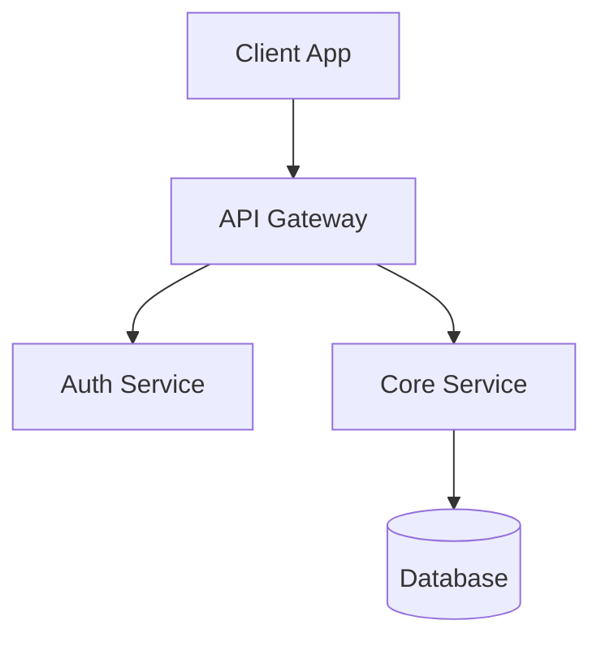



---

# P001 - Order Queue Screen Specification

> **Module**: PSP Operations Portal
> **Screen ID**: P001
> **Route**: `/psp/orders`
> **Version**: 1.0
> **Last Updated**: 2026-01-01
> **IEEE 830 Reference**: Section 3.2 - Functional Requirements
> **SUPP Reference**: SUPP-016 (Fulfillment - Order Processing)

---

## 1. Screen Overview

### 1.1 Purpose

The Order Queue screen provides PSP Production Operators with a centralized view of all store orders requiring fulfillment action. It enables order acknowledgment, status tracking, and drill-down access to order details for production processing.

### 1.2 Business Context

This screen serves as the primary work queue for PSP fulfillment operations. Orders flow from campaign assignments through to shipment, with this screen managing the critical handoff between order generation and production.

### 1.3 Screenshot Reference


### 1.4 Navigation Path

```
PSP Portal → Orders (sidebar) → /psp/orders
```

### 1.5 Related Screens

| Screen | Relationship |
|--------|--------------|
| [P002 Shipments](P002_Shipments.md) | Orders link to shipments after production |
| [P003 Issues](P003_Issues.md) | Issues may trigger reorders appearing in queue |

---

## 2. User Roles & Permissions

### 2.1 Authorized Roles

| Role | Access Level | Permissions |
|------|--------------|-------------|
| PLATFORM_ADMIN | Full | View all, update status, bulk actions |
| PSP_ADMIN | Full | View all, update status, bulk actions |
| PSP_OPS | Operational | View all, update status, bulk actions |
| Support Agent (PSP_OPS + support_scope) | Read-Only | View only, no status updates |

### 2.2 Permission Requirements

| Requirement ID | Description | Roles |
|----------------|-------------|-------|
| REQ-P001-SEC-001 | User SHALL be authenticated with valid JWT containing tenant_id | All |
| REQ-P001-SEC-002 | User SHALL have PSP-level role (PLATFORM_ADMIN, PSP_ADMIN, or PSP_OPS) | All |
| REQ-P001-SEC-003 | Support Agent users SHALL have read-only access when support_scope = true | PSP_OPS |
| REQ-P001-SEC-004 | All order data SHALL be scoped to user's tenant_id | All |

### 2.3 Data Scope

- **Tenant Isolation**: Orders filtered by JWT tenant_id
- **Brand Visibility**: All brands within tenant visible
- **Campaign Scope**: All campaigns across brands visible

---

## 3. UI Components

### 3.1 Component Inventory

| Component ID | Type | Description |
|--------------|------|-------------|
| P001-C001 | Page Header | Title, order counts by status |
| P001-C002 | Status Tabs | New, Acknowledged, All filter tabs |
| P001-C003 | Search Bar | Order ID, store number search |
| P001-C004 | Filter Panel | Brand, campaign, date range filters |
| P001-C005 | Order Table | Sortable data grid with order list |
| P001-C006 | Bulk Actions | Select-all, bulk acknowledge button |
| P001-C007 | Order Detail Panel | Side panel with full order information |
| P001-C008 | Pagination | Page navigation with count |
| P001-C009 | Status Badge | Color-coded order status indicator |

### 3.2 Layout Specification



### 3.3 Component Specifications

#### P001-C001: Page Header

| Property | Value |
|----------|-------|
| Title | "Order Queue" |
| Status Counts | Real-time counts by status enum |
| Refresh | Auto-refresh every 60 seconds |

#### P001-C005: Order Table

| Column | Field | Width | Sortable | Default Sort |
|--------|-------|-------|----------|--------------|
| Checkbox | selection | 40px | No | - |
| Order # | order_number | 120px | Yes | - |
| Brand | brand.name | 150px | Yes | - |
| Store | store.store_number | 120px | Yes | - |
| Items | line_count | 80px | Yes | - |
| Status | status | 120px | Yes | - |
| Age | created_at | 100px | Yes | DESC (default) |

---

## 4. Data Requirements

### 4.1 Entity Mapping

| Entity | Table | Purpose |
|--------|-------|---------|
| StoreOrder | store_orders | Primary order record |
| OrderLine | order_lines | Line items in order |
| Store | stores | Store information |
| Campaign | campaigns | Campaign reference |
| Brand | brands | Brand reference |
| KitItem | kit_items | Item details |

### 4.2 Data Query

```sql
SELECT
  so.id, so.order_number, so.status, so.created_at,
  so.psp_order_ref, so.order_type,
  s.store_number, s.name as store_name,
  c.name as campaign_name,
  b.name as brand_name,
  COUNT(ol.id) as line_count,
  SUM(ol.quantity) as total_quantity
FROM store_orders so
JOIN stores s ON so.store_id = s.id
JOIN campaigns c ON so.campaign_id = c.id
JOIN brands b ON c.brand_id = b.id
LEFT JOIN order_lines ol ON ol.order_id = so.id
WHERE so.tenant_id = :tenant_id
  AND so.deleted_at IS NULL
  AND so.status IN (:status_filter)
GROUP BY so.id, s.id, c.id, b.id
ORDER BY so.created_at DESC
LIMIT :page_size OFFSET :offset
```

### 4.3 Data Requirements Matrix

| Requirement ID | Description | Validation |
|----------------|-------------|------------|
| REQ-P001-DATA-001 | Order list SHALL display orders scoped to tenant | tenant_id filter |
| REQ-P001-DATA-002 | Order list SHALL exclude soft-deleted records | deleted_at IS NULL |
| REQ-P001-DATA-003 | Order age SHALL be calculated from created_at | Real-time calculation |
| REQ-P001-DATA-004 | Line count SHALL reflect active order lines only | COUNT with deleted_at filter |
| REQ-P001-DATA-005 | Status counts SHALL refresh on tab change | Query per status |

---

## 5. Business Rules & Validation

### 5.1 Order Status Rules

| Requirement ID | Rule | Enforcement |
|----------------|------|-------------|
| REQ-P001-BR-001 | Orders in GENERATED status SHALL appear in "New" tab | Status filter |
| REQ-P001-BR-002 | Orders in ACKNOWLEDGED status SHALL appear in "Acknowledged" tab | Status filter |
| REQ-P001-BR-003 | Only GENERATED orders SHALL be selectable for bulk acknowledge | UI disable |
| REQ-P001-BR-004 | Order status progression SHALL follow: GENERATED → ACKNOWLEDGED → IN_PRODUCTION → SHIPPED | State machine |
| REQ-P001-BR-005 | Acknowledge action SHALL set acknowledged_at timestamp | Backend logic |

### 5.2 Validation Rules

| Requirement ID | Field | Validation | Error Message |
|----------------|-------|------------|---------------|
| REQ-P001-VAL-001 | Order selection | At least one order selected for bulk action | "Select at least one order" |
| REQ-P001-VAL-002 | Status transition | Order must be in valid source status | "Order cannot be acknowledged from current status" |
| REQ-P001-VAL-003 | PSP Reference | Optional, max 50 characters | "PSP reference too long" |

### 5.3 Business Constraints

| Requirement ID | Constraint | Rationale |
|----------------|------------|-----------|
| REQ-P001-BC-001 | Orders SHALL be displayed FIFO (oldest first) in New tab | Production priority |
| REQ-P001-BC-002 | Bulk acknowledge SHALL process maximum 100 orders per request | Performance limit |
| REQ-P001-BC-003 | Order detail panel SHALL load within 500ms | UX requirement |

---

## 6. API Integration Points

### 6.1 API Endpoints

| Endpoint | Method | Purpose | Request | Response |
|----------|--------|---------|---------|----------|
| `/api/v1/orders` | GET | List orders | Query params | OrderDTO[] |
| `/api/v1/orders/{id}` | GET | Order detail | Path param | OrderDetailDTO |
| `/api/v1/orders/{id}/acknowledge` | POST | Acknowledge order | OrderAckRequest | OrderDTO |
| `/api/v1/orders/bulk-acknowledge` | POST | Bulk acknowledge | BulkAckRequest | BulkAckResponse |
| `/api/v1/orders/counts` | GET | Status counts | Query params | CountsDTO |

### 6.2 Request/Response Schemas

#### GET /api/v1/orders

**Request Parameters:**

| Parameter | Type | Required | Description |
|-----------|------|----------|-------------|
| status | string[] | No | Filter by status(es) |
| brand_id | uuid | No | Filter by brand |
| campaign_id | uuid | No | Filter by campaign |
| search | string | No | Search order_number, store_number |
| page | integer | No | Page number (default: 1) |
| page_size | integer | No | Items per page (default: 25, max: 100) |
| sort_by | string | No | Sort field |
| sort_order | string | No | ASC or DESC |

**Response Schema:**

```json
{
  "data": [
    {
      "id": "uuid",
      "order_number": "ORD-1234",
      "status": "GENERATED",
      "order_type": "INITIAL",
      "psp_order_ref": "PSP-REF-001",
      "created_at": "2025-12-15T10:30:00Z",
      "acknowledged_at": null,
      "store": {
        "id": "uuid",
        "store_number": "STR-001",
        "name": "Downtown Store"
      },
      "campaign": {
        "id": "uuid",
        "name": "Summer Promo"
      },
      "brand": {
        "id": "uuid",
        "name": "Acme Corp"
      },
      "line_count": 5,
      "total_quantity": 12
    }
  ],
  "pagination": {
    "page": 1,
    "page_size": 25,
    "total_items": 299,
    "total_pages": 12
  }
}
```

### 6.3 API Requirements

| Requirement ID | Description | Implementation |
|----------------|-------------|----------------|
| REQ-P001-API-001 | All API requests SHALL include Authorization header with JWT | Middleware |
| REQ-P001-API-002 | Bulk acknowledge SHALL use Idempotency-Key header | Request header |
| REQ-P001-API-003 | API responses SHALL include X-Request-ID for tracing | Response header |
| REQ-P001-API-004 | Rate limiting SHALL apply: 100 requests/minute per user | API gateway |

---

## 7. State Transitions

### 7.1 Order Status State Machine


### 7.2 State Transition Requirements

| Requirement ID | Transition | From | To | Trigger |
|----------------|------------|------|-----|---------|
| REQ-P001-ST-001 | Acknowledge | GENERATED | ACKNOWLEDGED | User action |
| REQ-P001-ST-002 | Start Production | ACKNOWLEDGED | IN_PRODUCTION | User action |
| REQ-P001-ST-003 | Cancel | Any (not CLOSED) | CANCELLED | User action with reason |
| REQ-P001-ST-004 | Ship | READY_TO_SHIP | SHIPPED/PARTIALLY_SHIPPED | Shipment creation |
| REQ-P001-ST-005 | Deliver | SHIPPED | DELIVERED | Carrier webhook |

### 7.3 Status Display Mapping

| Status | Badge Color | Display Text |
|--------|-------------|--------------|
| GENERATED | Yellow | New |
| ACKNOWLEDGED | Green | Acknowledged |
| IN_PRODUCTION | Blue | In Production |
| KITTING | Blue | Kitting |
| READY_TO_SHIP | Purple | Ready to Ship |
| PARTIALLY_SHIPPED | Orange | Partial Ship |
| SHIPPED | Blue | Shipped |
| DELIVERED | Gray | Delivered |
| CLOSED | Gray | Closed |
| CANCELLED | Red | Cancelled |

---

## 8. Error Handling

### 8.1 Error Scenarios

| Requirement ID | Error Scenario | HTTP Code | User Message | Recovery Action |
|----------------|----------------|-----------|--------------|-----------------|
| REQ-P001-ERR-001 | Unauthorized access | 401 | "Session expired. Please log in again." | Redirect to login |
| REQ-P001-ERR-002 | Forbidden action | 403 | "You don't have permission to perform this action." | Display message |
| REQ-P001-ERR-003 | Order not found | 404 | "Order not found." | Refresh list |
| REQ-P001-ERR-004 | Invalid status transition | 409 | "Order cannot be acknowledged from current status." | Refresh order |
| REQ-P001-ERR-005 | Bulk acknowledge partial failure | 207 | "X of Y orders acknowledged. Z failed." | Show failure details |
| REQ-P001-ERR-006 | Server error | 500 | "Something went wrong. Please try again." | Retry with backoff |
| REQ-P001-ERR-007 | Network timeout | - | "Connection lost. Retrying..." | Auto-retry 3x |

### 8.2 Error Display

| Component | Error Type | Display Method |
|-----------|------------|----------------|
| Page Load | API failure | Full-page error with retry button |
| Table | Empty results | "No orders match your filters" message |
| Bulk Action | Partial failure | Toast notification with details link |
| Detail Panel | Load failure | Panel error state with retry |

### 8.3 Logging Requirements

| Requirement ID | Event | Log Level | Data |
|----------------|-------|-----------|------|
| REQ-P001-LOG-001 | Page load | INFO | user_id, filters |
| REQ-P001-LOG-002 | Order acknowledge | INFO | user_id, order_id, prev_status |
| REQ-P001-LOG-003 | Bulk acknowledge | INFO | user_id, order_ids, success_count |
| REQ-P001-LOG-004 | Error | ERROR | error_code, message, stack_trace |

---

## 9. Accessibility Requirements

### 9.1 WCAG 2.1 AA Compliance

| Requirement ID | Guideline | Implementation |
|----------------|-----------|----------------|
| REQ-P001-A11Y-001 | 1.1.1 Non-text Content | All icons have aria-label |
| REQ-P001-A11Y-002 | 1.3.1 Info and Relationships | Table uses proper th/td semantics |
| REQ-P001-A11Y-003 | 1.4.1 Use of Color | Status uses color + text label |
| REQ-P001-A11Y-004 | 1.4.3 Contrast | 4.5:1 minimum contrast ratio |
| REQ-P001-A11Y-005 | 2.1.1 Keyboard | All actions accessible via keyboard |
| REQ-P001-A11Y-006 | 2.4.1 Bypass Blocks | Skip navigation link provided |
| REQ-P001-A11Y-007 | 2.4.7 Focus Visible | Clear focus indicators |
| REQ-P001-A11Y-008 | 4.1.2 Name, Role, Value | ARIA roles for custom components |

### 9.2 Keyboard Navigation

| Key | Action |
|-----|--------|
| Tab | Navigate between interactive elements |
| Enter | Activate button/link, open detail panel |
| Space | Toggle checkbox selection |
| Escape | Close detail panel |
| Arrow Up/Down | Navigate table rows |

### 9.3 Screen Reader Support

| Component | Announcement |
|-----------|--------------|
| Status Tabs | "New orders tab, 12 items" |
| Order Row | "Order ORD-1234, Acme Corp, Store STR-001, 5 items, New, 2 hours ago" |
| Bulk Action | "Acknowledge 5 selected orders button" |
| Status Change | "Order ORD-1234 acknowledged" (live region) |

---

## 10. Acceptance Criteria

### 10.1 Functional Acceptance Criteria

| Criteria ID | Description | Verification Method |
|-------------|-------------|---------------------|
| REQ-P001-AC-001 | Order queue displays all orders for user's tenant | Query verification |
| REQ-P001-AC-002 | Status tabs correctly filter orders by status | UI testing |
| REQ-P001-AC-003 | Search filters orders by order number and store number | UI testing |
| REQ-P001-AC-004 | Click on order row opens detail panel | UI testing |
| REQ-P001-AC-005 | Acknowledge button updates order status to ACKNOWLEDGED | API + DB verification |
| REQ-P001-AC-006 | Bulk acknowledge processes multiple orders | API + DB verification |
| REQ-P001-AC-007 | Status counts update after acknowledge action | UI verification |
| REQ-P001-AC-008 | Pagination correctly limits and navigates results | UI testing |
| REQ-P001-AC-009 | Table sorting works for all sortable columns | UI testing |
| REQ-P001-AC-010 | FIFO ordering maintained in New tab (oldest first) | Query verification |

### 10.2 Non-Functional Acceptance Criteria

| Criteria ID | Description | Target | Verification |
|-------------|-------------|--------|--------------|
| REQ-P001-AC-011 | Page load time | < 2 seconds | Performance testing |
| REQ-P001-AC-012 | Order detail panel load | < 500ms | Performance testing |
| REQ-P001-AC-013 | Bulk acknowledge (100 orders) | < 5 seconds | Performance testing |
| REQ-P001-AC-014 | WCAG 2.1 AA compliance | 100% | Accessibility audit |
| REQ-P001-AC-015 | Browser support | Chrome, Firefox, Edge, Safari | Cross-browser testing |

### 10.3 Traceability Matrix

| Requirement | Source | Test Case |
|-------------|--------|-----------|
| REQ-P001-FR-001 | SUPP-016 | TC-P001-001 |
| REQ-P001-SEC-001 | SUPP-003 | TC-P001-SEC-001 |
| REQ-P001-DATA-001 | 3.1 Database Model | TC-P001-DATA-001 |
| REQ-P001-API-001 | 3.4 Integration Architecture | TC-P001-API-001 |

---

## Appendix A: Revision History

| Version | Date | Author | Changes |
|---------|------|--------|---------|
| 1.0 | 2026-01-01 | System | Initial specification |

---

*Document Status: Complete*
*IEEE 830 Compliance: Section 3.2 - Functional Requirements*


---

# P002 - Shipments Screen Specification

> **Module**: PSP Operations Portal
> **Screen ID**: P002
> **Route**: `/psp/shipments`
> **Version**: 1.0
> **Last Updated**: 2026-01-01
> **IEEE 830 Reference**: Section 3.2 - Functional Requirements
> **SUPP Reference**: SUPP-016 (Fulfillment - Shipment Processing)

---

## 1. Screen Overview

### 1.1 Purpose

The Shipments screen enables PSP Production Operators to create, track, and manage shipments for fulfilled orders. It provides carrier integration, tracking number management, and delivery status monitoring across all active shipments.

### 1.2 Business Context

This screen represents the final fulfillment stage where completed orders are shipped to stores. Shipment creation triggers webhook events to external systems and updates order status automatically. Carrier tracking integration provides real-time delivery visibility.

### 1.3 Screenshot Reference


### 1.4 Navigation Path

```
PSP Portal → Shipments (sidebar) → /psp/shipments
```

### 1.5 Related Screens

| Screen | Relationship |
|--------|--------------|
| [P001 Order Queue](P001_Order_Queue.md) | Orders ready for shipment |
| [P003 Issues](P003_Issues.md) | Delivery exceptions may trigger issues |

---

## 2. User Roles & Permissions

### 2.1 Authorized Roles

| Role | Access Level | Permissions |
|------|--------------|-------------|
| PLATFORM_ADMIN | Full | View all, create/update shipments, void labels |
| PSP_ADMIN | Full | View all, create/update shipments, void labels |
| PSP_OPS | Operational | View all, create/update shipments |
| Support Agent (PSP_OPS + support_scope) | Read-Only | View only |

### 2.2 Permission Requirements

| Requirement ID | Description | Roles |
|----------------|-------------|-------|
| REQ-P002-SEC-001 | User SHALL be authenticated with valid JWT containing tenant_id | All |
| REQ-P002-SEC-002 | User SHALL have PSP-level role for shipment operations | All |
| REQ-P002-SEC-003 | Void label capability SHALL require PSP_ADMIN or higher | PSP_ADMIN, PLATFORM_ADMIN |
| REQ-P002-SEC-004 | Support Agent SHALL have read-only access | PSP_OPS (support_scope) |

### 2.3 Data Scope

- **Tenant Isolation**: Shipments filtered by JWT tenant_id
- **Order Linkage**: Only shipments for tenant's orders visible
- **Carrier Access**: Carrier credentials scoped to tenant

---

## 3. UI Components

### 3.1 Component Inventory

| Component ID | Type | Description |
|--------------|------|-------------|
| P002-C001 | Page Header | Title, shipment counts |
| P002-C002 | Status Tabs | In Transit, Delivered, Exception, All |
| P002-C003 | Search Bar | Tracking number, order number search |
| P002-C004 | Filter Panel | Carrier, date range, status filters |
| P002-C005 | Shipments Table | Sortable shipment list |
| P002-C006 | Create Shipment Button | Opens shipment creation modal |
| P002-C007 | Shipment Detail Panel | Side panel with tracking details |
| P002-C008 | Create Shipment Modal | Form for new shipment entry |
| P002-C009 | Tracking Link | External carrier tracking link |
| P002-C010 | Carrier Logo | Visual carrier identification |
| P002-C011 | Status Badge | Color-coded shipment status |

### 3.2 Layout Specification


### 3.3 Component Specifications

#### P002-C005: Shipments Table

| Column | Field | Width | Sortable | Default Sort |
|--------|-------|-------|----------|--------------|
| Tracking # | tracking_numbers[0] | 150px | Yes | - |
| Carrier | carrier | 100px | Yes | - |
| Order | order.order_number | 120px | Yes | - |
| Store | store.store_number | 100px | Yes | - |
| Status | status | 100px | Yes | - |
| ETA | estimated_delivery | 100px | Yes | - |
| Created | created_at | 120px | Yes | DESC (default) |

#### P002-C008: Create Shipment Modal


---

## 4. Data Requirements

### 4.1 Entity Mapping

| Entity | Table | Purpose |
|--------|-------|---------|
| Shipment | shipments | Shipment record |
| ShipmentLine | shipment_lines | Items in shipment |
| StoreOrder | store_orders | Parent order |
| OrderLine | order_lines | Order line items |
| Store | stores | Destination store |
| Campaign | campaigns | Campaign reference |

### 4.2 Data Query

```sql
SELECT
  sh.id, sh.carrier, sh.tracking_numbers, sh.status,
  sh.shipped_at, sh.estimated_delivery, sh.delivered_at,
  so.order_number,
  s.store_number, s.name as store_name,
  c.name as campaign_name,
  COUNT(sl.id) as line_count
FROM shipments sh
JOIN store_orders so ON sh.order_id = so.id
JOIN stores s ON so.store_id = s.id
JOIN campaigns c ON so.campaign_id = c.id
LEFT JOIN shipment_lines sl ON sl.shipment_id = sh.id
WHERE sh.tenant_id = :tenant_id
  AND sh.deleted_at IS NULL
  AND sh.status IN (:status_filter)
GROUP BY sh.id, so.id, s.id, c.id
ORDER BY sh.created_at DESC
LIMIT :page_size OFFSET :offset
```

### 4.3 Data Requirements Matrix

| Requirement ID | Description | Validation |
|----------------|-------------|------------|
| REQ-P002-DATA-001 | Shipment list SHALL be scoped to tenant | tenant_id filter |
| REQ-P002-DATA-002 | Tracking numbers SHALL be stored as JSON array | JSONB column |
| REQ-P002-DATA-003 | Carrier status SHALL sync from carrier API | Webhook/polling |
| REQ-P002-DATA-004 | Partial shipments SHALL track quantity_shipped per line | shipment_lines.quantity_shipped |
| REQ-P002-DATA-005 | ETA SHALL update from carrier tracking data | Carrier webhook |

---

## 5. Business Rules & Validation

### 5.1 Shipment Creation Rules

| Requirement ID | Rule | Enforcement |
|----------------|------|-------------|
| REQ-P002-BR-001 | Shipment SHALL only be created for orders in READY_TO_SHIP or later status | API validation |
| REQ-P002-BR-002 | Tracking number SHALL be unique across all shipments | Database constraint |
| REQ-P002-BR-003 | Quantity shipped SHALL NOT exceed quantity ordered minus already shipped | API validation |
| REQ-P002-BR-004 | At least one tracking number SHALL be provided | Form validation |
| REQ-P002-BR-005 | Carrier SHALL be one of: UPS, FEDEX, USPS, DHL, OTHER | Enum validation |

### 5.2 Validation Rules

| Requirement ID | Field | Validation | Error Message |
|----------------|-------|------------|---------------|
| REQ-P002-VAL-001 | order_id | Required, valid order | "Order is required" |
| REQ-P002-VAL-002 | carrier | Required, valid enum | "Carrier is required" |
| REQ-P002-VAL-003 | tracking_numbers | Required, array with 1+ items | "At least one tracking number required" |
| REQ-P002-VAL-004 | tracking_numbers[] | Format validation per carrier | "Invalid tracking number format for carrier" |
| REQ-P002-VAL-005 | quantity_shipped | Positive integer, <= remaining | "Quantity exceeds available" |

### 5.3 Carrier Tracking Format Validation

| Carrier | Format | Example |
|---------|--------|---------|
| UPS | 1Z + 16 alphanumeric | 1Z999AA10123456784 |
| FedEx | 12-22 digits | 748901234567 |
| USPS | 20-22 digits | 9400111899223456789012 |
| DHL | 10 digits | 1234567890 |

### 5.4 Business Constraints

| Requirement ID | Constraint | Rationale |
|----------------|------------|-----------|
| REQ-P002-BC-001 | Shipment creation SHALL trigger webhook event | External system sync |
| REQ-P002-BC-002 | Order status SHALL update to SHIPPED when all items shipped | Automatic transition |
| REQ-P002-BC-003 | Order status SHALL update to PARTIALLY_SHIPPED if partial | Automatic transition |
| REQ-P002-BC-004 | Delivered shipments SHALL NOT be editable | Data integrity |

---

## 6. API Integration Points

### 6.1 API Endpoints

| Endpoint | Method | Purpose | Request | Response |
|----------|--------|---------|---------|----------|
| `/api/v1/shipments` | GET | List shipments | Query params | ShipmentDTO[] |
| `/api/v1/shipments` | POST | Create shipment | CreateShipmentRequest | ShipmentDTO |
| `/api/v1/shipments/{id}` | GET | Shipment detail | Path param | ShipmentDetailDTO |
| `/api/v1/shipments/{id}` | PATCH | Update shipment | UpdateShipmentRequest | ShipmentDTO |
| `/api/v1/shipments/{id}/void` | POST | Void shipment | - | VoidResponse |
| `/api/v1/shipments/{id}/tracking` | GET | Tracking events | Path param | TrackingEventDTO[] |

### 6.2 Request/Response Schemas

#### POST /api/v1/shipments

**Request Schema:**

```json
{
  "order_id": "uuid",
  "carrier": "UPS",
  "tracking_numbers": ["1Z999AA10123456784"],
  "shipped_at": "2025-12-15T10:00:00Z",
  "lines": [
    {
      "order_line_id": "uuid",
      "quantity_shipped": 2
    }
  ]
}
```

**Response Schema:**

```json
{
  "id": "uuid",
  "carrier": "UPS",
  "tracking_numbers": ["1Z999AA10123456784"],
  "status": "LABEL_CREATED",
  "shipped_at": "2025-12-15T10:00:00Z",
  "estimated_delivery": null,
  "order": {
    "id": "uuid",
    "order_number": "ORD-1234"
  },
  "store": {
    "id": "uuid",
    "store_number": "STR-001"
  },
  "lines": [
    {
      "id": "uuid",
      "order_line_id": "uuid",
      "quantity_shipped": 2,
      "item_name": "Window Poster"
    }
  ],
  "created_at": "2025-12-15T10:00:00Z"
}
```

### 6.3 Webhook Events

| Event | Trigger | Payload |
|-------|---------|---------|
| shipment.created | New shipment created | ShipmentDTO |
| shipment.updated | Status/tracking updated | ShipmentDTO |
| shipment.delivered | Carrier confirms delivery | ShipmentDTO |
| shipment.exception | Delivery exception | ShipmentDTO + exception_reason |

### 6.4 Carrier Integration

| Requirement ID | Description | Implementation |
|----------------|-------------|----------------|
| REQ-P002-API-001 | System SHALL support UPS, FedEx, USPS, DHL tracking | Carrier API adapters |
| REQ-P002-API-002 | Tracking status SHALL poll every 4 hours | Background job |
| REQ-P002-API-003 | Carrier webhooks SHALL update status in real-time when available | Webhook receiver |
| REQ-P002-API-004 | Tracking link SHALL open carrier's tracking page | URL template per carrier |

### 6.5 API Requirements

| Requirement ID | Description | Implementation |
|----------------|-------------|----------------|
| REQ-P002-API-005 | All write operations SHALL use Idempotency-Key | Request header |
| REQ-P002-API-006 | Shipment creation SHALL emit webhook within 5 seconds | Async queue |
| REQ-P002-API-007 | Rate limiting SHALL apply: 50 requests/minute per user | API gateway |

---

## 7. State Transitions

### 7.1 Shipment Status State Machine


### 7.2 State Transition Requirements

| Requirement ID | Transition | From | To | Trigger |
|----------------|------------|------|-----|---------|
| REQ-P002-ST-001 | Pickup | LABEL_CREATED | IN_TRANSIT | Carrier scan |
| REQ-P002-ST-002 | Out for Delivery | IN_TRANSIT | OUT_FOR_DELIVERY | Carrier scan |
| REQ-P002-ST-003 | Deliver | IN_TRANSIT/OUT_FOR_DELIVERY | DELIVERED | Carrier confirmation |
| REQ-P002-ST-004 | Exception | IN_TRANSIT | EXCEPTION | Carrier exception event |
| REQ-P002-ST-005 | Return | IN_TRANSIT | RETURNED | Return to sender event |
| REQ-P002-ST-006 | Resolve | EXCEPTION | DELIVERED | Resolution + delivery |

### 7.3 Status Display Mapping

| Status | Badge Color | Display Text | Icon |
|--------|-------------|--------------|------|
| LABEL_CREATED | Gray | Label Created | Tag |
| IN_TRANSIT | Blue | In Transit | Truck |
| OUT_FOR_DELIVERY | Purple | Out for Delivery | MapPin |
| DELIVERED | Green | Delivered | CheckCircle |
| EXCEPTION | Red | Exception | AlertTriangle |
| RETURNED | Orange | Returned | RotateCcw |

---

## 8. Error Handling

### 8.1 Error Scenarios

| Requirement ID | Error Scenario | HTTP Code | User Message | Recovery Action |
|----------------|----------------|-----------|--------------|-----------------|
| REQ-P002-ERR-001 | Invalid order for shipment | 400 | "Order is not ready for shipment." | Show order status |
| REQ-P002-ERR-002 | Duplicate tracking number | 409 | "Tracking number already exists." | Clear field |
| REQ-P002-ERR-003 | Quantity exceeds available | 400 | "Quantity exceeds remaining items." | Show max available |
| REQ-P002-ERR-004 | Invalid tracking format | 400 | "Invalid tracking number format for carrier." | Show format hint |
| REQ-P002-ERR-005 | Carrier API unavailable | 503 | "Carrier tracking temporarily unavailable." | Retry later |
| REQ-P002-ERR-006 | Void failed | 400 | "Cannot void shipment in current status." | Show status |
| REQ-P002-ERR-007 | Order already fully shipped | 400 | "All items already shipped." | Show shipments |

### 8.2 Error Display

| Component | Error Type | Display Method |
|-----------|------------|----------------|
| Create Modal | Validation errors | Inline field errors |
| Create Modal | API errors | Banner at top of modal |
| Table | Load failure | Empty state with retry |
| Tracking | Carrier error | "Tracking unavailable" badge |

### 8.3 Logging Requirements

| Requirement ID | Event | Log Level | Data |
|----------------|-------|-----------|------|
| REQ-P002-LOG-001 | Shipment created | INFO | user_id, shipment_id, order_id |
| REQ-P002-LOG-002 | Tracking update | INFO | shipment_id, old_status, new_status |
| REQ-P002-LOG-003 | Carrier API call | DEBUG | carrier, tracking_number, response |
| REQ-P002-LOG-004 | Webhook sent | INFO | shipment_id, webhook_id, event_type |
| REQ-P002-LOG-005 | Error | ERROR | error_code, message, context |

---

## 9. Accessibility Requirements

### 9.1 WCAG 2.1 AA Compliance

| Requirement ID | Guideline | Implementation |
|----------------|-----------|----------------|
| REQ-P002-A11Y-001 | 1.1.1 Non-text Content | Carrier logos have alt text |
| REQ-P002-A11Y-002 | 1.3.1 Info and Relationships | Modal uses role="dialog" with aria-labelledby |
| REQ-P002-A11Y-003 | 1.4.1 Use of Color | Status uses color + icon + text |
| REQ-P002-A11Y-004 | 2.1.1 Keyboard | Modal traps focus when open |
| REQ-P002-A11Y-005 | 2.4.3 Focus Order | Logical tab order in modal |
| REQ-P002-A11Y-006 | 3.2.2 On Input | Form changes don't auto-submit |
| REQ-P002-A11Y-007 | 3.3.1 Error Identification | Errors associated with fields via aria-describedby |
| REQ-P002-A11Y-008 | 4.1.2 Name, Role, Value | Radio buttons properly grouped |

### 9.2 Keyboard Navigation

| Key | Action |
|-----|--------|
| Tab | Navigate between interactive elements |
| Enter | Activate button, submit modal |
| Space | Select radio button |
| Escape | Close modal, close detail panel |
| Arrow Keys | Navigate radio button group |

### 9.3 Screen Reader Support

| Component | Announcement |
|-----------|--------------|
| Create Modal | "Create Shipment dialog" |
| Carrier Radio | "UPS, radio button, 1 of 4" |
| Tracking Input | "Tracking number, required, text input" |
| Status Badge | "Status: In Transit" |
| Tracking Link | "Track shipment on UPS, opens in new tab" |

---

## 10. Acceptance Criteria

### 10.1 Functional Acceptance Criteria

| Criteria ID | Description | Verification Method |
|-------------|-------------|---------------------|
| REQ-P002-AC-001 | Shipment list displays all shipments for tenant | Query verification |
| REQ-P002-AC-002 | Status tabs filter by shipment status | UI testing |
| REQ-P002-AC-003 | Create Shipment button opens modal | UI testing |
| REQ-P002-AC-004 | Modal validates required fields before submission | UI testing |
| REQ-P002-AC-005 | Valid shipment creation saves to database | API + DB verification |
| REQ-P002-AC-006 | Shipment creation triggers webhook event | Webhook log verification |
| REQ-P002-AC-007 | Order status updates after shipment creation | DB verification |
| REQ-P002-AC-008 | Tracking link opens carrier tracking page | UI testing |
| REQ-P002-AC-009 | Partial shipment correctly updates remaining quantities | DB verification |
| REQ-P002-AC-010 | Duplicate tracking number is rejected | API testing |

### 10.2 Non-Functional Acceptance Criteria

| Criteria ID | Description | Target | Verification |
|-------------|-------------|--------|--------------|
| REQ-P002-AC-011 | Page load time | < 2 seconds | Performance testing |
| REQ-P002-AC-012 | Shipment creation | < 3 seconds | Performance testing |
| REQ-P002-AC-013 | Webhook emission | < 5 seconds after create | Log verification |
| REQ-P002-AC-014 | Carrier tracking sync | < 4 hour staleness | Monitoring |
| REQ-P002-AC-015 | WCAG 2.1 AA compliance | 100% | Accessibility audit |

### 10.3 Integration Acceptance Criteria

| Criteria ID | Description | Verification Method |
|-------------|-------------|---------------------|
| REQ-P002-AC-016 | UPS tracking numbers validated correctly | Unit testing |
| REQ-P002-AC-017 | FedEx tracking numbers validated correctly | Unit testing |
| REQ-P002-AC-018 | USPS tracking numbers validated correctly | Unit testing |
| REQ-P002-AC-019 | Carrier status updates received via webhook | Integration testing |
| REQ-P002-AC-020 | Delivery confirmation updates order status | Integration testing |

### 10.4 Traceability Matrix

| Requirement | Source | Test Case |
|-------------|--------|-----------|
| REQ-P002-BR-001 | SUPP-016 | TC-P002-001 |
| REQ-P002-SEC-001 | SUPP-003 | TC-P002-SEC-001 |
| REQ-P002-DATA-001 | 3.1 Database Model | TC-P002-DATA-001 |
| REQ-P002-API-001 | 3.4 Integration Architecture | TC-P002-API-001 |

---

## Appendix A: Revision History

| Version | Date | Author | Changes |
|---------|------|--------|---------|
| 1.0 | 2026-01-01 | System | Initial specification |

---

*Document Status: Complete*
*IEEE 830 Compliance: Section 3.2 - Functional Requirements*


---

# P003 - Issues Queue Screen Specification

> **Module**: PSP Operations Portal
> **Screen ID**: P003
> **Route**: `/psp/issues`
> **Version**: 1.0
> **Last Updated**: 2026-01-01
> **IEEE 830 Reference**: Section 3.2 - Functional Requirements
> **SUPP Reference**: SUPP-019 (Exception Management)

---

## 1. Screen Overview

### 1.1 Purpose

The Issues Queue screen provides PSP Production Operators with a centralized view of all reported issues requiring triage and resolution. It enables issue review, approval/rejection decisions, and reorder creation for valid claims.

### 1.2 Business Context

This screen manages the exception handling workflow for store-reported problems including missing items, damaged goods, wrong items, and quantity shortages. Approved issues flow into reorder creation and fulfillment, closing the loop on store satisfaction.

### 1.3 Screenshot Reference


### 1.4 Navigation Path

```
PSP Portal → Issues (sidebar) → /psp/issues
```

### 1.5 Related Screens

| Screen | Relationship |
|--------|--------------|
| [P001 Order Queue](P001_Order_Queue.md) | Reorders appear in order queue |
| [P002 Shipments](P002_Shipments.md) | Reorder shipments tracked here |
| M03 Receipt Survey (Mobile) | Store reports issues from this screen |

---

## 2. User Roles & Permissions

### 2.1 Authorized Roles

| Role | Access Level | Permissions |
|------|--------------|-------------|
| PLATFORM_ADMIN | Full | View, triage, approve/reject, create reorders |
| PSP_ADMIN | Full | View, triage, approve/reject, create reorders |
| PSP_OPS | Operational | View, triage, approve/reject (scoped), create reorders |
| Support Agent (PSP_OPS + support_scope) | Read-Only | View only |

### 2.2 Permission Requirements

| Requirement ID | Description | Roles |
|----------------|-------------|-------|
| REQ-P003-SEC-001 | User SHALL be authenticated with valid JWT containing tenant_id | All |
| REQ-P003-SEC-002 | User SHALL have PSP-level role for issue management | All |
| REQ-P003-SEC-003 | PSP_OPS MAY approve issues under configured threshold | PSP_OPS |
| REQ-P003-SEC-004 | PSP_ADMIN required for high-value issue approval | PSP_ADMIN, PLATFORM_ADMIN |
| REQ-P003-SEC-005 | Rejection SHALL require reason and explanation | All with approve rights |

### 2.3 Data Scope

- **Tenant Isolation**: Issues filtered by JWT tenant_id
- **Brand Visibility**: All brands within tenant visible
- **Store Access**: Issues from all stores visible

---

## 3. UI Components

### 3.1 Component Inventory

| Component ID | Type | Description |
|--------------|------|-------------|
| P003-C001 | Page Header | Title, issue counts by status |
| P003-C002 | Status Tabs | Open, Triaged, In Fulfillment, Resolved |
| P003-C003 | Search Bar | Issue ID, store number search |
| P003-C004 | Filter Panel | Type, campaign, date range filters |
| P003-C005 | Issues Table | Sortable issue list |
| P003-C006 | Issue Detail Panel | Side panel with full issue information |
| P003-C007 | Evidence Gallery | Photo viewer for issue evidence |
| P003-C008 | Triage Actions | Approve, Reject, Request Info buttons |
| P003-C009 | Reject Modal | Rejection reason form |
| P003-C010 | Reorder Button | Create replacement order |
| P003-C011 | Status Badge | Color-coded issue status |
| P003-C012 | Type Badge | Issue type indicator |

### 3.2 Layout Specification


### 3.3 Issue Detail Panel


### 3.4 Component Specifications

#### P003-C005: Issues Table

| Column | Field | Width | Sortable | Default Sort |
|--------|-------|-------|----------|--------------|
| Issue # | issue_number | 100px | Yes | - |
| Type | issue_type | 100px | Yes | - |
| Store | store.store_number | 100px | Yes | - |
| Item | kit_item.name | 150px | Yes | - |
| Campaign | campaign.name | 150px | Yes | - |
| Status | status | 100px | Yes | - |
| Age | created_at | 80px | Yes | ASC (FIFO) |

---

## 4. Data Requirements

### 4.1 Entity Mapping

| Entity | Table | Purpose |
|--------|-------|---------|
| IssueRequest | issue_requests | Issue record |
| IssueLine | issue_lines | Items in issue (if multiple) |
| AssignmentItem | assignment_items | Original assignment |
| KitItem | kit_items | Item details |
| StoreAssignment | store_assignments | Store/campaign context |
| Store | stores | Store information |
| Campaign | campaigns | Campaign reference |
| PhotoUpload | photo_uploads | Evidence photos |
| ReorderRequest | reorder_requests | Linked reorder (if created) |

### 4.2 Data Query

```sql
SELECT
  ir.id, ir.issue_number, ir.issue_type, ir.status,
  ir.description, ir.quantity_affected, ir.created_at,
  ir.triage_notes, ir.resolved_at, ir.resolution_type,
  ki.name as item_name, ki.sku,
  ai.quantity as qty_ordered,
  s.store_number, s.name as store_name,
  c.name as campaign_name,
  b.name as brand_name,
  (SELECT COUNT(*) FROM photo_uploads pu
   WHERE pu.reference_type = 'ISSUE'
   AND pu.reference_id = ir.id) as photo_count
FROM issue_requests ir
JOIN assignment_items ai ON ir.assignment_item_id = ai.id
JOIN kit_items ki ON ai.kit_item_id = ki.id
JOIN store_assignments sa ON ai.store_assignment_id = sa.id
JOIN stores s ON sa.store_id = s.id
JOIN campaigns c ON sa.campaign_id = c.id
JOIN brands b ON c.brand_id = b.id
WHERE ir.tenant_id = :tenant_id
  AND ir.deleted_at IS NULL
  AND ir.status IN (:status_filter)
ORDER BY ir.created_at ASC
LIMIT :page_size OFFSET :offset
```

### 4.3 Data Requirements Matrix

| Requirement ID | Description | Validation |
|----------------|-------------|------------|
| REQ-P003-DATA-001 | Issue list SHALL be scoped to tenant | tenant_id filter |
| REQ-P003-DATA-002 | Evidence photos SHALL be loaded on detail view | Lazy load |
| REQ-P003-DATA-003 | Issue age SHALL be calculated from created_at | Real-time |
| REQ-P003-DATA-004 | Related reorder SHALL be linked when created | FK reference |
| REQ-P003-DATA-005 | FIFO ordering SHALL prioritize oldest issues | ORDER BY created_at ASC |

---

## 5. Business Rules & Validation

### 5.1 Issue Type Rules

| Requirement ID | Issue Type | Auto-Approve Eligible | Requires Photo |
|----------------|------------|----------------------|----------------|
| REQ-P003-BR-001 | MISSING | Yes (if tracking shows delivered) | No |
| REQ-P003-BR-002 | DAMAGED | No (requires photo review) | Yes |
| REQ-P003-BR-003 | WRONG_ITEM | No (requires photo review) | Yes |
| REQ-P003-BR-004 | QUANTITY_SHORT | Yes (if < ordered qty) | No |

### 5.2 Triage Rules

| Requirement ID | Rule | Enforcement |
|----------------|------|-------------|
| REQ-P003-BR-005 | DAMAGED issues SHALL require at least one evidence photo | API validation |
| REQ-P003-BR-006 | Rejection SHALL require reason code and explanation | Form validation |
| REQ-P003-BR-007 | Approved issues SHALL be eligible for reorder creation | Status check |
| REQ-P003-BR-008 | Reorder creation SHALL transition issue to IN_FULFILLMENT | State machine |
| REQ-P003-BR-009 | Reorder delivery SHALL auto-resolve issue | Webhook trigger |

### 5.3 Validation Rules

| Requirement ID | Field | Validation | Error Message |
|----------------|-------|------------|---------------|
| REQ-P003-VAL-001 | triage_notes | Max 1000 characters | "Notes too long" |
| REQ-P003-VAL-002 | rejection_reason | Required for reject | "Rejection reason required" |
| REQ-P003-VAL-003 | rejection_explanation | Required for reject, 10+ chars | "Please provide explanation" |
| REQ-P003-VAL-004 | reorder_quantity | 1 to quantity_affected | "Invalid quantity" |

### 5.4 Rejection Reason Codes

| Code | Display | Description |
|------|---------|-------------|
| INSUFFICIENT_EVIDENCE | Insufficient evidence | Photos don't show claimed issue |
| ITEM_USABLE | Item appears usable | Damage doesn't affect display |
| OUTSIDE_WINDOW | Outside return window | Reported too late |
| DUPLICATE | Duplicate request | Already submitted |
| OTHER | Other | Free-form explanation required |

---

## 6. API Integration Points

### 6.1 API Endpoints

| Endpoint | Method | Purpose | Request | Response |
|----------|--------|---------|---------|----------|
| `/api/v1/issues` | GET | List issues | Query params | IssueDTO[] |
| `/api/v1/issues/{id}` | GET | Issue detail | Path param | IssueDetailDTO |
| `/api/v1/issues/{id}/triage` | POST | Triage decision | TriageRequest | IssueDTO |
| `/api/v1/issues/{id}/approve` | POST | Approve issue | ApproveRequest | IssueDTO |
| `/api/v1/issues/{id}/reject` | POST | Reject issue | RejectRequest | IssueDTO |
| `/api/v1/issues/{id}/request-info` | POST | Request more info | RequestInfoDTO | IssueDTO |
| `/api/v1/issues/{id}/reorder` | POST | Create reorder | ReorderRequest | ReorderDTO |
| `/api/v1/issues/{id}/photos` | GET | Evidence photos | Path param | PhotoDTO[] |
| `/api/v1/issues/counts` | GET | Status counts | Query params | CountsDTO |

### 6.2 Request/Response Schemas

#### POST /api/v1/issues/{id}/reject

**Request Schema:**

```json
{
  "reason_code": "INSUFFICIENT_EVIDENCE",
  "explanation": "Photos do not clearly show the reported damage. The item appears intact.",
  "notify_store": true
}
```

**Response Schema:**

```json
{
  "id": "uuid",
  "issue_number": "ISS-1042",
  "status": "REJECTED",
  "issue_type": "DAMAGED",
  "rejection": {
    "reason_code": "INSUFFICIENT_EVIDENCE",
    "explanation": "Photos do not clearly show the reported damage.",
    "rejected_by": "user@psp.com",
    "rejected_at": "2025-12-15T14:30:00Z"
  },
  "store_notified": true
}
```

#### POST /api/v1/issues/{id}/reorder

**Request Schema:**

```json
{
  "quantity": 1,
  "notes": "Replacement for damaged item",
  "priority": "NORMAL"
}
```

**Response Schema:**

```json
{
  "id": "uuid",
  "reorder_number": "REO-1042",
  "status": "PENDING",
  "issue_id": "uuid",
  "order": {
    "id": "uuid",
    "order_number": "ORD-1500",
    "status": "GENERATED"
  },
  "quantity": 1,
  "created_at": "2025-12-15T14:35:00Z"
}
```

### 6.3 Webhook Events

| Event | Trigger | Payload |
|-------|---------|---------|
| issue.submitted | Store submits issue | IssueDTO |
| issue.triaged | PSP triages issue | IssueDTO |
| issue.approved | PSP approves issue | IssueDTO |
| issue.rejected | PSP rejects issue | IssueDTO + rejection |
| issue.resolved | Reorder delivered | IssueDTO + resolution |

### 6.4 API Requirements

| Requirement ID | Description | Implementation |
|----------------|-------------|----------------|
| REQ-P003-API-001 | All decisions SHALL emit webhook events | Async queue |
| REQ-P003-API-002 | Reject SHALL notify store via email/push | Notification service |
| REQ-P003-API-003 | Reorder creation SHALL generate new order | Order service |
| REQ-P003-API-004 | Idempotency-Key required for all writes | Request header |

---

## 7. State Transitions

### 7.1 Issue Status State Machine


### 7.2 State Transition Requirements

| Requirement ID | Transition | From | To | Trigger |
|----------------|------------|------|-----|---------|
| REQ-P003-ST-001 | Triage | OPEN | TRIAGED | PSP reviews |
| REQ-P003-ST-002 | Approve | TRIAGED | APPROVED | PSP approves |
| REQ-P003-ST-003 | Reject | TRIAGED | REJECTED | PSP rejects |
| REQ-P003-ST-004 | Request Info | TRIAGED | AWAITING_INFO | Need more details |
| REQ-P003-ST-005 | Info Received | AWAITING_INFO | TRIAGED | Store responds |
| REQ-P003-ST-006 | Create Reorder | APPROVED | IN_FULFILLMENT | Reorder created |
| REQ-P003-ST-007 | Resolve | IN_FULFILLMENT | RESOLVED | Reorder delivered |
| REQ-P003-ST-008 | Deny Resolution | REJECTED | RESOLVED | Rejection finalized |

### 7.3 Status Display Mapping

| Status | Badge Color | Display Text | Icon |
|--------|-------------|--------------|------|
| OPEN | Yellow | Open | AlertCircle |
| TRIAGED | Green | Triaged | Eye |
| APPROVED | Green | Approved | CheckCircle |
| AWAITING_INFO | Orange | Awaiting Info | HelpCircle |
| IN_FULFILLMENT | Blue | In Fulfillment | Package |
| RESOLVED | Gray | Resolved | Check |
| REJECTED | Red | Rejected | XCircle |

### 7.4 Issue Type Display

| Type | Badge Color | Icon | Description |
|------|-------------|------|-------------|
| MISSING | Red | XCircle | Item not received |
| DAMAGED | Orange | AlertTriangle | Item unusable |
| WRONG_ITEM | Purple | HelpCircle | Different item received |
| QUANTITY_SHORT | Yellow | Minus | Fewer than expected |

---

## 8. Error Handling

### 8.1 Error Scenarios

| Requirement ID | Error Scenario | HTTP Code | User Message | Recovery Action |
|----------------|----------------|-----------|--------------|-----------------|
| REQ-P003-ERR-001 | Issue not found | 404 | "Issue not found." | Refresh list |
| REQ-P003-ERR-002 | Invalid status transition | 409 | "Cannot perform action on issue in current status." | Show current status |
| REQ-P003-ERR-003 | Rejection without reason | 400 | "Please select a rejection reason." | Highlight field |
| REQ-P003-ERR-004 | Reorder for unapproved issue | 400 | "Issue must be approved before creating reorder." | Show approve button |
| REQ-P003-ERR-005 | Duplicate reorder | 409 | "Reorder already exists for this issue." | Show reorder link |
| REQ-P003-ERR-006 | Photo load failed | 500 | "Unable to load evidence photos." | Retry button |
| REQ-P003-ERR-007 | Permission denied | 403 | "You don't have permission to approve this issue." | Show requirements |

### 8.2 Error Display

| Component | Error Type | Display Method |
|-----------|------------|----------------|
| Detail Panel | Load error | Panel error state |
| Triage Actions | Validation error | Button tooltip |
| Reject Modal | Form error | Inline field errors |
| Photo Gallery | Load error | Placeholder with retry |

### 8.3 Logging Requirements

| Requirement ID | Event | Log Level | Data |
|----------------|-------|-----------|------|
| REQ-P003-LOG-001 | Issue viewed | INFO | user_id, issue_id |
| REQ-P003-LOG-002 | Issue approved | INFO | user_id, issue_id, notes |
| REQ-P003-LOG-003 | Issue rejected | INFO | user_id, issue_id, reason_code |
| REQ-P003-LOG-004 | Reorder created | INFO | user_id, issue_id, reorder_id |
| REQ-P003-LOG-005 | Error | ERROR | error_code, message, context |

---

## 9. Accessibility Requirements

### 9.1 WCAG 2.1 AA Compliance

| Requirement ID | Guideline | Implementation |
|----------------|-----------|----------------|
| REQ-P003-A11Y-001 | 1.1.1 Non-text Content | Evidence photos have descriptive alt text |
| REQ-P003-A11Y-002 | 1.3.1 Info and Relationships | Panel sections use proper heading hierarchy |
| REQ-P003-A11Y-003 | 1.4.1 Use of Color | Status and type use color + text + icon |
| REQ-P003-A11Y-004 | 2.1.1 Keyboard | All actions accessible via keyboard |
| REQ-P003-A11Y-005 | 2.4.4 Link Purpose | Action buttons have descriptive labels |
| REQ-P003-A11Y-006 | 3.2.2 On Input | Modal actions require explicit submit |
| REQ-P003-A11Y-007 | 3.3.2 Labels | All form fields have visible labels |
| REQ-P003-A11Y-008 | 4.1.3 Status Messages | Status changes announced to screen readers |

### 9.2 Keyboard Navigation

| Key | Action |
|-----|--------|
| Tab | Navigate between interactive elements |
| Enter | Activate button, open detail panel |
| Escape | Close panel, close modal |
| Arrow Left/Right | Navigate photo gallery |
| Space | Toggle photo full-screen |

### 9.3 Screen Reader Support

| Component | Announcement |
|-----------|--------------|
| Issue Row | "Issue ISS-1042, Damaged, Store STR-001, Window Poster, Open, 2 hours ago" |
| Status Badge | "Status: Open" |
| Type Badge | "Issue type: Damaged" |
| Photo Gallery | "Evidence photo 1 of 2" |
| Action Buttons | "Approve issue button", "Reject issue button" |
| Status Change | "Issue ISS-1042 approved" (live region) |

---

## 10. Acceptance Criteria

### 10.1 Functional Acceptance Criteria

| Criteria ID | Description | Verification Method |
|-------------|-------------|---------------------|
| REQ-P003-AC-001 | Issues queue displays all active issues for tenant | Query verification |
| REQ-P003-AC-002 | Status tabs correctly filter issues by status | UI testing |
| REQ-P003-AC-003 | FIFO ordering shows oldest issues first | Query verification |
| REQ-P003-AC-004 | Click on issue row opens detail panel | UI testing |
| REQ-P003-AC-005 | Evidence photos load in detail panel | UI testing |
| REQ-P003-AC-006 | Approve button transitions issue to APPROVED | API + DB verification |
| REQ-P003-AC-007 | Reject requires reason code and explanation | UI testing |
| REQ-P003-AC-008 | Rejection sends notification to store | Notification verification |
| REQ-P003-AC-009 | Create Reorder generates new order | API + DB verification |
| REQ-P003-AC-010 | Reorder delivery auto-resolves issue | Integration testing |

### 10.2 Business Logic Acceptance Criteria

| Criteria ID | Description | Verification Method |
|-------------|-------------|---------------------|
| REQ-P003-AC-011 | DAMAGED issues require photo evidence | API validation testing |
| REQ-P003-AC-012 | MISSING issues may auto-approve if tracking confirms | Business rule testing |
| REQ-P003-AC-013 | Quantity in reorder does not exceed affected quantity | API validation testing |
| REQ-P003-AC-014 | Issue status follows defined state machine | State transition testing |
| REQ-P003-AC-015 | Resolved issues move to history tab | UI testing |

### 10.3 Non-Functional Acceptance Criteria

| Criteria ID | Description | Target | Verification |
|-------------|-------------|--------|--------------|
| REQ-P003-AC-016 | Page load time | < 2 seconds | Performance testing |
| REQ-P003-AC-017 | Detail panel load | < 500ms | Performance testing |
| REQ-P003-AC-018 | Photo gallery load | < 2 seconds | Performance testing |
| REQ-P003-AC-019 | WCAG 2.1 AA compliance | 100% | Accessibility audit |
| REQ-P003-AC-020 | Browser support | Chrome, Firefox, Edge, Safari | Cross-browser testing |

### 10.4 Traceability Matrix

| Requirement | Source | Test Case |
|-------------|--------|-----------|
| REQ-P003-BR-001 | SUPP-019 | TC-P003-001 |
| REQ-P003-SEC-001 | SUPP-003 | TC-P003-SEC-001 |
| REQ-P003-DATA-001 | 3.1 Database Model | TC-P003-DATA-001 |
| REQ-P003-API-001 | 3.4 Integration Architecture | TC-P003-API-001 |
| REQ-P003-ST-001 | SUPP-019 State Machine | TC-P003-ST-001 |

---

## Appendix A: Revision History

| Version | Date | Author | Changes |
|---------|------|--------|---------|
| 1.0 | 2026-01-01 | System | Initial specification |

---

*Document Status: Complete*
*IEEE 830 Compliance: Section 3.2 - Functional Requirements*

