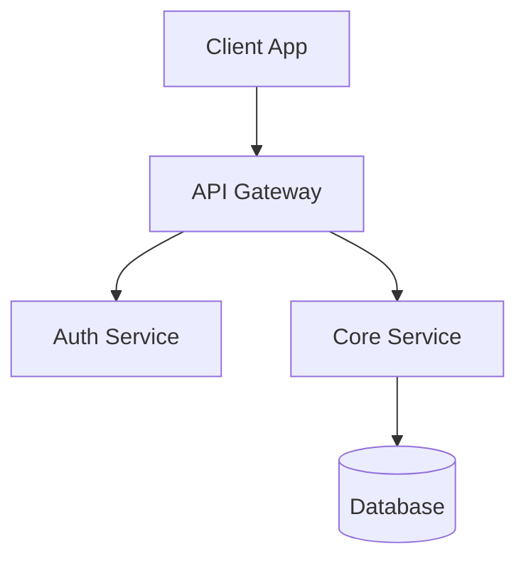
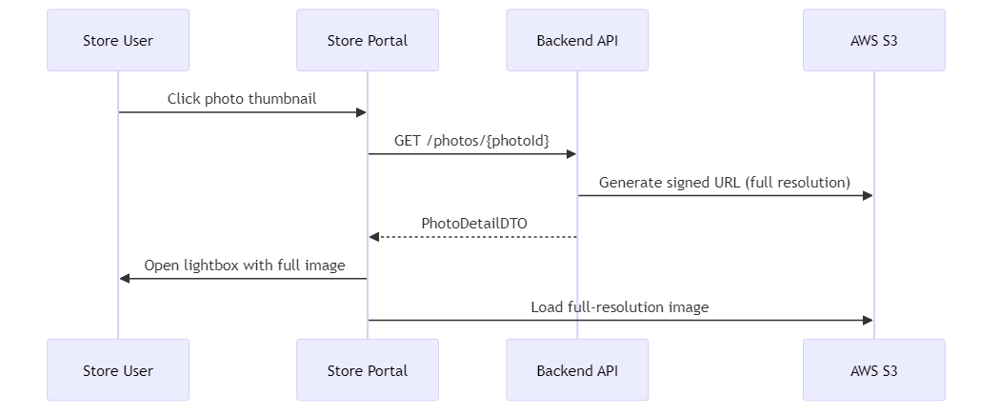
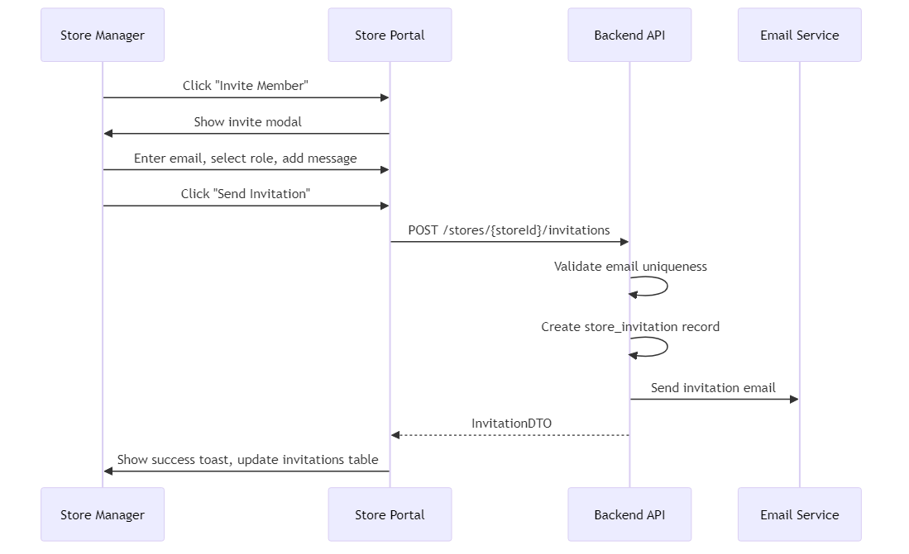



---

# S001 - Store Dashboard Screen Specification

> **Module**: StorePortal
> **Screen ID**: S001
> **Route**: `/store/dashboard`
> **Version**: 1.0
> **Last Updated**: 2026-01-01
> **IEEE 830 Compliance**: Section 3.2 - Functional Requirements

---

## 1. Screen Overview

### 1.1 Purpose

The Store Dashboard serves as the primary landing page for store personnel, providing a consolidated view of campaign status, pending actions, and key performance metrics. It enables store managers and operators to quickly assess their workload and navigate to priority tasks.

### 1.2 Screenshot Reference


### 1.3 Source References

| Document | Section |
|----------|---------|
| SUPP-001 | Persona Workflows - Store Level |
| Screen Spec | SOW/06_Screen_Specs/S01_Dashboard.md |
| Database Model | Section 3.1 - Store & Assignment Tables |

---

## 2. User Roles & Permissions

### 2.1 Authorized Roles

| Role | Access Level | Persona ID |
|------|--------------|------------|
| STORE_MANAGER | Full Access | P07 |
| STORE_OPERATOR | Limited Access | P08 |

### 2.2 Role-Based Display Rules

| Feature | STORE_MANAGER | STORE_OPERATOR |
|---------|---------------|----------------|
| View all store campaigns | Yes | Yes (assigned only) |
| View team activity section | Yes | No |
| Access team management link | Yes | No |
| View store reports link | Yes | No |
| View compliance rate KPI | Yes | No |
| Execute campaign tasks | Yes | Yes |

### 2.3 Permission Requirements

| Requirement ID | Description | Priority |
|----------------|-------------|----------|
| REQ-S001-SEC-001 | User must have active membership with store to access dashboard | Must |
| REQ-S001-SEC-002 | Dashboard data scoped to user's assigned store only | Must |
| REQ-S001-SEC-003 | STORE_OPERATOR sees only their own pending actions | Must |
| REQ-S001-SEC-004 | STORE_MANAGER sees all team members' pending actions | Must |

---

## 3. UI Components

### 3.1 Component Inventory

| Component ID | Component Name | Type | Description |
|--------------|----------------|------|-------------|
| S001-C001 | Page Header | Header | "Dashboard" title with store name |
| S001-C002 | KPI Cards Row | Card Grid | 4 key performance indicator cards |
| S001-C003 | Active Campaigns List | Data List | Expandable campaign entries |
| S001-C004 | Pending Actions Panel | Action List | Priority-sorted task list |
| S001-C005 | Recent Activity Feed | Timeline | Chronological activity stream |
| S001-C006 | Team Status Card | Summary Card | Team member overview (Manager only) |
| S001-C007 | Quick Actions Bar | Button Group | Primary navigation shortcuts |

### 3.2 KPI Cards Specification

| Card ID | Metric | Calculation | Visual |
|---------|--------|-------------|--------|
| KPI-001 | Active Campaigns | COUNT(assignments WHERE status NOT IN ['COMPLETE', 'WAIVED']) | Number badge |
| KPI-002 | Pending Actions | COUNT(actions WHERE status = 'PENDING') | Number with urgency color |
| KPI-003 | Completed This Month | COUNT(assignments WHERE completed_at >= first_of_month) | Number with trend arrow |
| KPI-004 | Compliance Rate | (on_time_completions / total_completions) * 100 | Percentage gauge |

### 3.3 Layout Structure



### 3.4 Component Requirements

| Requirement ID | Description | Priority |
|----------------|-------------|----------|
| REQ-S001-UI-001 | KPI cards must display loading skeleton during data fetch | Must |
| REQ-S001-UI-002 | Active campaigns list supports expand/collapse interaction | Must |
| REQ-S001-UI-003 | Pending actions sorted by urgency (due date ascending) | Must |
| REQ-S001-UI-004 | Recent activity shows last 10 events with relative timestamps | Should |
| REQ-S001-UI-005 | Team status card hidden for STORE_OPERATOR role | Must |
| REQ-S001-UI-006 | Dashboard auto-refreshes every 5 minutes | Should |

---

## 4. Data Requirements

### 4.1 Entity Dependencies

| Entity | Table Name | Fields Required | Relationship |
|--------|------------|-----------------|--------------|
| Store | stores | id, name, external_store_guid, status | Primary |
| StoreAssignment | store_assignments | id, campaign_id, store_id, status, pinned_layout_id | Many-to-One |
| Campaign | campaigns | id, name, install_start, install_end, status | Via Assignment |
| PhotoUpload | photo_uploads | id, assignment_item_id, review_status, created_at | Via Assignment |
| IssueRequest | issue_requests | id, store_assignment_id, status, created_at | Via Assignment |
| User | users | id, name, email, is_active | Via Membership |
| Membership | memberships | user_id, store_id, role | Join Table |

### 4.2 Data Query Specification

```sql
-- Dashboard aggregate query
SELECT
  s.id as store_id,
  s.name as store_name,
  COUNT(DISTINCT CASE WHEN sa.status NOT IN ('COMPLETE', 'WAIVED') THEN sa.id END) as active_campaigns,
  COUNT(DISTINCT CASE WHEN sa.status = 'COMPLETE'
    AND sa.completed_at >= DATE_TRUNC('month', NOW()) THEN sa.id END) as completed_this_month,
  (SELECT COUNT(*) FROM memberships m
   JOIN users u ON m.user_id = u.id
   WHERE m.store_id = s.id AND u.is_active = true) as active_team_members
FROM stores s
LEFT JOIN store_assignments sa ON sa.store_id = s.id AND sa.deleted_at IS NULL
WHERE s.id = :storeId AND s.deleted_at IS NULL
GROUP BY s.id, s.name
```

### 4.3 Data Requirements

| Requirement ID | Description | Priority |
|----------------|-------------|----------|
| REQ-S001-DATA-001 | All queries must filter by tenant_id from JWT | Must |
| REQ-S001-DATA-002 | Soft-deleted records excluded from all counts | Must |
| REQ-S001-DATA-003 | Campaign dates displayed in store's local timezone | Must |
| REQ-S001-DATA-004 | Activity feed limited to last 30 days | Should |

---

## 5. Business Rules & Validation

### 5.1 Display Rules

| Rule ID | Rule Description | Condition | Action |
|---------|------------------|-----------|--------|
| BR-S001-001 | Urgent action highlighting | Due date <= today | Display red badge |
| BR-S001-002 | Campaign phase badge | Based on StorePhase enum | Show appropriate status color |
| BR-S001-003 | Compliance rate threshold | Rate < 75% | Display warning indicator |
| BR-S001-004 | Empty state handling | No active campaigns | Show "No active campaigns" message |

### 5.2 StorePhase Display Mapping

| StorePhase | Display Label | Badge Color |
|------------|---------------|-------------|
| AWAITING_SHIPMENT | Awaiting Shipment | Gray |
| SHIPMENT_IN_TRANSIT | In Transit | Blue |
| READY_TO_RECEIVE | Ready to Receive | Yellow |
| RECEIVING | Receiving | Yellow |
| READY_TO_INSTALL | Ready to Install | Orange |
| INSTALLING | Installing | Orange |
| PENDING_REVIEW | Pending Review | Purple |
| COMPLETE | Complete | Green |
| NEEDS_ATTENTION | Needs Attention | Red |
| WAIVED | Waived | Gray |

### 5.3 Business Rule Requirements

| Requirement ID | Description | Priority |
|----------------|-------------|----------|
| REQ-S001-BR-001 | Campaigns sorted by install_end date (earliest first) | Must |
| REQ-S001-BR-002 | NEEDS_ATTENTION status triggers visual alert | Must |
| REQ-S001-BR-003 | Pending actions derive from incomplete workflow steps | Must |
| REQ-S001-BR-004 | Completed campaigns remain visible for 30 days post-completion | Should |

---

## 6. API Integration Points

### 6.1 API Endpoints

| Endpoint | Method | Purpose | Response |
|----------|--------|---------|----------|
| `/api/stores/{storeId}/dashboard` | GET | Fetch dashboard aggregate data | DashboardDTO |
| `/api/stores/{storeId}/assignments` | GET | List active assignments | Assignment[] |
| `/api/stores/{storeId}/activity` | GET | Recent activity feed | ActivityEvent[] |

### 6.2 Request/Response Specifications

#### GET /api/stores/{storeId}/dashboard

**Request Headers:**
```
Authorization: Bearer {jwt_token}
X-Tenant-ID: {tenant_uuid}
```

**Response Schema:**
```json
{
  "store": {
    "id": "uuid",
    "name": "string",
    "externalGuid": "string"
  },
  "metrics": {
    "activeCampaigns": "number",
    "pendingActions": "number",
    "completedThisMonth": "number",
    "complianceRate": "number"
  },
  "campaigns": [
    {
      "id": "uuid",
      "name": "string",
      "phase": "StorePhase",
      "installStart": "ISO8601",
      "installEnd": "ISO8601",
      "pendingTasks": ["string"]
    }
  ],
  "recentActivity": [
    {
      "id": "uuid",
      "type": "string",
      "actor": "string",
      "description": "string",
      "timestamp": "ISO8601"
    }
  ],
  "teamStatus": {
    "activeMembers": "number",
    "pendingInvitations": "number"
  }
}
```

### 6.3 API Requirements

| Requirement ID | Description | Priority |
|----------------|-------------|----------|
| REQ-S001-API-001 | Dashboard endpoint returns within 500ms | Must |
| REQ-S001-API-002 | Response includes cache headers (max-age: 60) | Should |
| REQ-S001-API-003 | 404 returned if store not found or user lacks access | Must |
| REQ-S001-API-004 | teamStatus omitted from response for STORE_OPERATOR | Must |

---

## 7. State Transitions

### 7.1 Dashboard Load States


### 7.2 State Descriptions

| State | Description | UI Behavior |
|-------|-------------|-------------|
| INITIAL | Component mounted | Show loading skeleton |
| LOADING | API request in flight | Display skeleton, disable interactions |
| LOADED | Data successfully retrieved | Render dashboard components |
| ERROR | API request failed | Show error message with retry button |
| REFRESHING | Background data refresh | Subtle loading indicator, data remains visible |

### 7.3 State Requirements

| Requirement ID | Description | Priority |
|----------------|-------------|----------|
| REQ-S001-STATE-001 | Loading state displays within 100ms of navigation | Must |
| REQ-S001-STATE-002 | Error state provides actionable retry option | Must |
| REQ-S001-STATE-003 | Refreshing state does not interrupt user interaction | Must |

---

## 8. Error Handling

### 8.1 Error Scenarios

| Error Code | Scenario | User Message | Recovery Action |
|------------|----------|--------------|-----------------|
| 401 | Unauthorized/expired token | "Session expired. Please log in again." | Redirect to login |
| 403 | No store access | "You don't have access to this store." | Redirect to store selector |
| 404 | Store not found | "Store not found." | Redirect to store selector |
| 500 | Server error | "Unable to load dashboard. Please try again." | Show retry button |
| NETWORK | Connection failed | "Connection lost. Check your internet." | Show retry with offline indicator |

### 8.2 Partial Load Handling

| Component | Failure Behavior |
|-----------|------------------|
| KPI Cards | Show "--" placeholder, log error |
| Campaign List | Show empty state with error message |
| Activity Feed | Show "Unable to load activity" |
| Team Status | Hide component, log error |

### 8.3 Error Requirements

| Requirement ID | Description | Priority |
|----------------|-------------|----------|
| REQ-S001-ERR-001 | All API errors logged with correlation ID | Must |
| REQ-S001-ERR-002 | User-facing errors do not expose technical details | Must |
| REQ-S001-ERR-003 | Retry attempts use exponential backoff | Should |
| REQ-S001-ERR-004 | Partial failures do not block entire dashboard | Should |

---

## 9. Accessibility Requirements

### 9.1 WCAG 2.1 AA Compliance

| Requirement ID | WCAG Criterion | Implementation |
|----------------|----------------|----------------|
| REQ-S001-A11Y-001 | 1.1.1 Non-text Content | Alt text for all status icons and badges |
| REQ-S001-A11Y-002 | 1.3.1 Info and Relationships | Semantic HTML structure with proper headings |
| REQ-S001-A11Y-003 | 1.4.3 Contrast | Minimum 4.5:1 contrast for all text |
| REQ-S001-A11Y-004 | 2.1.1 Keyboard | All interactive elements keyboard accessible |
| REQ-S001-A11Y-005 | 2.4.4 Link Purpose | Descriptive link text for all navigation |
| REQ-S001-A11Y-006 | 4.1.2 Name, Role, Value | ARIA labels for dynamic content regions |

### 9.2 Screen Reader Support

| Component | ARIA Implementation |
|-----------|---------------------|
| KPI Cards | role="status", aria-live="polite" for updates |
| Campaign List | role="list", aria-expanded for expandable items |
| Pending Actions | role="list", aria-describedby for urgency |
| Activity Feed | role="feed", aria-busy during refresh |

### 9.3 Keyboard Navigation

| Key | Action |
|-----|--------|
| Tab | Move between interactive elements |
| Enter/Space | Activate focused element |
| Arrow Down | Expand campaign details |
| Arrow Up | Collapse campaign details |
| Escape | Close any open panels |

---

## 10. Acceptance Criteria

### 10.1 Functional Requirements

| Requirement ID | Description | Test Criteria | Priority |
|----------------|-------------|---------------|----------|
| REQ-S001-FR-001 | Dashboard displays 4 KPI cards | All 4 metrics visible with correct values | Must |
| REQ-S001-FR-002 | Active campaigns list shows current assignments | List matches database query results | Must |
| REQ-S001-FR-003 | Pending actions sorted by urgency | Earliest due date appears first | Must |
| REQ-S001-FR-004 | Campaign cards expand to show details | Click expands, shows tasks and dates | Must |
| REQ-S001-FR-005 | Recent activity shows last 10 events | Events display with relative timestamps | Should |
| REQ-S001-FR-006 | Team status visible to STORE_MANAGER only | Component hidden for STORE_OPERATOR | Must |
| REQ-S001-FR-007 | Dashboard auto-refreshes every 5 minutes | Data updates without page reload | Should |
| REQ-S001-FR-008 | Quick actions navigate to correct screens | Each action links to proper route | Must |
| REQ-S001-FR-009 | Campaign click navigates to campaign detail | Route: /store/campaigns/{id} | Must |
| REQ-S001-FR-010 | Empty state displayed when no campaigns | Message shown when list is empty | Must |

### 10.2 Non-Functional Requirements

| Requirement ID | Description | Metric | Priority |
|----------------|-------------|--------|----------|
| REQ-S001-NFR-001 | Page load time | < 2 seconds on 3G connection | Must |
| REQ-S001-NFR-002 | API response time | < 500ms for dashboard endpoint | Must |
| REQ-S001-NFR-003 | Mobile responsiveness | Renders correctly on 320px viewport | Must |
| REQ-S001-NFR-004 | Offline indicator | Displays when connection lost | Should |

### 10.3 Traceability Matrix

| Requirement | Source Document | Section |
|-------------|-----------------|---------|
| REQ-S001-FR-001 | S01_Dashboard.md | UI Components |
| REQ-S001-FR-002 | S01_Dashboard.md | Active Campaigns |
| REQ-S001-SEC-001 | SUPP-003 | Store Level Permissions |
| REQ-S001-DATA-001 | 3.1_Database_Model.md | Multi-Tenancy Model |

---

## Document History

| Version | Date | Author | Changes |
|---------|------|--------|---------|
| 1.0 | 2026-01-01 | System | Initial SRS specification |

---

*Document Status: Complete*
*IEEE 830 Compliance: Section 3.2 - Functional Requirements*


---

# S002 - Campaign History Screen Specification

> **Module**: StorePortal
> **Screen ID**: S002
> **Route**: `/store/campaigns`
> **Version**: 1.0
> **Last Updated**: 2026-01-01
> **IEEE 830 Compliance**: Section 3.2 - Functional Requirements

---

## 1. Screen Overview

### 1.1 Purpose

The Campaign History screen provides store personnel with a comprehensive view of all campaign assignments, both active and completed. Users can filter by status, view detailed campaign information, track execution progress, and access historical campaign data for compliance and audit purposes.

### 1.2 Screenshot Reference


### 1.3 Source References

| Document | Section |
|----------|---------|
| SUPP-001 | Persona Workflows - Store Level |
| Screen Spec | SOW/06_Screen_Specs/S02_Campaign_History.md |
| Database Model | Section 3.1 - Campaign & Assignment Tables |

---

## 2. User Roles & Permissions

### 2.1 Authorized Roles

| Role | Access Level | Persona ID |
|------|--------------|------------|
| STORE_MANAGER | Full Access | P07 |
| STORE_OPERATOR | View + Execute | P08 |

### 2.2 Role-Based Capabilities

| Capability | STORE_MANAGER | STORE_OPERATOR |
|------------|---------------|----------------|
| View all store campaigns | Yes | Yes (assigned only) |
| View campaign details | Yes | Yes |
| Export campaign list | Yes | No |
| View all team submissions | Yes | Own submissions only |
| Access campaign analytics | Yes | No |

### 2.3 Permission Requirements

| Requirement ID | Description | Priority |
|----------------|-------------|----------|
| REQ-S002-SEC-001 | User must have active store membership | Must |
| REQ-S002-SEC-002 | Campaign list scoped to user's assigned store | Must |
| REQ-S002-SEC-003 | STORE_OPERATOR limited to assigned campaigns only | Should |
| REQ-S002-SEC-004 | Export functionality restricted to STORE_MANAGER | Must |

---

## 3. UI Components

### 3.1 Component Inventory

| Component ID | Component Name | Type | Description |
|--------------|----------------|------|-------------|
| S002-C001 | Page Header | Header | "Campaigns" with filter controls |
| S002-C002 | Status Tabs | Tab Bar | Active, Completed, All filters |
| S002-C003 | Campaign List | Data Table | Sortable campaign entries |
| S002-C004 | Search Bar | Input | Campaign name/ID search |
| S002-C005 | Detail Panel | Slide Panel | Expandable campaign details |
| S002-C006 | Phase Badge | Status Badge | StorePhase indicator |
| S002-C007 | Progress Bar | Progress | Visual completion indicator |
| S002-C008 | Export Button | Button | CSV download trigger |
| S002-C009 | Empty State | Message | No campaigns message |

### 3.2 Layout Structure


### 3.3 Component Requirements

| Requirement ID | Description | Priority |
|----------------|-------------|----------|
| REQ-S002-UI-001 | Campaign list supports column sorting | Must |
| REQ-S002-UI-002 | Status tabs filter list dynamically without page reload | Must |
| REQ-S002-UI-003 | Detail panel slides in from right on row click | Must |
| REQ-S002-UI-004 | Progress bar reflects actual task completion percentage | Must |
| REQ-S002-UI-005 | Search filters by campaign name or external ID | Should |
| REQ-S002-UI-006 | List displays 20 items per page with pagination | Must |

---

## 4. Data Requirements

### 4.1 Entity Dependencies

| Entity | Table Name | Fields Required | Relationship |
|--------|------------|-----------------|--------------|
| StoreAssignment | store_assignments | id, campaign_id, store_id, status, pinned_layout_id, completed_at | Primary |
| Campaign | campaigns | id, name, code, install_start, install_end, status | Many-to-One |
| AssignmentItem | assignment_items | id, assignment_id, kit_item_id, slot_id | One-to-Many |
| KitItem | kit_items | id, name, sku, quantity | Via AssignmentItem |
| PhotoUpload | photo_uploads | id, assignment_item_id, review_status | Via AssignmentItem |
| ReceiveVerification | receive_verifications | id, assignment_id, verified_at | One-to-One |
| CompletionAttestation | completion_attestations | id, assignment_id, attested_by | One-to-One |

### 4.2 Data Query Specification

```sql
-- Campaign list query
SELECT
  sa.id as assignment_id,
  sa.status as phase,
  sa.completed_at,
  c.id as campaign_id,
  c.name as campaign_name,
  c.code as campaign_code,
  c.install_start,
  c.install_end,
  COUNT(DISTINCT ai.id) as total_items,
  COUNT(DISTINCT CASE WHEN pu.review_status = 'APPROVED' THEN pu.id END) as approved_photos,
  CASE WHEN rv.id IS NOT NULL THEN true ELSE false END as received,
  CASE WHEN ca.id IS NOT NULL THEN true ELSE false END as completed
FROM store_assignments sa
JOIN campaigns c ON sa.campaign_id = c.id
LEFT JOIN assignment_items ai ON ai.store_assignment_id = sa.id
LEFT JOIN photo_uploads pu ON pu.assignment_item_id = ai.id
LEFT JOIN receive_verifications rv ON rv.store_assignment_id = sa.id
LEFT JOIN completion_attestations ca ON ca.store_assignment_id = sa.id
WHERE sa.store_id = :storeId
  AND sa.deleted_at IS NULL
  AND c.deleted_at IS NULL
GROUP BY sa.id, c.id, rv.id, ca.id
ORDER BY c.install_end DESC
```

### 4.3 Data Requirements

| Requirement ID | Description | Priority |
|----------------|-------------|----------|
| REQ-S002-DATA-001 | Campaigns ordered by install_end date descending | Must |
| REQ-S002-DATA-002 | Include item counts and photo statistics per assignment | Must |
| REQ-S002-DATA-003 | Soft-deleted records excluded from all queries | Must |
| REQ-S002-DATA-004 | Completed campaigns retained for 2 years | Should |

---

## 5. Business Rules & Validation

### 5.1 Status Tab Filtering

| Tab | Filter Condition | StorePhase Values Included |
|-----|------------------|---------------------------|
| Active | status NOT IN ('COMPLETE', 'WAIVED') | AWAITING_SHIPMENT, SHIPMENT_IN_TRANSIT, READY_TO_RECEIVE, RECEIVING, READY_TO_INSTALL, INSTALLING, PENDING_REVIEW, NEEDS_ATTENTION, REOPENED |
| Completed | status IN ('COMPLETE', 'WAIVED') | COMPLETE, WAIVED |
| All | No filter | All values |

### 5.2 StorePhase Status Display

| StorePhase | Display Label | Badge Color | Icon |
|------------|---------------|-------------|------|
| AWAITING_SHIPMENT | Awaiting Shipment | Gray | clock |
| SHIPMENT_IN_TRANSIT | In Transit | Blue | truck |
| READY_TO_RECEIVE | Ready to Receive | Yellow | package |
| RECEIVING | Receiving | Yellow | package-open |
| READY_TO_INSTALL | Ready to Install | Orange | tools |
| INSTALLING | Installing | Orange | hammer |
| PENDING_REVIEW | Pending Review | Purple | eye |
| COMPLETE | Complete | Green | check-circle |
| NEEDS_ATTENTION | Needs Attention | Red | alert-triangle |
| WAIVED | Waived | Gray | skip-forward |
| REOPENED | Reopened | Orange | refresh |

### 5.3 Progress Calculation

| Component | Weight | Calculation |
|-----------|--------|-------------|
| Shipment Received | 10% | receive_verification EXISTS |
| Pre-install Survey | 10% | survey_response EXISTS WHERE type='PRE_INSTALL' |
| All Items Installed | 50% | all assignment_items have status='INSTALLED' |
| All Photos Approved | 20% | all required photos have review_status='APPROVED' |
| Completion Survey | 10% | completion_attestation EXISTS |

### 5.4 Business Rule Requirements

| Requirement ID | Description | Priority |
|----------------|-------------|----------|
| REQ-S002-BR-001 | NEEDS_ATTENTION campaigns highlighted with alert icon | Must |
| REQ-S002-BR-002 | Overdue campaigns (past install_end) show warning indicator | Must |
| REQ-S002-BR-003 | Progress percentage rounds to nearest whole number | Should |
| REQ-S002-BR-004 | WAIVED campaigns show reason in detail panel | Should |

---

## 6. API Integration Points

### 6.1 API Endpoints

| Endpoint | Method | Purpose | Response |
|----------|--------|---------|----------|
| `/api/stores/{storeId}/assignments` | GET | List campaign assignments | Assignment[] |
| `/api/assignments/{id}` | GET | Get assignment details | AssignmentDetail |
| `/api/stores/{storeId}/assignments/export` | GET | Export campaign list as CSV | File download |

### 6.2 Request/Response Specifications

#### GET /api/stores/{storeId}/assignments

**Query Parameters:**
| Parameter | Type | Required | Description |
|-----------|------|----------|-------------|
| status | string | No | Filter: active, completed, all |
| search | string | No | Search by name/code |
| page | number | No | Page number (default: 1) |
| limit | number | No | Items per page (default: 20) |

**Response Schema:**
```json
{
  "data": [
    {
      "id": "uuid",
      "campaignId": "uuid",
      "campaignName": "string",
      "campaignCode": "string",
      "phase": "StorePhase",
      "installStart": "ISO8601",
      "installEnd": "ISO8601",
      "progress": "number",
      "itemCount": "number",
      "photoStats": {
        "required": "number",
        "uploaded": "number",
        "approved": "number"
      },
      "completedAt": "ISO8601 | null"
    }
  ],
  "pagination": {
    "page": "number",
    "limit": "number",
    "total": "number",
    "pages": "number"
  }
}
```

#### GET /api/assignments/{id}

**Query Parameters:**
| Parameter | Type | Required | Description |
|-----------|------|----------|-------------|
| include | string | No | Comma-separated: items,photos,tasks |

**Response Schema:**
```json
{
  "id": "uuid",
  "campaign": {
    "id": "uuid",
    "name": "string",
    "code": "string",
    "installStart": "ISO8601",
    "installEnd": "ISO8601"
  },
  "phase": "StorePhase",
  "progress": "number",
  "tasks": [
    {
      "name": "string",
      "status": "pending | complete",
      "completedAt": "ISO8601 | null"
    }
  ],
  "items": [
    {
      "id": "uuid",
      "name": "string",
      "sku": "string",
      "quantity": "number",
      "slotCode": "string",
      "photoCount": "number",
      "photoApproved": "boolean"
    }
  ],
  "receiveVerification": {
    "verifiedAt": "ISO8601",
    "verifiedBy": "string"
  },
  "completionAttestation": {
    "attestedAt": "ISO8601",
    "attestedBy": "string"
  }
}
```

### 6.3 API Requirements

| Requirement ID | Description | Priority |
|----------------|-------------|----------|
| REQ-S002-API-001 | List endpoint returns within 500ms | Must |
| REQ-S002-API-002 | Detail endpoint returns within 300ms | Must |
| REQ-S002-API-003 | Export generates CSV within 10 seconds | Should |
| REQ-S002-API-004 | Pagination required for lists > 20 items | Must |

---

## 7. State Transitions

### 7.1 Page States


### 7.2 State Descriptions

| State | Description | UI Behavior |
|-------|-------------|-------------|
| LOADING | Initial data fetch | Show skeleton loader |
| LOADED | Data displayed | Full list visible |
| FILTERING | Tab or search change | Update list, maintain position |
| DETAIL_OPEN | Row expanded | Slide panel visible |
| EXPORTING | CSV generation | Show progress, disable export button |
| ERROR | API failure | Show error message, retry option |

### 7.3 State Requirements

| Requirement ID | Description | Priority |
|----------------|-------------|----------|
| REQ-S002-STATE-001 | Tab changes update URL query parameter | Should |
| REQ-S002-STATE-002 | Detail panel state preserved on tab change | Should |
| REQ-S002-STATE-003 | Export state shows progress indicator | Must |

---

## 8. Error Handling

### 8.1 Error Scenarios

| Error Code | Scenario | User Message | Recovery Action |
|------------|----------|--------------|-----------------|
| 401 | Unauthorized | "Session expired" | Redirect to login |
| 403 | No access | "You don't have access to this store" | Redirect to store selector |
| 404 | Campaign not found | "Campaign not found" | Remove from list, show toast |
| 500 | Server error | "Unable to load campaigns" | Retry button |
| EXPORT_FAIL | Export generation failed | "Export failed. Please try again." | Retry button |

### 8.2 Validation Errors

| Scenario | Handling |
|----------|----------|
| Invalid date range | Show inline error, reset to defaults |
| Search no results | Show "No campaigns found" empty state |
| Page out of bounds | Redirect to last valid page |

### 8.3 Error Requirements

| Requirement ID | Description | Priority |
|----------------|-------------|----------|
| REQ-S002-ERR-001 | Failed export shows error toast | Must |
| REQ-S002-ERR-002 | Network errors display retry option | Must |
| REQ-S002-ERR-003 | Invalid campaign removed from list gracefully | Should |

---

## 9. Accessibility Requirements

### 9.1 WCAG 2.1 AA Compliance

| Requirement ID | WCAG Criterion | Implementation |
|----------------|----------------|----------------|
| REQ-S002-A11Y-001 | 1.3.1 Info and Relationships | Table uses proper th/td structure |
| REQ-S002-A11Y-002 | 1.4.1 Use of Color | Status not conveyed by color alone |
| REQ-S002-A11Y-003 | 2.1.1 Keyboard | Tab navigation through all controls |
| REQ-S002-A11Y-004 | 2.4.3 Focus Order | Logical focus order in detail panel |
| REQ-S002-A11Y-005 | 4.1.1 Parsing | Valid HTML, no duplicate IDs |
| REQ-S002-A11Y-006 | 4.1.2 Name, Role, Value | ARIA labels for status badges |

### 9.2 Screen Reader Support

| Component | ARIA Implementation |
|-----------|---------------------|
| Campaign Table | role="grid" with sortable column headers |
| Status Badge | aria-label="Status: {phase}" |
| Progress Bar | role="progressbar", aria-valuenow, aria-valuemin, aria-valuemax |
| Detail Panel | role="dialog", aria-modal="true" |
| Tabs | role="tablist" with aria-selected |

### 9.3 Keyboard Navigation

| Key | Action |
|-----|--------|
| Tab | Move between interactive elements |
| Enter | Open campaign detail / activate button |
| Escape | Close detail panel |
| Arrow Left/Right | Switch between status tabs |
| Arrow Up/Down | Navigate table rows |

---

## 10. Acceptance Criteria

### 10.1 Functional Requirements

| Requirement ID | Description | Test Criteria | Priority |
|----------------|-------------|---------------|----------|
| REQ-S002-FR-001 | Campaign list displays all store assignments | List matches database records | Must |
| REQ-S002-FR-002 | Active tab shows only in-progress campaigns | Filter excludes COMPLETE/WAIVED | Must |
| REQ-S002-FR-003 | Completed tab shows finished campaigns | Filter includes only COMPLETE/WAIVED | Must |
| REQ-S002-FR-004 | Search filters by campaign name | Real-time filtering as user types | Must |
| REQ-S002-FR-005 | Row click opens detail panel | Panel slides in from right | Must |
| REQ-S002-FR-006 | Detail panel shows all tasks | Checklist with completion status | Must |
| REQ-S002-FR-007 | Progress bar reflects actual completion | Percentage matches calculation | Must |
| REQ-S002-FR-008 | Export generates CSV file | File downloads with correct data | Must |
| REQ-S002-FR-009 | Status badges use correct colors | Colors match StorePhase mapping | Must |
| REQ-S002-FR-010 | Pagination works for large lists | Previous/next navigate correctly | Must |
| REQ-S002-FR-011 | Overdue campaigns show warning | Visual indicator for past install_end | Should |
| REQ-S002-FR-012 | Empty state shown when no campaigns | Message displayed for empty list | Must |

### 10.2 Non-Functional Requirements

| Requirement ID | Description | Metric | Priority |
|----------------|-------------|--------|----------|
| REQ-S002-NFR-001 | Page load time | < 2 seconds | Must |
| REQ-S002-NFR-002 | Search response time | < 300ms | Must |
| REQ-S002-NFR-003 | Export completion | < 10 seconds for 1000 campaigns | Should |
| REQ-S002-NFR-004 | Mobile responsive | Works on 320px viewport | Must |

### 10.3 Traceability Matrix

| Requirement | Source Document | Section |
|-------------|-----------------|---------|
| REQ-S002-FR-001 | S02_Campaign_History.md | Data Model Map |
| REQ-S002-FR-005 | S02_Campaign_History.md | Expanded Detail Panel |
| REQ-S002-SEC-001 | SUPP-003 | Store Level Permissions |
| REQ-S002-DATA-001 | 3.1_Database_Model.md | Store Assignments |

---

## Document History

| Version | Date | Author | Changes |
|---------|------|--------|---------|
| 1.0 | 2026-01-01 | System | Initial SRS specification |

---

*Document Status: Complete*
*IEEE 830 Compliance: Section 3.2 - Functional Requirements*


---

# S003 Photo Gallery - Screen Specification

> **SRS Section**: 5.9.3 | **Module**: Store Portal | **Version**: 1.0
> **IEEE 830 Reference**: Section 3.2 - Functional Requirements
> **Source Documents**:
> - [S03 Photo Gallery Screen Spec](../../../../06_Screen_Specs/S03_Photo_Gallery.md)
> - [SUPP-018 Photo Review](../../../../02_SUPPs/SUPP-018_Photo_Review.md)
> - [SUPP-037 Store Surveys](../../../../02_SUPPs/SUPP-037_Store_Surveys.md)
> **Last Updated**: 2026-01-01

---

## 1. Screen Overview

### 1.1 Purpose

The Photo Gallery screen provides store personnel with a centralized view of all installation proof photos submitted for their store. It enables browsing, filtering, and reviewing photo upload history across campaigns, with detailed status visibility for approved, pending, rejected, and superseded photos.

### 1.2 Route Configuration

| Attribute | Value |
|-----------|-------|
| **Route Path** | `/store/photos` |
| **Route Type** | Protected (Authentication Required) |
| **Lazy Loading** | Yes |
| **Mobile Support** | Full Responsive |

### 1.3 Screen Context

| Attribute | Description |
|-----------|-------------|
| **Primary Purpose** | Browse and review all store photo submissions |
| **Entry Points** | Store Dashboard quick link, Campaign History photo link |
| **Exit Points** | Dashboard, Campaign History, Photo Capture (mobile) |
| **Session Scope** | Store context from authenticated membership |

### 1.4 Screenshot Reference


---

## 2. User Roles & Permissions

### 2.1 Authorized Roles

| Role | Access Level | Restrictions |
|------|--------------|--------------|
| STORE_MANAGER (P07) | Full Access | Own store photos only |
| STORE_OPERATOR (P08) | Read Access | Own store photos only |

### 2.2 Permission Requirements

| Permission | STORE_MANAGER | STORE_OPERATOR |
|------------|:-------------:|:--------------:|
| View photo gallery | Y | Y |
| View photo details/lightbox | Y | Y |
| Download individual photos | Y | Y |
| Download bulk photos | Y | N |
| View rejection reasons | Y | Y |
| View admin comments | Y | Y |
| Filter by team member | Y | N |

### 2.3 Data Scoping Rules

| Rule ID | Description |
|---------|-------------|
| REQ-S003-SEC-001 | Photos filtered to authenticated user's store via store_assignments.store_id |
| REQ-S003-SEC-002 | Store membership validated from JWT token claims |
| REQ-S003-SEC-003 | Cross-store photo access blocked at API and database layers |

---

## 3. UI Components

### 3.1 Component Hierarchy


### 3.2 Component Specifications

| Component | Type | Description | Requirements |
|-----------|------|-------------|--------------|
| PageHeader | Container | Title and status summary | REQ-S003-UI-001 |
| StatusSummary | Display | Shows counts by review status | REQ-S003-UI-002 |
| FilterBar | Form | Filter controls for gallery | REQ-S003-UI-003 |
| ViewToggle | Button Group | Grid/List view switch | REQ-S003-UI-004 |
| PhotoGrid | Gallery | Thumbnail card grid | REQ-S003-UI-005 |
| PhotoCard | Card | Individual photo thumbnail | REQ-S003-UI-006 |
| PhotoList | Table | Tabular photo listing | REQ-S003-UI-007 |
| LightboxModal | Modal | Full-size photo viewer | REQ-S003-UI-008 |
| PhotoInfoPanel | Panel | Photo metadata display | REQ-S003-UI-009 |

### 3.3 Photo Card Layout


### 3.4 Status Overlay Specifications

| Status | Icon | Background Color | Text Color |
|--------|------|------------------|------------|
| PENDING | `⏳` | `amber-100` | `amber-800` |
| APPROVED | `✓` | `green-100` | `green-800` |
| REJECTED | `❌` | `red-100` | `red-800` |
| SUPERSEDED | `🔄` | `gray-100` | `gray-600` |

---

## 4. Data Requirements

### 4.1 API Endpoints

| Endpoint | Method | Purpose | Request |
|----------|--------|---------|---------|
| `/stores/{storeId}/photos` | GET | Fetch photo gallery | Query params |
| `/photos/{photoId}` | GET | Get photo details | Path param |
| `/photos/download` | POST | Bulk download | Photo ID array |

### 4.2 Request Parameters

**GET /stores/{storeId}/photos**

| Parameter | Type | Required | Description |
|-----------|------|----------|-------------|
| storeId | UUID | Yes | Store identifier (path) |
| campaign_id | UUID | No | Filter by campaign |
| status | Enum | No | PhotoReviewStatus filter |
| date_from | Date | No | Start date filter |
| date_to | Date | No | End date filter |
| item_type | Enum[] | No | Kit item type filter |
| uploaded_by | UUID | No | Uploader user ID |
| page | Integer | No | Page number (default: 1) |
| limit | Integer | No | Results per page (default: 24) |

### 4.3 Response Schema

```typescript
interface PhotoGalleryResponse {
  photos: PhotoUploadDTO[];
  meta: {
    total: number;
    page: number;
    limit: number;
    hasMore: boolean;
  };
  summary: {
    approved: number;
    pending: number;
    rejected: number;
    superseded: number;
  };
}

interface PhotoUploadDTO {
  id: string;                          // UUID
  file_url: string;                    // S3 signed URL
  thumbnail_url: string;               // S3 signed thumbnail URL
  review_status: PhotoReviewStatus;    // Enum
  created_at: string;                  // ISO 8601

  // Related data
  item_name: string;                   // KitItem.name
  item_type: ItemType;                 // KitItem.item_type
  slot_name: string | null;            // LocationSlot.name
  campaign_id: string;                 // Campaign.id
  campaign_name: string;               // Campaign.name
  uploaded_by: string;                 // User.id
  uploader_name: string;               // User.name

  // Review data (if reviewed)
  rejection_reason?: RejectionReasonCode;
  admin_comment?: string;
  reviewed_at?: string;
  reviewer_name?: string;

  // Superseded link
  superseded_by_id?: string;           // Replacement photo ID
}
```

### 4.4 Database Query

```sql
SELECT
  pu.id,
  pu.file_url,
  pu.thumbnail_url,
  pu.review_status,
  pu.created_at,
  ki.name as item_name,
  ki.item_type,
  ls.name as slot_name,
  c.id as campaign_id,
  c.name as campaign_name,
  u.id as uploaded_by,
  u.name as uploader_name,
  pr.rejection_reason,
  pr.admin_comment,
  pr.created_at as reviewed_at,
  rev.name as reviewer_name,
  pu.superseded_by_id
FROM photo_uploads pu
JOIN assignment_items ai ON pu.assignment_item_id = ai.id
JOIN kit_items ki ON ai.kit_item_id = ki.id
LEFT JOIN location_slots ls ON ai.location_slot_id = ls.id
JOIN store_assignments sa ON ai.store_assignment_id = sa.id
JOIN campaigns c ON sa.campaign_id = c.id
JOIN users u ON pu.uploaded_by = u.id
LEFT JOIN photo_reviews pr ON pr.photo_upload_id = pu.id
  AND pr.id = (SELECT id FROM photo_reviews WHERE photo_upload_id = pu.id ORDER BY created_at DESC LIMIT 1)
LEFT JOIN users rev ON pr.reviewer_id = rev.id
WHERE sa.store_id = :storeId
  AND pu.deleted_at IS NULL
  AND sa.deleted_at IS NULL
ORDER BY pu.created_at DESC
LIMIT :limit OFFSET :offset
```

### 4.5 Caching Strategy

| Data Type | Cache Duration | Invalidation Trigger |
|-----------|----------------|---------------------|
| Photo list | 5 minutes | New photo upload, status change |
| Photo thumbnails | 24 hours | Photo superseded |
| Status summary | 5 minutes | Any photo status change |

---

## 5. Business Rules & Validation

### 5.1 Display Rules

| Rule ID | Rule Description |
|---------|------------------|
| REQ-S003-BR-001 | Photos ordered by created_at descending (newest first) |
| REQ-S003-BR-002 | Superseded photos displayed with gray overlay and link to replacement |
| REQ-S003-BR-003 | Rejected photos show rejection reason and admin comment |
| REQ-S003-BR-004 | Default view is Grid; user preference persisted in localStorage |
| REQ-S003-BR-005 | Default filter shows photos from last 90 days |

### 5.2 Filter Rules

| Rule ID | Rule Description |
|---------|------------------|
| REQ-S003-BR-006 | Campaign filter shows only campaigns with photos for this store |
| REQ-S003-BR-007 | Date filter options: Last 7 days, Last 30 days, Last 90 days, Custom range |
| REQ-S003-BR-008 | Item type filter shows only types present in store's photos |
| REQ-S003-BR-009 | Uploaded By filter visible only to Store Manager |
| REQ-S003-BR-010 | Multiple filters combine with AND logic |

### 5.3 Lightbox Rules

| Rule ID | Rule Description |
|---------|------------------|
| REQ-S003-BR-011 | Lightbox opens on photo card click or keyboard Enter |
| REQ-S003-BR-012 | Lightbox displays full-resolution image with zoom capability |
| REQ-S003-BR-013 | Info panel shows all photo metadata and review details |
| REQ-S003-BR-014 | Rejected photos show replacement photo preview if superseded |
| REQ-S003-BR-015 | Navigation arrows cycle through filtered photo set |

### 5.4 Download Rules

| Rule ID | Rule Description |
|---------|------------------|
| REQ-S003-BR-016 | Individual photo download available from lightbox |
| REQ-S003-BR-017 | Bulk download requires Store Manager role |
| REQ-S003-BR-018 | Bulk download creates ZIP archive with naming convention |
| REQ-S003-BR-019 | Download filename format: `{campaign}_{item}_{date}.{ext}` |

---

## 6. API Integration Points

### 6.1 Gallery Data Flow


### 6.2 Lightbox Data Flow



### 6.3 Integration Dependencies

| System | Integration | Purpose |
|--------|-------------|---------|
| AWS S3 | Signed URLs | Secure photo access |
| Photo Review Service | Status data | Review status and comments |
| Campaign Service | Campaign data | Campaign names and filters |

---

## 7. State Transitions

### 7.1 Photo Review Status States


### 7.2 Status Transition Rules

| From State | To State | Trigger | Actor |
|------------|----------|---------|-------|
| PENDING | APPROVED | Photo approved | Brand Admin, Campaign Manager, Regional Manager |
| PENDING | REJECTED | Photo rejected | Brand Admin, Campaign Manager, Regional Manager |
| REJECTED | SUPERSEDED | Retake photo uploaded | Store User |
| PENDING | SUPERSEDED | New photo replaces before review | Store User |

### 7.3 View State Management

| State | Persisted | Storage |
|-------|-----------|---------|
| View mode (Grid/List) | Yes | localStorage |
| Active filters | No | URL query params |
| Lightbox position | No | Component state |
| Scroll position | No | Component state |

---

## 8. Error Handling

### 8.1 Error Scenarios

| Error Code | Scenario | User Message | Recovery Action |
|------------|----------|--------------|-----------------|
| ERR-S003-001 | Photos API failure | "Unable to load photos. Please try again." | Retry button |
| ERR-S003-002 | Photo not found | "Photo no longer available." | Remove from view, refresh |
| ERR-S003-003 | Thumbnail load failure | Display placeholder | Auto-retry with fallback |
| ERR-S003-004 | Signed URL expired | "Photo link expired." | Auto-refresh URL |
| ERR-S003-005 | Download failure | "Download failed. Please try again." | Retry button |
| ERR-S003-006 | Bulk download timeout | "Download is taking longer than expected." | Background job with notification |
| ERR-S003-007 | Invalid filter combination | "No photos match your filters." | Clear filters option |

### 8.2 Loading States

| State | Display |
|-------|---------|
| Initial load | Skeleton grid with 24 placeholder cards |
| Filter change | Inline loading indicator |
| Load more | Loading spinner below grid |
| Lightbox loading | Blur backdrop with spinner |
| Download processing | Progress indicator with cancel option |

### 8.3 Empty States

| Condition | Message | Action |
|-----------|---------|--------|
| No photos for store | "No photos have been submitted yet." | Link to active campaigns |
| No photos match filters | "No photos match your current filters." | Clear filters button |
| All photos superseded | "All photos have been replaced." | Show superseded toggle |

---

## 9. Accessibility Requirements

### 9.1 WCAG 2.1 AA Compliance

| Requirement ID | Requirement | Implementation |
|----------------|-------------|----------------|
| REQ-S003-A11Y-001 | Keyboard navigation | Full grid navigation with arrow keys |
| REQ-S003-A11Y-002 | Focus management | Visible focus indicators on all interactive elements |
| REQ-S003-A11Y-003 | Screen reader support | Alt text on all images, ARIA labels on controls |
| REQ-S003-A11Y-004 | Lightbox keyboard control | Escape to close, arrows to navigate |
| REQ-S003-A11Y-005 | Status announcements | Live region for filter result counts |
| REQ-S003-A11Y-006 | Color independence | Status indicated by icon and text, not color alone |

### 9.2 Keyboard Shortcuts

| Key | Action | Context |
|-----|--------|---------|
| `Tab` | Move focus between elements | Page |
| `Enter` | Open photo lightbox | Photo card focus |
| `Escape` | Close lightbox | Lightbox open |
| `←` / `→` | Navigate photos | Lightbox open |
| `D` | Download current photo | Lightbox open |

### 9.3 Screen Reader Announcements

| Trigger | Announcement |
|---------|--------------|
| Gallery load | "Photo gallery loaded. {count} photos. {approved} approved, {pending} pending review." |
| Filter applied | "Showing {count} photos matching filters." |
| Lightbox open | "Photo viewer. {item_name} from {campaign_name}. Status: {status}. Use arrow keys to navigate." |
| Photo navigation | "Photo {current} of {total}. {item_name}. Status: {status}." |

---

## 10. Acceptance Criteria

### 10.1 Functional Requirements

| ID | Requirement | Priority | Verification |
|----|-------------|----------|--------------|
| REQ-S003-FR-001 | Gallery displays all photos for authenticated user's store | Must | Test |
| REQ-S003-FR-002 | Grid view shows photo thumbnails with status overlay | Must | Test |
| REQ-S003-FR-003 | List view displays tabular photo data | Must | Test |
| REQ-S003-FR-004 | Campaign filter narrows results to selected campaign | Must | Test |
| REQ-S003-FR-005 | Status filter shows only photos with selected status | Must | Test |
| REQ-S003-FR-006 | Date filter limits results to date range | Must | Test |
| REQ-S003-FR-007 | Clicking photo opens lightbox with full-size image | Must | Test |
| REQ-S003-FR-008 | Lightbox displays complete photo metadata | Must | Test |
| REQ-S003-FR-009 | Rejected photos show rejection reason and admin comment | Must | Test |
| REQ-S003-FR-010 | Superseded photos link to replacement photo | Must | Test |
| REQ-S003-FR-011 | Download button exports individual photo | Should | Test |
| REQ-S003-FR-012 | Bulk download exports selected photos as ZIP | Should | Test |
| REQ-S003-FR-013 | Lightbox navigation with arrow keys and buttons | Must | Test |
| REQ-S003-FR-014 | Infinite scroll or load more pagination | Should | Test |

### 10.2 Non-Functional Requirements

| ID | Requirement | Target | Verification |
|----|-------------|--------|--------------|
| REQ-S003-NFR-001 | Gallery initial load < 2 seconds | P95 | Performance test |
| REQ-S003-NFR-002 | Thumbnail load < 500ms per image | P95 | Performance test |
| REQ-S003-NFR-003 | Full-size image load < 3 seconds | P95 | Performance test |
| REQ-S003-NFR-004 | Filter response < 1 second | P95 | Performance test |
| REQ-S003-NFR-005 | Support galleries with 500+ photos | Required | Load test |
| REQ-S003-NFR-006 | Mobile responsive layout | Required | Visual test |

### 10.3 Security Requirements

| ID | Requirement | Verification |
|----|-------------|--------------|
| REQ-S003-SEC-001 | Only authenticated store members can view gallery | Penetration test |
| REQ-S003-SEC-002 | Cross-store photo access prevented | Security test |
| REQ-S003-SEC-003 | S3 signed URLs expire after 1 hour | Configuration test |
| REQ-S003-SEC-004 | Download requests logged in audit trail | Audit test |

---

## 11. Traceability Matrix

| Requirement | Source | SUPP Reference | Test Case |
|-------------|--------|----------------|-----------|
| REQ-S003-FR-001 | S03 Screen Spec | SUPP-018 | TC-S003-001 |
| REQ-S003-FR-002 | S03 Screen Spec | SUPP-018 | TC-S003-002 |
| REQ-S003-FR-007 | S03 Screen Spec | SUPP-018 | TC-S003-007 |
| REQ-S003-FR-009 | S03 Screen Spec | SUPP-018 | TC-S003-009 |
| REQ-S003-SEC-001 | Permission Matrix | SUPP-003 | TC-S003-SEC-001 |

---

## 12. Related Screens

| Screen | Relationship | Navigation |
|--------|--------------|------------|
| [S001 Dashboard](S001_Dashboard.md) | Parent | Back link |
| [S002 Campaign History](S002_Campaign_History.md) | Sibling | Campaign filter |
| [M05 Photo Capture](../../../10_Module_MobileApp/screens/M005_Photo_Capture.md) | Input | Photo upload source |
| [B07 Verification](../../../08_Module_BrandPortal/screens/B007_Verification.md) | Related | Brand review photos |

---

*Document Status: Complete*
*IEEE 830 Compliance: Section 3.2 - Specific Requirements / Functional Requirements*


---

# S004 Team Management - Screen Specification

> **SRS Section**: 5.9.4 | **Module**: Store Portal | **Version**: 1.0
> **IEEE 830 Reference**: Section 3.2 - Functional Requirements
> **Source Documents**:
> - [S04 Team Management Screen Spec](../../../../06_Screen_Specs/S04_Team_Management.md)
> - [SUPP-001 Personas](../../../../02_SUPPs/Shared_Foundations/SUPP-001_Personas.md)
> - [SUPP-003 RBAC](../../../../02_SUPPs/Shared_Foundations/SUPP-003_RBAC.md)
> **Last Updated**: 2026-01-01

---

## 1. Screen Overview

### 1.1 Purpose

The Team Management screen enables Store Managers to administer their store's team members, including inviting new users, managing roles, tracking activity metrics, and removing access. This screen is restricted to Store Manager role only.

### 1.2 Route Configuration

| Attribute | Value |
|-----------|-------|
| **Route Path** | `/store/team` |
| **Route Type** | Protected (Authentication Required) |
| **Role Restriction** | STORE_MANAGER only |
| **Lazy Loading** | Yes |
| **Mobile Support** | Full Responsive |

### 1.3 Screen Context

| Attribute | Description |
|-----------|-------------|
| **Primary Purpose** | Manage store team membership and permissions |
| **Entry Points** | Store Dashboard navigation, Dashboard team widget |
| **Exit Points** | Dashboard, Reports |
| **Session Scope** | Store context from authenticated membership |

### 1.4 Screenshot Reference


---

## 2. User Roles & Permissions

### 2.1 Authorized Roles

| Role | Access Level | Restrictions |
|------|--------------|--------------|
| STORE_MANAGER (P07) | Full Access | Own store team only |
| STORE_OPERATOR (P08) | No Access | Screen not visible |

### 2.2 Permission Requirements

| Permission | STORE_MANAGER | STORE_OPERATOR |
|------------|:-------------:|:--------------:|
| View team list | Y | N |
| Invite team members | Y | N |
| Edit member role | Y | N |
| Deactivate members | Y | N |
| Remove members | Y | N |
| View activity metrics | Y | N |
| Resend invitations | Y | N |
| Cancel invitations | Y | N |

### 2.3 Data Scoping Rules

| Rule ID | Description |
|---------|-------------|
| REQ-S004-SEC-001 | Team members filtered to authenticated user's store via memberships.store_id |
| REQ-S004-SEC-002 | Store Manager role validated before screen access |
| REQ-S004-SEC-003 | Cross-store membership modification prevented at API layer |
| REQ-S004-SEC-004 | Self-removal prevented to maintain store manager continuity |

---

## 3. UI Components

### 3.1 Component Hierarchy


### 3.2 Component Specifications

| Component | Type | Description | Requirements |
|-----------|------|-------------|--------------|
| PageHeader | Container | Title and invite button | REQ-S004-UI-001 |
| MemberTable | Data Table | Active team members | REQ-S004-UI-002 |
| InvitationTable | Data Table | Pending invitations | REQ-S004-UI-003 |
| ActivityTable | Data Table | 30-day activity metrics | REQ-S004-UI-004 |
| InviteMemberModal | Modal Dialog | New member invitation form | REQ-S004-UI-005 |
| EditMemberModal | Modal Dialog | Member role/status editor | REQ-S004-UI-006 |
| RoleBadge | Badge | Manager/User role indicator | REQ-S004-UI-007 |
| StatusBadge | Badge | Active/Invited/Inactive status | REQ-S004-UI-008 |

### 3.3 Role Badge Specifications

| Role | Label | Color |
|------|-------|-------|
| STORE_MANAGER | "Manager" | `blue-100` / `blue-800` |
| STORE_OPERATOR | "User" | `gray-100` / `gray-700` |

### 3.4 Status Badge Specifications

| Status | Label | Color | Description |
|--------|-------|-------|-------------|
| Active | "Active" | `green-100` / `green-800` | Registered and active |
| Invited | "Invited" | `amber-100` / `amber-800` | Pending registration |
| Inactive | "Inactive" | `gray-100` / `gray-600` | Deactivated by manager |

---

## 4. Data Requirements

### 4.1 API Endpoints

| Endpoint | Method | Purpose | Authorization |
|----------|--------|---------|---------------|
| `/stores/{storeId}/members` | GET | List team members | STORE_MANAGER |
| `/stores/{storeId}/invitations` | GET | List pending invitations | STORE_MANAGER |
| `/stores/{storeId}/invitations` | POST | Create invitation | STORE_MANAGER |
| `/stores/{storeId}/invitations/{id}/resend` | POST | Resend invitation email | STORE_MANAGER |
| `/stores/{storeId}/invitations/{id}` | DELETE | Cancel invitation | STORE_MANAGER |
| `/memberships/{id}` | PATCH | Update member role/status | STORE_MANAGER |
| `/memberships/{id}` | DELETE | Remove member from store | STORE_MANAGER |
| `/stores/{storeId}/activity` | GET | Team activity summary | STORE_MANAGER |

### 4.2 Request/Response Schemas

**GET /stores/{storeId}/members Response**

```typescript
interface TeamMembersResponse {
  members: TeamMemberDTO[];
  meta: {
    total: number;
    managerCount: number;
    operatorCount: number;
  };
}

interface TeamMemberDTO {
  id: string;                    // Membership ID
  user_id: string;               // User ID
  name: string;                  // User full name
  email: string;                 // User email
  phone?: string;                // User phone
  avatar_url?: string;           // Profile picture URL
  role: 'STORE_MANAGER' | 'STORE_OPERATOR';
  status: 'active' | 'inactive';
  joined_at: string;             // ISO 8601
  last_active_at?: string;       // ISO 8601
  photo_count: number;           // Total photos uploaded
  is_current_user: boolean;      // Flag for self
}
```

**GET /stores/{storeId}/invitations Response**

```typescript
interface InvitationsResponse {
  invitations: InvitationDTO[];
}

interface InvitationDTO {
  id: string;                    // Invitation ID
  email: string;                 // Invited email
  role: 'STORE_MANAGER' | 'STORE_OPERATOR';
  invited_at: string;            // ISO 8601
  expires_at: string;            // ISO 8601
  invited_by: string;            // Inviter user name
  status: 'pending' | 'expired';
}
```

**POST /stores/{storeId}/invitations Request**

```typescript
interface CreateInvitationRequest {
  email: string;                 // Required
  role: 'STORE_MANAGER' | 'STORE_OPERATOR';  // Required
  message?: string;              // Optional personal message
}
```

**GET /stores/{storeId}/activity Response**

```typescript
interface TeamActivityResponse {
  activity: TeamMemberActivityDTO[];
  period: {
    from: string;               // ISO 8601
    to: string;                 // ISO 8601
    days: number;               // Default 30
  };
}

interface TeamMemberActivityDTO {
  user_id: string;
  user_name: string;
  photos: number;               // Photos uploaded
  receipts: number;             // Receipt surveys completed
  installs: number;             // Install surveys completed
  issues: number;               // Issues reported
}
```

### 4.3 Database Query - Team Members

```sql
SELECT
  m.id as membership_id,
  u.id as user_id,
  u.name,
  u.email,
  u.phone,
  u.avatar_url,
  m.role,
  CASE WHEN u.is_active THEN 'active' ELSE 'inactive' END as status,
  m.created_at as joined_at,
  u.last_active_at,
  COUNT(pu.id) as photo_count
FROM memberships m
JOIN users u ON m.user_id = u.id
LEFT JOIN photo_uploads pu ON pu.uploaded_by = u.id
WHERE m.store_id = :storeId
  AND m.deleted_at IS NULL
  AND u.deleted_at IS NULL
GROUP BY m.id, u.id
ORDER BY
  CASE m.role WHEN 'STORE_MANAGER' THEN 0 ELSE 1 END,
  u.name
```

### 4.4 Database Query - Team Activity

```sql
WITH activity_period AS (
  SELECT
    CURRENT_DATE - INTERVAL '30 days' as start_date,
    CURRENT_DATE as end_date
)
SELECT
  u.id as user_id,
  u.name as user_name,
  COUNT(DISTINCT pu.id) as photos,
  COUNT(DISTINCT CASE WHEN ssr.survey_type = 'receipt' THEN ssr.id END) as receipts,
  COUNT(DISTINCT CASE WHEN ssr.survey_type = 'install' THEN ssr.id END) as installs,
  COUNT(DISTINCT ir.id) as issues
FROM memberships m
JOIN users u ON m.user_id = u.id
CROSS JOIN activity_period ap
LEFT JOIN photo_uploads pu ON pu.uploaded_by = u.id
  AND pu.created_at BETWEEN ap.start_date AND ap.end_date
LEFT JOIN store_survey_responses ssr ON ssr.submitted_by = u.id
  AND ssr.submitted_at BETWEEN ap.start_date AND ap.end_date
LEFT JOIN issue_requests ir ON ir.reported_by = u.id
  AND ir.created_at BETWEEN ap.start_date AND ap.end_date
WHERE m.store_id = :storeId
  AND m.deleted_at IS NULL
GROUP BY u.id, u.name
ORDER BY u.name
```

---

## 5. Business Rules & Validation

### 5.1 Invitation Rules

| Rule ID | Rule Description |
|---------|------------------|
| REQ-S004-BR-001 | Email must be valid format and not already a member of this store |
| REQ-S004-BR-002 | Email must not have pending invitation for this store |
| REQ-S004-BR-003 | Invitations expire after 7 days |
| REQ-S004-BR-004 | Maximum 5 pending invitations per store at a time |
| REQ-S004-BR-005 | Resend resets expiration date to 7 days from now |
| REQ-S004-BR-006 | Personal message limited to 500 characters |

### 5.2 Role Management Rules

| Rule ID | Rule Description |
|---------|------------------|
| REQ-S004-BR-007 | Store must always have at least one active STORE_MANAGER |
| REQ-S004-BR-008 | Cannot demote last active manager to STORE_OPERATOR |
| REQ-S004-BR-009 | Cannot deactivate or remove last active manager |
| REQ-S004-BR-010 | Cannot remove self (current user) from store |
| REQ-S004-BR-011 | Role changes take effect immediately |

### 5.3 Status Management Rules

| Rule ID | Rule Description |
|---------|------------------|
| REQ-S004-BR-012 | Deactivating user revokes API access immediately |
| REQ-S004-BR-013 | Deactivated users retain data but cannot log in |
| REQ-S004-BR-014 | Reactivation restores all previous permissions |
| REQ-S004-BR-015 | Removed users are soft-deleted from membership |

### 5.4 Activity Calculation Rules

| Rule ID | Rule Description |
|---------|------------------|
| REQ-S004-BR-016 | Activity period is rolling 30 days from current date |
| REQ-S004-BR-017 | Photo count includes all statuses (pending, approved, rejected) |
| REQ-S004-BR-018 | Survey counts based on submitted_at timestamp |
| REQ-S004-BR-019 | Issue count includes all issue statuses |

---

## 6. API Integration Points

### 6.1 Load Team Data Flow


### 6.2 Invite Member Flow



### 6.3 Edit Member Flow


### 6.4 Remove Member Flow


### 6.5 Integration Dependencies

| System | Integration | Purpose |
|--------|-------------|---------|
| Email Service | SMTP/SendGrid | Invitation delivery |
| Auth Service | JWT Validation | Permission verification |
| Audit Service | Event logging | Track team changes |

---

## 7. State Transitions

### 7.1 Invitation Status States


### 7.2 Member Status States


### 7.3 State Transition Actions

| From | To | Action | Actor |
|------|-----|--------|-------|
| - | PENDING | Create invitation | Store Manager |
| PENDING | ACCEPTED | User accepts invite | Invited User |
| PENDING | EXPIRED | Time passes 7 days | System |
| PENDING | CANCELLED | Cancel invitation | Store Manager |
| ACTIVE | INACTIVE | Deactivate member | Store Manager |
| INACTIVE | ACTIVE | Reactivate member | Store Manager |
| ACTIVE/INACTIVE | REMOVED | Remove member | Store Manager |

---

## 8. Error Handling

### 8.1 Error Scenarios

| Error Code | Scenario | User Message | Recovery Action |
|------------|----------|--------------|-----------------|
| ERR-S004-001 | Team API failure | "Unable to load team members. Please try again." | Retry button |
| ERR-S004-002 | Email already member | "This email is already a member of your store." | Clear email field |
| ERR-S004-003 | Email has pending invite | "An invitation has already been sent to this email." | Offer resend |
| ERR-S004-004 | Invalid email format | "Please enter a valid email address." | Inline validation |
| ERR-S004-005 | Last manager removal | "Cannot remove the last manager. Promote another member first." | Dismiss dialog |
| ERR-S004-006 | Self-removal attempt | "You cannot remove yourself from the store." | Dismiss dialog |
| ERR-S004-007 | Invitation send failed | "Unable to send invitation. Please try again." | Retry button |
| ERR-S004-008 | Invitation limit reached | "Maximum pending invitations reached. Cancel existing invites first." | Show pending list |
| ERR-S004-009 | Role update failed | "Unable to update role. Please try again." | Retry button |
| ERR-S004-010 | Member not found | "Team member no longer exists." | Refresh table |

### 8.2 Validation Messages

| Field | Validation | Message |
|-------|------------|---------|
| Email | Required | "Email address is required" |
| Email | Format | "Please enter a valid email address" |
| Email | Duplicate | "This email is already on your team" |
| Role | Required | "Please select a role" |
| Message | Max length | "Message cannot exceed 500 characters" |

### 8.3 Loading States

| State | Display |
|-------|---------|
| Initial load | Skeleton table with 5 rows |
| Invite submitting | "Sending invitation..." with spinner |
| Role updating | Inline spinner on affected row |
| Member removing | Confirmation dialog with spinner |

### 8.4 Empty States

| Condition | Message | Action |
|-----------|---------|--------|
| No team members (impossible) | N/A | Current user always shown |
| No pending invitations | "No pending invitations" | Invite button |
| No activity in 30 days | "No activity recorded in the last 30 days" | None |

---

## 9. Accessibility Requirements

### 9.1 WCAG 2.1 AA Compliance

| Requirement ID | Requirement | Implementation |
|----------------|-------------|----------------|
| REQ-S004-A11Y-001 | Keyboard navigation | Full table navigation with Tab/Arrow keys |
| REQ-S004-A11Y-002 | Focus management | Modal focus trap, return focus on close |
| REQ-S004-A11Y-003 | Screen reader support | ARIA labels, role announcements |
| REQ-S004-A11Y-004 | Form accessibility | Associated labels, error announcements |
| REQ-S004-A11Y-005 | Confirmation dialogs | Focus on primary action, Escape to close |
| REQ-S004-A11Y-006 | Status announcements | Live region for success/error toasts |

### 9.2 Keyboard Shortcuts

| Key | Action | Context |
|-----|--------|---------|
| `Tab` | Move focus between elements | Page |
| `Enter` | Open edit modal | Table row focus |
| `Escape` | Close modal | Modal open |
| `Delete` | Open remove confirmation | Table row focus |

### 9.3 Screen Reader Announcements

| Trigger | Announcement |
|---------|--------------|
| Page load | "Team Management. {count} active members, {count} pending invitations." |
| Invite success | "Invitation sent to {email}." |
| Role updated | "{name} role changed to {role}." |
| Member removed | "{name} has been removed from the team." |
| Error | Error message content |

---

## 10. Acceptance Criteria

### 10.1 Functional Requirements

| ID | Requirement | Priority | Verification |
|----|-------------|----------|--------------|
| REQ-S004-FR-001 | Screen restricted to STORE_MANAGER role | Must | Test |
| REQ-S004-FR-002 | Team list displays all active members with roles | Must | Test |
| REQ-S004-FR-003 | Pending invitations displayed in separate section | Must | Test |
| REQ-S004-FR-004 | Invite modal captures email and role selection | Must | Test |
| REQ-S004-FR-005 | Invitation email sent upon invite creation | Must | Test |
| REQ-S004-FR-006 | Manager can change member role | Must | Test |
| REQ-S004-FR-007 | Manager can deactivate member | Must | Test |
| REQ-S004-FR-008 | Manager can remove member from store | Must | Test |
| REQ-S004-FR-009 | Cannot remove last active manager | Must | Test |
| REQ-S004-FR-010 | Cannot remove self from store | Must | Test |
| REQ-S004-FR-011 | Activity summary shows 30-day metrics | Should | Test |
| REQ-S004-FR-012 | Resend option for pending invitations | Should | Test |
| REQ-S004-FR-013 | Cancel option for pending invitations | Should | Test |
| REQ-S004-FR-014 | Last active date shown for each member | Should | Test |

### 10.2 Non-Functional Requirements

| ID | Requirement | Target | Verification |
|----|-------------|--------|--------------|
| REQ-S004-NFR-001 | Page load < 2 seconds | P95 | Performance test |
| REQ-S004-NFR-002 | Invite creation < 3 seconds | P95 | Performance test |
| REQ-S004-NFR-003 | Role update < 1 second | P95 | Performance test |
| REQ-S004-NFR-004 | Support teams up to 50 members | Required | Load test |
| REQ-S004-NFR-005 | Email delivery within 5 minutes | P95 | Integration test |

### 10.3 Security Requirements

| ID | Requirement | Verification |
|----|-------------|--------------|
| REQ-S004-SEC-001 | Only STORE_MANAGER can access screen | Authorization test |
| REQ-S004-SEC-002 | Cross-store member manipulation prevented | Security test |
| REQ-S004-SEC-003 | All team changes logged to audit trail | Audit test |
| REQ-S004-SEC-004 | Email invitation tokens expire after 7 days | Configuration test |
| REQ-S004-SEC-005 | Invitation tokens are single-use | Security test |

---

## 11. Traceability Matrix

| Requirement | Source | SUPP Reference | Test Case |
|-------------|--------|----------------|-----------|
| REQ-S004-FR-001 | S04 Screen Spec | SUPP-003 | TC-S004-001 |
| REQ-S004-FR-002 | S04 Screen Spec | SUPP-001 | TC-S004-002 |
| REQ-S004-FR-005 | S04 Screen Spec | SUPP-003 | TC-S004-005 |
| REQ-S004-FR-009 | S04 Screen Spec | SUPP-003 | TC-S004-009 |
| REQ-S004-SEC-001 | Permission Matrix | SUPP-003 | TC-S004-SEC-001 |

---

## 12. Related Screens

| Screen | Relationship | Navigation |
|--------|--------------|------------|
| [S001 Dashboard](S001_Dashboard.md) | Parent | Team widget shows summary |
| [S005 Reports](S005_Reports.md) | Sibling | Detailed team analytics |
| [M07 Profile](../../../10_Module_MobileApp/screens/M007_Profile.md) | Related | User self-service |

---

*Document Status: Complete*
*IEEE 830 Compliance: Section 3.2 - Specific Requirements / Functional Requirements*


---

# S005 Store Reports - Screen Specification

> **SRS Section**: 5.9.5 | **Version**: 1.0 | **Status**: Draft
> **Module**: Store Portal
> **Route**: `/store/reports`
> **Source**: [S05_Reports.md](../../../../06_Screen_Specs/S05_Reports.md)
> **Last Updated**: 2026-01-01

---

## 1. Screen Overview

### 1.1 Purpose

The Store Reports screen provides Store Managers with comprehensive analytics and performance insights for their store's campaign execution, photo compliance, team performance, and issue resolution. This read-only analytics interface aggregates data across multiple entities to deliver actionable metrics with trend analysis and benchmarking capabilities.

### 1.2 Scope

This specification defines the functional requirements, data requirements, and user interface components for the Store Reports screen within the Store Portal module of NewPOPSys v1.

### 1.3 Primary Functions

| Function | Description |
|----------|-------------|
| **View KPI Summary** | Display key performance indicators with trend indicators |
| **Analyze Campaigns** | Review campaign completion rates and timing metrics |
| **Review Photo Metrics** | Examine approval rates and rejection patterns |
| **Monitor Team Performance** | Track individual team member contributions |
| **Track Issues** | Analyze issue patterns and resolution times |
| **Export Reports** | Download report data in multiple formats |

### 1.4 Screen Context


---

## 2. User Roles & Permissions

### 2.1 Authorized Roles

| Role | Access Level | Restrictions |
|------|--------------|--------------|
| **STORE_MANAGER** (P07) | Full Access | Own store data only |
| **STORE_OPERATOR** (P08) | No Access | Cannot access reports screen |
| **REGIONAL_MANAGER** (P06) | View Only | Via impersonation or region-scoped access |
| **BRAND_ADMIN** (P04) | View Only | Via impersonation |
| **PLATFORM_ADMIN** (P01) | Full Access | Via impersonation |

### 2.2 Permission Requirements

| Requirement ID | Permission | Description |
|----------------|------------|-------------|
| REQ-S005-SEC-001 | `reports:read` | View store reports and analytics |
| REQ-S005-SEC-002 | `reports:export` | Download report data in various formats |
| REQ-S005-SEC-003 | `store:read` | Access store-level aggregated metrics |

### 2.3 Access Control Rules

```
REQ-S005-SEC-004: Data Isolation
- Users SHALL only view reports for stores where membership.store_id matches
- All API calls SHALL include tenant_id and store_id scoping
- Report data SHALL NOT include cross-store comparisons without aggregation

REQ-S005-SEC-005: Role Enforcement
- Store Operators SHALL be denied access with HTTP 403
- Navigation item SHALL be hidden for unauthorized roles
- Direct URL access SHALL redirect to Dashboard with access denied message
```

---

## 3. UI Components

### 3.1 Component Hierarchy


### 3.2 Component Specifications

#### 3.2.1 Page Header

| Element | Specification |
|---------|---------------|
| Title | "Store Reports" - H1, left-aligned |
| Date Range Picker | Dropdown with preset options + custom range |
| Export Button | Primary action, right-aligned, opens format menu |

#### 3.2.2 Tab Navigation

| Requirement ID | Requirement |
|----------------|-------------|
| REQ-S005-UI-001 | Tab bar SHALL display 5 tabs: Overview, Campaigns, Photos, Team, Issues |
| REQ-S005-UI-002 | Active tab SHALL be visually distinguished with underline indicator |
| REQ-S005-UI-003 | Tab switching SHALL preserve selected date range |
| REQ-S005-UI-004 | URL SHALL update to reflect active tab (e.g., `/store/reports?tab=photos`) |

#### 3.2.3 KPI Cards

| Card | Metric | Threshold Colors |
|------|--------|-----------------|
| Compliance Rate | completed / total campaigns x 100 | Green >= 90%, Yellow >= 75%, Red < 75% |
| On-Time Rate | on_time / completed x 100 | Green >= 85%, Yellow >= 70%, Red < 70% |
| Photo Approval | approved / total photos x 100 | Green >= 95%, Yellow >= 85%, Red < 85% |
| Avg Completion Time | avg(completed_at - start_date) | Lower is better (days) |

| Requirement ID | Requirement |
|----------------|-------------|
| REQ-S005-UI-005 | KPI cards SHALL display current value and trend indicator (arrow up/down) |
| REQ-S005-UI-006 | Trend SHALL compare to previous period of same duration |
| REQ-S005-UI-007 | Cards SHALL use color coding based on threshold values |
| REQ-S005-UI-008 | Hover state SHALL show exact values and period comparison |

#### 3.2.4 Charts

| Chart Type | Tab | Data Displayed |
|------------|-----|----------------|
| Line Chart | Overview | Campaign performance trend over time |
| Pie Chart | Overview, Photos | Rejection reasons breakdown |
| Bar Chart | Overview, Team | Team contribution percentages |
| Stacked Bar | Campaigns | On-time vs late completion by month |

| Requirement ID | Requirement |
|----------------|-------------|
| REQ-S005-UI-009 | Charts SHALL be responsive and scale to container width |
| REQ-S005-UI-010 | Charts SHALL display tooltips with exact values on hover |
| REQ-S005-UI-011 | Charts SHALL include legends when multiple series displayed |
| REQ-S005-UI-012 | Empty charts SHALL display "No data for selected period" message |

#### 3.2.5 Data Tables

| Requirement ID | Requirement |
|----------------|-------------|
| REQ-S005-UI-013 | Tables SHALL be sortable by clicking column headers |
| REQ-S005-UI-014 | Tables SHALL display pagination for > 10 rows |
| REQ-S005-UI-015 | Tables SHALL support column-specific formatting (%, dates, status badges) |
| REQ-S005-UI-016 | Row click SHALL navigate to related detail screen where applicable |

### 3.3 Reports Layout


---

## 4. Data Requirements

### 4.1 Data Model References

| Entity | Source Table | Purpose |
|--------|--------------|---------|
| Store Assignment | `store_assignments` | Campaign completion metrics |
| Campaign | `campaigns` | Campaign details, dates |
| Photo Upload | `photo_uploads` | Photo count, approval rates |
| Photo Review | `photo_reviews` | Rejection reasons |
| Issue Request | `issue_requests` | Issue counts, resolution |
| User | `users` | Team member identification |
| Membership | `memberships` | Team member association |

### 4.2 Database Queries

#### 4.2.1 Compliance Metrics Query

```sql
SELECT
    COUNT(*) as total_campaigns,
    COUNT(CASE WHEN sa.status = 'COMPLETE' THEN 1 END) as completed,
    COUNT(CASE WHEN sa.status = 'COMPLETE'
          AND sa.completed_at <= c.install_end_date THEN 1 END) as on_time,
    AVG(EXTRACT(EPOCH FROM (sa.completed_at - c.install_start_date)) / 86400)
        as avg_duration_days
FROM store_assignments sa
JOIN campaigns c ON sa.campaign_id = c.id
WHERE sa.store_id = :storeId
  AND sa.deleted_at IS NULL
  AND c.deleted_at IS NULL
  AND sa.created_at >= :startDate
  AND sa.created_at <= :endDate;
```

#### 4.2.2 Photo Metrics Query

```sql
SELECT
    COUNT(pu.id) as total_photos,
    COUNT(CASE WHEN pu.review_status = 'APPROVED' THEN 1 END) as approved,
    COUNT(CASE WHEN pu.review_status = 'REJECTED' THEN 1 END) as rejected,
    COUNT(CASE WHEN pu.review_status = 'PENDING' THEN 1 END) as pending
FROM photo_uploads pu
JOIN assignment_items ai ON pu.assignment_item_id = ai.id
JOIN store_assignments sa ON ai.store_assignment_id = sa.id
WHERE sa.store_id = :storeId
  AND pu.deleted_at IS NULL
  AND pu.created_at >= :startDate
  AND pu.created_at <= :endDate;
```

#### 4.2.3 Rejection Reasons Query

```sql
SELECT
    pr.reason_code,
    COUNT(*) as count
FROM photo_reviews pr
JOIN photo_uploads pu ON pr.photo_upload_id = pu.id
JOIN assignment_items ai ON pu.assignment_item_id = ai.id
JOIN store_assignments sa ON ai.store_assignment_id = sa.id
WHERE sa.store_id = :storeId
  AND pr.decision = 'REJECTED'
  AND pr.deleted_at IS NULL
  AND pr.created_at >= :startDate
  AND pr.created_at <= :endDate
GROUP BY pr.reason_code
ORDER BY count DESC;
```

#### 4.2.4 Team Contribution Query

```sql
SELECT
    u.id as user_id,
    u.first_name || ' ' || LEFT(u.last_name, 1) || '.' as display_name,
    COUNT(DISTINCT pu.id) as photos_uploaded,
    COUNT(DISTINCT CASE WHEN sa.status = 'COMPLETE' THEN sa.id END) as completions
FROM users u
JOIN memberships m ON u.id = m.user_id
LEFT JOIN photo_uploads pu ON pu.uploaded_by = u.id
LEFT JOIN assignment_items ai ON pu.assignment_item_id = ai.id
LEFT JOIN store_assignments sa ON ai.store_assignment_id = sa.id
WHERE m.store_id = :storeId
  AND m.deleted_at IS NULL
  AND u.is_active = true
  AND (pu.created_at >= :startDate OR pu.created_at IS NULL)
  AND (pu.created_at <= :endDate OR pu.created_at IS NULL)
GROUP BY u.id, u.first_name, u.last_name
ORDER BY photos_uploaded DESC;
```

#### 4.2.5 Issues Summary Query

```sql
SELECT
    ir.issue_type,
    ir.status,
    COUNT(*) as count,
    AVG(EXTRACT(EPOCH FROM (ir.resolved_at - ir.created_at)) / 3600)
        as avg_resolution_hours
FROM issue_requests ir
JOIN store_assignments sa ON ir.store_assignment_id = sa.id
WHERE sa.store_id = :storeId
  AND ir.deleted_at IS NULL
  AND ir.created_at >= :startDate
  AND ir.created_at <= :endDate
GROUP BY ir.issue_type, ir.status
ORDER BY count DESC;
```

### 4.3 API Response Interfaces

```typescript
interface StoreReportsResponse {
    storeId: string;
    dateRange: {
        start: string;  // ISO date
        end: string;    // ISO date
        label: string;  // "Last 90 Days"
    };
    kpis: KPIMetrics;
    campaignMetrics: CampaignMetrics;
    photoMetrics: PhotoMetrics;
    teamMetrics: TeamMemberMetrics[];
    issueMetrics: IssueMetrics;
    trends: TrendData[];
}

interface KPIMetrics {
    complianceRate: {
        value: number;       // Percentage (0-100)
        trend: number;       // Change from previous period
        status: 'green' | 'yellow' | 'red';
    };
    onTimeRate: {
        value: number;
        trend: number;
        status: 'green' | 'yellow' | 'red';
    };
    photoApprovalRate: {
        value: number;
        trend: number;
        status: 'green' | 'yellow' | 'red';
    };
    avgCompletionDays: {
        value: number;       // Days
        trend: number;
        status: 'green' | 'yellow' | 'red';
    };
}

interface CampaignMetrics {
    total: number;
    completed: number;
    onTime: number;
    late: number;
    inProgress: number;
    campaigns: CampaignDetail[];
}

interface CampaignDetail {
    campaignId: string;
    campaignName: string;
    status: string;
    completedAt: string | null;
    onTime: boolean | null;
    photoCount: number;
    issueCount: number;
}

interface PhotoMetrics {
    total: number;
    approved: number;
    rejected: number;
    pending: number;
    approvalRate: number;
    rejectionReasons: RejectionReason[];
}

interface RejectionReason {
    code: string;
    label: string;
    count: number;
    percentage: number;
}

interface TeamMemberMetrics {
    userId: string;
    displayName: string;
    photosUploaded: number;
    completions: number;
    contributionPercentage: number;
}

interface IssueMetrics {
    total: number;
    open: number;
    resolved: number;
    avgResolutionHours: number;
    byType: IssueTypeBreakdown[];
}

interface IssueTypeBreakdown {
    type: string;
    count: number;
    percentage: number;
}

interface TrendData {
    period: string;         // "2025-12", "2025-W52"
    complianceRate: number;
    onTimeRate: number;
    photoApprovalRate: number;
}
```

### 4.4 Data Freshness

| Requirement ID | Requirement |
|----------------|-------------|
| REQ-S005-DATA-001 | Report data SHALL be aggregated in real-time (not cached) |
| REQ-S005-DATA-002 | Date range filter SHALL apply to all metrics on screen |
| REQ-S005-DATA-003 | Trend calculations SHALL compare equal-length periods |
| REQ-S005-DATA-004 | Empty periods SHALL display zero values, not null |

---

## 5. Business Rules & Validation

### 5.1 Date Range Rules

| Requirement ID | Rule |
|----------------|------|
| REQ-S005-BR-001 | Default date range SHALL be "Last 90 Days" |
| REQ-S005-BR-002 | Maximum date range SHALL be 365 days |
| REQ-S005-BR-003 | End date SHALL NOT exceed current date |
| REQ-S005-BR-004 | Start date SHALL NOT be earlier than store creation date |
| REQ-S005-BR-005 | Custom date range SHALL validate start < end |

### 5.2 KPI Calculation Rules

| Requirement ID | Rule |
|----------------|------|
| REQ-S005-BR-006 | Compliance Rate = (completed campaigns / total assigned campaigns) x 100 |
| REQ-S005-BR-007 | On-Time Rate = (on-time completions / completed campaigns) x 100 |
| REQ-S005-BR-008 | Photo Approval Rate = (approved photos / total reviewed photos) x 100 |
| REQ-S005-BR-009 | Avg Completion Time = average of (completed_at - install_start_date) in days |
| REQ-S005-BR-010 | Trend SHALL be calculated as (current_period - previous_period) |

### 5.3 Threshold Rules

| KPI | Green | Yellow | Red |
|-----|-------|--------|-----|
| Compliance Rate | >= 90% | >= 75% and < 90% | < 75% |
| On-Time Rate | >= 85% | >= 70% and < 85% | < 70% |
| Photo Approval | >= 95% | >= 85% and < 95% | < 85% |
| Avg Completion | Contextual | Contextual | Contextual |

| Requirement ID | Rule |
|----------------|------|
| REQ-S005-BR-011 | KPI status colors SHALL be applied based on threshold table |
| REQ-S005-BR-012 | Avg Completion Time status SHALL compare to network average |

### 5.4 Data Scope Rules

| Requirement ID | Rule |
|----------------|------|
| REQ-S005-BR-013 | Reports SHALL only include store_assignments with status != 'CANCELLED' |
| REQ-S005-BR-014 | Photo counts SHALL exclude deleted photos (deleted_at IS NOT NULL) |
| REQ-S005-BR-015 | Team metrics SHALL only include active users (is_active = true) |
| REQ-S005-BR-016 | Issue counts SHALL include all statuses except 'DENIED' |

### 5.5 Comparison Rules

| Requirement ID | Rule |
|----------------|------|
| REQ-S005-BR-017 | Network average SHALL be calculated across all stores in same brand |
| REQ-S005-BR-018 | Region average SHALL be calculated across stores in same region |
| REQ-S005-BR-019 | Period-over-period SHALL compare equivalent duration periods |

---

## 6. API Integration Points

### 6.1 Endpoint Specifications

#### 6.1.1 Get Store Reports

```
GET /api/v1/stores/{storeId}/reports
```

**Query Parameters:**

| Parameter | Type | Required | Description |
|-----------|------|----------|-------------|
| `range` | string | No | Preset range: 7d, 30d, 90d, 365d (default: 90d) |
| `startDate` | string | No | Custom start date (ISO 8601) |
| `endDate` | string | No | Custom end date (ISO 8601) |
| `tab` | string | No | Report tab: overview, campaigns, photos, team, issues |

**Response:**

```json
{
    "data": {
        "storeId": "uuid",
        "dateRange": {
            "start": "2024-10-01",
            "end": "2024-12-31",
            "label": "Last 90 Days"
        },
        "kpis": {
            "complianceRate": { "value": 94, "trend": 3, "status": "green" },
            "onTimeRate": { "value": 88, "trend": 5, "status": "green" },
            "photoApprovalRate": { "value": 97, "trend": -1, "status": "green" },
            "avgCompletionDays": { "value": 4.2, "trend": -0.5, "status": "green" }
        },
        "campaignMetrics": { ... },
        "photoMetrics": { ... },
        "teamMetrics": [ ... ],
        "issueMetrics": { ... },
        "trends": [ ... ]
    },
    "meta": {
        "generatedAt": "2024-12-31T12:00:00Z",
        "comparisons": {
            "networkAverage": { ... },
            "regionAverage": { ... }
        }
    }
}
```

#### 6.1.2 Export Store Reports

```
GET /api/v1/stores/{storeId}/reports/export
```

**Query Parameters:**

| Parameter | Type | Required | Description |
|-----------|------|----------|-------------|
| `format` | string | Yes | Export format: csv, pdf, xlsx |
| `range` | string | No | Date range (same as reports endpoint) |
| `startDate` | string | No | Custom start date |
| `endDate` | string | No | Custom end date |
| `sections` | string | No | Comma-separated sections to include |

**Response:**

```
Content-Type: application/octet-stream
Content-Disposition: attachment; filename="store-reports-2024-12-31.csv"
```

### 6.2 Request/Response Flow


### 6.3 API Requirements

| Requirement ID | Requirement |
|----------------|-------------|
| REQ-S005-API-001 | Reports endpoint SHALL respond within 3 seconds for 90-day range |
| REQ-S005-API-002 | Export endpoint SHALL support async generation for large date ranges |
| REQ-S005-API-003 | API SHALL return 404 if store not found |
| REQ-S005-API-004 | API SHALL return 403 if user lacks store access |
| REQ-S005-API-005 | API SHALL validate date range parameters |

---

## 7. State Transitions

### 7.1 Screen States


### 7.2 State Definitions

| State | Description | User Actions Available |
|-------|-------------|------------------------|
| LOADING | Initial data fetch in progress | None |
| SUCCESS | Data loaded, charts rendered | Tab switch, date change, export |
| REFRESHING | Date range changed, updating | Cancel (via new action) |
| NAVIGATING | Switching tabs | None |
| EXPORTING | Report file generation | Cancel |
| ERROR | API failure | Retry |
| EMPTY | No data for selected period | Change date range |

### 7.3 State Transition Requirements

| Requirement ID | Requirement |
|----------------|-------------|
| REQ-S005-ST-001 | LOADING state SHALL display skeleton loaders for all components |
| REQ-S005-ST-002 | Tab navigation SHALL NOT trigger full page reload |
| REQ-S005-ST-003 | Date range change SHALL trigger REFRESHING state |
| REQ-S005-ST-004 | Export SHALL display progress indicator for large reports |
| REQ-S005-ST-005 | ERROR state SHALL provide retry action |
| REQ-S005-ST-006 | EMPTY state SHALL suggest expanding date range |

---

## 8. Error Handling

### 8.1 Error Scenarios

| Error Code | Scenario | User Message | Recovery Action |
|------------|----------|--------------|-----------------|
| 401 | Session expired | "Your session has expired. Please log in again." | Redirect to login |
| 403 | Access denied | "You don't have permission to view reports." | Redirect to Dashboard |
| 404 | Store not found | "Store not found." | Redirect to Dashboard |
| 422 | Invalid date range | "Invalid date range. End date must be after start date." | Highlight date fields |
| 500 | Server error | "Unable to load reports. Please try again." | Show retry button |
| TIMEOUT | Request timeout | "Request timed out. Try a shorter date range." | Show retry button |

### 8.2 Error Handling Requirements

| Requirement ID | Requirement |
|----------------|-------------|
| REQ-S005-ERR-001 | API errors SHALL display user-friendly messages |
| REQ-S005-ERR-002 | Partial failures SHALL render available data with error notice |
| REQ-S005-ERR-003 | Chart rendering errors SHALL display placeholder with error message |
| REQ-S005-ERR-004 | Export failures SHALL notify user with option to retry |
| REQ-S005-ERR-005 | Network errors SHALL be logged to error tracking service |

### 8.3 Validation Errors

| Field | Validation | Error Message |
|-------|------------|---------------|
| startDate | Valid ISO date | "Invalid start date format" |
| endDate | Valid ISO date | "Invalid end date format" |
| startDate | < endDate | "Start date must be before end date" |
| range | Max 365 days | "Date range cannot exceed 1 year" |

---

## 9. Accessibility Requirements

### 9.1 WCAG 2.1 AA Compliance

| Requirement ID | Requirement | WCAG Criterion |
|----------------|-------------|----------------|
| REQ-S005-A11Y-001 | All charts SHALL have text alternatives | 1.1.1 Non-text Content |
| REQ-S005-A11Y-002 | Color SHALL NOT be only means of conveying information | 1.4.1 Use of Color |
| REQ-S005-A11Y-003 | Focus order SHALL follow logical reading order | 2.4.3 Focus Order |
| REQ-S005-A11Y-004 | Tab navigation SHALL be keyboard accessible | 2.1.1 Keyboard |
| REQ-S005-A11Y-005 | Data tables SHALL have proper header associations | 1.3.1 Info and Relationships |
| REQ-S005-A11Y-006 | Status indicators SHALL include text labels | 1.3.3 Sensory Characteristics |

### 9.2 Chart Accessibility

| Requirement ID | Requirement |
|----------------|-------------|
| REQ-S005-A11Y-007 | Charts SHALL provide tabular data alternative |
| REQ-S005-A11Y-008 | Screen readers SHALL announce chart summaries |
| REQ-S005-A11Y-009 | Color blind safe palette SHALL be used for chart colors |
| REQ-S005-A11Y-010 | Chart patterns SHALL differentiate series beyond color |

### 9.3 Keyboard Navigation

| Action | Keyboard Shortcut |
|--------|-------------------|
| Switch tabs | Arrow Left/Right when tabs focused |
| Open date picker | Enter when focused |
| Export report | Enter when export button focused |
| Navigate table rows | Arrow Up/Down |
| Sort table column | Enter on column header |

---

## 10. Acceptance Criteria

### 10.1 Functional Acceptance Criteria

| ID | Criterion | Verification Method |
|----|-----------|---------------------|
| AC-S005-001 | Overview tab displays 4 KPI cards with current values and trends | Manual test |
| AC-S005-002 | Trend chart displays performance data over selected date range | Manual test |
| AC-S005-003 | Rejection reasons pie chart displays categorized breakdown | Manual test |
| AC-S005-004 | Team contribution bar chart shows member percentages | Manual test |
| AC-S005-005 | Campaign table shows completion status for each campaign | Manual test |
| AC-S005-006 | Date range selector filters all displayed data | Manual test |
| AC-S005-007 | Export generates downloadable file in selected format | Manual test |
| AC-S005-008 | Network/region comparison metrics display when available | Manual test |
| AC-S005-009 | Tab navigation switches report sections without page reload | Manual test |
| AC-S005-010 | Store Operators cannot access the Reports screen | Automated test |

### 10.2 Non-Functional Acceptance Criteria

| ID | Criterion | Verification Method |
|----|-----------|---------------------|
| AC-S005-011 | Page loads in under 3 seconds for 90-day range | Performance test |
| AC-S005-012 | Charts render within 1 second after data load | Performance test |
| AC-S005-013 | Export completes within 30 seconds for 365-day range | Performance test |
| AC-S005-014 | Screen is fully accessible via keyboard navigation | Accessibility audit |
| AC-S005-015 | Charts include text alternatives for screen readers | Accessibility audit |

### 10.3 Edge Case Acceptance Criteria

| ID | Criterion | Verification Method |
|----|-----------|---------------------|
| AC-S005-016 | New store with no data displays empty state message | Manual test |
| AC-S005-017 | Store with single campaign displays correctly | Manual test |
| AC-S005-018 | 365-day range loads without timeout | Performance test |
| AC-S005-019 | Charts handle zero values without rendering errors | Manual test |

---

## 11. Traceability Matrix

| Requirement ID | Source | Test Case | Status |
|----------------|--------|-----------|--------|
| REQ-S005-SEC-001 | SUPP-003 RBAC | TC-S005-001 | Draft |
| REQ-S005-UI-001 | S05_Reports.md | TC-S005-002 | Draft |
| REQ-S005-BR-001 | S05_Reports.md | TC-S005-003 | Draft |
| REQ-S005-API-001 | NFR-001 | TC-S005-004 | Draft |
| REQ-S005-A11Y-001 | WCAG 2.1 AA | TC-S005-005 | Draft |

---

## 12. Appendix

### 12.1 Date Range Presets

| Preset | Start Date Calculation | End Date |
|--------|------------------------|----------|
| Last 7 Days | today - 7 days | today |
| Last 30 Days | today - 30 days | today |
| Last 90 Days | today - 90 days | today |
| Last 365 Days | today - 365 days | today |
| Custom | User-selected | User-selected |

### 12.2 Export File Formats

| Format | Extension | Content |
|--------|-----------|---------|
| CSV | .csv | Raw tabular data, UTF-8 encoded |
| PDF | .pdf | Formatted report with embedded charts |
| Excel | .xlsx | Multi-sheet workbook with charts |

### 12.3 Related Documents

| Document | Relationship |
|----------|--------------|
| [S001_Dashboard.md](S001_Dashboard.md) | Summary metrics source |
| [S002_Campaign_History.md](S002_Campaign_History.md) | Campaign detail navigation |
| [S003_Photo_Gallery.md](S003_Photo_Gallery.md) | Photo detail navigation |
| [S004_Team_Management.md](S004_Team_Management.md) | Team member source |
| [3.1_Database_Model.md](../../03_System_Architecture/3.1_Database_Model.md) | Data model reference |
| [4.2_Permission_Matrix.md](../../04_User_Personas_RBAC/4.2_Permission_Matrix.md) | RBAC reference |

---

*Document Status: Draft*
*IEEE 830 Compliance: Section 3.2 - Specific Requirements / Functional Requirements*

