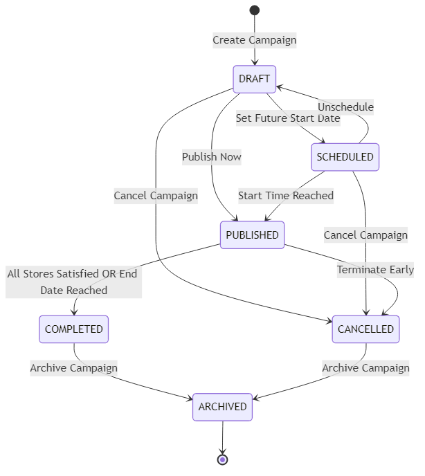
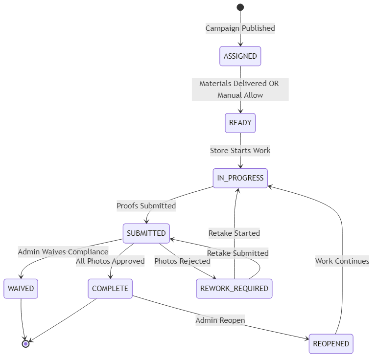
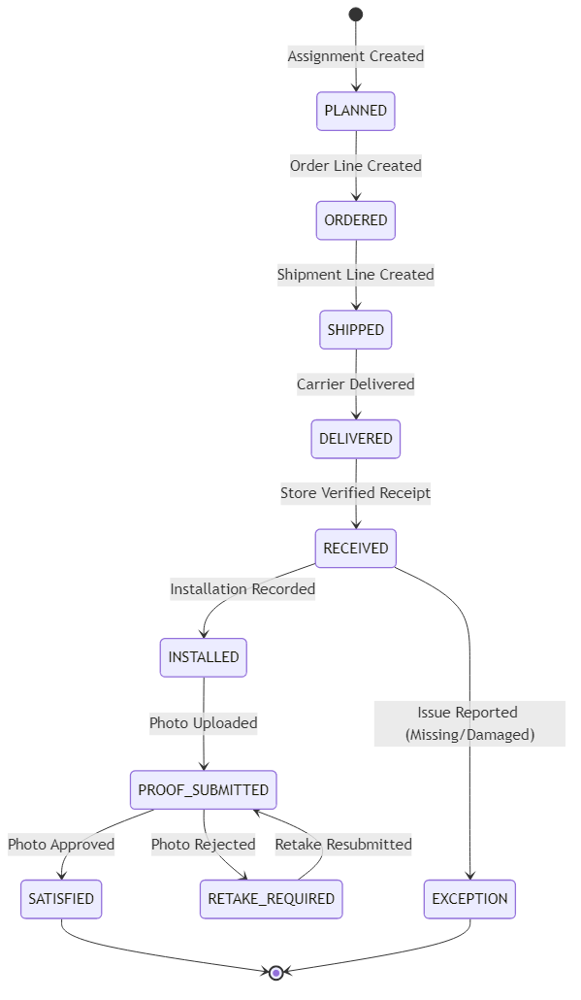
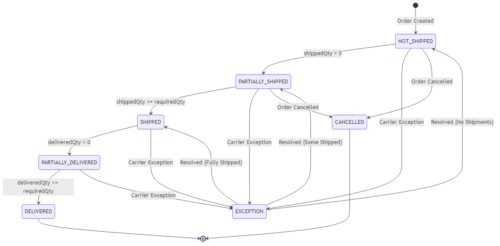
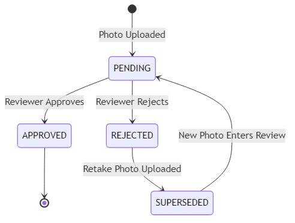
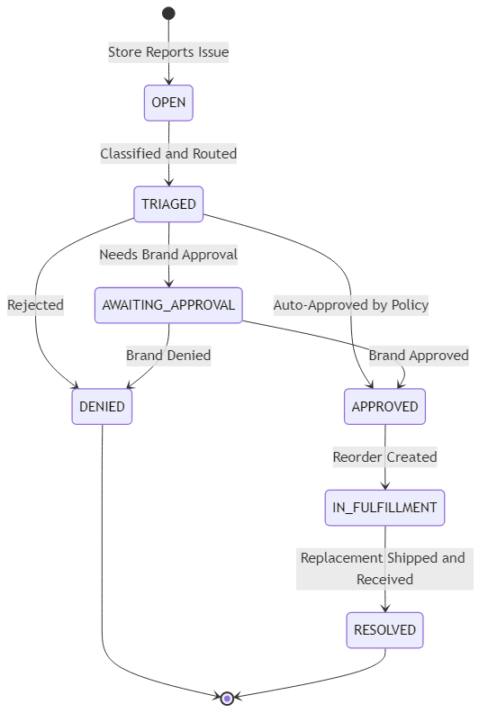
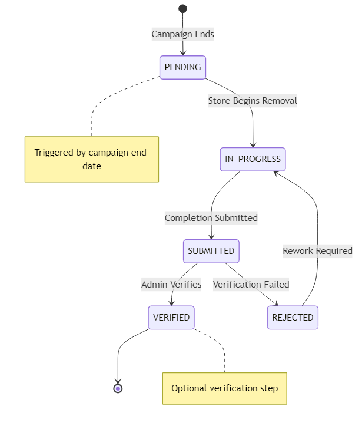
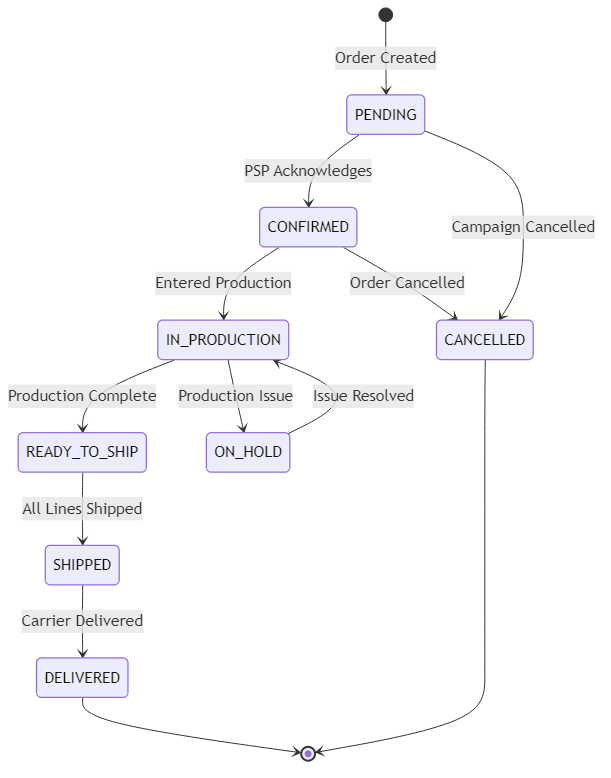



---

# Appendix A: State Machine Diagrams

## A.1 Overview

This appendix consolidates all state machine diagrams used throughout the NewPOPSys platform. These diagrams define the valid states, transitions, and triggers for key business entities.

### State Machine Categories

| Category | Entities | Owner |
|----------|----------|-------|
| Campaign Lifecycle | Campaign | Brand Portal |
| Store Execution | StoreAssignment, AssignmentItem | Store App / Brand Portal |
| Fulfillment | StoreOrder, Shipment, FulfillmentStatus | PSP Portal |
| Verification | PhotoReview, IssueRequest | Brand Portal |

---

## A.2 Campaign Lifecycle States

The campaign progresses through a defined lifecycle from creation to archival.

### A.2.1 Campaign Status State Diagram



### A.2.2 Campaign State Definitions

| State | Description | Allowed Actions |
|-------|-------------|-----------------|
| **DRAFT** | Campaign being configured; not visible to stores | Edit all fields, delete, schedule, publish |
| **SCHEDULED** | Set to publish at a future date | Edit until publish time, unschedule, cancel |
| **PUBLISHED** | Active campaign; stores can execute | Add stores, monitor, terminate |
| **COMPLETED** | All stores satisfied or end date passed | View reports, archive |
| **CANCELLED** | Terminated before natural completion | View history, archive |
| **ARCHIVED** | Historical record; read-only | View only |

### A.2.3 Campaign Transition Triggers

| From | To | Trigger | Actor |
|------|-----|---------|-------|
| DRAFT | SCHEDULED | `campaign.schedule(startDate)` | Brand Admin |
| DRAFT | PUBLISHED | `campaign.publish()` | Brand Admin |
| SCHEDULED | PUBLISHED | System scheduler (cron) | System |
| PUBLISHED | COMPLETED | Rollup satisfies threshold OR `endDate <= now` | System |
| PUBLISHED | CANCELLED | `campaign.terminate(reason)` | Brand Admin |
| * | ARCHIVED | `campaign.archive()` | Brand Admin |

---

## A.3 Store Assignment States

Tracks each store's progress through a campaign from assignment to completion.

### A.3.1 StoreAssignment Status State Diagram



### A.3.2 StoreAssignment State Definitions

| State | Description | Store Can... | Admin Can... |
|-------|-------------|--------------|--------------|
| **ASSIGNED** | Store selected for campaign | View campaign details | Edit assignment |
| **READY** | Materials delivered; execution allowed | Begin installation | Force ready status |
| **IN_PROGRESS** | Store actively working | Capture photos, report issues | Monitor progress |
| **SUBMITTED** | All photos submitted for review | Wait for review | Review photos |
| **COMPLETE** | All requirements satisfied | View completion | Reopen if needed |
| **REWORK_REQUIRED** | Photos rejected; needs retry | View feedback, retake | Send reminders |
| **REOPENED** | Admin reopened for additional work | Continue execution | Close again |
| **WAIVED** | Admin bypassed verification | N/A | View waiver reason |

---

## A.4 Assignment Item States

Tracks individual kit items at a store through the fulfillment and execution lifecycle.

### A.4.1 AssignmentItem Status State Diagram



### A.4.2 AssignmentItem State Definitions

| State | Description | Next Expected Action |
|-------|-------------|---------------------|
| **PLANNED** | Item assigned to store, not yet ordered | PSP creates order |
| **ORDERED** | Order line exists in PSP system | PSP ships item |
| **SHIPPED** | Item in transit to store | Carrier delivers |
| **DELIVERED** | Carrier confirmed delivery | Store verifies receipt |
| **RECEIVED** | Store verified item received | Store installs |
| **INSTALLED** | Installation recorded | Store uploads photo |
| **PROOF_SUBMITTED** | Photo pending review | Admin reviews |
| **SATISFIED** | Photo approved; item complete | None |
| **RETAKE_REQUIRED** | Photo rejected; needs retry | Store retakes photo |
| **EXCEPTION** | Issue reported (escalated) | Issue resolution flow |

---

## A.5 Fulfillment States

Tracks order and shipment progress from PSP perspective.

### A.5.1 FulfillmentStatus State Diagram (Computed)



### A.5.2 FulfillmentStatus Computation Logic

| Status | Condition |
|--------|-----------|
| NOT_SHIPPED | `shippedQty = 0` |
| PARTIALLY_SHIPPED | `0 < shippedQty < requiredQty` |
| SHIPPED | `shippedQty >= requiredQty` |
| PARTIALLY_DELIVERED | `0 < deliveredQty < shippedQty` |
| DELIVERED | `deliveredQty >= requiredQty` |
| EXCEPTION | Carrier reports exception flag |
| CANCELLED | Order marked cancelled |

---

## A.6 Photo Review States

Tracks individual photo review workflow.

### A.6.1 PhotoReview Status State Diagram



### A.6.2 PhotoReview State Definitions

| State | Description | Next Action |
|-------|-------------|-------------|
| **PENDING** | Photo submitted, awaiting review | Reviewer approves/rejects |
| **APPROVED** | Photo meets requirements | None (terminal) |
| **REJECTED** | Photo fails requirements | Store uploads retake |
| **SUPERSEDED** | Original replaced by retake | New photo reviewed |

### A.6.3 Rejection Reason Codes

| Code | Description |
|------|-------------|
| `BLURRY` | Image not in focus |
| `WRONG_ANGLE` | Incorrect camera angle |
| `OBSTRUCTED` | Item partially blocked |
| `WRONG_ITEM` | Incorrect item photographed |
| `NOT_INSTALLED` | Item not properly installed |
| `POOR_LIGHTING` | Insufficient lighting |
| `OTHER` | Free-text reason required |

---

## A.7 Issue Request States

Tracks issue reporting, triage, and resolution workflow.

### A.7.1 IssueRequest Status State Diagram



### A.7.2 IssueRequest State Definitions

| State | Description | Responsible Party |
|-------|-------------|-------------------|
| **OPEN** | Issue reported by store | System (auto-triage) |
| **TRIAGED** | Classified and routed | System / PSP Admin |
| **AWAITING_APPROVAL** | Requires brand approval | Brand Admin |
| **APPROVED** | Approved for reorder | PSP Operations |
| **DENIED** | Issue rejected | None (closed) |
| **IN_FULFILLMENT** | Replacement being shipped | PSP Operations |
| **RESOLVED** | Replacement received | None (closed) |

### A.7.3 Issue Type Classifications

| Type | Description | Auto-Approve Eligible |
|------|-------------|----------------------|
| MISSING | Item not in shipment | Yes (if < threshold) |
| DAMAGED | Item arrived damaged | Yes (with photo) |
| INCORRECT | Wrong item shipped | No (requires review) |
| PACKAGING | Packaging issue only | No |

---

## A.8 Deinstall Task States

Tracks end-of-campaign material removal workflow.

### A.8.1 DeinstallTask Status State Diagram



### A.8.2 DeinstallTask State Definitions

| State | Description |
|-------|-------------|
| **PENDING** | Task created when campaign ends |
| **IN_PROGRESS** | Store actively removing materials |
| **SUBMITTED** | Store marked removal complete |
| **VERIFIED** | Admin confirmed removal (optional) |
| **REJECTED** | Removal not complete; rework needed |

---

## A.9 Store Order States

Tracks PSP order processing workflow.

### A.9.1 StoreOrder Status State Diagram



### A.9.2 StoreOrder State Definitions

| State | PSP Action | Store Visibility |
|-------|------------|------------------|
| **PENDING** | Review order details | "Order Placed" |
| **CONFIRMED** | Acknowledge receipt | "Order Confirmed" |
| **IN_PRODUCTION** | Produce materials | "In Production" |
| **READY_TO_SHIP** | Pick, pack, ship | "Ready to Ship" |
| **SHIPPED** | Tracking provided | "Shipped" with tracking |
| **DELIVERED** | Carrier confirmed | "Delivered" |
| **ON_HOLD** | Resolve issue | "Delayed" |
| **CANCELLED** | Order cancelled | "Cancelled" |

---

## A.10 State Interrelationships

### A.10.1 Status Ownership by Module


### A.10.2 StorePhase Computation

The `StorePhase` is a computed rollup representing overall store progress:

| Phase | Criteria |
|-------|----------|
| **PENDING** | Assigned but materials not shipped |
| **SHIPPING** | Materials shipped, not delivered |
| **RECEIVING** | Delivered, receipt not complete |
| **EXECUTING** | Receipt complete, installation in progress |
| **VERIFYING** | Photos submitted, awaiting review |
| **COMPLETE** | All items satisfied or waived |
| **EXCEPTION** | Has unresolved issues |

---

*Document Version: 1.0*
*Last Updated: 2026-01-01*
*Source: SOW Diagram Collection, SUPP-001, SUPP-002*


---

# Appendix B: Notification Matrix

## B.1 Overview

This appendix defines all system-generated notifications, their recipients, delivery methods, and trigger conditions. Notifications ensure timely communication across all user roles throughout the campaign lifecycle.

### Notification Channels

| Channel | Description | Use Case |
|---------|-------------|----------|
| **Email** | Standard email delivery | Non-urgent notifications, summaries |
| **Push** | Mobile/PWA push notification | Time-sensitive store actions |
| **In-App** | Notification center / badge | All notifications (persistent) |
| **SMS** | Text message (optional) | Critical escalations (premium) |
| **Webhook** | API callback to external systems | Integration with third-party systems |

### Notification Priority Levels

| Priority | Description | Delivery |
|----------|-------------|----------|
| **CRITICAL** | Requires immediate action | Push + Email + In-App |
| **HIGH** | Important, action within 24h | Push + In-App |
| **NORMAL** | Standard notification | In-App + Email (digest) |
| **LOW** | Informational only | In-App only |

---

## B.2 Campaign Lifecycle Notifications

| Event | PSP Admin | Brand Admin | Campaign Mgr | Regional Mgr | Store Mgr | Store Staff | Method | Priority |
|-------|:---------:|:-----------:|:------------:|:------------:|:---------:|:-----------:|--------|----------|
| Campaign Created (Draft) | - | In-App | In-App | - | - | - | In-App | LOW |
| Campaign Published | Email | Email, Push | Email, Push | In-App | Push | Push | Multi | HIGH |
| Campaign Nearing End (7d) | - | Email | Email | In-App | Push | In-App | Multi | NORMAL |
| Campaign Ending Today | - | Push | Push | Push | Push | Push | Push | HIGH |
| Campaign Completed | Email | Email, In-App | Email, In-App | In-App | In-App | - | Multi | NORMAL |
| Campaign Cancelled | Email | Email, Push | Email, Push | In-App | Push | Push | Multi | HIGH |
| Campaign Archived | - | In-App | In-App | - | - | - | In-App | LOW |

---

## B.3 Store Assignment Notifications

| Event | PSP Admin | Brand Admin | Campaign Mgr | Regional Mgr | Store Mgr | Store Staff | Method | Priority |
|-------|:---------:|:-----------:|:------------:|:------------:|:---------:|:-----------:|--------|----------|
| Store Assigned to Campaign | - | In-App | In-App | In-App | Email, Push | Push | Multi | HIGH |
| Store Removed from Campaign | - | In-App | In-App | In-App | Email, Push | Push | Multi | NORMAL |
| Store Ready (Materials Delivered) | - | - | - | - | Push | Push | Push | HIGH |
| Store Started Installation | - | - | In-App | In-App | - | - | In-App | LOW |
| Store Submitted for Review | - | In-App | Push | Push | In-App | - | Multi | NORMAL |
| Store Marked Complete | - | In-App | In-App | In-App | Push | Push | Multi | NORMAL |
| Store Reopened | - | In-App | In-App | In-App | Push | Push | Multi | HIGH |
| Store Waived | - | In-App | In-App | In-App | Email | - | Multi | NORMAL |

---

## B.4 Fulfillment Notifications

| Event | PSP Admin | Brand Admin | Campaign Mgr | Regional Mgr | Store Mgr | Store Staff | Method | Priority |
|-------|:---------:|:-----------:|:------------:|:------------:|:---------:|:-----------:|--------|----------|
| Order Created | In-App | - | - | - | - | - | In-App | NORMAL |
| Order Confirmed | - | - | - | - | Email | - | Email | LOW |
| Order Shipped | In-App | - | - | - | Push, Email | Push | Multi | HIGH |
| Tracking Updated | - | - | - | - | In-App | In-App | In-App | LOW |
| Order Delivered | In-App | - | - | - | Push | Push | Push | HIGH |
| Delivery Exception | Push | In-App | In-App | In-App | Push, Email | Push | Multi | CRITICAL |
| Order Cancelled | In-App | Email | Email | In-App | Push, Email | Push | Multi | HIGH |
| Partial Shipment Sent | In-App | - | - | - | Push | Push | Multi | NORMAL |

---

## B.5 Issue & Reorder Notifications

| Event | PSP Admin | Brand Admin | Campaign Mgr | Regional Mgr | Store Mgr | Store Staff | Method | Priority |
|-------|:---------:|:-----------:|:------------:|:------------:|:---------:|:-----------:|--------|----------|
| Issue Reported | Push | In-App | In-App | Push | In-App | In-App | Multi | HIGH |
| Issue Needs Approval | - | Push, Email | Push, Email | - | - | - | Multi | HIGH |
| Issue Approved | In-App | In-App | In-App | In-App | Push | Push | Multi | NORMAL |
| Issue Denied | - | In-App | In-App | In-App | Push, Email | Push | Multi | NORMAL |
| Reorder Created | Push | In-App | In-App | - | In-App | - | Multi | NORMAL |
| Replacement Shipped | In-App | - | - | - | Push | Push | Multi | HIGH |
| Issue Resolved | In-App | In-App | In-App | In-App | Push | Push | Multi | NORMAL |

---

## B.6 Photo Review & Verification Notifications

| Event | PSP Admin | Brand Admin | Campaign Mgr | Regional Mgr | Store Mgr | Store Staff | Method | Priority |
|-------|:---------:|:-----------:|:------------:|:------------:|:---------:|:-----------:|--------|----------|
| Photo Submitted | - | In-App | In-App | Push | - | - | Multi | NORMAL |
| Photos Pending Review (Batch) | - | Email | Email | Push, Email | - | - | Multi | HIGH |
| Photo Approved | - | - | - | - | In-App | In-App | In-App | LOW |
| Photo Rejected | - | - | - | - | Push | Push | Push | HIGH |
| Retake Requested | - | In-App | In-App | In-App | Push, Email | Push | Multi | CRITICAL |
| Retake Submitted | - | In-App | In-App | Push | In-App | - | Multi | NORMAL |
| All Photos Approved | - | In-App | In-App | In-App | Push | Push | Multi | NORMAL |
| Review Deadline Approaching | - | Push | Push | Push | - | - | Push | HIGH |

---

## B.7 User & Access Notifications

| Event | PSP Admin | Brand Admin | Campaign Mgr | Regional Mgr | Store Mgr | Store Staff | Method | Priority |
|-------|:---------:|:-----------:|:------------:|:------------:|:---------:|:-----------:|--------|----------|
| User Invited | Email | Email | Email | Email | Email | Email | Email | HIGH |
| User Activated | In-App | In-App | In-App | In-App | In-App | In-App | In-App | LOW |
| User Deactivated | Email | Email | Email | Email | Email | Email | Email | HIGH |
| Password Reset Requested | Email | Email | Email | Email | Email | Email | Email | CRITICAL |
| Role Changed | - | Email | Email | Email | Email | Email | Email | NORMAL |
| Access Revoked | Email | Email | Email | Email | Email | Email | Email | HIGH |

---

## B.8 Report & Export Notifications

| Event | PSP Admin | Brand Admin | Campaign Mgr | Regional Mgr | Store Mgr | Store Staff | Method | Priority |
|-------|:---------:|:-----------:|:------------:|:------------:|:---------:|:-----------:|--------|----------|
| Scheduled Report Ready | Email | Email | Email | Email | - | - | Email | NORMAL |
| Export Complete | Email | Email | Email | Email | Email | - | Email | NORMAL |
| Export Failed | Email | Email | Email | Email | - | - | Email | HIGH |
| Dashboard Threshold Alert | Push | Push | Push | Push | - | - | Push | HIGH |

---

## B.9 Escalation Notifications

| Event | PSP Admin | Brand Admin | Campaign Mgr | Regional Mgr | Store Mgr | Store Staff | Method | Priority |
|-------|:---------:|:-----------:|:------------:|:------------:|:---------:|:-----------:|--------|----------|
| Store Overdue (No Activity) | - | Email | Email | Push, Email | Push, Email | Push | Multi | CRITICAL |
| Retake Overdue (48h) | - | Push | Push | Push, Email | Push, Email | Push | Multi | CRITICAL |
| Campaign Compliance Risk | - | Push, Email | Push, Email | Push | - | - | Multi | CRITICAL |
| SLA Breach Warning | Push, Email | Push, Email | Push | - | - | - | Multi | CRITICAL |

---

## B.10 Deinstall Notifications

| Event | PSP Admin | Brand Admin | Campaign Mgr | Regional Mgr | Store Mgr | Store Staff | Method | Priority |
|-------|:---------:|:-----------:|:------------:|:------------:|:---------:|:-----------:|--------|----------|
| Deinstall Task Created | - | In-App | In-App | In-App | Push | Push | Multi | HIGH |
| Deinstall Reminder (3d before) | - | - | - | - | Push | Push | Push | NORMAL |
| Deinstall Due Today | - | In-App | In-App | In-App | Push | Push | Multi | HIGH |
| Deinstall Overdue | - | Email | Email | Push, Email | Push, Email | Push | Multi | CRITICAL |
| Deinstall Completed | - | In-App | In-App | In-App | In-App | - | In-App | NORMAL |

---

## B.11 Notification Preferences

### B.11.1 User-Configurable Preferences

Users can customize notification delivery for non-critical events:

| Preference | Options | Default |
|------------|---------|---------|
| Email Frequency | Immediate, Daily Digest, Weekly | Immediate |
| Push Notifications | On, Off | On |
| Quiet Hours | Time range (e.g., 10pm-7am) | None |
| Email Format | HTML, Plain Text | HTML |

### B.11.2 Non-Configurable (Mandatory) Notifications

The following notification types cannot be disabled:

- Password reset
- Account deactivation
- Critical escalations (SLA breach)
- Security alerts
- System maintenance

---

## B.12 Notification Templates

### B.12.1 Email Subject Line Patterns

| Event Category | Subject Pattern |
|----------------|-----------------|
| Campaign | `[NewPOPSys] {Campaign Name}: {Action}` |
| Store | `[NewPOPSys] Store {Store Name}: {Action Required}` |
| Fulfillment | `[NewPOPSys] Order #{OrderID}: {Status Update}` |
| Issue | `[NewPOPSys] Issue #{IssueID}: {Status}` |
| User | `[NewPOPSys] Account: {Action}` |
| Escalation | `[URGENT] NewPOPSys: {Escalation Type}` |

### B.12.2 Push Notification Character Limits

| Platform | Title Limit | Body Limit |
|----------|-------------|------------|
| iOS | 50 chars | 150 chars |
| Android | 65 chars | 240 chars |
| Web Push | 50 chars | 120 chars |

---

## B.13 Webhook Events

For integration users, the following events trigger webhooks:

| Event | Payload | Retry Policy |
|-------|---------|--------------|
| `campaign.published` | Campaign object | 3 retries, exponential backoff |
| `campaign.completed` | Campaign object + summary | 3 retries |
| `order.created` | Order + lines | 3 retries |
| `order.shipped` | Order + shipment + tracking | 3 retries |
| `order.delivered` | Order + delivery confirmation | 3 retries |
| `issue.created` | Issue object | 3 retries |
| `issue.resolved` | Issue object + resolution | 3 retries |
| `store.completed` | StoreAssignment + rollup | 3 retries |
| `photo.submitted` | Photo metadata (no image) | 3 retries |
| `photo.reviewed` | Photo + decision | 3 retries |

---

## B.14 Notification Delivery SLAs

| Priority | Delivery Target | Retry Attempts |
|----------|-----------------|----------------|
| CRITICAL | < 30 seconds | 5 |
| HIGH | < 2 minutes | 3 |
| NORMAL | < 10 minutes | 3 |
| LOW | < 1 hour | 2 |

---

*Document Version: 1.0*
*Last Updated: 2026-01-01*
*Source: SOW Functional Requirements, SUPP-002*


---

# Appendix C: Export Formats

## C.1 Overview

This appendix defines the specifications for all data exports supported by the NewPOPSys platform. Exports enable offline analysis, integration with external systems, and archival of campaign data.

### Supported Export Formats

| Format | Extension | Use Case | Max Records |
|--------|-----------|----------|-------------|
| CSV | `.csv` | Data analysis, spreadsheet import | 100,000 |
| Excel | `.xlsx` | Formatted reports with multiple sheets | 50,000 |
| PDF | `.pdf` | Printable reports, compliance documentation | N/A |
| JSON | `.json` | API integration, data migration | 100,000 |

### Export Access by Role

| Role | Campaign Data | Store Data | Order Data | Photo Data | Financial |
|------|:-------------:|:----------:|:----------:|:----------:|:---------:|
| Platform Admin | Full | Full | Full | Full | Full |
| PSP Admin | Full | Full | Full | Metadata | Full |
| Brand Admin | Own Brands | Own Brands | Own Brands | Full | Limited |
| Campaign Manager | Assigned | Assigned | Assigned | Full | No |
| Regional Manager | Region Only | Region Only | Region Only | Region Only | No |
| Store Manager | Own Store | Own Store | Own Store | Own Store | No |

---

## C.2 CSV Export Specifications

### C.2.1 General CSV Format

| Property | Specification |
|----------|---------------|
| Encoding | UTF-8 with BOM |
| Delimiter | Comma (`,`) |
| Quote Character | Double quote (`"`) |
| Escape Character | Double quote (`""`) |
| Line Ending | CRLF (`\r\n`) |
| Header Row | Required (first row) |
| Date Format | ISO 8601 (`YYYY-MM-DD`) |
| DateTime Format | ISO 8601 (`YYYY-MM-DDTHH:mm:ssZ`) |
| Boolean Format | `true` / `false` |
| Null Values | Empty string |

### C.2.2 Campaign Export (CSV)

**Filename Pattern:** `campaigns_{tenant}_{YYYYMMDD}.csv`

| Column | Type | Description |
|--------|------|-------------|
| campaign_id | ULID | Unique campaign identifier |
| campaign_name | String | Campaign display name |
| brand_name | String | Associated brand name |
| campaign_type | Enum | PROMOTIONAL / CORE_BRANDING |
| status | Enum | Current campaign status |
| start_date | Date | Campaign start date |
| end_date | Date | Campaign end date (nullable) |
| store_count | Integer | Total assigned stores |
| completed_count | Integer | Stores completed |
| completion_rate | Decimal | Percentage complete (0.00-100.00) |
| created_at | DateTime | Creation timestamp |
| created_by | String | Creator email |
| published_at | DateTime | Publication timestamp (nullable) |

### C.2.3 Store Assignment Export (CSV)

**Filename Pattern:** `store_assignments_{campaign_id}_{YYYYMMDD}.csv`

| Column | Type | Description |
|--------|------|-------------|
| assignment_id | ULID | Unique assignment identifier |
| campaign_id | ULID | Parent campaign ID |
| campaign_name | String | Campaign display name |
| store_id | ULID | Store identifier |
| store_number | String | Store number/code |
| store_name | String | Store display name |
| region | String | Region name |
| district | String | District name (nullable) |
| territory | String | Territory name (nullable) |
| status | Enum | Assignment status |
| phase | Enum | Computed store phase |
| items_total | Integer | Total kit items |
| items_received | Integer | Items received |
| items_installed | Integer | Items installed |
| items_satisfied | Integer | Items approved |
| photos_submitted | Integer | Photos uploaded |
| photos_approved | Integer | Photos approved |
| photos_pending | Integer | Photos awaiting review |
| photos_rejected | Integer | Photos rejected |
| issues_open | Integer | Open issue count |
| assigned_at | DateTime | Assignment timestamp |
| completed_at | DateTime | Completion timestamp (nullable) |

### C.2.4 Order Export (CSV)

**Filename Pattern:** `orders_{campaign_id}_{YYYYMMDD}.csv`

| Column | Type | Description |
|--------|------|-------------|
| order_id | ULID | Order identifier |
| order_number | String | Human-readable order number |
| campaign_id | ULID | Campaign identifier |
| store_id | ULID | Store identifier |
| store_number | String | Store number |
| store_name | String | Store name |
| status | Enum | Order status |
| item_count | Integer | Total line items |
| total_quantity | Integer | Total units ordered |
| shipped_quantity | Integer | Units shipped |
| delivered_quantity | Integer | Units delivered |
| created_at | DateTime | Order creation timestamp |
| confirmed_at | DateTime | PSP confirmation (nullable) |
| shipped_at | DateTime | First shipment (nullable) |
| delivered_at | DateTime | Delivery confirmed (nullable) |
| tracking_numbers | String | Comma-separated tracking numbers |
| carrier | String | Carrier name |

### C.2.5 Issue Export (CSV)

**Filename Pattern:** `issues_{campaign_id}_{YYYYMMDD}.csv`

| Column | Type | Description |
|--------|------|-------------|
| issue_id | ULID | Issue identifier |
| issue_number | String | Human-readable issue number |
| campaign_id | ULID | Campaign identifier |
| store_id | ULID | Store identifier |
| store_number | String | Store number |
| issue_type | Enum | MISSING / DAMAGED / INCORRECT / PACKAGING |
| status | Enum | Issue status |
| item_sku | String | Affected item SKU |
| item_name | String | Affected item name |
| quantity_affected | Integer | Units affected |
| reported_by | String | Reporter email |
| reported_at | DateTime | Report timestamp |
| resolution | String | Resolution notes (nullable) |
| resolved_at | DateTime | Resolution timestamp (nullable) |
| reorder_id | ULID | Linked reorder (nullable) |

---

## C.3 Excel Export Specifications

### C.3.1 General Excel Format

| Property | Specification |
|----------|---------------|
| Format | Office Open XML (`.xlsx`) |
| Excel Version | Compatible with Excel 2010+ |
| Max Rows per Sheet | 50,000 |
| Date Format | Localized (user preference) |
| Number Format | Localized (user preference) |
| Header Row | Frozen, bold, filtered |

### C.3.2 Campaign Summary Report (XLSX)

**Filename Pattern:** `campaign_report_{campaign_name}_{YYYYMMDD}.xlsx`

**Sheet 1: Summary**

| Row | Content |
|-----|---------|
| 1-5 | Report header (title, date range, generated by) |
| 7 | Campaign details (name, brand, dates) |
| 9-15 | KPI summary (stores, completion %, issues, etc.) |

**Sheet 2: Store Details**

Full store assignment data with conditional formatting:
- Green: Complete stores
- Yellow: In progress
- Red: Overdue/Exception

**Sheet 3: Item Breakdown**

Kit item summary with quantities:
- Ordered vs Shipped vs Delivered vs Installed

**Sheet 4: Issues**

All issues with status and resolution

**Sheet 5: Timeline**

Daily progress chart data

### C.3.3 Compliance Report (XLSX)

**Filename Pattern:** `compliance_report_{campaign_name}_{YYYYMMDD}.xlsx`

**Sheet 1: Executive Summary**
- Overall compliance rate
- Regional breakdown
- Risk highlights

**Sheet 2: Store Compliance**

| Column | Description |
|--------|-------------|
| Store | Store name and number |
| Region | Geographic region |
| Items Required | Total required items |
| Items Satisfied | Approved items |
| Compliance % | Satisfaction rate |
| Status | COMPLIANT / NON-COMPLIANT / WAIVED |
| Outstanding Items | Items still pending |
| Days Since Start | Days in campaign |

**Sheet 3: Non-Compliant Stores**

Filtered list of non-compliant stores with:
- Missing items detail
- Pending retakes
- Open issues
- Last activity date

**Sheet 4: Waiver Log**

All waived items with justification

---

## C.4 PDF Report Specifications

### C.4.1 General PDF Format

| Property | Specification |
|----------|---------------|
| Page Size | Letter (8.5" x 11") or A4 |
| Orientation | Portrait (default) or Landscape |
| Margins | 0.75" all sides |
| Font | Sans-serif (Helvetica/Arial) |
| Logo | Tenant logo in header |
| Page Numbers | Bottom right |
| Generated Date | Bottom left |

### C.4.2 Campaign Completion Certificate (PDF)

**Purpose:** Official documentation of successful campaign completion at a store.

**Template Structure:**

```
+--------------------------------------------------+
|  [TENANT LOGO]           Campaign Completion     |
|                          Certificate             |
+--------------------------------------------------+
|                                                  |
|  This certifies that                             |
|                                                  |
|       [STORE NAME]                               |
|       Store #[STORE_NUMBER]                      |
|       [STORE ADDRESS]                            |
|                                                  |
|  has successfully completed all requirements     |
|  for the campaign:                               |
|                                                  |
|       [CAMPAIGN NAME]                            |
|       [BRAND NAME]                               |
|                                                  |
|  Completion Date: [DATE]                         |
|  Items Installed: [COUNT]                        |
|  Photos Approved: [COUNT]                        |
|                                                  |
|  Verified by: [REVIEWER NAME]                    |
|  Certificate ID: [ULID]                          |
|                                                  |
+--------------------------------------------------+
|  Page 1 of 1          Generated: [TIMESTAMP]     |
+--------------------------------------------------+
```

### C.4.3 Photo Proof Report (PDF)

**Purpose:** Visual documentation of installed materials with approval status.

**Template Structure:**

- Page 1: Cover page with campaign and store info
- Pages 2-N: Photo grid (2x2 per page)
  - Photo thumbnail (300x300px)
  - Item name
  - Location slot
  - Status (Approved/Rejected)
  - Reviewer notes
  - Timestamp

### C.4.4 Executive Summary Report (PDF)

**Purpose:** High-level campaign performance for stakeholders.

**Sections:**

1. **Cover Page**
   - Campaign name, brand, date range
   - Report generated date

2. **KPI Dashboard** (1 page)
   - Total stores / Complete / In Progress
   - Completion rate gauge chart
   - Issue rate
   - Photo approval rate

3. **Regional Breakdown** (1 page)
   - Bar chart by region
   - Top/bottom performers

4. **Timeline** (1 page)
   - Cumulative completion curve
   - Daily submission rates

5. **Issues Summary** (1 page)
   - Issue counts by type
   - Resolution rates

6. **Appendix** (as needed)
   - Detailed store list

---

## C.5 JSON Export Specifications

### C.5.1 General JSON Format

| Property | Specification |
|----------|---------------|
| Encoding | UTF-8 |
| Format | Pretty-printed (2-space indent) |
| Date Format | ISO 8601 |
| Null Handling | Explicit `null` |
| Empty Arrays | `[]` |
| Root Element | Object with metadata + data array |

### C.5.2 Standard JSON Wrapper

```json
{
  "export": {
    "type": "campaign_data",
    "version": "1.0",
    "generated_at": "2026-01-01T12:00:00Z",
    "generated_by": "user@example.com",
    "tenant_id": "01ABC...",
    "filters": {
      "campaign_id": "01DEF...",
      "date_from": "2026-01-01",
      "date_to": "2026-01-31"
    },
    "record_count": 150,
    "page": 1,
    "total_pages": 1
  },
  "data": [
    { ... },
    { ... }
  ]
}
```

### C.5.3 Campaign Object (JSON)

```json
{
  "id": "01HXYZ...",
  "name": "Summer 2026 Promo",
  "brand": {
    "id": "01HABC...",
    "name": "Brand Co"
  },
  "type": "PROMOTIONAL",
  "status": "PUBLISHED",
  "dates": {
    "start": "2026-06-01",
    "end": "2026-08-31"
  },
  "kit": {
    "id": "01HKIT...",
    "item_count": 5,
    "items": [
      {
        "id": "01HITM...",
        "sku": "WC-24x36-001",
        "name": "Window Cling 24x36",
        "quantity": 2
      }
    ]
  },
  "rollup": {
    "stores_total": 500,
    "stores_complete": 425,
    "stores_in_progress": 50,
    "stores_not_started": 25,
    "completion_rate": 85.0
  },
  "metadata": {
    "created_at": "2026-05-01T10:00:00Z",
    "created_by": "admin@example.com",
    "published_at": "2026-05-15T09:00:00Z"
  }
}
```

### C.5.4 Store Assignment Object (JSON)

```json
{
  "id": "01HASG...",
  "campaign_id": "01HXYZ...",
  "store": {
    "id": "01HSTR...",
    "number": "1234",
    "name": "Downtown Location",
    "address": {
      "street": "123 Main St",
      "city": "Anytown",
      "state": "CA",
      "postal_code": "90210",
      "country": "US"
    },
    "geography": {
      "region": "West",
      "district": "SoCal",
      "territory": "LA Metro"
    }
  },
  "status": "COMPLETE",
  "phase": "COMPLETE",
  "items": {
    "total": 5,
    "received": 5,
    "installed": 5,
    "satisfied": 5
  },
  "photos": {
    "required": 5,
    "submitted": 6,
    "approved": 5,
    "rejected": 1
  },
  "issues": {
    "total": 1,
    "open": 0,
    "resolved": 1
  },
  "timeline": {
    "assigned_at": "2026-06-01T00:00:00Z",
    "ready_at": "2026-06-05T14:30:00Z",
    "started_at": "2026-06-06T10:00:00Z",
    "submitted_at": "2026-06-06T16:00:00Z",
    "completed_at": "2026-06-07T09:30:00Z"
  }
}
```

---

## C.6 Data Export Schemas

### C.6.1 Available Export Endpoints

| Endpoint | Description | Formats |
|----------|-------------|---------|
| `/exports/campaigns` | Campaign list with rollups | CSV, XLSX, JSON |
| `/exports/campaigns/{id}/stores` | Store assignments for campaign | CSV, XLSX, JSON |
| `/exports/campaigns/{id}/orders` | Orders for campaign | CSV, XLSX, JSON |
| `/exports/campaigns/{id}/issues` | Issues for campaign | CSV, XLSX, JSON |
| `/exports/campaigns/{id}/photos` | Photo metadata (not images) | CSV, JSON |
| `/exports/campaigns/{id}/report` | Formatted report | XLSX, PDF |
| `/exports/stores/{id}/history` | Store campaign history | CSV, JSON |

### C.6.2 Export Request Parameters

| Parameter | Type | Description |
|-----------|------|-------------|
| `format` | Enum | csv, xlsx, pdf, json |
| `date_from` | Date | Filter start date |
| `date_to` | Date | Filter end date |
| `status` | Enum[] | Filter by status(es) |
| `region` | String[] | Filter by region(s) |
| `include_photos` | Boolean | Include photo URLs (JSON only) |
| `page` | Integer | Page number (pagination) |
| `per_page` | Integer | Records per page (max 10000) |

### C.6.3 Export Response

```json
{
  "export_id": "01HEXP...",
  "status": "PROCESSING",
  "progress": 45,
  "estimated_completion": "2026-01-01T12:05:00Z",
  "download_url": null,
  "expires_at": null
}
```

When complete:

```json
{
  "export_id": "01HEXP...",
  "status": "COMPLETE",
  "progress": 100,
  "completed_at": "2026-01-01T12:03:00Z",
  "download_url": "https://cdn.example.com/exports/01HEXP....csv",
  "expires_at": "2026-01-02T12:03:00Z",
  "file_size_bytes": 1048576,
  "record_count": 5000
}
```

---

## C.7 Photo Export Specifications

### C.7.1 Photo Metadata Export (CSV/JSON)

Photos are exported as metadata with signed URLs (not embedded images).

| Field | Description |
|-------|-------------|
| photo_id | Unique photo identifier |
| assignment_id | Parent assignment |
| item_id | Associated kit item |
| location_slot | Location slot name |
| status | PENDING / APPROVED / REJECTED |
| original_url | Signed URL (expires 24h) |
| thumbnail_url | Signed thumbnail URL |
| uploaded_at | Upload timestamp |
| reviewed_at | Review timestamp |
| reviewer | Reviewer email |
| rejection_reason | Reason code (if rejected) |

### C.7.2 Photo Archive Export (ZIP)

For bulk photo download, a ZIP archive is generated:

**Structure:**
```
photos_{campaign_id}_{YYYYMMDD}.zip
├── manifest.json
├── store_1234/
│   ├── item_ABC_slot_1.jpg
│   ├── item_ABC_slot_1_retake.jpg
│   └── item_DEF_slot_2.jpg
├── store_5678/
│   └── ...
└── rejected/
    └── ...
```

**Manifest.json:**
```json
{
  "campaign_id": "01HXYZ...",
  "export_date": "2026-01-01",
  "total_photos": 2500,
  "total_size_mb": 1250,
  "stores": [
    {
      "store_number": "1234",
      "photo_count": 5,
      "files": [
        {
          "filename": "item_ABC_slot_1.jpg",
          "item_sku": "WC-24x36-001",
          "status": "APPROVED"
        }
      ]
    }
  ]
}
```

---

## C.8 Scheduled Exports

### C.8.1 Schedule Configuration

| Field | Description |
|-------|-------------|
| frequency | DAILY / WEEKLY / MONTHLY |
| day_of_week | For weekly (0-6) |
| day_of_month | For monthly (1-28) |
| time | UTC time (HH:MM) |
| format | Export format |
| recipients | Email addresses |
| filters | Standard filter criteria |

### C.8.2 Delivery Options

| Option | Description |
|--------|-------------|
| Email Attachment | Attached to email (max 10MB) |
| Email Link | Download link in email |
| SFTP | Upload to configured SFTP server |
| Webhook | POST to configured URL |
| S3 Bucket | Upload to customer S3 bucket |

---

*Document Version: 1.0*
*Last Updated: 2026-01-01*
*Source: SOW Functional Requirements, SUPP-002*


---

# Appendix D: Glossary

## D.1 Abbreviations and Acronyms

| Abbreviation | Full Term | Description |
|--------------|-----------|-------------|
| **API** | Application Programming Interface | Standard protocol for software component communication |
| **AWS** | Amazon Web Services | Cloud computing platform used for hosting and storage |
| **BullMQ** | Bull Message Queue | Queue library for Node.js based on Redis for background jobs |
| **CI/CD** | Continuous Integration / Continuous Deployment | Automated software delivery pipeline |
| **CSV** | Comma-Separated Values | Plain text data format for tabular data |
| **DDL** | Data Definition Language | SQL statements for schema definition |
| **E2E** | End-to-End | Testing methodology covering full user flows |
| **ERD** | Entity Relationship Diagram | Database schema visualization |
| **HMAC** | Hash-based Message Authentication Code | Cryptographic authentication mechanism for webhooks |
| **JSON** | JavaScript Object Notation | Lightweight data interchange format |
| **JSONB** | JSON Binary | PostgreSQL binary JSON data type with indexing |
| **JTBD** | Jobs To Be Done | Product development methodology focusing on user goals |
| **LTS** | Long-Term Support | Software version with extended maintenance |
| **MIS** | Management Information System | Business reporting and analytics system |
| **NFR** | Non-Functional Requirement | System quality attributes (performance, security, etc.) |
| **ORM** | Object-Relational Mapping | Database abstraction layer (Drizzle) |
| **OTLP** | OpenTelemetry Protocol | Standard for transmitting telemetry data |
| **PK** | Primary Key | Unique database record identifier |
| **POP** | Point of Purchase | Marketing materials displayed at retail locations |
| **PSP** | Print Service Provider | Company producing and fulfilling POP materials |
| **PWA** | Progressive Web App | Web application with native app capabilities |
| **RBAC** | Role-Based Access Control | Permission system based on user roles |
| **REST** | Representational State Transfer | API architectural style |
| **S3** | Simple Storage Service | AWS object storage for files and photos |
| **SDK** | Software Development Kit | Tools for building applications |
| **SKU** | Stock Keeping Unit | Unique product identifier |
| **SLA** | Service Level Agreement | Performance and availability guarantees |
| **SOW** | Statement of Work | Project scope and requirements document |
| **SQL** | Structured Query Language | Database query language |
| **SRS** | Software Requirements Specification | This document |
| **SSO** | Single Sign-On | Unified authentication across systems |
| **SUPP** | Supplemental Specification | Additional technical requirements document |
| **TBD** | To Be Determined | Placeholder for undefined requirements |
| **UI** | User Interface | Visual elements users interact with |
| **ULID** | Universally Unique Lexicographically Sortable Identifier | Time-ordered unique ID format |
| **UUID** | Universally Unique Identifier | Standard unique ID format |
| **UX** | User Experience | Overall user satisfaction and usability |
| **XLSX** | Excel Spreadsheet Format | Microsoft Excel file format |
| **XML** | Extensible Markup Language | Data interchange format |

---

## D.2 Domain Terminology

### D.2.1 Core Business Entities

| Term | Definition |
|------|------------|
| **PspTenant** | Root tenant representing a PSP organization. The paying customer. All brands, users, and data belong to a tenant. Multi-tenant isolation is enforced at the database level. |
| **Brand** | A client brand managed by the PSP. Each brand has its own stores, campaigns, and settings. Represents the end customer of the PSP. |
| **Store** | A physical retail location where POP materials are installed. Identified by store number within a brand. Has geographic hierarchy assignment. |
| **Campaign** | A brand's promotional program with defined timeline, participating stores, and materials to install. The primary unit of work in the system. |
| **Kit** | The collection of POP items to be shipped and installed for a campaign. Defined by Brand Admin during campaign setup. |
| **KitItem** | A single item within a kit (e.g., "Window Cling 24x36", "Counter Card"). Has SKU, quantity, and photo requirements. |

### D.2.2 Campaign Types

| Term | Definition |
|------|------------|
| **Promotional Campaign** | Campaign with a defined end date that triggers deinstall workflow upon expiration. Materials are temporary. Also called "Expiring Campaign". |
| **Core Branding Campaign** | Campaign with no end date. Deinstall only triggered manually by admin action. Materials are permanent branding elements. Also called "Non-expiring Campaign" or "Evergreen Campaign". |

### D.2.3 Geographic Hierarchy

| Term | Definition |
|------|------------|
| **Region** | Top level of geographic hierarchy (required). Examples: "West Coast", "Northeast", "Central". Used for Regional Manager scoping. |
| **District** | Second level of geographic hierarchy (optional). Groups stores within a region. Examples: "SoCal", "Bay Area". |
| **Territory** | Third level of geographic hierarchy (optional). Most granular geographic grouping. Examples: "LA Metro", "SF Downtown". |
| **StoreGroup** | Custom, non-geographic grouping of stores. Used for targeting campaigns to specific store sets. A store can belong to multiple groups. Examples: "Premium Stores", "24-Hour Locations". |

### D.2.4 Survey and Layout

| Term | Definition |
|------|------------|
| **SurveyTemplate** | A reusable survey definition created by Brand Admin. Contains questions, sections, conditional logic, and validation rules. |
| **SurveyVersion** | An immutable snapshot of a SurveyTemplate. Campaigns pin to a specific version to ensure consistency across stores. |
| **StoreLayout** | Definition of a store's physical advertising locations. Describes where POP items can be placed. Versioned to support changes over time. |
| **LocationSlot** | A specific placement within a store where POP items can be installed. Examples: "Front Window - Left", "Counter Display - Register 1". |
| **PhotoRule** | Requirements for proof photos at a location slot. Specifies minimum/maximum photos, resolution requirements, and capture instructions. |

### D.2.5 Fulfillment Terms

| Term | Definition |
|------|------------|
| **StoreOrder** | An order generated when a campaign is published, representing what PSP needs to produce and ship to a store. One order per store per campaign. |
| **OrderLine** | A line item in a StoreOrder specifying SKU, quantity required, and fulfillment status. Maps to KitItems. |
| **Shipment** | A physical shipment sent by PSP to a store. An order may have multiple shipments (partial fulfillment). Contains carrier and tracking information. |
| **ShipmentLine** | Items included in a specific shipment. Enables tracking partial fulfillment when not all items ship together. |
| **Reorder** | A separate order generated to replace missing or damaged items reported through the issue workflow. |
| **Batch** | PSP grouping of orders for production efficiency. Types: PRODUCTION (manufacturing), PICK_PACK (warehouse), SHIP_WAVE (logistics), CUSTOM (ad-hoc). |

### D.2.6 Execution and Verification

| Term | Definition |
|------|------------|
| **StoreAssignment** | The record binding a Store to a Campaign. Tracks progress through the complete lifecycle from assignment to completion. |
| **AssignmentItem** | Individual kit item tracked at the store level. Maintains quantities and status through fulfillment and execution. |
| **ReceiveVerification** | Store's confirmation that a shipment was received with item-level acceptance, damage reporting, and quantity verification. |
| **CompletionSubmission** | Store's submission indicating installation is complete, including attestation checkbox and final comments. |
| **PhotoUpload** | A proof photo uploaded by the store. Tied to an item and/or location slot. Includes metadata like timestamp and GPS. |
| **PhotoReview** | An admin's review decision on a photo. States: PENDING, APPROVED, REJECTED. Includes reason codes for rejections. |
| **RetakeRequest** | A request for the store to retake a rejected photo. Includes reviewer feedback and deadline. |

### D.2.7 Issue Management

| Term | Definition |
|------|------------|
| **IssueRequest** | A store-reported problem requiring resolution. Created during receipt verification or later in the process. |
| **IssueLine** | A specific item and quantity affected by an issue. Multiple lines can be attached to one IssueRequest. |
| **IssueType** | Categories: MISSING (item not in shipment), DAMAGED (item arrived damaged), INCORRECT (wrong item shipped), PACKAGING (packaging issue only). |
| **IssueResolution** | How the issue was resolved: REORDER (replacement shipped), CREDIT (refund issued), WAIVED (no action needed), DENIED (not approved). |

### D.2.8 Workflow Terms

| Term | Definition |
|------|------------|
| **Campaign Publish** | Action that transitions campaign from DRAFT to PUBLISHED. Generates store assignments and orders. Triggers notifications to stores. |
| **Receipt Survey** | First-stage store survey upon delivery. Confirms items received, reports issues, captures receipt photos if required. |
| **Install Survey** | Second-stage store survey. Captures proof photos of installed items at designated location slots. |
| **Completion Attestation** | Store user's checkbox confirmation that installation is complete. Required before submission. |
| **Retake Loop** | Workflow cycle: rejected photos trigger RetakeRequest, store uploads new photo, admin reviews, repeat until approved or waived. |
| **Reorder Flow** | Issue approved triggers Reorder generation, PSP produces and ships replacement, store receives and verifies. |
| **Deinstall Task** | End-of-campaign task where store removes expired POP materials. Created automatically when promotional campaign ends. |
| **Waiver** | Administrative override marking a requirement satisfied without proof. Used for exceptions and edge cases. Requires justification. |
| **Reopen** | Admin action to unlock a COMPLETE store assignment for additional work. Creates audit trail. |
| **Split Shipment** | Order fulfilled via multiple shipments. Common when items have different production times. |

### D.2.9 Technical Terms

| Term | Definition |
|------|------------|
| **Rollup** | Aggregation of lower-level quantities to higher levels. Item quantities roll up to Store, Store metrics roll up to Campaign. |
| **Pinning** | Freezing a specific version of survey or layout to a store assignment. Ensures consistency even if template changes. |
| **Rebase** | Updating a pinned version to latest. May require re-verification. Admin action with confirmation. |
| **Idempotency Key** | Unique identifier ensuring API request processed only once. Prevents duplicate orders or actions on retry. |
| **Soft Delete** | Marking records as deleted (deleted_at timestamp) without physical removal. Preserves audit history. |
| **Event Outbox** | Pattern for reliable webhook/event dispatch with retries. Ensures external systems receive all notifications. |
| **Tenant Isolation** | Database-level separation ensuring one tenant cannot access another's data. Enforced via Row-Level Security (RLS). |

### D.2.10 Verification Modes

| Term | Definition |
|------|------------|
| **STRICT Mode** | Every photo requires explicit approval by reviewer before store can complete. Default for high-compliance campaigns. |
| **FAST Mode** | Photos auto-approve unless explicitly flagged. Store completes immediately on submission. Used for trusted stores or low-risk campaigns. |
| **Hybrid Mode** | Some items require strict verification, others auto-approve. Configured per KitItem. |

---

## D.3 User Roles (Personas)

### D.3.1 PSP Level Roles

| Role | Definition |
|------|------------|
| **Platform Admin** | Highest privilege. Full system configuration, tenant management, user impersonation for support. Internal PSP IT staff. |
| **PSP Admin** | Brand onboarding, PSP-level settings, user management, reporting and exports. Day-to-day PSP operations manager. |
| **Production Operator** | Updates order statuses, creates shipments and tracking, processes batches. Warehouse and fulfillment staff. |

### D.3.2 Brand Level Roles

| Role | Definition |
|------|------------|
| **Brand Admin** | Full brand configuration, all campaigns access, store management, user permissions. Primary brand contact at PSP. |
| **Campaign Manager** | Brand Admin scoped to assigned campaigns only. Manages specific campaigns without full brand access. |
| **Regional Manager** | Exception-first workflow. Reviews photos, handles escalations, scoped to assigned region. Field operations role. |

### D.3.3 Store Level Roles

| Role | Definition |
|------|------------|
| **Store Manager** | Store-level authority. Manages team, approves replacements, full execution permissions. Store general manager. |
| **Store Operator** | Execution-only permissions. Complete surveys, update status, request replacements. Store associate or merchandiser. |

### D.3.4 System Level Roles

| Role | Definition |
|------|------------|
| **Integration User** | Service account for API/webhook operations. No UI access. Used for system-to-system communication. |

---

## D.4 Status Values

### D.4.1 Campaign Status

| Status | Description |
|--------|-------------|
| DRAFT | Being configured, not active |
| SCHEDULED | Set to publish at future date |
| PUBLISHED | Active, stores executing |
| COMPLETED | All stores satisfied or ended |
| CANCELLED | Terminated before completion |
| ARCHIVED | Historical, read-only |

### D.4.2 Store Assignment Status

| Status | Description |
|--------|-------------|
| ASSIGNED | Selected for campaign |
| READY | Materials delivered |
| IN_PROGRESS | Actively working |
| SUBMITTED | Photos pending review |
| COMPLETE | All requirements met |
| REWORK_REQUIRED | Photos rejected |
| REOPENED | Unlocked for more work |
| WAIVED | Admin bypassed review |

### D.4.3 Photo Review Status

| Status | Description |
|--------|-------------|
| PENDING | Awaiting review |
| APPROVED | Accepted |
| REJECTED | Needs retake |
| SUPERSEDED | Replaced by retake |

### D.4.4 Issue Status

| Status | Description |
|--------|-------------|
| OPEN | Just reported |
| TRIAGED | Classified and routed |
| AWAITING_APPROVAL | Needs brand approval |
| APPROVED | Reorder authorized |
| DENIED | Rejected |
| IN_FULFILLMENT | Replacement shipping |
| RESOLVED | Replacement received |

---

## D.5 Industry Terms

| Term | Definition |
|------|------------|
| **Point of Purchase (POP)** | Marketing materials displayed at retail locations to influence buying decisions. |
| **Point of Sale (POS)** | Location where transactions occur; often used interchangeably with POP in retail context. |
| **Planogram** | Diagram showing how products and displays should be arranged in a store. |
| **Merchandising** | Activities to promote product sales including display setup and maintenance. |
| **Compliance** | Degree to which stores meet campaign requirements for installation and photo proof. |
| **Field Execution** | On-site activities at retail locations to implement marketing programs. |
| **Fulfillment** | Process of producing, packaging, and shipping materials to stores. |
| **Kitting** | Assembling multiple items into a single package for shipping. |
| **Proof of Performance** | Documentation (typically photos) proving marketing materials were properly installed. |
| **Retail Audit** | Verification visit to confirm in-store execution meets standards. |

---

*Document Version: 1.0*
*Last Updated: 2026-01-01*
*Source: SRS 1.3 Definitions, SUPP-001, Domain Expert Interviews*


---

# Appendix E: Change Log

## E.1 Overview

This appendix maintains a chronological record of all changes to the Software Requirements Specification (SRS) document. All modifications, additions, and deletions are tracked with version numbers, dates, authors, and descriptions.

### Version Numbering Convention

| Version Type | Format | Description |
|--------------|--------|-------------|
| **Major** | X.0 | Significant structural changes, new modules, or breaking changes |
| **Minor** | X.Y | New features, sections, or substantial additions |
| **Patch** | X.Y.Z | Corrections, clarifications, or minor updates |

---

## E.2 Change History

| Version | Date | Author | Section(s) Affected | Description |
|---------|------|--------|---------------------|-------------|
| 1.0 | 2026-01-01 | SRS Team | All | Initial SRS document creation. Complete specification including: Introduction, Overall Description, System Architecture, User Personas & RBAC, Module Specifications (Shared Foundations, Mobile PWA, Brand Admin, PSP Operations, Store Portal), and Appendices. |

---

## E.3 Detailed Change Records

### Version 1.0 - Initial Release (2026-01-01)

**Summary**: Complete initial Software Requirements Specification for NewPOPSys platform.

#### Sections Delivered

| Section | Description | Status |
|---------|-------------|--------|
| 00_Meta | Document metadata, progress tracking, source mapping | Complete |
| 01_Introduction | Purpose, scope, definitions, references, overview | Complete |
| 02_Overall_Description | Product perspective, functions, user classes, environment, constraints | Complete |
| 03_System_Architecture | Database model, application architecture, technology stack, integrations | Complete |
| 04_User_Personas_RBAC | Persona matrix, permissions, authentication flows, 9 persona profiles | Complete |
| 05_Module_SharedFoundations | Universal login screen specification | Complete |
| 06_Module_MobilePWA | Mobile/PWA screens (Login, Dashboard, Receipt Survey, Install Survey) | Partial |
| 07_Module_BrandAdmin | Brand admin screens (Dashboard, Campaign List, Store Selection) | Partial |
| 08_Module_PSPOperations | PSP operations screens (Order Queue, Shipments, Issues) | Complete |
| 09_Module_StorePortal | Store portal screens (Dashboard, History, Gallery, Team, Reports) | Complete |
| 99_Appendices | State machines, notifications, export formats, glossary, change log | Complete |

#### Key Features Specified

1. **Multi-Tenant Architecture**
   - PSP tenant isolation with Row-Level Security
   - Brand hierarchy with geographic organization
   - Store-level execution tracking

2. **Campaign Management**
   - Full campaign lifecycle (Draft → Published → Completed → Archived)
   - Kit definition with photo requirements
   - Store assignment and targeting

3. **Fulfillment Workflow**
   - Order generation and tracking
   - Shipment management with carrier integration
   - Issue reporting and reorder processing

4. **Execution & Verification**
   - Receipt verification workflow
   - Installation photo capture
   - Review and approval process
   - Retake request handling

5. **Integration Architecture**
   - RESTful API design
   - Webhook event system
   - External carrier integrations
   - S3 file storage

---

## E.4 Pending Changes

| ID | Requested Date | Description | Priority | Target Version |
|----|----------------|-------------|----------|----------------|
| PC-001 | TBD | Complete remaining Mobile PWA screens (M005-M008) | High | 1.1 |
| PC-002 | TBD | Complete remaining Brand Admin screens (B004-B007) | High | 1.1 |
| PC-003 | TBD | Add Platform Admin module specification | Medium | 1.1 |
| PC-004 | TBD | Add API Specifications section (11.x) | High | 1.1 |
| PC-005 | TBD | Add Non-Functional Requirements section (12.x) | High | 1.1 |

---

## E.5 Review and Approval

### Version 1.0 Approval

| Role | Name | Date | Signature |
|------|------|------|-----------|
| Project Sponsor | _________________ | ____/____/____ | _________________ |
| Product Owner | _________________ | ____/____/____ | _________________ |
| Technical Lead | _________________ | ____/____/____ | _________________ |
| QA Lead | _________________ | ____/____/____ | _________________ |

---

## E.6 Change Request Template

For future change requests, use the following template:

```markdown
### Change Request: [CR-XXX]

**Date Submitted**: YYYY-MM-DD
**Submitted By**: [Name]
**Priority**: [Critical | High | Medium | Low]

#### Description
[Detailed description of the proposed change]

#### Justification
[Business or technical reason for the change]

#### Sections Affected
- [ ] Section X.X - Description
- [ ] Section Y.Y - Description

#### Impact Assessment
- **Scope Impact**: [None | Minor | Moderate | Major]
- **Schedule Impact**: [None | Minor | Moderate | Major]
- **Resource Impact**: [None | Minor | Moderate | Major]

#### Approval
- [ ] Product Owner Approval
- [ ] Technical Lead Approval
- [ ] Stakeholder Notification

#### Implementation Notes
[Any technical notes for implementing the change]
```

---

## E.7 Document Governance

### Review Schedule

| Review Type | Frequency | Participants |
|-------------|-----------|--------------|
| Quarterly Review | Every 3 months | Product Owner, Tech Lead, QA Lead |
| Major Release Review | Per release | Full project team |
| Ad-hoc Review | As needed | Relevant stakeholders |

### Change Control Process

1. **Request**: Submit change request using template
2. **Review**: Technical lead reviews for feasibility
3. **Approve**: Product owner approves priority and scope
4. **Implement**: Author updates relevant sections
5. **Verify**: QA reviews changes for consistency
6. **Publish**: Updated version released with change log entry

---

*Document Version: 1.0*
*Last Updated: 2026-01-01*
*Maintained By: SRS Documentation Team*

