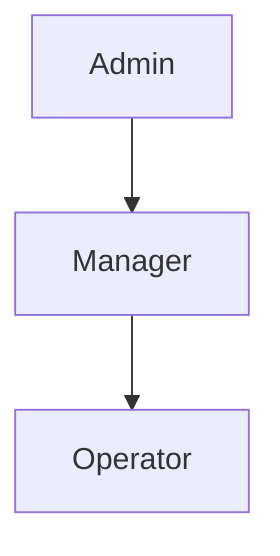

# 2.3 User Classes and Characteristics

## User Class Hierarchy

NewPOPSys v1.38 implements a three-tier user hierarchy aligned with the multi-tenant architecture:

## User Class Summary

| Persona | Level | Access Scope | Primary Interface | Frequency |
|---------|-------|--------------|-------------------|-----------|
| Platform Admin | Platform | All tenants, all data | Admin Console | Daily |
| PSP Admin | PSP | Tenant-wide | Web Application | Daily |
| Production Operator | PSP | Orders, Shipments, Batches | Web Application | Hourly |
| Brand Admin | Brand | Assigned brands | Web Application | Daily |
| Campaign Manager | Brand | Assigned campaigns | Web Application | Daily |
| Regional Manager | Brand | Assigned regions | Web Application | Daily |
| Store Manager | Store | Assigned stores | Mobile PWA | Per campaign |
| Store Operator | Store | Assigned stores | Mobile PWA | Per campaign |
| Integration User | System | API access only | REST API | Automated |

## Detailed User Classes

### Platform Admin

| Attribute | Description |
|-----------|-------------|
| **Description** | Highest privilege system administrator with full access |
| **Population** | 1-3 per deployment |
| **Technical Expertise** | High - understands system architecture |
| **Primary Tasks** | Tenant management, user impersonation, system configuration |
| **Access Pattern** | Web browser, secure workstation |
| **Availability Need** | Business hours with on-call for incidents |

**Key Permissions:**
- Create/manage PSP tenants
- Impersonate any user
- Access all audit logs
- Configure system-wide settings
- Manage feature flags

### PSP Admin

| Attribute | Description |
|-----------|-------------|
| **Description** | PSP organization administrator managing brands and operations |
| **Population** | 2-5 per PSP tenant |
| **Technical Expertise** | Medium - power user level |
| **Primary Tasks** | Brand onboarding, user management, reporting |
| **Access Pattern** | Desktop web browser |
| **Availability Need** | Business hours |

**Key Permissions:**
- Create/manage brands
- Manage all PSP-level users
- Access all brands within tenant
- Generate reports and exports
- Configure PSP settings

### Production Operator

| Attribute | Description |
|-----------|-------------|
| **Description** | PSP staff managing fulfillment operations |
| **Population** | 5-20 per PSP tenant |
| **Technical Expertise** | Low-Medium - task-focused |
| **Primary Tasks** | Order processing, shipment creation, batch management |
| **Access Pattern** | Desktop web browser, possibly warehouse terminal |
| **Availability Need** | Business hours, shift-based |

**Key Permissions:**
- View/update order status
- Create shipments and tracking
- Manage production batches
- Process reorders
- Read-only campaign access

### Brand Admin

| Attribute | Description |
|-----------|-------------|
| **Description** | Brand's primary system administrator |
| **Population** | 1-3 per brand |
| **Technical Expertise** | Medium - marketing/operations background |
| **Primary Tasks** | Store management, campaign creation, user permissions |
| **Access Pattern** | Desktop web browser |
| **Availability Need** | Business hours |

**Key Permissions:**
- Full brand configuration
- Create/manage campaigns
- Manage brand users
- Access all stores
- Review and approve photos

### Campaign Manager

| Attribute | Description |
|-----------|-------------|
| **Description** | Brand staff focused on campaign execution |
| **Population** | 2-10 per brand |
| **Technical Expertise** | Low-Medium - marketing background |
| **Primary Tasks** | Campaign setup, store assignment, progress monitoring |
| **Access Pattern** | Desktop web browser |
| **Availability Need** | Business hours |

**Key Permissions:**
- Create/edit assigned campaigns
- Manage store assignments
- View campaign analytics
- Cannot manage brand settings
- Scoped to assigned campaigns only

### Regional Manager

| Attribute | Description |
|-----------|-------------|
| **Description** | Field manager overseeing store compliance |
| **Population** | 5-20 per brand (varies by brand size) |
| **Technical Expertise** | Low - field operations background |
| **Primary Tasks** | Photo review, exception handling, store support |
| **Access Pattern** | Tablet or laptop, mobile-friendly web |
| **Availability Need** | Business hours, field schedule |

**Key Permissions:**
- Review photos for assigned regions
- Approve/reject submissions
- Handle escalations
- Read-only store data
- Scoped to assigned regions

### Store Manager

| Attribute | Description |
|-----------|-------------|
| **Description** | Store-level authority for campaign execution |
| **Population** | 1 per store (1,000+ per brand) |
| **Technical Expertise** | Low - retail operations background |
| **Primary Tasks** | Team coordination, approval authority, issue escalation |
| **Access Pattern** | Mobile device (phone/tablet), PWA |
| **Availability Need** | Store hours |

**Key Permissions:**
- Full store execution access
- Approve replacement requests
- Manage store team
- Complete all surveys
- Report issues

### Store Operator

| Attribute | Description |
|-----------|-------------|
| **Description** | Store staff performing installation tasks |
| **Population** | 1-5 per store |
| **Technical Expertise** | Low - basic smartphone proficiency |
| **Primary Tasks** | Receive shipments, install materials, capture photos |
| **Access Pattern** | Mobile device (phone), PWA |
| **Availability Need** | Store hours |

**Key Permissions:**
- Execute surveys
- Upload photos
- Update task status
- Request replacements
- Cannot manage other users

### Integration User

| Attribute | Description |
|-----------|-------------|
| **Description** | Service account for system-to-system communication |
| **Population** | 1-5 per PSP tenant |
| **Technical Expertise** | N/A - automated |
| **Primary Tasks** | API operations, webhook receipt, data sync |
| **Access Pattern** | REST API only |
| **Availability Need** | 24/7 automated |

**Key Permissions:**
- API access per granted scopes
- No UI access
- Webhook endpoint access
- Rate-limited operations
- Audit-logged actions

## User Class Interaction Matrix

| From \ To | Platform | PSP | Brand | Regional | Store |
|-----------|----------|-----|-------|----------|-------|
| Platform Admin | Manage | Manage | View | View | View |
| PSP Admin | - | Manage | Manage | View | View |
| Brand Admin | - | - | Manage | Manage | View |
| Regional Manager | - | - | - | Self | View |
| Store Manager | - | - | - | - | Manage |

## Accessibility Considerations

| User Class | Accessibility Needs |
|------------|---------------------|
| Store Operators | Large touch targets, simple navigation, outdoor visibility |
| Regional Managers | Tablet-optimized, minimal typing |
| All Web Users | WCAG 2.1 AA compliance, keyboard navigation |
| All Users | Screen reader compatibility for core functions |

## Training Requirements

| User Class | Training Level | Delivery Method |
|------------|----------------|-----------------|
| Platform Admin | Comprehensive | Technical documentation, hands-on |
| PSP Admin | Full | Online training, documentation |
| Production Operator | Role-specific | Workflow guides, quick reference |
| Brand Admin | Full | Online training, webinar |
| Campaign Manager | Role-specific | Interactive tutorials |
| Regional Manager | Task-focused | Mobile-optimized guides |
| Store Manager | Task-focused | In-app guidance, video |
| Store Operator | Minimal | In-app walkthrough |

---

*Document Version: 1.0*
*Last Updated: 2026-01-01*
*Source: MASTER_SOW_COMPILED.md v1.38, Section 2.1; SUPP-001; SUPP-003*
