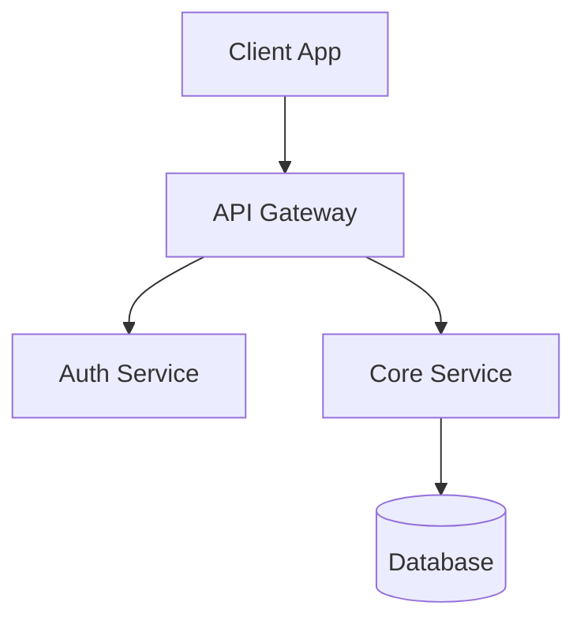

# 2.4 Operating Environment

## Infrastructure Overview

NewPOPSys v1.38 operates as a cloud-native application deployed on AWS infrastructure with a focus on reliability, scalability, and cost efficiency.

## Production Environment Specifications

### Compute Resources

| Component | Service | Configuration |
|-----------|---------|---------------|
| Web/API Servers | ECS Fargate | 2 vCPU, 4GB RAM per task |
| Background Workers | ECS Fargate | 2 vCPU, 4GB RAM per task |
| Minimum Tasks | Auto-scaling | 2 tasks per service (HA) |
| Maximum Tasks | Auto-scaling | 10 tasks per service |

### Database

| Attribute | Specification |
|-----------|---------------|
| Engine | PostgreSQL 15+ |
| Service | AWS RDS |
| Instance Class | db.r6g.large (minimum) |
| Storage | 100GB gp3 SSD (expandable) |
| Multi-AZ | Yes (production) |
| Read Replicas | 1 (optional, for reporting) |
| Backup Retention | 7 days automated |

### Cache & Queue

| Attribute | Specification |
|-----------|---------------|
| Engine | Redis 7+ |
| Service | AWS ElastiCache |
| Node Type | cache.r6g.large |
| Cluster Mode | Disabled |
| Replication | 1 replica (HA) |
| Purpose | Session cache, BullMQ jobs |

### Storage

| Type | Service | Configuration |
|------|---------|---------------|
| Photo Storage | S3 Standard | Versioning enabled |
| Export Artifacts | S3 Standard-IA | 30-day lifecycle |
| Static Assets | S3 + CloudFront | CDN distribution |
| Backup Archives | S3 Glacier | Long-term retention |

## Capacity Targets

### Pilot Scale (v1.38)

| Dimension | Target | Notes |
|-----------|--------|-------|
| PSP Tenants | 2 | Visual Graphx, Speedy CPS |
| Brands per PSP | 2-3 | Good2Go confirmed |
| Stores per Brand | Up to 1,000 | Primary scale factor |
| Concurrent Users | 50 | Peak during campaign launch |
| Photos per Campaign | 1+ per item per slot | Variable by campaign |
| Data Retention | 90 days | Post campaign completion |

### Performance Baselines

| Operation | p50 Target | p95 Target | p99 Target |
|-----------|------------|------------|------------|
| Simple Read | <50ms | <150ms | <300ms |
| Complex Read | <100ms | <300ms | <600ms |
| Write Operations | <150ms | <400ms | <800ms |
| Photo Upload | <2s | <5s | <10s |
| Report Generation | <30s | <60s | <120s |

## Client Environment Requirements

### Web Application (Desktop)

| Requirement | Specification |
|-------------|---------------|
| Browsers | Chrome 90+, Firefox 88+, Safari 14+, Edge 90+ |
| Screen Resolution | 1280x720 minimum, 1920x1080 recommended |
| Network | Broadband internet (5+ Mbps) |
| JavaScript | Required, ES2020+ support |
| Cookies | Required for session management |
| Local Storage | Required for preferences |

### Mobile PWA (Store Execution)

| Requirement | Specification |
|-------------|---------------|
| Operating System | iOS 14+, Android 10+ |
| Browser | Safari (iOS), Chrome (Android) |
| Screen Size | 5" minimum, touch-enabled |
| Camera | 8MP minimum, autofocus |
| Storage | 500MB available for offline cache |
| Network | 4G LTE or WiFi (sync-on-open) |

### Network Requirements

| Protocol | Port | Purpose |
|----------|------|---------|
| HTTPS | 443 | All application traffic |
| WSS | 443 | WebSocket notifications |

**Firewall/Proxy Requirements:**
- No SSL inspection (breaks certificate pinning)
- WebSocket upgrade support
- No request size limits <10MB

## Software Dependencies

### Server-Side Stack

| Component | Version | Purpose |
|-----------|---------|---------|
| Node.js | 20 LTS | Runtime |
| TypeScript | 5.x | Language |
| Next.js | 14.x | Web framework |
| Fastify | 4.x | API server |
| Drizzle ORM | Latest | Database ORM |
| BullMQ | 4.x | Job queue |
| Zod | 3.x | Validation |

### Client-Side Stack

| Component | Version | Purpose |
|-----------|---------|---------|
| React | 18.x | UI framework |
| TanStack Query | 5.x | Data fetching |
| Tailwind CSS | 3.x | Styling |
| Radix UI | Latest | Accessible components |

### Observability Stack

| Component | Purpose |
|-----------|---------|
| OpenTelemetry | Distributed tracing |
| Sentry | Error tracking |
| AWS CloudWatch | Metrics and logs |

## Security Environment

### Network Security

| Control | Implementation |
|---------|----------------|
| TLS Version | 1.3 only |
| Certificate | ACM-managed |
| WAF | AWS WAF with OWASP rules |
| DDoS Protection | AWS Shield Standard |

### Data Security

| Data State | Protection |
|------------|------------|
| In Transit | TLS 1.3 |
| At Rest (DB) | AES-256 (RDS encryption) |
| At Rest (S3) | AES-256 (SSE-S3) |
| At Rest (Redis) | AES-256 (ElastiCache encryption) |

### Authentication

| Attribute | Specification |
|-----------|---------------|
| Token Type | JWT (RS256) |
| Access Token TTL | 15 minutes |
| Refresh Token TTL | 7 days |
| Password Policy | 12+ chars, complexity required |
| MFA | Optional (v1), platform admin required |

## Availability Requirements

| Metric | Target | Measurement |
|--------|--------|-------------|
| Uptime | 99.5% | Monthly |
| Allowed Downtime | 3.6 hours/month | Calculated |
| RTO (Single AZ) | <5 minutes | Recovery time |
| RPO | 1 hour | Data loss tolerance |

### Maintenance Windows

| Window | Timing | Impact |
|--------|--------|--------|
| Planned Maintenance | Sunday 02:00-06:00 UTC | Potential brief outages |
| Emergency Patches | As needed | Rolling deployment |
| Database Maintenance | RDS automated | Usually zero downtime |

## Environment Tiers

| Environment | Purpose | Scale |
|-------------|---------|-------|
| Development | Local development | Single instance |
| Staging | Integration testing | 50% production |
| Production | Live operations | Full scale |

---

*Document Version: 1.0*
*Last Updated: 2026-01-01*
*Source: MASTER_SOW_COMPILED.md v1.38, Section 3; SUPP-039 v0.1*
