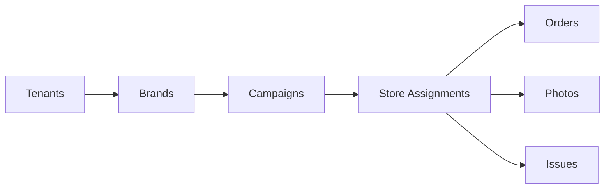
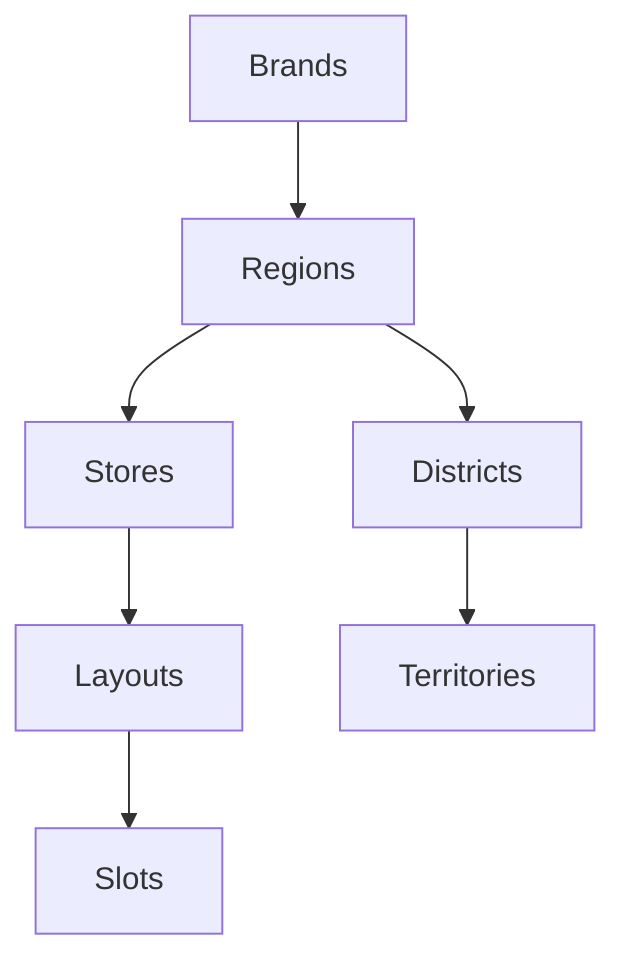
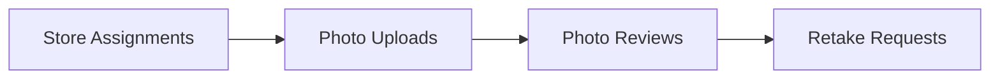
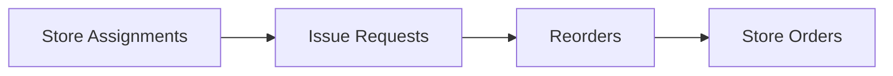

# 3.1 Database Model

> **IEEE 830 Reference**: Section 3.1 - System Architecture: Database Model
> **Source Documents**:
> - [Database Model Overview](../../06_Database_Model/README.md)
> - [Foundation Analysis](../../06_Database_Model/FOUNDATION_ANALYSIS.md)
> - [Entity Crosswalk](../../06_Database_Model/07_Validation/ENTITY_CROSSWALK.md)
> **Version**: 1.0
> **Last Updated**: 2026-01-01

---

## 3.1.1 Purpose

This section defines the database model for NewPOPSys v1, including table organization, core design patterns, and entity relationships. The schema supports multi-tenant operations, soft-delete data retention, and comprehensive audit trails.

---

## 3.1.2 Database Environment

### 3.1.2.1 Technology Specifications

| Component | Specification | Purpose |
|-----------|---------------|---------|
| **DBMS** | PostgreSQL 15+ | Primary relational database |
| **ORM** | Drizzle ORM (TypeScript) | Type-safe schema management and migrations |
| **Extensions** | uuid-ossp, pgcrypto | UUID generation and cryptographic functions |
| **Hosting** | AWS RDS | Managed PostgreSQL with automated backups |

### 3.1.2.2 Schema Statistics

| Metric | Count |
|--------|-------|
| Total Tables | 41 |
| Enum Types | 18 |
| Modules | 11 |
| Foreign Key Relationships | 100+ |

---

## 3.1.3 Core Design Patterns

### 3.1.3.1 Multi-Tenancy Model

All data is scoped through a two-level tenant hierarchy:

```mermaid
graph TD
    Tenants[Tenants (PSP Root)] --> Brands[Brands (Customer Brands)]
    Brands --> Campaigns[Campaigns]
    Brands --> Stores[Stores]
    Brands --> Users[Users (via Memberships)]
```

**Implementation Rules**:
- Every tenant represents a PSP organization with isolated data
- Brands cannot access other brands' data within the same PSP
- All queries scoped by `tenant_id` from JWT authentication
- Row-Level Security planned for Phase 2

### 3.1.3.2 Primary Key Strategy

All tables use UUID primary keys for distributed ID generation:

```sql
id UUID PRIMARY KEY DEFAULT gen_random_uuid()
```

### 3.1.3.3 Soft Delete Pattern

All tables implement logical deletion for data recovery and audit compliance:

```sql
deleted_at TIMESTAMPTZ  -- NULL = active, timestamp = deleted
```

All indexes use `WHERE deleted_at IS NULL` for active record filtering.

### 3.1.3.4 Audit Trail

Standard timestamp columns on all tables:

| Column | Type | Purpose |
|--------|------|---------|
| `created_at` | TIMESTAMPTZ | Record creation timestamp |
| `updated_at` | TIMESTAMPTZ | Auto-updated via trigger on modification |
| `deleted_at` | TIMESTAMPTZ | Soft delete marker |

State changes logged to `audit_events` with before/after JSON snapshots.

---

## 3.1.4 Table Distribution by Module

### 3.1.4.1 Module Overview

| Module | Tables | Enums | Primary Relationships |
|--------|--------|-------|----------------------|
| 1. Tenancy & Identity | 5 | 2 | User -> Membership -> Brand |
| 2. Stores & Grouping | 7 | 1 | Brand -> Region -> Store |
| 3. Surveys & Layouts | 6 | 0 | Store -> Layout -> Slot |
| 4. Campaigns & Kits | 5 | 4 | Campaign -> Assignment -> Item |
| 5. Fulfillment | 4 | 3 | Order -> Shipment -> Tracking |
| 6. Execution & Verification | 5 | 2 | Photo -> Review -> Retake |
| 7. Issues & Reorders | 3 | 2 | Issue -> Reorder -> Order |
| 8. Notifications | 2 | 1 | User -> Notification |
| 9. Webhooks & Integration | 2 | 0 | Endpoint -> Delivery |
| 10. Exports & Jobs | 1 | 2 | Job -> S3 File |
| 11. Audit | 1 | 1 | Event -> Actor |
| **Total** | **41** | **18** | |

### 3.1.4.2 Module 1: Tenancy & Identity (5 tables)

| Table | Purpose | Key Fields |
|-------|---------|------------|
| `tenants` | PSP root entity | slug, subscription_tier, settings_json |
| `brands` | Customer brands | tenant_id, code, logo_url |
| `users` | Human users | email, password_hash, is_active |
| `memberships` | User-role-scope binding | user_id, brand_id, role, region_scope_id |
| `api_keys` | Integration credentials | key_hash, scopes[], expires_at |

### 3.1.4.3 Module 2: Stores & Grouping (7 tables)

| Table | Purpose | Key Fields |
|-------|---------|------------|
| `regions` | Geographic hierarchy (required) | brand_id, parent_region_id |
| `districts` | Sub-level grouping (optional) | region_id, name |
| `territories` | Lowest hierarchy level | district_id, region_id |
| `stores` | Physical locations | region_id, external_store_guid, status |
| `store_groups` | Custom campaign groupings | brand_id, selection_criteria_json |
| `store_group_memberships` | Store-to-group M:N | store_id, group_id |
| `store_invitations` | Store onboarding | email, token, expires_at |

### 3.1.4.4 Module 3: Surveys & Layouts (6 tables)

| Table | Purpose | Key Fields |
|-------|---------|------------|
| `survey_templates` | Reusable survey definitions | brand_id, definition_json |
| `survey_versions` | Immutable snapshots | template_id, version_number, published_at |
| `store_layouts` | Physical store layouts | store_id, is_current |
| `location_slots` | Ad placement locations | layout_id, slot_code |
| `photo_rules` | Photo requirements | min_photos, required_angles[] |
| `store_survey_responses` | Survey answers | assignment_id, submitted_at |

### 3.1.4.5 Module 4: Campaigns & Kits (5 tables)

| Table | Purpose | Key Fields |
|-------|---------|------------|
| `campaigns` | Promotional programs | status, install_start, install_end |
| `kit_definitions` | Item templates | campaign_id, is_template |
| `kit_items` | Items in kit | sku, quantity, photo_rule_id |
| `store_assignments` | Store participation | campaign_id, store_id, pinned_layout_id |
| `assignment_items` | Items per store | assignment_id, kit_item_id, slot_id |

### 3.1.4.6 Module 5: Fulfillment (4 tables)

| Table | Purpose | Key Fields |
|-------|---------|------------|
| `store_orders` | Orders to PSP | order_type, status, psp_order_ref |
| `order_lines` | Line items | order_id, sku, quantity |
| `shipments` | Physical shipments | carrier, tracking_numbers[] |
| `shipment_lines` | Items shipped | shipment_id, quantity_shipped |

### 3.1.4.7 Module 6: Execution & Verification (5 tables)

| Table | Purpose | Key Fields |
|-------|---------|------------|
| `receive_verifications` | Receipt confirmation | assignment_id, verified_at |
| `photo_uploads` | Proof photos | s3_key, review_status |
| `photo_reviews` | Admin review decisions | photo_id, decision, reviewer_id |
| `retake_requests` | Rework requests | photo_id, reason, resolved_at |
| `completion_attestations` | Final sign-off | assignment_id, attested_by |

### 3.1.4.8 Modules 7-11: Supporting Tables

| Module | Tables | Purpose |
|--------|--------|---------|
| Issues & Reorders | `issue_requests`, `issue_lines`, `reorders` | Problem reporting and replacement orders |
| Notifications | `notification_preferences`, `notifications` | User notification delivery |
| Webhooks | `webhook_endpoints`, `webhook_deliveries` | Integration event delivery |
| Exports | `export_jobs` | Report generation queue |
| Audit | `audit_events` | Immutable action log |

---

## 3.1.5 Key Enumerations

### 3.1.5.1 Role-Based Access Control

```sql
CREATE TYPE role_enum AS ENUM (
  'PLATFORM_ADMIN',    -- Full system access
  'PSP_ADMIN',         -- PSP tenant administration
  'PSP_OPS',           -- Production/fulfillment operations
  'BRAND_ADMIN',       -- Full brand configuration
  'CAMPAIGN_MANAGER',  -- Campaign-scoped access
  'REGIONAL_MANAGER',  -- Region-scoped oversight
  'STORE_MANAGER',     -- Full store privileges
  'STORE_OPERATOR'     -- Execute tasks only
);
```

### 3.1.5.2 State Machine Enums

| Enum | Values | Purpose |
|------|--------|---------|
| `campaign_status_enum` | DRAFT, SCHEDULED, PUBLISHED, COMPLETED, CANCELLED, ARCHIVED | Campaign lifecycle |
| `store_assignment_status_enum` | ASSIGNED, READY, IN_PROGRESS, SUBMITTED, REWORK_REQUIRED, COMPLETE, REOPENED, WAIVED | Store execution state |
| `store_order_status_enum` | GENERATED, ACKNOWLEDGED, IN_PRODUCTION, KITTING, READY_TO_SHIP, PARTIALLY_SHIPPED, SHIPPED, DELIVERED, CLOSED, CANCELLED | Order fulfillment state |
| `photo_review_status_enum` | PENDING, APPROVED, REJECTED, SUPERSEDED | Photo verification state |
| `issue_request_status_enum` | OPEN, TRIAGED, AWAITING_APPROVAL, APPROVED, IN_FULFILLMENT, DENIED, RESOLVED | Issue resolution state |

### 3.1.5.3 Computed Statuses (Application Layer)

The following statuses are derived from data, not stored:

- **FulfillmentStatus**: Computed from shipment quantities
- **ReceiptStatus**: Computed from delivery confirmations
- **ExecutionStatus**: Computed from installation progress
- **VerificationStatus**: Computed from photo reviews
- **StorePhase**: Rollup of all assignment statuses

---

## 3.1.6 Relationship Chains

### 3.1.6.1 Campaign Execution Flow



### 3.1.6.2 Store Hierarchy



### 3.1.6.3 Photo Verification Flow



### 3.1.6.4 Issue Resolution Flow



---

## 3.1.7 JSONB Usage Patterns

| Column Pattern | Tables | Purpose |
|----------------|--------|---------|
| `settings_json` | tenants, brands | Extensible configuration |
| `metadata_json` | Multiple | Custom attributes |
| `definition_json` | survey_templates | Versioned survey schemas |
| `selection_recipe_json` | campaigns | Store selection criteria |
| `tracking_numbers` | shipments | Array of carrier tracking IDs |

All JSONB columns default to `'{}'` (empty object), not NULL.

---

## 3.1.8 Cross-References

| Reference | Description |
|-----------|-------------|
| Section 3.2 | Application Architecture |
| Section 3.3 | Technology Stack |
| Section 4.1 | RBAC Model Details |
| SUPP-035 | Field-level data model specification |
| SUPP-002 | Core domain model and state machines |

---

*Document Status: Complete*
*IEEE 830 Compliance: Section 3.1 - Data Design / Database Model*
