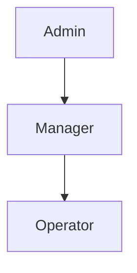

# 4.1 Persona Matrix

## 1. Purpose

This section defines the user personas for NewPOPSys v1.38. Each persona represents a distinct user class with specific responsibilities, permission levels, and system interactions. The persona matrix serves as the authoritative reference for role-based access control (RBAC) implementation.

**Authoritative Source**: SUPP-001 - Shared Foundations - Persona Workflows JTBD Screens

---

## 2. Persona Overview

NewPOPSys supports nine (9) distinct personas organized across four hierarchical levels:

| Level | Count | Personas |
|-------|-------|----------|
| PSP Level | 3 | Platform Admin, PSP Admin, Production Operator |
| Brand Level | 3 | Brand Admin, Campaign Manager, Regional Manager |
| Store Level | 2 | Store Manager, Store Operator |
| System Level | 1 | Integration User |

---

## 3. Persona Matrix

### 3.1 PSP Level Personas

| ID | Persona Name | Role Level | Primary Responsibility | Permission Level | Key Screens/Modules |
|----|--------------|------------|------------------------|------------------|---------------------|
| P01 | Platform Admin | PSP | Full system configuration, tenant management, user impersonation for support, security and audit access | All Privileged + Impersonate | Tenant config; System settings; User impersonation; Security dashboard; Full audit log |
| P02 | PSP Admin | PSP | Brand onboarding, PSP-level settings, user management, reporting and exports | PSP All Privileged | Brand onboarding; PSP settings; User management; Campaign list/totals; Exports center; Webhook/API logs |
| P03 | Production Operator | PSP | Update order statuses, create shipments and tracking, process batches, view fulfillment queues | Status & Shipping Updates | Store order list+filters; Order detail; Batch manager; Shipments+tracking; Issues/Reorders queue |

### 3.2 Brand Level Personas

| ID | Persona Name | Role Level | Primary Responsibility | Permission Level | Key Screens/Modules |
|----|--------------|------------|------------------------|------------------|---------------------|
| P04 | Brand Admin | Brand | Full brand configuration, all campaigns access, store management, user permissions | Brand Level Privileged | All Campaign Manager screens + Brand config; Store management; User permissions; Full brand reporting |
| P05 | Campaign Manager | Brand | Build new campaigns, manage assigned campaigns, define kits and photo rules, review proofs and approve | Must be assigned to campaigns | Campaign builder; Store selector; Kit/items editor; Photo rules; Dashboard; Store detail; Review queue; Retake queue; Exports/reports |
| P06 | Regional Manager | Brand | Oversee assigned stores, exception queue management, approve/reject proofs, escalate to Brand Admin | Store Compliance for segment | Exception queue (assigned stores); Store compliance dashboard; Review queue; Retake queue; Waivers/Reopen; Escalation tools |

### 3.3 Store Level Personas

| ID | Persona Name | Role Level | Primary Responsibility | Permission Level | Key Screens/Modules |
|----|--------------|------------|------------------------|------------------|---------------------|
| P07 | Store Manager | Store | Manage store team, approve replacement requests, view all store campaigns, full execution permissions | Full Store Privileges | All Store Operator screens + Team management; Replacement approvals; Store analytics; Full store campaign history |
| P08 | Store Operator | Store | Complete surveys, update status, request replacements (needs Store Manager approval), view assigned campaigns | View Only + Execution | My tasks; Campaign detail; Receive/verify; Issue/reorder request; Pre-install checklist; Install + proof capture; Completion survey + attestation; Retake queue; Deinstall task |

### 3.4 System Level Personas

| ID | Persona Name | Role Level | Primary Responsibility | Permission Level | Key Screens/Modules |
|----|--------------|------------|------------------------|------------------|---------------------|
| P09 | Integration User | System | Inbound API writes, webhook consumption, export triggers, MIS integration | API & Webhook Service Account | API endpoints; Webhook subscriptions; Export triggers; Integration logs |

---

## 4. Permission Hierarchy

---

## 5. Key Constraints

| Constraint | Description | Affected Personas |
|------------|-------------|-------------------|
| Campaign Assignment | Campaign Managers can only manage campaigns explicitly assigned to them | P05 |
| Store Assignment | Regional Managers only see stores within their assigned segment | P06 |
| Approval Workflow | Store Operators require Store Manager approval for replacement requests | P08 |
| Impersonation | Only Platform Admin may impersonate other users for support | P01 |

---

## 6. References

- **SUPP-001**: Shared Foundations - Persona Workflows JTBD Screens (authoritative source)
- **Section 4.2**: Permission Matrix (detailed RBAC grid)
- **Section 4.3**: Authentication Flows

---

*Document Version: 1.0*
*Last Updated: 2026-01-01*
*IEEE 830 Compliant*
