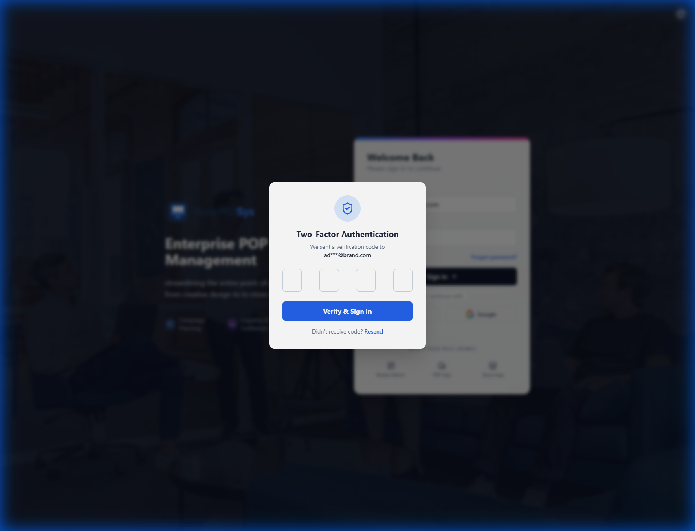
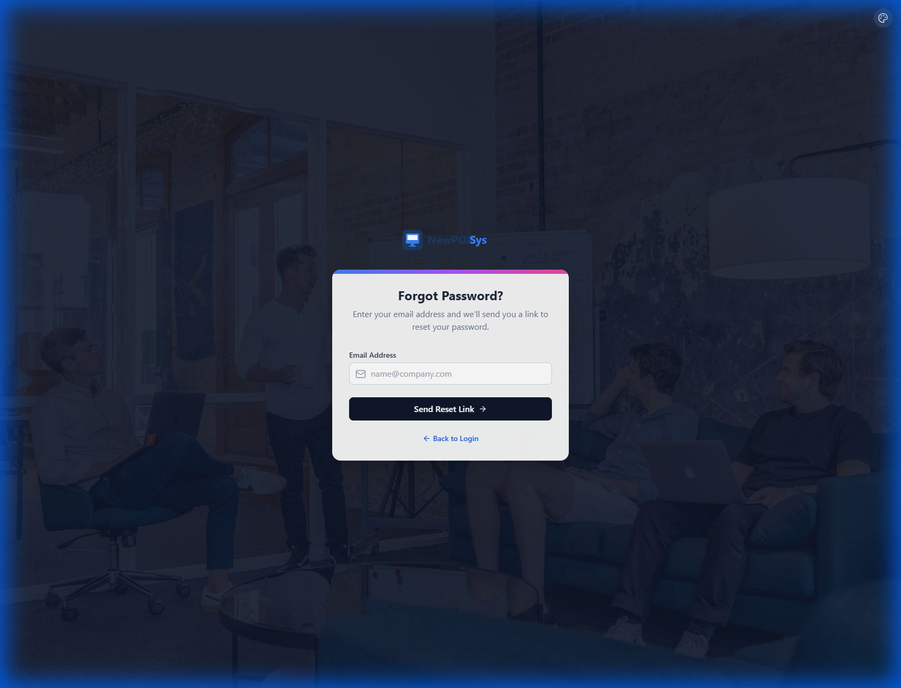
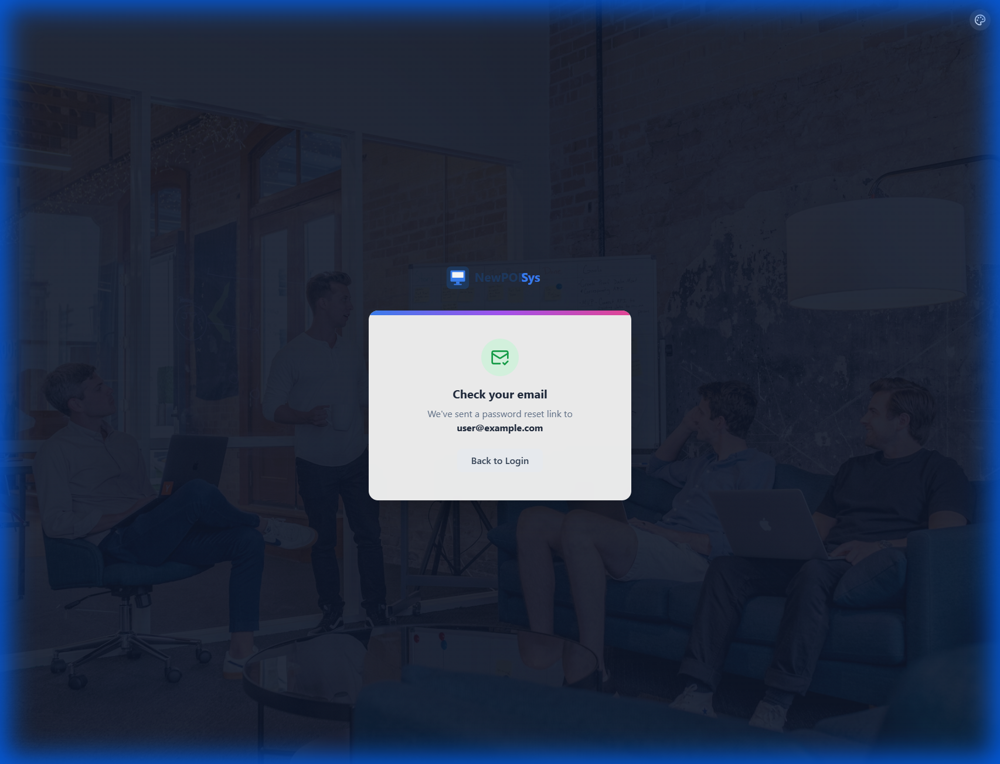

# Module Overview: SharedFoundations (L-Series)

| Document Info | Details |
|---------------|---------|
| Module ID | MOD-SHARED |
| Screen Range | L001 - L010 |
| Status | In Development |
| Last Updated | 2025-01-02 |

---

## 1. Module Summary

### Purpose

The SharedFoundations module provides cross-cutting screens and functionality shared across all portals within the PopSystem ecosystem. These screens establish consistent user experiences for authentication, navigation, personalization, and system-wide notifications regardless of which portal a user accesses.

### Scope

- **Universal Authentication**: Single sign-on entry point for all portals
- **Unified Dashboard**: Role-aware landing page with contextual widgets
- **User Profile Management**: Personal settings and preferences
- **System Settings**: Application-wide configuration options
- **Notification Center**: Centralized alert and message management

### Design Principles

1. **Consistency**: Identical look and behavior across all portals
2. **Role-Awareness**: Content adapts based on user permissions
3. **Accessibility**: WCAG 2.1 AA compliance
4. **Responsiveness**: Full mobile and desktop support

---

## 2. Screen Inventory Table

| Screen ID | Screen Name | Route | Priority | Status | Description |
|-----------|-------------|-------|----------|--------|-------------|
| L001 | Universal Login | `/login` | P0 | Complete | SSO authentication with MFA support |
| L002 | Universal Dashboard | `/dashboard` | P0 | Complete | Role-based landing page with widgets |
| L003 | User Profile | `/profile` | P1 | Planned | Personal info and preferences |
| L004 | System Settings | `/settings` | P1 | Planned | Application configuration |
| L005 | Notification Center | `/notifications` | P2 | Planned | Alerts, messages, and history |
| L006 | Reserved | TBD | - | Reserved | Future shared functionality |
| L007 | Reserved | TBD | - | Reserved | Future shared functionality |
| L008 | Reserved | TBD | - | Reserved | Future shared functionality |
| L009 | Reserved | TBD | - | Reserved | Future shared functionality |
| L010 | Reserved | TBD | - | Reserved | Future shared functionality |

---


## 3. Visual Reference (Wireframes)

### 3.1 Authentication Flow

| Login Screen | MFA Challenge |
| :---: | :---: |
|  |  |

### 3.2 Account Recovery

| Forgot Password | Recovery Success |
| :---: | :---: |
|  |  |

---

## 4. Module Dependencies

### Required Services

| Service | Purpose | Criticality |
|---------|---------|-------------|
| Auth Service | User authentication, token management, SSO | Critical |
| User Service | Profile data, preferences, role information | Critical |
| Notification Service | Push notifications, alerts, message history | High |
| Session Service | Session management, timeout handling | Critical |
| Audit Service | Login tracking, security events | Medium |

### External Integrations

| Integration | Screens Affected | Purpose |
|-------------|------------------|---------|
| Azure AD / OAuth 2.0 | L001 | Enterprise SSO |
| TOTP/SMS MFA | L001 | Multi-factor authentication |
| Firebase Cloud Messaging | L005 | Push notifications |

---

## 4. RBAC Summary

### Access Matrix

| Role | L001 Login | L002 Dashboard | L003 Profile | L004 Settings | L005 Notifications |
|------|------------|----------------|--------------|---------------|---------------------|
| SuperAdmin | Full | Full | Full | Full | Full |
| Admin | Full | Full | Full | Limited | Full |
| StoreManager | Full | Full | Full | View Only | Full |
| SalesRep | Full | Role-Scoped | Full | View Only | Full |
| Vendor | Full | Role-Scoped | Limited | None | Full |
| Customer | Full | Role-Scoped | Limited | None | Full |

### Permission Notes

- **Full**: Complete read/write access to all features
- **Limited**: Can modify own data only
- **Role-Scoped**: Dashboard widgets filtered by role permissions
- **View Only**: Read access without modification capability
- **None**: Screen not accessible to this role

---

## 5. Key Integration Points

### Authentication Flow

```
User Request → L001 Login → Auth Service → SSO Provider
                    ↓
              MFA Challenge (if enabled)
                    ↓
              Session Created → L002 Dashboard
```

### Session Management

| Feature | Implementation |
|---------|----------------|
| Session Timeout | 30 minutes idle, 8 hours absolute |
| Token Refresh | Silent refresh via refresh token |
| Concurrent Sessions | Configurable per role (default: 3) |
| Session Termination | Manual logout or admin force-logout |

### Cross-Portal State

- User preferences sync across all portals
- Notification read status shared globally
- Session valid for all portals under same domain

---

## 6. Technical Specifications

| Aspect | Specification |
|--------|---------------|
| Frontend Framework | React 18+ with TypeScript |
| State Management | Redux Toolkit |
| API Protocol | REST with OpenAPI 3.0 spec |
| Authentication | JWT with RS256 signing |
| Real-time | WebSocket for notifications |

---

## 7. Revision History

| Version | Date | Author | Changes |
|---------|------|--------|---------|
| 1.0 | 2025-01-02 | System | Initial module overview created |
| 0.9 | 2024-12-15 | Architecture Team | Draft structure defined |
| 0.8 | 2024-12-01 | Product Team | Screen inventory finalized |

---

## Related Documents

- [L001 Universal Login SRS](./L001_Universal_Login.md)
- [L002 Universal Dashboard SRS](./L002_Universal_Dashboard.md)
- [Authentication Architecture](../08_Architecture/Auth_Architecture.md)
- [RBAC Matrix](../06_Security/RBAC_Matrix.md)
