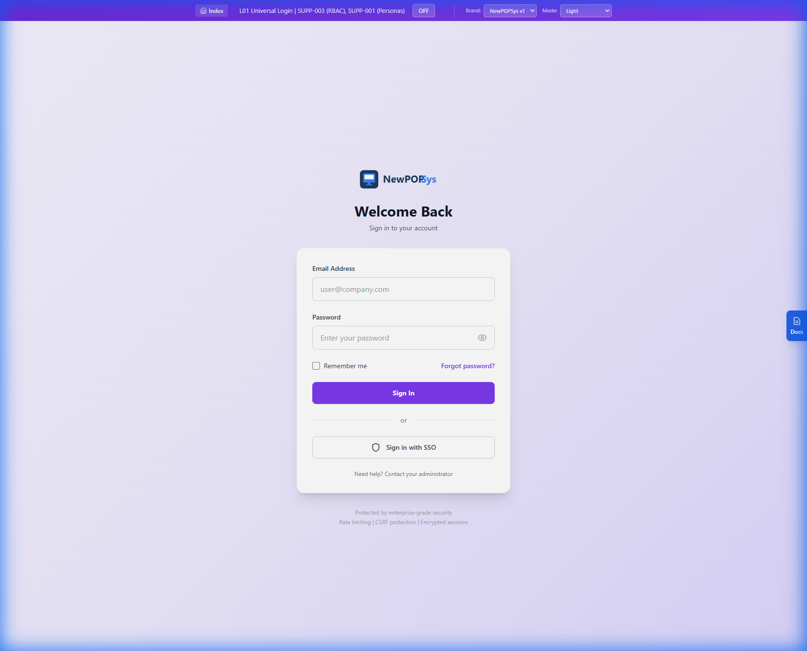
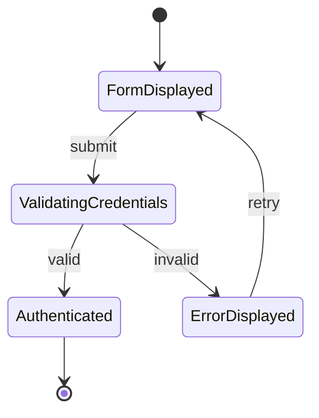

# L001 Universal Login Screen - SRS Specification

> **SRS Section**: 5.1.1 | **Screen ID**: L001 | **Version**: 1.0 | **Status**: Draft
> **Module**: SharedFoundations (L-series)
> **Route**: `/login`
> **Source**: [L01_Universal_Login.md](../../../06_Screen_Specs/L01_Universal_Login.md)
> **Last Updated**: 2026-01-01

---

## 1. Screen Overview

### 1.1 Purpose

The Universal Login Screen (L001) serves as the single authentication entry point for all NewPOPSys web portal users. It provides unified credential-based authentication with role-based routing, multi-factor authentication support, SSO integration for enterprise customers, and password recovery functionality.

### 1.2 Access Requirements

| Attribute | Specification |
|-----------|---------------|
| **Authentication** | Unauthenticated access required |
| **Pre-conditions** | User not currently authenticated |
| **Post-conditions** | Authenticated session established, redirect to role-appropriate dashboard |
| **Served Portals** | Brand Admin, Store Portal, PSP Operations, Regional Dashboard |

### 1.3 Screenshot Reference



*Figure L001-1: Universal Login Screen - Mobile and Web responsive login interface*

### 1.4 Navigation Path

| Entry Point | Path |
|-------------|------|
| Direct URL | `https://{tenant}.newpopsys.com/login` |
| Session expiry | Automatic redirect from any authenticated route |
| Logout action | Redirect from any portal |
| Bookmark/Deep link | Redirect with return URL parameter |

---

## 2. User Roles & Permissions

### 2.1 Accessible Roles

All system roles may access this screen prior to authentication. Post-authentication routing is determined by role hierarchy.

| Role Enum | Display Name | Post-Login Route |
|-----------|--------------|------------------|
| `PLATFORM_ADMIN` | Platform Admin | `/psp/dashboard` |
| `PSP_ADMIN` | PSP Admin | `/psp/dashboard` |
| `PSP_OPS` | Production Operator / Support Agent | `/psp/orders` |
| `BRAND_ADMIN` | Brand Admin | `/admin/dashboard` |
| `CAMPAIGN_MANAGER` | Campaign Manager | `/admin/dashboard` |
| `REGIONAL_MANAGER` | Regional Manager | `/admin/regional` |
| `STORE_MANAGER` | Store Manager | `/store/dashboard` |
| `STORE_OPERATOR` | Store Operator | `/store/campaigns` |

### 2.2 Role-Based Routing Priority

**REQ-L001-FR-001**: The system SHALL route authenticated users to their primary dashboard based on highest-priority role assignment.

```
Priority Order (highest first):
1. PLATFORM_ADMIN / PSP_ADMIN → /psp/dashboard
2. PSP_OPS → /psp/orders
3. BRAND_ADMIN / CAMPAIGN_MANAGER → /admin/dashboard
4. REGIONAL_MANAGER → /admin/regional
5. STORE_MANAGER → /store/dashboard
6. STORE_OPERATOR → /store/campaigns
```

### 2.3 Multi-Role Handling

**REQ-L001-FR-002**: When a user holds multiple roles across different levels, the system SHALL:
- Use the highest-level role (Tenant > Brand > Store)
- Within the same level, use the highest-permission role
- Display a role selector modal if the user has multiple significant roles

### 2.4 MFA Requirements by Role

| Role | MFA Requirement | Source |
|------|-----------------|--------|
| PLATFORM_ADMIN | **Mandatory** (TOTP/WebAuthn) | RBAC-006 |
| PSP_ADMIN | **Mandatory** (TOTP/WebAuthn) | RBAC-006 |
| BRAND_ADMIN | **Mandatory** (TOTP/WebAuthn) | RBAC-006 |
| PSP_OPS | Recommended (tenant policy) | RBAC-006 |
| REGIONAL_MANAGER | Recommended (tenant policy) | RBAC-006 |
| CAMPAIGN_MANAGER | Optional (brand policy) | RBAC-006 |
| STORE_MANAGER | Optional (brand policy) | RBAC-006 |
| STORE_OPERATOR | Optional (brand policy) | RBAC-006 |

---

## 3. UI Components

### 3.1 Layout Structure

**REQ-L001-UI-001**: The login screen SHALL display a centered card layout with responsive breakpoints.

| Breakpoint | Layout | Max Width |
|------------|--------|-----------|
| Desktop (>1024px) | Centered card with branded background | 420px |
| Tablet (768-1024px) | Centered card, reduced padding | 380px |
| Mobile (<768px) | Full-width, stacked layout | 100% |

### 3.2 Primary Components

| Component ID | Type | Description | Required |
|--------------|------|-------------|----------|
| `logo` | Image | NewPOPSys brand logo (SVG, 120x40px) | Yes |
| `heading` | Text | "Welcome Back" | Yes |
| `subheading` | Text | "Sign in to your account" | Yes |
| `email-input` | Text Field | User email address input | Yes |
| `password-input` | Password Field | Password with visibility toggle | Yes |
| `remember-me` | Checkbox | "Remember me" session extension | Yes |
| `forgot-password-link` | Link | Trigger password reset modal | Yes |
| `login-button` | Primary Button | Submit credentials | Yes |
| `sso-divider` | Divider | "or" separator | Yes |
| `sso-button` | Secondary Button | "Sign in with SSO" | Yes |
| `help-text` | Text | "Need help? Contact your administrator" | Yes |
| `error-alert` | Alert Banner | Authentication error display | Conditional |

### 3.3 Login Form Wireframe


### 3.4 MFA Modal

**REQ-L001-UI-002**: When MFA is required, the system SHALL display a modal dialog for code entry.

> *[Visual component defined in Design System]*


### 3.5 Forgot Password Modal

**REQ-L001-UI-003**: Password reset SHALL be initiated via a modal dialog.

> *[Visual component defined in Design System]*


### 3.6 SSO Domain Entry Modal

**REQ-L001-UI-004**: SSO authentication SHALL prompt for company domain.

> *[Visual component defined in Design System]*


### 3.7 Role Selector Modal

**REQ-L001-UI-005**: For multi-role users, the system SHALL display a role selection modal.

> *[Visual component defined in Design System]*


---

## 4. Data Requirements

### 4.1 Entities Involved

| Entity | Table | Access Mode | Purpose |
|--------|-------|-------------|---------|
| `User` | `users` | Read | Credential validation |
| `Membership` | `memberships` | Read | Role assignment retrieval |
| `Session` | `sessions` (cache) | Write | Session creation |
| `AuditEvent` | `audit_events` | Write | Login event logging |

### 4.2 User Entity Fields

**REQ-L001-DR-001**: The following user fields SHALL be accessed during authentication:

| Field | Type | Purpose |
|-------|------|---------|
| `id` | UUID | User identifier |
| `email` | VARCHAR(255) | Login credential |
| `password_hash` | VARCHAR(255) | bcrypt-hashed password |
| `status` | ENUM | Account status (active/suspended/disabled) |
| `mfa_enabled` | BOOLEAN | MFA enrollment status |
| `mfa_secret` | VARCHAR(255) | TOTP secret (encrypted) |
| `failed_login_count` | INTEGER | Lockout counter |
| `locked_until` | TIMESTAMPTZ | Lockout expiration |
| `is_active` | BOOLEAN | Account active flag |

### 4.3 Membership Entity Fields

**REQ-L001-DR-002**: Role determination SHALL query membership records:

| Field | Type | Purpose |
|-------|------|---------|
| `user_id` | UUID FK | User reference |
| `brand_id` | UUID FK | Brand scope (nullable) |
| `role` | role_enum | Assigned role |
| `region_scope_id` | UUID FK | Regional scope (nullable) |

### 4.4 Session Data Structure

**REQ-L001-DR-003**: The session object SHALL contain:


---

## 5. Business Rules & Validation

### 5.1 Input Validation Rules

**REQ-L001-BR-001**: Email field validation:
| Rule | Requirement | Error Message |
|------|-------------|---------------|
| Required | Field must not be empty | "Email address is required" |
| Format | Must match RFC 5322 email format | "Please enter a valid email address" |
| Max Length | 255 characters | "Email address is too long" |

**REQ-L001-BR-002**: Password field validation:
| Rule | Requirement | Error Message |
|------|-------------|---------------|
| Required | Field must not be empty | "Password is required" |
| Min Length | 8 characters (display validation only) | "Password must be at least 8 characters" |

**REQ-L001-BR-003**: MFA code validation:
| Rule | Requirement | Error Message |
|------|-------------|---------------|
| Required | Field must not be empty | "Verification code is required" |
| Format | Exactly 6 numeric digits | "Please enter a 6-digit code" |

**REQ-L001-BR-004**: SSO domain validation:
| Rule | Requirement | Error Message |
|------|-------------|---------------|
| Required | Field must not be empty | "Company domain is required" |
| Format | Valid domain format | "Please enter a valid domain" |

### 5.2 Authentication Business Rules

**REQ-L001-BR-005**: Account lockout policy:
| Threshold | Action | Duration |
|-----------|--------|----------|
| 3 failures | CAPTCHA challenge required | Until successful CAPTCHA |
| 5 failures | Account lockout | 15 minutes |
| 10 failures (cumulative) | Extended lockout + admin notification | 1 hour |
| 20 failures (24-hour) | Account disabled + security notification | Manual unlock required |

**REQ-L001-BR-006**: Password requirements (for password reset flow):
| Requirement | Specification |
|-------------|---------------|
| Minimum Length | 12 characters |
| Complexity | Uppercase, lowercase, digit, special character |
| Prohibited | Common passwords, username substring, sequential characters |
| History | Cannot reuse last 6-12 passwords (role-dependent) |

**REQ-L001-BR-007**: Session parameters:
| Parameter | Value | Condition |
|-----------|-------|-----------|
| Session Duration | 8 hours | Standard session |
| Session Duration | 30 days | "Remember me" checked |
| Idle Timeout | 30 minutes | All sessions |
| Absolute Timeout | 24 hours | All sessions |
| Concurrent Sessions | 5 maximum | Per user |

### 5.3 MFA Business Rules

**REQ-L001-BR-008**: MFA enforcement:
- Roles with mandatory MFA SHALL be redirected to MFA enrollment if not configured
- TOTP codes valid for +/- 1 period (90-second window)
- "Trust this device" stores device fingerprint for 30 days
- 3 failed MFA attempts triggers account lockout

**REQ-L001-BR-009**: MFA recovery:
- 10 single-use backup codes provided at enrollment
- Backup codes are 16 characters each
- Using backup code invalidates that code permanently

---

## 6. API Integration Points

### 6.1 Authentication Endpoints

**REQ-L001-API-001**: The following API endpoints SHALL be implemented:

| Endpoint | Method | Description | Request | Response |
|----------|--------|-------------|---------|----------|
| `/auth/login` | POST | Primary authentication | `{email, password, remember_me}` | `{session_token}` or `{mfa_required: true}` |
| `/auth/logout` | POST | Terminate session | `{}` | `{success: true}` |
| `/auth/mfa/verify` | POST | Verify MFA code | `{code, trust_device}` | `{session_token}` |
| `/auth/mfa/backup` | POST | Use backup code | `{backup_code}` | `{session_token}` |
| `/auth/password/reset-request` | POST | Request password reset | `{email}` | `{success: true}` |
| `/auth/password/reset` | POST | Set new password | `{token, password}` | `{success: true}` |
| `/auth/sso/init` | POST | Initiate SSO flow | `{domain}` | `{redirect_url}` |
| `/auth/sso/callback` | POST | Handle SSO response | `{assertion}` | `{session_token}` |
| `/auth/session` | GET | Get current session | - | `{session_data}` |
| `/auth/refresh` | POST | Refresh session token | `{}` | `{new_expiry}` |

### 6.2 Request/Response Specifications

**REQ-L001-API-002**: Login request format:
```json
{
  "email": "user@company.com",
  "password": "SecurePassword123!",
  "remember_me": true,
  "device_fingerprint": "abc123..."
}
```

**REQ-L001-API-003**: Successful login response (no MFA):
```json
{
  "success": true,
  "session": {
    "token": "eyJhbGc...",
    "expires_at": "2026-01-02T08:00:00Z",
    "user": {
      "id": "uuid",
      "email": "user@company.com",
      "primary_role": "BRAND_ADMIN",
      "roles": ["BRAND_ADMIN", "CAMPAIGN_MANAGER"]
    },
    "redirect_url": "/admin/dashboard"
  }
}
```

**REQ-L001-API-004**: MFA required response:
```json
{
  "success": true,
  "mfa_required": true,
  "mfa_token": "temp_token_for_mfa_verification",
  "methods": ["totp", "backup_code"]
}
```

### 6.3 Error Response Format

**REQ-L001-API-005**: Error responses SHALL follow structured format:
```json
{
  "success": false,
  "error": {
    "code": "AUTH_INVALID_CREDENTIALS",
    "message": "Invalid email or password",
    "details": null
  }
}
```

---

## 7. State Transitions

### 7.1 Login State Machine

**REQ-L001-ST-001**: The login flow SHALL follow this state machine:





### 7.2 Session Lifecycle States

**REQ-L001-ST-002**: Session state transitions:

| State | Triggers | Next States |
|-------|----------|-------------|
| Created | Successful authentication | Active |
| Active | User activity | Active (refresh idle timer) |
| Active | In refresh window + refresh request | Refreshed |
| Refreshed | New expiry set | Active |
| Active | 30 min no activity | IdleExpired |
| Active | 24 hours since creation | AbsoluteExpired |
| Active | User logout | Terminated |
| Active | Password/MFA change | Terminated |
| Active | Admin action | Terminated |
| Active | Account suspended | Terminated |

### 7.3 Password Reset State Machine

**REQ-L001-ST-003**: Password reset flow states:


---

## 8. Error Handling

### 8.1 Error Codes and Messages

**REQ-L001-ERR-001**: Authentication error handling:

| Error Code | HTTP Status | User Message | Internal Log |
|------------|-------------|--------------|--------------|
| `AUTH_INVALID_CREDENTIALS` | 401 | "Invalid email or password" | Log email, IP, timestamp |
| `AUTH_ACCOUNT_LOCKED` | 403 | "Account locked. Please try again in {X} minutes." | Log lockout duration |
| `AUTH_ACCOUNT_DISABLED` | 403 | "Account has been deactivated. Contact your administrator." | Log disabled reason |
| `AUTH_MFA_REQUIRED` | 200 | (Trigger MFA modal) | Log MFA method |
| `AUTH_MFA_INVALID` | 401 | "Invalid verification code" | Log failure count |
| `AUTH_MFA_EXPIRED` | 401 | "Verification code expired. Please try again." | Log code age |
| `AUTH_SSO_FAILED` | 400 | "SSO authentication failed. Please try again." | Log SSO error detail |
| `AUTH_SSO_DOMAIN_NOT_FOUND` | 400 | "SSO is not configured for this domain." | Log domain |
| `AUTH_RATE_LIMITED` | 429 | "Too many attempts. Try again in {X} minutes." | Log attempt count |
| `AUTH_SESSION_EXPIRED` | 401 | "Your session has expired. Please sign in again." | Log session ID |
| `AUTH_PASSWORD_RESET_INVALID` | 400 | "This password reset link is invalid or expired." | Log token status |

### 8.2 Client-Side Validation Errors

**REQ-L001-ERR-002**: Form validation error display:

| Field | Validation | Error Position |
|-------|------------|----------------|
| Email | Invalid format | Below email field |
| Email | Empty | Below email field |
| Password | Empty | Below password field |
| MFA Code | Not 6 digits | Below code input |
| SSO Domain | Invalid format | Below domain field |

### 8.3 Network Error Handling

**REQ-L001-ERR-003**: Network failure handling:

| Scenario | User Message | Retry Behavior |
|----------|--------------|----------------|
| Request timeout | "Request timed out. Please try again." | Automatic retry (1x) |
| Network offline | "No internet connection. Check your network." | Retry on reconnect |
| Server error (5xx) | "Something went wrong. Please try again later." | Retry after 5 seconds |
| Service unavailable | "Service temporarily unavailable. Please try again." | Exponential backoff |

---

## 9. Accessibility Requirements

### 9.1 WCAG 2.1 AA Compliance

**REQ-L001-A11Y-001**: Screen SHALL meet WCAG 2.1 Level AA standards:

| Criterion | Requirement | Implementation |
|-----------|-------------|----------------|
| 1.1.1 Non-text Content | All images have alt text | Logo: `alt="NewPOPSys Logo"` |
| 1.3.1 Info and Relationships | Form fields have associated labels | `<label for="email">` |
| 1.4.3 Contrast (Minimum) | 4.5:1 for normal text, 3:1 for large text | CSS variables with contrast checking |
| 1.4.11 Non-text Contrast | 3:1 for UI components | Button borders, input borders |
| 2.1.1 Keyboard | All functions keyboard accessible | Tab order, Enter to submit |
| 2.4.3 Focus Order | Logical focus sequence | Top-to-bottom, left-to-right |
| 2.4.7 Focus Visible | Clear focus indicator | 2px outline with offset |
| 3.3.1 Error Identification | Errors identified and described | Error messages with field association |
| 3.3.2 Labels or Instructions | Form fields labeled | Visible labels, placeholder text |
| 4.1.2 Name, Role, Value | ARIA roles and states | `aria-invalid`, `aria-describedby` |

### 9.2 Keyboard Navigation

**REQ-L001-A11Y-002**: Keyboard interaction requirements:

| Key | Action |
|-----|--------|
| Tab | Move focus forward through interactive elements |
| Shift+Tab | Move focus backward |
| Enter | Submit form / Activate button |
| Escape | Close modal dialogs |
| Space | Toggle checkbox / Activate button |

### 9.3 Screen Reader Support

**REQ-L001-A11Y-003**: Screen reader announcements:

| Event | Announcement |
|-------|--------------|
| Page load | "NewPOPSys Login. Sign in to your account." |
| Validation error | "Error: {field name} - {error message}" |
| Form submission | "Signing in..." |
| Authentication error | "Error: {error message}" |
| MFA modal open | "Two-factor authentication required. Enter 6-digit code." |
| Successful login | "Sign in successful. Redirecting..." |

### 9.4 ARIA Attributes

**REQ-L001-A11Y-004**: Required ARIA implementations:

```html
<!-- Email field with error -->
<label for="email">Email Address</label>
<input
  id="email"
  type="email"
  aria-required="true"
  aria-invalid="true"
  aria-describedby="email-error"
/>
<span id="email-error" role="alert">Please enter a valid email address</span>

<!-- Password field -->
<label for="password">Password</label>
<input
  id="password"
  type="password"
  aria-required="true"
/>
<button
  type="button"
  aria-label="Show password"
  aria-pressed="false"
>
  [eye icon]
</button>

<!-- Login button with loading state -->
<button
  type="submit"
  aria-busy="true"
  aria-label="Signing in, please wait"
>
  <span class="spinner" aria-hidden="true"></span>
  Signing In...
</button>
```

---

## 10. Acceptance Criteria

### 10.1 Functional Acceptance Criteria

| ID | Criterion | Priority |
|----|-----------|----------|
| AC-L001-01 | Single login page serves all web portals (Brand Admin, Store Portal, PSP Operations, Regional Dashboard) | Must Have |
| AC-L001-02 | Valid email format validation with inline error display | Must Have |
| AC-L001-03 | Password field shows/hides with visibility toggle | Must Have |
| AC-L001-04 | Successful login with valid credentials redirects to role-appropriate dashboard | Must Have |
| AC-L001-05 | Invalid credentials display generic error message (no credential enumeration) | Must Have |
| AC-L001-06 | MFA modal appears when user has MFA enabled | Must Have |
| AC-L001-07 | Valid MFA code completes authentication | Must Have |
| AC-L001-08 | Invalid MFA code shows error and allows retry | Must Have |
| AC-L001-09 | "Trust this device" option bypasses MFA for 30 days | Should Have |
| AC-L001-10 | Backup code authentication works when MFA device unavailable | Must Have |
| AC-L001-11 | SSO option redirects to identity provider for configured domains | Should Have |
| AC-L001-12 | Forgot password flow sends reset email within 60 seconds | Must Have |
| AC-L001-13 | Password reset link expires after 1 hour | Must Have |
| AC-L001-14 | "Remember me" extends session to 30 days | Should Have |
| AC-L001-15 | 5 failed login attempts trigger 15-minute lockout | Must Have |
| AC-L001-16 | Lockout countdown displays remaining time | Should Have |
| AC-L001-17 | Multi-role users see role selector modal | Should Have |
| AC-L001-18 | Session persists across page refreshes | Must Have |
| AC-L001-19 | Logout clears session and redirects to login | Must Have |
| AC-L001-20 | Return URL parameter redirects after authentication | Should Have |

### 10.2 Security Acceptance Criteria

| ID | Criterion | Priority |
|----|-----------|----------|
| AC-L001-SEC-01 | Passwords transmitted over HTTPS only (TLS 1.2+) | Must Have |
| AC-L001-SEC-02 | CSRF token included in login form | Must Have |
| AC-L001-SEC-03 | Session cookie set with HttpOnly, Secure, SameSite=Strict | Must Have |
| AC-L001-SEC-04 | Password hashed with bcrypt (cost factor 12) | Must Have |
| AC-L001-SEC-05 | Rate limiting blocks excessive requests (429 response) | Must Have |
| AC-L001-SEC-06 | Failed login attempts logged with IP address | Must Have |
| AC-L001-SEC-07 | Successful login events logged to audit trail | Must Have |
| AC-L001-SEC-08 | Session ID regenerated on authentication | Must Have |
| AC-L001-SEC-09 | No credential enumeration via error messages | Must Have |
| AC-L001-SEC-10 | Password reset invalidates all active sessions | Must Have |

### 10.3 Performance Acceptance Criteria

| ID | Criterion | Target |
|----|-----------|--------|
| AC-L001-PERF-01 | Page initial load time | < 2 seconds (3G network) |
| AC-L001-PERF-02 | Login API response time | < 500ms (P95) |
| AC-L001-PERF-03 | MFA verification response time | < 300ms (P95) |
| AC-L001-PERF-04 | Session validation response time | < 100ms (P95) |
| AC-L001-PERF-05 | Time to Interactive (TTI) | < 3 seconds |

### 10.4 Accessibility Acceptance Criteria

| ID | Criterion | Priority |
|----|-----------|----------|
| AC-L001-A11Y-01 | Page passes WAVE accessibility checker with no errors | Must Have |
| AC-L001-A11Y-02 | All form fields have visible labels | Must Have |
| AC-L001-A11Y-03 | Color contrast meets WCAG 2.1 AA (4.5:1 normal, 3:1 large) | Must Have |
| AC-L001-A11Y-04 | Complete keyboard navigation without mouse | Must Have |
| AC-L001-A11Y-05 | Screen reader announces form errors | Must Have |
| AC-L001-A11Y-06 | Focus trap works correctly in modals | Must Have |
| AC-L001-A11Y-07 | Escape key closes modal dialogs | Must Have |

---

## 11. Traceability Matrix

| Requirement ID | Description | Source Document | Test Case |
|----------------|-------------|-----------------|-----------|
| REQ-L001-FR-001 | Role-based routing priority | SUPP-003, L01 Screen Spec | TC-L001-001 |
| REQ-L001-FR-002 | Multi-role handling | SUPP-003, L01 Screen Spec | TC-L001-002 |
| REQ-L001-UI-001 | Responsive layout | L01 Screen Spec | TC-L001-010 |
| REQ-L001-UI-002 | MFA modal display | L01 Screen Spec | TC-L001-011 |
| REQ-L001-UI-003 | Password reset modal | L01 Screen Spec | TC-L001-012 |
| REQ-L001-UI-004 | SSO domain entry | L01 Screen Spec | TC-L001-013 |
| REQ-L001-UI-005 | Role selector modal | L01 Screen Spec | TC-L001-014 |
| REQ-L001-DR-001 | User entity fields | 3.1 Database Model | TC-L001-020 |
| REQ-L001-DR-002 | Membership query | 3.1 Database Model | TC-L001-021 |
| REQ-L001-DR-003 | Session data structure | 4.3 Authentication Flows | TC-L001-022 |
| REQ-L001-BR-001 | Email validation | L01 Screen Spec | TC-L001-030 |
| REQ-L001-BR-002 | Password validation | L01 Screen Spec | TC-L001-031 |
| REQ-L001-BR-003 | MFA code validation | L01 Screen Spec | TC-L001-032 |
| REQ-L001-BR-004 | SSO domain validation | L01 Screen Spec | TC-L001-033 |
| REQ-L001-BR-005 | Account lockout policy | 4.3 Authentication Flows | TC-L001-040 |
| REQ-L001-BR-006 | Password requirements | 4.3 Authentication Flows | TC-L001-041 |
| REQ-L001-BR-007 | Session parameters | 4.3 Authentication Flows | TC-L001-042 |
| REQ-L001-BR-008 | MFA enforcement | 4.2 Permission Matrix | TC-L001-043 |
| REQ-L001-BR-009 | MFA recovery | 4.3 Authentication Flows | TC-L001-044 |
| REQ-L001-API-001 | Authentication endpoints | L01 Screen Spec | TC-L001-050 |
| REQ-L001-API-002 | Login request format | 3.4 Integration Architecture | TC-L001-051 |
| REQ-L001-API-003 | Login response format | 3.4 Integration Architecture | TC-L001-052 |
| REQ-L001-API-004 | MFA response format | 3.4 Integration Architecture | TC-L001-053 |
| REQ-L001-API-005 | Error response format | 3.4 Integration Architecture | TC-L001-054 |
| REQ-L001-ST-001 | Login state machine | L01 Screen Spec | TC-L001-060 |
| REQ-L001-ST-002 | Session lifecycle | 4.3 Authentication Flows | TC-L001-061 |
| REQ-L001-ST-003 | Password reset states | 4.3 Authentication Flows | TC-L001-062 |
| REQ-L001-ERR-001 | Error codes | L01 Screen Spec | TC-L001-070 |
| REQ-L001-ERR-002 | Validation errors | L01 Screen Spec | TC-L001-071 |
| REQ-L001-ERR-003 | Network errors | 3.2 Application Architecture | TC-L001-072 |
| REQ-L001-A11Y-001 | WCAG 2.1 AA | Accessibility Standards | TC-L001-080 |
| REQ-L001-A11Y-002 | Keyboard navigation | Accessibility Standards | TC-L001-081 |
| REQ-L001-A11Y-003 | Screen reader support | Accessibility Standards | TC-L001-082 |
| REQ-L001-A11Y-004 | ARIA attributes | Accessibility Standards | TC-L001-083 |

---

## 12. Cross-References

| Reference | Section | Description |
|-----------|---------|-------------|
| 3.1 Database Model | Schema | User, Membership, Session tables |
| 3.2 Application Architecture | Frontend | Next.js App Router implementation |
| 3.3 Technology Stack | Auth | bcrypt, TOTP, WebAuthn specifications |
| 3.4 Integration Architecture | API | Authentication endpoint patterns |
| 4.1 Persona Matrix | Users | User classes accessing this screen |
| 4.2 Permission Matrix | RBAC | Role definitions and MFA requirements |
| 4.3 Authentication Flows | Security | Complete authentication specifications |
| L01 Screen Spec | Source | Original wireframes and specifications |
| SUPP-003 | Foundation | RBAC and Permissions Matrix |

---

## 13. Revision History

| Version | Date | Author | Description |
|---------|------|--------|-------------|
| 1.0 | 2026-01-01 | System | Initial SRS specification |

---

*Document Status: Draft*
*IEEE 830 Compliance: Section 5 - Screen Specifications*
*Last Updated: 2026-01-01*
