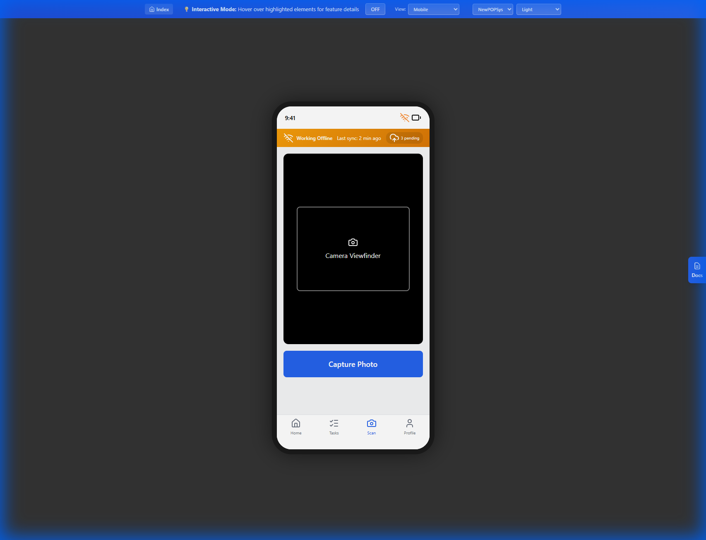

# M003 - Receipt Survey Screen

> **Module**: MobilePWA (Store Execution)
> **Screen ID**: M003
> **Route**: `/app/campaign/:id/receive`
> **IEEE 830 Section**: 3.2.1 - User Interface Requirements
> **Version**: 1.0
> **Last Updated**: 2026-01-01

---

## 1. Screen Overview

### 1.1 Purpose

The Receipt Survey screen enables store personnel to verify and document the receipt of campaign materials. Users systematically confirm each item received, report discrepancies (missing, damaged, wrong items), and create issue requests when problems are identified. This screen is critical for inventory accuracy and triggering fulfillment issue resolution workflows.

### 1.2 Scope

This specification covers:
- Item checklist verification workflow
- Issue reporting with quantity and reason
- Partial receipt handling
- Issue request creation
- Receipt confirmation attestation

### 1.3 Screenshot Reference




### 1.4 Source Documents

| Document | Reference |
|----------|-----------|
| Screen Spec | [M03_Receipt_Survey.md](../../../../06_Screen_Specs/M03_Receipt_Survey.md) |
| SUPP Reference | SUPP-020 (Issues and Reorders), SUPP-037 (Store Surveys) |
| Database Model | [3.1_Database_Model.md](../../03_System_Architecture/3.1_Database_Model.md) |

---

## 2. User Roles & Permissions

### 2.1 Authorized Roles

| Role | Access Level | Capabilities |
|------|--------------|--------------|
| Store Manager (P07) | Full | Receive, report issues, approve replacements |
| Store Operator (P08) | Execute | Receive, report issues (approval required) |

### 2.2 Role Requirements

| Req ID | Requirement | Priority |
|--------|-------------|----------|
| REQ-M003-ROLE-001 | Store Manager SHALL receive items and approve replacement requests | Must |
| REQ-M003-ROLE-002 | Store Operator SHALL receive items and submit replacement requests | Must |
| REQ-M003-ROLE-003 | Replacement requests from Store Operator SHALL require Store Manager approval | Must |

### 2.3 Approval Workflow

| Action | Store Manager | Store Operator |
|--------|---------------|----------------|
| Confirm item received | Direct | Direct |
| Report issue | Direct | Direct |
| Submit replacement request | Direct | Requires approval |
| Approve replacement | Yes | No |

---

## 3. UI Components

### 3.1 Component Inventory

| Component ID | Type | Description | Required |
|--------------|------|-------------|----------|
| COMP-M003-001 | Header | Campaign name, back button | Yes |
| COMP-M003-002 | Progress Bar | Items verified / total | Yes |
| COMP-M003-003 | Item Card | Individual item with checkbox | Yes |
| COMP-M003-004 | Checkbox | Received confirmation | Yes |
| COMP-M003-005 | Issue Button | Report problem icon | Yes |
| COMP-M003-006 | Issue Modal | Issue type, quantity, notes | Conditional |
| COMP-M003-007 | Summary Panel | Verified/pending counts | Yes |
| COMP-M003-008 | Complete Button | Confirm all received | Yes |

### 3.2 Component Requirements

| Req ID | Requirement | Priority |
|--------|-------------|----------|
| REQ-M003-UI-001 | Item list SHALL display all expected items from kit | Must |
| REQ-M003-UI-002 | Each item SHALL show SKU, name, expected quantity | Must |
| REQ-M003-UI-003 | Checkbox SHALL toggle received status | Must |
| REQ-M003-UI-004 | Issue button SHALL open issue modal | Must |
| REQ-M003-UI-005 | Progress bar SHALL update as items are checked | Must |
| REQ-M003-UI-006 | Complete button SHALL be disabled until all items addressed | Must |

### 3.3 Layout Specification

```
+---------------------------------------+
| ← Receive: Summer Promo              |
+---------------------------------------+
| Progress: 8/12 items verified         |
| [████████████░░░░░░] 67%             |
+---------------------------------------+
|                                       |
| ┌─────────────────────────────────┐   |
| │ [✓] Window Poster (24x36)      │   |
| │     SKU: POS-001  Qty: 2       │   |
| │     Verified: 2 of 2       [!] │   |
| └─────────────────────────────────┘   |
|                                       |
| ┌─────────────────────────────────┐   |
| │ [ ] End Cap Display            │   |
| │     SKU: POS-002  Qty: 1       │   |
| │     Not verified           [!] │   |
| └─────────────────────────────────┘   |
|                                       |
| ┌─────────────────────────────────┐   |
| │ [⚠] Counter Mat               │   |
| │     SKU: POS-003  Qty: 3       │   |
| │     Issue: 1 DAMAGED       [!] │   |
| └─────────────────────────────────┘   |
|                                       |
+---------------------------------------+
| Summary:                              |
| ✓ Verified: 8  ⚠ Issues: 1  ○ Pending: 3|
+---------------------------------------+
|        [Complete Receiving]           |
+---------------------------------------+
```

### 3.4 Issue Modal Layout

```
+---------------------------------------+
| Report Issue                      [X] |
+---------------------------------------+
| Item: Counter Mat (POS-003)           |
| Expected Quantity: 3                  |
+---------------------------------------+
| Issue Type:                           |
| ( ) Missing                           |
| (●) Damaged                           |
| ( ) Wrong Item                        |
| ( ) Quantity Short                    |
+---------------------------------------+
| Affected Quantity:                    |
| [- ] [ 1 ] [ +]                       |
+---------------------------------------+
| Notes (optional):                     |
| ┌─────────────────────────────────┐   |
| │ Box was crushed during shipping │   |
| └─────────────────────────────────┘   |
+---------------------------------------+
| [Cancel]            [Report Issue]    |
+---------------------------------------+
```

---

## 4. Data Requirements

### 4.1 Data Sources

| Entity | Fields | Access |
|--------|--------|--------|
| `StoreAssignment` | id, campaign_id, store_id, status | Read |
| `AssignmentItem` | id, kit_item_id, received_qty, item_status | Read/Write |
| `KitItem` | id, sku, name, quantity | Read |
| `IssueRequest` | id, type, quantity, notes, status | Write |
| `IssueLine` | id, issue_request_id, assignment_item_id, quantity | Write |
| `ReceiveVerification` | id, assignment_id, verified_at, verified_by | Write |

### 4.2 Issue Types Enumeration

| Type | Code | Description |
|------|------|-------------|
| Missing | `MISSING` | Item not in shipment |
| Damaged | `DAMAGED` | Item received but damaged |
| Wrong Item | `WRONG_ITEM` | Different item than expected |
| Quantity Short | `QUANTITY_SHORT` | Fewer items than expected |

### 4.3 Data Requirements

| Req ID | Requirement | Priority |
|--------|-------------|----------|
| REQ-M003-DATA-001 | System SHALL load all assignment items for the campaign | Must |
| REQ-M003-DATA-002 | System SHALL track received quantity per item | Must |
| REQ-M003-DATA-003 | System SHALL create IssueRequest for reported problems | Must |
| REQ-M003-DATA-004 | System SHALL persist partial progress locally | Must |
| REQ-M003-DATA-005 | System SHALL record ReceiveVerification on completion | Must |

---

## 5. Business Rules & Validation

### 5.1 Receipt Validation Rules

| Rule ID | Rule | Validation |
|---------|------|------------|
| BR-M003-001 | Received quantity cannot exceed expected quantity | `received_qty <= kit_item.quantity` |
| BR-M003-002 | Issue quantity cannot exceed expected quantity | `issue_qty <= kit_item.quantity` |
| BR-M003-003 | Received + Issue quantities must account for expected | `received_qty + issue_qty == expected_qty` OR not complete |
| BR-M003-004 | All items must be addressed before completion | No items with `received_qty = 0 AND no issue` |

### 5.2 Issue Request Rules

| Rule ID | Rule | Implementation |
|---------|------|----------------|
| BR-M003-005 | Issue creates IssueRequest with status OPEN | Insert into `issue_requests` |
| BR-M003-006 | Store Operator issues require approval | Set `requires_approval = true` |
| BR-M003-007 | Duplicate issues for same item not allowed | Check existing open issues |
| BR-M003-008 | Issue notes required for WRONG_ITEM type | Validate notes.length > 0 |

### 5.3 Completion Rules

| Rule ID | Rule | Effect |
|---------|------|--------|
| BR-M003-009 | Completion creates ReceiveVerification record | Insert with timestamp and user |
| BR-M003-010 | Completion updates StoreAssignment status | Set to `READY_TO_INSTALL` |
| BR-M003-011 | Partial receipt allowed with issues | Can complete with open issues |
| BR-M003-012 | Re-receiving after completion requires Store Manager | Reopen workflow |

### 5.4 Validation Requirements

| Req ID | Requirement | Priority |
|--------|-------------|----------|
| REQ-M003-VAL-001 | System SHALL prevent received quantity exceeding expected | Must |
| REQ-M003-VAL-002 | System SHALL require issue type selection | Must |
| REQ-M003-VAL-003 | System SHALL require notes for WRONG_ITEM issues | Must |
| REQ-M003-VAL-004 | System SHALL validate all items addressed before completion | Must |

---

## 6. API Integration Points

### 6.1 Get Assignment Items

| Property | Value |
|----------|-------|
| **Endpoint** | `GET /api/v1/assignments/{assignmentId}/items` |
| **Auth Required** | Bearer token |

#### Response Schema

```json
{
  "data": [
    {
      "id": "uuid",
      "kit_item": {
        "id": "uuid",
        "sku": "POS-001",
        "name": "Window Poster (24x36)",
        "quantity": 2,
        "photo_rule_id": "uuid"
      },
      "received_qty": 2,
      "item_status": "RECEIVED",
      "has_open_issue": false
    }
  ]
}
```

### 6.2 Update Item Receipt

| Property | Value |
|----------|-------|
| **Endpoint** | `PATCH /api/v1/assignment-items/{itemId}/receive` |
| **Auth Required** | Bearer token |

#### Request Schema

```json
{
  "received_qty": 2
}
```

### 6.3 Create Issue Request

| Property | Value |
|----------|-------|
| **Endpoint** | `POST /api/v1/issue-requests` |
| **Auth Required** | Bearer token |

#### Request Schema

```json
{
  "assignment_id": "uuid",
  "lines": [
    {
      "assignment_item_id": "uuid",
      "issue_type": "DAMAGED",
      "quantity": 1,
      "notes": "Box was crushed during shipping"
    }
  ]
}
```

### 6.4 Complete Receiving

| Property | Value |
|----------|-------|
| **Endpoint** | `POST /api/v1/assignments/{assignmentId}/receive/complete` |
| **Auth Required** | Bearer token |

#### Request Schema

```json
{
  "attestation": true,
  "notes": "All items verified"
}
```

### 6.5 API Requirements

| Req ID | Requirement | Priority |
|--------|-------------|----------|
| REQ-M003-API-001 | System SHALL use optimistic updates for checkbox toggles | Should |
| REQ-M003-API-002 | System SHALL batch issue creation for multiple items | Should |
| REQ-M003-API-003 | System SHALL support offline queue for receipt updates | Must |
| REQ-M003-API-004 | System SHALL sync when connection restored | Must |

---

## 7. State Transitions

### 7.1 AssignmentItem.item_status Transitions

```
[NOT_RECEIVED]
      │
      ├──► [PARTIAL_RECEIVED] ──► [RECEIVED]
      │
      └──► [RECEIVED]
      │
      └──► [ISSUE_REPORTED]
```

### 7.2 StoreAssignment Status Transitions

```
[READY] ──► [RECEIVING] ──► [READY_TO_INSTALL]
                │
                └──► [RECEIVING] (partial, can re-enter)
```

### 7.3 IssueRequest Status Transitions

```
[OPEN]
   │
   ├──► [TRIAGED] ──► [AWAITING_APPROVAL]
   │                         │
   │                         ├──► [APPROVED] ──► [IN_FULFILLMENT]
   │                         │
   │                         └──► [DENIED]
   │
   └──► [RESOLVED] (if issue was mistake)
```

### 7.4 State Requirements

| Req ID | Requirement | Priority |
|--------|-------------|----------|
| REQ-M003-STATE-001 | System SHALL track item_status per AssignmentItem | Must |
| REQ-M003-STATE-002 | System SHALL update assignment status on completion | Must |
| REQ-M003-STATE-003 | System SHALL allow re-entry to receiving screen | Should |
| REQ-M003-STATE-004 | System SHALL preserve progress on navigation away | Must |

---

## 8. Error Handling

### 8.1 Error Scenarios

| Scenario | User Message | Recovery Action |
|----------|--------------|-----------------|
| Network unavailable | "Saved locally. Will sync when online." | Queue in IndexedDB |
| Sync conflict | "Item updated elsewhere. Refresh to see changes." | Reload data |
| Issue creation failed | "Couldn't report issue. Try again." | Retry with button |
| Completion failed | "Couldn't complete. Please try again." | Retry |
| Session expired | Redirect to login | Re-authenticate |

### 8.2 Offline Support

| Action | Offline Behavior |
|--------|------------------|
| View items | From cache |
| Toggle received | Queued locally |
| Report issue | Queued locally |
| Complete receiving | Queued locally |

### 8.3 Error Requirements

| Req ID | Requirement | Priority |
|--------|-------------|----------|
| REQ-M003-ERR-001 | System SHALL queue all updates when offline | Must |
| REQ-M003-ERR-002 | System SHALL show sync status indicator | Must |
| REQ-M003-ERR-003 | System SHALL retry failed syncs with exponential backoff | Must |
| REQ-M003-ERR-004 | System SHALL handle conflict resolution gracefully | Should |

---

## 9. Accessibility Requirements

### 9.1 WCAG 2.1 AA Compliance

| Req ID | Requirement | WCAG Criterion | Priority |
|--------|-------------|----------------|----------|
| REQ-M003-A11Y-001 | Checkboxes SHALL have accessible labels | 1.3.1 Info and Relationships | Must |
| REQ-M003-A11Y-002 | Progress SHALL be announced on change | 4.1.3 Status Messages | Must |
| REQ-M003-A11Y-003 | Issue modal SHALL trap focus | 2.4.3 Focus Order | Must |
| REQ-M003-A11Y-004 | Issue type selection SHALL use radio group | 1.3.1 Info and Relationships | Must |
| REQ-M003-A11Y-005 | Quantity stepper SHALL be keyboard accessible | 2.1.1 Keyboard | Must |

### 9.2 Screen Reader Announcements

| Element | Announcement |
|---------|--------------|
| Item checked | "Window Poster verified, 2 of 2 received" |
| Issue reported | "Issue reported for Counter Mat, 1 damaged" |
| Progress update | "8 of 12 items verified" |
| Completion | "Receiving complete, 12 items verified, 1 issue reported" |

### 9.3 ARIA Implementation

```html
<form role="form" aria-label="Receipt verification">
  <div role="progressbar" aria-valuenow="8"
       aria-valuemin="0" aria-valuemax="12">
    8 of 12 items verified
  </div>

  <fieldset>
    <legend class="sr-only">Item list</legend>
    <div role="group" aria-label="Window Poster (24x36)">
      <input type="checkbox" id="item-1"
             aria-describedby="item-1-desc" />
      <label for="item-1">Window Poster (24x36)</label>
      <span id="item-1-desc">SKU: POS-001, Quantity: 2</span>
    </div>
  </fieldset>
</form>
```

---

## 10. Acceptance Criteria

### 10.1 Functional Acceptance

| AC ID | Criterion | Verification Method |
|-------|-----------|---------------------|
| AC-M003-001 | Screen displays all expected items for assignment | API integration test |
| AC-M003-002 | Checkbox toggles received status | Manual test |
| AC-M003-003 | Issue modal captures type, quantity, notes | Manual test |
| AC-M003-004 | Issue creates IssueRequest record | API test |
| AC-M003-005 | Progress bar updates as items are verified | Manual test |
| AC-M003-006 | Complete button disabled until all items addressed | E2E test |
| AC-M003-007 | Completion creates ReceiveVerification record | API test |
| AC-M003-008 | Partial progress persists across sessions | Manual test |

### 10.2 Non-Functional Acceptance

| AC ID | Criterion | Target | Verification |
|-------|-----------|--------|--------------|
| AC-M003-NF-001 | Checkbox toggle response | < 100ms | Performance test |
| AC-M003-NF-002 | Offline data persistence | 100% | Offline test |
| AC-M003-NF-003 | Sync after reconnection | < 10 seconds | Network test |
| AC-M003-NF-004 | Handle 50+ items smoothly | 60 FPS | Performance test |

### 10.3 Edge Cases

| AC ID | Criterion | Verification |
|-------|-----------|--------------|
| AC-M003-EC-001 | Handle item with quantity 0 | Edge case test |
| AC-M003-EC-002 | Handle duplicate issue report attempt | Validation test |
| AC-M003-EC-003 | Handle receiving already completed assignment | State test |
| AC-M003-EC-004 | Handle sync conflict between devices | Conflict test |

---

## 11. Traceability Matrix

| Requirement | Source | Test Case |
|-------------|--------|-----------|
| REQ-M003-ROLE-003 | SUPP-003 | TC-M003-001 |
| REQ-M003-DATA-003 | SUPP-020 | TC-M003-002 |
| REQ-M003-VAL-003 | SUPP-020 | TC-M003-003 |
| REQ-M003-API-003 | Offline Requirements | TC-M003-004 |
| REQ-M003-A11Y-001 | WCAG 2.1 | TC-M003-005 |

---

*Document Status: Complete*
*IEEE 830 Compliance: Section 3.2.1 - User Interface Requirements*
