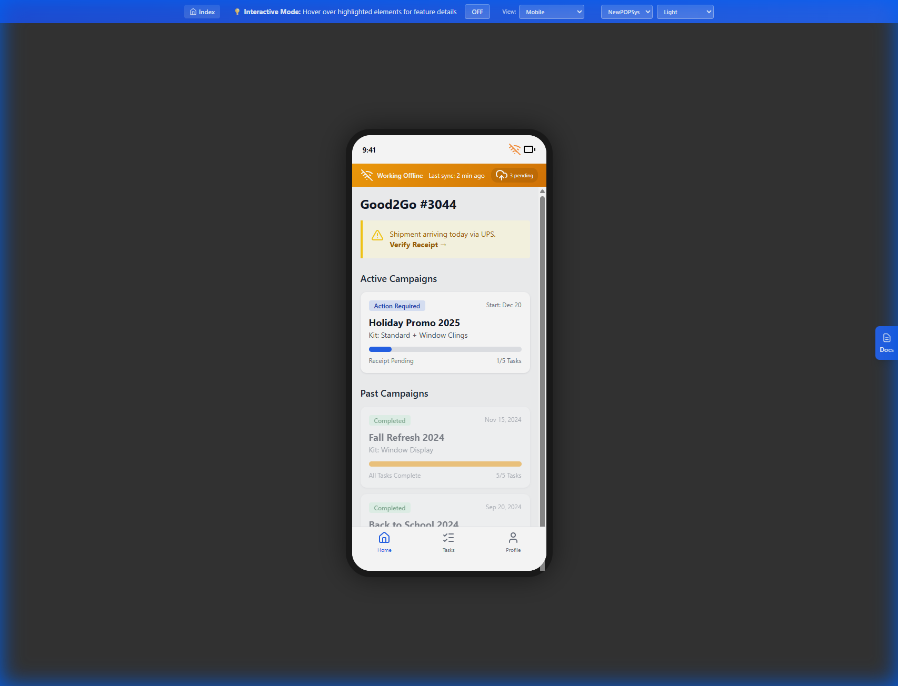
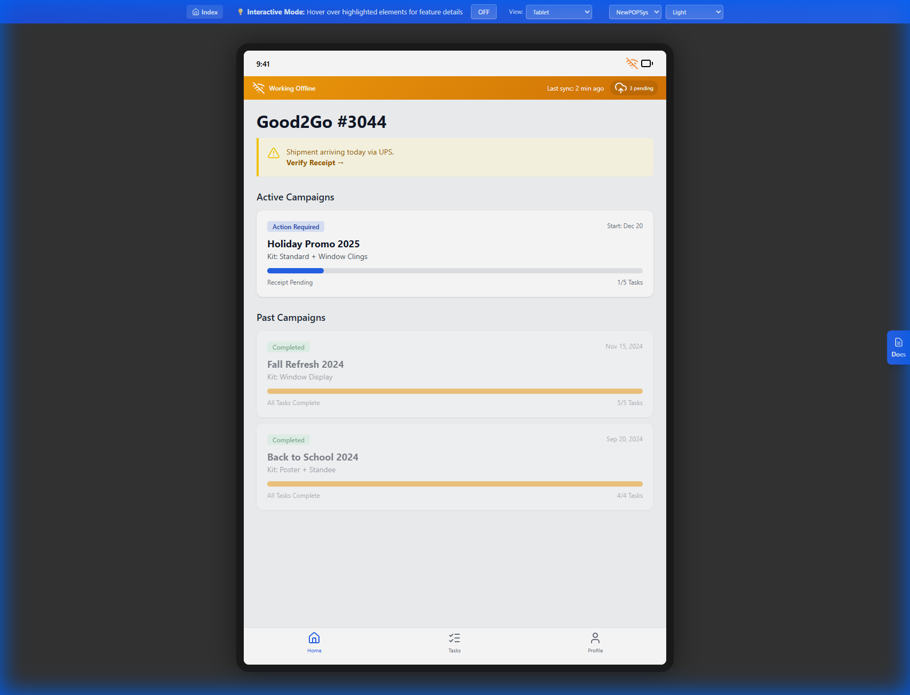
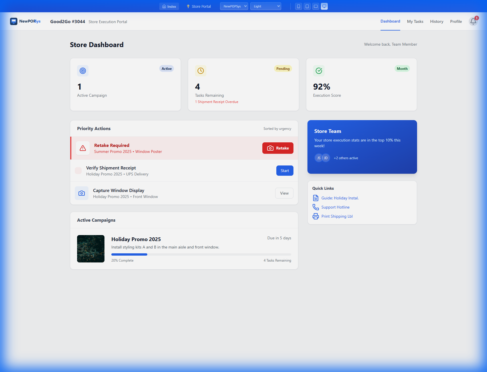
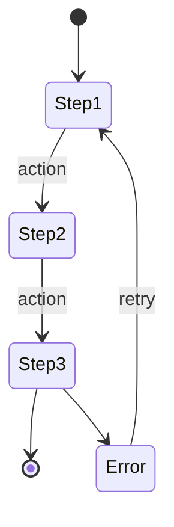

# M002 - Dashboard Screen

> **Module**: Store Execution (Mobile PWA)
> **Screen ID**: M002
> **Route**: `/app/dashboard`
> **IEEE 830 Section**: 3.2.1 - User Interface Requirements
> **Version**: 1.1
> **Last Updated**: 2026-01-02

---

## 1. Screen Overview

### 1.1 Purpose

The Dashboard screen serves as the primary hub for store personnel after authentication. It displays active campaigns assigned to the user's store, providing at-a-glance status information and navigation to execution workflows. The dashboard aggregates campaign progress, pending tasks, and urgent notifications.

### 1.2 Scope

This specification covers:
- Campaign card display and filtering
- StorePhase status derivation and display
- Notification badge system
- Quick action navigation
- Data refresh and synchronization

### 1.3 Screenshot Reference

| Mobile View | Tablet View | Desktop View |
| :--- | :--- | :--- |
|  |  |  |

### 1.4 Source Documents

| Document | Reference |
|----------|-----------|
| Screen Spec | [M02_Dashboard.md](../../../../06_Screen_Specs/M02_Dashboard.md) |
| SUPP Reference | SUPP-017 (Campaign Lifecycle) |
| Database Model | [3.1_Database_Model.md](../../03_System_Architecture/3.1_Database_Model.md) |

---

## 2. User Roles & Permissions

### 2.1 Authorized Roles

| Role | Access Level | Visible Campaigns |
|------|--------------|-------------------|
| Store Manager (P07) | Full | All store campaigns |
| Store Operator (P08) | Execute | Assigned campaigns only |

### 2.2 Role Requirements

| Req ID | Requirement | Priority |
|--------|-------------|----------|
| REQ-M002-ROLE-001 | Store Manager SHALL view all campaigns for their store | Must |
| REQ-M002-ROLE-002 | Store Operator SHALL view only campaigns where assigned | Must |
| REQ-M002-ROLE-003 | System SHALL filter campaigns based on user membership scope | Must |

### 2.3 Permission Matrix

| Action | Store Manager | Store Operator |
|--------|---------------|----------------|
| View all campaigns | Yes | No |
| View assigned campaigns | Yes | Yes |
| Access campaign details | Yes | Yes |
| View store analytics | Yes | No |

---

## 3. UI Components

### 3.1 Component Inventory

| Component ID | Type | Description | Required |
|--------------|------|-------------|----------|
| COMP-M002-001 | Header | Store name, notification bell, profile icon | Yes |
| COMP-M002-002 | Notification Badge | Unread count indicator | Conditional |
| COMP-M002-003 | Filter Tabs | Status filter (All, Active, Pending, Complete) | Yes |
| COMP-M002-004 | Campaign Card | Campaign summary with status | Yes |
| COMP-M002-005 | Progress Indicator | Visual progress bar per campaign | Yes |
| COMP-M002-006 | Quick Stats | Summary metrics row | Yes |
| COMP-M002-007 | Pull Refresh | Gesture to refresh data | Yes |
| COMP-M002-008 | Empty State | Display when no campaigns | Conditional |

### 3.2 Component Requirements

| Req ID | Requirement | Priority |
|--------|-------------|----------|
| REQ-M002-UI-001 | Header SHALL display current store name | Must |
| REQ-M002-UI-002 | Notification bell SHALL show unread count badge | Must |
| REQ-M002-UI-003 | Filter tabs SHALL persist selection across sessions | Should |
| REQ-M002-UI-004 | Campaign cards SHALL display StorePhase status | Must |
| REQ-M002-UI-005 | Progress bar SHALL reflect completion percentage | Must |
| REQ-M002-UI-006 | Pull-to-refresh SHALL trigger data sync | Must |

### 3.3 Layout Specification


### 3.4 Campaign Card Detail


---

## 4. Data Requirements

### 4.1 Data Sources

| Entity | Fields | Access |
|--------|--------|--------|
| `StoreAssignment` | id, campaign_id, store_id, status, pinned_layout_id | Read |
| `Campaign` | id, name, brand_id, install_start, install_end, status | Read |
| `Brand` | id, name, logo_url | Read |
| `Store` | id, store_number, name | Read |
| `AssignmentItem` | id, assignment_id, item_status | Read (aggregate) |
| `Notification` | id, user_id, type, read_at | Read |

### 4.2 Computed Fields

| Field | Derivation Logic |
|-------|------------------|
| `store_phase` | Computed from assignment statuses (see 7.1) |
| `completion_percentage` | (completed_items / total_items) * 100 |
| `unread_notifications` | COUNT(notifications WHERE read_at IS NULL) |
| `pending_retakes` | COUNT(photo_uploads WHERE review_status = 'REJECTED') |

### 4.3 Data Requirements

| Req ID | Requirement | Priority |
|--------|-------------|----------|
| REQ-M002-DATA-001 | System SHALL load assignments for current store context | Must |
| REQ-M002-DATA-002 | System SHALL compute StorePhase from assignment data | Must |
| REQ-M002-DATA-003 | System SHALL cache campaign data for offline access | Must |
| REQ-M002-DATA-004 | System SHALL refresh data on pull-to-refresh gesture | Must |
| REQ-M002-DATA-005 | System SHALL update notification count in real-time | Should |

---

## 5. Business Rules & Validation

### 5.1 StorePhase Derivation

| StorePhase | Condition |
|------------|-----------|
| `AWAITING_SHIPMENT` | No shipments created OR all shipments pending |
| `SHIPMENT_IN_TRANSIT` | Any shipment has carrier tracking, not delivered |
| `READY_TO_RECEIVE` | Shipment delivered, receipt not confirmed |
| `RECEIVING` | Some items received, not all |
| `READY_TO_INSTALL` | All items received, installation not started |
| `INSTALLING` | Some items installed, not all |
| `AWAITING_VERIFICATION` | All installed, photos pending review |
| `REWORK_REQUIRED` | Any photo rejected |
| `COMPLETE` | All photos approved, attestation submitted |

### 5.2 Filter Rules

| Filter | Query Condition |
|--------|-----------------|
| All | No filter applied |
| Active | `store_phase NOT IN ('COMPLETE', 'AWAITING_SHIPMENT')` |
| Pending | `store_phase = 'AWAITING_SHIPMENT'` |
| Complete | `store_phase = 'COMPLETE'` |

### 5.3 Notification Types

| Type Code | Display | Priority |
|-----------|---------|----------|
| `SHIPMENT_DELIVERED` | "Shipment delivered" | High |
| `PHOTO_REJECTED` | "Photos need retake" | High |
| `CAMPAIGN_REMINDER` | "Due date approaching" | Medium |
| `ISSUE_RESOLVED` | "Issue resolved" | Low |

### 5.4 Business Rule Requirements

| Req ID | Requirement | Priority |
|--------|-------------|----------|
| REQ-M002-BR-001 | StorePhase SHALL be computed on each data refresh | Must |
| REQ-M002-BR-002 | Campaigns SHALL be sorted by install_end date ascending | Must |
| REQ-M002-BR-003 | Campaigns past install_end SHALL show warning indicator | Should |
| REQ-M002-BR-004 | High priority notifications SHALL show alert badge | Must |

---

## 6. API Integration Points

### 6.1 Get Store Assignments

| Property | Value |
|----------|-------|
| **Endpoint** | `GET /api/v1/stores/{storeId}/assignments` |
| **Auth Required** | Bearer token |
| **Cache** | 5 minutes |

#### Query Parameters

| Parameter | Type | Required | Description |
|-----------|------|----------|-------------|
| `status` | Enum | No | Filter by assignment status |
| `include` | String | No | Comma-separated: campaign,items,photos |

#### Response Schema

```json
{
  "data": [
    {
      "id": "uuid",
      "campaign": {
        "id": "uuid",
        "name": "Summer Promo 2026",
        "brand": { "id": "uuid", "name": "Acme", "logo_url": "..." },
        "install_start": "2026-01-10",
        "install_end": "2026-01-15",
        "status": "PUBLISHED"
      },
      "status": "IN_PROGRESS",
      "store_phase": "INSTALLING",
      "item_counts": {
        "total": 12,
        "received": 8,
        "installed": 5,
        "photos_approved": 3,
        "photos_rejected": 2
      },
      "completion_percentage": 65
    }
  ],
  "meta": {
    "total": 10,
    "unread_notifications": 3
  }
}
```

### 6.2 Get Notifications

| Property | Value |
|----------|-------|
| **Endpoint** | `GET /api/v1/users/me/notifications` |
| **Auth Required** | Bearer token |

#### Query Parameters

| Parameter | Type | Required | Description |
|-----------|------|----------|-------------|
| `unread_only` | Boolean | No | Filter to unread only |
| `limit` | Integer | No | Max notifications (default 20) |

### 6.3 API Requirements

| Req ID | Requirement | Priority |
|--------|-------------|----------|
| REQ-M002-API-001 | System SHALL request assignments with campaign include | Must |
| REQ-M002-API-002 | System SHALL poll notifications every 60 seconds | Should |
| REQ-M002-API-003 | System SHALL implement pagination for large datasets | Must |
| REQ-M002-API-004 | System SHALL use ETag caching for efficiency | Should |

---

## 7. State Transitions

### 7.1 StorePhase State Machine





### 7.2 Dashboard View State

```
[LOADING]
    │
    ├──► [ERROR] ──► [RETRY]
    │
    │ Data loaded
    â–¼
[DISPLAYING]
    │
    ├──► [REFRESHING] ──► [DISPLAYING]
    │
    │ User taps campaign
    â–¼
[NAVIGATING]
```

### 7.3 State Requirements

| Req ID | Requirement | Priority |
|--------|-------------|----------|
| REQ-M002-STATE-001 | System SHALL show loading skeleton on initial load | Must |
| REQ-M002-STATE-002 | System SHALL preserve scroll position after refresh | Should |
| REQ-M002-STATE-003 | System SHALL show cached data while refreshing | Must |
| REQ-M002-STATE-004 | System SHALL update notification badge in real-time | Should |

---

## 8. Error Handling

### 8.1 Error Scenarios

| Scenario | User Message | Recovery Action |
|----------|--------------|-----------------|
| Network unavailable | "You're offline. Showing cached data." | Use IndexedDB cache |
| API timeout | "Taking longer than expected..." | Retry with backoff |
| 401 Unauthorized | Redirect to login | Clear tokens, navigate to M001 |
| 500 Server Error | "Something went wrong. Pull to retry." | Retry on pull refresh |
| No campaigns | "No campaigns assigned to your store." | Empty state illustration |

### 8.2 Offline Behavior

| Feature | Offline Support |
|---------|-----------------|
| View campaigns | Yes, from cache |
| View progress | Yes, from cache |
| Navigate to tasks | Yes |
| Pull to refresh | Queued until online |
| Notification count | Cached value |

### 8.3 Error Requirements

| Req ID | Requirement | Priority |
|--------|-------------|----------|
| REQ-M002-ERR-001 | System SHALL display cached data when offline | Must |
| REQ-M002-ERR-002 | System SHALL show offline indicator in header | Must |
| REQ-M002-ERR-003 | System SHALL queue refresh requests when offline | Must |
| REQ-M002-ERR-004 | System SHALL auto-refresh when connection restored | Should |

---

## 9. Accessibility Requirements

### 9.1 WCAG 2.1 AA Compliance

| Req ID | Requirement | WCAG Criterion | Priority |
|--------|-------------|----------------|----------|
| REQ-M002-A11Y-001 | Campaign cards SHALL be focusable and activatable | 2.1.1 Keyboard | Must |
| REQ-M002-A11Y-002 | Progress SHALL be announced as percentage | 4.1.2 Name, Role, Value | Must |
| REQ-M002-A11Y-003 | Status badges SHALL have text alternatives | 1.1.1 Non-text Content | Must |
| REQ-M002-A11Y-004 | Pull refresh SHALL have keyboard alternative | 2.1.1 Keyboard | Must |
| REQ-M002-A11Y-005 | Filter tabs SHALL indicate selected state | 4.1.2 Name, Role, Value | Must |

### 9.2 Screen Reader Announcements

| Element | Announcement |
|---------|--------------|
| Campaign Card | "Summer Promo 2026, 65 percent complete, status installing, due January 15th" |
| Notification Badge | "3 unread notifications" |
| Refresh Complete | "Dashboard refreshed, 10 campaigns loaded" |
| Empty State | "No campaigns assigned to your store" |

### 9.3 ARIA Implementation

```html
<section aria-label="Campaign List" role="list">
  <article role="listitem" tabindex="0"
           aria-label="Summer Promo 2026, 65% complete">
    <h2>Summer Promo 2026</h2>
    <div role="progressbar" aria-valuenow="65"
         aria-valuemin="0" aria-valuemax="100">
      65%
    </div>
    <span class="status" aria-label="Status: Installing">
      INSTALLING
    </span>
  </article>
</section>
```

---

## 10. Acceptance Criteria

### 10.1 Functional Acceptance

| AC ID | Criterion | Verification Method |
|-------|-----------|---------------------|
| AC-M002-001 | Dashboard displays all campaigns for store | API integration test |
| AC-M002-002 | Filter tabs correctly filter campaign list | Manual test |
| AC-M002-003 | StorePhase accurately reflects assignment state | Unit test |
| AC-M002-004 | Notification badge shows unread count | Manual test |
| AC-M002-005 | Tapping campaign navigates to detail screen | E2E test |
| AC-M002-006 | Pull-to-refresh updates data | Manual test |
| AC-M002-007 | Quick stats show correct counts | Automated test |
| AC-M002-008 | Campaign cards show progress percentage | Manual test |

### 10.2 Non-Functional Acceptance

| AC ID | Criterion | Target | Verification |
|-------|-----------|--------|--------------|
| AC-M002-NF-001 | Initial load time | < 2 seconds | Performance test |
| AC-M002-NF-002 | Refresh time | < 1 second | Performance test |
| AC-M002-NF-003 | Offline data available | Within 100ms | Offline test |
| AC-M002-NF-004 | Smooth scrolling | 60 FPS | Frame rate test |

### 10.3 Edge Cases

| AC ID | Criterion | Verification |
|-------|-----------|--------------|
| AC-M002-EC-001 | Handle 100+ campaigns without performance degradation | Load test |
| AC-M002-EC-002 | Handle 0 campaigns with empty state | Manual test |
| AC-M002-EC-003 | Handle campaign with missing brand data | Error handling test |
| AC-M002-EC-004 | Handle stale cache gracefully | Cache invalidation test |

---

## 11. Traceability Matrix

| Requirement | Source | Test Case |
|-------------|--------|-----------|
| REQ-M002-ROLE-001 | SUPP-003 | TC-M002-001 |
| REQ-M002-DATA-002 | SUPP-017 | TC-M002-002 |
| REQ-M002-BR-001 | SUPP-017 | TC-M002-003 |
| REQ-M002-API-001 | API Spec | TC-M002-004 |
| REQ-M002-A11Y-001 | WCAG 2.1 | TC-M002-005 |

---

*Document Status: Complete*
*IEEE 830 Compliance: Section 3.2.1 - User Interface Requirements*
