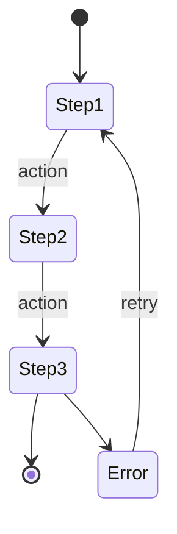

# M008 - Photo Retake

> **Module**: Store Execution (Mobile PWA)
> **Screen ID**: M008
> **Route**: `/app/campaign/:id/retake`
> **IEEE 830 Section**: 3.2.8 - User Interface Requirements
> **Version**: 1.1
> **Last Updated**: 2026-01-02

---

## 1. Screen Overview

### 1.1 Purpose

The Photo Retake screen guides store users through the process of recapturing rejected installation photos. It displays rejection reasons and admin feedback, provides side-by-side comparison between rejected and replacement photos, and manages the supersession workflow where new photos replace rejected ones.

### 1.2 Scope

This specification covers:
- Display of rejected photos with rejection reasons
- Admin comment viewing for retake guidance
- Camera integration for replacement photo capture
- Side-by-side before/after comparison
- Photo supersession workflow (old -> SUPERSEDED, new -> PENDING)

### 1.3 Screenshot Reference


*(Note: View shows the review state after capture; Tablet/Desktop modes scale responsively)*

### 1.4 Source Documents

| Document | Reference |
|----------|-----------|
| Screen Spec | [M08_Retake.md](../../../../06_Screen_Specs/M08_Retake.md) |
| SUPP Reference | SUPP-018 (Photo Review), SUPP-037 (Store Surveys) |
| Photo Capture | [M005_Photo_Capture.md](./M005_Photo_Capture.md) |

---

## 2. User Roles & Permissions

### 2.1 Authorized Roles

| Role | Access Level | Description |
|------|--------------|-------------|
| Store Manager (P07) | Full | Can view rejections and submit retakes |
| Store Operator (P08) | Execute | Can view rejections and submit retakes for assigned tasks |

### 2.2 Role Requirements

| Req ID | Requirement | Priority |
|--------|-------------|----------|
| REQ-M008-ROLE-001 | System SHALL display rejected photos only for user's assigned store | Must |
| REQ-M008-ROLE-002 | System SHALL allow retake submission for both STORE_MANAGER and STORE_OPERATOR | Must |
| REQ-M008-ROLE-003 | System SHALL associate new photos with the authenticated user | Must |

### 2.3 Permission Constraints

- User must have active `Membership` for the store
- Assignment must belong to user's store
- Campaign must still be in active install window or grace period

---

## 3. UI Components

### 3.1 Component Inventory

| Component ID | Type | Description | Required |
|--------------|------|-------------|----------|
| COMP-M008-001 | Header | App bar with "Retake Required" and campaign name | Yes |
| COMP-M008-002 | Rejected Photo Card | Card with dimmed rejected image and X overlay | Yes |
| COMP-M008-003 | Rejection Badge | Chip displaying reason code (e.g., "Wrong Angle") | Yes |
| COMP-M008-004 | Admin Comment | Text block with reviewer's instructions | Yes |
| COMP-M008-005 | Original Image | Thumbnail of rejected photo (dimmed) | Yes |
| COMP-M008-006 | Retake Button | Primary button to open camera | Yes |
| COMP-M008-007 | New Photo Preview | Replacement photo after capture | Conditional |
| COMP-M008-008 | Side-by-Side View | Before/after comparison layout | Conditional |
| COMP-M008-009 | Retake Again Button | Secondary button to recapture | Conditional |
| COMP-M008-010 | Submit Button | Primary button to finalize retake | Conditional |
| COMP-M008-011 | Multiple Retakes List | List view when multiple photos rejected | Conditional |

### 3.2 Component Requirements

| Req ID | Requirement | Priority |
|--------|-------------|----------|
| REQ-M008-UI-001 | Rejected photo SHALL display with dimmed overlay and X mark | Must |
| REQ-M008-UI-002 | Rejection reason SHALL display as colored badge/chip | Must |
| REQ-M008-UI-003 | Admin comment SHALL display in full below rejection reason | Must |
| REQ-M008-UI-004 | Side-by-side view SHALL show before (rejected) and after (new) | Must |
| REQ-M008-UI-005 | Submit button SHALL be disabled until new photo captured | Must |
| REQ-M008-UI-006 | Multiple retakes SHALL be listable with individual navigation | Must |

### 3.3 Single Retake Card Layout


### 3.4 After Capture Layout


### 3.5 Multiple Retakes List Layout


---

## 4. Data Requirements

### 4.1 Input Data

| Field | Type | Validation | Source |
|-------|------|------------|--------|
| `campaign_id` | UUID | Required, valid campaign | Navigation param |
| `assignment_item_ids` | UUID[] | Optional, filter to specific items | Deep link param |

### 4.2 Output Data

| Field | Type | Description | Destination |
|-------|------|-------------|-------------|
| `new_photo_id` | UUID | Created PhotoUpload record | API |
| `old_photo_id` | UUID | Superseded PhotoUpload record | API |
| `upload_status` | Enum | PENDING (new photo status) | Database |
| `superseded_status` | Enum | SUPERSEDED (old photo status) | Database |

### 4.3 Data Model References

| Entity | Fields Used | Access |
|--------|-------------|--------|
| `PhotoUpload` | id, file_url, review_status, assignment_item_id | Read/Write |
| `PhotoReview` | status, rejection_reason, admin_comment, reviewed_at | Read |
| `AssignmentItem` | id, item_status, location_slot_id | Read/Write |
| `KitItem` | name, description, photo_rule_id | Read |
| `PhotoRule` | ghost_image_url, instructions | Read |

### 4.4 Status Transitions

```
PhotoUpload (old):
  review_status: REJECTED -> SUPERSEDED (after retake submitted)

PhotoUpload (new):
  Created with review_status: PENDING

AssignmentItem:
  item_status: RETAKE_REQUIRED -> PROOF_SUBMITTED (after retake)
```

### 4.5 Data Requirements

| Req ID | Requirement | Priority |
|--------|-------------|----------|
| REQ-M008-DATA-001 | System SHALL load rejection reason and admin comment for each photo | Must |
| REQ-M008-DATA-002 | System SHALL mark old photo as SUPERSEDED after new photo submitted | Must |
| REQ-M008-DATA-003 | System SHALL create new PhotoUpload linked to same AssignmentItem | Must |
| REQ-M008-DATA-004 | System SHALL update AssignmentItem.item_status to PROOF_SUBMITTED | Must |

---

## 5. Business Rules & Validation

### 5.1 Rejection Reason Codes

| Code | Display Text | Guidance |
|------|--------------|----------|
| WRONG_ANGLE | "Wrong Angle" | Capture straight-on |
| TOO_DARK | "Too Dark" | Use flash or better lighting |
| BLURRY | "Blurry" | Hold device steady |
| WRONG_ITEM | "Wrong Item" | Photo shows incorrect item |
| INCOMPLETE | "Incomplete" | Full item must be visible |
| OBSTRUCTED | "Obstructed" | Remove objects blocking view |
| OTHER | "Other" | See admin comment |

### 5.2 Retake Workflow Rules

| Rule ID | Rule | Implementation |
|---------|------|----------------|
| BR-M008-001 | Retake uses same PhotoRule as original | Load PhotoRule from AssignmentItem |
| BR-M008-002 | Ghost image available for retake | Display same ghost_image_url |
| BR-M008-003 | Old photo linked via supersedes_id | Store reference to replaced photo |
| BR-M008-004 | Multiple retakes submitted together | Batch submission supported |

### 5.3 Photo Supersession Rules

| Rule ID | Rule | Value |
|---------|------|-------|
| BR-M008-005 | Only REJECTED photos can be superseded | Validate status before supersede |
| BR-M008-006 | Superseded photos retained for audit | Never delete, only mark SUPERSEDED |
| BR-M008-007 | New photo inherits assignment item link | Same assignment_item_id |
| BR-M008-008 | Review status reset to PENDING | Await new brand review |

### 5.4 Deep Link Format

```
newpopsys://app/campaign/{campaignId}/retake?items={assignmentItemIds}
```

### 5.5 Validation Requirements

| Req ID | Requirement | Priority |
|--------|-------------|----------|
| REQ-M008-VAL-001 | System SHALL validate campaign belongs to user's store | Must |
| REQ-M008-VAL-002 | System SHALL validate photo is in REJECTED status before retake | Must |
| REQ-M008-VAL-003 | System SHALL require new photo before enabling submit | Must |
| REQ-M008-VAL-004 | System SHALL validate all retakes complete before "Submit All" | Must |

---

## 6. API Integration Points

### 6.1 Get Rejected Photos

| Property | Value |
|----------|-------|
| **Endpoint** | `GET /api/v1/assignments/{id}/photos?status=REJECTED` |
| **Auth Required** | Yes (Bearer token) |

#### Response Schema (Success - 200)

```json
{
  "rejected_photos": [
    {
      "id": "uuid",
      "file_url": "https://cdn.example.com/photos/uuid.jpg",
      "thumbnail_url": "https://cdn.example.com/thumbs/uuid.jpg",
      "assignment_item_id": "uuid",
      "kit_item": {
        "name": "Front Window Poster",
        "description": "Main promotional poster"
      },
      "location_slot": {
        "name": "Front Window"
      },
      "review": {
        "rejection_reason": "WRONG_ANGLE",
        "admin_comment": "Please capture the poster straight-on, not at an angle. Ensure all corners are visible.",
        "reviewed_at": "2026-01-01T10:00:00Z",
        "reviewer_name": "Jane Admin"
      },
      "photo_rule": {
        "ghost_image_url": "https://cdn.example.com/ghosts/poster.png",
        "instructions": "Align poster with outline"
      }
    }
  ]
}
```

### 6.2 Create Retake Photo

| Property | Value |
|----------|-------|
| **Endpoint** | `POST /api/v1/photos` |
| **Auth Required** | Yes (Bearer token) |

#### Request Schema

```json
{
  "assignment_item_id": "uuid",
  "supersedes_id": "uuid",
  "captured_at": "2026-01-01T14:30:00Z",
  "device_model": "iPhone 14",
  "gps_latitude": 40.7128,
  "gps_longitude": -74.0060
}
```

### 6.3 Confirm Upload

| Property | Value |
|----------|-------|
| **Endpoint** | `PATCH /api/v1/photos/{id}/confirm` |
| **Auth Required** | Yes (Bearer token) |

### 6.4 Mark Photo Superseded

| Property | Value |
|----------|-------|
| **Endpoint** | `PATCH /api/v1/photos/{oldId}/supersede` |
| **Auth Required** | Yes (Bearer token) |

#### Request Schema

```json
{
  "superseded_by": "uuid"
}
```

#### Response Schema (Success - 200)

```json
{
  "id": "uuid",
  "review_status": "SUPERSEDED",
  "superseded_by": "uuid",
  "superseded_at": "2026-01-01T14:35:00Z"
}
```

### 6.5 API Requirements

| Req ID | Requirement | Priority |
|--------|-------------|----------|
| REQ-M008-API-001 | System SHALL include PhotoReview data in rejected photos response | Must |
| REQ-M008-API-002 | System SHALL link new photo to superseded photo via supersedes_id | Must |
| REQ-M008-API-003 | System SHALL update old photo status to SUPERSEDED | Must |
| REQ-M008-API-004 | System SHALL update AssignmentItem status after successful retake | Must |

---

## 7. State Transitions

### 7.1 Retake Flow State Machine





### 7.2 Photo Status State Machine


### 7.3 Assignment Item State Machine


### 7.4 State Requirements

| Req ID | Requirement | Priority |
|--------|-------------|----------|
| REQ-M008-STATE-001 | System SHALL update old photo to SUPERSEDED after successful upload | Must |
| REQ-M008-STATE-002 | System SHALL create new photo with PENDING status | Must |
| REQ-M008-STATE-003 | System SHALL update assignment item to PROOF_SUBMITTED | Must |
| REQ-M008-STATE-004 | System SHALL return to Dashboard after all retakes complete | Must |

---

## 8. Error Handling

### 8.1 Error Categories

| Category | Handling Approach |
|----------|-------------------|
| Network Errors | Queue for offline retry |
| Camera Errors | Fallback to gallery selection |
| Upload Failure | Retry with progress indicator |
| Session Expired | Redirect to login, preserve progress |

### 8.2 Error Messages

| Error Code | User Message | Technical Action |
|------------|--------------|------------------|
| `NO_REJECTIONS` | "No photos require retake." | Navigate to Dashboard |
| `PHOTO_NOT_REJECTED` | "This photo is no longer pending retake." | Refresh rejection list |
| `UPLOAD_FAILED` | "Upload failed. Will retry automatically." | Queue for background retry |
| `CAMERA_ERROR` | "Unable to access camera. Try again." | Retry button |
| `NETWORK_ERROR` | "Unable to connect. Retake saved locally." | Queue for sync |

### 8.3 Offline Behavior

| Action | Behavior |
|--------|----------|
| View rejections | Cached from last sync |
| Capture retake | Saved locally |
| Submit | Queued for upload when online |
| Status update | Synced when connection restored |

### 8.4 Error Requirements

| Req ID | Requirement | Priority |
|--------|-------------|----------|
| REQ-M008-ERR-001 | System SHALL cache rejection data for offline viewing | Should |
| REQ-M008-ERR-002 | System SHALL queue retake photos for background upload | Must |
| REQ-M008-ERR-003 | System SHALL handle expired sessions gracefully | Must |
| REQ-M008-ERR-004 | System SHALL refresh rejection list if status changed | Must |

---

## 9. Accessibility Requirements

### 9.1 WCAG 2.1 AA Compliance

| Req ID | Requirement | WCAG Criterion | Priority |
|--------|-------------|----------------|----------|
| REQ-M008-A11Y-001 | Rejection reasons SHALL be readable by screen readers | 1.1.1 Non-text Content | Must |
| REQ-M008-A11Y-002 | Side-by-side images SHALL have alt text | 1.1.1 Non-text Content | Must |
| REQ-M008-A11Y-003 | Buttons SHALL be navigable via keyboard/switch | 2.1.1 Keyboard | Must |
| REQ-M008-A11Y-004 | Status changes SHALL be announced | 4.1.3 Status Messages | Must |
| REQ-M008-A11Y-005 | Touch targets SHALL be minimum 44x44 pixels | 2.5.5 Target Size | Must |

### 9.2 Assistive Technology Support

| Feature | Implementation |
|---------|----------------|
| Screen Reader | ARIA labels on images, live regions for status |
| Voice Control | Named buttons ("Retake Photo", "Submit") |
| Image Descriptions | Alt text describing rejection reason context |
| High Contrast | Rejection badge visible in all modes |

### 9.3 ARIA Implementation

```html
<main role="main" aria-labelledby="retake-heading">
  <h1 id="retake-heading">Retake Required</h1>
  <h2>Front Window Poster</h2>

  <figure role="group" aria-labelledby="rejected-caption">
    
    <figcaption id="rejected-caption">
      <span id="rejection-reason" role="status">
        Rejected: Wrong Angle
      </span>
    </figcaption>
  </figure>

  <blockquote aria-label="Reviewer feedback">
    Please capture the poster straight-on, not at an angle.
    Ensure all corners are visible.
  </blockquote>

  <button aria-label="Open camera to retake photo">
    Retake Photo
  </button>

  <div role="region" aria-labelledby="comparison-heading" hidden>
    <h3 id="comparison-heading">Comparison</h3>
    <div role="group" aria-label="Before and after photos">
      
      
    </div>
    <button>Retake Again</button>
    <button>Submit Replacement</button>
  </div>
</main>
```

---

## 10. Acceptance Criteria

### 10.1 Functional Acceptance

| AC ID | Criterion | Verification Method |
|-------|-----------|---------------------|
| AC-M008-001 | Screen shows all rejected photos for assignment | API integration test |
| AC-M008-002 | Each rejection displays reason code and admin comment | Manual test |
| AC-M008-003 | Original photo shown with rejection overlay | Manual test |
| AC-M008-004 | Retake button opens camera with ghost image | Manual test |
| AC-M008-005 | Side-by-side comparison after capture | Manual test |
| AC-M008-006 | Submit supersedes old photo, creates new PENDING | E2E test |
| AC-M008-007 | Multiple retakes can be submitted together | E2E test |
| AC-M008-008 | Push notification links directly to retake screen | Deep link test |
| AC-M008-009 | Success returns user to Dashboard | E2E test |

### 10.2 Non-Functional Acceptance

| AC ID | Criterion | Target | Verification |
|-------|-----------|--------|--------------|
| AC-M008-NF-001 | Rejection list load time | < 2 seconds | Performance test |
| AC-M008-NF-002 | Photo comparison render | < 500ms | Performance test |
| AC-M008-NF-003 | Offline retake capture | Functional | Offline test |
| AC-M008-NF-004 | Accessibility score | 100% WCAG 2.1 AA | axe-core audit |

### 10.3 Security Acceptance

| AC ID | Criterion | Verification |
|-------|-----------|--------------|
| AC-M008-SEC-001 | Retakes only visible to store personnel | Permission test |
| AC-M008-SEC-002 | Deep links validate authentication | Security audit |
| AC-M008-SEC-003 | Photo URLs are signed/expiring | Security audit |
| AC-M008-SEC-004 | Supersession audit trail maintained | Data audit |

---

## 11. Traceability Matrix

| Requirement | Source | Test Case |
|-------------|--------|-----------|
| REQ-M008-ROLE-001 | SUPP-018 | TC-M008-001 |
| REQ-M008-UI-001 | SUPP-018 | TC-M008-002 |
| REQ-M008-DATA-002 | SUPP-037 | TC-M008-003 |
| REQ-M008-API-003 | SUPP-018 | TC-M008-004 |
| REQ-M008-A11Y-001 | WCAG 2.1 | TC-M008-005 |

---

## 12. Notification Triggers

When photos are rejected, the system sends notifications:

| Channel | Content |
|---------|---------|
| Push | "Action Required: {X} photos rejected for {Campaign Name}" |
| Email | "Photo Retake Required" with rejection details and deep link |
| In-App | Badge on Dashboard, entry in Tasks list |

---

*Document Status: Complete*
*IEEE 830 Compliance: Section 3.2.8 - User Interface Requirements*
