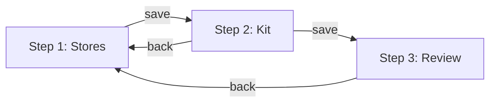
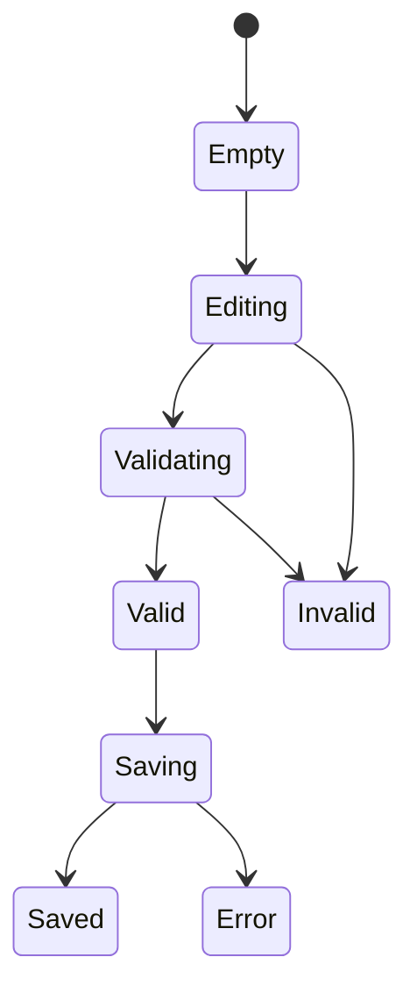

# B003 - Store Selection

> **SRS Section**: 7.1.3 | **Module**: BrandAdmin (B-Series)
> **Version**: 1.0 | **Status**: Draft
> **Last Updated**: 2026-01-01

---

## 1. Screen Overview

### 1.1 Purpose

The Store Selection screen is the first step in the Campaign Builder wizard. It allows campaign creators to define which stores will participate in a campaign using a rule-based "Selection Recipe" system that supports both inclusion and exclusion criteria.

### 1.2 Access Control

| Role | Access Level |
|------|--------------|
| BRAND_ADMIN | Full access |
| CAMPAIGN_MANAGER | Full access (for assigned campaigns) |
| REGIONAL_MANAGER | No access |

### 1.3 Navigation Path

- **Route**: `/admin/campaigns/create/stores` (new campaign)
- **Route**: `/admin/campaigns/:id/edit/stores` (edit existing)
- **Entry Points**:
  - Campaign List: "New Campaign" button
  - Campaign Detail: "Edit" action (draft only)
- **Wizard Position**: Step 1 of 3

### 1.4 Screenshot Reference


---

## 2. User Roles & Permissions

### 2.1 Role-Based Access Matrix

| Capability | BRAND_ADMIN | CAMPAIGN_MANAGER | REGIONAL_MANAGER |
|------------|:-----------:|:----------------:|:----------------:|
| Access store selection wizard | Y | Y* | N |
| View all regions | Y | Y | N |
| View all store groups | Y | Y | N |
| Add inclusion rules | Y | Y | N |
| Add exclusion rules | Y | Y | N |
| Preview store list | Y | Y | N |
| Save and continue | Y | Y | N |

**Legend**: Y = Full access | Y* = Only for assigned campaigns | N = No access

### 2.2 Data Scoping Requirements

| REQ-ID | Requirement |
|--------|-------------|
| REQ-B003-SEC-001 | Store options SHALL be limited to stores within the authenticated user's brand |
| REQ-B003-SEC-002 | Region hierarchy SHALL only display regions belonging to the brand |
| REQ-B003-SEC-003 | Campaign edits SHALL only be allowed when campaign status = DRAFT |

---

## 3. UI Components

### 3.1 Layout Structure


### 3.2 Component Specifications

| Component | Type | Description |
|-----------|------|-------------|
| Wizard Progress | Stepper | Visual step indicator (1/3) |
| Campaign Name | Text input | Required campaign identifier |
| Include Rules | Rule builder | Additive selection criteria |
| Exclude Rules | Rule builder | Subtractive selection criteria |
| Preview Count | Dynamic counter | Real-time store count |
| Store List Modal | Data table modal | Preview selected stores |
| Navigation Buttons | Button group | Cancel, Save & Continue |

### 3.3 Rule Builder Fields

| Field | Operators | Value Options |
|-------|-----------|---------------|
| Region | =, IN | Dropdown of brand regions |
| District | =, IN | Dropdown (filtered by region) |
| Territory | =, IN | Dropdown (filtered by district) |
| Store Group | =, IN | Dropdown of store groups |
| Store Status | =, != | ACTIVE, INACTIVE, ONBOARDING |
| Store Type | =, IN | Multi-select of store types |
| Custom Attribute | =, !=, CONTAINS | Text/value input |

### 3.4 Component States

| State | Campaign Name | Rule Builder | Preview | Actions |
|-------|---------------|--------------|---------|---------|
| Initial | Empty, focused | Empty, hint text | "0 stores" | Disabled |
| Building | Valid input | Rules added | Calculating... | Disabled |
| Ready | Valid input | Valid rules | "234 stores" | Enabled |
| Error | Invalid (red border) | Invalid rule | Error message | Disabled |
| Saving | Readonly | Readonly | Unchanged | Loading spinner |

---

## 4. Data Requirements

### 4.1 Entities & Fields

| Entity | Fields Used | Access |
|--------|-------------|--------|
| `campaigns` | id, name, selection_recipe_json, brand_id | Read/Write |
| `regions` | id, name, parent_region_id | Read |
| `districts` | id, name, region_id | Read |
| `territories` | id, name, district_id | Read |
| `stores` | id, name, store_number, region_id, status | Read |
| `store_groups` | id, name, selection_criteria_json | Read |
| `store_group_memberships` | store_id, group_id | Read |

### 4.2 Selection Recipe Schema

```json
{
  "version": 1,
  "include": [
    {
      "field": "region_id",
      "operator": "IN",
      "values": ["uuid1", "uuid2"]
    },
    {
      "field": "group_id",
      "operator": "=",
      "value": "uuid3"
    }
  ],
  "exclude": [
    {
      "field": "status",
      "operator": "=",
      "value": "INACTIVE"
    }
  ],
  "logic": "AND"
}
```

### 4.3 Data Requirements

| REQ-ID | Requirement |
|--------|-------------|
| REQ-B003-DATA-001 | Selection recipe SHALL be stored as JSONB in `campaigns.selection_recipe_json` |
| REQ-B003-DATA-002 | Store preview count SHALL be calculated server-side for accuracy |
| REQ-B003-DATA-003 | Region hierarchy SHALL support unlimited nesting depth |
| REQ-B003-DATA-004 | Store groups SHALL resolve membership at query time (dynamic) |

---

## 5. Business Rules & Validation

### 5.1 Campaign Name Validation

| REQ-ID | Rule |
|--------|------|
| REQ-B003-BR-001 | Campaign name SHALL be required (minimum 3 characters) |
| REQ-B003-BR-002 | Campaign name SHALL be unique within brand (case-insensitive) |
| REQ-B003-BR-003 | Campaign name SHALL not exceed 100 characters |

### 5.2 Selection Recipe Rules

| REQ-ID | Rule |
|--------|------|
| REQ-B003-BR-004 | At least one inclusion rule SHALL be required |
| REQ-B003-BR-005 | Exclusion rules SHALL be optional |
| REQ-B003-BR-006 | Inclusion rules SHALL be combined with AND logic |
| REQ-B003-BR-007 | Selection SHALL result in at least one store to proceed |
| REQ-B003-BR-008 | Empty selection SHALL display warning but allow save as draft |

### 5.3 Rule Hierarchy

| REQ-ID | Rule |
|--------|------|
| REQ-B003-BR-009 | Exclusions SHALL be applied after inclusions |
| REQ-B003-BR-010 | District filter SHALL cascade to parent region |
| REQ-B003-BR-011 | Duplicate rules (same field+operator+value) SHALL be prevented |

---

## 6. API Integration Points

### 6.1 API Endpoints

| Endpoint | Method | Purpose |
|----------|--------|---------|
| `/api/v1/campaigns` | POST | Create new campaign |
| `/api/v1/campaigns/{id}` | PATCH | Update campaign |
| `/api/v1/campaigns/{id}/preview-stores` | POST | Preview store count |
| `/api/v1/campaigns/{id}/stores` | GET | List selected stores |
| `/api/v1/regions` | GET | List brand regions |
| `/api/v1/store-groups` | GET | List store groups |

### 6.2 Preview Request

```json
// POST /api/v1/campaigns/{id}/preview-stores
{
  "selectionRecipe": {
    "include": [
      {"field": "region_id", "operator": "IN", "values": ["uuid1"]}
    ],
    "exclude": [
      {"field": "status", "operator": "=", "value": "INACTIVE"}
    ]
  }
}
```

### 6.3 Preview Response

```json
{
  "count": 234,
  "breakdown": {
    "byRegion": [
      {"regionId": "uuid1", "name": "Northeast", "count": 156},
      {"regionId": "uuid2", "name": "Midwest", "count": 78}
    ],
    "byStatus": [
      {"status": "ACTIVE", "count": 234}
    ]
  }
}
```

### 6.4 Save Campaign Request

```json
// PATCH /api/v1/campaigns/{id}
{
  "name": "Summer Promo 2025",
  "selectionRecipe": {
    "version": 1,
    "include": [...],
    "exclude": [...],
    "logic": "AND"
  }
}
```

### 6.5 API Requirements

| REQ-ID | Requirement |
|--------|-------------|
| REQ-B003-API-001 | Preview endpoint SHALL respond within 2 seconds for up to 50,000 stores |
| REQ-B003-API-002 | Preview SHALL be debounced on client (300ms delay) |
| REQ-B003-API-003 | Store list endpoint SHALL support pagination |
| REQ-B003-API-004 | Save SHALL validate recipe before persisting |

---

## 7. State Transitions

### 7.1 Wizard Navigation State Machine



### 7.2 Form State Machine



### 7.3 Preview State

| State | Trigger | Display |
|-------|---------|---------|
| Idle | Initial load | "0 stores selected" |
| Loading | Rule change | "Calculating..." with spinner |
| Ready | Preview success | "{count} stores selected" |
| Warning | Count = 0 | "No stores match criteria" (yellow) |
| Error | Preview failed | "Unable to preview" with retry |

---

## 8. Error Handling

### 8.1 Error Scenarios

| Error | HTTP Code | User Message | Recovery Action |
|-------|-----------|--------------|-----------------|
| Duplicate name | 422 | "Campaign name already exists" | Edit name |
| Invalid recipe | 422 | "Selection rules are invalid" | Fix highlighted rules |
| No stores selected | 422 | "At least one store required to publish" | Add inclusion rules |
| Region not found | 404 | "Selected region no longer exists" | Remove rule |
| Save failed | 500 | "Unable to save campaign" | Retry |
| Session expired | 401 | Redirect to login | Re-authenticate |

### 8.2 Validation Messages

| Field | Validation | Message |
|-------|------------|---------|
| Campaign Name | Required | "Campaign name is required" |
| Campaign Name | Min length | "Name must be at least 3 characters" |
| Campaign Name | Max length | "Name cannot exceed 100 characters" |
| Campaign Name | Unique | "A campaign with this name already exists" |
| Include Rules | Required | "Add at least one inclusion rule" |
| Rule Value | Required | "Select a value for this rule" |

### 8.3 Error Requirements

| REQ-ID | Requirement |
|--------|-------------|
| REQ-B003-ERR-001 | Form validation SHALL occur on blur and on submit |
| REQ-B003-ERR-002 | Inline errors SHALL appear adjacent to invalid fields |
| REQ-B003-ERR-003 | Save errors SHALL preserve all form data |

---

## 9. Accessibility Requirements

| REQ-ID | Requirement | WCAG Criterion |
|--------|-------------|----------------|
| REQ-B003-A11Y-001 | Wizard stepper SHALL announce current step to screen readers | 1.3.1 Info and Relationships |
| REQ-B003-A11Y-002 | Rule builder SHALL support keyboard navigation (Tab, Enter, Escape) | 2.1.1 Keyboard |
| REQ-B003-A11Y-003 | Dropdown options SHALL be filterable via keyboard typing | 2.1.1 Keyboard |
| REQ-B003-A11Y-004 | Form errors SHALL be announced via aria-live regions | 4.1.3 Status Messages |
| REQ-B003-A11Y-005 | Remove rule button SHALL have descriptive aria-label | 4.1.2 Name, Role, Value |
| REQ-B003-A11Y-006 | Preview count SHALL be announced when updated | 4.1.3 Status Messages |
| REQ-B003-A11Y-007 | Focus SHALL move to first error field on validation failure | 2.4.3 Focus Order |

---

## 10. Acceptance Criteria

### 10.1 Functional Requirements

| REQ-ID | Criterion | Priority |
|--------|-----------|----------|
| REQ-B003-FR-001 | User SHALL be able to enter campaign name | Must |
| REQ-B003-FR-002 | User SHALL be able to add inclusion rules | Must |
| REQ-B003-FR-003 | User SHALL be able to add exclusion rules | Must |
| REQ-B003-FR-004 | Rules SHALL support Region, District, Group, Status fields | Must |
| REQ-B003-FR-005 | Preview count SHALL update as rules are modified | Must |
| REQ-B003-FR-006 | User SHALL be able to view full store list | Should |
| REQ-B003-FR-007 | User SHALL be able to remove individual rules | Must |
| REQ-B003-FR-008 | Save SHALL persist campaign and selection recipe | Must |
| REQ-B003-FR-009 | Continue SHALL navigate to Kit Definition step | Must |
| REQ-B003-FR-010 | Cancel SHALL return to Campaign List with confirmation | Should |

### 10.2 Test Scenarios

| Test ID | Scenario | Expected Result |
|---------|----------|-----------------|
| TC-B003-01 | Enter valid campaign name | Name accepted, no errors |
| TC-B003-02 | Enter duplicate campaign name | Error displayed inline |
| TC-B003-03 | Add region inclusion rule | Preview count updates |
| TC-B003-04 | Add status exclusion rule | Preview count reduces |
| TC-B003-05 | Remove all inclusion rules | Warning: "Add at least one rule" |
| TC-B003-06 | Create rules selecting 0 stores | Warning displayed, save allowed |
| TC-B003-07 | Click View Store List | Modal shows matching stores |
| TC-B003-08 | Save & Continue | Navigate to Step 2 |
| TC-B003-09 | Click Cancel with unsaved changes | Confirmation dialog shown |
| TC-B003-10 | Keyboard navigate rule builder | All controls accessible |

---

## 11. Related Screens

| Screen | Relationship |
|--------|--------------|
| [B002 Campaign List](B002_Campaign_List.md) | Entry point, cancel destination |
| [B004 Kit Definition](B004_Kit_Definition.md) | Next wizard step |
| [B006 Store List](B006_Store_List.md) | Store data source |

---

## 12. Revision History

| Version | Date | Author | Changes |
|---------|------|--------|---------|
| 1.0 | 2026-01-01 | System | Initial specification |

---

*Document Status: Draft*
*IEEE 830 Compliance: Section 3.2 - Functional Requirements / Screen Specifications*
