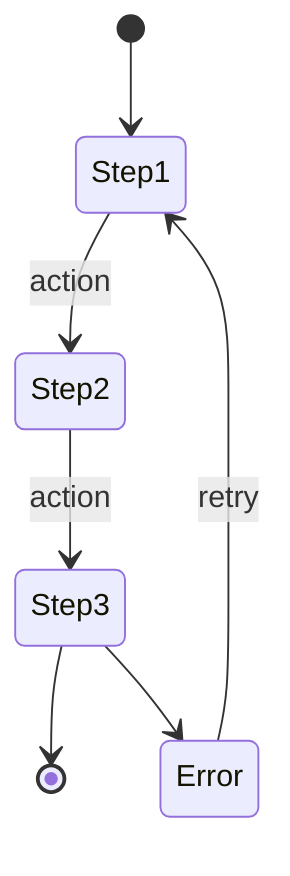

# P002 - Shipments Screen Specification

> **Module**: PSP Operations Portal
> **Screen ID**: P002
> **Route**: `/psp/shipments`
> **Version**: 1.0
> **Last Updated**: 2026-01-01
> **IEEE 830 Reference**: Section 3.2 - Functional Requirements
> **SUPP Reference**: SUPP-016 (Fulfillment - Shipment Processing)

---

## 1. Screen Overview

### 1.1 Purpose

The Shipments screen enables PSP Production Operators to create, track, and manage shipments for fulfilled orders. It provides carrier integration, tracking number management, and delivery status monitoring across all active shipments.

### 1.2 Business Context

This screen represents the final fulfillment stage where completed orders are shipped to stores. Shipment creation triggers webhook events to external systems and updates order status automatically. Carrier tracking integration provides real-time delivery visibility.

### 1.3 Screenshot Reference


### 1.4 Navigation Path

```
PSP Portal → Shipments (sidebar) → /psp/shipments
```

### 1.5 Related Screens

| Screen | Relationship |
|--------|--------------|
| [P001 Order Queue](P001_Order_Queue.md) | Orders ready for shipment |
| [P003 Issues](P003_Issues.md) | Delivery exceptions may trigger issues |

---

## 2. User Roles & Permissions

### 2.1 Authorized Roles

| Role | Access Level | Permissions |
|------|--------------|-------------|
| PLATFORM_ADMIN | Full | View all, create/update shipments, void labels |
| PSP_ADMIN | Full | View all, create/update shipments, void labels |
| PSP_OPS | Operational | View all, create/update shipments |
| Support Agent (PSP_OPS + support_scope) | Read-Only | View only |

### 2.2 Permission Requirements

| Requirement ID | Description | Roles |
|----------------|-------------|-------|
| REQ-P002-SEC-001 | User SHALL be authenticated with valid JWT containing tenant_id | All |
| REQ-P002-SEC-002 | User SHALL have PSP-level role for shipment operations | All |
| REQ-P002-SEC-003 | Void label capability SHALL require PSP_ADMIN or higher | PSP_ADMIN, PLATFORM_ADMIN |
| REQ-P002-SEC-004 | Support Agent SHALL have read-only access | PSP_OPS (support_scope) |

### 2.3 Data Scope

- **Tenant Isolation**: Shipments filtered by JWT tenant_id
- **Order Linkage**: Only shipments for tenant's orders visible
- **Carrier Access**: Carrier credentials scoped to tenant

---

## 3. UI Components

### 3.1 Component Inventory

| Component ID | Type | Description |
|--------------|------|-------------|
| P002-C001 | Page Header | Title, shipment counts |
| P002-C002 | Status Tabs | In Transit, Delivered, Exception, All |
| P002-C003 | Search Bar | Tracking number, order number search |
| P002-C004 | Filter Panel | Carrier, date range, status filters |
| P002-C005 | Shipments Table | Sortable shipment list |
| P002-C006 | Create Shipment Button | Opens shipment creation modal |
| P002-C007 | Shipment Detail Panel | Side panel with tracking details |
| P002-C008 | Create Shipment Modal | Form for new shipment entry |
| P002-C009 | Tracking Link | External carrier tracking link |
| P002-C010 | Carrier Logo | Visual carrier identification |
| P002-C011 | Status Badge | Color-coded shipment status |

### 3.2 Layout Specification


### 3.3 Component Specifications

#### P002-C005: Shipments Table

| Column | Field | Width | Sortable | Default Sort |
|--------|-------|-------|----------|--------------|
| Tracking # | tracking_numbers[0] | 150px | Yes | - |
| Carrier | carrier | 100px | Yes | - |
| Order | order.order_number | 120px | Yes | - |
| Store | store.store_number | 100px | Yes | - |
| Status | status | 100px | Yes | - |
| ETA | estimated_delivery | 100px | Yes | - |
| Created | created_at | 120px | Yes | DESC (default) |

#### P002-C008: Create Shipment Modal


---

## 4. Data Requirements

### 4.1 Entity Mapping

| Entity | Table | Purpose |
|--------|-------|---------|
| Shipment | shipments | Shipment record |
| ShipmentLine | shipment_lines | Items in shipment |
| StoreOrder | store_orders | Parent order |
| OrderLine | order_lines | Order line items |
| Store | stores | Destination store |
| Campaign | campaigns | Campaign reference |

### 4.2 Data Query

```sql
SELECT
  sh.id, sh.carrier, sh.tracking_numbers, sh.status,
  sh.shipped_at, sh.estimated_delivery, sh.delivered_at,
  so.order_number,
  s.store_number, s.name as store_name,
  c.name as campaign_name,
  COUNT(sl.id) as line_count
FROM shipments sh
JOIN store_orders so ON sh.order_id = so.id
JOIN stores s ON so.store_id = s.id
JOIN campaigns c ON so.campaign_id = c.id
LEFT JOIN shipment_lines sl ON sl.shipment_id = sh.id
WHERE sh.tenant_id = :tenant_id
  AND sh.deleted_at IS NULL
  AND sh.status IN (:status_filter)
GROUP BY sh.id, so.id, s.id, c.id
ORDER BY sh.created_at DESC
LIMIT :page_size OFFSET :offset
```

### 4.3 Data Requirements Matrix

| Requirement ID | Description | Validation |
|----------------|-------------|------------|
| REQ-P002-DATA-001 | Shipment list SHALL be scoped to tenant | tenant_id filter |
| REQ-P002-DATA-002 | Tracking numbers SHALL be stored as JSON array | JSONB column |
| REQ-P002-DATA-003 | Carrier status SHALL sync from carrier API | Webhook/polling |
| REQ-P002-DATA-004 | Partial shipments SHALL track quantity_shipped per line | shipment_lines.quantity_shipped |
| REQ-P002-DATA-005 | ETA SHALL update from carrier tracking data | Carrier webhook |

---

## 5. Business Rules & Validation

### 5.1 Shipment Creation Rules

| Requirement ID | Rule | Enforcement |
|----------------|------|-------------|
| REQ-P002-BR-001 | Shipment SHALL only be created for orders in READY_TO_SHIP or later status | API validation |
| REQ-P002-BR-002 | Tracking number SHALL be unique across all shipments | Database constraint |
| REQ-P002-BR-003 | Quantity shipped SHALL NOT exceed quantity ordered minus already shipped | API validation |
| REQ-P002-BR-004 | At least one tracking number SHALL be provided | Form validation |
| REQ-P002-BR-005 | Carrier SHALL be one of: UPS, FEDEX, USPS, DHL, OTHER | Enum validation |

### 5.2 Validation Rules

| Requirement ID | Field | Validation | Error Message |
|----------------|-------|------------|---------------|
| REQ-P002-VAL-001 | order_id | Required, valid order | "Order is required" |
| REQ-P002-VAL-002 | carrier | Required, valid enum | "Carrier is required" |
| REQ-P002-VAL-003 | tracking_numbers | Required, array with 1+ items | "At least one tracking number required" |
| REQ-P002-VAL-004 | tracking_numbers[] | Format validation per carrier | "Invalid tracking number format for carrier" |
| REQ-P002-VAL-005 | quantity_shipped | Positive integer, <= remaining | "Quantity exceeds available" |

### 5.3 Carrier Tracking Format Validation

| Carrier | Format | Example |
|---------|--------|---------|
| UPS | 1Z + 16 alphanumeric | 1Z999AA10123456784 |
| FedEx | 12-22 digits | 748901234567 |
| USPS | 20-22 digits | 9400111899223456789012 |
| DHL | 10 digits | 1234567890 |

### 5.4 Business Constraints

| Requirement ID | Constraint | Rationale |
|----------------|------------|-----------|
| REQ-P002-BC-001 | Shipment creation SHALL trigger webhook event | External system sync |
| REQ-P002-BC-002 | Order status SHALL update to SHIPPED when all items shipped | Automatic transition |
| REQ-P002-BC-003 | Order status SHALL update to PARTIALLY_SHIPPED if partial | Automatic transition |
| REQ-P002-BC-004 | Delivered shipments SHALL NOT be editable | Data integrity |

---

## 6. API Integration Points

### 6.1 API Endpoints

| Endpoint | Method | Purpose | Request | Response |
|----------|--------|---------|---------|----------|
| `/api/v1/shipments` | GET | List shipments | Query params | ShipmentDTO[] |
| `/api/v1/shipments` | POST | Create shipment | CreateShipmentRequest | ShipmentDTO |
| `/api/v1/shipments/{id}` | GET | Shipment detail | Path param | ShipmentDetailDTO |
| `/api/v1/shipments/{id}` | PATCH | Update shipment | UpdateShipmentRequest | ShipmentDTO |
| `/api/v1/shipments/{id}/void` | POST | Void shipment | - | VoidResponse |
| `/api/v1/shipments/{id}/tracking` | GET | Tracking events | Path param | TrackingEventDTO[] |

### 6.2 Request/Response Schemas

#### POST /api/v1/shipments

**Request Schema:**

```json
{
  "order_id": "uuid",
  "carrier": "UPS",
  "tracking_numbers": ["1Z999AA10123456784"],
  "shipped_at": "2025-12-15T10:00:00Z",
  "lines": [
    {
      "order_line_id": "uuid",
      "quantity_shipped": 2
    }
  ]
}
```

**Response Schema:**

```json
{
  "id": "uuid",
  "carrier": "UPS",
  "tracking_numbers": ["1Z999AA10123456784"],
  "status": "LABEL_CREATED",
  "shipped_at": "2025-12-15T10:00:00Z",
  "estimated_delivery": null,
  "order": {
    "id": "uuid",
    "order_number": "ORD-1234"
  },
  "store": {
    "id": "uuid",
    "store_number": "STR-001"
  },
  "lines": [
    {
      "id": "uuid",
      "order_line_id": "uuid",
      "quantity_shipped": 2,
      "item_name": "Window Poster"
    }
  ],
  "created_at": "2025-12-15T10:00:00Z"
}
```

### 6.3 Webhook Events

| Event | Trigger | Payload |
|-------|---------|---------|
| shipment.created | New shipment created | ShipmentDTO |
| shipment.updated | Status/tracking updated | ShipmentDTO |
| shipment.delivered | Carrier confirms delivery | ShipmentDTO |
| shipment.exception | Delivery exception | ShipmentDTO + exception_reason |

### 6.4 Carrier Integration

| Requirement ID | Description | Implementation |
|----------------|-------------|----------------|
| REQ-P002-API-001 | System SHALL support UPS, FedEx, USPS, DHL tracking | Carrier API adapters |
| REQ-P002-API-002 | Tracking status SHALL poll every 4 hours | Background job |
| REQ-P002-API-003 | Carrier webhooks SHALL update status in real-time when available | Webhook receiver |
| REQ-P002-API-004 | Tracking link SHALL open carrier's tracking page | URL template per carrier |

### 6.5 API Requirements

| Requirement ID | Description | Implementation |
|----------------|-------------|----------------|
| REQ-P002-API-005 | All write operations SHALL use Idempotency-Key | Request header |
| REQ-P002-API-006 | Shipment creation SHALL emit webhook within 5 seconds | Async queue |
| REQ-P002-API-007 | Rate limiting SHALL apply: 50 requests/minute per user | API gateway |

---

## 7. State Transitions

### 7.1 Shipment Status State Machine





### 7.2 State Transition Requirements

| Requirement ID | Transition | From | To | Trigger |
|----------------|------------|------|-----|---------|
| REQ-P002-ST-001 | Pickup | LABEL_CREATED | IN_TRANSIT | Carrier scan |
| REQ-P002-ST-002 | Out for Delivery | IN_TRANSIT | OUT_FOR_DELIVERY | Carrier scan |
| REQ-P002-ST-003 | Deliver | IN_TRANSIT/OUT_FOR_DELIVERY | DELIVERED | Carrier confirmation |
| REQ-P002-ST-004 | Exception | IN_TRANSIT | EXCEPTION | Carrier exception event |
| REQ-P002-ST-005 | Return | IN_TRANSIT | RETURNED | Return to sender event |
| REQ-P002-ST-006 | Resolve | EXCEPTION | DELIVERED | Resolution + delivery |

### 7.3 Status Display Mapping

| Status | Badge Color | Display Text | Icon |
|--------|-------------|--------------|------|
| LABEL_CREATED | Gray | Label Created | Tag |
| IN_TRANSIT | Blue | In Transit | Truck |
| OUT_FOR_DELIVERY | Purple | Out for Delivery | MapPin |
| DELIVERED | Green | Delivered | CheckCircle |
| EXCEPTION | Red | Exception | AlertTriangle |
| RETURNED | Orange | Returned | RotateCcw |

---

## 8. Error Handling

### 8.1 Error Scenarios

| Requirement ID | Error Scenario | HTTP Code | User Message | Recovery Action |
|----------------|----------------|-----------|--------------|-----------------|
| REQ-P002-ERR-001 | Invalid order for shipment | 400 | "Order is not ready for shipment." | Show order status |
| REQ-P002-ERR-002 | Duplicate tracking number | 409 | "Tracking number already exists." | Clear field |
| REQ-P002-ERR-003 | Quantity exceeds available | 400 | "Quantity exceeds remaining items." | Show max available |
| REQ-P002-ERR-004 | Invalid tracking format | 400 | "Invalid tracking number format for carrier." | Show format hint |
| REQ-P002-ERR-005 | Carrier API unavailable | 503 | "Carrier tracking temporarily unavailable." | Retry later |
| REQ-P002-ERR-006 | Void failed | 400 | "Cannot void shipment in current status." | Show status |
| REQ-P002-ERR-007 | Order already fully shipped | 400 | "All items already shipped." | Show shipments |

### 8.2 Error Display

| Component | Error Type | Display Method |
|-----------|------------|----------------|
| Create Modal | Validation errors | Inline field errors |
| Create Modal | API errors | Banner at top of modal |
| Table | Load failure | Empty state with retry |
| Tracking | Carrier error | "Tracking unavailable" badge |

### 8.3 Logging Requirements

| Requirement ID | Event | Log Level | Data |
|----------------|-------|-----------|------|
| REQ-P002-LOG-001 | Shipment created | INFO | user_id, shipment_id, order_id |
| REQ-P002-LOG-002 | Tracking update | INFO | shipment_id, old_status, new_status |
| REQ-P002-LOG-003 | Carrier API call | DEBUG | carrier, tracking_number, response |
| REQ-P002-LOG-004 | Webhook sent | INFO | shipment_id, webhook_id, event_type |
| REQ-P002-LOG-005 | Error | ERROR | error_code, message, context |

---

## 9. Accessibility Requirements

### 9.1 WCAG 2.1 AA Compliance

| Requirement ID | Guideline | Implementation |
|----------------|-----------|----------------|
| REQ-P002-A11Y-001 | 1.1.1 Non-text Content | Carrier logos have alt text |
| REQ-P002-A11Y-002 | 1.3.1 Info and Relationships | Modal uses role="dialog" with aria-labelledby |
| REQ-P002-A11Y-003 | 1.4.1 Use of Color | Status uses color + icon + text |
| REQ-P002-A11Y-004 | 2.1.1 Keyboard | Modal traps focus when open |
| REQ-P002-A11Y-005 | 2.4.3 Focus Order | Logical tab order in modal |
| REQ-P002-A11Y-006 | 3.2.2 On Input | Form changes don't auto-submit |
| REQ-P002-A11Y-007 | 3.3.1 Error Identification | Errors associated with fields via aria-describedby |
| REQ-P002-A11Y-008 | 4.1.2 Name, Role, Value | Radio buttons properly grouped |

### 9.2 Keyboard Navigation

| Key | Action |
|-----|--------|
| Tab | Navigate between interactive elements |
| Enter | Activate button, submit modal |
| Space | Select radio button |
| Escape | Close modal, close detail panel |
| Arrow Keys | Navigate radio button group |

### 9.3 Screen Reader Support

| Component | Announcement |
|-----------|--------------|
| Create Modal | "Create Shipment dialog" |
| Carrier Radio | "UPS, radio button, 1 of 4" |
| Tracking Input | "Tracking number, required, text input" |
| Status Badge | "Status: In Transit" |
| Tracking Link | "Track shipment on UPS, opens in new tab" |

---

## 10. Acceptance Criteria

### 10.1 Functional Acceptance Criteria

| Criteria ID | Description | Verification Method |
|-------------|-------------|---------------------|
| REQ-P002-AC-001 | Shipment list displays all shipments for tenant | Query verification |
| REQ-P002-AC-002 | Status tabs filter by shipment status | UI testing |
| REQ-P002-AC-003 | Create Shipment button opens modal | UI testing |
| REQ-P002-AC-004 | Modal validates required fields before submission | UI testing |
| REQ-P002-AC-005 | Valid shipment creation saves to database | API + DB verification |
| REQ-P002-AC-006 | Shipment creation triggers webhook event | Webhook log verification |
| REQ-P002-AC-007 | Order status updates after shipment creation | DB verification |
| REQ-P002-AC-008 | Tracking link opens carrier tracking page | UI testing |
| REQ-P002-AC-009 | Partial shipment correctly updates remaining quantities | DB verification |
| REQ-P002-AC-010 | Duplicate tracking number is rejected | API testing |

### 10.2 Non-Functional Acceptance Criteria

| Criteria ID | Description | Target | Verification |
|-------------|-------------|--------|--------------|
| REQ-P002-AC-011 | Page load time | < 2 seconds | Performance testing |
| REQ-P002-AC-012 | Shipment creation | < 3 seconds | Performance testing |
| REQ-P002-AC-013 | Webhook emission | < 5 seconds after create | Log verification |
| REQ-P002-AC-014 | Carrier tracking sync | < 4 hour staleness | Monitoring |
| REQ-P002-AC-015 | WCAG 2.1 AA compliance | 100% | Accessibility audit |

### 10.3 Integration Acceptance Criteria

| Criteria ID | Description | Verification Method |
|-------------|-------------|---------------------|
| REQ-P002-AC-016 | UPS tracking numbers validated correctly | Unit testing |
| REQ-P002-AC-017 | FedEx tracking numbers validated correctly | Unit testing |
| REQ-P002-AC-018 | USPS tracking numbers validated correctly | Unit testing |
| REQ-P002-AC-019 | Carrier status updates received via webhook | Integration testing |
| REQ-P002-AC-020 | Delivery confirmation updates order status | Integration testing |

### 10.4 Traceability Matrix

| Requirement | Source | Test Case |
|-------------|--------|-----------|
| REQ-P002-BR-001 | SUPP-016 | TC-P002-001 |
| REQ-P002-SEC-001 | SUPP-003 | TC-P002-SEC-001 |
| REQ-P002-DATA-001 | 3.1 Database Model | TC-P002-DATA-001 |
| REQ-P002-API-001 | 3.4 Integration Architecture | TC-P002-API-001 |

---

## Appendix A: Revision History

| Version | Date | Author | Changes |
|---------|------|--------|---------|
| 1.0 | 2026-01-01 | System | Initial specification |

---

*Document Status: Complete*
*IEEE 830 Compliance: Section 3.2 - Functional Requirements*
