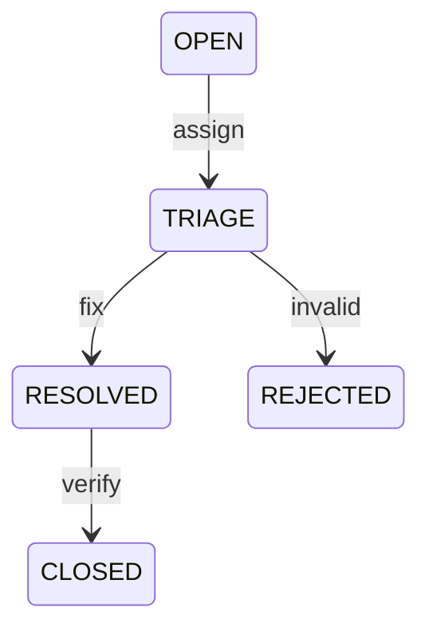

# P003 - Issues Queue Screen Specification

> **Module**: PSP Operations Portal
> **Screen ID**: P003
> **Route**: `/psp/issues`
> **Version**: 1.0
> **Last Updated**: 2026-01-01
> **IEEE 830 Reference**: Section 3.2 - Functional Requirements
> **SUPP Reference**: SUPP-019 (Exception Management)

---

## 1. Screen Overview

### 1.1 Purpose

The Issues Queue screen provides PSP Production Operators with a centralized view of all reported issues requiring triage and resolution. It enables issue review, approval/rejection decisions, and reorder creation for valid claims.

### 1.2 Business Context

This screen manages the exception handling workflow for store-reported problems including missing items, damaged goods, wrong items, and quantity shortages. Approved issues flow into reorder creation and fulfillment, closing the loop on store satisfaction.

### 1.3 Screenshot Reference


### 1.4 Navigation Path

```
PSP Portal → Issues (sidebar) → /psp/issues
```

### 1.5 Related Screens

| Screen | Relationship |
|--------|--------------|
| [P001 Order Queue](P001_Order_Queue.md) | Reorders appear in order queue |
| [P002 Shipments](P002_Shipments.md) | Reorder shipments tracked here |
| M03 Receipt Survey (Mobile) | Store reports issues from this screen |

---

## 2. User Roles & Permissions

### 2.1 Authorized Roles

| Role | Access Level | Permissions |
|------|--------------|-------------|
| PLATFORM_ADMIN | Full | View, triage, approve/reject, create reorders |
| PSP_ADMIN | Full | View, triage, approve/reject, create reorders |
| PSP_OPS | Operational | View, triage, approve/reject (scoped), create reorders |
| Support Agent (PSP_OPS + support_scope) | Read-Only | View only |

### 2.2 Permission Requirements

| Requirement ID | Description | Roles |
|----------------|-------------|-------|
| REQ-P003-SEC-001 | User SHALL be authenticated with valid JWT containing tenant_id | All |
| REQ-P003-SEC-002 | User SHALL have PSP-level role for issue management | All |
| REQ-P003-SEC-003 | PSP_OPS MAY approve issues under configured threshold | PSP_OPS |
| REQ-P003-SEC-004 | PSP_ADMIN required for high-value issue approval | PSP_ADMIN, PLATFORM_ADMIN |
| REQ-P003-SEC-005 | Rejection SHALL require reason and explanation | All with approve rights |

### 2.3 Data Scope

- **Tenant Isolation**: Issues filtered by JWT tenant_id
- **Brand Visibility**: All brands within tenant visible
- **Store Access**: Issues from all stores visible

---

## 3. UI Components

### 3.1 Component Inventory

| Component ID | Type | Description |
|--------------|------|-------------|
| P003-C001 | Page Header | Title, issue counts by status |
| P003-C002 | Status Tabs | Open, Triaged, In Fulfillment, Resolved |
| P003-C003 | Search Bar | Issue ID, store number search |
| P003-C004 | Filter Panel | Type, campaign, date range filters |
| P003-C005 | Issues Table | Sortable issue list |
| P003-C006 | Issue Detail Panel | Side panel with full issue information |
| P003-C007 | Evidence Gallery | Photo viewer for issue evidence |
| P003-C008 | Triage Actions | Approve, Reject, Request Info buttons |
| P003-C009 | Reject Modal | Rejection reason form |
| P003-C010 | Reorder Button | Create replacement order |
| P003-C011 | Status Badge | Color-coded issue status |
| P003-C012 | Type Badge | Issue type indicator |

### 3.2 Layout Specification


### 3.3 Issue Detail Panel


### 3.4 Component Specifications

#### P003-C005: Issues Table

| Column | Field | Width | Sortable | Default Sort |
|--------|-------|-------|----------|--------------|
| Issue # | issue_number | 100px | Yes | - |
| Type | issue_type | 100px | Yes | - |
| Store | store.store_number | 100px | Yes | - |
| Item | kit_item.name | 150px | Yes | - |
| Campaign | campaign.name | 150px | Yes | - |
| Status | status | 100px | Yes | - |
| Age | created_at | 80px | Yes | ASC (FIFO) |

---

## 4. Data Requirements

### 4.1 Entity Mapping

| Entity | Table | Purpose |
|--------|-------|---------|
| IssueRequest | issue_requests | Issue record |
| IssueLine | issue_lines | Items in issue (if multiple) |
| AssignmentItem | assignment_items | Original assignment |
| KitItem | kit_items | Item details |
| StoreAssignment | store_assignments | Store/campaign context |
| Store | stores | Store information |
| Campaign | campaigns | Campaign reference |
| PhotoUpload | photo_uploads | Evidence photos |
| ReorderRequest | reorder_requests | Linked reorder (if created) |

### 4.2 Data Query

```sql
SELECT
  ir.id, ir.issue_number, ir.issue_type, ir.status,
  ir.description, ir.quantity_affected, ir.created_at,
  ir.triage_notes, ir.resolved_at, ir.resolution_type,
  ki.name as item_name, ki.sku,
  ai.quantity as qty_ordered,
  s.store_number, s.name as store_name,
  c.name as campaign_name,
  b.name as brand_name,
  (SELECT COUNT(*) FROM photo_uploads pu
   WHERE pu.reference_type = 'ISSUE'
   AND pu.reference_id = ir.id) as photo_count
FROM issue_requests ir
JOIN assignment_items ai ON ir.assignment_item_id = ai.id
JOIN kit_items ki ON ai.kit_item_id = ki.id
JOIN store_assignments sa ON ai.store_assignment_id = sa.id
JOIN stores s ON sa.store_id = s.id
JOIN campaigns c ON sa.campaign_id = c.id
JOIN brands b ON c.brand_id = b.id
WHERE ir.tenant_id = :tenant_id
  AND ir.deleted_at IS NULL
  AND ir.status IN (:status_filter)
ORDER BY ir.created_at ASC
LIMIT :page_size OFFSET :offset
```

### 4.3 Data Requirements Matrix

| Requirement ID | Description | Validation |
|----------------|-------------|------------|
| REQ-P003-DATA-001 | Issue list SHALL be scoped to tenant | tenant_id filter |
| REQ-P003-DATA-002 | Evidence photos SHALL be loaded on detail view | Lazy load |
| REQ-P003-DATA-003 | Issue age SHALL be calculated from created_at | Real-time |
| REQ-P003-DATA-004 | Related reorder SHALL be linked when created | FK reference |
| REQ-P003-DATA-005 | FIFO ordering SHALL prioritize oldest issues | ORDER BY created_at ASC |

---

## 5. Business Rules & Validation

### 5.1 Issue Type Rules

| Requirement ID | Issue Type | Auto-Approve Eligible | Requires Photo |
|----------------|------------|----------------------|----------------|
| REQ-P003-BR-001 | MISSING | Yes (if tracking shows delivered) | No |
| REQ-P003-BR-002 | DAMAGED | No (requires photo review) | Yes |
| REQ-P003-BR-003 | WRONG_ITEM | No (requires photo review) | Yes |
| REQ-P003-BR-004 | QUANTITY_SHORT | Yes (if < ordered qty) | No |

### 5.2 Triage Rules

| Requirement ID | Rule | Enforcement |
|----------------|------|-------------|
| REQ-P003-BR-005 | DAMAGED issues SHALL require at least one evidence photo | API validation |
| REQ-P003-BR-006 | Rejection SHALL require reason code and explanation | Form validation |
| REQ-P003-BR-007 | Approved issues SHALL be eligible for reorder creation | Status check |
| REQ-P003-BR-008 | Reorder creation SHALL transition issue to IN_FULFILLMENT | State machine |
| REQ-P003-BR-009 | Reorder delivery SHALL auto-resolve issue | Webhook trigger |

### 5.3 Validation Rules

| Requirement ID | Field | Validation | Error Message |
|----------------|-------|------------|---------------|
| REQ-P003-VAL-001 | triage_notes | Max 1000 characters | "Notes too long" |
| REQ-P003-VAL-002 | rejection_reason | Required for reject | "Rejection reason required" |
| REQ-P003-VAL-003 | rejection_explanation | Required for reject, 10+ chars | "Please provide explanation" |
| REQ-P003-VAL-004 | reorder_quantity | 1 to quantity_affected | "Invalid quantity" |

### 5.4 Rejection Reason Codes

| Code | Display | Description |
|------|---------|-------------|
| INSUFFICIENT_EVIDENCE | Insufficient evidence | Photos don't show claimed issue |
| ITEM_USABLE | Item appears usable | Damage doesn't affect display |
| OUTSIDE_WINDOW | Outside return window | Reported too late |
| DUPLICATE | Duplicate request | Already submitted |
| OTHER | Other | Free-form explanation required |

---

## 6. API Integration Points

### 6.1 API Endpoints

| Endpoint | Method | Purpose | Request | Response |
|----------|--------|---------|---------|----------|
| `/api/v1/issues` | GET | List issues | Query params | IssueDTO[] |
| `/api/v1/issues/{id}` | GET | Issue detail | Path param | IssueDetailDTO |
| `/api/v1/issues/{id}/triage` | POST | Triage decision | TriageRequest | IssueDTO |
| `/api/v1/issues/{id}/approve` | POST | Approve issue | ApproveRequest | IssueDTO |
| `/api/v1/issues/{id}/reject` | POST | Reject issue | RejectRequest | IssueDTO |
| `/api/v1/issues/{id}/request-info` | POST | Request more info | RequestInfoDTO | IssueDTO |
| `/api/v1/issues/{id}/reorder` | POST | Create reorder | ReorderRequest | ReorderDTO |
| `/api/v1/issues/{id}/photos` | GET | Evidence photos | Path param | PhotoDTO[] |
| `/api/v1/issues/counts` | GET | Status counts | Query params | CountsDTO |

### 6.2 Request/Response Schemas

#### POST /api/v1/issues/{id}/reject

**Request Schema:**

```json
{
  "reason_code": "INSUFFICIENT_EVIDENCE",
  "explanation": "Photos do not clearly show the reported damage. The item appears intact.",
  "notify_store": true
}
```

**Response Schema:**

```json
{
  "id": "uuid",
  "issue_number": "ISS-1042",
  "status": "REJECTED",
  "issue_type": "DAMAGED",
  "rejection": {
    "reason_code": "INSUFFICIENT_EVIDENCE",
    "explanation": "Photos do not clearly show the reported damage.",
    "rejected_by": "user@psp.com",
    "rejected_at": "2025-12-15T14:30:00Z"
  },
  "store_notified": true
}
```

#### POST /api/v1/issues/{id}/reorder

**Request Schema:**

```json
{
  "quantity": 1,
  "notes": "Replacement for damaged item",
  "priority": "NORMAL"
}
```

**Response Schema:**

```json
{
  "id": "uuid",
  "reorder_number": "REO-1042",
  "status": "PENDING",
  "issue_id": "uuid",
  "order": {
    "id": "uuid",
    "order_number": "ORD-1500",
    "status": "GENERATED"
  },
  "quantity": 1,
  "created_at": "2025-12-15T14:35:00Z"
}
```

### 6.3 Webhook Events

| Event | Trigger | Payload |
|-------|---------|---------|
| issue.submitted | Store submits issue | IssueDTO |
| issue.triaged | PSP triages issue | IssueDTO |
| issue.approved | PSP approves issue | IssueDTO |
| issue.rejected | PSP rejects issue | IssueDTO + rejection |
| issue.resolved | Reorder delivered | IssueDTO + resolution |

### 6.4 API Requirements

| Requirement ID | Description | Implementation |
|----------------|-------------|----------------|
| REQ-P003-API-001 | All decisions SHALL emit webhook events | Async queue |
| REQ-P003-API-002 | Reject SHALL notify store via email/push | Notification service |
| REQ-P003-API-003 | Reorder creation SHALL generate new order | Order service |
| REQ-P003-API-004 | Idempotency-Key required for all writes | Request header |

---

## 7. State Transitions

### 7.1 Issue Status State Machine





### 7.2 State Transition Requirements

| Requirement ID | Transition | From | To | Trigger |
|----------------|------------|------|-----|---------|
| REQ-P003-ST-001 | Triage | OPEN | TRIAGED | PSP reviews |
| REQ-P003-ST-002 | Approve | TRIAGED | APPROVED | PSP approves |
| REQ-P003-ST-003 | Reject | TRIAGED | REJECTED | PSP rejects |
| REQ-P003-ST-004 | Request Info | TRIAGED | AWAITING_INFO | Need more details |
| REQ-P003-ST-005 | Info Received | AWAITING_INFO | TRIAGED | Store responds |
| REQ-P003-ST-006 | Create Reorder | APPROVED | IN_FULFILLMENT | Reorder created |
| REQ-P003-ST-007 | Resolve | IN_FULFILLMENT | RESOLVED | Reorder delivered |
| REQ-P003-ST-008 | Deny Resolution | REJECTED | RESOLVED | Rejection finalized |

### 7.3 Status Display Mapping

| Status | Badge Color | Display Text | Icon |
|--------|-------------|--------------|------|
| OPEN | Yellow | Open | AlertCircle |
| TRIAGED | Green | Triaged | Eye |
| APPROVED | Green | Approved | CheckCircle |
| AWAITING_INFO | Orange | Awaiting Info | HelpCircle |
| IN_FULFILLMENT | Blue | In Fulfillment | Package |
| RESOLVED | Gray | Resolved | Check |
| REJECTED | Red | Rejected | XCircle |

### 7.4 Issue Type Display

| Type | Badge Color | Icon | Description |
|------|-------------|------|-------------|
| MISSING | Red | XCircle | Item not received |
| DAMAGED | Orange | AlertTriangle | Item unusable |
| WRONG_ITEM | Purple | HelpCircle | Different item received |
| QUANTITY_SHORT | Yellow | Minus | Fewer than expected |

---

## 8. Error Handling

### 8.1 Error Scenarios

| Requirement ID | Error Scenario | HTTP Code | User Message | Recovery Action |
|----------------|----------------|-----------|--------------|-----------------|
| REQ-P003-ERR-001 | Issue not found | 404 | "Issue not found." | Refresh list |
| REQ-P003-ERR-002 | Invalid status transition | 409 | "Cannot perform action on issue in current status." | Show current status |
| REQ-P003-ERR-003 | Rejection without reason | 400 | "Please select a rejection reason." | Highlight field |
| REQ-P003-ERR-004 | Reorder for unapproved issue | 400 | "Issue must be approved before creating reorder." | Show approve button |
| REQ-P003-ERR-005 | Duplicate reorder | 409 | "Reorder already exists for this issue." | Show reorder link |
| REQ-P003-ERR-006 | Photo load failed | 500 | "Unable to load evidence photos." | Retry button |
| REQ-P003-ERR-007 | Permission denied | 403 | "You don't have permission to approve this issue." | Show requirements |

### 8.2 Error Display

| Component | Error Type | Display Method |
|-----------|------------|----------------|
| Detail Panel | Load error | Panel error state |
| Triage Actions | Validation error | Button tooltip |
| Reject Modal | Form error | Inline field errors |
| Photo Gallery | Load error | Placeholder with retry |

### 8.3 Logging Requirements

| Requirement ID | Event | Log Level | Data |
|----------------|-------|-----------|------|
| REQ-P003-LOG-001 | Issue viewed | INFO | user_id, issue_id |
| REQ-P003-LOG-002 | Issue approved | INFO | user_id, issue_id, notes |
| REQ-P003-LOG-003 | Issue rejected | INFO | user_id, issue_id, reason_code |
| REQ-P003-LOG-004 | Reorder created | INFO | user_id, issue_id, reorder_id |
| REQ-P003-LOG-005 | Error | ERROR | error_code, message, context |

---

## 9. Accessibility Requirements

### 9.1 WCAG 2.1 AA Compliance

| Requirement ID | Guideline | Implementation |
|----------------|-----------|----------------|
| REQ-P003-A11Y-001 | 1.1.1 Non-text Content | Evidence photos have descriptive alt text |
| REQ-P003-A11Y-002 | 1.3.1 Info and Relationships | Panel sections use proper heading hierarchy |
| REQ-P003-A11Y-003 | 1.4.1 Use of Color | Status and type use color + text + icon |
| REQ-P003-A11Y-004 | 2.1.1 Keyboard | All actions accessible via keyboard |
| REQ-P003-A11Y-005 | 2.4.4 Link Purpose | Action buttons have descriptive labels |
| REQ-P003-A11Y-006 | 3.2.2 On Input | Modal actions require explicit submit |
| REQ-P003-A11Y-007 | 3.3.2 Labels | All form fields have visible labels |
| REQ-P003-A11Y-008 | 4.1.3 Status Messages | Status changes announced to screen readers |

### 9.2 Keyboard Navigation

| Key | Action |
|-----|--------|
| Tab | Navigate between interactive elements |
| Enter | Activate button, open detail panel |
| Escape | Close panel, close modal |
| Arrow Left/Right | Navigate photo gallery |
| Space | Toggle photo full-screen |

### 9.3 Screen Reader Support

| Component | Announcement |
|-----------|--------------|
| Issue Row | "Issue ISS-1042, Damaged, Store STR-001, Window Poster, Open, 2 hours ago" |
| Status Badge | "Status: Open" |
| Type Badge | "Issue type: Damaged" |
| Photo Gallery | "Evidence photo 1 of 2" |
| Action Buttons | "Approve issue button", "Reject issue button" |
| Status Change | "Issue ISS-1042 approved" (live region) |

---

## 10. Acceptance Criteria

### 10.1 Functional Acceptance Criteria

| Criteria ID | Description | Verification Method |
|-------------|-------------|---------------------|
| REQ-P003-AC-001 | Issues queue displays all active issues for tenant | Query verification |
| REQ-P003-AC-002 | Status tabs correctly filter issues by status | UI testing |
| REQ-P003-AC-003 | FIFO ordering shows oldest issues first | Query verification |
| REQ-P003-AC-004 | Click on issue row opens detail panel | UI testing |
| REQ-P003-AC-005 | Evidence photos load in detail panel | UI testing |
| REQ-P003-AC-006 | Approve button transitions issue to APPROVED | API + DB verification |
| REQ-P003-AC-007 | Reject requires reason code and explanation | UI testing |
| REQ-P003-AC-008 | Rejection sends notification to store | Notification verification |
| REQ-P003-AC-009 | Create Reorder generates new order | API + DB verification |
| REQ-P003-AC-010 | Reorder delivery auto-resolves issue | Integration testing |

### 10.2 Business Logic Acceptance Criteria

| Criteria ID | Description | Verification Method |
|-------------|-------------|---------------------|
| REQ-P003-AC-011 | DAMAGED issues require photo evidence | API validation testing |
| REQ-P003-AC-012 | MISSING issues may auto-approve if tracking confirms | Business rule testing |
| REQ-P003-AC-013 | Quantity in reorder does not exceed affected quantity | API validation testing |
| REQ-P003-AC-014 | Issue status follows defined state machine | State transition testing |
| REQ-P003-AC-015 | Resolved issues move to history tab | UI testing |

### 10.3 Non-Functional Acceptance Criteria

| Criteria ID | Description | Target | Verification |
|-------------|-------------|--------|--------------|
| REQ-P003-AC-016 | Page load time | < 2 seconds | Performance testing |
| REQ-P003-AC-017 | Detail panel load | < 500ms | Performance testing |
| REQ-P003-AC-018 | Photo gallery load | < 2 seconds | Performance testing |
| REQ-P003-AC-019 | WCAG 2.1 AA compliance | 100% | Accessibility audit |
| REQ-P003-AC-020 | Browser support | Chrome, Firefox, Edge, Safari | Cross-browser testing |

### 10.4 Traceability Matrix

| Requirement | Source | Test Case |
|-------------|--------|-----------|
| REQ-P003-BR-001 | SUPP-019 | TC-P003-001 |
| REQ-P003-SEC-001 | SUPP-003 | TC-P003-SEC-001 |
| REQ-P003-DATA-001 | 3.1 Database Model | TC-P003-DATA-001 |
| REQ-P003-API-001 | 3.4 Integration Architecture | TC-P003-API-001 |
| REQ-P003-ST-001 | SUPP-019 State Machine | TC-P003-ST-001 |

---

## Appendix A: Revision History

| Version | Date | Author | Changes |
|---------|------|--------|---------|
| 1.0 | 2026-01-01 | System | Initial specification |

---

*Document Status: Complete*
*IEEE 830 Compliance: Section 3.2 - Functional Requirements*
