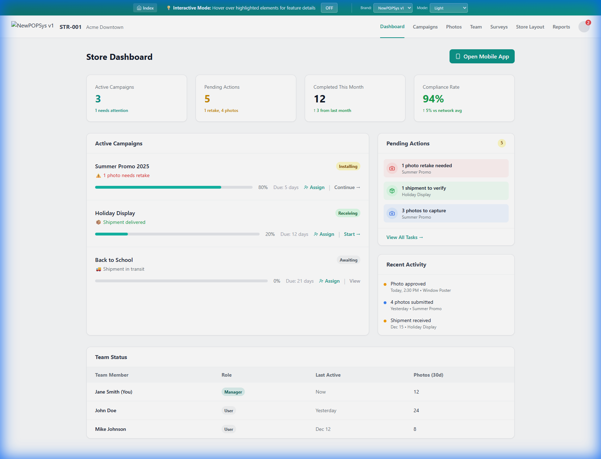
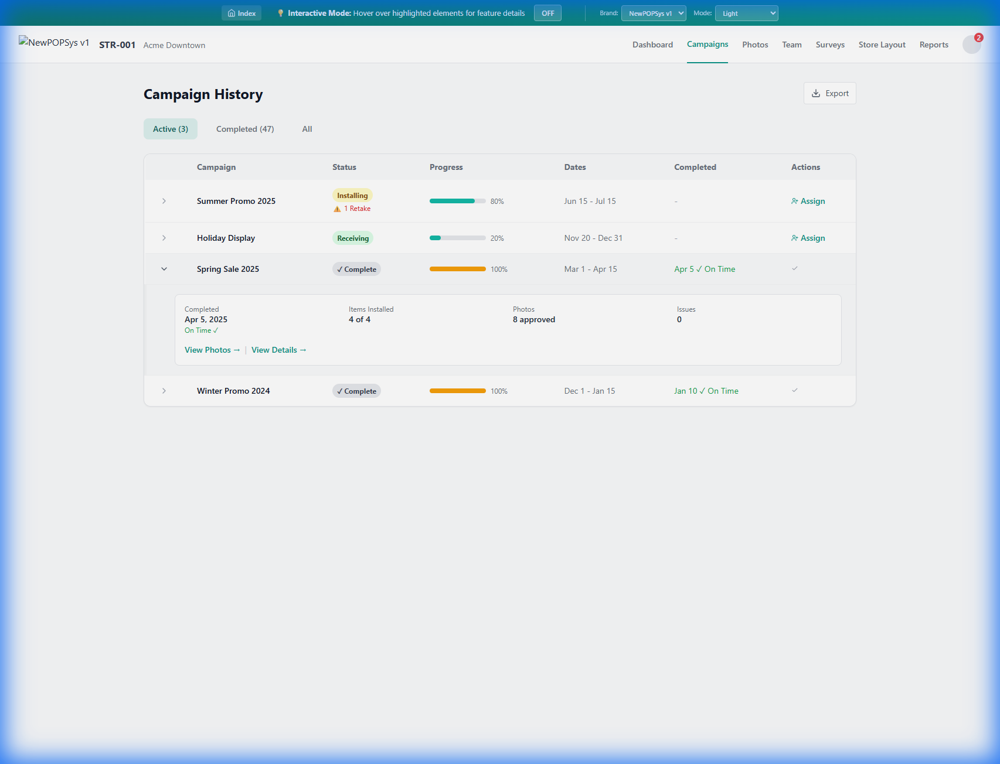
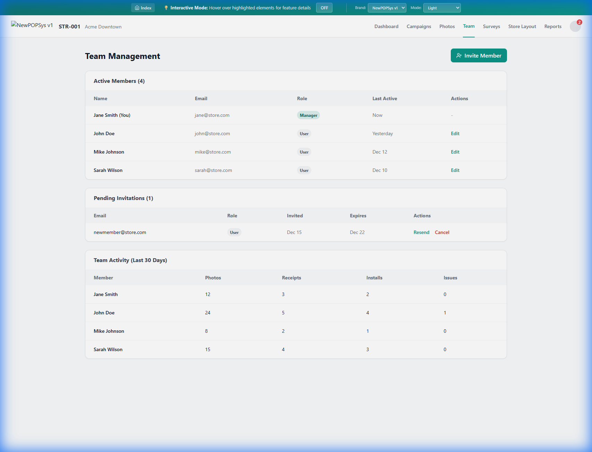
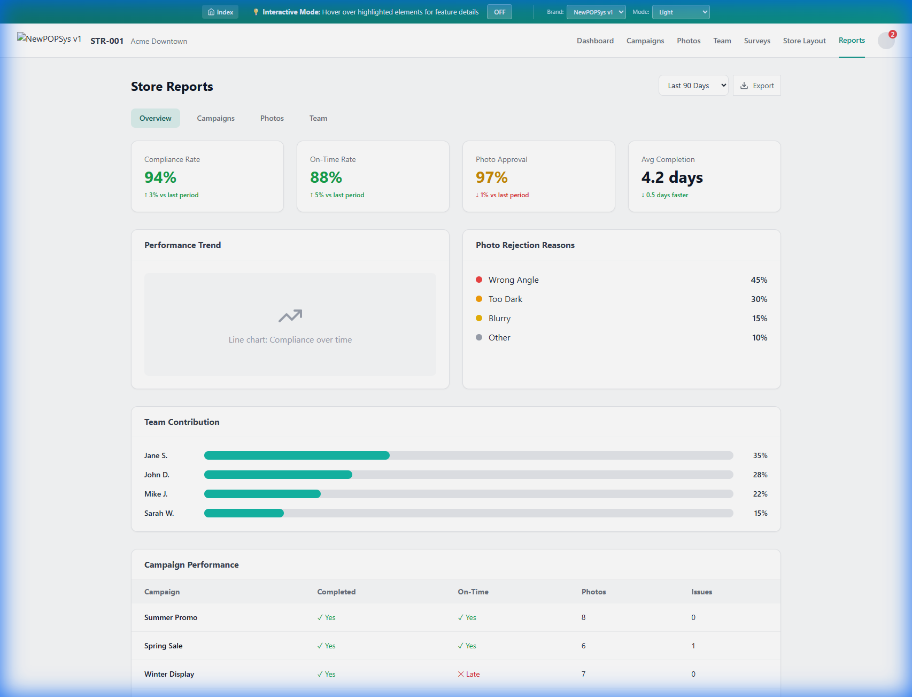

# Module 09: Store Portal (Store Manager & Operator)

> **Module ID**: 09_StorePortal
> **Version**: 2.0
> **Status**: Active
> **Last Updated**: 2026-01-03

---

## 1. Module Overview

The **Store Portal** is the primary operational interface for retail users (Store Managers and Store Operators). It provides tools for managing campaign execution, verifying compliance, and coordinating team activities within a specific store location.

### 1.1 Core Responsibilities
- **Campaign Management**: View and execute active assignments.
- **Compliance**: Upload proof-of-performance photos and attestations.
- **Team Management**: Invite and manage store-level users.
- **Reporting**: View compliance scores and historical performance.

---

## 2. Screen Inventory

Detailed specifications for each screen in this module are located in the `screens/` directory:

| Screen ID | Screen Name | Specification File | Screenshot Ref |
| :--- | :--- | :--- | :--- |
| **S001** | Dashboard | [S001_Dashboard.md](./screens/S001_Dashboard.md) | `manager_dashboard.png` |
| **S002** | Campaign History | [S002_Campaign_History.md](./screens/S002_Campaign_History.md) | `manager_campaigns.png` |
| **S003** | Photo Gallery | [S003_Photo_Gallery.md](./screens/S003_Photo_Gallery.md) | `manager_photos.png` |
| **S004** | Team Management | [S004_Team_Management.md](./screens/S004_Team_Management.md) | `manager_team.png` |
| **S005** | Store Reports | [S005_Reports.md](./screens/S005_Reports.md) | `manager_reports.png` |
| **S006** | Surveys | [S006_Surveys.md](./screens/S006_Surveys.md) | `manager_surveys.png` |
| **S007** | Store Layout | [S007_Store_Layout.md](./screens/S007_Store_Layout.md) | `manager_layout.png` |

---

## 3. Visual Reference Summary

> **Note**: Full-size high-fidelity wireframes are available in the individual screen specifications linked above.

### 3.1 Primary Views
| Dashboard | Campaigns |
| :---: | :---: |
|  |  |

### 3.2 Management Views
| Team | Reports |
| :---: | :---: |
|  |  |

---

*End of Module Overview*
