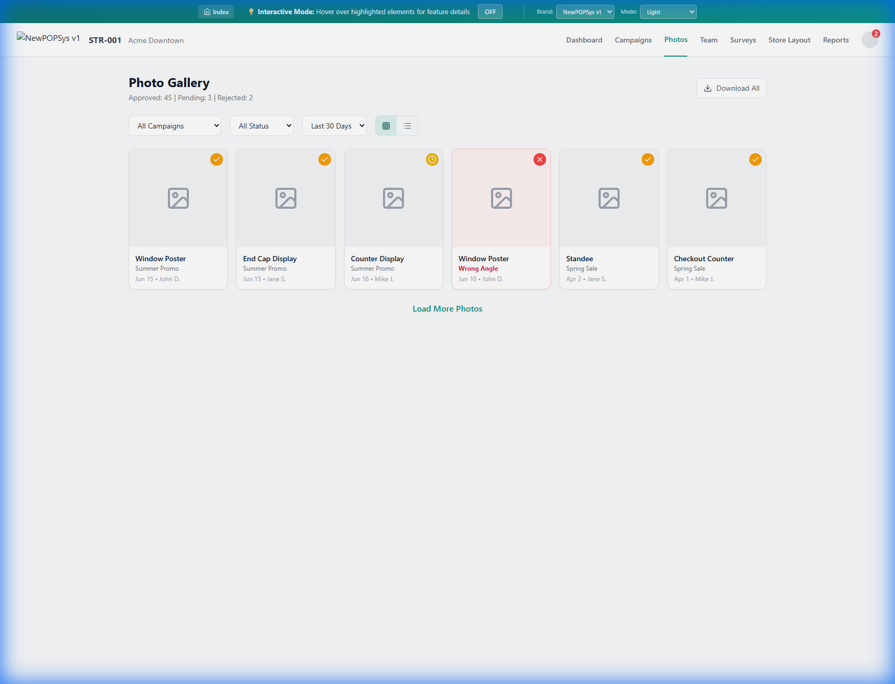
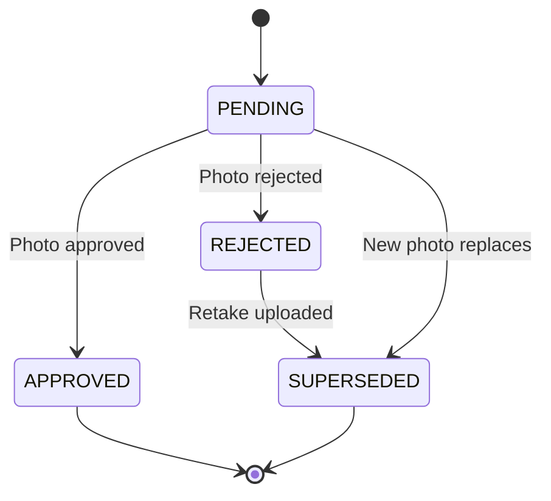

# S003 Photo Gallery - Screen Specification

> **SRS Section**: 5.9.3 | **Module**: Store Portal | **Version**: 1.0
> **IEEE 830 Reference**: Section 3.2 - Functional Requirements
> **Source Documents**:
> - [S03 Photo Gallery Screen Spec](../../../../06_Screen_Specs/S03_Photo_Gallery.md)
> - [SUPP-018 Photo Review](../../../../02_SUPPs/SUPP-018_Photo_Review.md)
> - [SUPP-037 Store Surveys](../../../../02_SUPPs/SUPP-037_Store_Surveys.md)
> **Last Updated**: 2026-01-01

---

## 1. Screen Overview

### 1.1 Purpose

The Photo Gallery screen provides store personnel with a centralized view of all installation proof photos submitted for their store. It enables browsing, filtering, and reviewing photo upload history across campaigns, with detailed status visibility for approved, pending, rejected, and superseded photos.

### 1.2 Route Configuration

| Attribute | Value |
|-----------|-------|
| **Route Path** | `/store/photos` |
| **Route Type** | Protected (Authentication Required) |
| **Lazy Loading** | Yes |
| **Mobile Support** | Full Responsive |

### 1.3 Screen Context

| Attribute | Description |
|-----------|-------------|
| **Primary Purpose** | Browse and review all store photo submissions |
| **Entry Points** | Store Dashboard quick link, Campaign History photo link |
| **Exit Points** | Dashboard, Campaign History, Photo Capture (mobile) |
| **Session Scope** | Store context from authenticated membership |

### 1.4 Screenshot Reference



---

## 2. User Roles & Permissions

### 2.1 Authorized Roles

| Role | Access Level | Restrictions |
|------|--------------|--------------|
| STORE_MANAGER (P07) | Full Access | Own store photos only |
| STORE_OPERATOR (P08) | Read Access | Own store photos only |

### 2.2 Permission Requirements

| Permission | STORE_MANAGER | STORE_OPERATOR |
|------------|:-------------:|:--------------:|
| View photo gallery | Y | Y |
| View photo details/lightbox | Y | Y |
| Download individual photos | Y | Y |
| Download bulk photos | Y | N |
| View rejection reasons | Y | Y |
| View admin comments | Y | Y |
| Filter by team member | Y | N |

### 2.3 Data Scoping Rules

| Rule ID | Description |
|---------|-------------|
| REQ-S003-SEC-001 | Photos filtered to authenticated user's store via store_assignments.store_id |
| REQ-S003-SEC-002 | Store membership validated from JWT token claims |
| REQ-S003-SEC-003 | Cross-store photo access blocked at API and database layers |

---

## 3. UI Components

### 3.1 Component Hierarchy

- **PhotoGalleryPage**
    - **PageHeader**
        - TitleSection ("Photo Gallery")
        - StatusSummary (count by status)
    - **FilterBar**
        - CampaignFilter (dropdown)
        - StatusFilter (dropdown)
        - DateRangeFilter (dropdown)
        - ItemTypeFilter (multi-select)
        - UploadedByFilter (dropdown) [Store Manager only]
    - **ViewToggle**
        - GridViewButton
        - ListViewButton
    - **ActionBar**
        - BulkDownloadButton [Store Manager only]
    - **ContentArea**
        - **PhotoGrid** (default view)
            - PhotoCard[] (repeating)
        - **PhotoList** (alternate view)
            - PhotoRow[] (repeating)
    - **Pagination**
        - ResultCount
        - LoadMoreButton
    - **LightboxModal**
        - PhotoViewer
        - PhotoInfoPanel
        - NavigationControls

### 3.2 Component Specifications

| Component | Type | Description | Requirements |
|-----------|------|-------------|--------------|
| PageHeader | Container | Title and status summary | REQ-S003-UI-001 |
| StatusSummary | Display | Shows counts by review status | REQ-S003-UI-002 |
| FilterBar | Form | Filter controls for gallery | REQ-S003-UI-003 |
| ViewToggle | Button Group | Grid/List view switch | REQ-S003-UI-004 |
| PhotoGrid | Gallery | Thumbnail card grid | REQ-S003-UI-005 |
| PhotoCard | Card | Individual photo thumbnail | REQ-S003-UI-006 |
| PhotoList | Table | Tabular photo listing | REQ-S003-UI-007 |
| LightboxModal | Modal | Full-size photo viewer | REQ-S003-UI-008 |
| PhotoInfoPanel | Panel | Photo metadata display | REQ-S003-UI-009 |

### 3.3 Photo Card Layout

**Structure:**

*   **Header (Thumbnail Area)**
    *   Full-width image thumbnail
    *   Status Icon Overlay (`✓` / `⠌` / `⠳`)
*   **Footer (Metadata)**
    *   **Item Name**: (e.g., "Window Poster")
    *   **Campaign**: (e.g., "Summer Promo")
    *   **Date**: (e.g., "Jun 15, 2025")
    *   **Uploader**: (e.g., "by John D.")

### 3.4 Status Overlay Specifications

| Status | Icon | Background Color | Text Color |
|--------|------|------------------|------------|
| PENDING | `⏳` | `amber-100` | `amber-800` |
| APPROVED | `✓` | `green-100` | `green-800` |
| REJECTED | `❌` | `red-100` | `red-800` |
| SUPERSEDED | `🔄` | `gray-100` | `gray-600` |

---

## 4. Data Requirements

### 4.1 API Endpoints

| Endpoint | Method | Purpose | Request |
|----------|--------|---------|---------|
| `/stores/{storeId}/photos` | GET | Fetch photo gallery | Query params |
| `/photos/{photoId}` | GET | Get photo details | Path param |
| `/photos/download` | POST | Bulk download | Photo ID array |

### 4.2 Request Parameters

**GET /stores/{storeId}/photos**

| Parameter | Type | Required | Description |
|-----------|------|----------|-------------|
| storeId | UUID | Yes | Store identifier (path) |
| campaign_id | UUID | No | Filter by campaign |
| status | Enum | No | PhotoReviewStatus filter |
| date_from | Date | No | Start date filter |
| date_to | Date | No | End date filter |
| item_type | Enum[] | No | Kit item type filter |
| uploaded_by | UUID | No | Uploader user ID |
| page | Integer | No | Page number (default: 1) |
| limit | Integer | No | Results per page (default: 24) |

### 4.3 Response Schema

```typescript
interface PhotoGalleryResponse {
  photos: PhotoUploadDTO[];
  meta: {
    total: number;
    page: number;
    limit: number;
    hasMore: boolean;
  };
  summary: {
    approved: number;
    pending: number;
    rejected: number;
    superseded: number;
  };
}

interface PhotoUploadDTO {
  id: string;                          // UUID
  file_url: string;                    // S3 signed URL
  thumbnail_url: string;               // S3 signed thumbnail URL
  review_status: PhotoReviewStatus;    // Enum
  created_at: string;                  // ISO 8601

  // Related data
  item_name: string;                   // KitItem.name
  item_type: ItemType;                 // KitItem.item_type
  slot_name: string | null;            // LocationSlot.name
  campaign_id: string;                 // Campaign.id
  campaign_name: string;               // Campaign.name
  uploaded_by: string;                 // User.id
  uploader_name: string;               // User.name

  // Review data (if reviewed)
  rejection_reason?: RejectionReasonCode;
  admin_comment?: string;
  reviewed_at?: string;
  reviewer_name?: string;

  // Superseded link
  superseded_by_id?: string;           // Replacement photo ID
}
```

### 4.4 Database Query

```sql
SELECT
  pu.id,
  pu.file_url,
  pu.thumbnail_url,
  pu.review_status,
  pu.created_at,
  ki.name as item_name,
  ki.item_type,
  ls.name as slot_name,
  c.id as campaign_id,
  c.name as campaign_name,
  u.id as uploaded_by,
  u.name as uploader_name,
  pr.rejection_reason,
  pr.admin_comment,
  pr.created_at as reviewed_at,
  rev.name as reviewer_name,
  pu.superseded_by_id
FROM photo_uploads pu
JOIN assignment_items ai ON pu.assignment_item_id = ai.id
JOIN kit_items ki ON ai.kit_item_id = ki.id
LEFT JOIN location_slots ls ON ai.location_slot_id = ls.id
JOIN store_assignments sa ON ai.store_assignment_id = sa.id
JOIN campaigns c ON sa.campaign_id = c.id
JOIN users u ON pu.uploaded_by = u.id
LEFT JOIN photo_reviews pr ON pr.photo_upload_id = pu.id
  AND pr.id = (SELECT id FROM photo_reviews WHERE photo_upload_id = pu.id ORDER BY created_at DESC LIMIT 1)
LEFT JOIN users rev ON pr.reviewer_id = rev.id
WHERE sa.store_id = :storeId
  AND pu.deleted_at IS NULL
  AND sa.deleted_at IS NULL
ORDER BY pu.created_at DESC
LIMIT :limit OFFSET :offset
```

### 4.5 Caching Strategy

| Data Type | Cache Duration | Invalidation Trigger |
|-----------|----------------|---------------------|
| Photo list | 5 minutes | New photo upload, status change |
| Photo thumbnails | 24 hours | Photo superseded |
| Status summary | 5 minutes | Any photo status change |

---

## 5. Business Rules & Validation

### 5.1 Display Rules

| Rule ID | Rule Description |
|---------|------------------|
| REQ-S003-BR-001 | Photos ordered by created_at descending (newest first) |
| REQ-S003-BR-002 | Superseded photos displayed with gray overlay and link to replacement |
| REQ-S003-BR-003 | Rejected photos show rejection reason and admin comment |
| REQ-S003-BR-004 | Default view is Grid; user preference persisted in localStorage |
| REQ-S003-BR-005 | Default filter shows photos from last 90 days |

### 5.2 Filter Rules

| Rule ID | Rule Description |
|---------|------------------|
| REQ-S003-BR-006 | Campaign filter shows only campaigns with photos for this store |
| REQ-S003-BR-007 | Date filter options: Last 7 days, Last 30 days, Last 90 days, Custom range |
| REQ-S003-BR-008 | Item type filter shows only types present in store's photos |
| REQ-S003-BR-009 | Uploaded By filter visible only to Store Manager |
| REQ-S003-BR-010 | Multiple filters combine with AND logic |

### 5.3 Lightbox Rules

| Rule ID | Rule Description |
|---------|------------------|
| REQ-S003-BR-011 | Lightbox opens on photo card click or keyboard Enter |
| REQ-S003-BR-012 | Lightbox displays full-resolution image with zoom capability |
| REQ-S003-BR-013 | Info panel shows all photo metadata and review details |
| REQ-S003-BR-014 | Rejected photos show replacement photo preview if superseded |
| REQ-S003-BR-015 | Navigation arrows cycle through filtered photo set |

### 5.4 Download Rules

| Rule ID | Rule Description |
|---------|------------------|
| REQ-S003-BR-016 | Individual photo download available from lightbox |
| REQ-S003-BR-017 | Bulk download requires Store Manager role |
| REQ-S003-BR-018 | Bulk download creates ZIP archive with naming convention |
| REQ-S003-BR-019 | Download filename format: `{campaign}_{item}_{date}.{ext}` |

---

## 6. API Integration Points

### 6.1 Gallery Data Flow


### 6.2 Lightbox Data Flow


### 6.3 Integration Dependencies

| System | Integration | Purpose |
|--------|-------------|---------|
| AWS S3 | Signed URLs | Secure photo access |
| Photo Review Service | Status data | Review status and comments |
| Campaign Service | Campaign data | Campaign names and filters |

---

## 7. State Transitions

### 7.1 Photo Review Status States



### 7.2 Status Transition Rules

| From State | To State | Trigger | Actor |
|------------|----------|---------|-------|
| PENDING | APPROVED | Photo approved | Brand Admin, Campaign Manager, Regional Manager |
| PENDING | REJECTED | Photo rejected | Brand Admin, Campaign Manager, Regional Manager |
| REJECTED | SUPERSEDED | Retake photo uploaded | Store User |
| PENDING | SUPERSEDED | New photo replaces before review | Store User |

### 7.3 View State Management

| State | Persisted | Storage |
|-------|-----------|---------|
| View mode (Grid/List) | Yes | localStorage |
| Active filters | No | URL query params |
| Lightbox position | No | Component state |
| Scroll position | No | Component state |

---

## 8. Error Handling

### 8.1 Error Scenarios

| Error Code | Scenario | User Message | Recovery Action |
|------------|----------|--------------|-----------------|
| ERR-S003-001 | Photos API failure | "Unable to load photos. Please try again." | Retry button |
| ERR-S003-002 | Photo not found | "Photo no longer available." | Remove from view, refresh |
| ERR-S003-003 | Thumbnail load failure | Display placeholder | Auto-retry with fallback |
| ERR-S003-004 | Signed URL expired | "Photo link expired." | Auto-refresh URL |
| ERR-S003-005 | Download failure | "Download failed. Please try again." | Retry button |
| ERR-S003-006 | Bulk download timeout | "Download is taking longer than expected." | Background job with notification |
| ERR-S003-007 | Invalid filter combination | "No photos match your filters." | Clear filters option |

### 8.2 Loading States

| State | Display |
|-------|---------|
| Initial load | Skeleton grid with 24 placeholder cards |
| Filter change | Inline loading indicator |
| Load more | Loading spinner below grid |
| Lightbox loading | Blur backdrop with spinner |
| Download processing | Progress indicator with cancel option |

### 8.3 Empty States

| Condition | Message | Action |
|-----------|---------|--------|
| No photos for store | "No photos have been submitted yet." | Link to active campaigns |
| No photos match filters | "No photos match your current filters." | Clear filters button |
| All photos superseded | "All photos have been replaced." | Show superseded toggle |

---

## 9. Accessibility Requirements

### 9.1 WCAG 2.1 AA Compliance

| Requirement ID | Requirement | Implementation |
|----------------|-------------|----------------|
| REQ-S003-A11Y-001 | Keyboard navigation | Full grid navigation with arrow keys |
| REQ-S003-A11Y-002 | Focus management | Visible focus indicators on all interactive elements |
| REQ-S003-A11Y-003 | Screen reader support | Alt text on all images, ARIA labels on controls |
| REQ-S003-A11Y-004 | Lightbox keyboard control | Escape to close, arrows to navigate |
| REQ-S003-A11Y-005 | Status announcements | Live region for filter result counts |
| REQ-S003-A11Y-006 | Color independence | Status indicated by icon and text, not color alone |

### 9.2 Keyboard Shortcuts

| Key | Action | Context |
|-----|--------|---------|
| `Tab` | Move focus between elements | Page |
| `Enter` | Open photo lightbox | Photo card focus |
| `Escape` | Close lightbox | Lightbox open |
| `←` / `→` | Navigate photos | Lightbox open |
| `D` | Download current photo | Lightbox open |

### 9.3 Screen Reader Announcements

| Trigger | Announcement |
|---------|--------------|
| Gallery load | "Photo gallery loaded. {count} photos. {approved} approved, {pending} pending review." |
| Filter applied | "Showing {count} photos matching filters." |
| Lightbox open | "Photo viewer. {item_name} from {campaign_name}. Status: {status}. Use arrow keys to navigate." |
| Photo navigation | "Photo {current} of {total}. {item_name}. Status: {status}." |

---

## 10. Acceptance Criteria

### 10.1 Functional Requirements

| ID | Requirement | Priority | Verification |
|----|-------------|----------|--------------|
| REQ-S003-FR-001 | Gallery displays all photos for authenticated user's store | Must | Test |
| REQ-S003-FR-002 | Grid view shows photo thumbnails with status overlay | Must | Test |
| REQ-S003-FR-003 | List view displays tabular photo data | Must | Test |
| REQ-S003-FR-004 | Campaign filter narrows results to selected campaign | Must | Test |
| REQ-S003-FR-005 | Status filter shows only photos with selected status | Must | Test |
| REQ-S003-FR-006 | Date filter limits results to date range | Must | Test |
| REQ-S003-FR-007 | Clicking photo opens lightbox with full-size image | Must | Test |
| REQ-S003-FR-008 | Lightbox displays complete photo metadata | Must | Test |
| REQ-S003-FR-009 | Rejected photos show rejection reason and admin comment | Must | Test |
| REQ-S003-FR-010 | Superseded photos link to replacement photo | Must | Test |
| REQ-S003-FR-011 | Download button exports individual photo | Should | Test |
| REQ-S003-FR-012 | Bulk download exports selected photos as ZIP | Should | Test |
| REQ-S003-FR-013 | Lightbox navigation with arrow keys and buttons | Must | Test |
| REQ-S003-FR-014 | Infinite scroll or load more pagination | Should | Test |

### 10.2 Non-Functional Requirements

| ID | Requirement | Target | Verification |
|----|-------------|--------|--------------|
| REQ-S003-NFR-001 | Gallery initial load < 2 seconds | P95 | Performance test |
| REQ-S003-NFR-002 | Thumbnail load < 500ms per image | P95 | Performance test |
| REQ-S003-NFR-003 | Full-size image load < 3 seconds | P95 | Performance test |
| REQ-S003-NFR-004 | Filter response < 1 second | P95 | Performance test |
| REQ-S003-NFR-005 | Support galleries with 500+ photos | Required | Load test |
| REQ-S003-NFR-006 | Mobile responsive layout | Required | Visual test |

### 10.3 Security Requirements

| ID | Requirement | Verification |
|----|-------------|--------------|
| REQ-S003-SEC-001 | Only authenticated store members can view gallery | Penetration test |
| REQ-S003-SEC-002 | Cross-store photo access prevented | Security test |
| REQ-S003-SEC-003 | S3 signed URLs expire after 1 hour | Configuration test |
| REQ-S003-SEC-004 | Download requests logged in audit trail | Audit test |

---

## 11. Traceability Matrix

| Requirement | Source | SUPP Reference | Test Case |
|-------------|--------|----------------|-----------|
| REQ-S003-FR-001 | S03 Screen Spec | SUPP-018 | TC-S003-001 |
| REQ-S003-FR-002 | S03 Screen Spec | SUPP-018 | TC-S003-002 |
| REQ-S003-FR-007 | S03 Screen Spec | SUPP-018 | TC-S003-007 |
| REQ-S003-FR-009 | S03 Screen Spec | SUPP-018 | TC-S003-009 |
| REQ-S003-SEC-001 | Permission Matrix | SUPP-003 | TC-S003-SEC-001 |

---

## 12. Related Screens

| Screen | Relationship | Navigation |
|--------|--------------|------------|
| [S001 Dashboard](S001_Dashboard.md) | Parent | Back link |
| [S002 Campaign History](S002_Campaign_History.md) | Sibling | Campaign filter |
| [M05 Photo Capture](../../../10_Module_MobileApp/screens/M005_Photo_Capture.md) | Input | Photo upload source |
| [B07 Verification](../../../08_Module_BrandPortal/screens/B007_Verification.md) | Related | Brand review photos |

---

*Document Status: Complete*
*IEEE 830 Compliance: Section 3.2 - Specific Requirements / Functional Requirements*
