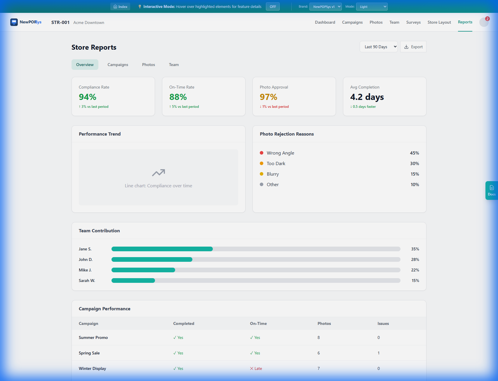

# S005 Store Reports - Screen Specification

> **SRS Section**: 5.9.5 | **Version**: 1.0 | **Status**: Draft
> **Module**: Store Portal
> **Route**: `/store/reports`
> **Source**: [S05_Reports.md](../../../../06_Screen_Specs/S05_Reports.md)
> **Last Updated**: 2026-01-01

---

## 1. Screen Overview

### 1.1 Purpose

The Store Reports screen provides Store Managers with comprehensive analytics and performance insights for their store's campaign execution, photo compliance, team performance, and issue resolution. This read-only analytics interface aggregates data across multiple entities to deliver actionable metrics with trend analysis and benchmarking capabilities.

### 1.2 Scope

This specification defines the functional requirements, data requirements, and user interface components for the Store Reports screen within the Store Portal module of NewPOPSys v1.

### 1.3 Primary Functions

| Function | Description |
|----------|-------------|
| **View KPI Summary** | Display key performance indicators with trend indicators |
| **Analyze Campaigns** | Review campaign completion rates and timing metrics |
| **Review Photo Metrics** | Examine approval rates and rejection patterns |
| **Monitor Team Performance** | Track individual team member contributions |
| **Track Issues** | Analyze issue patterns and resolution times |
| **Export Reports** | Download report data in multiple formats |

### 1.4 Screenshot Reference



*Figure S005-1: Store Reports Dashboard - Analytics and performance metrics interface*

### 1.5 Screen Context


---

## 2. User Roles & Permissions

### 2.1 Authorized Roles

| Role | Access Level | Restrictions |
|------|--------------|--------------|
| **STORE_MANAGER** (P07) | Full Access | Own store data only |
| **STORE_OPERATOR** (P08) | No Access | Cannot access reports screen |
| **REGIONAL_MANAGER** (P06) | View Only | Via impersonation or region-scoped access |
| **BRAND_ADMIN** (P04) | View Only | Via impersonation |
| **PLATFORM_ADMIN** (P01) | Full Access | Via impersonation |

### 2.2 Permission Requirements

| Requirement ID | Permission | Description |
|----------------|------------|-------------|
| REQ-S005-SEC-001 | `reports:read` | View store reports and analytics |
| REQ-S005-SEC-002 | `reports:export` | Download report data in various formats |
| REQ-S005-SEC-003 | `store:read` | Access store-level aggregated metrics |

### 2.3 Access Control Rules

```
REQ-S005-SEC-004: Data Isolation
- Users SHALL only view reports for stores where membership.store_id matches
- All API calls SHALL include tenant_id and store_id scoping
- Report data SHALL NOT include cross-store comparisons without aggregation

REQ-S005-SEC-005: Role Enforcement
- Store Operators SHALL be denied access with HTTP 403
- Navigation item SHALL be hidden for unauthorized roles
- Direct URL access SHALL redirect to Dashboard with access denied message
```

---

## 3. UI Components

### 3.1 Component Hierarchy


### 3.2 Component Specifications

#### 3.2.1 Page Header

| Element | Specification |
|---------|---------------|
| Title | "Store Reports" - H1, left-aligned |
| Date Range Picker | Dropdown with preset options + custom range |
| Export Button | Primary action, right-aligned, opens format menu |

#### 3.2.2 Tab Navigation

| Requirement ID | Requirement |
|----------------|-------------|
| REQ-S005-UI-001 | Tab bar SHALL display 5 tabs: Overview, Campaigns, Photos, Team, Issues |
| REQ-S005-UI-002 | Active tab SHALL be visually distinguished with underline indicator |
| REQ-S005-UI-003 | Tab switching SHALL preserve selected date range |
| REQ-S005-UI-004 | URL SHALL update to reflect active tab (e.g., `/store/reports?tab=photos`) |

#### 3.2.3 KPI Cards

| Card | Metric | Threshold Colors |
|------|--------|-----------------|
| Compliance Rate | completed / total campaigns x 100 | Green >= 90%, Yellow >= 75%, Red < 75% |
| On-Time Rate | on_time / completed x 100 | Green >= 85%, Yellow >= 70%, Red < 70% |
| Photo Approval | approved / total photos x 100 | Green >= 95%, Yellow >= 85%, Red < 85% |
| Avg Completion Time | avg(completed_at - start_date) | Lower is better (days) |

| Requirement ID | Requirement |
|----------------|-------------|
| REQ-S005-UI-005 | KPI cards SHALL display current value and trend indicator (arrow up/down) |
| REQ-S005-UI-006 | Trend SHALL compare to previous period of same duration |
| REQ-S005-UI-007 | Cards SHALL use color coding based on threshold values |
| REQ-S005-UI-008 | Hover state SHALL show exact values and period comparison |

#### 3.2.4 Charts

| Chart Type | Tab | Data Displayed |
|------------|-----|----------------|
| Line Chart | Overview | Campaign performance trend over time |
| Pie Chart | Overview, Photos | Rejection reasons breakdown |
| Bar Chart | Overview, Team | Team contribution percentages |
| Stacked Bar | Campaigns | On-time vs late completion by month |

| Requirement ID | Requirement |
|----------------|-------------|
| REQ-S005-UI-009 | Charts SHALL be responsive and scale to container width |
| REQ-S005-UI-010 | Charts SHALL display tooltips with exact values on hover |
| REQ-S005-UI-011 | Charts SHALL include legends when multiple series displayed |
| REQ-S005-UI-012 | Empty charts SHALL display "No data for selected period" message |

#### 3.2.5 Data Tables

| Requirement ID | Requirement |
|----------------|-------------|
| REQ-S005-UI-013 | Tables SHALL be sortable by clicking column headers |
| REQ-S005-UI-014 | Tables SHALL display pagination for > 10 rows |
| REQ-S005-UI-015 | Tables SHALL support column-specific formatting (%, dates, status badges) |
| REQ-S005-UI-016 | Row click SHALL navigate to related detail screen where applicable |

### 3.3 Reports Layout

### 3.3 Reports Layout


---

## 4. Data Requirements

### 4.1 Data Model References

| Entity | Source Table | Purpose |
|--------|--------------|---------|
| Store Assignment | `store_assignments` | Campaign completion metrics |
| Campaign | `campaigns` | Campaign details, dates |
| Photo Upload | `photo_uploads` | Photo count, approval rates |
| Photo Review | `photo_reviews` | Rejection reasons |
| Issue Request | `issue_requests` | Issue counts, resolution |
| User | `users` | Team member identification |
| Membership | `memberships` | Team member association |

### 4.2 Database Queries

#### 4.2.1 Compliance Metrics Query

```sql
SELECT
    COUNT(*) as total_campaigns,
    COUNT(CASE WHEN sa.status = 'COMPLETE' THEN 1 END) as completed,
    COUNT(CASE WHEN sa.status = 'COMPLETE'
          AND sa.completed_at <= c.install_end_date THEN 1 END) as on_time,
    AVG(EXTRACT(EPOCH FROM (sa.completed_at - c.install_start_date)) / 86400)
        as avg_duration_days
FROM store_assignments sa
JOIN campaigns c ON sa.campaign_id = c.id
WHERE sa.store_id = :storeId
  AND sa.deleted_at IS NULL
  AND c.deleted_at IS NULL
  AND sa.created_at >= :startDate
  AND sa.created_at <= :endDate;
```

#### 4.2.2 Photo Metrics Query

```sql
SELECT
    COUNT(pu.id) as total_photos,
    COUNT(CASE WHEN pu.review_status = 'APPROVED' THEN 1 END) as approved,
    COUNT(CASE WHEN pu.review_status = 'REJECTED' THEN 1 END) as rejected,
    COUNT(CASE WHEN pu.review_status = 'PENDING' THEN 1 END) as pending
FROM photo_uploads pu
JOIN assignment_items ai ON pu.assignment_item_id = ai.id
JOIN store_assignments sa ON ai.store_assignment_id = sa.id
WHERE sa.store_id = :storeId
  AND pu.deleted_at IS NULL
  AND pu.created_at >= :startDate
  AND pu.created_at <= :endDate;
```

#### 4.2.3 Rejection Reasons Query

```sql
SELECT
    pr.reason_code,
    COUNT(*) as count
FROM photo_reviews pr
JOIN photo_uploads pu ON pr.photo_upload_id = pu.id
JOIN assignment_items ai ON pu.assignment_item_id = ai.id
JOIN store_assignments sa ON ai.store_assignment_id = sa.id
WHERE sa.store_id = :storeId
  AND pr.decision = 'REJECTED'
  AND pr.deleted_at IS NULL
  AND pr.created_at >= :startDate
  AND pr.created_at <= :endDate
GROUP BY pr.reason_code
ORDER BY count DESC;
```

#### 4.2.4 Team Contribution Query

```sql
SELECT
    u.id as user_id,
    u.first_name || ' ' || LEFT(u.last_name, 1) || '.' as display_name,
    COUNT(DISTINCT pu.id) as photos_uploaded,
    COUNT(DISTINCT CASE WHEN sa.status = 'COMPLETE' THEN sa.id END) as completions
FROM users u
JOIN memberships m ON u.id = m.user_id
LEFT JOIN photo_uploads pu ON pu.uploaded_by = u.id
LEFT JOIN assignment_items ai ON pu.assignment_item_id = ai.id
LEFT JOIN store_assignments sa ON ai.store_assignment_id = sa.id
WHERE m.store_id = :storeId
  AND m.deleted_at IS NULL
  AND u.is_active = true
  AND (pu.created_at >= :startDate OR pu.created_at IS NULL)
  AND (pu.created_at <= :endDate OR pu.created_at IS NULL)
GROUP BY u.id, u.first_name, u.last_name
ORDER BY photos_uploaded DESC;
```

#### 4.2.5 Issues Summary Query

```sql
SELECT
    ir.issue_type,
    ir.status,
    COUNT(*) as count,
    AVG(EXTRACT(EPOCH FROM (ir.resolved_at - ir.created_at)) / 3600)
        as avg_resolution_hours
FROM issue_requests ir
JOIN store_assignments sa ON ir.store_assignment_id = sa.id
WHERE sa.store_id = :storeId
  AND ir.deleted_at IS NULL
  AND ir.created_at >= :startDate
  AND ir.created_at <= :endDate
GROUP BY ir.issue_type, ir.status
ORDER BY count DESC;
```

### 4.3 API Response Interfaces

```typescript
interface StoreReportsResponse {
    storeId: string;
    dateRange: {
        start: string;  // ISO date
        end: string;    // ISO date
        label: string;  // "Last 90 Days"
    };
    kpis: KPIMetrics;
    campaignMetrics: CampaignMetrics;
    photoMetrics: PhotoMetrics;
    teamMetrics: TeamMemberMetrics[];
    issueMetrics: IssueMetrics;
    trends: TrendData[];
}

interface KPIMetrics {
    complianceRate: {
        value: number;       // Percentage (0-100)
        trend: number;       // Change from previous period
        status: 'green' | 'yellow' | 'red';
    };
    onTimeRate: {
        value: number;
        trend: number;
        status: 'green' | 'yellow' | 'red';
    };
    photoApprovalRate: {
        value: number;
        trend: number;
        status: 'green' | 'yellow' | 'red';
    };
    avgCompletionDays: {
        value: number;       // Days
        trend: number;
        status: 'green' | 'yellow' | 'red';
    };
}

interface CampaignMetrics {
    total: number;
    completed: number;
    onTime: number;
    late: number;
    inProgress: number;
    campaigns: CampaignDetail[];
}

interface CampaignDetail {
    campaignId: string;
    campaignName: string;
    status: string;
    completedAt: string | null;
    onTime: boolean | null;
    photoCount: number;
    issueCount: number;
}

interface PhotoMetrics {
    total: number;
    approved: number;
    rejected: number;
    pending: number;
    approvalRate: number;
    rejectionReasons: RejectionReason[];
}

interface RejectionReason {
    code: string;
    label: string;
    count: number;
    percentage: number;
}

interface TeamMemberMetrics {
    userId: string;
    displayName: string;
    photosUploaded: number;
    completions: number;
    contributionPercentage: number;
}

interface IssueMetrics {
    total: number;
    open: number;
    resolved: number;
    avgResolutionHours: number;
    byType: IssueTypeBreakdown[];
}

interface IssueTypeBreakdown {
    type: string;
    count: number;
    percentage: number;
}

interface TrendData {
    period: string;         // "2025-12", "2025-W52"
    complianceRate: number;
    onTimeRate: number;
    photoApprovalRate: number;
}
```

### 4.4 Data Freshness

| Requirement ID | Requirement |
|----------------|-------------|
| REQ-S005-DATA-001 | Report data SHALL be aggregated in real-time (not cached) |
| REQ-S005-DATA-002 | Date range filter SHALL apply to all metrics on screen |
| REQ-S005-DATA-003 | Trend calculations SHALL compare equal-length periods |
| REQ-S005-DATA-004 | Empty periods SHALL display zero values, not null |

---

## 5. Business Rules & Validation

### 5.1 Date Range Rules

| Requirement ID | Rule |
|----------------|------|
| REQ-S005-BR-001 | Default date range SHALL be "Last 90 Days" |
| REQ-S005-BR-002 | Maximum date range SHALL be 365 days |
| REQ-S005-BR-003 | End date SHALL NOT exceed current date |
| REQ-S005-BR-004 | Start date SHALL NOT be earlier than store creation date |
| REQ-S005-BR-005 | Custom date range SHALL validate start < end |

### 5.2 KPI Calculation Rules

| Requirement ID | Rule |
|----------------|------|
| REQ-S005-BR-006 | Compliance Rate = (completed campaigns / total assigned campaigns) x 100 |
| REQ-S005-BR-007 | On-Time Rate = (on-time completions / completed campaigns) x 100 |
| REQ-S005-BR-008 | Photo Approval Rate = (approved photos / total reviewed photos) x 100 |
| REQ-S005-BR-009 | Avg Completion Time = average of (completed_at - install_start_date) in days |
| REQ-S005-BR-010 | Trend SHALL be calculated as (current_period - previous_period) |

### 5.3 Threshold Rules

| KPI | Green | Yellow | Red |
|-----|-------|--------|-----|
| Compliance Rate | >= 90% | >= 75% and < 90% | < 75% |
| On-Time Rate | >= 85% | >= 70% and < 85% | < 70% |
| Photo Approval | >= 95% | >= 85% and < 95% | < 85% |
| Avg Completion | Contextual | Contextual | Contextual |

| Requirement ID | Rule |
|----------------|------|
| REQ-S005-BR-011 | KPI status colors SHALL be applied based on threshold table |
| REQ-S005-BR-012 | Avg Completion Time status SHALL compare to network average |

### 5.4 Data Scope Rules

| Requirement ID | Rule |
|----------------|------|
| REQ-S005-BR-013 | Reports SHALL only include store_assignments with status != 'CANCELLED' |
| REQ-S005-BR-014 | Photo counts SHALL exclude deleted photos (deleted_at IS NOT NULL) |
| REQ-S005-BR-015 | Team metrics SHALL only include active users (is_active = true) |
| REQ-S005-BR-016 | Issue counts SHALL include all statuses except 'DENIED' |

### 5.5 Comparison Rules

| Requirement ID | Rule |
|----------------|------|
| REQ-S005-BR-017 | Network average SHALL be calculated across all stores in same brand |
| REQ-S005-BR-018 | Region average SHALL be calculated across stores in same region |
| REQ-S005-BR-019 | Period-over-period SHALL compare equivalent duration periods |

---

## 6. API Integration Points

### 6.1 Endpoint Specifications

#### 6.1.1 Get Store Reports

```
GET /api/v1/stores/{storeId}/reports
```

**Query Parameters:**

| Parameter | Type | Required | Description |
|-----------|------|----------|-------------|
| `range` | string | No | Preset range: 7d, 30d, 90d, 365d (default: 90d) |
| `startDate` | string | No | Custom start date (ISO 8601) |
| `endDate` | string | No | Custom end date (ISO 8601) |
| `tab` | string | No | Report tab: overview, campaigns, photos, team, issues |

**Response:**

```json
{
    "data": {
        "storeId": "uuid",
        "dateRange": {
            "start": "2024-10-01",
            "end": "2024-12-31",
            "label": "Last 90 Days"
        },
        "kpis": {
            "complianceRate": { "value": 94, "trend": 3, "status": "green" },
            "onTimeRate": { "value": 88, "trend": 5, "status": "green" },
            "photoApprovalRate": { "value": 97, "trend": -1, "status": "green" },
            "avgCompletionDays": { "value": 4.2, "trend": -0.5, "status": "green" }
        },
        "campaignMetrics": { ... },
        "photoMetrics": { ... },
        "teamMetrics": [ ... ],
        "issueMetrics": { ... },
        "trends": [ ... ]
    },
    "meta": {
        "generatedAt": "2024-12-31T12:00:00Z",
        "comparisons": {
            "networkAverage": { ... },
            "regionAverage": { ... }
        }
    }
}
```

#### 6.1.2 Export Store Reports

```
GET /api/v1/stores/{storeId}/reports/export
```

**Query Parameters:**

| Parameter | Type | Required | Description |
|-----------|------|----------|-------------|
| `format` | string | Yes | Export format: csv, pdf, xlsx |
| `range` | string | No | Date range (same as reports endpoint) |
| `startDate` | string | No | Custom start date |
| `endDate` | string | No | Custom end date |
| `sections` | string | No | Comma-separated sections to include |

**Response:**

```
Content-Type: application/octet-stream
Content-Disposition: attachment; filename="store-reports-2024-12-31.csv"
```

### 6.2 Request/Response Flow


### 6.3 API Requirements

| Requirement ID | Requirement |
|----------------|-------------|
| REQ-S005-API-001 | Reports endpoint SHALL respond within 3 seconds for 90-day range |
| REQ-S005-API-002 | Export endpoint SHALL support async generation for large date ranges |
| REQ-S005-API-003 | API SHALL return 404 if store not found |
| REQ-S005-API-004 | API SHALL return 403 if user lacks store access |
| REQ-S005-API-005 | API SHALL validate date range parameters |

---

## 7. State Transitions

### 7.1 Screen States

mermaid
stateDiagram-v2
    [*] --> LOADING
    LOADING --> SUCCESS: Data Ready
    LOADING --> ERROR: Failure
    LOADING --> EMPTY: No Data
    SUCCESS --> REFRESHING: Range Change
    REFRESHING --> SUCCESS
    SUCCESS --> EXPORTING: Export
    EXPORTING --> SUCCESS
    SUCCESS --> NAVIGATING: Tab Switch
    NAVIGATING --> SUCCESS
    ERROR --> LOADING: Retry
    EMPTY --> LOADING: Change Range
```
### 8.1 Error Scenarios

| Error Code | Scenario | User Message | Recovery Action |
|------------|----------|--------------|-----------------|
| 401 | Session expired | "Your session has expired. Please log in again." | Redirect to login |
| 403 | Access denied | "You don't have permission to view reports." | Redirect to Dashboard |
| 404 | Store not found | "Store not found." | Redirect to Dashboard |
| 422 | Invalid date range | "Invalid date range. End date must be after start date." | Highlight date fields |
| 500 | Server error | "Unable to load reports. Please try again." | Show retry button |
| TIMEOUT | Request timeout | "Request timed out. Try a shorter date range." | Show retry button |

### 8.2 Error Handling Requirements

| Requirement ID | Requirement |
|----------------|-------------|
| REQ-S005-ERR-001 | API errors SHALL display user-friendly messages |
| REQ-S005-ERR-002 | Partial failures SHALL render available data with error notice |
| REQ-S005-ERR-003 | Chart rendering errors SHALL display placeholder with error message |
| REQ-S005-ERR-004 | Export failures SHALL notify user with option to retry |
| REQ-S005-ERR-005 | Network errors SHALL be logged to error tracking service |

### 8.3 Validation Errors

| Field | Validation | Error Message |
|-------|------------|---------------|
| startDate | Valid ISO date | "Invalid start date format" |
| endDate | Valid ISO date | "Invalid end date format" |
| startDate | < endDate | "Start date must be before end date" |
| range | Max 365 days | "Date range cannot exceed 1 year" |

---

## 9. Accessibility Requirements

### 9.1 WCAG 2.1 AA Compliance

| Requirement ID | Requirement | WCAG Criterion |
|----------------|-------------|----------------|
| REQ-S005-A11Y-001 | All charts SHALL have text alternatives | 1.1.1 Non-text Content |
| REQ-S005-A11Y-002 | Color SHALL NOT be only means of conveying information | 1.4.1 Use of Color |
| REQ-S005-A11Y-003 | Focus order SHALL follow logical reading order | 2.4.3 Focus Order |
| REQ-S005-A11Y-004 | Tab navigation SHALL be keyboard accessible | 2.1.1 Keyboard |
| REQ-S005-A11Y-005 | Data tables SHALL have proper header associations | 1.3.1 Info and Relationships |
| REQ-S005-A11Y-006 | Status indicators SHALL include text labels | 1.3.3 Sensory Characteristics |

### 9.2 Chart Accessibility

| Requirement ID | Requirement |
|----------------|-------------|
| REQ-S005-A11Y-007 | Charts SHALL provide tabular data alternative |
| REQ-S005-A11Y-008 | Screen readers SHALL announce chart summaries |
| REQ-S005-A11Y-009 | Color blind safe palette SHALL be used for chart colors |
| REQ-S005-A11Y-010 | Chart patterns SHALL differentiate series beyond color |

### 9.3 Keyboard Navigation

| Action | Keyboard Shortcut |
|--------|-------------------|
| Switch tabs | Arrow Left/Right when tabs focused |
| Open date picker | Enter when focused |
| Export report | Enter when export button focused |
| Navigate table rows | Arrow Up/Down |
| Sort table column | Enter on column header |

---

## 10. Acceptance Criteria

### 10.1 Functional Acceptance Criteria

| ID | Criterion | Verification Method |
|----|-----------|---------------------|
| AC-S005-001 | Overview tab displays 4 KPI cards with current values and trends | Manual test |
| AC-S005-002 | Trend chart displays performance data over selected date range | Manual test |
| AC-S005-003 | Rejection reasons pie chart displays categorized breakdown | Manual test |
| AC-S005-004 | Team contribution bar chart shows member percentages | Manual test |
| AC-S005-005 | Campaign table shows completion status for each campaign | Manual test |
| AC-S005-006 | Date range selector filters all displayed data | Manual test |
| AC-S005-007 | Export generates downloadable file in selected format | Manual test |
| AC-S005-008 | Network/region comparison metrics display when available | Manual test |
| AC-S005-009 | Tab navigation switches report sections without page reload | Manual test |
| AC-S005-010 | Store Operators cannot access the Reports screen | Automated test |

### 10.2 Non-Functional Acceptance Criteria

| ID | Criterion | Verification Method |
|----|-----------|---------------------|
| AC-S005-011 | Page loads in under 3 seconds for 90-day range | Performance test |
| AC-S005-012 | Charts render within 1 second after data load | Performance test |
| AC-S005-013 | Export completes within 30 seconds for 365-day range | Performance test |
| AC-S005-014 | Screen is fully accessible via keyboard navigation | Accessibility audit |
| AC-S005-015 | Charts include text alternatives for screen readers | Accessibility audit |

### 10.3 Edge Case Acceptance Criteria

| ID | Criterion | Verification Method |
|----|-----------|---------------------|
| AC-S005-016 | New store with no data displays empty state message | Manual test |
| AC-S005-017 | Store with single campaign displays correctly | Manual test |
| AC-S005-018 | 365-day range loads without timeout | Performance test |
| AC-S005-019 | Charts handle zero values without rendering errors | Manual test |

---

## 11. Traceability Matrix

| Requirement ID | Source | Test Case | Status |
|----------------|--------|-----------|--------|
| REQ-S005-SEC-001 | SUPP-003 RBAC | TC-S005-001 | Draft |
| REQ-S005-UI-001 | S05_Reports.md | TC-S005-002 | Draft |
| REQ-S005-BR-001 | S05_Reports.md | TC-S005-003 | Draft |
| REQ-S005-API-001 | NFR-001 | TC-S005-004 | Draft |
| REQ-S005-A11Y-001 | WCAG 2.1 AA | TC-S005-005 | Draft |

---

## 12. Appendix

### 12.1 Date Range Presets

| Preset | Start Date Calculation | End Date |
|--------|------------------------|----------|
| Last 7 Days | today - 7 days | today |
| Last 30 Days | today - 30 days | today |
| Last 90 Days | today - 90 days | today |
| Last 365 Days | today - 365 days | today |
| Custom | User-selected | User-selected |

### 12.2 Export File Formats

| Format | Extension | Content |
|--------|-----------|---------|
| CSV | .csv | Raw tabular data, UTF-8 encoded |
| PDF | .pdf | Formatted report with embedded charts |
| Excel | .xlsx | Multi-sheet workbook with charts |

### 12.3 Related Documents

| Document | Relationship |
|----------|--------------|
| [S001_Dashboard.md](S001_Dashboard.md) | Summary metrics source |
| [S002_Campaign_History.md](S002_Campaign_History.md) | Campaign detail navigation |
| [S003_Photo_Gallery.md](S003_Photo_Gallery.md) | Photo detail navigation |
| [S004_Team_Management.md](S004_Team_Management.md) | Team member source |
| [3.1_Database_Model.md](../../03_System_Architecture/3.1_Database_Model.md) | Data model reference |
| [4.2_Permission_Matrix.md](../../04_User_Personas_RBAC/4.2_Permission_Matrix.md) | RBAC reference |

---

*Document Status: Draft*
*IEEE 830 Compliance: Section 3.2 - Specific Requirements / Functional Requirements*
