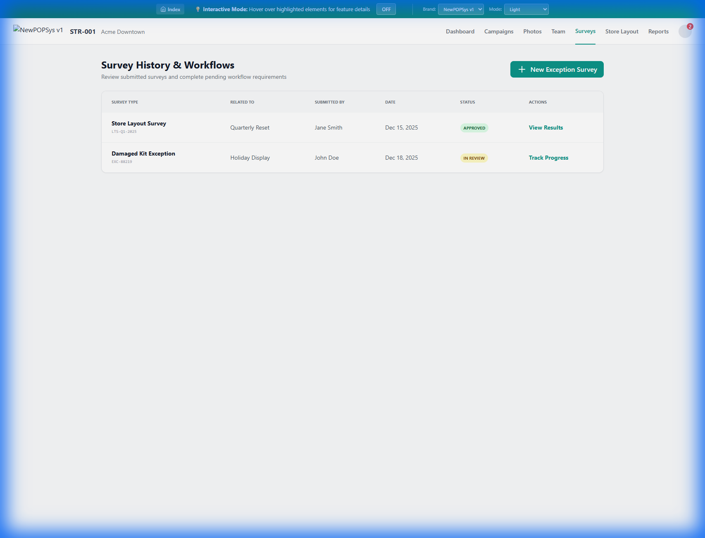

# S006 - Surveys Screen Specification

> **Module**: StorePortal
> **Screen ID**: S006
> **Route**: `/store/surveys`
> **Version**: 1.0
> **Last Updated**: 2026-01-03
> **IEEE 830 Compliance**: Section 3.2 - Functional Requirements

---

## 1. Screen Overview

### 1.1 Purpose
The Surveys screen allows Store Managers to access and submit ad-hoc surveys, such as Store Layout confirmations, Exception Reports, and specialized campaign questionnaires. These surveys are defined by the Brand (via **BrandSurveyTemplate**), potentially inheriting from a Global Master.

### 1.2 Screenshot Reference

---

## 2. Screen Inventory & Features

### 2.1 Available Surveys
- **Exception Report**: Log broken fixtures or missing marketing materials outside of a campaign cycle.
- **Store Layout Verification**: Confirm current floor plan configuration.
- **Competitor Analysis**: Upload photos of competitor displays (if assigned).

### 2.2 Functional Requirements
| ID | Requirement | Priority |
| :--- | :--- | :--- |
| REQ-S006-FR-001 | Managers can view history of submitted surveys | Must |
| REQ-S006-FR-002 | Managers can start a new survey from available templates | Must |
| REQ-S006-FR-003 | Survey forms support photo uploads | Must |

---

## 3. Data Requirements

### 3.1 API Endpoints
- `GET /api/stores/{storeId}/surveys/history` - List past submissions
- `GET /api/surveys/templates` - List active templates for store type
- `POST /api/surveys/submit` - Submit new response

---

*Document Status: Active*
