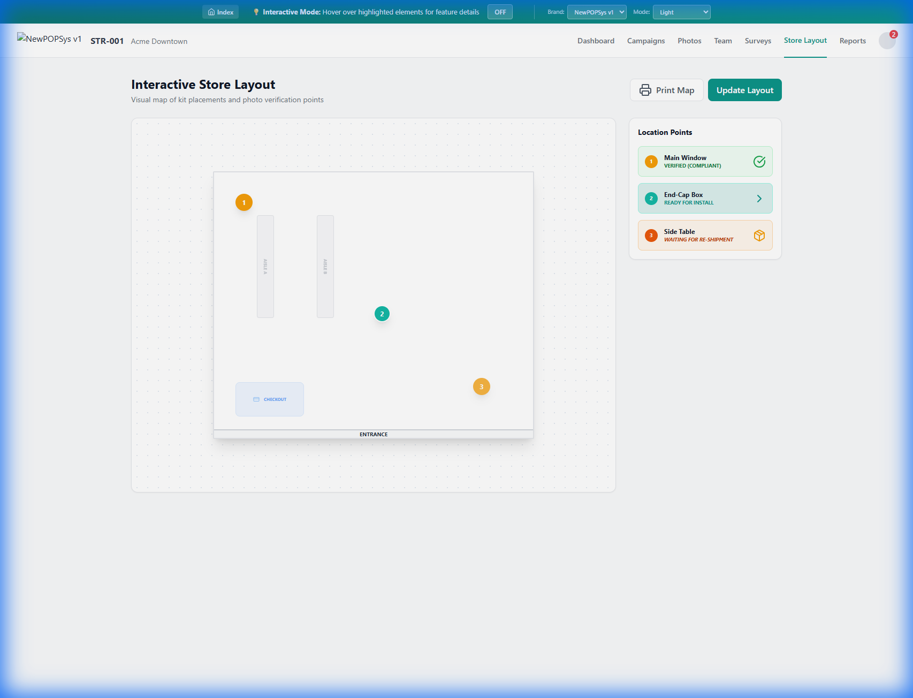

# S007 - Store Layout Screen Specification

> **Module**: StorePortal
> **Screen ID**: S007
> **Route**: `/store/layout`
> **Version**: 1.0
> **Last Updated**: 2026-01-03
> **IEEE 830 Compliance**: Section 3.2 - Functional Requirements

---

## 1. Screen Overview

### 1.1 Purpose
The Store Layout screen provides an interactive visual map of the store's marketing fixtures (Gondolas, Endcaps, Windows). Managers use this to verify slot configurations and view active campaigns mapped to physical locations. The layout definition is managed by the Brand (**StoreLayout** entity).

### 1.2 Screenshot Reference

---

## 2. Features

### 2.1 Interactive Map (Grid View)
- **Top-Down Render**: Renders the store's walls, zones, and fixtures based on the Grid Layout definition.
- **Visual Nodes**: Clickable markers for each marketing slot, positioned accurately (`x`, `y`).
- **Status Indication**: Color-coded markers (Green = Active Campaign, Gray = Vacant).
- **Tooltips**: Hover details showing slot name and current assignment.

### 2.2 Functional Requirements
| ID | Requirement | Priority |
| :--- | :--- | :--- |
| REQ-S007-FR-001 | Display layout background image specific to store format | Must |
| REQ-S007-FR-002 | Overlay click targets for all active LocationSlots | Must |
| REQ-S007-FR-003 | Clicking a slot opens specific assignment details | Should |

---

## 3. Data Requirements

### 3.1 API Endpoints
- `GET /api/stores/{storeId}/layout` - Fetch map image and slot coordinates
- `GET /api/stores/{storeId}/slots` - List slot statuses

---

*Document Status: Active*
