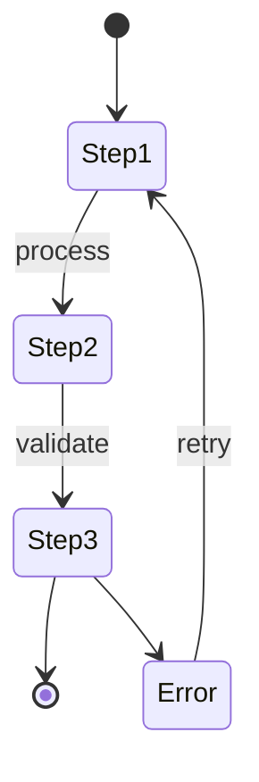

# 11.3 External Integrations

## Document Information
| Field | Value |
|-------|-------|
| Document ID | SRS-11.3 |
| Version | 1.0 |
| Last Updated | 2025-01-13 |
| Status | Draft |
| Parent Document | SRS-11 API Specifications |

---

## 1. Introduction

### 1.1 Purpose
This document specifies the external system integrations for NewPOPSys, detailing how the platform connects with third-party services including ERP systems, CRM platforms, shipping carriers, and identity providers.

### 1.2 Integration Architecture Overview



### 1.3 Integration Partners Summary

| Partner Category | Systems | Direction |
|-----------------|---------|-----------|
| PSP MIS | W2P, EFI, Tharstern | Bidirectional |
| Shipping Carriers | UPS, FedEx, USPS, DHL | Bidirectional |
| Brand ERP | SAP, Oracle, NetSuite | Outbound Webhooks |
| Identity (SSO) | Azure AD, Okta, Auth0 | Inbound |
| Payment | Stripe, PayPal | Bidirectional |
| Storage | AWS S3, Azure Blob | Outbound |
| Notifications | SendGrid, Twilio | Outbound |

---

## 2. PSP MIS Integration

### 2.1 Overview
Print Service Provider (PSP) Management Information Systems receive orders from NewPOPSys and report back production status and shipment information.

### 2.2 Supported MIS Platforms

| Platform | Version | Protocol | Authentication |
|----------|---------|----------|----------------|
| W2P Custom | Various | REST API | API Key |
| EFI Pace | 28+ | REST/SOAP | OAuth 2.0 |
| Tharstern | 8+ | REST API | API Key |
| PrintSmith | Vision | REST API | API Key |

### 2.3 Data Flow

```
NewPOPSys                                    PSP MIS
    │                                            │
    │──────── order.generated webhook ──────────▶│
    │                                            │
    │◀─────── POST /orders/{id}/acknowledge ─────│
    │                                            │
    │◀─────── PUT /orders/{id}/status ───────────│
    │                (in_production)             │
    │                                            │
    │◀─────── PUT /orders/{id}/status ───────────│
    │                (ready_to_ship)             │
    │                                            │
    │◀─────── POST /orders/{id}/shipments ───────│
    │                                            │
    │──────── shipment.created webhook ─────────▶│
    │                                            │
```

### 2.4 Order Data Mapping

#### 2.4.1 NewPOPSys to PSP Order Fields

| NewPOPSys Field | PSP MIS Field | Description |
|-----------------|---------------|-------------|
| `orderId` | `external_order_id` | Unique order reference |
| `campaignId` | `project_code` | Campaign/project identifier |
| `items[].sku` | `product_sku` | Product SKU |
| `items[].quantity` | `quantity` | Order quantity |
| `items[].specifications` | `job_specs` | Print specifications |
| `shippingAddress` | `delivery_address` | Ship-to address |
| `priority` | `rush_flag` | Priority indicator |
| `dueDate` | `required_date` | Required delivery date |

#### 2.4.2 Sample Order Payload

```json
{
  "orderId": "ORD-2025-001234",
  "campaignId": "CAMP-2025-Q1-PROMO",
  "orderDate": "2025-01-13T10:00:00Z",
  "priority": "standard",
  "dueDate": "2025-01-20",
  "customer": {
    "customerId": "CUST-001",
    "name": "Acme Retail Brand",
    "accountNumber": "ACM-12345"
  },
  "items": [
    {
      "lineId": "LN-001",
      "sku": "POP-FLRDSP-24X36",
      "name": "Floor Display Stand 24x36",
      "quantity": 150,
      "specifications": {
        "material": "Corrugated E-Flute",
        "printing": "4/0 CMYK + Spot PMS 185C",
        "finishing": "Gloss Lamination",
        "assembly": "Ship Flat"
      },
      "artworkUrl": "https://storage.newpopsys.com/artwork/ORD-001234/LN-001.pdf"
    }
  ],
  "shippingAddress": {
    "name": "Store Manager",
    "company": "Acme Store #1234",
    "address1": "500 Main Street",
    "city": "Milwaukee",
    "state": "WI",
    "postalCode": "53202",
    "country": "US"
  },
  "shippingMethod": {
    "carrier": "UPS",
    "service": "GROUND",
    "instructions": "Deliver to receiving dock"
  }
}
```

### 2.5 PSP API Callbacks

#### 2.5.1 Status Update Callback

```http
PUT /v1/orders/ORD-2025-001234/status HTTP/1.1
Host: api.newpopsys.com
X-API-Key: vg_live_psp_key_abc123
Content-Type: application/json

{
  "status": "in_production",
  "statusDetails": "Printing complete, moving to finishing",
  "updatedAt": "2025-01-14T14:30:00Z",
  "completionPercentage": 60,
  "estimatedCompletion": "2025-01-15T12:00:00Z"
}
```

### 2.6 Error Handling

| PSP Error | NewPOPSys Handling |
|-----------|-------------------|
| Order not found | Return 404, notify operations |
| Invalid status transition | Return 400, log attempt |
| Duplicate acknowledgment | Return 409, idempotent |
| Production failure | Accept callback, trigger issue.created |

---

## 3. Shipping Carrier Integration

### 3.1 Supported Carriers

| Carrier | API Version | Services Supported |
|---------|-------------|-------------------|
| UPS | REST 2.0 | Ground, 2-Day, Next Day, Freight |
| FedEx | REST 2023 | Ground, Express, Freight |
| USPS | Web Tools 3.0 | Priority, Priority Express, Parcel Select |
| DHL | Express API 2.0 | Express, eCommerce |

### 3.2 Carrier API Endpoints

#### 3.2.1 UPS Integration

| Operation | Endpoint | Method |
|-----------|----------|--------|
| Rate Quote | `/rating/v1/rate` | POST |
| Create Shipment | `/shipments/v1/shipments` | POST |
| Track Package | `/track/v1/details/{trackingNumber}` | GET |
| Void Shipment | `/shipments/v1/shipments/{shipmentId}/void` | PUT |

#### 3.2.2 FedEx Integration

| Operation | Endpoint | Method |
|-----------|----------|--------|
| Rate Quote | `/rate/v1/rates/quotes` | POST |
| Create Shipment | `/ship/v1/shipments` | POST |
| Track Package | `/track/v1/trackingnumbers` | POST |
| Cancel Shipment | `/ship/v1/shipments/cancel` | PUT |

### 3.3 Tracking Integration

#### 3.3.1 Polling Configuration

| Carrier | Poll Interval | Batch Size | Timeout |
|---------|---------------|------------|---------|
| UPS | 30 minutes | 100 tracking numbers | 30 seconds |
| FedEx | 30 minutes | 100 tracking numbers | 30 seconds |
| USPS | 60 minutes | 50 tracking numbers | 60 seconds |
| DHL | 30 minutes | 50 tracking numbers | 45 seconds |

#### 3.3.2 Tracking Event Mapping

| Carrier Event | NewPOPSys Status | Description |
|---------------|------------------|-------------|
| Picked Up | `in_transit` | Package collected |
| In Transit | `in_transit` | En route |
| Out for Delivery | `out_for_delivery` | Final mile |
| Delivered | `delivered` | Package delivered |
| Exception | `exception` | Delivery issue |
| Returned | `returned` | Return to sender |

#### 3.3.3 Sample Tracking Response Mapping

**UPS Tracking Response:**
```json
{
  "trackResponse": {
    "shipment": [
      {
        "inquiryNumber": "1Z999AA10123456784",
        "package": [
          {
            "trackingNumber": "1Z999AA10123456784",
            "activity": [
              {
                "status": {
                  "type": "D",
                  "description": "Delivered",
                  "code": "KB"
                },
                "date": "20250118",
                "time": "143000",
                "location": {
                  "city": "MILWAUKEE",
                  "stateProvince": "WI",
                  "postalCode": "53202",
                  "country": "US"
                }
              }
            ]
          }
        ]
      }
    ]
  }
}
```

**Mapped NewPOPSys Event:**
```json
{
  "shipmentId": "SHP-2025-001234",
  "trackingNumber": "1Z999AA10123456784",
  "carrier": "UPS",
  "status": "delivered",
  "eventTimestamp": "2025-01-18T14:30:00Z",
  "location": {
    "city": "Milwaukee",
    "state": "WI",
    "postalCode": "53202",
    "country": "US"
  },
  "signedBy": "J SMITH"
}
```

### 3.4 Label Generation

#### 3.4.1 Label Format Support

| Carrier | Formats | Default |
|---------|---------|---------|
| UPS | ZPL, PNG, PDF, GIF | PDF |
| FedEx | ZPL, PNG, PDF | PDF |
| USPS | ZPL, PDF | PDF |
| DHL | ZPL, PDF | PDF |

#### 3.4.2 Label Request Example

```json
{
  "carrier": "UPS",
  "service": "GROUND",
  "labelFormat": "PDF",
  "shipFrom": {
    "name": "PSP Fulfillment",
    "address1": "100 Industrial Way",
    "city": "Chicago",
    "state": "IL",
    "postalCode": "60601",
    "country": "US",
    "phone": "3125551234"
  },
  "shipTo": {
    "name": "Store Manager",
    "company": "Retail Store #1234",
    "address1": "500 Main Street",
    "city": "Milwaukee",
    "state": "WI",
    "postalCode": "53202",
    "country": "US",
    "phone": "4145556789"
  },
  "packages": [
    {
      "weight": {
        "value": 5.5,
        "unit": "LB"
      },
      "dimensions": {
        "length": 12,
        "width": 10,
        "height": 4,
        "unit": "IN"
      },
      "reference1": "ORD-2025-001234",
      "reference2": "STORE-1234"
    }
  ]
}
```

---

## 4. Brand ERP Integration

### 4.1 Supported ERP Systems

| ERP System | Integration Method | Authentication |
|------------|-------------------|----------------|
| SAP S/4HANA | REST API / OData | OAuth 2.0 + Certificate |
| Oracle NetSuite | SuiteTalk REST | Token-Based Auth |
| Microsoft Dynamics 365 | Web API | Azure AD OAuth 2.0 |
| Sage Intacct | REST API | Session-Based |

### 4.2 Integration Patterns

NewPOPSys sends event notifications to Brand ERP systems via webhooks. ERPs do not call back into NewPOPSys directly.

```
NewPOPSys                              Brand ERP
    │                                      │
    │──── campaign.published webhook ─────▶│
    │                                      │
    │──── order.generated webhook ────────▶│
    │                                      │
    │──── order.shipped webhook ──────────▶│
    │                                      │
    │──── invoice.created webhook ────────▶│
    │                                      │
```

### 4.3 ERP Data Mapping

#### 4.3.1 Campaign to ERP Project

| NewPOPSys Field | SAP Field | NetSuite Field | Dynamics Field |
|-----------------|-----------|----------------|----------------|
| `campaignId` | `PROJECT_ID` | `entityId` | `msdyn_projectid` |
| `campaignName` | `PROJECT_DESC` | `name` | `msdyn_subject` |
| `budget` | `BUDGET_AMOUNT` | `projectedBudget` | `msdyn_plannedbudget` |
| `startDate` | `START_DATE` | `startDate` | `msdyn_scheduledstart` |
| `endDate` | `END_DATE` | `endDate` | `msdyn_scheduledend` |
| `brandId` | `CUSTOMER_ID` | `customer` | `customerid` |

#### 4.3.2 Order to ERP Sales Order

| NewPOPSys Field | SAP Field | NetSuite Field | Dynamics Field |
|-----------------|-----------|----------------|----------------|
| `orderId` | `SALES_ORDER_NO` | `tranId` | `salesorderid` |
| `orderDate` | `ORDER_DATE` | `tranDate` | `createdon` |
| `totalAmount` | `NET_VALUE` | `total` | `totalamount` |
| `shippingAddress` | `SHIP_TO_PARTY` | `shipAddress` | `shipto_composite` |
| `items[].sku` | `MATERIAL_NO` | `item` | `productid` |
| `items[].quantity` | `ORDER_QTY` | `quantity` | `quantity` |

### 4.4 Webhook Payload for ERP

```json
{
  "event": "order.shipped",
  "timestamp": "2025-01-15T09:00:00Z",
  "data": {
    "orderId": "ORD-2025-001234",
    "externalOrderId": "SO-12345",
    "campaignId": "CAMP-2025-Q1",
    "shippedAt": "2025-01-15T09:00:00Z",
    "carrier": "UPS",
    "trackingNumber": "1Z999AA10123456784",
    "trackingUrl": "https://ups.com/track?num=1Z999AA10123456784",
    "shipmentDetails": {
      "packageCount": 1,
      "totalWeight": {
        "value": 5.5,
        "unit": "LB"
      },
      "estimatedDelivery": "2025-01-18"
    },
    "financials": {
      "shippingCost": 15.99,
      "currency": "USD"
    }
  },
  "tenant": {
    "tenantId": "TNT-001",
    "brandName": "Acme Retail"
  }
}
```

---

## 5. Identity & SSO Integration

### 5.1 Supported Identity Providers

| Provider | Protocol | Features |
|----------|----------|----------|
| Azure AD | SAML 2.0 / OIDC | Enterprise SSO, MFA, Groups |
| Okta | SAML 2.0 / OIDC | Universal Directory, MFA |
| Auth0 | OIDC | Social Login, Custom DB |
| Google Workspace | OIDC | G Suite Integration |
| PingFederate | SAML 2.0 | Enterprise Federation |

### 5.2 SAML 2.0 Configuration

#### 5.2.1 Service Provider Metadata

| Attribute | Value |
|-----------|-------|
| Entity ID | `https://api.newpopsys.com/saml/metadata` |
| ACS URL | `https://api.newpopsys.com/saml/callback` |
| SLO URL | `https://api.newpopsys.com/saml/logout` |
| Name ID Format | `emailAddress` |
| Signature Algorithm | RSA-SHA256 |

#### 5.2.2 Required SAML Assertions

| Attribute | Description | Required |
|-----------|-------------|----------|
| `email` | User email address | Yes |
| `firstName` | User first name | Yes |
| `lastName` | User last name | Yes |
| `groups` | Group memberships | No |
| `employeeId` | Employee identifier | No |
| `department` | Department name | No |

#### 5.2.3 Group-to-Role Mapping

| IdP Group | NewPOPSys Role | Permissions |
|-----------|----------------|-------------|
| `newpopsys-admins` | `admin` | Full access |
| `newpopsys-brand-managers` | `brand_manager` | Brand management |
| `newpopsys-field-reps` | `field_rep` | Mobile app, surveys |
| `newpopsys-viewers` | `viewer` | Read-only access |

### 5.3 OIDC Configuration

#### 5.3.1 OpenID Connect Settings

| Setting | Value |
|---------|-------|
| Client ID | Provided per tenant |
| Redirect URI | `https://api.newpopsys.com/oauth/callback` |
| Response Type | `code` |
| Scopes | `openid profile email groups` |
| Token Endpoint Auth | `client_secret_post` |

#### 5.3.2 JWT Claims Mapping

```json
{
  "sub": "user-unique-id",
  "email": "user@company.com",
  "name": "John Doe",
  "given_name": "John",
  "family_name": "Doe",
  "groups": ["newpopsys-brand-managers"],
  "iss": "https://login.microsoftonline.com/{tenant-id}/v2.0",
  "aud": "{client-id}",
  "iat": 1705142400,
  "exp": 1705146000
}
```

### 5.4 Session Management

| Setting | Value |
|---------|-------|
| Session Duration | 8 hours |
| Idle Timeout | 30 minutes |
| Refresh Token Lifetime | 24 hours |
| Concurrent Sessions | 3 per user |

---

## 6. Payment Integration

### 6.1 Supported Payment Processors

| Processor | Use Case | Features |
|-----------|----------|----------|
| Stripe | Card Payments | PCI DSS, 3D Secure |
| PayPal | PayPal Payments | Express Checkout |
| ACH/Wire | B2B Payments | Net terms support |

### 6.2 Stripe Integration

#### 6.2.1 API Configuration

| Setting | Value |
|---------|-------|
| API Version | `2024-12-18.acacia` |
| Webhook Version | `2024-12-18.acacia` |
| Payment Methods | `card`, `us_bank_account` |

#### 6.2.2 Payment Intent Flow

```
Customer                NewPOPSys               Stripe
    │                       │                      │
    │── Place Order ───────▶│                      │
    │                       │                      │
    │                       │── Create PaymentIntent ─▶│
    │                       │                      │
    │                       │◀── client_secret ────│
    │                       │                      │
    │◀── Payment Form ──────│                      │
    │                       │                      │
    │── Confirm Payment ────────────────────────────▶│
    │                       │                      │
    │                       │◀── payment_intent.succeeded ──│
    │                       │    (webhook)         │
    │                       │                      │
    │◀── Order Confirmed ───│                      │
```

#### 6.2.3 Webhook Events

| Event | NewPOPSys Action |
|-------|------------------|
| `payment_intent.succeeded` | Mark order as paid |
| `payment_intent.payment_failed` | Notify customer, retry |
| `charge.refunded` | Update order status |
| `invoice.paid` | Update subscription |

---

## 7. Cloud Storage Integration

### 7.1 Supported Storage Providers

| Provider | Use Case | Features |
|----------|----------|----------|
| AWS S3 | Primary storage | CDN, versioning |
| Azure Blob | Enterprise customers | AD integration |
| Google Cloud Storage | Alternative | Multi-region |

### 7.2 AWS S3 Configuration

#### 7.2.1 Bucket Structure

| Bucket | Purpose | Lifecycle |
|--------|---------|-----------|
| `newpopsys-artwork-{env}` | Source artwork | 2 years |
| `newpopsys-photos-{env}` | Survey photos | 1 year |
| `newpopsys-exports-{env}` | Report exports | 90 days |
| `newpopsys-temp-{env}` | Temporary uploads | 24 hours |

#### 7.2.2 Pre-signed URL Generation

```json
{
  "operation": "putObject",
  "bucket": "newpopsys-photos-prod",
  "key": "surveys/2025/01/RESP-001234/photo-001.jpg",
  "expiresIn": 3600,
  "conditions": {
    "content-type": "image/jpeg",
    "content-length-range": [1, 10485760]
  }
}
```

#### 7.2.3 CDN Configuration

| Setting | Value |
|---------|-------|
| CDN Provider | AWS CloudFront |
| Origin | S3 bucket |
| TTL | 24 hours (artwork), 1 hour (dynamic) |
| Signed URLs | Required for private assets |

---

## 8. Notification Services

### 8.1 Email (SendGrid)

#### 8.1.1 Configuration

| Setting | Value |
|---------|-------|
| API Version | v3 |
| Sender Domain | `notifications.newpopsys.com` |
| IP Warmup | Dedicated IP pool |

#### 8.1.2 Email Templates

| Template | Trigger | Recipient |
|----------|---------|-----------|
| `order-confirmation` | Order created | Store manager |
| `shipment-notification` | Shipment created | Store manager |
| `survey-reminder` | Survey due | Field rep |
| `issue-escalation` | Issue unresolved 48h | Brand manager |

### 8.2 SMS (Twilio)

#### 8.2.1 Configuration

| Setting | Value |
|---------|-------|
| API Version | 2010-04-01 |
| Sender Number | Short code or toll-free |
| Messaging Service | Enabled |

#### 8.2.2 SMS Use Cases

| Use Case | Template |
|----------|----------|
| Delivery OTP | "Your delivery code is {code}. Valid for 30 minutes." |
| Survey Reminder | "Reminder: Complete installation survey for Store #{store_id}." |
| Urgent Issue | "URGENT: Issue #{issue_id} requires immediate attention." |

---

## 9. Error Handling & Retry

### 9.1 External API Error Handling

| Error Type | Retry Strategy | Max Attempts |
|------------|----------------|--------------|
| 5xx Server Error | Exponential backoff | 5 |
| 429 Rate Limited | Respect Retry-After | 3 |
| 401 Unauthorized | Refresh token, retry | 1 |
| 4xx Client Error | No retry | 0 |
| Network Timeout | Immediate retry | 3 |

### 9.2 Retry Schedule

```
Attempt 1: Immediate
Attempt 2: 1 second delay
Attempt 3: 5 seconds delay
Attempt 4: 30 seconds delay
Attempt 5: 5 minutes delay
```

### 9.3 Circuit Breaker Configuration

| Setting | Value |
|---------|-------|
| Failure Threshold | 5 failures in 60 seconds |
| Open Duration | 30 seconds |
| Half-Open Requests | 3 |
| Success Threshold | 2 consecutive successes |

---

## 10. Security Requirements

### 10.1 API Credential Storage

| Credential Type | Storage | Rotation |
|-----------------|---------|----------|
| API Keys | AWS Secrets Manager | 90 days |
| OAuth Tokens | Redis (encrypted) | Per session |
| Service Accounts | Vault | 30 days |
| Certificates | ACM / Key Vault | 1 year |

### 10.2 Data Encryption

| Data State | Encryption |
|------------|------------|
| In Transit | TLS 1.3 |
| At Rest | AES-256 |
| Secrets | AWS KMS / Azure Key Vault |

### 10.3 Audit Logging

All external API calls are logged with:
- Timestamp
- Target system
- Operation type
- Request ID
- Response status
- Latency
- Error details (if any)

---

## 11. Monitoring & Alerting

### 11.1 Health Checks

| Integration | Check Interval | Timeout |
|-------------|----------------|---------|
| Shipping Carriers | 5 minutes | 10 seconds |
| ERP Systems | 5 minutes | 30 seconds |
| Identity Providers | 1 minute | 5 seconds |
| Payment Processors | 1 minute | 10 seconds |

### 11.2 Alert Thresholds

| Metric | Warning | Critical |
|--------|---------|----------|
| API Error Rate | > 1% | > 5% |
| Response Latency | > 2 seconds | > 5 seconds |
| Circuit Breaker Open | N/A | Any open |
| Authentication Failures | > 10/hour | > 50/hour |

---

## 12. Related Documents

| Document ID | Title | Description |
|-------------|-------|-------------|
| SRS-11.1 | API Overview | Authentication, versioning, rate limiting |
| SRS-11.2 | Internal APIs | RESTful endpoint specifications |
| SRS-11.4 | Webhooks | Event-driven notifications |
| SRS-3.4 | Integration Architecture | Technical integration patterns |

---

## Revision History

| Version | Date | Author | Changes |
|---------|------|--------|---------|
| 1.0 | 2025-01-13 | System | Initial version |
