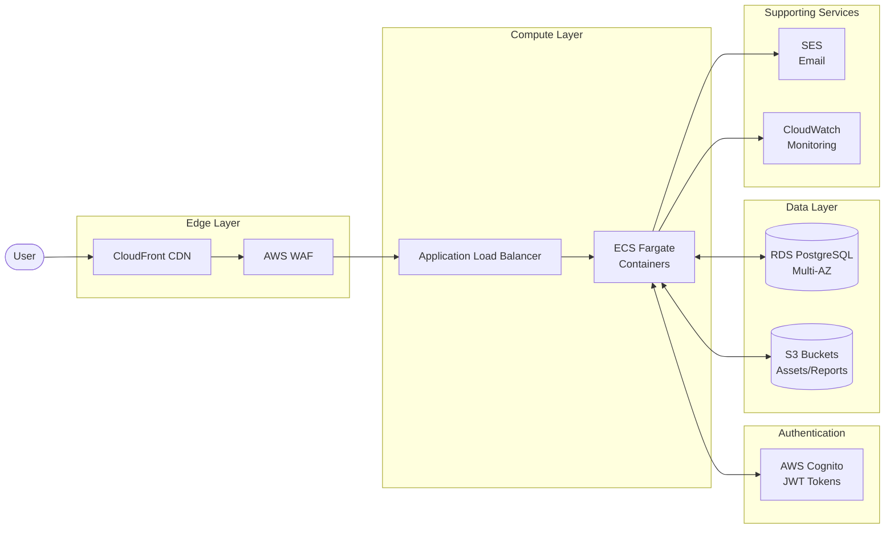
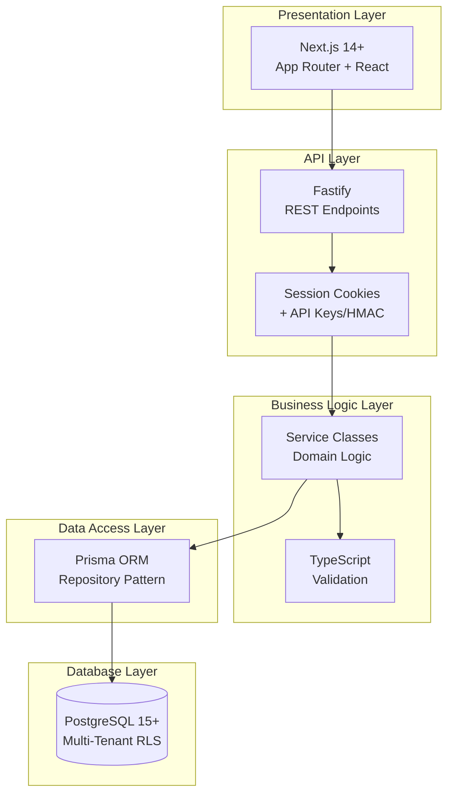
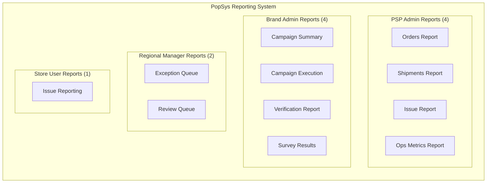
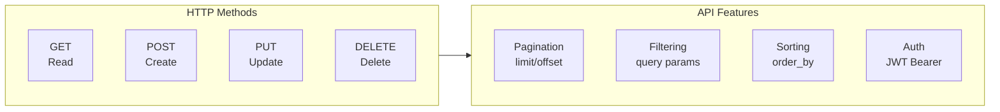

# SRS PDF Integration Content

**Source Documents**:
- `Process Matters - Architecture And Tech Stack.pdf`
- `Process Matters Reporting Requirements.pdf`

**Created**: 2026-01-02
**Purpose**: Mermaid diagrams for SRS integration

> ⚠️ **Important**: The PDF source documents describe a Python/FastAPI stack. The actual NewPOPSys v1 uses **Node.js/TypeScript with Fastify**. Tech stack sections below have been corrected to match SUPP-012 and SRS Section 3.3.

---

## 1. Physical Architecture (AWS)

The system leverages AWS managed services for scalability, security, and reliability.

---

## 2. Logical Architecture (Application Layers)

The application follows a modular monolith architecture (Turborepo monorepo).

---

## 3. Report Types by User Role

Reports are segmented by user role with specific access permissions.

### Report Summary Table

| Role | Report Count | Reports |
|------|--------------|---------|
| PSP Admin | 4 | Orders, Shipments, Issues, Ops Metrics |
| Brand Admin | 4 | Campaign Summary, Execution, Verification, Survey |
| Regional Manager | 2 | Exception Queue, Review Queue |
| Store User | 1 | Issue Reporting |

---

## 4. Technology Stack

> **Note**: Aligned with SRS Section 3.3 and SUPP-012. The PDF source documents described a Python stack; the actual NewPOPSys v1 uses Node.js/TypeScript.

### Backend Stack

| Component | Technology | Version | Purpose |
|-----------|------------|---------|---------|
| Language | TypeScript | 5.x | Server-side logic |
| Framework | Fastify | Latest | REST API endpoints |
| ORM | Prisma | Latest | Database abstraction |
| Validation | TypeScript + Zod | - | Request/response validation |
| Queue | BullMQ | Latest | Background jobs, webhooks |

### Frontend Stack

| Component | Technology | Version | Purpose |
|-----------|------------|---------|---------|
| Framework | Next.js | 14+ | App Router, SSR/SSG |
| UI Library | React | 18+ | Component architecture |
| Styling | TailwindCSS | 3.x | Utility-first CSS |
| Monorepo | Turborepo | Latest | Build orchestration |

### Infrastructure Stack

| Component | Technology | Purpose |
|-----------|------------|---------|
| Containers | Docker | Application packaging |
| Orchestration | AWS ECS Fargate | Serverless containers |
| IaC | Terraform | Infrastructure provisioning |
| Observability | OpenTelemetry + Sentry | Tracing, error tracking |

### Database & Auth

| Component | Technology | Configuration |
|-----------|------------|---------------|
| Primary DB | PostgreSQL | 15+, Multi-AZ, RLS |
| Web Auth | Session Cookies | Server-side sessions |
| API Auth | API Keys + HMAC | Integration authentication |
| Storage | AWS S3 | Media, reports, exports |

---

## 5. REST API Design Principles

The API follows RESTful conventions:

### URL Structure
- Resource-oriented: `/api/v1/{resource}/{id}`
- Nested resources: `/api/v1/campaigns/{id}/tasks`
- Actions: `/api/v1/tasks/{id}/complete`

---

## Integration Notes

These diagrams should be integrated into the SRS at the following sections:
- Physical Architecture → Section 3.1 (System Architecture)
- Logical Architecture → Section 3.2 (Software Architecture)
- Report Types → Section 4.x (Reporting Requirements)
- Tech Stack → Appendix or Section 3.3 (Technology Stack)
