# NewPOPSys Software Requirements Specification

**Version:** 1.38
**Date:** 2026-01-01
**Status:** Final Draft
**Classification:** Internal - Confidential

---


---

# Executive Summary

---

| **Document** | NewPOPSys Software Requirements Specification |
|--------------|-----------------------------------------------|
| **Version**  | 1.38                                          |
| **Date**     | 2026-01-01                                    |
| **Classification** | Internal - Confidential                 |

---

## Project Overview

NewPOPSys is a multi-tenant Point of Purchase (POP) campaign management platform designed to enable brands to create, distribute, and verify in-store marketing materials across retail networks. The system provides end-to-end workflow management from campaign design through production fulfillment, integrating seamlessly with Print Service Providers (PSPs) to automate production queues and delivery tracking. By digitizing the traditionally manual POP process, NewPOPSys reduces time-to-market, improves compliance verification, and provides actionable analytics on campaign performance.

---

## Key Deliverables

| Deliverable | Description | Status |
|-------------|-------------|--------|
| Mobile PWA | Store operator app for surveys & photo capture | Specified |
| Brand Admin Portal | Campaign creation & management | Specified |
| PSP Operations Console | Production queue & fulfillment | Specified |
| Store Portal | Regional/store management dashboard | Specified |
| Platform Admin | Multi-tenant administration | Specified |
| Integration APIs | REST/GraphQL endpoints | Specified |

---

## Scope Summary

- **6** application modules
- **35+** screen specifications
- **9** user personas with role-based access control (RBAC)
- **4** external integrations (PSP systems, authentication, storage, notifications)

---

## Technology Stack

| Layer | Technology |
|-------|------------|
| Frontend | React / Next.js PWA |
| Backend | Node.js / NestJS |
| Database | PostgreSQL |
| Infrastructure | AWS / Kubernetes |

---

## Risk Summary

| Risk | Impact | Mitigation |
|------|--------|------------|
| PSP Integration Delays | High | Early API prototyping and sandbox testing |
| Mobile Offline Sync | Medium | Progressive enhancement with local-first architecture |
| Multi-tenant Data Isolation | High | Row-level security and schema separation |
| Photo Storage Scaling | Medium | CDN integration with automatic compression |
| RBAC Complexity | Medium | Permission matrix validation and automated testing |

---

## Approval

```
APPROVED BY:

_________________________    _______________
[Name], CIO                  Date


_________________________    _______________
[Name], VP Engineering       Date


_________________________    _______________
[Name], Product Owner        Date
```

---

*This document serves as the authoritative Software Requirements Specification for the NewPOPSys platform.*


---

# Table of Contents

---

## Front Matter
- [Executive Summary](./00_Executive_Summary.md)
- [Table of Contents](./00_Table_of_Contents.md)

---

## Section 1: Introduction
- [1.1 Purpose](./01_Introduction/1.1_Purpose.md)
- [1.2 Scope](./01_Introduction/1.2_Scope.md)
- [1.3 Definitions & Acronyms](./01_Introduction/1.3_Definitions_Acronyms.md)
- [1.4 References](./01_Introduction/1.4_References.md)
- [1.5 Document Overview](./01_Introduction/1.5_Document_Overview.md)

---

## Section 2: Overall Description
- [2.1 Product Perspective](./02_Overall_Description/2.1_Product_Perspective.md)
- [2.2 Product Functions](./02_Overall_Description/2.2_Product_Functions.md)
- [2.3 User Classes](./02_Overall_Description/2.3_User_Classes.md)
- [2.4 Operating Environment](./02_Overall_Description/2.4_Operating_Environment.md)
- [2.5 Constraints](./02_Overall_Description/2.5_Constraints.md)
- [2.6 Assumptions & Dependencies](./02_Overall_Description/2.6_Assumptions_Dependencies.md)

---

## Section 3: System Architecture
- [3.1 Database Model](./03_System_Architecture/3.1_Database_Model.md)
- [3.2 Application Architecture](./03_System_Architecture/3.2_Application_Architecture.md)
- [3.3 Technology Stack](./03_System_Architecture/3.3_Technology_Stack.md)
- [3.4 Integration Architecture](./03_System_Architecture/3.4_Integration_Architecture.md)

---

## Section 4: User Personas & RBAC
- [4.1 Persona Matrix](./04_User_Personas_RBAC/4.1_Persona_Matrix.md)
- [4.2 Permission Matrix](./04_User_Personas_RBAC/4.2_Permission_Matrix.md)
- [4.3 Authentication Flows](./04_User_Personas_RBAC/4.3_Authentication_Flows.md)
- [P01 Platform Administrator](./04_User_Personas_RBAC/personas/P01_Platform_Administrator.md)
- [P02 Brand Manager](./04_User_Personas_RBAC/personas/P02_Brand_Manager.md)
- [P03 Brand Coordinator](./04_User_Personas_RBAC/personas/P03_Brand_Coordinator.md)
- [P04 Regional Manager](./04_User_Personas_RBAC/personas/P04_Regional_Manager.md)
- [P05 Store Manager](./04_User_Personas_RBAC/personas/P05_Store_Manager.md)
- [P06 Store Operator](./04_User_Personas_RBAC/personas/P06_Store_Operator.md)
- [P07 PSP Admin](./04_User_Personas_RBAC/personas/P07_PSP_Admin.md)
- [P08 PSP Operator](./04_User_Personas_RBAC/personas/P08_PSP_Operator.md)
- [P09 Read-Only Viewer](./04_User_Personas_RBAC/personas/P09_ReadOnly_Viewer.md)

---

## Section 5: Module - Shared Foundations
- [Module Overview](./05_Module_SharedFoundations/01_Module_Overview.md)
- [L001 Universal Login](./05_Module_SharedFoundations/screens/L001_Universal_Login.md)
- [L002 Universal Dashboard](./05_Module_SharedFoundations/screens/L002_Universal_Dashboard.md)

---

## Section 6: Module - Mobile PWA
- [Module Overview](./06_Module_MobilePWA/01_Module_Overview.md)
- [M001 Mobile Dashboard](./06_Module_MobilePWA/screens/M001_Mobile_Dashboard.md)
- [M002 Survey List](./06_Module_MobilePWA/screens/M002_Survey_List.md)
- [M003 Survey Execution](./06_Module_MobilePWA/screens/M003_Survey_Execution.md)
- [M004 Photo Capture](./06_Module_MobilePWA/screens/M004_Photo_Capture.md)
- [M005 Campaign Materials](./06_Module_MobilePWA/screens/M005_Campaign_Materials.md)
- [M006 Notifications](./06_Module_MobilePWA/screens/M006_Notifications.md)
- [M007 Store Profile](./06_Module_MobilePWA/screens/M007_Store_Profile.md)
- [M008 Offline Mode](./06_Module_MobilePWA/screens/M008_Offline_Mode.md)

---

## Section 7: Module - Brand Admin
- [Module Overview](./07_Module_BrandAdmin/01_Module_Overview.md)
- [B001 Brand Dashboard](./07_Module_BrandAdmin/screens/B001_Brand_Dashboard.md)
- [B002 Campaign Management](./07_Module_BrandAdmin/screens/B002_Campaign_Management.md)
- [B003 Campaign Builder](./07_Module_BrandAdmin/screens/B003_Campaign_Builder.md)
- [B004 Survey Builder](./07_Module_BrandAdmin/screens/B004_Survey_Builder.md)
- [B005 Store Network](./07_Module_BrandAdmin/screens/B005_Store_Network.md)
- [B006 Analytics](./07_Module_BrandAdmin/screens/B006_Analytics.md)
- [B007 Asset Library](./07_Module_BrandAdmin/screens/B007_Asset_Library.md)

---

## Section 8: Module - PSP Operations
- [Module Overview](./08_Module_PSPOperations/01_Module_Overview.md)
- [P001 PSP Dashboard](./08_Module_PSPOperations/screens/P001_PSP_Dashboard.md)
- [P002 Production Queue](./08_Module_PSPOperations/screens/P002_Production_Queue.md)
- [P003 Fulfillment Tracking](./08_Module_PSPOperations/screens/P003_Fulfillment_Tracking.md)

---

## Section 9: Module - Store Portal
- [Module Overview](./09_Module_StorePortal/01_Module_Overview.md)
- [S001 Store Dashboard](./09_Module_StorePortal/screens/S001_Store_Dashboard.md)
- [S002 Store Management](./09_Module_StorePortal/screens/S002_Store_Management.md)
- [S003 User Management](./09_Module_StorePortal/screens/S003_User_Management.md)
- [S004 Compliance Reports](./09_Module_StorePortal/screens/S004_Compliance_Reports.md)
- [S005 Regional Overview](./09_Module_StorePortal/screens/S005_Regional_Overview.md)

---

## Section 10: Module - Platform Admin
- [Module Overview](./10_Module_PlatformAdmin/01_Module_Overview.md)
- [A001 Admin Dashboard](./10_Module_PlatformAdmin/screens/A001_Admin_Dashboard.md)
- [A002 Tenant Management](./10_Module_PlatformAdmin/screens/A002_Tenant_Management.md)
- [A003 User Administration](./10_Module_PlatformAdmin/screens/A003_User_Administration.md)
- [A004 System Configuration](./10_Module_PlatformAdmin/screens/A004_System_Configuration.md)
- [A005 Audit Logs](./10_Module_PlatformAdmin/screens/A005_Audit_Logs.md)
- [A006 Integration Management](./10_Module_PlatformAdmin/screens/A006_Integration_Management.md)

---

## Section 11: API Specifications
- [11.1 API Overview](./11_API_Specifications/11.1_API_Overview.md)
- [11.2 Internal APIs](./11_API_Specifications/11.2_Internal_APIs.md)
- [11.3 External Integrations](./11_API_Specifications/11.3_External_Integrations.md)
- [11.4 Webhooks](./11_API_Specifications/11.4_Webhooks.md)

---

## Section 12: Non-Functional Requirements
- [12.1 Performance](./12_Non_Functional_Requirements/12.1_Performance.md)
- [12.2 Security](./12_Non_Functional_Requirements/12.2_Security.md)
- [12.3 Accessibility](./12_Non_Functional_Requirements/12.3_Accessibility.md)
- [12.4 Scalability](./12_Non_Functional_Requirements/12.4_Scalability.md)
- [12.5 Availability](./12_Non_Functional_Requirements/12.5_Availability.md)
- [12.6 Data Retention](./12_Non_Functional_Requirements/12.6_Data_Retention.md)

---

## Appendices
- [A: State Machines](./99_Appendices/A_State_Machines.md)
- [B: Notification Matrix](./99_Appendices/B_Notification_Matrix.md)
- [C: Export Formats](./99_Appendices/C_Export_Formats.md)
- [D: Glossary](./99_Appendices/D_Glossary.md)
- [E: Change Log](./99_Appendices/E_Change_Log.md)

---

*NewPOPSys SRS v1.38 | 2026-01-01*


---

# Section 1: Introduction
# 1.1 Purpose

## Document Purpose

This Software Requirements Specification (SRS) document provides a comprehensive description of the NewPOPSys v1.38 platform, a PSP-led Point-of-Purchase (POP) Campaign Orchestration System. It serves as the definitive reference for all functional and non-functional requirements, system behaviors, and acceptance criteria for the v1 implementation.

## Intended Audience

| Audience | Usage |
|----------|-------|
| **Development Teams** | Primary implementation reference for building features, APIs, and user interfaces |
| **AI Development Agents** | Authoritative specification for agentic development workflows and autonomous code generation |
| **Quality Assurance** | Basis for test case development, acceptance criteria validation, and verification procedures |
| **Product Management** | Scope definition, feature prioritization, and stakeholder communication |
| **System Architects** | Technical design decisions, integration patterns, and infrastructure planning |
| **Operations Teams** | Deployment requirements, operational procedures, and support documentation |
| **Project Stakeholders** | Progress tracking, scope validation, and acceptance sign-off |

## Document Objectives

1. **Define Complete Scope**: Establish clear boundaries for v1 functionality, explicitly documenting what is included and what is deferred to future releases.

2. **Enable Agentic Development**: Provide structured, unambiguous specifications that support AI-assisted development with minimal human intervention.

3. **Establish Traceability**: Create direct links between requirements, source SOW documents, wireframes, and acceptance criteria.

4. **Support Verification**: Define measurable acceptance criteria and test scenarios for all functional requirements.

5. **Prevent Scope Creep**: Document protected "Not-Now" features and guardrails to maintain project discipline.

## Relationship to SOW Documentation

This SRS is derived from and complements the Statement of Work (SOW) documentation set:

| Document | Version | Relationship |
|----------|---------|--------------|
| Master SOW Compiled | v1.38 | Primary source of scope and requirements |
| SUPP-001 through SUPP-039 | Various | Detailed supplemental specifications |
| Screen Specifications | M/B/P/S Series | UI/UX requirements and wireframes |
| Database Model | DDL Files | Physical schema and data constraints |
| OpenAPI Specification | v1.0 | API contract definitions |

## Document Conventions

### Requirement Identifiers

All requirements use the following identifier format:

- **FR-XXX-NNN**: Functional Requirements (e.g., FR-CAM-001 for Campaign module)
- **NFR-XXX-NNN**: Non-Functional Requirements (e.g., NFR-SEC-001 for Security)
- **BR-XXX-NNN**: Business Rules (e.g., BR-VER-001 for Verification rules)
- **AC-XXX-NNN**: Acceptance Criteria (e.g., AC-CAM-001)

### Module Prefixes

| Prefix | Module |
|--------|--------|
| CAM | Campaign Management |
| STO | Store Management |
| ORD | Order/Fulfillment |
| EXE | Store Execution |
| VER | Verification |
| ISS | Issues/Reorders |
| EXP | Exports/Reports |
| INT | Integrations |
| SEC | Security/RBAC |
| PLT | Platform Operations |

### Priority Levels

| Priority | Definition |
|----------|------------|
| **P1 - Critical** | Core vertical slice functionality; must be complete for pilot |
| **P2 - Important** | Required for full pilot operation; can follow critical path |
| **P3 - Desired** | Enhances user experience; may be deferred if schedule requires |
| **P4 - Future** | Documented for future reference; explicitly out of v1 scope |

### Status Indicators

| Indicator | Meaning |
|-----------|---------|
| LOCKED | Requirement approved and frozen for implementation |
| IN_REVIEW | Under stakeholder review; implementation may proceed cautiously |
| DRAFT | Work in progress; not approved for implementation |
| DEFERRED | Explicitly moved to future release |

---

*Document Version: 1.0*
*Last Updated: 2026-01-01*
*Source: MASTER_SOW_COMPILED.md v1.38*


---
# 1.2 Scope

## System Name

**NewPOPSys v1.38** - PSP-Led POP Campaign Orchestration Platform

## System Overview

NewPOPSys v1 is a modernized campaign orchestration platform that replaces spreadsheet-and-email workflows with an auditable, deterministic lifecycle. The platform enables Print Service Providers (PSPs) to coordinate POP (Point-of-Purchase) campaigns across Brands and Stores with full visibility and control.

### Core Platform Loop

```
Campaign  Store Assignment  PSP Fulfillment  Store Execution  Verification  Visibility
```

This loop represents the complete lifecycle of a POP campaign from creation through compliance verification.

## Included Functionality (v1 Scope)

### Module 1: Identity & RBAC
- Multi-tenant architecture with PSP as root tenant
- Brand management within PSP context
- User authentication (email/password)
- Role-based access control with 9 personas
- User invitations and membership management
- API key management for integrations
- Session management and security

### Module 2: Stores, Regions & Groups
- Store profile management (1,000+ stores per brand)
- Hierarchical geography (Region > District > Territory)
- Custom store grouping with include/exclude logic
- Store layout and location slot definitions
- External ID aliasing for brand integration

### Module 3: Survey Builder & Photo Rules
- Survey template creation with dynamic fields
- Survey versioning with immutable snapshots
- Photo rule configuration per location slot
- Reference image management
- Conditional logic and repeatable sections

### Module 4: Campaigns, Kits & Assignment
- Campaign creation (Promotional and Core Branding types)
- Kit definition with item specifications
- Store selection via selection recipes
- Assignment pinning with controlled rebase
- Campaign scheduling and lifecycle management

### Module 5: Orders, Shipments & PSP Operations
- Deterministic order generation on campaign publish
- Partial shipment support
- Batch tracking (PRODUCTION, PICK_PACK, SHIP_WAVE, CUSTOM)
- Multi-tracking number support
- PSP MIS integration points

### Module 6: Store Execution & Proof Capture
- Mobile-first web application (PWA scaffold)
- Best-effort offline with sync-on-open
- Receive/verify workflow
- Pre-install checklist completion
- Item installation tracking
- Proof photo capture per item/slot
- Completion survey with attestation

### Module 7: Verification & Retake Loop
- Photo review queue for Brand/Regional managers
- Approval/rejection with reason codes
- Retake request workflow
- STRICT and FAST verification modes
- Slot-level verification tracking

### Module 8: Issues, Reorders & Deinstall
- Issue reporting (Missing, Damaged, Incorrect, Packaging)
- Issue triage and approval workflow
- Reorder generation and tracking
- Campaign expiration handling
- Deinstall task management

### Module 9: Exports & Reports
- CSV/XLSX export generation
- PDF report generation
- JSON/XML data exports
- Async export processing with BullMQ
- Export artifact management

### Module 10: Integrations & Webhooks
- Signed webhook dispatch
- Inbound API with idempotency keys
- Event outbox pattern for reliability
- Retry scheduling with dead-letter queue
- PSP MIS integration scaffolding

### Module 11: Data Retention
- 90-day retention post campaign completion
- Export-before-delete workflow
- Automated purge jobs
- Asset registry for permanent definitions
- Audit event preservation

### Module 12: Offline & Sync Strategy
- PWA service worker scaffold
- Offline draft storage
- Sync-on-open submission queue
- Conflict resolution policies

## Excluded Functionality (Protected Not-Now)

The following are explicitly **out of scope** for v1 and protected from scope creep:

### Not an MIS/ERP
- No job costing or accounting
- No production scheduling
- No payroll integration
- No financial reporting

### Not a Marketplace
- No installer bidding/matchmaking
- No vendor marketplace
- No ratings/reviews system
- No dynamic pricing

### Not Analytics-Heavy
- No benchmarking dashboards
- No predictive analytics
- No AI insights surfaced to users
- Data readiness only (for future phases)

### Not Long-Term Storage
- No archival data warehouse
- No extended retention beyond 90 days
- Export pathways provided for data preservation

### Not Endlessly Customizable
- PSP adoption prioritized over store UX flexibility
- Store interface is execution-focused, not configurable

## Pilot Context

| Dimension | Target |
|-----------|--------|
| Pilot PSPs | 2 (Visual Graphx; Speedy CPS / Alpha Graphics) |
| Pilot Brands | 2-3 (Good2Go confirmed for Speedy/AG) |
| Stores per Brand | Up to 1,000 |
| Media Volume | >= 1 photo per item per location per campaign |
| Execution Platform | Web app first; PWA scaffold with offline drafts |
| Data Retention | 90 days post campaign completion |

## Success Criteria

A campaign can be:
1. Configured, published, and fulfilled without spreadsheets or manual reconciliation
2. Executed by stores with guided workflows and proof capture
3. Verified with approval/rejection/retake cycles
4. Exported with complete audit trail
5. Traced end-to-end using correlationId and audit logs
6. Automatically cleaned up per retention policy

## Scope Control

Any scope changes must:
1. Be formally requested through the Decision Log
2. Include tradeoff analysis (what gets deferred)
3. Receive stakeholder approval
4. Update affected SUPP documents
5. Regenerate this SRS with version bump

---

*Document Version: 1.0*
*Last Updated: 2026-01-01*
*Source: MASTER_SOW_COMPILED.md v1.38, Sections 2, 5, 6*


---
# 1.3 Definitions, Acronyms, and Abbreviations

## Abbreviations

| Abbreviation | Full Term |
|--------------|-----------|
| **API** | Application Programming Interface |
| **AWS** | Amazon Web Services |
| **BullMQ** | Queue library for Node.js based on Redis |
| **CI/CD** | Continuous Integration / Continuous Deployment |
| **CSV** | Comma-Separated Values |
| **DDL** | Data Definition Language |
| **E2E** | End-to-End (testing) |
| **ERD** | Entity Relationship Diagram |
| **HMAC** | Hash-based Message Authentication Code |
| **JSON** | JavaScript Object Notation |
| **JSONB** | JSON Binary (PostgreSQL data type) |
| **JTBD** | Jobs To Be Done (methodology) |
| **LTS** | Long-Term Support |
| **MIS** | Management Information System |
| **MMS** | Mermaid Markdown Syntax |
| **NFR** | Non-Functional Requirement |
| **ORM** | Object-Relational Mapping |
| **OTLP** | OpenTelemetry Protocol |
| **PK** | Primary Key |
| **POP** | Point of Purchase |
| **PSP** | Print Service Provider |
| **PWA** | Progressive Web App |
| **RBAC** | Role-Based Access Control |
| **REST** | Representational State Transfer |
| **S3** | Simple Storage Service (AWS) |
| **SDK** | Software Development Kit |
| **SKU** | Stock Keeping Unit |
| **SLA** | Service Level Agreement |
| **SOW** | Statement of Work |
| **SQL** | Structured Query Language |
| **SRS** | Software Requirements Specification |
| **SSO** | Single Sign-On |
| **SUPP** | Supplemental Specification |
| **TBD** | To Be Determined |
| **UI** | User Interface |
| **ULID** | Universally Unique Lexicographically Sortable Identifier |
| **UUID** | Universally Unique Identifier |
| **UX** | User Experience |
| **XLSX** | Excel Spreadsheet Format |
| **XML** | Extensible Markup Language |

## Domain Terminology

### Core Business Entities

| Term | Definition |
|------|------------|
| **PspTenant** | Root tenant representing a PSP organization. The paying customer. All brands, users, and data belong to a tenant. |
| **Brand** | A client brand managed by the PSP. Each brand has its own stores, campaigns, and settings. |
| **Store** | A physical retail location where POP materials are installed. |
| **Campaign** | A brand's promotional program with defined timeline, participating stores, and materials to install. |
| **Kit** | The collection of POP items to be shipped and installed for a campaign. |
| **KitItem** | A single item within a kit (e.g., "Window Cling 24x36", "Counter Card"). |

### Campaign Types

| Term | Definition |
|------|------------|
| **Promotional Campaign** | Campaign with defined end date that triggers deinstall workflow. Also called "Expiring Campaign". |
| **Core Branding Campaign** | Campaign with no end date. Deinstall only triggered manually. Also called "Non-expiring Campaign". |

### Geographic Hierarchy

| Term | Definition |
|------|------------|
| **Region** | Top level of geographic hierarchy (required). Examples: "West Coast", "Northeast". |
| **District** | Second level of geographic hierarchy (optional). Groups stores within a region. |
| **Territory** | Third level of geographic hierarchy (optional). Most granular geographic grouping. |
| **StoreGroup** | Custom, non-geographic grouping of stores. Used for targeting. A store can belong to multiple groups. |

### Survey & Layout

| Term | Definition |
|------|------------|
| **SurveyTemplate** | A reusable survey definition created by Brand Admin. Contains questions, sections, and logic. |
| **SurveyVersion** | An immutable snapshot of a SurveyTemplate. Campaigns pin to a specific version. |
| **StoreLayout** | Definition of a store's physical advertising locations. Versioned to support changes. |
| **LocationSlot** | A specific placement within a store where POP items can be installed. |
| **PhotoRule** | Requirements for proof photos at a location slot. Includes min/max photos, resolution, instructions. |

### Fulfillment

| Term | Definition |
|------|------------|
| **StoreOrder** | An order generated when a campaign is published, representing what PSP needs to produce and ship. |
| **OrderLine** | A line item in a StoreOrder specifying SKU and quantity. |
| **Shipment** | A physical shipment sent by PSP. An order may have multiple shipments (partial). |
| **ShipmentLine** | Items included in a specific shipment. Enables tracking partial fulfillment. |
| **Reorder** | A separate order generated to replace missing/damaged items. |
| **Batch** | PSP grouping of orders for production efficiency. Types: PRODUCTION, PICK_PACK, SHIP_WAVE, CUSTOM. |

### Execution & Verification

| Term | Definition |
|------|------------|
| **StoreAssignment** | The record binding a Store to a Campaign. Tracks progress through lifecycle. |
| **ReceiveVerification** | Store's confirmation that a shipment was received with item-level acceptance. |
| **CompletionSubmission** | Store's submission indicating installation is complete, including attestation. |
| **PhotoUpload** | A proof photo uploaded by the store, tied to an item and/or location slot. |
| **PhotoReview** | An admin's review decision on a photo (APPROVED/REJECTED with reason). |
| **RetakeRequest** | A request for the store to retake a rejected photo. |

### Issue Management

| Term | Definition |
|------|------------|
| **IssueRequest** | A store-reported problem (missing, damaged, incorrect items). |
| **IssueLine** | A specific item and quantity affected by an issue. |
| **IssueType** | Categories: MISSING, DAMAGED, INCORRECT, PACKAGING. |

### Workflow Terms

| Term | Definition |
|------|------------|
| **Campaign Publish** | Action that transitions campaign to active, generates assignments and orders. |
| **Receipt Survey** | First-stage store survey upon delivery. Confirms items received, reports issues. |
| **Install Survey** | Second-stage store survey. Captures proof photos of installed items. |
| **Completion Attestation** | Store user's checkbox confirmation that installation is complete. |
| **Retake Loop** | Workflow: rejected photos  RetakeRequest  new upload  review  repeat. |
| **Reorder Flow** | Issue approved  Reorder generated  PSP ships  Store receives. |
| **Deinstall Task** | End-of-campaign task where store removes expired POP materials. |
| **Waiver** | Administrative override marking requirement satisfied without proof. |
| **Reopen** | Admin action to unlock a COMPLETE store for additional work. |
| **Split Shipment** | Order fulfilled via multiple shipments. |

### Technical Terms

| Term | Definition |
|------|------------|
| **Rollup** | Aggregation of lower-level quantities to higher levels (Item  Store  Campaign). |
| **Pinning** | Freezing a specific version of survey/layout to a store assignment. |
| **Rebase** | Updating a pinned version to latest, with re-verification rules. |
| **Idempotency Key** | Unique identifier ensuring API request processed only once. |
| **Soft Delete** | Marking records as deleted without physical removal. |
| **Event Outbox** | Pattern for reliable webhook/event dispatch with retries. |

### Verification Modes

| Term | Definition |
|------|------------|
| **STRICT Mode** | Every photo requires explicit approval before store completion. |
| **FAST Mode** | Photos auto-approve unless flagged. Store completes immediately on submission. |

## User Roles (Personas)

### PSP Level

| Role | Definition |
|------|------------|
| **Platform Admin** | Highest privilege. Full system configuration, tenant management, user impersonation. |
| **PSP Admin** | Brand onboarding, PSP-level settings, user management, reporting and exports. |
| **Production Operator** | Updates order statuses, creates shipments and tracking, processes batches. |

### Brand Level

| Role | Definition |
|------|------------|
| **Brand Admin** | Full brand configuration, all campaigns access, store management, user permissions. |
| **Campaign Manager** | Brand Admin scoped to assigned campaigns only. |
| **Regional Manager** | Exception-first workflow. Reviews photos, handles escalations, scoped to region. |

### Store Level

| Role | Definition |
|------|------------|
| **Store Manager** | Store-level authority. Manages team, approves replacements, full execution permissions. |
| **Store Operator** | Execution-only permissions. Complete surveys, update status, request replacements. |

### System Level

| Role | Definition |
|------|------------|
| **Integration User** | Service account for API/webhook operations. No UI access. |

---

*Document Version: 1.0*
*Last Updated: 2026-01-01*
*Source: GLOSSARY.md v1.2, SUPP-001 v0.3, SUPP-002 v0.5*


---
# 1.4 References

## Primary Source Documents

### Master SOW

| Document | Version | Location | Description |
|----------|---------|----------|-------------|
| MASTER_SOW_COMPILED.md | v1.38 | `SOW/01_Main_SOW/` | Complete compiled v1 specification with all SUPPs as appendices |

### Shared Foundations SUPPs

| Document | Version | Location | Description |
|----------|---------|----------|-------------|
| SUPP-001 | v0.3 | `SOW/02_SUPPs/Shared_Foundations/` | Persona Workflows, JTBD, Screens |
| SUPP-002 | v0.5 | `SOW/02_SUPPs/Shared_Foundations/` | Core Domain Model and State Machines |
| SUPP-003 | v0.7 | `SOW/02_SUPPs/Shared_Foundations/` | RBAC and Permissions Matrix |
| SUPP-004 | v0.5 | `SOW/02_SUPPs/Shared_Foundations/` | Notifications and Escalation Matrix |
| SUPP-005 | v0.3 | `SOW/02_SUPPs/Shared_Foundations/` | Exports, Reports, Output Contracts |
| SUPP-006 | v0.6 | `SOW/02_SUPPs/Shared_Foundations/` | Webhooks and Inbound API Event Contract |
| SUPP-007 | v0.4 | `SOW/02_SUPPs/Shared_Foundations/` | Completion Expiration Overrides |
| SUPP-008 | v0.4 | `SOW/02_SUPPs/Shared_Foundations/` | Data Retention Classification Policy (Option A) |

### Brand Admin Module SUPPs

| Document | Version | Location | Description |
|----------|---------|----------|-------------|
| SUPP-013 | v0.2 | `SOW/02_SUPPs/Brand_Admin_Module/` | Stores, Regions, Groups |
| SUPP-014 | v0.4 | `SOW/02_SUPPs/Brand_Admin_Module/` | Survey Builder, Layout, Photo Rules |
| SUPP-015 | v0.5 | `SOW/02_SUPPs/Brand_Admin_Module/` | Campaigns, Kits, Assignment |
| SUPP-033 | v0.1 | `SOW/02_SUPPs/Brand_Admin_Module/` | Brand Takeout Export Package Scaffold |

### PSP Operations Module SUPPs

| Document | Version | Location | Description |
|----------|---------|----------|-------------|
| SUPP-016 | v0.4 | `SOW/02_SUPPs/PSP_Operations_Module/` | Orders, Shipments, Batches, PSP Ops |
| SUPP-018 | v0.3 | `SOW/02_SUPPs/PSP_Operations_Module/` | Verification, Photo Review, Retake |
| SUPP-019 | v0.3 | `SOW/02_SUPPs/PSP_Operations_Module/` | Issues, Reorders, Expiration, Deinstall |

### Store Execution Module SUPPs

| Document | Version | Location | Description |
|----------|---------|----------|-------------|
| SUPP-011 | v0.3 | `SOW/02_SUPPs/Store_Execution_Module/` | Offline and Sync Strategy |
| SUPP-017 | v0.3 | `SOW/02_SUPPs/Store_Execution_Module/` | Store Execution, Proof Capture |

### Platform Ops Agent Harness SUPPs

| Document | Version | Location | Description |
|----------|---------|----------|-------------|
| SUPP-012 | v0.2 | `SOW/02_SUPPs/Platform_Ops_Agent_Harness/` | Technology Selections ADR |
| SUPP-020 | v0.2 | `SOW/02_SUPPs/Platform_Ops_Agent_Harness/` | Build Contracts and Physical Schema |
| SUPP-021 | v0.1 | `SOW/02_SUPPs/Platform_Ops_Agent_Harness/` | Repo CI and Vertical Slice Plan |
| SUPP-022 | v0.1 | `SOW/02_SUPPs/Platform_Ops_Agent_Harness/` | Branching, Feature Flags, Release Workers |
| SUPP-023 | v0.1 | `SOW/02_SUPPs/Platform_Ops_Agent_Harness/` | Feature Flags Data Model and Admin UX |
| SUPP-024 | v0.1 | `SOW/02_SUPPs/Platform_Ops_Agent_Harness/` | Env Config, Secrets, Tenant Bootstrap |
| SUPP-025 | v0.1 | `SOW/02_SUPPs/Platform_Ops_Agent_Harness/` | Staging Seed Scale Plan and Testing Targets |
| SUPP-026 | v0.1 | `SOW/02_SUPPs/Platform_Ops_Agent_Harness/` | Local Dev Staging Parity and Toolchain |
| SUPP-027 | v0.1 | `SOW/02_SUPPs/Platform_Ops_Agent_Harness/` | Notifications, Webhooks, Deliverability |
| SUPP-029 | v0.1 | `SOW/02_SUPPs/Platform_Ops_Agent_Harness/` | Observability, Tracing, Logging, Audit |
| SUPP-030 | v0.2 | `SOW/02_SUPPs/Platform_Ops_Agent_Harness/` | Admin Ops Console Minimum Screens |
| SUPP-031 | v0.1 | `SOW/02_SUPPs/Platform_Ops_Agent_Harness/` | Supportability, Impersonation, Incident |
| SUPP-032 | v0.1 | `SOW/02_SUPPs/Platform_Ops_Agent_Harness/` | Break-Glass, Retention Safety, Data Requests |
| SUPP-034 | v0.1 | `SOW/02_SUPPs/Platform_Ops_Agent_Harness/` | Rate Limits, Upload Guards, Throttling |
| SUPP-035 | v1.3 | `SOW/02_SUPPs/Platform_Ops_Agent_Harness/` | Field Level Data Model, Tables, Fields, Enums |
| SUPP-038 | v0.1 | `SOW/02_SUPPs/Platform_Ops_Agent_Harness/` | Section 508 Accessibility Scaffold |
| SUPP-039 | v0.1 | `SOW/02_SUPPs/Platform_Ops_Agent_Harness/` | Infrastructure, Performance, Security |

### Screens & Interfaces SUPPs

| Document | Version | Location | Description |
|----------|---------|----------|-------------|
| SUPP-036 | v0.6 | `SOW/02_SUPPs/Screens_Interfaces/` | Screens Onboarding and Store Foundation |
| SUPP-037 | v1.0 | `SOW/02_SUPPs/Screens_Interfaces/` | Survey Builder and Store Surveys |

## Technical Specifications

### Database Model

| Document | Location | Description |
|----------|----------|-------------|
| Foundation DDL | `SOW/06_Database_Model/01_Schema/` | Core schema (tenancy, identity, RBAC) |
| Module DDLs | `SOW/06_Database_Model/01_Schema/` | PSP, Brand, Store module schemas |
| Relationships | `SOW/06_Database_Model/02_Relationships/` | Foreign key constraints |
| Indexes | `SOW/06_Database_Model/04_Indexes/` | Performance optimization indexes |
| Seed Data | `SOW/06_Database_Model/05_Seed_Data/` | Enums, system users, default tenant |
| Validation | `SOW/06_Database_Model/07_Validation/` | Entity crosswalk and coverage matrix |

### API Specification

| Document | Location | Description |
|----------|----------|-------------|
| OpenAPI Specification | `SOW/06_API/openapi.yaml` | RESTful API contract definition |
| API README | `SOW/06_API/README.md` | API documentation and usage |

### Screen Specifications

| Series | Location | Description |
|--------|----------|-------------|
| M-Series (Mobile) | `SOW/06_Screen_Specs/` | M01-M08: Store mobile app screens |
| B-Series (Brand) | `SOW/06_Screen_Specs/` | B01-B07: Brand admin screens |
| P-Series (PSP) | `SOW/06_Screen_Specs/` | P01-P03: PSP operations screens |
| S-Series (Store Portal) | `SOW/06_Screen_Specs/` | S01-S05: Store portal screens |

## Design Resources

### Wireframes & Prototypes

| Resource | URL | Description |
|----------|-----|-------------|
| Axure Wireframes | https://qvcdv1.axshare.com/ | Interactive HTML prototypes |
| Adobe XD UI Standards | https://xd.adobe.com/view/a639299d-04e9-4f4c-bb70-c89b0d5c8cee-f36a/ | UI component library |
| Confluence Mind Map | https://servrx.atlassian.net/wiki/spaces/~5f07510d108462001583d6de/pages/14450692/Mind+Maps | System mind maps |

### Local Wireframes

| Location | Description |
|----------|-------------|
| `SOW/05_Wireframes/` | Interactive HTML prototypes (local copy) |
| `SOW/05_Wireframes/screenshots/` | Static screenshot captures |
| `SOW/05_Wireframes/diagrams/` | Mermaid state machine diagrams |

## Reference Documents

### Index & Framework

| Document | Location | Description |
|----------|----------|-------------|
| Document Index | `SOW/00_Index/00_DOC_INDEX.md` | Registry of all documents with versions |
| SOW Framework | `SOW/00_Index/SOW_FRAMEWORK.md` | Document development workflow |
| Glossary | `SOW/00_Index/GLOSSARY.md` | Domain terminology reference |
| Process Flow Index | `SOW/00_Index/PROCESS_FLOW_INDEX.md` | Workflow diagram index |
| Q&A Session Log | `SOW/00_Index/QA_SESSION_LOG.md` | Stakeholder decisions |

### Reference SRS

| Document | Location | Description |
|----------|----------|-------------|
| Ninja v2 SRS | `SOW/03_Templates/ninja_docx_extracted/` | Reference SRS with IEEE 830 structure |

### Legacy Reference

| Document | Location | Description |
|----------|----------|-------------|
| PrecisionPOP Legacy | `SOW/04_Reference/Legacy_PrecisionPOP/` | Legacy system documentation |

## External Standards

| Standard | Description | Relevance |
|----------|-------------|-----------|
| IEEE 830-1998 | Software Requirements Specification Standard | Document structure |
| OpenAPI 3.0 | REST API Specification Standard | API contract format |
| PostgreSQL 15 | Database reference documentation | Schema design |
| WCAG 2.1 AA | Web Content Accessibility Guidelines | Accessibility requirements |
| Section 508 | US Federal accessibility standards | Compliance requirements |

---

*Document Version: 1.0*
*Last Updated: 2026-01-01*


---
# 1.5 Document Overview

## SRS Structure

This Software Requirements Specification is organized into modular sections following IEEE 830 guidelines, adapted for agentic development workflows. Each section is maintained as separate Markdown files to enable parallel development and version control.

## Section Organization

### Section 1: Introduction
Establishes the purpose, scope, and context of the SRS document.

| File | Content |
|------|---------|
| 1.1_Purpose.md | Document objectives, audience, and conventions |
| 1.2_Scope.md | System boundaries, included/excluded functionality |
| 1.3_Definitions_Acronyms.md | Terminology and abbreviations |
| 1.4_References.md | Source documents and external references |
| 1.5_Document_Overview.md | This document structure guide |

### Section 2: Overall Description
Provides system context and high-level product information.

| File | Content |
|------|---------|
| 2.1_Product_Perspective.md | System context and external interfaces |
| 2.2_Product_Functions.md | Summary of major system capabilities |
| 2.3_User_Classes.md | Overview of user personas and characteristics |
| 2.4_Operating_Environment.md | Hardware, software, and network requirements |
| 2.5_Constraints.md | Design and implementation constraints |
| 2.6_Assumptions_Dependencies.md | Assumptions and external dependencies |
| diagrams/system_context.mmd | Mermaid context diagram |

### Section 3: System Architecture
Documents the technical architecture and data model.

| File | Content |
|------|---------|
| 3.1_Database_Model.md | Entity-relationship model and schema |
| 3.2_Application_Architecture.md | Component architecture and patterns |
| 3.3_Technology_Stack.md | Technology selections and rationale |
| 3.4_Integration_Architecture.md | External system integrations |
| diagrams/*.mmd | Mermaid ERD and architecture diagrams |

### Section 4: User Personas & RBAC
Defines user roles, permissions, and authentication flows.

| File | Content |
|------|---------|
| 4.1_Persona_Matrix.md | All personas with goals and needs |
| 4.2_Permission_Matrix.md | RBAC grid (persona x feature) |
| 4.3_Authentication_Flows.md | Login, session, security flows |
| personas/*.md | Detailed persona specifications |

### Sections 5-10: Module Specifications
Each module section contains screen-by-screen functional requirements.

| Section | Module | Screen Series |
|---------|--------|---------------|
| 05_Module_SharedFoundations | Login, Dashboard, Common | L-series |
| 06_Module_MobilePWA | Store Execution App | M-series |
| 07_Module_BrandAdmin | Brand Administration | B-series |
| 08_Module_PSPOperations | PSP Fulfillment | P-series |
| 09_Module_StorePortal | Store Web Portal | S-series |
| 10_Module_PlatformAdmin | System Administration | Admin screens |

Each module folder contains:
- `X.0_Module_Overview.md` - Module summary and navigation
- `screens/*.md` - Individual screen specifications

### Section 11: API Specifications
Documents all API contracts and integrations.

| File | Content |
|------|---------|
| 11.1_API_Overview.md | API design principles and patterns |
| 11.2_Internal_APIs.md | RESTful endpoint specifications |
| 11.3_External_Integrations.md | Third-party API integrations |
| 11.4_Webhooks.md | Webhook event contracts |
| schemas/*.json | JSON Schema definitions |

### Section 12: Non-Functional Requirements
Specifies quality attributes and constraints.

| File | Content |
|------|---------|
| 12.1_Performance.md | Response times, throughput, capacity |
| 12.2_Security.md | Authentication, authorization, data protection |
| 12.3_Accessibility.md | WCAG 2.1 AA and Section 508 compliance |
| 12.4_Scalability.md | Growth capacity and scaling strategies |
| 12.5_Availability.md | Uptime, redundancy, disaster recovery |
| 12.6_Data_Retention.md | Retention policies and data lifecycle |

### Section 99: Appendices
Supplementary reference materials.

| File | Content |
|------|---------|
| A_State_Machines.md | Campaign, Task, Compliance state diagrams |
| B_Notification_Matrix.md | Who gets notified when |
| C_Export_Formats.md | Report and export specifications |
| D_Glossary.md | Complete terminology reference |
| E_Change_Log.md | Document revision history |

## Screen Specification Template

Each screen document follows a consistent structure:

```markdown
# [Screen ID]: [Screen Name]

## 1. Overview
- Screen ID, Module, Primary Persona, SOW Reference

## 2. Wireframe
- Screenshot with link to source

## 3. Screen Description
- Functional description

## 4. User Access (RBAC)
- Persona access matrix with permissions

## 5. Data Model
- Primary entities and relationships (Mermaid ERD)

## 6. APIs
- Internal endpoints and external integrations

## 7. Business Rules
- BR-XXX numbered rules

## 8. State Transitions (if applicable)
- Mermaid state diagram

## 9. Acceptance Criteria
- AC-XXX numbered criteria
```

## Reading Guide

### For Developers

1. Start with **Section 3** (Architecture) to understand the technical foundation
2. Review **Section 4** (Personas/RBAC) for access control context
3. Navigate to the relevant **Module Section (5-10)** for feature implementation
4. Reference **Section 11** (APIs) for endpoint contracts
5. Consult **Section 12** (NFRs) for quality requirements

### For AI Development Agents

1. Read **1.1 Purpose** for document conventions and requirement formats
2. Use **1.3 Definitions** for domain vocabulary
3. Reference **1.4 References** to locate source documents
4. Navigate to specific module/screen files for implementation context
5. Cross-reference with SUPP documents for detailed specifications

### For QA Engineers

1. Review **1.2 Scope** for included/excluded functionality
2. Use **Module Sections (5-10)** for acceptance criteria per screen
3. Reference **Section 12** (NFRs) for quality attribute testing
4. Consult **Appendix A** (State Machines) for state transition testing

### For Product Managers

1. Start with **Section 2** (Overall Description) for product context
2. Review **Section 4** (Personas) for user needs alignment
3. Use **Module Sections (5-10)** for feature scope validation
4. Reference **1.2 Scope** for explicit exclusions

## Diagram Conventions

All diagrams use Mermaid syntax for portability:

| Diagram Type | Usage |
|--------------|-------|
| `flowchart` | Process flows and user journeys |
| `sequenceDiagram` | API and system interactions |
| `stateDiagram-v2` | Entity lifecycle states |
| `erDiagram` | Data model relationships |
| `graph` | Architecture components |

## Traceability

Each requirement traces back to source documentation:

```
SRS Requirement  SUPP Reference  Master SOW Section
     
Screen Spec  Wireframe  API Contract
     
Test Case  Acceptance Criteria
```

---

*Document Version: 1.0*
*Last Updated: 2026-01-01*


---
# 01 - Introduction

This section contains the introductory materials for the NewPOPSys v1.38 SRS.

## Contents

| File | Description | Status |
|------|-------------|--------|
| 1.1_Purpose.md | Document purpose and intended audience | Not Started |
| 1.2_Scope.md | System scope and boundaries | Not Started |
| 1.3_Definitions_Acronyms.md | Terminology and abbreviations | Not Started |
| 1.4_References.md | Referenced documents and standards | Not Started |
| 1.5_Document_Overview.md | Document organization guide | Not Started |

## Source Documents

- `SOW/README.md`
- `SOW/MASTER_SOW_COMPILED.md`

---
*Section Status: Not Started*


---


---

# Section 2: Overall Description
# 2.1 Product Perspective

## System Context

NewPOPSys v1.38 is a standalone multi-tenant SaaS platform designed to replace spreadsheet-and-email workflows for POP (Point-of-Purchase) campaign management. The system positions Print Service Providers (PSPs) as the orchestrating authority for campaign lifecycle management across multiple Brands and their retail Stores.

### Market Position

```
┌─────────────────────────────────────────────────────────────────────┐
│                     CAMPAIGN ORCHESTRATION LAYER                     │
│                         (NewPOPSys v1.38)                           │
├─────────────────────────────────────────────────────────────────────┤
│  PSP Tenant  →  Brand Clients  →  Store Locations  →  Execution    │
└─────────────────────────────────────────────────────────────────────┘
         ↑              ↑                ↑                ↑
    Production     Campaign          Delivery        Installation
    Fulfillment    Configuration     Tracking        Verification
```

### System Boundaries

NewPOPSys operates as the coordination layer between:

| External System | Integration Direction | Interface Type |
|-----------------|----------------------|----------------|
| PSP MIS/ERP Systems | Bidirectional | Webhooks + API |
| Brand Client Systems | Inbound | API + CSV Import |
| Shipping Carriers | Outbound | Tracking Data Import |
| Cloud Storage (S3) | Bidirectional | Direct Upload/Download |
| Email Services | Outbound | SMTP/SES |

## External Interfaces

### User Interfaces

| Interface | Technology | Primary Users |
|-----------|------------|---------------|
| Web Application | Next.js (React) | PSP Admins, Brand Admins, Regional Managers |
| Mobile PWA | Next.js PWA | Store Managers, Store Operators |
| Admin Console | Next.js | Platform Admins |

### Hardware Interfaces

NewPOPSys is a cloud-native application with no direct hardware interfaces. However, the system interacts with:

| Device Type | Interaction | Requirements |
|-------------|-------------|--------------|
| Mobile Devices | Photo capture, offline execution | Camera, GPS (optional), modern browser |
| Barcode Scanners | Kit item verification | HID-compatible USB/Bluetooth |
| Label Printers | Shipping label generation | ZPL-compatible (via PSP MIS) |

### Software Interfaces

| External System | Protocol | Purpose |
|-----------------|----------|---------|
| PostgreSQL 15+ | SQL/TCP | Primary data store |
| Redis 7+ | Redis Protocol | Session cache, job queue |
| AWS S3 | REST/SDK | Asset storage (photos, exports) |
| AWS CloudFront | HTTPS | CDN for static assets |
| AWS SES | SMTP/API | Transactional email |
| OpenTelemetry | OTLP | Observability |
| Sentry | HTTPS | Error tracking |

### Communication Interfaces

| Protocol | Usage | Security |
|----------|-------|----------|
| HTTPS/TLS 1.3 | All external traffic | Required |
| WebSocket | Real-time notifications | WSS only |
| REST API | System integration | JWT + API Key |
| Webhooks | Event dispatch | HMAC-SHA256 signing |

## Product Position Statement

**For** Print Service Providers managing POP campaigns for retail brands,

**Who** need to coordinate campaign execution across hundreds of store locations,

**NewPOPSys** is a campaign orchestration platform

**That** provides deterministic lifecycle management with complete audit visibility,

**Unlike** spreadsheet-and-email coordination or generic project management tools,

**Our product** enforces structured workflows, captures proof of execution, and maintains compliance traceability.

## Relationship to Other Systems

### What NewPOPSys IS NOT

| Category | Explicit Exclusion | Rationale |
|----------|-------------------|-----------|
| MIS/ERP | No job costing, production scheduling, or accounting | Integration point, not replacement |
| Marketplace | No installer bidding, vendor matching, or ratings | Single PSP model only |
| Analytics Platform | No predictive analytics or AI insights | Data readiness for future phases |
| Data Warehouse | No archival storage beyond 90 days | Export pathways provided |
| Store Customization | Limited store UX flexibility | PSP adoption prioritized |

### System Dependencies


## Operating Model

### Multi-Tenant Architecture

```
PSP Tenant (Root)
├── Brand A
│   ├── Stores (up to 1,000)
│   ├── Campaigns
│   └── Users (Brand Admin, Campaign Manager, Regional Manager)
├── Brand B
│   ├── Stores
│   ├── Campaigns
│   └── Users
└── PSP Users (PSP Admin, Production Operator, Platform Admin)
```

### Data Isolation

| Level | Isolation Mechanism | Scope |
|-------|---------------------|-------|
| Tenant | `psp_tenant_id` column | All data tables |
| Brand | `brand_id` column | Brand-scoped tables |
| Store | `store_id` column | Store-scoped tables |
| User | RBAC + Row-level policies | All access |

## Constraints from External Systems

| System | Constraint | Impact |
|--------|------------|--------|
| PSP MIS | Async integration only | Eventual consistency for order status |
| Shipping Carriers | Tracking data format varies | Normalization layer required |
| Mobile Devices | Offline-capable requirement | Sync-on-open architecture |
| Browser Support | Modern browsers only | No IE11 support |

---

*Document Version: 1.0*
*Last Updated: 2026-01-01*
*Source: MASTER_SOW_COMPILED.md v1.38, Sections 2, 7*


---
# 2.2 Product Functions

## Core Platform Loop

NewPOPSys v1.38 implements a deterministic campaign lifecycle with complete audit visibility:

```
Campaign → Store Assignment → PSP Fulfillment → Store Execution → Verification → Visibility
```

This loop replaces ad-hoc spreadsheet coordination with structured, traceable workflows.

## Functional Modules Summary

### Module 1: Identity & RBAC

| Function | Description |
|----------|-------------|
| F-1.1 Multi-Tenant Management | PSP as root tenant with Brand hierarchy |
| F-1.2 User Authentication | Email/password login with secure sessions |
| F-1.3 Role-Based Access Control | 9 personas with scoped permissions |
| F-1.4 User Invitations | Email-based onboarding workflow |
| F-1.5 API Key Management | Service account credentials for integrations |
| F-1.6 Session Security | JWT tokens with refresh mechanism |

**SUPP Reference:** SUPP-003 (RBAC and Permissions Matrix)

### Module 2: Stores, Regions & Groups

| Function | Description |
|----------|-------------|
| F-2.1 Store Profile Management | CRUD for store locations (1,000+ per brand) |
| F-2.2 Geographic Hierarchy | Region > District > Territory structure |
| F-2.3 Custom Store Grouping | Include/exclude logic for targeting |
| F-2.4 Store Layout Definition | Physical location slots for POP placement |
| F-2.5 External ID Aliasing | Brand system ID mapping |

**SUPP Reference:** SUPP-013 (Stores, Regions, Groups)

### Module 3: Survey Builder & Photo Rules

| Function | Description |
|----------|-------------|
| F-3.1 Survey Template Creation | Dynamic field configuration |
| F-3.2 Survey Versioning | Immutable snapshots for campaign pinning |
| F-3.3 Photo Rule Configuration | Min/max photos, resolution, instructions |
| F-3.4 Reference Image Management | Example photos for guidance |
| F-3.5 Conditional Logic | Show/hide based on responses |
| F-3.6 Repeatable Sections | Per-item or per-slot repetition |

**SUPP Reference:** SUPP-014 (Survey Builder, Layout, Photo Rules), SUPP-037 (Survey Builder)

### Module 4: Campaigns, Kits & Assignment

| Function | Description |
|----------|-------------|
| F-4.1 Campaign Creation | Promotional (expiring) and Core Branding types |
| F-4.2 Kit Definition | Item specifications with SKUs |
| F-4.3 Store Selection Recipes | Rule-based store targeting |
| F-4.4 Assignment Pinning | Lock survey/layout versions per store |
| F-4.5 Campaign Publishing | Transition to active, generate orders |
| F-4.6 Lifecycle Management | Draft → Active → Complete → Expired |

**SUPP Reference:** SUPP-015 (Campaigns, Kits, Assignment)

### Module 5: Orders, Shipments & PSP Operations

| Function | Description |
|----------|-------------|
| F-5.1 Order Generation | Deterministic creation on campaign publish |
| F-5.2 Partial Shipment Support | Multiple shipments per order |
| F-5.3 Batch Tracking | PRODUCTION, PICK_PACK, SHIP_WAVE, CUSTOM |
| F-5.4 Multi-Tracking Numbers | Multiple carriers per shipment |
| F-5.5 PSP Dashboard | Production queue and status overview |
| F-5.6 MIS Integration Points | Webhook dispatch for external systems |

**SUPP Reference:** SUPP-016 (Orders, Shipments, Batches)

### Module 6: Store Execution & Proof Capture

| Function | Description |
|----------|-------------|
| F-6.1 Mobile PWA Interface | Touch-optimized store execution |
| F-6.2 Offline Draft Storage | Best-effort offline with sync-on-open |
| F-6.3 Receive/Verify Workflow | Shipment receipt confirmation |
| F-6.4 Pre-Install Checklist | Site preparation verification |
| F-6.5 Item Installation Tracking | Per-item completion status |
| F-6.6 Proof Photo Capture | Camera integration per item/slot |
| F-6.7 Completion Attestation | User acknowledgment checkbox |

**SUPP Reference:** SUPP-017 (Store Execution, Proof Capture), SUPP-011 (Offline and Sync)

### Module 7: Verification & Retake Loop

| Function | Description |
|----------|-------------|
| F-7.1 Photo Review Queue | Brand/Regional manager interface |
| F-7.2 Approval/Rejection | Decision with reason codes |
| F-7.3 Retake Request Workflow | Notification and re-submission |
| F-7.4 Verification Modes | STRICT (explicit) vs FAST (auto-approve) |
| F-7.5 Slot-Level Tracking | Granular verification status |

**SUPP Reference:** SUPP-018 (Verification, Photo Review, Retake)

### Module 8: Issues, Reorders & Deinstall

| Function | Description |
|----------|-------------|
| F-8.1 Issue Reporting | Missing, Damaged, Incorrect, Packaging |
| F-8.2 Issue Triage | Admin review and approval |
| F-8.3 Reorder Generation | Replacement item ordering |
| F-8.4 Reorder Tracking | Separate fulfillment lifecycle |
| F-8.5 Campaign Expiration | End-date handling for promotional |
| F-8.6 Deinstall Tasks | Removal workflow for expired materials |

**SUPP Reference:** SUPP-019 (Issues, Reorders, Expiration, Deinstall)

### Module 9: Exports & Reports

| Function | Description |
|----------|-------------|
| F-9.1 CSV/XLSX Export | Tabular data export |
| F-9.2 PDF Report Generation | Formatted compliance reports |
| F-9.3 JSON/XML Data Export | Structured data interchange |
| F-9.4 Async Processing | BullMQ-based job queue |
| F-9.5 Export Artifact Storage | S3-based file management |
| F-9.6 Export History | Download tracking and expiration |

**SUPP Reference:** SUPP-005 (Exports, Reports, Output Contracts)

### Module 10: Integrations & Webhooks

| Function | Description |
|----------|-------------|
| F-10.1 Webhook Dispatch | Signed event notifications |
| F-10.2 Inbound API | Idempotent request handling |
| F-10.3 Event Outbox Pattern | Reliable event delivery |
| F-10.4 Retry Scheduling | Exponential backoff with dead-letter |
| F-10.5 PSP MIS Scaffolding | Integration templates |

**SUPP Reference:** SUPP-006 (Webhooks and Inbound API)

### Module 11: Data Retention

| Function | Description |
|----------|-------------|
| F-11.1 90-Day Retention | Post campaign completion window |
| F-11.2 Export-Before-Delete | Warning and export workflow |
| F-11.3 Automated Purge Jobs | Scheduled cleanup processing |
| F-11.4 Asset Registry | Permanent definition preservation |
| F-11.5 Audit Event Preservation | Compliance trail retention |

**SUPP Reference:** SUPP-008 (Data Retention Classification)

### Module 12: Offline & Sync Strategy

| Function | Description |
|----------|-------------|
| F-12.1 PWA Service Worker | Background sync capability |
| F-12.2 Offline Draft Storage | Local persistence for in-progress work |
| F-12.3 Sync-on-Open Queue | Automatic submission on reconnect |
| F-12.4 Conflict Resolution | Last-write-wins with user notification |

**SUPP Reference:** SUPP-011 (Offline and Sync Strategy)

## Function Priority Matrix

| Priority | Functions | Rationale |
|----------|-----------|-----------|
| P0 - Critical Path | F-1.x, F-4.1-4.5, F-5.1-5.2, F-6.1-6.7, F-7.1-7.3 | Core campaign loop |
| P1 - Essential | F-2.x, F-3.x, F-8.1-8.4, F-10.1-10.4 | Complete workflow |
| P2 - Important | F-9.x, F-11.x, F-8.5-8.6 | Operational completeness |
| P3 - Scaffold Only | F-12.x, Advanced F-10.5 | Future enhancement readiness |

## Cross-Functional Workflows

### Campaign Lifecycle

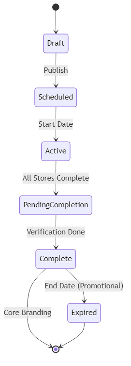

### Store Assignment Lifecycle

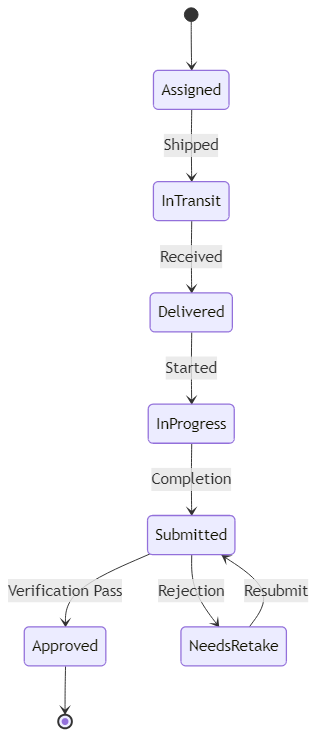

---

*Document Version: 1.0*
*Last Updated: 2026-01-01*
*Source: MASTER_SOW_COMPILED.md v1.38, Section 5, Section 9*


---
# 2.3 User Classes and Characteristics

## User Class Hierarchy

NewPOPSys v1.38 implements a three-tier user hierarchy aligned with the multi-tenant architecture:

[Diagram - See rendered image above or refer to source document]

## User Class Summary

| Persona | Level | Access Scope | Primary Interface | Frequency |
|---------|-------|--------------|-------------------|-----------|
| Platform Admin | Platform | All tenants, all data | Admin Console | Daily |
| PSP Admin | PSP | Tenant-wide | Web Application | Daily |
| Production Operator | PSP | Orders, Shipments, Batches | Web Application | Hourly |
| Brand Admin | Brand | Assigned brands | Web Application | Daily |
| Campaign Manager | Brand | Assigned campaigns | Web Application | Daily |
| Regional Manager | Brand | Assigned regions | Web Application | Daily |
| Store Manager | Store | Assigned stores | Mobile PWA | Per campaign |
| Store Operator | Store | Assigned stores | Mobile PWA | Per campaign |
| Integration User | System | API access only | REST API | Automated |

## Detailed User Classes

### Platform Admin

| Attribute | Description |
|-----------|-------------|
| **Description** | Highest privilege system administrator with full access |
| **Population** | 1-3 per deployment |
| **Technical Expertise** | High - understands system architecture |
| **Primary Tasks** | Tenant management, user impersonation, system configuration |
| **Access Pattern** | Web browser, secure workstation |
| **Availability Need** | Business hours with on-call for incidents |

**Key Permissions:**
- Create/manage PSP tenants
- Impersonate any user
- Access all audit logs
- Configure system-wide settings
- Manage feature flags

### PSP Admin

| Attribute | Description |
|-----------|-------------|
| **Description** | PSP organization administrator managing brands and operations |
| **Population** | 2-5 per PSP tenant |
| **Technical Expertise** | Medium - power user level |
| **Primary Tasks** | Brand onboarding, user management, reporting |
| **Access Pattern** | Desktop web browser |
| **Availability Need** | Business hours |

**Key Permissions:**
- Create/manage brands
- Manage all PSP-level users
- Access all brands within tenant
- Generate reports and exports
- Configure PSP settings

### Production Operator

| Attribute | Description |
|-----------|-------------|
| **Description** | PSP staff managing fulfillment operations |
| **Population** | 5-20 per PSP tenant |
| **Technical Expertise** | Low-Medium - task-focused |
| **Primary Tasks** | Order processing, shipment creation, batch management |
| **Access Pattern** | Desktop web browser, possibly warehouse terminal |
| **Availability Need** | Business hours, shift-based |

**Key Permissions:**
- View/update order status
- Create shipments and tracking
- Manage production batches
- Process reorders
- Read-only campaign access

### Brand Admin

| Attribute | Description |
|-----------|-------------|
| **Description** | Brand's primary system administrator |
| **Population** | 1-3 per brand |
| **Technical Expertise** | Medium - marketing/operations background |
| **Primary Tasks** | Store management, campaign creation, user permissions |
| **Access Pattern** | Desktop web browser |
| **Availability Need** | Business hours |

**Key Permissions:**
- Full brand configuration
- Create/manage campaigns
- Manage brand users
- Access all stores
- Review and approve photos

### Campaign Manager

| Attribute | Description |
|-----------|-------------|
| **Description** | Brand staff focused on campaign execution |
| **Population** | 2-10 per brand |
| **Technical Expertise** | Low-Medium - marketing background |
| **Primary Tasks** | Campaign setup, store assignment, progress monitoring |
| **Access Pattern** | Desktop web browser |
| **Availability Need** | Business hours |

**Key Permissions:**
- Create/edit assigned campaigns
- Manage store assignments
- View campaign analytics
- Cannot manage brand settings
- Scoped to assigned campaigns only

### Regional Manager

| Attribute | Description |
|-----------|-------------|
| **Description** | Field manager overseeing store compliance |
| **Population** | 5-20 per brand (varies by brand size) |
| **Technical Expertise** | Low - field operations background |
| **Primary Tasks** | Photo review, exception handling, store support |
| **Access Pattern** | Tablet or laptop, mobile-friendly web |
| **Availability Need** | Business hours, field schedule |

**Key Permissions:**
- Review photos for assigned regions
- Approve/reject submissions
- Handle escalations
- Read-only store data
- Scoped to assigned regions

### Store Manager

| Attribute | Description |
|-----------|-------------|
| **Description** | Store-level authority for campaign execution |
| **Population** | 1 per store (1,000+ per brand) |
| **Technical Expertise** | Low - retail operations background |
| **Primary Tasks** | Team coordination, approval authority, issue escalation |
| **Access Pattern** | Mobile device (phone/tablet), PWA |
| **Availability Need** | Store hours |

**Key Permissions:**
- Full store execution access
- Approve replacement requests
- Manage store team
- Complete all surveys
- Report issues

### Store Operator

| Attribute | Description |
|-----------|-------------|
| **Description** | Store staff performing installation tasks |
| **Population** | 1-5 per store |
| **Technical Expertise** | Low - basic smartphone proficiency |
| **Primary Tasks** | Receive shipments, install materials, capture photos |
| **Access Pattern** | Mobile device (phone), PWA |
| **Availability Need** | Store hours |

**Key Permissions:**
- Execute surveys
- Upload photos
- Update task status
- Request replacements
- Cannot manage other users

### Integration User

| Attribute | Description |
|-----------|-------------|
| **Description** | Service account for system-to-system communication |
| **Population** | 1-5 per PSP tenant |
| **Technical Expertise** | N/A - automated |
| **Primary Tasks** | API operations, webhook receipt, data sync |
| **Access Pattern** | REST API only |
| **Availability Need** | 24/7 automated |

**Key Permissions:**
- API access per granted scopes
- No UI access
- Webhook endpoint access
- Rate-limited operations
- Audit-logged actions

## User Class Interaction Matrix

| From \ To | Platform | PSP | Brand | Regional | Store |
|-----------|----------|-----|-------|----------|-------|
| Platform Admin | Manage | Manage | View | View | View |
| PSP Admin | - | Manage | Manage | View | View |
| Brand Admin | - | - | Manage | Manage | View |
| Regional Manager | - | - | - | Self | View |
| Store Manager | - | - | - | - | Manage |

## Accessibility Considerations

| User Class | Accessibility Needs |
|------------|---------------------|
| Store Operators | Large touch targets, simple navigation, outdoor visibility |
| Regional Managers | Tablet-optimized, minimal typing |
| All Web Users | WCAG 2.1 AA compliance, keyboard navigation |
| All Users | Screen reader compatibility for core functions |

## Training Requirements

| User Class | Training Level | Delivery Method |
|------------|----------------|-----------------|
| Platform Admin | Comprehensive | Technical documentation, hands-on |
| PSP Admin | Full | Online training, documentation |
| Production Operator | Role-specific | Workflow guides, quick reference |
| Brand Admin | Full | Online training, webinar |
| Campaign Manager | Role-specific | Interactive tutorials |
| Regional Manager | Task-focused | Mobile-optimized guides |
| Store Manager | Task-focused | In-app guidance, video |
| Store Operator | Minimal | In-app walkthrough |

---

*Document Version: 1.0*
*Last Updated: 2026-01-01*
*Source: MASTER_SOW_COMPILED.md v1.38, Section 2.1; SUPP-001; SUPP-003*


---
# 2.4 Operating Environment

## Infrastructure Overview

NewPOPSys v1.38 operates as a cloud-native application deployed on AWS infrastructure with a focus on reliability, scalability, and cost efficiency.

[Diagram - See rendered image above or refer to source document]

## Production Environment Specifications

### Compute Resources

| Component | Service | Configuration |
|-----------|---------|---------------|
| Web/API Servers | ECS Fargate | 2 vCPU, 4GB RAM per task |
| Background Workers | ECS Fargate | 2 vCPU, 4GB RAM per task |
| Minimum Tasks | Auto-scaling | 2 tasks per service (HA) |
| Maximum Tasks | Auto-scaling | 10 tasks per service |

### Database

| Attribute | Specification |
|-----------|---------------|
| Engine | PostgreSQL 15+ |
| Service | AWS RDS |
| Instance Class | db.r6g.large (minimum) |
| Storage | 100GB gp3 SSD (expandable) |
| Multi-AZ | Yes (production) |
| Read Replicas | 1 (optional, for reporting) |
| Backup Retention | 7 days automated |

### Cache & Queue

| Attribute | Specification |
|-----------|---------------|
| Engine | Redis 7+ |
| Service | AWS ElastiCache |
| Node Type | cache.r6g.large |
| Cluster Mode | Disabled |
| Replication | 1 replica (HA) |
| Purpose | Session cache, BullMQ jobs |

### Storage

| Type | Service | Configuration |
|------|---------|---------------|
| Photo Storage | S3 Standard | Versioning enabled |
| Export Artifacts | S3 Standard-IA | 30-day lifecycle |
| Static Assets | S3 + CloudFront | CDN distribution |
| Backup Archives | S3 Glacier | Long-term retention |

## Capacity Targets

### Pilot Scale (v1.38)

| Dimension | Target | Notes |
|-----------|--------|-------|
| PSP Tenants | 2 | Visual Graphx, Speedy CPS |
| Brands per PSP | 2-3 | Good2Go confirmed |
| Stores per Brand | Up to 1,000 | Primary scale factor |
| Concurrent Users | 50 | Peak during campaign launch |
| Photos per Campaign | 1+ per item per slot | Variable by campaign |
| Data Retention | 90 days | Post campaign completion |

### Performance Baselines

| Operation | p50 Target | p95 Target | p99 Target |
|-----------|------------|------------|------------|
| Simple Read | <50ms | <150ms | <300ms |
| Complex Read | <100ms | <300ms | <600ms |
| Write Operations | <150ms | <400ms | <800ms |
| Photo Upload | <2s | <5s | <10s |
| Report Generation | <30s | <60s | <120s |

## Client Environment Requirements

### Web Application (Desktop)

| Requirement | Specification |
|-------------|---------------|
| Browsers | Chrome 90+, Firefox 88+, Safari 14+, Edge 90+ |
| Screen Resolution | 1280x720 minimum, 1920x1080 recommended |
| Network | Broadband internet (5+ Mbps) |
| JavaScript | Required, ES2020+ support |
| Cookies | Required for session management |
| Local Storage | Required for preferences |

### Mobile PWA (Store Execution)

| Requirement | Specification |
|-------------|---------------|
| Operating System | iOS 14+, Android 10+ |
| Browser | Safari (iOS), Chrome (Android) |
| Screen Size | 5" minimum, touch-enabled |
| Camera | 8MP minimum, autofocus |
| Storage | 500MB available for offline cache |
| Network | 4G LTE or WiFi (sync-on-open) |

### Network Requirements

| Protocol | Port | Purpose |
|----------|------|---------|
| HTTPS | 443 | All application traffic |
| WSS | 443 | WebSocket notifications |

**Firewall/Proxy Requirements:**
- No SSL inspection (breaks certificate pinning)
- WebSocket upgrade support
- No request size limits <10MB

## Software Dependencies

### Server-Side Stack

| Component | Version | Purpose |
|-----------|---------|---------|
| Node.js | 20 LTS | Runtime |
| TypeScript | 5.x | Language |
| Next.js | 14.x | Web framework |
| Fastify | 4.x | API server |
| Drizzle ORM | Latest | Database ORM |
| BullMQ | 4.x | Job queue |
| Zod | 3.x | Validation |

### Client-Side Stack

| Component | Version | Purpose |
|-----------|---------|---------|
| React | 18.x | UI framework |
| TanStack Query | 5.x | Data fetching |
| Tailwind CSS | 3.x | Styling |
| Radix UI | Latest | Accessible components |

### Observability Stack

| Component | Purpose |
|-----------|---------|
| OpenTelemetry | Distributed tracing |
| Sentry | Error tracking |
| AWS CloudWatch | Metrics and logs |

## Security Environment

### Network Security

| Control | Implementation |
|---------|----------------|
| TLS Version | 1.3 only |
| Certificate | ACM-managed |
| WAF | AWS WAF with OWASP rules |
| DDoS Protection | AWS Shield Standard |

### Data Security

| Data State | Protection |
|------------|------------|
| In Transit | TLS 1.3 |
| At Rest (DB) | AES-256 (RDS encryption) |
| At Rest (S3) | AES-256 (SSE-S3) |
| At Rest (Redis) | AES-256 (ElastiCache encryption) |

### Authentication

| Attribute | Specification |
|-----------|---------------|
| Token Type | JWT (RS256) |
| Access Token TTL | 15 minutes |
| Refresh Token TTL | 7 days |
| Password Policy | 12+ chars, complexity required |
| MFA | Optional (v1), platform admin required |

## Availability Requirements

| Metric | Target | Measurement |
|--------|--------|-------------|
| Uptime | 99.5% | Monthly |
| Allowed Downtime | 3.6 hours/month | Calculated |
| RTO (Single AZ) | <5 minutes | Recovery time |
| RPO | 1 hour | Data loss tolerance |

### Maintenance Windows

| Window | Timing | Impact |
|--------|--------|--------|
| Planned Maintenance | Sunday 02:00-06:00 UTC | Potential brief outages |
| Emergency Patches | As needed | Rolling deployment |
| Database Maintenance | RDS automated | Usually zero downtime |

## Environment Tiers

| Environment | Purpose | Scale |
|-------------|---------|-------|
| Development | Local development | Single instance |
| Staging | Integration testing | 50% production |
| Production | Live operations | Full scale |

---

*Document Version: 1.0*
*Last Updated: 2026-01-01*
*Source: MASTER_SOW_COMPILED.md v1.38, Section 3; SUPP-039 v0.1*


---
# 2.5 Design and Implementation Constraints

## Architectural Constraints

### Multi-Tenancy Model

| Constraint | Rationale |
|------------|-----------|
| PSP as root tenant | Business model positions PSP as paying customer |
| Logical data isolation | Single database with tenant_id column pattern |
| No cross-tenant data access | Compliance and data privacy requirements |
| Brand scoping within tenant | Hierarchical access control |

### Technology Stack Mandates

| Component | Mandated Choice | Rationale |
|-----------|-----------------|-----------|
| Runtime | Node.js 20 LTS | Team expertise, ecosystem |
| Language | TypeScript 5.x | Type safety, maintainability |
| Web Framework | Next.js 14.x | Full-stack React, SSR support |
| API Framework | Fastify 4.x | Performance, schema validation |
| Database | PostgreSQL 15+ | JSONB, advanced features |
| ORM | Drizzle | Type-safe queries, performance |
| Queue | BullMQ/Redis | Proven reliability |
| Cloud | AWS | Existing infrastructure |

### API Design Constraints

| Constraint | Specification |
|------------|---------------|
| Protocol | REST over HTTPS |
| Authentication | JWT Bearer tokens |
| Versioning | URL path versioning (/v1/) |
| Content Type | application/json |
| Idempotency | Required for all write operations |
| Rate Limiting | Per-tenant, per-endpoint |

## Regulatory and Compliance Constraints

### Accessibility Requirements

| Standard | Requirement | Impact |
|----------|-------------|--------|
| WCAG 2.1 AA | All web interfaces | UI component selection |
| Section 508 | Federal accessibility | Government client support |
| Keyboard Navigation | Full functionality | No mouse-only features |
| Screen Reader | Core workflows | Semantic HTML required |

### Data Privacy

| Regulation | Applicability | Constraint |
|------------|---------------|------------|
| Data Retention | 90-day post-completion | Automated purge required |
| Right to Export | Before deletion | Export-before-delete workflow |
| Audit Logging | All data modifications | Immutable audit trail |
| PII Handling | User data, store contacts | Encryption at rest |

### Security Standards

| Standard | Application |
|----------|-------------|
| OWASP Top 10 | Security testing baseline |
| TLS 1.3 | All external connections |
| Password Policy | NIST 800-63B aligned |
| Session Management | Secure token handling |

## Operational Constraints

### Deployment Constraints

| Constraint | Specification |
|------------|---------------|
| Zero-Downtime Deploy | Rolling deployments required |
| Blue-Green Capability | Database migrations must be backward-compatible |
| Feature Flags | New features behind flags |
| Rollback Window | 15-minute rollback capability |

### Performance Constraints

| Constraint | Target |
|------------|--------|
| API Response (p95) | <150ms for simple reads |
| API Response (p95) | <300ms for complex reads |
| Photo Upload | <5s for 10MB image |
| Page Load | <3s initial, <1s subsequent |
| Offline Sync | <30s for typical session |

### Scalability Constraints

| Dimension | Pilot Constraint | Future Capacity |
|-----------|------------------|-----------------|
| Stores per Brand | 1,000 | 10,000 |
| Concurrent Users | 50 | 500 |
| Photos per Campaign | 10,000 | 100,000 |
| API Requests | 100 req/s | 1,000 req/s |

## Business Constraints

### Scope Boundaries (Protected Not-Now)

| Category | Constraint | Rationale |
|----------|------------|-----------|
| Not MIS/ERP | No costing, scheduling, accounting | Integration point only |
| Not Marketplace | No bidding, matching, ratings | Single PSP model |
| Not Analytics | No predictive/AI insights | Data readiness only |
| Not Archive | No storage beyond 90 days | Export pathways provided |
| Not Customizable | Limited store UX flexibility | PSP adoption priority |

### Pilot Constraints

| Constraint | Value |
|------------|-------|
| Pilot PSPs | 2 (Visual Graphx, Speedy CPS) |
| Pilot Duration | 90-day evaluation period |
| Scope Changes | Formal approval required |
| Feature Additions | Deferred to post-pilot |

## Integration Constraints

### External System Integration

| System | Constraint |
|--------|------------|
| PSP MIS | Async only (eventual consistency) |
| Shipping Carriers | Tracking data normalization required |
| Email Delivery | AWS SES limits apply |
| Webhook Endpoints | Customer-provided, HTTPS only |

### API Compatibility

| Constraint | Specification |
|------------|---------------|
| Webhook Signing | HMAC-SHA256 required |
| Retry Policy | Exponential backoff, 24h max |
| Payload Size | 1MB maximum |
| Timeout | 30-second response required |

## User Interface Constraints

### Browser Support

| Browser | Minimum Version | Support Level |
|---------|-----------------|---------------|
| Chrome | 90+ | Full |
| Firefox | 88+ | Full |
| Safari | 14+ | Full |
| Edge | 90+ | Full |
| IE11 | Not supported | None |

### Mobile Constraints

| Platform | Constraint |
|----------|------------|
| iOS | Safari only (WebKit) |
| Android | Chrome primary, WebView fallback |
| Offline | Sync-on-open, draft storage only |
| Camera | Native camera access required |

### Responsive Design

| Breakpoint | Target Devices |
|------------|----------------|
| <640px | Mobile phones |
| 640-1024px | Tablets |
| >1024px | Desktop |

## Development Constraints

### Code Quality

| Constraint | Requirement |
|------------|-------------|
| Test Coverage | 80% line coverage |
| Linting | ESLint with strict config |
| Type Safety | No implicit any |
| Code Review | Required for all PRs |

### Documentation

| Artifact | Requirement |
|----------|-------------|
| API Docs | OpenAPI 3.0 specification |
| Code Comments | JSDoc for public interfaces |
| ADRs | Architecture decisions documented |
| Runbooks | Operational procedures |

### Version Control

| Constraint | Specification |
|------------|---------------|
| SCM | Git |
| Branching | Trunk-based with feature flags |
| Commit Messages | Conventional commits |
| Release Tags | Semantic versioning |

## Resource Constraints

### Team Expertise

| Skill Area | Available | Constraint |
|------------|-----------|------------|
| TypeScript/Node.js | Strong | Primary stack |
| React/Next.js | Strong | UI framework |
| PostgreSQL | Strong | Database |
| AWS | Medium | Infrastructure |
| Mobile/PWA | Medium | Store execution |

### Timeline Constraints

| Milestone | Constraint |
|-----------|------------|
| MVP Delivery | Fixed date |
| Feature Freeze | 2 weeks before pilot |
| Bug Fix Window | Pilot duration |
| Post-Pilot Roadmap | Based on feedback |

---

*Document Version: 1.0*
*Last Updated: 2026-01-01*
*Source: MASTER_SOW_COMPILED.md v1.38, Sections 2.3, 2.4, 6; SUPP-012; SUPP-039*


---
# 2.6 Assumptions and Dependencies

## Assumptions

### Business Assumptions

| ID | Assumption | Impact if Invalid |
|----|------------|-------------------|
| BA-01 | PSP is the paying customer and orchestrating authority | Business model restructure required |
| BA-02 | Brands operate within PSP tenant context | Multi-PSP brand support needed |
| BA-03 | Stores have basic smartphone access for execution | Alternative input methods needed |
| BA-04 | Campaign cycles are predictable (seasonal, promotional) | Capacity planning adjustments |
| BA-05 | Photo proof is acceptable verification evidence | Alternative verification mechanisms |
| BA-06 | 90-day data retention is acceptable post-completion | Extended retention architecture |
| BA-07 | Pilot brands will provide timely feedback | Pilot timeline extension |

### Technical Assumptions

| ID | Assumption | Impact if Invalid |
|----|------------|-------------------|
| TA-01 | AWS services remain available in target regions | Multi-cloud architecture |
| TA-02 | PostgreSQL 15+ features are sufficient | Database migration |
| TA-03 | Node.js 20 LTS supported through pilot | Runtime upgrade |
| TA-04 | Mobile browsers support PWA adequately | Native app development |
| TA-05 | Redis provides sufficient queue reliability | Alternative queue system |
| TA-06 | S3 provides adequate photo storage performance | CDN optimization |
| TA-07 | JWT tokens are acceptable for authentication | Session-based auth |

### User Assumptions

| ID | Assumption | Impact if Invalid |
|----|------------|-------------------|
| UA-01 | Store operators have basic digital literacy | Enhanced training, simplified UX |
| UA-02 | Regional managers can perform photo review | PSP-level review workflow |
| UA-03 | Brand admins understand campaign concepts | Extensive onboarding |
| UA-04 | PSP staff can manage production workflows | Workflow simplification |
| UA-05 | Users have reliable email access | Alternative notification channels |
| UA-06 | Mobile devices have functional cameras | Barcode-only verification |

### Operational Assumptions

| ID | Assumption | Impact if Invalid |
|----|------------|-------------------|
| OA-01 | Internet connectivity available at stores | Enhanced offline capability |
| OA-02 | Stores can receive shipments reliably | Alternative delivery workflows |
| OA-03 | PSP can provide tracking information | Manual status updates |
| OA-04 | Campaigns have defined start/end dates | Indefinite campaign support |
| OA-05 | Issue reporting happens within campaign window | Extended issue window |
| OA-06 | Photo upload happens same-day as installation | Extended upload windows |

## Dependencies

### External Service Dependencies

| ID | Dependency | Provider | Criticality | Fallback |
|----|------------|----------|-------------|----------|
| ED-01 | Compute Infrastructure | AWS ECS Fargate | Critical | None (single cloud) |
| ED-02 | Database Service | AWS RDS PostgreSQL | Critical | Manual restore from backup |
| ED-03 | Cache/Queue Service | AWS ElastiCache Redis | High | Degraded mode (no cache) |
| ED-04 | Object Storage | AWS S3 | Critical | None |
| ED-05 | CDN | AWS CloudFront | Medium | Direct S3 access |
| ED-06 | Email Delivery | AWS SES | Medium | Alternative SMTP |
| ED-07 | DNS | AWS Route 53 | Critical | None |
| ED-08 | SSL Certificates | AWS ACM | Critical | None |

### Third-Party Integration Dependencies

| ID | Dependency | Purpose | Criticality | Fallback |
|----|------------|---------|-------------|----------|
| TI-01 | PSP MIS Systems | Order/status sync | Medium | Manual data entry |
| TI-02 | Shipping Carriers | Tracking information | Low | Manual tracking entry |
| TI-03 | Brand Systems | Store data sync | Low | CSV import |
| TI-04 | Sentry | Error tracking | Low | CloudWatch only |
| TI-05 | OpenTelemetry | Distributed tracing | Low | Local logging only |

### Development Dependencies

| ID | Dependency | Version | Purpose | Risk |
|----|------------|---------|---------|------|
| DD-01 | Node.js | 20 LTS | Runtime | Low (LTS) |
| DD-02 | TypeScript | 5.x | Language | Low |
| DD-03 | Next.js | 14.x | Framework | Medium (major version) |
| DD-04 | React | 18.x | UI Library | Low |
| DD-05 | Drizzle ORM | Latest | Database access | Medium (active development) |
| DD-06 | BullMQ | 4.x | Job queue | Low |
| DD-07 | Zod | 3.x | Validation | Low |
| DD-08 | Tailwind CSS | 3.x | Styling | Low |

### Infrastructure Dependencies

| ID | Dependency | Purpose | SLA Required |
|----|------------|---------|--------------|
| ID-01 | AWS Region Availability | All services | 99.99% |
| ID-02 | RDS Multi-AZ | Database HA | 99.95% |
| ID-03 | ElastiCache Replication | Cache HA | 99.9% |
| ID-04 | S3 Durability | Data storage | 99.999999999% |
| ID-05 | CloudFront Edge | Asset delivery | 99.9% |

## Dependency Risk Assessment

### Critical Path Dependencies


### Dependency Monitoring

| Dependency | Monitoring Method | Alert Threshold |
|------------|-------------------|-----------------|
| RDS | CloudWatch | CPU >80%, Connections >80% |
| ECS | CloudWatch | Task failures, Memory >85% |
| ElastiCache | CloudWatch | Memory >75%, Connections >80% |
| S3 | CloudWatch | 5xx errors >1% |
| External APIs | Health checks | Response time >5s |

## Contingency Planning

### Dependency Failure Scenarios

| Scenario | Impact | Mitigation |
|----------|--------|------------|
| RDS Primary Failure | Service outage | Multi-AZ automatic failover |
| ElastiCache Failure | Degraded performance | Cache bypass, direct DB |
| S3 Unavailable | Photo upload fails | Queue uploads, retry |
| SES Throttling | Email delays | Queue emails, batch send |
| Single AZ Failure | Potential outage | Multi-AZ deployment |

### Recovery Procedures

| Scenario | RTO | RPO | Procedure |
|----------|-----|-----|-----------|
| Database Failure | <5 min | 0 (sync replica) | Automatic failover |
| Application Failure | <2 min | N/A | ECS task restart |
| Region Failure | <4 hours | 1 hour | Cross-region restore |
| Data Corruption | <1 hour | Point-in-time | PITR restore |

## Pilot-Specific Dependencies

### Pilot Partner Dependencies

| Partner | Dependency | Requirement |
|---------|------------|-------------|
| Visual Graphx | MIS integration specs | API documentation |
| Speedy CPS | System access | Staging credentials |
| Good2Go (Brand) | Store data | Complete store list |
| All Pilot Partners | Feedback sessions | Weekly availability |

### Pilot Success Dependencies

| ID | Dependency | Owner | Due Date |
|----|------------|-------|----------|
| PS-01 | Store list finalized | Brand Admin | Pilot -14 days |
| PS-02 | Survey templates configured | Brand Admin | Pilot -7 days |
| PS-03 | User accounts provisioned | PSP Admin | Pilot -3 days |
| PS-04 | Training completed | All users | Pilot -1 day |
| PS-05 | Integration testing complete | Dev team | Pilot -7 days |

---

*Document Version: 1.0*
*Last Updated: 2026-01-01*
*Source: MASTER_SOW_COMPILED.md v1.38, Sections 4.2, 10; SUPP-012; SUPP-039*


---
# 02 - Overall Description

This section provides a high-level overview of the NewPOPSys platform.

## Contents

| File | Description | Status |
|------|-------------|--------|
| 2.1_Product_Perspective.md | System context and interfaces | Not Started |
| 2.2_Product_Functions.md | High-level capability summary | Not Started |
| 2.3_User_Classes.md | 9 personas overview | Not Started |
| 2.4_Operating_Environment.md | Runtime environment | Not Started |
| 2.5_Constraints.md | Design and implementation constraints | Not Started |
| 2.6_Assumptions_Dependencies.md | Project assumptions | Not Started |

## Diagrams

Located in `diagrams/` subfolder:
- `system_context.mmd` - System context diagram (Mermaid)

## Source Documents

- SUPP-001 (Personas)
- SUPP-012 (Technology Stack)
- MASTER_SOW_COMPILED.md

---
*Section Status: Not Started*


---


---

# Section 3: System Architecture
# 3.1 Database Model

> **IEEE 830 Reference**: Section 3.1 - System Architecture: Database Model
> **Source Documents**:
> - [Database Model Overview](../../06_Database_Model/README.md)
> - [Foundation Analysis](../../06_Database_Model/FOUNDATION_ANALYSIS.md)
> - [Entity Crosswalk](../../06_Database_Model/07_Validation/ENTITY_CROSSWALK.md)
> **Version**: 1.0
> **Last Updated**: 2026-01-01

---

## 3.1.1 Purpose

This section defines the database model for NewPOPSys v1, including table organization, core design patterns, and entity relationships. The schema supports multi-tenant operations, soft-delete data retention, and comprehensive audit trails.

---

## 3.1.2 Database Environment

### 3.1.2.1 Technology Specifications

| Component | Specification | Purpose |
|-----------|---------------|---------|
| **DBMS** | PostgreSQL 15+ | Primary relational database |
| **ORM** | Drizzle ORM (TypeScript) | Type-safe schema management and migrations |
| **Extensions** | uuid-ossp, pgcrypto | UUID generation and cryptographic functions |
| **Hosting** | AWS RDS | Managed PostgreSQL with automated backups |

### 3.1.2.2 Schema Statistics

| Metric | Count |
|--------|-------|
| Total Tables | 41 |
| Enum Types | 18 |
| Modules | 11 |
| Foreign Key Relationships | 100+ |

---

## 3.1.3 Core Design Patterns

### 3.1.3.1 Multi-Tenancy Model

All data is scoped through a two-level tenant hierarchy:

[Diagram - See rendered image above or refer to source document]

**Implementation Rules**:
- Every tenant represents a PSP organization with isolated data
- Brands cannot access other brands' data within the same PSP
- All queries scoped by `tenant_id` from JWT authentication
- Row-Level Security planned for Phase 2

### 3.1.3.2 Primary Key Strategy

All tables use UUID primary keys for distributed ID generation:

```sql
id UUID PRIMARY KEY DEFAULT gen_random_uuid()
```

### 3.1.3.3 Soft Delete Pattern

All tables implement logical deletion for data recovery and audit compliance:

```sql
deleted_at TIMESTAMPTZ  -- NULL = active, timestamp = deleted
```

All indexes use `WHERE deleted_at IS NULL` for active record filtering.

### 3.1.3.4 Audit Trail

Standard timestamp columns on all tables:

| Column | Type | Purpose |
|--------|------|---------|
| `created_at` | TIMESTAMPTZ | Record creation timestamp |
| `updated_at` | TIMESTAMPTZ | Auto-updated via trigger on modification |
| `deleted_at` | TIMESTAMPTZ | Soft delete marker |

State changes logged to `audit_events` with before/after JSON snapshots.

---

## 3.1.4 Table Distribution by Module

### 3.1.4.1 Module Overview

| Module | Tables | Enums | Primary Relationships |
|--------|--------|-------|----------------------|
| 1. Tenancy & Identity | 5 | 2 | User -> Membership -> Brand |
| 2. Stores & Grouping | 7 | 1 | Brand -> Region -> Store |
| 3. Surveys & Layouts | 6 | 0 | Store -> Layout -> Slot |
| 4. Campaigns & Kits | 5 | 4 | Campaign -> Assignment -> Item |
| 5. Fulfillment | 4 | 3 | Order -> Shipment -> Tracking |
| 6. Execution & Verification | 5 | 2 | Photo -> Review -> Retake |
| 7. Issues & Reorders | 3 | 2 | Issue -> Reorder -> Order |
| 8. Notifications | 2 | 1 | User -> Notification |
| 9. Webhooks & Integration | 2 | 0 | Endpoint -> Delivery |
| 10. Exports & Jobs | 1 | 2 | Job -> S3 File |
| 11. Audit | 1 | 1 | Event -> Actor |
| **Total** | **41** | **18** | |

### 3.1.4.2 Module 1: Tenancy & Identity (5 tables)

| Table | Purpose | Key Fields |
|-------|---------|------------|
| `tenants` | PSP root entity | slug, subscription_tier, settings_json |
| `brands` | Customer brands | tenant_id, code, logo_url |
| `users` | Human users | email, password_hash, is_active |
| `memberships` | User-role-scope binding | user_id, brand_id, role, region_scope_id |
| `api_keys` | Integration credentials | key_hash, scopes[], expires_at |

### 3.1.4.3 Module 2: Stores & Grouping (7 tables)

| Table | Purpose | Key Fields |
|-------|---------|------------|
| `regions` | Geographic hierarchy (required) | brand_id, parent_region_id |
| `districts` | Sub-level grouping (optional) | region_id, name |
| `territories` | Lowest hierarchy level | district_id, region_id |
| `stores` | Physical locations | region_id, external_store_guid, status |
| `store_groups` | Custom campaign groupings | brand_id, selection_criteria_json |
| `store_group_memberships` | Store-to-group M:N | store_id, group_id |
| `store_invitations` | Store onboarding | email, token, expires_at |

### 3.1.4.4 Module 3: Surveys & Layouts (6 tables)

| Table | Purpose | Key Fields |
|-------|---------|------------|
| `survey_templates` | Reusable survey definitions | brand_id, definition_json |
| `survey_versions` | Immutable snapshots | template_id, version_number, published_at |
| `store_layouts` | Physical store layouts | store_id, is_current |
| `location_slots` | Ad placement locations | layout_id, slot_code |
| `photo_rules` | Photo requirements | min_photos, required_angles[] |
| `store_survey_responses` | Survey answers | assignment_id, submitted_at |

### 3.1.4.5 Module 4: Campaigns & Kits (5 tables)

| Table | Purpose | Key Fields |
|-------|---------|------------|
| `campaigns` | Promotional programs | status, install_start, install_end |
| `kit_definitions` | Item templates | campaign_id, is_template |
| `kit_items` | Items in kit | sku, quantity, photo_rule_id |
| `store_assignments` | Store participation | campaign_id, store_id, pinned_layout_id |
| `assignment_items` | Items per store | assignment_id, kit_item_id, slot_id |

### 3.1.4.6 Module 5: Fulfillment (4 tables)

| Table | Purpose | Key Fields |
|-------|---------|------------|
| `store_orders` | Orders to PSP | order_type, status, psp_order_ref |
| `order_lines` | Line items | order_id, sku, quantity |
| `shipments` | Physical shipments | carrier, tracking_numbers[] |
| `shipment_lines` | Items shipped | shipment_id, quantity_shipped |

### 3.1.4.7 Module 6: Execution & Verification (5 tables)

| Table | Purpose | Key Fields |
|-------|---------|------------|
| `receive_verifications` | Receipt confirmation | assignment_id, verified_at |
| `photo_uploads` | Proof photos | s3_key, review_status |
| `photo_reviews` | Admin review decisions | photo_id, decision, reviewer_id |
| `retake_requests` | Rework requests | photo_id, reason, resolved_at |
| `completion_attestations` | Final sign-off | assignment_id, attested_by |

### 3.1.4.8 Modules 7-11: Supporting Tables

| Module | Tables | Purpose |
|--------|--------|---------|
| Issues & Reorders | `issue_requests`, `issue_lines`, `reorders` | Problem reporting and replacement orders |
| Notifications | `notification_preferences`, `notifications` | User notification delivery |
| Webhooks | `webhook_endpoints`, `webhook_deliveries` | Integration event delivery |
| Exports | `export_jobs` | Report generation queue |
| Audit | `audit_events` | Immutable action log |

---

## 3.1.5 Key Enumerations

### 3.1.5.1 Role-Based Access Control

```sql
CREATE TYPE role_enum AS ENUM (
  'PLATFORM_ADMIN',    -- Full system access
  'PSP_ADMIN',         -- PSP tenant administration
  'PSP_OPS',           -- Production/fulfillment operations
  'BRAND_ADMIN',       -- Full brand configuration
  'CAMPAIGN_MANAGER',  -- Campaign-scoped access
  'REGIONAL_MANAGER',  -- Region-scoped oversight
  'STORE_MANAGER',     -- Full store privileges
  'STORE_OPERATOR'     -- Execute tasks only
);
```

### 3.1.5.2 State Machine Enums

| Enum | Values | Purpose |
|------|--------|---------|
| `campaign_status_enum` | DRAFT, SCHEDULED, PUBLISHED, COMPLETED, CANCELLED, ARCHIVED | Campaign lifecycle |
| `store_assignment_status_enum` | ASSIGNED, READY, IN_PROGRESS, SUBMITTED, REWORK_REQUIRED, COMPLETE, REOPENED, WAIVED | Store execution state |
| `store_order_status_enum` | GENERATED, ACKNOWLEDGED, IN_PRODUCTION, KITTING, READY_TO_SHIP, PARTIALLY_SHIPPED, SHIPPED, DELIVERED, CLOSED, CANCELLED | Order fulfillment state |
| `photo_review_status_enum` | PENDING, APPROVED, REJECTED, SUPERSEDED | Photo verification state |
| `issue_request_status_enum` | OPEN, TRIAGED, AWAITING_APPROVAL, APPROVED, IN_FULFILLMENT, DENIED, RESOLVED | Issue resolution state |

### 3.1.5.3 Computed Statuses (Application Layer)

The following statuses are derived from data, not stored:

- **FulfillmentStatus**: Computed from shipment quantities
- **ReceiptStatus**: Computed from delivery confirmations
- **ExecutionStatus**: Computed from installation progress
- **VerificationStatus**: Computed from photo reviews
- **StorePhase**: Rollup of all assignment statuses

---

## 3.1.6 Relationship Chains

### 3.1.6.1 Campaign Execution Flow

[Diagram - See rendered image above or refer to source document]

### 3.1.6.2 Store Hierarchy

[Diagram - See rendered image above or refer to source document]

### 3.1.6.3 Photo Verification Flow

[Diagram - See rendered image above or refer to source document]

### 3.1.6.4 Issue Resolution Flow

[Diagram - See rendered image above or refer to source document]

---

## 3.1.7 JSONB Usage Patterns

| Column Pattern | Tables | Purpose |
|----------------|--------|---------|
| `settings_json` | tenants, brands | Extensible configuration |
| `metadata_json` | Multiple | Custom attributes |
| `definition_json` | survey_templates | Versioned survey schemas |
| `selection_recipe_json` | campaigns | Store selection criteria |
| `tracking_numbers` | shipments | Array of carrier tracking IDs |

All JSONB columns default to `'{}'` (empty object), not NULL.

---

## 3.1.8 Cross-References

| Reference | Description |
|-----------|-------------|
| Section 3.2 | Application Architecture |
| Section 3.3 | Technology Stack |
| Section 4.1 | RBAC Model Details |
| SUPP-035 | Field-level data model specification |
| SUPP-002 | Core domain model and state machines |

---

*Document Status: Complete*
*IEEE 830 Compliance: Section 3.1 - Data Design / Database Model*


---
# 3.2 Application Architecture

## Overview

| Field | Value |
|-------|-------|
| **System** | NewPOPSys v1.38 |
| **Document** | Application Architecture Specification |
| **Version** | 1.0 |
| **Last Updated** | 2026-01-01 |
| **SOW References** | SUPP-012, SUPP-021, Architecture_Principles.md |

This section defines the application layer architecture for NewPOPSys v1.38, including the frontend/backend structure, multi-tenant patterns, module organization, state management, and error handling strategies.

---

## 1. Application Layer Architecture

### 1.1 High-Level Architecture

NewPOPSys follows a **modular monolith** architecture pattern for v1, designed to evolve into selective microservices as scaling demands require. The application is structured as a Turborepo monorepo with clear separation between frontend, backend, and shared packages.


### 1.2 Monorepo Structure

The application uses Turborepo for monorepo management with the following structure:


- **apps/**
  - **web/**: Next.js frontend application
    - `app/`: App router pages
    - `components/`: React components
    - `hooks/`: Custom React hooks
    - `styles/`: CSS/Tailwind styles
  - **api/**: Fastify API server
    - `routes/`: API route handlers
    - `services/`: Business logic services
    - `middleware/`: Auth, validation, tenant context
    - `plugins/`: Fastify plugins
  - **worker/**: BullMQ background workers
    - `jobs/`: Job processors
    - `queues/`: Queue definitions
    - `handlers/`: Event handlers
- **packages/**
  - **shared/**: Shared types, utilities, Zod schemas
    - `types/`: TypeScript type definitions
    - `schemas/`: Zod validation schemas
    - `utils/`: Common utility functions
  - **db/**: Prisma schema and migrations
    - `prisma/`: Schema and migrations
    - `client/`: Generated Prisma client
  - **ui/**: Shared UI component library
    - `components/`: Reusable React components
    - `primitives/`: Base design system components
- **tooling/**
  - `eslint/`: Shared ESLint configuration
  - `typescript/`: Shared TypeScript configuration
  - `tailwind/`: Shared Tailwind configuration


### 1.3 Frontend Architecture (Next.js)

The frontend uses Next.js with the App Router pattern:

| Aspect | Implementation |
|--------|----------------|
| **Framework** | Next.js 14+ with App Router |
| **Rendering** | Server Components (default) + Client Components (interactive) |
| **Styling** | Tailwind CSS + shadcn/ui component library |
| **State** | React Server Components + React Query for client state |
| **Forms** | React Hook Form + Zod validation |
| **PWA** | Service Worker scaffold for offline-capable store execution |

**Route Organization by Module:**


- **app/**
  - **(auth)/**: Authentication routes
    - `login/`
    - `forgot-password/`
  - **(psp)/**: PSP Operations module
    - `dashboard/`
    - `orders/`
    - `shipments/`
    - `batches/`
  - **(brand)/**: Brand Admin module
    - `campaigns/`
    - `stores/`
    - `kits/`
    - `reviews/`
  - **(store)/**: Store Portal / Mobile PWA
    - `tasks/`
    - `campaigns/`
    - `receive/`
    - `install/`
  - **(admin)/**: Platform Admin module
    - `tenants/`
    - `users/`
    - `settings/`


### 1.4 Backend Architecture (Fastify API)

The API layer uses Fastify for performance and developer ergonomics:

| Aspect | Implementation |
|--------|----------------|
| **Framework** | Fastify with TypeScript |
| **Validation** | Zod schemas (shared with frontend) |
| **Documentation** | OpenAPI 3.0 auto-generated from Zod schemas |
| **Authentication** | Session cookies (web), API keys + HMAC (webhooks) |
| **Rate Limiting** | Per-tenant rate limits via Redis |

**API Route Organization:**


- **routes/**
  - **v1/**
    - `auth/`: Authentication endpoints
    - `campaigns/`: Campaign CRUD + publish
    - `stores/`: Store management
    - `orders/`: Order/fulfillment operations
    - `shipments/`: Shipment tracking
    - `issues/`: Issue/reorder management
    - `reviews/`: Photo review queue
    - `exports/`: Report generation
    - `webhooks/`: Inbound webhook handlers
  - **internal/**: Internal service endpoints
    - `health/`
    - `metrics/`


---

## 2. Multi-Tenant Architecture

### 2.1 Tenancy Model (v1)

NewPOPSys implements a **Shared Database, Shared Schema** multi-tenancy model with Row-Level Security (RLS) for data isolation.

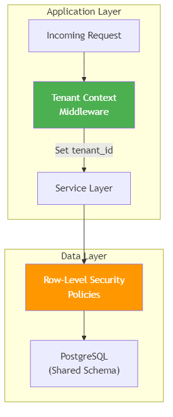

### 2.2 Tenant Context Propagation

Every request includes tenant context that flows through all layers:

```typescript
// Tenant context interface
interface RequestContext {
  tenantId: string;      // PSP tenant identifier
  userId: string;        // Authenticated user ID
  brandId?: string;      // Brand scope (if applicable)
  permissions: string[]; // Resolved RBAC permissions
  sessionId: string;     // For audit logging
}

// Middleware extracts tenant from JWT/session
async function tenantMiddleware(request, reply) {
  const session = await getSession(request);
  request.context = {
    tenantId: session.tenantId,
    userId: session.userId,
    brandId: session.brandId,
    permissions: await resolvePermissions(session),
    sessionId: session.id
  };

  // Set PostgreSQL session variable for RLS
  await db.$executeRaw`SELECT set_config('app.current_tenant', ${session.tenantId}, true)`;
}
```

### 2.3 Row-Level Security Implementation

```sql
-- Campaign table with tenant isolation
CREATE TABLE campaigns (
  id UUID PRIMARY KEY DEFAULT gen_random_uuid(),
  tenant_id UUID NOT NULL REFERENCES tenants(id),
  brand_id UUID NOT NULL REFERENCES brands(id),
  name VARCHAR(255) NOT NULL,
  status campaign_status NOT NULL DEFAULT 'DRAFT',
  created_at TIMESTAMPTZ DEFAULT NOW(),
  updated_at TIMESTAMPTZ DEFAULT NOW()
);

-- Enable RLS
ALTER TABLE campaigns ENABLE ROW LEVEL SECURITY;

-- Tenant isolation policy
CREATE POLICY tenant_isolation ON campaigns
  USING (tenant_id = current_setting('app.current_tenant')::UUID);

-- Brand-level filtering (for Brand Admin scope)
CREATE POLICY brand_scope ON campaigns
  USING (
    current_setting('app.user_role') = 'PLATFORM_ADMIN'
    OR brand_id = current_setting('app.current_brand')::UUID
  );
```

### 2.4 Tenant Hierarchy


---

## 3. Module Organization

### 3.1 Module Overview

NewPOPSys is organized into six functional modules, each serving specific persona groups:

| Module | Series | Screen Count | Primary Personas |
|--------|--------|--------------|------------------|
| **SharedFoundations** | L-series | ~10 | All users |
| **MobilePWA** | M-series | 8 | Store Manager, Store Operator |
| **BrandAdmin** | B-series | 7 | Brand Admin, Campaign Manager, Regional Manager |
| **PSPOperations** | P-series | 3 | PSP Admin, Production Operator |
| **StorePortal** | S-series | 5 | Store Manager, Store Operator |
| **PlatformAdmin** | Admin | ~5 | Platform Admin, Support Agent |

### 3.2 Module Component Diagram

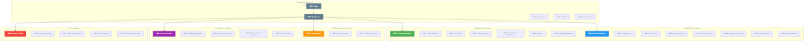

### 3.3 Module Dependencies

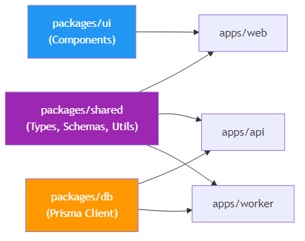

---

## 4. State Management

### 4.1 State Management Strategy

NewPOPSys employs a layered state management approach:

| Layer | Technology | Purpose |
|-------|------------|---------|
| **Server State** | PostgreSQL + Redis | Persistent application state |
| **Session State** | Redis-backed sessions | User authentication, tenant context |
| **Server Components** | React Server Components | Data fetching, initial render |
| **Client Cache** | React Query (TanStack Query) | Client-side data caching, optimistic updates |
| **UI State** | React useState/useReducer | Component-local interactive state |
| **Form State** | React Hook Form | Form validation, submission handling |

### 4.2 Data Flow Architecture

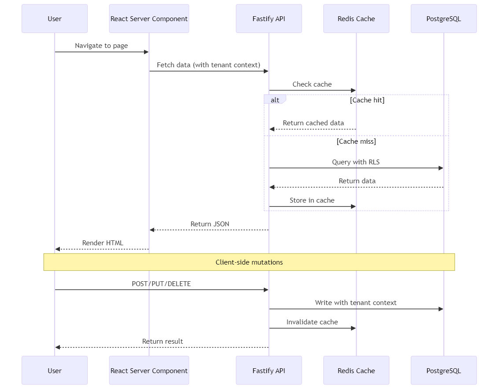

### 4.3 Offline Support (PWA)

For store execution workflows, the PWA provides best-effort offline support:

```typescript
// Service Worker caching strategy
const cacheStrategies = {
  // Static assets: Cache-first
  static: 'CacheFirst',

  // API data: Network-first with offline fallback
  api: 'NetworkFirst',

  // Draft submissions: IndexedDB queue
  drafts: 'BackgroundSync'
};

// Offline draft sync
interface OfflineDraft {
  id: string;
  type: 'photo_upload' | 'survey_response' | 'issue_report';
  payload: unknown;
  createdAt: Date;
  syncStatus: 'pending' | 'syncing' | 'failed';
}

// Sync on reconnection
async function syncOfflineDrafts() {
  const drafts = await getDraftsFromIndexedDB();
  for (const draft of drafts) {
    await submitDraft(draft);
    await markDraftSynced(draft.id);
  }
}
```

---

## 5. Error Handling

### 5.1 Error Handling Strategy

NewPOPSys implements a comprehensive error handling strategy across all layers:


### 5.2 Error Categories

| Category | HTTP Code | Logging | Alerting | User Message |
|----------|-----------|---------|----------|--------------|
| **Validation** | 400 | INFO | None | Field-specific errors |
| **Authentication** | 401 | WARN | Rate-based | "Please log in" |
| **Authorization** | 403 | WARN | Rate-based | "Access denied" |
| **Not Found** | 404 | INFO | None | "Resource not found" |
| **Business Logic** | 422 | INFO | None | Specific business message |
| **Rate Limited** | 429 | WARN | Threshold | "Too many requests" |
| **Server Error** | 500 | ERROR | Immediate | "Something went wrong" |
| **Service Unavailable** | 503 | ERROR | Immediate | "Service temporarily unavailable" |

### 5.3 Structured Error Response

```typescript
// Standard error response format
interface ApiError {
  error: {
    code: string;           // Machine-readable error code
    message: string;        // Human-readable message
    details?: {             // Validation errors
      field: string;
      message: string;
    }[];
    requestId: string;      // For support reference
    timestamp: string;      // ISO-8601
  };
}

// Example validation error
{
  "error": {
    "code": "VALIDATION_ERROR",
    "message": "Invalid request data",
    "details": [
      { "field": "campaign.name", "message": "Name is required" },
      { "field": "campaign.startDate", "message": "Start date must be in the future" }
    ],
    "requestId": "req_abc123",
    "timestamp": "2026-01-01T10:30:00Z"
  }
}
```

### 5.4 Error Handling Implementation

```typescript
// Global error handler (Fastify)
fastify.setErrorHandler(async (error, request, reply) => {
  const requestId = request.id;
  const context = request.context;

  // Structured log
  const logEntry = {
    level: error.statusCode >= 500 ? 'error' : 'warn',
    requestId,
    tenantId: context?.tenantId,
    userId: context?.userId,
    method: request.method,
    url: request.url,
    error: {
      name: error.name,
      message: error.message,
      code: error.code,
      stack: error.stack
    }
  };

  logger.log(logEntry);

  // Sentry for 5xx errors
  if (error.statusCode >= 500) {
    Sentry.captureException(error, {
      extra: { requestId, tenantId: context?.tenantId }
    });
  }

  // Sanitized response (no internal details)
  return reply.status(error.statusCode || 500).send({
    error: {
      code: error.code || 'INTERNAL_ERROR',
      message: error.statusCode >= 500
        ? 'An unexpected error occurred'
        : error.message,
      requestId,
      timestamp: new Date().toISOString()
    }
  });
});
```

### 5.5 Observability Integration

```typescript
// OpenTelemetry tracing
import { trace, SpanStatusCode } from '@opentelemetry/api';

const tracer = trace.getTracer('popsys-api');

async function createCampaign(data: CampaignInput, context: RequestContext) {
  const span = tracer.startSpan('createCampaign');

  try {
    span.setAttributes({
      'tenant.id': context.tenantId,
      'campaign.type': data.type
    });

    const campaign = await campaignService.create(data, context);

    span.setStatus({ code: SpanStatusCode.OK });
    return campaign;

  } catch (error) {
    span.setStatus({
      code: SpanStatusCode.ERROR,
      message: error.message
    });
    span.recordException(error);
    throw error;

  } finally {
    span.end();
  }
}
```

---

## 6. Component Interaction Diagram

### 6.1 Full System Component Diagram


### 6.2 Request Flow Sequence

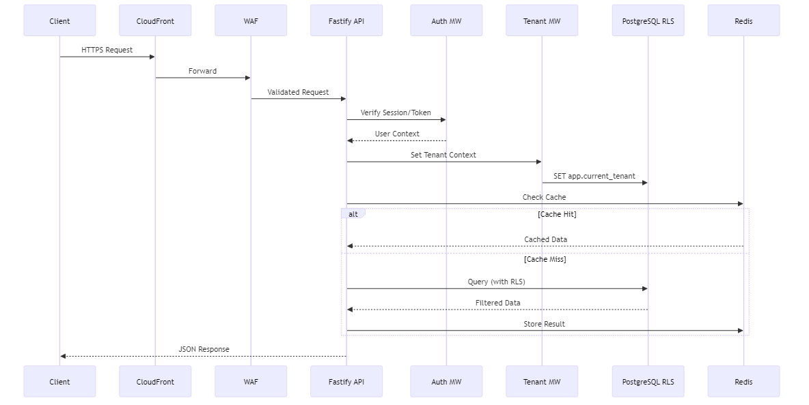

---

## 7. Security Architecture

### 7.1 Authentication Flow


### 7.2 API Key Authentication (Integrations)

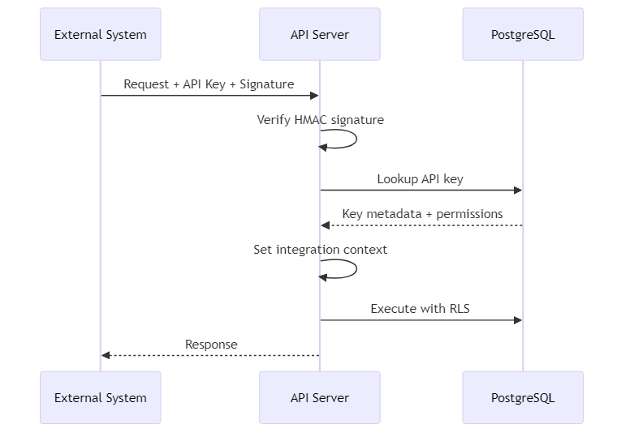

---

## 8. Deployment Architecture

### 8.1 Environment Strategy

| Environment | Purpose | Infrastructure |
|-------------|---------|----------------|
| **Development** | Local development | Docker Compose |
| **Staging** | Integration testing, QA | AWS ECS (single instance) |
| **Production** | Live system | AWS ECS (auto-scaling) |

### 8.2 CI/CD Pipeline


### 8.3 Quality Gates

All deployments must pass:

1. **Linting** - ESLint, Prettier
2. **Type Checking** - TypeScript strict mode
3. **Unit Tests** - Jest (80% coverage minimum)
4. **Integration Tests** - API contract verification
5. **E2E Tests** - Playwright for critical paths
6. **OpenAPI Drift Check** - API spec matches implementation
7. **Security Scan** - npm audit, dependency vulnerabilities

---

## References

| Document | Description |
|----------|-------------|
| [SUPP-012](../../02_SUPPs/Platform_Ops_Agent_Harness/SUPP-012%20-%20Platform%20Ops%20-%20Agent%20Harness%20-%20Technology%20Selections%20ADR.md) | Technology stack selections |
| [SUPP-021](../../02_SUPPs/Platform_Ops_Agent_Harness/SUPP-021%20-%20Platform%20Ops%20-%20Agent%20Harness%20-%20Repo%20CI%20and%20Vertical%20Slice%20Plan.md) | Monorepo structure and CI gates |
| [SUPP-001](../../02_SUPPs/Shared_Foundations/SUPP-001%20-%20Shared%20Foundations%20-%20Persona%20Workflows%20JTBD%20Screens.md) | Persona workflows and screens |
| [SUPP-003](../../02_SUPPs/Shared_Foundations/SUPP-003%20-%20Shared%20Foundations%20-%20RBAC%20and%20Permissions%20Matrix.md) | RBAC and permission matrix |
| [Architecture Principles](../../Post_v1/13_Technical_Architecture/Architecture_Principles.md) | Core architectural principles |

---

*Document Version: 1.0*
*Last Updated: 2026-01-01*
*IEEE 830 Compliant*


---
# 3.3 Technology Stack

> **IEEE 830 Reference**: Section 3.3 - System Architecture: Technology Stack
> **Source Document**: [SUPP-012 - Technology Selections ADR](../../02_SUPPs/Platform_Ops_Agent_Harness/SUPP-012%20-%20Platform%20Ops%20-%20Agent%20Harness%20-%20Technology%20Selections%20ADR.md)
> **Version**: 1.0
> **Last Updated**: 2026-01-01

---

## 3.3.1 Purpose

This section defines the technology selections for NewPOPSys v1. All decisions documented here are **locked for v1** to ensure deterministic builds and consistent infrastructure across environments.

---

## 3.3.2 Technology Matrix

### 3.3.2.1 Infrastructure Layer

| Category | Selection | Specification | Notes |
|----------|-----------|---------------|-------|
| **Hosting** | AWS | ECS Fargate or App Runner | Containerized deployment; portable to GCP/Azure |
| **Database** | PostgreSQL 15+ | RDS | JSONB for survey schemas; relational constraints for fulfillment |
| **Cache/Queue** | Redis | ElastiCache + BullMQ | Async workers for exports, webhooks, purge jobs |
| **Object Storage** | S3 | Presigned uploads | DB stores metadata + pointers only |
| **CDN** | CloudFront | Edge caching | Media delivery optimization |
| **Environments** | 3-tier | dev + staging + prod | Staging required for pilot validation |

### 3.3.2.2 Application Layer

| Category | Selection | Specification | Notes |
|----------|-----------|---------------|-------|
| **Frontend** | Next.js (React) | App Router | PWA scaffold for store execution |
| **Backend** | TypeScript Node.js | Next API Routes or Fastify/Nest | Consistent language across stack |
| **ORM** | Drizzle ORM | SQL-level constraints | Migration tooling with enforced relationships |
| **i18n** | next-intl | English v1 | Spanish scaffold prepared; keys stable from day 1 |

### 3.3.2.3 Security & Authentication

| Category | Selection | Specification | Notes |
|----------|-----------|---------------|-------|
| **Auth (Web)** | Session Cookies | Server-side sessions | Optimal UX for web application |
| **Auth (Integration)** | API Keys | Hashed storage | Least privilege scopes |
| **Webhook Security** | HMAC Signatures | + Idempotency-Key | Auditable; replay protection |
| **File Scanning** | ClamAV | Scaffold only (optional) | Provider scan alternative accepted |

### 3.3.2.4 Communication & Notifications

| Category | Selection | Specification | Notes |
|----------|-----------|---------------|-------|
| **Email** | SES | SendGrid as swap | Provider-agnostic interface |
| **Webhooks** | Outbox Pattern | BullMQ retry worker | Dead-letter queue for failures |

### 3.3.2.5 Observability & Operations

| Category | Selection | Specification | Notes |
|----------|-----------|---------------|-------|
| **Error Tracking** | Sentry | Real-time alerts | Accelerates pilot stabilization |
| **Telemetry** | OpenTelemetry | Structured JSON logs | Vendor-portable; request ID correlation |
| **CI/CD** | GitHub Actions | Automated pipelines | Lint/typecheck gates required |
| **Testing** | Multi-layer | Unit + Contract + Playwright | Smoke tests for vertical slice |

---

## 3.3.3 Architecture Rationale

### 3.3.3.1 AWS + PostgreSQL + S3

**Decision**: AWS services as primary infrastructure platform.

**Rationale**: Lowest-friction path for a multi-tenant, media-heavy workflow application at pilot scale. RDS PostgreSQL provides:
- JSONB for flexible survey schema storage
- Strong relational constraints for fulfillment/execution workflows
- Proven scalability for anticipated growth

### 3.3.3.2 Session Cookies vs. JWT

**Decision**: Server-side session cookies for web application authentication.

**Rationale**:
- Maintains sane UX for web users
- Simplifies token management
- API keys + HMAC for integrations keeps external access simple and auditable

### 3.3.3.3 OpenTelemetry

**Decision**: OpenTelemetry for observability with structured JSON logs.

**Rationale**:
- Sentry provides immediate pilot stabilization support
- OpenTelemetry ensures vendor portability if observability vendors change
- Request ID correlation enables distributed tracing

### 3.3.3.4 Outbox Pattern for Webhooks

**Decision**: Outbox pattern with BullMQ retry workers.

**Rationale**:
- Guarantees webhook delivery even during transient failures
- Dead-letter queue captures persistent failures for investigation
- Idempotency-Key prevents duplicate processing

---

## 3.3.4 Allowed Overrides

The following substitutions are permitted without architectural changes:

| Component | Allowed Swap | Condition |
|-----------|--------------|-----------|
| Email Provider | SES <-> SendGrid | API abstraction maintained |
| Cloud Provider | AWS -> GCP/Azure | OpenTelemetry + containerized deployment preserved |
| i18n Languages | Expand list | Keep translation keys stable |

---

## 3.3.5 Implementation Constraints

Per SUPP-012, the following constraints apply to implementation:

1. **Event Envelope Format**: Adopt early per SUPP-006
2. **Stable IDs**: Exports must never depend on internal DB row order
3. **Survey Versioning**: Treat as immutable; pin to assignments; require explicit rebase
4. **Migration Tooling**: Enforce SQL-level constraints for core relationships

---

## 3.3.6 Cross-References

| Reference | Description |
|-----------|-------------|
| SUPP-012 | Authoritative technology selections ADR |
| SUPP-006 | Event envelope format specification |
| Section 3.2 | Application Architecture |
| Section 12.2 | Security Requirements |
| Section 12.4 | Scalability Requirements |

---

*Document Status: Complete*
*IEEE 830 Compliance: Section 3.3 - Design Constraints / Technology Stack*


---
# 3.4 Integration Architecture

> **Version**: 1.0
> **Status**: Draft
> **Last Updated**: 2026-01-01
> **References**: SUPP-006, SUPP-012, SUPP-027, SUPP-034, openapi.yaml

---

## 3.4.1 Overview

NewPOPSys integrates with external systems through a robust, event-driven architecture designed for reliability, security, and observability. The integration layer supports:

- **Outbound Webhooks**: At-least-once delivery of system events to PSP and Brand systems
- **Inbound APIs**: RESTful endpoints for external systems to update orders, shipments, and execution status
- **Async Processing**: BullMQ-based queue workers for reliable event delivery and retry handling

| Integration Type | Direction | Primary Consumers |
|-----------------|-----------|-------------------|
| Webhooks | Outbound | PSP MIS, Brand ERP, Logistics Systems |
| REST API | Inbound | PSP Automation, Carrier APIs |
| Email | Outbound | Users (Brand Admins, Store Staff, PSP) |

---

## 3.4.2 External System Integrations

### 3.4.2.1 Integration Partners


### 3.4.2.2 Integration Capabilities by Partner Type

| Partner Type | Receives Webhooks | Sends API Requests | Data Exchanged |
|-------------|-------------------|-------------------|----------------|
| PSP MIS | Yes | Yes | Orders, Shipments, Batches, Alerts |
| Brand ERP | Yes (optional) | No (v1) | Order status, Shipments, Compliance |
| Shipping Carriers | No | Yes (inbound tracking) | Rates, Tracking, Delivery Confirmation |
| Analytics Platforms | Yes | No | Campaign metrics, Execution data |

---

## 3.4.3 Webhook Architecture

### 3.4.3.1 Outbox Pattern Implementation

NewPOPSys uses the **Transactional Outbox Pattern** to ensure reliable webhook delivery without distributed transactions.

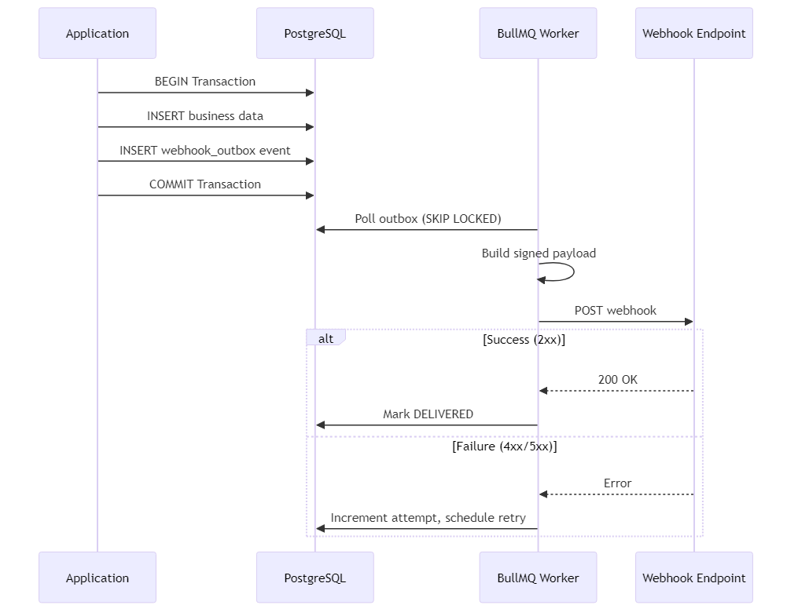

### 3.4.3.2 Event Envelope Structure

All webhook deliveries use a standardized envelope format:

```json
{
  "eventId": "evt_01HXYZ...",
  "eventType": "order.created",
  "occurredAt": "2025-12-17T18:00:00Z",
  "schemaVersion": "1.0",
  "pspId": "psp_...",
  "brandId": "br_...",
  "campaignId": "cmp_...",
  "storeId": "sto_...",
  "correlationId": "corr_...",
  "actor": {
    "type": "system|human|integration",
    "id": "usr_..."
  },
  "data": {
    // Event-specific payload
  }
}
```

### 3.4.3.3 Webhook Headers

| Header | Description | Example |
|--------|-------------|---------|
| `X-NewPOPSys-Event` | Event type identifier | `order.created` |
| `X-NewPOPSys-Event-Id` | Unique event ID (UUIDv7) | `evt_01HXYZ...` |
| `X-NewPOPSys-Timestamp` | Unix timestamp (milliseconds) | `1734458400000` |
| `X-NewPOPSys-Signature-256` | HMAC-SHA256 signature | `sha256=abc123...` |
| `X-NewPOPSys-Schema-Version` | Payload schema version | `1.0` |

### 3.4.3.4 Webhook Event Types (v1)

| Event Type | Trigger | Primary Recipients |
|------------|---------|-------------------|
| `order.created` | Orders generated for campaign publish | PSP |
| `order.updated` | Order status/fields updated | PSP, Brand (optional) |
| `shipment.created` | Shipment created (partial allowed) | PSP, Brand |
| `shipment.updated` | Tracking/status updated | PSP, Brand, Store (optional) |
| `batch.updated` | Batch created/updated or membership changed | PSP |
| `alert.late_shipping` | Late shipping threshold breached | PSP, Brand |
| `alert.execution_anomaly` | Receive/verify or completion anomaly | Brand |
| `proof.submitted` | Store submits completion proof | Brand/Regional |
| `photo.rejected` | Admin rejects photo(s) | Store |
| `review.overdue` | Verification SLA breached | Brand/Regional |
| `issue.submitted` | Issue/reorder submitted | PSP, Brand (policy-based) |
| `issue.approval_required` | Approval needed by brand/regional | Brand/Regional |
| `issue.decided` | Issue approved/rejected | PSP, Store (optional) |
| `reorder.shipment.updated` | Replacement shipment status updated | PSP, Brand |
| `campaign.expired.deinstall_required` | Campaign end triggers deinstall | Store, Brand, PSP |
| `deinstall.overdue` | Deinstall overdue (grace exceeded) | Brand/Regional |
| `noncompliance.case_created` | Compliance case created | Brand/Regional |

---

## 3.4.4 API Authentication

### 3.4.4.1 Authentication Methods

| Method | Use Case | Implementation |
|--------|----------|----------------|
| API Keys | Inbound API requests | `X-API-Key` header |
| HMAC-SHA256 | Webhook signature verification | `X-NewPOPSys-Signature-256` header |
| Session Cookies | Web application | Server-side session management |

### 3.4.4.2 API Key Structure

API keys follow a prefixed format for environment identification:

```
Production: vg_live_xxxxxxxxxxxxxxxxxxxxxxxx
Test/Staging: vg_test_xxxxxxxxxxxxxxxxxxxxxxxx
```

**Security Requirements:**
- Keys are hashed (bcrypt) before storage
- Each key has least-privilege scopes assigned
- Key rotation supported with grace period
- Revocation is immediate and audited

### 3.4.4.3 HMAC-SHA256 Webhook Signature Verification

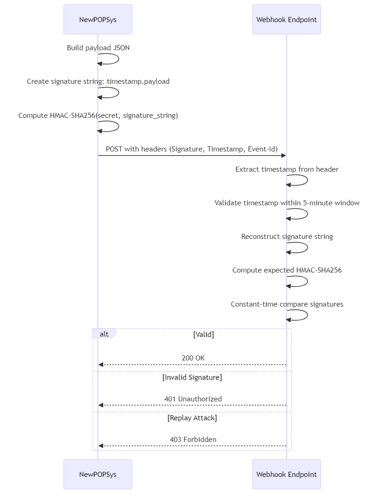

**Signature Calculation:**

```
String to sign: <timestamp>.<raw_body_bytes>
Signature: HMAC_SHA256(secret, string_to_sign)
Header: X-NewPOPSys-Signature-256: sha256=<hex>
```

**Verification Code Example (Node.js):**

```javascript
const crypto = require('crypto');

function verifyWebhook(req, secret) {
  const signature = req.headers['x-newpopsys-signature-256'];
  const timestamp = req.headers['x-newpopsys-timestamp'];
  const body = JSON.stringify(req.body);

  // Check timestamp freshness (5 minute window)
  const now = Math.floor(Date.now() / 1000);
  if (Math.abs(now - parseInt(timestamp)) > 300) {
    throw new Error('Webhook timestamp too old');
  }

  // Compute expected signature
  const payload = `${timestamp}.${body}`;
  const expected = 'sha256=' + crypto
    .createHmac('sha256', secret)
    .update(payload)
    .digest('hex');

  // Constant-time comparison
  if (!crypto.timingSafeEqual(
    Buffer.from(signature),
    Buffer.from(expected)
  )) {
    throw new Error('Invalid webhook signature');
  }

  return true;
}
```

---

## 3.4.5 Idempotency Patterns

### 3.4.5.1 Inbound API Idempotency

All write operations require an `Idempotency-Key` header to ensure safe retries.


**Idempotency Key Requirements:**

| Attribute | Requirement |
|-----------|-------------|
| Header | `Idempotency-Key` |
| Format | 16-64 alphanumeric characters |
| Cache Duration | 24 hours |
| Storage | `{tenantId, key, method, path, request_hash, response_hash, created_at, expires_at}` |

**Response Codes:**

| Scenario | HTTP Code |
|----------|-----------|
| Key missing | 400 Bad Request |
| Key reused, same payload | Original response (cached) |
| Key reused, different payload | 409 Conflict |

### 3.4.5.2 Outbound Webhook Idempotency

Webhook consumers must deduplicate by `eventId`:

- Each event has a globally unique `eventId` (UUIDv7)
- Delivery is at-least-once (retries may duplicate)
- Consumers should store seen `eventId` values for deduplication window
- Recommended deduplication window: 72 hours (matches retry window)

---

## 3.4.6 Error Handling and Retry Strategies

### 3.4.6.1 Webhook Retry Schedule

Exponential backoff with jitter is used for failed webhook deliveries:

| Attempt | Delay (Approximate) |
|---------|---------------------|
| 1 | 1 minute |
| 2 | 5 minutes |
| 3 | 15 minutes |
| 4 | 1 hour |
| 5 | 3 hours |
| 6 | 6 hours |
| 7 | 12 hours |
| 8 | 24 hours |
| 9 | 48 hours |
| 10 | 72 hours |

After attempt 10, delivery enters **DEAD_LETTER** status unless manually replayed.

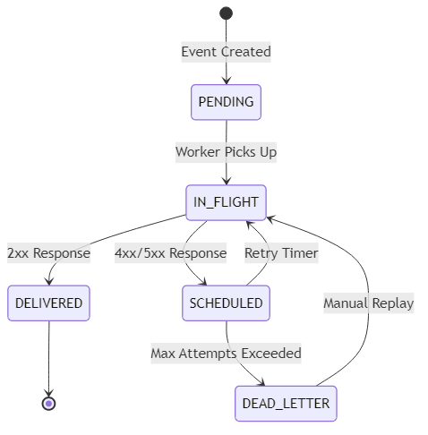

### 3.4.6.2 Dead Letter Queue Management

- **Automatic DLQ**: After 10 failed attempts (max 72 hours)
- **Manual Replay**: Unlimited, requires admin action with reason/comment
- **Audit Trail**: All replay actions logged with who/when/why

### 3.4.6.3 Circuit Breaker Pattern

For consistently failing endpoints:

| Setting | Default |
|---------|---------|
| Max in-flight per endpoint | 2 concurrent |
| Request timeout | 10 seconds |
| Circuit opens after | N consecutive failures |
| Cool-down period | 5 minutes |

### 3.4.6.4 Response Code Handling

| Response | Action |
|----------|--------|
| 2xx | Mark DELIVERED, no retry |
| 401 | Log signature failure, no retry (configuration error) |
| 403 | Log replay/auth failure, no retry |
| 4xx (other) | Log client error, schedule retry (may be transient) |
| 5xx | Schedule retry with backoff |
| Timeout | Schedule retry with backoff |

---

## 3.4.7 Rate Limiting

### 3.4.7.1 Inbound API Rate Limits

Rate limiting is enforced at the API gateway level with tenant-aware keys:

| Route Group | Default Limit | Enforcement |
|-------------|---------------|-------------|
| Auth/session | 20/min per IP | Protect login endpoints |
| General API | 300/min per user | Tenant + user enforced |
| Uploads presign | 60/min per user | Protect storage costs |
| Exports create | 10/min per tenant | Exports are resource-heavy |

**Rate Limit Headers:**

| Header | Description |
|--------|-------------|
| `X-RateLimit-Limit` | Maximum requests allowed |
| `X-RateLimit-Remaining` | Requests remaining in window |
| `X-RateLimit-Reset` | Unix timestamp when limit resets |

**Exceeded Response:**
- HTTP 429 Too Many Requests
- `Retry-After` header with seconds until reset

### 3.4.7.2 Webhook Concurrency Throttle

Per-endpoint concurrency controls prevent overwhelming consumer systems:

| Setting | Default |
|---------|---------|
| Max in-flight per endpoint | 2 |
| Request timeout | 10 seconds |
| Queue behavior | FIFO with retry scheduling |

---

## 3.4.8 Integration Sequence Diagrams

### 3.4.8.1 Campaign Publish Flow

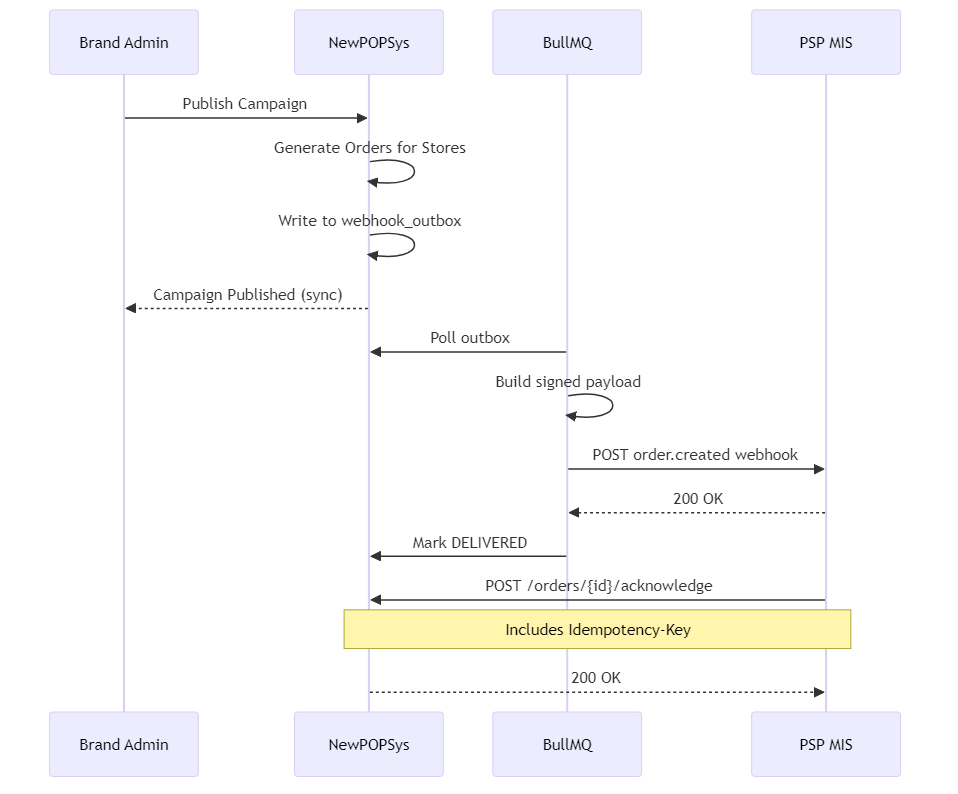

### 3.4.8.2 Shipment Update Flow

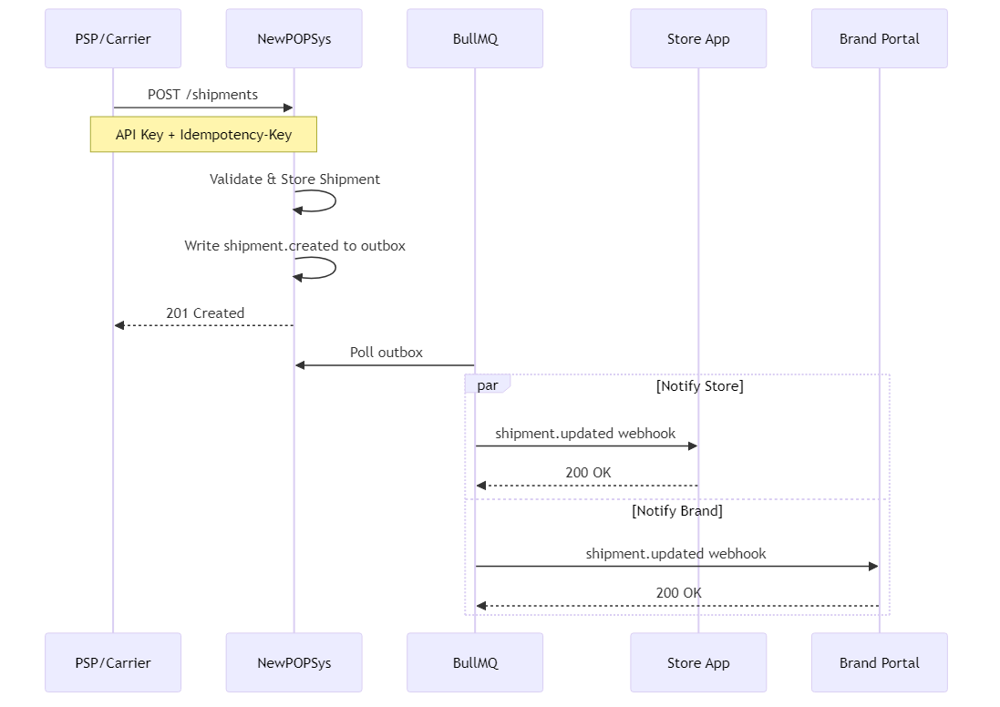

### 3.4.8.3 Issue/Reorder Flow

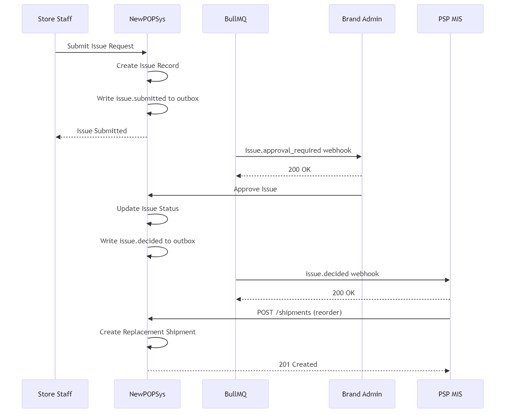

---

## 3.4.9 Delivery Records Data Model

### 3.4.9.1 Webhook Delivery Record

```
webhook_delivery:
  - id: UUID
  - event_id: UUID (FK to event)
  - endpoint_id: UUID (FK to webhook_endpoint)
  - status: ENUM (PENDING, IN_FLIGHT, DELIVERED, FAILED, DEAD_LETTER, BLOCKED)
  - http_status: INT (nullable)
  - attempt_count: INT
  - next_attempt_at: TIMESTAMP (nullable)
  - last_attempt_at: TIMESTAMP (nullable)
  - last_error: TEXT (nullable)
  - request_id: UUID
  - correlation_id: UUID
  - created_at: TIMESTAMP
  - updated_at: TIMESTAMP
```

### 3.4.9.2 Idempotency Key Record

```
idempotency_key:
  - id: UUID
  - tenant_id: UUID
  - key: VARCHAR(64)
  - method: VARCHAR(10)
  - path: VARCHAR(255)
  - request_hash: VARCHAR(64)
  - response_status: INT
  - response_body_hash: VARCHAR(64)
  - created_at: TIMESTAMP
  - expires_at: TIMESTAMP

UNIQUE(tenant_id, key)
```

---

## 3.4.10 Security Considerations

### 3.4.10.1 Webhook Security

| Control | Implementation |
|---------|----------------|
| Signature Verification | HMAC-SHA256 with shared secret |
| Replay Protection | 5-minute timestamp window + eventId dedup |
| Secret Rotation | Support current + previous secret during rotation |
| TLS | HTTPS required for all webhook endpoints |
| IP Allowlisting | Optional per-tenant for high-security integrations |

### 3.4.10.2 Staging Environment Safety

| Control | Behavior |
|---------|----------|
| Email Allowlist | Only send to whitelisted domains/addresses |
| Webhook Allowlist | Only dispatch to allowlisted URLs |
| Non-allowlisted | Blocked and logged as `blocked_by_policy` |

### 3.4.10.3 API Key Security

- Keys hashed with bcrypt before storage
- Least-privilege scopes per key
- Immediate revocation capability
- Audit logging for all key operations

---

## 3.4.11 Correlation and Tracing

All integration events include `correlationId` for end-to-end tracing:

[Diagram - See rendered image above or refer to source document]

- OpenTelemetry spans linked by correlation ID
- Structured JSON logs include `requestId` and `correlationId`
- Webhook deliveries carry correlation through the chain

---

## 3.4.12 Schema Versioning

### 3.4.12.1 Versioning Strategy

| Change Type | Version Impact |
|-------------|----------------|
| New optional field | Minor version increment |
| Rename/remove field | Major version increment |
| New event type | No version change |

### 3.4.12.2 Consumer Guidelines

- Ignore unknown fields (forward compatibility)
- Handle `eventType` + `schemaVersion` explicitly
- Prepare for schema version in headers: `X-NewPOPSys-Schema-Version`

---

## 3.4.13 Acceptance Criteria

- [ ] AC-001: Webhook deliveries use HMAC-SHA256 signatures with timestamp validation
- [ ] AC-002: Failed webhooks retry with exponential backoff (max 72 hours)
- [ ] AC-003: Dead-letter deliveries are replayable via admin UI with audit trail
- [ ] AC-004: All inbound write APIs require `Idempotency-Key` header
- [ ] AC-005: Duplicate idempotency keys return cached response (same payload) or 409 (different payload)
- [ ] AC-006: Rate limiting returns 429 with `Retry-After` header
- [ ] AC-007: Webhook concurrency per endpoint is limited to prevent overwhelming consumers
- [ ] AC-008: Staging blocks non-allowlisted webhook URLs and email recipients
- [ ] AC-009: All integration events include `correlationId` for tracing
- [ ] AC-010: API keys support rotation with grace period

---

## Changelog

| Version | Date | Description |
|---------|------|-------------|
| 1.0 | 2026-01-01 | Initial SRS section created from SUPP-006, SUPP-012, SUPP-027, SUPP-034, openapi.yaml |


---
# 03 - System Architecture

This section documents the technical architecture of NewPOPSys.

## Contents

| File | Description | Status |
|------|-------------|--------|
| 3.1_Database_Model.md | ERD and table definitions | Complete |
| 3.2_Application_Architecture.md | Component diagram | Not Started |
| 3.3_Technology_Stack.md | Technology selections (from SUPP-012) | Complete |
| 3.4_Integration_Architecture.md | External systems integration | Not Started |

## Diagrams

Located in `diagrams/` subfolder:
- `erd_core.mmd` - Core entities ERD
- `erd_campaigns.mmd` - Campaign entities ERD
- `erd_execution.mmd` - Execution entities ERD
- `component_architecture.mmd` - Application components

## Source Documents

- `SOW/06_Database_Model/` (16 files)
- SUPP-012 (Technology Stack)
- SUPP-021 (Architecture)

---
*Section Status: In Progress (2 of 4 complete)*


---


---

# Section 4: User Personas & RBAC
# 4.1 Persona Matrix

## 1. Purpose

This section defines the user personas for NewPOPSys v1.38. Each persona represents a distinct user class with specific responsibilities, permission levels, and system interactions. The persona matrix serves as the authoritative reference for role-based access control (RBAC) implementation.

**Authoritative Source**: SUPP-001 - Shared Foundations - Persona Workflows JTBD Screens

---

## 2. Persona Overview

NewPOPSys supports nine (9) distinct personas organized across four hierarchical levels:

| Level | Count | Personas |
|-------|-------|----------|
| PSP Level | 3 | Platform Admin, PSP Admin, Production Operator |
| Brand Level | 3 | Brand Admin, Campaign Manager, Regional Manager |
| Store Level | 2 | Store Manager, Store Operator |
| System Level | 1 | Integration User |

---

## 3. Persona Matrix

### 3.1 PSP Level Personas

| ID | Persona Name | Role Level | Primary Responsibility | Permission Level | Key Screens/Modules |
|----|--------------|------------|------------------------|------------------|---------------------|
| P01 | Platform Admin | PSP | Full system configuration, tenant management, user impersonation for support, security and audit access | All Privileged + Impersonate | Tenant config; System settings; User impersonation; Security dashboard; Full audit log |
| P02 | PSP Admin | PSP | Brand onboarding, PSP-level settings, user management, reporting and exports | PSP All Privileged | Brand onboarding; PSP settings; User management; Campaign list/totals; Exports center; Webhook/API logs |
| P03 | Production Operator | PSP | Update order statuses, create shipments and tracking, process batches, view fulfillment queues | Status & Shipping Updates | Store order list+filters; Order detail; Batch manager; Shipments+tracking; Issues/Reorders queue |

### 3.2 Brand Level Personas

| ID | Persona Name | Role Level | Primary Responsibility | Permission Level | Key Screens/Modules |
|----|--------------|------------|------------------------|------------------|---------------------|
| P04 | Brand Admin | Brand | Full brand configuration, all campaigns access, store management, user permissions | Brand Level Privileged | All Campaign Manager screens + Brand config; Store management; User permissions; Full brand reporting |
| P05 | Campaign Manager | Brand | Build new campaigns, manage assigned campaigns, define kits and photo rules, review proofs and approve | Must be assigned to campaigns | Campaign builder; Store selector; Kit/items editor; Photo rules; Dashboard; Store detail; Review queue; Retake queue; Exports/reports |
| P06 | Regional Manager | Brand | Oversee assigned stores, exception queue management, approve/reject proofs, escalate to Brand Admin | Store Compliance for segment | Exception queue (assigned stores); Store compliance dashboard; Review queue; Retake queue; Waivers/Reopen; Escalation tools |

### 3.3 Store Level Personas

| ID | Persona Name | Role Level | Primary Responsibility | Permission Level | Key Screens/Modules |
|----|--------------|------------|------------------------|------------------|---------------------|
| P07 | Store Manager | Store | Manage store team, approve replacement requests, view all store campaigns, full execution permissions | Full Store Privileges | All Store Operator screens + Team management; Replacement approvals; Store analytics; Full store campaign history |
| P08 | Store Operator | Store | Complete surveys, update status, request replacements (needs Store Manager approval), view assigned campaigns | View Only + Execution | My tasks; Campaign detail; Receive/verify; Issue/reorder request; Pre-install checklist; Install + proof capture; Completion survey + attestation; Retake queue; Deinstall task |

### 3.4 System Level Personas

| ID | Persona Name | Role Level | Primary Responsibility | Permission Level | Key Screens/Modules |
|----|--------------|------------|------------------------|------------------|---------------------|
| P09 | Integration User | System | Inbound API writes, webhook consumption, export triggers, MIS integration | API & Webhook Service Account | API endpoints; Webhook subscriptions; Export triggers; Integration logs |

---

## 4. Permission Hierarchy

[Diagram - See rendered image above or refer to source document]

---

## 5. Key Constraints

| Constraint | Description | Affected Personas |
|------------|-------------|-------------------|
| Campaign Assignment | Campaign Managers can only manage campaigns explicitly assigned to them | P05 |
| Store Assignment | Regional Managers only see stores within their assigned segment | P06 |
| Approval Workflow | Store Operators require Store Manager approval for replacement requests | P08 |
| Impersonation | Only Platform Admin may impersonate other users for support | P01 |

---

## 6. References

- **SUPP-001**: Shared Foundations - Persona Workflows JTBD Screens (authoritative source)
- **Section 4.2**: Permission Matrix (detailed RBAC grid)
- **Section 4.3**: Authentication Flows

---

*Document Version: 1.0*
*Last Updated: 2026-01-01*
*IEEE 830 Compliant*


---
# 4.2 Permission Matrix

> **SRS Section**: 4.2 | **Version**: 1.0 | **Status**: Draft
> **Source**: [SUPP-003 - RBAC and Permissions Matrix](../../02_SUPPs/Shared_Foundations/SUPP-003%20-%20Shared%20Foundations%20-%20RBAC%20and%20Permissions%20Matrix.md)
> **Last Updated**: 2026-01-01

---

## 4.2.1 Purpose

This section defines the Role-Based Access Control (RBAC) permission matrix for NewPOPSys v1. It specifies authorized capabilities for each role across system features, completion workflows, and security controls.

## 4.2.2 Role Enumeration

The system defines eight roles via `role_enum`:

| Enum Value | Display Name | Level |
|------------|--------------|-------|
| `PLATFORM_ADMIN` | Platform Admin | PSP |
| `PSP_ADMIN` | PSP Admin | PSP |
| `PSP_OPS` | Production Operator / Support Agent | PSP |
| `BRAND_ADMIN` | Brand Admin | Brand |
| `CAMPAIGN_MANAGER` | Campaign Manager | Brand |
| `REGIONAL_MANAGER` | Regional Manager | Brand |
| `STORE_MANAGER` | Store Manager | Store |
| `STORE_OPERATOR` | Store Operator | Store |

> **Note**: Support Agent uses `PSP_OPS` with `support_scope = true` flag (read-only access).

---

## 4.2.3 Permission Matrix by Level

### 4.2.3.1 PSP Level Permissions

| Capability | Platform Admin | PSP Admin | Production Operator | Support Agent |
|------------|:--------------:|:---------:|:-------------------:|:-------------:|
| Manage tenant settings | Y | N | N | N |
| Impersonate users | Y | N | N | Y* |
| Onboard brand | Y | Y | N | N |
| Invite/manage PSP users | Y | Y | N | N |
| View all brands/campaigns | Y | Y | Y | Y |
| View orders (totals + store) | Y | Y | Y | Y |
| Update order status | Y | Y | Y | N |
| Create/update shipments | Y | Y | Y | N |
| Manage batches | Y | Y | Y | N |
| Approve/reject issues | Y | Y | Y* | N |
| Trigger exports | Y | Y | Y* | N |
| View audit logs | Y | Y | Y* | Y |
| Webhook/API configuration | Y | Y | N | N |
| Replay failed webhooks | Y | Y | N | Y* |

### 4.2.3.2 Brand Level Permissions

| Capability | Brand Admin | Campaign Manager | Regional Manager |
|------------|:-----------:|:----------------:|:----------------:|
| Full brand configuration | Y | N | N |
| Invite/manage brand users | Y | N | N |
| Create/edit stores & groups | Y | N | N |
| Create/edit layouts & surveys | Y | Y* | N |
| Create campaigns & assign stores | Y | Y | N |
| Configure verificationMode + SLA | Y | Y* | N |
| View all campaigns | Y | Y* | Y* |
| Review/approve/reject proofs | Y | Y* | Y* |
| Waive missing proofs | Y | N | Y* |
| Reopen completed store | Y | N | Y* |
| Force-complete campaign | Y | N | N |
| Approve/reject issues | Y | Y* | Y* |
| Trigger exports | Y | Y* | Y* |
| View audit logs | Y | Y* | Y* |

### 4.2.3.3 Store Level Permissions

| Capability | Store Manager | Store Operator |
|------------|:-------------:|:--------------:|
| Manage store team | Y | N |
| View all store campaigns | Y | Y* |
| Execute tasks (receive/install) | Y | Y |
| Upload proofs + completion survey | Y | Y |
| Submit replacement requests | Y | Y* |
| Approve replacement requests | Y | N |
| View store reports | Y | N |
| Trigger exports | Y* | N |
| View audit logs | Y* | N |

### 4.2.3.4 System (Integration User)

| Capability | Integration User |
|------------|:----------------:|
| Inbound API writes (orders/shipments) | Y |
| Webhook consumption | Y |
| Export triggers | Y* |
| Create/edit stores (via API) | Y* |
| View orders/shipments | Y |
| Update order status | Y |
| Create/update shipments | Y |

**Legend**: Y = Full access | Y* = Scoped/limited access | N = No access

---

## 4.2.4 Completion Authority Matrix

| Action | PLATFORM_ADMIN | PSP_ADMIN | PSP_OPS | BRAND_ADMIN | CAMPAIGN_MANAGER | REGIONAL_MANAGER | STORE_MANAGER | STORE_OPERATOR |
|--------|:--------------:|:---------:|:-------:|:-----------:|:----------------:|:----------------:|:-------------:|:--------------:|
| Normal submit completion | Y | Y | N | Y | Y* | Y* | Y | Y |
| Request replacement items | Y | Y | N | Y | Y* | Y* | Y | Y* |
| Approve replacement requests | Y | Y | N | Y | N | N | Y | N |
| Approve/reject photos | Y | Y | N | Y | Y* | Y* | N | N |
| Waive missing proofs | Y | Y | N | Y | N | Y* | N | N |
| Reopen completed store | Y | Y | N | Y | N | Y* | N | N |
| Force-complete campaign | Y | Y | N | Y | N | N | N | N |
| Approve reorders | Y | Y | Y* | Y | N | Y* | N | N |

**Audit Requirements**:
- All completion actions require attestation
- Rejection requires reason code
- Waiver/reopen requires written justification
- Force-complete snapshots incomplete stores

---

## 4.2.5 Security Requirements

### 4.2.5.1 Multi-Factor Authentication

| Role | MFA Requirement |
|------|-----------------|
| PLATFORM_ADMIN | **Required** (TOTP/WebAuthn) |
| PSP_ADMIN | **Required** (TOTP/WebAuthn) |
| BRAND_ADMIN | **Required** (TOTP/WebAuthn) |
| PSP_OPS | Recommended (tenant policy) |
| REGIONAL_MANAGER | Recommended (tenant policy) |
| CAMPAIGN_MANAGER | Optional (brand policy) |
| STORE_MANAGER | Optional (brand policy) |
| STORE_OPERATOR | Optional (brand policy) |

### 4.2.5.2 Impersonation Controls

| Impersonator | Target Scope | Mode | Session Limit |
|--------------|--------------|------|---------------|
| Platform Admin | All users except Platform Admins | Full | 30 min (2 hr max) |
| Support Agent | Store Users only | Read-only | 30 min (2 hr max) |

- All impersonation sessions emit audit events (start/end with reason)
- Original user sees banner when being impersonated
- All other roles cannot impersonate

### 4.2.5.3 API Security

| Control | Requirement |
|---------|-------------|
| API key storage | Hashed; plaintext shown only at creation |
| Key rotation | Supported with revocation |
| Idempotency | Required for all integration writes |
| Rate limiting | Per-key limits with anomaly detection |
| Audit trail | All permissioned writes emit immutable AuditEvents |

---

## 4.2.6 Traceability

| Requirement ID | Description | Source |
|----------------|-------------|--------|
| RBAC-001 | Eight-role enumeration | SUPP-003 Section: Default Roles |
| RBAC-002 | PSP-level permission matrix | SUPP-003 Section: PSP Level Permissions |
| RBAC-003 | Brand-level permission matrix | SUPP-003 Section: Brand Level Permissions |
| RBAC-004 | Store-level permission matrix | SUPP-003 Section: Store Level Permissions |
| RBAC-005 | Completion authority rules | SUPP-003 Section: Completion Authority |
| RBAC-006 | MFA requirements | SUPP-003 Section: Authentication |
| RBAC-007 | Impersonation controls | SUPP-003 Section: Impersonation Controls |
| RBAC-008 | API security controls | SUPP-003 Section: API Security |

---

*Document Status: Draft | IEEE 830 Compliant*


---
# 4.3 Authentication Flows

> **SRS Section**: 4.3 | **Version**: 1.0 | **Status**: Draft
> **System**: NewPOPSys v1.38
> **Source**: [SUPP-003 - RBAC and Permissions Matrix](../../02_SUPPs/Shared_Foundations/SUPP-003%20-%20Shared%20Foundations%20-%20RBAC%20and%20Permissions%20Matrix.md)
> **Last Updated**: 2026-01-01

---

## 4.3.1 Purpose

This section specifies the authentication mechanisms, session management policies, and security flows for NewPOPSys v1.38. It defines requirements for user authentication (web UI), API key authentication (integrations), multi-factor authentication (MFA), password policies, session lifecycle, and user impersonation.

## 4.3.2 Scope

This specification covers:
- Session-based authentication for web UI users
- API key authentication for integration accounts
- Multi-factor authentication requirements and flows
- Password complexity and lifecycle policies
- Session management including expiration and refresh
- User impersonation flow for Platform Admin support

---

## 4.3.3 Authentication Methods

### 4.3.3.1 Session-Based Authentication (Web UI)

The primary authentication method for human users accessing NewPOPSys via web browser.

| Attribute | Specification |
|-----------|---------------|
| **Method** | Email + Password |
| **Session Type** | Server-side session with secure cookie |
| **Cookie Attributes** | `HttpOnly`, `Secure`, `SameSite=Strict` |
| **Session ID** | Cryptographically random, 256-bit minimum |
| **Transport** | HTTPS only (TLS 1.2+) |

### 4.3.3.2 API Key Authentication (Integrations)

Authentication method for Integration User service accounts and external system integrations.

| Attribute | Specification |
|-----------|---------------|
| **Method** | API Key (Bearer token) |
| **Key Format** | Prefix `npop_` + 64-character hex string |
| **Header** | `Authorization: Bearer npop_<key>` |
| **Scope** | PSP-tenant-wide, with per-key permission set |
| **Storage** | bcrypt hash stored; plaintext shown only at creation |

---

## 4.3.4 Password Policy

### 4.3.4.1 Password Requirements

| Requirement | Specification |
|-------------|---------------|
| **Minimum Length** | 12 characters |
| **Complexity** | Must contain: uppercase, lowercase, digit, special character |
| **Prohibited Patterns** | Common passwords (dictionary check), username substring, sequential characters |
| **Hash Algorithm** | bcrypt with cost factor 12 |
| **Salt** | Per-password random salt (built into bcrypt) |

### 4.3.4.2 Password Lifecycle

| Policy | Admin Roles | Non-Admin Roles |
|--------|-------------|-----------------|
| **Rotation Period** | 90 days mandatory | 180 days recommended |
| **Password History** | Last 12 passwords | Last 6 passwords |
| **Expiration Warning** | 14 days before | 7 days before |
| **Grace Period** | None (immediate lockout) | 7 days (password change required at login) |

### 4.3.4.3 Password Reset Flow

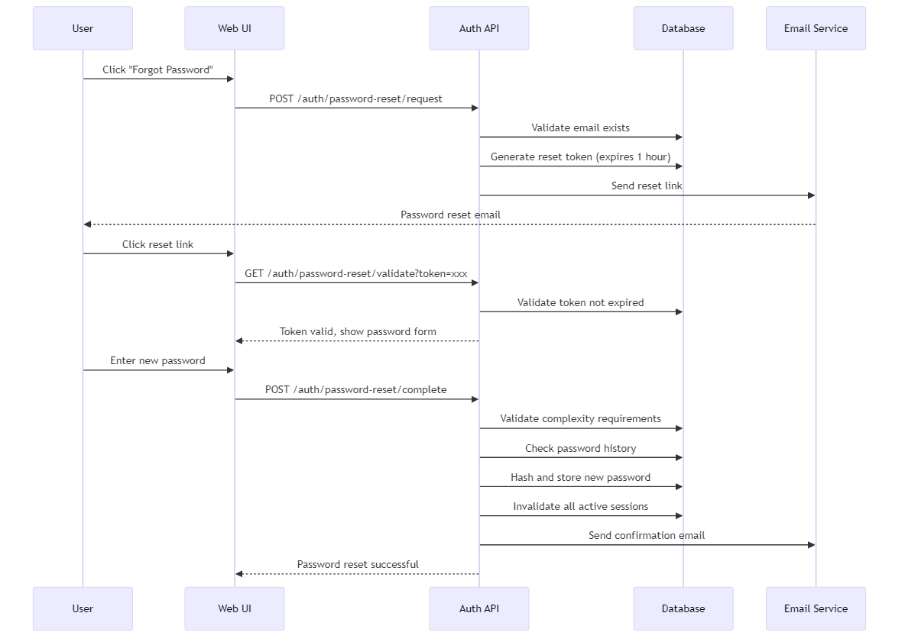

---

## 4.3.5 Multi-Factor Authentication (MFA)

### 4.3.5.1 MFA Requirements by Role

| Role | MFA Requirement | Supported Methods |
|------|-----------------|-------------------|
| PLATFORM_ADMIN | **Mandatory** | TOTP, WebAuthn |
| PSP_ADMIN | **Mandatory** | TOTP, WebAuthn |
| BRAND_ADMIN | **Mandatory** | TOTP, WebAuthn |
| PSP_OPS (Production Operator) | Recommended (tenant policy) | TOTP, WebAuthn |
| PSP_OPS (Support Agent) | Recommended (tenant policy) | TOTP, WebAuthn |
| REGIONAL_MANAGER | Recommended (tenant policy) | TOTP, WebAuthn |
| CAMPAIGN_MANAGER | Optional (brand policy) | TOTP |
| STORE_MANAGER | Optional (brand policy) | TOTP |
| STORE_OPERATOR | Optional (brand policy) | TOTP |

### 4.3.5.2 MFA Method Specifications

#### TOTP (Time-Based One-Time Password)

| Attribute | Specification |
|-----------|---------------|
| **Algorithm** | HMAC-SHA1 (RFC 6238) |
| **Digits** | 6 |
| **Period** | 30 seconds |
| **Drift Tolerance** | +/- 1 period (90-second window) |
| **Secret Length** | 160 bits (32-character base32) |
| **Recovery Codes** | 10 single-use codes, 16 characters each |

#### WebAuthn (Recommended for Admin Roles)

| Attribute | Specification |
|-----------|---------------|
| **Authenticator Type** | Platform or roaming authenticator |
| **Attestation** | None required (privacy-preserving) |
| **User Verification** | Required |
| **Resident Key** | Preferred but not required |
| **Supported Algorithms** | ES256, RS256 |

### 4.3.5.3 MFA Enrollment Flow


### 4.3.5.4 MFA Login Flow


---

## 4.3.6 Session Management

### 4.3.6.1 Session Lifecycle Parameters

| Parameter | Web UI Sessions | API Sessions |
|-----------|-----------------|--------------|
| **Session Duration** | 8 hours | N/A (stateless) |
| **Idle Timeout** | 30 minutes | N/A |
| **Absolute Timeout** | 24 hours | N/A |
| **Refresh Window** | Last 15 minutes of session | N/A |
| **Concurrent Sessions** | 5 per user | Unlimited API keys |

### 4.3.6.2 Session Token Specifications

| Attribute | Specification |
|-----------|---------------|
| **Session ID Format** | UUID v4 |
| **Token Entropy** | 256 bits minimum |
| **Storage** | Server-side (Redis/database) |
| **Client Cookie** | Session ID only (no sensitive data) |

### 4.3.6.3 Session Refresh Flow

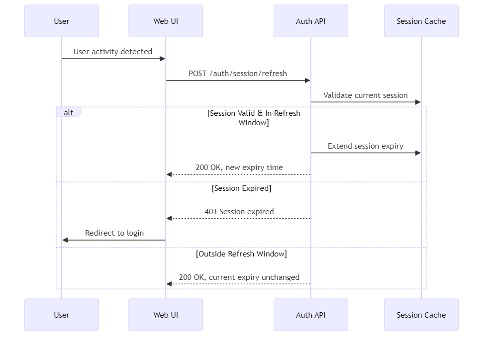

### 4.3.6.4 Session Invalidation Triggers

| Trigger | Action | Audit Event |
|---------|--------|-------------|
| User logout | Invalidate current session | `user.logout` |
| Password change | Invalidate all sessions | `user.password_changed` |
| Password reset | Invalidate all sessions | `user.password_reset` |
| MFA enrollment/reset | Invalidate all sessions | `user.mfa_updated` |
| Admin-initiated | Invalidate specific session | `session.admin_terminated` |
| Account suspension | Invalidate all sessions | `user.suspended` |
| Role change | Invalidate all sessions | `user.role_changed` |

---

## 4.3.7 Account Security Controls

### 4.3.7.1 Failed Login Handling

| Threshold | Action |
|-----------|--------|
| 3 failures | CAPTCHA challenge required |
| 5 failures | Account lockout (15 minutes) |
| 10 failures (cumulative) | Account lockout (1 hour) + admin notification |
| 20 failures (24-hour period) | Account disabled + security team notification |

### 4.3.7.2 Lockout Recovery Flow

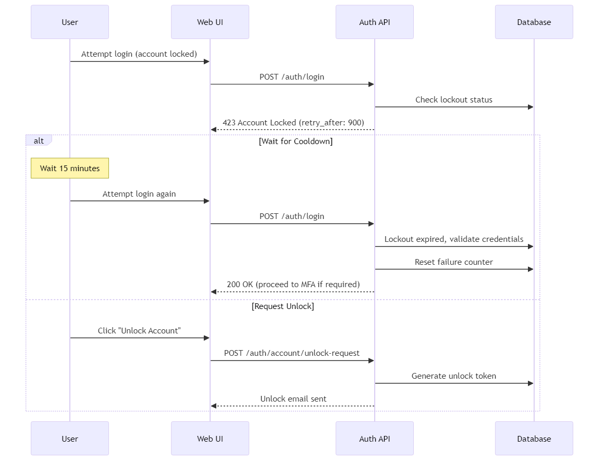

---

## 4.3.8 API Key Authentication

### 4.3.8.1 API Key Lifecycle

| Operation | Access | Audit Event |
|-----------|--------|-------------|
| Create key | PSP Admin, Platform Admin | `api_key.created` |
| View key (masked) | Key owner, PSP Admin | None |
| Rotate key | Key owner, PSP Admin | `api_key.rotated` |
| Revoke key | Key owner, PSP Admin | `api_key.revoked` |
| Delete key | PSP Admin | `api_key.deleted` |

### 4.3.8.2 API Key Creation Flow


### 4.3.8.3 API Key Permission Scoping

| Scope Level | Description |
|-------------|-------------|
| **Tenant-wide** | Access to all brands within PSP tenant (default) |
| **Brand-scoped** | Restricted to specific brand(s) (v1.1 consideration) |
| **Endpoint-scoped** | Restricted to specific API endpoints |

### 4.3.8.4 API Rate Limiting

| Tier | Requests/Minute | Burst Limit | Anomaly Threshold |
|------|-----------------|-------------|-------------------|
| Standard | 100 | 150 | 500% of baseline |
| High-volume | 500 | 750 | 300% of baseline |
| Unlimited | No limit | N/A | 1000% of baseline |

---

## 4.3.9 User Impersonation

### 4.3.9.1 Impersonation Authorization

| Impersonator Role | Target Scope | Session Mode | Time Limit |
|-------------------|--------------|--------------|------------|
| PLATFORM_ADMIN | All users except other Platform Admins | Full access | 30 min (2 hr max) |
| Support Agent (PSP_OPS + support_scope) | Store Users only | Read-only | 30 min (2 hr max) |
| All other roles | Cannot impersonate | N/A | N/A |

### 4.3.9.2 Impersonation Flow


### 4.3.9.3 Impersonation Session Constraints

| Constraint | Specification |
|------------|---------------|
| **Visible Actions** | Target user sees banner "Your account is being accessed by support" |
| **Action Attribution** | All actions show impersonator in audit trail |
| **Prohibited Actions** | Cannot change password, MFA, or security settings of target |
| **Session Inheritance** | Impersonator inherits target's permissions (not elevated) |
| **Concurrent Limit** | One impersonation session per impersonator |

### 4.3.9.4 Impersonation Audit Trail

All impersonation sessions generate the following audit events:

| Event | Data Captured |
|-------|---------------|
| `impersonation.started` | impersonator_id, target_user_id, reason, session_id, timestamp |
| `impersonation.action` | session_id, action_type, resource, timestamp |
| `impersonation.ended` | session_id, end_reason (manual/timeout/hard_limit), timestamp |

---

## 4.3.10 Authentication Flow Diagrams

### 4.3.10.1 Complete Login Flow


### 4.3.10.2 API Authentication Flow

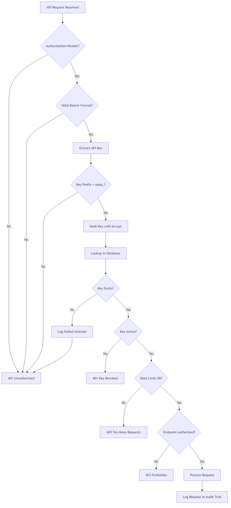

### 4.3.10.3 Session Lifecycle State Machine

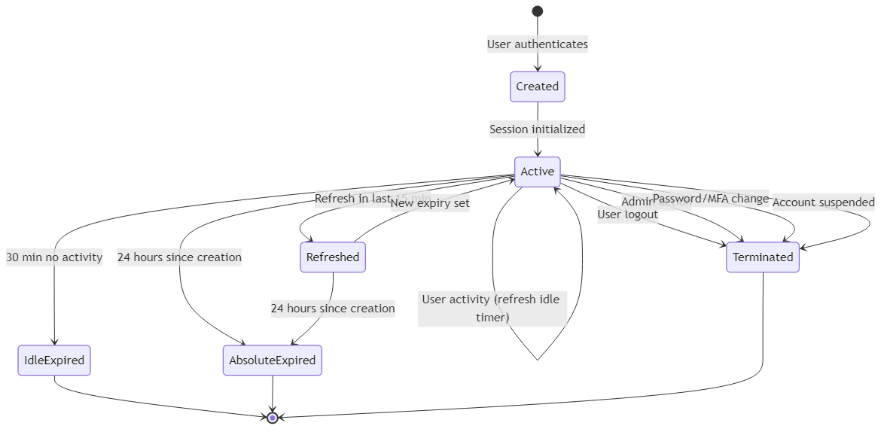

---

## 4.3.11 Security Requirements Summary

### 4.3.11.1 Cryptographic Requirements

| Function | Algorithm | Key Size |
|----------|-----------|----------|
| Password hashing | bcrypt | Cost factor 12 |
| Session tokens | CSPRNG | 256 bits |
| API keys | CSPRNG | 256 bits (64 hex chars) |
| TOTP secrets | CSPRNG | 160 bits |
| TLS | TLS 1.2+ | 256-bit AES minimum |

### 4.3.11.2 Compliance Requirements

| Requirement | Implementation |
|-------------|----------------|
| Audit logging | All authentication events logged immutably |
| Log retention | 7 years per COMPLIANCE retention class |
| Failed attempt tracking | Stored per account with expiration |
| Session termination | Immediate on security-relevant changes |

---

## 4.3.12 Traceability Matrix

| Requirement ID | Description | Source |
|----------------|-------------|--------|
| AUTH-001 | Email + password authentication (v1) | SUPP-003: Locked Inputs |
| AUTH-002 | bcrypt password hashing with cost factor 12 | SUPP-003: Security Requirements |
| AUTH-003 | Password complexity (12+ chars, complexity) | SUPP-003: Authentication |
| AUTH-004 | 90-day password rotation for admin roles | SUPP-003: Authentication |
| AUTH-005 | MFA mandatory for Platform/PSP/Brand Admins | SUPP-003: Authentication |
| AUTH-006 | MFA methods: TOTP and WebAuthn | SUPP-003: Authentication |
| AUTH-007 | 5-failure lockout with 15-min cooldown | SUPP-003: Audit & Compliance |
| AUTH-008 | Impersonation: Platform Admin full, Support read-only | SUPP-003: Impersonation Controls |
| AUTH-009 | Impersonation session 30-min limit (2-hr max) | SUPP-003: Impersonation Controls |
| AUTH-010 | Impersonation audit trail (start/end with reason) | SUPP-003: Impersonation Controls |
| AUTH-011 | API keys hashed, shown only at creation | SUPP-003: API Security |
| AUTH-012 | API key rotation and revocation supported | SUPP-003: API Security |
| AUTH-013 | Rate limits and anomaly detection per API key | SUPP-003: API Security |
| AUTH-014 | Audit log retention 7 years | SUPP-003: Audit & Compliance |

---

## 4.3.13 References

- **Section 4.1**: Persona Matrix (user classes)
- **Section 4.2**: Permission Matrix (RBAC authorization)
- **Section 12.2**: Security Non-Functional Requirements
- **SUPP-003**: Shared Foundations - RBAC and Permissions Matrix

---

*Document Version: 1.0*
*Last Updated: 2026-01-01*
*IEEE 830 Compliant*


---
# 04 - User Personas & RBAC

This section documents all user personas and their role-based access control.

## Contents

| File | Description | Status |
|------|-------------|--------|
| 4.1_Persona_Matrix.md | All 9 personas with goals | Complete |
| 4.2_Permission_Matrix.md | RBAC grid (persona × feature) | Complete |
| 4.3_Authentication_Flows.md | Login, SSO, session management | Not Started |

## Persona Details

Located in `personas/` subfolder:

| Persona | File | Primary Module |
|---------|------|----------------|
| PSP Campaign Manager | PSP_Campaign_Manager.md | PSP Operations |
| PSP Field Operations | PSP_Field_Operations.md | PSP Operations |
| Brand Marketing Manager | Brand_Marketing_Manager.md | Brand Admin |
| Brand Regional Manager | Brand_Regional_Manager.md | Brand Admin |
| Store Manager | Store_Manager.md | Store Portal / Mobile |
| Store Staff | Store_Staff.md | Mobile PWA |
| Platform Admin | Platform_Admin.md | Platform Admin |
| Platform Support | Platform_Support.md | Platform Admin |
| System Integration | System_Integration.md | API Access |

## Source Documents

- SUPP-001 (User Personas)
- SUPP-003 (RBAC Definition)

---
*Section Status: Not Started*


---


---

# Section 5: Shared Foundations Module
# Module Overview: SharedFoundations (L-Series)

| Document Info | Details |
|---------------|---------|
| Module ID | MOD-SHARED |
| Screen Range | L001 - L010 |
| Status | In Development |
| Last Updated | 2025-01-02 |

---

## 1. Module Summary

### Purpose

The SharedFoundations module provides cross-cutting screens and functionality shared across all portals within the PopSystem ecosystem. These screens establish consistent user experiences for authentication, navigation, personalization, and system-wide notifications regardless of which portal a user accesses.

### Scope

- **Universal Authentication**: Single sign-on entry point for all portals
- **Unified Dashboard**: Role-aware landing page with contextual widgets
- **User Profile Management**: Personal settings and preferences
- **System Settings**: Application-wide configuration options
- **Notification Center**: Centralized alert and message management

### Design Principles

1. **Consistency**: Identical look and behavior across all portals
2. **Role-Awareness**: Content adapts based on user permissions
3. **Accessibility**: WCAG 2.1 AA compliance
4. **Responsiveness**: Full mobile and desktop support

---

## 2. Screen Inventory Table

| Screen ID | Screen Name | Route | Priority | Status | Description |
|-----------|-------------|-------|----------|--------|-------------|
| L001 | Universal Login | `/login` | P0 | Complete | SSO authentication with MFA support |
| L002 | Universal Dashboard | `/dashboard` | P0 | Complete | Role-based landing page with widgets |
| L003 | User Profile | `/profile` | P1 | Planned | Personal info and preferences |
| L004 | System Settings | `/settings` | P1 | Planned | Application configuration |
| L005 | Notification Center | `/notifications` | P2 | Planned | Alerts, messages, and history |
| L006 | Reserved | TBD | - | Reserved | Future shared functionality |
| L007 | Reserved | TBD | - | Reserved | Future shared functionality |
| L008 | Reserved | TBD | - | Reserved | Future shared functionality |
| L009 | Reserved | TBD | - | Reserved | Future shared functionality |
| L010 | Reserved | TBD | - | Reserved | Future shared functionality |

---

## 3. Module Dependencies

### Required Services

| Service | Purpose | Criticality |
|---------|---------|-------------|
| Auth Service | User authentication, token management, SSO | Critical |
| User Service | Profile data, preferences, role information | Critical |
| Notification Service | Push notifications, alerts, message history | High |
| Session Service | Session management, timeout handling | Critical |
| Audit Service | Login tracking, security events | Medium |

### External Integrations

| Integration | Screens Affected | Purpose |
|-------------|------------------|---------|
| Azure AD / OAuth 2.0 | L001 | Enterprise SSO |
| TOTP/SMS MFA | L001 | Multi-factor authentication |
| Firebase Cloud Messaging | L005 | Push notifications |

---

## 4. RBAC Summary

### Access Matrix

| Role | L001 Login | L002 Dashboard | L003 Profile | L004 Settings | L005 Notifications |
|------|------------|----------------|--------------|---------------|---------------------|
| SuperAdmin | Full | Full | Full | Full | Full |
| Admin | Full | Full | Full | Limited | Full |
| StoreManager | Full | Full | Full | View Only | Full |
| SalesRep | Full | Role-Scoped | Full | View Only | Full |
| Vendor | Full | Role-Scoped | Limited | None | Full |
| Customer | Full | Role-Scoped | Limited | None | Full |

### Permission Notes

- **Full**: Complete read/write access to all features
- **Limited**: Can modify own data only
- **Role-Scoped**: Dashboard widgets filtered by role permissions
- **View Only**: Read access without modification capability
- **None**: Screen not accessible to this role

---

## 5. Key Integration Points

### Authentication Flow

```
User Request  L001 Login  Auth Service  SSO Provider
                    
              MFA Challenge (if enabled)
                    
              Session Created  L002 Dashboard
```

### Session Management

| Feature | Implementation |
|---------|----------------|
| Session Timeout | 30 minutes idle, 8 hours absolute |
| Token Refresh | Silent refresh via refresh token |
| Concurrent Sessions | Configurable per role (default: 3) |
| Session Termination | Manual logout or admin force-logout |

### Cross-Portal State

- User preferences sync across all portals
- Notification read status shared globally
- Session valid for all portals under same domain

---

## 6. Technical Specifications

| Aspect | Specification |
|--------|---------------|
| Frontend Framework | React 18+ with TypeScript |
| State Management | Redux Toolkit |
| API Protocol | REST with OpenAPI 3.0 spec |
| Authentication | JWT with RS256 signing |
| Real-time | WebSocket for notifications |

---

## 7. Revision History

| Version | Date | Author | Changes |
|---------|------|--------|---------|
| 1.0 | 2025-01-02 | System | Initial module overview created |
| 0.9 | 2024-12-15 | Architecture Team | Draft structure defined |
| 0.8 | 2024-12-01 | Product Team | Screen inventory finalized |

---

## Related Documents

- [L001 Universal Login SRS](./L001_Universal_Login.md)
- [L002 Universal Dashboard SRS](./L002_Universal_Dashboard.md)
- [Authentication Architecture](../08_Architecture/Auth_Architecture.md)
- [RBAC Matrix](../06_Security/RBAC_Matrix.md)


---
# L001 Universal Login Screen - SRS Specification

> **SRS Section**: 5.1.1 | **Screen ID**: L001 | **Version**: 1.0 | **Status**: Draft
> **Module**: SharedFoundations (L-series)
> **Route**: `/login`
> **Source**: [L01_Universal_Login.md](../../../06_Screen_Specs/L01_Universal_Login.md)
> **Last Updated**: 2026-01-01

---

## 1. Screen Overview

### 1.1 Purpose

The Universal Login Screen (L001) serves as the single authentication entry point for all NewPOPSys web portal users. It provides unified credential-based authentication with role-based routing, multi-factor authentication support, SSO integration for enterprise customers, and password recovery functionality.

### 1.2 Access Requirements

| Attribute | Specification |
|-----------|---------------|
| **Authentication** | Unauthenticated access required |
| **Pre-conditions** | User not currently authenticated |
| **Post-conditions** | Authenticated session established, redirect to role-appropriate dashboard |
| **Served Portals** | Brand Admin, Store Portal, PSP Operations, Regional Dashboard |

### 1.3 Screenshot Reference

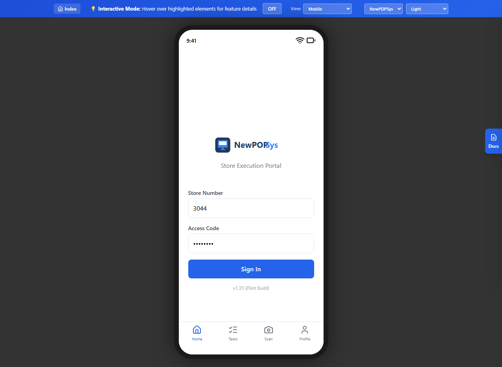

*Figure L001-1: Universal Login Screen - Mobile and Web responsive login interface*

### 1.4 Navigation Path

| Entry Point | Path |
|-------------|------|
| Direct URL | `https://{tenant}.newpopsys.com/login` |
| Session expiry | Automatic redirect from any authenticated route |
| Logout action | Redirect from any portal |
| Bookmark/Deep link | Redirect with return URL parameter |

---

## 2. User Roles & Permissions

### 2.1 Accessible Roles

All system roles may access this screen prior to authentication. Post-authentication routing is determined by role hierarchy.

| Role Enum | Display Name | Post-Login Route |
|-----------|--------------|------------------|
| `PLATFORM_ADMIN` | Platform Admin | `/psp/dashboard` |
| `PSP_ADMIN` | PSP Admin | `/psp/dashboard` |
| `PSP_OPS` | Production Operator / Support Agent | `/psp/orders` |
| `BRAND_ADMIN` | Brand Admin | `/admin/dashboard` |
| `CAMPAIGN_MANAGER` | Campaign Manager | `/admin/dashboard` |
| `REGIONAL_MANAGER` | Regional Manager | `/admin/regional` |
| `STORE_MANAGER` | Store Manager | `/store/dashboard` |
| `STORE_OPERATOR` | Store Operator | `/store/campaigns` |

### 2.2 Role-Based Routing Priority

**REQ-L001-FR-001**: The system SHALL route authenticated users to their primary dashboard based on highest-priority role assignment.

```
Priority Order (highest first):
1. PLATFORM_ADMIN / PSP_ADMIN  /psp/dashboard
2. PSP_OPS  /psp/orders
3. BRAND_ADMIN / CAMPAIGN_MANAGER  /admin/dashboard
4. REGIONAL_MANAGER  /admin/regional
5. STORE_MANAGER  /store/dashboard
6. STORE_OPERATOR  /store/campaigns
```

### 2.3 Multi-Role Handling

**REQ-L001-FR-002**: When a user holds multiple roles across different levels, the system SHALL:
- Use the highest-level role (Tenant > Brand > Store)
- Within the same level, use the highest-permission role
- Display a role selector modal if the user has multiple significant roles

### 2.4 MFA Requirements by Role

| Role | MFA Requirement | Source |
|------|-----------------|--------|
| PLATFORM_ADMIN | **Mandatory** (TOTP/WebAuthn) | RBAC-006 |
| PSP_ADMIN | **Mandatory** (TOTP/WebAuthn) | RBAC-006 |
| BRAND_ADMIN | **Mandatory** (TOTP/WebAuthn) | RBAC-006 |
| PSP_OPS | Recommended (tenant policy) | RBAC-006 |
| REGIONAL_MANAGER | Recommended (tenant policy) | RBAC-006 |
| CAMPAIGN_MANAGER | Optional (brand policy) | RBAC-006 |
| STORE_MANAGER | Optional (brand policy) | RBAC-006 |
| STORE_OPERATOR | Optional (brand policy) | RBAC-006 |

---

## 3. UI Components

### 3.1 Layout Structure

**REQ-L001-UI-001**: The login screen SHALL display a centered card layout with responsive breakpoints.

| Breakpoint | Layout | Max Width |
|------------|--------|-----------|
| Desktop (>1024px) | Centered card with branded background | 420px |
| Tablet (768-1024px) | Centered card, reduced padding | 380px |
| Mobile (<768px) | Full-width, stacked layout | 100% |

### 3.2 Primary Components

| Component ID | Type | Description | Required |
|--------------|------|-------------|----------|
| `logo` | Image | NewPOPSys brand logo (SVG, 120x40px) | Yes |
| `heading` | Text | "Welcome Back" | Yes |
| `subheading` | Text | "Sign in to your account" | Yes |
| `email-input` | Text Field | User email address input | Yes |
| `password-input` | Password Field | Password with visibility toggle | Yes |
| `remember-me` | Checkbox | "Remember me" session extension | Yes |
| `forgot-password-link` | Link | Trigger password reset modal | Yes |
| `login-button` | Primary Button | Submit credentials | Yes |
| `sso-divider` | Divider | "or" separator | Yes |
| `sso-button` | Secondary Button | "Sign in with SSO" | Yes |
| `help-text` | Text | "Need help? Contact your administrator" | Yes |
| `error-alert` | Alert Banner | Authentication error display | Conditional |

### 3.3 Login Form Wireframe


### 3.4 MFA Modal

**REQ-L001-UI-002**: When MFA is required, the system SHALL display a modal dialog for code entry.

> *[Visual component defined in Design System]*


### 3.5 Forgot Password Modal

**REQ-L001-UI-003**: Password reset SHALL be initiated via a modal dialog.

> *[Visual component defined in Design System]*


### 3.6 SSO Domain Entry Modal

**REQ-L001-UI-004**: SSO authentication SHALL prompt for company domain.

> *[Visual component defined in Design System]*


### 3.7 Role Selector Modal

**REQ-L001-UI-005**: For multi-role users, the system SHALL display a role selection modal.

> *[Visual component defined in Design System]*


---

## 4. Data Requirements

### 4.1 Entities Involved

| Entity | Table | Access Mode | Purpose |
|--------|-------|-------------|---------|
| `User` | `users` | Read | Credential validation |
| `Membership` | `memberships` | Read | Role assignment retrieval |
| `Session` | `sessions` (cache) | Write | Session creation |
| `AuditEvent` | `audit_events` | Write | Login event logging |

### 4.2 User Entity Fields

**REQ-L001-DR-001**: The following user fields SHALL be accessed during authentication:

| Field | Type | Purpose |
|-------|------|---------|
| `id` | UUID | User identifier |
| `email` | VARCHAR(255) | Login credential |
| `password_hash` | VARCHAR(255) | bcrypt-hashed password |
| `status` | ENUM | Account status (active/suspended/disabled) |
| `mfa_enabled` | BOOLEAN | MFA enrollment status |
| `mfa_secret` | VARCHAR(255) | TOTP secret (encrypted) |
| `failed_login_count` | INTEGER | Lockout counter |
| `locked_until` | TIMESTAMPTZ | Lockout expiration |
| `is_active` | BOOLEAN | Account active flag |

### 4.3 Membership Entity Fields

**REQ-L001-DR-002**: Role determination SHALL query membership records:

| Field | Type | Purpose |
|-------|------|---------|
| `user_id` | UUID FK | User reference |
| `brand_id` | UUID FK | Brand scope (nullable) |
| `role` | role_enum | Assigned role |
| `region_scope_id` | UUID FK | Regional scope (nullable) |

### 4.4 Session Data Structure

**REQ-L001-DR-003**: The session object SHALL contain:


---

## 5. Business Rules & Validation

### 5.1 Input Validation Rules

**REQ-L001-BR-001**: Email field validation:
| Rule | Requirement | Error Message |
|------|-------------|---------------|
| Required | Field must not be empty | "Email address is required" |
| Format | Must match RFC 5322 email format | "Please enter a valid email address" |
| Max Length | 255 characters | "Email address is too long" |

**REQ-L001-BR-002**: Password field validation:
| Rule | Requirement | Error Message |
|------|-------------|---------------|
| Required | Field must not be empty | "Password is required" |
| Min Length | 8 characters (display validation only) | "Password must be at least 8 characters" |

**REQ-L001-BR-003**: MFA code validation:
| Rule | Requirement | Error Message |
|------|-------------|---------------|
| Required | Field must not be empty | "Verification code is required" |
| Format | Exactly 6 numeric digits | "Please enter a 6-digit code" |

**REQ-L001-BR-004**: SSO domain validation:
| Rule | Requirement | Error Message |
|------|-------------|---------------|
| Required | Field must not be empty | "Company domain is required" |
| Format | Valid domain format | "Please enter a valid domain" |

### 5.2 Authentication Business Rules

**REQ-L001-BR-005**: Account lockout policy:
| Threshold | Action | Duration |
|-----------|--------|----------|
| 3 failures | CAPTCHA challenge required | Until successful CAPTCHA |
| 5 failures | Account lockout | 15 minutes |
| 10 failures (cumulative) | Extended lockout + admin notification | 1 hour |
| 20 failures (24-hour) | Account disabled + security notification | Manual unlock required |

**REQ-L001-BR-006**: Password requirements (for password reset flow):
| Requirement | Specification |
|-------------|---------------|
| Minimum Length | 12 characters |
| Complexity | Uppercase, lowercase, digit, special character |
| Prohibited | Common passwords, username substring, sequential characters |
| History | Cannot reuse last 6-12 passwords (role-dependent) |

**REQ-L001-BR-007**: Session parameters:
| Parameter | Value | Condition |
|-----------|-------|-----------|
| Session Duration | 8 hours | Standard session |
| Session Duration | 30 days | "Remember me" checked |
| Idle Timeout | 30 minutes | All sessions |
| Absolute Timeout | 24 hours | All sessions |
| Concurrent Sessions | 5 maximum | Per user |

### 5.3 MFA Business Rules

**REQ-L001-BR-008**: MFA enforcement:
- Roles with mandatory MFA SHALL be redirected to MFA enrollment if not configured
- TOTP codes valid for +/- 1 period (90-second window)
- "Trust this device" stores device fingerprint for 30 days
- 3 failed MFA attempts triggers account lockout

**REQ-L001-BR-009**: MFA recovery:
- 10 single-use backup codes provided at enrollment
- Backup codes are 16 characters each
- Using backup code invalidates that code permanently

---

## 6. API Integration Points

### 6.1 Authentication Endpoints

**REQ-L001-API-001**: The following API endpoints SHALL be implemented:

| Endpoint | Method | Description | Request | Response |
|----------|--------|-------------|---------|----------|
| `/auth/login` | POST | Primary authentication | `{email, password, remember_me}` | `{session_token}` or `{mfa_required: true}` |
| `/auth/logout` | POST | Terminate session | `{}` | `{success: true}` |
| `/auth/mfa/verify` | POST | Verify MFA code | `{code, trust_device}` | `{session_token}` |
| `/auth/mfa/backup` | POST | Use backup code | `{backup_code}` | `{session_token}` |
| `/auth/password/reset-request` | POST | Request password reset | `{email}` | `{success: true}` |
| `/auth/password/reset` | POST | Set new password | `{token, password}` | `{success: true}` |
| `/auth/sso/init` | POST | Initiate SSO flow | `{domain}` | `{redirect_url}` |
| `/auth/sso/callback` | POST | Handle SSO response | `{assertion}` | `{session_token}` |
| `/auth/session` | GET | Get current session | - | `{session_data}` |
| `/auth/refresh` | POST | Refresh session token | `{}` | `{new_expiry}` |

### 6.2 Request/Response Specifications

**REQ-L001-API-002**: Login request format:
```json
{
  "email": "user@company.com",
  "password": "SecurePassword123!",
  "remember_me": true,
  "device_fingerprint": "abc123..."
}
```

**REQ-L001-API-003**: Successful login response (no MFA):
```json
{
  "success": true,
  "session": {
    "token": "eyJhbGc...",
    "expires_at": "2026-01-02T08:00:00Z",
    "user": {
      "id": "uuid",
      "email": "user@company.com",
      "primary_role": "BRAND_ADMIN",
      "roles": ["BRAND_ADMIN", "CAMPAIGN_MANAGER"]
    },
    "redirect_url": "/admin/dashboard"
  }
}
```

**REQ-L001-API-004**: MFA required response:
```json
{
  "success": true,
  "mfa_required": true,
  "mfa_token": "temp_token_for_mfa_verification",
  "methods": ["totp", "backup_code"]
}
```

### 6.3 Error Response Format

**REQ-L001-API-005**: Error responses SHALL follow structured format:
```json
{
  "success": false,
  "error": {
    "code": "AUTH_INVALID_CREDENTIALS",
    "message": "Invalid email or password",
    "details": null
  }
}
```

---

## 7. State Transitions

### 7.1 Login State Machine

**REQ-L001-ST-001**: The login flow SHALL follow this state machine:


[Diagram - See rendered image above or refer to source document]


### 7.2 Session Lifecycle States

**REQ-L001-ST-002**: Session state transitions:

| State | Triggers | Next States |
|-------|----------|-------------|
| Created | Successful authentication | Active |
| Active | User activity | Active (refresh idle timer) |
| Active | In refresh window + refresh request | Refreshed |
| Refreshed | New expiry set | Active |
| Active | 30 min no activity | IdleExpired |
| Active | 24 hours since creation | AbsoluteExpired |
| Active | User logout | Terminated |
| Active | Password/MFA change | Terminated |
| Active | Admin action | Terminated |
| Active | Account suspended | Terminated |

### 7.3 Password Reset State Machine

**REQ-L001-ST-003**: Password reset flow states:


---

## 8. Error Handling

### 8.1 Error Codes and Messages

**REQ-L001-ERR-001**: Authentication error handling:

| Error Code | HTTP Status | User Message | Internal Log |
|------------|-------------|--------------|--------------|
| `AUTH_INVALID_CREDENTIALS` | 401 | "Invalid email or password" | Log email, IP, timestamp |
| `AUTH_ACCOUNT_LOCKED` | 403 | "Account locked. Please try again in {X} minutes." | Log lockout duration |
| `AUTH_ACCOUNT_DISABLED` | 403 | "Account has been deactivated. Contact your administrator." | Log disabled reason |
| `AUTH_MFA_REQUIRED` | 200 | (Trigger MFA modal) | Log MFA method |
| `AUTH_MFA_INVALID` | 401 | "Invalid verification code" | Log failure count |
| `AUTH_MFA_EXPIRED` | 401 | "Verification code expired. Please try again." | Log code age |
| `AUTH_SSO_FAILED` | 400 | "SSO authentication failed. Please try again." | Log SSO error detail |
| `AUTH_SSO_DOMAIN_NOT_FOUND` | 400 | "SSO is not configured for this domain." | Log domain |
| `AUTH_RATE_LIMITED` | 429 | "Too many attempts. Try again in {X} minutes." | Log attempt count |
| `AUTH_SESSION_EXPIRED` | 401 | "Your session has expired. Please sign in again." | Log session ID |
| `AUTH_PASSWORD_RESET_INVALID` | 400 | "This password reset link is invalid or expired." | Log token status |

### 8.2 Client-Side Validation Errors

**REQ-L001-ERR-002**: Form validation error display:

| Field | Validation | Error Position |
|-------|------------|----------------|
| Email | Invalid format | Below email field |
| Email | Empty | Below email field |
| Password | Empty | Below password field |
| MFA Code | Not 6 digits | Below code input |
| SSO Domain | Invalid format | Below domain field |

### 8.3 Network Error Handling

**REQ-L001-ERR-003**: Network failure handling:

| Scenario | User Message | Retry Behavior |
|----------|--------------|----------------|
| Request timeout | "Request timed out. Please try again." | Automatic retry (1x) |
| Network offline | "No internet connection. Check your network." | Retry on reconnect |
| Server error (5xx) | "Something went wrong. Please try again later." | Retry after 5 seconds |
| Service unavailable | "Service temporarily unavailable. Please try again." | Exponential backoff |

---

## 9. Accessibility Requirements

### 9.1 WCAG 2.1 AA Compliance

**REQ-L001-A11Y-001**: Screen SHALL meet WCAG 2.1 Level AA standards:

| Criterion | Requirement | Implementation |
|-----------|-------------|----------------|
| 1.1.1 Non-text Content | All images have alt text | Logo: `alt="NewPOPSys Logo"` |
| 1.3.1 Info and Relationships | Form fields have associated labels | `<label for="email">` |
| 1.4.3 Contrast (Minimum) | 4.5:1 for normal text, 3:1 for large text | CSS variables with contrast checking |
| 1.4.11 Non-text Contrast | 3:1 for UI components | Button borders, input borders |
| 2.1.1 Keyboard | All functions keyboard accessible | Tab order, Enter to submit |
| 2.4.3 Focus Order | Logical focus sequence | Top-to-bottom, left-to-right |
| 2.4.7 Focus Visible | Clear focus indicator | 2px outline with offset |
| 3.3.1 Error Identification | Errors identified and described | Error messages with field association |
| 3.3.2 Labels or Instructions | Form fields labeled | Visible labels, placeholder text |
| 4.1.2 Name, Role, Value | ARIA roles and states | `aria-invalid`, `aria-describedby` |

### 9.2 Keyboard Navigation

**REQ-L001-A11Y-002**: Keyboard interaction requirements:

| Key | Action |
|-----|--------|
| Tab | Move focus forward through interactive elements |
| Shift+Tab | Move focus backward |
| Enter | Submit form / Activate button |
| Escape | Close modal dialogs |
| Space | Toggle checkbox / Activate button |

### 9.3 Screen Reader Support

**REQ-L001-A11Y-003**: Screen reader announcements:

| Event | Announcement |
|-------|--------------|
| Page load | "NewPOPSys Login. Sign in to your account." |
| Validation error | "Error: {field name} - {error message}" |
| Form submission | "Signing in..." |
| Authentication error | "Error: {error message}" |
| MFA modal open | "Two-factor authentication required. Enter 6-digit code." |
| Successful login | "Sign in successful. Redirecting..." |

### 9.4 ARIA Attributes

**REQ-L001-A11Y-004**: Required ARIA implementations:

```html
<!-- Email field with error -->
<label for="email">Email Address</label>
<input
  id="email"
  type="email"
  aria-required="true"
  aria-invalid="true"
  aria-describedby="email-error"
/>
<span id="email-error" role="alert">Please enter a valid email address</span>

<!-- Password field -->
<label for="password">Password</label>
<input
  id="password"
  type="password"
  aria-required="true"
/>
<button
  type="button"
  aria-label="Show password"
  aria-pressed="false"
>
  [eye icon]
</button>

<!-- Login button with loading state -->
<button
  type="submit"
  aria-busy="true"
  aria-label="Signing in, please wait"
>
  <span class="spinner" aria-hidden="true"></span>
  Signing In...
</button>
```

---

## 10. Acceptance Criteria

### 10.1 Functional Acceptance Criteria

| ID | Criterion | Priority |
|----|-----------|----------|
| AC-L001-01 | Single login page serves all web portals (Brand Admin, Store Portal, PSP Operations, Regional Dashboard) | Must Have |
| AC-L001-02 | Valid email format validation with inline error display | Must Have |
| AC-L001-03 | Password field shows/hides with visibility toggle | Must Have |
| AC-L001-04 | Successful login with valid credentials redirects to role-appropriate dashboard | Must Have |
| AC-L001-05 | Invalid credentials display generic error message (no credential enumeration) | Must Have |
| AC-L001-06 | MFA modal appears when user has MFA enabled | Must Have |
| AC-L001-07 | Valid MFA code completes authentication | Must Have |
| AC-L001-08 | Invalid MFA code shows error and allows retry | Must Have |
| AC-L001-09 | "Trust this device" option bypasses MFA for 30 days | Should Have |
| AC-L001-10 | Backup code authentication works when MFA device unavailable | Must Have |
| AC-L001-11 | SSO option redirects to identity provider for configured domains | Should Have |
| AC-L001-12 | Forgot password flow sends reset email within 60 seconds | Must Have |
| AC-L001-13 | Password reset link expires after 1 hour | Must Have |
| AC-L001-14 | "Remember me" extends session to 30 days | Should Have |
| AC-L001-15 | 5 failed login attempts trigger 15-minute lockout | Must Have |
| AC-L001-16 | Lockout countdown displays remaining time | Should Have |
| AC-L001-17 | Multi-role users see role selector modal | Should Have |
| AC-L001-18 | Session persists across page refreshes | Must Have |
| AC-L001-19 | Logout clears session and redirects to login | Must Have |
| AC-L001-20 | Return URL parameter redirects after authentication | Should Have |

### 10.2 Security Acceptance Criteria

| ID | Criterion | Priority |
|----|-----------|----------|
| AC-L001-SEC-01 | Passwords transmitted over HTTPS only (TLS 1.2+) | Must Have |
| AC-L001-SEC-02 | CSRF token included in login form | Must Have |
| AC-L001-SEC-03 | Session cookie set with HttpOnly, Secure, SameSite=Strict | Must Have |
| AC-L001-SEC-04 | Password hashed with bcrypt (cost factor 12) | Must Have |
| AC-L001-SEC-05 | Rate limiting blocks excessive requests (429 response) | Must Have |
| AC-L001-SEC-06 | Failed login attempts logged with IP address | Must Have |
| AC-L001-SEC-07 | Successful login events logged to audit trail | Must Have |
| AC-L001-SEC-08 | Session ID regenerated on authentication | Must Have |
| AC-L001-SEC-09 | No credential enumeration via error messages | Must Have |
| AC-L001-SEC-10 | Password reset invalidates all active sessions | Must Have |

### 10.3 Performance Acceptance Criteria

| ID | Criterion | Target |
|----|-----------|--------|
| AC-L001-PERF-01 | Page initial load time | < 2 seconds (3G network) |
| AC-L001-PERF-02 | Login API response time | < 500ms (P95) |
| AC-L001-PERF-03 | MFA verification response time | < 300ms (P95) |
| AC-L001-PERF-04 | Session validation response time | < 100ms (P95) |
| AC-L001-PERF-05 | Time to Interactive (TTI) | < 3 seconds |

### 10.4 Accessibility Acceptance Criteria

| ID | Criterion | Priority |
|----|-----------|----------|
| AC-L001-A11Y-01 | Page passes WAVE accessibility checker with no errors | Must Have |
| AC-L001-A11Y-02 | All form fields have visible labels | Must Have |
| AC-L001-A11Y-03 | Color contrast meets WCAG 2.1 AA (4.5:1 normal, 3:1 large) | Must Have |
| AC-L001-A11Y-04 | Complete keyboard navigation without mouse | Must Have |
| AC-L001-A11Y-05 | Screen reader announces form errors | Must Have |
| AC-L001-A11Y-06 | Focus trap works correctly in modals | Must Have |
| AC-L001-A11Y-07 | Escape key closes modal dialogs | Must Have |

---

## 11. Traceability Matrix

| Requirement ID | Description | Source Document | Test Case |
|----------------|-------------|-----------------|-----------|
| REQ-L001-FR-001 | Role-based routing priority | SUPP-003, L01 Screen Spec | TC-L001-001 |
| REQ-L001-FR-002 | Multi-role handling | SUPP-003, L01 Screen Spec | TC-L001-002 |
| REQ-L001-UI-001 | Responsive layout | L01 Screen Spec | TC-L001-010 |
| REQ-L001-UI-002 | MFA modal display | L01 Screen Spec | TC-L001-011 |
| REQ-L001-UI-003 | Password reset modal | L01 Screen Spec | TC-L001-012 |
| REQ-L001-UI-004 | SSO domain entry | L01 Screen Spec | TC-L001-013 |
| REQ-L001-UI-005 | Role selector modal | L01 Screen Spec | TC-L001-014 |
| REQ-L001-DR-001 | User entity fields | 3.1 Database Model | TC-L001-020 |
| REQ-L001-DR-002 | Membership query | 3.1 Database Model | TC-L001-021 |
| REQ-L001-DR-003 | Session data structure | 4.3 Authentication Flows | TC-L001-022 |
| REQ-L001-BR-001 | Email validation | L01 Screen Spec | TC-L001-030 |
| REQ-L001-BR-002 | Password validation | L01 Screen Spec | TC-L001-031 |
| REQ-L001-BR-003 | MFA code validation | L01 Screen Spec | TC-L001-032 |
| REQ-L001-BR-004 | SSO domain validation | L01 Screen Spec | TC-L001-033 |
| REQ-L001-BR-005 | Account lockout policy | 4.3 Authentication Flows | TC-L001-040 |
| REQ-L001-BR-006 | Password requirements | 4.3 Authentication Flows | TC-L001-041 |
| REQ-L001-BR-007 | Session parameters | 4.3 Authentication Flows | TC-L001-042 |
| REQ-L001-BR-008 | MFA enforcement | 4.2 Permission Matrix | TC-L001-043 |
| REQ-L001-BR-009 | MFA recovery | 4.3 Authentication Flows | TC-L001-044 |
| REQ-L001-API-001 | Authentication endpoints | L01 Screen Spec | TC-L001-050 |
| REQ-L001-API-002 | Login request format | 3.4 Integration Architecture | TC-L001-051 |
| REQ-L001-API-003 | Login response format | 3.4 Integration Architecture | TC-L001-052 |
| REQ-L001-API-004 | MFA response format | 3.4 Integration Architecture | TC-L001-053 |
| REQ-L001-API-005 | Error response format | 3.4 Integration Architecture | TC-L001-054 |
| REQ-L001-ST-001 | Login state machine | L01 Screen Spec | TC-L001-060 |
| REQ-L001-ST-002 | Session lifecycle | 4.3 Authentication Flows | TC-L001-061 |
| REQ-L001-ST-003 | Password reset states | 4.3 Authentication Flows | TC-L001-062 |
| REQ-L001-ERR-001 | Error codes | L01 Screen Spec | TC-L001-070 |
| REQ-L001-ERR-002 | Validation errors | L01 Screen Spec | TC-L001-071 |
| REQ-L001-ERR-003 | Network errors | 3.2 Application Architecture | TC-L001-072 |
| REQ-L001-A11Y-001 | WCAG 2.1 AA | Accessibility Standards | TC-L001-080 |
| REQ-L001-A11Y-002 | Keyboard navigation | Accessibility Standards | TC-L001-081 |
| REQ-L001-A11Y-003 | Screen reader support | Accessibility Standards | TC-L001-082 |
| REQ-L001-A11Y-004 | ARIA attributes | Accessibility Standards | TC-L001-083 |

---

## 12. Cross-References

| Reference | Section | Description |
|-----------|---------|-------------|
| 3.1 Database Model | Schema | User, Membership, Session tables |
| 3.2 Application Architecture | Frontend | Next.js App Router implementation |
| 3.3 Technology Stack | Auth | bcrypt, TOTP, WebAuthn specifications |
| 3.4 Integration Architecture | API | Authentication endpoint patterns |
| 4.1 Persona Matrix | Users | User classes accessing this screen |
| 4.2 Permission Matrix | RBAC | Role definitions and MFA requirements |
| 4.3 Authentication Flows | Security | Complete authentication specifications |
| L01 Screen Spec | Source | Original wireframes and specifications |
| SUPP-003 | Foundation | RBAC and Permissions Matrix |

---

## 13. Revision History

| Version | Date | Author | Description |
|---------|------|--------|-------------|
| 1.0 | 2026-01-01 | System | Initial SRS specification |

---

*Document Status: Draft*
*IEEE 830 Compliance: Section 5 - Screen Specifications*
*Last Updated: 2026-01-01*


---
# L002 Universal Dashboard - SRS Specification

> **SRS Section**: 5.1.2 | **Screen ID**: L002 | **Version**: 1.0 | **Status**: Draft
> **Module**: SharedFoundations (L-series)
> **Route**: `/dashboard`
> **Source**: [L02_Universal_Dashboard.md](../../../06_Screen_Specs/L02_Universal_Dashboard.md)
> **Last Updated**: 2026-01-01

---

## 1. Screen Overview

### 1.1 Purpose

The Universal Dashboard (L002) serves as the unified dashboard shell that adapts based on user role and permissions. It provides a consistent layout framework with role-specific widgets, KPIs, quick actions, and navigation while maintaining a cohesive user experience across all portal types (Brand Admin, Store Portal, PSP Operations, Regional Dashboard).

### 1.2 Access Requirements

| Attribute | Specification |
|-----------|---------------|
| **Authentication** | Authenticated access required |
| **Pre-conditions** | Valid session token, assigned role(s) |
| **Post-conditions** | Dashboard loaded with role-appropriate widgets |
| **Served Portals** | Brand Admin, Store Portal, PSP Operations, Regional Dashboard |

### 1.3 Screenshot Reference

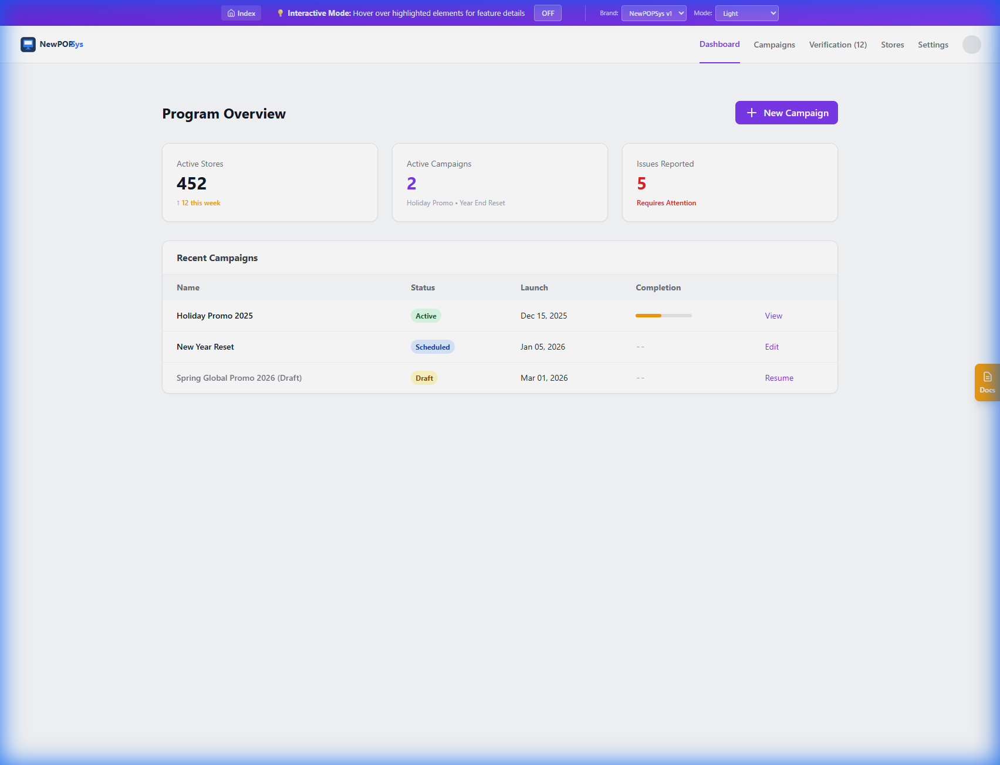

*Figure L002-1: Universal Dashboard - Role-adaptive dashboard with KPIs, widgets, and quick actions*

### 1.4 Navigation Path

| Entry Point | Path |
|-------------|------|
| Post-login redirect | Automatic from L001 based on role |
| Direct URL | `https://{tenant}.newpopsys.com/dashboard` |
| Sidebar navigation | Home/Dashboard link |
| Logo click | Returns to dashboard from any screen |

---

## 2. User Roles & Permissions

### 2.1 Role-Based Dashboard Configurations

| Role Enum | Dashboard Variant | Primary Widgets |
|-----------|------------------|-----------------|
| `PLATFORM_ADMIN` | PSP Admin Dashboard | System health, tenant metrics, support queue |
| `PSP_ADMIN` | PSP Admin Dashboard | Tenant overview, production stats, alerts |
| `PSP_OPS` | Operations Dashboard | Order queue, production status, SLA tracker |
| `BRAND_ADMIN` | Brand Dashboard | Campaign performance, store metrics, inventory |
| `CAMPAIGN_MANAGER` | Campaign Dashboard | Active campaigns, approvals, analytics |
| `REGIONAL_MANAGER` | Regional Dashboard | Store comparison, regional KPIs, compliance |
| `STORE_MANAGER` | Store Dashboard | Daily orders, inventory alerts, staff activity |
| `STORE_OPERATOR` | Store Dashboard (Limited) | Active campaigns, order status, quick actions |

### 2.2 RBAC Permission Matrix

| Permission | PLATFORM_ADMIN | PSP_ADMIN | PSP_OPS | BRAND_ADMIN | CAMPAIGN_MGR | REGIONAL_MGR | STORE_MGR | STORE_OP |
|------------|----------------|-----------|---------|-------------|--------------|--------------|-----------|----------|
| View system widgets | ✓ | ✓ | ✗ | ✗ | ✗ | ✗ | ✗ | ✗ |
| View tenant widgets | ✓ | ✓ | ✓ | ✗ | ✗ | ✗ | ✗ | ✗ |
| View brand widgets | ✓ | ✓ | ✓ | ✓ | ✓ | ✓ | ✗ | ✗ |
| View store widgets | ✓ | ✓ | ✓ | ✓ | ✓ | ✓ | ✓ | ✓ |
| Customize layout | ✓ | ✓ | ✗ | ✓ | ✓ | ✗ | ✓ | ✗ |
| Export dashboard | ✓ | ✓ | ✓ | ✓ | ✓ | ✓ | ✓ | ✗ |
| View all stores | ✓ | ✓ | ✓ | ✓ | ✓ | ✓ | ✗ | ✗ |

### 2.3 Widget Visibility Rules

**REQ-L002-FR-001**: The dashboard SHALL display only widgets authorized for the user's highest-priority role.

**REQ-L002-FR-002**: Users with multiple roles SHALL see a combined widget set with appropriate permission boundaries.

---

## 3. UI Components & Layout

### 3.1 Layout Structure

**REQ-L002-UI-001**: The dashboard SHALL use a responsive grid layout with collapsible sidebar navigation.


### 3.2 Responsive Breakpoints

| Breakpoint | Layout | Sidebar |
|------------|--------|---------|
| Desktop (>1200px) | 4-column grid | Expanded |
| Laptop (992-1200px) | 3-column grid | Collapsed icons |
| Tablet (768-992px) | 2-column grid | Hidden (hamburger) |
| Mobile (<768px) | 1-column stack | Hidden (hamburger) |

### 3.3 Component Specifications

#### 3.3.1 Header Bar

| Element | Description | Actions |
|---------|-------------|---------|
| Logo | Tenant/Brand logo (configurable) | Click  Dashboard home |
| Page Title | "Dashboard" | Static |
| Notifications | Bell icon with badge count | Click  Notification panel |
| User Menu | Avatar + name dropdown | Profile, Settings, Logout |
| Settings | Gear icon | Dashboard customization |

#### 3.3.2 KPI Cards

**REQ-L002-UI-002**: Each KPI card SHALL display:
- Metric label
- Current value (formatted)
- Trend indicator (//)
- Percentage change from comparison period
- Sparkline (optional)

#### 3.3.3 Widget Container

**REQ-L002-UI-003**: Widgets SHALL be:
- Draggable (if user has customize permission)
- Resizable within grid constraints
- Collapsible with state persistence
- Refreshable individually

---

## 4. Data Structures

### 4.1 TypeScript Interfaces


### 4.2 Widget Type Registry

```typescript
interface WidgetTypeDefinition {
  id: string;
  name: string;
  description: string;
  category: WidgetCategory;
  allowedRoles: RoleEnum[];
  defaultSize: GridSize;
  minSize: GridSize;
  maxSize: GridSize;
  configSchema: JSONSchema;
  dataEndpoint: string;
}

type WidgetCategory = 'kpi' | 'chart' | 'list' | 'action' | 'alert' | 'custom';
```

---

## 5. Business Rules

### 5.1 Dashboard Loading Rules

| Rule ID | Description | Priority |
|---------|-------------|----------|
| BR-L002-001 | Dashboard SHALL load default configuration for first-time users | High |
| BR-L002-002 | Custom layouts SHALL be persisted per user per role | High |
| BR-L002-003 | Widget data SHALL refresh on configurable intervals (default: 5 min) | Medium |
| BR-L002-004 | Failed widget loads SHALL NOT block other widgets | High |
| BR-L002-005 | Dashboard SHALL cache widget data for offline resilience | Medium |

### 5.2 Widget Visibility Rules

| Rule ID | Description | Priority |
|---------|-------------|----------|
| BR-L002-006 | Widgets SHALL only display data within user's permission scope | Critical |
| BR-L002-007 | Store-level users SHALL NOT see other store's data | Critical |
| BR-L002-008 | Aggregate widgets SHALL respect data scope boundaries | Critical |
| BR-L002-009 | Hidden widgets SHALL NOT fetch data | Medium |

### 5.3 Customization Rules

| Rule ID | Description | Priority |
|---------|-------------|----------|
| BR-L002-010 | Users without customize permission see admin-defined default layout | High |
| BR-L002-011 | Custom layouts SHALL have a "Reset to Default" option | Medium |
| BR-L002-012 | Widget removal SHALL require confirmation | Low |
| BR-L002-013 | Layout changes SHALL auto-save after 2 seconds of inactivity | Medium |

---

## 6. API Specifications

### 6.1 Get Dashboard Configuration

```
GET /api/v1/dashboard/config
```

**Request Headers:**
```
Authorization: Bearer {token}
X-Tenant-ID: {tenantId}
X-Role-Context: {roleId} (optional, for multi-role users)
```

**Response (200 OK):**
```json
{
  "success": true,
  "data": {
    "id": "dash_abc123",
    "userId": "user_xyz",
    "roleId": "STORE_MANAGER",
    "tenantId": "tenant_123",
    "layout": {
      "columns": 4,
      "rows": 6,
      "gridGap": 16,
      "sidebarExpanded": true,
      "sidebarPosition": "left"
    },
    "widgets": [...],
    "preferences": {
      "theme": "system",
      "compactMode": false,
      "autoRefresh": true,
      "defaultDateRange": "last7days",
      "timezone": "America/New_York"
    },
    "lastModified": "2026-01-01T10:00:00Z"
  }
}
```

**Error Responses:**
| Code | Condition |
|------|-----------|
| 401 | Invalid or expired token |
| 403 | User lacks dashboard access permission |
| 404 | No configuration found (returns default) |

### 6.2 Get Widget Data

```
GET /api/v1/dashboard/widgets/{widgetId}/data
```

**Request Headers:**
```
Authorization: Bearer {token}
X-Tenant-ID: {tenantId}
```

**Query Parameters:**
| Parameter | Type | Required | Description |
|-----------|------|----------|-------------|
| dateFrom | ISO8601 | No | Start date filter |
| dateTo | ISO8601 | No | End date filter |
| storeId | string | No | Store scope filter |
| refresh | boolean | No | Force cache bypass |

**Response (200 OK):**
```json
{
  "success": true,
  "data": {
    "widgetId": "widget_orders_today",
    "widgetType": "kpi",
    "value": 156,
    "previousValue": 142,
    "changePercent": 9.86,
    "trend": "up",
    "sparkline": [120, 135, 128, 142, 156],
    "lastUpdated": "2026-01-01T14:30:00Z",
    "nextRefresh": "2026-01-01T14:35:00Z"
  }
}
```

### 6.3 Save Dashboard Configuration

```
PUT /api/v1/dashboard/config
```

**Request Body:**
```json
{
  "layout": {...},
  "widgets": [...],
  "preferences": {...}
}
```

**Response (200 OK):**
```json
{
  "success": true,
  "data": {
    "id": "dash_abc123",
    "lastModified": "2026-01-01T14:35:00Z"
  }
}
```

### 6.4 Reset Dashboard to Default

```
POST /api/v1/dashboard/config/reset
```

**Response (200 OK):**
```json
{
  "success": true,
  "message": "Dashboard reset to default configuration",
  "data": {...}
}
```

---

## 7. State Transitions

### 7.1 Dashboard State Machine


[Diagram - See rendered image above or refer to source document]


### 7.2 State Definitions

| State | Description | User Actions Available |
|-------|-------------|----------------------|
| LOADING | Initial config fetch | None (spinner shown) |
| READY | All widgets loaded | All interactions |
| REFRESHING | Data refresh in progress | View only |
| PARTIAL | Some widgets failed | View working, retry failed |
| ERROR | Complete failure | Retry, contact support |

### 7.3 Widget-Level States

| State | Visual Indicator | Behavior |
|-------|------------------|----------|
| loading | Skeleton/spinner | No interaction |
| ready | Normal display | Full interaction |
| refreshing | Subtle indicator | View only |
| error | Error message + retry | Retry button |
| stale | Warning badge | Indicates old data |

---

## 8. Error Handling

### 8.1 Error Scenarios

| Error Code | Scenario | User Message | Recovery Action |
|------------|----------|--------------|-----------------|
| ERR-L002-001 | Config load failed | "Unable to load dashboard. Please refresh." | Retry button |
| ERR-L002-002 | Widget data timeout | "Widget data unavailable" | Auto-retry in 30s |
| ERR-L002-003 | Permission denied | "You don't have access to this widget" | Remove widget option |
| ERR-L002-004 | Network offline | "You're offline. Showing cached data." | Auto-reconnect |
| ERR-L002-005 | Save failed | "Unable to save changes. Retrying..." | Auto-retry 3x |
| ERR-L002-006 | Invalid widget config | "Widget configuration error" | Reset widget |

### 8.2 Error Display Patterns

**REQ-L002-ERR-001**: Widget errors SHALL be contained within the widget boundary.

**REQ-L002-ERR-002**: Global errors SHALL display in a dismissible toast notification.

**REQ-L002-ERR-003**: Critical errors SHALL display a full-page error state with recovery options.

### 8.3 Offline Behavior

**REQ-L002-ERR-004**: Dashboard SHALL:
- Cache last successful widget data
- Display stale indicator on cached data
- Queue layout changes for sync when online
- Show offline banner with connection status

---

## 9. Accessibility Requirements

### 9.1 WCAG 2.1 AA Compliance

| Requirement | Implementation |
|-------------|----------------|
| **REQ-L002-A11Y-001** | All widgets navigable via keyboard (Tab/Shift+Tab) |
| **REQ-L002-A11Y-002** | Focus indicators visible with 3:1 contrast ratio |
| **REQ-L002-A11Y-003** | Screen reader announcements for widget state changes |
| **REQ-L002-A11Y-004** | Color not sole means of conveying information |
| **REQ-L002-A11Y-005** | Minimum touch target size 44x44px |
| **REQ-L002-A11Y-006** | Motion/animation respects prefers-reduced-motion |

### 9.2 Keyboard Navigation

| Key | Action |
|-----|--------|
| Tab | Move between widgets |
| Enter | Activate widget/button |
| Space | Toggle collapse/expand |
| Arrow keys | Navigate within widget |
| Escape | Close modal/dropdown |
| Ctrl+R | Refresh current widget |

### 9.3 ARIA Attributes

```html
<section role="region" aria-label="Dashboard">
  <div role="grid" aria-label="Widget grid">
    <article role="gridcell" aria-label="Orders Today">
      <h2 id="widget-title">Orders Today</h2>
      <div aria-describedby="widget-title" aria-live="polite">
        <!-- Widget content -->
      </div>
    </article>
  </div>
</section>
```

---

## 10. Acceptance Criteria

### 10.1 Functional Acceptance

| ID | Criterion | Priority |
|----|-----------|----------|
| AC-L002-001 | Dashboard loads within 3 seconds on standard connection | High |
| AC-L002-002 | Role-appropriate widgets display based on user permissions | Critical |
| AC-L002-003 | Widget layout persists across sessions | High |
| AC-L002-004 | KPI values update in real-time when auto-refresh enabled | Medium |
| AC-L002-005 | Users can drag and resize widgets (if permitted) | Medium |
| AC-L002-006 | Dashboard functions in offline mode with cached data | Medium |
| AC-L002-007 | Error states display clearly without blocking other widgets | High |

### 10.2 Non-Functional Acceptance

| ID | Criterion | Metric |
|----|-----------|--------|
| AC-L002-008 | Initial load performance | < 3s (LCP) |
| AC-L002-009 | Widget refresh performance | < 1s per widget |
| AC-L002-010 | Memory usage | < 100MB heap |
| AC-L002-011 | Accessibility score | 100% Lighthouse |
| AC-L002-012 | Mobile responsiveness | All breakpoints functional |

### 10.3 Security Acceptance

| ID | Criterion | Priority |
|----|-----------|----------|
| AC-L002-013 | Widget data respects RBAC boundaries | Critical |
| AC-L002-014 | No cross-tenant data leakage | Critical |
| AC-L002-015 | Session timeout enforced | High |

---

## 11. Traceability Matrix

| Requirement ID | Source | BRD Ref | FRS Ref | Test Case |
|----------------|--------|---------|---------|-----------|
| REQ-L002-FR-001 | RBAC-006 | BRD-4.2.1 | FRS-5.1.2 | TC-L002-001 |
| REQ-L002-FR-002 | RBAC-007 | BRD-4.2.2 | FRS-5.1.2 | TC-L002-002 |
| REQ-L002-UI-001 | UI-STD-001 | BRD-6.1 | FRS-6.1.2 | TC-L002-010 |
| REQ-L002-UI-002 | UI-STD-002 | BRD-6.2 | FRS-6.1.2 | TC-L002-011 |
| REQ-L002-UI-003 | UI-STD-003 | BRD-6.2 | FRS-6.1.2 | TC-L002-012 |
| REQ-L002-ERR-001 | ERR-STD-001 | BRD-7.1 | FRS-7.1 | TC-L002-020 |
| REQ-L002-A11Y-001 | WCAG-2.1 | BRD-8.1 | FRS-8.1 | TC-L002-030 |

---

## 12. Cross-References

### 12.1 Related Screens

| Screen ID | Relationship | Description |
|-----------|--------------|-------------|
| L001 | Predecessor | Login redirects to dashboard |
| L003 | Navigation | User profile/settings |
| A001-A010 | Navigation | Admin module screens |
| S001-S010 | Navigation | Store module screens |
| P001-P010 | Navigation | PSP module screens |

### 12.2 Related Documents

| Document | Section | Relevance |
|----------|---------|-----------|
| BRD | 4.2 Role-Based Access | Permission definitions |
| FRS | 5.1 SharedFoundations | Module architecture |
| UI Style Guide | 3.0 Components | Widget design patterns |
| API Specification | Auth, Dashboard | Endpoint details |

### 12.3 Dependencies

| System | Dependency Type | Description |
|--------|-----------------|-------------|
| Auth Service | Runtime | Token validation, role context |
| User Service | Runtime | User preferences, profile |
| Analytics Service | Runtime | Widget data aggregation |
| Cache Service | Runtime | Widget data caching |

---

## 13. Revision History

| Version | Date | Author | Changes |
|---------|------|--------|---------|
| 1.0 | 2026-01-01 | System | Initial SRS specification |

---

*Document generated as part of NewPOPSys v1.38 SRS completion initiative.*


---

# Section 6: Store Execution (Mobile PWA) Module
# Module Overview: Store Execution (Mobile PWA)

| Property       | Value                                      |
|----------------|-------------------------------------------|
| Module ID      | MOD-STORE-EXEC                             |
| Module Name    | Store Execution                            |
| Screen Range   | M001 - M010                                |
| Status         | Active / Production Ready                  |
| Last Updated   | 2026-01-02                                 |

---

## 1. Module Summary

### Purpose

The **Store Execution** module (formerly Store Operations) is the primary interface for field personnel and store managers. It is designed as a **Mobile-First PWA** to support offline-capable workflows for campaign material life cycles: from initial receipt verification to installation, photo documentation, and eventual deinstallation.

### Scope

- **Adaptive Workflow Engine**: Automatically advances through Receive -> Install -> Attest based on campaign state.
- **Offline Persistence**: Stores sync queue and local cache to support low-connectivity areas (e.g., store backrooms/basements).
- **Compliance Documentation**: Mandatory photo documentation with metadata (timestamp, GPS, slot ID).
- **Attestation**: Multi-point compliance checklists with digital signature capture.
- **Deinstallation Cycle**: Managed removal of materials at campaign end-of-life.

### Target Users

- **Store Operators**: Primary executors of receipt and installation.
- **Store Managers**: Verification and final attestation sign-off.
- **Brand Admin (Observational)**: Real-time visibility into execution results.

---

## 2. Screen Inventory

| Screen ID | Screen Name               | Route                   | Status   | Priority |
|-----------|---------------------------|-------------------------|----------|----------|
| M001      | Universal Login           | `/login`                | Complete | High     |
| M002      | Store Dashboard           | `/dashboard`            | Complete | High     |
| M003      | Verify Receipt Checklist  | `/tasks/receive`        | Complete | High     |
| M004      | Installation Photos       | `/tasks/install`        | Complete | High     |
| M005      | Compliance Attestation    | `/tasks/attest`         | Complete | High     |
| M006      | Task Navigation / Queue   | `/tasks`                | Complete | Medium   |
| M007      | User Profile              | `/profile`              | Complete | Low      |
| M008      | Photo Retake              | `/tasks/retake`         | Complete | Medium   |
| M009      | Deinstall Checklist       | `/tasks/deinstall`      | Complete | High     |
| M010      | Deinstall Confirmation    | `/tasks/deinstall-confirm`| Complete | High     |

---

## 3. Workflow Visualizations (Wireframes)

### 3.1 Dashboard & Task Entry
The primary hub for users, displaying campaign status and quick stats.

| Mobile | Tablet | Desktop |
| :--- | :--- | :--- |
|  |  |  |

### 3.2 Receipt & Verification Flow
Users verify SKU counts and condition of materials using a checklist approach.

| Mobile | Tablet | Desktop |
| :--- | :--- | :--- |
|  |  |  |

### 3.3 Installation & Photo Documentation
Location-based slots with placement guidance and integrated photo capture.

| Mobile | Tablet | Desktop |
| :--- | :--- | :--- |
|  |  |  |

### 3.4 Compliance Attestation
Final manager sign-off with compliance certification and digital signature.

| Mobile | Tablet | Desktop |
| :--- | :--- | :--- |
|  |  |  |

### 3.5 Deinstallation Cycle
Closing the loop on campaign assets after the promotion ends.

| Mobile | Tablet | Desktop |
| :--- | :--- | :--- |
|  |  |  |

---

## 4. Module Dependencies

### Internal Services
- **Campaign Service**: Determines the active tasks and slot definitions for each store.
- **File/Asset Service**: Manages photo uploads and signature image persistence.
- **Sync Service**: Handles background sync of offline actions.

### External Systems
- **Logistics Integration**: Feeds delivery alerts to trigger the "Receive" workflow.

---

## 5. RBAC Summary

| Permission                  | Store-Op | Store-Manager |
|-----------------------------|:---:|:---:|
| View Dashboard              | Yes | Yes |
| Perform Receipt/Install     | Yes | Yes |
| Capture Documentation       | Yes | Yes |
| **Final Attestation**       | No  | Yes |
| **Trigger Deinstall**       | No  | Yes |

---

## 6. Revision History

| Version | Date       | Author         | Changes                                      |
|---------|------------|----------------|----------------------------------------------|
| 1.0     | 2025-01-01 | System         | Initial boilerplate.                         |
| 1.1     | 2026-01-02 | Antigravity AI | Renamed to Store Execution; Unified M-codes; Integrated multi-device wireframes and deinstallation flow. |


---
# M001 - Login Screen

> **Module**: Store Execution (Mobile PWA)
> **Screen ID**: M001
> **Route**: `/app/login`
> **IEEE 830 Section**: 3.2.1 - User Interface Requirements
> **Version**: 1.1
> **Last Updated**: 2026-01-02

---

## 1. Screen Overview

### 1.1 Purpose

The Login screen provides secure authentication for store personnel accessing the NewPOPSys mobile PWA. It implements a simplified store-centric authentication flow using store number and personal PIN, optimized for retail environments where users may share devices but require individual accountability.

### 1.2 Scope

This specification covers:
- Store number input and validation
- PIN-based authentication
- Session token management
- Rate limiting and security controls
- Offline authentication fallback

### 1.3 Screenshot Reference

 
*Note: Using Dashboard as placeholder; specific login wireframe is defined in L001.*

### 1.4 Source Documents

| Document | Reference |
|----------|-----------|
| Screen Spec | [M01_Login.md](../../../../06_Screen_Specs/M01_Login.md) |
| SUPP Reference | SUPP-036 (Onboarding and Store Foundation) |
| Authentication | [4.3_Authentication_Flows.md](../../04_User_Personas_RBAC/4.3_Authentication_Flows.md) |

---

## 2. User Roles & Permissions

### 2.1 Authorized Roles

| Role | Access Level | Description |
|------|--------------|-------------|
| Store Manager (P07) | Full | Can authenticate and access all store features |
| Store Operator (P08) | Execute | Can authenticate and execute assigned tasks |

### 2.2 Role Requirements

| Req ID | Requirement | Priority |
|--------|-------------|----------|
| REQ-M001-ROLE-001 | System SHALL authenticate users with STORE_MANAGER or STORE_OPERATOR roles | Must |
| REQ-M001-ROLE-002 | System SHALL deny authentication to non-store-level roles | Must |
| REQ-M001-ROLE-003 | System SHALL load user's active store memberships upon successful login | Must |

### 2.3 Permission Constraints

- Only users with active `Membership` records for a store may authenticate
- User must have `is_active = true` status
- Store must have `status = ACTIVE`

---

## 3. UI Components

### 3.1 Component Inventory

| Component ID | Type | Description | Required |
|--------------|------|-------------|----------|
| COMP-M001-001 | Header | Brand logo, "Welcome" text | Yes |
| COMP-M001-002 | Text Input | Store number field (alphanumeric) | Yes |
| COMP-M001-003 | PIN Input | Masked 4-6 digit PIN field | Yes |
| COMP-M001-004 | Button | Primary "Login" button | Yes |
| COMP-M001-005 | Link | "Forgot PIN?" help link | Yes |
| COMP-M001-006 | Text | Error message display area | Conditional |
| COMP-M001-007 | Spinner | Loading indicator during auth | Conditional |

### 3.2 Component Requirements

| Req ID | Requirement | Priority |
|--------|-------------|----------|
| REQ-M001-UI-001 | Store number input SHALL accept alphanumeric characters up to 20 chars | Must |
| REQ-M001-UI-002 | PIN input SHALL mask entered digits with bullets/asterisks | Must |
| REQ-M001-UI-003 | PIN input SHALL accept 4-6 numeric digits | Must |
| REQ-M001-UI-004 | Login button SHALL be disabled until both fields have valid input | Must |
| REQ-M001-UI-005 | Error messages SHALL display below the PIN field in red text | Must |
| REQ-M001-UI-006 | Loading spinner SHALL replace button text during authentication | Should |

### 3.3 Layout Specification


---

## 4. Data Requirements

### 4.1 Input Data

| Field | Type | Validation | Source |
|-------|------|------------|--------|
| `store_number` | String | Required, 1-20 chars, alphanumeric | User input |
| `pin` | String | Required, 4-6 numeric digits | User input |

### 4.2 Output Data

| Field | Type | Description | Destination |
|-------|------|-------------|-------------|
| `access_token` | JWT | Bearer token for API calls | Secure storage |
| `refresh_token` | String | Token for session renewal | Secure storage |
| `user` | Object | User profile data | App state |
| `store` | Object | Active store context | App state |
| `expires_at` | Timestamp | Token expiration time | App state |

### 4.3 Data Model References

| Entity | Fields Used | Access |
|--------|-------------|--------|
| `Store` | id, store_number, name, status, brand_id | Read |
| `User` | id, name, email, is_active, pin_hash | Read |
| `Membership` | user_id, store_id, role | Read |

### 4.4 Data Requirements

| Req ID | Requirement | Priority |
|--------|-------------|----------|
| REQ-M001-DATA-001 | System SHALL validate store_number against active stores | Must |
| REQ-M001-DATA-002 | System SHALL hash PIN before transmission | Must |
| REQ-M001-DATA-003 | System SHALL store tokens in secure keychain/keystore | Must |
| REQ-M001-DATA-004 | System SHALL cache user and store data for offline access | Should |

---

## 5. Business Rules & Validation

### 5.1 Authentication Rules

| Rule ID | Rule | Implementation |
|---------|------|----------------|
| BR-M001-001 | Store number must match an active store | Query `stores` WHERE `store_number` = input AND `status` = 'ACTIVE' |
| BR-M001-002 | User must have membership at the store | Query `memberships` WHERE `store_id` = store.id AND `user_id` = user.id |
| BR-M001-003 | User account must be active | Check `users.is_active = true` |
| BR-M001-004 | PIN must match hashed value | Compare bcrypt hash of input with `users.pin_hash` |

### 5.2 Rate Limiting Rules

| Rule ID | Rule | Parameters |
|---------|------|------------|
| BR-M001-005 | Failed attempts before lockout | 5 attempts |
| BR-M001-006 | Lockout duration | 15 minutes |
| BR-M001-007 | Lockout scope | Per store number + device combination |
| BR-M001-008 | Attempts counter reset | After successful login or lockout expiry |

### 5.3 Session Rules

| Rule ID | Rule | Value |
|---------|------|-------|
| BR-M001-009 | Access token lifetime | 1 hour |
| BR-M001-010 | Refresh token lifetime | 8 hours |
| BR-M001-011 | Session inactivity timeout | 8 hours |
| BR-M001-012 | Maximum concurrent sessions | 1 per user per store |

### 5.4 Validation Requirements

| Req ID | Requirement | Priority |
|--------|-------------|----------|
| REQ-M001-VAL-001 | System SHALL validate store number format before API call | Must |
| REQ-M001-VAL-002 | System SHALL validate PIN is 4-6 numeric digits | Must |
| REQ-M001-VAL-003 | System SHALL enforce rate limiting after 5 failed attempts | Must |
| REQ-M001-VAL-004 | System SHALL block authentication during lockout period | Must |
| REQ-M001-VAL-005 | System SHALL display remaining lockout time to user | Should |

---

## 6. API Integration Points

### 6.1 Authentication Endpoint

| Property | Value |
|----------|-------|
| **Endpoint** | `POST /api/v1/auth/store-login` |
| **Auth Required** | No |
| **Rate Limited** | Yes |

#### Request Schema


#### Response Schema (Success - 200)

```json
{
  "access_token": "eyJhbGciOiJIUzI1NiIs...",
  "refresh_token": "eyJhbGciOiJIUzI1NiIs...",
  "expires_at": "2026-01-01T09:00:00Z",
  "user": {
    "id": "uuid",
    "name": "John Doe",
    "email": "john@store.com",
    "role": "STORE_OPERATOR"
  },
  "store": {
    "id": "uuid",
    "store_number": "STR-001",
    "name": "Downtown Location",
    "brand_id": "uuid"
  }
}
```

#### Error Responses

| Status | Code | Message |
|--------|------|---------|
| 401 | `INVALID_CREDENTIALS` | Invalid store number or PIN |
| 403 | `ACCOUNT_INACTIVE` | User account is deactivated |
| 403 | `STORE_INACTIVE` | Store is not active |
| 429 | `RATE_LIMITED` | Too many attempts. Try again in {minutes} minutes |

### 6.2 Token Refresh Endpoint

| Property | Value |
|----------|-------|
| **Endpoint** | `POST /api/v1/auth/refresh` |
| **Auth Required** | Refresh token |

#### Request Schema

```json
{
  "refresh_token": "eyJhbGciOiJIUzI1NiIs..."
}
```

### 6.3 API Requirements

| Req ID | Requirement | Priority |
|--------|-------------|----------|
| REQ-M001-API-001 | System SHALL send device_id with authentication request | Must |
| REQ-M001-API-002 | System SHALL use HTTPS for all authentication requests | Must |
| REQ-M001-API-003 | System SHALL refresh token before expiration | Must |
| REQ-M001-API-004 | System SHALL retry failed requests with exponential backoff | Should |

---

## 7. State Transitions

### 7.1 Authentication State Machine


[Diagram - See rendered image above or refer to source document]


### 7.2 Rate Limit State Machine


[Diagram - See rendered image above or refer to source document]


### 7.3 State Requirements

| Req ID | Requirement | Priority |
|--------|-------------|----------|
| REQ-M001-STATE-001 | System SHALL persist authentication state across app restarts | Must |
| REQ-M001-STATE-002 | System SHALL clear authentication state on logout | Must |
| REQ-M001-STATE-003 | System SHALL track failed attempt count in local storage | Must |
| REQ-M001-STATE-004 | System SHALL navigate to Dashboard (M002) on successful auth | Must |

---

## 8. Error Handling

### 8.1 Error Categories

| Category | Handling Approach |
|----------|-------------------|
| Validation Errors | Display inline error messages |
| Network Errors | Retry with offline fallback |
| Authentication Errors | Display generic "invalid credentials" |
| Rate Limit Errors | Display lockout countdown |
| Server Errors | Display generic error with retry option |

### 8.2 Error Messages

| Error Code | User Message | Technical Action |
|------------|--------------|------------------|
| `INVALID_CREDENTIALS` | "Invalid store number or PIN. Please try again." | Log attempt, increment counter |
| `ACCOUNT_INACTIVE` | "Your account has been deactivated. Contact your manager." | No retry allowed |
| `STORE_INACTIVE` | "This store is not active. Contact support." | No retry allowed |
| `RATE_LIMITED` | "Too many attempts. Please wait {X} minutes." | Show countdown timer |
| `NETWORK_ERROR` | "Unable to connect. Check your connection and try again." | Retry button |
| `SERVER_ERROR` | "Something went wrong. Please try again." | Retry with backoff |

### 8.3 Offline Authentication

| Req ID | Requirement | Priority |
|--------|-------------|----------|
| REQ-M001-ERR-001 | System SHALL allow offline login if user has cached credentials | Should |
| REQ-M001-ERR-002 | System SHALL validate PIN locally against cached hash when offline | Should |
| REQ-M001-ERR-003 | System SHALL sync with server when connection is restored | Should |
| REQ-M001-ERR-004 | System SHALL NOT display specific error for security (store vs PIN) | Must |

---

## 9. Accessibility Requirements

### 9.1 WCAG 2.1 AA Compliance

| Req ID | Requirement | WCAG Criterion | Priority |
|--------|-------------|----------------|----------|
| REQ-M001-A11Y-001 | All form fields SHALL have associated labels | 1.3.1 Info and Relationships | Must |
| REQ-M001-A11Y-002 | Error messages SHALL be announced by screen readers | 4.1.3 Status Messages | Must |
| REQ-M001-A11Y-003 | Color SHALL NOT be sole indicator of errors | 1.4.1 Use of Color | Must |
| REQ-M001-A11Y-004 | Touch targets SHALL be minimum 44x44 pixels | 2.5.5 Target Size | Must |
| REQ-M001-A11Y-005 | Form SHALL be navigable via keyboard/switch | 2.1.1 Keyboard | Must |

### 9.2 Assistive Technology Support

| Feature | Implementation |
|---------|----------------|
| Screen Reader | ARIA labels on all interactive elements |
| Voice Control | Named buttons and inputs |
| Large Text | Responsive font scaling up to 200% |
| High Contrast | Respects system high contrast mode |

### 9.3 ARIA Implementation

```html
<form role="form" aria-labelledby="login-heading">
  <h1 id="login-heading">Welcome Back</h1>

  <label for="store-number">Store Number</label>
  <input id="store-number" type="text"
         aria-required="true"
         aria-invalid="false"
         aria-describedby="store-error" />
  <span id="store-error" role="alert"></span>

  <label for="pin">PIN</label>
  <input id="pin" type="password" inputmode="numeric"
         aria-required="true"
         aria-invalid="false"
         aria-describedby="pin-error" />
  <span id="pin-error" role="alert"></span>

  <button type="submit" aria-busy="false">Login</button>
</form>
```

---

## 10. Acceptance Criteria

### 10.1 Functional Acceptance

| AC ID | Criterion | Verification Method |
|-------|-----------|---------------------|
| AC-M001-001 | User can enter store number and PIN | Manual test |
| AC-M001-002 | Valid credentials result in successful authentication | API integration test |
| AC-M001-003 | Invalid credentials display error message | Manual test |
| AC-M001-004 | 5 failed attempts trigger 15-minute lockout | Automated test |
| AC-M001-005 | Successful login navigates to Dashboard | E2E test |
| AC-M001-006 | JWT tokens are stored securely | Security audit |
| AC-M001-007 | Session persists across app restarts | Manual test |
| AC-M001-008 | Forgot PIN link is accessible | Manual test |

### 10.2 Non-Functional Acceptance

| AC ID | Criterion | Target | Verification |
|-------|-----------|--------|--------------|
| AC-M001-NF-001 | Authentication response time | < 2 seconds | Performance test |
| AC-M001-NF-002 | Offline login capability | Yes, with cached credentials | Offline test |
| AC-M001-NF-003 | Screen loads within | < 1 second | Lighthouse audit |
| AC-M001-NF-004 | Accessibility score | 100% WCAG 2.1 AA | axe-core audit |

### 10.3 Security Acceptance

| AC ID | Criterion | Verification |
|-------|-----------|--------------|
| AC-M001-SEC-001 | PIN is never logged or stored in plaintext | Code review |
| AC-M001-SEC-002 | Tokens stored in secure keychain/keystore | Security audit |
| AC-M001-SEC-003 | Rate limiting prevents brute force | Penetration test |
| AC-M001-SEC-004 | No credentials in error messages | Manual review |

---

## 11. Traceability Matrix

| Requirement | Source | Test Case |
|-------------|--------|-----------|
| REQ-M001-ROLE-001 | SUPP-003 | TC-M001-001 |
| REQ-M001-UI-002 | SUPP-036 | TC-M001-002 |
| REQ-M001-VAL-003 | Security Policy | TC-M001-003 |
| REQ-M001-API-002 | Security Policy | TC-M001-004 |
| REQ-M001-A11Y-001 | WCAG 2.1 | TC-M001-005 |

---

*Document Status: Complete*
*IEEE 830 Compliance: Section 3.2.1 - User Interface Requirements*


---
# M002 - Dashboard Screen

> **Module**: Store Execution (Mobile PWA)
> **Screen ID**: M002
> **Route**: `/app/dashboard`
> **IEEE 830 Section**: 3.2.1 - User Interface Requirements
> **Version**: 1.1
> **Last Updated**: 2026-01-02

---

## 1. Screen Overview

### 1.1 Purpose

The Dashboard screen serves as the primary hub for store personnel after authentication. It displays active campaigns assigned to the user's store, providing at-a-glance status information and navigation to execution workflows. The dashboard aggregates campaign progress, pending tasks, and urgent notifications.

### 1.2 Scope

This specification covers:
- Campaign card display and filtering
- StorePhase status derivation and display
- Notification badge system
- Quick action navigation
- Data refresh and synchronization

### 1.3 Screenshot Reference

| Mobile View | Tablet View | Desktop View |
| :--- | :--- | :--- |
|  |  |  |

### 1.4 Source Documents

| Document | Reference |
|----------|-----------|
| Screen Spec | [M02_Dashboard.md](../../../../06_Screen_Specs/M02_Dashboard.md) |
| SUPP Reference | SUPP-017 (Campaign Lifecycle) |
| Database Model | [3.1_Database_Model.md](../../03_System_Architecture/3.1_Database_Model.md) |

---

## 2. User Roles & Permissions

### 2.1 Authorized Roles

| Role | Access Level | Visible Campaigns |
|------|--------------|-------------------|
| Store Manager (P07) | Full | All store campaigns |
| Store Operator (P08) | Execute | Assigned campaigns only |

### 2.2 Role Requirements

| Req ID | Requirement | Priority |
|--------|-------------|----------|
| REQ-M002-ROLE-001 | Store Manager SHALL view all campaigns for their store | Must |
| REQ-M002-ROLE-002 | Store Operator SHALL view only campaigns where assigned | Must |
| REQ-M002-ROLE-003 | System SHALL filter campaigns based on user membership scope | Must |

### 2.3 Permission Matrix

| Action | Store Manager | Store Operator |
|--------|---------------|----------------|
| View all campaigns | Yes | No |
| View assigned campaigns | Yes | Yes |
| Access campaign details | Yes | Yes |
| View store analytics | Yes | No |

---

## 3. UI Components

### 3.1 Component Inventory

| Component ID | Type | Description | Required |
|--------------|------|-------------|----------|
| COMP-M002-001 | Header | Store name, notification bell, profile icon | Yes |
| COMP-M002-002 | Notification Badge | Unread count indicator | Conditional |
| COMP-M002-003 | Filter Tabs | Status filter (All, Active, Pending, Complete) | Yes |
| COMP-M002-004 | Campaign Card | Campaign summary with status | Yes |
| COMP-M002-005 | Progress Indicator | Visual progress bar per campaign | Yes |
| COMP-M002-006 | Quick Stats | Summary metrics row | Yes |
| COMP-M002-007 | Pull Refresh | Gesture to refresh data | Yes |
| COMP-M002-008 | Empty State | Display when no campaigns | Conditional |

### 3.2 Component Requirements

| Req ID | Requirement | Priority |
|--------|-------------|----------|
| REQ-M002-UI-001 | Header SHALL display current store name | Must |
| REQ-M002-UI-002 | Notification bell SHALL show unread count badge | Must |
| REQ-M002-UI-003 | Filter tabs SHALL persist selection across sessions | Should |
| REQ-M002-UI-004 | Campaign cards SHALL display StorePhase status | Must |
| REQ-M002-UI-005 | Progress bar SHALL reflect completion percentage | Must |
| REQ-M002-UI-006 | Pull-to-refresh SHALL trigger data sync | Must |

### 3.3 Layout Specification


### 3.4 Campaign Card Detail


---

## 4. Data Requirements

### 4.1 Data Sources

| Entity | Fields | Access |
|--------|--------|--------|
| `StoreAssignment` | id, campaign_id, store_id, status, pinned_layout_id | Read |
| `Campaign` | id, name, brand_id, install_start, install_end, status | Read |
| `Brand` | id, name, logo_url | Read |
| `Store` | id, store_number, name | Read |
| `AssignmentItem` | id, assignment_id, item_status | Read (aggregate) |
| `Notification` | id, user_id, type, read_at | Read |

### 4.2 Computed Fields

| Field | Derivation Logic |
|-------|------------------|
| `store_phase` | Computed from assignment statuses (see 7.1) |
| `completion_percentage` | (completed_items / total_items) * 100 |
| `unread_notifications` | COUNT(notifications WHERE read_at IS NULL) |
| `pending_retakes` | COUNT(photo_uploads WHERE review_status = 'REJECTED') |

### 4.3 Data Requirements

| Req ID | Requirement | Priority |
|--------|-------------|----------|
| REQ-M002-DATA-001 | System SHALL load assignments for current store context | Must |
| REQ-M002-DATA-002 | System SHALL compute StorePhase from assignment data | Must |
| REQ-M002-DATA-003 | System SHALL cache campaign data for offline access | Must |
| REQ-M002-DATA-004 | System SHALL refresh data on pull-to-refresh gesture | Must |
| REQ-M002-DATA-005 | System SHALL update notification count in real-time | Should |

---

## 5. Business Rules & Validation

### 5.1 StorePhase Derivation

| StorePhase | Condition |
|------------|-----------|
| `AWAITING_SHIPMENT` | No shipments created OR all shipments pending |
| `SHIPMENT_IN_TRANSIT` | Any shipment has carrier tracking, not delivered |
| `READY_TO_RECEIVE` | Shipment delivered, receipt not confirmed |
| `RECEIVING` | Some items received, not all |
| `READY_TO_INSTALL` | All items received, installation not started |
| `INSTALLING` | Some items installed, not all |
| `AWAITING_VERIFICATION` | All installed, photos pending review |
| `REWORK_REQUIRED` | Any photo rejected |
| `COMPLETE` | All photos approved, attestation submitted |

### 5.2 Filter Rules

| Filter | Query Condition |
|--------|-----------------|
| All | No filter applied |
| Active | `store_phase NOT IN ('COMPLETE', 'AWAITING_SHIPMENT')` |
| Pending | `store_phase = 'AWAITING_SHIPMENT'` |
| Complete | `store_phase = 'COMPLETE'` |

### 5.3 Notification Types

| Type Code | Display | Priority |
|-----------|---------|----------|
| `SHIPMENT_DELIVERED` | "Shipment delivered" | High |
| `PHOTO_REJECTED` | "Photos need retake" | High |
| `CAMPAIGN_REMINDER` | "Due date approaching" | Medium |
| `ISSUE_RESOLVED` | "Issue resolved" | Low |

### 5.4 Business Rule Requirements

| Req ID | Requirement | Priority |
|--------|-------------|----------|
| REQ-M002-BR-001 | StorePhase SHALL be computed on each data refresh | Must |
| REQ-M002-BR-002 | Campaigns SHALL be sorted by install_end date ascending | Must |
| REQ-M002-BR-003 | Campaigns past install_end SHALL show warning indicator | Should |
| REQ-M002-BR-004 | High priority notifications SHALL show alert badge | Must |

---

## 6. API Integration Points

### 6.1 Get Store Assignments

| Property | Value |
|----------|-------|
| **Endpoint** | `GET /api/v1/stores/{storeId}/assignments` |
| **Auth Required** | Bearer token |
| **Cache** | 5 minutes |

#### Query Parameters

| Parameter | Type | Required | Description |
|-----------|------|----------|-------------|
| `status` | Enum | No | Filter by assignment status |
| `include` | String | No | Comma-separated: campaign,items,photos |

#### Response Schema

```json
{
  "data": [
    {
      "id": "uuid",
      "campaign": {
        "id": "uuid",
        "name": "Summer Promo 2026",
        "brand": { "id": "uuid", "name": "Acme", "logo_url": "..." },
        "install_start": "2026-01-10",
        "install_end": "2026-01-15",
        "status": "PUBLISHED"
      },
      "status": "IN_PROGRESS",
      "store_phase": "INSTALLING",
      "item_counts": {
        "total": 12,
        "received": 8,
        "installed": 5,
        "photos_approved": 3,
        "photos_rejected": 2
      },
      "completion_percentage": 65
    }
  ],
  "meta": {
    "total": 10,
    "unread_notifications": 3
  }
}
```

### 6.2 Get Notifications

| Property | Value |
|----------|-------|
| **Endpoint** | `GET /api/v1/users/me/notifications` |
| **Auth Required** | Bearer token |

#### Query Parameters

| Parameter | Type | Required | Description |
|-----------|------|----------|-------------|
| `unread_only` | Boolean | No | Filter to unread only |
| `limit` | Integer | No | Max notifications (default 20) |

### 6.3 API Requirements

| Req ID | Requirement | Priority |
|--------|-------------|----------|
| REQ-M002-API-001 | System SHALL request assignments with campaign include | Must |
| REQ-M002-API-002 | System SHALL poll notifications every 60 seconds | Should |
| REQ-M002-API-003 | System SHALL implement pagination for large datasets | Must |
| REQ-M002-API-004 | System SHALL use ETag caching for efficiency | Should |

---

## 7. State Transitions

### 7.1 StorePhase State Machine


[Diagram - See rendered image above or refer to source document]


### 7.2 Dashboard View State

```
[LOADING]
    │
    ├──► [ERROR] ──► [RETRY]
    │
    │ Data loaded
    â–¼
[DISPLAYING]
    │
    ├──► [REFRESHING] ──► [DISPLAYING]
    │
    │ User taps campaign
    â–¼
[NAVIGATING]
```

### 7.3 State Requirements

| Req ID | Requirement | Priority |
|--------|-------------|----------|
| REQ-M002-STATE-001 | System SHALL show loading skeleton on initial load | Must |
| REQ-M002-STATE-002 | System SHALL preserve scroll position after refresh | Should |
| REQ-M002-STATE-003 | System SHALL show cached data while refreshing | Must |
| REQ-M002-STATE-004 | System SHALL update notification badge in real-time | Should |

---

## 8. Error Handling

### 8.1 Error Scenarios

| Scenario | User Message | Recovery Action |
|----------|--------------|-----------------|
| Network unavailable | "You're offline. Showing cached data." | Use IndexedDB cache |
| API timeout | "Taking longer than expected..." | Retry with backoff |
| 401 Unauthorized | Redirect to login | Clear tokens, navigate to M001 |
| 500 Server Error | "Something went wrong. Pull to retry." | Retry on pull refresh |
| No campaigns | "No campaigns assigned to your store." | Empty state illustration |

### 8.2 Offline Behavior

| Feature | Offline Support |
|---------|-----------------|
| View campaigns | Yes, from cache |
| View progress | Yes, from cache |
| Navigate to tasks | Yes |
| Pull to refresh | Queued until online |
| Notification count | Cached value |

### 8.3 Error Requirements

| Req ID | Requirement | Priority |
|--------|-------------|----------|
| REQ-M002-ERR-001 | System SHALL display cached data when offline | Must |
| REQ-M002-ERR-002 | System SHALL show offline indicator in header | Must |
| REQ-M002-ERR-003 | System SHALL queue refresh requests when offline | Must |
| REQ-M002-ERR-004 | System SHALL auto-refresh when connection restored | Should |

---

## 9. Accessibility Requirements

### 9.1 WCAG 2.1 AA Compliance

| Req ID | Requirement | WCAG Criterion | Priority |
|--------|-------------|----------------|----------|
| REQ-M002-A11Y-001 | Campaign cards SHALL be focusable and activatable | 2.1.1 Keyboard | Must |
| REQ-M002-A11Y-002 | Progress SHALL be announced as percentage | 4.1.2 Name, Role, Value | Must |
| REQ-M002-A11Y-003 | Status badges SHALL have text alternatives | 1.1.1 Non-text Content | Must |
| REQ-M002-A11Y-004 | Pull refresh SHALL have keyboard alternative | 2.1.1 Keyboard | Must |
| REQ-M002-A11Y-005 | Filter tabs SHALL indicate selected state | 4.1.2 Name, Role, Value | Must |

### 9.2 Screen Reader Announcements

| Element | Announcement |
|---------|--------------|
| Campaign Card | "Summer Promo 2026, 65 percent complete, status installing, due January 15th" |
| Notification Badge | "3 unread notifications" |
| Refresh Complete | "Dashboard refreshed, 10 campaigns loaded" |
| Empty State | "No campaigns assigned to your store" |

### 9.3 ARIA Implementation

```html
<section aria-label="Campaign List" role="list">
  <article role="listitem" tabindex="0"
           aria-label="Summer Promo 2026, 65% complete">
    <h2>Summer Promo 2026</h2>
    <div role="progressbar" aria-valuenow="65"
         aria-valuemin="0" aria-valuemax="100">
      65%
    </div>
    <span class="status" aria-label="Status: Installing">
      INSTALLING
    </span>
  </article>
</section>
```

---

## 10. Acceptance Criteria

### 10.1 Functional Acceptance

| AC ID | Criterion | Verification Method |
|-------|-----------|---------------------|
| AC-M002-001 | Dashboard displays all campaigns for store | API integration test |
| AC-M002-002 | Filter tabs correctly filter campaign list | Manual test |
| AC-M002-003 | StorePhase accurately reflects assignment state | Unit test |
| AC-M002-004 | Notification badge shows unread count | Manual test |
| AC-M002-005 | Tapping campaign navigates to detail screen | E2E test |
| AC-M002-006 | Pull-to-refresh updates data | Manual test |
| AC-M002-007 | Quick stats show correct counts | Automated test |
| AC-M002-008 | Campaign cards show progress percentage | Manual test |

### 10.2 Non-Functional Acceptance

| AC ID | Criterion | Target | Verification |
|-------|-----------|--------|--------------|
| AC-M002-NF-001 | Initial load time | < 2 seconds | Performance test |
| AC-M002-NF-002 | Refresh time | < 1 second | Performance test |
| AC-M002-NF-003 | Offline data available | Within 100ms | Offline test |
| AC-M002-NF-004 | Smooth scrolling | 60 FPS | Frame rate test |

### 10.3 Edge Cases

| AC ID | Criterion | Verification |
|-------|-----------|--------------|
| AC-M002-EC-001 | Handle 100+ campaigns without performance degradation | Load test |
| AC-M002-EC-002 | Handle 0 campaigns with empty state | Manual test |
| AC-M002-EC-003 | Handle campaign with missing brand data | Error handling test |
| AC-M002-EC-004 | Handle stale cache gracefully | Cache invalidation test |

---

## 11. Traceability Matrix

| Requirement | Source | Test Case |
|-------------|--------|-----------|
| REQ-M002-ROLE-001 | SUPP-003 | TC-M002-001 |
| REQ-M002-DATA-002 | SUPP-017 | TC-M002-002 |
| REQ-M002-BR-001 | SUPP-017 | TC-M002-003 |
| REQ-M002-API-001 | API Spec | TC-M002-004 |
| REQ-M002-A11Y-001 | WCAG 2.1 | TC-M002-005 |

---

*Document Status: Complete*
*IEEE 830 Compliance: Section 3.2.1 - User Interface Requirements*


---
# M003 - Verify Receipt Checklist

> **Module**: Store Execution (Mobile PWA)
> **Screen ID**: M003
> **Route**: `/app/campaign/:id/receive`
> **IEEE 830 Section**: 3.2.1 - User Interface Requirements
> **Version**: 1.1
> **Last Updated**: 2026-01-02

---

## 1. Screen Overview

### 1.1 Purpose

The Verify Receipt Checklist screen enables store personnel to verify and document the receipt of campaign materials. Users systematically confirm each item received, report discrepancies (missing, damaged, wrong items), and create issue requests when problems are identified. This screen is critical for inventory accuracy and triggering fulfillment issue resolution workflows.

### 1.2 Scope

This specification covers:
- Item checklist verification workflow
- Issue reporting with quantity and reason
- Partial receipt handling
- Issue request creation
- Receipt confirmation attestation

### 1.3 Screenshot Reference

| Mobile View | Tablet View | Desktop View |
| :--- | :--- | :--- |
|  |  |  |

### 1.4 Source Documents

| Document | Reference |
|----------|-----------|
| Screen Spec | [M03_Receipt_Survey.md](../../../../06_Screen_Specs/M03_Receipt_Survey.md) |
| SUPP Reference | SUPP-020 (Issues and Reorders), SUPP-037 (Store Surveys) |
| Database Model | [3.1_Database_Model.md](../../03_System_Architecture/3.1_Database_Model.md) |

---

## 2. User Roles & Permissions

### 2.1 Authorized Roles

| Role | Access Level | Capabilities |
|------|--------------|--------------|
| Store Manager (P07) | Full | Receive, report issues, approve replacements |
| Store Operator (P08) | Execute | Receive, report issues (approval required) |

### 2.2 Role Requirements

| Req ID | Requirement | Priority |
|--------|-------------|----------|
| REQ-M003-ROLE-001 | Store Manager SHALL receive items and approve replacement requests | Must |
| REQ-M003-ROLE-002 | Store Operator SHALL receive items and submit replacement requests | Must |
| REQ-M003-ROLE-003 | Replacement requests from Store Operator SHALL require Store Manager approval | Must |

### 2.3 Approval Workflow

| Action | Store Manager | Store Operator |
|--------|---------------|----------------|
| Confirm item received | Direct | Direct |
| Report issue | Direct | Direct |
| Submit replacement request | Direct | Requires approval |
| Approve replacement | Yes | No |

---

## 3. UI Components

### 3.1 Component Inventory

| Component ID | Type | Description | Required |
|--------------|------|-------------|----------|
| COMP-M003-001 | Header | Campaign name, back button | Yes |
| COMP-M003-002 | Progress Bar | Items verified / total | Yes |
| COMP-M003-003 | Item Card | Individual item with checkbox | Yes |
| COMP-M003-004 | Checkbox | Received confirmation | Yes |
| COMP-M003-005 | Issue Button | Report problem icon | Yes |
| COMP-M003-006 | Issue Modal | Issue type, quantity, notes | Conditional |
| COMP-M003-007 | Summary Panel | Verified/pending counts | Yes |
| COMP-M003-008 | Complete Button | Confirm all received | Yes |

### 3.2 Component Requirements

| Req ID | Requirement | Priority |
|--------|-------------|----------|
| REQ-M003-UI-001 | Item list SHALL display all expected items from kit | Must |
| REQ-M003-UI-002 | Each item SHALL show SKU, name, expected quantity | Must |
| REQ-M003-UI-003 | Checkbox SHALL toggle received status | Must |
| REQ-M003-UI-004 | Issue button SHALL open issue modal | Must |
| REQ-M003-UI-005 | Progress bar SHALL update as items are checked | Must |
| REQ-M003-UI-006 | Complete button SHALL be disabled until all items addressed | Must |

### 3.3 Layout Specification


### 3.4 Issue Modal Layout


---

## 4. Data Requirements

### 4.1 Data Sources

| Entity | Fields | Access |
|--------|--------|--------|
| `StoreAssignment` | id, campaign_id, store_id, status | Read |
| `AssignmentItem` | id, kit_item_id, received_qty, item_status | Read/Write |
| `KitItem` | id, sku, name, quantity | Read |
| `IssueRequest` | id, type, quantity, notes, status | Write |
| `IssueLine` | id, issue_request_id, assignment_item_id, quantity | Write |
| `ReceiveVerification` | id, assignment_id, verified_at, verified_by | Write |

### 4.2 Issue Types Enumeration

| Type | Code | Description |
|------|------|-------------|
| Missing | `MISSING` | Item not in shipment |
| Damaged | `DAMAGED` | Item received but damaged |
| Wrong Item | `WRONG_ITEM` | Different item than expected |
| Quantity Short | `QUANTITY_SHORT` | Fewer items than expected |

### 4.3 Data Requirements

| Req ID | Requirement | Priority |
|--------|-------------|----------|
| REQ-M003-DATA-001 | System SHALL load all assignment items for the campaign | Must |
| REQ-M003-DATA-002 | System SHALL track received quantity per item | Must |
| REQ-M003-DATA-003 | System SHALL create IssueRequest for reported problems | Must |
| REQ-M003-DATA-004 | System SHALL persist partial progress locally | Must |
| REQ-M003-DATA-005 | System SHALL record ReceiveVerification on completion | Must |

---

## 5. Business Rules & Validation

### 5.1 Receipt Validation Rules

| Rule ID | Rule | Validation |
|---------|------|------------|
| BR-M003-001 | Received quantity cannot exceed expected quantity | `received_qty <= kit_item.quantity` |
| BR-M003-002 | Issue quantity cannot exceed expected quantity | `issue_qty <= kit_item.quantity` |
| BR-M003-003 | Received + Issue quantities must account for expected | `received_qty + issue_qty == expected_qty` OR not complete |
| BR-M003-004 | All items must be addressed before completion | No items with `received_qty = 0 AND no issue` |

### 5.2 Issue Request Rules

| Rule ID | Rule | Implementation |
|---------|------|----------------|
| BR-M003-005 | Issue creates IssueRequest with status OPEN | Insert into `issue_requests` |
| BR-M003-006 | Store Operator issues require approval | Set `requires_approval = true` |
| BR-M003-007 | Duplicate issues for same item not allowed | Check existing open issues |
| BR-M003-008 | Issue notes required for WRONG_ITEM type | Validate notes.length > 0 |

### 5.3 Completion Rules

| Rule ID | Rule | Effect |
|---------|------|--------|
| BR-M003-009 | Completion creates ReceiveVerification record | Insert with timestamp and user |
| BR-M003-010 | Completion updates StoreAssignment status | Set to `READY_TO_INSTALL` |
| BR-M003-011 | Partial receipt allowed with issues | Can complete with open issues |
| BR-M003-012 | Re-receiving after completion requires Store Manager | Reopen workflow |

### 5.4 Validation Requirements

| Req ID | Requirement | Priority |
|--------|-------------|----------|
| REQ-M003-VAL-001 | System SHALL prevent received quantity exceeding expected | Must |
| REQ-M003-VAL-002 | System SHALL require issue type selection | Must |
| REQ-M003-VAL-003 | System SHALL require notes for WRONG_ITEM issues | Must |
| REQ-M003-VAL-004 | System SHALL validate all items addressed before completion | Must |

---

## 6. API Integration Points

### 6.1 Get Assignment Items

| Property | Value |
|----------|-------|
| **Endpoint** | `GET /api/v1/assignments/{assignmentId}/items` |
| **Auth Required** | Bearer token |

#### Response Schema

```json
{
  "data": [
    {
      "id": "uuid",
      "kit_item": {
        "id": "uuid",
        "sku": "POS-001",
        "name": "Window Poster (24x36)",
        "quantity": 2,
        "photo_rule_id": "uuid"
      },
      "received_qty": 2,
      "item_status": "RECEIVED",
      "has_open_issue": false
    }
  ]
}
```

### 6.2 Update Item Receipt

| Property | Value |
|----------|-------|
| **Endpoint** | `PATCH /api/v1/assignment-items/{itemId}/receive` |
| **Auth Required** | Bearer token |

#### Request Schema

```json
{
  "received_qty": 2
}
```

### 6.3 Create Issue Request

| Property | Value |
|----------|-------|
| **Endpoint** | `POST /api/v1/issue-requests` |
| **Auth Required** | Bearer token |

#### Request Schema

```json
{
  "assignment_id": "uuid",
  "lines": [
    {
      "assignment_item_id": "uuid",
      "issue_type": "DAMAGED",
      "quantity": 1,
      "notes": "Box was crushed during shipping"
    }
  ]
}
```

### 6.4 Complete Receiving

| Property | Value |
|----------|-------|
| **Endpoint** | `POST /api/v1/assignments/{assignmentId}/receive/complete` |
| **Auth Required** | Bearer token |

#### Request Schema

```json
{
  "attestation": true,
  "notes": "All items verified"
}
```

### 6.5 API Requirements

| Req ID | Requirement | Priority |
|--------|-------------|----------|
| REQ-M003-API-001 | System SHALL use optimistic updates for checkbox toggles | Should |
| REQ-M003-API-002 | System SHALL batch issue creation for multiple items | Should |
| REQ-M003-API-003 | System SHALL support offline queue for receipt updates | Must |
| REQ-M003-API-004 | System SHALL sync when connection restored | Must |

---

## 7. State Transitions

### 7.1 AssignmentItem.item_status Transitions

```
[NOT_RECEIVED]
      │
      ├──► [PARTIAL_RECEIVED] ──► [RECEIVED]
      │
      └──► [RECEIVED]
      │
      └──► [ISSUE_REPORTED]
```

### 7.2 StoreAssignment Status Transitions

```
[READY] ──► [RECEIVING] ──► [READY_TO_INSTALL]
                │
                └──► [RECEIVING] (partial, can re-enter)
```

### 7.3 IssueRequest Status Transitions

```
[OPEN]
   │
   ├──► [TRIAGED] ──► [AWAITING_APPROVAL]
   │                         │
   │                         ├──► [APPROVED] ──► [IN_FULFILLMENT]
   │                         │
   │                         └──► [DENIED]
   │
   └──► [RESOLVED] (if issue was mistake)
```

### 7.4 State Requirements

| Req ID | Requirement | Priority |
|--------|-------------|----------|
| REQ-M003-STATE-001 | System SHALL track item_status per AssignmentItem | Must |
| REQ-M003-STATE-002 | System SHALL update assignment status on completion | Must |
| REQ-M003-STATE-003 | System SHALL allow re-entry to receiving screen | Should |
| REQ-M003-STATE-004 | System SHALL preserve progress on navigation away | Must |

---

## 8. Error Handling

### 8.1 Error Scenarios

| Scenario | User Message | Recovery Action |
|----------|--------------|-----------------|
| Network unavailable | "Saved locally. Will sync when online." | Queue in IndexedDB |
| Sync conflict | "Item updated elsewhere. Refresh to see changes." | Reload data |
| Issue creation failed | "Couldn't report issue. Try again." | Retry with button |
| Completion failed | "Couldn't complete. Please try again." | Retry |
| Session expired | Redirect to login | Re-authenticate |

### 8.2 Offline Support

| Action | Offline Behavior |
|--------|------------------|
| View items | From cache |
| Toggle received | Queued locally |
| Report issue | Queued locally |
| Complete receiving | Queued locally |

### 8.3 Error Requirements

| Req ID | Requirement | Priority |
|--------|-------------|----------|
| REQ-M003-ERR-001 | System SHALL queue all updates when offline | Must |
| REQ-M003-ERR-002 | System SHALL show sync status indicator | Must |
| REQ-M003-ERR-003 | System SHALL retry failed syncs with exponential backoff | Must |
| REQ-M003-ERR-004 | System SHALL handle conflict resolution gracefully | Should |

---

## 9. Accessibility Requirements

### 9.1 WCAG 2.1 AA Compliance

| Req ID | Requirement | WCAG Criterion | Priority |
|--------|-------------|----------------|----------|
| REQ-M003-A11Y-001 | Checkboxes SHALL have accessible labels | 1.3.1 Info and Relationships | Must |
| REQ-M003-A11Y-002 | Progress SHALL be announced on change | 4.1.3 Status Messages | Must |
| REQ-M003-A11Y-003 | Issue modal SHALL trap focus | 2.4.3 Focus Order | Must |
| REQ-M003-A11Y-004 | Issue type selection SHALL use radio group | 1.3.1 Info and Relationships | Must |
| REQ-M003-A11Y-005 | Quantity stepper SHALL be keyboard accessible | 2.1.1 Keyboard | Must |

### 9.2 Screen Reader Announcements

| Element | Announcement |
|---------|--------------|
| Item checked | "Window Poster verified, 2 of 2 received" |
| Issue reported | "Issue reported for Counter Mat, 1 damaged" |
| Progress update | "8 of 12 items verified" |
| Completion | "Receiving complete, 12 items verified, 1 issue reported" |

### 9.3 ARIA Implementation

```html
<form role="form" aria-label="Receipt verification">
  <div role="progressbar" aria-valuenow="8"
       aria-valuemin="0" aria-valuemax="12">
    8 of 12 items verified
  </div>

  <fieldset>
    <legend class="sr-only">Item list</legend>
    <div role="group" aria-label="Window Poster (24x36)">
      <input type="checkbox" id="item-1"
             aria-describedby="item-1-desc" />
      <label for="item-1">Window Poster (24x36)</label>
      <span id="item-1-desc">SKU: POS-001, Quantity: 2</span>
    </div>
  </fieldset>
</form>
```

---

## 10. Acceptance Criteria

### 10.1 Functional Acceptance

| AC ID | Criterion | Verification Method |
|-------|-----------|---------------------|
| AC-M003-001 | Screen displays all expected items for assignment | API integration test |
| AC-M003-002 | Checkbox toggles received status | Manual test |
| AC-M003-003 | Issue modal captures type, quantity, notes | Manual test |
| AC-M003-004 | Issue creates IssueRequest record | API test |
| AC-M003-005 | Progress bar updates as items are verified | Manual test |
| AC-M003-006 | Complete button disabled until all items addressed | E2E test |
| AC-M003-007 | Completion creates ReceiveVerification record | API test |
| AC-M003-008 | Partial progress persists across sessions | Manual test |

### 10.2 Non-Functional Acceptance

| AC ID | Criterion | Target | Verification |
|-------|-----------|--------|--------------|
| AC-M003-NF-001 | Checkbox toggle response | < 100ms | Performance test |
| AC-M003-NF-002 | Offline data persistence | 100% | Offline test |
| AC-M003-NF-003 | Sync after reconnection | < 10 seconds | Network test |
| AC-M003-NF-004 | Handle 50+ items smoothly | 60 FPS | Performance test |

### 10.3 Edge Cases

| AC ID | Criterion | Verification |
|-------|-----------|--------------|
| AC-M003-EC-001 | Handle item with quantity 0 | Edge case test |
| AC-M003-EC-002 | Handle duplicate issue report attempt | Validation test |
| AC-M003-EC-003 | Handle receiving already completed assignment | State test |
| AC-M003-EC-004 | Handle sync conflict between devices | Conflict test |

---

## 11. Traceability Matrix

| Requirement | Source | Test Case |
|-------------|--------|-----------|
| REQ-M003-ROLE-003 | SUPP-003 | TC-M003-001 |
| REQ-M003-DATA-003 | SUPP-020 | TC-M003-002 |
| REQ-M003-VAL-003 | SUPP-020 | TC-M003-003 |
| REQ-M003-API-003 | Offline Requirements | TC-M003-004 |
| REQ-M003-A11Y-001 | WCAG 2.1 | TC-M003-005 |

---

*Document Status: Complete*
*IEEE 830 Compliance: Section 3.2.1 - User Interface Requirements*


---
# M004 - Installation Photos

> **Module**: Store Execution (Mobile PWA)
> **Screen ID**: M004
> **Route**: `/app/campaign/:id/install`
> **IEEE 830 Section**: 3.2.1 - User Interface Requirements
> **Version**: 1.1
> **Last Updated**: 2026-01-02

---

## 1. Screen Overview

### 1.1 Purpose

The Installation Photos screen guides store personnel through the physical installation of POP materials at designated locations within the store. Users navigate a location-based checklist, viewing where each item should be placed and capturing proof photos. The screen supports the store's layout with slot assignments and ghost image overlays for precise placement.

### 1.2 Scope

This specification covers:
- Location slot accordion navigation
- Item placement guidance with ghost images
- Pre-install condition verification
- Photo capture workflow integration
- Auto-save progress with debounce
- Installation completion tracking

### 1.3 Screenshot Reference

| Mobile View | Tablet View | Desktop View |
| :--- | :--- | :--- |
|  |  |  |

### 1.4 Source Documents

| Document | Reference |
|----------|-----------|
| Screen Spec | [M04_Install_Survey.md](../../../../06_Screen_Specs/M04_Install_Survey.md) |
| SUPP Reference | SUPP-037 (Store Surveys), SUPP-018 (Photo Review) |
| Database Model | [3.1_Database_Model.md](../../03_System_Architecture/3.1_Database_Model.md) |

---

## 2. User Roles & Permissions

### 2.1 Authorized Roles

| Role | Access Level | Capabilities |
|------|--------------|--------------|
| Store Manager (P07) | Full | Install items, capture photos, complete survey |
| Store Operator (P08) | Execute | Install items, capture photos, complete survey |

### 2.2 Role Requirements

| Req ID | Requirement | Priority |
|--------|-------------|----------|
| REQ-M004-ROLE-001 | Both Store Manager and Store Operator SHALL execute installations | Must |
| REQ-M004-ROLE-002 | System SHALL track which user completes each installation | Must |
| REQ-M004-ROLE-003 | System SHALL allow handoff between users during installation | Should |

### 2.3 Permission Matrix

| Action | Store Manager | Store Operator |
|--------|---------------|----------------|
| View install survey | Yes | Yes |
| Mark item installed | Yes | Yes |
| Capture proof photos | Yes | Yes |
| Complete installation | Yes | Yes |
| Skip location | Yes | No |

---

## 3. UI Components

### 3.1 Component Inventory

| Component ID | Type | Description | Required |
|--------------|------|-------------|----------|
| COMP-M004-001 | Header | Campaign name, progress, back button | Yes |
| COMP-M004-002 | Progress Ring | Overall completion percentage | Yes |
| COMP-M004-003 | Location Accordion | Expandable location slots | Yes |
| COMP-M004-004 | Item Card | Item details within location | Yes |
| COMP-M004-005 | Ghost Image | Placement guide overlay | Conditional |
| COMP-M004-006 | Condition Checklist | Pre-install verification | Conditional |
| COMP-M004-007 | Photo Button | Launch camera capture | Yes |
| COMP-M004-008 | Status Badge | Item installation status | Yes |
| COMP-M004-009 | Complete Button | Finish installation | Yes |

### 3.2 Component Requirements

| Req ID | Requirement | Priority |
|--------|-------------|----------|
| REQ-M004-UI-001 | Location accordion SHALL group items by LocationSlot | Must |
| REQ-M004-UI-002 | Each location SHALL show completion status | Must |
| REQ-M004-UI-003 | Item cards SHALL display placement instructions | Must |
| REQ-M004-UI-004 | Ghost image SHALL appear at 50% opacity when available | Should |
| REQ-M004-UI-005 | Progress ring SHALL update in real-time | Must |
| REQ-M004-UI-006 | Auto-save SHALL trigger after 500ms of inactivity | Must |

### 3.3 Layout Specification


### 3.4 Item Card Expanded View


---

## 4. Data Requirements

### 4.1 Data Sources

| Entity | Fields | Access |
|--------|--------|--------|
| `StoreAssignment` | id, campaign_id, store_id, pinned_layout_id | Read |
| `StoreLayout` | id, store_id, is_current | Read |
| `LocationSlot` | id, layout_id, slot_code, name, position_hints | Read |
| `AssignmentItem` | id, kit_item_id, slot_id, item_status | Read/Write |
| `KitItem` | id, name, sku, description, photo_rule_id | Read |
| `PhotoRule` | id, ghost_image_url, instructions, min_photos | Read |
| `PhotoUpload` | id, assignment_item_id, s3_key, review_status | Read/Write |

### 4.2 Computed Fields

| Field | Derivation Logic |
|-------|------------------|
| `location_completion` | (installed_items / total_items) per slot |
| `overall_progress` | (all_installed_items / all_items) * 100 |
| `photos_pending` | COUNT(items WHERE status = INSTALLED AND photo_count < required) |
| `ready_for_complete` | all items have status IN (INSTALLED, WAIVED) |

### 4.3 Data Requirements

| Req ID | Requirement | Priority |
|--------|-------------|----------|
| REQ-M004-DATA-001 | System SHALL load LocationSlots for pinned layout | Must |
| REQ-M004-DATA-002 | System SHALL group AssignmentItems by slot_id | Must |
| REQ-M004-DATA-003 | System SHALL load PhotoRule for each kit item | Must |
| REQ-M004-DATA-004 | System SHALL cache ghost images for offline access | Should |
| REQ-M004-DATA-005 | System SHALL persist checklist state locally | Must |

---

## 5. Business Rules & Validation

### 5.1 Installation Workflow Rules

| Rule ID | Rule | Implementation |
|---------|------|----------------|
| BR-M004-001 | Items must be received before installation | Check `item_status != NOT_RECEIVED` |
| BR-M004-002 | Pre-install checklist must be completed if defined | All checklist items checked |
| BR-M004-003 | Photo must be captured before marking installed | Check `photo_uploads.length >= photo_rule.min_photos` |
| BR-M004-004 | Items can be installed in any order | No sequence enforcement |

### 5.2 Photo Requirements

| Rule ID | Rule | Implementation |
|---------|------|----------------|
| BR-M004-005 | Minimum photos per item from PhotoRule | `min_photos` field (default: 1) |
| BR-M004-006 | Required angles must be captured | `required_angles[]` array |
| BR-M004-007 | Ghost image overlay at 50% opacity | CSS opacity: 0.5 |
| BR-M004-008 | Photo must show item in final position | Review process validates |

### 5.3 Completion Rules

| Rule ID | Rule | Effect |
|---------|------|--------|
| BR-M004-009 | All items must be INSTALLED or WAIVED | Completion button enabled |
| BR-M004-010 | Completion updates assignment status | Set to `SUBMITTED` |
| BR-M004-011 | Completion triggers verification workflow | Photos enter review queue |
| BR-M004-012 | Cannot complete with pending retakes | Block if `RETAKE_REQUIRED` items exist |

### 5.4 Auto-Save Rules

| Rule ID | Rule | Parameters |
|---------|------|------------|
| BR-M004-013 | Debounce delay before save | 500ms |
| BR-M004-014 | Save on accordion collapse | Immediate |
| BR-M004-015 | Save on navigation away | Immediate |
| BR-M004-016 | Conflict resolution | Server wins, notify user |

### 5.5 Validation Requirements

| Req ID | Requirement | Priority |
|--------|-------------|----------|
| REQ-M004-VAL-001 | System SHALL enforce photo capture before installation mark | Must |
| REQ-M004-VAL-002 | System SHALL validate pre-install checklist completion | Should |
| REQ-M004-VAL-003 | System SHALL prevent completion with missing photos | Must |
| REQ-M004-VAL-004 | System SHALL auto-save with 500ms debounce | Must |

---

## 6. API Integration Points

### 6.1 Get Assignment with Layout

| Property | Value |
|----------|-------|
| **Endpoint** | `GET /api/v1/assignments/{assignmentId}?include=layout,items,photos` |
| **Auth Required** | Bearer token |

#### Response Schema

```json
{
  "id": "uuid",
  "campaign_id": "uuid",
  "status": "IN_PROGRESS",
  "layout": {
    "id": "uuid",
    "slots": [
      {
        "id": "uuid",
        "slot_code": "FW-01",
        "name": "Front Window",
        "position_hints": "Left of main entrance",
        "items": [
          {
            "id": "uuid",
            "kit_item": {
              "id": "uuid",
              "name": "Window Poster (24x36)",
              "sku": "POS-001",
              "photo_rule": {
                "ghost_image_url": "https://...",
                "instructions": "Capture straight-on...",
                "min_photos": 1,
                "required_angles": ["front"]
              }
            },
            "item_status": "INSTALLED",
            "photos": [
              {
                "id": "uuid",
                "thumbnail_url": "https://...",
                "review_status": "PENDING"
              }
            ]
          }
        ]
      }
    ]
  }
}
```

### 6.2 Update Item Status

| Property | Value |
|----------|-------|
| **Endpoint** | `PATCH /api/v1/assignment-items/{itemId}` |
| **Auth Required** | Bearer token |

#### Request Schema

```json
{
  "item_status": "INSTALLED",
  "checklist_state": {
    "surface_clean": true,
    "previous_removed": true,
    "position_matches": true
  }
}
```

### 6.3 Complete Installation

| Property | Value |
|----------|-------|
| **Endpoint** | `POST /api/v1/assignments/{assignmentId}/install/complete` |
| **Auth Required** | Bearer token |

#### Request Schema

```json
{
  "attestation": true,
  "notes": "All items installed as specified"
}
```

### 6.4 API Requirements

| Req ID | Requirement | Priority |
|--------|-------------|----------|
| REQ-M004-API-001 | System SHALL include nested layout and items in response | Must |
| REQ-M004-API-002 | System SHALL batch item status updates | Should |
| REQ-M004-API-003 | System SHALL support offline queue for updates | Must |
| REQ-M004-API-004 | System SHALL pre-cache ghost images on assignment load | Should |

---

## 7. State Transitions

### 7.1 AssignmentItem.item_status Transitions

```
[RECEIVED]
     │
     │ Start installation
     â–¼
[INSTALLING]
     │
     │ Photo captured
     â–¼
[PROOF_SUBMITTED]
     │
     │ Mark complete
     â–¼
[INSTALLED]
     │
     ├──► [RETAKE_REQUIRED] ──► [PROOF_SUBMITTED]
     │
     â–¼
[VERIFIED] (after approval)
```

### 7.2 Location Slot States

```
[NOT_STARTED] ──► [IN_PROGRESS] ──► [COMPLETE]
                       │
                       └──► [PARTIAL] (some items waived)
```

### 7.3 Install Survey View States

```
[LOADING]
    │
    │ Data loaded
    â–¼
[INTERACTIVE]
    │
    ├──► [SAVING] ──► [INTERACTIVE]
    │
    ├──► [CAMERA_OPEN] ──► [INTERACTIVE]
    │
    │ All complete
    â–¼
[READY_TO_COMPLETE]
    │
    │ Submit
    â–¼
[SUBMITTING] ──► [COMPLETE]
```

### 7.4 State Requirements

| Req ID | Requirement | Priority |
|--------|-------------|----------|
| REQ-M004-STATE-001 | System SHALL track item_status per AssignmentItem | Must |
| REQ-M004-STATE-002 | System SHALL compute location completion from items | Must |
| REQ-M004-STATE-003 | System SHALL persist expanded/collapsed accordion state | Should |
| REQ-M004-STATE-004 | System SHALL block completion if items need retake | Must |

---

## 8. Error Handling

### 8.1 Error Scenarios

| Scenario | User Message | Recovery Action |
|----------|--------------|-----------------|
| Ghost image failed to load | "Reference image unavailable" | Show placeholder |
| Photo upload failed | "Photo saved locally, will upload later" | Queue for retry |
| Save failed | "Changes saved locally" | Retry on reconnection |
| Camera permission denied | "Camera access required for photos" | Link to settings |
| Layout data missing | "Store layout not configured" | Contact support |

### 8.2 Offline Support

| Action | Offline Behavior |
|--------|------------------|
| View survey | From cache |
| View ghost images | From cache (if pre-loaded) |
| Mark checklist | Saved locally |
| Capture photo | Saved locally |
| Complete installation | Queued for sync |

### 8.3 Error Requirements

| Req ID | Requirement | Priority |
|--------|-------------|----------|
| REQ-M004-ERR-001 | System SHALL cache ghost images for offline use | Should |
| REQ-M004-ERR-002 | System SHALL queue all updates when offline | Must |
| REQ-M004-ERR-003 | System SHALL handle camera permission gracefully | Must |
| REQ-M004-ERR-004 | System SHALL show clear error for missing layout | Must |

---

## 9. Accessibility Requirements

### 9.1 WCAG 2.1 AA Compliance

| Req ID | Requirement | WCAG Criterion | Priority |
|--------|-------------|----------------|----------|
| REQ-M004-A11Y-001 | Accordion headers SHALL be keyboard activatable | 2.1.1 Keyboard | Must |
| REQ-M004-A11Y-002 | Accordion expansion state SHALL be announced | 4.1.2 Name, Role, Value | Must |
| REQ-M004-A11Y-003 | Progress ring SHALL have text alternative | 1.1.1 Non-text Content | Must |
| REQ-M004-A11Y-004 | Ghost images SHALL have alt text | 1.1.1 Non-text Content | Must |
| REQ-M004-A11Y-005 | Checklist items SHALL use proper checkbox semantics | 1.3.1 Info and Relationships | Must |

### 9.2 Screen Reader Announcements

| Element | Announcement |
|---------|--------------|
| Accordion expand | "Front Window expanded, 2 items, 2 complete" |
| Item status change | "Window Poster marked as installed" |
| Photo captured | "Photo captured for Window Poster, 1 of 1 required" |
| Progress update | "Installation progress 75 percent, 6 of 8 items complete" |
| Completion | "Installation survey submitted successfully" |

### 9.3 ARIA Implementation

```html
<div role="region" aria-label="Installation survey">
  <div role="progressbar" aria-valuenow="75"
       aria-valuemin="0" aria-valuemax="100"
       aria-label="Overall progress">
    75%
  </div>

  <div class="accordion">
    <button aria-expanded="true" aria-controls="slot-1-content"
            id="slot-1-header">
      Front Window (2 of 2 complete)
    </button>
    <div id="slot-1-content" role="region"
         aria-labelledby="slot-1-header">
      <!-- Item cards -->
    </div>
  </div>
</div>
```

---

## 10. Acceptance Criteria

### 10.1 Functional Acceptance

| AC ID | Criterion | Verification Method |
|-------|-----------|---------------------|
| AC-M004-001 | Survey displays locations grouped by slot | Manual test |
| AC-M004-002 | Accordion expands/collapses locations | Manual test |
| AC-M004-003 | Ghost image displays at 50% opacity | Visual test |
| AC-M004-004 | Pre-install checklist required before photo | E2E test |
| AC-M004-005 | Photo button launches camera with overlay | Manual test |
| AC-M004-006 | Progress ring updates on item completion | Automated test |
| AC-M004-007 | Auto-save triggers after 500ms delay | Timing test |
| AC-M004-008 | Completion blocked if items need retake | E2E test |

### 10.2 Non-Functional Acceptance

| AC ID | Criterion | Target | Verification |
|-------|-----------|--------|--------------|
| AC-M004-NF-001 | Accordion animation | < 300ms | Animation test |
| AC-M004-NF-002 | Auto-save response | < 1 second | Performance test |
| AC-M004-NF-003 | Ghost image load | < 2 seconds | Performance test |
| AC-M004-NF-004 | Handle 20+ locations smoothly | 60 FPS | Performance test |

### 10.3 Edge Cases

| AC ID | Criterion | Verification |
|-------|-----------|--------------|
| AC-M004-EC-001 | Handle location with 0 items | Edge case test |
| AC-M004-EC-002 | Handle missing ghost image | Fallback test |
| AC-M004-EC-003 | Handle camera failure | Error handling test |
| AC-M004-EC-004 | Handle layout change mid-campaign | State test |

---

## 11. Traceability Matrix

| Requirement | Source | Test Case |
|-------------|--------|-----------|
| REQ-M004-ROLE-001 | SUPP-003 | TC-M004-001 |
| REQ-M004-UI-004 | SUPP-018 | TC-M004-002 |
| REQ-M004-VAL-001 | SUPP-018 | TC-M004-003 |
| REQ-M004-VAL-004 | Offline Requirements | TC-M004-004 |
| REQ-M004-A11Y-001 | WCAG 2.1 | TC-M004-005 |

---

*Document Status: Complete*
*IEEE 830 Compliance: Section 3.2.1 - User Interface Requirements*


---
# M005 - Compliance Attestation

> **Module**: Store Execution (Mobile PWA)
> **Screen ID**: M005
> **Route**: `/app/campaign/:id/attest`
> **IEEE 830 Section**: 3.2.5 - User Interface Requirements
> **Version**: 1.1
> **Last Updated**: 2026-01-02

---

## 1. Screen Overview

### 1.1 Purpose

The Compliance Attestation screen is the final legal and operational sign-off for a campaign installation. It requires the store manager or authorized personnel to certify that all materials have been installed according to brand standards, documented via photos, and that any issues have been reported. It features a digital signature capture for accountability.

### 1.2 Scope

This specification covers:
- 4-point compliance checklist verification
- Final summary of installed items and captured photos
- Digital signature pad for manager sign-off
- Submission logic with validation for incomplete tasks
- Role-based restriction (Manager only for final sign-off)

### 1.3 Screenshot Reference

| Mobile View | Tablet View | Desktop View |
| :--- | :--- | :--- |
|  |  |  |

### 1.4 Source Documents

| Document | Reference |
|----------|-----------|
| Screen Spec | [M05_Photo_Capture.md](../../../../06_Screen_Specs/M05_Photo_Capture.md) |
| SUPP Reference | SUPP-037 (Survey Builder and Store Surveys) |
| Photo Review | SUPP-018 (Photo Review) |

---

## 2. User Roles & Permissions

### 2.1 Authorized Roles

| Role | Access Level | Description |
|------|--------------|-------------|
| Store Manager (P07) | Full | Can capture and upload photos |
| Store Operator (P08) | Execute | Can capture and upload photos for assigned tasks |

### 2.2 Role Requirements

| Req ID | Requirement | Priority |
|--------|-------------|----------|
| REQ-M005-ROLE-001 | System SHALL allow photo capture for users with STORE_MANAGER or STORE_OPERATOR roles | Must |
| REQ-M005-ROLE-002 | System SHALL associate photos with the authenticated user's store context | Must |
| REQ-M005-ROLE-003 | System SHALL validate user has access to the assignment item before capture | Must |

### 2.3 Permission Constraints

- User must have active `Membership` for the store
- Assignment item must belong to user's current store
- Campaign must be in PUBLISHED status with active install window

---

## 3. UI Components

### 3.1 Component Inventory

| Component ID | Type | Description | Required |
|--------------|------|-------------|----------|
| COMP-M005-001 | Camera Preview | Full-screen live camera viewfinder | Yes |
| COMP-M005-002 | Ghost Overlay | Semi-transparent image layer at 50% opacity | Conditional |
| COMP-M005-003 | Instructions Banner | PhotoRule.instructions text display | Conditional |
| COMP-M005-004 | Flash Toggle | Icon button cycling Auto/On/Off | Yes |
| COMP-M005-005 | Shutter Button | FAB for photo capture | Yes |
| COMP-M005-006 | Gallery Button | Access existing photos | Yes |
| COMP-M005-007 | Close Button | Cancel and return to parent | Yes |
| COMP-M005-008 | Review Image | Full-resolution captured photo | Yes |
| COMP-M005-009 | Quality Warnings | Alert banners for issues | Conditional |
| COMP-M005-010 | Retake Button | Discard and recapture | Yes |
| COMP-M005-011 | Use Photo Button | Confirm and initiate upload | Yes |

### 3.2 Component Requirements

| Req ID | Requirement | Priority |
|--------|-------------|----------|
| REQ-M005-UI-001 | Camera viewfinder SHALL fill the entire screen | Must |
| REQ-M005-UI-002 | Ghost image SHALL display at 50% opacity when configured | Must |
| REQ-M005-UI-003 | Shutter button SHALL be minimum 60x60 pixels for touch accuracy | Must |
| REQ-M005-UI-004 | Flash toggle SHALL be locked to "On" when PhotoRule.required_flash = true | Must |
| REQ-M005-UI-005 | Review screen SHALL display captured image at full resolution | Must |
| REQ-M005-UI-006 | Quality warnings SHALL display in red/yellow alert banners | Should |

### 3.3 Camera View Layout


### 3.4 Review View Layout


---

## 4. Data Requirements

### 4.1 Input Data

| Field | Type | Validation | Source |
|-------|------|------------|--------|
| `assignment_item_id` | UUID | Required, valid assignment item | Navigation param |
| `photo_rule_id` | UUID | Required, valid photo rule | From AssignmentItem |
| `image_data` | Blob | JPEG format, meets min_resolution | Device camera |

### 4.2 Output Data

| Field | Type | Description | Destination |
|-------|------|-------------|-------------|
| `photo_id` | UUID | Created PhotoUpload record ID | API response |
| `file_url` | URL | Cloud storage location | Database |
| `thumbnail_url` | URL | Generated thumbnail location | Database |
| `upload_status` | Enum | PENDING, UPLOADING, UPLOADED, FAILED | Database |

### 4.3 Photo Metadata Captured

| Field | Source | Purpose |
|-------|--------|---------|
| `captured_at` | Device timestamp | Audit trail |
| `device_model` | Device info | Troubleshooting |
| `gps_latitude` | Device GPS (if permitted) | Location verification |
| `gps_longitude` | Device GPS (if permitted) | Location verification |
| `file_size_bytes` | Image data | Storage metrics |
| `resolution` | Image dimensions | Quality tracking |

### 4.4 Data Model References

| Entity | Fields Used | Access |
|--------|-------------|--------|
| `PhotoUpload` | id, file_url, thumbnail_url, upload_status, assignment_item_id | Write |
| `PhotoRule` | min_photos, max_photos, ghost_image_url, instructions, required_flash, min_resolution | Read |
| `AssignmentItem` | id, item_status | Read/Write |

### 4.5 Data Requirements

| Req ID | Requirement | Priority |
|--------|-------------|----------|
| REQ-M005-DATA-001 | System SHALL capture GPS coordinates when device permission granted | Should |
| REQ-M005-DATA-002 | System SHALL store device model and timestamp with each photo | Must |
| REQ-M005-DATA-003 | System SHALL generate thumbnails after successful upload | Must |
| REQ-M005-DATA-004 | System SHALL store photos in JPEG format | Must |

---

## 5. Business Rules & Validation

### 5.1 Photo Rule Enforcement

| Rule ID | Rule | Implementation |
|---------|------|----------------|
| BR-M005-001 | Photos must meet minimum resolution | Check image.width >= PhotoRule.min_resolution AND image.height >= PhotoRule.min_resolution |
| BR-M005-002 | Flash must be forced when required | If PhotoRule.required_flash = true, lock flash toggle to "On" |
| BR-M005-003 | Ghost image displays when configured | If PhotoRule.ghost_image_url is not null, overlay at 50% opacity |
| BR-M005-004 | Maximum photos per item enforced | Count existing photos; prevent capture if count >= PhotoRule.max_photos |

### 5.2 Quality Validation (v1)

| Check | Status | User Feedback |
|-------|--------|---------------|
| Resolution | v1 Implemented | "Photo resolution too low. Minimum: {min_resolution}px" |
| Brightness | v2 Future | "Image may be too dark" |
| Blur Detection | v2 Future | "Image appears blurry" |
| Orientation | v2 Future | "Please rotate device" |

### 5.3 Upload Queue Rules

| Rule ID | Rule | Value |
|---------|------|-------|
| BR-M005-005 | Maximum queued photos | 50 photos |
| BR-M005-006 | Retry attempts | 3 attempts with exponential backoff |
| BR-M005-007 | Retry delay | 1s, 2s, 4s (exponential) |
| BR-M005-008 | Queue full behavior | Warning shown, oldest synced first |

### 5.4 Flash Mode Settings

| Mode | Behavior | Icon |
|------|----------|------|
| Auto | Device decides based on lighting | Auto flash icon |
| On | Always fire flash | Flash on icon |
| Off | Never fire flash | Flash off icon |

### 5.5 Validation Requirements

| Req ID | Requirement | Priority |
|--------|-------------|----------|
| REQ-M005-VAL-001 | System SHALL validate resolution before allowing "Use Photo" | Must |
| REQ-M005-VAL-002 | System SHALL enforce PhotoRule.max_photos limit | Must |
| REQ-M005-VAL-003 | System SHALL display quality warnings but allow override | Should |
| REQ-M005-VAL-004 | System SHALL validate assignment item belongs to user's store | Must |

---

## 6. API Integration Points

### 6.1 Get Photo Rule

| Property | Value |
|----------|-------|
| **Endpoint** | `GET /api/v1/photo-rules/{ruleId}` |
| **Auth Required** | Yes (Bearer token) |

#### Response Schema (Success - 200)

```json
{
  "id": "uuid",
  "min_photos": 1,
  "max_photos": 3,
  "ghost_image_url": "https://cdn.example.com/ghost/poster-template.png",
  "instructions": "Align poster with outline",
  "required_flash": false,
  "min_resolution": 1024
}
```

### 6.2 Create Photo Upload

| Property | Value |
|----------|-------|
| **Endpoint** | `POST /api/v1/photos` |
| **Auth Required** | Yes (Bearer token) |

#### Request Schema

```json
{
  "assignment_item_id": "uuid",
  "captured_at": "2026-01-01T10:30:00Z",
  "device_model": "iPhone 14",
  "gps_latitude": 40.7128,
  "gps_longitude": -74.0060,
  "file_size_bytes": 524288,
  "resolution": "1920x1080"
}
```

#### Response Schema (Success - 201)

```json
{
  "id": "uuid",
  "presigned_url": "https://s3.example.com/upload?signature=...",
  "expires_at": "2026-01-01T10:45:00Z"
}
```

### 6.3 Confirm Upload

| Property | Value |
|----------|-------|
| **Endpoint** | `PATCH /api/v1/photos/{id}/confirm` |
| **Auth Required** | Yes (Bearer token) |

#### Response Schema (Success - 200)

```json
{
  "id": "uuid",
  "file_url": "https://cdn.example.com/photos/uuid.jpg",
  "thumbnail_url": "https://cdn.example.com/thumbs/uuid.jpg",
  "upload_status": "UPLOADED"
}
```

### 6.4 API Requirements

| Req ID | Requirement | Priority |
|--------|-------------|----------|
| REQ-M005-API-001 | System SHALL use presigned URLs for direct S3 upload | Must |
| REQ-M005-API-002 | System SHALL confirm upload completion via API call | Must |
| REQ-M005-API-003 | System SHALL include device metadata in upload request | Must |
| REQ-M005-API-004 | System SHALL handle expired presigned URLs with refresh | Should |

---

## 7. State Transitions

### 7.1 Photo Upload State Machine


[Diagram - See rendered image above or refer to source document]


### 7.2 Camera Flow State Machine


[Diagram - See rendered image above or refer to source document]


### 7.3 Offline Queue State Machine


[Diagram - See rendered image above or refer to source document]


### 7.4 State Requirements

| Req ID | Requirement | Priority |
|--------|-------------|----------|
| REQ-M005-STATE-001 | System SHALL persist queued photos in IndexedDB | Must |
| REQ-M005-STATE-002 | System SHALL resume uploads when connectivity restored | Must |
| REQ-M005-STATE-003 | System SHALL update parent screen on upload completion | Must |
| REQ-M005-STATE-004 | System SHALL handle camera permission denial gracefully | Must |

---

## 8. Error Handling

### 8.1 Error Categories

| Category | Handling Approach |
|----------|-------------------|
| Camera Permission | Display permission request with explanation |
| Camera Initialization | Retry with fallback to gallery selection |
| Quality Validation | Display warning, allow user override |
| Upload Failure | Queue for retry, show pending indicator |
| Storage Full | Alert user to free space |

### 8.2 Error Messages

| Error Code | User Message | Technical Action |
|------------|--------------|------------------|
| `CAMERA_PERMISSION_DENIED` | "Camera access required. Please enable in settings." | Link to device settings |
| `CAMERA_INIT_FAILED` | "Unable to start camera. Try again." | Retry button |
| `RESOLUTION_TOO_LOW` | "Photo resolution too low. Minimum: {X}px" | Prevent submission |
| `UPLOAD_FAILED` | "Upload failed. Will retry automatically." | Queue for background retry |
| `STORAGE_FULL` | "Device storage full. Please free up space." | Cannot capture |
| `QUEUE_FULL` | "Too many pending uploads. Please wait for sync." | Block new captures |

### 8.3 Offline Behavior

| Scenario | Behavior |
|----------|----------|
| Capture while offline | Photo saved to IndexedDB queue |
| Review while offline | Works normally (local image) |
| Upload while offline | Queued for background upload |
| Queue limit reached | Warning shown, block new captures |
| Connection restored | Background sync resumes |

### 8.4 Local Storage Structure

```javascript
{
  "photoQueue": [
    {
      "localId": "uuid-123",
      "assignmentItemId": "uuid-456",
      "imagePath": "/local/photos/uuid-123.jpg",
      "capturedAt": "2026-01-01T10:30:00Z",
      "status": "queued", // queued | uploading | failed
      "retryCount": 0,
      "metadata": {
        "device_model": "iPhone 14",
        "gps_latitude": 40.7128,
        "gps_longitude": -74.0060
      }
    }
  ]
}
```

### 8.5 Error Requirements

| Req ID | Requirement | Priority |
|--------|-------------|----------|
| REQ-M005-ERR-001 | System SHALL queue failed uploads for automatic retry | Must |
| REQ-M005-ERR-002 | System SHALL display pending upload count to user | Must |
| REQ-M005-ERR-003 | System SHALL retry uploads with exponential backoff | Should |
| REQ-M005-ERR-004 | System SHALL notify user when offline queue is full | Must |

---

## 9. Accessibility Requirements

### 9.1 WCAG 2.1 AA Compliance

| Req ID | Requirement | WCAG Criterion | Priority |
|--------|-------------|----------------|----------|
| REQ-M005-A11Y-001 | Camera controls SHALL be operable via keyboard/switch | 2.1.1 Keyboard | Must |
| REQ-M005-A11Y-002 | Status messages SHALL be announced by screen readers | 4.1.3 Status Messages | Must |
| REQ-M005-A11Y-003 | Touch targets SHALL be minimum 44x44 pixels | 2.5.5 Target Size | Must |
| REQ-M005-A11Y-004 | Quality warnings SHALL use icons and text, not color alone | 1.4.1 Use of Color | Must |
| REQ-M005-A11Y-005 | Shutter button SHALL have audio feedback option | Non-visual feedback | Should |

### 9.2 Assistive Technology Support

| Feature | Implementation |
|---------|----------------|
| Screen Reader | ARIA live regions for capture/upload status |
| Voice Control | Named buttons ("Take Photo", "Use Photo") |
| Haptic Feedback | Vibration on shutter press |
| Audio Feedback | Optional shutter sound |

### 9.3 ARIA Implementation

```html
<div role="application" aria-label="Photo Capture">
  <button aria-label="Close camera" id="close-btn">X</button>
  <button aria-label="Flash mode: Auto" id="flash-toggle">Flash</button>

  <div role="img" aria-label="Camera viewfinder">
    <!-- Camera preview -->
  </div>

  <p aria-live="polite" id="instructions">
    Align poster with outline
  </p>

  <button aria-label="Take photo" id="shutter-btn">Capture</button>

  <div role="alert" id="quality-warning" aria-live="assertive">
    Photo resolution too low
  </div>
</div>
```

---

## 10. Acceptance Criteria

### 10.1 Functional Acceptance

| AC ID | Criterion | Verification Method |
|-------|-----------|---------------------|
| AC-M005-001 | Camera opens with full-screen viewfinder | Manual test |
| AC-M005-002 | Ghost image overlay displays at 50% opacity when configured | Manual test |
| AC-M005-003 | Instructions banner shows PhotoRule.instructions | API integration test |
| AC-M005-004 | Flash toggle respects required_flash setting | Manual test |
| AC-M005-005 | Review screen shows captured image full-size | Manual test |
| AC-M005-006 | Quality warning displays for low resolution (v1) | Automated test |
| AC-M005-007 | "Use Photo" initiates background upload | E2E test |
| AC-M005-008 | Upload progress visible in parent screen | E2E test |
| AC-M005-009 | Failed uploads retry automatically | Automated test |
| AC-M005-010 | Offline photos queue for later upload | Offline test |

### 10.2 Non-Functional Acceptance

| AC ID | Criterion | Target | Verification |
|-------|-----------|--------|--------------|
| AC-M005-NF-001 | Camera initialization time | < 2 seconds | Performance test |
| AC-M005-NF-002 | Photo capture latency | < 500ms | Performance test |
| AC-M005-NF-003 | Upload queue capacity | 50 photos | Stress test |
| AC-M005-NF-004 | Retry mechanism reliability | 99% eventual success | Reliability test |

### 10.3 Security Acceptance

| AC ID | Criterion | Verification |
|-------|-----------|--------------|
| AC-M005-SEC-001 | Presigned URLs expire within 15 minutes | Security audit |
| AC-M005-SEC-002 | Photos stored with tenant isolation | Security audit |
| AC-M005-SEC-003 | GPS data only captured with user consent | Permission flow test |
| AC-M005-SEC-004 | Local queue encrypted at rest | Security audit |

---

## 11. Traceability Matrix

| Requirement | Source | Test Case |
|-------------|--------|-----------|
| REQ-M005-ROLE-001 | SUPP-037 | TC-M005-001 |
| REQ-M005-UI-002 | SUPP-037 | TC-M005-002 |
| REQ-M005-VAL-001 | PhotoRule Schema | TC-M005-003 |
| REQ-M005-API-001 | SUPP-037 | TC-M005-004 |
| REQ-M005-A11Y-003 | WCAG 2.1 | TC-M005-005 |

---

*Document Status: Complete*
*IEEE 830 Compliance: Section 3.2.5 - User Interface Requirements*


---
# M006 - Task Navigation
 
 > **Module**: Store Execution (Mobile PWA)
 > **Screen ID**: M006
 > **Route**: `/app/tasks`
 > **IEEE 830 Section**: 3.2.6 - User Interface Requirements
 > **Version**: 1.1
 > **Last Updated**: 2026-01-02
 
 ---
 
 ## 1. Screen Overview
 
 ### 1.1 Purpose
 
 The Task Navigation screen (formerly Tasks List) provides a consolidated view of all pending work items for the store user. Tasks are dynamically derived from entity states and grouped by phase (Receive, Install, Deinstall, Attest).
 
 ### 1.2 Scope
 
 This specification covers:
 - Task derivation from entity states
 - Task list display with filtering (Receive / Install / Deinstall)
 - Priority calculation and sorting
 - Attestation workflow entry points
 
 ### 1.3 Screenshot Reference
 
 | Mobile View | Tablet View | Desktop View |
 | :--- | :--- | :--- |
 | 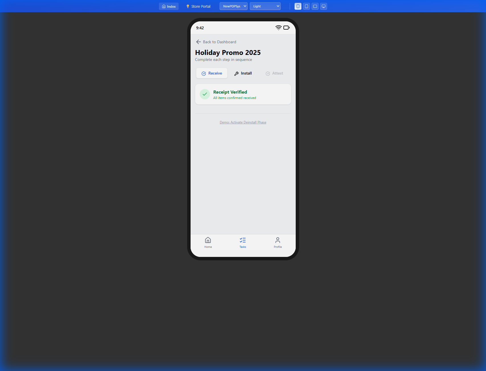 | 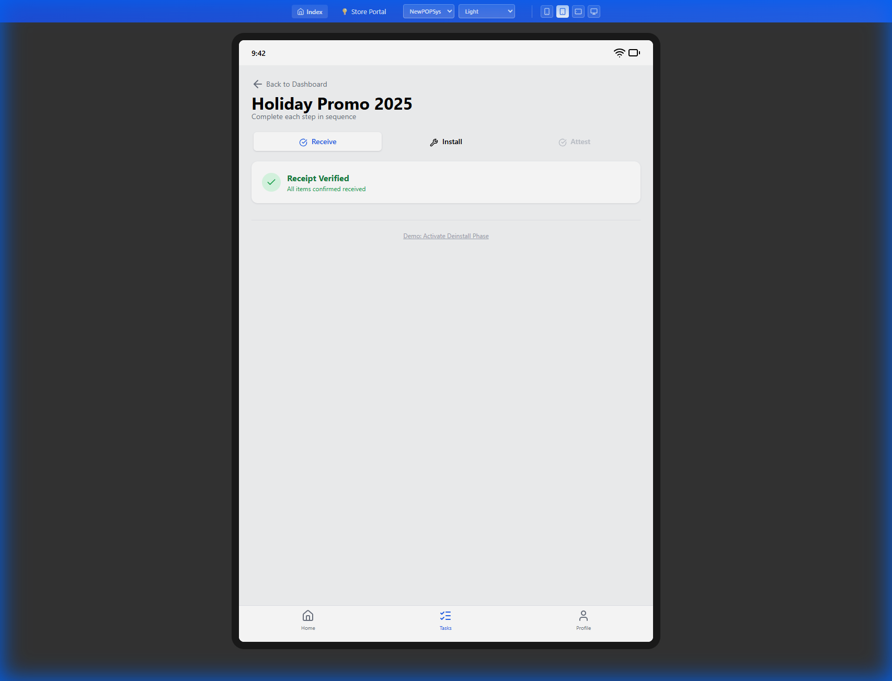 | 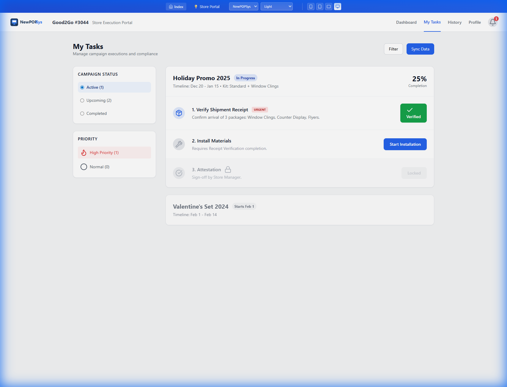 |

### 1.4 Source Documents

| Document | Reference |
|----------|-----------|
| Screen Spec | [M06_Tasks.md](../../../../06_Screen_Specs/M06_Tasks.md) |
| SUPP Reference | SUPP-017 (Store Execution) |
| Attestation | [4.3_Authentication_Flows.md](../../04_User_Personas_RBAC/4.3_Authentication_Flows.md) |

---

## 2. User Roles & Permissions

### 2.1 Authorized Roles

| Role | Access Level | Description |
|------|--------------|-------------|
| Store Manager (P07) | Full | Can view all tasks, submit attestations |
| Store Operator (P08) | Execute | Can view and execute assigned tasks |

### 2.2 Role Requirements

| Req ID | Requirement | Priority |
|--------|-------------|----------|
| REQ-M006-ROLE-001 | System SHALL display tasks for user's assigned store | Must |
| REQ-M006-ROLE-002 | System SHALL allow task execution for both STORE_MANAGER and STORE_OPERATOR | Must |
| REQ-M006-ROLE-003 | System SHALL restrict attestation submission to authenticated users only | Must |
| REQ-M006-ROLE-004 | System SHALL record attesting user's identity with signature | Must |

### 2.3 Permission Constraints

- User must have active `Membership` for the store
- Tasks visible only for campaigns assigned to user's store
- Attestation requires all mandatory photos to be uploaded

---

## 3. UI Components

### 3.1 Component Inventory

| Component ID | Type | Description | Required |
|--------------|------|-------------|----------|
| COMP-M006-001 | Header | App bar with "My Tasks" title and filter button | Yes |
| COMP-M006-002 | Filter Chips | Chip group: All, Receipts, Installs, Retakes | Yes |
| COMP-M006-003 | Task List | Card list grouped by priority/due date | Yes |
| COMP-M006-004 | Task Card | Type icon, title, campaign, due date | Yes |
| COMP-M006-005 | Badge | Count indicator for total pending tasks | Yes |
| COMP-M006-006 | Empty State | "All caught up!" message when no tasks | Yes |
| COMP-M006-007 | Attestation Summary | Location completion checklist | Conditional |
| COMP-M006-008 | Certification Checkbox | Legal attestation agreement | Conditional |
| COMP-M006-009 | Signature Canvas | Touch/stylus signature capture | Conditional |
| COMP-M006-010 | Submit Button | Final submission trigger | Conditional |

### 3.2 Component Requirements

| Req ID | Requirement | Priority |
|--------|-------------|----------|
| REQ-M006-UI-001 | Task cards SHALL display type icon, title, campaign name, and due date | Must |
| REQ-M006-UI-002 | Tasks SHALL be sorted by priority (HIGH first), then due date | Must |
| REQ-M006-UI-003 | Filter chips SHALL immediately filter displayed tasks | Must |
| REQ-M006-UI-004 | Badge SHALL show total pending task count | Must |
| REQ-M006-UI-005 | Empty state SHALL display when no tasks match filter | Must |
| REQ-M006-UI-006 | Signature canvas SHALL capture touch/stylus input | Must |

### 3.3 Task Card Layout


### 3.4 Attestation Screen Layout

**Route**: `/app/campaign/:id/submit`


---

## 4. Data Requirements

### 4.1 Input Data

| Field | Type | Validation | Source |
|-------|------|------------|--------|
| `store_id` | UUID | Required, active store | Auth context |
| `filter_type` | Enum | Optional: ALL, RECEIPT, INSTALL, RETAKE | User selection |

### 4.2 Output Data

| Field | Type | Description | Destination |
|-------|------|-------------|-------------|
| `attestation_text` | String | Certification statement text | Database |
| `attested_at` | Timestamp | When user attested | Database |
| `attested_by` | UUID | User who attested | Database |
| `signature_url` | URL | Signature image storage location | Database |

### 4.3 Task Derivation Rules

Tasks are dynamically generated from entity states:

```
RECEIPT tasks:
  - StoreAssignment WHERE store_phase = READY_TO_RECEIVE

INSTALL tasks:
  - AssignmentItem WHERE item_status = RECEIVED
  - Grouped by LocationSlot

RETAKE tasks:
  - PhotoUpload WHERE review_status = REJECTED

ISSUE_UPDATE tasks:
  - IssueRequest WHERE status changed (RESOLVED, etc.)
```

### 4.4 Data Model References

| Entity | Fields Used | Access |
|--------|-------------|--------|
| `StoreAssignment` | id, status, store_phase | Read |
| `AssignmentItem` | id, item_status | Read |
| `Campaign` | name, install_end_date | Read |
| `PhotoReview` | status, rejection_reason | Read |
| `IssueRequest` | status, resolution_notes | Read |
| `CompletionAttestation` | attested_at, attested_by, signature_url | Write |

### 4.5 Data Requirements

| Req ID | Requirement | Priority |
|--------|-------------|----------|
| REQ-M006-DATA-001 | System SHALL derive tasks from entity states, not store separately | Must |
| REQ-M006-DATA-002 | System SHALL include campaign name and due date in task data | Must |
| REQ-M006-DATA-003 | System SHALL store attestation with signature image | Must |
| REQ-M006-DATA-004 | System SHALL capture attestation timestamp in UTC | Must |

---

## 5. Business Rules & Validation

### 5.1 Task Type Definitions

| Type | Icon | Description | Navigation |
|------|------|-------------|------------|
| RECEIPT | Package icon | Verify shipment delivery | M003 Receipt Survey |
| INSTALL | Wrench icon | Install items at locations | M004 Install Survey |
| RETAKE | Camera icon | Recapture rejected photos | M008 Retake Flow |
| ISSUE_UPDATE | Info icon | View issue resolution | Modal with details |

### 5.2 Priority Calculation Rules

| Rule ID | Priority | Criteria |
|---------|----------|----------|
| BR-M006-001 | HIGH | Due today or overdue |
| BR-M006-002 | HIGH | Retake required (blocking completion) |
| BR-M006-003 | MEDIUM | Due within 3 days |
| BR-M006-004 | MEDIUM | Issue resolved (acknowledgment needed) |
| BR-M006-005 | LOW | Due in 4+ days |

### 5.3 Filter Options

| Filter | Shows |
|--------|-------|
| All | All pending tasks |
| Receipts | RECEIPT type only |
| Installs | INSTALL type only |
| Retakes | RETAKE type only |
| Overdue | Past due date |

### 5.4 Attestation Rules

| Rule ID | Rule | Implementation |
|---------|------|----------------|
| BR-M006-006 | All locations must be complete | Check all AssignmentItems have item_status = INSTALLED |
| BR-M006-007 | Certification checkbox required | Checkbox must be checked before Submit enabled |
| BR-M006-008 | Signature required | Signature canvas must contain input |
| BR-M006-009 | Attestation is irrevocable | Once submitted, cannot be undone |

### 5.5 Validation Requirements

| Req ID | Requirement | Priority |
|--------|-------------|----------|
| REQ-M006-VAL-001 | System SHALL prevent attestation if any location incomplete | Must |
| REQ-M006-VAL-002 | System SHALL require certification checkbox before submit | Must |
| REQ-M006-VAL-003 | System SHALL require signature before submit | Must |
| REQ-M006-VAL-004 | System SHALL validate all required photos uploaded | Must |

---

## 6. API Integration Points

### 6.1 Get Tasks Endpoint

| Property | Value |
|----------|-------|
| **Endpoint** | `GET /api/v1/stores/{storeId}/tasks` |
| **Auth Required** | Yes (Bearer token) |

#### Response Schema (Success - 200)

```json
{
  "tasks": [
    {
      "id": "derived-uuid",
      "type": "RETAKE",
      "priority": "HIGH",
      "title": "Retake Required",
      "subtitle": "Summer Promo - Front Window Poster",
      "description": "Wrong angle - please recapture",
      "due_date": "2026-01-01",
      "campaign_id": "uuid",
      "campaign_name": "Summer Promo",
      "assignment_item_id": "uuid",
      "photo_upload_id": "uuid"
    }
  ],
  "counts": {
    "total": 5,
    "high_priority": 2,
    "overdue": 1
  }
}
```

### 6.2 Submit Attestation Endpoint

| Property | Value |
|----------|-------|
| **Endpoint** | `POST /api/v1/assignments/{id}/submit` |
| **Auth Required** | Yes (Bearer token) |

#### Request Schema

```json
{
  "attestation_text": "I certify that all items shown above are installed correctly at this store.",
  "signature_data": "data:image/png;base64,..."
}
```

#### Response Schema (Success - 200)

```json
{
  "assignment_id": "uuid",
  "status": "SUBMITTED",
  "attested_at": "2026-01-01T14:30:00Z",
  "attested_by": "uuid",
  "signature_url": "https://cdn.example.com/signatures/uuid.png"
}
```

### 6.3 API Requirements

| Req ID | Requirement | Priority |
|--------|-------------|----------|
| REQ-M006-API-001 | System SHALL aggregate tasks from multiple entity sources | Must |
| REQ-M006-API-002 | System SHALL include priority and due date in task response | Must |
| REQ-M006-API-003 | System SHALL upload signature image before submission | Must |
| REQ-M006-API-004 | System SHALL update assignment status to SUBMITTED on success | Must |

---

## 7. State Transitions

### 7.1 Task Navigation State Machine


[Diagram - See rendered image above or refer to source document]


### 7.2 Attestation Submission State Machine


[Diagram - See rendered image above or refer to source document]


### 7.3 Assignment Status After Attestation

```
StoreAssignment.status:
  IN_PROGRESS → SUBMITTED

CompletionAttestation:
  Created with attested_at, attested_by, signature_url
```

### 7.4 State Requirements

| Req ID | Requirement | Priority |
|--------|-------------|----------|
| REQ-M006-STATE-001 | System SHALL navigate to appropriate screen based on task type | Must |
| REQ-M006-STATE-002 | System SHALL update assignment status on successful submission | Must |
| REQ-M006-STATE-003 | System SHALL create CompletionAttestation record | Must |
| REQ-M006-STATE-004 | System SHALL return to Dashboard after successful submission | Must |

---

## 8. Error Handling

### 8.1 Error Categories

| Category | Handling Approach |
|----------|-------------------|
| Network Errors | Retry with offline queue |
| Incomplete Tasks | Block submission, show missing items |
| Signature Failure | Allow retry, preserve canvas |
| Submission Failure | Retry button, preserve attestation state |

### 8.2 Error Messages

| Error Code | User Message | Technical Action |
|------------|--------------|------------------|
| `INCOMPLETE_LOCATIONS` | "Complete all locations before submitting." | Highlight incomplete items |
| `MISSING_PHOTOS` | "{X} required photos not yet uploaded." | List missing items |
| `SIGNATURE_REQUIRED` | "Please sign before submitting." | Focus signature canvas |
| `SUBMISSION_FAILED` | "Submission failed. Please try again." | Retry button |
| `NETWORK_ERROR` | "Unable to connect. Check your connection." | Retry with offline support |

### 8.3 Attestation Validation Errors

| Validation | Error Display |
|------------|---------------|
| Locations incomplete | Red indicator on incomplete locations |
| Photos missing | Count of missing photos shown |
| Checkbox unchecked | Submit button disabled |
| Signature empty | Submit button disabled |

### 8.4 Error Requirements

| Req ID | Requirement | Priority |
|--------|-------------|----------|
| REQ-M006-ERR-001 | System SHALL display specific errors for incomplete attestation | Must |
| REQ-M006-ERR-002 | System SHALL preserve signature canvas on submission retry | Should |
| REQ-M006-ERR-003 | System SHALL highlight incomplete locations visually | Must |
| REQ-M006-ERR-004 | System SHALL allow retry for failed submissions | Must |

---

## 9. Accessibility Requirements

### 9.1 WCAG 2.1 AA Compliance

| Req ID | Requirement | WCAG Criterion | Priority |
|--------|-------------|----------------|----------|
| REQ-M006-A11Y-001 | Task cards SHALL be navigable via keyboard/switch | 2.1.1 Keyboard | Must |
| REQ-M006-A11Y-002 | Priority indicators SHALL use icons and text, not color alone | 1.4.1 Use of Color | Must |
| REQ-M006-A11Y-003 | Signature canvas SHALL have alternative text input option | 1.1.1 Non-text Content | Should |
| REQ-M006-A11Y-004 | Filter state changes SHALL be announced by screen readers | 4.1.3 Status Messages | Must |
| REQ-M006-A11Y-005 | Touch targets SHALL be minimum 44x44 pixels | 2.5.5 Target Size | Must |

### 9.2 Assistive Technology Support

| Feature | Implementation |
|---------|----------------|
| Screen Reader | ARIA labels on task cards, live regions for filters |
| Voice Control | Named buttons and actions |
| Signature Alternative | Type-to-sign option for motor impairments |
| Large Text | Responsive scaling up to 200% |

### 9.3 ARIA Implementation

```html
<div role="main" aria-labelledby="tasks-heading">
  <h1 id="tasks-heading">My Tasks <span aria-label="5 tasks">(5)</span></h1>

  <div role="group" aria-label="Task filters">
    <button role="radio" aria-checked="true">All</button>
    <button role="radio" aria-checked="false">Receipts</button>
    <button role="radio" aria-checked="false">Installs</button>
    <button role="radio" aria-checked="false">Retakes</button>
  </div>

  <ul role="list" aria-label="Task list">
    <li role="listitem">
      <article aria-labelledby="task-1-title">
        <span aria-label="High priority">HIGH</span>
        <h2 id="task-1-title">Retake Required</h2>
        <p>Summer Promo - Front Window Poster</p>
        <time datetime="2026-01-01">Due: Today</time>
        <button>View Details</button>
      </article>
    </li>
  </ul>
</div>
```

---

## 10. Acceptance Criteria

### 10.1 Functional Acceptance

| AC ID | Criterion | Verification Method |
|-------|-----------|---------------------|
| AC-M006-001 | Tasks list shows all pending work for store | API integration test |
| AC-M006-002 | Tasks grouped/sorted by priority and due date | Manual test |
| AC-M006-003 | Task cards show type, campaign, due date | Manual test |
| AC-M006-004 | Tapping task navigates to appropriate screen | E2E test |
| AC-M006-005 | Filter chips filter task list by type | Manual test |
| AC-M006-006 | Badge shows total pending count | Manual test |
| AC-M006-007 | Attestation required before final submit | E2E test |
| AC-M006-008 | Signature capture works on touch devices | Manual test |
| AC-M006-009 | Empty state shown when no tasks | Manual test |

### 10.2 Non-Functional Acceptance

| AC ID | Criterion | Target | Verification |
|-------|-----------|--------|--------------|
| AC-M006-NF-001 | Task list load time | < 2 seconds | Performance test |
| AC-M006-NF-002 | Filter response time | < 100ms | Performance test |
| AC-M006-NF-003 | Signature canvas responsiveness | 60fps drawing | Performance test |
| AC-M006-NF-004 | Accessibility score | 100% WCAG 2.1 AA | axe-core audit |

### 10.3 Security Acceptance

| AC ID | Criterion | Verification |
|-------|-----------|--------------|
| AC-M006-SEC-001 | Attestation bound to authenticated user | Security audit |
| AC-M006-SEC-002 | Signature images stored securely | Security audit |
| AC-M006-SEC-003 | Attestation timestamp tamper-proof | Code review |
| AC-M006-SEC-004 | Tasks only visible for user's store | Penetration test |

---

## 11. Traceability Matrix

| Requirement | Source | Test Case |
|-------------|--------|-----------|
| REQ-M006-ROLE-001 | SUPP-017 | TC-M006-001 |
| REQ-M006-UI-002 | SUPP-017 | TC-M006-002 |
| REQ-M006-VAL-002 | Business Rules | TC-M006-003 |
| REQ-M006-API-004 | SUPP-017 | TC-M006-004 |
| REQ-M006-A11Y-001 | WCAG 2.1 | TC-M006-005 |

---

*Document Status: Complete*
*IEEE 830 Compliance: Section 3.2.6 - User Interface Requirements*


---
# M007 - Profile Screen

> **Module**: Store Execution (Mobile PWA)
> **Screen ID**: M007
> **Route**: `/app/profile`
> **IEEE 830 Section**: 3.2.7 - User Interface Requirements
> **Version**: 1.1
> **Last Updated**: 2026-01-02

---

## 1. Screen Overview

### 1.1 Purpose

The Profile screen provides user account management capabilities including personal information display and editing, notification preference configuration, PIN change functionality, and secure logout. It serves as the central hub for user-specific settings within the mobile PWA.

### 1.2 Scope

This specification covers:
- User profile display (name, email, phone, store)
- Profile editing (name, phone - email read-only)
- Notification preference toggles (email/push per type)
- PIN change workflow with current PIN verification
- Secure logout with session clearing
- App version display for support

### 1.3 Screenshot Reference

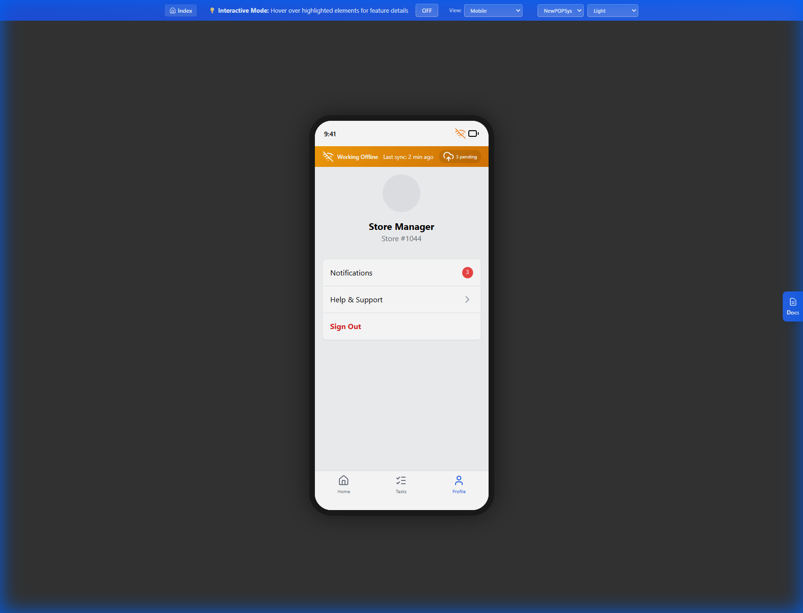
*(Note: Tablet and Desktop views follow standard responsive scaling)*

### 1.4 Source Documents

| Document | Reference |
|----------|-----------|
| Screen Spec | [M07_Profile.md](../../../../06_Screen_Specs/M07_Profile.md) |
| SUPP Reference | SUPP-036 (Onboarding and Store Foundation) |
| Authentication | [4.3_Authentication_Flows.md](../../04_User_Personas_RBAC/4.3_Authentication_Flows.md) |

---

## 2. User Roles & Permissions

### 2.1 Authorized Roles

| Role | Access Level | Description |
|------|--------------|-------------|
| Store Manager (P07) | Full | Can view and edit own profile |
| Store Operator (P08) | Full | Can view and edit own profile |

### 2.2 Role Requirements

| Req ID | Requirement | Priority |
|--------|-------------|----------|
| REQ-M007-ROLE-001 | System SHALL display profile for authenticated user only | Must |
| REQ-M007-ROLE-002 | System SHALL allow users to edit their own profile only | Must |
| REQ-M007-ROLE-003 | System SHALL display store membership information from user's Membership record | Must |

### 2.3 Permission Constraints

- Users can only view/edit their own profile
- Email address is read-only (managed by admin)
- Store assignment displayed but not editable

---

## 3. UI Components

### 3.1 Component Inventory

| Component ID | Type | Description | Required |
|--------------|------|-------------|----------|
| COMP-M007-001 | Header | App bar with "Profile" title and back button | Yes |
| COMP-M007-002 | Avatar | User photo or initials circle | Yes |
| COMP-M007-003 | User Info Card | Name, email, phone, store display | Yes |
| COMP-M007-004 | Edit Button | Icon button to open edit modal | Yes |
| COMP-M007-005 | Notification Toggles | Per-type email/push toggle switches | Yes |
| COMP-M007-006 | Change PIN Item | List item linking to PIN change flow | Yes |
| COMP-M007-007 | Logout Button | Destructive button for sign out | Yes |
| COMP-M007-008 | App Version | Text displaying version and build number | Yes |
| COMP-M007-009 | Edit Modal | Name and phone input form | Conditional |
| COMP-M007-010 | PIN Change Modal | Current/new/confirm PIN inputs | Conditional |

### 3.2 Component Requirements

| Req ID | Requirement | Priority |
|--------|-------------|----------|
| REQ-M007-UI-001 | Avatar SHALL display user photo or initials fallback | Must |
| REQ-M007-UI-002 | Email field SHALL be displayed as read-only | Must |
| REQ-M007-UI-003 | Notification toggles SHALL save immediately on change | Must |
| REQ-M007-UI-004 | Logout button SHALL use destructive styling (red) | Must |
| REQ-M007-UI-005 | App version SHALL display version and build number | Must |
| REQ-M007-UI-006 | PIN input fields SHALL mask entered digits | Must |

### 3.3 Profile Layout


### 3.4 Edit Modal Layout


---

## 4. Data Requirements

### 4.1 Input Data

| Field | Type | Validation | Source |
|-------|------|------------|--------|
| `name` | String | Required, 2-100 chars | User input |
| `phone` | String | Optional, valid phone format | User input |
| `current_pin` | String | Required for PIN change, 4-6 digits | User input |
| `new_pin` | String | Required for PIN change, 4-6 digits | User input |
| `confirm_pin` | String | Must match new_pin | User input |

### 4.2 Output Data

| Field | Type | Description | Destination |
|-------|------|-------------|-------------|
| `user` | Object | Updated user profile | API |
| `preferences` | Object | Notification settings | API |
| `pin_hash` | String | Hashed new PIN | Database |

### 4.3 User Settings Structure

```typescript
interface UserSettings {
  notifications: {
    shipment_updates: { email: boolean, push: boolean },
    photo_reviews: { email: boolean, push: boolean },
    campaign_reminders: { email: boolean, push: boolean },
    issue_updates: { email: boolean, push: boolean }
  },
  display: {
    theme: 'light' | 'dark' | 'system'
  }
}
```

### 4.4 Data Model References

| Entity | Fields Used | Access |
|--------|-------------|--------|
| `User` | name, email, phone, avatar_url | Read/Write |
| `Membership` | store_id, role | Read |
| `Store` | store_number, name | Read |
| `NotificationPreference` | type, email_enabled, push_enabled | Read/Write |

### 4.5 Data Requirements

| Req ID | Requirement | Priority |
|--------|-------------|----------|
| REQ-M007-DATA-001 | System SHALL display user's current store from Membership | Must |
| REQ-M007-DATA-002 | System SHALL persist notification preferences per user | Must |
| REQ-M007-DATA-003 | System SHALL hash PIN before storage | Must |
| REQ-M007-DATA-004 | System SHALL NOT store or transmit PIN in plaintext | Must |

---

## 5. Business Rules & Validation

### 5.1 Profile Edit Rules

| Rule ID | Rule | Implementation |
|---------|------|----------------|
| BR-M007-001 | Name is required | Validate non-empty, 2-100 chars |
| BR-M007-002 | Phone format validation | Accept common formats, store normalized |
| BR-M007-003 | Email is read-only | Display only, no edit capability |
| BR-M007-004 | Changes saved immediately | API call on modal save |

### 5.2 PIN Change Rules

| Rule ID | Rule | Validation |
|---------|------|------------|
| BR-M007-005 | PIN length | 4-6 digits |
| BR-M007-006 | Current PIN verification | Must match existing |
| BR-M007-007 | New PIN differs | Cannot match current |
| BR-M007-008 | Confirmation match | New and confirm must match |
| BR-M007-009 | PIN history | Cannot reuse last 3 PINs |

### 5.3 Notification Type Defaults

| Type | Description | Default |
|------|-------------|---------|
| Shipment Updates | Tracking status changes | Email + Push |
| Photo Reviews | Approval/rejection notifications | Push only |
| Campaign Reminders | Due date reminders | Email + Push |
| Issue Updates | Issue resolution status | Email only |

### 5.4 Security Rules

| Rule ID | Rule | Value |
|---------|------|-------|
| BR-M007-010 | Session timeout | 8 hours inactivity |
| BR-M007-011 | Token storage | Secure keychain/keystore |
| BR-M007-012 | PIN attempts | 5 max, then 15-min lockout |
| BR-M007-013 | Logout behavior | Clears all local data |

### 5.5 Validation Requirements

| Req ID | Requirement | Priority |
|--------|-------------|----------|
| REQ-M007-VAL-001 | System SHALL validate name is 2-100 characters | Must |
| REQ-M007-VAL-002 | System SHALL validate phone format if provided | Should |
| REQ-M007-VAL-003 | System SHALL verify current PIN before allowing change | Must |
| REQ-M007-VAL-004 | System SHALL prevent reuse of last 3 PINs | Should |
| REQ-M007-VAL-005 | System SHALL require new PIN differs from current | Must |

---

## 6. API Integration Points

### 6.1 Get User Profile

| Property | Value |
|----------|-------|
| **Endpoint** | `GET /api/v1/users/me` |
| **Auth Required** | Yes (Bearer token) |

#### Response Schema (Success - 200)

```json
{
  "id": "uuid",
  "name": "John Doe",
  "email": "john@store.com",
  "phone": "(555) 123-4567",
  "avatar_url": "https://cdn.example.com/avatars/uuid.jpg",
  "memberships": [
    {
      "store_id": "uuid",
      "store_number": "STR-001",
      "store_name": "Acme Retail - Downtown",
      "role": "STORE_OPERATOR"
    }
  ],
  "notification_preferences": {
    "shipment_updates": { "email": true, "push": true },
    "photo_reviews": { "email": false, "push": true },
    "campaign_reminders": { "email": true, "push": true },
    "issue_updates": { "email": true, "push": false }
  }
}
```

### 6.2 Update User Profile

| Property | Value |
|----------|-------|
| **Endpoint** | `PATCH /api/v1/users/me` |
| **Auth Required** | Yes (Bearer token) |

#### Request Schema

```json
{
  "name": "John Doe Updated",
  "phone": "(555) 987-6543"
}
```

### 6.3 Update Notification Preferences

| Property | Value |
|----------|-------|
| **Endpoint** | `PATCH /api/v1/users/me/preferences` |
| **Auth Required** | Yes (Bearer token) |

#### Request Schema

```json
{
  "notification_type": "photo_reviews",
  "email_enabled": true,
  "push_enabled": true
}
```

### 6.4 Verify Current PIN

| Property | Value |
|----------|-------|
| **Endpoint** | `POST /api/v1/auth/verify-pin` |
| **Auth Required** | Yes (Bearer token) |

#### Request Schema

```json
{
  "pin": "1234"
}
```

### 6.5 Change PIN

| Property | Value |
|----------|-------|
| **Endpoint** | `PATCH /api/v1/users/me/pin` |
| **Auth Required** | Yes (Bearer token) |

#### Request Schema

```json
{
  "current_pin": "1234",
  "new_pin": "5678"
}
```

### 6.6 Logout

| Property | Value |
|----------|-------|
| **Endpoint** | `POST /api/v1/auth/logout` |
| **Auth Required** | Yes (Bearer token) |

### 6.7 API Requirements

| Req ID | Requirement | Priority |
|--------|-------------|----------|
| REQ-M007-API-001 | System SHALL use PATCH for partial profile updates | Must |
| REQ-M007-API-002 | System SHALL verify current PIN before accepting new | Must |
| REQ-M007-API-003 | System SHALL invalidate all tokens on logout | Must |
| REQ-M007-API-004 | System SHALL save notification preferences immediately | Must |

---

## 7. State Transitions

### 7.1 Profile Edit State Machine


[Diagram - See rendered image above or refer to source document]


### 7.2 PIN Change State Machine


[Diagram - See rendered image above or refer to source document]


### 7.3 Logout State Machine


[Diagram - See rendered image above or refer to source document]


### 7.4 State Requirements

| Req ID | Requirement | Priority |
|--------|-------------|----------|
| REQ-M007-STATE-001 | System SHALL preserve edit modal state on validation error | Must |
| REQ-M007-STATE-002 | System SHALL clear all local data on logout | Must |
| REQ-M007-STATE-003 | System SHALL navigate to Login screen after logout | Must |
| REQ-M007-STATE-004 | System SHALL show success feedback after PIN change | Must |

---

## 8. Error Handling

### 8.1 Error Categories

| Category | Handling Approach |
|----------|-------------------|
| Validation Errors | Inline field errors |
| PIN Verification Failure | Display error, allow retry |
| Network Errors | Retry with offline indicator |
| Session Expired | Redirect to login |

### 8.2 Error Messages

| Error Code | User Message | Technical Action |
|------------|--------------|------------------|
| `INVALID_NAME` | "Name must be 2-100 characters." | Highlight field |
| `INVALID_PHONE` | "Please enter a valid phone number." | Highlight field |
| `WRONG_PIN` | "Current PIN is incorrect." | Clear field, focus |
| `PIN_TOO_SHORT` | "PIN must be 4-6 digits." | Highlight field |
| `PIN_MISMATCH` | "PINs do not match." | Clear confirm field |
| `PIN_REUSED` | "Cannot reuse recent PINs." | Clear new PIN field |
| `NETWORK_ERROR` | "Unable to save. Check your connection." | Retry button |
| `SESSION_EXPIRED` | "Session expired. Please log in again." | Redirect to login |

### 8.3 PIN Change Error States

| State | Error Display |
|-------|---------------|
| Wrong current PIN | "Current PIN is incorrect. {X} attempts remaining." |
| PIN too short | "PIN must be 4-6 digits." |
| PIN same as current | "New PIN must be different from current." |
| Confirmation mismatch | "PINs do not match." |
| PIN in history | "Cannot reuse your last 3 PINs." |

### 8.4 Error Requirements

| Req ID | Requirement | Priority |
|--------|-------------|----------|
| REQ-M007-ERR-001 | System SHALL display validation errors inline | Must |
| REQ-M007-ERR-002 | System SHALL show remaining PIN attempts on failure | Should |
| REQ-M007-ERR-003 | System SHALL handle session expiry gracefully | Must |
| REQ-M007-ERR-004 | System SHALL preserve form data on network error | Should |

---

## 9. Accessibility Requirements

### 9.1 WCAG 2.1 AA Compliance

| Req ID | Requirement | WCAG Criterion | Priority |
|--------|-------------|----------------|----------|
| REQ-M007-A11Y-001 | Form fields SHALL have associated labels | 1.3.1 Info and Relationships | Must |
| REQ-M007-A11Y-002 | Toggle switches SHALL announce state changes | 4.1.3 Status Messages | Must |
| REQ-M007-A11Y-003 | Error messages SHALL be announced by screen readers | 4.1.3 Status Messages | Must |
| REQ-M007-A11Y-004 | Touch targets SHALL be minimum 44x44 pixels | 2.5.5 Target Size | Must |
| REQ-M007-A11Y-005 | Color SHALL NOT be sole indicator of toggle state | 1.4.1 Use of Color | Must |

### 9.2 Assistive Technology Support

| Feature | Implementation |
|---------|----------------|
| Screen Reader | ARIA labels on all controls, live regions for updates |
| Voice Control | Named buttons and inputs |
| Large Text | Responsive font scaling up to 200% |
| High Contrast | Respects system high contrast mode |

### 9.3 ARIA Implementation

```html
<main role="main" aria-labelledby="profile-heading">
  <h1 id="profile-heading">Profile</h1>

  <section aria-labelledby="user-info-heading">
    <h2 id="user-info-heading">User Information</h2>
    <dl>
      <dt>Name</dt>
      <dd>John Doe</dd>
      <dt>Email</dt>
      <dd>john@store.com</dd>
    </dl>
    <button aria-label="Edit profile">Edit</button>
  </section>

  <section aria-labelledby="notifications-heading">
    <h2 id="notifications-heading">Notifications</h2>
    <div role="group" aria-labelledby="shipment-label">
      <span id="shipment-label">Shipment Updates</span>
      <label>
        Email
        <input type="checkbox" role="switch" aria-checked="true" />
      </label>
      <label>
        Push
        <input type="checkbox" role="switch" aria-checked="true" />
      </label>
    </div>
  </section>

  <button aria-label="Log out of application">Logout</button>
</main>
```

---

## 10. Acceptance Criteria

### 10.1 Functional Acceptance

| AC ID | Criterion | Verification Method |
|-------|-----------|---------------------|
| AC-M007-001 | Profile displays user name, email, phone | Manual test |
| AC-M007-002 | Store information shown (number and name) | Manual test |
| AC-M007-003 | Edit modal allows name/phone updates | Manual test |
| AC-M007-004 | Email is read-only (cannot be changed) | Manual test |
| AC-M007-005 | Notification toggles save immediately | API integration test |
| AC-M007-006 | PIN change requires current PIN verification | E2E test |
| AC-M007-007 | Logout clears session and navigates to login | E2E test |
| AC-M007-008 | App version displayed for support reference | Manual test |

### 10.2 Non-Functional Acceptance

| AC ID | Criterion | Target | Verification |
|-------|-----------|--------|--------------|
| AC-M007-NF-001 | Profile load time | < 1 second | Performance test |
| AC-M007-NF-002 | Preference save time | < 500ms | Performance test |
| AC-M007-NF-003 | PIN change completion | < 2 seconds | Performance test |
| AC-M007-NF-004 | Accessibility score | 100% WCAG 2.1 AA | axe-core audit |

### 10.3 Security Acceptance

| AC ID | Criterion | Verification |
|-------|-----------|--------------|
| AC-M007-SEC-001 | PIN never logged or stored in plaintext | Code review |
| AC-M007-SEC-002 | Tokens cleared from secure storage on logout | Security audit |
| AC-M007-SEC-003 | PIN rate limiting enforced | Penetration test |
| AC-M007-SEC-004 | Session invalidated on logout | API test |

---

## 11. Traceability Matrix

| Requirement | Source | Test Case |
|-------------|--------|-----------|
| REQ-M007-ROLE-001 | SUPP-036 | TC-M007-001 |
| REQ-M007-UI-003 | SUPP-036 | TC-M007-002 |
| REQ-M007-VAL-003 | Security Policy | TC-M007-003 |
| REQ-M007-API-003 | Security Policy | TC-M007-004 |
| REQ-M007-A11Y-001 | WCAG 2.1 | TC-M007-005 |

---

*Document Status: Complete*
*IEEE 830 Compliance: Section 3.2.7 - User Interface Requirements*


---
# M008 - Photo Retake

> **Module**: Store Execution (Mobile PWA)
> **Screen ID**: M008
> **Route**: `/app/campaign/:id/retake`
> **IEEE 830 Section**: 3.2.8 - User Interface Requirements
> **Version**: 1.1
> **Last Updated**: 2026-01-02

---

## 1. Screen Overview

### 1.1 Purpose

The Photo Retake screen guides store users through the process of recapturing rejected installation photos. It displays rejection reasons and admin feedback, provides side-by-side comparison between rejected and replacement photos, and manages the supersession workflow where new photos replace rejected ones.

### 1.2 Scope

This specification covers:
- Display of rejected photos with rejection reasons
- Admin comment viewing for retake guidance
- Camera integration for replacement photo capture
- Side-by-side before/after comparison
- Photo supersession workflow (old -> SUPERSEDED, new -> PENDING)

### 1.3 Screenshot Reference

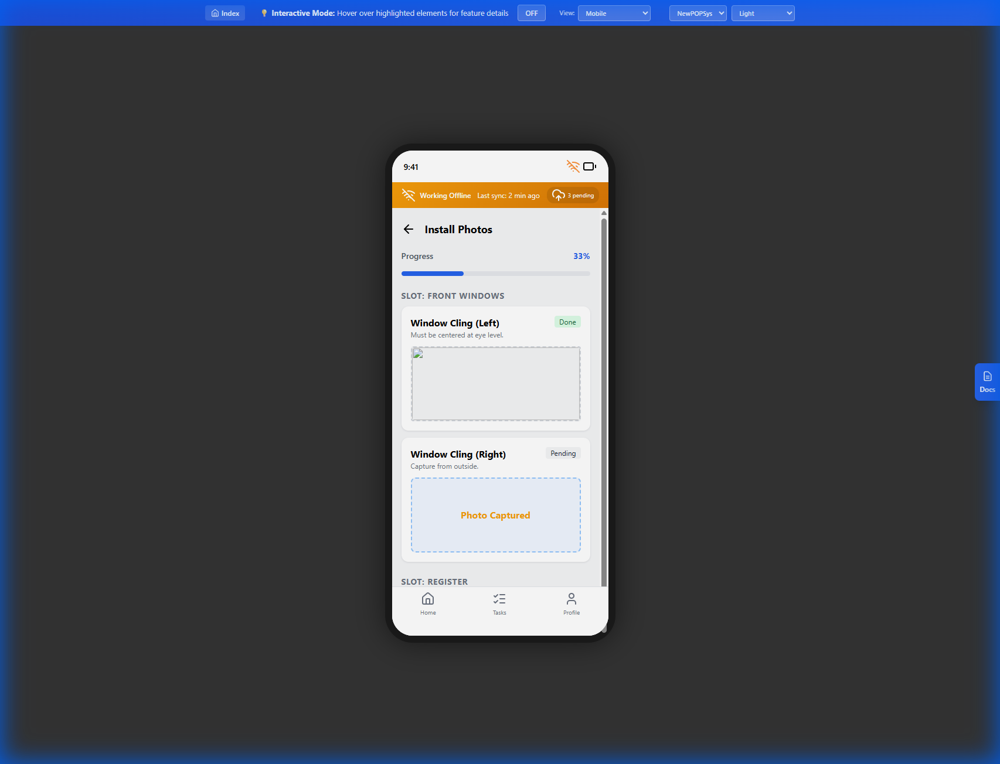
*(Note: View shows the review state after capture; Tablet/Desktop modes scale responsively)*

### 1.4 Source Documents

| Document | Reference |
|----------|-----------|
| Screen Spec | [M08_Retake.md](../../../../06_Screen_Specs/M08_Retake.md) |
| SUPP Reference | SUPP-018 (Photo Review), SUPP-037 (Store Surveys) |
| Photo Capture | [M005_Photo_Capture.md](./M005_Photo_Capture.md) |

---

## 2. User Roles & Permissions

### 2.1 Authorized Roles

| Role | Access Level | Description |
|------|--------------|-------------|
| Store Manager (P07) | Full | Can view rejections and submit retakes |
| Store Operator (P08) | Execute | Can view rejections and submit retakes for assigned tasks |

### 2.2 Role Requirements

| Req ID | Requirement | Priority |
|--------|-------------|----------|
| REQ-M008-ROLE-001 | System SHALL display rejected photos only for user's assigned store | Must |
| REQ-M008-ROLE-002 | System SHALL allow retake submission for both STORE_MANAGER and STORE_OPERATOR | Must |
| REQ-M008-ROLE-003 | System SHALL associate new photos with the authenticated user | Must |

### 2.3 Permission Constraints

- User must have active `Membership` for the store
- Assignment must belong to user's store
- Campaign must still be in active install window or grace period

---

## 3. UI Components

### 3.1 Component Inventory

| Component ID | Type | Description | Required |
|--------------|------|-------------|----------|
| COMP-M008-001 | Header | App bar with "Retake Required" and campaign name | Yes |
| COMP-M008-002 | Rejected Photo Card | Card with dimmed rejected image and X overlay | Yes |
| COMP-M008-003 | Rejection Badge | Chip displaying reason code (e.g., "Wrong Angle") | Yes |
| COMP-M008-004 | Admin Comment | Text block with reviewer's instructions | Yes |
| COMP-M008-005 | Original Image | Thumbnail of rejected photo (dimmed) | Yes |
| COMP-M008-006 | Retake Button | Primary button to open camera | Yes |
| COMP-M008-007 | New Photo Preview | Replacement photo after capture | Conditional |
| COMP-M008-008 | Side-by-Side View | Before/after comparison layout | Conditional |
| COMP-M008-009 | Retake Again Button | Secondary button to recapture | Conditional |
| COMP-M008-010 | Submit Button | Primary button to finalize retake | Conditional |
| COMP-M008-011 | Multiple Retakes List | List view when multiple photos rejected | Conditional |

### 3.2 Component Requirements

| Req ID | Requirement | Priority |
|--------|-------------|----------|
| REQ-M008-UI-001 | Rejected photo SHALL display with dimmed overlay and X mark | Must |
| REQ-M008-UI-002 | Rejection reason SHALL display as colored badge/chip | Must |
| REQ-M008-UI-003 | Admin comment SHALL display in full below rejection reason | Must |
| REQ-M008-UI-004 | Side-by-side view SHALL show before (rejected) and after (new) | Must |
| REQ-M008-UI-005 | Submit button SHALL be disabled until new photo captured | Must |
| REQ-M008-UI-006 | Multiple retakes SHALL be listable with individual navigation | Must |

### 3.3 Single Retake Card Layout


### 3.4 After Capture Layout


### 3.5 Multiple Retakes List Layout


---

## 4. Data Requirements

### 4.1 Input Data

| Field | Type | Validation | Source |
|-------|------|------------|--------|
| `campaign_id` | UUID | Required, valid campaign | Navigation param |
| `assignment_item_ids` | UUID[] | Optional, filter to specific items | Deep link param |

### 4.2 Output Data

| Field | Type | Description | Destination |
|-------|------|-------------|-------------|
| `new_photo_id` | UUID | Created PhotoUpload record | API |
| `old_photo_id` | UUID | Superseded PhotoUpload record | API |
| `upload_status` | Enum | PENDING (new photo status) | Database |
| `superseded_status` | Enum | SUPERSEDED (old photo status) | Database |

### 4.3 Data Model References

| Entity | Fields Used | Access |
|--------|-------------|--------|
| `PhotoUpload` | id, file_url, review_status, assignment_item_id | Read/Write |
| `PhotoReview` | status, rejection_reason, admin_comment, reviewed_at | Read |
| `AssignmentItem` | id, item_status, location_slot_id | Read/Write |
| `KitItem` | name, description, photo_rule_id | Read |
| `PhotoRule` | ghost_image_url, instructions | Read |

### 4.4 Status Transitions

```
PhotoUpload (old):
  review_status: REJECTED -> SUPERSEDED (after retake submitted)

PhotoUpload (new):
  Created with review_status: PENDING

AssignmentItem:
  item_status: RETAKE_REQUIRED -> PROOF_SUBMITTED (after retake)
```

### 4.5 Data Requirements

| Req ID | Requirement | Priority |
|--------|-------------|----------|
| REQ-M008-DATA-001 | System SHALL load rejection reason and admin comment for each photo | Must |
| REQ-M008-DATA-002 | System SHALL mark old photo as SUPERSEDED after new photo submitted | Must |
| REQ-M008-DATA-003 | System SHALL create new PhotoUpload linked to same AssignmentItem | Must |
| REQ-M008-DATA-004 | System SHALL update AssignmentItem.item_status to PROOF_SUBMITTED | Must |

---

## 5. Business Rules & Validation

### 5.1 Rejection Reason Codes

| Code | Display Text | Guidance |
|------|--------------|----------|
| WRONG_ANGLE | "Wrong Angle" | Capture straight-on |
| TOO_DARK | "Too Dark" | Use flash or better lighting |
| BLURRY | "Blurry" | Hold device steady |
| WRONG_ITEM | "Wrong Item" | Photo shows incorrect item |
| INCOMPLETE | "Incomplete" | Full item must be visible |
| OBSTRUCTED | "Obstructed" | Remove objects blocking view |
| OTHER | "Other" | See admin comment |

### 5.2 Retake Workflow Rules

| Rule ID | Rule | Implementation |
|---------|------|----------------|
| BR-M008-001 | Retake uses same PhotoRule as original | Load PhotoRule from AssignmentItem |
| BR-M008-002 | Ghost image available for retake | Display same ghost_image_url |
| BR-M008-003 | Old photo linked via supersedes_id | Store reference to replaced photo |
| BR-M008-004 | Multiple retakes submitted together | Batch submission supported |

### 5.3 Photo Supersession Rules

| Rule ID | Rule | Value |
|---------|------|-------|
| BR-M008-005 | Only REJECTED photos can be superseded | Validate status before supersede |
| BR-M008-006 | Superseded photos retained for audit | Never delete, only mark SUPERSEDED |
| BR-M008-007 | New photo inherits assignment item link | Same assignment_item_id |
| BR-M008-008 | Review status reset to PENDING | Await new brand review |

### 5.4 Deep Link Format

```
newpopsys://app/campaign/{campaignId}/retake?items={assignmentItemIds}
```

### 5.5 Validation Requirements

| Req ID | Requirement | Priority |
|--------|-------------|----------|
| REQ-M008-VAL-001 | System SHALL validate campaign belongs to user's store | Must |
| REQ-M008-VAL-002 | System SHALL validate photo is in REJECTED status before retake | Must |
| REQ-M008-VAL-003 | System SHALL require new photo before enabling submit | Must |
| REQ-M008-VAL-004 | System SHALL validate all retakes complete before "Submit All" | Must |

---

## 6. API Integration Points

### 6.1 Get Rejected Photos

| Property | Value |
|----------|-------|
| **Endpoint** | `GET /api/v1/assignments/{id}/photos?status=REJECTED` |
| **Auth Required** | Yes (Bearer token) |

#### Response Schema (Success - 200)

```json
{
  "rejected_photos": [
    {
      "id": "uuid",
      "file_url": "https://cdn.example.com/photos/uuid.jpg",
      "thumbnail_url": "https://cdn.example.com/thumbs/uuid.jpg",
      "assignment_item_id": "uuid",
      "kit_item": {
        "name": "Front Window Poster",
        "description": "Main promotional poster"
      },
      "location_slot": {
        "name": "Front Window"
      },
      "review": {
        "rejection_reason": "WRONG_ANGLE",
        "admin_comment": "Please capture the poster straight-on, not at an angle. Ensure all corners are visible.",
        "reviewed_at": "2026-01-01T10:00:00Z",
        "reviewer_name": "Jane Admin"
      },
      "photo_rule": {
        "ghost_image_url": "https://cdn.example.com/ghosts/poster.png",
        "instructions": "Align poster with outline"
      }
    }
  ]
}
```

### 6.2 Create Retake Photo

| Property | Value |
|----------|-------|
| **Endpoint** | `POST /api/v1/photos` |
| **Auth Required** | Yes (Bearer token) |

#### Request Schema

```json
{
  "assignment_item_id": "uuid",
  "supersedes_id": "uuid",
  "captured_at": "2026-01-01T14:30:00Z",
  "device_model": "iPhone 14",
  "gps_latitude": 40.7128,
  "gps_longitude": -74.0060
}
```

### 6.3 Confirm Upload

| Property | Value |
|----------|-------|
| **Endpoint** | `PATCH /api/v1/photos/{id}/confirm` |
| **Auth Required** | Yes (Bearer token) |

### 6.4 Mark Photo Superseded

| Property | Value |
|----------|-------|
| **Endpoint** | `PATCH /api/v1/photos/{oldId}/supersede` |
| **Auth Required** | Yes (Bearer token) |

#### Request Schema

```json
{
  "superseded_by": "uuid"
}
```

#### Response Schema (Success - 200)

```json
{
  "id": "uuid",
  "review_status": "SUPERSEDED",
  "superseded_by": "uuid",
  "superseded_at": "2026-01-01T14:35:00Z"
}
```

### 6.5 API Requirements

| Req ID | Requirement | Priority |
|--------|-------------|----------|
| REQ-M008-API-001 | System SHALL include PhotoReview data in rejected photos response | Must |
| REQ-M008-API-002 | System SHALL link new photo to superseded photo via supersedes_id | Must |
| REQ-M008-API-003 | System SHALL update old photo status to SUPERSEDED | Must |
| REQ-M008-API-004 | System SHALL update AssignmentItem status after successful retake | Must |

---

## 7. State Transitions

### 7.1 Retake Flow State Machine


[Diagram - See rendered image above or refer to source document]


### 7.2 Photo Status State Machine


[Diagram - See rendered image above or refer to source document]


### 7.3 Assignment Item State Machine


[Diagram - See rendered image above or refer to source document]


### 7.4 State Requirements

| Req ID | Requirement | Priority |
|--------|-------------|----------|
| REQ-M008-STATE-001 | System SHALL update old photo to SUPERSEDED after successful upload | Must |
| REQ-M008-STATE-002 | System SHALL create new photo with PENDING status | Must |
| REQ-M008-STATE-003 | System SHALL update assignment item to PROOF_SUBMITTED | Must |
| REQ-M008-STATE-004 | System SHALL return to Dashboard after all retakes complete | Must |

---

## 8. Error Handling

### 8.1 Error Categories

| Category | Handling Approach |
|----------|-------------------|
| Network Errors | Queue for offline retry |
| Camera Errors | Fallback to gallery selection |
| Upload Failure | Retry with progress indicator |
| Session Expired | Redirect to login, preserve progress |

### 8.2 Error Messages

| Error Code | User Message | Technical Action |
|------------|--------------|------------------|
| `NO_REJECTIONS` | "No photos require retake." | Navigate to Dashboard |
| `PHOTO_NOT_REJECTED` | "This photo is no longer pending retake." | Refresh rejection list |
| `UPLOAD_FAILED` | "Upload failed. Will retry automatically." | Queue for background retry |
| `CAMERA_ERROR` | "Unable to access camera. Try again." | Retry button |
| `NETWORK_ERROR` | "Unable to connect. Retake saved locally." | Queue for sync |

### 8.3 Offline Behavior

| Action | Behavior |
|--------|----------|
| View rejections | Cached from last sync |
| Capture retake | Saved locally |
| Submit | Queued for upload when online |
| Status update | Synced when connection restored |

### 8.4 Error Requirements

| Req ID | Requirement | Priority |
|--------|-------------|----------|
| REQ-M008-ERR-001 | System SHALL cache rejection data for offline viewing | Should |
| REQ-M008-ERR-002 | System SHALL queue retake photos for background upload | Must |
| REQ-M008-ERR-003 | System SHALL handle expired sessions gracefully | Must |
| REQ-M008-ERR-004 | System SHALL refresh rejection list if status changed | Must |

---

## 9. Accessibility Requirements

### 9.1 WCAG 2.1 AA Compliance

| Req ID | Requirement | WCAG Criterion | Priority |
|--------|-------------|----------------|----------|
| REQ-M008-A11Y-001 | Rejection reasons SHALL be readable by screen readers | 1.1.1 Non-text Content | Must |
| REQ-M008-A11Y-002 | Side-by-side images SHALL have alt text | 1.1.1 Non-text Content | Must |
| REQ-M008-A11Y-003 | Buttons SHALL be navigable via keyboard/switch | 2.1.1 Keyboard | Must |
| REQ-M008-A11Y-004 | Status changes SHALL be announced | 4.1.3 Status Messages | Must |
| REQ-M008-A11Y-005 | Touch targets SHALL be minimum 44x44 pixels | 2.5.5 Target Size | Must |

### 9.2 Assistive Technology Support

| Feature | Implementation |
|---------|----------------|
| Screen Reader | ARIA labels on images, live regions for status |
| Voice Control | Named buttons ("Retake Photo", "Submit") |
| Image Descriptions | Alt text describing rejection reason context |
| High Contrast | Rejection badge visible in all modes |

### 9.3 ARIA Implementation

```html
<main role="main" aria-labelledby="retake-heading">
  <h1 id="retake-heading">Retake Required</h1>
  <h2>Front Window Poster</h2>

  <figure role="group" aria-labelledby="rejected-caption">
    
    <figcaption id="rejected-caption">
      <span id="rejection-reason" role="status">
        Rejected: Wrong Angle
      </span>
    </figcaption>
  </figure>

  <blockquote aria-label="Reviewer feedback">
    Please capture the poster straight-on, not at an angle.
    Ensure all corners are visible.
  </blockquote>

  <button aria-label="Open camera to retake photo">
    Retake Photo
  </button>

  <div role="region" aria-labelledby="comparison-heading" hidden>
    <h3 id="comparison-heading">Comparison</h3>
    <div role="group" aria-label="Before and after photos">
      
      
    </div>
    <button>Retake Again</button>
    <button>Submit Replacement</button>
  </div>
</main>
```

---

## 10. Acceptance Criteria

### 10.1 Functional Acceptance

| AC ID | Criterion | Verification Method |
|-------|-----------|---------------------|
| AC-M008-001 | Screen shows all rejected photos for assignment | API integration test |
| AC-M008-002 | Each rejection displays reason code and admin comment | Manual test |
| AC-M008-003 | Original photo shown with rejection overlay | Manual test |
| AC-M008-004 | Retake button opens camera with ghost image | Manual test |
| AC-M008-005 | Side-by-side comparison after capture | Manual test |
| AC-M008-006 | Submit supersedes old photo, creates new PENDING | E2E test |
| AC-M008-007 | Multiple retakes can be submitted together | E2E test |
| AC-M008-008 | Push notification links directly to retake screen | Deep link test |
| AC-M008-009 | Success returns user to Dashboard | E2E test |

### 10.2 Non-Functional Acceptance

| AC ID | Criterion | Target | Verification |
|-------|-----------|--------|--------------|
| AC-M008-NF-001 | Rejection list load time | < 2 seconds | Performance test |
| AC-M008-NF-002 | Photo comparison render | < 500ms | Performance test |
| AC-M008-NF-003 | Offline retake capture | Functional | Offline test |
| AC-M008-NF-004 | Accessibility score | 100% WCAG 2.1 AA | axe-core audit |

### 10.3 Security Acceptance

| AC ID | Criterion | Verification |
|-------|-----------|--------------|
| AC-M008-SEC-001 | Retakes only visible to store personnel | Permission test |
| AC-M008-SEC-002 | Deep links validate authentication | Security audit |
| AC-M008-SEC-003 | Photo URLs are signed/expiring | Security audit |
| AC-M008-SEC-004 | Supersession audit trail maintained | Data audit |

---

## 11. Traceability Matrix

| Requirement | Source | Test Case |
|-------------|--------|-----------|
| REQ-M008-ROLE-001 | SUPP-018 | TC-M008-001 |
| REQ-M008-UI-001 | SUPP-018 | TC-M008-002 |
| REQ-M008-DATA-002 | SUPP-037 | TC-M008-003 |
| REQ-M008-API-003 | SUPP-018 | TC-M008-004 |
| REQ-M008-A11Y-001 | WCAG 2.1 | TC-M008-005 |

---

## 12. Notification Triggers

When photos are rejected, the system sends notifications:

| Channel | Content |
|---------|---------|
| Push | "Action Required: {X} photos rejected for {Campaign Name}" |
| Email | "Photo Retake Required" with rejection details and deep link |
| In-App | Badge on Dashboard, entry in Tasks list |

---

*Document Status: Complete*
*IEEE 830 Compliance: Section 3.2.8 - User Interface Requirements*


---
# M009 - Deinstall Checklist

> **Module**: Store Execution (Mobile PWA)
> **Screen ID**: M009
> **Route**: `/app/campaign/:id/deinstall`
> **IEEE 830 Section**: 3.2.9 - User Interface Requirements
> **Version**: 1.0
> **Last Updated**: 2026-01-02

---

## 1. Screen Overview

### 1.1 Purpose

The Deinstall Checklist screen facilitates the removal of POP materials once a campaign has ended. It provides a list of all items previously installed and requires the user to confirm their removal. This ensures that old promotional materials are not left in-store, maintaining brand consistency and clearing space for new campaigns.

### 1.2 Scope

This specification covers:
- List of installed items for removal
- Multi-select removal confirmation
- Disposal instructions per item type (e.g., "Recycle", "Return to Brand")
- Progress tracking for deinstallation phase

### 1.3 Screenshot Reference

| Mobile View | Tablet View | Desktop View |
| :--- | :--- | :--- |
|  |  |  |

---

## 2. User Roles & Permissions

### 2.1 Authorized Roles

| Role | Access Level | Description |
|------|--------------|-------------|
| Store Manager (P07) | Full | Can execute and confirm deinstallation |
| Store Operator (P08) | Execute | Can execute deinstallation tasks |

---

## 3. UI Components

### 3.1 Component Inventory

| Component ID | Type | Description | Required |
| :--- | :--- | :--- | :--- |
| COMP-M009-001 | Header | Campaign name and "Deinstall" status | Yes |
| COMP-M009-002 | Checklist | List of items with removal checkboxes | Yes |
| COMP-M009-003 | Instructions | Disposal/recycling notes | Yes |
| COMP-M009-004 | Submit Button | Proceed to final confirmation | Yes |

---

## 10. Acceptance Criteria

### 10.1 Functional Acceptance

| AC ID | Criterion | Verification Method |
| :--- | :--- | :--- |
| AC-M009-001 | Screen displays all items marked as INSTALLED | Manual test |
| AC-M009-002 | User can check off multiple items | Manual test |
| AC-M009-003 | Disposal instructions are visible for each item | Manual test |

---

*Document Status: Draft*
*IEEE 830 Compliance: Section 3.2.9 - User Interface Requirements*


---
# M010 - Deinstall Confirmation

> **Module**: Store Execution (Mobile PWA)
> **Screen ID**: M010
> **Route**: `/app/campaign/:id/deinstall/confirm`
> **IEEE 830 Section**: 3.2.10 - User Interface Requirements
> **Version**: 1.0
> **Last Updated**: 2026-01-02

---

## 1. Screen Overview

### 1.1 Purpose

The Deinstall Confirmation screen serves as the final sign-off for the removal lifecycle. Users provide a final attestation that the deinstallation is complete and the store area is ready for the next campaign.

### 1.2 Scope

This specification covers:
- Final summary of deinstalled items
- Completion attestation checkbox
- Digital signature (if required by brand)
- Campaign closure trigger

### 1.3 Screenshot Reference

| Mobile View | Tablet View | Desktop View |
| :--- | :--- | :--- |
| 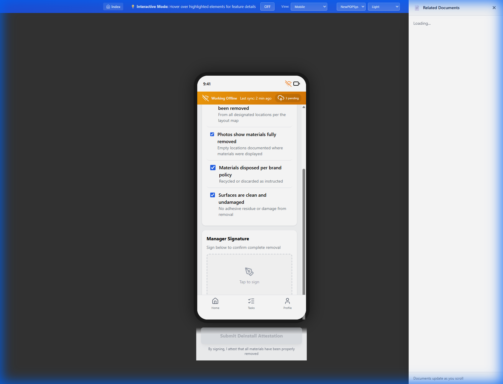 | 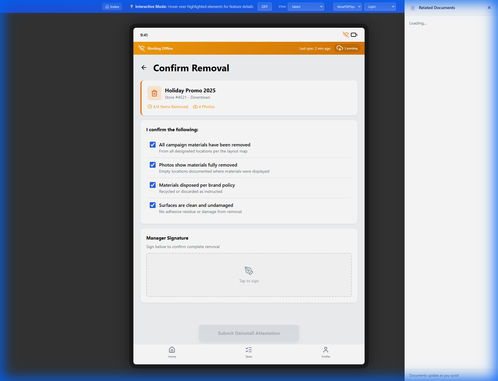 | 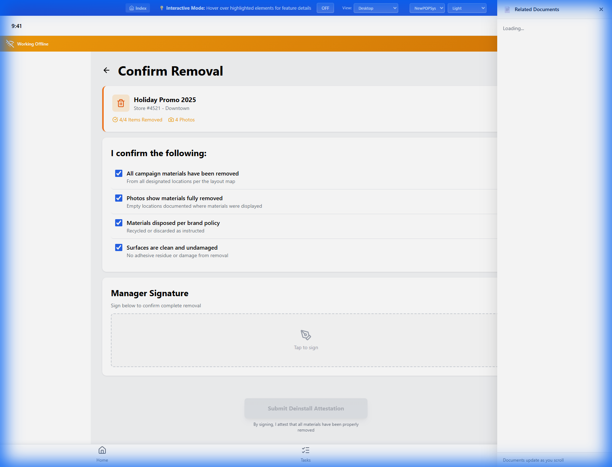 |

---

## 2. User Roles & Permissions

### 2.1 Authorized Roles

| Role | Access Level | Description |
|------|--------------|-------------|
| Store Manager (P07) | Full | Authorized to provide final deinstall sign-off |
| Store Operator (P08) | Execute | Can submit for manager review |

---

## 3. UI Components

| Component ID | Type | Description | Required |
| :--- | :--- | :--- | :--- |
| COMP-M010-001 | Summary | Count of items deinstalled | Yes |
| COMP-M010-002 | Attestation | "I certify materials are removed" checkbox | Yes |
| COMP-M010-003 | Signature | Digital signature pad | No |

---

## 10. Acceptance Criteria

| AC ID | Criterion | Verification Method |
| :--- | :--- | :--- |
| AC-M010-001 | Confirmation updates campaign status to CLOSED | E2E test |
| AC-M010-002 | Signature is captured and stored with audit trail | Manual test |

---

*Document Status: Draft*
*IEEE 830 Compliance: Section 3.2.10 - User Interface Requirements*


---

# Section 7: Brand Admin Module
# Module Overview: BrandAdmin (A-Series)

> **Module ID:** MOD-ADMIN
> **Screen Range:** A001 – A010
> **Version:** 1.0
> **Last Updated:** 2025-01-01

---

## 1. Module Summary

### Purpose

The BrandAdmin module provides brand-level administration capabilities for managing marketing campaigns, digital assets, store networks, and performance reporting. This module serves as the central control hub for brand administrators to oversee all POP/POS marketing activities across their retail network.

### Core Capabilities

| Capability | Description |
|------------|-------------|
| Campaign Management | Create, schedule, and monitor marketing campaigns |
| Asset Library | Centralized repository for marketing materials and templates |
| Store Administration | Manage store profiles, groupings, and regional assignments |
| User Management | Administer brand users, roles, and permissions |
| Reporting & Analytics | Access performance dashboards and generate reports |

### Target Users

- Brand Administrators
- Campaign Managers
- Regional Managers
- Marketing Operations Teams

---

## 2. Screen Inventory

| Screen ID | Screen Name | Route | Status | Priority |
|-----------|-------------|-------|--------|----------|
| A001 | Brand Dashboard | `/admin/dashboard` | Planned | P1 |
| A002 | Campaign Management | `/admin/campaigns` | Planned | P1 |
| A003 | Asset Library | `/admin/assets` | Planned | P1 |
| A004 | Store Management | `/admin/stores` | Planned | P2 |
| A005 | User Management | `/admin/users` | Planned | P2 |
| A006 | Reports & Analytics | `/admin/reports` | Planned | P2 |
| A007 | Reserved | — | Reserved | — |
| A008 | Reserved | — | Reserved | — |
| A009 | Reserved | — | Reserved | — |
| A010 | Reserved | — | Reserved | — |

**Status Legend:** Planned | In Development | Complete | Reserved

---

## 3. Module Dependencies

### Internal Services

| Service | Purpose | Criticality |
|---------|---------|-------------|
| Campaign Service | Campaign CRUD, scheduling, workflow | Critical |
| Asset Service | Asset storage, versioning, metadata | Critical |
| Store Service | Store data, groupings, regions | Critical |
| Analytics Service | Metrics aggregation, report generation | High |
| User Service | Authentication, authorization | Critical |
| Notification Service | Alerts, approvals, reminders | Medium |

### External Integrations

| Integration | Purpose |
|-------------|---------|
| Cloud Storage (S3/Azure) | Asset file storage |
| CDN | Asset delivery to stores |
| Email Service | Notifications and alerts |

---

## 4. RBAC Summary

### Role Permissions Matrix

| Permission | BRAND_ADMIN | CAMPAIGN_MANAGER | REGIONAL_MANAGER |
|------------|:-----------:|:----------------:|:----------------:|
| View Dashboard | ✓ | ✓ | ✓ |
| Manage Campaigns | ✓ | ✓ | — |
| Approve Campaigns | ✓ | — | — |
| Manage Assets | ✓ | ✓ | — |
| Manage Stores | ✓ | — | View Only |
| Manage Users | ✓ | — | — |
| Access Reports | ✓ | ✓ | ✓ (Regional) |
| System Settings | ✓ | — | — |

### Role Descriptions

- **BRAND_ADMIN:** Full administrative access to all module features
- **CAMPAIGN_MANAGER:** Campaign and asset management; no user/store admin
- **REGIONAL_MANAGER:** View-only access with regional data filtering

---

## 5. Key Integration Points

### Asset Management Integration

- Upload and categorize marketing assets
- Version control with approval workflows
- Automatic thumbnail and preview generation
- CDN distribution to store displays

### Campaign Workflow Integration

- Campaign creation with asset assignment
- Store targeting and scheduling
- Multi-level approval chains
- Automated deployment triggers

### Approval Chain Integration

| Approval Type | Approvers | SLA |
|---------------|-----------|-----|
| Asset Upload | Campaign Manager  Brand Admin | 24 hours |
| Campaign Launch | Campaign Manager  Brand Admin | 48 hours |
| Store Assignment | Regional Manager  Brand Admin | 24 hours |

### Data Flow

```
Asset Upload  Approval Queue  Asset Library  Campaign Assignment
                                                       
Store Selection  Campaign Schedule  Campaign Creation
       
   Deployment  Store Displays
```

---

## 6. Revision History

| Version | Date | Author | Changes |
|---------|------|--------|---------|
| 1.0 | 2025-01-01 | System | Initial module overview |

---

*This document provides a high-level overview of the BrandAdmin module. For detailed screen specifications, refer to individual SRS documents (A001-SRS through A006-SRS).*


---
# B001 - Brand Admin Dashboard

> **SRS Section**: 7.1.1 | **Module**: BrandAdmin (B-Series)
> **Version**: 1.0 | **Status**: Draft
> **Last Updated**: 2026-01-01

---

## 1. Screen Overview

### 1.1 Purpose

The Brand Admin Dashboard serves as the primary landing page for brand-level users, providing at-a-glance visibility into campaign performance, store compliance, and pending actions requiring attention.

### 1.2 Access Control

| Role | Access Level |
|------|--------------|
| BRAND_ADMIN | Full access |
| CAMPAIGN_MANAGER | Full access (scoped to assigned campaigns) |
| REGIONAL_MANAGER | Read-only (scoped to assigned regions) |

### 1.3 Navigation Path

- **Route**: `/admin/dashboard`
- **Entry Points**:
  - Direct URL navigation
  - Post-login redirect (default landing)
  - Brand logo/home link in navigation

### 1.4 Screenshot Reference


---

## 2. User Roles & Permissions

### 2.1 Role-Based Access Matrix

| Capability | BRAND_ADMIN | CAMPAIGN_MANAGER | REGIONAL_MANAGER |
|------------|:-----------:|:----------------:|:----------------:|
| View all KPIs | Y | Y* | Y* |
| View all campaigns | Y | Y* | Y* |
| Access quick actions | Y | Y* | N |
| View pending reviews count | Y | Y* | Y* |
| Click-through to Campaign Builder | Y | Y | N |
| Click-through to Verification Queue | Y | Y* | Y* |

**Legend**: Y = Full access | Y* = Scoped access | N = No access

### 2.2 Data Scoping Rules

| REQ-ID | Requirement |
|--------|-------------|
| REQ-B001-SEC-001 | Campaign Managers SHALL only see metrics for campaigns explicitly assigned to them |
| REQ-B001-SEC-002 | Regional Managers SHALL only see metrics for stores within their assigned region scope |
| REQ-B001-SEC-003 | All dashboard data SHALL be filtered by the authenticated user's `brand_id` from JWT |

---

## 3. UI Components

### 3.1 Layout Structure


### 3.2 Component Specifications

| Component | Type | Description |
|-----------|------|-------------|
| KPI Cards | Stat card grid | 4-column grid of primary metrics |
| Quick Actions | Button group | Primary action shortcuts |
| Recent Campaigns | Data table | Top 5 campaigns by activity |
| Campaign Progress | Progress bar | Visual completion indicator |

### 3.3 KPI Card Definitions

| Card | Metric | Calculation | Click Action |
|------|--------|-------------|--------------|
| Active Campaigns | Count | `campaigns WHERE status = 'PUBLISHED'` | Navigate to Campaign List (Active tab) |
| Total Stores | Count | `stores WHERE deleted_at IS NULL` | Navigate to Store List |
| Pending Reviews | Count | `photo_uploads WHERE review_status = 'PENDING'` | Navigate to Verification Queue |
| Compliance Rate | Percentage | `(completed_assignments / total_assignments) * 100` | Navigate to Compliance Report |

### 3.4 Component States

| State | KPI Cards | Quick Actions | Recent Campaigns |
|-------|-----------|---------------|------------------|
| Loading | Skeleton placeholders | Disabled | Skeleton rows |
| Empty | "0" with muted styling | Enabled | "No campaigns yet" message |
| Error | Error icon + retry | Enabled | Error message + retry |
| Loaded | Formatted values | Enabled | Campaign rows |

---

## 4. Data Requirements

### 4.1 Entities & Fields

| Entity | Fields Used | Access |
|--------|-------------|--------|
| `campaigns` | id, name, status, install_start, install_end | Read |
| `store_assignments` | id, campaign_id, status, store_id | Read |
| `stores` | id, name, region_id | Read |
| `photo_uploads` | id, review_status, created_at | Read |
| `brands` | id, name, logo_url | Read |

### 4.2 Aggregation Queries

| REQ-ID | Requirement |
|--------|-------------|
| REQ-B001-DATA-001 | Active campaign count SHALL be computed as `COUNT(*) FROM campaigns WHERE brand_id = ? AND status = 'PUBLISHED' AND deleted_at IS NULL` |
| REQ-B001-DATA-002 | Pending review count SHALL be computed by joining photo_uploads to store_assignments to campaigns filtered by brand_id |
| REQ-B001-DATA-003 | Compliance rate SHALL be calculated as percentage of store_assignments with status = 'COMPLETE' |
| REQ-B001-DATA-004 | Recent campaigns list SHALL return top 5 campaigns ordered by updated_at DESC |

### 4.3 Data Refresh

| REQ-ID | Requirement |
|--------|-------------|
| REQ-B001-DATA-005 | Dashboard data SHALL refresh automatically every 60 seconds via polling |
| REQ-B001-DATA-006 | Manual refresh SHALL be available via pull-to-refresh on mobile or refresh button |

---

## 5. Business Rules & Validation

### 5.1 Display Rules

| REQ-ID | Rule |
|--------|------|
| REQ-B001-BR-001 | Compliance Rate SHALL display as percentage with one decimal place (e.g., "94.2%") |
| REQ-B001-BR-002 | Campaign progress bars SHALL use color coding: Green (>=80%), Yellow (50-79%), Red (<50%) |
| REQ-B001-BR-003 | Draft campaigns SHALL NOT be included in Active Campaigns count |
| REQ-B001-BR-004 | Archived and Cancelled campaigns SHALL NOT appear in Recent Campaigns list |

### 5.2 Scoping Rules

| REQ-ID | Rule |
|--------|------|
| REQ-B001-BR-005 | All metrics SHALL respect multi-tenant isolation via brand_id |
| REQ-B001-BR-006 | Campaign Manager view SHALL filter by campaign_ids from memberships table |
| REQ-B001-BR-007 | Regional Manager view SHALL filter by region_scope_id from memberships table |

---

## 6. API Integration Points

### 6.1 API Endpoints

| Endpoint | Method | Purpose |
|----------|--------|---------|
| `/api/v1/dashboard/summary` | GET | Retrieve all KPI metrics |
| `/api/v1/campaigns` | GET | List recent campaigns |
| `/api/v1/photos/pending/count` | GET | Get pending review count |

### 6.2 Request/Response Specifications

**GET /api/v1/dashboard/summary**

```json
// Response 200 OK
{
  "activeCampaigns": 12,
  "totalStores": 847,
  "pendingReviews": 23,
  "complianceRate": 94.2,
  "lastUpdated": "2026-01-01T10:30:00Z"
}
```

**GET /api/v1/campaigns?limit=5&sort=-updated_at&status[]=PUBLISHED&status[]=DRAFT**

```json
// Response 200 OK
{
  "data": [
    {
      "id": "uuid",
      "name": "Summer Promo 2025",
      "status": "PUBLISHED",
      "storeCount": 234,
      "completionRate": 80.0,
      "installStart": "2025-12-01",
      "installEnd": "2025-12-31"
    }
  ],
  "meta": {
    "total": 5,
    "limit": 5,
    "offset": 0
  }
}
```

### 6.3 API Requirements

| REQ-ID | Requirement |
|--------|-------------|
| REQ-B001-API-001 | Dashboard summary endpoint SHALL respond within 500ms for brands with up to 10,000 stores |
| REQ-B001-API-002 | All API responses SHALL include ETag headers for cache validation |
| REQ-B001-API-003 | API SHALL return 403 Forbidden if user lacks brand-level access |

---

## 7. State Transitions

### 7.1 Page Load State Machine

[Diagram - See rendered image above or refer to source document]

### 7.2 State Definitions

| State | Trigger | UI Behavior |
|-------|---------|-------------|
| Initial | Page mount | Show loading state |
| Loading | API request in flight | Display skeleton UI |
| Loaded | API success | Render data |
| Error | API failure | Show error message with retry option |
| Stale | 60 seconds elapsed | Background refresh, keep current data visible |

---

## 8. Error Handling

### 8.1 Error Scenarios

| Error | HTTP Code | User Message | Recovery Action |
|-------|-----------|--------------|-----------------|
| Network failure | - | "Unable to load dashboard. Check your connection." | Retry button |
| Server error | 500 | "Something went wrong. Please try again." | Retry button |
| Unauthorized | 401 | Redirect to login | Auto-redirect |
| Forbidden | 403 | "You don't have access to this brand." | Contact admin link |
| Timeout | 504 | "Request timed out. Please try again." | Retry button |

### 8.2 Error Requirements

| REQ-ID | Requirement |
|--------|-------------|
| REQ-B001-ERR-001 | Partial failures SHALL NOT block entire dashboard; failed sections SHALL show individual error states |
| REQ-B001-ERR-002 | All errors SHALL be logged to monitoring system with correlation ID |
| REQ-B001-ERR-003 | Error messages SHALL NOT expose internal system details |

---

## 9. Accessibility Requirements

| REQ-ID | Requirement | WCAG Criterion |
|--------|-------------|----------------|
| REQ-B001-A11Y-001 | All KPI values SHALL be announced by screen readers with context (e.g., "Active Campaigns: 12") | 1.3.1 Info and Relationships |
| REQ-B001-A11Y-002 | KPI cards SHALL be keyboard navigable with Enter/Space to activate | 2.1.1 Keyboard |
| REQ-B001-A11Y-003 | Progress bars SHALL have aria-valuenow, aria-valuemin, aria-valuemax attributes | 4.1.2 Name, Role, Value |
| REQ-B001-A11Y-004 | Color-coded elements SHALL have additional non-color indicators | 1.4.1 Use of Color |
| REQ-B001-A11Y-005 | Loading states SHALL announce "Loading dashboard" to screen readers | 4.1.3 Status Messages |
| REQ-B001-A11Y-006 | Focus order SHALL follow visual layout: KPIs  Quick Actions  Recent Campaigns | 2.4.3 Focus Order |

---

## 10. Acceptance Criteria

### 10.1 Functional Requirements

| REQ-ID | Criterion | Priority |
|--------|-----------|----------|
| REQ-B001-FR-001 | Dashboard SHALL display Active Campaigns count accurately | Must |
| REQ-B001-FR-002 | Dashboard SHALL display Total Stores count for the brand | Must |
| REQ-B001-FR-003 | Dashboard SHALL display Pending Reviews count with real-time accuracy | Must |
| REQ-B001-FR-004 | Dashboard SHALL display Compliance Rate as percentage | Must |
| REQ-B001-FR-005 | Clicking KPI card SHALL navigate to corresponding detail view | Must |
| REQ-B001-FR-006 | Quick Actions SHALL navigate to correct destinations | Must |
| REQ-B001-FR-007 | Recent Campaigns table SHALL show top 5 campaigns by activity | Should |
| REQ-B001-FR-008 | Campaign progress bars SHALL reflect actual completion percentage | Must |
| REQ-B001-FR-009 | Dashboard SHALL auto-refresh every 60 seconds | Should |
| REQ-B001-FR-010 | Dashboard SHALL load within 2 seconds under normal conditions | Must |

### 10.2 Test Scenarios

| Test ID | Scenario | Expected Result |
|---------|----------|-----------------|
| TC-B001-01 | Brand Admin loads dashboard | All 4 KPIs display with correct values |
| TC-B001-02 | Campaign Manager loads dashboard | KPIs filtered to assigned campaigns only |
| TC-B001-03 | Click Active Campaigns KPI | Navigate to Campaign List with Active filter |
| TC-B001-04 | Network disconnected | Error state with retry button |
| TC-B001-05 | Brand with 0 campaigns | Empty state message displayed |
| TC-B001-06 | Keyboard navigation | Tab order follows logical sequence |

---

## 11. Related Screens

| Screen | Relationship |
|--------|--------------|
| [B002 Campaign List](B002_Campaign_List.md) | KPI click-through destination |
| [B006 Store List](B006_Store_List.md) | Quick action destination |
| [B007 Verification](B007_Verification.md) | Pending reviews click-through |

---

## 12. Revision History

| Version | Date | Author | Changes |
|---------|------|--------|---------|
| 1.0 | 2026-01-01 | System | Initial specification |

---

*Document Status: Draft*
*IEEE 830 Compliance: Section 3.2 - Functional Requirements / Screen Specifications*


---
# B002 - Campaign List

> **SRS Section**: 7.1.2 | **Module**: BrandAdmin (B-Series)
> **Version**: 1.0 | **Status**: Draft
> **Last Updated**: 2026-01-01

---

## 1. Screen Overview

### 1.1 Purpose

The Campaign List screen provides brand administrators with a comprehensive view of all campaigns across their lifecycle states. It serves as the primary campaign management hub for creating, monitoring, and administering promotional campaigns.

### 1.2 Access Control

| Role | Access Level |
|------|--------------|
| BRAND_ADMIN | Full access (all campaigns) |
| CAMPAIGN_MANAGER | Scoped access (assigned campaigns only) |
| REGIONAL_MANAGER | Read-only (campaigns with stores in assigned regions) |

### 1.3 Navigation Path

- **Route**: `/admin/campaigns`
- **Entry Points**:
  - Main navigation: "Campaigns" menu item
  - Dashboard: Active Campaigns KPI click-through
  - Quick Actions: "New Campaign" redirects here after creation

### 1.4 Screenshot Reference

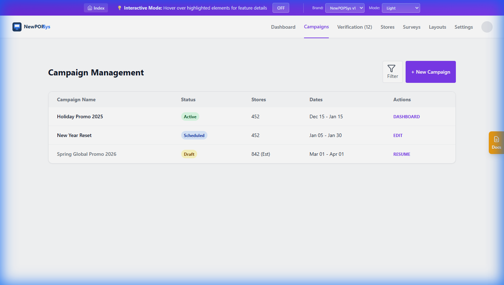

---

## 2. User Roles & Permissions

### 2.1 Role-Based Access Matrix

| Capability | BRAND_ADMIN | CAMPAIGN_MANAGER | REGIONAL_MANAGER |
|------------|:-----------:|:----------------:|:----------------:|
| View all campaigns | Y | N | N |
| View assigned campaigns | Y | Y | Y* |
| Create new campaign | Y | Y | N |
| Edit draft campaign | Y | Y* | N |
| Publish campaign | Y | Y* | N |
| Complete campaign | Y | N | N |
| Archive campaign | Y | N | N |
| Duplicate campaign | Y | Y | N |
| Delete draft campaign | Y | Y* | N |
| Export campaign data | Y | Y* | Y* |

**Legend**: Y = Full access | Y* = Scoped access | N = No access

### 2.2 Scoping Requirements

| REQ-ID | Requirement |
|--------|-------------|
| REQ-B002-SEC-001 | Campaign Managers SHALL only view campaigns where they are explicitly assigned via `memberships.campaign_id` |
| REQ-B002-SEC-002 | Regional Managers SHALL only view campaigns that include stores within their `region_scope_id` |
| REQ-B002-SEC-003 | All campaign data SHALL be isolated by `brand_id` from authenticated user's JWT |

---

## 3. UI Components

### 3.1 Layout Structure


### 3.2 Component Specifications

| Component | Type | Description |
|-----------|------|-------------|
| Page Header | Header bar | Title + primary action button |
| Status Tabs | Tab bar | Filter by campaign status |
| Search Bar | Text input | Full-text campaign search |
| Filter Dropdown | Multi-select | Date range, store group filters |
| Campaign Table | Data table | Sortable, selectable rows |
| Action Menu | Dropdown menu | Row-level actions |
| Pagination | Page controls | Navigate result pages |
| Bulk Actions | Toolbar | Actions for selected rows |

### 3.3 Status Tab Definitions

| Tab | Filter Criteria | Badge Count |
|-----|-----------------|-------------|
| All | No status filter | Total count |
| Active | `status IN ('PUBLISHED', 'SCHEDULED')` | Active count |
| Completed | `status = 'COMPLETED'` | Completed count |
| Draft | `status = 'DRAFT'` | Draft count |
| Archived | `status IN ('ARCHIVED', 'CANCELLED')` | Archived count |

### 3.4 Campaign Status Badges

| Status | Color | Icon | Description |
|--------|-------|------|-------------|
| DRAFT | Gray | â—‹ | Campaign in creation |
| SCHEDULED | Blue | ◐ | Published, awaiting start date |
| PUBLISHED | Green | ● | Active campaign |
| COMPLETED | Green | ✓ | All stores finished |
| CANCELLED | Red | ✕ | Terminated early |
| ARCHIVED | Gray | â–¢ | Historical record |

### 3.5 Row Action Menu

| Action | Visibility Condition | Effect |
|--------|---------------------|--------|
| View | Always | Navigate to Campaign Detail |
| Edit | `status = 'DRAFT'` | Navigate to Campaign Builder |
| Duplicate | Always | Create copy with "Copy of" prefix |
| Publish | `status = 'DRAFT'` | Transition to SCHEDULED/PUBLISHED |
| Complete | `status = 'PUBLISHED'` | Transition to COMPLETED |
| Archive | `status IN ('COMPLETED', 'CANCELLED')` | Transition to ARCHIVED |
| Cancel | `status = 'PUBLISHED'` | Transition to CANCELLED |
| Delete | `status = 'DRAFT'` | Soft delete with confirmation |
| Export | Always | Download campaign data |

---

## 4. Data Requirements

### 4.1 Entities & Fields

| Entity | Fields Used | Access |
|--------|-------------|--------|
| `campaigns` | id, name, status, install_start, install_end, created_at, updated_at | Read |
| `store_assignments` | campaign_id, status (aggregated) | Read |
| `kit_definitions` | campaign_id (count) | Read |
| `users` | id, name (created_by reference) | Read |

### 4.2 List Query Requirements

| REQ-ID | Requirement |
|--------|-------------|
| REQ-B002-DATA-001 | Campaign list SHALL return paginated results with default page size of 20 |
| REQ-B002-DATA-002 | Each campaign row SHALL include aggregated store count from store_assignments |
| REQ-B002-DATA-003 | Progress percentage SHALL be calculated as `(completed_assignments / total_assignments) * 100` |
| REQ-B002-DATA-004 | Search SHALL support partial matching on campaign name (case-insensitive) |
| REQ-B002-DATA-005 | Results SHALL be sortable by name, status, install_start, created_at |

### 4.3 Default Sort Order

| REQ-ID | Requirement |
|--------|-------------|
| REQ-B002-DATA-006 | Default sort SHALL be `updated_at DESC` (most recently modified first) |
| REQ-B002-DATA-007 | Active campaigns SHALL be prioritized over archived in default view |

---

## 5. Business Rules & Validation

### 5.1 Status Transition Rules

| REQ-ID | Rule |
|--------|------|
| REQ-B002-BR-001 | DRAFT → PUBLISHED requires at least one store assignment |
| REQ-B002-BR-002 | DRAFT → PUBLISHED requires at least one kit item defined |
| REQ-B002-BR-003 | PUBLISHED → COMPLETED requires all store_assignments to be COMPLETE or WAIVED |
| REQ-B002-BR-004 | Only BRAND_ADMIN may force-complete a campaign with incomplete stores |
| REQ-B002-BR-005 | ARCHIVED campaigns cannot be modified or transitioned |

### 5.2 Delete Rules

| REQ-ID | Rule |
|--------|------|
| REQ-B002-BR-006 | Only DRAFT campaigns may be deleted |
| REQ-B002-BR-007 | Delete operation SHALL be soft-delete (set deleted_at timestamp) |
| REQ-B002-BR-008 | Delete SHALL require confirmation dialog |

### 5.3 Duplicate Rules

| REQ-ID | Rule |
|--------|------|
| REQ-B002-BR-009 | Duplicate SHALL create new campaign with status = DRAFT |
| REQ-B002-BR-010 | Duplicate SHALL copy kit_definitions and kit_items |
| REQ-B002-BR-011 | Duplicate SHALL NOT copy store_assignments |
| REQ-B002-BR-012 | Duplicate name SHALL be "Copy of {original_name}" |

---

## 6. API Integration Points

### 6.1 API Endpoints

| Endpoint | Method | Purpose |
|----------|--------|---------|
| `/api/v1/campaigns` | GET | List campaigns with filters |
| `/api/v1/campaigns` | POST | Create new campaign |
| `/api/v1/campaigns/{id}` | GET | Get campaign details |
| `/api/v1/campaigns/{id}` | PATCH | Update campaign |
| `/api/v1/campaigns/{id}` | DELETE | Soft delete campaign |
| `/api/v1/campaigns/{id}/duplicate` | POST | Create campaign copy |
| `/api/v1/campaigns/{id}/publish` | POST | Publish campaign |
| `/api/v1/campaigns/{id}/complete` | POST | Complete campaign |
| `/api/v1/campaigns/{id}/archive` | POST | Archive campaign |

### 6.2 List Request Parameters

```
GET /api/v1/campaigns
  ?status[]=PUBLISHED&status[]=DRAFT
  &search=summer
  &sort=-updated_at
  &page=1
  &limit=20
```

### 6.3 List Response Schema

```json
{
  "data": [
    {
      "id": "uuid",
      "name": "Summer Promo 2025",
      "status": "PUBLISHED",
      "installStart": "2025-12-01",
      "installEnd": "2025-12-31",
      "storeCount": 234,
      "completedCount": 187,
      "completionRate": 79.9,
      "createdAt": "2025-11-01T10:00:00Z",
      "updatedAt": "2025-12-15T14:30:00Z",
      "createdBy": {
        "id": "uuid",
        "name": "John Smith"
      }
    }
  ],
  "meta": {
    "total": 47,
    "page": 1,
    "limit": 20,
    "totalPages": 3
  }
}
```

### 6.4 API Requirements

| REQ-ID | Requirement |
|--------|-------------|
| REQ-B002-API-001 | List endpoint SHALL support cursor-based pagination for large datasets |
| REQ-B002-API-002 | All write operations SHALL return updated campaign object |
| REQ-B002-API-003 | Status transitions SHALL be atomic and emit audit events |
| REQ-B002-API-004 | Bulk operations SHALL support up to 50 campaigns per request |

---

## 7. State Transitions

### 7.1 Campaign Lifecycle State Machine

[Diagram - See rendered image above or refer to source document]

### 7.2 UI State Management

| State | Trigger | UI Behavior |
|-------|---------|-------------|
| Loading | Page mount / filter change | Show skeleton rows |
| Empty | API returns 0 results | Show empty state with CTA |
| Loaded | API success | Render campaign rows |
| Error | API failure | Show error with retry |
| Selecting | Checkbox clicked | Enable bulk action toolbar |

---

## 8. Error Handling

### 8.1 Error Scenarios

| Error | HTTP Code | User Message | Recovery Action |
|-------|-----------|--------------|-----------------|
| List fetch failed | 500 | "Unable to load campaigns" | Retry button |
| Publish validation failed | 422 | "Campaign missing required items" | Show validation errors |
| Delete failed | 409 | "Cannot delete active campaign" | Explain status requirement |
| Concurrent edit | 409 | "Campaign was modified by another user" | Refresh and retry |
| Permission denied | 403 | "You don't have permission to {action}" | Contact admin |

### 8.2 Error Requirements

| REQ-ID | Requirement |
|--------|-------------|
| REQ-B002-ERR-001 | Validation errors SHALL highlight specific missing requirements |
| REQ-B002-ERR-002 | Failed bulk operations SHALL report individual success/failure status |
| REQ-B002-ERR-003 | Network errors SHALL preserve form state for retry |

---

## 9. Accessibility Requirements

| REQ-ID | Requirement | WCAG Criterion |
|--------|-------------|----------------|
| REQ-B002-A11Y-001 | Data table SHALL use proper `<table>`, `<th>`, `<td>` markup | 1.3.1 Info and Relationships |
| REQ-B002-A11Y-002 | Status tabs SHALL use `role="tablist"` with proper ARIA attributes | 4.1.2 Name, Role, Value |
| REQ-B002-A11Y-003 | Row selection checkboxes SHALL have accessible labels | 1.3.1 Info and Relationships |
| REQ-B002-A11Y-004 | Status badges SHALL have text alternatives (not just color) | 1.4.1 Use of Color |
| REQ-B002-A11Y-005 | Sort controls SHALL announce current sort state | 4.1.2 Name, Role, Value |
| REQ-B002-A11Y-006 | Pagination controls SHALL indicate current page and total | 2.4.8 Location |
| REQ-B002-A11Y-007 | Action menu SHALL be keyboard accessible with Escape to close | 2.1.1 Keyboard |

---

## 10. Acceptance Criteria

### 10.1 Functional Requirements

| REQ-ID | Criterion | Priority |
|--------|-----------|----------|
| REQ-B002-FR-001 | Campaign list SHALL display all campaigns for brand | Must |
| REQ-B002-FR-002 | Status tabs SHALL filter campaigns by lifecycle state | Must |
| REQ-B002-FR-003 | Search SHALL filter campaigns by name in real-time | Must |
| REQ-B002-FR-004 | Table columns SHALL be sortable | Should |
| REQ-B002-FR-005 | Row actions SHALL reflect campaign state (conditional visibility) | Must |
| REQ-B002-FR-006 | "New Campaign" button SHALL navigate to Campaign Builder | Must |
| REQ-B002-FR-007 | Pagination SHALL navigate between result pages | Must |
| REQ-B002-FR-008 | Bulk selection SHALL enable bulk action toolbar | Should |
| REQ-B002-FR-009 | Duplicate action SHALL create copy with correct naming | Must |
| REQ-B002-FR-010 | Delete action SHALL require confirmation dialog | Must |

### 10.2 Test Scenarios

| Test ID | Scenario | Expected Result |
|---------|----------|-----------------|
| TC-B002-01 | Brand Admin views all campaigns | All campaigns for brand displayed |
| TC-B002-02 | Campaign Manager views campaigns | Only assigned campaigns shown |
| TC-B002-03 | Click Active tab | Only PUBLISHED/SCHEDULED campaigns shown |
| TC-B002-04 | Search for "summer" | Matching campaigns filtered |
| TC-B002-05 | Sort by install date | Campaigns reordered correctly |
| TC-B002-06 | Attempt to publish incomplete draft | Validation errors displayed |
| TC-B002-07 | Duplicate campaign | New draft created with "Copy of" prefix |
| TC-B002-08 | Delete draft campaign | Confirmation shown, campaign removed |
| TC-B002-09 | Select 3 campaigns, bulk archive | All 3 archived successfully |

---

## 11. Related Screens

| Screen | Relationship |
|--------|--------------|
| [B001 Dashboard](B001_Dashboard.md) | Entry point via KPI click |
| [B003 Store Selection](B003_Store_Selection.md) | Campaign Builder Step 1 |
| [B004 Kit Definition](B004_Kit_Definition.md) | Campaign Builder Step 2 |
| [B005 Campaign Review](B005_Campaign_Review.md) | Campaign Builder Step 3 |

---

## 12. Revision History

| Version | Date | Author | Changes |
|---------|------|--------|---------|
| 1.0 | 2026-01-01 | System | Initial specification |

---

*Document Status: Draft*
*IEEE 830 Compliance: Section 3.2 - Functional Requirements / Screen Specifications*


---
# B003 - Store Selection

> **SRS Section**: 7.1.3 | **Module**: BrandAdmin (B-Series)
> **Version**: 1.0 | **Status**: Draft
> **Last Updated**: 2026-01-01

---

## 1. Screen Overview

### 1.1 Purpose

The Store Selection screen is the first step in the Campaign Builder wizard. It allows campaign creators to define which stores will participate in a campaign using a rule-based "Selection Recipe" system that supports both inclusion and exclusion criteria.

### 1.2 Access Control

| Role | Access Level |
|------|--------------|
| BRAND_ADMIN | Full access |
| CAMPAIGN_MANAGER | Full access (for assigned campaigns) |
| REGIONAL_MANAGER | No access |

### 1.3 Navigation Path

- **Route**: `/admin/campaigns/create/stores` (new campaign)
- **Route**: `/admin/campaigns/:id/edit/stores` (edit existing)
- **Entry Points**:
  - Campaign List: "New Campaign" button
  - Campaign Detail: "Edit" action (draft only)
- **Wizard Position**: Step 1 of 3

### 1.4 Screenshot Reference

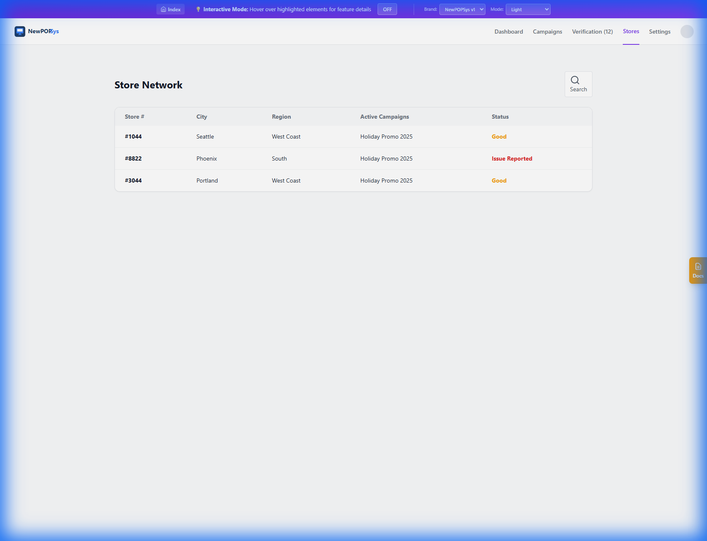

---

## 2. User Roles & Permissions

### 2.1 Role-Based Access Matrix

| Capability | BRAND_ADMIN | CAMPAIGN_MANAGER | REGIONAL_MANAGER |
|------------|:-----------:|:----------------:|:----------------:|
| Access store selection wizard | Y | Y* | N |
| View all regions | Y | Y | N |
| View all store groups | Y | Y | N |
| Add inclusion rules | Y | Y | N |
| Add exclusion rules | Y | Y | N |
| Preview store list | Y | Y | N |
| Save and continue | Y | Y | N |

**Legend**: Y = Full access | Y* = Only for assigned campaigns | N = No access

### 2.2 Data Scoping Requirements

| REQ-ID | Requirement |
|--------|-------------|
| REQ-B003-SEC-001 | Store options SHALL be limited to stores within the authenticated user's brand |
| REQ-B003-SEC-002 | Region hierarchy SHALL only display regions belonging to the brand |
| REQ-B003-SEC-003 | Campaign edits SHALL only be allowed when campaign status = DRAFT |

---

## 3. UI Components

### 3.1 Layout Structure
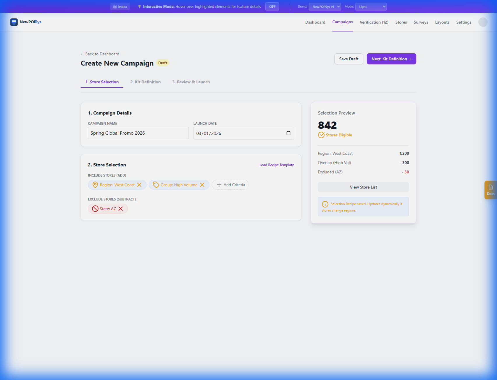

### 3.2 Component Specifications

| Component | Type | Description |
|-----------|------|-------------|
| Wizard Progress | Stepper | Visual step indicator (1/3) |
| Campaign Name | Text input | Required campaign identifier |
| Include Rules | Rule builder | Additive selection criteria |
| Exclude Rules | Rule builder | Subtractive selection criteria |
| Preview Count | Dynamic counter | Real-time store count |
| Store List Modal | Data table modal | Preview selected stores |
| Navigation Buttons | Button group | Cancel, Save & Continue |

### 3.3 Rule Builder Fields

| Field | Operators | Value Options |
|-------|-----------|---------------|
| Region | =, IN | Dropdown of brand regions |
| District | =, IN | Dropdown (filtered by region) |
| Territory | =, IN | Dropdown (filtered by district) |
| Store Group | =, IN | Dropdown of store groups |
| Store Status | =, != | ACTIVE, INACTIVE, ONBOARDING |
| Store Type | =, IN | Multi-select of store types |
| Custom Attribute | =, !=, CONTAINS | Text/value input |

### 3.4 Component States

| State | Campaign Name | Rule Builder | Preview | Actions |
|-------|---------------|--------------|---------|---------|
| Initial | Empty, focused | Empty, hint text | "0 stores" | Disabled |
| Building | Valid input | Rules added | Calculating... | Disabled |
| Ready | Valid input | Valid rules | "234 stores" | Enabled |
| Error | Invalid (red border) | Invalid rule | Error message | Disabled |
| Saving | Readonly | Readonly | Unchanged | Loading spinner |

---

## 4. Data Requirements

### 4.1 Entities & Fields

| Entity | Fields Used | Access |
|--------|-------------|--------|
| `campaigns` | id, name, selection_recipe_json, brand_id | Read/Write |
| `regions` | id, name, parent_region_id | Read |
| `districts` | id, name, region_id | Read |
| `territories` | id, name, district_id | Read |
| `stores` | id, name, store_number, region_id, status | Read |
| `store_groups` | id, name, selection_criteria_json | Read |
| `store_group_memberships` | store_id, group_id | Read |

### 4.2 Selection Recipe Schema

```json
{
  "version": 1,
  "include": [
    {
      "field": "region_id",
      "operator": "IN",
      "values": ["uuid1", "uuid2"]
    },
    {
      "field": "group_id",
      "operator": "=",
      "value": "uuid3"
    }
  ],
  "exclude": [
    {
      "field": "status",
      "operator": "=",
      "value": "INACTIVE"
    }
  ],
  "logic": "AND"
}
```

### 4.3 Data Requirements

| REQ-ID | Requirement |
|--------|-------------|
| REQ-B003-DATA-001 | Selection recipe SHALL be stored as JSONB in `campaigns.selection_recipe_json` |
| REQ-B003-DATA-002 | Store preview count SHALL be calculated server-side for accuracy |
| REQ-B003-DATA-003 | Region hierarchy SHALL support unlimited nesting depth |
| REQ-B003-DATA-004 | Store groups SHALL resolve membership at query time (dynamic) |

---

## 5. Business Rules & Validation

### 5.1 Campaign Name Validation

| REQ-ID | Rule |
|--------|------|
| REQ-B003-BR-001 | Campaign name SHALL be required (minimum 3 characters) |
| REQ-B003-BR-002 | Campaign name SHALL be unique within brand (case-insensitive) |
| REQ-B003-BR-003 | Campaign name SHALL not exceed 100 characters |

### 5.2 Selection Recipe Rules

| REQ-ID | Rule |
|--------|------|
| REQ-B003-BR-004 | At least one inclusion rule SHALL be required |
| REQ-B003-BR-005 | Exclusion rules SHALL be optional |
| REQ-B003-BR-006 | Inclusion rules SHALL be combined with AND logic |
| REQ-B003-BR-007 | Selection SHALL result in at least one store to proceed |
| REQ-B003-BR-008 | Empty selection SHALL display warning but allow save as draft |

### 5.3 Rule Hierarchy

| REQ-ID | Rule |
|--------|------|
| REQ-B003-BR-009 | Exclusions SHALL be applied after inclusions |
| REQ-B003-BR-010 | District filter SHALL cascade to parent region |
| REQ-B003-BR-011 | Duplicate rules (same field+operator+value) SHALL be prevented |

---

## 6. API Integration Points

### 6.1 API Endpoints

| Endpoint | Method | Purpose |
|----------|--------|---------|
| `/api/v1/campaigns` | POST | Create new campaign |
| `/api/v1/campaigns/{id}` | PATCH | Update campaign |
| `/api/v1/campaigns/{id}/preview-stores` | POST | Preview store count |
| `/api/v1/campaigns/{id}/stores` | GET | List selected stores |
| `/api/v1/regions` | GET | List brand regions |
| `/api/v1/store-groups` | GET | List store groups |

### 6.2 Preview Request

```json
// POST /api/v1/campaigns/{id}/preview-stores
{
  "selectionRecipe": {
    "include": [
      {"field": "region_id", "operator": "IN", "values": ["uuid1"]}
    ],
    "exclude": [
      {"field": "status", "operator": "=", "value": "INACTIVE"}
    ]
  }
}
```

### 6.3 Preview Response

```json
{
  "count": 234,
  "breakdown": {
    "byRegion": [
      {"regionId": "uuid1", "name": "Northeast", "count": 156},
      {"regionId": "uuid2", "name": "Midwest", "count": 78}
    ],
    "byStatus": [
      {"status": "ACTIVE", "count": 234}
    ]
  }
}
```

### 6.4 Save Campaign Request

```json
// PATCH /api/v1/campaigns/{id}
{
  "name": "Summer Promo 2025",
  "selectionRecipe": {
    "version": 1,
    "include": [...],
    "exclude": [...],
    "logic": "AND"
  }
}
```

### 6.5 API Requirements

| REQ-ID | Requirement |
|--------|-------------|
| REQ-B003-API-001 | Preview endpoint SHALL respond within 2 seconds for up to 50,000 stores |
| REQ-B003-API-002 | Preview SHALL be debounced on client (300ms delay) |
| REQ-B003-API-003 | Store list endpoint SHALL support pagination |
| REQ-B003-API-004 | Save SHALL validate recipe before persisting |

---

## 7. State Transitions

### 7.1 Wizard Navigation State Machine

[Diagram - See rendered image above or refer to source document]

### 7.2 Form State Machine

[Diagram - See rendered image above or refer to source document]

### 7.3 Preview State

| State | Trigger | Display |
|-------|---------|---------|
| Idle | Initial load | "0 stores selected" |
| Loading | Rule change | "Calculating..." with spinner |
| Ready | Preview success | "{count} stores selected" |
| Warning | Count = 0 | "No stores match criteria" (yellow) |
| Error | Preview failed | "Unable to preview" with retry |

---

## 8. Error Handling

### 8.1 Error Scenarios

| Error | HTTP Code | User Message | Recovery Action |
|-------|-----------|--------------|-----------------|
| Duplicate name | 422 | "Campaign name already exists" | Edit name |
| Invalid recipe | 422 | "Selection rules are invalid" | Fix highlighted rules |
| No stores selected | 422 | "At least one store required to publish" | Add inclusion rules |
| Region not found | 404 | "Selected region no longer exists" | Remove rule |
| Save failed | 500 | "Unable to save campaign" | Retry |
| Session expired | 401 | Redirect to login | Re-authenticate |

### 8.2 Validation Messages

| Field | Validation | Message |
|-------|------------|---------|
| Campaign Name | Required | "Campaign name is required" |
| Campaign Name | Min length | "Name must be at least 3 characters" |
| Campaign Name | Max length | "Name cannot exceed 100 characters" |
| Campaign Name | Unique | "A campaign with this name already exists" |
| Include Rules | Required | "Add at least one inclusion rule" |
| Rule Value | Required | "Select a value for this rule" |

### 8.3 Error Requirements

| REQ-ID | Requirement |
|--------|-------------|
| REQ-B003-ERR-001 | Form validation SHALL occur on blur and on submit |
| REQ-B003-ERR-002 | Inline errors SHALL appear adjacent to invalid fields |
| REQ-B003-ERR-003 | Save errors SHALL preserve all form data |

---

## 9. Accessibility Requirements

| REQ-ID | Requirement | WCAG Criterion |
|--------|-------------|----------------|
| REQ-B003-A11Y-001 | Wizard stepper SHALL announce current step to screen readers | 1.3.1 Info and Relationships |
| REQ-B003-A11Y-002 | Rule builder SHALL support keyboard navigation (Tab, Enter, Escape) | 2.1.1 Keyboard |
| REQ-B003-A11Y-003 | Dropdown options SHALL be filterable via keyboard typing | 2.1.1 Keyboard |
| REQ-B003-A11Y-004 | Form errors SHALL be announced via aria-live regions | 4.1.3 Status Messages |
| REQ-B003-A11Y-005 | Remove rule button SHALL have descriptive aria-label | 4.1.2 Name, Role, Value |
| REQ-B003-A11Y-006 | Preview count SHALL be announced when updated | 4.1.3 Status Messages |
| REQ-B003-A11Y-007 | Focus SHALL move to first error field on validation failure | 2.4.3 Focus Order |

---

## 10. Acceptance Criteria

### 10.1 Functional Requirements

| REQ-ID | Criterion | Priority |
|--------|-----------|----------|
| REQ-B003-FR-001 | User SHALL be able to enter campaign name | Must |
| REQ-B003-FR-002 | User SHALL be able to add inclusion rules | Must |
| REQ-B003-FR-003 | User SHALL be able to add exclusion rules | Must |
| REQ-B003-FR-004 | Rules SHALL support Region, District, Group, Status fields | Must |
| REQ-B003-FR-005 | Preview count SHALL update as rules are modified | Must |
| REQ-B003-FR-006 | User SHALL be able to view full store list | Should |
| REQ-B003-FR-007 | User SHALL be able to remove individual rules | Must |
| REQ-B003-FR-008 | Save SHALL persist campaign and selection recipe | Must |
| REQ-B003-FR-009 | Continue SHALL navigate to Kit Definition step | Must |
| REQ-B003-FR-010 | Cancel SHALL return to Campaign List with confirmation | Should |

### 10.2 Test Scenarios

| Test ID | Scenario | Expected Result |
|---------|----------|-----------------|
| TC-B003-01 | Enter valid campaign name | Name accepted, no errors |
| TC-B003-02 | Enter duplicate campaign name | Error displayed inline |
| TC-B003-03 | Add region inclusion rule | Preview count updates |
| TC-B003-04 | Add status exclusion rule | Preview count reduces |
| TC-B003-05 | Remove all inclusion rules | Warning: "Add at least one rule" |
| TC-B003-06 | Create rules selecting 0 stores | Warning displayed, save allowed |
| TC-B003-07 | Click View Store List | Modal shows matching stores |
| TC-B003-08 | Save & Continue | Navigate to Step 2 |
| TC-B003-09 | Click Cancel with unsaved changes | Confirmation dialog shown |
| TC-B003-10 | Keyboard navigate rule builder | All controls accessible |

---

## 11. Related Screens

| Screen | Relationship |
|--------|--------------|
| [B002 Campaign List](B002_Campaign_List.md) | Entry point, cancel destination |
| [B004 Kit Definition](B004_Kit_Definition.md) | Next wizard step |
| [B006 Store List](B006_Store_List.md) | Store data source |

---

## 12. Revision History

| Version | Date | Author | Changes |
|---------|------|--------|---------|
| 1.0 | 2026-01-01 | System | Initial specification |

---

*Document Status: Draft*
*IEEE 830 Compliance: Section 3.2 - Functional Requirements / Screen Specifications*


---
# B004 - Kit Definition

> **SRS Section**: 7.1.4 | **Module**: BrandAdmin (B-Series)
> **Version**: 1.0 | **Status**: Draft
> **Last Updated**: 2026-01-01

---

## 1. Screen Overview

### 1.1 Purpose

The Kit Definition screen is the second step in the Campaign Builder wizard. It allows campaign creators to define the promotional materials (kit items) that will be distributed to stores, including item specifications, quantities, and optional placement requirements.

### 1.2 Access Control

| Role | Access Level |
|------|--------------|
| BRAND_ADMIN | Full access |
| CAMPAIGN_MANAGER | Full access (for assigned campaigns) |
| REGIONAL_MANAGER | No access |

### 1.3 Navigation Path

- **Route**: `/admin/campaigns/:id/edit/kit`
- **Entry Points**:
  - Campaign Builder Step 1: "Save & Continue" button
  - Campaign Detail: "Edit" action (draft only)
- **Wizard Position**: Step 2 of 3

### 1.4 Screenshot Reference

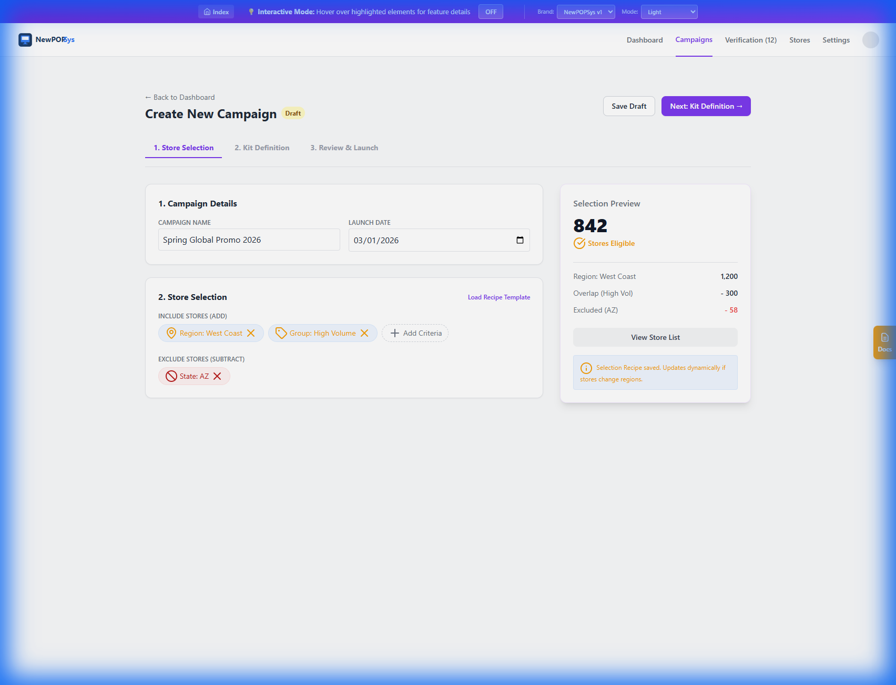

---

## 2. User Roles & Permissions

### 2.1 Role-Based Access Matrix

| Capability | BRAND_ADMIN | CAMPAIGN_MANAGER | REGIONAL_MANAGER |
|------------|:-----------:|:----------------:|:----------------:|
| Access kit definition wizard | Y | Y* | N |
| Add kit items | Y | Y | N |
| Edit kit items | Y | Y | N |
| Remove kit items | Y | Y | N |
| Configure photo requirements | Y | Y | N |
| Assign location slots | Y | Y | N |
| Reorder items (drag-drop) | Y | Y | N |
| Save and continue | Y | Y | N |
| Navigate back to stores | Y | Y | N |

**Legend**: Y = Full access | Y* = Only for assigned campaigns | N = No access

### 2.2 Data Scoping Requirements

| REQ-ID | Requirement |
|--------|-------------|
| REQ-B004-SEC-001 | Kit definitions SHALL be limited to campaigns within the authenticated user's brand |
| REQ-B004-SEC-002 | Location slots SHALL only display slots from store layouts belonging to the brand |
| REQ-B004-SEC-003 | Kit edits SHALL only be allowed when campaign status = DRAFT |
| REQ-B004-SEC-004 | Photo rules SHALL be configurable only by users with kit management permissions |

---

## 3. UI Components

### 3.1 Layout Structure
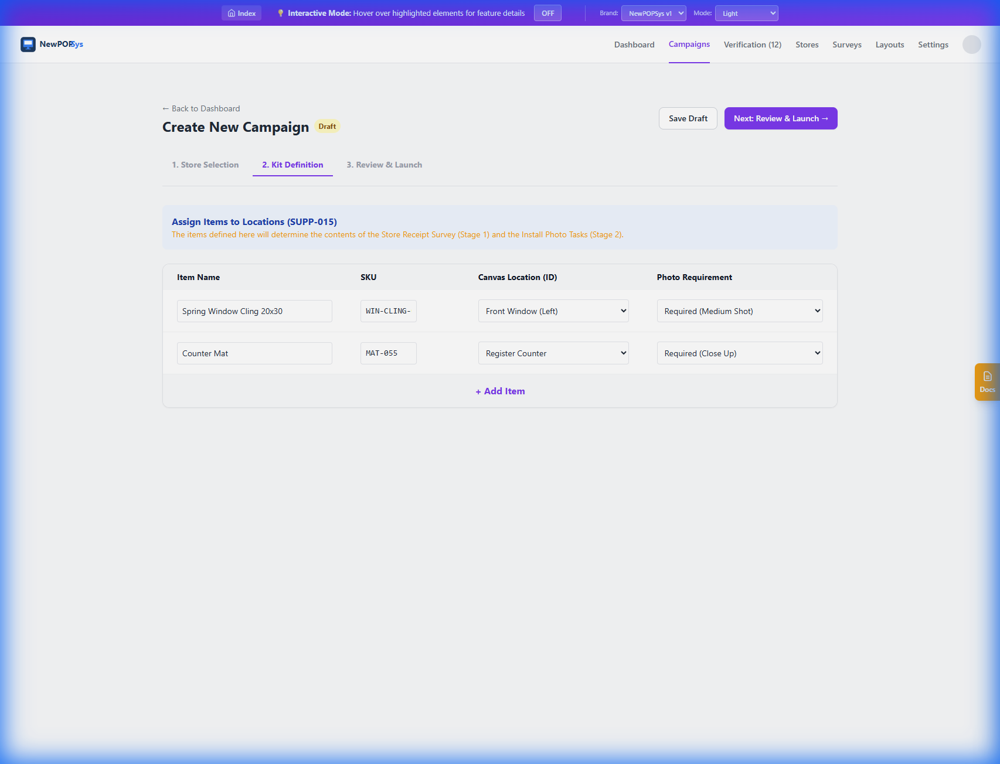

### 3.2 Component Specifications

| Component | Type | Description |
|-----------|------|-------------|
| Wizard Progress | Stepper | Visual step indicator (2/3) with Step 1 checkmark |
| Kit Items List | Sortable list | Drag-drop reorderable item cards |
| Add Item Button | Primary button | Opens item creation modal |
| Item Card | Card component | Displays item details with edit/delete actions |
| Drag Handle | Icon button | Enables drag-drop reordering |
| Item Edit Modal | Modal dialog | Full item configuration form |
| Kit Summary | Summary bar | Aggregated item/unit counts |
| Navigation Buttons | Button group | Back, Save & Continue |

### 3.3 Kit Item Types

| Item Type | Code | Description |
|-----------|------|-------------|
| Poster | POSTER | Wall-mounted promotional poster |
| Standee | STANDEE | Free-standing display |
| Banner | BANNER | Hanging or mounted banner |
| Shelf Talker | SHELF_TALKER | Shelf-edge promotional tag |
| Window Cling | WINDOW_CLING | Adhesive window decoration |
| Counter Display | COUNTER_DISPLAY | Point-of-sale counter unit |

### 3.4 Location Slot Options

| Slot Code | Display Name | Description |
|-----------|--------------|-------------|
| FRONT_WINDOW | Front Window | Primary storefront window |
| END_CAP_A | End Cap A | First aisle end cap |
| END_CAP_B | End Cap B | Second aisle end cap |
| CHECKOUT | Checkout Area | Near registers |
| ENTRY_DOOR | Entry Door | Store entrance |
| BACK_WALL | Back Wall | Rear wall display area |

### 3.5 Component States

| State | Kit Items List | Add Button | Actions | Navigation |
|-------|----------------|------------|---------|------------|
| Initial | Empty, hint text | Enabled | -- | Back enabled, Continue disabled |
| Has Items | Item cards displayed | Enabled | Edit/Delete visible | Both enabled |
| Editing | Item highlighted | Disabled | Modal open | Disabled |
| Dragging | Drop zones visible | Disabled | Hidden | Disabled |
| Saving | Readonly | Disabled | Disabled | Loading spinner |
| Error | Unchanged | Enabled | Enabled | Retry available |

---

## 4. Data Requirements

### 4.1 Entities & Fields

| Entity | Fields Used | Access |
|--------|-------------|--------|
| `kit_definitions` | id, campaign_id, name, is_template | Read/Write |
| `kit_items` | id, kit_definition_id, sku, name, item_type, quantity, sort_order | Read/Write |
| `location_slots` | id, slot_code, name | Read |
| `photo_rules` | id, kit_item_id, min_photos, required_angles[], instructions | Read/Write |
| `campaigns` | id, status | Read |

### 4.2 Kit Item Schema

```json
{
  "id": "uuid",
  "kitDefinitionId": "uuid",
  "name": "Summer Poster (24x36)",
  "sku": "POSTER-SUM-2436",
  "itemType": "POSTER",
  "quantity": 2,
  "locationSlotId": "uuid|null",
  "sortOrder": 1,
  "photoRule": {
    "minPhotos": 1,
    "requiredAngles": ["front"],
    "instructions": "Capture full poster with surrounding context"
  }
}
```

### 4.3 Data Requirements

| REQ-ID | Requirement |
|--------|-------------|
| REQ-B004-DATA-001 | Kit definition SHALL be automatically created when campaign is created |
| REQ-B004-DATA-002 | Kit items SHALL maintain sort_order for consistent display ordering |
| REQ-B004-DATA-003 | Location slot assignment SHALL be optional (nullable foreign key) |
| REQ-B004-DATA-004 | Photo rules SHALL be stored as separate entity linked to kit_item |
| REQ-B004-DATA-005 | Item SKU SHALL be auto-generated if not provided (format: {TYPE}-{CAMPAIGN_CODE}-{SEQ}) |

---

## 5. Business Rules & Validation

### 5.1 Kit Item Validation

| REQ-ID | Rule |
|--------|------|
| REQ-B004-BR-001 | Item name SHALL be required (minimum 3 characters, maximum 100 characters) |
| REQ-B004-BR-002 | Item type SHALL be required and selected from predefined enum |
| REQ-B004-BR-003 | Quantity SHALL be required and between 1 and 999 |
| REQ-B004-BR-004 | SKU SHALL be unique within the kit definition |

### 5.2 Kit Definition Rules

| REQ-ID | Rule |
|--------|------|
| REQ-B004-BR-005 | At least one kit item SHALL be required to proceed to Review step |
| REQ-B004-BR-006 | Maximum of 50 kit items SHALL be allowed per campaign |
| REQ-B004-BR-007 | Total unit count (sum of quantities) SHALL be displayed in summary |
| REQ-B004-BR-008 | Item sort order SHALL be preserved when saving |

### 5.3 Photo Rule Configuration

| REQ-ID | Rule |
|--------|------|
| REQ-B004-BR-009 | Photo requirements SHALL be optional per item |
| REQ-B004-BR-010 | When enabled, minimum photos SHALL default to 1 |
| REQ-B004-BR-011 | Required angles SHALL support: front, left, right, top, detail |
| REQ-B004-BR-012 | Photo instructions SHALL be optional free text (max 500 characters) |

### 5.4 Location Slot Rules

| REQ-ID | Rule |
|--------|------|
| REQ-B004-BR-013 | Same location slot MAY be assigned to multiple items |
| REQ-B004-BR-014 | Location slots SHALL only show slots defined in brand's store layouts |
| REQ-B004-BR-015 | Unassigned slot SHALL be valid (item not location-specific) |

---

## 6. API Integration Points

### 6.1 API Endpoints

| Endpoint | Method | Purpose |
|----------|--------|---------|
| `/api/v1/campaigns/{id}/kit` | GET | Get kit definition with items |
| `/api/v1/campaigns/{id}/kit/items` | POST | Add kit item |
| `/api/v1/campaigns/{id}/kit/items/{itemId}` | PATCH | Update kit item |
| `/api/v1/campaigns/{id}/kit/items/{itemId}` | DELETE | Remove kit item |
| `/api/v1/campaigns/{id}/kit/items/reorder` | POST | Update item sort order |
| `/api/v1/location-slots` | GET | List available location slots |

### 6.2 Get Kit Definition Response

```json
// GET /api/v1/campaigns/{id}/kit
{
  "id": "uuid",
  "campaignId": "uuid",
  "name": "Summer Promo 2025 Kit",
  "items": [
    {
      "id": "uuid",
      "name": "Summer Poster (24x36)",
      "sku": "POSTER-SUM-001",
      "itemType": "POSTER",
      "quantity": 2,
      "sortOrder": 1,
      "locationSlot": {
        "id": "uuid",
        "code": "FRONT_WINDOW",
        "name": "Front Window"
      },
      "photoRule": {
        "minPhotos": 1,
        "requiredAngles": ["front"],
        "instructions": "Capture full poster"
      }
    }
  ],
  "summary": {
    "itemCount": 3,
    "totalUnits": 7
  }
}
```

### 6.3 Add Item Request

```json
// POST /api/v1/campaigns/{id}/kit/items
{
  "name": "Counter Display Stand",
  "itemType": "COUNTER_DISPLAY",
  "quantity": 1,
  "locationSlotId": null,
  "photoRule": {
    "enabled": false
  }
}
```

### 6.4 Reorder Items Request

```json
// POST /api/v1/campaigns/{id}/kit/items/reorder
{
  "itemOrder": [
    { "itemId": "uuid1", "sortOrder": 1 },
    { "itemId": "uuid2", "sortOrder": 2 },
    { "itemId": "uuid3", "sortOrder": 3 }
  ]
}
```

### 6.5 API Requirements

| REQ-ID | Requirement |
|--------|-------------|
| REQ-B004-API-001 | Kit endpoints SHALL validate campaign ownership before any operation |
| REQ-B004-API-002 | Add/Update operations SHALL return the complete updated item object |
| REQ-B004-API-003 | Reorder operation SHALL be atomic (all-or-nothing) |
| REQ-B004-API-004 | Delete operation SHALL return 204 No Content on success |

---

## 7. State Transitions

### 7.1 Wizard Navigation State Machine

[Diagram - See rendered image above or refer to source document]

### 7.2 Item Edit State Machine

[Diagram - See rendered image above or refer to source document]

### 7.3 Drag-Drop State Machine

[Diagram - See rendered image above or refer to source document]

### 7.4 Item Card States

| State | Trigger | UI Behavior |
|-------|---------|-------------|
| Default | Normal display | Card with actions visible on hover |
| Hover | Mouse enter | Highlight, show all actions |
| Dragging | Drag start | Elevated shadow, placeholder in list |
| Editing | Edit click | Modal open, card dimmed |
| Deleting | Delete confirm | Fade out animation |

---

## 8. Error Handling

### 8.1 Error Scenarios

| Error | HTTP Code | User Message | Recovery Action |
|-------|-----------|--------------|-----------------|
| Duplicate SKU | 422 | "An item with this SKU already exists" | Edit SKU |
| Max items exceeded | 422 | "Maximum of 50 items per campaign" | Remove items |
| Invalid quantity | 422 | "Quantity must be between 1 and 999" | Correct quantity |
| Campaign not draft | 403 | "Cannot modify published campaign" | Return to list |
| Save failed | 500 | "Unable to save item" | Retry |
| Reorder failed | 500 | "Unable to update order" | Refresh list |

### 8.2 Validation Messages

| Field | Validation | Message |
|-------|------------|---------|
| Item Name | Required | "Item name is required" |
| Item Name | Min length | "Name must be at least 3 characters" |
| Item Name | Max length | "Name cannot exceed 100 characters" |
| Item Type | Required | "Select an item type" |
| Quantity | Required | "Quantity is required" |
| Quantity | Range | "Quantity must be between 1 and 999" |
| SKU | Unique | "SKU is already in use" |
| Photo Instructions | Max length | "Instructions cannot exceed 500 characters" |

### 8.3 Error Requirements

| REQ-ID | Requirement |
|--------|-------------|
| REQ-B004-ERR-001 | Form validation SHALL occur on blur and on submit |
| REQ-B004-ERR-002 | Modal SHALL remain open on validation error with fields highlighted |
| REQ-B004-ERR-003 | Failed drag-drop SHALL revert to original order |
| REQ-B004-ERR-004 | Network errors SHALL preserve unsaved modal data |

---

## 9. Accessibility Requirements

| REQ-ID | Requirement | WCAG Criterion |
|--------|-------------|----------------|
| REQ-B004-A11Y-001 | Wizard stepper SHALL announce current step and completion status | 1.3.1 Info and Relationships |
| REQ-B004-A11Y-002 | Drag-drop SHALL have keyboard alternative (move up/down buttons) | 2.1.1 Keyboard |
| REQ-B004-A11Y-003 | Item cards SHALL be keyboard navigable with Enter to edit | 2.1.1 Keyboard |
| REQ-B004-A11Y-004 | Modal dialogs SHALL trap focus until dismissed | 2.4.3 Focus Order |
| REQ-B004-A11Y-005 | Delete confirmation SHALL be announced to screen readers | 4.1.3 Status Messages |
| REQ-B004-A11Y-006 | Item type icons SHALL have text alternatives | 1.1.1 Non-text Content |
| REQ-B004-A11Y-007 | Sort order changes SHALL be announced via aria-live | 4.1.3 Status Messages |
| REQ-B004-A11Y-008 | Form errors SHALL move focus to first invalid field | 2.4.3 Focus Order |

---

## 10. Acceptance Criteria

### 10.1 Functional Requirements

| REQ-ID | Criterion | Priority |
|--------|-----------|----------|
| REQ-B004-FR-001 | User SHALL be able to add kit items with name, type, quantity | Must |
| REQ-B004-FR-002 | User SHALL be able to edit existing kit items | Must |
| REQ-B004-FR-003 | User SHALL be able to delete kit items with confirmation | Must |
| REQ-B004-FR-004 | User SHALL be able to reorder items via drag-drop | Should |
| REQ-B004-FR-005 | User SHALL be able to assign location slots to items | Should |
| REQ-B004-FR-006 | User SHALL be able to configure photo requirements per item | Must |
| REQ-B004-FR-007 | Kit summary SHALL display item count and total units | Must |
| REQ-B004-FR-008 | Save SHALL persist all items and navigate to Review step | Must |
| REQ-B004-FR-009 | Back button SHALL return to Store Selection step | Must |
| REQ-B004-FR-010 | Empty kit SHALL prevent navigation to Review step | Must |

### 10.2 Test Scenarios

| Test ID | Scenario | Expected Result |
|---------|----------|-----------------|
| TC-B004-01 | Add first kit item | Item appears in list, summary shows "1 item" |
| TC-B004-02 | Add item with photo requirement | Photo rule saved and displayed |
| TC-B004-03 | Edit existing item | Changes reflected immediately |
| TC-B004-04 | Delete item with confirmation | Item removed, summary updated |
| TC-B004-05 | Drag item to new position | Order updated, sort_order persisted |
| TC-B004-06 | Assign location slot | Slot displayed on item card |
| TC-B004-07 | Add item with duplicate SKU | Validation error shown |
| TC-B004-08 | Attempt to proceed with empty kit | Continue button disabled, message shown |
| TC-B004-09 | Save and continue | Navigate to Review step |
| TC-B004-10 | Keyboard reorder via move buttons | Items reordered without mouse |

---

## 11. Related Screens

| Screen | Relationship |
|--------|--------------|
| [B003 Store Selection](B003_Store_Selection.md) | Previous wizard step |
| [B005 Campaign Review](B005_Campaign_Review.md) | Next wizard step |
| [B002 Campaign List](B002_Campaign_List.md) | Cancel destination |

---

## 12. Revision History

| Version | Date | Author | Changes |
|---------|------|--------|---------|
| 1.0 | 2026-01-01 | System | Initial specification |

---

*Document Status: Draft*
*IEEE 830 Compliance: Section 3.2 - Functional Requirements / Screen Specifications*


---
# B005 - Campaign Review & Launch

> **SRS Section**: 7.1.5 | **Module**: BrandAdmin (B-Series)
> **Version**: 1.0 | **Status**: Draft
> **Last Updated**: 2026-01-01

---

## 1. Screen Overview

### 1.1 Purpose

The Campaign Review screen is the final step in the Campaign Builder wizard. It presents a comprehensive summary of the campaign configuration including selected stores, kit definitions, and scheduling details. Upon approval, the publish action creates store assignments and triggers initial order generation.

### 1.2 Access Control

| Role | Access Level |
|------|--------------|
| BRAND_ADMIN | Full access |
| CAMPAIGN_MANAGER | Full access (for assigned campaigns) |
| REGIONAL_MANAGER | No access |

### 1.3 Navigation Path

- **Route**: `/admin/campaigns/:id/edit/review` (wizard step 3)
- **Route**: `/admin/campaigns/:id/review` (standalone review)
- **Entry Points**:
  - Campaign Builder: "Continue" from Kit Definition step
  - Campaign Detail: "Review" action (draft only)
- **Wizard Position**: Step 3 of 3

### 1.4 Screenshot Reference


---

## 2. User Roles & Permissions

### 2.1 Role-Based Access Matrix

| Capability | BRAND_ADMIN | CAMPAIGN_MANAGER | REGIONAL_MANAGER |
|------------|:-----------:|:----------------:|:----------------:|
| Access review screen | Y | Y* | N |
| View campaign summary | Y | Y* | N |
| Edit install dates | Y | Y* | N |
| Modify scheduling | Y | Y* | N |
| Publish campaign | Y | Y* | N |
| Schedule campaign | Y | Y* | N |
| Save as draft | Y | Y* | N |
| Navigate back to edit | Y | Y* | N |

**Legend**: Y = Full access | Y* = Only for assigned campaigns | N = No access

### 2.2 Data Scoping Requirements

| REQ-ID | Requirement |
|--------|-------------|
| REQ-B005-SEC-001 | Campaign data SHALL be restricted to the authenticated user's brand_id |
| REQ-B005-SEC-002 | Campaign Manager access SHALL be validated against memberships table |
| REQ-B005-SEC-003 | Publish action SHALL only be available when campaign status = DRAFT |

---

## 3. UI Components

### 3.1 Layout Structure


### 3.2 Component Specifications

| Component | Type | Description |
|-----------|------|-------------|
| Wizard Progress | Stepper | Visual step indicator (3/3) |
| Campaign Summary Card | Info card | Name, status, quick edit link |
| Store Selection Summary | Summary card | Store count, region breakdown |
| Kit Definition Summary | Summary card | Item count, piece count, photo rules |
| Installation Schedule | Date range picker | Start and end date selection |
| Late Installation Toggle | Checkbox | Optional grace period extension |
| Pre-Launch Checklist | Validation list | Real-time publish readiness |
| Action Buttons | Button group | Back, Save Draft, Publish |

### 3.3 Summary Card Details

#### 3.3.1 Store Selection Summary

| Metric | Source | Display |
|--------|--------|---------|
| Total Stores | Selection recipe evaluation | "234 stores selected" |
| Region Count | Distinct regions in selection | "3 regions" |
| Exclusion Count | Exclusion rules applied | "0 exclusions" |

#### 3.3.2 Kit Definition Summary

| Metric | Source | Display |
|--------|--------|---------|
| Item Count | kit_items.count | "5 items defined" |
| Total Pieces | SUM(kit_items.quantity) | "12 total pieces" |
| Photo Requirements | kit_items with photo_rule_id | "3 photo requirements" |

### 3.4 Pre-Launch Checklist Items

| Item | Validation | Pass Condition |
|------|------------|----------------|
| Campaign name | Required field | name.length >= 3 |
| Store selection | Selection recipe | store_count > 0 |
| Kit items | Kit definition | kit_items.length > 0 |
| Photo requirements | Photo rules | All items with requires_photo have rules |
| Install dates | Date range | install_start < install_end |
| Item SKUs | Optional warning | All items have SKU defined |

### 3.5 Component States

| State | Summary Cards | Schedule | Checklist | Publish Button |
|-------|---------------|----------|-----------|----------------|
| Loading | Skeleton | Skeleton | Skeleton | Disabled |
| Incomplete | Data shown | Editable | Shows failures | Disabled |
| Ready | Data shown | Editable | All passed | Enabled |
| Publishing | Readonly | Readonly | Readonly | Loading spinner |
| Error | Data shown | Editable | Shows failures | Retry enabled |

---

## 4. Data Requirements

### 4.1 Entities & Fields

| Entity | Fields Used | Access |
|--------|-------------|--------|
| `campaigns` | id, name, status, install_start, install_end, selection_recipe_json | Read/Write |
| `kit_definitions` | id, campaign_id, name | Read |
| `kit_items` | id, kit_definition_id, sku, quantity, photo_rule_id | Read |
| `stores` | id, region_id (aggregated) | Read |
| `regions` | id, name | Read |
| `store_assignments` | (created on publish) | Write |
| `store_orders` | (created on publish) | Write |

### 4.2 Campaign Summary Query

```sql
SELECT
  c.id,
  c.name,
  c.status,
  c.install_start,
  c.install_end,
  c.selection_recipe_json,
  COUNT(DISTINCT ki.id) as item_count,
  SUM(ki.quantity) as total_pieces,
  COUNT(DISTINCT ki.photo_rule_id) FILTER (WHERE ki.photo_rule_id IS NOT NULL) as photo_rule_count
FROM campaigns c
LEFT JOIN kit_definitions kd ON kd.campaign_id = c.id
LEFT JOIN kit_items ki ON ki.kit_definition_id = kd.id
WHERE c.id = :campaign_id
  AND c.deleted_at IS NULL
GROUP BY c.id;
```

### 4.3 Data Requirements

| REQ-ID | Requirement |
|--------|-------------|
| REQ-B005-DATA-001 | Summary data SHALL be fetched in a single optimized query |
| REQ-B005-DATA-002 | Store count SHALL be calculated from selection recipe at query time |
| REQ-B005-DATA-003 | Checklist validation SHALL be performed server-side before publish |
| REQ-B005-DATA-004 | Publish operation SHALL be atomic (all-or-nothing transaction) |

---

## 5. Business Rules & Validation

### 5.1 Date Validation Rules

| REQ-ID | Rule |
|--------|------|
| REQ-B005-BR-001 | Install start date SHALL be required for publish |
| REQ-B005-BR-002 | Install end date SHALL be required for publish |
| REQ-B005-BR-003 | Install start SHALL be >= current date |
| REQ-B005-BR-004 | Install end SHALL be > install start |
| REQ-B005-BR-005 | Date range SHALL not exceed 90 days without admin approval |

### 5.2 Publish Prerequisites

| REQ-ID | Rule |
|--------|------|
| REQ-B005-BR-006 | Campaign name SHALL be at least 3 characters |
| REQ-B005-BR-007 | At least one store SHALL be selected |
| REQ-B005-BR-008 | At least one kit item SHALL be defined |
| REQ-B005-BR-009 | All kit items requiring photos SHALL have photo rules assigned |
| REQ-B005-BR-010 | Campaign status SHALL be DRAFT to allow publish |

### 5.3 Publish Actions

| REQ-ID | Rule |
|--------|------|
| REQ-B005-BR-011 | Publish SHALL create store_assignments for each selected store |
| REQ-B005-BR-012 | Publish SHALL create assignment_items for each kit_item per store |
| REQ-B005-BR-013 | Publish SHALL generate initial store_orders with status GENERATED |
| REQ-B005-BR-014 | Campaign status SHALL transition to SCHEDULED if start_date > today |
| REQ-B005-BR-015 | Campaign status SHALL transition to PUBLISHED if start_date <= today |

### 5.4 Late Installation Option

| REQ-ID | Rule |
|--------|------|
| REQ-B005-BR-016 | Late installation grace period SHALL default to 7 days |
| REQ-B005-BR-017 | Grace period SHALL be configurable at brand level (1-30 days) |
| REQ-B005-BR-018 | Stores MAY submit installations after end_date if grace period enabled |

---

## 6. API Integration Points

### 6.1 API Endpoints

| Endpoint | Method | Purpose |
|----------|--------|---------|
| `/api/v1/campaigns/{id}` | GET | Get campaign with summary |
| `/api/v1/campaigns/{id}` | PATCH | Update install dates |
| `/api/v1/campaigns/{id}/summary` | GET | Get detailed summary |
| `/api/v1/campaigns/{id}/validate` | POST | Validate publish readiness |
| `/api/v1/campaigns/{id}/publish` | POST | Execute publish workflow |

### 6.2 Summary Request

```json
// GET /api/v1/campaigns/{id}/summary
// Response 200 OK
{
  "campaign": {
    "id": "uuid",
    "name": "Summer Promo 2025",
    "status": "DRAFT",
    "installStart": "2025-12-01",
    "installEnd": "2025-12-31",
    "allowLateInstallation": true,
    "gracePeriodDays": 7
  },
  "storeSelection": {
    "totalStores": 234,
    "regions": [
      {"id": "uuid", "name": "Northeast", "storeCount": 156},
      {"id": "uuid", "name": "Midwest", "storeCount": 78}
    ],
    "exclusionCount": 0
  },
  "kitDefinition": {
    "itemCount": 5,
    "totalPieces": 12,
    "photoRequirements": 3,
    "items": [
      {"id": "uuid", "name": "Window Banner", "quantity": 2, "hasSku": true},
      {"id": "uuid", "name": "Counter Display", "quantity": 1, "hasSku": false}
    ]
  },
  "checklist": {
    "campaignName": {"passed": true, "message": "Campaign name defined"},
    "storeSelection": {"passed": true, "message": "234 stores selected"},
    "kitItems": {"passed": true, "message": "5 items defined"},
    "photoRules": {"passed": true, "message": "Photo requirements configured"},
    "installDates": {"passed": true, "message": "Install dates set"},
    "itemSkus": {"passed": false, "message": "2 items missing SKUs", "fixable": true}
  },
  "readyToPublish": false
}
```

### 6.3 Validate Request

```json
// POST /api/v1/campaigns/{id}/validate
// Response 200 OK
{
  "valid": false,
  "errors": [
    {
      "code": "MISSING_SKU",
      "field": "kit_items",
      "message": "2 items are missing SKUs",
      "itemIds": ["uuid1", "uuid2"]
    }
  ],
  "warnings": [
    {
      "code": "LARGE_CAMPAIGN",
      "message": "This campaign will create 234 store assignments"
    }
  ]
}
```

### 6.4 Publish Request

```json
// POST /api/v1/campaigns/{id}/publish
{
  "installStart": "2025-12-01",
  "installEnd": "2025-12-31",
  "allowLateInstallation": true,
  "gracePeriodDays": 7,
  "notifyStores": true
}
```

### 6.5 Publish Response

```json
// Response 200 OK
{
  "campaign": {
    "id": "uuid",
    "status": "SCHEDULED",
    "publishedAt": "2025-11-15T10:30:00Z",
    "publishedBy": "uuid"
  },
  "assignments": {
    "created": 234,
    "storeOrders": 234
  },
  "notifications": {
    "scheduled": 234,
    "method": "email"
  }
}
```

### 6.6 API Requirements

| REQ-ID | Requirement |
|--------|-------------|
| REQ-B005-API-001 | Publish endpoint SHALL complete within 30 seconds for up to 10,000 stores |
| REQ-B005-API-002 | Publish SHALL use background job for >1,000 stores |
| REQ-B005-API-003 | Publish progress SHALL be trackable via SSE or polling |
| REQ-B005-API-004 | Failed publish SHALL rollback all created records |
| REQ-B005-API-005 | Publish SHALL emit webhook event to registered endpoints |

---

## 7. State Transitions

### 7.1 Campaign Status Transition (Publish)

[Diagram - See rendered image above or refer to source document]

### 7.2 Wizard Navigation State Machine

[Diagram - See rendered image above or refer to source document]

### 7.3 Publish State Machine

[Diagram - See rendered image above or refer to source document]

### 7.4 UI State Transitions

| State | Trigger | Next State |
|-------|---------|------------|
| Loading | Page mount | Ready / Error |
| Ready | All validations pass | Ready |
| Invalid | Validation failure | Invalid (show errors) |
| Validating | Publish clicked | Publishing / Invalid |
| Publishing | Validation passed | Success / Failed |
| Success | Publish complete | Redirect to detail |
| Failed | Publish error | Failed (retry enabled) |

---

## 8. Error Handling

### 8.1 Validation Errors

| Error | Display Location | User Message |
|-------|------------------|--------------|
| Missing campaign name | Checklist + inline | "Campaign name is required" |
| No stores selected | Checklist | "Add at least one store to publish" |
| No kit items | Checklist | "Add at least one kit item" |
| Missing photo rules | Checklist | "Configure photo requirements for all items" |
| Invalid dates | Date inputs | "Install end must be after start date" |
| Past start date | Date input | "Start date must be today or later" |

### 8.2 Publish Errors

| Error | HTTP Code | User Message | Recovery Action |
|-------|-----------|--------------|-----------------|
| Validation failed | 422 | "Please fix the issues in the checklist" | Show validation errors |
| Concurrent edit | 409 | "Campaign was modified. Please refresh." | Refresh page |
| Publish timeout | 504 | "Publishing is taking longer than expected" | Show progress / retry |
| Order generation failed | 500 | "Unable to create store orders" | Contact support |
| Partial failure | 207 | "Some assignments could not be created" | Show failure details |

### 8.3 Error Requirements

| REQ-ID | Requirement |
|--------|-------------|
| REQ-B005-ERR-001 | Validation errors SHALL be displayed inline in the checklist |
| REQ-B005-ERR-002 | Publish failures SHALL preserve all form data |
| REQ-B005-ERR-003 | Partial failures SHALL allow retry for failed items only |
| REQ-B005-ERR-004 | Error messages SHALL include actionable next steps |

---

## 9. Accessibility Requirements

| REQ-ID | Requirement | WCAG Criterion |
|--------|-------------|----------------|
| REQ-B005-A11Y-001 | Wizard stepper SHALL announce "Step 3 of 3: Review" to screen readers | 1.3.1 Info and Relationships |
| REQ-B005-A11Y-002 | Summary cards SHALL be navigable with keyboard (Tab) | 2.1.1 Keyboard |
| REQ-B005-A11Y-003 | Date pickers SHALL support keyboard date entry | 2.1.1 Keyboard |
| REQ-B005-A11Y-004 | Checklist status SHALL be announced (passed/failed) | 4.1.3 Status Messages |
| REQ-B005-A11Y-005 | Publish button state change SHALL be announced | 4.1.2 Name, Role, Value |
| REQ-B005-A11Y-006 | Publishing progress SHALL be announced via aria-live | 4.1.3 Status Messages |
| REQ-B005-A11Y-007 | Validation errors SHALL receive focus on submit | 2.4.3 Focus Order |
| REQ-B005-A11Y-008 | Color indicators SHALL have text alternatives | 1.4.1 Use of Color |

---

## 10. Acceptance Criteria

### 10.1 Functional Requirements

| REQ-ID | Criterion | Priority |
|--------|-----------|----------|
| REQ-B005-FR-001 | User SHALL see campaign summary with store and kit counts | Must |
| REQ-B005-FR-002 | User SHALL be able to set install start and end dates | Must |
| REQ-B005-FR-003 | User SHALL see pre-launch validation checklist | Must |
| REQ-B005-FR-004 | Publish button SHALL be disabled until all required validations pass | Must |
| REQ-B005-FR-005 | Publish action SHALL create store_assignments for all selected stores | Must |
| REQ-B005-FR-006 | Publish action SHALL generate initial store_orders | Must |
| REQ-B005-FR-007 | User SHALL be able to navigate back to previous wizard steps | Must |
| REQ-B005-FR-008 | User SHALL be able to save as draft without publishing | Should |
| REQ-B005-FR-009 | User SHALL see publish progress for large campaigns | Should |
| REQ-B005-FR-010 | User SHALL be redirected to campaign detail after successful publish | Must |

### 10.2 Test Scenarios

| Test ID | Scenario | Expected Result |
|---------|----------|-----------------|
| TC-B005-01 | View campaign summary | All sections display correct counts |
| TC-B005-02 | Set valid install date range | Dates accepted, checklist updated |
| TC-B005-03 | Set invalid date range (end < start) | Error displayed, publish disabled |
| TC-B005-04 | Publish with all validations passed | Campaign publishes, redirects to detail |
| TC-B005-05 | Publish with missing photo rules | Validation error, publish blocked |
| TC-B005-06 | Navigate back to Kit Definition | Previous step loads with data intact |
| TC-B005-07 | Save as draft | Campaign saved, status remains DRAFT |
| TC-B005-08 | Publish large campaign (1000+ stores) | Progress indicator shown, completes |
| TC-B005-09 | Network failure during publish | Error shown, retry available |
| TC-B005-10 | Keyboard navigation through review | All elements accessible via keyboard |

---

## 11. Related Screens

| Screen | Relationship |
|--------|--------------|
| [B002 Campaign List](B002_Campaign_List.md) | Post-publish destination option |
| [B003 Store Selection](B003_Store_Selection.md) | Wizard Step 1, back navigation |
| [B004 Kit Definition](B004_Kit_Definition.md) | Wizard Step 2, back navigation |
| [B006 Store List](B006_Store_List.md) | Store assignment destination |

---

## 12. Revision History

| Version | Date | Author | Changes |
|---------|------|--------|---------|
| 1.0 | 2026-01-01 | System | Initial specification |

---

*Document Status: Draft*
*IEEE 830 Compliance: Section 3.2 - Functional Requirements / Screen Specifications*


---
# B006 - Store List

> **SRS Section**: 7.1.6 | **Module**: BrandAdmin (B-Series)
> **Version**: 1.0 | **Status**: Draft
> **Last Updated**: 2026-01-01

---

## 1. Screen Overview

### 1.1 Purpose

The Store List screen provides brand administrators with a comprehensive view of all stores within their brand. It enables store management, status monitoring, group assignments, and quick access to individual store details and campaign participation.

### 1.2 Access Control

| Role | Access Level |
|------|--------------|
| BRAND_ADMIN | Full access (all stores) |
| CAMPAIGN_MANAGER | Read-only (stores in assigned campaigns) |
| REGIONAL_MANAGER | Full access (stores in assigned regions) |

### 1.3 Navigation Path

- **Route**: `/admin/stores`
- **Entry Points**:
  - Main navigation: "Stores" menu item
  - Dashboard: "Total Stores" KPI click-through
  - Campaign Detail: Store list link

### 1.4 Screenshot Reference


---

## 2. User Roles & Permissions

### 2.1 Role-Based Access Matrix

| Capability | BRAND_ADMIN | CAMPAIGN_MANAGER | REGIONAL_MANAGER |
|------------|:-----------:|:----------------:|:----------------:|
| View all stores | Y | N | N |
| View scoped stores | Y | Y* | Y* |
| Search and filter stores | Y | Y* | Y* |
| View store details | Y | Y* | Y* |
| Edit store information | Y | N | Y* |
| Change store status | Y | N | Y* |
| Assign to store groups | Y | N | N |
| Invite new store | Y | N | N |
| Export store data | Y | Y* | Y* |
| Bulk update stores | Y | N | Y* |

**Legend**: Y = Full access | Y* = Scoped access | N = No access

### 2.2 Data Scoping Requirements

| REQ-ID | Requirement |
|--------|-------------|
| REQ-B006-SEC-001 | Store list SHALL be filtered by authenticated user's brand_id |
| REQ-B006-SEC-002 | Campaign Managers SHALL only see stores participating in their assigned campaigns |
| REQ-B006-SEC-003 | Regional Managers SHALL only see stores within their region_scope_id hierarchy |
| REQ-B006-SEC-004 | Store edits SHALL be logged to audit_events with actor_id |

---

## 3. UI Components

### 3.1 Layout Structure

### 3.1 Layout Structure
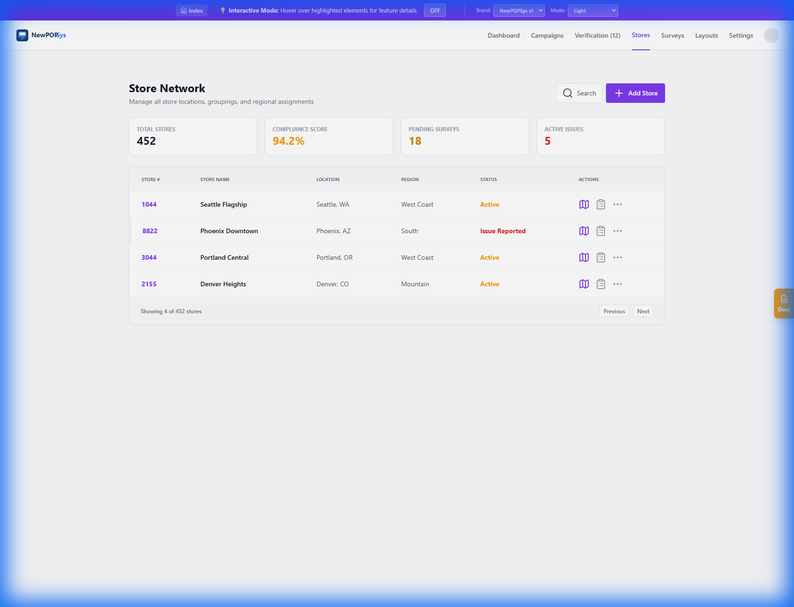

### 3.2 Component Specifications

| Component | Type | Description |
|-----------|------|-------------|
| Page Header | Header bar | Title + primary action button |
| Status Tabs | Tab bar | Filter by store status |
| Search Bar | Text input | Full-text store search |
| Filter Dropdowns | Multi-select | Region and group filters |
| Export Menu | Dropdown menu | Export options |
| Store Table | Data table | Expandable rows with details |
| Row Checkbox | Selection | Enable bulk actions |
| Action Menu | Dropdown menu | Row-level actions |
| Pagination | Page controls | Navigate result pages |
| Bulk Action Bar | Toolbar | Actions for selected rows |

### 3.3 Status Tab Definitions

| Tab | Filter Criteria | Badge Count |
|-----|-----------------|-------------|
| All | No status filter | Total count |
| Active | `status = 'ACTIVE'` | Active count |
| Inactive | `status = 'INACTIVE'` | Inactive count |
| Onboarding | `status = 'ONBOARDING'` | Onboarding count |
| Suspended | `status = 'SUSPENDED'` | Suspended count |

### 3.4 Store Status Badges

| Status | Color | Icon | Description |
|--------|-------|------|-------------|
| ACTIVE | Green | Checkmark | Fully operational store |
| INACTIVE | Gray | Dash | Temporarily not participating |
| ONBOARDING | Blue | Clock | New store being set up |
| SUSPENDED | Red | X | Account issues, blocked |

### 3.5 Store Row Information

| Field | Source | Display |
|-------|--------|---------|
| Store Number | stores.store_number | "#1234" |
| Store Name | stores.name | "Downtown Location" |
| Address | stores.address_line_1, city, state, zip | Full address |
| Region | regions.name | "Northeast" |
| Status | stores.status | Badge with icon |
| Campaign Count | store_assignments.count | "3 campaigns" |

### 3.6 Row Action Menu

| Action | Visibility Condition | Effect |
|--------|---------------------|--------|
| View Details | Always | Navigate to Store Detail |
| Edit Store | BRAND_ADMIN or REGIONAL_MANAGER | Navigate to Store Edit |
| View Campaigns | Always | Navigate to Store Campaigns |
| Manage Groups | BRAND_ADMIN | Open group assignment modal |
| Change Status | BRAND_ADMIN or REGIONAL_MANAGER | Open status change dialog |
| Resend Invitation | `status = 'ONBOARDING'` | Resend onboarding email |
| View History | Always | Navigate to Store Audit Log |

### 3.7 Component States

| State | Status Tabs | Store Table | Bulk Actions | Export |
|-------|-------------|-------------|--------------|--------|
| Loading | Badge counts loading | Skeleton rows | Hidden | Disabled |
| Empty | Zero counts | Empty state message | Hidden | Disabled |
| Loaded | Badge counts shown | Store rows | Hidden (no selection) | Enabled |
| Selecting | Unchanged | Checkboxes visible | Visible | Enabled |
| Filtering | Unchanged | Filtered results | Reset | Enabled |
| Error | Error indicator | Error message | Hidden | Disabled |

---

## 4. Data Requirements

### 4.1 Entities & Fields

| Entity | Fields Used | Access |
|--------|-------------|--------|
| `stores` | id, store_number, name, address_*, status, region_id, created_at | Read/Write |
| `regions` | id, name, parent_region_id | Read |
| `districts` | id, name, region_id | Read |
| `territories` | id, name, district_id | Read |
| `store_groups` | id, name | Read |
| `store_group_memberships` | store_id, group_id | Read/Write |
| `store_assignments` | store_id, campaign_id (aggregated) | Read |
| `store_invitations` | store_id, status, expires_at | Read |

### 4.2 List Query Requirements

| REQ-ID | Requirement |
|--------|-------------|
| REQ-B006-DATA-001 | Store list SHALL return paginated results with default page size of 20 |
| REQ-B006-DATA-002 | Each store row SHALL include active campaign count from store_assignments |
| REQ-B006-DATA-003 | Search SHALL support partial matching on store_number, name, address (case-insensitive) |
| REQ-B006-DATA-004 | Results SHALL be sortable by store_number, name, region, status, created_at |
| REQ-B006-DATA-005 | Region filter SHALL include child regions when parent selected |

### 4.3 Default Sort Order

| REQ-ID | Requirement |
|--------|-------------|
| REQ-B006-DATA-006 | Default sort SHALL be `store_number ASC` |
| REQ-B006-DATA-007 | Active stores SHALL be prioritized in default view |

---

## 5. Business Rules & Validation

### 5.1 Store Status Rules

| REQ-ID | Rule |
|--------|------|
| REQ-B006-BR-001 | ONBOARDING stores SHALL not be assigned to campaigns |
| REQ-B006-BR-002 | SUSPENDED stores SHALL not receive new campaign assignments |
| REQ-B006-BR-003 | INACTIVE status SHALL pause all active campaign participation |
| REQ-B006-BR-004 | Status change SHALL require confirmation dialog |

### 5.2 Store Group Rules

| REQ-ID | Rule |
|--------|------|
| REQ-B006-BR-005 | Stores MAY belong to multiple store groups |
| REQ-B006-BR-006 | Group membership changes SHALL be effective immediately |
| REQ-B006-BR-007 | Removing from group SHALL NOT affect active campaign assignments |

### 5.3 Invitation Rules

| REQ-ID | Rule |
|--------|------|
| REQ-B006-BR-008 | Store invitations SHALL expire after 7 days by default |
| REQ-B006-BR-009 | Expired invitations MAY be resent with new expiration |
| REQ-B006-BR-010 | Accepted invitations SHALL transition store to ACTIVE status |

### 5.4 Bulk Operation Rules

| REQ-ID | Rule |
|--------|------|
| REQ-B006-BR-011 | Bulk status change SHALL be limited to 100 stores per operation |
| REQ-B006-BR-012 | Bulk operations SHALL display confirmation with affected count |
| REQ-B006-BR-013 | Bulk group assignment SHALL support add/remove actions |

---

## 6. API Integration Points

### 6.1 API Endpoints

| Endpoint | Method | Purpose |
|----------|--------|---------|
| `/api/v1/stores` | GET | List stores with filters |
| `/api/v1/stores` | POST | Create new store |
| `/api/v1/stores/{id}` | GET | Get store details |
| `/api/v1/stores/{id}` | PATCH | Update store |
| `/api/v1/stores/{id}/status` | PATCH | Change store status |
| `/api/v1/stores/{id}/groups` | PUT | Update group memberships |
| `/api/v1/stores/bulk/status` | PATCH | Bulk status change |
| `/api/v1/stores/bulk/groups` | PATCH | Bulk group assignment |
| `/api/v1/stores/export` | POST | Export store data |
| `/api/v1/store-invitations` | POST | Create store invitation |
| `/api/v1/store-invitations/{id}/resend` | POST | Resend invitation |

### 6.2 List Request Parameters

```
GET /api/v1/stores
  ?status[]=ACTIVE&status[]=ONBOARDING
  &region_id=uuid
  &group_id=uuid
  &search=downtown
  &sort=store_number
  &page=1
  &limit=20
```

### 6.3 List Response Schema

```json
{
  "data": [
    {
      "id": "uuid",
      "storeNumber": "1234",
      "name": "Downtown Location",
      "addressLine1": "789 Main Street",
      "city": "Boston",
      "state": "MA",
      "zipCode": "02101",
      "status": "ACTIVE",
      "region": {
        "id": "uuid",
        "name": "Northeast"
      },
      "district": {
        "id": "uuid",
        "name": "New England"
      },
      "activeCampaigns": 3,
      "groups": [
        {"id": "uuid", "name": "Premium Locations"}
      ],
      "createdAt": "2025-01-15T10:00:00Z",
      "updatedAt": "2025-12-01T14:30:00Z"
    }
  ],
  "meta": {
    "total": 847,
    "page": 1,
    "limit": 20,
    "totalPages": 43
  },
  "statusCounts": {
    "ACTIVE": 780,
    "INACTIVE": 45,
    "ONBOARDING": 20,
    "SUSPENDED": 2
  }
}
```

### 6.4 Status Change Request

```json
// PATCH /api/v1/stores/{id}/status
{
  "status": "INACTIVE",
  "reason": "Temporary closure for renovation",
  "effectiveDate": "2025-12-15"
}
```

### 6.5 Bulk Status Change Request

```json
// PATCH /api/v1/stores/bulk/status
{
  "storeIds": ["uuid1", "uuid2", "uuid3"],
  "status": "INACTIVE",
  "reason": "Seasonal closure"
}
```

### 6.6 Export Request

```json
// POST /api/v1/stores/export
{
  "format": "csv",
  "filters": {
    "status": ["ACTIVE"],
    "regionId": "uuid"
  },
  "fields": ["storeNumber", "name", "address", "region", "status", "campaigns"]
}
```

### 6.7 API Requirements

| REQ-ID | Requirement |
|--------|-------------|
| REQ-B006-API-001 | List endpoint SHALL respond within 500ms for up to 10,000 stores |
| REQ-B006-API-002 | Search SHALL use full-text index for performance |
| REQ-B006-API-003 | Export SHALL use background job for >1,000 stores |
| REQ-B006-API-004 | Status changes SHALL emit audit events |
| REQ-B006-API-005 | Bulk operations SHALL return individual success/failure status |

---

## 7. State Transitions

### 7.1 Store Status State Machine

[Diagram - See rendered image above or refer to source document]

### 7.2 Store Status Transitions

| From | To | Trigger | Conditions |
|------|-----|---------|------------|
| ONBOARDING | ACTIVE | Accept invitation | Valid invitation token |
```

### 7.4 Page State Definitions

| State | Trigger | UI Behavior |
|-------|---------|-------------|
| Loading | Page mount / filter change | Show skeleton rows |
| Empty | API returns 0 results | Show empty state with CTA |
| Loaded | API success | Render store rows |
| Error | API failure | Show error with retry |
| Selecting | Checkbox clicked | Show bulk action bar |
| Filtering | Filter applied | Show filtered results |
[Diagram - See rendered image above or refer to source document]
| List fetch failed | 500 | "Unable to load stores" | Retry button |
| Store not found | 404 | "Store no longer exists" | Refresh list |
| Status change failed | 422 | "Cannot change status: active campaigns" | Show affected campaigns |
| Bulk operation partial | 207 | "X of Y stores updated" | Show failure details |
| Permission denied | 403 | "You don't have permission to edit this store" | Contact admin |
| Export failed | 500 | "Unable to generate export" | Retry button |

### 8.2 Validation Messages

| Field | Validation | Message |
|-------|------------|---------|
| Status Change | Has active campaigns | "Complete or reassign X active campaigns first" |
| Bulk Select | Exceeds limit | "Maximum 100 stores can be selected" |
| Group Assignment | Invalid group | "Selected group no longer exists" |
| Invitation | Already accepted | "This store has already been onboarded" |

### 8.3 Error Requirements

| REQ-ID | Requirement |
|--------|-------------|
| REQ-B006-ERR-001 | Failed bulk operations SHALL report individual failures |
| REQ-B006-ERR-002 | Status change blocks SHALL explain reason with link to details |
| REQ-B006-ERR-003 | Network errors SHALL preserve filter state for retry |

---

## 9. Accessibility Requirements

| REQ-ID | Requirement | WCAG Criterion |
|--------|-------------|----------------|
| REQ-B006-A11Y-001 | Data table SHALL use proper `<table>`, `<th>`, `<td>` markup | 1.3.1 Info and Relationships |
| REQ-B006-A11Y-002 | Status tabs SHALL use `role="tablist"` with proper ARIA attributes | 4.1.2 Name, Role, Value |
| REQ-B006-A11Y-003 | Row selection checkboxes SHALL have accessible labels | 1.3.1 Info and Relationships |
| REQ-B006-A11Y-004 | Status badges SHALL have text alternatives (not just color) | 1.4.1 Use of Color |
| REQ-B006-A11Y-005 | Sort controls SHALL announce current sort state | 4.1.2 Name, Role, Value |
| REQ-B006-A11Y-006 | Pagination controls SHALL indicate current page and total | 2.4.8 Location |
| REQ-B006-A11Y-007 | Action menu SHALL be keyboard accessible with Escape to close | 2.1.1 Keyboard |
| REQ-B006-A11Y-008 | Bulk action bar SHALL announce selection count | 4.1.3 Status Messages |
| REQ-B006-A11Y-009 | Filter changes SHALL announce result count | 4.1.3 Status Messages |

---

## 10. Acceptance Criteria

### 10.1 Functional Requirements

| REQ-ID | Criterion | Priority |
|--------|-----------|----------|
| REQ-B006-FR-001 | Store list SHALL display all stores for brand | Must |
| REQ-B006-FR-002 | Status tabs SHALL filter stores by status | Must |
| REQ-B006-FR-003 | Search SHALL filter stores by number, name, address | Must |
| REQ-B006-FR-004 | Region filter SHALL include hierarchical regions | Must |
| REQ-B006-FR-005 | Group filter SHALL filter by store group membership | Should |
| REQ-B006-FR-006 | Table columns SHALL be sortable | Should |
| REQ-B006-FR-007 | Row actions SHALL be accessible via action menu | Must |
| REQ-B006-FR-008 | Bulk selection SHALL enable bulk status change | Should |
| REQ-B006-FR-009 | Bulk selection SHALL enable bulk group assignment | Should |
| REQ-B006-FR-010 | Export SHALL generate CSV/Excel of filtered stores | Should |
| REQ-B006-FR-011 | Pagination SHALL navigate between result pages | Must |
| REQ-B006-FR-012 | Store invitation SHALL be creatable from this screen | Should |

### 10.2 Test Scenarios

| Test ID | Scenario | Expected Result |
|---------|----------|-----------------|
| TC-B006-01 | Brand Admin views all stores | All stores for brand displayed |
| TC-B006-02 | Regional Manager views stores | Only stores in assigned region shown |
| TC-B006-03 | Click Active tab | Only ACTIVE stores shown |
| TC-B006-04 | Search for store number "1234" | Matching stores filtered |
| TC-B006-05 | Filter by Northeast region | Only Northeast stores shown |
| TC-B006-06 | Sort by status | Stores reordered by status |
| TC-B006-07 | Change store status to Inactive | Confirmation dialog, status updated |
| TC-B006-08 | Bulk select 5 stores, change status | All 5 stores updated |
| TC-B006-09 | Assign store to group | Group membership updated |
| TC-B006-10 | Export active stores as CSV | CSV file downloaded |
| TC-B006-11 | Resend store invitation | New invitation email sent |
| TC-B006-12 | Keyboard navigate store list | All controls accessible via keyboard |

---

## 11. Related Screens

| Screen | Relationship |
|--------|--------------|
| [B001 Dashboard](B001_Dashboard.md) | KPI click-through destination |
| [B003 Store Selection](B003_Store_Selection.md) | Store selection for campaigns |
| B008 Store Detail | Row click destination |
| B009 Store Groups | Group management |

---

## 12. Revision History

| Version | Date | Author | Changes |
|---------|------|--------|---------|
| 1.0 | 2026-01-01 | System | Initial specification |

---

*Document Status: Draft*
*IEEE 830 Compliance: Section 3.2 - Functional Requirements / Screen Specifications*


---
# B007 - Photo Verification Queue

> **SRS Section**: 7.1.7 | **Module**: BrandAdmin (B-Series)
> **Version**: 1.0 | **Status**: Draft
> **Last Updated**: 2026-01-01

---

## 1. Screen Overview

### 1.1 Purpose

The Photo Verification Queue provides brand administrators with a streamlined interface for reviewing store-submitted installation photos. It enables efficient approval or rejection of photos, management of retake requests, and tracking of verification progress across campaigns.

### 1.2 Access Control

| Role | Access Level |
|------|--------------|
| BRAND_ADMIN | Full access (all photos) |
| CAMPAIGN_MANAGER | Full access (photos for assigned campaigns) |
| REGIONAL_MANAGER | Read-only (photos for stores in assigned regions) |

### 1.3 Navigation Path

- **Route**: `/admin/verification`
- **Route**: `/admin/verification?campaign={id}` (campaign-filtered)
- **Entry Points**:
  - Main navigation: "Verification" menu item
  - Dashboard: "Pending Reviews" KPI click-through
  - Campaign Detail: "Review Photos" action

### 1.4 Screenshot Reference

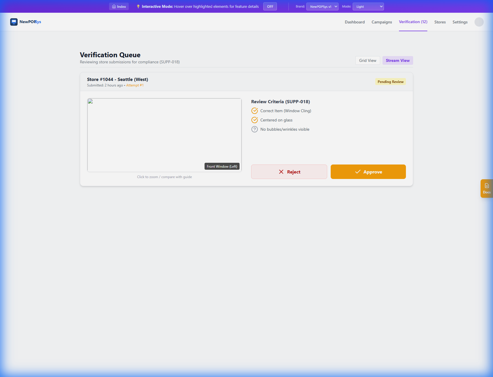

---

## 2. User Roles & Permissions

### 2.1 Role-Based Access Matrix

| Capability | BRAND_ADMIN | CAMPAIGN_MANAGER | REGIONAL_MANAGER |
|------------|:-----------:|:----------------:|:----------------:|
| View all pending photos | Y | N | N |
| View scoped pending photos | Y | Y* | Y* |
| Approve photo | Y | Y* | N |
| Reject photo | Y | Y* | N |
| Request retake | Y | Y* | N |
| Add review comment | Y | Y* | Y* |
| View review history | Y | Y* | Y* |
| Bulk approve/reject | Y | Y* | N |
| Export verification report | Y | Y* | Y* |
| Override previous decision | Y | N | N |

**Legend**: Y = Full access | Y* = Scoped access | N = No access

### 2.2 Data Scoping Requirements

| REQ-ID | Requirement |
|--------|-------------|
| REQ-B007-SEC-001 | Photo queue SHALL be filtered by authenticated user's brand_id |
| REQ-B007-SEC-002 | Campaign Managers SHALL only see photos for campaigns in their memberships |
| REQ-B007-SEC-003 | Regional Managers SHALL only see photos from stores in their region_scope_id |
| REQ-B007-SEC-004 | All review decisions SHALL be logged with reviewer_id and timestamp |

---

## 3. UI Components

### 3.1 Layout Structure


### 3.2 Component Specifications

| Component | Type | Description |
|-----------|------|-------------|
| Page Header | Header bar | Title + pending count badge |
| Status Tabs | Tab bar | Filter by review status |
| Campaign Filter | Dropdown | Filter by campaign |
| Store Filter | Dropdown | Filter by store |
| Photo Grid | Card grid | Responsive photo card layout |
| Photo Card | Interactive card | Photo, metadata, actions |
| Photo Viewer | Modal | Full-size photo with zoom |
| Bulk Select | Checkbox overlay | Enable bulk actions |
| Bulk Action Bar | Toolbar | Approve/Reject selected |
| Pagination | Page controls | Navigate result pages |

### 3.3 Status Tab Definitions

| Tab | Filter Criteria | Badge Count |
|-----|-----------------|-------------|
| All | No status filter | Total count |
| Pending | `review_status = 'PENDING'` | Pending count |
| Approved | `review_status = 'APPROVED'` | Approved count |
| Rejected | `review_status = 'REJECTED'` | Rejected count |
| Retake Requested | Has active retake_request | Retake count |

### 3.4 Photo Review Status Badges

| Status | Color | Icon | Description |
|--------|-------|------|-------------|
| PENDING | Yellow | Clock | Awaiting review |
| APPROVED | Green | Checkmark | Verified correct |
| REJECTED | Red | X | Does not meet requirements |
| SUPERSEDED | Gray | Archive | Replaced by newer submission |

### 3.5 Photo Card Information

| Field | Source | Display |
|-------|--------|---------|
| Photo Thumbnail | S3 presigned URL | 200x200 crop |
| Store Number | stores.store_number | "#1234" |
| Campaign Name | campaigns.name | "Summer Promo" |
| Item Name | kit_items.name | "Window Banner" |
| Location Slot | location_slots.slot_code | "Front Window" |
| Submitted Time | photo_uploads.created_at | Relative time |
| Submission Count | photo_uploads count for item | "Attempt 2" |

### 3.6 Photo Card Actions

| Action | Visibility | Effect |
|--------|------------|--------|
| Approve | `status = 'PENDING'` | Mark as approved |
| Reject | `status = 'PENDING'` | Open rejection dialog |
| View Full Size | Always | Open photo modal |
| View History | Has previous reviews | Show review timeline |
| Override | `status != 'PENDING'` AND BRAND_ADMIN | Change previous decision |

### 3.7 Rejection Reason Codes

| Code | Display Text | Description |
|------|--------------|-------------|
| WRONG_ANGLE | Wrong Angle | Photo taken from incorrect perspective |
| TOO_DARK | Too Dark | Insufficient lighting |
| BLURRY | Blurry/Out of Focus | Image quality issue |
| WRONG_ITEM | Wrong Item Shown | Incorrect POP material |
| INCOMPLETE | Incomplete Installation | Installation not finished |
| OBSTRUCTED | View Obstructed | Item blocked by objects |
| OTHER | Other | Custom reason required |

### 3.8 Component States

| State | Photo Grid | Bulk Actions | Filters | Pagination |
|-------|------------|--------------|---------|------------|
| Loading | Skeleton cards | Hidden | Disabled | Hidden |
| Empty | Empty state message | Hidden | Enabled | Hidden |
| Loaded | Photo cards | Hidden | Enabled | Visible |
| Selecting | Checkbox overlays | Visible | Enabled | Visible |
| Processing | Cards disabled | Loading | Disabled | Disabled |
| Error | Error message | Hidden | Enabled | Hidden |

---

## 4. Data Requirements

### 4.1 Entities & Fields

| Entity | Fields Used | Access |
|--------|-------------|--------|
| `photo_uploads` | id, s3_key, review_status, created_at, assignment_item_id | Read/Write |
| `photo_reviews` | id, photo_id, decision, reason_code, comment, reviewer_id, created_at | Write |
| `retake_requests` | id, photo_id, reason, resolved_at | Read/Write |
| `assignment_items` | id, assignment_id, kit_item_id, slot_id | Read |
| `store_assignments` | id, campaign_id, store_id | Read |
| `kit_items` | id, name | Read |
| `location_slots` | id, slot_code | Read |
| `stores` | id, store_number | Read |
| `campaigns` | id, name | Read |

### 4.2 Queue Query Requirements

| REQ-ID | Requirement |
|--------|-------------|
| REQ-B007-DATA-001 | Photo queue SHALL return paginated results with default page size of 20 |
| REQ-B007-DATA-002 | Photos SHALL be ordered by created_at DESC (newest first) by default |
| REQ-B007-DATA-003 | Photo thumbnails SHALL use optimized S3 presigned URLs with 1-hour expiry |
| REQ-B007-DATA-004 | Campaign filter SHALL only show campaigns with pending photos |
| REQ-B007-DATA-005 | Store filter SHALL only show stores with photos in current filter |

### 4.3 Photo URL Requirements

| REQ-ID | Requirement |
|--------|-------------|
| REQ-B007-DATA-006 | Thumbnail URLs SHALL use CloudFront for CDN delivery |
| REQ-B007-DATA-007 | Full-size photo URLs SHALL be generated on-demand |
| REQ-B007-DATA-008 | URLs SHALL be signed to prevent unauthorized access |

---

## 5. Business Rules & Validation

### 5.1 Review Decision Rules

| REQ-ID | Rule |
|--------|------|
| REQ-B007-BR-001 | Each photo SHALL have exactly one active review decision |
| REQ-B007-BR-002 | REJECTED photos SHALL require a reason_code |
| REQ-B007-BR-003 | OTHER rejection reason SHALL require a custom comment |
| REQ-B007-BR-004 | Review decisions SHALL be immutable except for BRAND_ADMIN override |

### 5.2 Retake Request Rules

| REQ-ID | Rule |
|--------|------|
| REQ-B007-BR-005 | Rejection SHALL automatically create a retake_request |
| REQ-B007-BR-006 | Retake requests SHALL trigger store notification |
| REQ-B007-BR-007 | New photo submission SHALL supersede previous REJECTED photo |
| REQ-B007-BR-008 | Maximum retake attempts SHALL be configurable at brand level (default: 3) |

### 5.3 Assignment Completion Rules

| REQ-ID | Rule |
|--------|------|
| REQ-B007-BR-009 | Assignment item SHALL be marked COMPLETE when photo is APPROVED |
| REQ-B007-BR-010 | All assignment items APPROVED SHALL mark assignment as SUBMITTED_VERIFIED |
| REQ-B007-BR-011 | Any REJECTED photo SHALL keep assignment in IN_PROGRESS or REWORK_REQUIRED |

### 5.4 Bulk Operation Rules

| REQ-ID | Rule |
|--------|------|
| REQ-B007-BR-012 | Bulk approve SHALL be limited to 50 photos per operation |
| REQ-B007-BR-013 | Bulk reject SHALL require single reason_code for all selections |
| REQ-B007-BR-014 | Bulk operations SHALL display confirmation with count |

---

## 6. API Integration Points

### 6.1 API Endpoints

| Endpoint | Method | Purpose |
|----------|--------|---------|
| `/api/v1/photos` | GET | List photos with filters |
| `/api/v1/photos/{id}` | GET | Get photo details |
| `/api/v1/photos/{id}/review` | POST | Submit review decision |
| `/api/v1/photos/{id}/override` | POST | Override previous decision |
| `/api/v1/photos/bulk/approve` | POST | Bulk approve photos |
| `/api/v1/photos/bulk/reject` | POST | Bulk reject photos |
| `/api/v1/photos/pending/count` | GET | Get pending count |
| `/api/v1/photos/export` | POST | Export verification report |

### 6.2 List Request Parameters

```
GET /api/v1/photos
  ?status=PENDING
  &campaign_id=uuid
  &store_id=uuid
  &sort=-created_at
  &page=1
  &limit=20
```

### 6.3 List Response Schema

```json
{
  "data": [
    {
      "id": "uuid",
      "thumbnailUrl": "https://cdn.example.com/photos/thumb/...",
      "fullSizeUrl": "https://cdn.example.com/photos/full/...",
      "reviewStatus": "PENDING",
      "createdAt": "2025-12-15T14:30:00Z",
      "submissionNumber": 1,
      "store": {
        "id": "uuid",
        "storeNumber": "1234"
      },
      "campaign": {
        "id": "uuid",
        "name": "Summer Promo 2025"
      },
      "kitItem": {
        "id": "uuid",
        "name": "Window Banner"
      },
      "locationSlot": {
        "id": "uuid",
        "slotCode": "FRONT_WINDOW",
        "displayName": "Front Window"
      },
      "assignmentItem": {
        "id": "uuid",
        "status": "SUBMITTED"
      }
    }
  ],
  "meta": {
    "total": 23,
    "page": 1,
    "limit": 20,
    "totalPages": 2
  },
  "statusCounts": {
    "PENDING": 23,
    "APPROVED": 456,
    "REJECTED": 34,
    "SUPERSEDED": 12
  }
}
```

### 6.4 Review Request

```json
// POST /api/v1/photos/{id}/review
{
  "decision": "REJECTED",
  "reasonCode": "WRONG_ANGLE",
  "comment": "Please retake photo from the front of the store"
}
```

### 6.5 Review Response

```json
{
  "photoReview": {
    "id": "uuid",
    "photoId": "uuid",
    "decision": "REJECTED",
    "reasonCode": "WRONG_ANGLE",
    "comment": "Please retake photo from the front of the store",
    "reviewerId": "uuid",
    "createdAt": "2025-12-15T15:00:00Z"
  },
  "retakeRequest": {
    "id": "uuid",
    "photoId": "uuid",
    "reason": "WRONG_ANGLE",
    "createdAt": "2025-12-15T15:00:00Z"
  },
  "notification": {
    "sent": true,
    "method": "push",
    "recipient": "store_manager@store1234.com"
  }
}
```

### 6.6 Bulk Approve Request

```json
// POST /api/v1/photos/bulk/approve
{
  "photoIds": ["uuid1", "uuid2", "uuid3"],
  "comment": "Batch approval for verified installations"
}
```

### 6.7 Bulk Reject Request

```json
// POST /api/v1/photos/bulk/reject
{
  "photoIds": ["uuid1", "uuid2"],
  "reasonCode": "TOO_DARK",
  "comment": "Please retake with better lighting"
}
```

### 6.8 API Requirements

| REQ-ID | Requirement |
|--------|-------------|
| REQ-B007-API-001 | Photo list SHALL respond within 500ms for up to 1,000 photos |
| REQ-B007-API-002 | Review decision SHALL be processed within 100ms |
| REQ-B007-API-003 | Bulk operations SHALL return individual success/failure status |
| REQ-B007-API-004 | Photo URLs SHALL be cached for 1 hour |
| REQ-B007-API-005 | Review SHALL emit webhook event for integrations |

---

## 7. State Transitions

### 7.1 Photo Review Status State Machine

[Diagram - See rendered image above or refer to source document]

### 7.2 Photo Review Transitions

| From | To | Trigger | Conditions |
|------|-----|---------|------------|
| PENDING | APPROVED | Review decision | Valid reviewer permissions |
| PENDING | REJECTED | Review decision | Reason code required |
| REJECTED | SUPERSEDED | New photo uploaded | Same assignment_item_id |
| APPROVED | REJECTED | Override | BRAND_ADMIN only |
| REJECTED | APPROVED | Override | BRAND_ADMIN only |

### 7.3 Assignment Item Status Updates

[Diagram - See rendered image above or refer to source document]

### 7.4 UI State Machine
[Diagram - See rendered image above or refer to source document]
### 7.5 Photo Modal States

| State | Trigger | UI Behavior |
|-------|---------|-------------|
| Loading | Card click | Show loading spinner |
| Viewing | Image loaded | Display full-size photo |
| Zooming | Zoom control | Enable pan/zoom |
| Reviewing | Action clicked | Show decision form |
| Submitting | Form submitted | Show loading state |
| Complete | Decision saved | Close modal, update card |

---

| Already reviewed | 409 | "Photo was reviewed by another user" | Refresh |
| Permission denied | 403 | "You don't have permission to review" | Contact admin |
| Bulk partial failure | 207 | "X of Y photos reviewed" | Show failures |
### 8.3 Error Requirements

| REQ-ID | Requirement |
|--------|-------------|
| REQ-B007-ERR-001 | Concurrent review conflicts SHALL refresh photo status |
| REQ-B007-ERR-002 | Failed bulk operations SHALL report individual failures |
| REQ-B007-ERR-003 | Image load failures SHALL show placeholder with retry |

---

## 9. Accessibility Requirements

| REQ-ID | Requirement | WCAG Criterion |
|--------|-------------|----------------|
| REQ-B007-A11Y-001 | Photo grid SHALL use proper grid ARIA roles | 1.3.1 Info and Relationships |
| REQ-B007-A11Y-002 | Photo cards SHALL be keyboard navigable with arrow keys | 2.1.1 Keyboard |
| REQ-B007-A11Y-003 | Photos SHALL have alt text describing content | 1.1.1 Non-text Content |
| REQ-B007-A11Y-004 | Status badges SHALL have text alternatives | 1.4.1 Use of Color |
| REQ-B007-A11Y-005 | Photo modal SHALL trap focus when open | 2.4.3 Focus Order |
| REQ-B007-A11Y-006 | Escape key SHALL close photo modal | 2.1.1 Keyboard |
| REQ-B007-A11Y-007 | Approval/rejection SHALL announce result | 4.1.3 Status Messages |
| REQ-B007-A11Y-008 | Pending count changes SHALL be announced | 4.1.3 Status Messages |
| REQ-B007-A11Y-009 | Rejection reason selector SHALL be keyboard accessible | 2.1.1 Keyboard |

---

## 10. Acceptance Criteria

### 10.1 Functional Requirements

| REQ-ID | Criterion | Priority |
|--------|-----------|----------|
| REQ-B007-FR-001 | User SHALL see pending photos in card grid layout | Must |
| REQ-B007-FR-002 | User SHALL be able to filter by status | Must |
| REQ-B007-FR-003 | User SHALL be able to filter by campaign | Must |
| REQ-B007-FR-004 | User SHALL be able to filter by store | Should |
| REQ-B007-FR-005 | User SHALL be able to approve photos | Must |
| REQ-B007-FR-006 | User SHALL be able to reject photos with reason | Must |
| REQ-B007-FR-007 | Rejection SHALL trigger retake request | Must |
| REQ-B007-FR-008 | User SHALL be able to view full-size photo | Must |
| REQ-B007-FR-009 | User SHALL be able to bulk approve photos | Should |
| REQ-B007-FR-010 | User SHALL be able to bulk reject photos | Should |
| REQ-B007-FR-011 | Pending count SHALL update in real-time | Should |
| REQ-B007-FR-012 | Export SHALL generate verification report | Should |

### 10.2 Test Scenarios

| Test ID | Scenario | Expected Result |
|---------|----------|-----------------|
| TC-B007-01 | View pending photos | All pending photos displayed in grid |
| TC-B007-02 | Filter by campaign | Only photos for selected campaign shown |
| TC-B007-03 | Approve photo | Photo marked approved, removed from pending |
| TC-B007-04 | Reject photo with reason | Photo rejected, retake request created |
| TC-B007-05 | Reject with OTHER reason | Custom comment required |
| TC-B007-06 | View full-size photo | Modal opens with zoomable image |
| TC-B007-07 | Bulk select and approve | All selected photos approved |
| TC-B007-08 | Bulk reject exceeds limit | Error: maximum 50 photos |
| TC-B007-09 | Concurrent review conflict | Refresh notification shown |
| TC-B007-10 | Keyboard navigate grid | All cards accessible via keyboard |
| TC-B007-11 | Store resubmits after rejection | New photo in queue, old superseded |
| TC-B007-12 | Export verification report | CSV/PDF downloaded |

---

## 11. Related Screens

| Screen | Relationship |
|--------|--------------|
| [B001 Dashboard](B001_Dashboard.md) | KPI click-through destination |
| [B002 Campaign List](B002_Campaign_List.md) | Campaign filter source |
| S005 Photo Upload | Store-side photo submission |
| S006 Retake Notification | Store retake request display |

---

## 12. Revision History

| Version | Date | Author | Changes |
|---------|------|--------|---------|
| 1.0 | 2026-01-01 | System | Initial specification |

---

*Document Status: Draft*
*IEEE 830 Compliance: Section 3.2 - Functional Requirements / Screen Specifications*


---

# Section 8: PSP Operations Module


---
# P001 - Order Queue Screen Specification

> **Module**: PSP Operations Portal
> **Screen ID**: P001
> **Route**: `/psp/orders`
> **Version**: 1.0
> **Last Updated**: 2026-01-01
> **IEEE 830 Reference**: Section 3.2 - Functional Requirements
> **SUPP Reference**: SUPP-016 (Fulfillment - Order Processing)

---

## 1. Screen Overview

### 1.1 Purpose

The Order Queue screen provides PSP Production Operators with a centralized view of all store orders requiring fulfillment action. It enables order acknowledgment, status tracking, and drill-down access to order details for production processing.

### 1.2 Business Context

This screen serves as the primary work queue for PSP fulfillment operations. Orders flow from campaign assignments through to shipment, with this screen managing the critical handoff between order generation and production.

### 1.3 Screenshot Reference

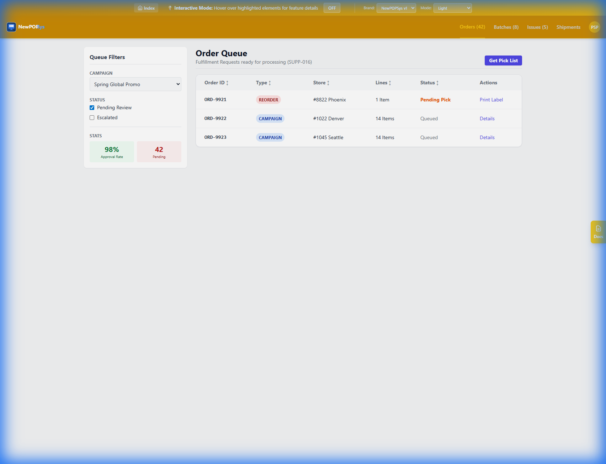

### 1.4 Navigation Path

```
PSP Portal  Orders (sidebar)  /psp/orders
```

### 1.5 Related Screens

| Screen | Relationship |
|--------|--------------|
| [P002 Shipments](P002_Shipments.md) | Orders link to shipments after production |
| [P003 Issues](P003_Issues.md) | Issues may trigger reorders appearing in queue |

---

## 2. User Roles & Permissions

### 2.1 Authorized Roles

| Role | Access Level | Permissions |
|------|--------------|-------------|
| PLATFORM_ADMIN | Full | View all, update status, bulk actions |
| PSP_ADMIN | Full | View all, update status, bulk actions |
| PSP_OPS | Operational | View all, update status, bulk actions |
| Support Agent (PSP_OPS + support_scope) | Read-Only | View only, no status updates |

### 2.2 Permission Requirements

| Requirement ID | Description | Roles |
|----------------|-------------|-------|
| REQ-P001-SEC-001 | User SHALL be authenticated with valid JWT containing tenant_id | All |
| REQ-P001-SEC-002 | User SHALL have PSP-level role (PLATFORM_ADMIN, PSP_ADMIN, or PSP_OPS) | All |
| REQ-P001-SEC-003 | Support Agent users SHALL have read-only access when support_scope = true | PSP_OPS |
| REQ-P001-SEC-004 | All order data SHALL be scoped to user's tenant_id | All |

### 2.3 Data Scope

- **Tenant Isolation**: Orders filtered by JWT tenant_id
- **Brand Visibility**: All brands within tenant visible
- **Campaign Scope**: All campaigns across brands visible

---

## 3. UI Components

### 3.1 Component Inventory

| Component ID | Type | Description |
|--------------|------|-------------|
| P001-C001 | Page Header | Title, order counts by status |
| P001-C002 | Status Tabs | New, Acknowledged, All filter tabs |
| P001-C003 | Search Bar | Order ID, store number search |
| P001-C004 | Filter Panel | Brand, campaign, date range filters |
| P001-C005 | Order Table | Sortable data grid with order list |
| P001-C006 | Bulk Actions | Select-all, bulk acknowledge button |
| P001-C007 | Order Detail Panel | Side panel with full order information |
| P001-C008 | Pagination | Page navigation with count |
| P001-C009 | Status Badge | Color-coded order status indicator |

### 3.2 Layout Specification


### 3.3 Component Specifications

#### P001-C001: Page Header

| Property | Value |
|----------|-------|
| Title | "Order Queue" |
| Status Counts | Real-time counts by status enum |
| Refresh | Auto-refresh every 60 seconds |

#### P001-C005: Order Table

| Column | Field | Width | Sortable | Default Sort |
|--------|-------|-------|----------|--------------|
| Checkbox | selection | 40px | No | - |
| Order # | order_number | 120px | Yes | - |
| Brand | brand.name | 150px | Yes | - |
| Store | store.store_number | 120px | Yes | - |
| Items | line_count | 80px | Yes | - |
| Status | status | 120px | Yes | - |
| Age | created_at | 100px | Yes | DESC (default) |

---

## 4. Data Requirements

### 4.1 Entity Mapping

| Entity | Table | Purpose |
|--------|-------|---------|
| StoreOrder | store_orders | Primary order record |
| OrderLine | order_lines | Line items in order |
| Store | stores | Store information |
| Campaign | campaigns | Campaign reference |
| Brand | brands | Brand reference |
| KitItem | kit_items | Item details |

### 4.2 Data Query


### 4.3 Data Requirements Matrix

| Requirement ID | Description | Validation |
|----------------|-------------|------------|
| REQ-P001-DATA-001 | Order list SHALL display orders scoped to tenant | tenant_id filter |
| REQ-P001-DATA-002 | Order list SHALL exclude soft-deleted records | deleted_at IS NULL |
| REQ-P001-DATA-003 | Order age SHALL be calculated from created_at | Real-time calculation |
| REQ-P001-DATA-004 | Line count SHALL reflect active order lines only | COUNT with deleted_at filter |
| REQ-P001-DATA-005 | Status counts SHALL refresh on tab change | Query per status |

---

## 5. Business Rules & Validation

### 5.1 Order Status Rules

| Requirement ID | Rule | Enforcement |
|----------------|------|-------------|
| REQ-P001-BR-001 | Orders in GENERATED status SHALL appear in "New" tab | Status filter |
| REQ-P001-BR-002 | Orders in ACKNOWLEDGED status SHALL appear in "Acknowledged" tab | Status filter |
| REQ-P001-BR-003 | Only GENERATED orders SHALL be selectable for bulk acknowledge | UI disable |
| REQ-P001-BR-004 | Order status progression SHALL follow: GENERATED  ACKNOWLEDGED  IN_PRODUCTION  SHIPPED | State machine |
| REQ-P001-BR-005 | Acknowledge action SHALL set acknowledged_at timestamp | Backend logic |

### 5.2 Validation Rules

| Requirement ID | Field | Validation | Error Message |
|----------------|-------|------------|---------------|
| REQ-P001-VAL-001 | Order selection | At least one order selected for bulk action | "Select at least one order" |
| REQ-P001-VAL-002 | Status transition | Order must be in valid source status | "Order cannot be acknowledged from current status" |
| REQ-P001-VAL-003 | PSP Reference | Optional, max 50 characters | "PSP reference too long" |

### 5.3 Business Constraints

| Requirement ID | Constraint | Rationale |
|----------------|------------|-----------|
| REQ-P001-BC-001 | Orders SHALL be displayed FIFO (oldest first) in New tab | Production priority |
| REQ-P001-BC-002 | Bulk acknowledge SHALL process maximum 100 orders per request | Performance limit |
| REQ-P001-BC-003 | Order detail panel SHALL load within 500ms | UX requirement |

---

## 6. API Integration Points

### 6.1 API Endpoints

| Endpoint | Method | Purpose | Request | Response |
|----------|--------|---------|---------|----------|
| `/api/v1/orders` | GET | List orders | Query params | OrderDTO[] |
| `/api/v1/orders/{id}` | GET | Order detail | Path param | OrderDetailDTO |
| `/api/v1/orders/{id}/acknowledge` | POST | Acknowledge order | OrderAckRequest | OrderDTO |
| `/api/v1/orders/bulk-acknowledge` | POST | Bulk acknowledge | BulkAckRequest | BulkAckResponse |
| `/api/v1/orders/counts` | GET | Status counts | Query params | CountsDTO |

### 6.2 Request/Response Schemas

#### GET /api/v1/orders

**Request Parameters:**

| Parameter | Type | Required | Description |
|-----------|------|----------|-------------|
| status | string[] | No | Filter by status(es) |
| brand_id | uuid | No | Filter by brand |
| campaign_id | uuid | No | Filter by campaign |
| search | string | No | Search order_number, store_number |
| page | integer | No | Page number (default: 1) |
| page_size | integer | No | Items per page (default: 25, max: 100) |
| sort_by | string | No | Sort field |
| sort_order | string | No | ASC or DESC |

**Response Schema:**

```json
{
  "data": [
    {
      "id": "uuid",
      "order_number": "ORD-1234",
      "status": "GENERATED",
      "order_type": "INITIAL",
      "psp_order_ref": "PSP-REF-001",
      "created_at": "2025-12-15T10:30:00Z",
      "acknowledged_at": null,
      "store": {
        "id": "uuid",
        "store_number": "STR-001",
        "name": "Downtown Store"
      },
      "campaign": {
        "id": "uuid",
        "name": "Summer Promo"
      },
      "brand": {
        "id": "uuid",
        "name": "Acme Corp"
      },
      "line_count": 5,
      "total_quantity": 12
    }
  ],
  "pagination": {
    "page": 1,
    "page_size": 25,
    "total_items": 299,
    "total_pages": 12
  }
}
```

### 6.3 API Requirements

| Requirement ID | Description | Implementation |
|----------------|-------------|----------------|
| REQ-P001-API-001 | All API requests SHALL include Authorization header with JWT | Middleware |
| REQ-P001-API-002 | Bulk acknowledge SHALL use Idempotency-Key header | Request header |
| REQ-P001-API-003 | API responses SHALL include X-Request-ID for tracing | Response header |
| REQ-P001-API-004 | Rate limiting SHALL apply: 100 requests/minute per user | API gateway |

---

## 7. State Transitions

### 7.1 Order Status State Machine


[Diagram - See rendered image above or refer to source document]


### 7.2 State Transition Requirements

| Requirement ID | Transition | From | To | Trigger |
|----------------|------------|------|-----|---------|
| REQ-P001-ST-001 | Acknowledge | GENERATED | ACKNOWLEDGED | User action |
| REQ-P001-ST-002 | Start Production | ACKNOWLEDGED | IN_PRODUCTION | User action |
| REQ-P001-ST-003 | Cancel | Any (not CLOSED) | CANCELLED | User action with reason |
| REQ-P001-ST-004 | Ship | READY_TO_SHIP | SHIPPED/PARTIALLY_SHIPPED | Shipment creation |
| REQ-P001-ST-005 | Deliver | SHIPPED | DELIVERED | Carrier webhook |

### 7.3 Status Display Mapping

| Status | Badge Color | Display Text |
|--------|-------------|--------------|
| GENERATED | Yellow | New |
| ACKNOWLEDGED | Green | Acknowledged |
| IN_PRODUCTION | Blue | In Production |
| KITTING | Blue | Kitting |
| READY_TO_SHIP | Purple | Ready to Ship |
| PARTIALLY_SHIPPED | Orange | Partial Ship |
| SHIPPED | Blue | Shipped |
| DELIVERED | Gray | Delivered |
| CLOSED | Gray | Closed |
| CANCELLED | Red | Cancelled |

---

## 8. Error Handling

### 8.1 Error Scenarios

| Requirement ID | Error Scenario | HTTP Code | User Message | Recovery Action |
|----------------|----------------|-----------|--------------|-----------------|
| REQ-P001-ERR-001 | Unauthorized access | 401 | "Session expired. Please log in again." | Redirect to login |
| REQ-P001-ERR-002 | Forbidden action | 403 | "You don't have permission to perform this action." | Display message |
| REQ-P001-ERR-003 | Order not found | 404 | "Order not found." | Refresh list |
| REQ-P001-ERR-004 | Invalid status transition | 409 | "Order cannot be acknowledged from current status." | Refresh order |
| REQ-P001-ERR-005 | Bulk acknowledge partial failure | 207 | "X of Y orders acknowledged. Z failed." | Show failure details |
| REQ-P001-ERR-006 | Server error | 500 | "Something went wrong. Please try again." | Retry with backoff |
| REQ-P001-ERR-007 | Network timeout | - | "Connection lost. Retrying..." | Auto-retry 3x |

### 8.2 Error Display

| Component | Error Type | Display Method |
|-----------|------------|----------------|
| Page Load | API failure | Full-page error with retry button |
| Table | Empty results | "No orders match your filters" message |
| Bulk Action | Partial failure | Toast notification with details link |
| Detail Panel | Load failure | Panel error state with retry |

### 8.3 Logging Requirements

| Requirement ID | Event | Log Level | Data |
|----------------|-------|-----------|------|
| REQ-P001-LOG-001 | Page load | INFO | user_id, filters |
| REQ-P001-LOG-002 | Order acknowledge | INFO | user_id, order_id, prev_status |
| REQ-P001-LOG-003 | Bulk acknowledge | INFO | user_id, order_ids, success_count |
| REQ-P001-LOG-004 | Error | ERROR | error_code, message, stack_trace |

---

## 9. Accessibility Requirements

### 9.1 WCAG 2.1 AA Compliance

| Requirement ID | Guideline | Implementation |
|----------------|-----------|----------------|
| REQ-P001-A11Y-001 | 1.1.1 Non-text Content | All icons have aria-label |
| REQ-P001-A11Y-002 | 1.3.1 Info and Relationships | Table uses proper th/td semantics |
| REQ-P001-A11Y-003 | 1.4.1 Use of Color | Status uses color + text label |
| REQ-P001-A11Y-004 | 1.4.3 Contrast | 4.5:1 minimum contrast ratio |
| REQ-P001-A11Y-005 | 2.1.1 Keyboard | All actions accessible via keyboard |
| REQ-P001-A11Y-006 | 2.4.1 Bypass Blocks | Skip navigation link provided |
| REQ-P001-A11Y-007 | 2.4.7 Focus Visible | Clear focus indicators |
| REQ-P001-A11Y-008 | 4.1.2 Name, Role, Value | ARIA roles for custom components |

### 9.2 Keyboard Navigation

| Key | Action |
|-----|--------|
| Tab | Navigate between interactive elements |
| Enter | Activate button/link, open detail panel |
| Space | Toggle checkbox selection |
| Escape | Close detail panel |
| Arrow Up/Down | Navigate table rows |

### 9.3 Screen Reader Support

| Component | Announcement |
|-----------|--------------|
| Status Tabs | "New orders tab, 12 items" |
| Order Row | "Order ORD-1234, Acme Corp, Store STR-001, 5 items, New, 2 hours ago" |
| Bulk Action | "Acknowledge 5 selected orders button" |
| Status Change | "Order ORD-1234 acknowledged" (live region) |

---

## 10. Acceptance Criteria

### 10.1 Functional Acceptance Criteria

| Criteria ID | Description | Verification Method |
|-------------|-------------|---------------------|
| REQ-P001-AC-001 | Order queue displays all orders for user's tenant | Query verification |
| REQ-P001-AC-002 | Status tabs correctly filter orders by status | UI testing |
| REQ-P001-AC-003 | Search filters orders by order number and store number | UI testing |
| REQ-P001-AC-004 | Click on order row opens detail panel | UI testing |
| REQ-P001-AC-005 | Acknowledge button updates order status to ACKNOWLEDGED | API + DB verification |
| REQ-P001-AC-006 | Bulk acknowledge processes multiple orders | API + DB verification |
| REQ-P001-AC-007 | Status counts update after acknowledge action | UI verification |
| REQ-P001-AC-008 | Pagination correctly limits and navigates results | UI testing |
| REQ-P001-AC-009 | Table sorting works for all sortable columns | UI testing |
| REQ-P001-AC-010 | FIFO ordering maintained in New tab (oldest first) | Query verification |

### 10.2 Non-Functional Acceptance Criteria

| Criteria ID | Description | Target | Verification |
|-------------|-------------|--------|--------------|
| REQ-P001-AC-011 | Page load time | < 2 seconds | Performance testing |
| REQ-P001-AC-012 | Order detail panel load | < 500ms | Performance testing |
| REQ-P001-AC-013 | Bulk acknowledge (100 orders) | < 5 seconds | Performance testing |
| REQ-P001-AC-014 | WCAG 2.1 AA compliance | 100% | Accessibility audit |
| REQ-P001-AC-015 | Browser support | Chrome, Firefox, Edge, Safari | Cross-browser testing |

### 10.3 Traceability Matrix

| Requirement | Source | Test Case |
|-------------|--------|-----------|
| REQ-P001-FR-001 | SUPP-016 | TC-P001-001 |
| REQ-P001-SEC-001 | SUPP-003 | TC-P001-SEC-001 |
| REQ-P001-DATA-001 | 3.1 Database Model | TC-P001-DATA-001 |
| REQ-P001-API-001 | 3.4 Integration Architecture | TC-P001-API-001 |

---

## Appendix A: Revision History

| Version | Date | Author | Changes |
|---------|------|--------|---------|
| 1.0 | 2026-01-01 | System | Initial specification |

---

*Document Status: Complete*
*IEEE 830 Compliance: Section 3.2 - Functional Requirements*


---
# P002 - Shipments Screen Specification

> **Module**: PSP Operations Portal
> **Screen ID**: P002
> **Route**: `/psp/shipments`
> **Version**: 1.0
> **Last Updated**: 2026-01-01
> **IEEE 830 Reference**: Section 3.2 - Functional Requirements
> **SUPP Reference**: SUPP-016 (Fulfillment - Shipment Processing)

---

## 1. Screen Overview

### 1.1 Purpose

The Shipments screen enables PSP Production Operators to create, track, and manage shipments for fulfilled orders. It provides carrier integration, tracking number management, and delivery status monitoring across all active shipments.

### 1.2 Business Context

This screen represents the final fulfillment stage where completed orders are shipped to stores. Shipment creation triggers webhook events to external systems and updates order status automatically. Carrier tracking integration provides real-time delivery visibility.

### 1.3 Screenshot Reference

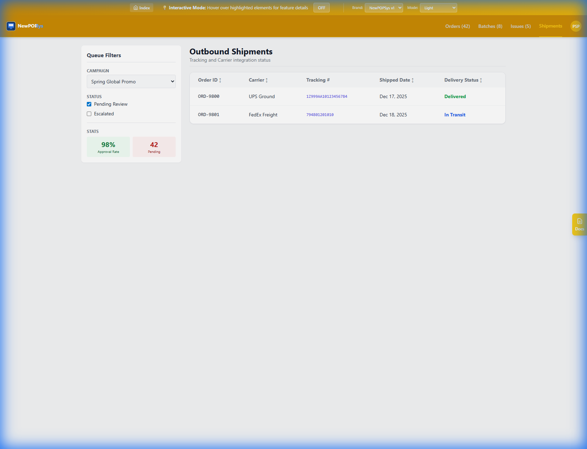

### 1.4 Navigation Path

```
PSP Portal  Shipments (sidebar)  /psp/shipments
```

### 1.5 Related Screens

| Screen | Relationship |
|--------|--------------|
| [P001 Order Queue](P001_Order_Queue.md) | Orders ready for shipment |
| [P003 Issues](P003_Issues.md) | Delivery exceptions may trigger issues |

---

## 2. User Roles & Permissions

### 2.1 Authorized Roles

| Role | Access Level | Permissions |
|------|--------------|-------------|
| PLATFORM_ADMIN | Full | View all, create/update shipments, void labels |
| PSP_ADMIN | Full | View all, create/update shipments, void labels |
| PSP_OPS | Operational | View all, create/update shipments |
| Support Agent (PSP_OPS + support_scope) | Read-Only | View only |

### 2.2 Permission Requirements

| Requirement ID | Description | Roles |
|----------------|-------------|-------|
| REQ-P002-SEC-001 | User SHALL be authenticated with valid JWT containing tenant_id | All |
| REQ-P002-SEC-002 | User SHALL have PSP-level role for shipment operations | All |
| REQ-P002-SEC-003 | Void label capability SHALL require PSP_ADMIN or higher | PSP_ADMIN, PLATFORM_ADMIN |
| REQ-P002-SEC-004 | Support Agent SHALL have read-only access | PSP_OPS (support_scope) |

### 2.3 Data Scope

- **Tenant Isolation**: Shipments filtered by JWT tenant_id
- **Order Linkage**: Only shipments for tenant's orders visible
- **Carrier Access**: Carrier credentials scoped to tenant

---

## 3. UI Components

### 3.1 Component Inventory

| Component ID | Type | Description |
|--------------|------|-------------|
| P002-C001 | Page Header | Title, shipment counts |
| P002-C002 | Status Tabs | In Transit, Delivered, Exception, All |
| P002-C003 | Search Bar | Tracking number, order number search |
| P002-C004 | Filter Panel | Carrier, date range, status filters |
| P002-C005 | Shipments Table | Sortable shipment list |
| P002-C006 | Create Shipment Button | Opens shipment creation modal |
| P002-C007 | Shipment Detail Panel | Side panel with tracking details |
| P002-C008 | Create Shipment Modal | Form for new shipment entry |
| P002-C009 | Tracking Link | External carrier tracking link |
| P002-C010 | Carrier Logo | Visual carrier identification |
| P002-C011 | Status Badge | Color-coded shipment status |

### 3.2 Layout Specification


### 3.3 Component Specifications

#### P002-C005: Shipments Table

| Column | Field | Width | Sortable | Default Sort |
|--------|-------|-------|----------|--------------|
| Tracking # | tracking_numbers[0] | 150px | Yes | - |
| Carrier | carrier | 100px | Yes | - |
| Order | order.order_number | 120px | Yes | - |
| Store | store.store_number | 100px | Yes | - |
| Status | status | 100px | Yes | - |
| ETA | estimated_delivery | 100px | Yes | - |
| Created | created_at | 120px | Yes | DESC (default) |

#### P002-C008: Create Shipment Modal


---

## 4. Data Requirements

### 4.1 Entity Mapping

| Entity | Table | Purpose |
|--------|-------|---------|
| Shipment | shipments | Shipment record |
| ShipmentLine | shipment_lines | Items in shipment |
| StoreOrder | store_orders | Parent order |
| OrderLine | order_lines | Order line items |
| Store | stores | Destination store |
| Campaign | campaigns | Campaign reference |

### 4.2 Data Query

```sql
SELECT
  sh.id, sh.carrier, sh.tracking_numbers, sh.status,
  sh.shipped_at, sh.estimated_delivery, sh.delivered_at,
  so.order_number,
  s.store_number, s.name as store_name,
  c.name as campaign_name,
  COUNT(sl.id) as line_count
FROM shipments sh
JOIN store_orders so ON sh.order_id = so.id
JOIN stores s ON so.store_id = s.id
JOIN campaigns c ON so.campaign_id = c.id
LEFT JOIN shipment_lines sl ON sl.shipment_id = sh.id
WHERE sh.tenant_id = :tenant_id
  AND sh.deleted_at IS NULL
  AND sh.status IN (:status_filter)
GROUP BY sh.id, so.id, s.id, c.id
ORDER BY sh.created_at DESC
LIMIT :page_size OFFSET :offset
```

### 4.3 Data Requirements Matrix

| Requirement ID | Description | Validation |
|----------------|-------------|------------|
| REQ-P002-DATA-001 | Shipment list SHALL be scoped to tenant | tenant_id filter |
| REQ-P002-DATA-002 | Tracking numbers SHALL be stored as JSON array | JSONB column |
| REQ-P002-DATA-003 | Carrier status SHALL sync from carrier API | Webhook/polling |
| REQ-P002-DATA-004 | Partial shipments SHALL track quantity_shipped per line | shipment_lines.quantity_shipped |
| REQ-P002-DATA-005 | ETA SHALL update from carrier tracking data | Carrier webhook |

---

## 5. Business Rules & Validation

### 5.1 Shipment Creation Rules

| Requirement ID | Rule | Enforcement |
|----------------|------|-------------|
| REQ-P002-BR-001 | Shipment SHALL only be created for orders in READY_TO_SHIP or later status | API validation |
| REQ-P002-BR-002 | Tracking number SHALL be unique across all shipments | Database constraint |
| REQ-P002-BR-003 | Quantity shipped SHALL NOT exceed quantity ordered minus already shipped | API validation |
| REQ-P002-BR-004 | At least one tracking number SHALL be provided | Form validation |
| REQ-P002-BR-005 | Carrier SHALL be one of: UPS, FEDEX, USPS, DHL, OTHER | Enum validation |

### 5.2 Validation Rules

| Requirement ID | Field | Validation | Error Message |
|----------------|-------|------------|---------------|
| REQ-P002-VAL-001 | order_id | Required, valid order | "Order is required" |
| REQ-P002-VAL-002 | carrier | Required, valid enum | "Carrier is required" |
| REQ-P002-VAL-003 | tracking_numbers | Required, array with 1+ items | "At least one tracking number required" |
| REQ-P002-VAL-004 | tracking_numbers[] | Format validation per carrier | "Invalid tracking number format for carrier" |
| REQ-P002-VAL-005 | quantity_shipped | Positive integer, <= remaining | "Quantity exceeds available" |

### 5.3 Carrier Tracking Format Validation

| Carrier | Format | Example |
|---------|--------|---------|
| UPS | 1Z + 16 alphanumeric | 1Z999AA10123456784 |
| FedEx | 12-22 digits | 748901234567 |
| USPS | 20-22 digits | 9400111899223456789012 |
| DHL | 10 digits | 1234567890 |

### 5.4 Business Constraints

| Requirement ID | Constraint | Rationale |
|----------------|------------|-----------|
| REQ-P002-BC-001 | Shipment creation SHALL trigger webhook event | External system sync |
| REQ-P002-BC-002 | Order status SHALL update to SHIPPED when all items shipped | Automatic transition |
| REQ-P002-BC-003 | Order status SHALL update to PARTIALLY_SHIPPED if partial | Automatic transition |
| REQ-P002-BC-004 | Delivered shipments SHALL NOT be editable | Data integrity |

---

## 6. API Integration Points

### 6.1 API Endpoints

| Endpoint | Method | Purpose | Request | Response |
|----------|--------|---------|---------|----------|
| `/api/v1/shipments` | GET | List shipments | Query params | ShipmentDTO[] |
| `/api/v1/shipments` | POST | Create shipment | CreateShipmentRequest | ShipmentDTO |
| `/api/v1/shipments/{id}` | GET | Shipment detail | Path param | ShipmentDetailDTO |
| `/api/v1/shipments/{id}` | PATCH | Update shipment | UpdateShipmentRequest | ShipmentDTO |
| `/api/v1/shipments/{id}/void` | POST | Void shipment | - | VoidResponse |
| `/api/v1/shipments/{id}/tracking` | GET | Tracking events | Path param | TrackingEventDTO[] |

### 6.2 Request/Response Schemas

#### POST /api/v1/shipments

**Request Schema:**

```json
{
  "order_id": "uuid",
  "carrier": "UPS",
  "tracking_numbers": ["1Z999AA10123456784"],
  "shipped_at": "2025-12-15T10:00:00Z",
  "lines": [
    {
      "order_line_id": "uuid",
      "quantity_shipped": 2
    }
  ]
}
```

**Response Schema:**

```json
{
  "id": "uuid",
  "carrier": "UPS",
  "tracking_numbers": ["1Z999AA10123456784"],
  "status": "LABEL_CREATED",
  "shipped_at": "2025-12-15T10:00:00Z",
  "estimated_delivery": null,
  "order": {
    "id": "uuid",
    "order_number": "ORD-1234"
  },
  "store": {
    "id": "uuid",
    "store_number": "STR-001"
  },
  "lines": [
    {
      "id": "uuid",
      "order_line_id": "uuid",
      "quantity_shipped": 2,
      "item_name": "Window Poster"
    }
  ],
  "created_at": "2025-12-15T10:00:00Z"
}
```

### 6.3 Webhook Events

| Event | Trigger | Payload |
|-------|---------|---------|
| shipment.created | New shipment created | ShipmentDTO |
| shipment.updated | Status/tracking updated | ShipmentDTO |
| shipment.delivered | Carrier confirms delivery | ShipmentDTO |
| shipment.exception | Delivery exception | ShipmentDTO + exception_reason |

### 6.4 Carrier Integration

| Requirement ID | Description | Implementation |
|----------------|-------------|----------------|
| REQ-P002-API-001 | System SHALL support UPS, FedEx, USPS, DHL tracking | Carrier API adapters |
| REQ-P002-API-002 | Tracking status SHALL poll every 4 hours | Background job |
| REQ-P002-API-003 | Carrier webhooks SHALL update status in real-time when available | Webhook receiver |
| REQ-P002-API-004 | Tracking link SHALL open carrier's tracking page | URL template per carrier |

### 6.5 API Requirements

| Requirement ID | Description | Implementation |
|----------------|-------------|----------------|
| REQ-P002-API-005 | All write operations SHALL use Idempotency-Key | Request header |
| REQ-P002-API-006 | Shipment creation SHALL emit webhook within 5 seconds | Async queue |
| REQ-P002-API-007 | Rate limiting SHALL apply: 50 requests/minute per user | API gateway |

---

## 7. State Transitions

### 7.1 Shipment Status State Machine


[Diagram - See rendered image above or refer to source document]


### 7.2 State Transition Requirements

| Requirement ID | Transition | From | To | Trigger |
|----------------|------------|------|-----|---------|
| REQ-P002-ST-001 | Pickup | LABEL_CREATED | IN_TRANSIT | Carrier scan |
| REQ-P002-ST-002 | Out for Delivery | IN_TRANSIT | OUT_FOR_DELIVERY | Carrier scan |
| REQ-P002-ST-003 | Deliver | IN_TRANSIT/OUT_FOR_DELIVERY | DELIVERED | Carrier confirmation |
| REQ-P002-ST-004 | Exception | IN_TRANSIT | EXCEPTION | Carrier exception event |
| REQ-P002-ST-005 | Return | IN_TRANSIT | RETURNED | Return to sender event |
| REQ-P002-ST-006 | Resolve | EXCEPTION | DELIVERED | Resolution + delivery |

### 7.3 Status Display Mapping

| Status | Badge Color | Display Text | Icon |
|--------|-------------|--------------|------|
| LABEL_CREATED | Gray | Label Created | Tag |
| IN_TRANSIT | Blue | In Transit | Truck |
| OUT_FOR_DELIVERY | Purple | Out for Delivery | MapPin |
| DELIVERED | Green | Delivered | CheckCircle |
| EXCEPTION | Red | Exception | AlertTriangle |
| RETURNED | Orange | Returned | RotateCcw |

---

## 8. Error Handling

### 8.1 Error Scenarios

| Requirement ID | Error Scenario | HTTP Code | User Message | Recovery Action |
|----------------|----------------|-----------|--------------|-----------------|
| REQ-P002-ERR-001 | Invalid order for shipment | 400 | "Order is not ready for shipment." | Show order status |
| REQ-P002-ERR-002 | Duplicate tracking number | 409 | "Tracking number already exists." | Clear field |
| REQ-P002-ERR-003 | Quantity exceeds available | 400 | "Quantity exceeds remaining items." | Show max available |
| REQ-P002-ERR-004 | Invalid tracking format | 400 | "Invalid tracking number format for carrier." | Show format hint |
| REQ-P002-ERR-005 | Carrier API unavailable | 503 | "Carrier tracking temporarily unavailable." | Retry later |
| REQ-P002-ERR-006 | Void failed | 400 | "Cannot void shipment in current status." | Show status |
| REQ-P002-ERR-007 | Order already fully shipped | 400 | "All items already shipped." | Show shipments |

### 8.2 Error Display

| Component | Error Type | Display Method |
|-----------|------------|----------------|
| Create Modal | Validation errors | Inline field errors |
| Create Modal | API errors | Banner at top of modal |
| Table | Load failure | Empty state with retry |
| Tracking | Carrier error | "Tracking unavailable" badge |

### 8.3 Logging Requirements

| Requirement ID | Event | Log Level | Data |
|----------------|-------|-----------|------|
| REQ-P002-LOG-001 | Shipment created | INFO | user_id, shipment_id, order_id |
| REQ-P002-LOG-002 | Tracking update | INFO | shipment_id, old_status, new_status |
| REQ-P002-LOG-003 | Carrier API call | DEBUG | carrier, tracking_number, response |
| REQ-P002-LOG-004 | Webhook sent | INFO | shipment_id, webhook_id, event_type |
| REQ-P002-LOG-005 | Error | ERROR | error_code, message, context |

---

## 9. Accessibility Requirements

### 9.1 WCAG 2.1 AA Compliance

| Requirement ID | Guideline | Implementation |
|----------------|-----------|----------------|
| REQ-P002-A11Y-001 | 1.1.1 Non-text Content | Carrier logos have alt text |
| REQ-P002-A11Y-002 | 1.3.1 Info and Relationships | Modal uses role="dialog" with aria-labelledby |
| REQ-P002-A11Y-003 | 1.4.1 Use of Color | Status uses color + icon + text |
| REQ-P002-A11Y-004 | 2.1.1 Keyboard | Modal traps focus when open |
| REQ-P002-A11Y-005 | 2.4.3 Focus Order | Logical tab order in modal |
| REQ-P002-A11Y-006 | 3.2.2 On Input | Form changes don't auto-submit |
| REQ-P002-A11Y-007 | 3.3.1 Error Identification | Errors associated with fields via aria-describedby |
| REQ-P002-A11Y-008 | 4.1.2 Name, Role, Value | Radio buttons properly grouped |

### 9.2 Keyboard Navigation

| Key | Action |
|-----|--------|
| Tab | Navigate between interactive elements |
| Enter | Activate button, submit modal |
| Space | Select radio button |
| Escape | Close modal, close detail panel |
| Arrow Keys | Navigate radio button group |

### 9.3 Screen Reader Support

| Component | Announcement |
|-----------|--------------|
| Create Modal | "Create Shipment dialog" |
| Carrier Radio | "UPS, radio button, 1 of 4" |
| Tracking Input | "Tracking number, required, text input" |
| Status Badge | "Status: In Transit" |
| Tracking Link | "Track shipment on UPS, opens in new tab" |

---

## 10. Acceptance Criteria

### 10.1 Functional Acceptance Criteria

| Criteria ID | Description | Verification Method |
|-------------|-------------|---------------------|
| REQ-P002-AC-001 | Shipment list displays all shipments for tenant | Query verification |
| REQ-P002-AC-002 | Status tabs filter by shipment status | UI testing |
| REQ-P002-AC-003 | Create Shipment button opens modal | UI testing |
| REQ-P002-AC-004 | Modal validates required fields before submission | UI testing |
| REQ-P002-AC-005 | Valid shipment creation saves to database | API + DB verification |
| REQ-P002-AC-006 | Shipment creation triggers webhook event | Webhook log verification |
| REQ-P002-AC-007 | Order status updates after shipment creation | DB verification |
| REQ-P002-AC-008 | Tracking link opens carrier tracking page | UI testing |
| REQ-P002-AC-009 | Partial shipment correctly updates remaining quantities | DB verification |
| REQ-P002-AC-010 | Duplicate tracking number is rejected | API testing |

### 10.2 Non-Functional Acceptance Criteria

| Criteria ID | Description | Target | Verification |
|-------------|-------------|--------|--------------|
| REQ-P002-AC-011 | Page load time | < 2 seconds | Performance testing |
| REQ-P002-AC-012 | Shipment creation | < 3 seconds | Performance testing |
| REQ-P002-AC-013 | Webhook emission | < 5 seconds after create | Log verification |
| REQ-P002-AC-014 | Carrier tracking sync | < 4 hour staleness | Monitoring |
| REQ-P002-AC-015 | WCAG 2.1 AA compliance | 100% | Accessibility audit |

### 10.3 Integration Acceptance Criteria

| Criteria ID | Description | Verification Method |
|-------------|-------------|---------------------|
| REQ-P002-AC-016 | UPS tracking numbers validated correctly | Unit testing |
| REQ-P002-AC-017 | FedEx tracking numbers validated correctly | Unit testing |
| REQ-P002-AC-018 | USPS tracking numbers validated correctly | Unit testing |
| REQ-P002-AC-019 | Carrier status updates received via webhook | Integration testing |
| REQ-P002-AC-020 | Delivery confirmation updates order status | Integration testing |

### 10.4 Traceability Matrix

| Requirement | Source | Test Case |
|-------------|--------|-----------|
| REQ-P002-BR-001 | SUPP-016 | TC-P002-001 |
| REQ-P002-SEC-001 | SUPP-003 | TC-P002-SEC-001 |
| REQ-P002-DATA-001 | 3.1 Database Model | TC-P002-DATA-001 |
| REQ-P002-API-001 | 3.4 Integration Architecture | TC-P002-API-001 |

---

## Appendix A: Revision History

| Version | Date | Author | Changes |
|---------|------|--------|---------|
| 1.0 | 2026-01-01 | System | Initial specification |

---

*Document Status: Complete*
*IEEE 830 Compliance: Section 3.2 - Functional Requirements*


---
# P003 - Issues Queue Screen Specification

> **Module**: PSP Operations Portal
> **Screen ID**: P003
> **Route**: `/psp/issues`
> **Version**: 1.0
> **Last Updated**: 2026-01-01
> **IEEE 830 Reference**: Section 3.2 - Functional Requirements
> **SUPP Reference**: SUPP-019 (Exception Management)

---

## 1. Screen Overview

### 1.1 Purpose

The Issues Queue screen provides PSP Production Operators with a centralized view of all reported issues requiring triage and resolution. It enables issue review, approval/rejection decisions, and reorder creation for valid claims.

### 1.2 Business Context

This screen manages the exception handling workflow for store-reported problems including missing items, damaged goods, wrong items, and quantity shortages. Approved issues flow into reorder creation and fulfillment, closing the loop on store satisfaction.

### 1.3 Screenshot Reference

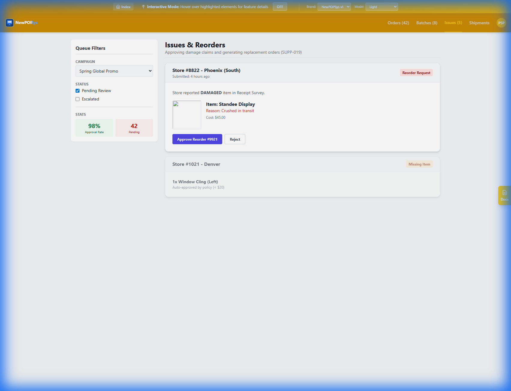

### 1.4 Navigation Path

```
PSP Portal  Issues (sidebar)  /psp/issues
```

### 1.5 Related Screens

| Screen | Relationship |
|--------|--------------|
| [P001 Order Queue](P001_Order_Queue.md) | Reorders appear in order queue |
| [P002 Shipments](P002_Shipments.md) | Reorder shipments tracked here |
| M03 Receipt Survey (Mobile) | Store reports issues from this screen |

---

## 2. User Roles & Permissions

### 2.1 Authorized Roles

| Role | Access Level | Permissions |
|------|--------------|-------------|
| PLATFORM_ADMIN | Full | View, triage, approve/reject, create reorders |
| PSP_ADMIN | Full | View, triage, approve/reject, create reorders |
| PSP_OPS | Operational | View, triage, approve/reject (scoped), create reorders |
| Support Agent (PSP_OPS + support_scope) | Read-Only | View only |

### 2.2 Permission Requirements

| Requirement ID | Description | Roles |
|----------------|-------------|-------|
| REQ-P003-SEC-001 | User SHALL be authenticated with valid JWT containing tenant_id | All |
| REQ-P003-SEC-002 | User SHALL have PSP-level role for issue management | All |
| REQ-P003-SEC-003 | PSP_OPS MAY approve issues under configured threshold | PSP_OPS |
| REQ-P003-SEC-004 | PSP_ADMIN required for high-value issue approval | PSP_ADMIN, PLATFORM_ADMIN |
| REQ-P003-SEC-005 | Rejection SHALL require reason and explanation | All with approve rights |

### 2.3 Data Scope

- **Tenant Isolation**: Issues filtered by JWT tenant_id
- **Brand Visibility**: All brands within tenant visible
- **Store Access**: Issues from all stores visible

---

## 3. UI Components

### 3.1 Component Inventory

| Component ID | Type | Description |
|--------------|------|-------------|
| P003-C001 | Page Header | Title, issue counts by status |
| P003-C002 | Status Tabs | Open, Triaged, In Fulfillment, Resolved |
| P003-C003 | Search Bar | Issue ID, store number search |
| P003-C004 | Filter Panel | Type, campaign, date range filters |
| P003-C005 | Issues Table | Sortable issue list |
| P003-C006 | Issue Detail Panel | Side panel with full issue information |
| P003-C007 | Evidence Gallery | Photo viewer for issue evidence |
| P003-C008 | Triage Actions | Approve, Reject, Request Info buttons |
| P003-C009 | Reject Modal | Rejection reason form |
| P003-C010 | Reorder Button | Create replacement order |
| P003-C011 | Status Badge | Color-coded issue status |
| P003-C012 | Type Badge | Issue type indicator |

### 3.2 Layout Specification


### 3.3 Issue Detail Panel


### 3.4 Component Specifications

#### P003-C005: Issues Table

| Column | Field | Width | Sortable | Default Sort |
|--------|-------|-------|----------|--------------|
| Issue # | issue_number | 100px | Yes | - |
| Type | issue_type | 100px | Yes | - |
| Store | store.store_number | 100px | Yes | - |
| Item | kit_item.name | 150px | Yes | - |
| Campaign | campaign.name | 150px | Yes | - |
| Status | status | 100px | Yes | - |
| Age | created_at | 80px | Yes | ASC (FIFO) |

---

## 4. Data Requirements

### 4.1 Entity Mapping

| Entity | Table | Purpose |
|--------|-------|---------|
| IssueRequest | issue_requests | Issue record |
| IssueLine | issue_lines | Items in issue (if multiple) |
| AssignmentItem | assignment_items | Original assignment |
| KitItem | kit_items | Item details |
| StoreAssignment | store_assignments | Store/campaign context |
| Store | stores | Store information |
| Campaign | campaigns | Campaign reference |
| PhotoUpload | photo_uploads | Evidence photos |
| ReorderRequest | reorder_requests | Linked reorder (if created) |

### 4.2 Data Query

```sql
SELECT
  ir.id, ir.issue_number, ir.issue_type, ir.status,
  ir.description, ir.quantity_affected, ir.created_at,
  ir.triage_notes, ir.resolved_at, ir.resolution_type,
  ki.name as item_name, ki.sku,
  ai.quantity as qty_ordered,
  s.store_number, s.name as store_name,
  c.name as campaign_name,
  b.name as brand_name,
  (SELECT COUNT(*) FROM photo_uploads pu
   WHERE pu.reference_type = 'ISSUE'
   AND pu.reference_id = ir.id) as photo_count
FROM issue_requests ir
JOIN assignment_items ai ON ir.assignment_item_id = ai.id
JOIN kit_items ki ON ai.kit_item_id = ki.id
JOIN store_assignments sa ON ai.store_assignment_id = sa.id
JOIN stores s ON sa.store_id = s.id
JOIN campaigns c ON sa.campaign_id = c.id
JOIN brands b ON c.brand_id = b.id
WHERE ir.tenant_id = :tenant_id
  AND ir.deleted_at IS NULL
  AND ir.status IN (:status_filter)
ORDER BY ir.created_at ASC
LIMIT :page_size OFFSET :offset
```

### 4.3 Data Requirements Matrix

| Requirement ID | Description | Validation |
|----------------|-------------|------------|
| REQ-P003-DATA-001 | Issue list SHALL be scoped to tenant | tenant_id filter |
| REQ-P003-DATA-002 | Evidence photos SHALL be loaded on detail view | Lazy load |
| REQ-P003-DATA-003 | Issue age SHALL be calculated from created_at | Real-time |
| REQ-P003-DATA-004 | Related reorder SHALL be linked when created | FK reference |
| REQ-P003-DATA-005 | FIFO ordering SHALL prioritize oldest issues | ORDER BY created_at ASC |

---

## 5. Business Rules & Validation

### 5.1 Issue Type Rules

| Requirement ID | Issue Type | Auto-Approve Eligible | Requires Photo |
|----------------|------------|----------------------|----------------|
| REQ-P003-BR-001 | MISSING | Yes (if tracking shows delivered) | No |
| REQ-P003-BR-002 | DAMAGED | No (requires photo review) | Yes |
| REQ-P003-BR-003 | WRONG_ITEM | No (requires photo review) | Yes |
| REQ-P003-BR-004 | QUANTITY_SHORT | Yes (if < ordered qty) | No |

### 5.2 Triage Rules

| Requirement ID | Rule | Enforcement |
|----------------|------|-------------|
| REQ-P003-BR-005 | DAMAGED issues SHALL require at least one evidence photo | API validation |
| REQ-P003-BR-006 | Rejection SHALL require reason code and explanation | Form validation |
| REQ-P003-BR-007 | Approved issues SHALL be eligible for reorder creation | Status check |
| REQ-P003-BR-008 | Reorder creation SHALL transition issue to IN_FULFILLMENT | State machine |
| REQ-P003-BR-009 | Reorder delivery SHALL auto-resolve issue | Webhook trigger |

### 5.3 Validation Rules

| Requirement ID | Field | Validation | Error Message |
|----------------|-------|------------|---------------|
| REQ-P003-VAL-001 | triage_notes | Max 1000 characters | "Notes too long" |
| REQ-P003-VAL-002 | rejection_reason | Required for reject | "Rejection reason required" |
| REQ-P003-VAL-003 | rejection_explanation | Required for reject, 10+ chars | "Please provide explanation" |
| REQ-P003-VAL-004 | reorder_quantity | 1 to quantity_affected | "Invalid quantity" |

### 5.4 Rejection Reason Codes

| Code | Display | Description |
|------|---------|-------------|
| INSUFFICIENT_EVIDENCE | Insufficient evidence | Photos don't show claimed issue |
| ITEM_USABLE | Item appears usable | Damage doesn't affect display |
| OUTSIDE_WINDOW | Outside return window | Reported too late |
| DUPLICATE | Duplicate request | Already submitted |
| OTHER | Other | Free-form explanation required |

---

## 6. API Integration Points

### 6.1 API Endpoints

| Endpoint | Method | Purpose | Request | Response |
|----------|--------|---------|---------|----------|
| `/api/v1/issues` | GET | List issues | Query params | IssueDTO[] |
| `/api/v1/issues/{id}` | GET | Issue detail | Path param | IssueDetailDTO |
| `/api/v1/issues/{id}/triage` | POST | Triage decision | TriageRequest | IssueDTO |
| `/api/v1/issues/{id}/approve` | POST | Approve issue | ApproveRequest | IssueDTO |
| `/api/v1/issues/{id}/reject` | POST | Reject issue | RejectRequest | IssueDTO |
| `/api/v1/issues/{id}/request-info` | POST | Request more info | RequestInfoDTO | IssueDTO |
| `/api/v1/issues/{id}/reorder` | POST | Create reorder | ReorderRequest | ReorderDTO |
| `/api/v1/issues/{id}/photos` | GET | Evidence photos | Path param | PhotoDTO[] |
| `/api/v1/issues/counts` | GET | Status counts | Query params | CountsDTO |

### 6.2 Request/Response Schemas

#### POST /api/v1/issues/{id}/reject

**Request Schema:**

```json
{
  "reason_code": "INSUFFICIENT_EVIDENCE",
  "explanation": "Photos do not clearly show the reported damage. The item appears intact.",
  "notify_store": true
}
```

**Response Schema:**

```json
{
  "id": "uuid",
  "issue_number": "ISS-1042",
  "status": "REJECTED",
  "issue_type": "DAMAGED",
  "rejection": {
    "reason_code": "INSUFFICIENT_EVIDENCE",
    "explanation": "Photos do not clearly show the reported damage.",
    "rejected_by": "user@psp.com",
    "rejected_at": "2025-12-15T14:30:00Z"
  },
  "store_notified": true
}
```

#### POST /api/v1/issues/{id}/reorder

**Request Schema:**

```json
{
  "quantity": 1,
  "notes": "Replacement for damaged item",
  "priority": "NORMAL"
}
```

**Response Schema:**

```json
{
  "id": "uuid",
  "reorder_number": "REO-1042",
  "status": "PENDING",
  "issue_id": "uuid",
  "order": {
    "id": "uuid",
    "order_number": "ORD-1500",
    "status": "GENERATED"
  },
  "quantity": 1,
  "created_at": "2025-12-15T14:35:00Z"
}
```

### 6.3 Webhook Events

| Event | Trigger | Payload |
|-------|---------|---------|
| issue.submitted | Store submits issue | IssueDTO |
| issue.triaged | PSP triages issue | IssueDTO |
| issue.approved | PSP approves issue | IssueDTO |
| issue.rejected | PSP rejects issue | IssueDTO + rejection |
| issue.resolved | Reorder delivered | IssueDTO + resolution |

### 6.4 API Requirements

| Requirement ID | Description | Implementation |
|----------------|-------------|----------------|
| REQ-P003-API-001 | All decisions SHALL emit webhook events | Async queue |
| REQ-P003-API-002 | Reject SHALL notify store via email/push | Notification service |
| REQ-P003-API-003 | Reorder creation SHALL generate new order | Order service |
| REQ-P003-API-004 | Idempotency-Key required for all writes | Request header |

---

## 7. State Transitions

### 7.1 Issue Status State Machine


[Diagram - See rendered image above or refer to source document]


### 7.2 State Transition Requirements

| Requirement ID | Transition | From | To | Trigger |
|----------------|------------|------|-----|---------|
| REQ-P003-ST-001 | Triage | OPEN | TRIAGED | PSP reviews |
| REQ-P003-ST-002 | Approve | TRIAGED | APPROVED | PSP approves |
| REQ-P003-ST-003 | Reject | TRIAGED | REJECTED | PSP rejects |
| REQ-P003-ST-004 | Request Info | TRIAGED | AWAITING_INFO | Need more details |
| REQ-P003-ST-005 | Info Received | AWAITING_INFO | TRIAGED | Store responds |
| REQ-P003-ST-006 | Create Reorder | APPROVED | IN_FULFILLMENT | Reorder created |
| REQ-P003-ST-007 | Resolve | IN_FULFILLMENT | RESOLVED | Reorder delivered |
| REQ-P003-ST-008 | Deny Resolution | REJECTED | RESOLVED | Rejection finalized |

### 7.3 Status Display Mapping

| Status | Badge Color | Display Text | Icon |
|--------|-------------|--------------|------|
| OPEN | Yellow | Open | AlertCircle |
| TRIAGED | Green | Triaged | Eye |
| APPROVED | Green | Approved | CheckCircle |
| AWAITING_INFO | Orange | Awaiting Info | HelpCircle |
| IN_FULFILLMENT | Blue | In Fulfillment | Package |
| RESOLVED | Gray | Resolved | Check |
| REJECTED | Red | Rejected | XCircle |

### 7.4 Issue Type Display

| Type | Badge Color | Icon | Description |
|------|-------------|------|-------------|
| MISSING | Red | XCircle | Item not received |
| DAMAGED | Orange | AlertTriangle | Item unusable |
| WRONG_ITEM | Purple | HelpCircle | Different item received |
| QUANTITY_SHORT | Yellow | Minus | Fewer than expected |

---

## 8. Error Handling

### 8.1 Error Scenarios

| Requirement ID | Error Scenario | HTTP Code | User Message | Recovery Action |
|----------------|----------------|-----------|--------------|-----------------|
| REQ-P003-ERR-001 | Issue not found | 404 | "Issue not found." | Refresh list |
| REQ-P003-ERR-002 | Invalid status transition | 409 | "Cannot perform action on issue in current status." | Show current status |
| REQ-P003-ERR-003 | Rejection without reason | 400 | "Please select a rejection reason." | Highlight field |
| REQ-P003-ERR-004 | Reorder for unapproved issue | 400 | "Issue must be approved before creating reorder." | Show approve button |
| REQ-P003-ERR-005 | Duplicate reorder | 409 | "Reorder already exists for this issue." | Show reorder link |
| REQ-P003-ERR-006 | Photo load failed | 500 | "Unable to load evidence photos." | Retry button |
| REQ-P003-ERR-007 | Permission denied | 403 | "You don't have permission to approve this issue." | Show requirements |

### 8.2 Error Display

| Component | Error Type | Display Method |
|-----------|------------|----------------|
| Detail Panel | Load error | Panel error state |
| Triage Actions | Validation error | Button tooltip |
| Reject Modal | Form error | Inline field errors |
| Photo Gallery | Load error | Placeholder with retry |

### 8.3 Logging Requirements

| Requirement ID | Event | Log Level | Data |
|----------------|-------|-----------|------|
| REQ-P003-LOG-001 | Issue viewed | INFO | user_id, issue_id |
| REQ-P003-LOG-002 | Issue approved | INFO | user_id, issue_id, notes |
| REQ-P003-LOG-003 | Issue rejected | INFO | user_id, issue_id, reason_code |
| REQ-P003-LOG-004 | Reorder created | INFO | user_id, issue_id, reorder_id |
| REQ-P003-LOG-005 | Error | ERROR | error_code, message, context |

---

## 9. Accessibility Requirements

### 9.1 WCAG 2.1 AA Compliance

| Requirement ID | Guideline | Implementation |
|----------------|-----------|----------------|
| REQ-P003-A11Y-001 | 1.1.1 Non-text Content | Evidence photos have descriptive alt text |
| REQ-P003-A11Y-002 | 1.3.1 Info and Relationships | Panel sections use proper heading hierarchy |
| REQ-P003-A11Y-003 | 1.4.1 Use of Color | Status and type use color + text + icon |
| REQ-P003-A11Y-004 | 2.1.1 Keyboard | All actions accessible via keyboard |
| REQ-P003-A11Y-005 | 2.4.4 Link Purpose | Action buttons have descriptive labels |
| REQ-P003-A11Y-006 | 3.2.2 On Input | Modal actions require explicit submit |
| REQ-P003-A11Y-007 | 3.3.2 Labels | All form fields have visible labels |
| REQ-P003-A11Y-008 | 4.1.3 Status Messages | Status changes announced to screen readers |

### 9.2 Keyboard Navigation

| Key | Action |
|-----|--------|
| Tab | Navigate between interactive elements |
| Enter | Activate button, open detail panel |
| Escape | Close panel, close modal |
| Arrow Left/Right | Navigate photo gallery |
| Space | Toggle photo full-screen |

### 9.3 Screen Reader Support

| Component | Announcement |
|-----------|--------------|
| Issue Row | "Issue ISS-1042, Damaged, Store STR-001, Window Poster, Open, 2 hours ago" |
| Status Badge | "Status: Open" |
| Type Badge | "Issue type: Damaged" |
| Photo Gallery | "Evidence photo 1 of 2" |
| Action Buttons | "Approve issue button", "Reject issue button" |
| Status Change | "Issue ISS-1042 approved" (live region) |

---

## 10. Acceptance Criteria

### 10.1 Functional Acceptance Criteria

| Criteria ID | Description | Verification Method |
|-------------|-------------|---------------------|
| REQ-P003-AC-001 | Issues queue displays all active issues for tenant | Query verification |
| REQ-P003-AC-002 | Status tabs correctly filter issues by status | UI testing |
| REQ-P003-AC-003 | FIFO ordering shows oldest issues first | Query verification |
| REQ-P003-AC-004 | Click on issue row opens detail panel | UI testing |
| REQ-P003-AC-005 | Evidence photos load in detail panel | UI testing |
| REQ-P003-AC-006 | Approve button transitions issue to APPROVED | API + DB verification |
| REQ-P003-AC-007 | Reject requires reason code and explanation | UI testing |
| REQ-P003-AC-008 | Rejection sends notification to store | Notification verification |
| REQ-P003-AC-009 | Create Reorder generates new order | API + DB verification |
| REQ-P003-AC-010 | Reorder delivery auto-resolves issue | Integration testing |

### 10.2 Business Logic Acceptance Criteria

| Criteria ID | Description | Verification Method |
|-------------|-------------|---------------------|
| REQ-P003-AC-011 | DAMAGED issues require photo evidence | API validation testing |
| REQ-P003-AC-012 | MISSING issues may auto-approve if tracking confirms | Business rule testing |
| REQ-P003-AC-013 | Quantity in reorder does not exceed affected quantity | API validation testing |
| REQ-P003-AC-014 | Issue status follows defined state machine | State transition testing |
| REQ-P003-AC-015 | Resolved issues move to history tab | UI testing |

### 10.3 Non-Functional Acceptance Criteria

| Criteria ID | Description | Target | Verification |
|-------------|-------------|--------|--------------|
| REQ-P003-AC-016 | Page load time | < 2 seconds | Performance testing |
| REQ-P003-AC-017 | Detail panel load | < 500ms | Performance testing |
| REQ-P003-AC-018 | Photo gallery load | < 2 seconds | Performance testing |
| REQ-P003-AC-019 | WCAG 2.1 AA compliance | 100% | Accessibility audit |
| REQ-P003-AC-020 | Browser support | Chrome, Firefox, Edge, Safari | Cross-browser testing |

### 10.4 Traceability Matrix

| Requirement | Source | Test Case |
|-------------|--------|-----------|
| REQ-P003-BR-001 | SUPP-019 | TC-P003-001 |
| REQ-P003-SEC-001 | SUPP-003 | TC-P003-SEC-001 |
| REQ-P003-DATA-001 | 3.1 Database Model | TC-P003-DATA-001 |
| REQ-P003-API-001 | 3.4 Integration Architecture | TC-P003-API-001 |
| REQ-P003-ST-001 | SUPP-019 State Machine | TC-P003-ST-001 |

---

## Appendix A: Revision History

| Version | Date | Author | Changes |
|---------|------|--------|---------|
| 1.0 | 2026-01-01 | System | Initial specification |

---

*Document Status: Complete*
*IEEE 830 Compliance: Section 3.2 - Functional Requirements*


---

# Section 9: Store Portal Module


---
# S001 - Store Dashboard Screen Specification

> **Module**: StorePortal
> **Screen ID**: S001
> **Route**: `/store/dashboard`
> **Version**: 1.0
> **Last Updated**: 2026-01-01
> **IEEE 830 Compliance**: Section 3.2 - Functional Requirements

---

## 1. Screen Overview

### 1.1 Purpose

The Store Dashboard serves as the primary landing page for store personnel, providing a consolidated view of campaign status, pending actions, and key performance metrics. It enables store managers and operators to quickly assess their workload and navigate to priority tasks.

### 1.2 Screenshot Reference

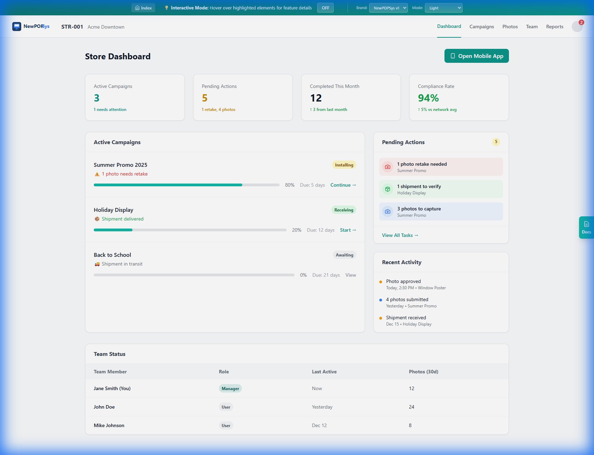

### 1.3 Source References

| Document | Section |
|----------|---------|
| SUPP-001 | Persona Workflows - Store Level |
| Screen Spec | SOW/06_Screen_Specs/S01_Dashboard.md |
| Database Model | Section 3.1 - Store & Assignment Tables |

---

## 2. User Roles & Permissions

### 2.1 Authorized Roles

| Role | Access Level | Persona ID |
|------|--------------|------------|
| STORE_MANAGER | Full Access | P07 |
| STORE_OPERATOR | Limited Access | P08 |

### 2.2 Role-Based Display Rules

| Feature | STORE_MANAGER | STORE_OPERATOR |
|---------|---------------|----------------|
| View all store campaigns | Yes | Yes (assigned only) |
| View team activity section | Yes | No |
| Access team management link | Yes | No |
| View store reports link | Yes | No |
| View compliance rate KPI | Yes | No |
| Execute campaign tasks | Yes | Yes |

### 2.3 Permission Requirements

| Requirement ID | Description | Priority |
|----------------|-------------|----------|
| REQ-S001-SEC-001 | User must have active membership with store to access dashboard | Must |
| REQ-S001-SEC-002 | Dashboard data scoped to user's assigned store only | Must |
| REQ-S001-SEC-003 | STORE_OPERATOR sees only their own pending actions | Must |
| REQ-S001-SEC-004 | STORE_MANAGER sees all team members' pending actions | Must |

---

## 3. UI Components

### 3.1 Component Inventory

| Component ID | Component Name | Type | Description |
|--------------|----------------|------|-------------|
| S001-C001 | Page Header | Header | "Dashboard" title with store name |
| S001-C002 | KPI Cards Row | Card Grid | 4 key performance indicator cards |
| S001-C003 | Active Campaigns List | Data List | Expandable campaign entries |
| S001-C004 | Pending Actions Panel | Action List | Priority-sorted task list |
| S001-C005 | Recent Activity Feed | Timeline | Chronological activity stream |
| S001-C006 | Team Status Card | Summary Card | Team member overview (Manager only) |
| S001-C007 | Quick Actions Bar | Button Group | Primary navigation shortcuts |

### 3.2 KPI Cards Specification

| Card ID | Metric | Calculation | Visual |
|---------|--------|-------------|--------|
| KPI-001 | Active Campaigns | COUNT(assignments WHERE status NOT IN ['COMPLETE', 'WAIVED']) | Number badge |
| KPI-002 | Pending Actions | COUNT(actions WHERE status = 'PENDING') | Number with urgency color |
| KPI-003 | Completed This Month | COUNT(assignments WHERE completed_at >= first_of_month) | Number with trend arrow |
| KPI-004 | Compliance Rate | (on_time_completions / total_completions) * 100 | Percentage gauge |

### 3.3 Layout Structure


### 3.4 Component Requirements

| Requirement ID | Description | Priority |
|----------------|-------------|----------|
| REQ-S001-UI-001 | KPI cards must display loading skeleton during data fetch | Must |
| REQ-S001-UI-002 | Active campaigns list supports expand/collapse interaction | Must |
| REQ-S001-UI-003 | Pending actions sorted by urgency (due date ascending) | Must |
| REQ-S001-UI-004 | Recent activity shows last 10 events with relative timestamps | Should |
| REQ-S001-UI-005 | Team status card hidden for STORE_OPERATOR role | Must |
| REQ-S001-UI-006 | Dashboard auto-refreshes every 5 minutes | Should |

---

## 4. Data Requirements

### 4.1 Entity Dependencies

| Entity | Table Name | Fields Required | Relationship |
|--------|------------|-----------------|--------------|
| Store | stores | id, name, external_store_guid, status | Primary |
| StoreAssignment | store_assignments | id, campaign_id, store_id, status, pinned_layout_id | Many-to-One |
| Campaign | campaigns | id, name, install_start, install_end, status | Via Assignment |
| PhotoUpload | photo_uploads | id, assignment_item_id, review_status, created_at | Via Assignment |
| IssueRequest | issue_requests | id, store_assignment_id, status, created_at | Via Assignment |
| User | users | id, name, email, is_active | Via Membership |
| Membership | memberships | user_id, store_id, role | Join Table |

### 4.2 Data Query Specification


### 4.3 Data Requirements

| Requirement ID | Description | Priority |
|----------------|-------------|----------|
| REQ-S001-DATA-001 | All queries must filter by tenant_id from JWT | Must |
| REQ-S001-DATA-002 | Soft-deleted records excluded from all counts | Must |
| REQ-S001-DATA-003 | Campaign dates displayed in store's local timezone | Must |
| REQ-S001-DATA-004 | Activity feed limited to last 30 days | Should |

---

## 5. Business Rules & Validation

### 5.1 Display Rules

| Rule ID | Rule Description | Condition | Action |
|---------|------------------|-----------|--------|
| BR-S001-001 | Urgent action highlighting | Due date <= today | Display red badge |
| BR-S001-002 | Campaign phase badge | Based on StorePhase enum | Show appropriate status color |
| BR-S001-003 | Compliance rate threshold | Rate < 75% | Display warning indicator |
| BR-S001-004 | Empty state handling | No active campaigns | Show "No active campaigns" message |

### 5.2 StorePhase Display Mapping

| StorePhase | Display Label | Badge Color |
|------------|---------------|-------------|
| AWAITING_SHIPMENT | Awaiting Shipment | Gray |
| SHIPMENT_IN_TRANSIT | In Transit | Blue |
| READY_TO_RECEIVE | Ready to Receive | Yellow |
| RECEIVING | Receiving | Yellow |
| READY_TO_INSTALL | Ready to Install | Orange |
| INSTALLING | Installing | Orange |
| PENDING_REVIEW | Pending Review | Purple |
| COMPLETE | Complete | Green |
| NEEDS_ATTENTION | Needs Attention | Red |
| WAIVED | Waived | Gray |

### 5.3 Business Rule Requirements

| Requirement ID | Description | Priority |
|----------------|-------------|----------|
| REQ-S001-BR-001 | Campaigns sorted by install_end date (earliest first) | Must |
| REQ-S001-BR-002 | NEEDS_ATTENTION status triggers visual alert | Must |
| REQ-S001-BR-003 | Pending actions derive from incomplete workflow steps | Must |
| REQ-S001-BR-004 | Completed campaigns remain visible for 30 days post-completion | Should |

---

## 6. API Integration Points

### 6.1 API Endpoints

| Endpoint | Method | Purpose | Response |
|----------|--------|---------|----------|
| `/api/stores/{storeId}/dashboard` | GET | Fetch dashboard aggregate data | DashboardDTO |
| `/api/stores/{storeId}/assignments` | GET | List active assignments | Assignment[] |
| `/api/stores/{storeId}/activity` | GET | Recent activity feed | ActivityEvent[] |

### 6.2 Request/Response Specifications

#### GET /api/stores/{storeId}/dashboard

**Request Headers:**
```
Authorization: Bearer {jwt_token}
X-Tenant-ID: {tenant_uuid}
```

**Response Schema:**
```json
{
  "store": {
    "id": "uuid",
    "name": "string",
    "externalGuid": "string"
  },
  "metrics": {
    "activeCampaigns": "number",
    "pendingActions": "number",
    "completedThisMonth": "number",
    "complianceRate": "number"
  },
  "campaigns": [
    {
      "id": "uuid",
      "name": "string",
      "phase": "StorePhase",
      "installStart": "ISO8601",
      "installEnd": "ISO8601",
      "pendingTasks": ["string"]
    }
  ],
  "recentActivity": [
    {
      "id": "uuid",
      "type": "string",
      "actor": "string",
      "description": "string",
      "timestamp": "ISO8601"
    }
  ],
  "teamStatus": {
    "activeMembers": "number",
    "pendingInvitations": "number"
  }
}
```

### 6.3 API Requirements

| Requirement ID | Description | Priority |
|----------------|-------------|----------|
| REQ-S001-API-001 | Dashboard endpoint returns within 500ms | Must |
| REQ-S001-API-002 | Response includes cache headers (max-age: 60) | Should |
| REQ-S001-API-003 | 404 returned if store not found or user lacks access | Must |
| REQ-S001-API-004 | teamStatus omitted from response for STORE_OPERATOR | Must |

---

## 7. State Transitions

### 7.1 Dashboard Load States


### 7.2 State Descriptions

| State | Description | UI Behavior |
|-------|-------------|-------------|
| INITIAL | Component mounted | Show loading skeleton |
| LOADING | API request in flight | Display skeleton, disable interactions |
| LOADED | Data successfully retrieved | Render dashboard components |
| ERROR | API request failed | Show error message with retry button |
| REFRESHING | Background data refresh | Subtle loading indicator, data remains visible |

### 7.3 State Requirements

| Requirement ID | Description | Priority |
|----------------|-------------|----------|
| REQ-S001-STATE-001 | Loading state displays within 100ms of navigation | Must |
| REQ-S001-STATE-002 | Error state provides actionable retry option | Must |
| REQ-S001-STATE-003 | Refreshing state does not interrupt user interaction | Must |

---

## 8. Error Handling

### 8.1 Error Scenarios

| Error Code | Scenario | User Message | Recovery Action |
|------------|----------|--------------|-----------------|
| 401 | Unauthorized/expired token | "Session expired. Please log in again." | Redirect to login |
| 403 | No store access | "You don't have access to this store." | Redirect to store selector |
| 404 | Store not found | "Store not found." | Redirect to store selector |
| 500 | Server error | "Unable to load dashboard. Please try again." | Show retry button |
| NETWORK | Connection failed | "Connection lost. Check your internet." | Show retry with offline indicator |

### 8.2 Partial Load Handling

| Component | Failure Behavior |
|-----------|------------------|
| KPI Cards | Show "--" placeholder, log error |
| Campaign List | Show empty state with error message |
| Activity Feed | Show "Unable to load activity" |
| Team Status | Hide component, log error |

### 8.3 Error Requirements

| Requirement ID | Description | Priority |
|----------------|-------------|----------|
| REQ-S001-ERR-001 | All API errors logged with correlation ID | Must |
| REQ-S001-ERR-002 | User-facing errors do not expose technical details | Must |
| REQ-S001-ERR-003 | Retry attempts use exponential backoff | Should |
| REQ-S001-ERR-004 | Partial failures do not block entire dashboard | Should |

---

## 9. Accessibility Requirements

### 9.1 WCAG 2.1 AA Compliance

| Requirement ID | WCAG Criterion | Implementation |
|----------------|----------------|----------------|
| REQ-S001-A11Y-001 | 1.1.1 Non-text Content | Alt text for all status icons and badges |
| REQ-S001-A11Y-002 | 1.3.1 Info and Relationships | Semantic HTML structure with proper headings |
| REQ-S001-A11Y-003 | 1.4.3 Contrast | Minimum 4.5:1 contrast for all text |
| REQ-S001-A11Y-004 | 2.1.1 Keyboard | All interactive elements keyboard accessible |
| REQ-S001-A11Y-005 | 2.4.4 Link Purpose | Descriptive link text for all navigation |
| REQ-S001-A11Y-006 | 4.1.2 Name, Role, Value | ARIA labels for dynamic content regions |

### 9.2 Screen Reader Support

| Component | ARIA Implementation |
|-----------|---------------------|
| KPI Cards | role="status", aria-live="polite" for updates |
| Campaign List | role="list", aria-expanded for expandable items |
| Pending Actions | role="list", aria-describedby for urgency |
| Activity Feed | role="feed", aria-busy during refresh |

### 9.3 Keyboard Navigation

| Key | Action |
|-----|--------|
| Tab | Move between interactive elements |
| Enter/Space | Activate focused element |
| Arrow Down | Expand campaign details |
| Arrow Up | Collapse campaign details |
| Escape | Close any open panels |

---

## 10. Acceptance Criteria

### 10.1 Functional Requirements

| Requirement ID | Description | Test Criteria | Priority |
|----------------|-------------|---------------|----------|
| REQ-S001-FR-001 | Dashboard displays 4 KPI cards | All 4 metrics visible with correct values | Must |
| REQ-S001-FR-002 | Active campaigns list shows current assignments | List matches database query results | Must |
| REQ-S001-FR-003 | Pending actions sorted by urgency | Earliest due date appears first | Must |
| REQ-S001-FR-004 | Campaign cards expand to show details | Click expands, shows tasks and dates | Must |
| REQ-S001-FR-005 | Recent activity shows last 10 events | Events display with relative timestamps | Should |
| REQ-S001-FR-006 | Team status visible to STORE_MANAGER only | Component hidden for STORE_OPERATOR | Must |
| REQ-S001-FR-007 | Dashboard auto-refreshes every 5 minutes | Data updates without page reload | Should |
| REQ-S001-FR-008 | Quick actions navigate to correct screens | Each action links to proper route | Must |
| REQ-S001-FR-009 | Campaign click navigates to campaign detail | Route: /store/campaigns/{id} | Must |
| REQ-S001-FR-010 | Empty state displayed when no campaigns | Message shown when list is empty | Must |

### 10.2 Non-Functional Requirements

| Requirement ID | Description | Metric | Priority |
|----------------|-------------|--------|----------|
| REQ-S001-NFR-001 | Page load time | < 2 seconds on 3G connection | Must |
| REQ-S001-NFR-002 | API response time | < 500ms for dashboard endpoint | Must |
| REQ-S001-NFR-003 | Mobile responsiveness | Renders correctly on 320px viewport | Must |
| REQ-S001-NFR-004 | Offline indicator | Displays when connection lost | Should |

### 10.3 Traceability Matrix

| Requirement | Source Document | Section |
|-------------|-----------------|---------|
| REQ-S001-FR-001 | S01_Dashboard.md | UI Components |
| REQ-S001-FR-002 | S01_Dashboard.md | Active Campaigns |
| REQ-S001-SEC-001 | SUPP-003 | Store Level Permissions |
| REQ-S001-DATA-001 | 3.1_Database_Model.md | Multi-Tenancy Model |

---

## Document History

| Version | Date | Author | Changes |
|---------|------|--------|---------|
| 1.0 | 2026-01-01 | System | Initial SRS specification |

---

*Document Status: Complete*
*IEEE 830 Compliance: Section 3.2 - Functional Requirements*


---
# S002 - Campaign History Screen Specification

> **Module**: StorePortal
> **Screen ID**: S002
> **Route**: `/store/campaigns`
> **Version**: 1.0
> **Last Updated**: 2026-01-01
> **IEEE 830 Compliance**: Section 3.2 - Functional Requirements

---

## 1. Screen Overview

### 1.1 Purpose

The Campaign History screen provides store personnel with a comprehensive view of all campaign assignments, both active and completed. Users can filter by status, view detailed campaign information, track execution progress, and access historical campaign data for compliance and audit purposes.

### 1.2 Screenshot Reference

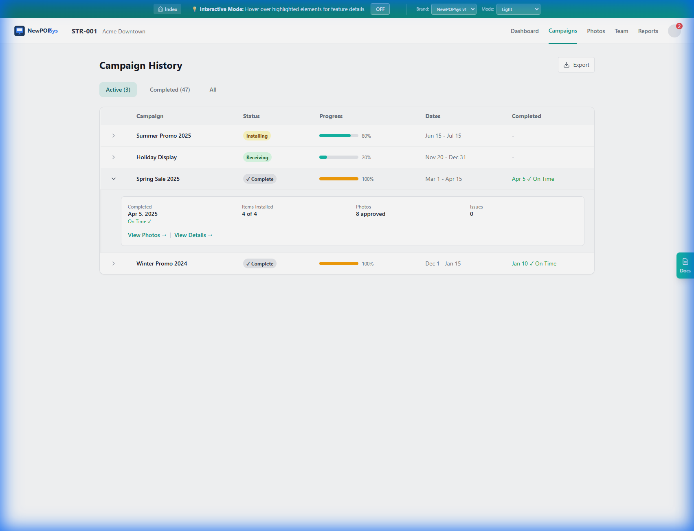

### 1.3 Source References

| Document | Section |
|----------|---------|
| SUPP-001 | Persona Workflows - Store Level |
| Screen Spec | SOW/06_Screen_Specs/S02_Campaign_History.md |
| Database Model | Section 3.1 - Campaign & Assignment Tables |

---

## 2. User Roles & Permissions

### 2.1 Authorized Roles

| Role | Access Level | Persona ID |
|------|--------------|------------|
| STORE_MANAGER | Full Access | P07 |
| STORE_OPERATOR | View + Execute | P08 |

### 2.2 Role-Based Capabilities

| Capability | STORE_MANAGER | STORE_OPERATOR |
|------------|---------------|----------------|
| View all store campaigns | Yes | Yes (assigned only) |
| View campaign details | Yes | Yes |
| Export campaign list | Yes | No |
| View all team submissions | Yes | Own submissions only |
| Access campaign analytics | Yes | No |

### 2.3 Permission Requirements

| Requirement ID | Description | Priority |
|----------------|-------------|----------|
| REQ-S002-SEC-001 | User must have active store membership | Must |
| REQ-S002-SEC-002 | Campaign list scoped to user's assigned store | Must |
| REQ-S002-SEC-003 | STORE_OPERATOR limited to assigned campaigns only | Should |
| REQ-S002-SEC-004 | Export functionality restricted to STORE_MANAGER | Must |

---

## 3. UI Components

### 3.1 Component Inventory

| Component ID | Component Name | Type | Description |
|--------------|----------------|------|-------------|
| S002-C001 | Page Header | Header | "Campaigns" with filter controls |
| S002-C002 | Status Tabs | Tab Bar | Active, Completed, All filters |
| S002-C003 | Campaign List | Data Table | Sortable campaign entries |
| S002-C004 | Search Bar | Input | Campaign name/ID search |
| S002-C005 | Detail Panel | Slide Panel | Expandable campaign details |
| S002-C006 | Phase Badge | Status Badge | StorePhase indicator |
| S002-C007 | Progress Bar | Progress | Visual completion indicator |
| S002-C008 | Export Button | Button | CSV download trigger |
| S002-C009 | Empty State | Message | No campaigns message |

### 3.2 Layout Structure


### 3.3 Component Requirements

| Requirement ID | Description | Priority |
|----------------|-------------|----------|
| REQ-S002-UI-001 | Campaign list supports column sorting | Must |
| REQ-S002-UI-002 | Status tabs filter list dynamically without page reload | Must |
| REQ-S002-UI-003 | Detail panel slides in from right on row click | Must |
| REQ-S002-UI-004 | Progress bar reflects actual task completion percentage | Must |
| REQ-S002-UI-005 | Search filters by campaign name or external ID | Should |
| REQ-S002-UI-006 | List displays 20 items per page with pagination | Must |

---

## 4. Data Requirements

### 4.1 Entity Dependencies

| Entity | Table Name | Fields Required | Relationship |
|--------|------------|-----------------|--------------|
| StoreAssignment | store_assignments | id, campaign_id, store_id, status, pinned_layout_id, completed_at | Primary |
| Campaign | campaigns | id, name, code, install_start, install_end, status | Many-to-One |
| AssignmentItem | assignment_items | id, assignment_id, kit_item_id, slot_id | One-to-Many |
| KitItem | kit_items | id, name, sku, quantity | Via AssignmentItem |
| PhotoUpload | photo_uploads | id, assignment_item_id, review_status | Via AssignmentItem |
| ReceiveVerification | receive_verifications | id, assignment_id, verified_at | One-to-One |
| CompletionAttestation | completion_attestations | id, assignment_id, attested_by | One-to-One |

### 4.2 Data Query Specification


### 4.3 Data Requirements

| Requirement ID | Description | Priority |
|----------------|-------------|----------|
| REQ-S002-DATA-001 | Campaigns ordered by install_end date descending | Must |
| REQ-S002-DATA-002 | Include item counts and photo statistics per assignment | Must |
| REQ-S002-DATA-003 | Soft-deleted records excluded from all queries | Must |
| REQ-S002-DATA-004 | Completed campaigns retained for 2 years | Should |

---

## 5. Business Rules & Validation

### 5.1 Status Tab Filtering

| Tab | Filter Condition | StorePhase Values Included |
|-----|------------------|---------------------------|
| Active | status NOT IN ('COMPLETE', 'WAIVED') | AWAITING_SHIPMENT, SHIPMENT_IN_TRANSIT, READY_TO_RECEIVE, RECEIVING, READY_TO_INSTALL, INSTALLING, PENDING_REVIEW, NEEDS_ATTENTION, REOPENED |
| Completed | status IN ('COMPLETE', 'WAIVED') | COMPLETE, WAIVED |
| All | No filter | All values |

### 5.2 StorePhase Status Display

| StorePhase | Display Label | Badge Color | Icon |
|------------|---------------|-------------|------|
| AWAITING_SHIPMENT | Awaiting Shipment | Gray | clock |
| SHIPMENT_IN_TRANSIT | In Transit | Blue | truck |
| READY_TO_RECEIVE | Ready to Receive | Yellow | package |
| RECEIVING | Receiving | Yellow | package-open |
| READY_TO_INSTALL | Ready to Install | Orange | tools |
| INSTALLING | Installing | Orange | hammer |
| PENDING_REVIEW | Pending Review | Purple | eye |
| COMPLETE | Complete | Green | check-circle |
| NEEDS_ATTENTION | Needs Attention | Red | alert-triangle |
| WAIVED | Waived | Gray | skip-forward |
| REOPENED | Reopened | Orange | refresh |

### 5.3 Progress Calculation

| Component | Weight | Calculation |
|-----------|--------|-------------|
| Shipment Received | 10% | receive_verification EXISTS |
| Pre-install Survey | 10% | survey_response EXISTS WHERE type='PRE_INSTALL' |
| All Items Installed | 50% | all assignment_items have status='INSTALLED' |
| All Photos Approved | 20% | all required photos have review_status='APPROVED' |
| Completion Survey | 10% | completion_attestation EXISTS |

### 5.4 Business Rule Requirements

| Requirement ID | Description | Priority |
|----------------|-------------|----------|
| REQ-S002-BR-001 | NEEDS_ATTENTION campaigns highlighted with alert icon | Must |
| REQ-S002-BR-002 | Overdue campaigns (past install_end) show warning indicator | Must |
| REQ-S002-BR-003 | Progress percentage rounds to nearest whole number | Should |
| REQ-S002-BR-004 | WAIVED campaigns show reason in detail panel | Should |

---

## 6. API Integration Points

### 6.1 API Endpoints

| Endpoint | Method | Purpose | Response |
|----------|--------|---------|----------|
| `/api/stores/{storeId}/assignments` | GET | List campaign assignments | Assignment[] |
| `/api/assignments/{id}` | GET | Get assignment details | AssignmentDetail |
| `/api/stores/{storeId}/assignments/export` | GET | Export campaign list as CSV | File download |

### 6.2 Request/Response Specifications

#### GET /api/stores/{storeId}/assignments

**Query Parameters:**
| Parameter | Type | Required | Description |
|-----------|------|----------|-------------|
| status | string | No | Filter: active, completed, all |
| search | string | No | Search by name/code |
| page | number | No | Page number (default: 1) |
| limit | number | No | Items per page (default: 20) |

**Response Schema:**
```json
{
  "data": [
    {
      "id": "uuid",
      "campaignId": "uuid",
      "campaignName": "string",
      "campaignCode": "string",
      "phase": "StorePhase",
      "installStart": "ISO8601",
      "installEnd": "ISO8601",
      "progress": "number",
      "itemCount": "number",
      "photoStats": {
        "required": "number",
        "uploaded": "number",
        "approved": "number"
      },
      "completedAt": "ISO8601 | null"
    }
  ],
  "pagination": {
    "page": "number",
    "limit": "number",
    "total": "number",
    "pages": "number"
  }
}
```

#### GET /api/assignments/{id}

**Query Parameters:**
| Parameter | Type | Required | Description |
|-----------|------|----------|-------------|
| include | string | No | Comma-separated: items,photos,tasks |

**Response Schema:**
```json
{
  "id": "uuid",
  "campaign": {
    "id": "uuid",
    "name": "string",
    "code": "string",
    "installStart": "ISO8601",
    "installEnd": "ISO8601"
  },
  "phase": "StorePhase",
  "progress": "number",
  "tasks": [
    {
      "name": "string",
      "status": "pending | complete",
      "completedAt": "ISO8601 | null"
    }
  ],
  "items": [
    {
      "id": "uuid",
      "name": "string",
      "sku": "string",
      "quantity": "number",
      "slotCode": "string",
      "photoCount": "number",
      "photoApproved": "boolean"
    }
  ],
  "receiveVerification": {
    "verifiedAt": "ISO8601",
    "verifiedBy": "string"
  },
  "completionAttestation": {
    "attestedAt": "ISO8601",
    "attestedBy": "string"
  }
}
```

### 6.3 API Requirements

| Requirement ID | Description | Priority |
|----------------|-------------|----------|
| REQ-S002-API-001 | List endpoint returns within 500ms | Must |
| REQ-S002-API-002 | Detail endpoint returns within 300ms | Must |
| REQ-S002-API-003 | Export generates CSV within 10 seconds | Should |
| REQ-S002-API-004 | Pagination required for lists > 20 items | Must |

---

## 7. State Transitions

### 7.1 Page States


### 7.2 State Descriptions

| State | Description | UI Behavior |
|-------|-------------|-------------|
| LOADING | Initial data fetch | Show skeleton loader |
| LOADED | Data displayed | Full list visible |
| FILTERING | Tab or search change | Update list, maintain position |
| DETAIL_OPEN | Row expanded | Slide panel visible |
| EXPORTING | CSV generation | Show progress, disable export button |
| ERROR | API failure | Show error message, retry option |

### 7.3 State Requirements

| Requirement ID | Description | Priority |
|----------------|-------------|----------|
| REQ-S002-STATE-001 | Tab changes update URL query parameter | Should |
| REQ-S002-STATE-002 | Detail panel state preserved on tab change | Should |
| REQ-S002-STATE-003 | Export state shows progress indicator | Must |

---

## 8. Error Handling

### 8.1 Error Scenarios

| Error Code | Scenario | User Message | Recovery Action |
|------------|----------|--------------|-----------------|
| 401 | Unauthorized | "Session expired" | Redirect to login |
| 403 | No access | "You don't have access to this store" | Redirect to store selector |
| 404 | Campaign not found | "Campaign not found" | Remove from list, show toast |
| 500 | Server error | "Unable to load campaigns" | Retry button |
| EXPORT_FAIL | Export generation failed | "Export failed. Please try again." | Retry button |

### 8.2 Validation Errors

| Scenario | Handling |
|----------|----------|
| Invalid date range | Show inline error, reset to defaults |
| Search no results | Show "No campaigns found" empty state |
| Page out of bounds | Redirect to last valid page |

### 8.3 Error Requirements

| Requirement ID | Description | Priority |
|----------------|-------------|----------|
| REQ-S002-ERR-001 | Failed export shows error toast | Must |
| REQ-S002-ERR-002 | Network errors display retry option | Must |
| REQ-S002-ERR-003 | Invalid campaign removed from list gracefully | Should |

---

## 9. Accessibility Requirements

### 9.1 WCAG 2.1 AA Compliance

| Requirement ID | WCAG Criterion | Implementation |
|----------------|----------------|----------------|
| REQ-S002-A11Y-001 | 1.3.1 Info and Relationships | Table uses proper th/td structure |
| REQ-S002-A11Y-002 | 1.4.1 Use of Color | Status not conveyed by color alone |
| REQ-S002-A11Y-003 | 2.1.1 Keyboard | Tab navigation through all controls |
| REQ-S002-A11Y-004 | 2.4.3 Focus Order | Logical focus order in detail panel |
| REQ-S002-A11Y-005 | 4.1.1 Parsing | Valid HTML, no duplicate IDs |
| REQ-S002-A11Y-006 | 4.1.2 Name, Role, Value | ARIA labels for status badges |

### 9.2 Screen Reader Support

| Component | ARIA Implementation |
|-----------|---------------------|
| Campaign Table | role="grid" with sortable column headers |
| Status Badge | aria-label="Status: {phase}" |
| Progress Bar | role="progressbar", aria-valuenow, aria-valuemin, aria-valuemax |
| Detail Panel | role="dialog", aria-modal="true" |
| Tabs | role="tablist" with aria-selected |

### 9.3 Keyboard Navigation

| Key | Action |
|-----|--------|
| Tab | Move between interactive elements |
| Enter | Open campaign detail / activate button |
| Escape | Close detail panel |
| Arrow Left/Right | Switch between status tabs |
| Arrow Up/Down | Navigate table rows |

---

## 10. Acceptance Criteria

### 10.1 Functional Requirements

| Requirement ID | Description | Test Criteria | Priority |
|----------------|-------------|---------------|----------|
| REQ-S002-FR-001 | Campaign list displays all store assignments | List matches database records | Must |
| REQ-S002-FR-002 | Active tab shows only in-progress campaigns | Filter excludes COMPLETE/WAIVED | Must |
| REQ-S002-FR-003 | Completed tab shows finished campaigns | Filter includes only COMPLETE/WAIVED | Must |
| REQ-S002-FR-004 | Search filters by campaign name | Real-time filtering as user types | Must |
| REQ-S002-FR-005 | Row click opens detail panel | Panel slides in from right | Must |
| REQ-S002-FR-006 | Detail panel shows all tasks | Checklist with completion status | Must |
| REQ-S002-FR-007 | Progress bar reflects actual completion | Percentage matches calculation | Must |
| REQ-S002-FR-008 | Export generates CSV file | File downloads with correct data | Must |
| REQ-S002-FR-009 | Status badges use correct colors | Colors match StorePhase mapping | Must |
| REQ-S002-FR-010 | Pagination works for large lists | Previous/next navigate correctly | Must |
| REQ-S002-FR-011 | Overdue campaigns show warning | Visual indicator for past install_end | Should |
| REQ-S002-FR-012 | Empty state shown when no campaigns | Message displayed for empty list | Must |

### 10.2 Non-Functional Requirements

| Requirement ID | Description | Metric | Priority |
|----------------|-------------|--------|----------|
| REQ-S002-NFR-001 | Page load time | < 2 seconds | Must |
| REQ-S002-NFR-002 | Search response time | < 300ms | Must |
| REQ-S002-NFR-003 | Export completion | < 10 seconds for 1000 campaigns | Should |
| REQ-S002-NFR-004 | Mobile responsive | Works on 320px viewport | Must |

### 10.3 Traceability Matrix

| Requirement | Source Document | Section |
|-------------|-----------------|---------|
| REQ-S002-FR-001 | S02_Campaign_History.md | Data Model Map |
| REQ-S002-FR-005 | S02_Campaign_History.md | Expanded Detail Panel |
| REQ-S002-SEC-001 | SUPP-003 | Store Level Permissions |
| REQ-S002-DATA-001 | 3.1_Database_Model.md | Store Assignments |

---

## Document History

| Version | Date | Author | Changes |
|---------|------|--------|---------|
| 1.0 | 2026-01-01 | System | Initial SRS specification |

---

*Document Status: Complete*
*IEEE 830 Compliance: Section 3.2 - Functional Requirements*


---
# S003 Photo Gallery - Screen Specification

> **SRS Section**: 5.9.3 | **Module**: Store Portal | **Version**: 1.0
> **IEEE 830 Reference**: Section 3.2 - Functional Requirements
> **Source Documents**:
> - [S03 Photo Gallery Screen Spec](../../../../06_Screen_Specs/S03_Photo_Gallery.md)
> - [SUPP-018 Photo Review](../../../../02_SUPPs/SUPP-018_Photo_Review.md)
> - [SUPP-037 Store Surveys](../../../../02_SUPPs/SUPP-037_Store_Surveys.md)
> **Last Updated**: 2026-01-01

---

## 1. Screen Overview

### 1.1 Purpose

The Photo Gallery screen provides store personnel with a centralized view of all installation proof photos submitted for their store. It enables browsing, filtering, and reviewing photo upload history across campaigns, with detailed status visibility for approved, pending, rejected, and superseded photos.

### 1.2 Route Configuration

| Attribute | Value |
|-----------|-------|
| **Route Path** | `/store/photos` |
| **Route Type** | Protected (Authentication Required) |
| **Lazy Loading** | Yes |
| **Mobile Support** | Full Responsive |

### 1.3 Screen Context

| Attribute | Description |
|-----------|-------------|
| **Primary Purpose** | Browse and review all store photo submissions |
| **Entry Points** | Store Dashboard quick link, Campaign History photo link |
| **Exit Points** | Dashboard, Campaign History, Photo Capture (mobile) |
| **Session Scope** | Store context from authenticated membership |

### 1.4 Screenshot Reference

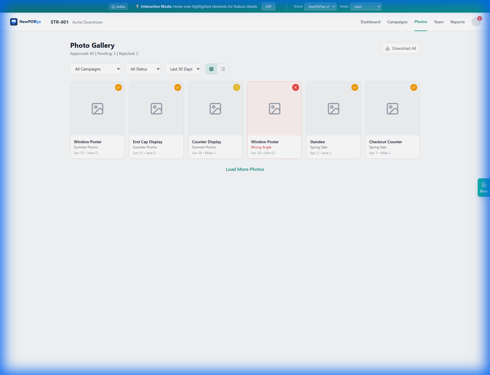

---

## 2. User Roles & Permissions

### 2.1 Authorized Roles

| Role | Access Level | Restrictions |
|------|--------------|--------------|
| STORE_MANAGER (P07) | Full Access | Own store photos only |
| STORE_OPERATOR (P08) | Read Access | Own store photos only |

### 2.2 Permission Requirements

| Permission | STORE_MANAGER | STORE_OPERATOR |
|------------|:-------------:|:--------------:|
| View photo gallery | Y | Y |
| View photo details/lightbox | Y | Y |
| Download individual photos | Y | Y |
| Download bulk photos | Y | N |
| View rejection reasons | Y | Y |
| View admin comments | Y | Y |
| Filter by team member | Y | N |

### 2.3 Data Scoping Rules

| Rule ID | Description |
|---------|-------------|
| REQ-S003-SEC-001 | Photos filtered to authenticated user's store via store_assignments.store_id |
| REQ-S003-SEC-002 | Store membership validated from JWT token claims |
| REQ-S003-SEC-003 | Cross-store photo access blocked at API and database layers |

---

## 3. UI Components

### 3.1 Component Hierarchy

- **PhotoGalleryPage**
    - **PageHeader**
        - TitleSection ("Photo Gallery")
        - StatusSummary (count by status)
    - **FilterBar**
        - CampaignFilter (dropdown)
        - StatusFilter (dropdown)
        - DateRangeFilter (dropdown)
        - ItemTypeFilter (multi-select)
        - UploadedByFilter (dropdown) [Store Manager only]
    - **ViewToggle**
        - GridViewButton
        - ListViewButton
    - **ActionBar**
        - BulkDownloadButton [Store Manager only]
    - **ContentArea**
        - **PhotoGrid** (default view)
            - PhotoCard[] (repeating)
        - **PhotoList** (alternate view)
            - PhotoRow[] (repeating)
    - **Pagination**
        - ResultCount
        - LoadMoreButton
    - **LightboxModal**
        - PhotoViewer
        - PhotoInfoPanel
        - NavigationControls

### 3.2 Component Specifications

| Component | Type | Description | Requirements |
|-----------|------|-------------|--------------|
| PageHeader | Container | Title and status summary | REQ-S003-UI-001 |
| StatusSummary | Display | Shows counts by review status | REQ-S003-UI-002 |
| FilterBar | Form | Filter controls for gallery | REQ-S003-UI-003 |
| ViewToggle | Button Group | Grid/List view switch | REQ-S003-UI-004 |
| PhotoGrid | Gallery | Thumbnail card grid | REQ-S003-UI-005 |
| PhotoCard | Card | Individual photo thumbnail | REQ-S003-UI-006 |
| PhotoList | Table | Tabular photo listing | REQ-S003-UI-007 |
| LightboxModal | Modal | Full-size photo viewer | REQ-S003-UI-008 |
| PhotoInfoPanel | Panel | Photo metadata display | REQ-S003-UI-009 |

### 3.3 Photo Card Layout

**Structure:**

*   **Header (Thumbnail Area)**
    *   Full-width image thumbnail
    *   Status Icon Overlay (`✓` / `⠌` / `⠳`)
*   **Footer (Metadata)**
    *   **Item Name**: (e.g., "Window Poster")
    *   **Campaign**: (e.g., "Summer Promo")
    *   **Date**: (e.g., "Jun 15, 2025")
    *   **Uploader**: (e.g., "by John D.")

### 3.4 Status Overlay Specifications

| Status | Icon | Background Color | Text Color |
|--------|------|------------------|------------|
| PENDING | `⏳` | `amber-100` | `amber-800` |
| APPROVED | `✓` | `green-100` | `green-800` |
| REJECTED | `❌` | `red-100` | `red-800` |
| SUPERSEDED | `🔄` | `gray-100` | `gray-600` |

---

## 4. Data Requirements

### 4.1 API Endpoints

| Endpoint | Method | Purpose | Request |
|----------|--------|---------|---------|
| `/stores/{storeId}/photos` | GET | Fetch photo gallery | Query params |
| `/photos/{photoId}` | GET | Get photo details | Path param |
| `/photos/download` | POST | Bulk download | Photo ID array |

### 4.2 Request Parameters

**GET /stores/{storeId}/photos**

| Parameter | Type | Required | Description |
|-----------|------|----------|-------------|
| storeId | UUID | Yes | Store identifier (path) |
| campaign_id | UUID | No | Filter by campaign |
| status | Enum | No | PhotoReviewStatus filter |
| date_from | Date | No | Start date filter |
| date_to | Date | No | End date filter |
| item_type | Enum[] | No | Kit item type filter |
| uploaded_by | UUID | No | Uploader user ID |
| page | Integer | No | Page number (default: 1) |
| limit | Integer | No | Results per page (default: 24) |

### 4.3 Response Schema

```typescript
interface PhotoGalleryResponse {
  photos: PhotoUploadDTO[];
  meta: {
    total: number;
    page: number;
    limit: number;
    hasMore: boolean;
  };
  summary: {
    approved: number;
    pending: number;
    rejected: number;
    superseded: number;
  };
}

interface PhotoUploadDTO {
  id: string;                          // UUID
  file_url: string;                    // S3 signed URL
  thumbnail_url: string;               // S3 signed thumbnail URL
  review_status: PhotoReviewStatus;    // Enum
  created_at: string;                  // ISO 8601

  // Related data
  item_name: string;                   // KitItem.name
  item_type: ItemType;                 // KitItem.item_type
  slot_name: string | null;            // LocationSlot.name
  campaign_id: string;                 // Campaign.id
  campaign_name: string;               // Campaign.name
  uploaded_by: string;                 // User.id
  uploader_name: string;               // User.name

  // Review data (if reviewed)
  rejection_reason?: RejectionReasonCode;
  admin_comment?: string;
  reviewed_at?: string;
  reviewer_name?: string;

  // Superseded link
  superseded_by_id?: string;           // Replacement photo ID
}
```

### 4.4 Database Query

```sql
SELECT
  pu.id,
  pu.file_url,
  pu.thumbnail_url,
  pu.review_status,
  pu.created_at,
  ki.name as item_name,
  ki.item_type,
  ls.name as slot_name,
  c.id as campaign_id,
  c.name as campaign_name,
  u.id as uploaded_by,
  u.name as uploader_name,
  pr.rejection_reason,
  pr.admin_comment,
  pr.created_at as reviewed_at,
  rev.name as reviewer_name,
  pu.superseded_by_id
FROM photo_uploads pu
JOIN assignment_items ai ON pu.assignment_item_id = ai.id
JOIN kit_items ki ON ai.kit_item_id = ki.id
LEFT JOIN location_slots ls ON ai.location_slot_id = ls.id
JOIN store_assignments sa ON ai.store_assignment_id = sa.id
JOIN campaigns c ON sa.campaign_id = c.id
JOIN users u ON pu.uploaded_by = u.id
LEFT JOIN photo_reviews pr ON pr.photo_upload_id = pu.id
  AND pr.id = (SELECT id FROM photo_reviews WHERE photo_upload_id = pu.id ORDER BY created_at DESC LIMIT 1)
LEFT JOIN users rev ON pr.reviewer_id = rev.id
WHERE sa.store_id = :storeId
  AND pu.deleted_at IS NULL
  AND sa.deleted_at IS NULL
ORDER BY pu.created_at DESC
LIMIT :limit OFFSET :offset
```

### 4.5 Caching Strategy

| Data Type | Cache Duration | Invalidation Trigger |
|-----------|----------------|---------------------|
| Photo list | 5 minutes | New photo upload, status change |
| Photo thumbnails | 24 hours | Photo superseded |
| Status summary | 5 minutes | Any photo status change |

---

## 5. Business Rules & Validation

### 5.1 Display Rules

| Rule ID | Rule Description |
|---------|------------------|
| REQ-S003-BR-001 | Photos ordered by created_at descending (newest first) |
| REQ-S003-BR-002 | Superseded photos displayed with gray overlay and link to replacement |
| REQ-S003-BR-003 | Rejected photos show rejection reason and admin comment |
| REQ-S003-BR-004 | Default view is Grid; user preference persisted in localStorage |
| REQ-S003-BR-005 | Default filter shows photos from last 90 days |

### 5.2 Filter Rules

| Rule ID | Rule Description |
|---------|------------------|
| REQ-S003-BR-006 | Campaign filter shows only campaigns with photos for this store |
| REQ-S003-BR-007 | Date filter options: Last 7 days, Last 30 days, Last 90 days, Custom range |
| REQ-S003-BR-008 | Item type filter shows only types present in store's photos |
| REQ-S003-BR-009 | Uploaded By filter visible only to Store Manager |
| REQ-S003-BR-010 | Multiple filters combine with AND logic |

### 5.3 Lightbox Rules

| Rule ID | Rule Description |
|---------|------------------|
| REQ-S003-BR-011 | Lightbox opens on photo card click or keyboard Enter |
| REQ-S003-BR-012 | Lightbox displays full-resolution image with zoom capability |
| REQ-S003-BR-013 | Info panel shows all photo metadata and review details |
| REQ-S003-BR-014 | Rejected photos show replacement photo preview if superseded |
| REQ-S003-BR-015 | Navigation arrows cycle through filtered photo set |

### 5.4 Download Rules

| Rule ID | Rule Description |
|---------|------------------|
| REQ-S003-BR-016 | Individual photo download available from lightbox |
| REQ-S003-BR-017 | Bulk download requires Store Manager role |
| REQ-S003-BR-018 | Bulk download creates ZIP archive with naming convention |
| REQ-S003-BR-019 | Download filename format: `{campaign}_{item}_{date}.{ext}` |

---

## 6. API Integration Points

### 6.1 Gallery Data Flow

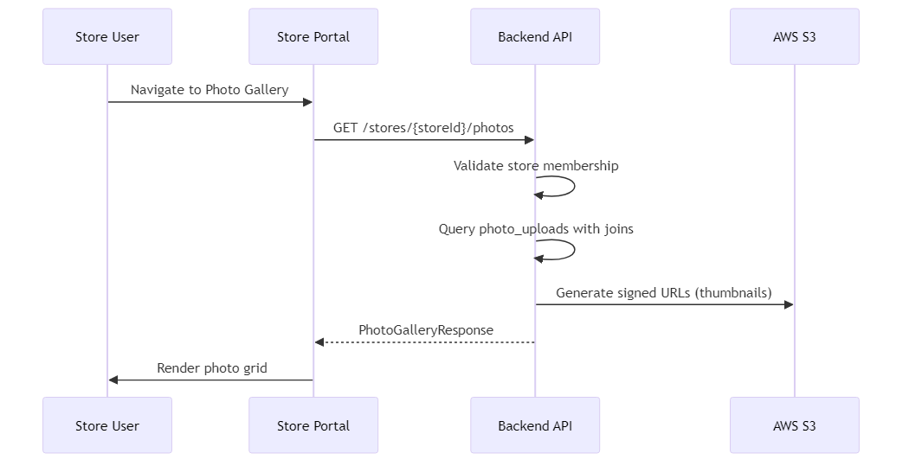

### 6.2 Lightbox Data Flow


### 6.3 Integration Dependencies

| System | Integration | Purpose |
|--------|-------------|---------|
| AWS S3 | Signed URLs | Secure photo access |
| Photo Review Service | Status data | Review status and comments |
| Campaign Service | Campaign data | Campaign names and filters |

---

## 7. State Transitions

### 7.1 Photo Review Status States

[Diagram - See rendered image above or refer to source document]

### 7.2 Status Transition Rules

| From State | To State | Trigger | Actor |
|------------|----------|---------|-------|
| PENDING | APPROVED | Photo approved | Brand Admin, Campaign Manager, Regional Manager |
| PENDING | REJECTED | Photo rejected | Brand Admin, Campaign Manager, Regional Manager |
| REJECTED | SUPERSEDED | Retake photo uploaded | Store User |
| PENDING | SUPERSEDED | New photo replaces before review | Store User |

### 7.3 View State Management

| State | Persisted | Storage |
|-------|-----------|---------|
| View mode (Grid/List) | Yes | localStorage |
| Active filters | No | URL query params |
| Lightbox position | No | Component state |
| Scroll position | No | Component state |

---

## 8. Error Handling

### 8.1 Error Scenarios

| Error Code | Scenario | User Message | Recovery Action |
|------------|----------|--------------|-----------------|
| ERR-S003-001 | Photos API failure | "Unable to load photos. Please try again." | Retry button |
| ERR-S003-002 | Photo not found | "Photo no longer available." | Remove from view, refresh |
| ERR-S003-003 | Thumbnail load failure | Display placeholder | Auto-retry with fallback |
| ERR-S003-004 | Signed URL expired | "Photo link expired." | Auto-refresh URL |
| ERR-S003-005 | Download failure | "Download failed. Please try again." | Retry button |
| ERR-S003-006 | Bulk download timeout | "Download is taking longer than expected." | Background job with notification |
| ERR-S003-007 | Invalid filter combination | "No photos match your filters." | Clear filters option |

### 8.2 Loading States

| State | Display |
|-------|---------|
| Initial load | Skeleton grid with 24 placeholder cards |
| Filter change | Inline loading indicator |
| Load more | Loading spinner below grid |
| Lightbox loading | Blur backdrop with spinner |
| Download processing | Progress indicator with cancel option |

### 8.3 Empty States

| Condition | Message | Action |
|-----------|---------|--------|
| No photos for store | "No photos have been submitted yet." | Link to active campaigns |
| No photos match filters | "No photos match your current filters." | Clear filters button |
| All photos superseded | "All photos have been replaced." | Show superseded toggle |

---

## 9. Accessibility Requirements

### 9.1 WCAG 2.1 AA Compliance

| Requirement ID | Requirement | Implementation |
|----------------|-------------|----------------|
| REQ-S003-A11Y-001 | Keyboard navigation | Full grid navigation with arrow keys |
| REQ-S003-A11Y-002 | Focus management | Visible focus indicators on all interactive elements |
| REQ-S003-A11Y-003 | Screen reader support | Alt text on all images, ARIA labels on controls |
| REQ-S003-A11Y-004 | Lightbox keyboard control | Escape to close, arrows to navigate |
| REQ-S003-A11Y-005 | Status announcements | Live region for filter result counts |
| REQ-S003-A11Y-006 | Color independence | Status indicated by icon and text, not color alone |

### 9.2 Keyboard Shortcuts

| Key | Action | Context |
|-----|--------|---------|
| `Tab` | Move focus between elements | Page |
| `Enter` | Open photo lightbox | Photo card focus |
| `Escape` | Close lightbox | Lightbox open |
| `←` / `→` | Navigate photos | Lightbox open |
| `D` | Download current photo | Lightbox open |

### 9.3 Screen Reader Announcements

| Trigger | Announcement |
|---------|--------------|
| Gallery load | "Photo gallery loaded. {count} photos. {approved} approved, {pending} pending review." |
| Filter applied | "Showing {count} photos matching filters." |
| Lightbox open | "Photo viewer. {item_name} from {campaign_name}. Status: {status}. Use arrow keys to navigate." |
| Photo navigation | "Photo {current} of {total}. {item_name}. Status: {status}." |

---

## 10. Acceptance Criteria

### 10.1 Functional Requirements

| ID | Requirement | Priority | Verification |
|----|-------------|----------|--------------|
| REQ-S003-FR-001 | Gallery displays all photos for authenticated user's store | Must | Test |
| REQ-S003-FR-002 | Grid view shows photo thumbnails with status overlay | Must | Test |
| REQ-S003-FR-003 | List view displays tabular photo data | Must | Test |
| REQ-S003-FR-004 | Campaign filter narrows results to selected campaign | Must | Test |
| REQ-S003-FR-005 | Status filter shows only photos with selected status | Must | Test |
| REQ-S003-FR-006 | Date filter limits results to date range | Must | Test |
| REQ-S003-FR-007 | Clicking photo opens lightbox with full-size image | Must | Test |
| REQ-S003-FR-008 | Lightbox displays complete photo metadata | Must | Test |
| REQ-S003-FR-009 | Rejected photos show rejection reason and admin comment | Must | Test |
| REQ-S003-FR-010 | Superseded photos link to replacement photo | Must | Test |
| REQ-S003-FR-011 | Download button exports individual photo | Should | Test |
| REQ-S003-FR-012 | Bulk download exports selected photos as ZIP | Should | Test |
| REQ-S003-FR-013 | Lightbox navigation with arrow keys and buttons | Must | Test |
| REQ-S003-FR-014 | Infinite scroll or load more pagination | Should | Test |

### 10.2 Non-Functional Requirements

| ID | Requirement | Target | Verification |
|----|-------------|--------|--------------|
| REQ-S003-NFR-001 | Gallery initial load < 2 seconds | P95 | Performance test |
| REQ-S003-NFR-002 | Thumbnail load < 500ms per image | P95 | Performance test |
| REQ-S003-NFR-003 | Full-size image load < 3 seconds | P95 | Performance test |
| REQ-S003-NFR-004 | Filter response < 1 second | P95 | Performance test |
| REQ-S003-NFR-005 | Support galleries with 500+ photos | Required | Load test |
| REQ-S003-NFR-006 | Mobile responsive layout | Required | Visual test |

### 10.3 Security Requirements

| ID | Requirement | Verification |
|----|-------------|--------------|
| REQ-S003-SEC-001 | Only authenticated store members can view gallery | Penetration test |
| REQ-S003-SEC-002 | Cross-store photo access prevented | Security test |
| REQ-S003-SEC-003 | S3 signed URLs expire after 1 hour | Configuration test |
| REQ-S003-SEC-004 | Download requests logged in audit trail | Audit test |

---

## 11. Traceability Matrix

| Requirement | Source | SUPP Reference | Test Case |
|-------------|--------|----------------|-----------|
| REQ-S003-FR-001 | S03 Screen Spec | SUPP-018 | TC-S003-001 |
| REQ-S003-FR-002 | S03 Screen Spec | SUPP-018 | TC-S003-002 |
| REQ-S003-FR-007 | S03 Screen Spec | SUPP-018 | TC-S003-007 |
| REQ-S003-FR-009 | S03 Screen Spec | SUPP-018 | TC-S003-009 |
| REQ-S003-SEC-001 | Permission Matrix | SUPP-003 | TC-S003-SEC-001 |

---

## 12. Related Screens

| Screen | Relationship | Navigation |
|--------|--------------|------------|
| [S001 Dashboard](S001_Dashboard.md) | Parent | Back link |
| [S002 Campaign History](S002_Campaign_History.md) | Sibling | Campaign filter |
| [M05 Photo Capture](../../../10_Module_MobileApp/screens/M005_Photo_Capture.md) | Input | Photo upload source |
| [B07 Verification](../../../08_Module_BrandPortal/screens/B007_Verification.md) | Related | Brand review photos |

---

*Document Status: Complete*
*IEEE 830 Compliance: Section 3.2 - Specific Requirements / Functional Requirements*


---
# S004 Team Management - Screen Specification

> **SRS Section**: 5.9.4 | **Module**: Store Portal | **Version**: 1.0
> **IEEE 830 Reference**: Section 3.2 - Functional Requirements
> **Source Documents**:
> - [S04 Team Management Screen Spec](../../../../06_Screen_Specs/S04_Team_Management.md)
> - [SUPP-001 Personas](../../../../02_SUPPs/Shared_Foundations/SUPP-001_Personas.md)
> - [SUPP-003 RBAC](../../../../02_SUPPs/Shared_Foundations/SUPP-003_RBAC.md)
> **Last Updated**: 2026-01-01

---

## 1. Screen Overview

### 1.1 Purpose

The Team Management screen enables Store Managers to administer their store's team members, including inviting new users, managing roles, tracking activity metrics, and removing access. This screen is restricted to Store Manager role only.

### 1.2 Route Configuration

| Attribute | Value |
|-----------|-------|
| **Route Path** | `/store/team` |
| **Route Type** | Protected (Authentication Required) |
| **Role Restriction** | STORE_MANAGER only |
| **Lazy Loading** | Yes |
| **Mobile Support** | Full Responsive |

### 1.3 Screen Context

| Attribute | Description |
|-----------|-------------|
| **Primary Purpose** | Manage store team membership and permissions |
| **Entry Points** | Store Dashboard navigation, Dashboard team widget |
| **Exit Points** | Dashboard, Reports |
| **Session Scope** | Store context from authenticated membership |

### 1.4 Screenshot Reference

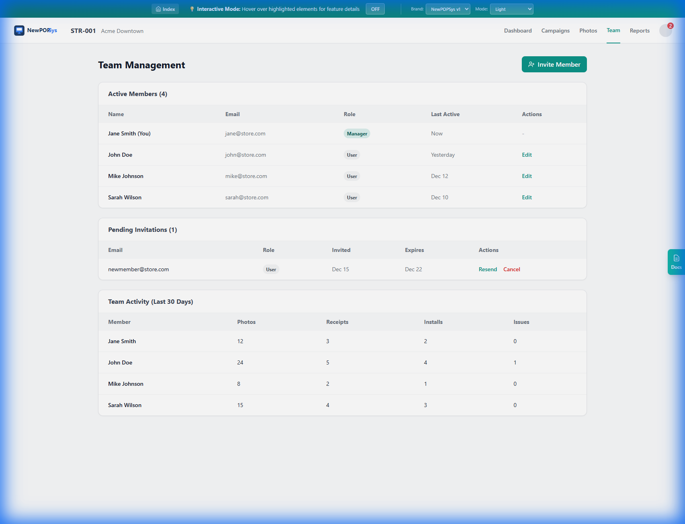

---

## 2. User Roles & Permissions

### 2.1 Authorized Roles

| Role | Access Level | Restrictions |
|------|--------------|--------------|
| STORE_MANAGER (P07) | Full Access | Own store team only |
| STORE_OPERATOR (P08) | No Access | Screen not visible |

### 2.2 Permission Requirements

| Permission | STORE_MANAGER | STORE_OPERATOR |
|------------|:-------------:|:--------------:|
| View team list | Y | N |
| Invite team members | Y | N |
| Edit member role | Y | N |
| Deactivate members | Y | N |
| Remove members | Y | N |
| View activity metrics | Y | N |
| Resend invitations | Y | N |
| Cancel invitations | Y | N |

### 2.3 Data Scoping Rules

| Rule ID | Description |
|---------|-------------|
| REQ-S004-SEC-001 | Team members filtered to authenticated user's store via memberships.store_id |
| REQ-S004-SEC-002 | Store Manager role validated before screen access |
| REQ-S004-SEC-003 | Cross-store membership modification prevented at API layer |
| REQ-S004-SEC-004 | Self-removal prevented to maintain store manager continuity |

---

## 3. UI Components

### 3.1 Component Hierarchy

- **TeamManagementPage**
    - **PageHeader**
        - TitleSection ("Team Management")
        - InviteMemberButton
    - **ActiveMembersSection**
        - SectionHeader ("Active Members ({count})")
        - **MemberTable**
            - MemberRow[] (repeating)
                - AvatarWithName
                - EmailAddress
                - RoleBadge
                - StatusBadge
                - LastActiveDate
                - ActionMenu
    - **PendingInvitationsSection**
        - SectionHeader ("Pending Invitations ({count})")
        - **InvitationTable**
            - InvitationRow[] (repeating)
                - EmailAddress
                - RoleBadge
                - InvitedDate
                - ExpiresDate
                - ActionButtons (Resend, Cancel)
    - **ActivitySummarySection**
        - SectionHeader ("Team Activity (Last 30 Days)")
        - **ActivityTable**
            - ActivityRow[] (repeating)
    - **InviteMemberModal**
        - EmailInput
        - RoleSelector
        - PersonalMessageInput
        - ActionButtons (Cancel, Send Invitation)
    - **EditMemberModal**
        - MemberInfo
        - RoleDropdown
        - StatusToggle
        - ActivitySummary
        - RemoveButton
        - ActionButtons (Cancel, Save)

### 3.2 Component Specifications

| Component | Type | Description | Requirements |
|-----------|------|-------------|--------------|
| PageHeader | Container | Title and invite button | REQ-S004-UI-001 |
| MemberTable | Data Table | Active team members | REQ-S004-UI-002 |
| InvitationTable | Data Table | Pending invitations | REQ-S004-UI-003 |
| ActivityTable | Data Table | 30-day activity metrics | REQ-S004-UI-004 |
| InviteMemberModal | Modal Dialog | New member invitation form | REQ-S004-UI-005 |
| EditMemberModal | Modal Dialog | Member role/status editor | REQ-S004-UI-006 |
| RoleBadge | Badge | Manager/User role indicator | REQ-S004-UI-007 |
| StatusBadge | Badge | Active/Invited/Inactive status | REQ-S004-UI-008 |

### 3.3 Role Badge Specifications

| Role | Label | Color |
|------|-------|-------|
| STORE_MANAGER | "Manager" | `blue-100` / `blue-800` |
| STORE_OPERATOR | "User" | `gray-100` / `gray-700` |

### 3.4 Status Badge Specifications

| Status | Label | Color | Description |
|--------|-------|-------|-------------|
| Active | "Active" | `green-100` / `green-800` | Registered and active |
| Invited | "Invited" | `amber-100` / `amber-800` | Pending registration |
| Inactive | "Inactive" | `gray-100` / `gray-600` | Deactivated by manager |

---

## 4. Data Requirements

### 4.1 API Endpoints

| Endpoint | Method | Purpose | Authorization |
|----------|--------|---------|---------------|
| `/stores/{storeId}/members` | GET | List team members | STORE_MANAGER |
| `/stores/{storeId}/invitations` | GET | List pending invitations | STORE_MANAGER |
| `/stores/{storeId}/invitations` | POST | Create invitation | STORE_MANAGER |
| `/stores/{storeId}/invitations/{id}/resend` | POST | Resend invitation email | STORE_MANAGER |
| `/stores/{storeId}/invitations/{id}` | DELETE | Cancel invitation | STORE_MANAGER |
| `/memberships/{id}` | PATCH | Update member role/status | STORE_MANAGER |
| `/memberships/{id}` | DELETE | Remove member from store | STORE_MANAGER |
| `/stores/{storeId}/activity` | GET | Team activity summary | STORE_MANAGER |

### 4.2 Request/Response Schemas

**GET /stores/{storeId}/members Response**

```typescript
interface TeamMembersResponse {
  members: TeamMemberDTO[];
  meta: {
    total: number;
    managerCount: number;
    operatorCount: number;
  };
}

interface TeamMemberDTO {
  id: string;                    // Membership ID
  user_id: string;               // User ID
  name: string;                  // User full name
  email: string;                 // User email
  phone?: string;                // User phone
  avatar_url?: string;           // Profile picture URL
  role: 'STORE_MANAGER' | 'STORE_OPERATOR';
  status: 'active' | 'inactive';
  joined_at: string;             // ISO 8601
  last_active_at?: string;       // ISO 8601
  photo_count: number;           // Total photos uploaded
  is_current_user: boolean;      // Flag for self
}
```

**GET /stores/{storeId}/invitations Response**

```typescript
interface InvitationsResponse {
  invitations: InvitationDTO[];
}

interface InvitationDTO {
  id: string;                    // Invitation ID
  email: string;                 // Invited email
  role: 'STORE_MANAGER' | 'STORE_OPERATOR';
  invited_at: string;            // ISO 8601
  expires_at: string;            // ISO 8601
  invited_by: string;            // Inviter user name
  status: 'pending' | 'expired';
}
```

**POST /stores/{storeId}/invitations Request**

```typescript
interface CreateInvitationRequest {
  email: string;                 // Required
  role: 'STORE_MANAGER' | 'STORE_OPERATOR';  // Required
  message?: string;              // Optional personal message
}
```

**GET /stores/{storeId}/activity Response**

```typescript
interface TeamActivityResponse {
  activity: TeamMemberActivityDTO[];
  period: {
    from: string;               // ISO 8601
    to: string;                 // ISO 8601
    days: number;               // Default 30
  };
}

interface TeamMemberActivityDTO {
  user_id: string;
  user_name: string;
  photos: number;               // Photos uploaded
  receipts: number;             // Receipt surveys completed
  installs: number;             // Install surveys completed
  issues: number;               // Issues reported
}
```

### 4.3 Database Query - Team Members

```sql
SELECT
  m.id as membership_id,
  u.id as user_id,
  u.name,
  u.email,
  u.phone,
  u.avatar_url,
  m.role,
  CASE WHEN u.is_active THEN 'active' ELSE 'inactive' END as status,
  m.created_at as joined_at,
  u.last_active_at,
  COUNT(pu.id) as photo_count
FROM memberships m
JOIN users u ON m.user_id = u.id
LEFT JOIN photo_uploads pu ON pu.uploaded_by = u.id
WHERE m.store_id = :storeId
  AND m.deleted_at IS NULL
  AND u.deleted_at IS NULL
GROUP BY m.id, u.id
ORDER BY
  CASE m.role WHEN 'STORE_MANAGER' THEN 0 ELSE 1 END,
  u.name
```

### 4.4 Database Query - Team Activity

```sql
WITH activity_period AS (
  SELECT
    CURRENT_DATE - INTERVAL '30 days' as start_date,
    CURRENT_DATE as end_date
)
SELECT
  u.id as user_id,
  u.name as user_name,
  COUNT(DISTINCT pu.id) as photos,
  COUNT(DISTINCT CASE WHEN ssr.survey_type = 'receipt' THEN ssr.id END) as receipts,
  COUNT(DISTINCT CASE WHEN ssr.survey_type = 'install' THEN ssr.id END) as installs,
  COUNT(DISTINCT ir.id) as issues
FROM memberships m
JOIN users u ON m.user_id = u.id
CROSS JOIN activity_period ap
LEFT JOIN photo_uploads pu ON pu.uploaded_by = u.id
  AND pu.created_at BETWEEN ap.start_date AND ap.end_date
LEFT JOIN store_survey_responses ssr ON ssr.submitted_by = u.id
  AND ssr.submitted_at BETWEEN ap.start_date AND ap.end_date
LEFT JOIN issue_requests ir ON ir.reported_by = u.id
  AND ir.created_at BETWEEN ap.start_date AND ap.end_date
WHERE m.store_id = :storeId
  AND m.deleted_at IS NULL
GROUP BY u.id, u.name
ORDER BY u.name
```

---

## 5. Business Rules & Validation

### 5.1 Invitation Rules

| Rule ID | Rule Description |
|---------|------------------|
| REQ-S004-BR-001 | Email must be valid format and not already a member of this store |
| REQ-S004-BR-002 | Email must not have pending invitation for this store |
| REQ-S004-BR-003 | Invitations expire after 7 days |
| REQ-S004-BR-004 | Maximum 5 pending invitations per store at a time |
| REQ-S004-BR-005 | Resend resets expiration date to 7 days from now |
| REQ-S004-BR-006 | Personal message limited to 500 characters |

### 5.2 Role Management Rules

| Rule ID | Rule Description |
|---------|------------------|
| REQ-S004-BR-007 | Store must always have at least one active STORE_MANAGER |
| REQ-S004-BR-008 | Cannot demote last active manager to STORE_OPERATOR |
| REQ-S004-BR-009 | Cannot deactivate or remove last active manager |
| REQ-S004-BR-010 | Cannot remove self (current user) from store |
| REQ-S004-BR-011 | Role changes take effect immediately |

### 5.3 Status Management Rules

| Rule ID | Rule Description |
|---------|------------------|
| REQ-S004-BR-012 | Deactivating user revokes API access immediately |
| REQ-S004-BR-013 | Deactivated users retain data but cannot log in |
| REQ-S004-BR-014 | Reactivation restores all previous permissions |
| REQ-S004-BR-015 | Removed users are soft-deleted from membership |

### 5.4 Activity Calculation Rules

| Rule ID | Rule Description |
|---------|------------------|
| REQ-S004-BR-016 | Activity period is rolling 30 days from current date |
| REQ-S004-BR-017 | Photo count includes all statuses (pending, approved, rejected) |
| REQ-S004-BR-018 | Survey counts based on submitted_at timestamp |
| REQ-S004-BR-019 | Issue count includes all issue statuses |

---

## 6. API Integration Points

### 6.1 Load Team Data Flow

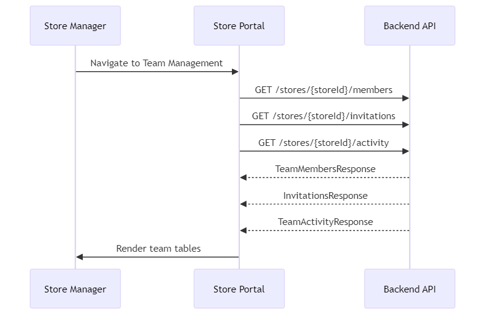

### 6.2 Invite Member Flow


### 6.3 Edit Member Flow

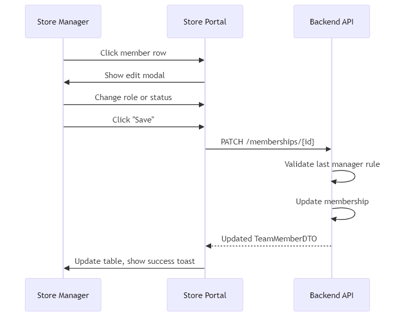

### 6.4 Remove Member Flow

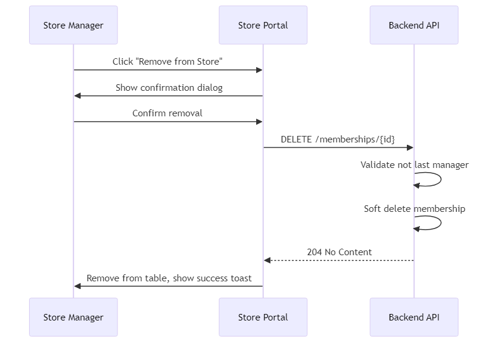

### 6.5 Integration Dependencies

| System | Integration | Purpose |
|--------|-------------|---------|
| Email Service | SMTP/SendGrid | Invitation delivery |
| Auth Service | JWT Validation | Permission verification |
| Audit Service | Event logging | Track team changes |

---

## 7. State Transitions

### 7.1 Invitation Status States

[Diagram - See rendered image above or refer to source document]

### 7.2 Member Status States

[Diagram - See rendered image above or refer to source document]

### 7.3 State Transition Actions

| From | To | Action | Actor |
|------|-----|--------|-------|
| - | PENDING | Create invitation | Store Manager |
| PENDING | ACCEPTED | User accepts invite | Invited User |
| PENDING | EXPIRED | Time passes 7 days | System |
| PENDING | CANCELLED | Cancel invitation | Store Manager |
| ACTIVE | INACTIVE | Deactivate member | Store Manager |
| INACTIVE | ACTIVE | Reactivate member | Store Manager |
| ACTIVE/INACTIVE | REMOVED | Remove member | Store Manager |

---

## 8. Error Handling

### 8.1 Error Scenarios

| Error Code | Scenario | User Message | Recovery Action |
|------------|----------|--------------|-----------------|
| ERR-S004-001 | Team API failure | "Unable to load team members. Please try again." | Retry button |
| ERR-S004-002 | Email already member | "This email is already a member of your store." | Clear email field |
| ERR-S004-003 | Email has pending invite | "An invitation has already been sent to this email." | Offer resend |
| ERR-S004-004 | Invalid email format | "Please enter a valid email address." | Inline validation |
| ERR-S004-005 | Last manager removal | "Cannot remove the last manager. Promote another member first." | Dismiss dialog |
| ERR-S004-006 | Self-removal attempt | "You cannot remove yourself from the store." | Dismiss dialog |
| ERR-S004-007 | Invitation send failed | "Unable to send invitation. Please try again." | Retry button |
| ERR-S004-008 | Invitation limit reached | "Maximum pending invitations reached. Cancel existing invites first." | Show pending list |
| ERR-S004-009 | Role update failed | "Unable to update role. Please try again." | Retry button |
| ERR-S004-010 | Member not found | "Team member no longer exists." | Refresh table |

### 8.2 Validation Messages

| Field | Validation | Message |
|-------|------------|---------|
| Email | Required | "Email address is required" |
| Email | Format | "Please enter a valid email address" |
| Email | Duplicate | "This email is already on your team" |
| Role | Required | "Please select a role" |
| Message | Max length | "Message cannot exceed 500 characters" |

### 8.3 Loading States

| State | Display |
|-------|---------|
| Initial load | Skeleton table with 5 rows |
| Invite submitting | "Sending invitation..." with spinner |
| Role updating | Inline spinner on affected row |
| Member removing | Confirmation dialog with spinner |

### 8.4 Empty States

| Condition | Message | Action |
|-----------|---------|--------|
| No team members (impossible) | N/A | Current user always shown |
| No pending invitations | "No pending invitations" | Invite button |
| No activity in 30 days | "No activity recorded in the last 30 days" | None |

---

## 9. Accessibility Requirements

### 9.1 WCAG 2.1 AA Compliance

| Requirement ID | Requirement | Implementation |
|----------------|-------------|----------------|
| REQ-S004-A11Y-001 | Keyboard navigation | Full table navigation with Tab/Arrow keys |
| REQ-S004-A11Y-002 | Focus management | Modal focus trap, return focus on close |
| REQ-S004-A11Y-003 | Screen reader support | ARIA labels, role announcements |
| REQ-S004-A11Y-004 | Form accessibility | Associated labels, error announcements |
| REQ-S004-A11Y-005 | Confirmation dialogs | Focus on primary action, Escape to close |
| REQ-S004-A11Y-006 | Status announcements | Live region for success/error toasts |

### 9.2 Keyboard Shortcuts

| Key | Action | Context |
|-----|--------|---------|
| `Tab` | Move focus between elements | Page |
| `Enter` | Open edit modal | Table row focus |
| `Escape` | Close modal | Modal open |
| `Delete` | Open remove confirmation | Table row focus |

### 9.3 Screen Reader Announcements

| Trigger | Announcement |
|---------|--------------|
| Page load | "Team Management. {count} active members, {count} pending invitations." |
| Invite success | "Invitation sent to {email}." |
| Role updated | "{name} role changed to {role}." |
| Member removed | "{name} has been removed from the team." |
| Error | Error message content |

---

## 10. Acceptance Criteria

### 10.1 Functional Requirements

| ID | Requirement | Priority | Verification |
|----|-------------|----------|--------------|
| REQ-S004-FR-001 | Screen restricted to STORE_MANAGER role | Must | Test |
| REQ-S004-FR-002 | Team list displays all active members with roles | Must | Test |
| REQ-S004-FR-003 | Pending invitations displayed in separate section | Must | Test |
| REQ-S004-FR-004 | Invite modal captures email and role selection | Must | Test |
| REQ-S004-FR-005 | Invitation email sent upon invite creation | Must | Test |
| REQ-S004-FR-006 | Manager can change member role | Must | Test |
| REQ-S004-FR-007 | Manager can deactivate member | Must | Test |
| REQ-S004-FR-008 | Manager can remove member from store | Must | Test |
| REQ-S004-FR-009 | Cannot remove last active manager | Must | Test |
| REQ-S004-FR-010 | Cannot remove self from store | Must | Test |
| REQ-S004-FR-011 | Activity summary shows 30-day metrics | Should | Test |
| REQ-S004-FR-012 | Resend option for pending invitations | Should | Test |
| REQ-S004-FR-013 | Cancel option for pending invitations | Should | Test |
| REQ-S004-FR-014 | Last active date shown for each member | Should | Test |

### 10.2 Non-Functional Requirements

| ID | Requirement | Target | Verification |
|----|-------------|--------|--------------|
| REQ-S004-NFR-001 | Page load < 2 seconds | P95 | Performance test |
| REQ-S004-NFR-002 | Invite creation < 3 seconds | P95 | Performance test |
| REQ-S004-NFR-003 | Role update < 1 second | P95 | Performance test |
| REQ-S004-NFR-004 | Support teams up to 50 members | Required | Load test |
| REQ-S004-NFR-005 | Email delivery within 5 minutes | P95 | Integration test |

### 10.3 Security Requirements

| ID | Requirement | Verification |
|----|-------------|--------------|
| REQ-S004-SEC-001 | Only STORE_MANAGER can access screen | Authorization test |
| REQ-S004-SEC-002 | Cross-store member manipulation prevented | Security test |
| REQ-S004-SEC-003 | All team changes logged to audit trail | Audit test |
| REQ-S004-SEC-004 | Email invitation tokens expire after 7 days | Configuration test |
| REQ-S004-SEC-005 | Invitation tokens are single-use | Security test |

---

## 11. Traceability Matrix

| Requirement | Source | SUPP Reference | Test Case |
|-------------|--------|----------------|-----------|
| REQ-S004-FR-001 | S04 Screen Spec | SUPP-003 | TC-S004-001 |
| REQ-S004-FR-002 | S04 Screen Spec | SUPP-001 | TC-S004-002 |
| REQ-S004-FR-005 | S04 Screen Spec | SUPP-003 | TC-S004-005 |
| REQ-S004-FR-009 | S04 Screen Spec | SUPP-003 | TC-S004-009 |
| REQ-S004-SEC-001 | Permission Matrix | SUPP-003 | TC-S004-SEC-001 |

---

## 12. Related Screens

| Screen | Relationship | Navigation |
|--------|--------------|------------|
| [S001 Dashboard](S001_Dashboard.md) | Parent | Team widget shows summary |
| [S005 Reports](S005_Reports.md) | Sibling | Detailed team analytics |
| [M07 Profile](../../../10_Module_MobileApp/screens/M007_Profile.md) | Related | User self-service |

---

*Document Status: Complete*
*IEEE 830 Compliance: Section 3.2 - Specific Requirements / Functional Requirements*


---
# S005 Store Reports - Screen Specification

> **SRS Section**: 5.9.5 | **Version**: 1.0 | **Status**: Draft
> **Module**: Store Portal
> **Route**: `/store/reports`
> **Source**: [S05_Reports.md](../../../../06_Screen_Specs/S05_Reports.md)
> **Last Updated**: 2026-01-01

---

## 1. Screen Overview

### 1.1 Purpose

The Store Reports screen provides Store Managers with comprehensive analytics and performance insights for their store's campaign execution, photo compliance, team performance, and issue resolution. This read-only analytics interface aggregates data across multiple entities to deliver actionable metrics with trend analysis and benchmarking capabilities.

### 1.2 Scope

This specification defines the functional requirements, data requirements, and user interface components for the Store Reports screen within the Store Portal module of NewPOPSys v1.

### 1.3 Primary Functions

| Function | Description |
|----------|-------------|
| **View KPI Summary** | Display key performance indicators with trend indicators |
| **Analyze Campaigns** | Review campaign completion rates and timing metrics |
| **Review Photo Metrics** | Examine approval rates and rejection patterns |
| **Monitor Team Performance** | Track individual team member contributions |
| **Track Issues** | Analyze issue patterns and resolution times |
| **Export Reports** | Download report data in multiple formats |

### 1.4 Screenshot Reference


*Figure S005-1: Store Reports Dashboard - Analytics and performance metrics interface*

### 1.5 Screen Context


---

## 2. User Roles & Permissions

### 2.1 Authorized Roles

| Role | Access Level | Restrictions |
|------|--------------|--------------|
| **STORE_MANAGER** (P07) | Full Access | Own store data only |
| **STORE_OPERATOR** (P08) | No Access | Cannot access reports screen |
| **REGIONAL_MANAGER** (P06) | View Only | Via impersonation or region-scoped access |
| **BRAND_ADMIN** (P04) | View Only | Via impersonation |
| **PLATFORM_ADMIN** (P01) | Full Access | Via impersonation |

### 2.2 Permission Requirements

| Requirement ID | Permission | Description |
|----------------|------------|-------------|
| REQ-S005-SEC-001 | `reports:read` | View store reports and analytics |
| REQ-S005-SEC-002 | `reports:export` | Download report data in various formats |
| REQ-S005-SEC-003 | `store:read` | Access store-level aggregated metrics |

### 2.3 Access Control Rules

```
REQ-S005-SEC-004: Data Isolation
- Users SHALL only view reports for stores where membership.store_id matches
- All API calls SHALL include tenant_id and store_id scoping
- Report data SHALL NOT include cross-store comparisons without aggregation

REQ-S005-SEC-005: Role Enforcement
- Store Operators SHALL be denied access with HTTP 403
- Navigation item SHALL be hidden for unauthorized roles
- Direct URL access SHALL redirect to Dashboard with access denied message
```

---

## 3. UI Components

### 3.1 Component Hierarchy


### 3.2 Component Specifications

#### 3.2.1 Page Header

| Element | Specification |
|---------|---------------|
| Title | "Store Reports" - H1, left-aligned |
| Date Range Picker | Dropdown with preset options + custom range |
| Export Button | Primary action, right-aligned, opens format menu |

#### 3.2.2 Tab Navigation

| Requirement ID | Requirement |
|----------------|-------------|
| REQ-S005-UI-001 | Tab bar SHALL display 5 tabs: Overview, Campaigns, Photos, Team, Issues |
| REQ-S005-UI-002 | Active tab SHALL be visually distinguished with underline indicator |
| REQ-S005-UI-003 | Tab switching SHALL preserve selected date range |
| REQ-S005-UI-004 | URL SHALL update to reflect active tab (e.g., `/store/reports?tab=photos`) |

#### 3.2.3 KPI Cards

| Card | Metric | Threshold Colors |
|------|--------|-----------------|
| Compliance Rate | completed / total campaigns x 100 | Green >= 90%, Yellow >= 75%, Red < 75% |
| On-Time Rate | on_time / completed x 100 | Green >= 85%, Yellow >= 70%, Red < 70% |
| Photo Approval | approved / total photos x 100 | Green >= 95%, Yellow >= 85%, Red < 85% |
| Avg Completion Time | avg(completed_at - start_date) | Lower is better (days) |

| Requirement ID | Requirement |
|----------------|-------------|
| REQ-S005-UI-005 | KPI cards SHALL display current value and trend indicator (arrow up/down) |
| REQ-S005-UI-006 | Trend SHALL compare to previous period of same duration |
| REQ-S005-UI-007 | Cards SHALL use color coding based on threshold values |
| REQ-S005-UI-008 | Hover state SHALL show exact values and period comparison |

#### 3.2.4 Charts

| Chart Type | Tab | Data Displayed |
|------------|-----|----------------|
| Line Chart | Overview | Campaign performance trend over time |
| Pie Chart | Overview, Photos | Rejection reasons breakdown |
| Bar Chart | Overview, Team | Team contribution percentages |
| Stacked Bar | Campaigns | On-time vs late completion by month |

| Requirement ID | Requirement |
|----------------|-------------|
| REQ-S005-UI-009 | Charts SHALL be responsive and scale to container width |
| REQ-S005-UI-010 | Charts SHALL display tooltips with exact values on hover |
| REQ-S005-UI-011 | Charts SHALL include legends when multiple series displayed |
| REQ-S005-UI-012 | Empty charts SHALL display "No data for selected period" message |

#### 3.2.5 Data Tables

| Requirement ID | Requirement |
|----------------|-------------|
| REQ-S005-UI-013 | Tables SHALL be sortable by clicking column headers |
| REQ-S005-UI-014 | Tables SHALL display pagination for > 10 rows |
| REQ-S005-UI-015 | Tables SHALL support column-specific formatting (%, dates, status badges) |
| REQ-S005-UI-016 | Row click SHALL navigate to related detail screen where applicable |

### 3.3 Reports Layout

### 3.3 Reports Layout


---

## 4. Data Requirements

### 4.1 Data Model References

| Entity | Source Table | Purpose |
|--------|--------------|---------|
| Store Assignment | `store_assignments` | Campaign completion metrics |
| Campaign | `campaigns` | Campaign details, dates |
| Photo Upload | `photo_uploads` | Photo count, approval rates |
| Photo Review | `photo_reviews` | Rejection reasons |
| Issue Request | `issue_requests` | Issue counts, resolution |
| User | `users` | Team member identification |
| Membership | `memberships` | Team member association |

### 4.2 Database Queries

#### 4.2.1 Compliance Metrics Query

```sql
SELECT
    COUNT(*) as total_campaigns,
    COUNT(CASE WHEN sa.status = 'COMPLETE' THEN 1 END) as completed,
    COUNT(CASE WHEN sa.status = 'COMPLETE'
          AND sa.completed_at <= c.install_end_date THEN 1 END) as on_time,
    AVG(EXTRACT(EPOCH FROM (sa.completed_at - c.install_start_date)) / 86400)
        as avg_duration_days
FROM store_assignments sa
JOIN campaigns c ON sa.campaign_id = c.id
WHERE sa.store_id = :storeId
  AND sa.deleted_at IS NULL
  AND c.deleted_at IS NULL
  AND sa.created_at >= :startDate
  AND sa.created_at <= :endDate;
```

#### 4.2.2 Photo Metrics Query

```sql
SELECT
    COUNT(pu.id) as total_photos,
    COUNT(CASE WHEN pu.review_status = 'APPROVED' THEN 1 END) as approved,
    COUNT(CASE WHEN pu.review_status = 'REJECTED' THEN 1 END) as rejected,
    COUNT(CASE WHEN pu.review_status = 'PENDING' THEN 1 END) as pending
FROM photo_uploads pu
JOIN assignment_items ai ON pu.assignment_item_id = ai.id
JOIN store_assignments sa ON ai.store_assignment_id = sa.id
WHERE sa.store_id = :storeId
  AND pu.deleted_at IS NULL
  AND pu.created_at >= :startDate
  AND pu.created_at <= :endDate;
```

#### 4.2.3 Rejection Reasons Query

```sql
SELECT
    pr.reason_code,
    COUNT(*) as count
FROM photo_reviews pr
JOIN photo_uploads pu ON pr.photo_upload_id = pu.id
JOIN assignment_items ai ON pu.assignment_item_id = ai.id
JOIN store_assignments sa ON ai.store_assignment_id = sa.id
WHERE sa.store_id = :storeId
  AND pr.decision = 'REJECTED'
  AND pr.deleted_at IS NULL
  AND pr.created_at >= :startDate
  AND pr.created_at <= :endDate
GROUP BY pr.reason_code
ORDER BY count DESC;
```

#### 4.2.4 Team Contribution Query

```sql
SELECT
    u.id as user_id,
    u.first_name || ' ' || LEFT(u.last_name, 1) || '.' as display_name,
    COUNT(DISTINCT pu.id) as photos_uploaded,
    COUNT(DISTINCT CASE WHEN sa.status = 'COMPLETE' THEN sa.id END) as completions
FROM users u
JOIN memberships m ON u.id = m.user_id
LEFT JOIN photo_uploads pu ON pu.uploaded_by = u.id
LEFT JOIN assignment_items ai ON pu.assignment_item_id = ai.id
LEFT JOIN store_assignments sa ON ai.store_assignment_id = sa.id
WHERE m.store_id = :storeId
  AND m.deleted_at IS NULL
  AND u.is_active = true
  AND (pu.created_at >= :startDate OR pu.created_at IS NULL)
  AND (pu.created_at <= :endDate OR pu.created_at IS NULL)
GROUP BY u.id, u.first_name, u.last_name
ORDER BY photos_uploaded DESC;
```

#### 4.2.5 Issues Summary Query

```sql
SELECT
    ir.issue_type,
    ir.status,
    COUNT(*) as count,
    AVG(EXTRACT(EPOCH FROM (ir.resolved_at - ir.created_at)) / 3600)
        as avg_resolution_hours
FROM issue_requests ir
JOIN store_assignments sa ON ir.store_assignment_id = sa.id
WHERE sa.store_id = :storeId
  AND ir.deleted_at IS NULL
  AND ir.created_at >= :startDate
  AND ir.created_at <= :endDate
GROUP BY ir.issue_type, ir.status
ORDER BY count DESC;
```

### 4.3 API Response Interfaces

```typescript
interface StoreReportsResponse {
    storeId: string;
    dateRange: {
        start: string;  // ISO date
        end: string;    // ISO date
        label: string;  // "Last 90 Days"
    };
    kpis: KPIMetrics;
    campaignMetrics: CampaignMetrics;
    photoMetrics: PhotoMetrics;
    teamMetrics: TeamMemberMetrics[];
    issueMetrics: IssueMetrics;
    trends: TrendData[];
}

interface KPIMetrics {
    complianceRate: {
        value: number;       // Percentage (0-100)
        trend: number;       // Change from previous period
        status: 'green' | 'yellow' | 'red';
    };
    onTimeRate: {
        value: number;
        trend: number;
        status: 'green' | 'yellow' | 'red';
    };
    photoApprovalRate: {
        value: number;
        trend: number;
        status: 'green' | 'yellow' | 'red';
    };
    avgCompletionDays: {
        value: number;       // Days
        trend: number;
        status: 'green' | 'yellow' | 'red';
    };
}

interface CampaignMetrics {
    total: number;
    completed: number;
    onTime: number;
    late: number;
    inProgress: number;
    campaigns: CampaignDetail[];
}

interface CampaignDetail {
    campaignId: string;
    campaignName: string;
    status: string;
    completedAt: string | null;
    onTime: boolean | null;
    photoCount: number;
    issueCount: number;
}

interface PhotoMetrics {
    total: number;
    approved: number;
    rejected: number;
    pending: number;
    approvalRate: number;
    rejectionReasons: RejectionReason[];
}

interface RejectionReason {
    code: string;
    label: string;
    count: number;
    percentage: number;
}

interface TeamMemberMetrics {
    userId: string;
    displayName: string;
    photosUploaded: number;
    completions: number;
    contributionPercentage: number;
}

interface IssueMetrics {
    total: number;
    open: number;
    resolved: number;
    avgResolutionHours: number;
    byType: IssueTypeBreakdown[];
}

interface IssueTypeBreakdown {
    type: string;
    count: number;
    percentage: number;
}

interface TrendData {
    period: string;         // "2025-12", "2025-W52"
    complianceRate: number;
    onTimeRate: number;
    photoApprovalRate: number;
}
```

### 4.4 Data Freshness

| Requirement ID | Requirement |
|----------------|-------------|
| REQ-S005-DATA-001 | Report data SHALL be aggregated in real-time (not cached) |
| REQ-S005-DATA-002 | Date range filter SHALL apply to all metrics on screen |
| REQ-S005-DATA-003 | Trend calculations SHALL compare equal-length periods |
| REQ-S005-DATA-004 | Empty periods SHALL display zero values, not null |

---

## 5. Business Rules & Validation

### 5.1 Date Range Rules

| Requirement ID | Rule |
|----------------|------|
| REQ-S005-BR-001 | Default date range SHALL be "Last 90 Days" |
| REQ-S005-BR-002 | Maximum date range SHALL be 365 days |
| REQ-S005-BR-003 | End date SHALL NOT exceed current date |
| REQ-S005-BR-004 | Start date SHALL NOT be earlier than store creation date |
| REQ-S005-BR-005 | Custom date range SHALL validate start < end |

### 5.2 KPI Calculation Rules

| Requirement ID | Rule |
|----------------|------|
| REQ-S005-BR-006 | Compliance Rate = (completed campaigns / total assigned campaigns) x 100 |
| REQ-S005-BR-007 | On-Time Rate = (on-time completions / completed campaigns) x 100 |
| REQ-S005-BR-008 | Photo Approval Rate = (approved photos / total reviewed photos) x 100 |
| REQ-S005-BR-009 | Avg Completion Time = average of (completed_at - install_start_date) in days |
| REQ-S005-BR-010 | Trend SHALL be calculated as (current_period - previous_period) |

### 5.3 Threshold Rules

| KPI | Green | Yellow | Red |
|-----|-------|--------|-----|
| Compliance Rate | >= 90% | >= 75% and < 90% | < 75% |
| On-Time Rate | >= 85% | >= 70% and < 85% | < 70% |
| Photo Approval | >= 95% | >= 85% and < 95% | < 85% |
| Avg Completion | Contextual | Contextual | Contextual |

| Requirement ID | Rule |
|----------------|------|
| REQ-S005-BR-011 | KPI status colors SHALL be applied based on threshold table |
| REQ-S005-BR-012 | Avg Completion Time status SHALL compare to network average |

### 5.4 Data Scope Rules

| Requirement ID | Rule |
|----------------|------|
| REQ-S005-BR-013 | Reports SHALL only include store_assignments with status != 'CANCELLED' |
| REQ-S005-BR-014 | Photo counts SHALL exclude deleted photos (deleted_at IS NOT NULL) |
| REQ-S005-BR-015 | Team metrics SHALL only include active users (is_active = true) |
| REQ-S005-BR-016 | Issue counts SHALL include all statuses except 'DENIED' |

### 5.5 Comparison Rules

| Requirement ID | Rule |
|----------------|------|
| REQ-S005-BR-017 | Network average SHALL be calculated across all stores in same brand |
| REQ-S005-BR-018 | Region average SHALL be calculated across stores in same region |
| REQ-S005-BR-019 | Period-over-period SHALL compare equivalent duration periods |

---

## 6. API Integration Points

### 6.1 Endpoint Specifications

#### 6.1.1 Get Store Reports

```
GET /api/v1/stores/{storeId}/reports
```

**Query Parameters:**

| Parameter | Type | Required | Description |
|-----------|------|----------|-------------|
| `range` | string | No | Preset range: 7d, 30d, 90d, 365d (default: 90d) |
| `startDate` | string | No | Custom start date (ISO 8601) |
| `endDate` | string | No | Custom end date (ISO 8601) |
| `tab` | string | No | Report tab: overview, campaigns, photos, team, issues |

**Response:**

```json
{
    "data": {
        "storeId": "uuid",
        "dateRange": {
            "start": "2024-10-01",
            "end": "2024-12-31",
            "label": "Last 90 Days"
        },
        "kpis": {
            "complianceRate": { "value": 94, "trend": 3, "status": "green" },
            "onTimeRate": { "value": 88, "trend": 5, "status": "green" },
            "photoApprovalRate": { "value": 97, "trend": -1, "status": "green" },
            "avgCompletionDays": { "value": 4.2, "trend": -0.5, "status": "green" }
        },
        "campaignMetrics": { ... },
        "photoMetrics": { ... },
        "teamMetrics": [ ... ],
        "issueMetrics": { ... },
        "trends": [ ... ]
    },
    "meta": {
        "generatedAt": "2024-12-31T12:00:00Z",
        "comparisons": {
            "networkAverage": { ... },
            "regionAverage": { ... }
        }
    }
}
```

#### 6.1.2 Export Store Reports

```
GET /api/v1/stores/{storeId}/reports/export
```

**Query Parameters:**

| Parameter | Type | Required | Description |
|-----------|------|----------|-------------|
| `format` | string | Yes | Export format: csv, pdf, xlsx |
| `range` | string | No | Date range (same as reports endpoint) |
| `startDate` | string | No | Custom start date |
| `endDate` | string | No | Custom end date |
| `sections` | string | No | Comma-separated sections to include |

**Response:**

```
Content-Type: application/octet-stream
Content-Disposition: attachment; filename="store-reports-2024-12-31.csv"
```

### 6.2 Request/Response Flow


### 6.3 API Requirements

| Requirement ID | Requirement |
|----------------|-------------|
| REQ-S005-API-001 | Reports endpoint SHALL respond within 3 seconds for 90-day range |
| REQ-S005-API-002 | Export endpoint SHALL support async generation for large date ranges |
| REQ-S005-API-003 | API SHALL return 404 if store not found |
| REQ-S005-API-004 | API SHALL return 403 if user lacks store access |
| REQ-S005-API-005 | API SHALL validate date range parameters |

---

## 7. State Transitions

### 7.1 Screen States

mermaid
stateDiagram-v2
    [*] --> LOADING
    LOADING --> SUCCESS: Data Ready
    LOADING --> ERROR: Failure
    LOADING --> EMPTY: No Data
    SUCCESS --> REFRESHING: Range Change
    REFRESHING --> SUCCESS
    SUCCESS --> EXPORTING: Export
    EXPORTING --> SUCCESS
    SUCCESS --> NAVIGATING: Tab Switch
    NAVIGATING --> SUCCESS
    ERROR --> LOADING: Retry
    EMPTY --> LOADING: Change Range
```
### 8.1 Error Scenarios

| Error Code | Scenario | User Message | Recovery Action |
|------------|----------|--------------|-----------------|
| 401 | Session expired | "Your session has expired. Please log in again." | Redirect to login |
| 403 | Access denied | "You don't have permission to view reports." | Redirect to Dashboard |
| 404 | Store not found | "Store not found." | Redirect to Dashboard |
| 422 | Invalid date range | "Invalid date range. End date must be after start date." | Highlight date fields |
| 500 | Server error | "Unable to load reports. Please try again." | Show retry button |
| TIMEOUT | Request timeout | "Request timed out. Try a shorter date range." | Show retry button |

### 8.2 Error Handling Requirements

| Requirement ID | Requirement |
|----------------|-------------|
| REQ-S005-ERR-001 | API errors SHALL display user-friendly messages |
| REQ-S005-ERR-002 | Partial failures SHALL render available data with error notice |
| REQ-S005-ERR-003 | Chart rendering errors SHALL display placeholder with error message |
| REQ-S005-ERR-004 | Export failures SHALL notify user with option to retry |
| REQ-S005-ERR-005 | Network errors SHALL be logged to error tracking service |

### 8.3 Validation Errors

| Field | Validation | Error Message |
|-------|------------|---------------|
| startDate | Valid ISO date | "Invalid start date format" |
| endDate | Valid ISO date | "Invalid end date format" |
| startDate | < endDate | "Start date must be before end date" |
| range | Max 365 days | "Date range cannot exceed 1 year" |

---

## 9. Accessibility Requirements

### 9.1 WCAG 2.1 AA Compliance

| Requirement ID | Requirement | WCAG Criterion |
|----------------|-------------|----------------|
| REQ-S005-A11Y-001 | All charts SHALL have text alternatives | 1.1.1 Non-text Content |
| REQ-S005-A11Y-002 | Color SHALL NOT be only means of conveying information | 1.4.1 Use of Color |
| REQ-S005-A11Y-003 | Focus order SHALL follow logical reading order | 2.4.3 Focus Order |
| REQ-S005-A11Y-004 | Tab navigation SHALL be keyboard accessible | 2.1.1 Keyboard |
| REQ-S005-A11Y-005 | Data tables SHALL have proper header associations | 1.3.1 Info and Relationships |
| REQ-S005-A11Y-006 | Status indicators SHALL include text labels | 1.3.3 Sensory Characteristics |

### 9.2 Chart Accessibility

| Requirement ID | Requirement |
|----------------|-------------|
| REQ-S005-A11Y-007 | Charts SHALL provide tabular data alternative |
| REQ-S005-A11Y-008 | Screen readers SHALL announce chart summaries |
| REQ-S005-A11Y-009 | Color blind safe palette SHALL be used for chart colors |
| REQ-S005-A11Y-010 | Chart patterns SHALL differentiate series beyond color |

### 9.3 Keyboard Navigation

| Action | Keyboard Shortcut |
|--------|-------------------|
| Switch tabs | Arrow Left/Right when tabs focused |
| Open date picker | Enter when focused |
| Export report | Enter when export button focused |
| Navigate table rows | Arrow Up/Down |
| Sort table column | Enter on column header |

---

## 10. Acceptance Criteria

### 10.1 Functional Acceptance Criteria

| ID | Criterion | Verification Method |
|----|-----------|---------------------|
| AC-S005-001 | Overview tab displays 4 KPI cards with current values and trends | Manual test |
| AC-S005-002 | Trend chart displays performance data over selected date range | Manual test |
| AC-S005-003 | Rejection reasons pie chart displays categorized breakdown | Manual test |
| AC-S005-004 | Team contribution bar chart shows member percentages | Manual test |
| AC-S005-005 | Campaign table shows completion status for each campaign | Manual test |
| AC-S005-006 | Date range selector filters all displayed data | Manual test |
| AC-S005-007 | Export generates downloadable file in selected format | Manual test |
| AC-S005-008 | Network/region comparison metrics display when available | Manual test |
| AC-S005-009 | Tab navigation switches report sections without page reload | Manual test |
| AC-S005-010 | Store Operators cannot access the Reports screen | Automated test |

### 10.2 Non-Functional Acceptance Criteria

| ID | Criterion | Verification Method |
|----|-----------|---------------------|
| AC-S005-011 | Page loads in under 3 seconds for 90-day range | Performance test |
| AC-S005-012 | Charts render within 1 second after data load | Performance test |
| AC-S005-013 | Export completes within 30 seconds for 365-day range | Performance test |
| AC-S005-014 | Screen is fully accessible via keyboard navigation | Accessibility audit |
| AC-S005-015 | Charts include text alternatives for screen readers | Accessibility audit |

### 10.3 Edge Case Acceptance Criteria

| ID | Criterion | Verification Method |
|----|-----------|---------------------|
| AC-S005-016 | New store with no data displays empty state message | Manual test |
| AC-S005-017 | Store with single campaign displays correctly | Manual test |
| AC-S005-018 | 365-day range loads without timeout | Performance test |
| AC-S005-019 | Charts handle zero values without rendering errors | Manual test |

---

## 11. Traceability Matrix

| Requirement ID | Source | Test Case | Status |
|----------------|--------|-----------|--------|
| REQ-S005-SEC-001 | SUPP-003 RBAC | TC-S005-001 | Draft |
| REQ-S005-UI-001 | S05_Reports.md | TC-S005-002 | Draft |
| REQ-S005-BR-001 | S05_Reports.md | TC-S005-003 | Draft |
| REQ-S005-API-001 | NFR-001 | TC-S005-004 | Draft |
| REQ-S005-A11Y-001 | WCAG 2.1 AA | TC-S005-005 | Draft |

---

## 12. Appendix

### 12.1 Date Range Presets

| Preset | Start Date Calculation | End Date |
|--------|------------------------|----------|
| Last 7 Days | today - 7 days | today |
| Last 30 Days | today - 30 days | today |
| Last 90 Days | today - 90 days | today |
| Last 365 Days | today - 365 days | today |
| Custom | User-selected | User-selected |

### 12.2 Export File Formats

| Format | Extension | Content |
|--------|-----------|---------|
| CSV | .csv | Raw tabular data, UTF-8 encoded |
| PDF | .pdf | Formatted report with embedded charts |
| Excel | .xlsx | Multi-sheet workbook with charts |

### 12.3 Related Documents

| Document | Relationship |
|----------|--------------|
| [S001_Dashboard.md](S001_Dashboard.md) | Summary metrics source |
| [S002_Campaign_History.md](S002_Campaign_History.md) | Campaign detail navigation |
| [S003_Photo_Gallery.md](S003_Photo_Gallery.md) | Photo detail navigation |
| [S004_Team_Management.md](S004_Team_Management.md) | Team member source |
| [3.1_Database_Model.md](../../03_System_Architecture/3.1_Database_Model.md) | Data model reference |
| [4.2_Permission_Matrix.md](../../04_User_Personas_RBAC/4.2_Permission_Matrix.md) | RBAC reference |

---

*Document Status: Draft*
*IEEE 830 Compliance: Section 3.2 - Specific Requirements / Functional Requirements*


---

# Section 10: Platform Admin Module
# Module 10: Platform Administration

> **Module ID**: PA (Platform Admin)
> **Version**: 1.0
> **Last Updated**: 2026-01-01
> **Status**: Complete

---

## 1. Module Purpose

The Platform Administration module serves as the central administration console for NewPOPSys, providing platform-wide configuration, user management, and system monitoring capabilities. This module enables Platform Administrators to manage the multi-tenant environment, configure integrations, and maintain system health across all brands and stores.

---

## 2. Scope

This module encompasses all administrative screens prefixed with **A** (A001-A006):

- **Screen Range**: A001 - A006
- **Route Prefix**: `/admin/*`
- **Permission Tier**: Highest (Platform-level)

---

## 3. Target Users

| Persona | Primary Use | Access Level |
|---------|-------------|--------------|
| Platform Administrator | Full system configuration and user management | Full Access |
| System Operator | Monitoring, diagnostics, and operational support | Read + Limited Write |
| Integration User | API configuration and webhook management | Integration-specific |

> **Reference**: See [04_User_Personas_RBAC/personas/Platform_Admin.md](../04_User_Personas_RBAC/personas/Platform_Admin.md)

---

## 4. Key Capabilities

### 4.1 Brand Management
- Multi-tenant brand onboarding workflow
- Brand-specific configuration (themes, features, limits)
- Brand hierarchy and relationship management

### 4.2 User Administration
- User provisioning and lifecycle management
- Role-Based Access Control (RBAC) configuration
- Permission matrix management across all modules

### 4.3 PSP Network Configuration
- Print Service Provider partner onboarding
- PSP capability mapping and routing rules
- SLA configuration and monitoring

### 4.4 System Monitoring
- Real-time system health dashboards
- Performance metrics and diagnostics
- Error tracking and alerting configuration

### 4.5 Platform Analytics
- Cross-brand analytics and reporting
- Usage metrics and trend analysis
- Executive dashboard generation

### 4.6 Integration Management
- API key generation and rotation
- Webhook endpoint configuration
- Third-party integration settings

---

## 5. Screen Inventory

| Screen ID | Screen Name | Route | Description |
|-----------|-------------|-------|-------------|
| A001 | Admin Dashboard | `/admin/dashboard` | Platform health overview, KPIs, alerts, quick actions |
| A002 | Brand Management | `/admin/brands` | Brand CRUD, configuration, feature toggles |
| A003 | User Management | `/admin/users` | User provisioning, role assignment, access control |
| A004 | PSP Configuration | `/admin/psp` | PSP partner setup, routing rules, capabilities |
| A005 | System Settings | `/admin/settings` | Platform-wide configuration, feature flags |
| A006 | Analytics | `/admin/analytics` | Cross-brand metrics, reports, data exports |

---

## 6. Integration Points

| Service | Purpose | Protocol |
|---------|---------|----------|
| Auth Service | SSO, MFA, session management | OAuth 2.0 / OIDC |
| Brand API | Brand configuration CRUD | REST |
| User Service | User provisioning, RBAC sync | REST + Events |
| PSP Integration Layer | Partner communication | REST + Webhooks |
| Analytics Engine | Metrics aggregation, reporting | GraphQL |
| Notification Service | Admin alerts, system notifications | WebSocket + Email |

---

## 7. Security Considerations

### 7.1 Access Requirements
- **Authentication**: MFA mandatory for all Platform Admin users
- **Authorization**: Highest privilege tier (Level 5)
- **Session**: 30-minute idle timeout, 8-hour max session

### 7.2 Audit Requirements
- All actions logged with user, timestamp, and IP
- Sensitive operations require confirmation
- Audit logs retained for 7 years (compliance)

### 7.3 Data Protection
- PII handling follows GDPR/CCPA guidelines
- Encryption at rest and in transit
- Role-based data visibility filters

> **Reference**: See [12_Non_Functional_Requirements/12.2_Security.md](../12_Non_Functional_Requirements/12.2_Security.md)

---

## 8. Cross-References

| Document | Relevance |
|----------|-----------|
| [Platform_Admin.md](../04_User_Personas_RBAC/personas/Platform_Admin.md) | Primary persona definition |
| [12.2_Security.md](../12_Non_Functional_Requirements/12.2_Security.md) | Security requirements |
| [4.2_Permission_Matrix.md](../04_User_Personas_RBAC/4.2_Permission_Matrix.md) | RBAC specifications |
| [11.2_Internal_APIs.md](../11_API_Specifications/11.2_Internal_APIs.md) | Admin API endpoints |

---

## 9. Revision History

| Version | Date | Author | Changes |
|---------|------|--------|---------|
| 1.0 | 2026-01-01 | SRS Generator | Initial module overview creation |

---

*Module Overview - Platform Administration*
*NewPOPSys v1.38 SRS Documentation*


---
# A001: Admin Dashboard

## 1. Overview

| Field | Value |
|-------|-------|
| **Screen ID** | A001 |
| **Module** | Platform Admin |
| **Primary Persona** | Platform Admin (PSP-001) |
| **Secondary Personas** | PSP Admin, Support Agent |
| **SOW Reference** | SUPP-029, SUPP-030, SUPP-031 |

## 2. Screenshot Reference

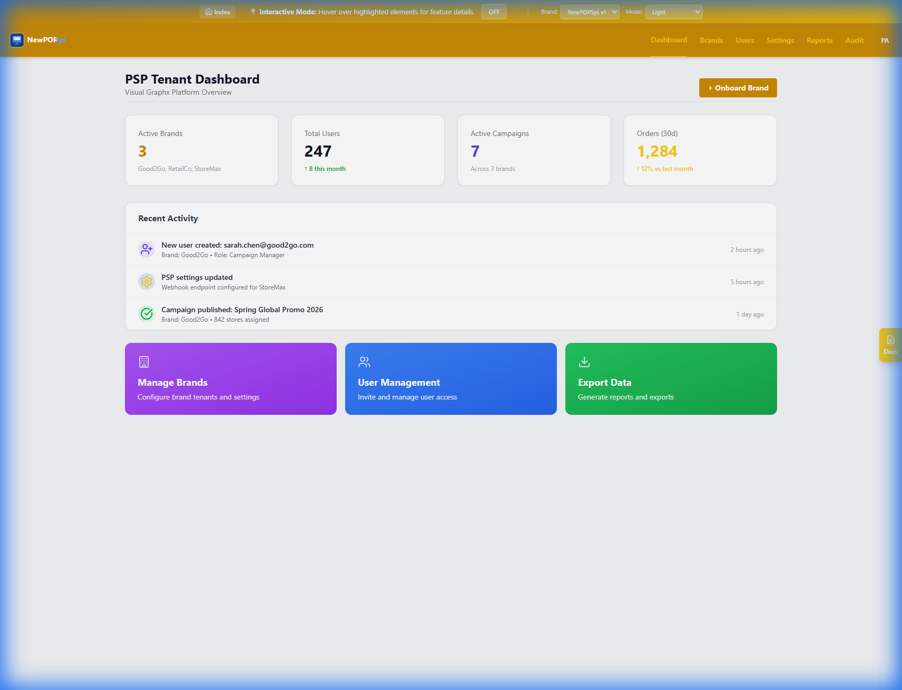

*Figure A001-1: Admin Dashboard - Platform-wide system health, security events, and operational metrics*

> **Layout Reference:** Design patterns follow Brand Dashboard (B01) conventions.

## 3. Screen Description

The Admin Dashboard serves as the command center for Platform Administrators, providing a consolidated view of system health, security events, tenant status, and operational metrics. This screen is the primary landing page for users with Platform Admin or PSP Admin roles.

The dashboard displays real-time system health indicators, recent security events requiring attention, tenant activity summaries, and quick-access navigation to critical administrative functions. Key performance indicators (KPIs) are prominently displayed to enable rapid assessment of platform status.

Platform Admins use this screen to monitor overall system health, identify security anomalies, and navigate to detailed administrative functions. The dashboard supports drill-down into specific metrics and provides contextual links to relevant management screens.

---

## 4. User Access (RBAC)

| Persona | Can Access | Permissions | Notes |
|---------|------------|-------------|-------|
| Platform Admin | Y | Full Access | All widgets, all drill-downs |
| PSP Admin | Y | Tenant-Scoped | Own tenant metrics only |
| Support Agent | Y | Read-Only | View only, no configuration |
| Brand Admin | N | - | No access to admin dashboard |
| Store Manager | N | - | No access to admin dashboard |

---

## 5. Data Model

### Primary Entities

- **Tenant** - PSP tenant configuration and status
  - Key fields: tenant_id, name, status, created_at, settings
- **AuditEvent** - System-wide audit trail entries
  - Key fields: event_id, event_type, actor_id, timestamp, correlation_id
- **User** - Platform user accounts
  - Key fields: user_id, email, role, tenant_id, last_login
- **SystemHealth** - Real-time system metrics (derived)
  - Key fields: service_name, status, latency, error_rate

### Relationships

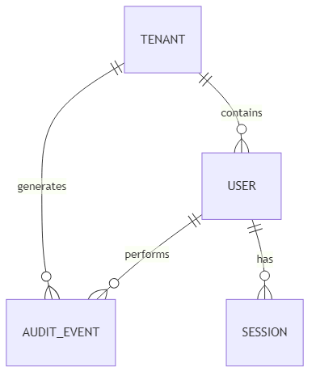

---

## 6. APIs

### Internal APIs

| Endpoint | Method | Purpose |
|----------|--------|---------|
| /api/v1/admin/dashboard/health | GET | Retrieve system health metrics |
| /api/v1/admin/dashboard/security-events | GET | Get recent security events |
| /api/v1/admin/dashboard/tenant-summary | GET | Get tenant activity summary |
| /api/v1/admin/dashboard/kpis | GET | Retrieve dashboard KPI data |

### External Integrations

| System | Purpose | Data Flow |
|--------|---------|-----------|
| Logging Service | System health metrics | Inbound |
| Auth Provider | Login/session metrics | Inbound |

---

## 7. Business Rules

- BR-A001-01: Dashboard data refreshes every 60 seconds automatically
- BR-A001-02: Security events with severity >= HIGH display in alert panel
- BR-A001-03: PSP Admin sees only their tenant's data (tenant isolation)
- BR-A001-04: System health indicators use traffic-light status (green/yellow/red)
- BR-A001-05: Failed authentication attempts > 5 in 15 minutes triggers security alert

---

## 8. UI Components

### Dashboard Widgets

| Widget | Description | Refresh Rate |
|--------|-------------|--------------|
| System Health | Service status indicators | 60s |
| Security Events | Recent high-priority security alerts | 30s |
| Active Users | Current logged-in users count | 60s |
| Tenant Overview | Active tenants and their status | 5min |
| Recent Audit Activity | Last 10 audit events | 30s |
| Quick Actions | Links to common admin tasks | Static |

### Quick Actions Menu

- User Management (A002)
- Brand Configuration (A003)
- System Settings (A004)
- Audit Logs (A005)
- Support Queue (A006)

---

## 9. Acceptance Criteria

- [ ] AC-A001-01: Platform Admin can view all tenant data on dashboard
- [ ] AC-A001-02: PSP Admin sees only their tenant's metrics
- [ ] AC-A001-03: Support Agent can view dashboard in read-only mode
- [ ] AC-A001-04: Security events display with severity color coding
- [ ] AC-A001-05: Dashboard auto-refreshes without page reload
- [ ] AC-A001-06: Clicking on KPI navigates to detailed view
- [ ] AC-A001-07: System health shows status for all critical services
- [ ] AC-A001-08: MFA status indicator visible for admin session

---

## 10. Related Documents

- SUPP-029 - Observability, Metrics, and Audit
- SUPP-030 - Admin Ops Console (deprecated, merged into module)
- SUPP-031 - Supportability, Logs, and Impersonation
- SRS-4.4.1 - Platform Admin Persona

---

*Document Version: 1.0*
*Last Updated: 2026-01-01*
*System: NewPOPSys v1.38*


---
# A002: User Management

## 1. Overview

| Field | Value |
|-------|-------|
| **Screen ID** | A002 |
| **Module** | Platform Admin |
| **Primary Persona** | Platform Admin (PSP-001) |
| **Secondary Personas** | PSP Admin |
| **SOW Reference** | SUPP-003, SUPP-031 |

## 2. Screenshot Reference

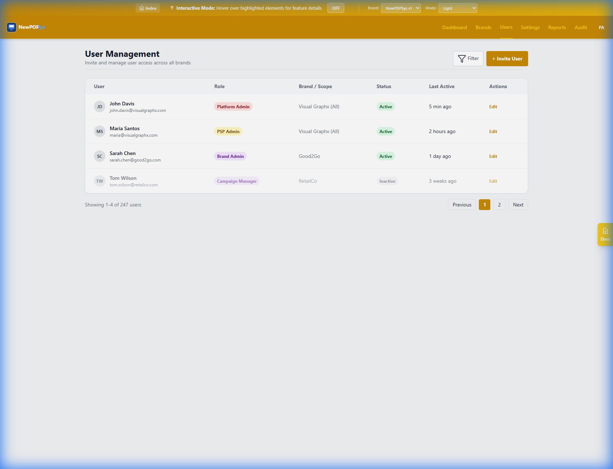

*Figure A002-1: User Management - Platform user administration with roles, permissions, and session management*

> **Layout Reference:** Design follows standard user management grid patterns.

## 3. Screen Description

The User Management screen provides comprehensive user account administration capabilities across the platform. Platform Admins can manage users across all tenants, while PSP Admins are scoped to their own tenant.

This screen enables user creation, role assignment, permission management, and account lifecycle operations (enable/disable/delete). It also provides access to user activity logs, session management, and security settings including MFA enforcement.

Key features include bulk user operations, role-based filtering, user search, and the ability to view impersonation history for any user account.

---

## 4. User Access (RBAC)

| Persona | Can Access | Permissions | Notes |
|---------|------------|-------------|-------|
| Platform Admin | Y | Full CRUD + Impersonate | All tenants, all users |
| PSP Admin | Y | Full CRUD (tenant-scoped) | Own tenant users only, no impersonation |
| Support Agent | Y | Read-Only | View user details, no modifications |
| Brand Admin | N | - | Uses Brand-level user management |
| Store Manager | N | - | No access |

---

## 5. Data Model

### Primary Entities

- **User** - Platform user accounts
  - Key fields: user_id, email, first_name, last_name, role, tenant_id, status, mfa_enabled, created_at, last_login
- **Role** - System role definitions
  - Key fields: role_id, name, permissions[], scope_type
- **UserSession** - Active user sessions
  - Key fields: session_id, user_id, created_at, expires_at, ip_address
- **ImpersonationLog** - Impersonation history
  - Key fields: log_id, impersonator_id, target_user_id, reason, start_time, end_time

### Relationships

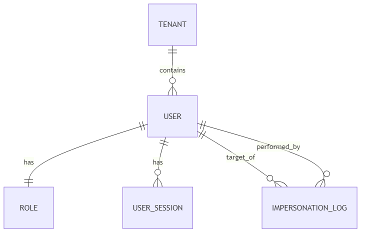

---

## 6. APIs

### Internal APIs

| Endpoint | Method | Purpose |
|----------|--------|---------|
| /api/v1/admin/users | GET | List users with filtering |
| /api/v1/admin/users | POST | Create new user |
| /api/v1/admin/users/{id} | GET | Get user details |
| /api/v1/admin/users/{id} | PUT | Update user |
| /api/v1/admin/users/{id} | DELETE | Delete/deactivate user |
| /api/v1/admin/users/{id}/sessions | GET | Get user's active sessions |
| /api/v1/admin/users/{id}/sessions | DELETE | Terminate user sessions |
| /api/v1/admin/users/{id}/mfa/reset | POST | Reset user's MFA |
| /api/v1/admin/users/{id}/impersonate | POST | Start impersonation session |
| /api/v1/admin/roles | GET | List available roles |

### External Integrations

| System | Purpose | Data Flow |
|--------|---------|-----------|
| Auth Provider | SSO/OAuth integration | Bidirectional |
| Email Service | User invitation emails | Outbound |

---

## 7. Business Rules

- BR-A002-01: Platform Admin cannot delete other Platform Admins (requires direct DB access)
- BR-A002-02: MFA is mandatory for Platform Admin, PSP Admin, and Brand Admin roles (per SUPP-003)
- BR-A002-03: User deletion is soft-delete; records retained for audit compliance
- BR-A002-04: PSP Admin can only manage users within their tenant
- BR-A002-05: Impersonation requires reason field and creates audit trail
- BR-A002-06: Impersonation sessions expire after 30 minutes (hard limit: 2 hours)
- BR-A002-07: Password reset triggers mandatory password change on next login
- BR-A002-08: Account lockout after 5 failed login attempts (15-minute cooldown)
- BR-A002-09: Support Agent can only impersonate Store Users in read-only mode

---

## 8. UI Components

### User List Table

| Column | Description | Sortable | Filterable |
|--------|-------------|----------|------------|
| Name | User full name | Yes | Yes |
| Email | User email address | Yes | Yes |
| Role | Assigned role | Yes | Yes (dropdown) |
| Tenant | Tenant name | Yes | Yes (dropdown) |
| Status | Active/Inactive/Locked | Yes | Yes (dropdown) |
| MFA | MFA enabled status | Yes | Yes (toggle) |
| Last Login | Last login timestamp | Yes | Yes (date range) |
| Actions | Edit, Impersonate, Delete | No | No |

### User Detail Panel

- Profile Information (editable)
- Role Assignment
- Permission Overrides (if applicable)
- MFA Settings
- Session History
- Impersonation History
- Audit Trail (recent actions by user)

### Bulk Actions

- Enable/Disable selected users
- Force password reset
- Export user list (CSV)

---

## 9. State Transitions

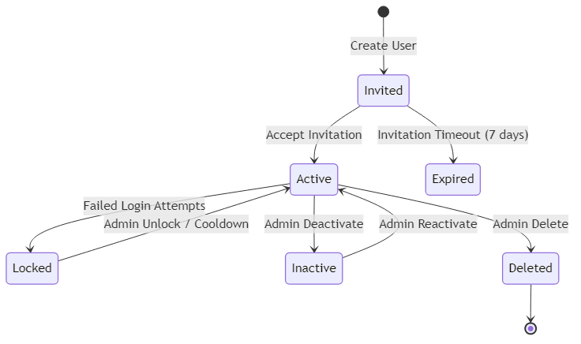

---

## 10. Acceptance Criteria

- [ ] AC-A002-01: Platform Admin can create users in any tenant
- [ ] AC-A002-02: PSP Admin can only see and manage users in their tenant
- [ ] AC-A002-03: User creation sends invitation email
- [ ] AC-A002-04: Role assignment updates permissions immediately
- [ ] AC-A002-05: Impersonation requires reason and creates audit event
- [ ] AC-A002-06: Impersonation session shows banner to impersonated user
- [ ] AC-A002-07: MFA reset requires confirmation
- [ ] AC-A002-08: Bulk actions apply to selected users only
- [ ] AC-A002-09: User search returns results within 500ms
- [ ] AC-A002-10: Deleted users cannot log in but records are retained

---

## 11. Related Documents

- SUPP-003 - RBAC and Permissions Matrix
- SUPP-031 - Supportability, Logs, and Impersonation
- SRS-4.2 - Permission Matrix
- SRS-4.4.1 - Platform Admin Persona

---

*Document Version: 1.0*
*Last Updated: 2026-01-01*
*System: NewPOPSys v1.38*


---
# A003: Brand Configuration

## 1. Overview

| Field | Value |
|-------|-------|
| **Screen ID** | A003 |
| **Module** | Platform Admin |
| **Primary Persona** | Platform Admin (PSP-001) |
| **Secondary Personas** | PSP Admin |
| **SOW Reference** | SUPP-003, SUPP-023 |

## 2. Screenshot Reference

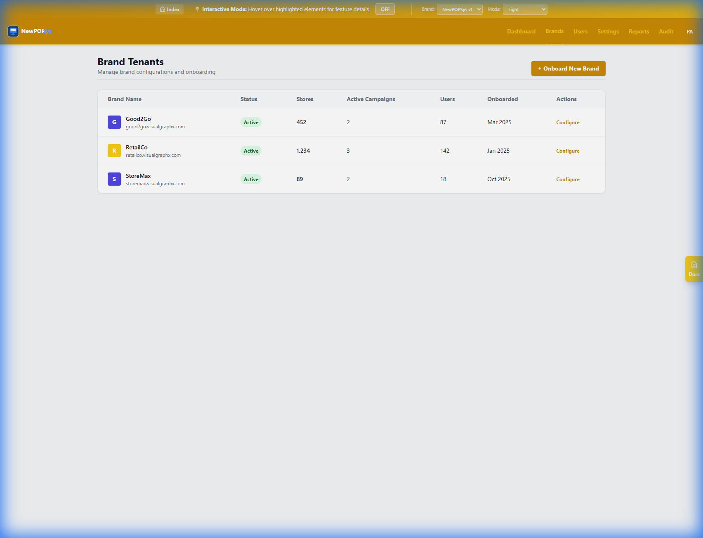

*Figure A003-1: Brand Configuration - Brand tenant onboarding, feature flags, and integration settings*

> **Layout Reference:** Design follows brand onboarding patterns from SUPP documents.

## 3. Screen Description

The Brand Configuration screen enables Platform Admins and PSP Admins to onboard and configure brand tenants within the PSP ecosystem. This screen provides comprehensive brand setup including branding assets, notification preferences, feature flag configurations, and integration settings.

Brand onboarding follows a "skeletonize" approach where the PSP creates the brand structure, configures initial settings, and then invites Brand Admin users to complete detailed configuration. This screen manages the PSP-level brand settings that determine platform behavior for each brand.

Key capabilities include brand creation, feature flag management, API key provisioning, notification channel configuration, and brand-level policy settings.

---

## 4. User Access (RBAC)

| Persona | Can Access | Permissions | Notes |
|---------|------------|-------------|-------|
| Platform Admin | Y | Full CRUD | All brands across all tenants |
| PSP Admin | Y | Full CRUD (tenant-scoped) | Brands within own PSP tenant only |
| Support Agent | Y | Read-Only | View brand configuration, no changes |
| Brand Admin | N | - | Uses Brand Admin module for self-config |
| Store Manager | N | - | No access |

---

## 5. Data Model

### Primary Entities

- **Brand** - Brand tenant configuration
  - Key fields: brand_id, name, tenant_id, status, logo_url, primary_color, created_at
- **BrandSettings** - Brand-specific settings
  - Key fields: brand_id, notification_preferences, verification_mode, sla_settings
- **FeatureFlag** - Feature flag configurations
  - Key fields: flag_id, flag_key, scope_type, scope_id, value, enabled
- **APIKey** - Brand API credentials
  - Key fields: key_id, brand_id, key_hash, permissions[], created_at, expires_at

### Relationships

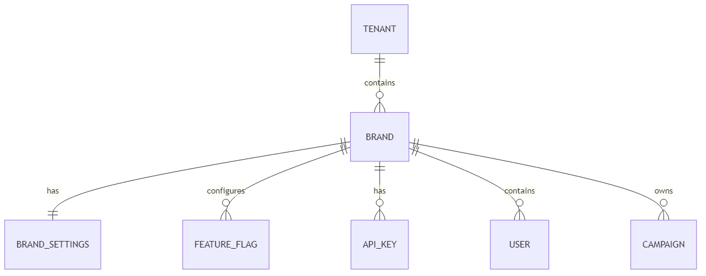

---

## 6. APIs

### Internal APIs

| Endpoint | Method | Purpose |
|----------|--------|---------|
| /api/v1/admin/brands | GET | List brands with filtering |
| /api/v1/admin/brands | POST | Create new brand (skeletonize) |
| /api/v1/admin/brands/{id} | GET | Get brand details |
| /api/v1/admin/brands/{id} | PUT | Update brand configuration |
| /api/v1/admin/brands/{id} | DELETE | Deactivate brand |
| /api/v1/admin/brands/{id}/settings | GET | Get brand settings |
| /api/v1/admin/brands/{id}/settings | PUT | Update brand settings |
| /api/v1/admin/brands/{id}/feature-flags | GET | List brand feature flags |
| /api/v1/admin/brands/{id}/feature-flags | PUT | Update feature flags |
| /api/v1/admin/brands/{id}/api-keys | GET | List API keys |
| /api/v1/admin/brands/{id}/api-keys | POST | Create API key |
| /api/v1/admin/brands/{id}/api-keys/{keyId} | DELETE | Revoke API key |

### External Integrations

| System | Purpose | Data Flow |
|--------|---------|-----------|
| Asset Storage | Brand logo/asset upload | Outbound |
| Email Service | Brand admin invitation | Outbound |

---

## 7. Business Rules

- BR-A003-01: Brand names must be unique within a PSP tenant
- BR-A003-02: Brand deletion is soft-delete; historical data retained
- BR-A003-03: API keys are shown only once at creation; stored hashed
- BR-A003-04: Feature flag changes are audited with before/after values
- BR-A003-05: Feature flags use scope precedence: USER > STORE > CAMPAIGN > BRAND > TENANT
- BR-A003-06: Brand status change to Inactive disables all brand user logins
- BR-A003-07: At least one Brand Admin must be invited before brand goes Active
- BR-A003-08: Notification preferences inherit from PSP defaults if not overridden

---

## 8. UI Components

### Brand List Table

| Column | Description | Sortable | Filterable |
|--------|-------------|----------|------------|
| Name | Brand name | Yes | Yes |
| Status | Active/Inactive/Pending | Yes | Yes (dropdown) |
| Campaigns | Active campaign count | Yes | No |
| Stores | Total store count | Yes | No |
| Created | Creation date | Yes | Yes (date range) |
| Actions | Edit, View, Deactivate | No | No |

### Brand Configuration Tabs

1. **General Settings**
   - Brand name, logo, colors
   - Contact information
   - Status management

2. **Notification Preferences**
   - Email notification toggles
   - Webhook configuration
   - Escalation rules

3. **Feature Flags**
   - Flag list with toggle controls
   - Scope selection (Brand-wide vs Campaign-specific)
   - Override inheritance display

4. **API Keys**
   - Key list with permissions
   - Create new key
   - Revoke existing keys

5. **Users**
   - Brand-level user list
   - Invite Brand Admin

---

## 9. State Transitions

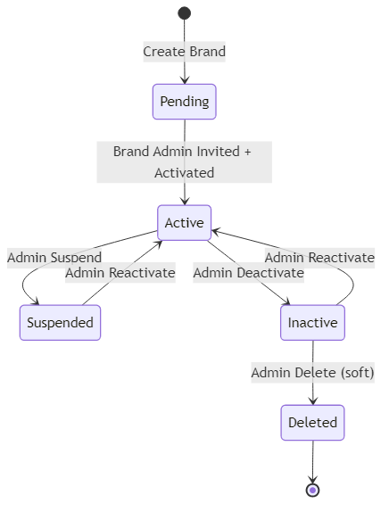

---

## 10. Feature Flag Configuration

### Available Feature Flags (v1)

| Flag Key | Description | Default | Scope Options |
|----------|-------------|---------|---------------|
| `photo_verification_enabled` | Enable photo proof verification | true | Brand, Campaign |
| `strict_verification_mode` | Require admin approval for all proofs | false | Brand, Campaign |
| `deinstall_tracking_enabled` | Track deinstallation completion | true | Brand, Campaign |
| `issue_auto_approval` | Auto-approve issues under threshold | false | Brand |
| `multi_language_enabled` | Enable multi-language support | false | Brand |

---

## 11. Acceptance Criteria

- [ ] AC-A003-01: Platform Admin can create brands in any tenant
- [ ] AC-A003-02: PSP Admin can only create brands in their tenant
- [ ] AC-A003-03: Brand creation initializes default settings
- [ ] AC-A003-04: Feature flag changes take effect immediately
- [ ] AC-A003-05: API key is displayed only once at creation
- [ ] AC-A003-06: Brand deactivation prevents user logins
- [ ] AC-A003-07: Logo upload accepts PNG/JPG up to 2MB
- [ ] AC-A003-08: Brand admin invitation sends email notification
- [ ] AC-A003-09: Audit log records all configuration changes
- [ ] AC-A003-10: Feature flag scope inheritance is visually indicated

---

## 12. Related Documents

- SUPP-003 - RBAC and Permissions Matrix
- SUPP-023 - Feature Flags Admin UX
- SUPP-004 - Notifications and Escalation Matrix
- SRS-4.4.1 - Platform Admin Persona

---

*Document Version: 1.0*
*Last Updated: 2026-01-01*
*System: NewPOPSys v1.38*


---
# A004: System Settings

## 1. Overview

| Field | Value |
|-------|-------|
| **Screen ID** | A004 |
| **Module** | Platform Admin |
| **Primary Persona** | Platform Admin (PSP-001) |
| **Secondary Personas** | PSP Admin (limited access) |
| **SOW Reference** | SUPP-023, SUPP-029, SUPP-006 |

## 2. Screenshot Reference

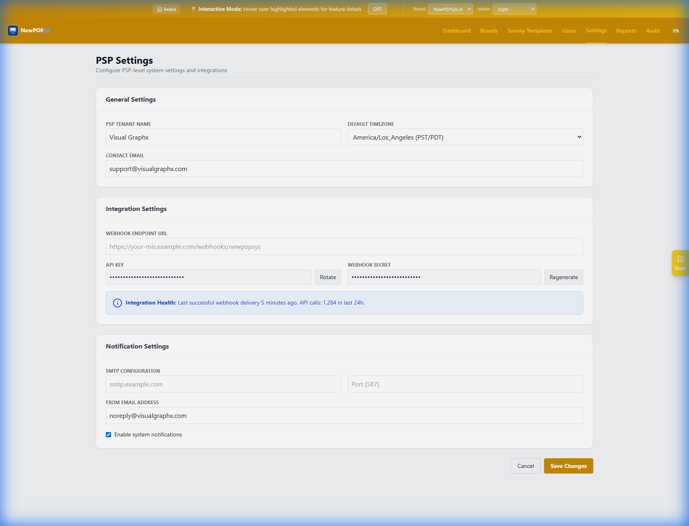

*Figure A004-1: System Settings - Platform-wide configuration, webhooks, and feature flag management*

> **Layout Reference:** Design follows standard settings management patterns.

## 3. Screen Description

The System Settings screen provides centralized configuration for platform-wide and tenant-wide settings. Platform Admins have access to global system configuration, while PSP Admins can configure tenant-specific settings within their scope.

This screen manages critical platform behaviors including authentication policies, API rate limits, webhook configurations, feature flags at the platform level, email delivery settings, and data retention policies. Changes to system settings are considered high-risk operations and require confirmation.

The settings are organized into logical categories with clear descriptions of each setting's impact. All changes are audited with before/after values for compliance and troubleshooting purposes.

---

## 4. User Access (RBAC)

| Persona | Can Access | Permissions | Notes |
|---------|------------|-------------|-------|
| Platform Admin | Y | Full Read/Write | All system settings |
| PSP Admin | Y | Tenant Settings Only | Own tenant configuration |
| Support Agent | Y | Read-Only | View settings, no changes |
| Brand Admin | N | - | No access |
| Store Manager | N | - | No access |

---

## 5. Data Model

### Primary Entities

- **SystemSetting** - Platform-wide settings
  - Key fields: setting_id, key, value, data_type, category, description, last_modified
- **TenantSetting** - Tenant-specific settings
  - Key fields: tenant_id, key, value, inherits_from_system
- **WebhookEndpoint** - Configured webhook destinations
  - Key fields: endpoint_id, url, events[], secret_hash, status, last_delivery
- **EmailConfiguration** - Email delivery settings
  - Key fields: provider, api_key_hash, from_address, reply_to

### Relationships

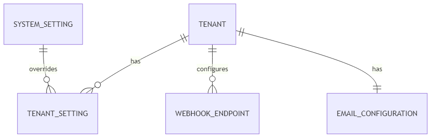

---

## 6. APIs

### Internal APIs

| Endpoint | Method | Purpose |
|----------|--------|---------|
| /api/v1/admin/settings | GET | List all settings (filtered by access) |
| /api/v1/admin/settings/{key} | GET | Get specific setting |
| /api/v1/admin/settings/{key} | PUT | Update setting value |
| /api/v1/admin/settings/categories | GET | List setting categories |
| /api/v1/admin/webhooks | GET | List webhook endpoints |
| /api/v1/admin/webhooks | POST | Create webhook endpoint |
| /api/v1/admin/webhooks/{id} | PUT | Update webhook endpoint |
| /api/v1/admin/webhooks/{id} | DELETE | Delete webhook endpoint |
| /api/v1/admin/webhooks/{id}/test | POST | Send test webhook |
| /api/v1/admin/email/test | POST | Send test email |
| /api/v1/admin/feature-flags | GET | List platform feature flags |
| /api/v1/admin/feature-flags/{key} | PUT | Update feature flag |

### External Integrations

| System | Purpose | Data Flow |
|--------|---------|-----------|
| Email Provider (SendGrid/SES) | Email delivery configuration | Outbound |
| Webhook Destinations | Event delivery | Outbound |

---

## 7. Business Rules

- BR-A004-01: System settings changes require confirmation dialog
- BR-A004-02: Security-critical settings require MFA re-authentication
- BR-A004-03: Tenant settings inherit from system settings if not overridden
- BR-A004-04: Webhook secrets are shown only once at creation
- BR-A004-05: Webhook delivery uses exponential backoff retry (per SUPP-006)
- BR-A004-06: Email configuration changes require test email before activation
- BR-A004-07: Rate limit changes take effect within 60 seconds
- BR-A004-08: All setting changes are immutably audited

---

## 8. UI Components

### Settings Categories

1. **Authentication & Security**
   - Password policy (length, complexity, rotation)
   - MFA enforcement rules
   - Session timeout settings
   - Account lockout thresholds
   - IP allowlist/blocklist

2. **API Configuration**
   - Rate limiting (requests per minute)
   - API versioning settings
   - CORS allowed origins
   - Request size limits

3. **Webhooks**
   - Endpoint management
   - Event subscription configuration
   - Retry policy settings
   - Webhook signing key management

4. **Email Delivery**
   - Provider configuration
   - From address settings
   - Template management
   - Delivery queue settings

5. **Feature Flags (Platform Level)**
   - Global feature toggles
   - Rollout percentage controls
   - Kill switches for emergencies

6. **Data Retention**
   - Audit log retention period
   - Session data retention
   - Deleted record retention
   - Export file retention

### Setting Entry Format

| Field | Description |
|-------|-------------|
| Key | Setting identifier |
| Value | Current value with type-appropriate input |
| Default | System default value |
| Description | Setting purpose and impact |
| Last Modified | Timestamp and modifier |
| Inherited | Whether tenant inherits from system |

---

## 9. Webhook Configuration

### Event Types Available

| Event | Description | Payload |
|-------|-------------|---------|
| `order.created` | New order generated | Order details |
| `shipment.updated` | Shipping status change | Shipment details |
| `proof.submitted` | Store submits completion proof | Proof metadata |
| `issue.submitted` | Issue/reorder request created | Issue details |
| `campaign.status_changed` | Campaign status transition | Campaign summary |

### Webhook Delivery Specification

- **Retry Policy**: Exponential backoff (1s, 2s, 4s, 8s, 16s) up to 5 attempts
- **Signing**: HMAC-SHA256 signature in `X-Signature-256` header
- **Timeout**: 30 second connection timeout
- **Idempotency**: Unique `X-Delivery-Id` header for deduplication

---

## 10. Security Settings Detail

### Password Policy Options

| Setting | Options | Default |
|---------|---------|---------|
| Minimum Length | 8-32 characters | 12 |
| Require Uppercase | Yes/No | Yes |
| Require Lowercase | Yes/No | Yes |
| Require Numbers | Yes/No | Yes |
| Require Special Characters | Yes/No | Yes |
| Password History | 0-24 passwords | 12 |
| Max Age (Admin Roles) | 30-365 days | 90 |
| Max Age (Store Roles) | 0 (disabled) - 365 days | 0 |

### Session Settings

| Setting | Options | Default |
|---------|---------|---------|
| Session Timeout (Idle) | 5-60 minutes | 30 |
| Session Timeout (Absolute) | 1-24 hours | 8 |
| Concurrent Sessions | 1-10 | 3 |
| Remember Me Duration | 1-30 days | 14 |

---

## 11. Acceptance Criteria

- [ ] AC-A004-01: Platform Admin can modify all system settings
- [ ] AC-A004-02: PSP Admin can only modify tenant settings
- [ ] AC-A004-03: Setting changes display confirmation dialog
- [ ] AC-A004-04: Security settings require MFA re-authentication
- [ ] AC-A004-05: Webhook test sends sample payload successfully
- [ ] AC-A004-06: Email test delivers to specified address
- [ ] AC-A004-07: Setting inheritance is visually indicated
- [ ] AC-A004-08: All changes are recorded in audit log
- [ ] AC-A004-09: Invalid setting values show validation errors
- [ ] AC-A004-10: Rate limit changes apply within 60 seconds

---

## 12. Related Documents

- SUPP-006 - Webhooks and External Integration
- SUPP-023 - Feature Flags Admin UX
- SUPP-029 - Observability, Metrics, and Audit
- SUPP-027 - Message Delivery
- SRS-4.4.1 - Platform Admin Persona

---

*Document Version: 1.0*
*Last Updated: 2026-01-01*
*System: NewPOPSys v1.38*


---
# A005: Audit Logs

## 1. Overview

| Field | Value |
|-------|-------|
| **Screen ID** | A005 |
| **Module** | Platform Admin |
| **Primary Persona** | Platform Admin (PSP-001) |
| **Secondary Personas** | PSP Admin, Support Agent |
| **SOW Reference** | SUPP-029, SUPP-031 |

## 2. Screenshot Reference

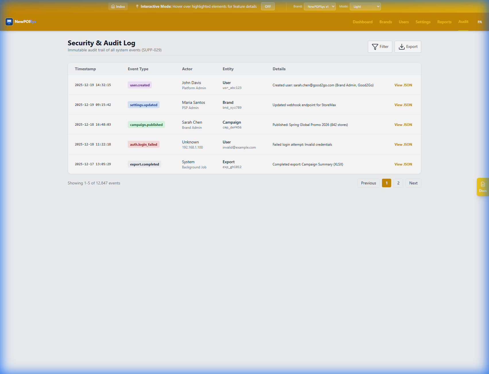

*Figure A005-1: Audit Logs - Immutable audit trail with search, filtering, and compliance export*

> **Layout Reference:** Design follows Audit Explorer patterns from SUPP-029.

## 3. Screen Description

The Audit Logs screen provides comprehensive access to the platform's immutable audit trail. This screen enables administrators to search, filter, and analyze all audited events across the platform for security monitoring, compliance reporting, and troubleshooting.

The audit log captures all significant system events including user actions, data modifications, authentication events, impersonation sessions, and system configuration changes. Each event includes correlation IDs for end-to-end request tracing and actor identification for accountability.

Platform Admins have access to all audit events across all tenants, while PSP Admins and Support Agents are scoped to their tenant's events. The screen supports advanced filtering, date range selection, and export capabilities for compliance reporting.

---

## 4. User Access (RBAC)

| Persona | Can Access | Permissions | Notes |
|---------|------------|-------------|-------|
| Platform Admin | Y | Full Access | All tenants, all events |
| PSP Admin | Y | Tenant-Scoped | Own tenant events only |
| Support Agent | Y | Read-Only (Tenant-Scoped) | View only, own tenant |
| Brand Admin | Y | Brand-Scoped | Own brand events only |
| Regional Manager | Y | Region-Scoped | Assigned region events only |
| Store Manager | Y | Store-Scoped | Own store events only |

---

## 5. Data Model

### Primary Entities

- **AuditEvent** - Immutable audit trail entries
  - Key fields: event_id, event_type, actor_id, actor_type, target_type, target_id, action, timestamp, correlation_id, request_id, tenant_id, brand_id, metadata
- **AuditEventType** - Event type definitions
  - Key fields: type_code, description, severity, retention_class

### Event Categories

| Category | Event Types |
|----------|-------------|
| Authentication | login.success, login.failure, logout, password.changed, mfa.enabled |
| Authorization | permission.denied, role.assigned, role.removed |
| Data Modification | record.created, record.updated, record.deleted |
| Impersonation | impersonation.started, impersonation.ended |
| System | setting.changed, webhook.delivered, job.completed |
| Security | lockout.triggered, suspicious.activity, api_key.created |

### Relationships

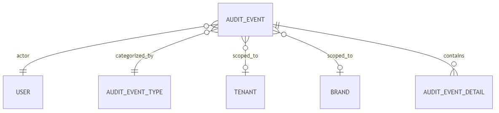

---

## 6. APIs

### Internal APIs

| Endpoint | Method | Purpose |
|----------|--------|---------|
| /api/v1/admin/audit | GET | Search audit events with filters |
| /api/v1/admin/audit/{id} | GET | Get audit event details |
| /api/v1/admin/audit/export | POST | Export audit events to file |
| /api/v1/admin/audit/event-types | GET | List available event types |
| /api/v1/admin/audit/statistics | GET | Get audit statistics summary |
| /api/v1/admin/audit/trace/{correlationId} | GET | Get all events for correlation ID |

### External Integrations

| System | Purpose | Data Flow |
|--------|---------|-----------|
| SIEM Integration | Security event export | Outbound |
| Log Aggregation | Centralized logging | Outbound |

---

## 7. Business Rules

- BR-A005-01: Audit log entries are immutable; cannot be modified or deleted
- BR-A005-02: Audit logs are retained for 7 years per COMPLIANCE retention class
- BR-A005-03: Access to audit logs is itself audited
- BR-A005-04: Impersonation events include both actual actor and impersonated actor
- BR-A005-05: High-severity events trigger real-time notifications (per SUPP-004)
- BR-A005-06: Export requests create audit events with export metadata
- BR-A005-07: Correlation ID links all events from a single request chain
- BR-A005-08: Request ID identifies individual service calls within correlation

---

## 8. UI Components

### Search and Filter Panel

| Filter | Type | Options |
|--------|------|---------|
| Date Range | Date Picker | Start/End dates, presets (Today, Last 7 days, etc.) |
| Event Type | Multi-select | All event type categories |
| Severity | Multi-select | INFO, WARNING, HIGH, CRITICAL |
| Actor | Search | User name or ID |
| Target | Search | Resource type and ID |
| Tenant | Dropdown | (Platform Admin only) |
| Brand | Dropdown | (Admin only) |
| Correlation ID | Text | For request tracing |

### Event List Table

| Column | Description | Sortable |
|--------|-------------|----------|
| Timestamp | Event occurrence time (with timezone) | Yes |
| Event Type | Event category and action | Yes |
| Severity | Visual severity indicator | Yes |
| Actor | User who performed action | Yes |
| Target | Affected resource | Yes |
| Summary | Brief event description | No |
| Details | Expand for full details | No |

### Event Detail Panel

- **Event Metadata**
  - Event ID, Type, Timestamp
  - Correlation ID, Request ID
  - Source IP, User Agent

- **Actor Information**
  - Actual Actor (who performed action)
  - Impersonated Actor (if applicable)
  - Actor Role and Tenant

- **Target Information**
  - Resource Type and ID
  - Before/After values (for modifications)

- **Related Events**
  - Events with same Correlation ID
  - Events affecting same target

---

## 9. Audit Event Schema

```json
{
  "event_id": "uuid",
  "event_type": "record.updated",
  "severity": "INFO",
  "timestamp": "2026-01-01T10:30:00Z",
  "correlation_id": "uuid",
  "request_id": "uuid",
  "actor": {
    "user_id": "uuid",
    "email": "admin@example.com",
    "role": "PLATFORM_ADMIN",
    "ip_address": "192.168.1.1",
    "user_agent": "Mozilla/5.0..."
  },
  "impersonated_actor": null,
  "target": {
    "type": "Brand",
    "id": "uuid",
    "name": "Good2Go"
  },
  "action": "UPDATE",
  "changes": {
    "before": {"status": "active"},
    "after": {"status": "inactive"}
  },
  "metadata": {
    "reason": "Brand requested deactivation"
  }
}
```

---

## 10. Export Capabilities

### Export Formats

| Format | Description | Use Case |
|--------|-------------|----------|
| CSV | Comma-separated values | Spreadsheet analysis |
| JSON | Full event details | API integration |
| PDF | Formatted report | Compliance documentation |

### Export Options

- Date range selection
- Event type filtering
- Include/exclude sensitive fields
- Scheduled exports (daily/weekly)

---

## 11. Acceptance Criteria

- [ ] AC-A005-01: Platform Admin can view all tenant audit events
- [ ] AC-A005-02: PSP Admin sees only their tenant's events
- [ ] AC-A005-03: Date range filter returns events within range
- [ ] AC-A005-04: Correlation ID search returns all related events
- [ ] AC-A005-05: Event detail shows before/after values for changes
- [ ] AC-A005-06: Impersonation events show both actors clearly
- [ ] AC-A005-07: Export generates file in selected format
- [ ] AC-A005-08: Search returns results within 2 seconds for typical queries
- [ ] AC-A005-09: Pagination works correctly for large result sets
- [ ] AC-A005-10: Accessing audit logs creates its own audit event

---

## 12. Related Documents

- SUPP-029 - Observability, Metrics, and Audit
- SUPP-031 - Supportability, Logs, and Impersonation
- SUPP-003 - RBAC and Permissions Matrix
- SRS-4.4.1 - Platform Admin Persona

---

*Document Version: 1.0*
*Last Updated: 2026-01-01*
*System: NewPOPSys v1.38*


---
# A006: Support Queue

## 1. Overview

| Field | Value |
|-------|-------|
| **Screen ID** | A006 |
| **Module** | Platform Admin |
| **Primary Persona** | Support Agent |
| **Secondary Personas** | Platform Admin, PSP Admin |
| **SOW Reference** | SUPP-031, SUPP-004 |

## 2. Screenshot Reference


*Figure A006-1: Support Queue - Support ticket management, failed webhooks, and system alerts*

> **Layout Reference:** Design follows standard support ticketing patterns.

## 3. Screen Description

The Support Queue screen provides a centralized interface for managing customer support requests, escalated issues, and system alerts requiring attention. Support Agents use this screen as their primary workspace for handling support cases.

This screen aggregates support tickets, failed webhook deliveries requiring retry, user-reported issues, and system-generated alerts. It provides quick access to user impersonation (read-only for Support Agents), audit log viewing, and case management tools.

The queue supports filtering by priority, status, category, and assignment. Cases can be assigned to specific agents or teams, and all case interactions are tracked for quality assurance and training purposes.

---

## 4. User Access (RBAC)

| Persona | Can Access | Permissions | Notes |
|---------|------------|-------------|-------|
| Platform Admin | Y | Full Access | All cases, assign to any agent |
| PSP Admin | Y | Tenant-Scoped | Manage tenant support cases |
| Support Agent | Y | Assigned Cases | Work assigned cases, view all tenant cases |
| Production Operator | Y | Limited | View fulfillment-related issues only |
| Brand Admin | N | - | Uses issue management in Brand module |
| Store Manager | N | - | Submits issues through Store module |

---

## 5. Data Model

### Primary Entities

- **SupportCase** - Support ticket/case
  - Key fields: case_id, subject, description, status, priority, category, reporter_id, assignee_id, tenant_id, created_at, updated_at, resolved_at
- **CaseComment** - Case discussion thread
  - Key fields: comment_id, case_id, author_id, content, is_internal, created_at
- **FailedWebhook** - Failed webhook delivery for retry
  - Key fields: delivery_id, endpoint_id, event_type, payload, attempts, last_attempt, status
- **SystemAlert** - System-generated alerts
  - Key fields: alert_id, alert_type, severity, message, acknowledged, created_at

### Relationships

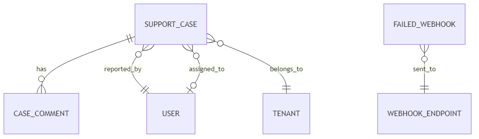

---

## 6. APIs

### Internal APIs

| Endpoint | Method | Purpose |
|----------|--------|---------|
| /api/v1/support/cases | GET | List support cases with filters |
| /api/v1/support/cases | POST | Create support case |
| /api/v1/support/cases/{id} | GET | Get case details |
| /api/v1/support/cases/{id} | PUT | Update case |
| /api/v1/support/cases/{id}/comments | GET | List case comments |
| /api/v1/support/cases/{id}/comments | POST | Add case comment |
| /api/v1/support/cases/{id}/assign | POST | Assign case to agent |
| /api/v1/support/failed-webhooks | GET | List failed webhooks |
| /api/v1/support/failed-webhooks/{id}/retry | POST | Retry failed webhook |
| /api/v1/support/alerts | GET | List system alerts |
| /api/v1/support/alerts/{id}/acknowledge | POST | Acknowledge alert |

### External Integrations

| System | Purpose | Data Flow |
|--------|---------|-----------|
| Ticketing System | External ticket sync (optional) | Bidirectional |
| Notification Service | Agent notifications | Outbound |

---

## 7. Business Rules

- BR-A006-01: New cases default to "Open" status and "Medium" priority
- BR-A006-02: Cases auto-escalate if unacknowledged for 4 hours
- BR-A006-03: Critical priority cases trigger immediate notification
- BR-A006-04: Support Agent can impersonate users (read-only) for debugging
- BR-A006-05: Internal comments are not visible to case reporter
- BR-A006-06: Failed webhooks can be retried up to 5 additional times manually
- BR-A006-07: Resolved cases can be reopened within 30 days
- BR-A006-08: Case resolution requires resolution category and notes

---

## 8. UI Components

### Queue Tabs

| Tab | Description | Badge |
|-----|-------------|-------|
| My Cases | Cases assigned to current agent | Count |
| Unassigned | Cases awaiting assignment | Count |
| All Open | All open cases (filtered by access) | Count |
| Failed Webhooks | Webhooks requiring retry | Count |
| Alerts | System alerts | Count |
| Resolved | Recently resolved cases | - |

### Case List Table

| Column | Description | Sortable | Filterable |
|--------|-------------|----------|------------|
| Case # | Case identifier | Yes | Yes |
| Subject | Case subject line | Yes | Yes |
| Priority | Critical/High/Medium/Low | Yes | Yes (dropdown) |
| Status | Open/In Progress/Pending/Resolved | Yes | Yes (dropdown) |
| Category | Issue category | Yes | Yes (dropdown) |
| Reporter | User who reported | Yes | Yes |
| Assignee | Assigned agent | Yes | Yes (dropdown) |
| Age | Time since creation | Yes | Yes (range) |
| Updated | Last update time | Yes | Yes |

### Case Detail Panel

- **Case Information**
  - Subject, Description
  - Status, Priority, Category
  - Reporter details with impersonation link
  - Assignee with reassign option

- **Timeline**
  - Chronological activity log
  - Comments (internal and external)
  - Status changes
  - Assignment changes

- **Actions**
  - Add Comment (internal/external toggle)
  - Change Status
  - Change Priority
  - Reassign
  - Impersonate Reporter (read-only)
  - View Related Audit Events
  - Resolve Case

### Failed Webhook Panel

| Column | Description |
|--------|-------------|
| Endpoint | Webhook destination URL |
| Event | Event type that triggered |
| Attempts | Number of delivery attempts |
| Last Error | Error message from last attempt |
| Actions | Retry, View Payload, Dismiss |

---

## 9. State Transitions

### Case Status Flow

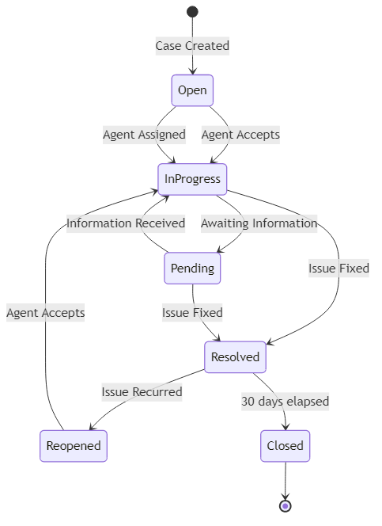

### Case Priority Levels

| Priority | SLA (First Response) | SLA (Resolution) | Escalation |
|----------|---------------------|------------------|------------|
| Critical | 15 minutes | 4 hours | Immediate to PSP Admin |
| High | 1 hour | 8 hours | After 2 hours |
| Medium | 4 hours | 24 hours | After 8 hours |
| Low | 8 hours | 72 hours | After 24 hours |

---

## 10. Impersonation Integration

### Support Agent Impersonation

- **Scope**: Store Users only (per SUPP-003)
- **Mode**: Read-only (cannot modify data)
- **Access Path**: Case Detail → Reporter → Impersonate
- **Session Limit**: 30 minutes
- **Requirements**: Reason required, audit logged

### Impersonation UI

1. Click "Impersonate Reporter" on case
2. Enter reason for impersonation
3. Confirm impersonation start
4. Read-only session begins with banner
5. "End Impersonation" button always visible
6. Auto-terminate at 30 minutes

---

## 11. Acceptance Criteria

- [ ] AC-A006-01: Support Agent sees cases scoped to their tenant
- [ ] AC-A006-02: Unassigned queue shows cases awaiting assignment
- [ ] AC-A006-03: Case assignment sends notification to assignee
- [ ] AC-A006-04: Internal comments are hidden from case reporter
- [ ] AC-A006-05: Failed webhook retry attempts delivery
- [ ] AC-A006-06: Impersonation requires reason and is audited
- [ ] AC-A006-07: Impersonation session is read-only for Support Agent
- [ ] AC-A006-08: Case resolution requires category and notes
- [ ] AC-A006-09: SLA timers display on case list
- [ ] AC-A006-10: Auto-escalation triggers after SLA threshold

---

## 12. Related Documents

- SUPP-031 - Supportability, Logs, and Impersonation
- SUPP-004 - Notifications and Escalation Matrix
- SUPP-003 - RBAC and Permissions Matrix
- SRS-4.4.1 - Platform Admin Persona

---

*Document Version: 1.0*
*Last Updated: 2026-01-01*
*System: NewPOPSys v1.38*


---

# Section 11: API Specifications
# 11.1 API Overview

## Document Information
| Field | Value |
|-------|-------|
| Document ID | SRS-11.1 |
| Version | 1.0 |
| Last Updated | 2025-01-13 |
| Status | Draft |
| Parent Document | SRS-11 API Specifications |

---

## 1. Introduction

### 1.1 Purpose
This document provides a comprehensive overview of the NewPOPSys API architecture, including authentication mechanisms, versioning strategies, rate limiting policies, and error handling conventions. It serves as the foundational reference for all API consumers and integrators.

### 1.2 Scope
The NewPOPSys API enables:
- **Inbound Operations**: PSP systems acknowledging orders, updating statuses, and creating shipments
- **Outbound Webhooks**: Event-driven notifications to integrated systems
- **Internal Services**: Survey management, store layouts, photo rules, and health monitoring

### 1.3 API Version
| Attribute | Value |
|-----------|-------|
| Current Version | 1.0.0 |
| OpenAPI Specification | 3.1.0 |
| Base Path | `/api/v1` |

---

## 2. Server Environments

### 2.1 Environment Configuration

| Environment | Base URL | Purpose |
|-------------|----------|---------|
| Production | `https://api.newpopsys.com/v1` | Live production traffic |
| Staging | `https://staging-api.newpopsys.com/v1` | Pre-production testing |
| Development | `http://localhost:3000/v1` | Local development |

### 2.2 Environment Identification
API keys are prefixed to identify their environment:

| Prefix | Environment | Example |
|--------|-------------|---------|
| `vg_live_` | Production | `vg_live_abc123def456` |
| `vg_test_` | Staging/Development | `vg_test_xyz789ghi012` |

---

## 3. Authentication

### 3.1 API Key Authentication
NewPOPSys uses API Key authentication for all API requests.

#### 3.1.1 Request Header Format
```http
X-API-Key: vg_live_your_api_key_here
```

#### 3.1.2 Authentication Flow
[Diagram - See rendered image above or refer to source document]

### 3.2 API Key Security Requirements

| Requirement | Description |
|-------------|-------------|
| Transmission | HTTPS/TLS 1.3 required |
| Storage | Encrypted at rest, never in logs |
| Rotation | Minimum every 90 days |
| Revocation | Immediate effect upon deletion |
| Scope | Tenant-specific permissions |

### 3.3 Authentication Errors

| HTTP Code | Error | Description |
|-----------|-------|-------------|
| 401 | `UNAUTHORIZED` | Missing or invalid API key |
| 403 | `FORBIDDEN` | Valid key but insufficient permissions |

**Example Error Response:**
```json
{
  "error": {
    "code": "UNAUTHORIZED",
    "message": "Invalid or missing API key",
    "timestamp": "2025-01-13T10:30:00Z",
    "requestId": "req_abc123def456"
  }
}
```

---

## 4. API Versioning

### 4.1 Versioning Strategy
NewPOPSys employs **URL Path Versioning** for explicit version control.

| Strategy | Format | Example |
|----------|--------|---------|
| URL Path | `/v{major}` | `/v1/orders` |

### 4.2 Version Lifecycle

| Phase | Duration | Description |
|-------|----------|-------------|
| Current | Active | Full support and new features |
| Deprecated | 6 months | Security updates only, migration recommended |
| Sunset | 3 months | Read-only, then decommissioned |

### 4.3 Breaking vs Non-Breaking Changes

**Non-Breaking Changes (No Version Bump):**
- Adding new optional request parameters
- Adding new response fields
- Adding new endpoints
- Adding new webhook event types

**Breaking Changes (Major Version Bump):**
- Removing or renaming fields
- Changing field types
- Modifying required parameters
- Changing endpoint paths
- Altering authentication mechanisms

### 4.4 Deprecation Headers
When endpoints are deprecated, responses include:

```http
Deprecation: true
Sunset: Sat, 01 Jul 2025 00:00:00 GMT
Link: <https://docs.newpopsys.com/migration>; rel="deprecation"
```

---

## 5. Rate Limiting

### 5.1 Rate Limit Tiers

| Category | Limit | Window | Scope |
|----------|-------|--------|-------|
| Authentication | 20 requests | 1 minute | Per IP |
| General API | 300 requests | 1 minute | Per API Key |
| File Uploads | 60 requests | 1 minute | Per API Key |
| Data Exports | 10 requests | 1 minute | Per Tenant |
| Webhooks | 1000 events | 1 minute | Per Endpoint |

### 5.2 Rate Limit Response Headers

| Header | Description | Example |
|--------|-------------|---------|
| `X-RateLimit-Limit` | Maximum requests allowed | `300` |
| `X-RateLimit-Remaining` | Requests remaining in window | `247` |
| `X-RateLimit-Reset` | Unix timestamp when limit resets | `1705142400` |

**Example Response Headers:**
```http
HTTP/1.1 200 OK
X-RateLimit-Limit: 300
X-RateLimit-Remaining: 247
X-RateLimit-Reset: 1705142400
Content-Type: application/json
```

### 5.3 Rate Limit Exceeded Response
When rate limits are exceeded, the API returns HTTP 429:

```json
{
  "error": {
    "code": "RATE_LIMIT_EXCEEDED",
    "message": "Too many requests. Please retry after 45 seconds.",
    "retryAfter": 45,
    "timestamp": "2025-01-13T10:30:00Z",
    "requestId": "req_abc123def456"
  }
}
```

**Response Headers:**
```http
HTTP/1.1 429 Too Many Requests
Retry-After: 45
X-RateLimit-Limit: 300
X-RateLimit-Remaining: 0
X-RateLimit-Reset: 1705142445
```

### 5.4 Rate Limit Best Practices

| Practice | Description |
|----------|-------------|
| Exponential Backoff | Double wait time on each 429 response |
| Request Batching | Combine multiple operations where possible |
| Caching | Cache responses to reduce API calls |
| Queue Management | Implement client-side request queuing |

---

## 6. Request Standards

### 6.1 Content Types

| Operation | Content-Type | Accept |
|-----------|--------------|--------|
| JSON Requests | `application/json` | `application/json` |
| File Uploads | `multipart/form-data` | `application/json` |
| Binary Downloads | N/A | `application/octet-stream` |

### 6.2 Request Headers

| Header | Required | Description |
|--------|----------|-------------|
| `X-API-Key` | Yes | API authentication key |
| `Content-Type` | Yes* | Request body format (*for POST/PUT/PATCH) |
| `Accept` | No | Preferred response format |
| `Idempotency-Key` | Recommended | Prevents duplicate operations |
| `X-Request-ID` | No | Client-provided correlation ID |

### 6.3 Idempotency

For POST, PUT, and PATCH requests, use the `Idempotency-Key` header to ensure exactly-once semantics:

```http
POST /v1/orders/ORD-001/shipments HTTP/1.1
Host: api.newpopsys.com
X-API-Key: vg_live_abc123
Idempotency-Key: idem_7f8e9d0c-1a2b-3c4d-5e6f-7a8b9c0d1e2f
Content-Type: application/json

{
  "carrier": "UPS",
  "trackingNumber": "1Z999AA10123456784"
}
```

**Idempotency Behavior:**

| Scenario | Response |
|----------|----------|
| First request | Normal processing, result cached for 24 hours |
| Duplicate key (same body) | Return cached response (HTTP 200) |
| Duplicate key (different body) | Return HTTP 409 Conflict |

---

## 7. Response Standards

### 7.1 HTTP Status Codes

#### Success Codes

| Code | Status | Usage |
|------|--------|-------|
| 200 | OK | Successful GET, PUT, PATCH |
| 201 | Created | Successful POST creating resource |
| 202 | Accepted | Async operation queued |
| 204 | No Content | Successful DELETE |

#### Client Error Codes

| Code | Status | Usage |
|------|--------|-------|
| 400 | Bad Request | Invalid request body or parameters |
| 401 | Unauthorized | Missing or invalid API key |
| 403 | Forbidden | Insufficient permissions |
| 404 | Not Found | Resource does not exist |
| 409 | Conflict | Resource state conflict |
| 422 | Unprocessable Entity | Validation failed |
| 429 | Too Many Requests | Rate limit exceeded |

#### Server Error Codes

| Code | Status | Usage |
|------|--------|-------|
| 500 | Internal Server Error | Unexpected server error |
| 502 | Bad Gateway | Upstream service failure |
| 503 | Service Unavailable | Temporary maintenance |
| 504 | Gateway Timeout | Upstream service timeout |

### 7.2 Standard Response Format

#### Success Response
```json
{
  "data": {
    "id": "ORD-2025-001234",
    "status": "acknowledged",
    "updatedAt": "2025-01-13T10:30:00Z"
  },
  "meta": {
    "requestId": "req_abc123def456",
    "timestamp": "2025-01-13T10:30:00Z"
  }
}
```

#### Collection Response (with Pagination)
```json
{
  "data": [
    { "id": "ORD-001", "status": "pending" },
    { "id": "ORD-002", "status": "shipped" }
  ],
  "meta": {
    "requestId": "req_abc123def456",
    "timestamp": "2025-01-13T10:30:00Z"
  },
  "pagination": {
    "page": 1,
    "pageSize": 20,
    "totalItems": 156,
    "totalPages": 8,
    "hasNextPage": true,
    "hasPreviousPage": false
  }
}
```

### 7.3 Error Response Format

All error responses follow a consistent structure:

```json
{
  "error": {
    "code": "VALIDATION_ERROR",
    "message": "Request validation failed",
    "details": [
      {
        "field": "trackingNumber",
        "message": "Tracking number is required",
        "code": "REQUIRED_FIELD"
      },
      {
        "field": "carrier",
        "message": "Invalid carrier code",
        "code": "INVALID_VALUE",
        "allowedValues": ["UPS", "FEDEX", "USPS", "DHL"]
      }
    ],
    "timestamp": "2025-01-13T10:30:00Z",
    "requestId": "req_abc123def456",
    "documentationUrl": "https://docs.newpopsys.com/errors/VALIDATION_ERROR"
  }
}
```

### 7.4 Error Code Reference

| Error Code | HTTP Status | Description |
|------------|-------------|-------------|
| `UNAUTHORIZED` | 401 | Invalid or missing API key |
| `FORBIDDEN` | 403 | Insufficient permissions |
| `NOT_FOUND` | 404 | Resource not found |
| `VALIDATION_ERROR` | 400/422 | Request validation failed |
| `CONFLICT` | 409 | Resource state conflict |
| `RATE_LIMIT_EXCEEDED` | 429 | Too many requests |
| `INTERNAL_ERROR` | 500 | Unexpected server error |
| `SERVICE_UNAVAILABLE` | 503 | Service temporarily unavailable |
| `IDEMPOTENCY_CONFLICT` | 409 | Idempotency key reused with different payload |

---

## 8. Pagination

### 8.1 Pagination Parameters

| Parameter | Type | Default | Max | Description |
|-----------|------|---------|-----|-------------|
| `page` | integer | 1 | - | Page number (1-indexed) |
| `pageSize` | integer | 20 | 100 | Items per page |
| `sort` | string | varies | - | Sort field and direction |

### 8.2 Example Request
```http
GET /v1/orders?page=2&pageSize=50&sort=-createdAt HTTP/1.1
Host: api.newpopsys.com
X-API-Key: vg_live_abc123
```

### 8.3 Sort Direction
| Prefix | Direction | Example |
|--------|-----------|---------|
| (none) | Ascending | `sort=createdAt` |
| `-` | Descending | `sort=-createdAt` |

---

## 9. Health Check Endpoints

### 9.1 Endpoint Summary

| Endpoint | Method | Description |
|----------|--------|-------------|
| `/health` | GET | Basic health check |
| `/health/ready` | GET | Readiness probe (all dependencies) |
| `/health/live` | GET | Liveness probe (service running) |

### 9.2 Health Response

```json
{
  "status": "healthy",
  "version": "1.0.0",
  "timestamp": "2025-01-13T10:30:00Z",
  "checks": {
    "database": "healthy",
    "redis": "healthy",
    "queue": "healthy"
  }
}
```

### 9.3 Health Status Values

| Status | Description |
|--------|-------------|
| `healthy` | All systems operational |
| `degraded` | Some non-critical services impaired |
| `unhealthy` | Critical services unavailable |

---

## 10. Security Considerations

### 10.1 Transport Security

| Requirement | Specification |
|-------------|---------------|
| Protocol | HTTPS only (HTTP redirected) |
| TLS Version | 1.2 minimum, 1.3 preferred |
| Certificate | Valid, non-expired, trusted CA |
| HSTS | Enabled with 1-year max-age |

### 10.2 Request Validation

| Check | Description |
|-------|-------------|
| Input Sanitization | All inputs validated and sanitized |
| Size Limits | Request body max 10MB |
| Content-Type | Strict matching required |
| SQL Injection | Parameterized queries only |
| XSS Prevention | Output encoding applied |

### 10.3 Audit Logging

All API requests are logged with:
- Request timestamp
- API key (masked)
- Request ID
- Endpoint and method
- Response status code
- Response time
- Client IP (anonymized for GDPR)

---

## 11. SDK and Client Libraries

### 11.1 Official SDKs

| Language | Package | Repository |
|----------|---------|------------|
| JavaScript/TypeScript | `@newpopsys/sdk` | GitHub |
| Python | `newpopsys-python` | PyPI |
| C# | `NewPOPSys.SDK` | NuGet |

### 11.2 API Client Generation
OpenAPI specification available for generating custom clients:
```
https://api.newpopsys.com/v1/openapi.json
https://api.newpopsys.com/v1/openapi.yaml
```

---

## 12. Related Documents

| Document ID | Title | Description |
|-------------|-------|-------------|
| SRS-11.2 | Internal APIs | Detailed endpoint specifications |
| SRS-11.3 | External Integrations | Third-party integration details |
| SRS-11.4 | Webhooks | Event-driven notification system |
| SRS-3.4 | Integration Architecture | Technical integration patterns |

---

## Revision History

| Version | Date | Author | Changes |
|---------|------|--------|---------|
| 1.0 | 2025-01-13 | System | Initial version |


---
# 11.2 Internal APIs

## Document Information
| Field | Value |
|-------|-------|
| Document ID | SRS-11.2 |
| Version | 1.0 |
| Last Updated | 2025-01-13 |
| Status | Draft |
| Parent Document | SRS-11 API Specifications |

---

## 1. Introduction

### 1.1 Purpose
This document specifies all internal RESTful API endpoints for the NewPOPSys platform. These APIs enable PSP (Print Service Provider) systems and internal services to interact with the NewPOPSys platform for order management, shipment tracking, and related operations.

### 1.2 Base URL
All endpoints are relative to the base URL:
- **Production**: `https://api.newpopsys.com/v1`
- **Staging**: `https://staging-api.newpopsys.com/v1`
- **Development**: `http://localhost:3000/v1`

### 1.3 Authentication
All endpoints require API key authentication via the `X-API-Key` header unless otherwise specified.

---

## 2. Orders API

### 2.1 Endpoint Summary

| Method | Endpoint | Description |
|--------|----------|-------------|
| POST | `/orders/{orderId}/acknowledge` | Acknowledge order receipt |
| PUT | `/orders/{orderId}/status` | Update order status |
| POST | `/orders/{orderId}/shipments` | Create shipment for order |

---

### 2.2 Acknowledge Order

Acknowledges receipt of an order from NewPOPSys, confirming the PSP has received and will process the order.

#### Request

```http
POST /v1/orders/{orderId}/acknowledge HTTP/1.1
Host: api.newpopsys.com
X-API-Key: vg_live_abc123
Content-Type: application/json

{
  "acknowledgedAt": "2025-01-13T10:30:00Z",
  "estimatedShipDate": "2025-01-15",
  "notes": "Order received and queued for production"
}
```

#### Path Parameters

| Parameter | Type | Required | Description |
|-----------|------|----------|-------------|
| `orderId` | string | Yes | Unique order identifier (e.g., `ORD-2025-001234`) |

#### Request Body

| Field | Type | Required | Description |
|-------|------|----------|-------------|
| `acknowledgedAt` | string (ISO 8601) | Yes | Timestamp of acknowledgment |
| `estimatedShipDate` | string (date) | No | Expected ship date (YYYY-MM-DD) |
| `notes` | string | No | Optional notes (max 500 chars) |

#### Response

**Success (200 OK)**
```json
{
  "data": {
    "orderId": "ORD-2025-001234",
    "status": "acknowledged",
    "acknowledgedAt": "2025-01-13T10:30:00Z",
    "estimatedShipDate": "2025-01-15"
  },
  "meta": {
    "requestId": "req_abc123def456",
    "timestamp": "2025-01-13T10:30:00Z"
  }
}
```

**Error Responses**

| Code | Error | Description |
|------|-------|-------------|
| 400 | `VALIDATION_ERROR` | Invalid request body |
| 401 | `UNAUTHORIZED` | Invalid API key |
| 404 | `ORDER_NOT_FOUND` | Order does not exist |
| 409 | `ALREADY_ACKNOWLEDGED` | Order already acknowledged |

---

### 2.3 Update Order Status

Updates the current status of an order in the fulfillment workflow.

#### Request

```http
PUT /v1/orders/{orderId}/status HTTP/1.1
Host: api.newpopsys.com
X-API-Key: vg_live_abc123
Content-Type: application/json

{
  "status": "in_production",
  "statusDetails": "Printing in progress - 50% complete",
  "updatedAt": "2025-01-13T14:30:00Z"
}
```

#### Path Parameters

| Parameter | Type | Required | Description |
|-----------|------|----------|-------------|
| `orderId` | string | Yes | Unique order identifier |

#### Request Body

| Field | Type | Required | Description |
|-------|------|----------|-------------|
| `status` | string | Yes | New order status |
| `statusDetails` | string | No | Additional status information |
| `updatedAt` | string (ISO 8601) | Yes | Timestamp of status change |

#### Valid Status Values

| Status | Description |
|--------|-------------|
| `acknowledged` | Order received by PSP |
| `in_production` | Order being manufactured |
| `quality_check` | Quality inspection in progress |
| `ready_to_ship` | Production complete, awaiting shipment |
| `shipped` | Order shipped (use shipment endpoint) |
| `on_hold` | Order temporarily paused |
| `cancelled` | Order cancelled |

#### Response

**Success (200 OK)**
```json
{
  "data": {
    "orderId": "ORD-2025-001234",
    "previousStatus": "acknowledged",
    "currentStatus": "in_production",
    "statusDetails": "Printing in progress - 50% complete",
    "updatedAt": "2025-01-13T14:30:00Z"
  },
  "meta": {
    "requestId": "req_def456ghi789",
    "timestamp": "2025-01-13T14:30:00Z"
  }
}
```

**Error Responses**

| Code | Error | Description |
|------|-------|-------------|
| 400 | `INVALID_STATUS` | Invalid status value |
| 400 | `INVALID_TRANSITION` | Status transition not allowed |
| 404 | `ORDER_NOT_FOUND` | Order does not exist |

---

## 3. Shipments API

### 3.1 Endpoint Summary

| Method | Endpoint | Description |
|--------|----------|-------------|
| POST | `/orders/{orderId}/shipments` | Create new shipment |
| PUT | `/shipments/{shipmentId}/delivered` | Confirm delivery |

---

### 3.2 Create Shipment

Creates a shipment record for an order with tracking information.

#### Request

```http
POST /v1/orders/{orderId}/shipments HTTP/1.1
Host: api.newpopsys.com
X-API-Key: vg_live_abc123
Content-Type: application/json
Idempotency-Key: idem_7f8e9d0c-1a2b-3c4d-5e6f-7a8b9c0d1e2f

{
  "carrier": "UPS",
  "trackingNumber": "1Z999AA10123456784",
  "serviceType": "GROUND",
  "shippedAt": "2025-01-15T09:00:00Z",
  "estimatedDelivery": "2025-01-18",
  "packages": [
    {
      "weight": 2.5,
      "weightUnit": "lb",
      "dimensions": {
        "length": 12,
        "width": 10,
        "height": 4,
        "unit": "in"
      },
      "contents": "POP Display Kit - Store #1234"
    }
  ],
  "shipFrom": {
    "name": "PSP Fulfillment Center",
    "address1": "100 Industrial Way",
    "city": "Chicago",
    "state": "IL",
    "postalCode": "60601",
    "country": "US"
  },
  "shipTo": {
    "name": "Store Manager",
    "company": "Retail Store #1234",
    "address1": "500 Main Street",
    "city": "Milwaukee",
    "state": "WI",
    "postalCode": "53202",
    "country": "US"
  }
}
```

#### Path Parameters

| Parameter | Type | Required | Description |
|-----------|------|----------|-------------|
| `orderId` | string | Yes | Order identifier for shipment |

#### Request Body

| Field | Type | Required | Description |
|-------|------|----------|-------------|
| `carrier` | string | Yes | Shipping carrier code |
| `trackingNumber` | string | Yes | Carrier tracking number |
| `serviceType` | string | No | Carrier service level |
| `shippedAt` | string (ISO 8601) | Yes | Shipment timestamp |
| `estimatedDelivery` | string (date) | No | Expected delivery date |
| `packages` | array | No | Package details |
| `shipFrom` | object | No | Origin address |
| `shipTo` | object | Yes | Destination address |

#### Valid Carrier Codes

| Code | Carrier Name |
|------|--------------|
| `UPS` | United Parcel Service |
| `FEDEX` | FedEx |
| `USPS` | US Postal Service |
| `DHL` | DHL Express |

#### Response

**Success (201 Created)**
```json
{
  "data": {
    "shipmentId": "SHP-2025-001234",
    "orderId": "ORD-2025-001234",
    "carrier": "UPS",
    "trackingNumber": "1Z999AA10123456784",
    "trackingUrl": "https://www.ups.com/track?tracknum=1Z999AA10123456784",
    "status": "in_transit",
    "shippedAt": "2025-01-15T09:00:00Z",
    "estimatedDelivery": "2025-01-18"
  },
  "meta": {
    "requestId": "req_ghi789jkl012",
    "timestamp": "2025-01-15T09:00:00Z"
  }
}
```

**Error Responses**

| Code | Error | Description |
|------|-------|-------------|
| 400 | `INVALID_CARRIER` | Unsupported carrier code |
| 400 | `INVALID_TRACKING` | Invalid tracking number format |
| 404 | `ORDER_NOT_FOUND` | Order does not exist |
| 409 | `DUPLICATE_TRACKING` | Tracking number already used |

---

### 3.3 Confirm Delivery

Confirms that a shipment has been delivered to the destination.

#### Request

```http
PUT /v1/shipments/{shipmentId}/delivered HTTP/1.1
Host: api.newpopsys.com
X-API-Key: vg_live_abc123
Content-Type: application/json

{
  "deliveredAt": "2025-01-18T14:30:00Z",
  "signedBy": "J. Smith",
  "deliveryNotes": "Left at front desk",
  "proofOfDelivery": {
    "type": "signature",
    "imageUrl": "https://storage.example.com/pod/SHP-2025-001234.png"
  }
}
```

#### Path Parameters

| Parameter | Type | Required | Description |
|-----------|------|----------|-------------|
| `shipmentId` | string | Yes | Shipment identifier |

#### Request Body

| Field | Type | Required | Description |
|-------|------|----------|-------------|
| `deliveredAt` | string (ISO 8601) | Yes | Delivery timestamp |
| `signedBy` | string | No | Name of person who signed |
| `deliveryNotes` | string | No | Delivery notes |
| `proofOfDelivery` | object | No | Proof of delivery details |

#### Response

**Success (200 OK)**
```json
{
  "data": {
    "shipmentId": "SHP-2025-001234",
    "orderId": "ORD-2025-001234",
    "status": "delivered",
    "deliveredAt": "2025-01-18T14:30:00Z",
    "signedBy": "J. Smith"
  },
  "meta": {
    "requestId": "req_mno345pqr678",
    "timestamp": "2025-01-18T14:30:00Z"
  }
}
```

---

## 4. Surveys API

### 4.1 Endpoint Summary

| Method | Endpoint | Description |
|--------|----------|-------------|
| GET | `/surveys/templates` | List survey templates |
| GET | `/surveys/templates/{templateId}` | Get template details |
| POST | `/surveys/responses` | Submit survey response |
| GET | `/surveys/responses/{responseId}` | Get response details |

---

### 4.2 List Survey Templates

Retrieves available survey templates for a tenant.

#### Request

```http
GET /v1/surveys/templates?page=1&pageSize=20 HTTP/1.1
Host: api.newpopsys.com
X-API-Key: vg_live_abc123
```

#### Query Parameters

| Parameter | Type | Default | Description |
|-----------|------|---------|-------------|
| `page` | integer | 1 | Page number |
| `pageSize` | integer | 20 | Items per page (max 100) |
| `status` | string | - | Filter by status (active, archived) |
| `type` | string | - | Filter by survey type |

#### Response

**Success (200 OK)**
```json
{
  "data": [
    {
      "templateId": "TMPL-001",
      "name": "Store Installation Survey",
      "description": "Post-installation verification survey",
      "version": "2.0",
      "status": "active",
      "questionCount": 15,
      "estimatedMinutes": 10,
      "createdAt": "2024-06-01T00:00:00Z",
      "updatedAt": "2024-12-15T00:00:00Z"
    },
    {
      "templateId": "TMPL-002",
      "name": "Pre-Visit Store Assessment",
      "description": "Initial store layout assessment",
      "version": "1.5",
      "status": "active",
      "questionCount": 25,
      "estimatedMinutes": 20,
      "createdAt": "2024-03-15T00:00:00Z",
      "updatedAt": "2024-11-01T00:00:00Z"
    }
  ],
  "meta": {
    "requestId": "req_stu901vwx234",
    "timestamp": "2025-01-13T10:30:00Z"
  },
  "pagination": {
    "page": 1,
    "pageSize": 20,
    "totalItems": 8,
    "totalPages": 1,
    "hasNextPage": false,
    "hasPreviousPage": false
  }
}
```

---

### 4.3 Get Survey Template

Retrieves detailed survey template including all questions.

#### Request

```http
GET /v1/surveys/templates/TMPL-001 HTTP/1.1
Host: api.newpopsys.com
X-API-Key: vg_live_abc123
```

#### Response

**Success (200 OK)**
```json
{
  "data": {
    "templateId": "TMPL-001",
    "name": "Store Installation Survey",
    "description": "Post-installation verification survey",
    "version": "2.0",
    "status": "active",
    "sections": [
      {
        "sectionId": "SEC-001",
        "title": "Display Installation",
        "order": 1,
        "questions": [
          {
            "questionId": "Q-001",
            "type": "multiple_choice",
            "text": "Was the display installed in the correct location?",
            "required": true,
            "options": ["Yes", "No", "Partially"]
          },
          {
            "questionId": "Q-002",
            "type": "photo",
            "text": "Take a photo of the installed display",
            "required": true,
            "validation": {
              "minPhotos": 1,
              "maxPhotos": 5,
              "minResolution": "1920x1080"
            }
          },
          {
            "questionId": "Q-003",
            "type": "text",
            "text": "Describe any installation issues",
            "required": false,
            "validation": {
              "maxLength": 500
            }
          }
        ]
      }
    ],
    "createdAt": "2024-06-01T00:00:00Z",
    "updatedAt": "2024-12-15T00:00:00Z"
  },
  "meta": {
    "requestId": "req_yza567bcd890",
    "timestamp": "2025-01-13T10:30:00Z"
  }
}
```

---

### 4.4 Submit Survey Response

Submits a completed survey response.

#### Request

```http
POST /v1/surveys/responses HTTP/1.1
Host: api.newpopsys.com
X-API-Key: vg_live_abc123
Content-Type: application/json
Idempotency-Key: idem_survey_response_12345

{
  "templateId": "TMPL-001",
  "storeId": "STORE-1234",
  "campaignId": "CAMP-2025-Q1",
  "submittedBy": {
    "userId": "USR-567",
    "name": "John Installer",
    "email": "john@installer.com"
  },
  "answers": [
    {
      "questionId": "Q-001",
      "value": "Yes"
    },
    {
      "questionId": "Q-002",
      "value": {
        "photos": [
          {
            "url": "https://storage.example.com/photos/photo1.jpg",
            "takenAt": "2025-01-13T10:00:00Z",
            "location": {
              "latitude": 43.0389,
              "longitude": -87.9065
            }
          }
        ]
      }
    },
    {
      "questionId": "Q-003",
      "value": "No issues encountered"
    }
  ],
  "completedAt": "2025-01-13T10:30:00Z",
  "deviceInfo": {
    "type": "mobile",
    "os": "iOS 17.2",
    "appVersion": "2.5.0"
  }
}
```

#### Response

**Success (201 Created)**
```json
{
  "data": {
    "responseId": "RESP-2025-001234",
    "templateId": "TMPL-001",
    "storeId": "STORE-1234",
    "campaignId": "CAMP-2025-Q1",
    "status": "submitted",
    "completedAt": "2025-01-13T10:30:00Z",
    "validationStatus": "pending"
  },
  "meta": {
    "requestId": "req_efg123hij456",
    "timestamp": "2025-01-13T10:30:00Z"
  }
}
```

---

## 5. Store Layouts API

### 5.1 Endpoint Summary

| Method | Endpoint | Description |
|--------|----------|-------------|
| GET | `/stores/{storeId}/layouts` | Get store layout |
| PUT | `/stores/{storeId}/layouts` | Update store layout |
| GET | `/stores/{storeId}/layouts/history` | Get layout change history |

---

### 5.2 Get Store Layout

Retrieves the current layout configuration for a store.

#### Request

```http
GET /v1/stores/STORE-1234/layouts HTTP/1.1
Host: api.newpopsys.com
X-API-Key: vg_live_abc123
```

#### Response

**Success (200 OK)**
```json
{
  "data": {
    "storeId": "STORE-1234",
    "storeName": "Downtown Milwaukee #1234",
    "layoutVersion": "3.2",
    "lastUpdated": "2025-01-10T08:00:00Z",
    "dimensions": {
      "width": 50,
      "length": 80,
      "unit": "feet"
    },
    "zones": [
      {
        "zoneId": "ZONE-A",
        "name": "Entrance Display Area",
        "type": "high_traffic",
        "position": {
          "x": 0,
          "y": 0,
          "width": 15,
          "length": 20
        },
        "fixtures": [
          {
            "fixtureId": "FIX-001",
            "type": "floor_display",
            "name": "Main Promotional Display",
            "dimensions": {
              "width": 4,
              "depth": 2,
              "height": 6,
              "unit": "feet"
            },
            "position": {
              "x": 5,
              "y": 8
            }
          }
        ]
      },
      {
        "zoneId": "ZONE-B",
        "name": "Checkout Area",
        "type": "point_of_sale",
        "position": {
          "x": 35,
          "y": 70,
          "width": 15,
          "length": 10
        },
        "fixtures": []
      }
    ],
    "floorPlanUrl": "https://storage.example.com/layouts/STORE-1234-v3.2.pdf"
  },
  "meta": {
    "requestId": "req_klm789nop012",
    "timestamp": "2025-01-13T10:30:00Z"
  }
}
```

---

### 5.3 Update Store Layout

Updates the store layout configuration.

#### Request

```http
PUT /v1/stores/STORE-1234/layouts HTTP/1.1
Host: api.newpopsys.com
X-API-Key: vg_live_abc123
Content-Type: application/json

{
  "zones": [
    {
      "zoneId": "ZONE-A",
      "name": "Entrance Display Area",
      "type": "high_traffic",
      "position": {
        "x": 0,
        "y": 0,
        "width": 15,
        "length": 20
      },
      "fixtures": [
        {
          "fixtureId": "FIX-001",
          "type": "floor_display",
          "name": "Main Promotional Display",
          "position": {
            "x": 5,
            "y": 8
          }
        },
        {
          "fixtureId": "FIX-002",
          "type": "endcap",
          "name": "New Seasonal Endcap",
          "position": {
            "x": 12,
            "y": 5
          }
        }
      ]
    }
  ],
  "changeReason": "Added new seasonal endcap display",
  "effectiveDate": "2025-01-15"
}
```

#### Response

**Success (200 OK)**
```json
{
  "data": {
    "storeId": "STORE-1234",
    "layoutVersion": "3.3",
    "previousVersion": "3.2",
    "lastUpdated": "2025-01-13T10:30:00Z",
    "effectiveDate": "2025-01-15",
    "changeReason": "Added new seasonal endcap display"
  },
  "meta": {
    "requestId": "req_qrs345tuv678",
    "timestamp": "2025-01-13T10:30:00Z"
  }
}
```

---

## 6. Photo Rules API

### 6.1 Endpoint Summary

| Method | Endpoint | Description |
|--------|----------|-------------|
| GET | `/photo-rules` | List photo validation rules |
| GET | `/photo-rules/{ruleId}` | Get specific rule |
| POST | `/photos/validate` | Validate photo against rules |

---

### 6.2 List Photo Rules

Retrieves all photo validation rules for the tenant.

#### Request

```http
GET /v1/photo-rules?category=installation HTTP/1.1
Host: api.newpopsys.com
X-API-Key: vg_live_abc123
```

#### Query Parameters

| Parameter | Type | Description |
|-----------|------|-------------|
| `category` | string | Filter by category (installation, verification, compliance) |
| `status` | string | Filter by status (active, inactive) |

#### Response

**Success (200 OK)**
```json
{
  "data": [
    {
      "ruleId": "RULE-001",
      "name": "Display Installation Photo",
      "category": "installation",
      "status": "active",
      "requirements": {
        "minResolution": {
          "width": 1920,
          "height": 1080
        },
        "maxFileSize": "10MB",
        "allowedFormats": ["jpeg", "png", "heic"],
        "requireGeoLocation": true,
        "requireTimestamp": true,
        "maxAge": "24h"
      },
      "aiValidation": {
        "enabled": true,
        "checks": [
          "display_visibility",
          "proper_installation",
          "branding_compliance"
        ],
        "minimumConfidence": 0.85
      }
    },
    {
      "ruleId": "RULE-002",
      "name": "Store Front Photo",
      "category": "verification",
      "status": "active",
      "requirements": {
        "minResolution": {
          "width": 1280,
          "height": 720
        },
        "maxFileSize": "5MB",
        "allowedFormats": ["jpeg", "png"],
        "requireGeoLocation": true,
        "requireTimestamp": true,
        "maxAge": "1h"
      },
      "aiValidation": {
        "enabled": true,
        "checks": [
          "store_front_visible",
          "signage_readable"
        ],
        "minimumConfidence": 0.80
      }
    }
  ],
  "meta": {
    "requestId": "req_wxy901zab234",
    "timestamp": "2025-01-13T10:30:00Z"
  }
}
```

---

### 6.3 Validate Photo

Validates a photo against specified rules.

#### Request

```http
POST /v1/photos/validate HTTP/1.1
Host: api.newpopsys.com
X-API-Key: vg_live_abc123
Content-Type: application/json

{
  "photoUrl": "https://storage.example.com/uploads/photo123.jpg",
  "ruleIds": ["RULE-001"],
  "metadata": {
    "storeId": "STORE-1234",
    "campaignId": "CAMP-2025-Q1",
    "takenAt": "2025-01-13T10:00:00Z",
    "location": {
      "latitude": 43.0389,
      "longitude": -87.9065,
      "accuracy": 5
    }
  }
}
```

#### Response

**Success (200 OK)**
```json
{
  "data": {
    "validationId": "VAL-2025-001234",
    "status": "passed",
    "results": [
      {
        "ruleId": "RULE-001",
        "passed": true,
        "checks": {
          "resolution": {
            "passed": true,
            "actual": {
              "width": 3024,
              "height": 4032
            },
            "required": {
              "width": 1920,
              "height": 1080
            }
          },
          "fileSize": {
            "passed": true,
            "actual": "4.2MB",
            "maximum": "10MB"
          },
          "geoLocation": {
            "passed": true,
            "distanceFromStore": "15m",
            "maximumAllowed": "100m"
          },
          "timestamp": {
            "passed": true,
            "age": "30m",
            "maximumAge": "24h"
          },
          "aiValidation": {
            "passed": true,
            "confidence": 0.92,
            "minimumRequired": 0.85,
            "detections": [
              {
                "check": "display_visibility",
                "confidence": 0.95,
                "passed": true
              },
              {
                "check": "proper_installation",
                "confidence": 0.89,
                "passed": true
              },
              {
                "check": "branding_compliance",
                "confidence": 0.91,
                "passed": true
              }
            ]
          }
        }
      }
    ]
  },
  "meta": {
    "requestId": "req_cde567fgh890",
    "timestamp": "2025-01-13T10:30:00Z"
  }
}
```

---

## 7. Webhooks Management API

### 7.1 Endpoint Summary

| Method | Endpoint | Description |
|--------|----------|-------------|
| GET | `/webhooks` | List webhook subscriptions |
| POST | `/webhooks` | Create webhook subscription |
| GET | `/webhooks/{webhookId}` | Get webhook details |
| PUT | `/webhooks/{webhookId}` | Update webhook |
| DELETE | `/webhooks/{webhookId}` | Delete webhook |
| GET | `/webhooks/{webhookId}/deliveries` | List delivery attempts |
| POST | `/webhooks/{webhookId}/test` | Send test event |

---

### 7.2 List Webhooks

Retrieves all webhook subscriptions for the authenticated tenant.

#### Request

```http
GET /v1/webhooks?page=1&pageSize=20 HTTP/1.1
Host: api.newpopsys.com
X-API-Key: vg_live_abc123
```

#### Response

**Success (200 OK)**
```json
{
  "data": [
    {
      "webhookId": "WH-001",
      "url": "https://psp-system.example.com/webhooks/newpopsys",
      "status": "active",
      "events": [
        "order.generated",
        "campaign.published"
      ],
      "createdAt": "2024-06-01T00:00:00Z",
      "lastDeliveryAt": "2025-01-13T09:45:00Z",
      "successRate": 99.2
    }
  ],
  "meta": {
    "requestId": "req_ijk123lmn456",
    "timestamp": "2025-01-13T10:30:00Z"
  },
  "pagination": {
    "page": 1,
    "pageSize": 20,
    "totalItems": 3,
    "totalPages": 1
  }
}
```

---

### 7.3 Create Webhook

Creates a new webhook subscription.

#### Request

```http
POST /v1/webhooks HTTP/1.1
Host: api.newpopsys.com
X-API-Key: vg_live_abc123
Content-Type: application/json

{
  "url": "https://psp-system.example.com/webhooks/newpopsys",
  "events": [
    "order.generated",
    "campaign.published",
    "issue.created"
  ],
  "secret": "whsec_your_secret_key_here",
  "description": "Main PSP integration webhook",
  "headers": {
    "X-Custom-Header": "custom-value"
  }
}
```

#### Request Body

| Field | Type | Required | Description |
|-------|------|----------|-------------|
| `url` | string | Yes | HTTPS endpoint URL |
| `events` | array | Yes | Event types to subscribe |
| `secret` | string | Yes | HMAC signing secret (min 32 chars) |
| `description` | string | No | Webhook description |
| `headers` | object | No | Custom headers to include |

#### Response

**Success (201 Created)**
```json
{
  "data": {
    "webhookId": "WH-002",
    "url": "https://psp-system.example.com/webhooks/newpopsys",
    "status": "active",
    "events": [
      "order.generated",
      "campaign.published",
      "issue.created"
    ],
    "createdAt": "2025-01-13T10:30:00Z"
  },
  "meta": {
    "requestId": "req_opq789rst012",
    "timestamp": "2025-01-13T10:30:00Z"
  }
}
```

---

## 8. Health API

### 8.1 Endpoint Summary

| Method | Endpoint | Auth | Description |
|--------|----------|------|-------------|
| GET | `/health` | No | Basic health check |
| GET | `/health/ready` | No | Readiness probe |
| GET | `/health/live` | No | Liveness probe |

---

### 8.2 Health Check

Returns overall system health status.

#### Request

```http
GET /v1/health HTTP/1.1
Host: api.newpopsys.com
```

#### Response

**Success (200 OK)**
```json
{
  "status": "healthy",
  "version": "1.0.0",
  "timestamp": "2025-01-13T10:30:00Z",
  "uptime": "45d 12h 30m",
  "checks": {
    "database": {
      "status": "healthy",
      "latency": "2ms"
    },
    "redis": {
      "status": "healthy",
      "latency": "1ms"
    },
    "queue": {
      "status": "healthy",
      "pendingJobs": 42
    },
    "storage": {
      "status": "healthy",
      "available": "85%"
    }
  }
}
```

**Degraded (200 OK)**
```json
{
  "status": "degraded",
  "version": "1.0.0",
  "timestamp": "2025-01-13T10:30:00Z",
  "checks": {
    "database": {
      "status": "healthy",
      "latency": "2ms"
    },
    "redis": {
      "status": "degraded",
      "latency": "150ms",
      "message": "High latency detected"
    },
    "queue": {
      "status": "healthy",
      "pendingJobs": 42
    }
  }
}
```

---

## 9. Common Data Types

### 9.1 Address Object

```json
{
  "name": "string",
  "company": "string",
  "address1": "string",
  "address2": "string",
  "city": "string",
  "state": "string",
  "postalCode": "string",
  "country": "string (ISO 3166-1 alpha-2)",
  "phone": "string",
  "email": "string"
}
```

### 9.2 GeoLocation Object

```json
{
  "latitude": "number (-90 to 90)",
  "longitude": "number (-180 to 180)",
  "accuracy": "number (meters)",
  "altitude": "number (meters, optional)"
}
```

### 9.3 Pagination Object

```json
{
  "page": "integer (current page)",
  "pageSize": "integer (items per page)",
  "totalItems": "integer (total count)",
  "totalPages": "integer (total pages)",
  "hasNextPage": "boolean",
  "hasPreviousPage": "boolean"
}
```

---

## 10. Related Documents

| Document ID | Title | Description |
|-------------|-------|-------------|
| SRS-11.1 | API Overview | Authentication, versioning, rate limiting |
| SRS-11.3 | External Integrations | Third-party system integrations |
| SRS-11.4 | Webhooks | Event-driven notifications |
| SRS-3.4 | Integration Architecture | Technical integration patterns |

---

## Revision History

| Version | Date | Author | Changes |
|---------|------|--------|---------|
| 1.0 | 2025-01-13 | System | Initial version |


---
# 11.3 External Integrations

## Document Information
| Field | Value |
|-------|-------|
| Document ID | SRS-11.3 |
| Version | 1.0 |
| Last Updated | 2025-01-13 |
| Status | Draft |
| Parent Document | SRS-11 API Specifications |

---

## 1. Introduction

### 1.1 Purpose
This document specifies the external system integrations for NewPOPSys, detailing how the platform connects with third-party services including ERP systems, CRM platforms, shipping carriers, and identity providers.

### 1.2 Integration Architecture Overview

[Diagram - See rendered image above or refer to source document]

### 1.3 Integration Partners Summary

| Partner Category | Systems | Direction |
|-----------------|---------|-----------|
| PSP MIS | W2P, EFI, Tharstern | Bidirectional |
| Shipping Carriers | UPS, FedEx, USPS, DHL | Bidirectional |
| Brand ERP | SAP, Oracle, NetSuite | Outbound Webhooks |
| Identity (SSO) | Azure AD, Okta, Auth0 | Inbound |
| Payment | Stripe, PayPal | Bidirectional |
| Storage | AWS S3, Azure Blob | Outbound |
| Notifications | SendGrid, Twilio | Outbound |

---

## 2. PSP MIS Integration

### 2.1 Overview
Print Service Provider (PSP) Management Information Systems receive orders from NewPOPSys and report back production status and shipment information.

### 2.2 Supported MIS Platforms

| Platform | Version | Protocol | Authentication |
|----------|---------|----------|----------------|
| W2P Custom | Various | REST API | API Key |
| EFI Pace | 28+ | REST/SOAP | OAuth 2.0 |
| Tharstern | 8+ | REST API | API Key |
| PrintSmith | Vision | REST API | API Key |

### 2.3 Data Flow

[Diagram - See rendered image above or refer to source document]

### 2.4 Order Data Mapping

#### 2.4.1 NewPOPSys to PSP Order Fields

| NewPOPSys Field | PSP MIS Field | Description |
|-----------------|---------------|-------------|
| `orderId` | `external_order_id` | Unique order reference |
| `campaignId` | `project_code` | Campaign/project identifier |
| `items[].sku` | `product_sku` | Product SKU |
| `items[].quantity` | `quantity` | Order quantity |
| `items[].specifications` | `job_specs` | Print specifications |
| `shippingAddress` | `delivery_address` | Ship-to address |
| `priority` | `rush_flag` | Priority indicator |
| `dueDate` | `required_date` | Required delivery date |

#### 2.4.2 Sample Order Payload

```json
{
  "orderId": "ORD-2025-001234",
  "campaignId": "CAMP-2025-Q1-PROMO",
  "orderDate": "2025-01-13T10:00:00Z",
  "priority": "standard",
  "dueDate": "2025-01-20",
  "customer": {
    "customerId": "CUST-001",
    "name": "Acme Retail Brand",
    "accountNumber": "ACM-12345"
  },
  "items": [
    {
      "lineId": "LN-001",
      "sku": "POP-FLRDSP-24X36",
      "name": "Floor Display Stand 24x36",
      "quantity": 150,
      "specifications": {
        "material": "Corrugated E-Flute",
        "printing": "4/0 CMYK + Spot PMS 185C",
        "finishing": "Gloss Lamination",
        "assembly": "Ship Flat"
      },
      "artworkUrl": "https://storage.newpopsys.com/artwork/ORD-001234/LN-001.pdf"
    }
  ],
  "shippingAddress": {
    "name": "Store Manager",
    "company": "Acme Store #1234",
    "address1": "500 Main Street",
    "city": "Milwaukee",
    "state": "WI",
    "postalCode": "53202",
    "country": "US"
  },
  "shippingMethod": {
    "carrier": "UPS",
    "service": "GROUND",
    "instructions": "Deliver to receiving dock"
  }
}
```

### 2.5 PSP API Callbacks

#### 2.5.1 Status Update Callback

```http
PUT /v1/orders/ORD-2025-001234/status HTTP/1.1
Host: api.newpopsys.com
X-API-Key: vg_live_psp_key_abc123
Content-Type: application/json

{
  "status": "in_production",
  "statusDetails": "Printing complete, moving to finishing",
  "updatedAt": "2025-01-14T14:30:00Z",
  "completionPercentage": 60,
  "estimatedCompletion": "2025-01-15T12:00:00Z"
}
```

### 2.6 Error Handling

| PSP Error | NewPOPSys Handling |
|-----------|-------------------|
| Order not found | Return 404, notify operations |
| Invalid status transition | Return 400, log attempt |
| Duplicate acknowledgment | Return 409, idempotent |
| Production failure | Accept callback, trigger issue.created |

---

## 3. Shipping Carrier Integration

### 3.1 Supported Carriers

| Carrier | API Version | Services Supported |
|---------|-------------|-------------------|
| UPS | REST 2.0 | Ground, 2-Day, Next Day, Freight |
| FedEx | REST 2023 | Ground, Express, Freight |
| USPS | Web Tools 3.0 | Priority, Priority Express, Parcel Select |
| DHL | Express API 2.0 | Express, eCommerce |

### 3.2 Carrier API Endpoints

#### 3.2.1 UPS Integration

| Operation | Endpoint | Method |
|-----------|----------|--------|
| Rate Quote | `/rating/v1/rate` | POST |
| Create Shipment | `/shipments/v1/shipments` | POST |
| Track Package | `/track/v1/details/{trackingNumber}` | GET |
| Void Shipment | `/shipments/v1/shipments/{shipmentId}/void` | PUT |

#### 3.2.2 FedEx Integration

| Operation | Endpoint | Method |
|-----------|----------|--------|
| Rate Quote | `/rate/v1/rates/quotes` | POST |
| Create Shipment | `/ship/v1/shipments` | POST |
| Track Package | `/track/v1/trackingnumbers` | POST |
| Cancel Shipment | `/ship/v1/shipments/cancel` | PUT |

### 3.3 Tracking Integration

#### 3.3.1 Polling Configuration

| Carrier | Poll Interval | Batch Size | Timeout |
|---------|---------------|------------|---------|
| UPS | 30 minutes | 100 tracking numbers | 30 seconds |
| FedEx | 30 minutes | 100 tracking numbers | 30 seconds |
| USPS | 60 minutes | 50 tracking numbers | 60 seconds |
| DHL | 30 minutes | 50 tracking numbers | 45 seconds |

#### 3.3.2 Tracking Event Mapping

| Carrier Event | NewPOPSys Status | Description |
|---------------|------------------|-------------|
| Picked Up | `in_transit` | Package collected |
| In Transit | `in_transit` | En route |
| Out for Delivery | `out_for_delivery` | Final mile |
| Delivered | `delivered` | Package delivered |
| Exception | `exception` | Delivery issue |
| Returned | `returned` | Return to sender |

#### 3.3.3 Sample Tracking Response Mapping

**UPS Tracking Response:**
```json
{
  "trackResponse": {
    "shipment": [
      {
        "inquiryNumber": "1Z999AA10123456784",
        "package": [
          {
            "trackingNumber": "1Z999AA10123456784",
            "activity": [
              {
                "status": {
                  "type": "D",
                  "description": "Delivered",
                  "code": "KB"
                },
                "date": "20250118",
                "time": "143000",
                "location": {
                  "city": "MILWAUKEE",
                  "stateProvince": "WI",
                  "postalCode": "53202",
                  "country": "US"
                }
              }
            ]
          }
        ]
      }
    ]
  }
}
```

**Mapped NewPOPSys Event:**
```json
{
  "shipmentId": "SHP-2025-001234",
  "trackingNumber": "1Z999AA10123456784",
  "carrier": "UPS",
  "status": "delivered",
  "eventTimestamp": "2025-01-18T14:30:00Z",
  "location": {
    "city": "Milwaukee",
    "state": "WI",
    "postalCode": "53202",
    "country": "US"
  },
  "signedBy": "J SMITH"
}
```

### 3.4 Label Generation

#### 3.4.1 Label Format Support

| Carrier | Formats | Default |
|---------|---------|---------|
| UPS | ZPL, PNG, PDF, GIF | PDF |
| FedEx | ZPL, PNG, PDF | PDF |
| USPS | ZPL, PDF | PDF |
| DHL | ZPL, PDF | PDF |

#### 3.4.2 Label Request Example

```json
{
  "carrier": "UPS",
  "service": "GROUND",
  "labelFormat": "PDF",
  "shipFrom": {
    "name": "PSP Fulfillment",
    "address1": "100 Industrial Way",
    "city": "Chicago",
    "state": "IL",
    "postalCode": "60601",
    "country": "US",
    "phone": "3125551234"
  },
  "shipTo": {
    "name": "Store Manager",
    "company": "Retail Store #1234",
    "address1": "500 Main Street",
    "city": "Milwaukee",
    "state": "WI",
    "postalCode": "53202",
    "country": "US",
    "phone": "4145556789"
  },
  "packages": [
    {
      "weight": {
        "value": 5.5,
        "unit": "LB"
      },
      "dimensions": {
        "length": 12,
        "width": 10,
        "height": 4,
        "unit": "IN"
      },
      "reference1": "ORD-2025-001234",
      "reference2": "STORE-1234"
    }
  ]
}
```

---

## 4. Brand ERP Integration

### 4.1 Supported ERP Systems

| ERP System | Integration Method | Authentication |
|------------|-------------------|----------------|
| SAP S/4HANA | REST API / OData | OAuth 2.0 + Certificate |
| Oracle NetSuite | SuiteTalk REST | Token-Based Auth |
| Microsoft Dynamics 365 | Web API | Azure AD OAuth 2.0 |
| Sage Intacct | REST API | Session-Based |

### 4.2 Integration Patterns

NewPOPSys sends event notifications to Brand ERP systems via webhooks. ERPs do not call back into NewPOPSys directly.

[Diagram - See rendered image above or refer to source document]

### 4.3 ERP Data Mapping

#### 4.3.1 Campaign to ERP Project

| NewPOPSys Field | SAP Field | NetSuite Field | Dynamics Field |
|-----------------|-----------|----------------|----------------|
| `campaignId` | `PROJECT_ID` | `entityId` | `msdyn_projectid` |
| `campaignName` | `PROJECT_DESC` | `name` | `msdyn_subject` |
| `budget` | `BUDGET_AMOUNT` | `projectedBudget` | `msdyn_plannedbudget` |
| `startDate` | `START_DATE` | `startDate` | `msdyn_scheduledstart` |
| `endDate` | `END_DATE` | `endDate` | `msdyn_scheduledend` |
| `brandId` | `CUSTOMER_ID` | `customer` | `customerid` |

#### 4.3.2 Order to ERP Sales Order

| NewPOPSys Field | SAP Field | NetSuite Field | Dynamics Field |
|-----------------|-----------|----------------|----------------|
| `orderId` | `SALES_ORDER_NO` | `tranId` | `salesorderid` |
| `orderDate` | `ORDER_DATE` | `tranDate` | `createdon` |
| `totalAmount` | `NET_VALUE` | `total` | `totalamount` |
| `shippingAddress` | `SHIP_TO_PARTY` | `shipAddress` | `shipto_composite` |
| `items[].sku` | `MATERIAL_NO` | `item` | `productid` |
| `items[].quantity` | `ORDER_QTY` | `quantity` | `quantity` |

### 4.4 Webhook Payload for ERP

```json
{
  "event": "order.shipped",
  "timestamp": "2025-01-15T09:00:00Z",
  "data": {
    "orderId": "ORD-2025-001234",
    "externalOrderId": "SO-12345",
    "campaignId": "CAMP-2025-Q1",
    "shippedAt": "2025-01-15T09:00:00Z",
    "carrier": "UPS",
    "trackingNumber": "1Z999AA10123456784",
    "trackingUrl": "https://ups.com/track?num=1Z999AA10123456784",
    "shipmentDetails": {
      "packageCount": 1,
      "totalWeight": {
        "value": 5.5,
        "unit": "LB"
      },
      "estimatedDelivery": "2025-01-18"
    },
    "financials": {
      "shippingCost": 15.99,
      "currency": "USD"
    }
  },
  "tenant": {
    "tenantId": "TNT-001",
    "brandName": "Acme Retail"
  }
}
```

---

## 5. Identity & SSO Integration

### 5.1 Supported Identity Providers

| Provider | Protocol | Features |
|----------|----------|----------|
| Azure AD | SAML 2.0 / OIDC | Enterprise SSO, MFA, Groups |
| Okta | SAML 2.0 / OIDC | Universal Directory, MFA |
| Auth0 | OIDC | Social Login, Custom DB |
| Google Workspace | OIDC | G Suite Integration |
| PingFederate | SAML 2.0 | Enterprise Federation |

### 5.2 SAML 2.0 Configuration

#### 5.2.1 Service Provider Metadata

| Attribute | Value |
|-----------|-------|
| Entity ID | `https://api.newpopsys.com/saml/metadata` |
| ACS URL | `https://api.newpopsys.com/saml/callback` |
| SLO URL | `https://api.newpopsys.com/saml/logout` |
| Name ID Format | `emailAddress` |
| Signature Algorithm | RSA-SHA256 |

#### 5.2.2 Required SAML Assertions

| Attribute | Description | Required |
|-----------|-------------|----------|
| `email` | User email address | Yes |
| `firstName` | User first name | Yes |
| `lastName` | User last name | Yes |
| `groups` | Group memberships | No |
| `employeeId` | Employee identifier | No |
| `department` | Department name | No |

#### 5.2.3 Group-to-Role Mapping

| IdP Group | NewPOPSys Role | Permissions |
|-----------|----------------|-------------|
| `newpopsys-admins` | `admin` | Full access |
| `newpopsys-brand-managers` | `brand_manager` | Brand management |
| `newpopsys-field-reps` | `field_rep` | Mobile app, surveys |
| `newpopsys-viewers` | `viewer` | Read-only access |

### 5.3 OIDC Configuration

#### 5.3.1 OpenID Connect Settings

| Setting | Value |
|---------|-------|
| Client ID | Provided per tenant |
| Redirect URI | `https://api.newpopsys.com/oauth/callback` |
| Response Type | `code` |
| Scopes | `openid profile email groups` |
| Token Endpoint Auth | `client_secret_post` |

#### 5.3.2 JWT Claims Mapping

```json
{
  "sub": "user-unique-id",
  "email": "user@company.com",
  "name": "John Doe",
  "given_name": "John",
  "family_name": "Doe",
  "groups": ["newpopsys-brand-managers"],
  "iss": "https://login.microsoftonline.com/{tenant-id}/v2.0",
  "aud": "{client-id}",
  "iat": 1705142400,
  "exp": 1705146000
}
```

### 5.4 Session Management

| Setting | Value |
|---------|-------|
| Session Duration | 8 hours |
| Idle Timeout | 30 minutes |
| Refresh Token Lifetime | 24 hours |
| Concurrent Sessions | 3 per user |

---

## 6. Payment Integration

### 6.1 Supported Payment Processors

| Processor | Use Case | Features |
|-----------|----------|----------|
| Stripe | Card Payments | PCI DSS, 3D Secure |
| PayPal | PayPal Payments | Express Checkout |
| ACH/Wire | B2B Payments | Net terms support |

### 6.2 Stripe Integration

#### 6.2.1 API Configuration

| Setting | Value |
|---------|-------|
| API Version | `2024-12-18.acacia` |
| Webhook Version | `2024-12-18.acacia` |
| Payment Methods | `card`, `us_bank_account` |

#### 6.2.2 Payment Intent Flow

[Diagram - See rendered image above or refer to source document]

#### 6.2.3 Webhook Events

| Event | NewPOPSys Action |
|-------|------------------|
| `payment_intent.succeeded` | Mark order as paid |
| `payment_intent.payment_failed` | Notify customer, retry |
| `charge.refunded` | Update order status |
| `invoice.paid` | Update subscription |

---

## 7. Cloud Storage Integration

### 7.1 Supported Storage Providers

| Provider | Use Case | Features |
|----------|----------|----------|
| AWS S3 | Primary storage | CDN, versioning |
| Azure Blob | Enterprise customers | AD integration |
| Google Cloud Storage | Alternative | Multi-region |

### 7.2 AWS S3 Configuration

#### 7.2.1 Bucket Structure

| Bucket | Purpose | Lifecycle |
|--------|---------|-----------|
| `newpopsys-artwork-{env}` | Source artwork | 2 years |
| `newpopsys-photos-{env}` | Survey photos | 1 year |
| `newpopsys-exports-{env}` | Report exports | 90 days |
| `newpopsys-temp-{env}` | Temporary uploads | 24 hours |

#### 7.2.2 Pre-signed URL Generation

```json
{
  "operation": "putObject",
  "bucket": "newpopsys-photos-prod",
  "key": "surveys/2025/01/RESP-001234/photo-001.jpg",
  "expiresIn": 3600,
  "conditions": {
    "content-type": "image/jpeg",
    "content-length-range": [1, 10485760]
  }
}
```

#### 7.2.3 CDN Configuration

| Setting | Value |
|---------|-------|
| CDN Provider | AWS CloudFront |
| Origin | S3 bucket |
| TTL | 24 hours (artwork), 1 hour (dynamic) |
| Signed URLs | Required for private assets |

---

## 8. Notification Services

### 8.1 Email (SendGrid)

#### 8.1.1 Configuration

| Setting | Value |
|---------|-------|
| API Version | v3 |
| Sender Domain | `notifications.newpopsys.com` |
| IP Warmup | Dedicated IP pool |

#### 8.1.2 Email Templates

| Template | Trigger | Recipient |
|----------|---------|-----------|
| `order-confirmation` | Order created | Store manager |
| `shipment-notification` | Shipment created | Store manager |
| `survey-reminder` | Survey due | Field rep |
| `issue-escalation` | Issue unresolved 48h | Brand manager |

### 8.2 SMS (Twilio)

#### 8.2.1 Configuration

| Setting | Value |
|---------|-------|
| API Version | 2010-04-01 |
| Sender Number | Short code or toll-free |
| Messaging Service | Enabled |

#### 8.2.2 SMS Use Cases

| Use Case | Template |
|----------|----------|
| Delivery OTP | "Your delivery code is {code}. Valid for 30 minutes." |
| Survey Reminder | "Reminder: Complete installation survey for Store #{store_id}." |
| Urgent Issue | "URGENT: Issue #{issue_id} requires immediate attention." |

---

## 9. Error Handling & Retry

### 9.1 External API Error Handling

| Error Type | Retry Strategy | Max Attempts |
|------------|----------------|--------------|
| 5xx Server Error | Exponential backoff | 5 |
| 429 Rate Limited | Respect Retry-After | 3 |
| 401 Unauthorized | Refresh token, retry | 1 |
| 4xx Client Error | No retry | 0 |
| Network Timeout | Immediate retry | 3 |

### 9.2 Retry Schedule

```
Attempt 1: Immediate
Attempt 2: 1 second delay
Attempt 3: 5 seconds delay
Attempt 4: 30 seconds delay
Attempt 5: 5 minutes delay
```

### 9.3 Circuit Breaker Configuration

| Setting | Value |
|---------|-------|
| Failure Threshold | 5 failures in 60 seconds |
| Open Duration | 30 seconds |
| Half-Open Requests | 3 |
| Success Threshold | 2 consecutive successes |

---

## 10. Security Requirements

### 10.1 API Credential Storage

| Credential Type | Storage | Rotation |
|-----------------|---------|----------|
| API Keys | AWS Secrets Manager | 90 days |
| OAuth Tokens | Redis (encrypted) | Per session |
| Service Accounts | Vault | 30 days |
| Certificates | ACM / Key Vault | 1 year |

### 10.2 Data Encryption

| Data State | Encryption |
|------------|------------|
| In Transit | TLS 1.3 |
| At Rest | AES-256 |
| Secrets | AWS KMS / Azure Key Vault |

### 10.3 Audit Logging

All external API calls are logged with:
- Timestamp
- Target system
- Operation type
- Request ID
- Response status
- Latency
- Error details (if any)

---

## 11. Monitoring & Alerting

### 11.1 Health Checks

| Integration | Check Interval | Timeout |
|-------------|----------------|---------|
| Shipping Carriers | 5 minutes | 10 seconds |
| ERP Systems | 5 minutes | 30 seconds |
| Identity Providers | 1 minute | 5 seconds |
| Payment Processors | 1 minute | 10 seconds |

### 11.2 Alert Thresholds

| Metric | Warning | Critical |
|--------|---------|----------|
| API Error Rate | > 1% | > 5% |
| Response Latency | > 2 seconds | > 5 seconds |
| Circuit Breaker Open | N/A | Any open |
| Authentication Failures | > 10/hour | > 50/hour |

---

## 12. Related Documents

| Document ID | Title | Description |
|-------------|-------|-------------|
| SRS-11.1 | API Overview | Authentication, versioning, rate limiting |
| SRS-11.2 | Internal APIs | RESTful endpoint specifications |
| SRS-11.4 | Webhooks | Event-driven notifications |
| SRS-3.4 | Integration Architecture | Technical integration patterns |

---

## Revision History

| Version | Date | Author | Changes |
|---------|------|--------|---------|
| 1.0 | 2025-01-13 | System | Initial version |


---
# 11.4 Webhooks

## Document Information
| Field | Value |
|-------|-------|
| Document ID | SRS-11.4 |
| Version | 1.0 |
| Last Updated | 2026-01-01 |
| Status | Draft |
| Parent Document | SRS-11 API Specifications |

---

## 1. Introduction

### 1.1 Purpose
This document specifies the webhook system for NewPOPSys, enabling real-time event notifications to external systems including Brand ERPs, PSP MIS platforms, and custom integrations.

---

## 2. Event Types

### 2.1 Campaign Events
| Event Type | Trigger | Payload |
|------------|---------|---------|
| `campaign.created` | New campaign published | Campaign object |
| `campaign.updated` | Campaign details modified | Changed fields |
| `campaign.activated` | Campaign goes live | Campaign + stores |
| `campaign.completed` | All tasks finished | Campaign + summary |
| `campaign.cancelled` | Campaign cancelled | Campaign + reason |

### 2.2 Task Events
| Event Type | Trigger | Payload |
|------------|---------|---------|
| `task.assigned` | Task assigned to store | Task + store |
| `task.started` | Store begins task | Task + timestamp |
| `task.completed` | Task marked complete | Task + evidence |
| `task.verified` | Task passes QA | Task + verification |
| `task.rejected` | Task fails QA | Task + rejection reason |

### 2.3 Photo Events
| Event Type | Trigger | Payload |
|------------|---------|---------|
| `photo.uploaded` | New photo submitted | Photo metadata |
| `photo.processed` | AI analysis complete | Photo + scores |
| `photo.approved` | Photo approved | Photo + reviewer |
| `photo.rejected` | Photo rejected | Photo + reason |

### 2.4 Order Events
| Event Type | Trigger | Payload |
|------------|---------|---------|
| `order.created` | Kit order generated | Order details |
| `order.shipped` | Order dispatched | Order + tracking |
| `order.delivered` | Delivery confirmed | Order + POD |
| `shipment.exception` | Delivery issue | Exception details |

---

## 3. Payload Format

### 3.1 Standard Envelope
```json
{
  "id": "evt_abc123def456",
  "type": "campaign.created",
  "api_version": "2026-01-01",
  "created_at": "2026-01-01T12:00:00Z",
  "data": { "object": { } },
  "metadata": { "brand_id": "brand_123", "tenant_id": "tenant_456" }
}
```

---

## 4. Security

### 4.1 Signature Verification
All webhooks signed using HMAC-SHA256. Header: `X-POPSys-Signature`

### 4.2 Timestamp Validation
Reject requests where timestamp differs from server time by > 5 minutes.

---

## 5. Delivery & Retry

| Attempt | Delay |
|---------|-------|
| 1 | Immediate |
| 2 | 5 minutes |
| 3 | 30 minutes |
| 4 | 2 hours |
| 5 | 24 hours |

After 5 failed attempts: webhook disabled, admin notified, events queued 7 days.

---

## 6. Configuration Endpoints

| Method | Endpoint | Description |
|--------|----------|-------------|
| GET | `/api/v1/webhooks` | List webhooks |
| POST | `/api/v1/webhooks` | Create webhook |
| GET | `/api/v1/webhooks/{id}` | Get webhook |
| PATCH | `/api/v1/webhooks/{id}` | Update webhook |
| DELETE | `/api/v1/webhooks/{id}` | Delete webhook |
| POST | `/api/v1/webhooks/{id}/test` | Send test event |

---

## References
- [11.1 API Overview](11.1_API_Overview.md)
- [11.2 Internal APIs](11.2_Internal_APIs.md)
- [11.3 External Integrations](11.3_External_Integrations.md)


---


---

# Section 12: Non-Functional Requirements
# 12.1 Performance Requirements

> **IEEE 830 Reference**: Section 3.3 - Non-Functional Requirements: Performance
> **Source Documents**: SUPP-039 (Infrastructure, Performance & Security Requirements)
> **Version**: 1.0
> **Last Updated**: 2026-01-01

---

## 12.1.1 Purpose

This section defines measurable performance requirements for NewPOPSys v1, including response time targets, throughput limits, and database query performance expectations. All requirements include specific targets and verification methods.

---

## 12.1.2 API Response Time Requirements

### 12.1.2.1 Response Time SLAs by Endpoint Category

| NFR-ID | Endpoint Category | p50 Target | p95 Target | p99 Target | Max Allowed | Priority |
|--------|-------------------|------------|------------|------------|-------------|----------|
| NFR-PERF-001 | Simple reads (GET list endpoints) | < 50ms | < 150ms | < 300ms | 1s | Must Have |
| NFR-PERF-002 | Complex reads (dashboard aggregations) | < 100ms | < 300ms | < 500ms | 2s | Must Have |
| NFR-PERF-003 | Write operations (create/update) | < 100ms | < 250ms | < 500ms | 2s | Must Have |
| NFR-PERF-004 | Photo upload initiation (presigned URL) | < 200ms | < 500ms | < 1s | 3s | Must Have |
| NFR-PERF-005 | Report generation (synchronous) | < 2s | < 5s | < 10s | 30s | Should Have |
| NFR-PERF-006 | Export generation (asynchronous) | N/A | N/A | N/A | 5 min | Should Have |

### 12.1.2.2 Verification Methods

| NFR-ID | Verification Method |
|--------|---------------------|
| NFR-PERF-001 through NFR-004 | Automated load testing with k6/Artillery in CI/CD pipeline |
| NFR-PERF-005 | Integration test suite with timing assertions |
| NFR-PERF-006 | Background job monitoring via BullMQ dashboard metrics |

---

## 12.1.3 Throughput Requirements

### 12.1.3.1 System Throughput Targets

| NFR-ID | Metric | Normal Target | Burst Capacity | Priority |
|--------|--------|---------------|----------------|----------|
| NFR-PERF-010 | API requests per second | 100 rps | 500 rps | Must Have |
| NFR-PERF-011 | Concurrent WebSocket connections | 200 | 500 | Should Have |
| NFR-PERF-012 | Photo uploads per minute | 50 | 200 | Must Have |
| NFR-PERF-013 | Database queries per second | 500 qps | 2,000 qps | Must Have |
| NFR-PERF-014 | Background jobs per minute | 100 | 500 | Should Have |

### 12.1.3.2 Concurrent User Capacity

| NFR-ID | Store Count | Concurrent Users | API Instances | Priority |
|--------|-------------|------------------|---------------|----------|
| NFR-PERF-015 | 100 stores | 10 users | 2 instances | Must Have (Pilot) |
| NFR-PERF-016 | 500 stores | 50 users | 2-4 instances | Must Have (v1) |
| NFR-PERF-017 | 2,000 stores | 200 users | 4-8 instances | Should Have (v1.1) |
| NFR-PERF-018 | 10,000 stores | 1,000 users | 8-16 instances | Nice to Have (v2) |

### 12.1.3.3 Verification Methods

| NFR-ID | Verification Method |
|--------|---------------------|
| NFR-PERF-010 through NFR-014 | Load testing with realistic traffic patterns |
| NFR-PERF-015 through NFR-018 | Staged pilot with progressive user onboarding |

---

## 12.1.4 Database Performance Requirements

### 12.1.4.1 Query Performance Targets

| NFR-ID | Query Type | Target Time | Index Strategy | Priority |
|--------|------------|-------------|----------------|----------|
| NFR-PERF-020 | Primary key lookup | < 1ms | B-tree on UUID PKs | Must Have |
| NFR-PERF-021 | Campaign list (filtered by tenant) | < 10ms | Composite on tenant_id + status | Must Have |
| NFR-PERF-022 | Store search by name/number | < 20ms | GIN index on name, store_number | Must Have |
| NFR-PERF-023 | Rollup aggregations (dashboards) | < 100ms | Materialized views with refresh | Should Have |
| NFR-PERF-024 | Full-text search | < 50ms | pg_trgm + GIN index | Should Have |

### 12.1.4.2 Connection Pool Configuration

| NFR-ID | Parameter | Value | Notes | Priority |
|--------|-----------|-------|-------|----------|
| NFR-PERF-025 | Min connections per instance | 5 | Warm pool for immediate use | Must Have |
| NFR-PERF-026 | Max connections per instance | 20 | Prevent connection exhaustion | Must Have |
| NFR-PERF-027 | Connection timeout | 5s | Fail fast on unavailability | Must Have |
| NFR-PERF-028 | Query timeout (default) | 30s | Prevent runaway queries | Must Have |

### 12.1.4.3 Verification Methods

- Query performance monitoring via `pg_stat_statements` extension
- Slow query logging for queries exceeding 100ms
- Explain plan analysis for all list/aggregation endpoints

---

## 12.1.5 Photo Processing Performance

### 12.1.5.1 Photo Pipeline Targets

| NFR-ID | Operation | Target Time | Implementation Strategy | Priority |
|--------|-----------|-------------|------------------------|----------|
| NFR-PERF-030 | Upload to S3 (10MB photo) | < 5s | Direct-to-S3 presigned URL | Must Have |
| NFR-PERF-031 | Thumbnail generation | < 2s | Lambda trigger on S3 upload | Must Have |
| NFR-PERF-032 | EXIF metadata extraction | < 500ms | Lambda in upload pipeline | Should Have |
| NFR-PERF-033 | CDN cache hit response | < 50ms | CloudFront edge caching | Must Have |

### 12.1.5.2 Photo Size Limits

| NFR-ID | Constraint | Value | Priority |
|--------|------------|-------|----------|
| NFR-PERF-034 | Maximum single photo size | 15 MB | Must Have |
| NFR-PERF-035 | Photos per survey submission | 20 max | Must Have |
| NFR-PERF-036 | Total upload per session | 100 MB | Should Have |

### 12.1.5.3 Verification Methods

- S3 upload timing instrumentation with OpenTelemetry
- Lambda CloudWatch metrics for processing duration
- CDN cache hit ratio monitoring via CloudFront analytics

---

## 12.1.6 Page Load Performance

### 12.1.6.1 Web Vitals Targets

| NFR-ID | Metric | Target | Priority |
|--------|--------|--------|----------|
| NFR-PERF-040 | Largest Contentful Paint (LCP) | < 2.5s | Must Have |
| NFR-PERF-041 | First Input Delay (FID) | < 100ms | Must Have |
| NFR-PERF-042 | Cumulative Layout Shift (CLS) | < 0.1 | Should Have |
| NFR-PERF-043 | Time to First Byte (TTFB) | < 600ms | Must Have |
| NFR-PERF-044 | First Contentful Paint (FCP) | < 1.8s | Should Have |

### 12.1.6.2 PWA Performance (Mobile Store App)

| NFR-ID | Metric | Target | Priority |
|--------|--------|--------|----------|
| NFR-PERF-045 | Initial app load (cold start) | < 3s on 4G | Must Have |
| NFR-PERF-046 | Cached app load (warm start) | < 1s | Must Have |
| NFR-PERF-047 | Survey form render time | < 500ms | Must Have |
| NFR-PERF-048 | Offline data sync (when reconnecting) | < 10s for 50 entries | Should Have |

### 12.1.6.3 Verification Methods

- Lighthouse CI integration in deployment pipeline
- Real User Monitoring (RUM) via Sentry Performance
- Synthetic monitoring for critical user journeys

---

## 12.1.7 Caching Strategy

### 12.1.7.1 Cache Layer Requirements

| NFR-ID | Cache Layer | TTL | Invalidation Strategy | Priority |
|--------|-------------|-----|----------------------|----------|
| NFR-PERF-050 | CDN (static assets) | 1 year (immutable) | Content-hash filenames | Must Have |
| NFR-PERF-051 | CDN (API responses) | 5 min | Cache-Control headers | Should Have |
| NFR-PERF-052 | Redis (session data) | 15 min sliding | Explicit invalidation on logout | Must Have |
| NFR-PERF-053 | Redis (list data) | 1 min | Invalidate on write | Should Have |
| NFR-PERF-054 | Application (reference data) | 5 min | Background refresh | Should Have |

### 12.1.7.2 Cache Hit Ratio Targets

| NFR-ID | Cache Layer | Target Hit Ratio | Priority |
|--------|-------------|------------------|----------|
| NFR-PERF-055 | CDN static assets | > 95% | Must Have |
| NFR-PERF-056 | Redis session cache | > 99% | Must Have |
| NFR-PERF-057 | API response cache | > 60% | Should Have |

---

## 12.1.8 Background Job Performance

### 12.1.8.1 Job Processing Targets

| NFR-ID | Job Type | Target Duration | Queue | Priority |
|--------|----------|-----------------|-------|----------|
| NFR-PERF-060 | Email notification send | < 2s | default | Must Have |
| NFR-PERF-061 | Webhook delivery attempt | < 5s | default | Must Have |
| NFR-PERF-062 | Thumbnail generation | < 10s | default | Must Have |
| NFR-PERF-063 | CSV export (1000 rows) | < 30s | long | Should Have |
| NFR-PERF-064 | Full export bundle | < 5 min | long | Should Have |
| NFR-PERF-065 | Media purge job (per campaign) | < 2 min | long | Should Have |

### 12.1.8.2 Queue Depth Limits

| NFR-ID | Queue | Max Depth (Alert) | Max Depth (Critical) | Priority |
|--------|-------|-------------------|---------------------|----------|
| NFR-PERF-066 | Default queue | 1,000 jobs | 5,000 jobs | Must Have |
| NFR-PERF-067 | Long-running queue | 100 jobs | 500 jobs | Should Have |
| NFR-PERF-068 | Dead-letter queue | 10 jobs | 50 jobs | Must Have |

---

## 12.1.9 Monitoring and Alerting

### 12.1.9.1 Performance Monitoring Requirements

| NFR-ID | Requirement | Implementation | Priority |
|--------|-------------|----------------|----------|
| NFR-PERF-070 | Request tracing | OpenTelemetry with request ID correlation | Must Have |
| NFR-PERF-071 | Performance dashboards | CloudWatch or Grafana with key metrics | Must Have |
| NFR-PERF-072 | Anomaly detection | Automated alerts for p95 degradation | Should Have |
| NFR-PERF-073 | Real-time error tracking | Sentry integration with performance context | Must Have |

### 12.1.9.2 Alert Thresholds

| NFR-ID | Metric | Warning Threshold | Critical Threshold | Priority |
|--------|--------|-------------------|-------------------|----------|
| NFR-PERF-074 | API p95 response time | > 500ms | > 2s | Must Have |
| NFR-PERF-075 | Error rate | > 1% | > 5% | Must Have |
| NFR-PERF-076 | Database connection pool usage | > 70% | > 90% | Must Have |
| NFR-PERF-077 | CPU utilization (container) | > 70% | > 90% | Must Have |
| NFR-PERF-078 | Memory utilization (container) | > 80% | > 95% | Must Have |

---

## 12.1.10 Cross-References

| Reference | Description |
|-----------|-------------|
| SUPP-039 | Authoritative infrastructure and performance requirements |
| SUPP-012 | Technology stack selections |
| Section 3.3 | Technology Stack documentation |
| Section 12.4 | Scalability requirements |
| Section 12.5 | Availability requirements |

---

*Document Status: Complete*
*IEEE 830 Compliance: Section 3.3 - Performance Requirements*


---
# 12.2 Security Requirements

> **IEEE 830 Reference**: Section 3.3 - Non-Functional Requirements: Security
> **Source Documents**: SUPP-039 (Infrastructure, Performance & Security Requirements), SUPP-003 (RBAC)
> **Version**: 1.0
> **Last Updated**: 2026-01-01

---

## 12.2.1 Purpose

This section defines security requirements for NewPOPSys v1, covering authentication, authorization, data protection, compliance, and security operations. All requirements include specific implementation targets and verification methods.

---

## 12.2.2 Authentication Requirements

### 12.2.2.1 Primary Authentication

| NFR-ID | Requirement | Specification | Priority |
|--------|-------------|---------------|----------|
| NFR-SEC-001 | Web application authentication | Server-side session cookies | Must Have |
| NFR-SEC-002 | API authentication | JWT tokens with RS256 signing | Must Have |
| NFR-SEC-003 | Access token lifetime | 15 minutes | Must Have |
| NFR-SEC-004 | Refresh token lifetime | 7 days | Must Have |
| NFR-SEC-005 | Session storage | Redis-backed with sliding expiration | Must Have |

### 12.2.2.2 Multi-Factor Authentication

| NFR-ID | Requirement | Specification | Priority |
|--------|-------------|---------------|----------|
| NFR-SEC-010 | MFA for admin roles | TOTP required for PSP Admin, Platform Admin, Brand Admin | Must Have |
| NFR-SEC-011 | MFA for store users | Optional, user-configurable | Should Have |
| NFR-SEC-012 | MFA recovery | Backup codes (10 single-use codes) | Must Have |
| NFR-SEC-013 | MFA enrollment grace period | 7 days for new admin accounts | Should Have |

### 12.2.2.3 Password Policy

| NFR-ID | Requirement | Specification | Priority |
|--------|-------------|---------------|----------|
| NFR-SEC-020 | Minimum password length | 12 characters | Must Have |
| NFR-SEC-021 | Password complexity | At least 1 uppercase, 1 lowercase, 1 number | Must Have |
| NFR-SEC-022 | Password history | Prevent reuse of last 5 passwords | Should Have |
| NFR-SEC-023 | Password hashing | Argon2id or bcrypt (cost factor 12) | Must Have |
| NFR-SEC-024 | Compromised password check | Integration with HaveIBeenPwned API | Nice to Have |

### 12.2.2.4 Account Lockout

| NFR-ID | Requirement | Specification | Priority |
|--------|-------------|---------------|----------|
| NFR-SEC-025 | Failed login threshold | 5 consecutive failures | Must Have |
| NFR-SEC-026 | Lockout duration | 15 minutes (progressive) | Must Have |
| NFR-SEC-027 | Lockout notification | Email notification to user | Should Have |
| NFR-SEC-028 | Admin unlock capability | Manual unlock via admin console | Must Have |

### 12.2.2.5 Verification Methods

- Automated security testing for auth flows in CI/CD
- Penetration testing before launch
- Session hijacking prevention verification

---

## 12.2.3 Authorization Requirements

### 12.2.3.1 Role-Based Access Control (RBAC)

| NFR-ID | Requirement | Specification | Priority |
|--------|-------------|---------------|----------|
| NFR-SEC-030 | Permission enforcement | Server-side RBAC at API layer | Must Have |
| NFR-SEC-031 | Role hierarchy | Defined role inheritance model | Must Have |
| NFR-SEC-032 | Permission granularity | Resource + action level (e.g., campaign:read) | Must Have |
| NFR-SEC-033 | Dynamic permission loading | No hardcoded permissions in UI | Must Have |

### 12.2.3.2 Tenant Isolation

| NFR-ID | Requirement | Specification | Priority |
|--------|-------------|---------------|----------|
| NFR-SEC-035 | Data isolation | Tenant ID enforced on all queries | Must Have |
| NFR-SEC-036 | Cross-tenant prevention | Middleware validates tenant context | Must Have |
| NFR-SEC-037 | Tenant-scoped URLs | All resources include tenant context | Must Have |
| NFR-SEC-038 | Audit of cross-tenant attempts | Log and alert on violations | Must Have |

### 12.2.3.3 API Authorization

| NFR-ID | Requirement | Specification | Priority |
|--------|-------------|---------------|----------|
| NFR-SEC-040 | Integration API keys | Hashed storage, scoped permissions | Must Have |
| NFR-SEC-041 | API key rotation | Support for key rotation without downtime | Should Have |
| NFR-SEC-042 | Webhook signatures | HMAC-SHA256 with shared secret | Must Have |
| NFR-SEC-043 | Idempotency keys | Required for webhook processing | Must Have |

### 12.2.3.4 Verification Methods

- Authorization bypass testing (horizontal and vertical)
- Automated RBAC matrix validation
- Tenant isolation penetration testing

---

## 12.2.4 Data Protection Requirements

### 12.2.4.1 Encryption at Rest

| NFR-ID | Data Type | Encryption Method | Priority |
|--------|-----------|-------------------|----------|
| NFR-SEC-050 | Database (RDS PostgreSQL) | AES-256 via RDS encryption | Must Have |
| NFR-SEC-051 | Object storage (S3) | SSE-S3 or SSE-KMS | Must Have |
| NFR-SEC-052 | Secrets and credentials | AWS KMS envelope encryption | Must Have |
| NFR-SEC-053 | Database backups | Encrypted snapshots | Must Have |
| NFR-SEC-054 | Application logs | CloudWatch encryption enabled | Must Have |

### 12.2.4.2 Encryption in Transit

| NFR-ID | Requirement | Specification | Priority |
|--------|-------------|---------------|----------|
| NFR-SEC-055 | HTTPS enforcement | TLS 1.3 minimum, HTTP redirects to HTTPS | Must Have |
| NFR-SEC-056 | Database connections | TLS required for all connections | Must Have |
| NFR-SEC-057 | Internal service communication | mTLS or signed JWTs | Should Have |
| NFR-SEC-058 | S3 access | HTTPS-only bucket policy | Must Have |

### 12.2.4.3 Sensitive Data Handling

| NFR-ID | Requirement | Specification | Priority |
|--------|-------------|---------------|----------|
| NFR-SEC-060 | PII field identification | Annotated in data model | Must Have |
| NFR-SEC-061 | PII in logs | Automatically redacted | Must Have |
| NFR-SEC-062 | PII in error messages | Never exposed in API responses | Must Have |
| NFR-SEC-063 | Sensitive data in URLs | Never include passwords or tokens | Must Have |

### 12.2.4.4 Verification Methods

- TLS certificate validation in monitoring
- Encryption verification via AWS Config rules
- Log audit for PII leakage

---

## 12.2.5 OWASP Top 10 Mitigation

### 12.2.5.1 Security Controls Matrix

| NFR-ID | OWASP Risk | Mitigation Strategy | Priority |
|--------|------------|---------------------|----------|
| NFR-SEC-070 | A01: Broken Access Control | RBAC at API layer, tenant isolation, authorization middleware | Must Have |
| NFR-SEC-071 | A02: Cryptographic Failures | TLS 1.3, AES-256 at rest, no sensitive data in URLs | Must Have |
| NFR-SEC-072 | A03: Injection | Parameterized queries via Drizzle ORM, input validation | Must Have |
| NFR-SEC-073 | A04: Insecure Design | Threat modeling, secure defaults, principle of least privilege | Must Have |
| NFR-SEC-074 | A05: Security Misconfiguration | Infrastructure as Code, security scanning in CI/CD | Must Have |
| NFR-SEC-075 | A06: Vulnerable Components | Dependabot alerts, regular patching, SCA scanning | Must Have |
| NFR-SEC-076 | A07: Auth Failures | Rate limiting, account lockout, strong password policy | Must Have |
| NFR-SEC-077 | A08: Data Integrity Failures | Signed deployments, audit logging, HMAC webhooks | Must Have |
| NFR-SEC-078 | A09: Logging Failures | Centralized logging, anomaly detection, log integrity | Must Have |
| NFR-SEC-079 | A10: SSRF | URL validation, egress filtering, allowlists | Must Have |

### 12.2.5.2 Verification Methods

- OWASP ZAP automated scanning in CI/CD
- Manual penetration testing quarterly
- Dependency vulnerability scanning with Snyk/Dependabot

---

## 12.2.6 Audit Logging Requirements

### 12.2.6.1 Audit Event Categories

| NFR-ID | Event Category | Events Captured | Priority |
|--------|----------------|-----------------|----------|
| NFR-SEC-080 | Authentication | Login, logout, failed attempts, MFA events | Must Have |
| NFR-SEC-081 | Authorization | Permission denied, role changes, access escalation | Must Have |
| NFR-SEC-082 | Data access | Read of sensitive resources, exports, bulk operations | Must Have |
| NFR-SEC-083 | Data modification | Create, update, delete of business entities | Must Have |
| NFR-SEC-084 | Administrative | User management, configuration changes, impersonation | Must Have |
| NFR-SEC-085 | System events | Backup, purge, integration sync | Should Have |

### 12.2.6.2 Audit Log Fields

| NFR-ID | Requirement | Specification | Priority |
|--------|-------------|---------------|----------|
| NFR-SEC-086 | Timestamp | UTC with millisecond precision | Must Have |
| NFR-SEC-087 | Actor identification | User ID, role, IP address, user agent | Must Have |
| NFR-SEC-088 | Action details | Resource type, resource ID, action type | Must Have |
| NFR-SEC-089 | Request correlation | Request ID for distributed tracing | Must Have |
| NFR-SEC-090 | Tenant context | Tenant ID for multi-tenant isolation | Must Have |

### 12.2.6.3 Audit Log Protection

| NFR-ID | Requirement | Specification | Priority |
|--------|-------------|---------------|----------|
| NFR-SEC-091 | Log immutability | Append-only, no deletion capability | Must Have |
| NFR-SEC-092 | Log retention | 2 years minimum | Must Have |
| NFR-SEC-093 | Log access control | Separate from application permissions | Must Have |
| NFR-SEC-094 | Log integrity | Tamper detection via checksums | Should Have |

---

## 12.2.7 Security Operations

### 12.2.7.1 Vulnerability Management

| NFR-ID | Requirement | Specification | Priority |
|--------|-------------|---------------|----------|
| NFR-SEC-100 | Dependency scanning | Automated in CI/CD via Dependabot/Snyk | Must Have |
| NFR-SEC-101 | Container scanning | Image vulnerability scanning before deployment | Must Have |
| NFR-SEC-102 | Critical vulnerability SLA | Patch within 24 hours | Must Have |
| NFR-SEC-103 | High vulnerability SLA | Patch within 7 days | Must Have |
| NFR-SEC-104 | Medium vulnerability SLA | Patch within 30 days | Should Have |

### 12.2.7.2 Penetration Testing

| NFR-ID | Testing Phase | Timing | Scope | Priority |
|--------|---------------|--------|-------|----------|
| NFR-SEC-105 | Pre-launch | Before beta deployment | Full application + infrastructure | Must Have |
| NFR-SEC-106 | Quarterly | Every 3 months | Critical paths + new features | Should Have |
| NFR-SEC-107 | Annual | Yearly | Full scope + social engineering | Nice to Have |

### 12.2.7.3 Security Monitoring

| NFR-ID | Requirement | Specification | Priority |
|--------|-------------|---------------|----------|
| NFR-SEC-110 | WAF deployment | AWS WAF with OWASP rule set | Must Have |
| NFR-SEC-111 | Rate limiting | Per-endpoint and per-IP limits | Must Have |
| NFR-SEC-112 | Anomaly detection | Automated alerts for unusual patterns | Should Have |
| NFR-SEC-113 | Failed auth monitoring | Alert on brute force patterns | Must Have |

---

## 12.2.8 Compliance Requirements

### 12.2.8.1 Regulatory Compliance

| NFR-ID | Standard | Applicability | v1 Status | Priority |
|--------|----------|---------------|-----------|----------|
| NFR-SEC-120 | GDPR | EU store/customer data | Basic compliance | Must Have |
| NFR-SEC-121 | CCPA | California stores | Basic compliance | Must Have |
| NFR-SEC-122 | SOC 2 Type II | Enterprise customers | Future (v2+) | Nice to Have |
| NFR-SEC-123 | PCI DSS | N/A (no payment processing) | Not applicable | N/A |

### 12.2.8.2 GDPR Specific Requirements

| NFR-ID | Requirement | Implementation | Priority |
|--------|-------------|----------------|----------|
| NFR-SEC-125 | Right to access | Data export functionality | Must Have |
| NFR-SEC-126 | Right to deletion | Data purge workflow | Must Have |
| NFR-SEC-127 | Data portability | Standard export formats (CSV, JSON) | Should Have |
| NFR-SEC-128 | Consent management | Consent tracking for communications | Should Have |
| NFR-SEC-129 | Privacy by design | Data minimization, purpose limitation | Must Have |

### 12.2.8.3 Verification Methods

- Compliance checklist review
- Third-party audit (for SOC 2)
- Privacy impact assessment

---

## 12.2.9 Incident Response

### 12.2.9.1 Security Incident Classification

| NFR-ID | Severity | Description | Response Time | Priority |
|--------|----------|-------------|---------------|----------|
| NFR-SEC-130 | Critical | Active breach, data exfiltration | Immediate (< 1 hour) | Must Have |
| NFR-SEC-131 | High | Vulnerability exploitation attempt | < 4 hours | Must Have |
| NFR-SEC-132 | Medium | Suspicious activity, policy violation | < 24 hours | Should Have |
| NFR-SEC-133 | Low | Security misconfiguration, audit finding | < 7 days | Should Have |

### 12.2.9.2 Incident Response Requirements

| NFR-ID | Requirement | Specification | Priority |
|--------|-------------|---------------|----------|
| NFR-SEC-135 | Incident runbook | Documented response procedures | Must Have |
| NFR-SEC-136 | Escalation path | Defined escalation contacts and thresholds | Must Have |
| NFR-SEC-137 | Breach notification | Process for regulatory notification (GDPR 72hr) | Must Have |
| NFR-SEC-138 | Post-incident review | Blameless retrospective within 7 days | Should Have |

---

## 12.2.10 Cross-References

| Reference | Description |
|-----------|-------------|
| SUPP-039 | Infrastructure and security requirements source |
| SUPP-003 | RBAC and permissions matrix |
| SUPP-031 | Supportability policies and impersonation |
| Section 4.2 | Permission Matrix documentation |
| Section 4.3 | Authentication Flows documentation |
| Section 12.6 | Data Retention requirements |

---

*Document Status: Complete*
*IEEE 830 Compliance: Section 3.3 - Security Requirements*


---
# 12.3 Accessibility Requirements

> **IEEE 830 Reference**: Section 3.3 - Non-Functional Requirements: Accessibility
> **Source Documents**: SUPP-038 (Section 508 Accessibility Scaffold)
> **Version**: 1.0
> **Last Updated**: 2026-01-01

---

## 12.3.1 Purpose

This section defines accessibility requirements for NewPOPSys v1, ensuring the platform is usable by people with disabilities and compliant with federal accessibility mandates. The v1 release establishes foundational patterns enabling full WCAG 2.1 Level AA compliance in v1.1.

---

## 12.3.2 Compliance Targets

### 12.3.2.1 Accessibility Standards

| NFR-ID | Standard | Target Level | v1 Status | v1.1 Status | Priority |
|--------|----------|--------------|-----------|-------------|----------|
| NFR-ACC-001 | WCAG 2.1 | Level AA | Scaffold | Full Compliance | Must Have |
| NFR-ACC-002 | Section 508 | Full | Scaffold | Full Compliance | Must Have |
| NFR-ACC-003 | WCAG 2.1 | Level AAA | N/A | Partial | Nice to Have |

### 12.3.2.2 Target Audience

| NFR-ID | User Group | Accommodations | Priority |
|--------|------------|----------------|----------|
| NFR-ACC-005 | Visual impairments | Screen reader compatibility, high contrast | Must Have |
| NFR-ACC-006 | Motor impairments | Full keyboard navigation, large touch targets | Must Have |
| NFR-ACC-007 | Cognitive impairments | Clear language, consistent navigation | Should Have |
| NFR-ACC-008 | Hearing impairments | Text alternatives for audio content | Should Have |

---

## 12.3.3 Semantic HTML Requirements

### 12.3.3.1 Document Structure

| NFR-ID | Requirement | Implementation | Verification | Priority |
|--------|-------------|----------------|--------------|----------|
| NFR-ACC-010 | Semantic elements | Use `<header>`, `<nav>`, `<main>`, `<footer>`, `<section>`, `<article>` | Automated audit | Must Have |
| NFR-ACC-011 | Heading hierarchy | `<h1>` to `<h6>` in logical order, no skips | Automated audit | Must Have |
| NFR-ACC-012 | Landmark regions | All pages have identifiable main content area | Screen reader test | Must Have |
| NFR-ACC-013 | Semantic lists | Use `<ul>`, `<ol>` for list content | Semantic validation | Must Have |
| NFR-ACC-014 | Data tables | Use `<table>` with `<th>`, `<caption>` for tabular data | Table structure audit | Must Have |

### 12.3.3.2 Page Layout Template

```tsx
// Required page structure for all screens
<PageLayout>
  <header role="banner">...</header>
  <nav role="navigation">...</nav>
  <main role="main" id="main-content">...</main>
  <footer role="contentinfo">...</footer>
</PageLayout>
```

### 12.3.3.3 Verification Methods

- axe-core automated testing in CI/CD
- HTML validation via W3C validator
- Manual semantic structure review

---

## 12.3.4 Keyboard Navigation Requirements

### 12.3.4.1 Core Keyboard Requirements

| NFR-ID | Requirement | Implementation | Verification | Priority |
|--------|-------------|----------------|--------------|----------|
| NFR-ACC-020 | Tab order | Native focus order, avoid `tabindex > 0` | Manual tab test | Must Have |
| NFR-ACC-021 | Focus visibility | Visible focus indicator (never `outline: none` alone) | Visual inspection | Must Have |
| NFR-ACC-022 | Skip link | First focusable element: "Skip to main content" | Screen reader test | Must Have |
| NFR-ACC-023 | Modal focus trap | Modals contain focus; Escape closes | Keyboard-only test | Must Have |
| NFR-ACC-024 | No keyboard traps | All elements keyboard-escapable | Keyboard navigation test | Must Have |
| NFR-ACC-025 | Arrow key navigation | Implemented for tabs, menus, listboxes | Component test | Should Have |

### 12.3.4.2 Focus Indicator Standards

| NFR-ID | Element Type | Focus Style | Priority |
|--------|--------------|-------------|----------|
| NFR-ACC-026 | Interactive elements | 2px ring with 2px offset | Must Have |
| NFR-ACC-027 | Form inputs | Visible border change + ring | Must Have |
| NFR-ACC-028 | Links | Underline + color change or ring | Must Have |
| NFR-ACC-029 | Custom components | Equivalent visible focus | Must Have |

### 12.3.4.3 Keyboard Shortcuts (v1.1)

| NFR-ID | Shortcut | Action | Priority |
|--------|----------|--------|----------|
| NFR-ACC-030 | `/` | Focus search field | Nice to Have |
| NFR-ACC-031 | `?` | Open keyboard shortcuts help | Nice to Have |
| NFR-ACC-032 | `Escape` | Close modals, cancel operations | Must Have |

---

## 12.3.5 Form Accessibility Requirements

### 12.3.5.1 Form Field Requirements

| NFR-ID | Requirement | Implementation | Priority |
|--------|-------------|----------------|----------|
| NFR-ACC-040 | Label association | Every `<input>` has associated `<label>` via `htmlFor` | Must Have |
| NFR-ACC-041 | Error identification | Errors linked via `aria-describedby` | Must Have |
| NFR-ACC-042 | Required fields | `aria-required="true"` + visual indicator | Must Have |
| NFR-ACC-043 | Error state | `aria-invalid="true"` when validation fails | Must Have |
| NFR-ACC-044 | Input purpose | `autocomplete` attributes for user data | Should Have |
| NFR-ACC-045 | Error prevention | Confirmation for destructive actions | Must Have |

### 12.3.5.2 Form Pattern Template

```tsx
<div>
  <label htmlFor="store-name" id="store-name-label">
    Store Name <span aria-hidden="true">*</span>
  </label>
  <input
    id="store-name"
    aria-labelledby="store-name-label"
    aria-describedby={error ? "store-name-error" : undefined}
    aria-required="true"
    aria-invalid={!!error}
  />
  {error && (
    <span id="store-name-error" role="alert">
      {error}
    </span>
  )}
</div>
```

### 12.3.5.3 Verification Methods

- Form association validation via axe-core
- Screen reader announcement testing
- Error message accessibility review

---

## 12.3.6 Color and Contrast Requirements

### 12.3.6.1 Contrast Ratio Requirements

| NFR-ID | Element Type | Minimum Ratio | WCAG Criterion | Priority |
|--------|--------------|---------------|----------------|----------|
| NFR-ACC-050 | Normal text (< 18pt) | 4.5:1 | 1.4.3 AA | Must Have |
| NFR-ACC-051 | Large text (>= 18pt or 14pt bold) | 3:1 | 1.4.3 AA | Must Have |
| NFR-ACC-052 | UI components (borders, icons) | 3:1 | 1.4.11 AA | Must Have |
| NFR-ACC-053 | Focus indicators | 3:1 | 1.4.11 AA | Must Have |
| NFR-ACC-054 | Enhanced contrast (AAA) | 7:1 | 1.4.6 AAA | Nice to Have |

### 12.3.6.2 Color Independence

| NFR-ID | Requirement | Implementation | Priority |
|--------|-------------|----------------|----------|
| NFR-ACC-055 | Color not sole indicator | Use icons, text, patterns in addition to color | Must Have |
| NFR-ACC-056 | Status indicators | Icon + text + color for all statuses | Must Have |
| NFR-ACC-057 | Error states | Red + icon + text description | Must Have |
| NFR-ACC-058 | Links in text | Underline or non-color visual distinction | Must Have |

### 12.3.6.3 Accessible Color Palette

| Token | Value | Usage | Contrast on White |
|-------|-------|-------|-------------------|
| `--text-primary` | #1f2937 (gray-800) | Body text | 12.6:1 |
| `--text-secondary` | #4b5563 (gray-600) | Secondary text | 7.0:1 |
| `--text-on-primary` | #ffffff | Text on primary buttons | 4.5:1 (on blue-600) |
| `--error-text` | #991b1b (red-800) | Error messages | 9.4:1 |
| `--success-text` | #166534 (green-800) | Success messages | 7.1:1 |

### 12.3.6.4 Verification Methods

- Automated contrast checker in CI/CD
- Colorblind simulation testing
- Design review for color-only indicators

---

## 12.3.7 Interactive Component Patterns

### 12.3.7.1 ARIA Patterns by Component

| NFR-ID | Component | ARIA Pattern | Keyboard Support | Priority |
|--------|-----------|--------------|------------------|----------|
| NFR-ACC-060 | Buttons | `<button>` or `role="button"` + `tabindex="0"` | Enter, Space | Must Have |
| NFR-ACC-061 | Links | `<a href="...">` with descriptive text | Enter | Must Have |
| NFR-ACC-062 | Modals | `role="dialog"` + `aria-modal="true"` + `aria-labelledby` | Escape to close | Must Have |
| NFR-ACC-063 | Tabs | `role="tablist/tab/tabpanel"` | Arrow keys | Must Have |
| NFR-ACC-064 | Dropdowns | `role="listbox"` or native `<select>` | Arrow keys, Enter | Must Have |
| NFR-ACC-065 | Alerts | `role="alert"` for important messages | Auto-announced | Must Have |
| NFR-ACC-066 | Loading states | `aria-live="polite"` + `aria-busy` | Announce completion | Should Have |
| NFR-ACC-067 | Progress bars | `role="progressbar"` + `aria-valuenow` | Screen reader value | Should Have |

### 12.3.7.2 Prohibited Patterns

| NFR-ID | Prohibited Pattern | Correct Alternative | Priority |
|--------|-------------------|---------------------|----------|
| NFR-ACC-068 | `<div>` as button | `<button>` element | Must Have |
| NFR-ACC-069 | "Click here" link text | Descriptive link text | Must Have |
| NFR-ACC-070 | Icon-only buttons without labels | `aria-label` on button | Must Have |
| NFR-ACC-071 | Auto-playing media | User-initiated playback | Must Have |

---

## 12.3.8 Image and Media Requirements

### 12.3.8.1 Alternative Text

| NFR-ID | Image Type | Alt Text Requirement | Priority |
|--------|------------|---------------------|----------|
| NFR-ACC-080 | Informative images | Descriptive alt text | Must Have |
| NFR-ACC-081 | Decorative images | `alt=""` or `role="presentation"` | Must Have |
| NFR-ACC-082 | Complex images (charts) | `aria-describedby` linking to text description | Should Have |
| NFR-ACC-083 | Icons in buttons | `aria-label` on parent button | Must Have |

### 12.3.8.2 Media Alternatives

| NFR-ID | Media Type | Alternative Required | Priority |
|--------|------------|---------------------|----------|
| NFR-ACC-085 | Video content | Captions (v1.1) | Should Have |
| NFR-ACC-086 | Audio content | Transcript (v1.1) | Should Have |
| NFR-ACC-087 | Animated content | Pause/stop control | Should Have |

---

## 12.3.9 Mobile/PWA Accessibility

### 12.3.9.1 Touch Target Requirements

| NFR-ID | Requirement | Specification | Priority |
|--------|-------------|---------------|----------|
| NFR-ACC-090 | Minimum touch target | 44x44 CSS pixels | Must Have |
| NFR-ACC-091 | Touch target spacing | 8px minimum between targets | Should Have |
| NFR-ACC-092 | Touch target padding | 12px internal padding | Should Have |

### 12.3.9.2 Responsive Accessibility

| NFR-ID | Requirement | Specification | Priority |
|--------|-------------|---------------|----------|
| NFR-ACC-095 | Text resize | Content readable at 200% zoom | Must Have |
| NFR-ACC-096 | Orientation | Works in portrait and landscape | Must Have |
| NFR-ACC-097 | Motion preferences | Respect `prefers-reduced-motion` | Must Have |
| NFR-ACC-098 | Reflow | No horizontal scroll at 320px width | Should Have |

### 12.3.9.3 Motion Preference Pattern

```css
@media (prefers-reduced-motion: reduce) {
  * {
    animation-duration: 0.01ms !important;
    animation-iteration-count: 1 !important;
    transition-duration: 0.01ms !important;
  }
}
```

---

## 12.3.10 Screen Reader Support

### 12.3.10.1 v1 Screen Reader Compatibility

| NFR-ID | Requirement | Implementation | Priority |
|--------|-------------|----------------|----------|
| NFR-ACC-100 | Basic screen reader support | Semantic HTML, ARIA labels | Must Have |
| NFR-ACC-101 | Form field announcements | Associated labels, error descriptions | Must Have |
| NFR-ACC-102 | Dynamic content updates | `aria-live` regions for updates | Should Have |
| NFR-ACC-103 | Navigation announcements | Page title updates, route changes | Should Have |

### 12.3.10.2 v1.1 Screen Reader Testing Matrix

| NFR-ID | Screen Reader | Platform | v1.1 Target | Priority |
|--------|---------------|----------|-------------|----------|
| NFR-ACC-105 | VoiceOver | iOS/macOS | Full testing pass | Should Have |
| NFR-ACC-106 | NVDA | Windows | Full testing pass | Should Have |
| NFR-ACC-107 | JAWS | Windows | Full testing pass | Nice to Have |
| NFR-ACC-108 | TalkBack | Android | Full testing pass | Should Have |

---

## 12.3.11 Testing and Validation

### 12.3.11.1 Automated Testing Requirements

| NFR-ID | Tool | Integration Point | Scope | Priority |
|--------|------|------------------|-------|----------|
| NFR-ACC-110 | axe-core | CI/CD pipeline | All pages | Must Have |
| NFR-ACC-111 | Lighthouse | Deployment check | Performance + accessibility | Must Have |
| NFR-ACC-112 | Pa11y | Pre-release | Full application | Should Have |

### 12.3.11.2 Manual Testing Requirements

| NFR-ID | Test Type | Frequency | v1 Status | Priority |
|--------|-----------|-----------|-----------|----------|
| NFR-ACC-115 | Keyboard-only navigation | Every sprint | Required | Must Have |
| NFR-ACC-116 | Focus order verification | Every sprint | Required | Must Have |
| NFR-ACC-117 | Color contrast audit | Monthly | Required | Must Have |
| NFR-ACC-118 | 200% zoom test | Monthly | Required | Must Have |
| NFR-ACC-119 | Screen reader testing | Quarterly (v1.1) | Deferred | Should Have |

### 12.3.11.3 CI/CD Gate

```yaml
- name: Accessibility Check
  run: |
    npx axe-core --tags wcag2a,wcag2aa
    # Fail on critical/serious issues
```

---

## 12.3.12 Documentation Requirements (v1.1)

### 12.3.12.1 Compliance Documentation

| NFR-ID | Document | Purpose | v1.1 Target | Priority |
|--------|----------|---------|-------------|----------|
| NFR-ACC-120 | VPAT | Voluntary Product Accessibility Template | Required | Should Have |
| NFR-ACC-121 | Accessibility Statement | Public accessibility commitment | Required | Should Have |
| NFR-ACC-122 | Keyboard shortcuts guide | User documentation | Recommended | Nice to Have |
| NFR-ACC-123 | Screen reader guide | User documentation | Recommended | Nice to Have |

---

## 12.3.13 Cross-References

| Reference | Description |
|-----------|-------------|
| SUPP-038 | Section 508 Accessibility Scaffold source document |
| SUPP-036 | Screen and interface design patterns |
| [WCAG 2.1 Guidelines](https://www.w3.org/TR/WCAG21/) | Full W3C specification |
| [Section 508 Standards](https://www.access-board.gov/ict/) | Federal accessibility requirements |

---

*Document Status: Complete*
*IEEE 830 Compliance: Section 3.3 - Accessibility Requirements*


---
# 12.4 Scalability Requirements

> **IEEE 830 Reference**: Section 3.3 - Non-Functional Requirements: Scalability
> **Source Documents**: SUPP-039 (Infrastructure, Performance & Security Requirements), SUPP-012 (Technology Selections)
> **Version**: 1.0
> **Last Updated**: 2026-01-01

---

## 12.4.1 Purpose

This section defines scalability requirements for NewPOPSys v1, covering horizontal and vertical scaling strategies, load balancing, caching, and capacity planning. Requirements ensure the platform can grow from pilot scale to enterprise deployments.

---

## 12.4.2 Scaling Targets

### 12.4.2.1 Capacity Milestones

| NFR-ID | Milestone | Store Count | Concurrent Users | Monthly Cost Target | Priority |
|--------|-----------|-------------|------------------|---------------------|----------|
| NFR-SCL-001 | Pilot | 100 stores | 10 users | $500/month | Must Have |
| NFR-SCL-002 | v1 Launch | 500 stores | 50 users | $1,000/month | Must Have |
| NFR-SCL-003 | v1.1 Growth | 2,000 stores | 200 users | $2,500/month | Should Have |
| NFR-SCL-004 | v2 Enterprise | 10,000 stores | 1,000 users | $6,000/month | Nice to Have |

### 12.4.2.2 Scaling Triggers

| NFR-ID | Metric | Scale-Up Trigger | Scale-Down Trigger | Priority |
|--------|--------|------------------|-------------------|----------|
| NFR-SCL-005 | CPU utilization | > 70% for 5 min | < 30% for 15 min | Must Have |
| NFR-SCL-006 | Memory utilization | > 80% for 5 min | < 40% for 15 min | Must Have |
| NFR-SCL-007 | Request latency (p95) | > 500ms for 5 min | N/A | Must Have |
| NFR-SCL-008 | Queue depth | > 1,000 jobs | < 100 jobs | Should Have |

---

## 12.4.3 Horizontal Scaling

### 12.4.3.1 Application Layer Scaling

| NFR-ID | Component | Min Instances | Max Instances | Scaling Strategy | Priority |
|--------|-----------|---------------|---------------|------------------|----------|
| NFR-SCL-010 | API containers | 2 | 16 | CPU/memory-based auto-scaling | Must Have |
| NFR-SCL-011 | Worker containers | 2 | 8 | Queue depth-based scaling | Must Have |
| NFR-SCL-012 | WebSocket servers | 2 | 8 | Connection count scaling | Should Have |

### 12.4.3.2 Auto-Scaling Configuration

| NFR-ID | Parameter | Value | Notes | Priority |
|--------|-----------|-------|-------|----------|
| NFR-SCL-015 | Scale-up cooldown | 60 seconds | Prevent thrashing | Must Have |
| NFR-SCL-016 | Scale-down cooldown | 300 seconds | Ensure stability | Must Have |
| NFR-SCL-017 | Desired capacity buffer | +1 instance | Headroom for traffic spikes | Should Have |
| NFR-SCL-018 | Health check interval | 30 seconds | Detect unhealthy instances | Must Have |

### 12.4.3.3 Stateless Design Requirements

| NFR-ID | Requirement | Implementation | Priority |
|--------|-------------|----------------|----------|
| NFR-SCL-020 | Session externalization | Redis-backed sessions | Must Have |
| NFR-SCL-021 | No local file storage | S3 for all file operations | Must Have |
| NFR-SCL-022 | Shared cache layer | Redis for application cache | Must Have |
| NFR-SCL-023 | Idempotent operations | Request ID tracking | Must Have |

---

## 12.4.4 Vertical Scaling

### 12.4.4.1 Database Vertical Scaling Path

| NFR-ID | Instance Size | vCPU | Memory | Max Connections | Store Capacity | Priority |
|--------|---------------|------|--------|-----------------|----------------|----------|
| NFR-SCL-030 | db.t3.medium | 2 | 4 GB | 100 | 100 stores | Must Have (Pilot) |
| NFR-SCL-031 | db.r6g.large | 2 | 16 GB | 200 | 500 stores | Must Have (v1) |
| NFR-SCL-032 | db.r6g.xlarge | 4 | 32 GB | 400 | 2,000 stores | Should Have |
| NFR-SCL-033 | db.r6g.2xlarge | 8 | 64 GB | 800 | 10,000 stores | Nice to Have |

### 12.4.4.2 Container Sizing

| NFR-ID | Container Type | vCPU | Memory | Use Case | Priority |
|--------|----------------|------|--------|----------|----------|
| NFR-SCL-035 | API (standard) | 1 | 2 GB | Normal operations | Must Have |
| NFR-SCL-036 | API (high-load) | 2 | 4 GB | Campaign launch periods | Should Have |
| NFR-SCL-037 | Worker (standard) | 0.5 | 1 GB | Background jobs | Must Have |
| NFR-SCL-038 | Worker (export) | 2 | 4 GB | Large export jobs | Should Have |

---

## 12.4.5 Database Scaling Strategy

### 12.4.5.1 Read Replica Configuration

| NFR-ID | Requirement | Implementation | Activation Threshold | Priority |
|--------|-------------|----------------|---------------------|----------|
| NFR-SCL-040 | Read replica | RDS read replica in same region | > 500 stores | Should Have |
| NFR-SCL-041 | Read replica routing | Application-level routing for read queries | > 500 stores | Should Have |
| NFR-SCL-042 | Replica lag monitoring | Alert if lag > 10 seconds | Always | Must Have |
| NFR-SCL-043 | Cross-region replica | DR region read replica | > 2,000 stores | Nice to Have |

### 12.4.5.2 Connection Pooling

| NFR-ID | Requirement | Value | Notes | Priority |
|--------|-------------|-------|-------|----------|
| NFR-SCL-045 | Pool size per instance | 20 connections | Based on (vCPU * 2) + 2 | Must Have |
| NFR-SCL-046 | Total pool limit | 80% of max_connections | Reserve for admin | Must Have |
| NFR-SCL-047 | Connection timeout | 5 seconds | Fail fast | Must Have |
| NFR-SCL-048 | Idle timeout | 30 seconds | Release unused connections | Should Have |

### 12.4.5.3 Query Optimization

| NFR-ID | Requirement | Implementation | Priority |
|--------|-------------|----------------|----------|
| NFR-SCL-050 | Index coverage | All filtered columns indexed | Must Have |
| NFR-SCL-051 | Query planning | EXPLAIN ANALYZE for slow queries | Must Have |
| NFR-SCL-052 | Materialized views | Dashboard aggregations | Should Have |
| NFR-SCL-053 | Partition strategy | Time-based for audit logs (v1.1) | Nice to Have |

---

## 12.4.6 Caching Strategy

### 12.4.6.1 Cache Layer Architecture

| NFR-ID | Cache Layer | Technology | Scope | Priority |
|--------|-------------|------------|-------|----------|
| NFR-SCL-060 | Browser cache | HTTP Cache-Control | Static assets | Must Have |
| NFR-SCL-061 | CDN cache | CloudFront | Static assets, signed URLs | Must Have |
| NFR-SCL-062 | Application cache | Redis | Session, reference data | Must Have |
| NFR-SCL-063 | Query cache | Redis | Frequently accessed lists | Should Have |
| NFR-SCL-064 | Database cache | PostgreSQL shared_buffers | Query results | Must Have |

### 12.4.6.2 Cache Configuration

| NFR-ID | Cache Type | TTL | Invalidation | Priority |
|--------|------------|-----|--------------|----------|
| NFR-SCL-065 | Static assets (CDN) | 1 year | Content-hash filenames | Must Have |
| NFR-SCL-066 | Session data | 15 min sliding | Logout/expiration | Must Have |
| NFR-SCL-067 | Reference data | 5 min | Background refresh | Should Have |
| NFR-SCL-068 | List queries | 1 min | Write-through invalidation | Should Have |
| NFR-SCL-069 | User permissions | 5 min | Role change event | Must Have |

### 12.4.6.3 Redis Scaling

| NFR-ID | Configuration | Value | Store Capacity | Priority |
|--------|---------------|-------|----------------|----------|
| NFR-SCL-070 | Single node | cache.t3.medium | Up to 500 stores | Must Have |
| NFR-SCL-071 | Cluster mode | 3 nodes | 500-5,000 stores | Should Have |
| NFR-SCL-072 | Memory allocation | 2-4 GB | Based on session count | Must Have |

---

## 12.4.7 Load Balancing

### 12.4.7.1 Load Balancer Configuration

| NFR-ID | Requirement | Implementation | Priority |
|--------|-------------|----------------|----------|
| NFR-SCL-080 | Application Load Balancer | AWS ALB | Must Have |
| NFR-SCL-081 | Health check path | `/health` endpoint | Must Have |
| NFR-SCL-082 | Health check interval | 30 seconds | Must Have |
| NFR-SCL-083 | Unhealthy threshold | 2 consecutive failures | Must Have |
| NFR-SCL-084 | Connection draining | 30 seconds | Must Have |

### 12.4.7.2 Routing Strategy

| NFR-ID | Route Type | Distribution | Priority |
|--------|------------|--------------|----------|
| NFR-SCL-085 | HTTP/HTTPS traffic | Round-robin with health checks | Must Have |
| NFR-SCL-086 | WebSocket connections | Sticky sessions (source IP) | Should Have |
| NFR-SCL-087 | API rate limiting | Per-tenant, per-endpoint | Must Have |

### 12.4.7.3 SSL/TLS Configuration

| NFR-ID | Requirement | Specification | Priority |
|--------|-------------|---------------|----------|
| NFR-SCL-090 | TLS version | 1.3 minimum | Must Have |
| NFR-SCL-091 | Certificate management | AWS ACM auto-renewal | Must Have |
| NFR-SCL-092 | HTTPS redirect | Automatic HTTP to HTTPS | Must Have |

---

## 12.4.8 Storage Scaling

### 12.4.8.1 Object Storage (S3)

| NFR-ID | Requirement | Implementation | Priority |
|--------|-------------|----------------|----------|
| NFR-SCL-100 | Bucket structure | Per-tenant prefix isolation | Must Have |
| NFR-SCL-101 | Upload pattern | Direct-to-S3 presigned URLs | Must Have |
| NFR-SCL-102 | Lifecycle policies | Transition to IA after 90 days | Should Have |
| NFR-SCL-103 | Glacier archival | Campaign media after 1 year | Nice to Have |

### 12.4.8.2 Storage Capacity Planning

| NFR-ID | Store Count | Monthly Upload | Annual Storage | Priority |
|--------|-------------|----------------|----------------|----------|
| NFR-SCL-105 | 100 stores | 10 GB | 120 GB | Must Have |
| NFR-SCL-106 | 500 stores | 50 GB | 600 GB | Must Have |
| NFR-SCL-107 | 2,000 stores | 200 GB | 2.4 TB | Should Have |
| NFR-SCL-108 | 10,000 stores | 1 TB | 12 TB | Nice to Have |

---

## 12.4.9 Background Job Scaling

### 12.4.9.1 Queue Architecture

| NFR-ID | Queue | Purpose | Concurrency | Priority |
|--------|-------|---------|-------------|----------|
| NFR-SCL-110 | default | Standard jobs (email, thumbnails) | 10 per worker | Must Have |
| NFR-SCL-111 | long | Exports, bulk operations | 2 per worker | Must Have |
| NFR-SCL-112 | critical | Webhooks, time-sensitive | 20 per worker | Must Have |
| NFR-SCL-113 | dead-letter | Failed job investigation | Manual processing | Must Have |

### 12.4.9.2 Job Scaling Strategy

| NFR-ID | Condition | Action | Priority |
|--------|-----------|--------|----------|
| NFR-SCL-115 | Queue depth > 1,000 | Add worker instance | Should Have |
| NFR-SCL-116 | Queue depth > 5,000 | Alert + auto-scale | Must Have |
| NFR-SCL-117 | Worker idle > 15 min | Remove worker instance | Should Have |
| NFR-SCL-118 | Dead-letter > 50 | Alert operations team | Must Have |

---

## 12.4.10 CDN and Edge Caching

### 12.4.10.1 CloudFront Configuration

| NFR-ID | Requirement | Implementation | Priority |
|--------|-------------|----------------|----------|
| NFR-SCL-120 | Global distribution | CloudFront edge locations | Must Have |
| NFR-SCL-121 | Origin shield | Enable for reduced origin load | Should Have |
| NFR-SCL-122 | Cache behaviors | Static (long), API (short/no cache) | Must Have |
| NFR-SCL-123 | Signed URLs | Photo access with expiration | Must Have |

### 12.4.10.2 Cache Behavior Rules

| NFR-ID | Path Pattern | Cache TTL | Signed | Priority |
|--------|--------------|-----------|--------|----------|
| NFR-SCL-125 | `/_next/static/*` | 1 year | No | Must Have |
| NFR-SCL-126 | `/api/*` | No cache | No | Must Have |
| NFR-SCL-127 | `/media/*` | 1 day | Yes | Must Have |
| NFR-SCL-128 | `/thumbnails/*` | 7 days | Yes | Must Have |

---

## 12.4.11 Multi-Tenancy Scaling

### 12.4.11.1 Tenant Isolation

| NFR-ID | Requirement | Implementation | Priority |
|--------|-------------|----------------|----------|
| NFR-SCL-130 | Logical isolation | Tenant ID in all queries | Must Have |
| NFR-SCL-131 | Resource quotas | Per-tenant limits (API, storage) | Should Have |
| NFR-SCL-132 | Noisy neighbor prevention | Rate limiting per tenant | Must Have |
| NFR-SCL-133 | Tenant monitoring | Per-tenant metrics dashboards | Should Have |

### 12.4.11.2 Tenant-Level Rate Limits

| NFR-ID | Resource | Limit per Tenant | Burst | Priority |
|--------|----------|------------------|-------|----------|
| NFR-SCL-135 | API requests | 1,000/min | 2,000/min | Must Have |
| NFR-SCL-136 | Photo uploads | 100/min | 200/min | Must Have |
| NFR-SCL-137 | Export jobs | 10/hour | 20/hour | Should Have |
| NFR-SCL-138 | Webhook endpoints | 5 per tenant | N/A | Must Have |

---

## 12.4.12 Verification and Testing

### 12.4.12.1 Load Testing Requirements

| NFR-ID | Test Type | Frequency | Target | Priority |
|--------|-----------|-----------|--------|----------|
| NFR-SCL-140 | Baseline load test | Each release | 100 concurrent users | Must Have |
| NFR-SCL-141 | Stress test | Monthly | 2x expected peak | Should Have |
| NFR-SCL-142 | Spike test | Quarterly | 5x normal traffic burst | Should Have |
| NFR-SCL-143 | Endurance test | Pre-launch | 24-hour sustained load | Should Have |

### 12.4.12.2 Scaling Verification

| NFR-ID | Scenario | Expected Behavior | Priority |
|--------|----------|-------------------|----------|
| NFR-SCL-145 | Traffic spike | Auto-scale within 2 minutes | Must Have |
| NFR-SCL-146 | Traffic decrease | Scale down within 10 minutes | Should Have |
| NFR-SCL-147 | Instance failure | Traffic rerouted within 30 seconds | Must Have |
| NFR-SCL-148 | Database failover | Automatic failover within 2 minutes | Should Have |

---

## 12.4.13 Cross-References

| Reference | Description |
|-----------|-------------|
| SUPP-039 | Infrastructure sizing and scaling projections |
| SUPP-012 | Technology stack selections |
| Section 3.3 | Technology Stack documentation |
| Section 12.1 | Performance requirements |
| Section 12.5 | Availability requirements |

---

*Document Status: Complete*
*IEEE 830 Compliance: Section 3.3 - Scalability Requirements*


---
# 12.5 Availability Requirements

> **IEEE 830 Reference**: Section 3.3 - Non-Functional Requirements: Availability
> **Source Documents**: SUPP-039 (Infrastructure, Performance & Security Requirements)
> **Version**: 1.0
> **Last Updated**: 2026-01-01

---

## 12.5.1 Purpose

This section defines availability requirements for NewPOPSys v1, covering uptime SLAs, disaster recovery, failover mechanisms, backup strategies, and maintenance procedures. All requirements include specific targets and verification methods.

---

## 12.5.2 Uptime Requirements

### 12.5.2.1 Service Level Targets

| NFR-ID | Environment | Uptime Target | Allowed Downtime/Month | Priority |
|--------|-------------|---------------|------------------------|----------|
| NFR-AVL-001 | Production | 99.5% | 3.6 hours | Must Have |
| NFR-AVL-002 | Staging | 95% | 36 hours | Should Have |
| NFR-AVL-003 | Development | 90% | 72 hours | Nice to Have |

### 12.5.2.2 Uptime Calculation

| NFR-ID | Requirement | Specification | Priority |
|--------|-------------|---------------|----------|
| NFR-AVL-005 | Measurement period | Calendar month | Must Have |
| NFR-AVL-006 | Measurement method | External synthetic monitoring | Must Have |
| NFR-AVL-007 | Exclusions | Scheduled maintenance windows | Must Have |
| NFR-AVL-008 | Reporting | Monthly availability report | Should Have |

### 12.5.2.3 Availability by Component

| NFR-ID | Component | Target | Dependency | Priority |
|--------|-----------|--------|------------|----------|
| NFR-AVL-010 | Web application | 99.5% | ALB, API containers | Must Have |
| NFR-AVL-011 | API endpoints | 99.5% | ALB, API containers, Database | Must Have |
| NFR-AVL-012 | Database | 99.95% | RDS Multi-AZ | Must Have |
| NFR-AVL-013 | Object storage | 99.99% | S3 (AWS SLA) | Must Have |
| NFR-AVL-014 | CDN | 99.9% | CloudFront | Must Have |
| NFR-AVL-015 | Background jobs | 99% | Redis, Worker containers | Should Have |

---

## 12.5.3 High Availability Architecture

### 12.5.3.1 Multi-AZ Deployment

| NFR-ID | Component | AZ Configuration | Failover | Priority |
|--------|-----------|------------------|----------|----------|
| NFR-AVL-020 | Application containers | 2+ AZs | Automatic via ALB | Must Have |
| NFR-AVL-021 | Database (RDS) | Multi-AZ standby | Automatic failover | Must Have |
| NFR-AVL-022 | Redis (ElastiCache) | Multi-AZ replication | Automatic failover | Should Have |
| NFR-AVL-023 | NAT Gateway | Per-AZ deployment | No single point of failure | Should Have |

### 12.5.3.2 Load Balancer Configuration

| NFR-ID | Requirement | Specification | Priority |
|--------|-------------|---------------|----------|
| NFR-AVL-025 | Health check interval | 30 seconds | Must Have |
| NFR-AVL-026 | Healthy threshold | 2 consecutive successes | Must Have |
| NFR-AVL-027 | Unhealthy threshold | 2 consecutive failures | Must Have |
| NFR-AVL-028 | Health check path | `/health` (includes DB check) | Must Have |
| NFR-AVL-029 | Connection draining | 30 seconds | Must Have |

### 12.5.3.3 Container Health Checks

| NFR-ID | Check Type | Interval | Timeout | Retries | Priority |
|--------|------------|----------|---------|---------|----------|
| NFR-AVL-030 | Startup probe | 5s | 10s | 3 | Must Have |
| NFR-AVL-031 | Liveness probe | 30s | 5s | 3 | Must Have |
| NFR-AVL-032 | Readiness probe | 10s | 5s | 1 | Must Have |

---

## 12.5.4 Disaster Recovery

### 12.5.4.1 Recovery Objectives

| NFR-ID | Scenario | RTO (Recovery Time) | RPO (Recovery Point) | Priority |
|--------|----------|---------------------|---------------------|----------|
| NFR-AVL-040 | Single AZ failure | < 5 minutes | 0 (no data loss) | Must Have |
| NFR-AVL-041 | Database failure | < 5 minutes | 0 (Multi-AZ sync) | Must Have |
| NFR-AVL-042 | Region failure | < 4 hours | < 1 hour | Should Have |
| NFR-AVL-043 | Data corruption | < 1 hour | < 5 minutes (PITR) | Must Have |
| NFR-AVL-044 | Ransomware/breach | < 4 hours | < 1 hour | Should Have |
| NFR-AVL-045 | Complete rebuild | < 24 hours | < 1 hour | Should Have |

### 12.5.4.2 Disaster Recovery Strategy

| NFR-ID | Tier | Strategy | Implementation | Priority |
|--------|------|----------|----------------|----------|
| NFR-AVL-050 | Tier 1 (v1) | Backup and restore | Daily backups to DR region | Must Have |
| NFR-AVL-051 | Tier 2 (v1.1) | Pilot light | Cross-region DB replica (cold) | Should Have |
| NFR-AVL-052 | Tier 3 (v2) | Warm standby | Active-passive cross-region | Nice to Have |

### 12.5.4.3 Cross-Region Replication (v1.1+)

| NFR-ID | Component | Replication Method | Lag Target | Priority |
|--------|-----------|-------------------|------------|----------|
| NFR-AVL-055 | Database | RDS cross-region read replica | < 1 minute | Should Have |
| NFR-AVL-056 | Object storage | S3 cross-region replication | < 15 minutes | Should Have |
| NFR-AVL-057 | Configuration | Git-versioned + Secrets Manager | Immediate | Must Have |

---

## 12.5.5 Backup Strategy

### 12.5.5.1 Database Backup

| NFR-ID | Backup Type | Frequency | Retention | Priority |
|--------|-------------|-----------|-----------|----------|
| NFR-AVL-060 | Automated daily snapshots | Daily | 30 days | Must Have |
| NFR-AVL-061 | Continuous WAL archiving | Continuous | 7 days | Must Have |
| NFR-AVL-062 | Weekly full backup | Weekly | 90 days | Should Have |
| NFR-AVL-063 | Monthly archival | Monthly | 1 year | Nice to Have |

### 12.5.5.2 Point-in-Time Recovery (PITR)

| NFR-ID | Requirement | Specification | Priority |
|--------|-------------|---------------|----------|
| NFR-AVL-065 | PITR window | 7 days | Must Have |
| NFR-AVL-066 | Recovery granularity | 5-minute intervals | Must Have |
| NFR-AVL-067 | Recovery testing | Quarterly DR drill | Should Have |

### 12.5.5.3 Object Storage Backup

| NFR-ID | Strategy | Implementation | Retention | Priority |
|--------|----------|----------------|-----------|----------|
| NFR-AVL-070 | Versioning | S3 versioning enabled | 90 days | Must Have |
| NFR-AVL-071 | Cross-region copy | S3 replication to DR region | Same as source | Should Have |
| NFR-AVL-072 | Lifecycle rules | Transition to Glacier after 1 year | 7 years | Nice to Have |

### 12.5.5.4 Configuration Backup

| NFR-ID | Configuration Type | Backup Method | Priority |
|--------|-------------------|---------------|----------|
| NFR-AVL-075 | Infrastructure code | Git (GitHub/GitLab) | Must Have |
| NFR-AVL-076 | Application config | Git + environment variables | Must Have |
| NFR-AVL-077 | Secrets | AWS Secrets Manager (versioned) | Must Have |
| NFR-AVL-078 | Database schema | Drizzle migrations in Git | Must Have |

---

## 12.5.6 Failover Mechanisms

### 12.5.6.1 Automatic Failover

| NFR-ID | Component | Failover Mechanism | Detection Time | Recovery Time | Priority |
|--------|-----------|-------------------|----------------|---------------|----------|
| NFR-AVL-080 | Application instances | ALB health checks | 60 seconds | Immediate | Must Have |
| NFR-AVL-081 | Database (Multi-AZ) | RDS automatic failover | 60-120 seconds | 60-120 seconds | Must Have |
| NFR-AVL-082 | Redis (Multi-AZ) | ElastiCache failover | 60 seconds | 60 seconds | Should Have |
| NFR-AVL-083 | DNS failover | Route 53 health checks | 30 seconds | 60 seconds | Should Have |

### 12.5.6.2 Manual Failover Procedures

| NFR-ID | Scenario | Procedure | Authorization Required | Priority |
|--------|----------|-----------|----------------------|----------|
| NFR-AVL-085 | Promote read replica | Database failover runbook | Database admin | Should Have |
| NFR-AVL-086 | Region switchover | DR activation runbook | Platform admin + approval | Should Have |
| NFR-AVL-087 | Rollback deployment | Deployment rollback runbook | DevOps team | Must Have |

### 12.5.6.3 Verification Methods

- Quarterly failover drills (documented)
- Annual DR simulation
- Chaos engineering tests (v1.1+)

---

## 12.5.7 Maintenance Windows

### 12.5.7.1 Scheduled Maintenance

| NFR-ID | Maintenance Type | Window | Frequency | Notification | Priority |
|--------|------------------|--------|-----------|--------------|----------|
| NFR-AVL-090 | Application deployment | Any (zero-downtime) | As needed | Optional | Must Have |
| NFR-AVL-091 | Database patching | Sunday 02:00-06:00 UTC | Monthly | 7 days advance | Must Have |
| NFR-AVL-092 | Infrastructure updates | Sunday 02:00-06:00 UTC | Quarterly | 14 days advance | Should Have |
| NFR-AVL-093 | Major version upgrades | Coordinated | As needed | 30 days advance | Should Have |

### 12.5.7.2 Zero-Downtime Deployment

| NFR-ID | Requirement | Implementation | Priority |
|--------|-------------|----------------|----------|
| NFR-AVL-095 | Rolling deployments | ECS rolling update | Must Have |
| NFR-AVL-096 | Database migrations | Backward-compatible only | Must Have |
| NFR-AVL-097 | Blue-green capability | For major changes | Should Have |
| NFR-AVL-098 | Canary releases | Gradual traffic shift | Nice to Have |

### 12.5.7.3 Emergency Maintenance

| NFR-ID | Requirement | SLA | Authorization | Priority |
|--------|-------------|-----|---------------|----------|
| NFR-AVL-100 | Security patching | Within 24 hours of critical CVE | Security lead | Must Have |
| NFR-AVL-101 | Critical bug fix | Within 4 hours of P1 incident | On-call engineer | Must Have |
| NFR-AVL-102 | Emergency notification | 30 minutes before if possible | On-call engineer | Must Have |

---

## 12.5.8 Incident Response

### 12.5.8.1 Incident Severity Classification

| NFR-ID | Severity | Description | Response Time | Resolution Target | Priority |
|--------|----------|-------------|---------------|-------------------|----------|
| NFR-AVL-110 | P1 - Critical | Complete outage, data loss risk | 15 minutes | 1 hour | Must Have |
| NFR-AVL-111 | P2 - High | Major feature unavailable | 30 minutes | 4 hours | Must Have |
| NFR-AVL-112 | P3 - Medium | Degraded performance | 2 hours | 24 hours | Should Have |
| NFR-AVL-113 | P4 - Low | Minor issue, workaround available | 8 hours | 7 days | Should Have |

### 12.5.8.2 On-Call Requirements

| NFR-ID | Requirement | Specification | Priority |
|--------|-------------|---------------|----------|
| NFR-AVL-115 | On-call coverage | 24/7/365 | Must Have |
| NFR-AVL-116 | Escalation path | Primary -> Secondary -> Manager | Must Have |
| NFR-AVL-117 | Response acknowledgment | Within 15 minutes | Must Have |
| NFR-AVL-118 | Incident documentation | Post-incident report within 48 hours | Should Have |

### 12.5.8.3 Runbook Requirements

| NFR-ID | Runbook | Purpose | Priority |
|--------|---------|---------|----------|
| NFR-AVL-120 | Service restart | Container/service restart procedures | Must Have |
| NFR-AVL-121 | Database recovery | PITR and failover procedures | Must Have |
| NFR-AVL-122 | Deployment rollback | Quick rollback to previous version | Must Have |
| NFR-AVL-123 | DR activation | Region failover procedures | Should Have |
| NFR-AVL-124 | Security incident | Breach response procedures | Must Have |

---

## 12.5.9 Monitoring and Alerting

### 12.5.9.1 Availability Monitoring

| NFR-ID | Monitor Type | Check Interval | Threshold | Priority |
|--------|--------------|----------------|-----------|----------|
| NFR-AVL-130 | Synthetic monitoring | 1 minute | Response > 5s = warning | Must Have |
| NFR-AVL-131 | Endpoint health checks | 30 seconds | 2 failures = alert | Must Have |
| NFR-AVL-132 | Database connectivity | 30 seconds | 1 failure = alert | Must Have |
| NFR-AVL-133 | SSL certificate expiry | Daily | < 30 days = warning | Must Have |

### 12.5.9.2 Alert Channels

| NFR-ID | Severity | Alert Channel | Priority |
|--------|----------|---------------|----------|
| NFR-AVL-135 | P1 Critical | PagerDuty + Phone call | Must Have |
| NFR-AVL-136 | P2 High | PagerDuty + Slack | Must Have |
| NFR-AVL-137 | P3 Medium | Slack + Email | Should Have |
| NFR-AVL-138 | P4 Low | Email + Dashboard | Should Have |

### 12.5.9.3 Status Communication

| NFR-ID | Requirement | Implementation | Priority |
|--------|-------------|----------------|----------|
| NFR-AVL-140 | Status page | Public status page (e.g., Statuspage.io) | Should Have |
| NFR-AVL-141 | Incident updates | Every 30 minutes during P1/P2 | Must Have |
| NFR-AVL-142 | Maintenance announcements | In-app banner + email | Should Have |

---

## 12.5.10 Graceful Degradation

### 12.5.10.1 Degradation Strategies

| NFR-ID | Failure Scenario | Degraded Behavior | Priority |
|--------|------------------|-------------------|----------|
| NFR-AVL-150 | Redis unavailable | Fall back to database sessions | Should Have |
| NFR-AVL-151 | S3 unavailable | Queue uploads, display placeholders | Should Have |
| NFR-AVL-152 | Email service down | Queue emails, retry later | Must Have |
| NFR-AVL-153 | Read replica unavailable | Route reads to primary | Should Have |
| NFR-AVL-154 | CDN unavailable | Serve from origin directly | Should Have |

### 12.5.10.2 Circuit Breaker Patterns

| NFR-ID | Requirement | Specification | Priority |
|--------|-------------|---------------|----------|
| NFR-AVL-155 | Failure threshold | 50% failures in 10-second window | Should Have |
| NFR-AVL-156 | Open circuit duration | 30 seconds | Should Have |
| NFR-AVL-157 | Half-open testing | 3 successful requests to close | Should Have |

---

## 12.5.11 Cross-References

| Reference | Description |
|-----------|-------------|
| SUPP-039 | Infrastructure availability and DR requirements |
| Section 12.1 | Performance requirements |
| Section 12.4 | Scalability requirements |
| Section 12.6 | Data retention and backup policies |

---

*Document Status: Complete*
*IEEE 830 Compliance: Section 3.3 - Availability Requirements*


---
# 12.6 Data Retention Requirements

> **IEEE 830 Reference**: Section 3.3 - Non-Functional Requirements: Data Retention
> **Source Documents**: SUPP-008 (Data Retention Classification Policy), SUPP-039 (Infrastructure Requirements)
> **Version**: 1.0
> **Last Updated**: 2026-01-01

---

## 12.6.1 Purpose

This section defines data retention requirements for NewPOPSys v1, covering data classification, retention periods, purge workflows, GDPR compliance, backup policies, and audit trail retention. The core principle is: **Delete heavy artifacts on a clock; keep lightweight accountability.**

---

## 12.6.2 Data Classification

### 12.6.2.1 Data Classes Overview

| NFR-ID | Class | Description | Examples | Retention Principle |
|--------|-------|-------------|----------|---------------------|
| NFR-RET-001 | Class A: Heavy Media | High-storage campaign artifacts | Install photos, receipt photos, deinstall photos, optional videos | Time-limited (90 days default) |
| NFR-RET-002 | Class B: Light Records | Campaign metadata and audit trail | Campaign records, assignments, statuses, review outcomes | Long horizon (2-5 years) |
| NFR-RET-003 | Class C: Master Data | Core operational data | Stores, regions, groups, store layouts | While active |
| NFR-RET-004 | Class D: Reusable Definitions | Templates and configurations | Survey templates, kit definitions, photo rule presets | While referenced |
| NFR-RET-005 | Class E: Asset Registry | Metadata and pointers | Asset metadata, checksums, versions, pointer URIs | While referenced |
| NFR-RET-006 | Class F: Exports | Generated output files | CSV, XLSX, JSON, PDF exports | Short-lived (regenerate on demand) |

### 12.6.2.2 Storage Classification

| NFR-ID | Class | Storage Type | Estimated Size per Campaign | Priority |
|--------|-------|--------------|----------------------------|----------|
| NFR-RET-010 | Class A | S3 Standard -> IA | 500 MB - 5 GB | Must Have |
| NFR-RET-011 | Class B | PostgreSQL | 1-10 MB | Must Have |
| NFR-RET-012 | Class C | PostgreSQL | < 1 MB | Must Have |
| NFR-RET-013 | Class D | PostgreSQL | < 500 KB | Must Have |
| NFR-RET-014 | Class E | PostgreSQL | < 100 KB | Must Have |
| NFR-RET-015 | Class F | S3 (temporary) | Variable | Should Have |

---

## 12.6.3 Retention Periods

### 12.6.3.1 Class A: Campaign Proof Media

| NFR-ID | Requirement | Default | Configurable Range | Priority |
|--------|-------------|---------|-------------------|----------|
| NFR-RET-020 | Retention after campaign completion | 90 days | 30-365 days | Must Have |
| NFR-RET-021 | Export bundle notification | 14 days before purge | 7-30 days | Must Have |
| NFR-RET-022 | Purge execution | Automated background job | N/A | Must Have |
| NFR-RET-023 | Purge audit logging | Required | N/A | Must Have |

### 12.6.3.2 Class B: Campaign Records (Light)

| NFR-ID | Requirement | Recommended | Configurable | Priority |
|--------|-------------|-------------|--------------|----------|
| NFR-RET-025 | Campaign metadata | 5 years | Yes (2-indefinite) | Must Have |
| NFR-RET-026 | Assignment records | 5 years | Yes | Must Have |
| NFR-RET-027 | Status history | 5 years | Yes | Must Have |
| NFR-RET-028 | Review outcomes | 5 years | Yes | Must Have |
| NFR-RET-029 | Audit events | 7 years (compliance) | Minimum only | Must Have |

### 12.6.3.3 Class C: Store Master Data

| NFR-ID | Requirement | Retention | Notes | Priority |
|--------|-------------|-----------|-------|----------|
| NFR-RET-030 | Active stores | Indefinite | While store is active | Must Have |
| NFR-RET-031 | Deactivated stores | 2 years | After deactivation | Should Have |
| NFR-RET-032 | Store layouts/surveys | Indefinite | While store exists | Must Have |
| NFR-RET-033 | Regions and groups | Indefinite | While referenced | Must Have |

### 12.6.3.4 Class D: Reusable Definitions

| NFR-ID | Requirement | Retention | Notes | Priority |
|--------|-------------|-----------|-------|----------|
| NFR-RET-035 | Survey templates | While referenced | Plus 2 years after last use | Must Have |
| NFR-RET-036 | Template versions | Indefinite | Immutable, never delete used versions | Must Have |
| NFR-RET-037 | Kit/item definitions | While referenced | Plus 2 years after last use | Must Have |
| NFR-RET-038 | Photo rule presets | While referenced | Supports repeat campaigns | Should Have |

### 12.6.3.5 Class E: Asset Registry

| NFR-ID | Requirement | Retention | Notes | Priority |
|--------|-------------|-----------|-------|----------|
| NFR-RET-040 | Asset metadata records | While binary exists | Pointer URI, checksum, version | Must Have |
| NFR-RET-041 | Orphaned asset records | 30 days | After binary purge | Should Have |
| NFR-RET-042 | Asset tags and versions | With parent record | N/A | Must Have |

### 12.6.3.6 Class F: Exports

| NFR-ID | Requirement | Retention | Notes | Priority |
|--------|-------------|-----------|-------|----------|
| NFR-RET-045 | Generated exports | 7 days | Regenerate on demand | Must Have |
| NFR-RET-046 | Export request logs | 90 days | Audit trail | Should Have |
| NFR-RET-047 | Large exports | 30 days | > 100 MB exports | Should Have |

---

## 12.6.4 Purge Workflow

### 12.6.4.1 Automated Purge Process

| NFR-ID | Step | Description | Timing | Priority |
|--------|------|-------------|--------|----------|
| NFR-RET-050 | Campaign completion trigger | Mark campaign as complete, schedule purge | Immediate | Must Have |
| NFR-RET-051 | Export bundle generation | Generate downloadable export bundle | T-14 days | Must Have |
| NFR-RET-052 | Purge notification | Notify tenant admins of pending purge | T-14 days | Must Have |
| NFR-RET-053 | Reminder notification | Second notification before purge | T-3 days | Should Have |
| NFR-RET-054 | Purge execution | Delete Class A media from S3 | T+0 | Must Have |
| NFR-RET-055 | Metadata update | Mark media records as purged, retain manifest | T+0 | Must Have |
| NFR-RET-056 | Audit log | Log purge action with actor=system | T+0 | Must Have |

### 12.6.4.2 Purge Job Configuration

| NFR-ID | Parameter | Value | Notes | Priority |
|--------|-----------|-------|-------|----------|
| NFR-RET-060 | Job schedule | Daily at 02:00 UTC | Off-peak processing | Must Have |
| NFR-RET-061 | Batch size | 100 campaigns per run | Prevent resource exhaustion | Must Have |
| NFR-RET-062 | Retry policy | 3 retries with exponential backoff | Handle transient failures | Must Have |
| NFR-RET-063 | Dead-letter handling | Alert on repeated failures | Manual investigation | Must Have |

### 12.6.4.3 Export Bundle Contents

| NFR-ID | Content | Format | Included | Priority |
|--------|---------|--------|----------|----------|
| NFR-RET-065 | Campaign summary | JSON + PDF | Always | Must Have |
| NFR-RET-066 | Store completion status | CSV | Always | Must Have |
| NFR-RET-067 | Verification outcomes | CSV | Always | Must Have |
| NFR-RET-068 | Issues and reorders | CSV | Always | Must Have |
| NFR-RET-069 | Audit events | JSON | Always | Must Have |
| NFR-RET-070 | Media manifest | JSON | Always (IDs + pointers) | Must Have |
| NFR-RET-071 | Media files (ZIP) | Binary | If within retention | Should Have |

---

## 12.6.5 GDPR Compliance

### 12.6.5.1 Data Subject Rights

| NFR-ID | Right | Implementation | Response Time | Priority |
|--------|-------|----------------|---------------|----------|
| NFR-RET-080 | Right to access (Article 15) | Data export functionality | 30 days | Must Have |
| NFR-RET-081 | Right to rectification (Article 16) | Self-service profile edit + admin tools | Immediate | Must Have |
| NFR-RET-082 | Right to erasure (Article 17) | Account deletion workflow | 30 days | Must Have |
| NFR-RET-083 | Right to portability (Article 20) | Standard export formats (JSON, CSV) | 30 days | Should Have |
| NFR-RET-084 | Right to object (Article 21) | Opt-out of marketing communications | Immediate | Should Have |

### 12.6.5.2 Right to Erasure (RTBF) Workflow

| NFR-ID | Step | Description | Notes | Priority |
|--------|------|-------------|-------|----------|
| NFR-RET-090 | Request submission | User or admin initiates deletion request | Via UI or support | Must Have |
| NFR-RET-091 | Verification | Verify identity of requester | Email confirmation | Must Have |
| NFR-RET-092 | Approval (if needed) | Brand Admin approval for store users | Optional workflow | Should Have |
| NFR-RET-093 | Data collection | Identify all data associated with subject | Automated scan | Must Have |
| NFR-RET-094 | Backup exclusion | Mark data for exclusion from future restores | Backup metadata | Should Have |
| NFR-RET-095 | Data deletion | Remove/anonymize personal data | Preserve audit integrity | Must Have |
| NFR-RET-096 | Confirmation | Notify requester of completion | Email notification | Must Have |

### 12.6.5.3 Data Anonymization

| NFR-ID | Data Type | Anonymization Method | Priority |
|--------|-----------|---------------------|----------|
| NFR-RET-100 | User names | Replace with "Deleted User [hash]" | Must Have |
| NFR-RET-101 | Email addresses | Hash or remove | Must Have |
| NFR-RET-102 | Phone numbers | Remove | Must Have |
| NFR-RET-103 | IP addresses | Truncate to /24 or remove | Should Have |
| NFR-RET-104 | User-generated content | Anonymize attribution | Should Have |

### 12.6.5.4 GDPR Exceptions

| NFR-ID | Exception | Justification | Retention | Priority |
|--------|-----------|---------------|-----------|----------|
| NFR-RET-105 | Legal hold | Legal proceedings | Until released | Must Have |
| NFR-RET-106 | Regulatory compliance | Audit trail requirements | Per regulation | Must Have |
| NFR-RET-107 | Contractual obligation | Active contract terms | Contract duration | Should Have |

---

## 12.6.6 Audit Trail Retention

### 12.6.6.1 Audit Log Types

| NFR-ID | Audit Type | Retention | Purge Allowed | Priority |
|--------|------------|-----------|---------------|----------|
| NFR-RET-110 | Authentication events | 2 years | After retention | Must Have |
| NFR-RET-111 | Authorization events | 2 years | After retention | Must Have |
| NFR-RET-112 | Data access events | 5 years | After retention | Must Have |
| NFR-RET-113 | Data modification events | 7 years | After retention | Must Have |
| NFR-RET-114 | Administrative actions | 7 years | After retention | Must Have |
| NFR-RET-115 | System events (purge, sync) | 2 years | After retention | Should Have |

### 12.6.6.2 Audit Log Protection

| NFR-ID | Requirement | Implementation | Priority |
|--------|-------------|----------------|----------|
| NFR-RET-120 | Immutability | Append-only storage | Must Have |
| NFR-RET-121 | Integrity verification | Checksums on log entries | Should Have |
| NFR-RET-122 | Separate access control | Audit logs isolated from app permissions | Must Have |
| NFR-RET-123 | Encryption at rest | AES-256 encryption | Must Have |

### 12.6.6.3 Audit Log Archival

| NFR-ID | Archive Stage | Timing | Storage | Priority |
|--------|---------------|--------|---------|----------|
| NFR-RET-125 | Hot storage | 0-90 days | PostgreSQL | Must Have |
| NFR-RET-126 | Warm storage | 90 days - 1 year | S3 Standard | Should Have |
| NFR-RET-127 | Cold storage | 1-7 years | S3 Glacier | Nice to Have |

---

## 12.6.7 Backup Retention

### 12.6.7.1 Database Backup Retention

| NFR-ID | Backup Type | Retention | Storage | Priority |
|--------|-------------|-----------|---------|----------|
| NFR-RET-130 | Daily snapshots | 30 days | RDS snapshots | Must Have |
| NFR-RET-131 | Weekly snapshots | 90 days | RDS snapshots | Should Have |
| NFR-RET-132 | Monthly snapshots | 1 year | S3 (cross-region) | Nice to Have |
| NFR-RET-133 | WAL archives (PITR) | 7 days | RDS continuous | Must Have |

### 12.6.7.2 Object Storage Retention

| NFR-ID | Strategy | Configuration | Retention | Priority |
|--------|----------|---------------|-----------|----------|
| NFR-RET-135 | Versioning | Enabled on all buckets | 90 days | Must Have |
| NFR-RET-136 | Delete markers | Retained for recovery | 30 days | Should Have |
| NFR-RET-137 | Cross-region replication | DR region copy | Same as source | Should Have |

### 12.6.7.3 Configuration Backup

| NFR-ID | Configuration | Backup Method | Retention | Priority |
|--------|---------------|---------------|-----------|----------|
| NFR-RET-140 | Infrastructure code | Git version control | Indefinite | Must Have |
| NFR-RET-141 | Application config | Git + environment backup | Indefinite | Must Have |
| NFR-RET-142 | Secrets | Secrets Manager versioning | 30 versions | Must Have |
| NFR-RET-143 | Database migrations | Git (Drizzle migrations) | Indefinite | Must Have |

---

## 12.6.8 Tenant Data Lifecycle

### 12.6.8.1 Tenant Offboarding

| NFR-ID | Step | Description | Timing | Priority |
|--------|------|-------------|--------|----------|
| NFR-RET-150 | Offboarding notice | Tenant provides termination notice | T-30 days | Must Have |
| NFR-RET-151 | Export provision | Generate complete data export | T-14 days | Must Have |
| NFR-RET-152 | Export download | Tenant downloads all data | T-7 days | Must Have |
| NFR-RET-153 | Account deactivation | Disable tenant access | T+0 | Must Have |
| NFR-RET-154 | Data deletion | Delete tenant data (except audit) | T+30 days | Must Have |
| NFR-RET-155 | Final confirmation | Confirm deletion to tenant | T+31 days | Must Have |

### 12.6.8.2 Tenant Data Export (Takeout)

| NFR-ID | Export Content | Format | Priority |
|--------|----------------|--------|----------|
| NFR-RET-160 | Store data | CSV + JSON | Must Have |
| NFR-RET-161 | Campaign data | CSV + JSON | Must Have |
| NFR-RET-162 | User data | JSON | Must Have |
| NFR-RET-163 | Media files | ZIP archive | Must Have |
| NFR-RET-164 | Configuration | JSON | Should Have |
| NFR-RET-165 | Audit logs | JSON | Should Have |

---

## 12.6.9 Storage Lifecycle Management

### 12.6.9.1 S3 Lifecycle Policies

| NFR-ID | Object Type | Transition | Archive | Delete | Priority |
|--------|-------------|------------|---------|--------|----------|
| NFR-RET-170 | Campaign media | Standard -> IA (90d) | Glacier (1y) | After purge | Must Have |
| NFR-RET-171 | Thumbnails | Standard only | N/A | With parent | Must Have |
| NFR-RET-172 | Exports | Standard only | N/A | 7 days | Must Have |
| NFR-RET-173 | Audit log archives | Standard -> IA (90d) | Glacier (1y) | 7 years | Should Have |

### 12.6.9.2 Database Maintenance

| NFR-ID | Maintenance | Frequency | Notes | Priority |
|--------|-------------|-----------|-------|----------|
| NFR-RET-175 | Vacuum analyze | Daily | Reclaim space | Must Have |
| NFR-RET-176 | Index maintenance | Weekly | Rebuild fragmented indexes | Should Have |
| NFR-RET-177 | Partition maintenance | Monthly (v1.1) | Audit log partitions | Nice to Have |

---

## 12.6.10 Verification and Compliance

### 12.6.10.1 Retention Verification

| NFR-ID | Verification | Frequency | Method | Priority |
|--------|--------------|-----------|--------|----------|
| NFR-RET-180 | Purge job execution | Daily | Job monitoring dashboard | Must Have |
| NFR-RET-181 | Backup integrity | Weekly | Automated restore test | Should Have |
| NFR-RET-182 | RTBF compliance | Per request | Verification checklist | Must Have |
| NFR-RET-183 | Retention policy audit | Quarterly | Manual review | Should Have |

### 12.6.10.2 Compliance Reporting

| NFR-ID | Report | Frequency | Audience | Priority |
|--------|--------|-----------|----------|----------|
| NFR-RET-185 | Data retention summary | Monthly | Internal ops | Should Have |
| NFR-RET-186 | GDPR compliance report | Quarterly | DPO / Legal | Should Have |
| NFR-RET-187 | Storage utilization | Monthly | Finance / Ops | Should Have |

---

## 12.6.11 Cross-References

| Reference | Description |
|-----------|-------------|
| SUPP-008 | Data Retention Classification Policy (Option A) |
| SUPP-039 | Infrastructure and backup requirements |
| SUPP-032 | Break-glass, retention safety, and data requests |
| Section 12.2 | Security requirements (audit logging) |
| Section 12.5 | Availability requirements (backup strategy) |

---

*Document Status: Complete*
*IEEE 830 Compliance: Section 3.3 - Data Retention Requirements*


---


---

# Appendices
# Appendix A: State Machine Diagrams

## A.1 Overview

This appendix consolidates all state machine diagrams used throughout the NewPOPSys platform. These diagrams define the valid states, transitions, and triggers for key business entities.

### State Machine Categories

| Category | Entities | Owner |
|----------|----------|-------|
| Campaign Lifecycle | Campaign | Brand Portal |
| Store Execution | StoreAssignment, AssignmentItem | Store App / Brand Portal |
| Fulfillment | StoreOrder, Shipment, FulfillmentStatus | PSP Portal |
| Verification | PhotoReview, IssueRequest | Brand Portal |

---

## A.2 Campaign Lifecycle States

The campaign progresses through a defined lifecycle from creation to archival.

### A.2.1 Campaign Status State Diagram

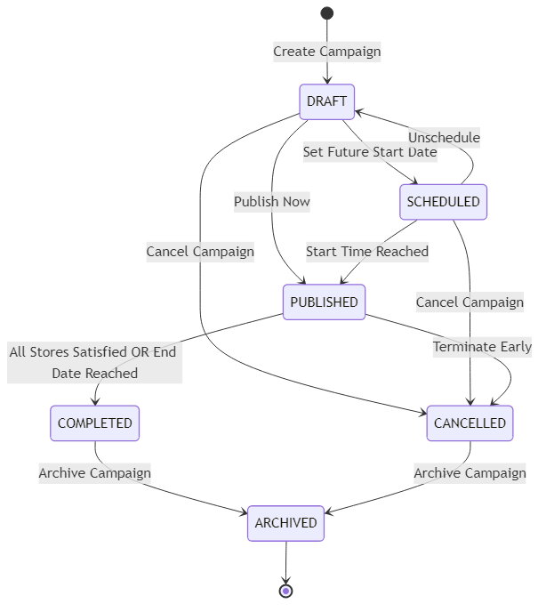

### A.2.2 Campaign State Definitions

| State | Description | Allowed Actions |
|-------|-------------|-----------------|
| **DRAFT** | Campaign being configured; not visible to stores | Edit all fields, delete, schedule, publish |
| **SCHEDULED** | Set to publish at a future date | Edit until publish time, unschedule, cancel |
| **PUBLISHED** | Active campaign; stores can execute | Add stores, monitor, terminate |
| **COMPLETED** | All stores satisfied or end date passed | View reports, archive |
| **CANCELLED** | Terminated before natural completion | View history, archive |
| **ARCHIVED** | Historical record; read-only | View only |

### A.2.3 Campaign Transition Triggers

| From | To | Trigger | Actor |
|------|-----|---------|-------|
| DRAFT | SCHEDULED | `campaign.schedule(startDate)` | Brand Admin |
| DRAFT | PUBLISHED | `campaign.publish()` | Brand Admin |
| SCHEDULED | PUBLISHED | System scheduler (cron) | System |
| PUBLISHED | COMPLETED | Rollup satisfies threshold OR `endDate <= now` | System |
| PUBLISHED | CANCELLED | `campaign.terminate(reason)` | Brand Admin |
| * | ARCHIVED | `campaign.archive()` | Brand Admin |

---

## A.3 Store Assignment States

Tracks each store's progress through a campaign from assignment to completion.

### A.3.1 StoreAssignment Status State Diagram

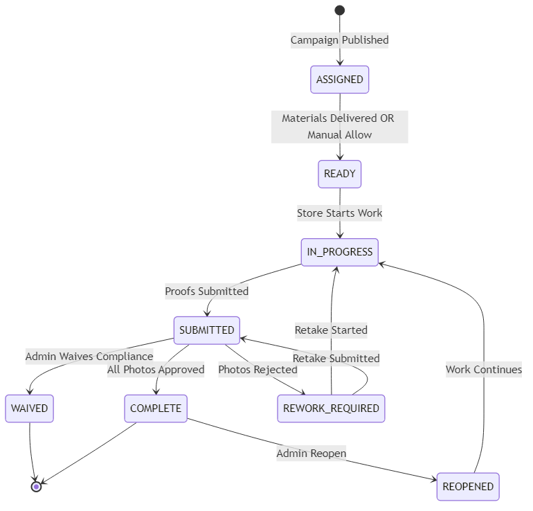

### A.3.2 StoreAssignment State Definitions

| State | Description | Store Can... | Admin Can... |
|-------|-------------|--------------|--------------|
| **ASSIGNED** | Store selected for campaign | View campaign details | Edit assignment |
| **READY** | Materials delivered; execution allowed | Begin installation | Force ready status |
| **IN_PROGRESS** | Store actively working | Capture photos, report issues | Monitor progress |
| **SUBMITTED** | All photos submitted for review | Wait for review | Review photos |
| **COMPLETE** | All requirements satisfied | View completion | Reopen if needed |
| **REWORK_REQUIRED** | Photos rejected; needs retry | View feedback, retake | Send reminders |
| **REOPENED** | Admin reopened for additional work | Continue execution | Close again |
| **WAIVED** | Admin bypassed verification | N/A | View waiver reason |

---

## A.4 Assignment Item States

Tracks individual kit items at a store through the fulfillment and execution lifecycle.

### A.4.1 AssignmentItem Status State Diagram

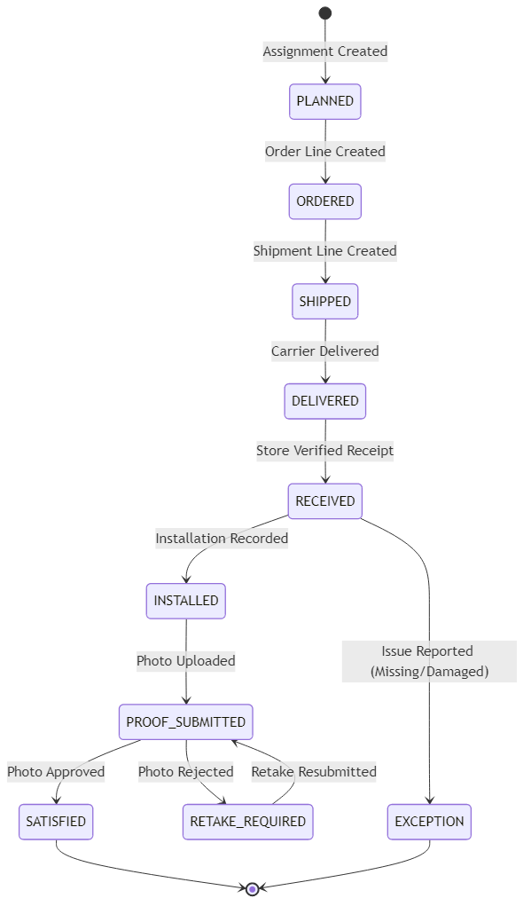

### A.4.2 AssignmentItem State Definitions

| State | Description | Next Expected Action |
|-------|-------------|---------------------|
| **PLANNED** | Item assigned to store, not yet ordered | PSP creates order |
| **ORDERED** | Order line exists in PSP system | PSP ships item |
| **SHIPPED** | Item in transit to store | Carrier delivers |
| **DELIVERED** | Carrier confirmed delivery | Store verifies receipt |
| **RECEIVED** | Store verified item received | Store installs |
| **INSTALLED** | Installation recorded | Store uploads photo |
| **PROOF_SUBMITTED** | Photo pending review | Admin reviews |
| **SATISFIED** | Photo approved; item complete | None |
| **RETAKE_REQUIRED** | Photo rejected; needs retry | Store retakes photo |
| **EXCEPTION** | Issue reported (escalated) | Issue resolution flow |

---

## A.5 Fulfillment States

Tracks order and shipment progress from PSP perspective.

### A.5.1 FulfillmentStatus State Diagram (Computed)

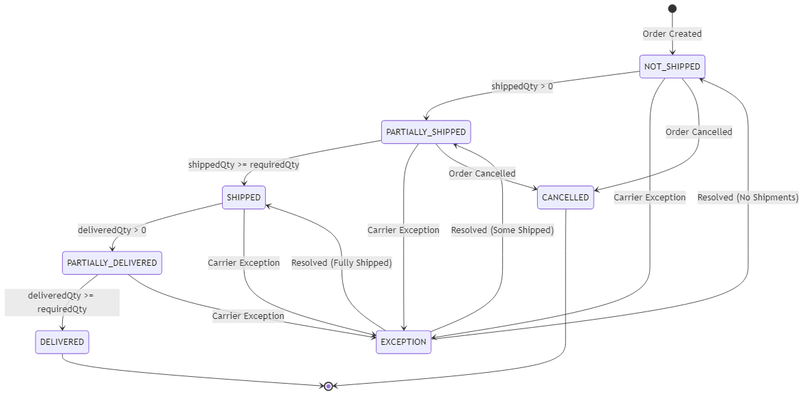

### A.5.2 FulfillmentStatus Computation Logic

| Status | Condition |
|--------|-----------|
| NOT_SHIPPED | `shippedQty = 0` |
| PARTIALLY_SHIPPED | `0 < shippedQty < requiredQty` |
| SHIPPED | `shippedQty >= requiredQty` |
| PARTIALLY_DELIVERED | `0 < deliveredQty < shippedQty` |
| DELIVERED | `deliveredQty >= requiredQty` |
| EXCEPTION | Carrier reports exception flag |
| CANCELLED | Order marked cancelled |

---

## A.6 Photo Review States

Tracks individual photo review workflow.

### A.6.1 PhotoReview Status State Diagram

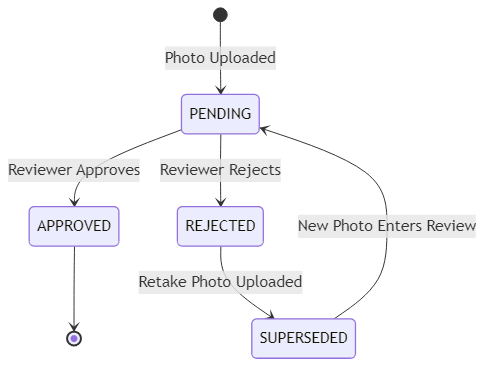

### A.6.2 PhotoReview State Definitions

| State | Description | Next Action |
|-------|-------------|-------------|
| **PENDING** | Photo submitted, awaiting review | Reviewer approves/rejects |
| **APPROVED** | Photo meets requirements | None (terminal) |
| **REJECTED** | Photo fails requirements | Store uploads retake |
| **SUPERSEDED** | Original replaced by retake | New photo reviewed |

### A.6.3 Rejection Reason Codes

| Code | Description |
|------|-------------|
| `BLURRY` | Image not in focus |
| `WRONG_ANGLE` | Incorrect camera angle |
| `OBSTRUCTED` | Item partially blocked |
| `WRONG_ITEM` | Incorrect item photographed |
| `NOT_INSTALLED` | Item not properly installed |
| `POOR_LIGHTING` | Insufficient lighting |
| `OTHER` | Free-text reason required |

---

## A.7 Issue Request States

Tracks issue reporting, triage, and resolution workflow.

### A.7.1 IssueRequest Status State Diagram

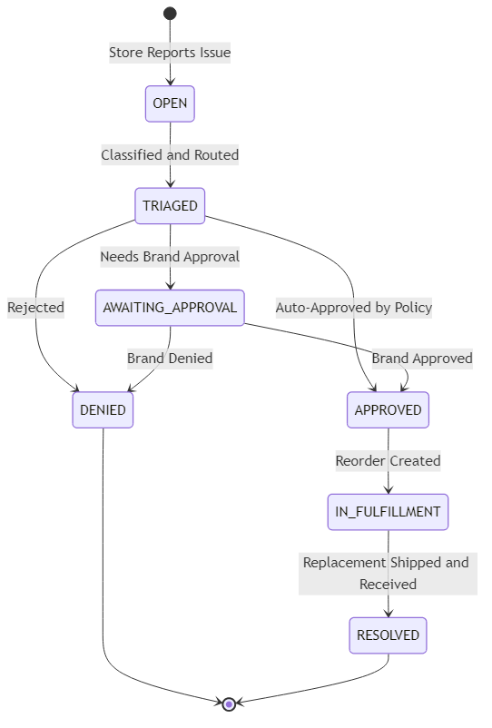

### A.7.2 IssueRequest State Definitions

| State | Description | Responsible Party |
|-------|-------------|-------------------|
| **OPEN** | Issue reported by store | System (auto-triage) |
| **TRIAGED** | Classified and routed | System / PSP Admin |
| **AWAITING_APPROVAL** | Requires brand approval | Brand Admin |
| **APPROVED** | Approved for reorder | PSP Operations |
| **DENIED** | Issue rejected | None (closed) |
| **IN_FULFILLMENT** | Replacement being shipped | PSP Operations |
| **RESOLVED** | Replacement received | None (closed) |

### A.7.3 Issue Type Classifications

| Type | Description | Auto-Approve Eligible |
|------|-------------|----------------------|
| MISSING | Item not in shipment | Yes (if < threshold) |
| DAMAGED | Item arrived damaged | Yes (with photo) |
| INCORRECT | Wrong item shipped | No (requires review) |
| PACKAGING | Packaging issue only | No |

---

## A.8 Deinstall Task States

Tracks end-of-campaign material removal workflow.

### A.8.1 DeinstallTask Status State Diagram

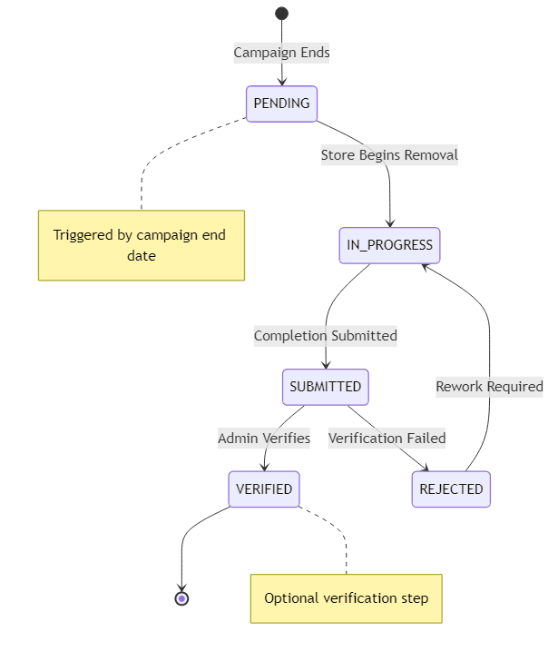

### A.8.2 DeinstallTask State Definitions

| State | Description |
|-------|-------------|
| **PENDING** | Task created when campaign ends |
| **IN_PROGRESS** | Store actively removing materials |
| **SUBMITTED** | Store marked removal complete |
| **VERIFIED** | Admin confirmed removal (optional) |
| **REJECTED** | Removal not complete; rework needed |

---

## A.9 Store Order States

Tracks PSP order processing workflow.

### A.9.1 StoreOrder Status State Diagram

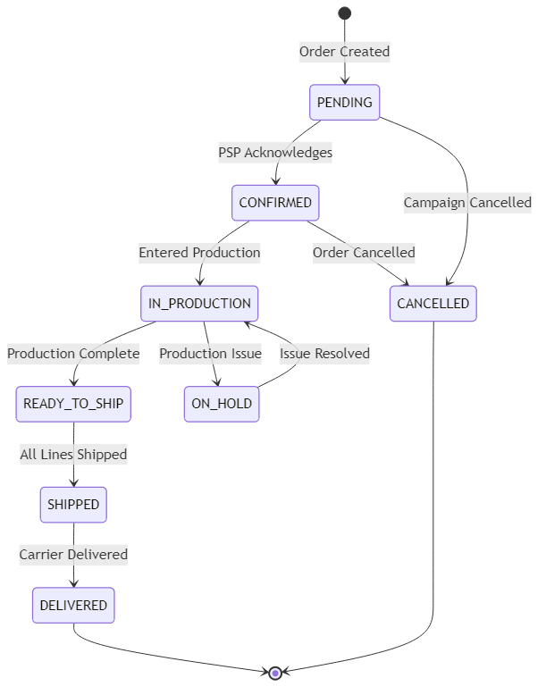

### A.9.2 StoreOrder State Definitions

| State | PSP Action | Store Visibility |
|-------|------------|------------------|
| **PENDING** | Review order details | "Order Placed" |
| **CONFIRMED** | Acknowledge receipt | "Order Confirmed" |
| **IN_PRODUCTION** | Produce materials | "In Production" |
| **READY_TO_SHIP** | Pick, pack, ship | "Ready to Ship" |
| **SHIPPED** | Tracking provided | "Shipped" with tracking |
| **DELIVERED** | Carrier confirmed | "Delivered" |
| **ON_HOLD** | Resolve issue | "Delayed" |
| **CANCELLED** | Order cancelled | "Cancelled" |

---

## A.10 State Interrelationships

### A.10.1 Status Ownership by Module

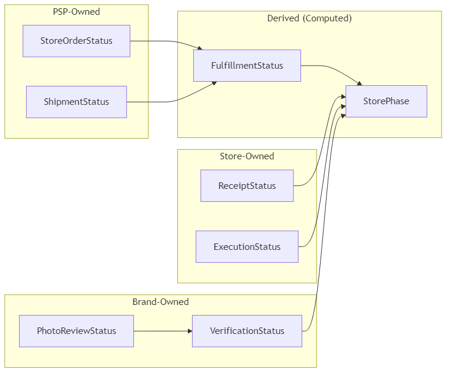

### A.10.2 StorePhase Computation

The `StorePhase` is a computed rollup representing overall store progress:

| Phase | Criteria |
|-------|----------|
| **PENDING** | Assigned but materials not shipped |
| **SHIPPING** | Materials shipped, not delivered |
| **RECEIVING** | Delivered, receipt not complete |
| **EXECUTING** | Receipt complete, installation in progress |
| **VERIFYING** | Photos submitted, awaiting review |
| **COMPLETE** | All items satisfied or waived |
| **EXCEPTION** | Has unresolved issues |

---

*Document Version: 1.0*
*Last Updated: 2026-01-01*
*Source: SOW Diagram Collection, SUPP-001, SUPP-002*


---
# Appendix B: Notification Matrix

## B.1 Overview

This appendix defines all system-generated notifications, their recipients, delivery methods, and trigger conditions. Notifications ensure timely communication across all user roles throughout the campaign lifecycle.

### Notification Channels

| Channel | Description | Use Case |
|---------|-------------|----------|
| **Email** | Standard email delivery | Non-urgent notifications, summaries |
| **Push** | Mobile/PWA push notification | Time-sensitive store actions |
| **In-App** | Notification center / badge | All notifications (persistent) |
| **SMS** | Text message (optional) | Critical escalations (premium) |
| **Webhook** | API callback to external systems | Integration with third-party systems |

### Notification Priority Levels

| Priority | Description | Delivery |
|----------|-------------|----------|
| **CRITICAL** | Requires immediate action | Push + Email + In-App |
| **HIGH** | Important, action within 24h | Push + In-App |
| **NORMAL** | Standard notification | In-App + Email (digest) |
| **LOW** | Informational only | In-App only |

---

## B.2 Campaign Lifecycle Notifications

| Event | PSP Admin | Brand Admin | Campaign Mgr | Regional Mgr | Store Mgr | Store Staff | Method | Priority |
|-------|:---------:|:-----------:|:------------:|:------------:|:---------:|:-----------:|--------|----------|
| Campaign Created (Draft) | - | In-App | In-App | - | - | - | In-App | LOW |
| Campaign Published | Email | Email, Push | Email, Push | In-App | Push | Push | Multi | HIGH |
| Campaign Nearing End (7d) | - | Email | Email | In-App | Push | In-App | Multi | NORMAL |
| Campaign Ending Today | - | Push | Push | Push | Push | Push | Push | HIGH |
| Campaign Completed | Email | Email, In-App | Email, In-App | In-App | In-App | - | Multi | NORMAL |
| Campaign Cancelled | Email | Email, Push | Email, Push | In-App | Push | Push | Multi | HIGH |
| Campaign Archived | - | In-App | In-App | - | - | - | In-App | LOW |

---

## B.3 Store Assignment Notifications

| Event | PSP Admin | Brand Admin | Campaign Mgr | Regional Mgr | Store Mgr | Store Staff | Method | Priority |
|-------|:---------:|:-----------:|:------------:|:------------:|:---------:|:-----------:|--------|----------|
| Store Assigned to Campaign | - | In-App | In-App | In-App | Email, Push | Push | Multi | HIGH |
| Store Removed from Campaign | - | In-App | In-App | In-App | Email, Push | Push | Multi | NORMAL |
| Store Ready (Materials Delivered) | - | - | - | - | Push | Push | Push | HIGH |
| Store Started Installation | - | - | In-App | In-App | - | - | In-App | LOW |
| Store Submitted for Review | - | In-App | Push | Push | In-App | - | Multi | NORMAL |
| Store Marked Complete | - | In-App | In-App | In-App | Push | Push | Multi | NORMAL |
| Store Reopened | - | In-App | In-App | In-App | Push | Push | Multi | HIGH |
| Store Waived | - | In-App | In-App | In-App | Email | - | Multi | NORMAL |

---

## B.4 Fulfillment Notifications

| Event | PSP Admin | Brand Admin | Campaign Mgr | Regional Mgr | Store Mgr | Store Staff | Method | Priority |
|-------|:---------:|:-----------:|:------------:|:------------:|:---------:|:-----------:|--------|----------|
| Order Created | In-App | - | - | - | - | - | In-App | NORMAL |
| Order Confirmed | - | - | - | - | Email | - | Email | LOW |
| Order Shipped | In-App | - | - | - | Push, Email | Push | Multi | HIGH |
| Tracking Updated | - | - | - | - | In-App | In-App | In-App | LOW |
| Order Delivered | In-App | - | - | - | Push | Push | Push | HIGH |
| Delivery Exception | Push | In-App | In-App | In-App | Push, Email | Push | Multi | CRITICAL |
| Order Cancelled | In-App | Email | Email | In-App | Push, Email | Push | Multi | HIGH |
| Partial Shipment Sent | In-App | - | - | - | Push | Push | Multi | NORMAL |

---

## B.5 Issue & Reorder Notifications

| Event | PSP Admin | Brand Admin | Campaign Mgr | Regional Mgr | Store Mgr | Store Staff | Method | Priority |
|-------|:---------:|:-----------:|:------------:|:------------:|:---------:|:-----------:|--------|----------|
| Issue Reported | Push | In-App | In-App | Push | In-App | In-App | Multi | HIGH |
| Issue Needs Approval | - | Push, Email | Push, Email | - | - | - | Multi | HIGH |
| Issue Approved | In-App | In-App | In-App | In-App | Push | Push | Multi | NORMAL |
| Issue Denied | - | In-App | In-App | In-App | Push, Email | Push | Multi | NORMAL |
| Reorder Created | Push | In-App | In-App | - | In-App | - | Multi | NORMAL |
| Replacement Shipped | In-App | - | - | - | Push | Push | Multi | HIGH |
| Issue Resolved | In-App | In-App | In-App | In-App | Push | Push | Multi | NORMAL |

---

## B.6 Photo Review & Verification Notifications

| Event | PSP Admin | Brand Admin | Campaign Mgr | Regional Mgr | Store Mgr | Store Staff | Method | Priority |
|-------|:---------:|:-----------:|:------------:|:------------:|:---------:|:-----------:|--------|----------|
| Photo Submitted | - | In-App | In-App | Push | - | - | Multi | NORMAL |
| Photos Pending Review (Batch) | - | Email | Email | Push, Email | - | - | Multi | HIGH |
| Photo Approved | - | - | - | - | In-App | In-App | In-App | LOW |
| Photo Rejected | - | - | - | - | Push | Push | Push | HIGH |
| Retake Requested | - | In-App | In-App | In-App | Push, Email | Push | Multi | CRITICAL |
| Retake Submitted | - | In-App | In-App | Push | In-App | - | Multi | NORMAL |
| All Photos Approved | - | In-App | In-App | In-App | Push | Push | Multi | NORMAL |
| Review Deadline Approaching | - | Push | Push | Push | - | - | Push | HIGH |

---

## B.7 User & Access Notifications

| Event | PSP Admin | Brand Admin | Campaign Mgr | Regional Mgr | Store Mgr | Store Staff | Method | Priority |
|-------|:---------:|:-----------:|:------------:|:------------:|:---------:|:-----------:|--------|----------|
| User Invited | Email | Email | Email | Email | Email | Email | Email | HIGH |
| User Activated | In-App | In-App | In-App | In-App | In-App | In-App | In-App | LOW |
| User Deactivated | Email | Email | Email | Email | Email | Email | Email | HIGH |
| Password Reset Requested | Email | Email | Email | Email | Email | Email | Email | CRITICAL |
| Role Changed | - | Email | Email | Email | Email | Email | Email | NORMAL |
| Access Revoked | Email | Email | Email | Email | Email | Email | Email | HIGH |

---

## B.8 Report & Export Notifications

| Event | PSP Admin | Brand Admin | Campaign Mgr | Regional Mgr | Store Mgr | Store Staff | Method | Priority |
|-------|:---------:|:-----------:|:------------:|:------------:|:---------:|:-----------:|--------|----------|
| Scheduled Report Ready | Email | Email | Email | Email | - | - | Email | NORMAL |
| Export Complete | Email | Email | Email | Email | Email | - | Email | NORMAL |
| Export Failed | Email | Email | Email | Email | - | - | Email | HIGH |
| Dashboard Threshold Alert | Push | Push | Push | Push | - | - | Push | HIGH |

---

## B.9 Escalation Notifications

| Event | PSP Admin | Brand Admin | Campaign Mgr | Regional Mgr | Store Mgr | Store Staff | Method | Priority |
|-------|:---------:|:-----------:|:------------:|:------------:|:---------:|:-----------:|--------|----------|
| Store Overdue (No Activity) | - | Email | Email | Push, Email | Push, Email | Push | Multi | CRITICAL |
| Retake Overdue (48h) | - | Push | Push | Push, Email | Push, Email | Push | Multi | CRITICAL |
| Campaign Compliance Risk | - | Push, Email | Push, Email | Push | - | - | Multi | CRITICAL |
| SLA Breach Warning | Push, Email | Push, Email | Push | - | - | - | Multi | CRITICAL |

---

## B.10 Deinstall Notifications

| Event | PSP Admin | Brand Admin | Campaign Mgr | Regional Mgr | Store Mgr | Store Staff | Method | Priority |
|-------|:---------:|:-----------:|:------------:|:------------:|:---------:|:-----------:|--------|----------|
| Deinstall Task Created | - | In-App | In-App | In-App | Push | Push | Multi | HIGH |
| Deinstall Reminder (3d before) | - | - | - | - | Push | Push | Push | NORMAL |
| Deinstall Due Today | - | In-App | In-App | In-App | Push | Push | Multi | HIGH |
| Deinstall Overdue | - | Email | Email | Push, Email | Push, Email | Push | Multi | CRITICAL |
| Deinstall Completed | - | In-App | In-App | In-App | In-App | - | In-App | NORMAL |

---

## B.11 Notification Preferences

### B.11.1 User-Configurable Preferences

Users can customize notification delivery for non-critical events:

| Preference | Options | Default |
|------------|---------|---------|
| Email Frequency | Immediate, Daily Digest, Weekly | Immediate |
| Push Notifications | On, Off | On |
| Quiet Hours | Time range (e.g., 10pm-7am) | None |
| Email Format | HTML, Plain Text | HTML |

### B.11.2 Non-Configurable (Mandatory) Notifications

The following notification types cannot be disabled:

- Password reset
- Account deactivation
- Critical escalations (SLA breach)
- Security alerts
- System maintenance

---

## B.12 Notification Templates

### B.12.1 Email Subject Line Patterns

| Event Category | Subject Pattern |
|----------------|-----------------|
| Campaign | `[NewPOPSys] {Campaign Name}: {Action}` |
| Store | `[NewPOPSys] Store {Store Name}: {Action Required}` |
| Fulfillment | `[NewPOPSys] Order #{OrderID}: {Status Update}` |
| Issue | `[NewPOPSys] Issue #{IssueID}: {Status}` |
| User | `[NewPOPSys] Account: {Action}` |
| Escalation | `[URGENT] NewPOPSys: {Escalation Type}` |

### B.12.2 Push Notification Character Limits

| Platform | Title Limit | Body Limit |
|----------|-------------|------------|
| iOS | 50 chars | 150 chars |
| Android | 65 chars | 240 chars |
| Web Push | 50 chars | 120 chars |

---

## B.13 Webhook Events

For integration users, the following events trigger webhooks:

| Event | Payload | Retry Policy |
|-------|---------|--------------|
| `campaign.published` | Campaign object | 3 retries, exponential backoff |
| `campaign.completed` | Campaign object + summary | 3 retries |
| `order.created` | Order + lines | 3 retries |
| `order.shipped` | Order + shipment + tracking | 3 retries |
| `order.delivered` | Order + delivery confirmation | 3 retries |
| `issue.created` | Issue object | 3 retries |
| `issue.resolved` | Issue object + resolution | 3 retries |
| `store.completed` | StoreAssignment + rollup | 3 retries |
| `photo.submitted` | Photo metadata (no image) | 3 retries |
| `photo.reviewed` | Photo + decision | 3 retries |

---

## B.14 Notification Delivery SLAs

| Priority | Delivery Target | Retry Attempts |
|----------|-----------------|----------------|
| CRITICAL | < 30 seconds | 5 |
| HIGH | < 2 minutes | 3 |
| NORMAL | < 10 minutes | 3 |
| LOW | < 1 hour | 2 |

---

*Document Version: 1.0*
*Last Updated: 2026-01-01*
*Source: SOW Functional Requirements, SUPP-002*


---
# Appendix C: Export Formats

## C.1 Overview

This appendix defines the specifications for all data exports supported by the NewPOPSys platform. Exports enable offline analysis, integration with external systems, and archival of campaign data.

### Supported Export Formats

| Format | Extension | Use Case | Max Records |
|--------|-----------|----------|-------------|
| CSV | `.csv` | Data analysis, spreadsheet import | 100,000 |
| Excel | `.xlsx` | Formatted reports with multiple sheets | 50,000 |
| PDF | `.pdf` | Printable reports, compliance documentation | N/A |
| JSON | `.json` | API integration, data migration | 100,000 |

### Export Access by Role

| Role | Campaign Data | Store Data | Order Data | Photo Data | Financial |
|------|:-------------:|:----------:|:----------:|:----------:|:---------:|
| Platform Admin | Full | Full | Full | Full | Full |
| PSP Admin | Full | Full | Full | Metadata | Full |
| Brand Admin | Own Brands | Own Brands | Own Brands | Full | Limited |
| Campaign Manager | Assigned | Assigned | Assigned | Full | No |
| Regional Manager | Region Only | Region Only | Region Only | Region Only | No |
| Store Manager | Own Store | Own Store | Own Store | Own Store | No |

---

## C.2 CSV Export Specifications

### C.2.1 General CSV Format

| Property | Specification |
|----------|---------------|
| Encoding | UTF-8 with BOM |
| Delimiter | Comma (`,`) |
| Quote Character | Double quote (`"`) |
| Escape Character | Double quote (`""`) |
| Line Ending | CRLF (`\r\n`) |
| Header Row | Required (first row) |
| Date Format | ISO 8601 (`YYYY-MM-DD`) |
| DateTime Format | ISO 8601 (`YYYY-MM-DDTHH:mm:ssZ`) |
| Boolean Format | `true` / `false` |
| Null Values | Empty string |

### C.2.2 Campaign Export (CSV)

**Filename Pattern:** `campaigns_{tenant}_{YYYYMMDD}.csv`

| Column | Type | Description |
|--------|------|-------------|
| campaign_id | ULID | Unique campaign identifier |
| campaign_name | String | Campaign display name |
| brand_name | String | Associated brand name |
| campaign_type | Enum | PROMOTIONAL / CORE_BRANDING |
| status | Enum | Current campaign status |
| start_date | Date | Campaign start date |
| end_date | Date | Campaign end date (nullable) |
| store_count | Integer | Total assigned stores |
| completed_count | Integer | Stores completed |
| completion_rate | Decimal | Percentage complete (0.00-100.00) |
| created_at | DateTime | Creation timestamp |
| created_by | String | Creator email |
| published_at | DateTime | Publication timestamp (nullable) |

### C.2.3 Store Assignment Export (CSV)

**Filename Pattern:** `store_assignments_{campaign_id}_{YYYYMMDD}.csv`

| Column | Type | Description |
|--------|------|-------------|
| assignment_id | ULID | Unique assignment identifier |
| campaign_id | ULID | Parent campaign ID |
| campaign_name | String | Campaign display name |
| store_id | ULID | Store identifier |
| store_number | String | Store number/code |
| store_name | String | Store display name |
| region | String | Region name |
| district | String | District name (nullable) |
| territory | String | Territory name (nullable) |
| status | Enum | Assignment status |
| phase | Enum | Computed store phase |
| items_total | Integer | Total kit items |
| items_received | Integer | Items received |
| items_installed | Integer | Items installed |
| items_satisfied | Integer | Items approved |
| photos_submitted | Integer | Photos uploaded |
| photos_approved | Integer | Photos approved |
| photos_pending | Integer | Photos awaiting review |
| photos_rejected | Integer | Photos rejected |
| issues_open | Integer | Open issue count |
| assigned_at | DateTime | Assignment timestamp |
| completed_at | DateTime | Completion timestamp (nullable) |

### C.2.4 Order Export (CSV)

**Filename Pattern:** `orders_{campaign_id}_{YYYYMMDD}.csv`

| Column | Type | Description |
|--------|------|-------------|
| order_id | ULID | Order identifier |
| order_number | String | Human-readable order number |
| campaign_id | ULID | Campaign identifier |
| store_id | ULID | Store identifier |
| store_number | String | Store number |
| store_name | String | Store name |
| status | Enum | Order status |
| item_count | Integer | Total line items |
| total_quantity | Integer | Total units ordered |
| shipped_quantity | Integer | Units shipped |
| delivered_quantity | Integer | Units delivered |
| created_at | DateTime | Order creation timestamp |
| confirmed_at | DateTime | PSP confirmation (nullable) |
| shipped_at | DateTime | First shipment (nullable) |
| delivered_at | DateTime | Delivery confirmed (nullable) |
| tracking_numbers | String | Comma-separated tracking numbers |
| carrier | String | Carrier name |

### C.2.5 Issue Export (CSV)

**Filename Pattern:** `issues_{campaign_id}_{YYYYMMDD}.csv`

| Column | Type | Description |
|--------|------|-------------|
| issue_id | ULID | Issue identifier |
| issue_number | String | Human-readable issue number |
| campaign_id | ULID | Campaign identifier |
| store_id | ULID | Store identifier |
| store_number | String | Store number |
| issue_type | Enum | MISSING / DAMAGED / INCORRECT / PACKAGING |
| status | Enum | Issue status |
| item_sku | String | Affected item SKU |
| item_name | String | Affected item name |
| quantity_affected | Integer | Units affected |
| reported_by | String | Reporter email |
| reported_at | DateTime | Report timestamp |
| resolution | String | Resolution notes (nullable) |
| resolved_at | DateTime | Resolution timestamp (nullable) |
| reorder_id | ULID | Linked reorder (nullable) |

---

## C.3 Excel Export Specifications

### C.3.1 General Excel Format

| Property | Specification |
|----------|---------------|
| Format | Office Open XML (`.xlsx`) |
| Excel Version | Compatible with Excel 2010+ |
| Max Rows per Sheet | 50,000 |
| Date Format | Localized (user preference) |
| Number Format | Localized (user preference) |
| Header Row | Frozen, bold, filtered |

### C.3.2 Campaign Summary Report (XLSX)

**Filename Pattern:** `campaign_report_{campaign_name}_{YYYYMMDD}.xlsx`

**Sheet 1: Summary**

| Row | Content |
|-----|---------|
| 1-5 | Report header (title, date range, generated by) |
| 7 | Campaign details (name, brand, dates) |
| 9-15 | KPI summary (stores, completion %, issues, etc.) |

**Sheet 2: Store Details**

Full store assignment data with conditional formatting:
- Green: Complete stores
- Yellow: In progress
- Red: Overdue/Exception

**Sheet 3: Item Breakdown**

Kit item summary with quantities:
- Ordered vs Shipped vs Delivered vs Installed

**Sheet 4: Issues**

All issues with status and resolution

**Sheet 5: Timeline**

Daily progress chart data

### C.3.3 Compliance Report (XLSX)

**Filename Pattern:** `compliance_report_{campaign_name}_{YYYYMMDD}.xlsx`

**Sheet 1: Executive Summary**
- Overall compliance rate
- Regional breakdown
- Risk highlights

**Sheet 2: Store Compliance**

| Column | Description |
|--------|-------------|
| Store | Store name and number |
| Region | Geographic region |
| Items Required | Total required items |
| Items Satisfied | Approved items |
| Compliance % | Satisfaction rate |
| Status | COMPLIANT / NON-COMPLIANT / WAIVED |
| Outstanding Items | Items still pending |
| Days Since Start | Days in campaign |

**Sheet 3: Non-Compliant Stores**

Filtered list of non-compliant stores with:
- Missing items detail
- Pending retakes
- Open issues
- Last activity date

**Sheet 4: Waiver Log**

All waived items with justification

---

## C.4 PDF Report Specifications

### C.4.1 General PDF Format

| Property | Specification |
|----------|---------------|
| Page Size | Letter (8.5" x 11") or A4 |
| Orientation | Portrait (default) or Landscape |
| Margins | 0.75" all sides |
| Font | Sans-serif (Helvetica/Arial) |
| Logo | Tenant logo in header |
| Page Numbers | Bottom right |
| Generated Date | Bottom left |

### C.4.2 Campaign Completion Certificate (PDF)

**Purpose:** Official documentation of successful campaign completion at a store.

**Template Structure:**


### C.4.3 Photo Proof Report (PDF)

**Purpose:** Visual documentation of installed materials with approval status.

**Template Structure:**

- Page 1: Cover page with campaign and store info
- Pages 2-N: Photo grid (2x2 per page)
  - Photo thumbnail (300x300px)
  - Item name
  - Location slot
  - Status (Approved/Rejected)
  - Reviewer notes
  - Timestamp

### C.4.4 Executive Summary Report (PDF)

**Purpose:** High-level campaign performance for stakeholders.

**Sections:**

1. **Cover Page**
   - Campaign name, brand, date range
   - Report generated date

2. **KPI Dashboard** (1 page)
   - Total stores / Complete / In Progress
   - Completion rate gauge chart
   - Issue rate
   - Photo approval rate

3. **Regional Breakdown** (1 page)
   - Bar chart by region
   - Top/bottom performers

4. **Timeline** (1 page)
   - Cumulative completion curve
   - Daily submission rates

5. **Issues Summary** (1 page)
   - Issue counts by type
   - Resolution rates

6. **Appendix** (as needed)
   - Detailed store list

---

## C.5 JSON Export Specifications

### C.5.1 General JSON Format

| Property | Specification |
|----------|---------------|
| Encoding | UTF-8 |
| Format | Pretty-printed (2-space indent) |
| Date Format | ISO 8601 |
| Null Handling | Explicit `null` |
| Empty Arrays | `[]` |
| Root Element | Object with metadata + data array |

### C.5.2 Standard JSON Wrapper

```json
{
  "export": {
    "type": "campaign_data",
    "version": "1.0",
    "generated_at": "2026-01-01T12:00:00Z",
    "generated_by": "user@example.com",
    "tenant_id": "01ABC...",
    "filters": {
      "campaign_id": "01DEF...",
      "date_from": "2026-01-01",
      "date_to": "2026-01-31"
    },
    "record_count": 150,
    "page": 1,
    "total_pages": 1
  },
  "data": [
    { ... },
    { ... }
  ]
}
```

### C.5.3 Campaign Object (JSON)

```json
{
  "id": "01HXYZ...",
  "name": "Summer 2026 Promo",
  "brand": {
    "id": "01HABC...",
    "name": "Brand Co"
  },
  "type": "PROMOTIONAL",
  "status": "PUBLISHED",
  "dates": {
    "start": "2026-06-01",
    "end": "2026-08-31"
  },
  "kit": {
    "id": "01HKIT...",
    "item_count": 5,
    "items": [
      {
        "id": "01HITM...",
        "sku": "WC-24x36-001",
        "name": "Window Cling 24x36",
        "quantity": 2
      }
    ]
  },
  "rollup": {
    "stores_total": 500,
    "stores_complete": 425,
    "stores_in_progress": 50,
    "stores_not_started": 25,
    "completion_rate": 85.0
  },
  "metadata": {
    "created_at": "2026-05-01T10:00:00Z",
    "created_by": "admin@example.com",
    "published_at": "2026-05-15T09:00:00Z"
  }
}
```

### C.5.4 Store Assignment Object (JSON)

```json
{
  "id": "01HASG...",
  "campaign_id": "01HXYZ...",
  "store": {
    "id": "01HSTR...",
    "number": "1234",
    "name": "Downtown Location",
    "address": {
      "street": "123 Main St",
      "city": "Anytown",
      "state": "CA",
      "postal_code": "90210",
      "country": "US"
    },
    "geography": {
      "region": "West",
      "district": "SoCal",
      "territory": "LA Metro"
    }
  },
  "status": "COMPLETE",
  "phase": "COMPLETE",
  "items": {
    "total": 5,
    "received": 5,
    "installed": 5,
    "satisfied": 5
  },
  "photos": {
    "required": 5,
    "submitted": 6,
    "approved": 5,
    "rejected": 1
  },
  "issues": {
    "total": 1,
    "open": 0,
    "resolved": 1
  },
  "timeline": {
    "assigned_at": "2026-06-01T00:00:00Z",
    "ready_at": "2026-06-05T14:30:00Z",
    "started_at": "2026-06-06T10:00:00Z",
    "submitted_at": "2026-06-06T16:00:00Z",
    "completed_at": "2026-06-07T09:30:00Z"
  }
}
```

---

## C.6 Data Export Schemas

### C.6.1 Available Export Endpoints

| Endpoint | Description | Formats |
|----------|-------------|---------|
| `/exports/campaigns` | Campaign list with rollups | CSV, XLSX, JSON |
| `/exports/campaigns/{id}/stores` | Store assignments for campaign | CSV, XLSX, JSON |
| `/exports/campaigns/{id}/orders` | Orders for campaign | CSV, XLSX, JSON |
| `/exports/campaigns/{id}/issues` | Issues for campaign | CSV, XLSX, JSON |
| `/exports/campaigns/{id}/photos` | Photo metadata (not images) | CSV, JSON |
| `/exports/campaigns/{id}/report` | Formatted report | XLSX, PDF |
| `/exports/stores/{id}/history` | Store campaign history | CSV, JSON |

### C.6.2 Export Request Parameters

| Parameter | Type | Description |
|-----------|------|-------------|
| `format` | Enum | csv, xlsx, pdf, json |
| `date_from` | Date | Filter start date |
| `date_to` | Date | Filter end date |
| `status` | Enum[] | Filter by status(es) |
| `region` | String[] | Filter by region(s) |
| `include_photos` | Boolean | Include photo URLs (JSON only) |
| `page` | Integer | Page number (pagination) |
| `per_page` | Integer | Records per page (max 10000) |

### C.6.3 Export Response

```json
{
  "export_id": "01HEXP...",
  "status": "PROCESSING",
  "progress": 45,
  "estimated_completion": "2026-01-01T12:05:00Z",
  "download_url": null,
  "expires_at": null
}
```

When complete:

```json
{
  "export_id": "01HEXP...",
  "status": "COMPLETE",
  "progress": 100,
  "completed_at": "2026-01-01T12:03:00Z",
  "download_url": "https://cdn.example.com/exports/01HEXP....csv",
  "expires_at": "2026-01-02T12:03:00Z",
  "file_size_bytes": 1048576,
  "record_count": 5000
}
```

---

## C.7 Photo Export Specifications

### C.7.1 Photo Metadata Export (CSV/JSON)

Photos are exported as metadata with signed URLs (not embedded images).

| Field | Description |
|-------|-------------|
| photo_id | Unique photo identifier |
| assignment_id | Parent assignment |
| item_id | Associated kit item |
| location_slot | Location slot name |
| status | PENDING / APPROVED / REJECTED |
| original_url | Signed URL (expires 24h) |
| thumbnail_url | Signed thumbnail URL |
| uploaded_at | Upload timestamp |
| reviewed_at | Review timestamp |
| reviewer | Reviewer email |
| rejection_reason | Reason code (if rejected) |

### C.7.2 Photo Archive Export (ZIP)

For bulk photo download, a ZIP archive is generated:

**Structure:**


**Manifest.json:**
```json
{
  "campaign_id": "01HXYZ...",
  "export_date": "2026-01-01",
  "total_photos": 2500,
  "total_size_mb": 1250,
  "stores": [
    {
      "store_number": "1234",
      "photo_count": 5,
      "files": [
        {
          "filename": "item_ABC_slot_1.jpg",
          "item_sku": "WC-24x36-001",
          "status": "APPROVED"
        }
      ]
    }
  ]
}
```

---

## C.8 Scheduled Exports

### C.8.1 Schedule Configuration

| Field | Description |
|-------|-------------|
| frequency | DAILY / WEEKLY / MONTHLY |
| day_of_week | For weekly (0-6) |
| day_of_month | For monthly (1-28) |
| time | UTC time (HH:MM) |
| format | Export format |
| recipients | Email addresses |
| filters | Standard filter criteria |

### C.8.2 Delivery Options

| Option | Description |
|--------|-------------|
| Email Attachment | Attached to email (max 10MB) |
| Email Link | Download link in email |
| SFTP | Upload to configured SFTP server |
| Webhook | POST to configured URL |
| S3 Bucket | Upload to customer S3 bucket |

---

*Document Version: 1.0*
*Last Updated: 2026-01-01*
*Source: SOW Functional Requirements, SUPP-002*


---
# Appendix D: Glossary

## D.1 Abbreviations and Acronyms

| Abbreviation | Full Term | Description |
|--------------|-----------|-------------|
| **API** | Application Programming Interface | Standard protocol for software component communication |
| **AWS** | Amazon Web Services | Cloud computing platform used for hosting and storage |
| **BullMQ** | Bull Message Queue | Queue library for Node.js based on Redis for background jobs |
| **CI/CD** | Continuous Integration / Continuous Deployment | Automated software delivery pipeline |
| **CSV** | Comma-Separated Values | Plain text data format for tabular data |
| **DDL** | Data Definition Language | SQL statements for schema definition |
| **E2E** | End-to-End | Testing methodology covering full user flows |
| **ERD** | Entity Relationship Diagram | Database schema visualization |
| **HMAC** | Hash-based Message Authentication Code | Cryptographic authentication mechanism for webhooks |
| **JSON** | JavaScript Object Notation | Lightweight data interchange format |
| **JSONB** | JSON Binary | PostgreSQL binary JSON data type with indexing |
| **JTBD** | Jobs To Be Done | Product development methodology focusing on user goals |
| **LTS** | Long-Term Support | Software version with extended maintenance |
| **MIS** | Management Information System | Business reporting and analytics system |
| **NFR** | Non-Functional Requirement | System quality attributes (performance, security, etc.) |
| **ORM** | Object-Relational Mapping | Database abstraction layer (Drizzle) |
| **OTLP** | OpenTelemetry Protocol | Standard for transmitting telemetry data |
| **PK** | Primary Key | Unique database record identifier |
| **POP** | Point of Purchase | Marketing materials displayed at retail locations |
| **PSP** | Print Service Provider | Company producing and fulfilling POP materials |
| **PWA** | Progressive Web App | Web application with native app capabilities |
| **RBAC** | Role-Based Access Control | Permission system based on user roles |
| **REST** | Representational State Transfer | API architectural style |
| **S3** | Simple Storage Service | AWS object storage for files and photos |
| **SDK** | Software Development Kit | Tools for building applications |
| **SKU** | Stock Keeping Unit | Unique product identifier |
| **SLA** | Service Level Agreement | Performance and availability guarantees |
| **SOW** | Statement of Work | Project scope and requirements document |
| **SQL** | Structured Query Language | Database query language |
| **SRS** | Software Requirements Specification | This document |
| **SSO** | Single Sign-On | Unified authentication across systems |
| **SUPP** | Supplemental Specification | Additional technical requirements document |
| **TBD** | To Be Determined | Placeholder for undefined requirements |
| **UI** | User Interface | Visual elements users interact with |
| **ULID** | Universally Unique Lexicographically Sortable Identifier | Time-ordered unique ID format |
| **UUID** | Universally Unique Identifier | Standard unique ID format |
| **UX** | User Experience | Overall user satisfaction and usability |
| **XLSX** | Excel Spreadsheet Format | Microsoft Excel file format |
| **XML** | Extensible Markup Language | Data interchange format |

---

## D.2 Domain Terminology

### D.2.1 Core Business Entities

| Term | Definition |
|------|------------|
| **PspTenant** | Root tenant representing a PSP organization. The paying customer. All brands, users, and data belong to a tenant. Multi-tenant isolation is enforced at the database level. |
| **Brand** | A client brand managed by the PSP. Each brand has its own stores, campaigns, and settings. Represents the end customer of the PSP. |
| **Store** | A physical retail location where POP materials are installed. Identified by store number within a brand. Has geographic hierarchy assignment. |
| **Campaign** | A brand's promotional program with defined timeline, participating stores, and materials to install. The primary unit of work in the system. |
| **Kit** | The collection of POP items to be shipped and installed for a campaign. Defined by Brand Admin during campaign setup. |
| **KitItem** | A single item within a kit (e.g., "Window Cling 24x36", "Counter Card"). Has SKU, quantity, and photo requirements. |

### D.2.2 Campaign Types

| Term | Definition |
|------|------------|
| **Promotional Campaign** | Campaign with a defined end date that triggers deinstall workflow upon expiration. Materials are temporary. Also called "Expiring Campaign". |
| **Core Branding Campaign** | Campaign with no end date. Deinstall only triggered manually by admin action. Materials are permanent branding elements. Also called "Non-expiring Campaign" or "Evergreen Campaign". |

### D.2.3 Geographic Hierarchy

| Term | Definition |
|------|------------|
| **Region** | Top level of geographic hierarchy (required). Examples: "West Coast", "Northeast", "Central". Used for Regional Manager scoping. |
| **District** | Second level of geographic hierarchy (optional). Groups stores within a region. Examples: "SoCal", "Bay Area". |
| **Territory** | Third level of geographic hierarchy (optional). Most granular geographic grouping. Examples: "LA Metro", "SF Downtown". |
| **StoreGroup** | Custom, non-geographic grouping of stores. Used for targeting campaigns to specific store sets. A store can belong to multiple groups. Examples: "Premium Stores", "24-Hour Locations". |

### D.2.4 Survey and Layout

| Term | Definition |
|------|------------|
| **SurveyTemplate** | A reusable survey definition created by Brand Admin. Contains questions, sections, conditional logic, and validation rules. |
| **SurveyVersion** | An immutable snapshot of a SurveyTemplate. Campaigns pin to a specific version to ensure consistency across stores. |
| **StoreLayout** | Definition of a store's physical advertising locations. Describes where POP items can be placed. Versioned to support changes over time. |
| **LocationSlot** | A specific placement within a store where POP items can be installed. Examples: "Front Window - Left", "Counter Display - Register 1". |
| **PhotoRule** | Requirements for proof photos at a location slot. Specifies minimum/maximum photos, resolution requirements, and capture instructions. |

### D.2.5 Fulfillment Terms

| Term | Definition |
|------|------------|
| **StoreOrder** | An order generated when a campaign is published, representing what PSP needs to produce and ship to a store. One order per store per campaign. |
| **OrderLine** | A line item in a StoreOrder specifying SKU, quantity required, and fulfillment status. Maps to KitItems. |
| **Shipment** | A physical shipment sent by PSP to a store. An order may have multiple shipments (partial fulfillment). Contains carrier and tracking information. |
| **ShipmentLine** | Items included in a specific shipment. Enables tracking partial fulfillment when not all items ship together. |
| **Reorder** | A separate order generated to replace missing or damaged items reported through the issue workflow. |
| **Batch** | PSP grouping of orders for production efficiency. Types: PRODUCTION (manufacturing), PICK_PACK (warehouse), SHIP_WAVE (logistics), CUSTOM (ad-hoc). |

### D.2.6 Execution and Verification

| Term | Definition |
|------|------------|
| **StoreAssignment** | The record binding a Store to a Campaign. Tracks progress through the complete lifecycle from assignment to completion. |
| **AssignmentItem** | Individual kit item tracked at the store level. Maintains quantities and status through fulfillment and execution. |
| **ReceiveVerification** | Store's confirmation that a shipment was received with item-level acceptance, damage reporting, and quantity verification. |
| **CompletionSubmission** | Store's submission indicating installation is complete, including attestation checkbox and final comments. |
| **PhotoUpload** | A proof photo uploaded by the store. Tied to an item and/or location slot. Includes metadata like timestamp and GPS. |
| **PhotoReview** | An admin's review decision on a photo. States: PENDING, APPROVED, REJECTED. Includes reason codes for rejections. |
| **RetakeRequest** | A request for the store to retake a rejected photo. Includes reviewer feedback and deadline. |

### D.2.7 Issue Management

| Term | Definition |
|------|------------|
| **IssueRequest** | A store-reported problem requiring resolution. Created during receipt verification or later in the process. |
| **IssueLine** | A specific item and quantity affected by an issue. Multiple lines can be attached to one IssueRequest. |
| **IssueType** | Categories: MISSING (item not in shipment), DAMAGED (item arrived damaged), INCORRECT (wrong item shipped), PACKAGING (packaging issue only). |
| **IssueResolution** | How the issue was resolved: REORDER (replacement shipped), CREDIT (refund issued), WAIVED (no action needed), DENIED (not approved). |

### D.2.8 Workflow Terms

| Term | Definition |
|------|------------|
| **Campaign Publish** | Action that transitions campaign from DRAFT to PUBLISHED. Generates store assignments and orders. Triggers notifications to stores. |
| **Receipt Survey** | First-stage store survey upon delivery. Confirms items received, reports issues, captures receipt photos if required. |
| **Install Survey** | Second-stage store survey. Captures proof photos of installed items at designated location slots. |
| **Completion Attestation** | Store user's checkbox confirmation that installation is complete. Required before submission. |
| **Retake Loop** | Workflow cycle: rejected photos trigger RetakeRequest, store uploads new photo, admin reviews, repeat until approved or waived. |
| **Reorder Flow** | Issue approved triggers Reorder generation, PSP produces and ships replacement, store receives and verifies. |
| **Deinstall Task** | End-of-campaign task where store removes expired POP materials. Created automatically when promotional campaign ends. |
| **Waiver** | Administrative override marking a requirement satisfied without proof. Used for exceptions and edge cases. Requires justification. |
| **Reopen** | Admin action to unlock a COMPLETE store assignment for additional work. Creates audit trail. |
| **Split Shipment** | Order fulfilled via multiple shipments. Common when items have different production times. |

### D.2.9 Technical Terms

| Term | Definition |
|------|------------|
| **Rollup** | Aggregation of lower-level quantities to higher levels. Item quantities roll up to Store, Store metrics roll up to Campaign. |
| **Pinning** | Freezing a specific version of survey or layout to a store assignment. Ensures consistency even if template changes. |
| **Rebase** | Updating a pinned version to latest. May require re-verification. Admin action with confirmation. |
| **Idempotency Key** | Unique identifier ensuring API request processed only once. Prevents duplicate orders or actions on retry. |
| **Soft Delete** | Marking records as deleted (deleted_at timestamp) without physical removal. Preserves audit history. |
| **Event Outbox** | Pattern for reliable webhook/event dispatch with retries. Ensures external systems receive all notifications. |
| **Tenant Isolation** | Database-level separation ensuring one tenant cannot access another's data. Enforced via Row-Level Security (RLS). |

### D.2.10 Verification Modes

| Term | Definition |
|------|------------|
| **STRICT Mode** | Every photo requires explicit approval by reviewer before store can complete. Default for high-compliance campaigns. |
| **FAST Mode** | Photos auto-approve unless explicitly flagged. Store completes immediately on submission. Used for trusted stores or low-risk campaigns. |
| **Hybrid Mode** | Some items require strict verification, others auto-approve. Configured per KitItem. |

---

## D.3 User Roles (Personas)

### D.3.1 PSP Level Roles

| Role | Definition |
|------|------------|
| **Platform Admin** | Highest privilege. Full system configuration, tenant management, user impersonation for support. Internal PSP IT staff. |
| **PSP Admin** | Brand onboarding, PSP-level settings, user management, reporting and exports. Day-to-day PSP operations manager. |
| **Production Operator** | Updates order statuses, creates shipments and tracking, processes batches. Warehouse and fulfillment staff. |

### D.3.2 Brand Level Roles

| Role | Definition |
|------|------------|
| **Brand Admin** | Full brand configuration, all campaigns access, store management, user permissions. Primary brand contact at PSP. |
| **Campaign Manager** | Brand Admin scoped to assigned campaigns only. Manages specific campaigns without full brand access. |
| **Regional Manager** | Exception-first workflow. Reviews photos, handles escalations, scoped to assigned region. Field operations role. |

### D.3.3 Store Level Roles

| Role | Definition |
|------|------------|
| **Store Manager** | Store-level authority. Manages team, approves replacements, full execution permissions. Store general manager. |
| **Store Operator** | Execution-only permissions. Complete surveys, update status, request replacements. Store associate or merchandiser. |

### D.3.4 System Level Roles

| Role | Definition |
|------|------------|
| **Integration User** | Service account for API/webhook operations. No UI access. Used for system-to-system communication. |

---

## D.4 Status Values

### D.4.1 Campaign Status

| Status | Description |
|--------|-------------|
| DRAFT | Being configured, not active |
| SCHEDULED | Set to publish at future date |
| PUBLISHED | Active, stores executing |
| COMPLETED | All stores satisfied or ended |
| CANCELLED | Terminated before completion |
| ARCHIVED | Historical, read-only |

### D.4.2 Store Assignment Status

| Status | Description |
|--------|-------------|
| ASSIGNED | Selected for campaign |
| READY | Materials delivered |
| IN_PROGRESS | Actively working |
| SUBMITTED | Photos pending review |
| COMPLETE | All requirements met |
| REWORK_REQUIRED | Photos rejected |
| REOPENED | Unlocked for more work |
| WAIVED | Admin bypassed review |

### D.4.3 Photo Review Status

| Status | Description |
|--------|-------------|
| PENDING | Awaiting review |
| APPROVED | Accepted |
| REJECTED | Needs retake |
| SUPERSEDED | Replaced by retake |

### D.4.4 Issue Status

| Status | Description |
|--------|-------------|
| OPEN | Just reported |
| TRIAGED | Classified and routed |
| AWAITING_APPROVAL | Needs brand approval |
| APPROVED | Reorder authorized |
| DENIED | Rejected |
| IN_FULFILLMENT | Replacement shipping |
| RESOLVED | Replacement received |

---

## D.5 Industry Terms

| Term | Definition |
|------|------------|
| **Point of Purchase (POP)** | Marketing materials displayed at retail locations to influence buying decisions. |
| **Point of Sale (POS)** | Location where transactions occur; often used interchangeably with POP in retail context. |
| **Planogram** | Diagram showing how products and displays should be arranged in a store. |
| **Merchandising** | Activities to promote product sales including display setup and maintenance. |
| **Compliance** | Degree to which stores meet campaign requirements for installation and photo proof. |
| **Field Execution** | On-site activities at retail locations to implement marketing programs. |
| **Fulfillment** | Process of producing, packaging, and shipping materials to stores. |
| **Kitting** | Assembling multiple items into a single package for shipping. |
| **Proof of Performance** | Documentation (typically photos) proving marketing materials were properly installed. |
| **Retail Audit** | Verification visit to confirm in-store execution meets standards. |

---

*Document Version: 1.0*
*Last Updated: 2026-01-01*
*Source: SRS 1.3 Definitions, SUPP-001, Domain Expert Interviews*


---
# Appendix E: Change Log

## E.1 Overview

This appendix maintains a chronological record of all changes to the Software Requirements Specification (SRS) document. All modifications, additions, and deletions are tracked with version numbers, dates, authors, and descriptions.

### Version Numbering Convention

| Version Type | Format | Description |
|--------------|--------|-------------|
| **Major** | X.0 | Significant structural changes, new modules, or breaking changes |
| **Minor** | X.Y | New features, sections, or substantial additions |
| **Patch** | X.Y.Z | Corrections, clarifications, or minor updates |

---

## E.2 Change History

| Version | Date | Author | Section(s) Affected | Description |
|---------|------|--------|---------------------|-------------|
| 1.0 | 2026-01-01 | SRS Team | All | Initial SRS document creation. Complete specification including: Introduction, Overall Description, System Architecture, User Personas & RBAC, Module Specifications (Shared Foundations, Mobile PWA, Brand Admin, PSP Operations, Store Portal), and Appendices. |

---

## E.3 Detailed Change Records

### Version 1.0 - Initial Release (2026-01-01)

**Summary**: Complete initial Software Requirements Specification for NewPOPSys platform.

#### Sections Delivered

| Section | Description | Status |
|---------|-------------|--------|
| 00_Meta | Document metadata, progress tracking, source mapping | Complete |
| 01_Introduction | Purpose, scope, definitions, references, overview | Complete |
| 02_Overall_Description | Product perspective, functions, user classes, environment, constraints | Complete |
| 03_System_Architecture | Database model, application architecture, technology stack, integrations | Complete |
| 04_User_Personas_RBAC | Persona matrix, permissions, authentication flows, 9 persona profiles | Complete |
| 05_Module_SharedFoundations | Universal login screen specification | Complete |
| 06_Module_MobilePWA | Mobile/PWA screens (Login, Dashboard, Receipt Survey, Install Survey) | Partial |
| 07_Module_BrandAdmin | Brand admin screens (Dashboard, Campaign List, Store Selection) | Partial |
| 08_Module_PSPOperations | PSP operations screens (Order Queue, Shipments, Issues) | Complete |
| 09_Module_StorePortal | Store portal screens (Dashboard, History, Gallery, Team, Reports) | Complete |
| 99_Appendices | State machines, notifications, export formats, glossary, change log | Complete |

#### Key Features Specified

1. **Multi-Tenant Architecture**
   - PSP tenant isolation with Row-Level Security
   - Brand hierarchy with geographic organization
   - Store-level execution tracking

2. **Campaign Management**
   - Full campaign lifecycle (Draft  Published  Completed  Archived)
   - Kit definition with photo requirements
   - Store assignment and targeting

3. **Fulfillment Workflow**
   - Order generation and tracking
   - Shipment management with carrier integration
   - Issue reporting and reorder processing

4. **Execution & Verification**
   - Receipt verification workflow
   - Installation photo capture
   - Review and approval process
   - Retake request handling

5. **Integration Architecture**
   - RESTful API design
   - Webhook event system
   - External carrier integrations
   - S3 file storage

---

## E.4 Pending Changes

| ID | Requested Date | Description | Priority | Target Version |
|----|----------------|-------------|----------|----------------|
| PC-001 | TBD | Complete remaining Mobile PWA screens (M005-M008) | High | 1.1 |
| PC-002 | TBD | Complete remaining Brand Admin screens (B004-B007) | High | 1.1 |
| PC-003 | TBD | Add Platform Admin module specification | Medium | 1.1 |
| PC-004 | TBD | Add API Specifications section (11.x) | High | 1.1 |
| PC-005 | TBD | Add Non-Functional Requirements section (12.x) | High | 1.1 |

---

## E.5 Review and Approval

### Version 1.0 Approval

| Role | Name | Date | Signature |
|------|------|------|-----------|
| Project Sponsor | _________________ | ____/____/____ | _________________ |
| Product Owner | _________________ | ____/____/____ | _________________ |
| Technical Lead | _________________ | ____/____/____ | _________________ |
| QA Lead | _________________ | ____/____/____ | _________________ |

---

## E.6 Change Request Template

For future change requests, use the following template:

```markdown
### Change Request: [CR-XXX]

**Date Submitted**: YYYY-MM-DD
**Submitted By**: [Name]
**Priority**: [Critical | High | Medium | Low]

#### Description
[Detailed description of the proposed change]

#### Justification
[Business or technical reason for the change]

#### Sections Affected
- [ ] Section X.X - Description
- [ ] Section Y.Y - Description

#### Impact Assessment
- **Scope Impact**: [None | Minor | Moderate | Major]
- **Schedule Impact**: [None | Minor | Moderate | Major]
- **Resource Impact**: [None | Minor | Moderate | Major]

#### Approval
- [ ] Product Owner Approval
- [ ] Technical Lead Approval
- [ ] Stakeholder Notification

#### Implementation Notes
[Any technical notes for implementing the change]
```

---

## E.7 Document Governance

### Review Schedule

| Review Type | Frequency | Participants |
|-------------|-----------|--------------|
| Quarterly Review | Every 3 months | Product Owner, Tech Lead, QA Lead |
| Major Release Review | Per release | Full project team |
| Ad-hoc Review | As needed | Relevant stakeholders |

### Change Control Process

1. **Request**: Submit change request using template
2. **Review**: Technical lead reviews for feasibility
3. **Approve**: Product owner approves priority and scope
4. **Implement**: Author updates relevant sections
5. **Verify**: QA reviews changes for consistency
6. **Publish**: Updated version released with change log entry

---

*Document Version: 1.0*
*Last Updated: 2026-01-01*
*Maintained By: SRS Documentation Team*


---


---

**End of Document - NewPOPSys SRS v1.38**
