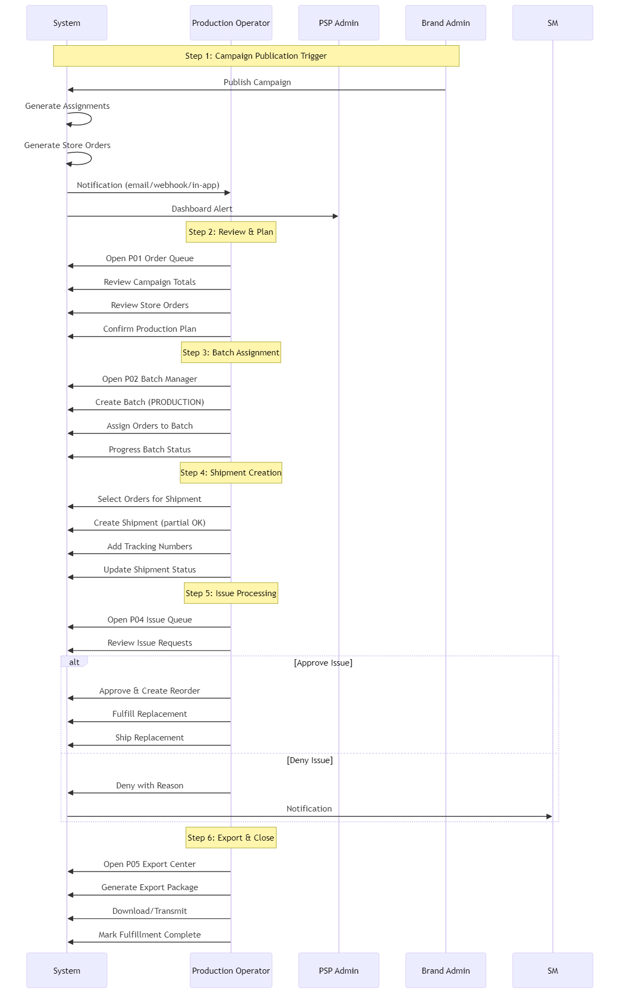
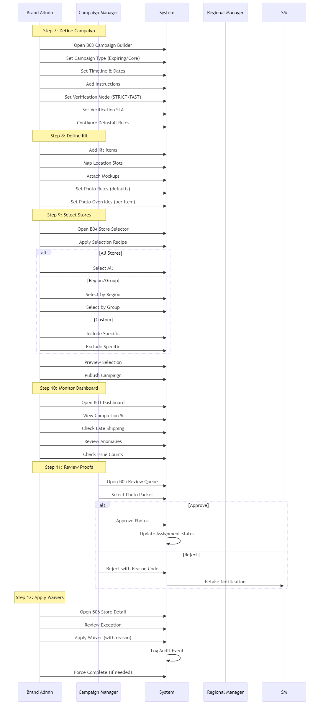
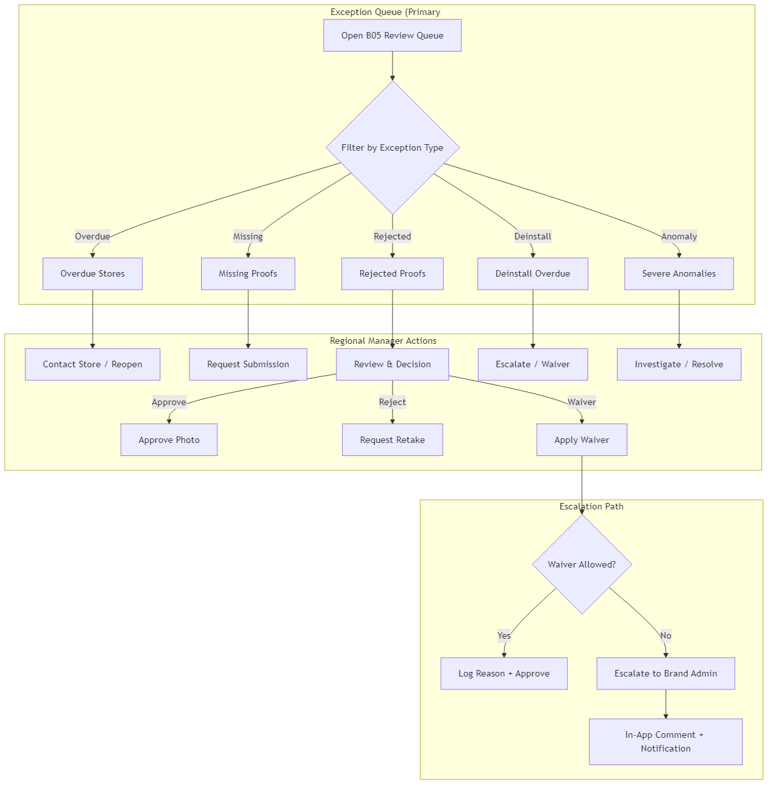
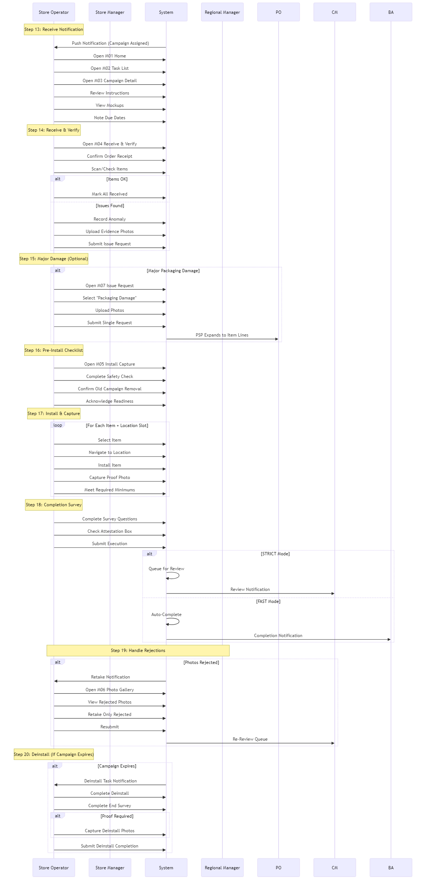
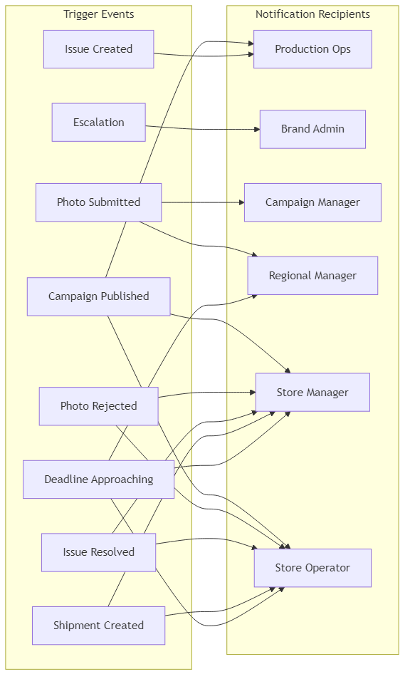

# Persona Interaction Maps & User Journey Flows

> **Document**: Development Reference - Persona Workflows
> **Version**: 1.0
> **Date**: 2025-12-30
> **Source**: SUPP-001, SCREEN_INVENTORY.md, 12-personas-by-module.md

---

## Table of Contents

1. [Persona Definitions](#1-persona-definitions)
2. [Permission Matrix](#2-permission-matrix)
3. [Canonical Workflows](#3-canonical-workflows)
4. [Screen-to-Persona Mapping](#4-screen-to-persona-mapping)
5. [User Journey Flows](#5-user-journey-flows)
6. [Cross-Persona Interactions](#6-cross-persona-interactions)
7. [Edge Case Handling](#7-edge-case-handling)
8. [Deep Link Patterns](#8-deep-link-patterns)
9. [Sprint Implementation Guide](#9-sprint-implementation-guide)

---

## 1. Persona Definitions

### 1.1 Persona Hierarchy

```
┌─────────────────────────────────────────────────────────────────────────────┐
│                              PLATFORM LEVEL                                  │
│  ┌─────────────────────────────────────────────────────────────────────┐    │
│  │  PLATFORM_ADMIN - Full system access, tenant management, security   │    │
│  └─────────────────────────────────────────────────────────────────────┘    │
├─────────────────────────────────────────────────────────────────────────────┤
│                                PSP LEVEL                                     │
│  ┌──────────────────────┐  ┌──────────────────────┐  ┌─────────────────┐   │
│  │     PSP_ADMIN        │  │   PRODUCTION_OPS     │  │ INTEGRATION_USER│   │
│  │ Brand onboarding,    │  │ Order processing,    │  │ API/webhook     │   │
│  │ PSP settings, users  │  │ shipments, batches   │  │ service account │   │
│  └──────────────────────┘  └──────────────────────┘  └─────────────────┘   │
├─────────────────────────────────────────────────────────────────────────────┤
│                               BRAND LEVEL                                    │
│  ┌──────────────────────┐  ┌──────────────────────┐  ┌─────────────────┐   │
│  │    BRAND_ADMIN       │  │  CAMPAIGN_MANAGER    │  │ REGIONAL_MANAGER│   │
│  │ Full brand config,   │  │ Assigned campaigns,  │  │ Assigned stores,│   │
│  │ all campaigns        │  │ kits, photo rules    │  │ exception queue │   │
│  └──────────────────────┘  └──────────────────────┘  └─────────────────┘   │
├─────────────────────────────────────────────────────────────────────────────┤
│                               STORE LEVEL                                    │
│  ┌──────────────────────────────────┐  ┌────────────────────────────────┐  │
│  │         STORE_MANAGER            │  │        STORE_OPERATOR          │  │
│  │ Team mgmt, approvals, analytics  │  │ Execution, surveys, requests   │  │
│  └──────────────────────────────────┘  └────────────────────────────────┘  │
└─────────────────────────────────────────────────────────────────────────────┘
```

### 1.2 Complete Persona Table

| Code | Persona | Level | Primary Responsibility | Permission Level |
|------|---------|-------|------------------------|------------------|
| `PA` | Platform Admin | Platform | Full system config, tenant management, user impersonation, security & audit | All Privileged + Impersonate |
| `PSP` | PSP Admin | PSP | Brand onboarding, PSP settings, user management, reporting & exports | PSP All Privileged |
| `PO` | Production Operator | PSP | Update order statuses, shipments & tracking, batch processing, fulfillment queues | Status & Shipping Updates |
| `IU` | Integration User | System | Inbound API writes, webhook consumption, export triggers, MIS integration | API & Webhook Service Account |
| `BA` | Brand Admin | Brand | Full brand config, all campaigns, store management, user permissions | Brand Level Privileged |
| `CM` | Campaign Manager | Brand | Build campaigns, manage assigned campaigns, kits & photo rules, proof review | Must be assigned to campaigns |
| `RM` | Regional Manager | Brand | Oversee assigned stores, exception queue, approve/reject proofs, escalate | Store Compliance for segment |
| `SM` | Store Manager | Store | Manage store team, approve replacements, view all store campaigns | Full Store Privileges |
| `SO` | Store Operator | Store | Complete surveys, update status, request replacements (needs approval) | View Only + Execution |

---

## 2. Permission Matrix

### 2.1 Screen Access by Role

| Screen ID | Screen Name | PA | PSP | PO | BA | CM | RM | SM | SO |
|-----------|-------------|:--:|:---:|:--:|:--:|:--:|:--:|:--:|:--:|
| **L01** | Universal Login | ✓ | ✓ | ✓ | ✓ | ✓ | ✓ | ✓ | ✓ |
| **B01** | Brand Dashboard | ✓ | ✓ | - | ✓ | ✓ | R | - | - |
| **B02** | Campaign List | ✓ | ✓ | R | ✓ | A | R | - | - |
| **B03** | Campaign Builder | ✓ | - | - | ✓ | A | - | - | - |
| **B04** | Store Selector | ✓ | - | - | ✓ | A | - | - | - |
| **B05** | Review Queue | ✓ | ✓ | - | ✓ | A | A | - | - |
| **B06** | Store Detail | ✓ | ✓ | R | ✓ | A | A | - | - |
| **B07** | Reports & Analytics | ✓ | ✓ | R | ✓ | A | R | - | - |
| **S01** | Store Dashboard | ✓ | ✓ | - | ✓ | R | ✓ | ✓ | - |
| **S02** | Team Management | ✓ | ✓ | - | ✓ | - | - | ✓ | - |
| **S03** | Store Analytics | ✓ | ✓ | - | ✓ | R | ✓ | ✓ | - |
| **S04** | Campaign History | ✓ | ✓ | R | ✓ | A | A | ✓ | R |
| **P01** | PSP Order Queue | ✓ | ✓ | ✓ | - | - | - | - | - |
| **P02** | Batch Manager | ✓ | ✓ | ✓ | - | - | - | - | - |
| **P03** | Shipment Tracker | ✓ | ✓ | ✓ | R | R | - | R | - |
| **P04** | Issue Queue | ✓ | ✓ | ✓ | R | R | R | R | - |
| **P05** | Export Center | ✓ | ✓ | ✓ | ✓ | A | - | - | - |
| **M01** | Mobile Home | - | - | - | - | - | - | ✓ | ✓ |
| **M02** | Task List | - | - | - | - | - | - | ✓ | ✓ |
| **M03** | Campaign Detail | - | - | - | - | - | - | ✓ | ✓ |
| **M04** | Receive & Verify | - | - | - | - | - | - | ✓ | ✓ |
| **M05** | Install Capture | - | - | - | - | - | - | ✓ | ✓ |
| **M06** | Photo Gallery | - | - | - | - | - | - | ✓ | ✓ |
| **M07** | Issue Request | - | - | - | - | - | - | ✓ | ✓ |
| **M08** | Profile & Settings | - | - | - | - | - | - | ✓ | ✓ |

**Legend**: ✓ = Full Access | A = Assigned Only | R = Read Only | - = No Access

### 2.2 Action Permissions

| Action | PA | PSP | PO | BA | CM | RM | SM | SO |
|--------|:--:|:---:|:--:|:--:|:--:|:--:|:--:|:--:|
| Create Campaign | ✓ | - | - | ✓ | A | - | - | - |
| Publish Campaign | ✓ | - | - | ✓ | A | - | - | - |
| Review Photos | ✓ | ✓ | - | ✓ | A | A | - | - |
| Approve/Reject Photos | ✓ | - | - | ✓ | A | A | - | - |
| Apply Waiver | ✓ | - | - | ✓ | - | A | - | - |
| Force Complete | ✓ | - | - | ✓ | - | - | - | - |
| Process Orders | ✓ | ✓ | ✓ | - | - | - | - | - |
| Create Shipments | ✓ | ✓ | ✓ | - | - | - | - | - |
| Manage Batches | ✓ | ✓ | ✓ | - | - | - | - | - |
| Submit Execution | - | - | - | - | - | - | ✓ | ✓ |
| Request Replacement | - | - | - | - | - | - | ✓ | ✓* |
| Approve Replacement | - | - | - | - | - | - | ✓ | - |
| View Audit Log | ✓ | ✓ | R | ✓ | - | - | - | - |
| Impersonate User | ✓ | - | - | - | - | - | - | - |
| Manage Tenants | ✓ | - | - | - | - | - | - | - |

**Note**: * = Requires Store Manager approval

---

## 3. Canonical Workflows

### 3.1 Production Operator Workflow (Steps 1-6)



**Screen Flow**: P01 → P02 → P03 → P04 → P05

**Modals Used**:
- `P01-M1`: Order Details
- `P01-M2`: Bulk Status Update
- `P02-M1`: Create Batch
- `P02-M2`: Assign to Batch
- `P03-M1`: Create Shipment
- `P03-M2`: Add Tracking
- `P04-M1`: Issue Details
- `P04-M2`: Approve/Deny Issue

---

### 3.2 Brand Admin / Campaign Manager Workflow (Steps 7-12)



**Screen Flow**: B03 → B04 → B01 → B05 → B06

**Modals Used**:
- `B03-M1`: Kit Item Editor
- `B03-M2`: Photo Rules Config
- `B03-M3`: Schedule Picker
- `B04-M1`: Region Selector
- `B04-M2`: Store Search
- `B04-M3`: Preview Stores
- `B05-M1`: Photo Review
- `B05-M2`: Rejection Reasons
- `B06-M1`: Store Actions
- `B06-M2`: Waiver Dialog

---

### 3.3 Regional Manager Workflow (Exception-First)



**Screen Flow**: B05 (filtered) → B06 → Escalation

**Key Behaviors**:
- Works from exception queue filtered to assigned stores only
- Cannot access campaigns not assigned to their region
- Waiver capability limited by policy configuration
- All actions logged to audit trail

---

### 3.4 Store Execution Workflow (Steps 13-20)



**Screen Flow**: M01 → M02 → M03 → M04 → M05 → M06 → M07 → M08

**Modals Used**:
- `M03-M1`: Mockup Viewer
- `M03-M2`: Instructions Detail
- `M04-M1`: Item Scanner
- `M04-M2`: Anomaly Reporter
- `M05-M1`: Photo Capture
- `M05-M2`: Location Picker
- `M06-M1`: Photo Viewer
- `M06-M2`: Retake Interface
- `M07-M1`: Issue Type Selector
- `M07-M2`: Evidence Upload

---

## 4. Screen-to-Persona Mapping

### 4.1 PSP Operations Module

| Screen | Primary Users | Secondary Users | Key Actions |
|--------|---------------|-----------------|-------------|
| P01 Order Queue | PO | PSP, PA | View orders, filter by status, bulk status update |
| P02 Batch Manager | PO | PSP, PA | Create batches, assign orders, track progress |
| P03 Shipment Tracker | PO | PSP, BA (read) | Create shipments, add tracking, monitor delivery |
| P04 Issue Queue | PO | PSP, all (read) | Triage issues, approve/deny, create reorders |
| P05 Export Center | PO, PSP | BA, PA | Generate exports, download packages, schedule |

### 4.2 Brand Admin Module

| Screen | Primary Users | Secondary Users | Key Actions |
|--------|---------------|-----------------|-------------|
| B01 Dashboard | BA, CM | RM (read), PSP | Monitor KPIs, view alerts, drill-down |
| B02 Campaign List | BA, CM | RM (read), PO (read) | List campaigns, filter, access detail |
| B03 Campaign Builder | BA, CM | - | Create/edit campaigns, configure settings |
| B04 Store Selector | BA, CM | - | Select stores, preview, apply recipes |
| B05 Review Queue | BA, CM, RM | PSP | Review photos, approve/reject, retakes |
| B06 Store Detail | BA, CM, RM | PSP | View store execution, actions, history |
| B07 Reports & Analytics | BA | CM (assigned), RM (read) | Generate reports, view analytics |

### 4.3 Store Portal Module

| Screen | Primary Users | Secondary Users | Key Actions |
|--------|---------------|-----------------|-------------|
| S01 Store Dashboard | SM | BA, PSP | View store KPIs, active campaigns |
| S02 Team Management | SM | BA, PSP | Manage operators, permissions |
| S03 Store Analytics | SM | BA, RM | Performance metrics, trends |
| S04 Campaign History | SM | SO (read), BA, CM | View past campaigns, execution |

### 4.4 Mobile App Module

| Screen | Primary Users | Secondary Users | Key Actions |
|--------|---------------|-----------------|-------------|
| M01 Home | SM, SO | - | Dashboard, quick actions |
| M02 Task List | SM, SO | - | View assignments, filter |
| M03 Campaign Detail | SM, SO | - | Instructions, mockups, status |
| M04 Receive & Verify | SM, SO | - | Confirm receipt, report issues |
| M05 Install Capture | SM, SO | - | Photo capture, location tagging |
| M06 Photo Gallery | SM, SO | - | View photos, retakes |
| M07 Issue Request | SM, SO | - | Report issues, request replacements |
| M08 Profile & Settings | SM, SO | - | Account, notifications, offline |

---

## 5. User Journey Flows

### 5.1 Store User Journey (Mobile)

```
┌─────────────────────────────────────────────────────────────────────────────┐
│                        STORE USER MOBILE JOURNEY                             │
├─────────────────────────────────────────────────────────────────────────────┤
│                                                                              │
│  📱 NOTIFICATION                                                             │
│     │                                                                        │
│     ▼                                                                        │
│  ┌─────────┐    ┌─────────┐    ┌─────────┐    ┌─────────┐                  │
│  │   M01   │───▶│   M02   │───▶│   M03   │───▶│   M04   │                  │
│  │  Home   │    │  Tasks  │    │Campaign │    │ Receive │                  │
│  │         │    │         │    │ Detail  │    │ Verify  │                  │
│  └─────────┘    └─────────┘    └─────────┘    └────┬────┘                  │
│                                                     │                        │
│                                    ┌────────────────┼────────────────┐      │
│                                    │                │                │      │
│                                    ▼                ▼                ▼      │
│                              ┌─────────┐      ┌─────────┐      ┌─────────┐  │
│                              │   M05   │      │   M07   │      │   M06   │  │
│                              │ Install │      │  Issue  │      │ Gallery │  │
│                              │ Capture │      │ Request │      │         │  │
│                              └────┬────┘      └─────────┘      └────┬────┘  │
│                                   │                                  │      │
│                                   ▼                                  │      │
│                              ┌─────────┐                             │      │
│                              │Complete │◀────────────────────────────┘      │
│                              │ Survey  │                                    │
│                              └────┬────┘                                    │
│                                   │                                         │
│                      ┌────────────┴────────────┐                           │
│                      ▼                         ▼                           │
│                 [FAST Mode]              [STRICT Mode]                     │
│                      │                         │                           │
│                      ▼                         ▼                           │
│                  COMPLETE              PENDING REVIEW                      │
│                                              │                             │
│                                    ┌─────────┴─────────┐                  │
│                                    ▼                   ▼                  │
│                               [Approved]          [Rejected]              │
│                                    │                   │                  │
│                                    ▼                   ▼                  │
│                               COMPLETE            M06 Retake              │
│                                                        │                  │
│                                                        ▼                  │
│                                                   Resubmit                │
│                                                        │                  │
│                                                        ▼                  │
│                                                   COMPLETE                │
│                                                                           │
└───────────────────────────────────────────────────────────────────────────┘
```

### 5.2 Brand Admin Journey (Web)

```
┌─────────────────────────────────────────────────────────────────────────────┐
│                         BRAND ADMIN WEB JOURNEY                              │
├─────────────────────────────────────────────────────────────────────────────┤
│                                                                              │
│  🔐 LOGIN (L01)                                                              │
│     │                                                                        │
│     ▼                                                                        │
│  ┌─────────┐                                                                │
│  │   B01   │◀──────────────────────────────────────────────────────────┐   │
│  │Dashboard│                                                            │   │
│  └────┬────┘                                                            │   │
│       │                                                                 │   │
│       ├─────────────────────┬────────────────────┬──────────────────┐  │   │
│       ▼                     ▼                    ▼                  │  │   │
│  ┌─────────┐          ┌─────────┐          ┌─────────┐              │  │   │
│  │   B02   │          │   B05   │          │   B07   │              │  │   │
│  │Campaign │          │ Review  │          │ Reports │              │  │   │
│  │  List   │          │  Queue  │          │         │              │  │   │
│  └────┬────┘          └────┬────┘          └─────────┘              │  │   │
│       │                    │                                         │  │   │
│       ▼                    ▼                                         │  │   │
│  ┌─────────┐          ┌─────────┐                                   │  │   │
│  │   B03   │          │   B06   │───────────────────────────────────┘  │   │
│  │Campaign │          │ Store   │                                      │   │
│  │ Builder │          │ Detail  │                                      │   │
│  └────┬────┘          └─────────┘                                      │   │
│       │                                                                 │   │
│       ▼                                                                 │   │
│  ┌─────────┐                                                           │   │
│  │   B04   │                                                           │   │
│  │ Store   │                                                           │   │
│  │Selector │                                                           │   │
│  └────┬────┘                                                           │   │
│       │                                                                 │   │
│       ▼                                                                 │   │
│  [PUBLISH]──────────────────────────────────────────────────────────────┘   │
│                                                                              │
└──────────────────────────────────────────────────────────────────────────────┘
```

### 5.3 PSP Operations Journey (Web)

```
┌─────────────────────────────────────────────────────────────────────────────┐
│                        PSP OPERATIONS WEB JOURNEY                            │
├─────────────────────────────────────────────────────────────────────────────┤
│                                                                              │
│  🔐 LOGIN (L01)                                                              │
│     │                                                                        │
│     ▼                                                                        │
│  ┌─────────┐                                                                │
│  │   P01   │◀───────────────────────────────────────────────────────────┐  │
│  │ Order   │                                                             │  │
│  │  Queue  │                                                             │  │
│  └────┬────┘                                                             │  │
│       │                                                                  │  │
│       ├─────────────────────┬────────────────────┬───────────────────┐  │  │
│       ▼                     ▼                    ▼                   │  │  │
│  ┌─────────┐          ┌─────────┐          ┌─────────┐               │  │  │
│  │   P02   │          │   P03   │          │   P04   │               │  │  │
│  │ Batch   │          │Shipment │          │ Issue   │               │  │  │
│  │ Manager │          │ Tracker │          │  Queue  │               │  │  │
│  └────┬────┘          └────┬────┘          └────┬────┘               │  │  │
│       │                    │                    │                    │  │  │
│       └────────────────────┼────────────────────┘                    │  │  │
│                            │                                         │  │  │
│                            ▼                                         │  │  │
│                       ┌─────────┐                                    │  │  │
│                       │   P05   │────────────────────────────────────┘  │  │
│                       │ Export  │                                       │  │
│                       │ Center  │                                       │  │
│                       └─────────┘                                       │  │
│                                                                         │  │
└─────────────────────────────────────────────────────────────────────────────┘
```

---

## 6. Cross-Persona Interactions

### 6.1 Interaction Matrix

```
                    ┌─────┬─────┬─────┬─────┬─────┬─────┬─────┬─────┬─────┐
                    │ PA  │ PSP │ PO  │ BA  │ CM  │ RM  │ SM  │ SO  │ IU  │
┌───────────────────┼─────┼─────┼─────┼─────┼─────┼─────┼─────┼─────┼─────┤
│ Platform Admin    │  -  │  C  │  C  │  C  │  C  │  C  │  C  │  C  │  C  │
├───────────────────┼─────┼─────┼─────┼─────┼─────┼─────┼─────┼─────┼─────┤
│ PSP Admin         │  E  │  -  │  C  │  C  │  N  │  N  │  N  │  N  │  C  │
├───────────────────┼─────┼─────┼─────┼─────┼─────┼─────┼─────┼─────┼─────┤
│ Production Ops    │  E  │  R  │  -  │  N  │  N  │  N  │  A  │  A  │  W  │
├───────────────────┼─────┼─────┼─────┼─────┼─────┼─────┼─────┼─────┼─────┤
│ Brand Admin       │  E  │  R  │  N  │  -  │  C  │  C  │  N  │  N  │  N  │
├───────────────────┼─────┼─────┼─────┼─────┼─────┼─────┼─────┼─────┼─────┤
│ Campaign Manager  │  E  │  R  │  N  │  R  │  -  │  N  │  N  │  N  │  N  │
├───────────────────┼─────┼─────┼─────┼─────┼─────┼─────┼─────┼─────┼─────┤
│ Regional Manager  │  E  │  R  │  N  │  E  │  R  │  -  │  N  │  N  │  N  │
├───────────────────┼─────┼─────┼─────┼─────┼─────┼─────┼─────┼─────┼─────┤
│ Store Manager     │  E  │  R  │  R  │  R  │  R  │  R  │  -  │  C  │  N  │
├───────────────────┼─────┼─────┼─────┼─────┼─────┼─────┼─────┼─────┼─────┤
│ Store Operator    │  E  │  R  │  R  │  R  │  R  │  R  │  R  │  -  │  N  │
├───────────────────┼─────┼─────┼─────┼─────┼─────┼─────┼─────┼─────┼─────┤
│ Integration User  │  E  │  R  │  W  │  W  │  W  │  W  │  W  │  W  │  -  │
└───────────────────┴─────┴─────┴─────┴─────┴─────┴─────┴─────┴─────┴─────┘

Legend:
C = Creates/Configures for     E = Escalates to        N = Notifies
R = Reports to                 W = Writes data for     A = Approves for
```

### 6.2 Key Handoff Points

| Handoff | From | To | Trigger | Data | Screen Flow |
|---------|------|-----|---------|------|-------------|
| Campaign Publish | BA/CM | PO | Publish button | Orders generated | B03 → P01 |
| Photo Review | SO/SM | CM/RM | Submit execution | Photos queued | M05 → B05 |
| Photo Rejection | CM/RM | SO/SM | Reject photos | Rejection reasons | B05 → M06 |
| Issue Request | SO/SM | PO | Submit issue | Issue + evidence | M07 → P04 |
| Issue Approval | PO | SO/SM | Approve/Deny | Decision + reorder | P04 → M02 |
| Replacement Approval | SM | SO | Approve request | Approval status | S02 → M07 |
| Escalation | RM | BA | Escalate button | Context + comments | B05 → B01 |
| Shipment Update | PO | SO/SM | Create shipment | Tracking info | P03 → M03 |
| Waiver Applied | BA/RM | SO/SM | Apply waiver | Waiver reason | B06 → M03 |

### 6.3 Notification Flow



---

## 7. Edge Case Handling

### 7.1 Edge Cases by Persona

| Edge Case | Primary Handler | Escalation Path | Resolution |
|-----------|-----------------|-----------------|------------|
| Store layout update mid-campaign | BA | PA (if system issue) | Rebase to latest with verification |
| Partial shipment needed | PO | PSP | Create partial, backorder remainder |
| Multiple tracking per shipment | PO | - | UI supports array of tracking |
| STRICT rejection loop | RM | BA | Apply waiver with reason |
| FAST mode auto-reopen | System | CM | Auto-queues for re-review |
| Asset substitution reorder | PO | PSP | Log substitution with audit |
| Late shipping threshold | System | RM → BA | Escalation notification chain |
| Missing proof photos | RM | BA | Contact store, reopen, or waiver |
| Damaged goods all items | SO → SM | PO | Single request expands to lines |
| Store user locked out | SM | BA → PSP | Reset via team management |
| Campaign conflict (same store) | BA | PA | System validation on publish |
| Deinstall overdue | RM | BA | Notification escalation |

### 7.2 Verification Mode Behaviors

| Scenario | STRICT Mode | FAST Mode |
|----------|-------------|-----------|
| Initial submission | Queue for review | Auto-complete |
| Photo rejected | Store retakes → Re-queue | Auto-reopen → Re-queue |
| Partial completion | Hold pending | Allow partial |
| Deadline passed | Escalate to RM | Escalate to RM |
| Waiver applied | Requires reason | Requires reason |
| Auto-complete | Never | After re-review pass |

### 7.3 Offline Handling (Mobile)

| Action | Online | Offline | Sync Behavior |
|--------|--------|---------|---------------|
| View tasks | Live data | Cached data | Refresh on connect |
| View mockups | Load images | Cached images | Pre-fetch on WiFi |
| Capture photos | Upload immediately | Store locally | Queue for upload |
| Submit execution | Immediate | Draft mode | Submit on connect |
| Report issues | Immediate | Draft mode | Submit on connect |
| Receive shipment | Live update | Mark locally | Sync on connect |

---

## 8. Deep Link Patterns

### 8.1 Mobile App Deep Links

| Pattern | Target Screen | Parameters | Example |
|---------|---------------|------------|---------|
| `newpopsys://home` | M01 Home | - | `newpopsys://home` |
| `newpopsys://tasks` | M02 Task List | `?filter={status}` | `newpopsys://tasks?filter=pending` |
| `newpopsys://campaign/{id}` | M03 Campaign Detail | `id` | `newpopsys://campaign/camp_123` |
| `newpopsys://receive/{orderId}` | M04 Receive & Verify | `orderId` | `newpopsys://receive/ord_456` |
| `newpopsys://install/{assignmentId}` | M05 Install Capture | `assignmentId`, `?item={itemId}` | `newpopsys://install/asgn_789?item=item_012` |
| `newpopsys://photos/{assignmentId}` | M06 Photo Gallery | `assignmentId`, `?status={status}` | `newpopsys://photos/asgn_789?status=rejected` |
| `newpopsys://issue/new` | M07 Issue Request | `?orderId={orderId}` | `newpopsys://issue/new?orderId=ord_456` |
| `newpopsys://profile` | M08 Profile | - | `newpopsys://profile` |

### 8.2 Web Portal Deep Links

| Pattern | Target Screen | Parameters | Example |
|---------|---------------|------------|---------|
| `/login` | L01 Login | `?redirect={path}` | `/login?redirect=/admin/dashboard` |
| `/admin/dashboard` | B01 Dashboard | `?brand={id}` | `/admin/dashboard?brand=brand_123` |
| `/admin/campaigns` | B02 Campaign List | `?status={status}` | `/admin/campaigns?status=active` |
| `/admin/campaigns/{id}` | B03 Campaign Builder | `id` | `/admin/campaigns/camp_123` |
| `/admin/campaigns/{id}/stores` | B04 Store Selector | `id` | `/admin/campaigns/camp_123/stores` |
| `/admin/review` | B05 Review Queue | `?campaign={id}&store={id}` | `/admin/review?campaign=camp_123` |
| `/admin/stores/{id}` | B06 Store Detail | `id`, `?tab={tab}` | `/admin/stores/store_456?tab=execution` |
| `/admin/reports` | B07 Reports | `?type={type}` | `/admin/reports?type=completion` |
| `/store/dashboard` | S01 Dashboard | - | `/store/dashboard` |
| `/psp/orders` | P01 Order Queue | `?campaign={id}&status={status}` | `/psp/orders?status=pending` |
| `/psp/batches` | P02 Batch Manager | `?type={type}` | `/psp/batches?type=PRODUCTION` |
| `/psp/shipments` | P03 Shipment Tracker | `?order={id}` | `/psp/shipments?order=ord_456` |
| `/psp/issues` | P04 Issue Queue | `?priority={level}` | `/psp/issues?priority=HIGH` |
| `/psp/exports` | P05 Export Center | `?type={type}` | `/psp/exports?type=orders` |

---

## 9. Sprint Implementation Guide

### 9.1 Persona Priority by Sprint

| Sprint | Weeks | Primary Personas | Screens | Focus |
|--------|-------|------------------|---------|-------|
| **Sprint 1** | 1-2 | All (Auth) | L01 | Universal Login, RBAC |
| **Sprint 2** | 3-4 | SO, SM | M01-M05 | Core Mobile Execution |
| **Sprint 3** | 5-6 | BA, CM | B01-B04 | Campaign Creation |
| **Sprint 4** | 7-8 | SO, SM, CM | M06-M07, B05 | Photo Review Loop |
| **Sprint 5** | 9-10 | PO, PSP | P01-P04 | Fulfillment Core |
| **Sprint 6** | 11-12 | All | All + Polish | Integration & Beta |

### 9.2 Persona Dependencies

```
Sprint 1 (Auth)
    │
    ├─────────────────────┬────────────────────────────────┐
    â–¼                     â–¼                                â–¼
Sprint 2 (Mobile)    Sprint 3 (Brand Admin)        Sprint 5 (PSP)
    │                     │                                │
    ▼                     ▼                                │
Sprint 4 (Review) ◀───────┘                               │
    │                                                      │
    └──────────────────────────────────────────────────────┤
                                                           â–¼
                                                    Sprint 6 (Beta)
```

### 9.3 Critical Path per Persona

| Persona | Critical Path | Blocking For |
|---------|---------------|--------------|
| Platform Admin | L01 → System Config | All tenant operations |
| PSP Admin | L01 → Brand Onboarding | All brand operations |
| Production Ops | P01 → P02 → P03 | Store receipt |
| Brand Admin | B03 → B04 → Publish | Store assignments |
| Campaign Manager | B03 → B05 | Photo verification |
| Regional Manager | B05 → B06 | Exception resolution |
| Store Manager | S01 → M01 → M05 | Team execution |
| Store Operator | M01 → M04 → M05 | Completion data |
| Integration User | API → Webhooks | MIS Integration |

---

## Appendix A: Persona Quick Reference Cards

### A.1 Store Operator Quick Card

```
┌────────────────────────────────────────────────────────────────────────┐
│  STORE OPERATOR (SO)                                                    │
├────────────────────────────────────────────────────────────────────────┤
│  Primary: Complete surveys, execute installations, report issues       │
│  Permission: View Only + Execution                                     │
├────────────────────────────────────────────────────────────────────────┤
│  SCREENS: M01, M02, M03, M04, M05, M06, M07, M08                       │
├────────────────────────────────────────────────────────────────────────┤
│  KEY WORKFLOWS:                                                         │
│  1. Receive notification → View campaign → Check due dates             │
│  2. Receive order → Verify items → Report issues                       │
│  3. Complete pre-install → Install items → Capture photos              │
│  4. Complete survey → Submit → Handle rejections                       │
├────────────────────────────────────────────────────────────────────────┤
│  LIMITATIONS:                                                           │
│  - Cannot approve replacement requests (needs SM)                      │
│  - Cannot access campaigns not assigned                                │
│  - Cannot view brand-level analytics                                   │
├────────────────────────────────────────────────────────────────────────┤
│  ESCALATION: Store Manager → Regional Manager → Brand Admin            │
└────────────────────────────────────────────────────────────────────────┘
```

### A.2 Brand Admin Quick Card

```
┌────────────────────────────────────────────────────────────────────────┐
│  BRAND ADMIN (BA)                                                       │
├────────────────────────────────────────────────────────────────────────┤
│  Primary: Full brand configuration, all campaigns, user permissions    │
│  Permission: Brand Level Privileged                                    │
├────────────────────────────────────────────────────────────────────────┤
│  SCREENS: B01, B02, B03, B04, B05, B06, B07, S01, S02, S03, S04        │
├────────────────────────────────────────────────────────────────────────┤
│  KEY WORKFLOWS:                                                         │
│  1. Create campaign → Define kit → Select stores → Publish             │
│  2. Monitor dashboard → Review KPIs → Drill-down anomalies             │
│  3. Review proofs → Approve/Reject → Apply waivers                     │
│  4. Manage stores → Configure settings → Handle exceptions             │
├────────────────────────────────────────────────────────────────────────┤
│  SPECIAL ABILITIES:                                                     │
│  - Force complete assignments                                          │
│  - Apply waivers without limit                                         │
│  - Access all campaigns (not just assigned)                            │
│  - Configure brand-level settings                                      │
├────────────────────────────────────────────────────────────────────────┤
│  ESCALATION: PSP Admin → Platform Admin                                │
└────────────────────────────────────────────────────────────────────────┘
```

### A.3 Production Operator Quick Card

```
┌────────────────────────────────────────────────────────────────────────┐
│  PRODUCTION OPERATOR (PO)                                               │
├────────────────────────────────────────────────────────────────────────┤
│  Primary: Order processing, shipments, batch management, issues        │
│  Permission: Status & Shipping Updates                                 │
├────────────────────────────────────────────────────────────────────────┤
│  SCREENS: P01, P02, P03, P04, P05                                      │
├────────────────────────────────────────────────────────────────────────┤
│  KEY WORKFLOWS:                                                         │
│  1. Review orders → Confirm plan → Create batches                      │
│  2. Progress batch → Create shipments → Add tracking                   │
│  3. Process issues → Approve/Deny → Create reorders                    │
│  4. Generate exports → Close fulfillment                               │
├────────────────────────────────────────────────────────────────────────┤
│  BATCH TYPES:                                                           │
│  - PRODUCTION: Manufacturing run                                       │
│  - PICK_PACK: Warehouse picking                                        │
│  - SHIP_WAVE: Shipping batch                                           │
│  - CUSTOM: User-defined                                                │
├────────────────────────────────────────────────────────────────────────┤
│  ESCALATION: PSP Admin → Platform Admin                                │
└────────────────────────────────────────────────────────────────────────┘
```

---

## Appendix B: Changelog

| Version | Date | Author | Changes |
|---------|------|--------|---------|
| 1.0 | 2025-12-30 | AI | Initial creation from SUPP-001, SCREEN_INVENTORY, 12-personas-by-module |

---

*End of Persona Interaction Maps & User Journey Flows*
