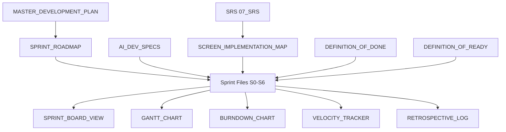

# Development Planning Framework

> **Methodology**: Hybrid Agile/Scrum with Kanban + Gantt tracking
> **Version**: 1.0
> **Created**: 2026-01-01

---

## 1. Methodology Overview

This project uses a **hybrid Agile approach** combining:

| Component | Purpose | Artifact |
|-----------|---------|----------|
| **Scrum** | Sprint cadence, ceremonies | Sprint files, retrospectives |
| **Kanban** | Visual workflow, WIP limits | Sprint board views |
| **Gantt** | Timeline visualization, dependencies | Gantt chart, critical path |

### Why Hybrid?

- **Scrum** provides structure with 2-week sprints and defined ceremonies
- **Kanban** enables real-time visibility and on-the-fly adjustments
- **Gantt** shows dependencies and timeline for stakeholder communication

---

## 2. Sprint Cadence

### Sprint Duration: 2 Weeks

```
Week 1:
  Monday    - Sprint Planning
  Daily     - Standups (async or sync)
  Friday    - Mid-sprint check

Week 2:
  Monday    - Continued development
  Thursday  - Code freeze, testing
  Friday    - Sprint Review + Retrospective
```

### Sprint Ceremonies

| Ceremony | Duration | Participants | Artifact |
|----------|----------|--------------|----------|
| **Planning** | 2 hours | Dev team | Sprint backlog |
| **Daily Standup** | 15 min | Dev team | Task updates |
| **Review** | 1 hour | Team + stakeholders | Demo |
| **Retrospective** | 1 hour | Dev team | Retro log |

---

## 3. Kanban Board Structure

### Columns

```
┌──────────┬──────────┬──────────────┬──────────┬──────────┐
│ Backlog  │  To Do   │ In Progress  │  Review  │   Done   │
├──────────┼──────────┼──────────────┼──────────┼──────────┤
│ No limit │ WIP: 5   │   WIP: 3     │  WIP: 2  │ No limit │
└──────────┴──────────┴──────────────┴──────────┴──────────┘
```

### WIP Limits

| Column | Limit | Rationale |
|--------|-------|-----------|
| To Do | 5 | Ready for sprint |
| In Progress | 3 | Focus on completion |
| Review | 2 | Fast feedback loop |

### Task States

```
BACKLOG → TO_DO → IN_PROGRESS → IN_REVIEW → DONE
                       ↓
                   BLOCKED
```

---

## 4. Gantt Timeline

### Purpose
- Visualize sprint dependencies
- Identify critical path
- Communicate timeline to stakeholders

### Update Frequency
- **Weekly**: Update progress percentages
- **Sprint end**: Adjust future sprint dates if needed
- **Milestone**: Formal review and adjustment

### Mermaid Format

All Gantt charts use Mermaid for version-controlled diagrams:

```mermaid
gantt
    title Sprint Timeline
    dateFormat YYYY-MM-DD
    section Sprint
    Task Name :id, start_date, duration
```

---

## 5. Task Management

### Task ID Format

```
S{sprint}-{sequence}
Example: S0-01, S0-02, S1-01
```

### Task States

| State | Symbol | Description |
|-------|--------|-------------|
| Pending | ⬜ | Not started |
| In Progress | 🔵 | Being worked on |
| Review | 🟡 | Awaiting review |
| Blocked | 🔴 | Has impediment |
| Done | ✅ | Completed |

### Task Priority

| Priority | Label | Response Time |
|----------|-------|---------------|
| P0 | Critical | Same day |
| P1 | High | Within sprint |
| P2 | Medium | Next sprint |
| P3 | Low | Backlog |

---

## 6. Definition of Done (Summary)

A task is **Done** when:

- [ ] Code complete and committed
- [ ] Unit tests passing (≥80% coverage)
- [ ] Code reviewed and approved
- [ ] Documentation updated
- [ ] No P0/P1 bugs
- [ ] Deployed to staging
- [ ] Acceptance criteria verified

See [DEFINITION_OF_DONE.md](../05_Agile_Suite/DEFINITION_OF_DONE.md) for full details.

---

## 7. Definition of Ready (Summary)

A task is **Ready** for sprint when:

- [ ] Clear description with acceptance criteria
- [ ] Dependencies identified
- [ ] Estimate provided
- [ ] Design/wireframe available (if UI)
- [ ] API contract defined (if backend)

See [DEFINITION_OF_READY.md](../05_Agile_Suite/DEFINITION_OF_READY.md) for full details.

---

## 8. Metrics Tracked

### Sprint Metrics

| Metric | Description | Target |
|--------|-------------|--------|
| **Velocity** | Story points per sprint | Track trend |
| **Burndown** | Work remaining over time | Linear decline |
| **Cycle Time** | Time from start to done | < 3 days |
| **Lead Time** | Time from backlog to done | < 1 sprint |

### Quality Metrics

| Metric | Description | Target |
|--------|-------------|--------|
| **Test Coverage** | % code covered | ≥ 80% |
| **Bug Escape Rate** | Bugs found post-release | < 5% |
| **Tech Debt Ratio** | Debt items / total items | < 10% |

---

## 9. Document Relationships



---

## 10. Tool Integration

### Markdown-Based Tracking

All tracking is done in markdown files:

| Artifact | Update Frequency | Owner |
|----------|------------------|-------|
| Sprint Board | Daily | Dev team |
| Gantt Chart | Weekly | Tech lead |
| Burndown | End of each day | Auto-calculated |
| Retrospective | End of sprint | Scrum master |

### Version Control

- All docs in Git for history
- Branch: `docs/dev-planning`
- Reviews via PR for major changes

---

*Framework Version: 1.0 | Last Updated: 2026-01-01*
