# Document Relationship Diagram

> How development planning documents connect
> **Version**: 1.0

---

## Overview

```mermaid
graph TB
    subgraph "Strategic Layer"
        MP[MASTER_DEVELOPMENT_PLAN]
        PC[PROJECT_CHARTER]
        MS[MILESTONE_SCHEDULE]
        RA[RESOURCE_ALLOCATION]
    end

    subgraph "Planning Layer"
        SR[SPRINT_ROADMAP]
        SC[SPRINT_CALENDAR]
        DM[DEPENDENCY_MAP]
        S0[Sprint S0]
        S1[Sprint S1]
        S2[Sprint S2]
        S3[Sprint S3]
        S4[Sprint S4]
        S5[Sprint S5]
        S6[Sprint S6]
    end

    subgraph "Technical Layer"
        AI[AI_DEV_SPECS]
        TS[TECH_STACK_DECISIONS]
        AO[ARCHITECTURE_OVERVIEW]
        MR[MONOREPO_STRUCTURE]
    end

    subgraph "Tracking Layer"
        SB[SPRINT_BOARD_VIEW]
        CS[CURRENT_SPRINT]
        BL[BACKLOG]
        GC[GANTT_CHART]
        BD[BURNDOWN_CHART]
        VT[VELOCITY_TRACKER]
    end

    subgraph "Quality Layer"
        DOD[DEFINITION_OF_DONE]
        DOR[DEFINITION_OF_READY]
        QG[QUALITY_GATES]
        RC[RELEASE_CHECKLIST]
        TD[TECH_DEBT_REGISTER]
    end

    subgraph "SRS Alignment"
        SS[SRS_SYNC_STATUS]
        SIM[SCREEN_IMPLEMENTATION_MAP]
        SUP[SUPP_IMPLEMENTATION_MAP]
        CCL[CHANGE_CONTROL_LOG]
    end

    subgraph "External: 07_SRS"
        SRS[SRS Documents]
    end

    MP --> SR
    MP --> PC
    MP --> MS
    MP --> RA

    SR --> S0
    SR --> S1
    SR --> S2
    SR --> S3
    SR --> S4
    SR --> S5
    SR --> S6

    SR --> SC
    SR --> DM

    AI --> S0
    AI --> S1
    AI --> S2

    S0 --> SB
    S1 --> SB
    S2 --> SB
    S3 --> SB
    S4 --> SB
    S5 --> SB
    S6 --> SB

    SB --> CS
    SB --> BL

    S0 --> GC
    S1 --> GC
    S2 --> GC

    CS --> BD
    CS --> VT

    DOD --> S0
    DOR --> BL
    QG --> S6

    SRS --> SS
    SS --> SIM
    SS --> SUP
    SIM --> S0
    SIM --> S1
    SIM --> S2
    SIM --> S3
    SIM --> S4
    SIM --> S5
```



---

## Document Flow

### 1. Strategy → Planning

```
MASTER_DEVELOPMENT_PLAN
         │
         ├──► PROJECT_CHARTER (executive summary)
         ├──► MILESTONE_SCHEDULE (high-level gates)
         ├──► RESOURCE_ALLOCATION (team capacity)
         │
         └──► SPRINT_ROADMAP
                   │
                   ├──► Sprint S0-S6 files
                   ├──► SPRINT_CALENDAR
                   └──► DEPENDENCY_MAP
```

### 2. Planning → Tracking

```
Sprint Files (S0-S6)
         │
         ├──► SPRINT_BOARD_VIEW (Kanban)
         │         │
         │         ├──► CURRENT_SPRINT
         │         └──► BACKLOG
         │
         ├──► GANTT_CHART (Timeline)
         │         │
         │         ├──► TIMELINE_VIEW
         │         └──► CRITICAL_PATH
         │
         └──► Metrics/
                   ├──► BURNDOWN_CHART
                   ├──► VELOCITY_TRACKER
                   └──► CUMULATIVE_FLOW
```

### 3. Quality Integration

```
DEFINITION_OF_READY ──► BACKLOG ──► Sprint Planning
                                         │
                                         ▼
                               CURRENT_SPRINT
                                         │
                                         ▼
                            DEFINITION_OF_DONE ──► Done
                                         │
                                         ▼
                             RELEASE_CHECKLIST ──► Deploy
```

### 4. SRS Alignment

```
07_SRS (External)
         │
         ├──► Screen Specs ──► SCREEN_IMPLEMENTATION_MAP
         │                              │
         ├──► SUPP Documents ──► SUPP_IMPLEMENTATION_MAP
         │                              │
         └──► Changes ──────────► CHANGE_CONTROL_LOG
                                        │
                                        ▼
                               SRS_SYNC_STATUS
                                        │
                                        ▼
                               Sprint Task Updates
```

---

## Cross-References

| From | To | Relationship |
|------|-----|--------------|
| Master Plan | Sprint Roadmap | Defines sprints |
| Sprint Roadmap | Sprint Files | Contains details |
| Sprint Files | Sprint Board | Tracks progress |
| Sprint Board | Metrics | Measures velocity |
| AI Dev Specs | Sprint Tasks | Technical requirements |
| SRS Screens | Implementation Map | What to build |
| Definition of Ready | Backlog | Entry criteria |
| Definition of Done | Sprint Tasks | Exit criteria |
| Quality Gates | Release Checklist | Pre-release verification |

---

## Update Triggers

| When This Changes | Update These |
|-------------------|--------------|
| New sprint starts | CURRENT_SPRINT, GANTT_CHART |
| Task completes | SPRINT_BOARD_VIEW, BURNDOWN_CHART |
| Sprint ends | VELOCITY_TRACKER, RETROSPECTIVE_LOG |
| Scope change | CHANGE_CONTROL_LOG, affected Sprint file |
| Risk identified | RISK_REGISTER |
| Tech debt added | TECH_DEBT_REGISTER |

---

*Last Updated: 2026-01-01*
