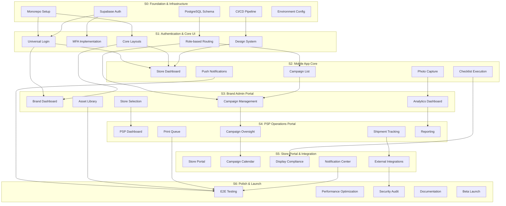

# POP System Dependency Map

## Overview

This document maps the dependencies between sprints, tasks, and components. Understanding these dependencies is critical for sprint planning and risk mitigation.

## Visual Dependency Diagram



---

## Dependency Matrix

### Sprint-to-Sprint Dependencies

| Dependent Sprint | Depends On | Blocking Tasks | Risk Level |
|------------------|------------|----------------|------------|
| S1 | S0 | Monorepo, Auth Foundation, Database | Critical |
| S2 | S1 | Login, Layouts, Routing, Design System | Critical |
| S3 | S1, S2 | Login, Layouts, Campaign APIs | High |
| S4 | S3 | Campaign Management, Store Selection | High |
| S5 | S2, S4 | Mobile Checklists, Shipment Tracking | Medium |
| S6 | All | All features complete | Critical |

### Critical Path

The critical path through the project is:

```
S0-01 (Monorepo)
  --> S0-02 (Auth Foundation)
    --> S1-01 (Universal Login)
      --> S1-04 (Role-based Routing)
        --> S2-01 (Store Dashboard)
          --> S3-02 (Campaign Management)
            --> S4-02 (Campaign Oversight)
              --> S5-02 (Campaign Calendar)
                --> S6-01 (E2E Testing)
                  --> S6-05 (Beta Launch)
```

**Critical Path Duration:** 13 weeks

---

## Task-Level Dependencies

### S0: Foundation & Infrastructure

| Task ID | Task Name | Depends On | Blocks |
|---------|-----------|------------|--------|
| S0-01 | Monorepo Setup | - | S0-02, S0-03, S0-04, S1-01, S1-03 |
| S0-02 | Supabase Auth Config | S0-01 | S1-01, S1-02 |
| S0-03 | PostgreSQL Schema | S0-01 | S1-04, S2-02, S3-03 |
| S0-04 | CI/CD Pipeline | S0-01 | S1-05, All deployments |
| S0-05 | Environment Config | S0-01, S0-04 | All sprints |

### S1: Authentication & Core UI

| Task ID | Task Name | Depends On | Blocks |
|---------|-----------|------------|--------|
| S1-01 | Universal Login | S0-01, S0-02 | S2-01, S3-01, S4-01, S5-01 |
| S1-02 | MFA Implementation | S0-02, S1-01 | S6-03 |
| S1-03 | Core Layouts | S0-01 | S2-01, S3-01, S4-01, S5-01 |
| S1-04 | Role-based Routing | S0-03, S1-01 | S2-02, S3-02, S4-02 |
| S1-05 | Design System | S0-04 | S2-01, S3-01, S4-01, S5-01 |

### S2: Mobile App Core

| Task ID | Task Name | Depends On | Blocks |
|---------|-----------|------------|--------|
| S2-01 | Store Dashboard | S1-01, S1-03, S1-05 | S2-02, S5-01 |
| S2-02 | Campaign List | S1-04, S0-03 | S3-02 |
| S2-03 | Photo Capture | S2-01 | S3-04, S5-03 |
| S2-04 | Checklist Execution | S2-02 | S5-03 |
| S2-05 | Push Notifications | S2-01 | S5-05, S6-01 |

### S3: Brand Admin Portal

| Task ID | Task Name | Depends On | Blocks |
|---------|-----------|------------|--------|
| S3-01 | Brand Dashboard | S1-01, S1-03 | S3-02, S3-04 |
| S3-02 | Campaign Management | S1-04, S2-02 | S4-02, S5-02 |
| S3-03 | Store Selection | S0-03 | S4-01 |
| S3-04 | Analytics Dashboard | S2-03, S3-01 | S4-05 |
| S3-05 | Asset Library | S3-01 | S6-01 |

### S4: PSP Operations Portal

| Task ID | Task Name | Depends On | Blocks |
|---------|-----------|------------|--------|
| S4-01 | PSP Dashboard | S3-03 | S4-02 |
| S4-02 | Campaign Oversight | S3-02, S4-01 | S5-02 |
| S4-03 | Shipment Tracking | S4-02 | S5-04 |
| S4-04 | Print Queue | S4-02 | S6-01 |
| S4-05 | Reporting | S3-04, S4-02 | S6-01 |

### S5: Store Portal & Integration

| Task ID | Task Name | Depends On | Blocks |
|---------|-----------|------------|--------|
| S5-01 | Store Portal | S2-01 | S5-02, S5-03 |
| S5-02 | Campaign Calendar | S4-02, S5-01 | S6-01 |
| S5-03 | Display Compliance | S2-03, S2-04, S5-01 | S6-01 |
| S5-04 | External Integrations | S4-03 | S6-03 |
| S5-05 | Notification Center | S2-05, S5-01 | S6-01 |

### S6: Polish, Testing & Launch

| Task ID | Task Name | Depends On | Blocks |
|---------|-----------|------------|--------|
| S6-01 | E2E Testing | S2-05, S3-05, S4-04, S4-05, S5-02, S5-03, S5-05 | S6-05 |
| S6-02 | Performance Optimization | S6-01 | S6-05 |
| S6-03 | Security Audit | S1-02, S5-04 | S6-05 |
| S6-04 | Documentation | S6-01 | S6-05 |
| S6-05 | Beta Launch | S6-01, S6-02, S6-03, S6-04 | - |

---

## Cross-Team Dependencies

### Shared Components

| Component | Owner | Consumers | Sprint Available |
|-----------|-------|-----------|------------------|
| Auth Service | Backend | All portals | S0 |
| Design System | Frontend | All portals, Mobile | S1 |
| Campaign API | Backend | Mobile, Brand, PSP | S2-S3 |
| Notification Service | Backend | All portals, Mobile | S2 |
| Analytics Engine | Backend | Brand, PSP | S3 |
| Integration Hub | Backend | Store Portal, PSP | S5 |

### API Contracts

| API | Provider Sprint | Consumer Sprints | Contract Date |
|-----|-----------------|------------------|---------------|
| Authentication API | S0 | S1, S2, S3, S4, S5 | Jan 10, 2026 |
| Campaign CRUD API | S2 | S3, S4, S5 | Feb 7, 2026 |
| Store Management API | S3 | S4, S5 | Feb 21, 2026 |
| Shipment API | S4 | S5 | Mar 7, 2026 |
| Analytics API | S3 | S4, S6 | Feb 28, 2026 |

---

## Risk Analysis

### High-Risk Dependencies

| Dependency | Risk | Impact | Mitigation |
|------------|------|--------|------------|
| S0 -> S1 Auth | Delay blocks all portals | Critical | Parallel mock development |
| S1 -> S2 Routing | Mobile app blocked | High | Early API contract |
| S3 -> S4 Campaigns | PSP portal delayed | High | Stub services |
| S5 -> S6 Integrations | Launch at risk | Critical | Phased integration |

### Dependency Conflict Resolution

1. **Priority:** Critical path dependencies take precedence
2. **Communication:** Daily sync on blocking issues
3. **Escalation:** 24-hour SLA for blocking dependency resolution
4. **Fallback:** Mock/stub services for parallel development

---

## Monitoring Dependencies

### Daily Dependency Check

- [ ] All blocking tasks on track
- [ ] No new dependencies introduced
- [ ] API contracts up to date
- [ ] Integration tests passing

### Weekly Dependency Review

- [ ] Critical path status
- [ ] Cross-team sync completed
- [ ] Risk assessment updated
- [ ] Contingency plans reviewed

---

## Related Documents

- [Sprint Roadmap](./SPRINT_ROADMAP.md) - Overview and themes
- [Sprint Calendar](./SPRINT_CALENDAR.md) - Date-bound schedule
- [Sprint Details](./Sprints/) - Individual sprint documentation

---

*Last Updated: 2026-01-01*
