# Architecture Overview

This document provides a high-level view of the PopSystem architecture with visual diagrams.

---

## System Context

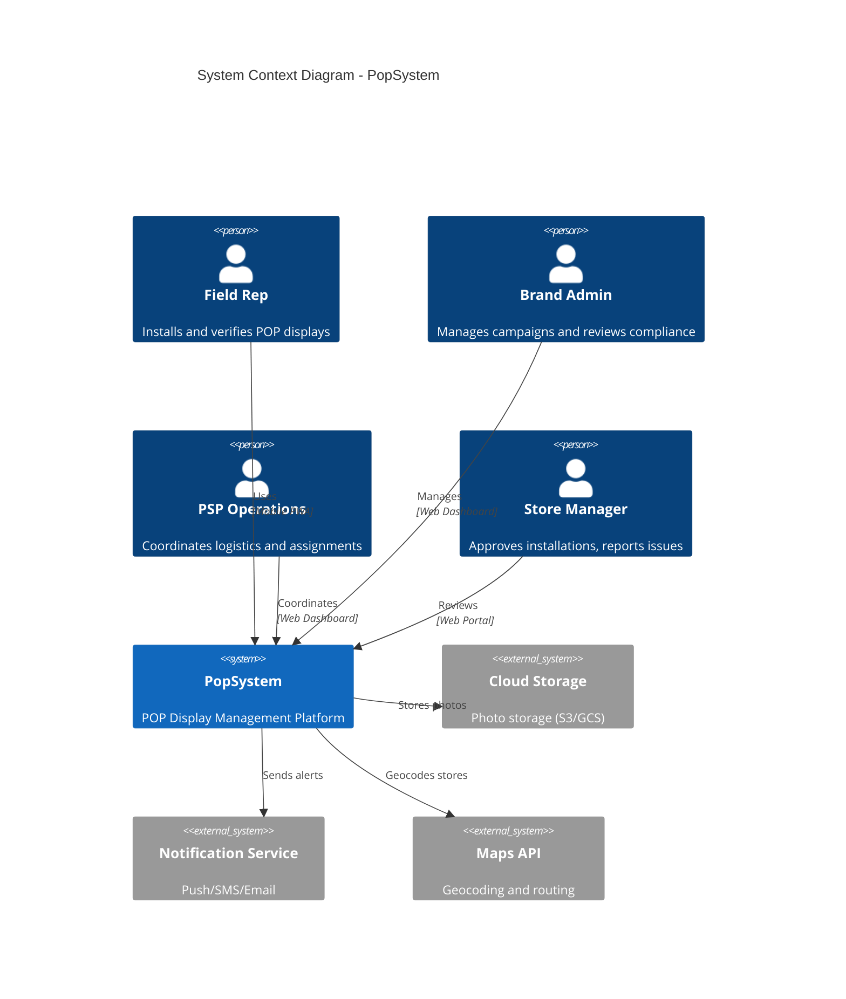

---

## High-Level Architecture

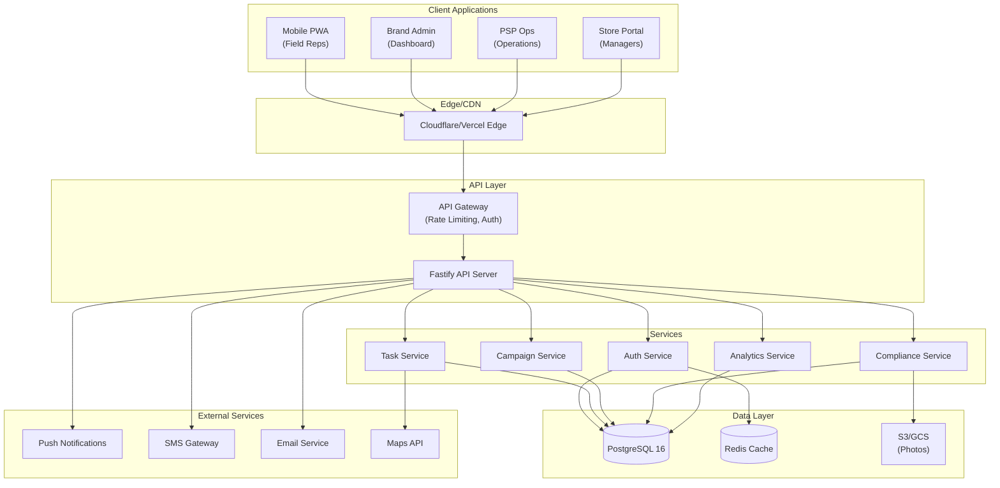

---

## Application Architecture

### Frontend Application Structure

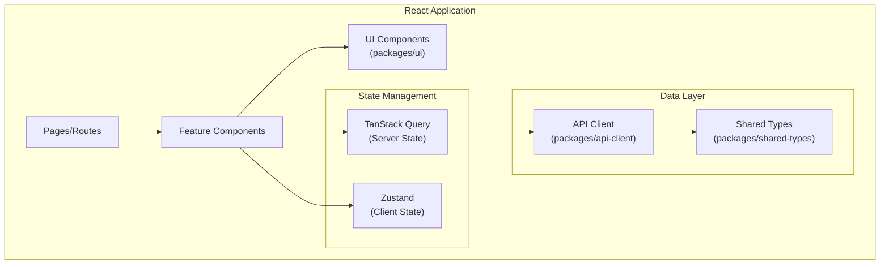

### Backend Service Architecture

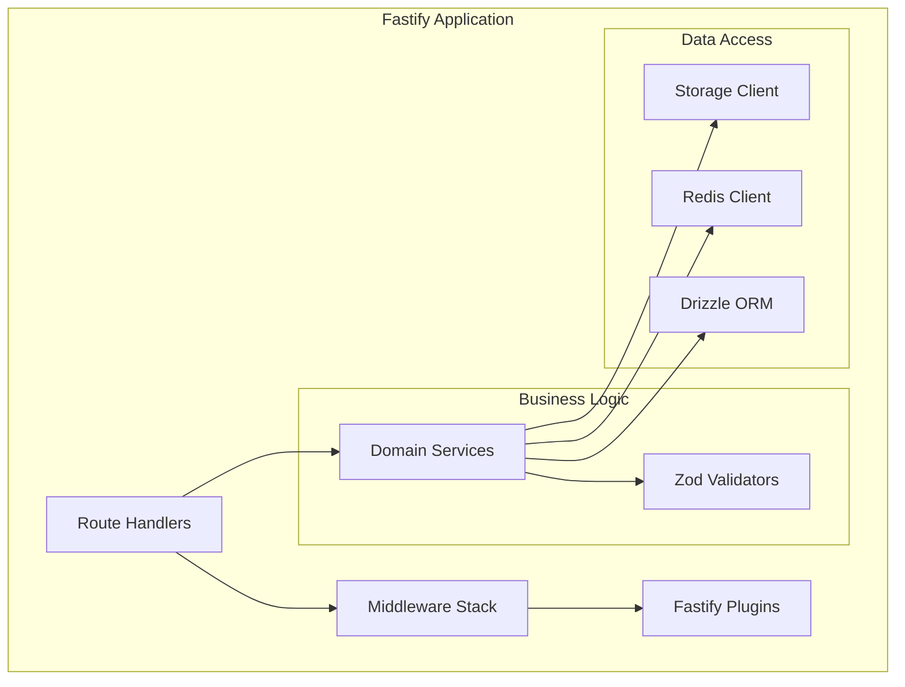

---

## Data Flow Diagrams

### Task Completion Flow

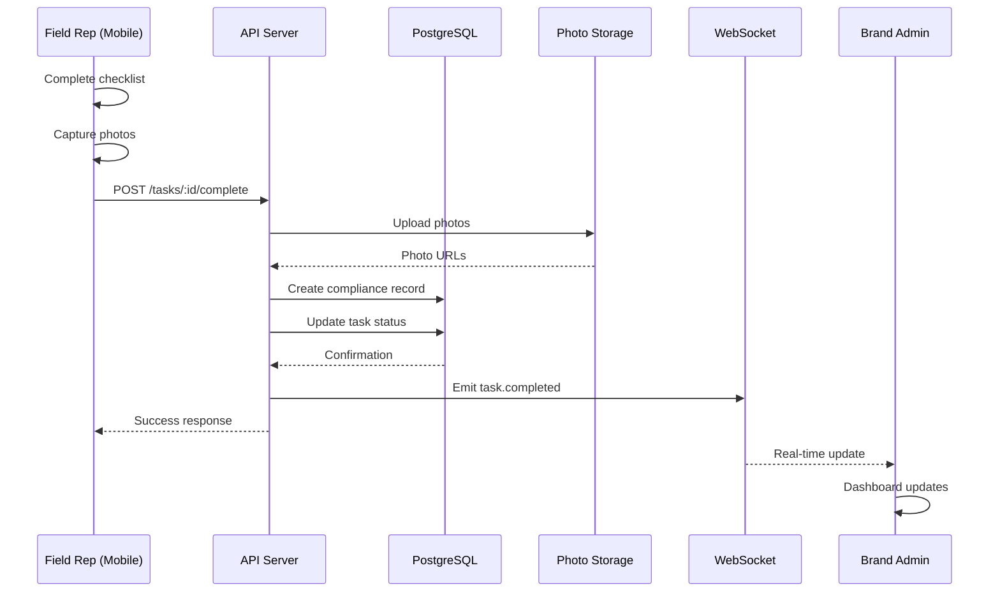

### Campaign Creation Flow

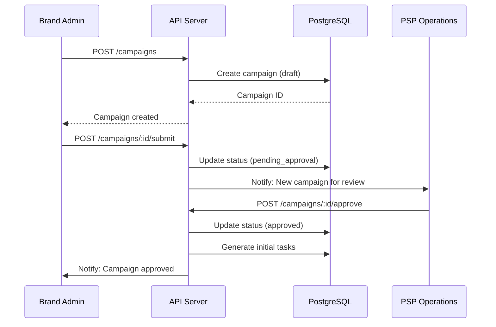

---

## Deployment Architecture

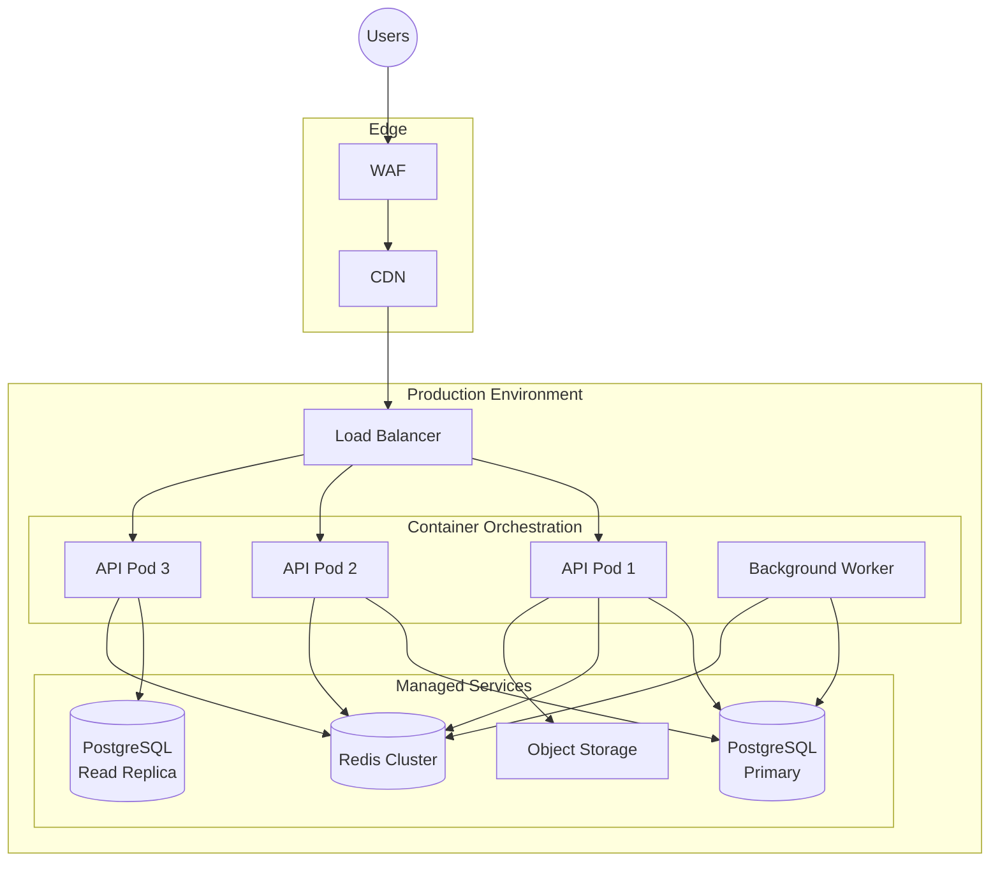

---

## Security Architecture

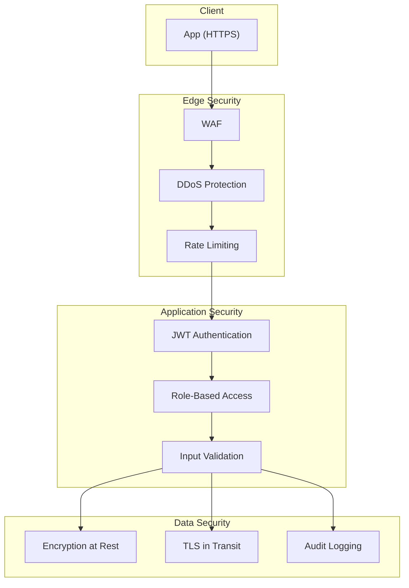

### Authentication Flow

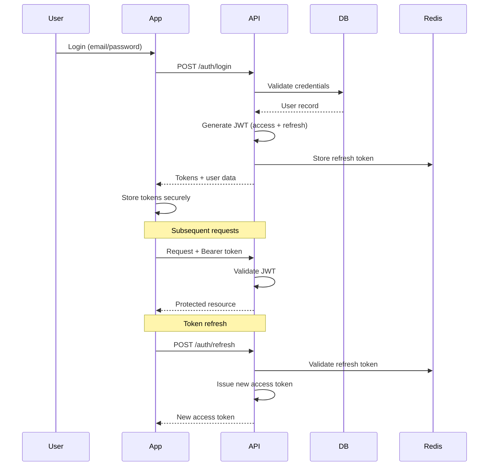

---

## Integration Points

### External Service Integrations

| Service | Purpose | Integration Method |
|---------|---------|-------------------|
| AWS S3 / GCS | Photo storage | SDK / Signed URLs |
| Firebase Cloud Messaging | Push notifications | REST API |
| Twilio | SMS notifications | REST API |
| SendGrid | Email notifications | REST API |
| Google Maps | Geocoding, directions | REST API |
| Stripe | Payment processing | SDK |

### Internal Service Communication

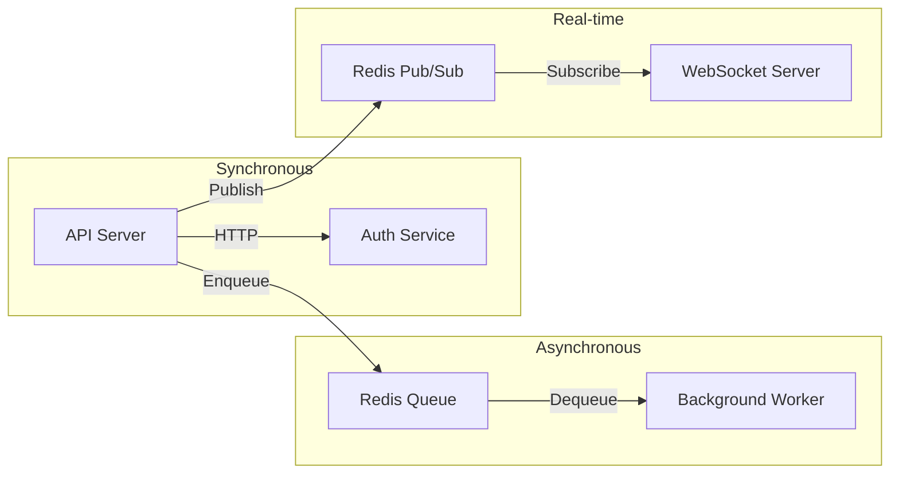

---

## Scalability Considerations

### Horizontal Scaling

| Component | Scaling Strategy |
|-----------|-----------------|
| API Servers | Kubernetes HPA based on CPU/requests |
| Background Workers | Queue depth-based scaling |
| PostgreSQL Reads | Read replicas |
| Redis | Redis Cluster |
| Static Assets | CDN with edge caching |

### Caching Strategy

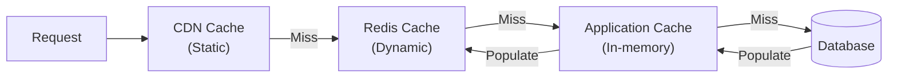

| Cache Layer | TTL | Use Case |
|-------------|-----|----------|
| CDN | 1 hour | Static assets, public API responses |
| Redis | 5-15 min | Session data, frequently accessed queries |
| Application | 1 min | Hot data, computed values |

---

*Last Updated: 2026-01-01*
