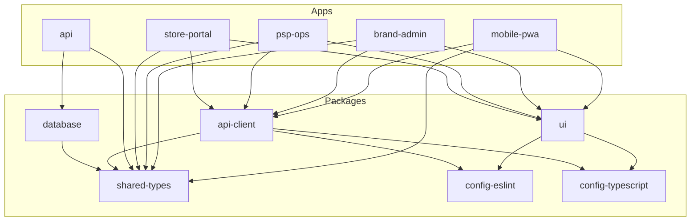

# Monorepo Structure

This document details the Turborepo-based monorepo organization for PopSystem.

---

## Directory Structure

```
popsystem/
├── .github/
│   └── workflows/
│       ├── ci.yml
│       ├── deploy-staging.yml
│       └── deploy-production.yml
│
├── apps/
│   ├── mobile-pwa/              # Field rep mobile application
│   ├── brand-admin/             # Brand manager dashboard
│   ├── psp-ops/                 # PSP operations center
│   ├── store-portal/            # Store manager interface
│   └── api/                     # Backend API server
│
├── packages/
│   ├── ui/                      # Shared UI component library
│   ├── api-client/              # Generated API client
│   ├── shared-types/            # Shared TypeScript types
│   ├── database/                # Drizzle schema and migrations
│   ├── config-eslint/           # Shared ESLint configuration
│   ├── config-typescript/       # Shared TypeScript configuration
│   └── utils/                   # Shared utility functions
│
├── tools/
│   ├── scripts/                 # Build and deployment scripts
│   └── generators/              # Code generators
│
├── docs/
│   ├── api/                     # API documentation
│   ├── guides/                  # Developer guides
│   └── adr/                     # Architecture decision records
│
├── turbo.json                   # Turborepo configuration
├── pnpm-workspace.yaml          # pnpm workspace definition
├── package.json                 # Root package.json
├── .env.example                 # Environment variables template
├── docker-compose.yml           # Local development services
└── README.md
```

---

## Application Details

### apps/mobile-pwa/

Field representative mobile application (Progressive Web App).

```
mobile-pwa/
├── public/
│   ├── manifest.json
│   ├── sw.js
│   └── icons/
│
├── src/
│   ├── components/
│   │   ├── tasks/
│   │   │   ├── TaskCard.tsx
│   │   │   ├── TaskList.tsx
│   │   │   └── TaskDetails.tsx
│   │   ├── compliance/
│   │   │   ├── PhotoCapture.tsx
│   │   │   ├── ChecklistForm.tsx
│   │   │   └── ComplianceSubmit.tsx
│   │   └── navigation/
│   │       ├── BottomNav.tsx
│   │       └── Header.tsx
│   │
│   ├── pages/
│   │   ├── dashboard/
│   │   ├── tasks/
│   │   ├── compliance/
│   │   ├── profile/
│   │   └── settings/
│   │
│   ├── hooks/
│   │   ├── useTasks.ts
│   │   ├── useCompliance.ts
│   │   ├── useOfflineSync.ts
│   │   └── useGeolocation.ts
│   │
│   ├── stores/
│   │   ├── authStore.ts
│   │   ├── offlineStore.ts
│   │   └── uiStore.ts
│   │
│   ├── utils/
│   │   ├── camera.ts
│   │   ├── geolocation.ts
│   │   └── offline.ts
│   │
│   ├── App.tsx
│   ├── main.tsx
│   └── vite-env.d.ts
│
├── index.html
├── vite.config.ts
├── tailwind.config.js
├── tsconfig.json
└── package.json
```

**Key Features:**
- Offline-first with service workers
- Camera integration for photo capture
- GPS for location verification
- Background sync for queued submissions

---

### apps/brand-admin/

Brand manager dashboard for campaign management and compliance review.

```
brand-admin/
├── src/
│   ├── components/
│   │   ├── campaigns/
│   │   │   ├── CampaignWizard/
│   │   │   ├── CampaignList/
│   │   │   └── CampaignAnalytics/
│   │   ├── compliance/
│   │   │   ├── ComplianceReview/
│   │   │   ├── PhotoGallery/
│   │   │   └── ApprovalWorkflow/
│   │   ├── stores/
│   │   │   ├── StoreMap/
│   │   │   └── StoreList/
│   │   └── reports/
│   │       ├── DashboardWidgets/
│   │       └── ReportBuilder/
│   │
│   ├── pages/
│   │   ├── dashboard/
│   │   ├── campaigns/
│   │   ├── compliance/
│   │   ├── stores/
│   │   ├── reports/
│   │   └── settings/
│   │
│   ├── hooks/
│   │   ├── useCampaigns.ts
│   │   ├── useComplianceReview.ts
│   │   └── useAnalytics.ts
│   │
│   └── stores/
│       ├── authStore.ts
│       ├── campaignStore.ts
│       └── filterStore.ts
│
├── vite.config.ts
├── tailwind.config.js
├── tsconfig.json
└── package.json
```

**Key Features:**
- Campaign creation wizard
- Compliance photo review interface
- Real-time analytics dashboards
- Store performance heatmaps

---

### apps/psp-ops/

PSP operations center for task coordination and logistics.

```
psp-ops/
├── src/
│   ├── components/
│   │   ├── tasks/
│   │   │   ├── TaskScheduler/
│   │   │   ├── AssignmentBoard/
│   │   │   └── TaskTimeline/
│   │   ├── crews/
│   │   │   ├── CrewManagement/
│   │   │   ├── AvailabilityCalendar/
│   │   │   └── SkillMatrix/
│   │   ├── logistics/
│   │   │   ├── RouteOptimizer/
│   │   │   ├── InventoryTracker/
│   │   │   └── ShipmentStatus/
│   │   └── monitoring/
│   │       ├── LiveDashboard/
│   │       └── AlertCenter/
│   │
│   ├── pages/
│   │   ├── dashboard/
│   │   ├── scheduling/
│   │   ├── crews/
│   │   ├── logistics/
│   │   ├── monitoring/
│   │   └── reports/
│   │
│   ├── hooks/
│   │   ├── useScheduling.ts
│   │   ├── useCrews.ts
│   │   └── useLiveUpdates.ts
│   │
│   └── stores/
│       ├── schedulerStore.ts
│       └── notificationStore.ts
│
├── vite.config.ts
├── tailwind.config.js
├── tsconfig.json
└── package.json
```

**Key Features:**
- Drag-and-drop task scheduling
- Crew assignment and management
- Route optimization tools
- Real-time field rep tracking

---

### apps/store-portal/

Store manager interface for installation approval and issue reporting.

```
store-portal/
├── src/
│   ├── components/
│   │   ├── installations/
│   │   │   ├── InstallationQueue/
│   │   │   ├── ApprovalForm/
│   │   │   └── PhotoCompare/
│   │   ├── issues/
│   │   │   ├── IssueReporter/
│   │   │   └── IssueHistory/
│   │   └── schedule/
│   │       ├── UpcomingVisits/
│   │       └── CalendarView/
│   │
│   ├── pages/
│   │   ├── dashboard/
│   │   ├── pending/
│   │   ├── history/
│   │   ├── issues/
│   │   └── settings/
│   │
│   ├── hooks/
│   │   ├── useInstallations.ts
│   │   └── useIssues.ts
│   │
│   └── stores/
│       └── authStore.ts
│
├── vite.config.ts
├── tailwind.config.js
├── tsconfig.json
└── package.json
```

**Key Features:**
- Installation approval queue
- Before/after photo comparison
- Issue reporting with photos
- Visit schedule calendar

---

### apps/api/

Backend API server built with Fastify.

```
api/
├── src/
│   ├── routes/
│   │   ├── auth/
│   │   │   ├── login.ts
│   │   │   ├── register.ts
│   │   │   ├── refresh.ts
│   │   │   └── schemas.ts
│   │   ├── campaigns/
│   │   │   ├── create.ts
│   │   │   ├── list.ts
│   │   │   ├── update.ts
│   │   │   └── schemas.ts
│   │   ├── tasks/
│   │   ├── compliance/
│   │   ├── stores/
│   │   ├── users/
│   │   └── index.ts
│   │
│   ├── services/
│   │   ├── auth.service.ts
│   │   ├── campaign.service.ts
│   │   ├── task.service.ts
│   │   ├── compliance.service.ts
│   │   └── notification.service.ts
│   │
│   ├── middleware/
│   │   ├── authenticate.ts
│   │   ├── authorize.ts
│   │   ├── validate.ts
│   │   └── rateLimit.ts
│   │
│   ├── plugins/
│   │   ├── database.ts
│   │   ├── redis.ts
│   │   ├── storage.ts
│   │   └── websocket.ts
│   │
│   ├── utils/
│   │   ├── errors.ts
│   │   ├── logger.ts
│   │   └── pagination.ts
│   │
│   ├── app.ts
│   └── server.ts
│
├── tests/
│   ├── unit/
│   ├── integration/
│   └── fixtures/
│
├── drizzle.config.ts
├── tsconfig.json
└── package.json
```

---

## Package Details

### packages/ui/

Shared UI component library.

```
ui/
├── src/
│   ├── atoms/
│   │   ├── Button/
│   │   │   ├── Button.tsx
│   │   │   ├── Button.types.ts
│   │   │   ├── Button.test.tsx
│   │   │   └── index.ts
│   │   ├── Input/
│   │   ├── Badge/
│   │   ├── Icon/
│   │   ├── Avatar/
│   │   └── Spinner/
│   │
│   ├── molecules/
│   │   ├── FormField/
│   │   ├── Card/
│   │   ├── SearchInput/
│   │   ├── StatusBadge/
│   │   ├── DatePicker/
│   │   └── Select/
│   │
│   ├── organisms/
│   │   ├── DataTable/
│   │   ├── PhotoCapture/
│   │   ├── TaskList/
│   │   ├── Modal/
│   │   ├── Sidebar/
│   │   └── Header/
│   │
│   └── templates/
│       ├── DashboardLayout/
│       ├── FormLayout/
│       ├── MobileLayout/
│       └── AuthLayout/
│
├── styles/
│   ├── globals.css
│   └── tokens.css
│
├── index.ts
├── tailwind.config.js
├── tsconfig.json
└── package.json
```

---

### packages/api-client/

Generated TypeScript API client.

```
api-client/
├── src/
│   ├── client.ts           # Base client configuration
│   ├── endpoints/
│   │   ├── auth.ts
│   │   ├── campaigns.ts
│   │   ├── tasks.ts
│   │   ├── compliance.ts
│   │   ├── stores.ts
│   │   └── users.ts
│   │
│   └── types/
│       ├── requests.ts
│       └── responses.ts
│
├── scripts/
│   └── generate.ts         # OpenAPI client generator
│
├── index.ts
├── tsconfig.json
└── package.json
```

---

### packages/shared-types/

Shared TypeScript types and interfaces.

```
shared-types/
├── src/
│   ├── entities/
│   │   ├── user.ts
│   │   ├── campaign.ts
│   │   ├── task.ts
│   │   ├── store.ts
│   │   └── compliance.ts
│   │
│   ├── api/
│   │   ├── requests.ts
│   │   ├── responses.ts
│   │   └── errors.ts
│   │
│   ├── enums/
│   │   ├── status.ts
│   │   ├── roles.ts
│   │   └── types.ts
│   │
│   └── utils/
│       ├── pagination.ts
│       └── filters.ts
│
├── index.ts
├── tsconfig.json
└── package.json
```

---

### packages/database/

Drizzle ORM schema and migrations.

```
database/
├── src/
│   ├── schema/
│   │   ├── users.ts
│   │   ├── campaigns.ts
│   │   ├── tasks.ts
│   │   ├── stores.ts
│   │   ├── compliance.ts
│   │   ├── enums.ts
│   │   ├── relations.ts
│   │   └── index.ts
│   │
│   ├── migrations/
│   │   ├── 0000_initial.sql
│   │   ├── 0001_add_compliance.sql
│   │   └── meta/
│   │
│   ├── seeds/
│   │   ├── development.ts
│   │   └── test.ts
│   │
│   ├── client.ts           # Database connection
│   └── index.ts
│
├── drizzle.config.ts
├── tsconfig.json
└── package.json
```

---

## Configuration Files

### turbo.json

```json
{
  "$schema": "https://turbo.build/schema.json",
  "globalDependencies": [".env"],
  "pipeline": {
    "build": {
      "dependsOn": ["^build"],
      "outputs": ["dist/**", ".next/**", "build/**"],
      "env": ["NODE_ENV", "DATABASE_URL"]
    },
    "dev": {
      "cache": false,
      "persistent": true
    },
    "lint": {
      "outputs": []
    },
    "lint:fix": {
      "outputs": []
    },
    "test": {
      "dependsOn": ["build"],
      "outputs": ["coverage/**"]
    },
    "test:e2e": {
      "dependsOn": ["build"],
      "outputs": []
    },
    "typecheck": {
      "dependsOn": ["^build"],
      "outputs": []
    },
    "db:generate": {
      "outputs": ["src/migrations/**"]
    },
    "db:migrate": {
      "cache": false
    },
    "clean": {
      "cache": false
    }
  }
}
```

### pnpm-workspace.yaml

```yaml
packages:
  - 'apps/*'
  - 'packages/*'
  - 'tools/*'
```

### Root package.json

```json
{
  "name": "popsystem",
  "private": true,
  "scripts": {
    "dev": "turbo dev",
    "build": "turbo build",
    "lint": "turbo lint",
    "test": "turbo test",
    "typecheck": "turbo typecheck",
    "clean": "turbo clean && rm -rf node_modules",
    "db:generate": "turbo db:generate --filter=@popsystem/database",
    "db:migrate": "turbo db:migrate --filter=@popsystem/database",
    "db:studio": "pnpm --filter @popsystem/database drizzle-kit studio"
  },
  "devDependencies": {
    "turbo": "^1.12.0",
    "typescript": "^5.3.0"
  },
  "packageManager": "pnpm@8.14.0",
  "engines": {
    "node": ">=20.0.0",
    "pnpm": ">=8.0.0"
  }
}
```

---

## Package Dependencies



---

## Common Commands

```bash
# Install dependencies
pnpm install

# Start all apps in development
pnpm dev

# Start specific app
pnpm dev --filter mobile-pwa
pnpm dev --filter api

# Build all packages and apps
pnpm build

# Run tests
pnpm test

# Type checking
pnpm typecheck

# Linting
pnpm lint
pnpm lint:fix

# Database operations
pnpm db:generate    # Generate migrations
pnpm db:migrate     # Run migrations
pnpm db:studio      # Open Drizzle Studio

# Clean build artifacts
pnpm clean
```

---

*Last Updated: 2026-01-01*
