# Critical Path Analysis - NewPOPSys v1

## Critical Path Overview

The critical path represents the longest sequence of dependent tasks that determines the minimum project duration. Any delay on the critical path directly delays the project completion.

---

## Critical Path Diagram

```mermaid
flowchart LR
    subgraph Phase1[Phase 1: Foundation]
        A[POP-001<br>Frappe Setup<br>3 SP] --> C[POP-003<br>ERPNext Init<br>5 SP]
        C --> D[POP-004<br>DocType Schemas<br>8 SP]
        D --> G[POP-007<br>Customer DocType<br>5 SP]
        D --> H[POP-008<br>Product DocType<br>5 SP]
    end

    subgraph Phase2[Phase 2: Core]
        G --> I[POP-009<br>Order DocType<br>8 SP]
        H --> I
        I --> Q[POP-017<br>OPS Integration<br>13 SP]
        Q --> R[POP-018<br>Order Sync<br>8 SP]
        R --> U[POP-021<br>Job Queue<br>8 SP]
        U --> V[POP-022<br>Job Ticket<br>5 SP]
        V --> W[POP-023<br>Workflow States<br>8 SP]
    end

    subgraph Phase3[Phase 3: Advanced]
        W --> Y[POP-027<br>Status Tracking<br>5 SP]
        Y --> AA[POP-029<br>Customer Portal<br>13 SP]
        AA --> AB[POP-030<br>Order Status UI<br>8 SP]
    end

    subgraph Phase4[Phase 4: Launch]
        AB --> AH[POP-044<br>Performance<br>8 SP]
        AH --> AI[POP-045<br>Security Audit<br>8 SP]
        AI --> AK[POP-047<br>UAT<br>8 SP]
        AK --> AL[POP-048<br>Bug Fixes<br>13 SP]
        AL --> AO[POP-051<br>Deploy Prep<br>8 SP]
        AO --> AP[GO-LIVE]
    end

    style A fill:#ff6b6b
    style C fill:#ff6b6b
    style D fill:#ff6b6b
    style I fill:#ff6b6b
    style Q fill:#ff6b6b
    style R fill:#ff6b6b
    style U fill:#ff6b6b
    style V fill:#ff6b6b
    style W fill:#ff6b6b
    style Y fill:#ff6b6b
    style AA fill:#ff6b6b
    style AB fill:#ff6b6b
    style AH fill:#ff6b6b
    style AI fill:#ff6b6b
    style AK fill:#ff6b6b
    style AL fill:#ff6b6b
    style AO fill:#ff6b6b
    style AP fill:#ff6b6b
```

---

## Critical Path Tasks

| Sequence | Task ID | Task Name | Duration | Sprint | Float |
|----------|---------|-----------|----------|--------|-------|
| 1 | POP-001 | Setup Frappe development environment | 3 SP | S0 | 0 days |
| 2 | POP-003 | Initialize ERPNext base modules | 5 SP | S0 | 0 days |
| 3 | POP-004 | Define core DocType schemas | 8 SP | S0 | 0 days |
| 4 | POP-009 | Create Order DocType | 8 SP | S1 | 0 days |
| 5 | POP-017 | OnPrintShop API integration | 13 SP | S3 | 0 days |
| 6 | POP-018 | Order sync automation | 8 SP | S3 | 0 days |
| 7 | POP-021 | Implement job queue system | 8 SP | S4 | 0 days |
| 8 | POP-022 | Create Job Ticket DocType | 5 SP | S4 | 0 days |
| 9 | POP-023 | Production workflow states | 8 SP | S4 | 0 days |
| 10 | POP-027 | Production status tracking | 5 SP | S5 | 0 days |
| 11 | POP-029 | Customer portal frontend | 13 SP | S6 | 0 days |
| 12 | POP-030 | Order status tracking UI | 8 SP | S6 | 0 days |
| 13 | POP-044 | Performance optimization | 8 SP | S10 | 0 days |
| 14 | POP-045 | Security audit remediation | 8 SP | S10 | 0 days |
| 15 | POP-047 | User acceptance testing | 8 SP | S11 | 0 days |
| 16 | POP-048 | Bug fixes from UAT | 13 SP | S11 | 0 days |
| 17 | POP-051 | Production deployment prep | 8 SP | S12 | 0 days |

**Critical Path Length**: ~122 Story Points across 22 weeks

---

## Dependency Matrix

### Direct Dependencies (Must Complete Before)

| Task | Depends On | Blocking |
|------|------------|----------|
| POP-003 | POP-001 | POP-004 |
| POP-004 | POP-003 | POP-007, POP-008, POP-015 |
| POP-005 | POP-002 | - |
| POP-006 | POP-002 | - |
| POP-007 | POP-004 | POP-009, POP-029 |
| POP-008 | POP-004 | POP-009, POP-013, POP-014, POP-020, POP-033 |
| POP-009 | POP-007, POP-008 | POP-010, POP-016, POP-017, POP-021, POP-031, POP-037 |
| POP-011 | POP-003 | POP-012 |
| POP-017 | POP-009 | POP-018, POP-019, POP-020 |
| POP-021 | POP-009 | POP-022 |
| POP-022 | POP-021 | POP-023, POP-024 |
| POP-023 | POP-022 | POP-025, POP-027 |
| POP-027 | POP-023 | POP-028, POP-030 |
| POP-029 | POP-007 | POP-030 |
| POP-037 | POP-009 | POP-038, POP-039 |
| POP-044 | All core features | POP-045, POP-046 |
| POP-045 | All core features | POP-047 |
| POP-047 | All features | POP-048 |
| POP-051 | POP-048, POP-049, POP-050 | Go-Live |

---

## Near-Critical Paths

### Path 2: Docker/CI/CD Track
`POP-002 → POP-005 → POP-006` (13 SP, 3 days float)

### Path 3: Authentication Track
`POP-003 → POP-011 → POP-012` (15 SP, 5 days float)

### Path 4: OneVision Integration Track
`POP-022 → POP-024 → POP-025 → POP-026` (34 SP, 2 days float)

### Path 5: Inventory Track
`POP-008 → POP-033 → POP-034 → POP-035` (24 SP, 5 days float)

---

## Critical Path Risk Analysis

| Risk | Impact on Critical Path | Probability | Mitigation |
|------|------------------------|-------------|------------|
| Frappe setup issues | Delays entire project | Medium | Pre-validated environment |
| DocType schema changes | Rework downstream | High | Thorough upfront design |
| OPS API complexity | S3 slip | High | Early API exploration |
| Job queue performance | S4-S5 slip | Medium | Load testing early |
| Customer portal scope | S6 slip | High | MVP scope definition |
| UAT finding volume | Go-live delay | High | Buffer time built in |

---

## Float Analysis

| Task Category | Total Float | Implications |
|---------------|-------------|--------------|
| Critical Path Tasks | 0 days | Any delay impacts go-live |
| Parallel Infrastructure | 3 days | Can absorb minor delays |
| Integration Work | 2 days | Limited buffer |
| Inventory Module | 5 days | Some flexibility |
| Reporting Features | 7 days | Most flexibility |

---

## Critical Path Management Actions

### Daily Monitoring
- Track progress on critical path tasks first
- Immediate escalation of any blockers
- Resource priority to critical path

### Weekly Review
- Assess critical path health
- Identify emerging risks
- Adjust non-critical resources as needed

### Sprint Planning
- Ensure critical path tasks fully staffed
- No dependencies on unconfirmed resources
- Buffer for integration complexity

---

## Early Warning Indicators

| Indicator | Threshold | Action |
|-----------|-----------|--------|
| Critical task > 1 day behind | Alert | Daily focus review |
| Critical task > 3 days behind | Warning | Resource reallocation |
| Critical task > 5 days behind | Critical | Scope/timeline review |
| Multiple critical tasks delayed | Emergency | Executive escalation |

---

## Compression Opportunities

If schedule compression needed:

| Option | Tasks Affected | Potential Savings | Cost/Risk |
|--------|---------------|-------------------|-----------|
| Parallel development | POP-007, POP-008 | 3 days | Low - already parallel |
| Fast-track integration | POP-017, POP-018 | 5 days | Medium - risk of rework |
| Reduce UAT scope | POP-047, POP-048 | 3 days | High - quality risk |
| Additional resources | POP-029, POP-030 | 4 days | Medium - cost increase |

---

*Last Updated: 2026-01-01*
