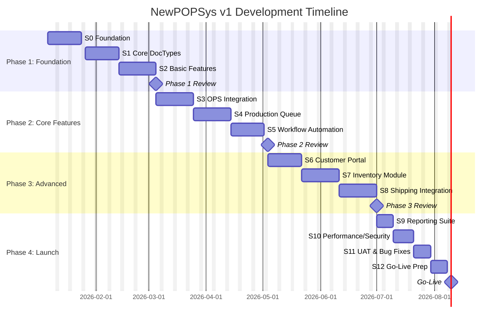
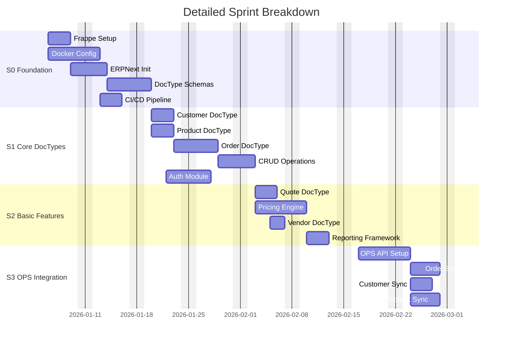
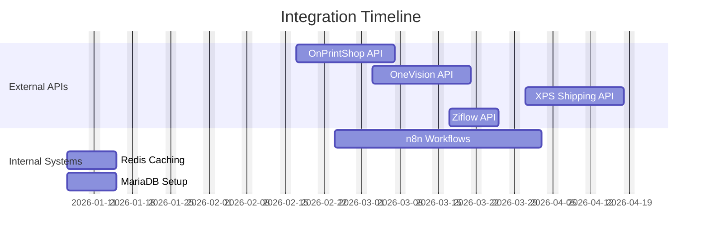
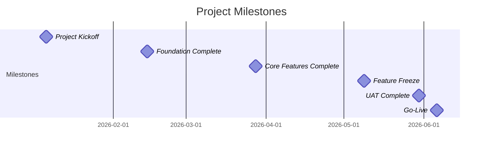

# Gantt Chart - NewPOPSys v1 Development Timeline

## Project Timeline Visualization

---

## Detailed Sprint Timeline

---

## Integration Dependencies

---

## Sprint Calendar View

| Week | Dates | Sprint | Focus Area | Key Deliverables |
|------|-------|--------|------------|------------------|
| W1 | Jan 06-10 | S0 | Foundation | Frappe, Docker setup |
| W2 | Jan 13-17 | S0 | Foundation | ERPNext, CI/CD |
| W3 | Jan 20-24 | S1 | Core DocTypes | Customer, Product |
| W4 | Jan 27-31 | S1 | Core DocTypes | Order, Auth |
| W5 | Feb 03-07 | S2 | Basic Features | Quote, Pricing |
| W6 | Feb 10-14 | S2 | Basic Features | Vendor, Reporting |
| W7 | Feb 17-21 | S3 | OPS Integration | API setup, Order sync |
| W8 | Feb 24-28 | S3 | OPS Integration | Customer/Product sync |
| W9 | Mar 03-07 | S4 | Production | Job queue, Job tickets |
| W10 | Mar 10-14 | S4 | Production | OneVision integration |
| W11 | Mar 17-21 | S5 | Workflow | Job routing, Equipment |
| W12 | Mar 24-28 | S5 | Workflow | Status tracking |
| W13 | Mar 31-Apr 04 | S6 | Portal | Customer portal |
| W14 | Apr 07-11 | S6 | Portal | Order status UI |
| W15 | Apr 14-18 | S7 | Inventory | Stock tracking |
| W16 | Apr 21-25 | S7 | Inventory | PO generation |
| W17 | Apr 28-May 02 | S8 | Shipping | XPS integration |
| W18 | May 05-09 | S8 | Shipping | Labels, Tracking |
| W19 | May 12-16 | S9 | Reports | Analytics suite |
| W20 | May 19-23 | S10 | Polish | Performance, Security |
| W21 | May 26-30 | S11 | Testing | UAT, Bug fixes |
| W22 | Jun 02-06 | S12 | Launch | Go-live prep |

---

## Key Milestones

---

## Resource Allocation by Sprint

| Sprint | Dev Hours | Focus | Risk Level |
|--------|-----------|-------|------------|
| S0 | 80 hrs | Infrastructure | Low |
| S1 | 80 hrs | Core Development | Medium |
| S2 | 80 hrs | Features | Medium |
| S3 | 80 hrs | Integration | High |
| S4 | 80 hrs | Production | High |
| S5 | 80 hrs | Automation | Medium |
| S6 | 80 hrs | Frontend | Medium |
| S7 | 80 hrs | Inventory | Medium |
| S8 | 80 hrs | Shipping | Medium |
| S9 | 40 hrs | Reporting | Low |
| S10 | 40 hrs | Polish | Medium |
| S11 | 40 hrs | Testing | High |
| S12 | 40 hrs | Launch | High |

---

*Last Updated: 2026-01-01*
