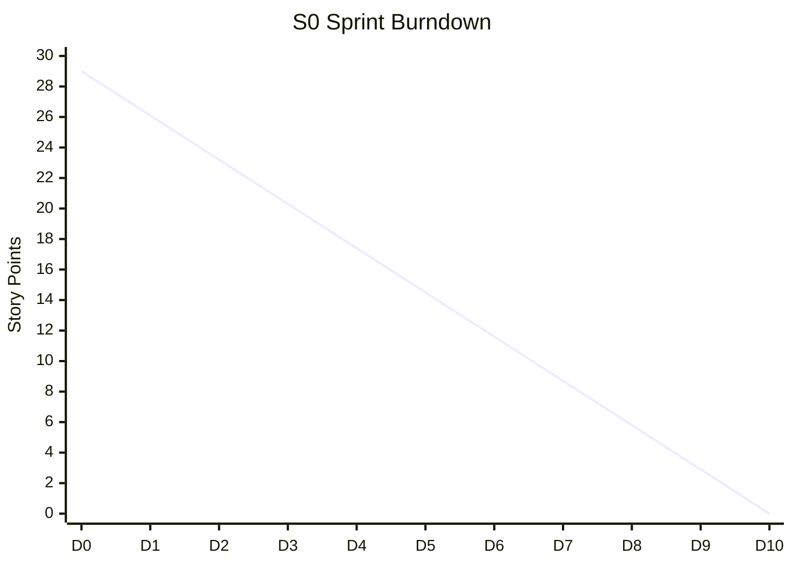

# Sprint Burndown Chart - NewPOPSys v1

## Current Sprint: S0 Foundation

### Sprint Information

| Field | Value |
|-------|-------|
| Sprint | S0 - Foundation |
| Start Date | 2026-01-06 |
| End Date | 2026-01-17 |
| Working Days | 10 |
| Total Story Points | 29 SP |
| Status | NOT STARTED |

---

## Burndown Chart Template

```
Story Points Remaining
    ^
 30 |*                                          Ideal Burndown: ----
    |  *                                        Actual Burndown: ****
 25 |    *
    |      *
 20 |        *
    |          *
 15 |            *
    |              *
 10 |                *
    |                  *
  5 |                    *
    |                      *
  0 +---+---+---+---+---+---+---+---+---+---+---> Days
      1   2   3   4   5   6   7   8   9  10
```

---

## Daily Burndown Data

| Day | Date | Ideal Remaining | Actual Remaining | Variance | Notes |
|-----|------|-----------------|------------------|----------|-------|
| 0 | 2026-01-05 | 29.0 | 29.0 | 0 | Sprint Start |
| 1 | 2026-01-06 | 26.1 | - | - | |
| 2 | 2026-01-07 | 23.2 | - | - | |
| 3 | 2026-01-08 | 20.3 | - | - | |
| 4 | 2026-01-09 | 17.4 | - | - | |
| 5 | 2026-01-10 | 14.5 | - | - | |
| 6 | 2026-01-13 | 11.6 | - | - | Weekend |
| 7 | 2026-01-14 | 8.7 | - | - | |
| 8 | 2026-01-15 | 5.8 | - | - | |
| 9 | 2026-01-16 | 2.9 | - | - | |
| 10 | 2026-01-17 | 0.0 | - | - | Sprint End |

---

## Burndown Visualization (Mermaid)



---

## Task Completion Tracking

| Task ID | Title | SP | Day Started | Day Completed | Duration |
|---------|-------|----|-----------|--------------:|----------|
| POP-001 | Frappe Setup | 3 | - | - | - |
| POP-002 | Docker Config | 5 | - | - | - |
| POP-003 | ERPNext Init | 5 | - | - | - |
| POP-004 | DocType Schemas | 8 | - | - | - |
| POP-005 | CI/CD Pipeline | 5 | - | - | - |
| POP-006 | Dev Database | 3 | - | - | - |

---

## Burndown Patterns Reference

### Healthy Pattern
```
SP |*
   |  *
   |    *
   |      *
   |        *
   +----------> Days
```
Steady, predictable progress along ideal line.

### Late Start Pattern
```
SP |* * *
   |      *
   |        *
   |          *
   |            *
   +----------> Days
```
Slow initial progress, catches up later. Watch for sprint end crunch.

### Scope Creep Pattern
```
SP |*
   |  *  *
   |       *
   |         *
   |           *
   +----------> Days
```
Points added mid-sprint. Review scope change process.

### Blocked Pattern
```
SP |*
   |  * * * *
   |          *
   |            *
   |
   +----------> Days
```
Flat sections indicate blocked work. Immediate attention needed.

### Early Finish Pattern
```
SP |*
   |  *
   |    *
   |      *
   |        * * *
   +----------> Days
```
Team velocity higher than estimated. Consider pulling more work.

---

## Sprint Burndown History

| Sprint | Committed SP | Completed SP | Burndown Shape | Notes |
|--------|--------------|--------------|----------------|-------|
| S0 | 29 | - | - | Current sprint |
| S1 | 33 | - | - | Planned |
| S2 | 21 | - | - | Planned |

---

## Burndown Analysis Template

### Mid-Sprint Check (Day 5)

| Metric | Value | Status |
|--------|-------|--------|
| Expected Remaining | 14.5 SP | - |
| Actual Remaining | - SP | - |
| Variance | - SP | - |
| Trend | - | - |

### Sprint End Analysis

| Metric | Value |
|--------|-------|
| Committed | - SP |
| Completed | - SP |
| Completion Rate | - % |
| Carryover | - SP |
| Burndown Accuracy | - |

---

## Action Thresholds

| Variance | Status | Action |
|----------|--------|--------|
| < 10% | On Track | Continue as planned |
| 10-20% | Warning | Daily focus on blockers |
| 20-30% | At Risk | Scope negotiation |
| > 30% | Critical | Emergency sprint review |

---

*Last Updated: 2026-01-01*
