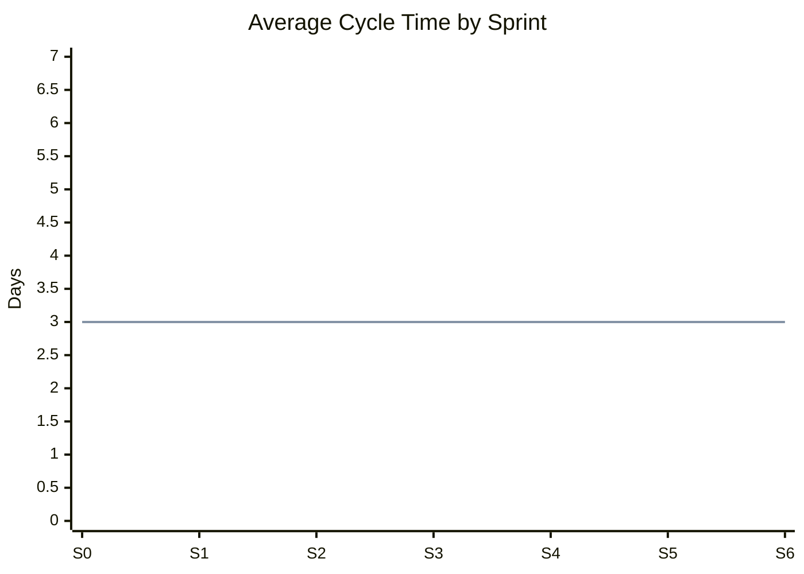

# Sprint Metrics Dashboard - NewPOPSys v1

## Key Performance Indicators

### Primary Metrics

| Metric | Definition | Target | Current | Status |
|--------|------------|--------|---------|--------|
| Velocity | Story points completed per sprint | 25-35 SP | - | - |
| Cycle Time | Time from "In Progress" to "Done" | < 3 days | - | - |
| Lead Time | Time from "Backlog" to "Done" | < 5 days | - | - |
| Escaped Defects | Bugs found in production per release | < 3 | - | - |

---

## Velocity Metrics

### Sprint Velocity Tracking

| Sprint | Committed | Completed | Accuracy | Trend |
|--------|-----------|-----------|----------|-------|
| S0 | 29 SP | - | - | - |
| S1 | 33 SP | - | - | - |
| S2 | 21 SP | - | - | - |
| S3 | 34 SP | - | - | - |
| S4 | 34 SP | - | - | - |
| S5 | 23 SP | - | - | - |
| S6 | 37 SP | - | - | - |
| S7 | 26 SP | - | - | - |
| S8 | 23 SP | - | - | - |
| S9 | 26 SP | - | - | - |
| S10 | 21 SP | - | - | - |
| S11 | 29 SP | - | - | - |
| S12 | 18 SP | - | - | - |

### Velocity Statistics

| Statistic | Value |
|-----------|-------|
| Average Velocity | - |
| Max Velocity | - |
| Min Velocity | - |
| Standard Deviation | - |
| Commitment Accuracy | - |

---

## Cycle Time Metrics

### Cycle Time Distribution

| Range | Count | Percentage |
|-------|-------|------------|
| < 1 day | - | - |
| 1-2 days | - | - |
| 2-3 days | - | - |
| 3-5 days | - | - |
| > 5 days | - | - |

### Cycle Time by Task Type

| Task Type | Avg Cycle Time | Target |
|-----------|----------------|--------|
| Bug Fix | - | < 1 day |
| Feature | - | < 3 days |
| Integration | - | < 4 days |
| Epic | - | < 5 days |

### Cycle Time Trend



---

## Lead Time Metrics

### Lead Time Breakdown

| Phase | Avg Duration | % of Total |
|-------|--------------|------------|
| Backlog Wait | - | - |
| To Do Wait | - | - |
| In Progress | - | - |
| Review Wait | - | - |
| Review | - | - |
| **Total Lead Time** | **-** | **100%** |

### Lead Time Distribution

| Range | Count | Percentage |
|-------|-------|------------|
| < 3 days | - | - |
| 3-5 days | - | - |
| 5-7 days | - | - |
| 7-10 days | - | - |
| > 10 days | - | - |

---

## Quality Metrics

### Escaped Defects

| Sprint | Defects Found | Severity | Root Cause |
|--------|---------------|----------|------------|
| S0 | - | - | - |
| S1 | - | - | - |
| S2 | - | - | - |

### Defect Summary

| Metric | Value | Target | Status |
|--------|-------|--------|--------|
| Escaped Defects (Total) | 0 | < 10 | On Track |
| Critical Defects | 0 | 0 | On Track |
| Defect Resolution Time | - | < 2 days | - |
| Defect Reopen Rate | - | < 5% | - |

### Code Quality Indicators

| Metric | Value | Target |
|--------|-------|--------|
| Unit Test Coverage | - | > 80% |
| Integration Test Coverage | - | > 70% |
| Code Review Turnaround | - | < 4 hours |
| PR Rejection Rate | - | < 10% |

---

## Flow Metrics

### Throughput

| Period | Items Completed | SP Completed |
|--------|-----------------|--------------|
| Week 1 | - | - |
| Week 2 | - | - |
| Week 3 | - | - |
| Week 4 | - | - |

### WIP Age

| Item | Age (days) | State | Alert |
|------|------------|-------|-------|
| - | - | - | - |

### Flow Efficiency

```
Flow Efficiency = Active Time / Total Lead Time × 100%

Target: > 40%
Current: -
```

---

## Sprint Health Metrics

### Current Sprint (S0)

| Indicator | Value | Health |
|-----------|-------|--------|
| Sprint Progress | 0% | Not Started |
| Burndown On Track | - | - |
| WIP Within Limits | Yes | Healthy |
| Blockers | 0 | Healthy |
| Scope Changes | 0 | Healthy |

### Health Score Calculation

| Factor | Weight | Score | Weighted |
|--------|--------|-------|----------|
| Velocity Accuracy | 25% | - | - |
| Cycle Time | 20% | - | - |
| Quality (Defects) | 25% | - | - |
| Flow Efficiency | 15% | - | - |
| Team Satisfaction | 15% | - | - |
| **Overall Health** | **100%** | **-** | **-** |

---

## Team Metrics

### Individual Velocity (Optional)

| Team Member | Assigned SP | Completed SP | Efficiency |
|-------------|-------------|--------------|------------|
| Developer 1 | - | - | - |
| Developer 2 | - | - | - |

### Collaboration Metrics

| Metric | Value | Target |
|--------|-------|--------|
| Pair Programming Hours | - | > 4 hrs/week |
| Code Reviews Given | - | > 3/week |
| Knowledge Sharing Sessions | - | 1/sprint |

---

## Trend Analysis

### Velocity Trend

| Trend | Description | Action |
|-------|-------------|--------|
| Increasing | Team improving | Document practices |
| Stable | Consistent performance | Maintain |
| Decreasing | Issues emerging | Investigate |

### Quality Trend

| Trend | Description | Action |
|-------|-------------|--------|
| Improving | Fewer defects | Continue practices |
| Stable | Consistent quality | Maintain |
| Declining | More defects | Root cause analysis |

---

## Metric Definitions

| Metric | Formula | Unit |
|--------|---------|------|
| Velocity | Σ(Completed SP) / Sprint | SP/Sprint |
| Cycle Time | Done Date - Start Date | Days |
| Lead Time | Done Date - Created Date | Days |
| Throughput | Items Completed / Time Period | Items/Day |
| Flow Efficiency | Work Time / Lead Time × 100 | % |
| Commitment Accuracy | Completed / Committed × 100 | % |

---

## Metric Collection Schedule

| Metric | Frequency | Collector | Due |
|--------|-----------|-----------|-----|
| Velocity | Per Sprint | Scrum Master | Sprint End |
| Cycle Time | Daily | Automated | EOD |
| Lead Time | Daily | Automated | EOD |
| Defects | Per Sprint | QA Lead | Sprint End |
| Flow Metrics | Weekly | Scrum Master | Friday |

---

## Historical Metrics Archive

| Sprint | Velocity | Cycle Time | Lead Time | Defects | Health Score |
|--------|----------|------------|-----------|---------|--------------|
| S0 | - | - | - | - | - |

---

*Last Updated: 2026-01-01*
