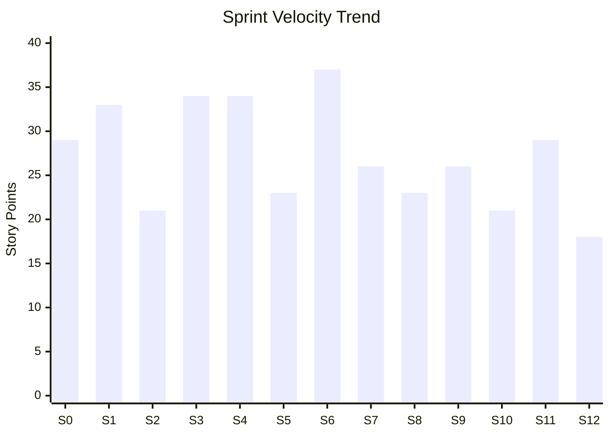

# Velocity Tracker - NewPOPSys v1

## Velocity Overview

Velocity measures the amount of work (in story points) a team completes per sprint. It is used for capacity planning and sprint forecasting.

---

## Velocity Chart



---

## Sprint Velocity Data

| Sprint | Start Date | End Date | Committed SP | Completed SP | Variance | Notes |
|--------|------------|----------|--------------|--------------|----------|-------|
| S0 | 2026-01-06 | 2026-01-17 | 29 | - | - | Foundation |
| S1 | 2026-01-20 | 2026-01-31 | 33 | - | - | Core DocTypes |
| S2 | 2026-02-03 | 2026-02-14 | 21 | - | - | Basic Features |
| S3 | 2026-02-17 | 2026-02-28 | 34 | - | - | OPS Integration |
| S4 | 2026-03-03 | 2026-03-14 | 34 | - | - | Production Queue |
| S5 | 2026-03-17 | 2026-03-28 | 23 | - | - | Workflow |
| S6 | 2026-03-31 | 2026-04-11 | 37 | - | - | Customer Portal |
| S7 | 2026-04-14 | 2026-04-25 | 26 | - | - | Inventory |
| S8 | 2026-04-28 | 2026-05-09 | 23 | - | - | Shipping |
| S9 | 2026-05-12 | 2026-05-16 | 26 | - | - | Reporting (1wk) |
| S10 | 2026-05-19 | 2026-05-23 | 21 | - | - | Polish (1wk) |
| S11 | 2026-05-26 | 2026-05-30 | 29 | - | - | UAT (1wk) |
| S12 | 2026-06-02 | 2026-06-06 | 18 | - | - | Launch (1wk) |

---

## Velocity Statistics

| Metric | Value | Notes |
|--------|-------|-------|
| Sprints Completed | 0 | - |
| Total SP Completed | 0 | - |
| Average Velocity | - | Calculated after S2 |
| Velocity Range | - | Min to Max |
| Standard Deviation | - | Consistency measure |
| Commitment Accuracy | - | Completed/Committed |

---

## Rolling Velocity (Last 3 Sprints)

| Period | S(n-2) | S(n-1) | S(n) | 3-Sprint Avg |
|--------|--------|--------|------|--------------|
| Current | - | - | - | - |
| After S2 | S0 | S1 | S2 | - |
| After S3 | S1 | S2 | S3 | - |
| After S4 | S2 | S3 | S4 | - |
| After S5 | S3 | S4 | S5 | - |

---

## Velocity Factors

### Positive Factors (Increase Velocity)
- [ ] Team familiarity with codebase
- [ ] Improved estimation accuracy
- [ ] Reduced interruptions
- [ ] Better tooling/automation
- [ ] Clear requirements

### Negative Factors (Decrease Velocity)
- [ ] Technical debt
- [ ] Team member absence
- [ ] Scope creep
- [ ] Integration complexity
- [ ] External dependencies

---

## Sprint Capacity Planning

### Team Capacity Formula
```
Sprint Capacity = Team Members × Working Days × Focus Factor × Velocity Factor
```

### Current Team Configuration

| Resource | Availability | Focus Factor | Effective Days |
|----------|--------------|--------------|----------------|
| Developer 1 | 100% | 0.8 | 8 days |
| Developer 2 | 100% | 0.8 | 8 days |
| **Total** | - | - | **16 days** |

### Capacity to SP Conversion

| Sprint Type | Working Days | Estimated Capacity |
|-------------|--------------|-------------------|
| 2-week sprint | 10 | 25-35 SP |
| 1-week sprint | 5 | 12-18 SP |

---

## Velocity Trends Analysis

### Expected Velocity Pattern

| Phase | Sprints | Expected Velocity | Rationale |
|-------|---------|-------------------|-----------|
| Ramp-up | S0-S1 | 20-25 SP | Learning curve |
| Steady State | S2-S8 | 25-35 SP | Full productivity |
| Wind-down | S9-S12 | 15-25 SP | 1-week sprints, hardening |

### Velocity Stability Targets

| Metric | Target | Current |
|--------|--------|---------|
| Sprint-over-sprint variance | < 20% | - |
| Commitment accuracy | > 80% | - |
| 3-sprint rolling avg stability | ± 15% | - |

---

## Forecasting Using Velocity

### Release Forecasting

| Remaining Work | Estimated Velocity | Sprints Needed | Target Date |
|----------------|-------------------|----------------|-------------|
| ~200 SP | 25 SP/sprint (est) | 8 sprints | On track |

### Confidence Levels

| Scenario | Velocity Used | Completion |
|----------|---------------|------------|
| Optimistic | High velocity | Early |
| Expected | Avg velocity | On target |
| Conservative | Low velocity | Late |

---

## Velocity Improvement Actions

| Sprint | Issue Identified | Action Taken | Result |
|--------|-----------------|--------------|--------|
| - | - | - | - |

---

## Commitment vs Completion Tracking

```
SP
40 |
35 |     ██                     ██
30 | ██      ██ ██         ██       ██
25 |                 ██ ██
20 |             ██          ██          ██ ██
15 |                                              ██
10 |
 5 |
 0 +--+--+--+--+--+--+--+--+--+--+--+--+--+
     S0 S1 S2 S3 S4 S5 S6 S7 S8 S9 S10S11S12

     ██ Committed   ░░ Completed
```

---

*Last Updated: 2026-01-01*
