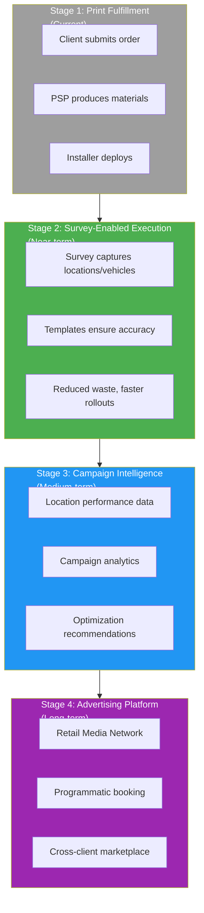
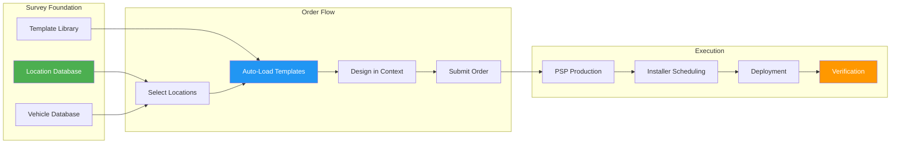
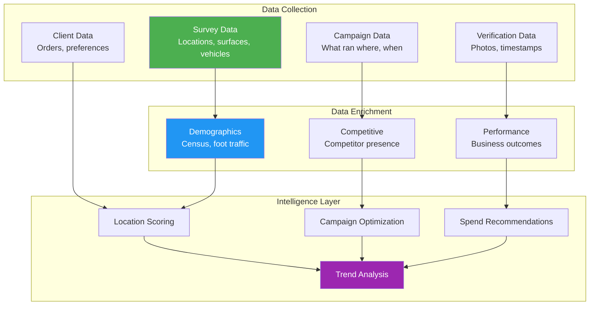
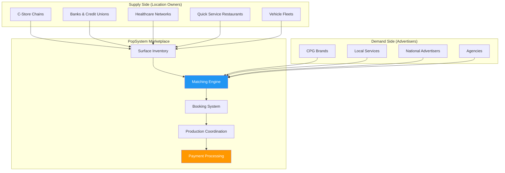
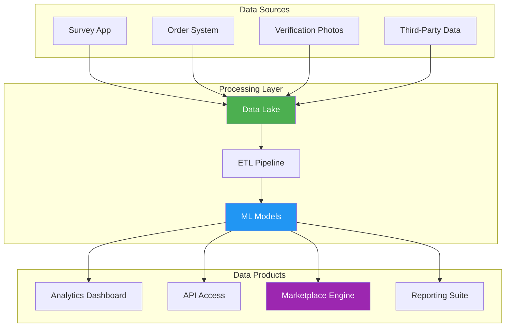

# Marketing Platform Evolution

## Executive Summary

This document charts PopSystem's evolution from a print fulfillment platform to a comprehensive physical advertising execution platform. The foundation laid by Survey as a Service—accurate location data, vehicle templates, and production infrastructure—enables a natural expansion into advertising planning, campaign analytics, and eventually programmatic physical media buying.

**The Strategic Arc:**
```
Print Fulfillment → Campaign Execution → Advertising Platform → Media Network
```

**Why This Matters:**
- Print fulfillment is a commodity; advertising platforms command premium valuations
- Survey data creates an unassailable competitive advantage
- Network effects accelerate as more locations and brands join
- Revenue shifts from transactional (per-print) to recurring (subscriptions, transactions)

---

## 1. Platform Evolution Stages



---

## 2. Stage 1: Print Fulfillment (Current State)

### 2.1 Current Capabilities

| Capability | Description |
|------------|-------------|
| Order Management | Clients submit print orders through platform |
| PSP Routing | Orders routed to appropriate print service providers |
| Production Tracking | Status updates through fulfillment |
| Delivery Coordination | Shipping to locations or central distribution |

### 2.2 Current Limitations

| Limitation | Impact |
|------------|--------|
| No location data | Reprints from measurement errors |
| Manual specifications | Slow order creation, errors |
| No installation coordination | Separate from production workflow |
| Limited analytics | No campaign performance visibility |

### 2.3 Revenue Model

| Stream | Type | Margin |
|--------|------|--------|
| Platform transaction fee | Per-order | 5-15% |
| Subscription (if applicable) | Monthly | Varies |

---

## 3. Stage 2: Survey-Enabled Execution

### 3.1 New Capabilities

| Capability | Enabled By | Value |
|------------|------------|-------|
| Accurate templates | Survey as a Service | 90%+ waste reduction |
| Automated specifications | Location database | 50%+ faster ordering |
| Installation coordination | Installer marketplace | End-to-end execution |
| Vehicle branding | Fleet surveys | New market segment |

### 3.2 Enhanced Workflow



### 3.3 Revenue Model Expansion

| Stream | Type | Margin | New? |
|--------|------|--------|------|
| Platform transaction fee | Per-order | 5-15% | No |
| Survey fees | Per-location | 50-60% | **Yes** |
| Accuracy guarantee | Premium | 80%+ | **Yes** |
| Installer coordination | Per-job | 15-25% | **Yes** |

---

## 4. Stage 3: Campaign Intelligence

### 4.1 New Capabilities

| Capability | Description | Value |
|------------|-------------|-------|
| **Location Intelligence** | Demographics, traffic, visibility scores | Smarter placement decisions |
| **Campaign Attribution** | Link campaigns to business outcomes | Prove ROI |
| **Performance Analytics** | Compare locations, creative versions | Optimize spend |
| **Predictive Insights** | Forecast campaign performance | Plan with confidence |

### 4.2 Data Assets Created



### 4.3 Analytics Products

| Product | Audience | Pricing Model |
|---------|----------|---------------|
| **Campaign Dashboard** | All clients | Included in platform |
| **Location Insights** | Marketing teams | Premium subscription |
| **Performance Benchmarks** | Enterprise clients | Add-on package |
| **Custom Analytics** | Large accounts | Professional services |

### 4.4 Revenue Model Expansion

| Stream | Type | Margin | New? |
|--------|------|--------|------|
| Analytics subscription | Monthly | 70%+ | **Yes** |
| Insights reports | Per-report | 80%+ | **Yes** |
| Data API access | Usage-based | 75%+ | **Yes** |
| Consulting/strategy | Hourly | 60%+ | **Yes** |

---

## 5. Stage 4: Advertising Platform

### 5.1 New Capabilities

| Capability | Description | Value |
|------------|-------------|-------|
| **Retail Media Network** | Cross-client advertising marketplace | New revenue stream for location owners |
| **Media Planning Tools** | Select locations by criteria | Efficient campaign planning |
| **Programmatic Booking** | Automated surface allocation | Scale without overhead |
| **Dynamic Pricing** | Demand-based rate optimization | Maximize yield |

### 5.2 Marketplace Dynamics



### 5.3 Revenue Model Transformation

| Stream | Stage 1-2 | Stage 3 | Stage 4 |
|--------|-----------|---------|---------|
| Transaction fees | Primary | Primary | Secondary |
| Survey/template | Growing | Stable | Included |
| Analytics | — | Growing | Stable |
| Advertising marketplace | — | — | **Primary** |
| Programmatic fees | — | — | **Growing** |

### 5.4 Competitive Position

| Competitor Type | Their Strength | Our Advantage |
|-----------------|---------------|---------------|
| Digital ad platforms | Scale, targeting | Physical presence, tangibility |
| OOH networks | Billboard inventory | Retail-level granularity |
| Retail media (Amazon, Walmart) | First-party data | Multi-retailer network |
| Print fulfillment | Production expertise | End-to-end execution + data |

---

## 6. Technology Roadmap

### 6.1 Platform Capabilities by Stage

| Capability | Stage 1 | Stage 2 | Stage 3 | Stage 4 |
|------------|---------|---------|---------|---------|
| Order management | ✓ | ✓ | ✓ | ✓ |
| Survey data platform | — | ✓ | ✓ | ✓ |
| Template automation | — | ✓ | ✓ | ✓ |
| Installer coordination | — | ✓ | ✓ | ✓ |
| Analytics engine | — | — | ✓ | ✓ |
| Data enrichment | — | — | ✓ | ✓ |
| Marketplace portal | — | — | — | ✓ |
| Programmatic engine | — | — | — | ✓ |
| Dynamic pricing | — | — | — | ✓ |

### 6.2 Data Infrastructure



---

## 7. Financial Projections

### 7.1 Revenue Mix Evolution

| Revenue Type | Year 1 | Year 2 | Year 3 | Year 5 |
|--------------|--------|--------|--------|--------|
| Transaction fees | 60% | 50% | 40% | 25% |
| Survey/template | 25% | 25% | 20% | 10% |
| Analytics/insights | 10% | 15% | 20% | 20% |
| Advertising marketplace | 5% | 10% | 20% | 45% |
| **Total Revenue** | $2M | $5M | $12M | $50M |

### 7.2 Margin Progression

| Metric | Year 1 | Year 2 | Year 3 | Year 5 |
|--------|--------|--------|--------|--------|
| Gross Margin | 35% | 45% | 55% | 65% |
| Operating Margin | 5% | 15% | 25% | 35% |

*Margins improve as advertising revenue (high margin) becomes larger share*

### 7.3 Valuation Implications

| Business Model | Typical Revenue Multiple |
|----------------|-------------------------|
| Print fulfillment | 1-2x revenue |
| SaaS platform | 5-10x revenue |
| Advertising platform | 8-15x revenue |
| Marketplace with network effects | 10-20x revenue |

**Strategic Value:** Evolution from Stage 1 to Stage 4 could increase valuation multiple by 5-10x.

---

## 8. Competitive Moat

### 8.1 Moat Components by Stage

| Moat Element | Stage 2 | Stage 3 | Stage 4 |
|--------------|---------|---------|---------|
| Survey data (locations) | ⚫⚫⚫ | ⚫⚫⚫⚫ | ⚫⚫⚫⚫⚫ |
| Survey data (vehicles) | ⚫⚫ | ⚫⚫⚫ | ⚫⚫⚫⚫ |
| Surveyor network | ⚫⚫ | ⚫⚫⚫ | ⚫⚫⚫ |
| PSP relationships | ⚫⚫ | ⚫⚫ | ⚫⚫ |
| Installer marketplace | ⚫⚫ | ⚫⚫⚫ | ⚫⚫⚫ |
| Analytics/intelligence | — | ⚫⚫⚫ | ⚫⚫⚫⚫ |
| Network effects | — | ⚫ | ⚫⚫⚫⚫⚫ |
| Brand relationships | — | ⚫⚫ | ⚫⚫⚫⚫ |

### 8.2 Defensibility Analysis

| Competitor Action | Time to Replicate | Our Response |
|-------------------|-------------------|--------------|
| Build survey platform | 1-2 years | Already have data moat |
| Survey same locations | 2-3 years | Exclusive relationships |
| Build marketplace | 1 year | Network effects advantage |
| Acquire surveyor network | 1-2 years | Training, certification |
| Partner with PSPs | 6-12 months | Deeper integration |

---

## 9. Risk Factors

### 9.1 Execution Risks

| Risk | Likelihood | Mitigation |
|------|------------|------------|
| Survey quality inconsistent | Medium | Rigorous QA, certification |
| Slow client adoption | Medium | Prove ROI with pilot clients |
| PSP resistance | Low | Demonstrate value, margin improvement |
| Installer shortage | Medium | Competitive pay, training investment |

### 9.2 Market Risks

| Risk | Likelihood | Mitigation |
|------|------------|------------|
| Economic downturn reduces ad spend | Medium | Focus on efficiency value prop |
| Digital continues taking share | High | Emphasize physical advantage, integration |
| Major player enters market | Low | Speed to scale, data moat |
| Regulatory changes | Low | Compliance monitoring |

### 9.3 Strategic Risks

| Risk | Likelihood | Mitigation |
|------|------------|------------|
| Over-investing ahead of demand | Medium | Staged investment, prove before scaling |
| Losing focus on core business | Medium | Dedicated teams, clear metrics |
| Client concentration | Medium | Diversify client base |

---

## 10. Implementation Timeline

### Year 1: Foundation (Stages 1-2)
- Q1-Q2: Survey as a Service pilot
- Q2-Q3: Installer marketplace launch
- Q3-Q4: Vehicle branding pilot
- Q4: Analytics dashboard v1

### Year 2: Intelligence (Stage 3)
- Q1-Q2: Location intelligence features
- Q2-Q3: Campaign analytics
- Q3-Q4: Retail Media Network pilot
- Q4: Programmatic booking design

### Year 3: Platform (Stage 4)
- Q1-Q2: Marketplace public launch
- Q2-Q3: Dynamic pricing
- Q3-Q4: Agency partnerships
- Q4: National brand campaigns

### Year 4-5: Scale
- National expansion
- International opportunities
- Adjacent markets
- Strategic partnerships/M&A

---

## 11. Success Metrics by Stage

### Stage 2 Metrics
| Metric | Target |
|--------|--------|
| Locations surveyed | 25,000+ |
| Vehicles surveyed | 5,000+ |
| Waste reduction | 90%+ |
| Client retention | 95%+ |

### Stage 3 Metrics
| Metric | Target |
|--------|--------|
| Analytics adoption | 50%+ of clients |
| Data revenue share | 20%+ of total |
| Campaign attribution | 70%+ tracked |

### Stage 4 Metrics
| Metric | Target |
|--------|--------|
| Marketplace GMV | $10M+ annually |
| Advertising revenue share | 40%+ of total |
| External brand campaigns | 500+ annually |
| Network utilization | 60%+ of available surfaces |

---

## 12. Related Documents

- [Survey_as_a_Service.md](Survey_as_a_Service.md) - Foundation capability
- [Retail_Media_Network.md](Retail_Media_Network.md) - Advertising marketplace
- [Vehicle_Fleet_Branding.md](Vehicle_Fleet_Branding.md) - Mobile advertising
- [POP_Installer_Marketplace_Strategy.md](POP_Installer_Marketplace_Strategy.md) - Execution layer

---

*This document represents the strategic vision for platform evolution. Each stage builds on the previous; skipping stages would compromise the foundation for later capabilities.*
