# P01: Brand-First / PSP-Agnostic SaaS Model

## Executive Summary

PopSystem's v1 architecture reflects its origin as a PSP-led platform: Print Service Providers subscribe, onboard their brand customers, and maintain exclusive relationships within the system. This model enabled rapid initial development and clear use cases, but creates artificial constraints that limit market expansion and prevent network effects.

The strategic evolution to a brand-first, PSP-agnostic SaaS model represents a fundamental shift in platform economics and value proposition. Rather than serving PSPs who serve brands, PopSystem will evolve into a true multi-sided marketplace where brands are primary customers with agency to choose, route, and optimize across multiple PSP relationships.

This transformation unlocks:
- **Larger addressable market**: More brands than PSPs, with higher lifetime value per account
- **Network effects**: Each additional brand attracts PSPs; each PSP attracts brands
- **Sustainable moats**: Switching costs increase as brands integrate multiple PSPs into workflows
- **Premium positioning**: Brands pay for choice, transparency, and optimization—not just execution

The transition requires careful orchestration to avoid alienating early PSP adopters while positioning the platform for exponential growth. This document outlines three viable SaaS models, migration strategies, and decision frameworks for platform evolution.

---

## Current vs Future State

### v1: PSP-Led Single-Provider Model

**Current Architecture:**
```
PSP (Subscriber) → Manages → Brands (Free Users)
                            ↓
                      Orders/Assets flow to PSP only
```

**Characteristics:**
- PSP holds subscription and administrative control
- Each brand operates within a single PSP's domain
- No brand-to-brand or PSP-to-PSP visibility
- Pricing determined by PSP-platform relationship
- Platform revenue tied to PSP subscriber count
- Brand retention dependent on PSP satisfaction

**Strategic Limitations:**
- Ceiling on total addressable market (limited by PSP count)
- No cross-PSP collaboration or competition
- Brand lock-in to PSP rather than platform
- Vulnerable to PSP churn (lose all their brands simultaneously)
- Cannot monetize brand value directly

### Future: Multi-Entry Network Model

**Target Architecture:**
```
Platform (Orchestrator)
    ↓
Brand (Primary Customer) ←→ PSP Network (Service Providers)
    ↓                           ↓
Route orders by:         Compete/collaborate on:
- Geography              - Capabilities
- Capability             - Pricing
- Performance            - Quality metrics
- Price                  - Turnaround time
```

**Characteristics:**
- Brands subscribe directly to platform access
- Brands configure relationships with 1+ PSPs
- PSPs pay for network access or transaction fees
- Platform enables routing, comparison, failover
- Brand data portable across PSP relationships
- Network effects drive growth on both sides

**Strategic Advantages:**
- Revenue scales with brand adoption (larger market)
- Network density creates switching costs
- Platform owns brand relationship
- PSP churn doesn't cascade to brands
- Multi-PSP brands drive engagement and value

---

## SaaS Model Options

### Option A: Brand-First Model

| Aspect | Description |
|--------|-------------|
| **Primary Customer** | Brands subscribe to platform; PSPs operate as service providers in ecosystem |
| **Revenue Model** | Recurring subscription from brands (tiered by volume/features) + PSP listing/transaction fees |
| **Value Proposition (Brands)** | PSP choice, price transparency, performance comparison, multi-PSP workflows |
| **Value Proposition (PSPs)** | Access to brand network, standardized integration, reduced sales friction |
| **Pricing Structure** | Brand: $X/month base + per-order fees<br>PSP: Free basic listing or % of transaction value |
| **Control Dynamics** | Brand controls PSP selection, routing rules, data sharing<br>PSP controls production, fulfillment, pricing |
| **Pros** | - Larger addressable market (10-100x more brands than PSPs)<br>- Higher LTV per customer (brands have larger budgets)<br>- Direct brand relationships drive product roadmap<br>- Recurring revenue more predictable<br>- Network effects favor brands attracting PSPs |
| **Cons** | - Resistance from founding PSPs who feel disintermediated<br>- Channel conflict with PSPs who brought brands<br>- Requires brand-facing sales/marketing capabilities<br>- Brands may resist paying if PSP historically covered<br>- Cold-start problem: need PSPs before brands see value |
| **Best For** | Mature markets with established brand demand for multi-PSP flexibility |

### Option B: Dual-Entry Model

| Aspect | Description |
|--------|-------------|
| **Primary Customer** | Either brands OR PSPs can subscribe as primary account holder |
| **Revenue Model** | Subscription from whichever party initiates + premium features for other party |
| **Value Proposition (Brands)** | Control if self-subscribed; free access if PSP-subscribed with option to upgrade |
| **Value Proposition (PSPs)** | Traditional model if PSP-subscribed; service provider access if brand-subscribed |
| **Pricing Structure** | Complex: Different tiers for PSP-primary vs Brand-primary accounts<br>Upgrade paths for both parties |
| **Control Dynamics** | Varies by account type:<br>- PSP-primary: PSP controls (legacy model)<br>- Brand-primary: Brand controls PSP access<br>- Dual-subscribed: Shared governance model |
| **Pros** | - Maximum flexibility accommodates all relationship types<br>- Smooth transition from v1 (no forced migration)<br>- Multiple revenue streams from both sides<br>- Appeal to different market segments<br>- De-risks single model bet |
| **Cons** | - Complex pricing creates confusion and support burden<br>- Relationship ambiguity ("who's the customer?")<br>- Difficult to optimize product for two masters<br>- Internal cannibalization of models<br>- Sales team needs to pitch multiple value props |
| **Best For** | Transition phase while market discovers preferred model |

### Option C: Network Marketplace Model

| Aspect | Description |
|--------|-------------|
| **Primary Customer** | Neither—platform serves as neutral marketplace infrastructure |
| **Revenue Model** | Both brands and PSPs pay platform fees + transaction commissions on all orders |
| **Value Proposition (Brands)** | Access to vetted PSP network, price discovery, order management, quality assurance |
| **Value Proposition (PSPs)** | Lead generation, reduced customer acquisition cost, standardized workflows, payment processing |
| **Pricing Structure** | Brand: Platform fee ($X/month) + per-order transaction fee (% of order value)<br>PSP: Listing fee ($Y/month) + commission on orders (% of revenue) |
| **Control Dynamics** | Platform sets rules of engagement<br>Brands control selection within marketplace<br>PSPs compete on capabilities/price/quality |
| **Pros** | - True two-sided marketplace with network effects<br>- Transaction-based revenue scales with usage<br>- Platform captures value of each interaction<br>- Neutral positioning builds trust<br>- Sustainable moat from network density |
| **Cons** | - Chicken-egg problem: need both sides to reach critical mass<br>- Higher transaction fees may face price resistance<br>- Must provide value beyond simple matchmaking<br>- Requires investment in trust/safety mechanisms<br>- Marketplace dynamics may commoditize PSPs |
| **Best For** | Large-scale platforms with sufficient brand and PSP density to support marketplace liquidity |

---

## Multi-PSP Architecture

### How Brands Can Route Work to Multiple PSPs

**Core Capability: PSP Relationship Manager**

Brands maintain a roster of approved PSPs with configurable routing rules:

```mermaid
graph TD
    Brand["Brand: Acme Corp"]
    Brand --> PSPRel["PSP Relationships"]

    PSPRel --> Alpha["PSP Alpha<br>Primary - East Coast"]
    Alpha --> AlphaCap["Capabilities:<br>Offset, Digital, Large Format"]
    Alpha --> AlphaReg["Regions:<br>US-Northeast, US-Southeast"]
    Alpha --> AlphaPri["Priority: Primary"]
    Alpha --> AlphaStat["Status: Active"]

    PSPRel --> Beta["PSP Beta<br>Specialty - Packaging"]
    Beta --> BetaCap["Capabilities:<br>Flexo, Packaging, Diecutting"]
    Beta --> BetaReg["Regions: All US"]
    Beta --> BetaPri["Priority: Specialty"]
    Beta --> BetaStat["Status: Active"]

    PSPRel --> Gamma["PSP Gamma<br>Backup - Multi-region"]
    Gamma --> GammaCap["Capabilities:<br>Digital, Fulfillment"]
    Gamma --> GammaReg["Regions:<br>US-West, International"]
    Gamma --> GammaPri["Priority: Failover"]
    Gamma --> GammaStat["Status: Active"]

    style Brand fill:#2196f3,color:#fff
    style PSPRel fill:#4caf50,color:#fff
    style Alpha fill:#ff9800,color:#fff
    style Beta fill:#ff9800,color:#fff
    style Gamma fill:#ff9800,color:#fff
    style AlphaCap fill:#9c27b0,color:#fff
    style AlphaReg fill:#9c27b0,color:#fff
    style AlphaPri fill:#9c27b0,color:#fff
    style AlphaStat fill:#9c27b0,color:#fff
    style BetaCap fill:#9c27b0,color:#fff
    style BetaReg fill:#9c27b0,color:#fff
    style BetaPri fill:#9c27b0,color:#fff
    style BetaStat fill:#9c27b0,color:#fff
    style GammaCap fill:#9c27b0,color:#fff
    style GammaReg fill:#9c27b0,color:#fff
    style GammaPri fill:#9c27b0,color:#fff
    style GammaStat fill:#9c27b0,color:#fff
```



### Regional PSP Assignment

**Use Case**: Brand operates across multiple geographies, wants local production

**Implementation**:
- Brand defines geographic territories (US-Northeast, EMEA, APAC, etc.)
- Assigns PSP preferences by region
- Orders auto-route based on shipping destination or asset location
- Override capability for special circumstances

**Example Rule**:
```
IF shipping_zip IN [10000-19999] THEN route_to PSP_Alpha
ELSIF shipping_zip IN [90000-99999] THEN route_to PSP_Gamma
ELSE route_to PSP_Beta (national coverage)
```

### Capability-Based Routing

**Use Case**: Different PSPs handle different materials/processes

**Implementation**:
- PSPs declare capabilities (offset, digital, wide-format, packaging, finishing)
- Brands tag projects with required capabilities
- Platform routes to PSPs matching capability requirements
- Optionally request quotes from multiple capable PSPs

**Example Rule**:
```
IF project.material_type == "Corrugated Packaging"
   THEN route_to PSPs_with_capability("Flexo")

IF project.quantity > 50000
   THEN route_to PSPs_with_capability("Offset")
   ELSE route_to PSPs_with_capability("Digital")
```

### Failover/Backup PSP Designation

**Use Case**: Ensure business continuity if primary PSP unavailable

**Implementation**:
- Brands designate PSP priority levels (Primary, Secondary, Backup)
- Platform monitors PSP availability, capacity, SLA compliance
- Automatic or manual failover when primary PSP cannot fulfill
- Brand retains approval rights before failover execution

**Failover Triggers**:
- PSP marks capacity as full
- PSP SLA violations exceed threshold
- PSP explicitly declines order
- PSP response time exceeds deadline
- Manual brand override

**Example Flow**:
```
1. Order submitted → Route to Primary PSP
2. Primary PSP doesn't respond in 4 hours → Notify brand
3. Brand approves failover → Route to Secondary PSP
4. Secondary confirms → Order proceeds
5. Platform logs failover event for reporting
```

### PSP Performance Comparison for Brands

**Brand Dashboard: PSP Scorecard**

| PSP Name | Orders (YTD) | Avg Turnaround | On-Time % | Quality Score | Avg Cost/Unit |
|----------|--------------|----------------|-----------|---------------|---------------|
| PSP Alpha | 127 | 8.2 days | 94% | 4.7/5 | $1.23 |
| PSP Beta | 43 | 6.5 days | 98% | 4.9/5 | $1.87 |
| PSP Gamma | 18 | 10.1 days | 89% | 4.3/5 | $1.05 |

**Metrics Tracked**:
- Order volume and value trends
- Turnaround time (committed vs actual)
- On-time delivery rate
- Quality ratings (brand-submitted)
- Cost efficiency (price per unit/sqft)
- Revision cycles required
- Communication responsiveness

**Actionable Insights**:
- "PSP Beta costs 52% more but delivers 30% faster—worth it for rush orders"
- "PSP Alpha's on-time rate dropped from 97% to 94% last quarter—investigate capacity issues"
- "You could save $12K annually by routing digital orders to PSP Gamma"

---

## Governance Model

### Who Controls What in Each Model

#### Option A: Brand-First Model

| Decision Domain | Brand Control | PSP Control | Platform Control |
|-----------------|---------------|-------------|------------------|
| **PSP Selection** | Approve/remove PSPs from roster | Accept/decline brand invitations | Enforce minimum standards |
| **Routing Rules** | Define all routing logic | Set capacity limits | Provide routing engine |
| **Pricing** | View quotes, negotiate | Set prices, offer discounts | (Optional) Suggest market rates |
| **Data Access** | Full access to own data | Access to orders they fulfill | Aggregated analytics only |
| **SLA Terms** | Require SLAs, track compliance | Commit to SLAs | Facilitate dispute resolution |
| **Order Assignment** | Final authority on routing | Accept/decline specific orders | Mediate capacity conflicts |

#### Option B: Dual-Entry Model

| Decision Domain | PSP-Primary Accounts | Brand-Primary Accounts | Platform Control |
|-----------------|----------------------|------------------------|------------------|
| **PSP Selection** | PSP controls brand access | Brand controls PSP roster | Enforce cross-model boundaries |
| **Routing Rules** | PSP default routing | Brand custom routing | Provide both rule engines |
| **Pricing** | PSP sets brand pricing | Brand negotiates with PSPs | Visible pricing transparency |
| **Data Access** | PSP owns brand data | Brand owns data | Strict data isolation |
| **Account Upgrades** | Brand can upgrade to independence | PSP can invite brands to self-subscribe | Enable seamless transitions |

#### Option C: Network Marketplace Model

| Decision Domain | Brand Control | PSP Control | Platform Control |
|-----------------|---------------|-------------|------------------|
| **PSP Selection** | Choose from marketplace | Opt into brand segments | Curate marketplace quality |
| **Routing Rules** | Set preferences | Set availability | Matchmaking algorithm |
| **Pricing** | Accept/reject quotes | Submit competitive bids | Publish price benchmarks |
| **Data Access** | Own data + anonymized benchmarks | Own fulfillment data | Full marketplace analytics |
| **Quality Assurance** | Rate PSPs, flag issues | Contest unfair ratings | Investigate disputes, enforce standards |
| **Transaction Fees** | Pay platform fee | Pay commission | Set fee structure |

### Data Ownership Boundaries

**Principles**:
1. **Brand Data Sovereignty**: Brands own customer data, brand assets, order history
2. **PSP Operational Data**: PSPs own production data, internal costs, proprietary processes
3. **Relationship Data**: Jointly owned by brand and PSP (pricing, SLAs, communications)
4. **Platform Aggregated Data**: Platform owns anonymized, aggregated insights

**Data Portability**:
- Brands can export all assets, orders, specifications
- PSPs can export production records, invoices
- Neither party holds the other's data hostage upon exit

**Privacy Boundaries**:
- Brands cannot see PSP costs or margins
- PSPs cannot see brand's other PSP relationships (unless brand discloses)
- Platform cannot share individual performance data without permission

### Pricing Authority

**Model A (Brand-First)**:
- PSPs set their service pricing independently
- Brands negotiate directly with PSPs (platform facilitates)
- Platform may publish market benchmarks for transparency
- No platform-mandated pricing (avoid antitrust issues)

**Model B (Dual-Entry)**:
- PSP-primary accounts: PSP sets pricing to brands
- Brand-primary accounts: Brand negotiates with each PSP
- Platform pricing varies by account type

**Model C (Marketplace)**:
- PSPs bid or quote on orders
- Brands accept/reject quotes
- Platform may show price ranges to calibrate expectations
- Platform takes transaction fee as % of agreed price

### SLA Enforcement

**SLA Definition**:
- Brands and PSPs negotiate service level agreements
- Platform provides SLA templates (turnaround time, quality standards, communication response time)
- SLAs stored in platform, visible to both parties

**Monitoring**:
- Platform tracks actual performance against committed SLAs
- Automated alerts when SLA thresholds at risk
- Dashboard shows SLA compliance trends

**Enforcement Mechanisms**:
- SLA violations logged and visible in PSP scorecard
- Repeated violations trigger brand notifications
- Severe violations may result in platform restrictions on PSP
- Financial penalties/credits negotiated between parties (platform neutral)

### Dispute Resolution

**Escalation Path**:
1. **Direct Resolution**: Brand and PSP attempt to resolve via platform messaging
2. **Platform Mediation**: Either party requests platform review; account manager investigates
3. **Evidence Review**: Platform examines order trail, communications, file history
4. **Recommended Resolution**: Platform suggests fair outcome (refund, redo, credit)
5. **Final Authority**: Parties can accept platform recommendation or pursue external arbitration

**Platform Role**:
- Neutral facilitator, not judge
- Document disputes for pattern recognition
- May restrict platform access for repeat bad actors
- Cannot mandate financial settlements (legal boundary)

---

## Migration Strategy

### How to Transition Existing PSP-Led Accounts

**Phase 1: Introduce Brand Admin Roles (v2.1)**

**Objective**: Give brands visibility and limited control without disrupting PSP relationship

**Implementation**:
- PSPs can invite brand users as "Brand Administrators"
- Brand admins gain access to:
  - Brand-specific dashboards and reporting
  - Asset management for their brand
  - Order history and tracking
  - Communication threads
- PSPs retain ultimate account control
- No billing changes (PSP still pays)

**Communication**:
- Position as value-add for PSPs: "Empower your brand customers with self-service"
- Show PSPs how brand engagement reduces support burden
- Pilot with progressive PSPs first

**Phase 2: Offer Brand Self-Subscription Option (v2.3)**

**Objective**: Create path for brands to subscribe directly while maintaining PSP relationship

**Implementation**:
- Brands invited to "upgrade" to direct subscription
- Unlocks premium features:
  - Multi-PSP management (can add other PSPs)
  - Advanced routing rules
  - Enhanced analytics and benchmarking
  - API access for integrations
- Original PSP remains in roster, no disruption
- Brand pays platform directly; PSP fee reduced or eliminated

**Incentive Structure**:
- Early-bird discount for brands who self-subscribe in first 6 months
- PSPs receive referral credit for brands who upgrade
- PSPs on "Partner" tier get revenue share from brand subscriptions they facilitated

**Communication**:
- To Brands: "Take control of your print supply chain—manage all your PSPs in one platform"
- To PSPs: "We're expanding the value for your brand customers—this reduces your subscription cost and positions you in a larger ecosystem"

**Phase 3: Default to Brand-Primary for New Accounts (v3.0)**

**Objective**: All new brands subscribe directly; PSPs operate as service providers

**Implementation**:
- New brand signups default to brand-primary model
- PSPs onboard as "service providers" with free or low-cost listing
- Legacy PSP-primary accounts grandfathered
- Platform marketing shifts to brand-focused value prop

**Transition Support**:
- Dedicated migration team helps PSPs reposition
- Co-marketing programs to help PSPs attract brands to platform
- Training on operating in multi-PSP environment

### Grandfather Provisions for Early PSPs

**Founding PSP Tier** (First 10 PSPs to adopt)

**Benefits**:
- Lifetime 50% discount on PSP service provider fees
- "Founding Partner" badge in marketplace
- Priority placement in PSP discovery
- Quarterly strategy sessions with product team
- Revenue share: 5% of platform fees from brands they originally onboarded

**Protected Period**: 3 years from v3.0 launch

**Pioneer PSP Tier** (PSPs onboarded in v1-v2)

**Benefits**:
- 25% discount on PSP fees for 2 years
- "Early Partner" designation
- Revenue share: 2% of platform fees from their original brands
- Free migration support and training

**Legacy Account Protection**:
- PSP-primary accounts can remain in legacy model indefinitely
- No forced migration to new pricing
- Option to convert to new model with incentives
- If brand independently subscribes, PSP subscription cost reduced proportionally

### Incentive Alignment During Transition

**For PSPs to Support Migration**:

1. **Revenue Share Model**: PSPs earn % of platform revenue from brands they bring/retain
2. **Reduced Costs**: As brands self-subscribe, PSP subscription fees decrease
3. **Growth Incentives**: PSPs who embrace multi-brand ecosystem get bonus for network growth
4. **Service Revenue**: PSPs freed from platform subscription can compete on service quality

**For Brands to Adopt**:

1. **Free Trial Period**: 90 days free for brands upgrading from PSP-managed to self-subscribed
2. **Feature Unlocks**: Multi-PSP, advanced analytics, API access only for direct subscribers
3. **Cost Savings**: Show ROI of PSP comparison and optimized routing
4. **Control Premium**: Brands value autonomy—charge for it

**For Platform to Manage Risk**:

1. **Gradual Rollout**: Pilot with willing PSPs before broad rollout
2. **Dual-Model Support**: Maintain PSP-primary and brand-primary in parallel during transition
3. **Churn Monitoring**: Track PSP satisfaction and intervene early if backlash emerges
4. **Contractual Protections**: Grandfather clauses legally binding

### Communication Strategy

**To PSPs (Messaging Framework)**:

- **Acknowledge Origin**: "PopSystem was built with PSPs as founding partners—that doesn't change"
- **Frame Growth**: "To scale beyond early adopters, we need to reach brands directly"
- **Show Upside**: "A larger brand network means more opportunities for you"
- **Ease Fears**: "Your existing relationships are protected; brands you onboarded stay in your roster"
- **Offer Support**: "We'll help you reposition as a premium service provider in the ecosystem"

**Timeline**:
- 6 months before Phase 2: Preview to founding PSPs, gather feedback
- 3 months before Phase 2: Announce broadly with FAQ and webinar
- Ongoing: Monthly PSP office hours to address concerns

**To Brands (Messaging Framework)**:

- **Empowerment**: "Take control of your print operations with multi-PSP flexibility"
- **Transparency**: "Compare pricing, performance, and capabilities across providers"
- **Efficiency**: "Automate routing, reduce manual coordination, improve turnaround"
- **No Disruption**: "Your existing PSP relationships continue seamlessly"

**Timeline**:
- Phase 2 launch: Invite brands via email from their current PSP (co-branded)
- Ongoing: Content marketing (case studies, ROI calculators, webinars)
- Phase 3: Direct brand acquisition campaigns

**Internal Communication**:
- Sales team training on new value props for both personas
- Support team playbooks for migration questions
- Product team roadmap aligned to phased rollout

---

## Pricing Evolution

| Phase | Timing | Pricing Model | Brand Pays | PSP Pays | Platform Revenue Logic |
|-------|--------|---------------|------------|----------|------------------------|
| **v1: PSP-Only** | Current | PSP subscription only | $0 | $X/month (tiered by brand count) | Revenue = PSP_count × avg_subscription |
| **v2.1: Dual-Entry Intro** | Q3 2026 | PSP subscription + optional brand premium | $0 (default)<br>$Y/month (premium) | $X/month (reduced if brand subscribes) | Revenue = PSP_base + Brand_premium_adopters |
| **v2.3: Brand Tiers** | Q2 2027 | PSP reduced rates + Brand subscription tiers | Starter: $49/mo<br>Professional: $199/mo<br>Enterprise: Custom | Free listing<br>or $50/mo premium | Revenue shifts toward brand MRR |
| **v3: Platform + Transaction** | Q1 2028 | Subscription + per-order transaction fees | $199-999/mo + $0.50-2/order | Free basic<br>$99/mo premium features | Revenue = MRR + (order_volume × tx_fee) |
| **v4: Marketplace Model** | Q4 2028+ | Platform fees + order commissions | $99/mo + 2% of order value | $49/mo + 3% commission | Revenue = (Brand_fees + PSP_fees) + % of GMV |

### Detailed Pricing Structure Evolution

#### v1: Current PSP-Only Model

**PSP Subscription Tiers**:
- Starter: $199/month (1-5 brands)
- Growth: $499/month (6-15 brands)
- Enterprise: $999/month (16+ brands)

**Limitations**:
- Revenue capped by PSP adoption rate
- No direct brand monetization
- PSP churn = loss of all brands

#### v2.1: Introduce Brand Premium (Dual-Entry)

**PSP Pricing** (adjusted):
- Starter: $149/month (reduced if brands self-subscribe)
- Growth: $399/month
- Enterprise: $799/month

**Brand Premium Add-On**:
- Brand Admin: $49/month (single brand, enhanced features)
- Unlocks: Advanced reporting, API access, priority support

**Value Proposition**:
- PSPs can offer brands premium experience
- PSPs save if brands pay for themselves
- Platform begins direct brand relationship

#### v2.3: Brand Subscription Tiers

**Brand Pricing**:
- **Starter**: $49/month
  - Single PSP management
  - Basic dashboards
  - Standard support

- **Professional**: $199/month
  - Multi-PSP management (up to 3 PSPs)
  - Advanced routing rules
  - Performance analytics
  - API access

- **Enterprise**: Custom pricing
  - Unlimited PSPs
  - Custom integrations
  - Dedicated account manager
  - SLA guarantees

**PSP Pricing** (further reduced):
- Free Listing: Basic profile in PSP directory
- Premium: $99/month (enhanced profile, lead prioritization, analytics)

#### v3: Transaction-Based Model

**Brand Pricing**:
- Base subscription: $199-999/month (tiered by features)
- Per-order fee: $0.50-2.00 (scales down with volume)

**PSP Pricing**:
- Free basic listing
- Premium: $99/month + access to enterprise brands
- No per-transaction fee yet (single-sided)

**Rationale**:
- Align revenue with platform usage
- High-volume brands pay more (fair)
- Discourage platform bypass

#### v4: Full Marketplace Model

**Brand Pricing**:
- Platform access: $99-499/month
- Transaction fee: 2% of order value (negotiable for enterprise)

**PSP Pricing**:
- Listing fee: $49/month
- Commission: 3% of order value
- Premium tools: $199/month (bidding priority, analytics)

**Total Platform Fee**: 5% of gross merchandise value (GMV) split between brand and PSP

**Rationale**:
- True two-sided marketplace economics
- Revenue scales with ecosystem success
- Incentivizes platform to drive volume and value

---

## Competitive Analysis

### Similar B2B Platform Evolutions

#### Case Study 1: Salesforce AppExchange Evolution

**Initial Model (2005)**:
- Salesforce as primary product
- ISVs build apps for Salesforce customers
- Free to list, Salesforce takes % of paid app revenue

**Evolution**:
- Introduced AppExchange Partner Program tiers
- Partners pay for premium listing, marketing support
- Customers pay for apps; Salesforce takes 15-25% revenue share
- Built two-sided network: more customers attract ISVs, more apps attract customers

**Key Lessons for PopSystem**:
- Started with clear primary customer (Salesforce users)
- Opened ecosystem once core product proven
- Revenue share incentivized quality apps
- Partner tiers created status and competition

**Applicability**:
- PopSystem can follow: Start PSP-led, open to brand-primary
- PSPs become "apps" (service providers) brands integrate
- Platform fee on transactions similar to AppExchange revenue share

#### Case Study 2: HubSpot Partner Ecosystem

**Initial Model**:
- HubSpot sold directly to marketing teams
- Agencies used HubSpot to serve clients

**Evolution**:
- Created Agency Partner Program
- Agencies get discounts, co-marketing, leads
- Some agencies bring clients to HubSpot (referral revenue)
- Some clients already on HubSpot hire agencies from directory

**Structure**:
- Clients pay HubSpot directly (subscription)
- Agencies pay partner fee for directory listing
- Agencies earn revenue from service delivery (outside platform)
- HubSpot earns revenue from client subscriptions + agency partner fees

**Key Lessons**:
- Brand (client) as primary subscriber
- Agencies (PSPs) add value but don't control customer
- Partner directory creates discoverability
- Platform neutral in agency-client pricing

**Applicability**:
- Closest analog to PopSystem brand-first model
- PSPs = agencies (service providers)
- Brands = clients (primary customers)
- Platform facilitates, doesn't price services

#### Case Study 3: Shopify and Third-Party Logistics (3PL)

**Model**:
- Merchants (brands) subscribe to Shopify
- 3PLs integrate to fulfill Shopify orders
- Shopify Fulfillment Network competes with third-party 3PLs

**Structure**:
- Merchants pay Shopify subscription
- 3PLs pay for app listing or API access
- Merchants choose 3PL(s) independently
- Shopify provides integration layer

**Key Lessons**:
- Platform can enable third-party providers AND compete
- Merchants value choice and competition
- Integration standards reduce switching costs
- Platform stays neutral while offering own service

**Applicability**:
- PopSystem could eventually offer "PopSystem Fulfillment" (platform-operated PSP)
- Brands would still have choice
- PSP integrations standardized via platform

#### Case Study 4: Faire (Wholesale Marketplace)

**Model**:
- Two-sided marketplace: retailers discover and order from brands
- Both sides pay Faire

**Structure**:
- Retailers: Free to browse, order; Faire takes % of order value
- Brands: Free to list; Faire takes 15-25% commission on sales
- Faire provides net payment terms, returns processing, marketing

**Key Lessons**:
- True marketplace requires critical mass on both sides
- Platform adds value beyond matchmaking (payments, returns, terms)
- Commission model aligns platform with transaction success
- Heavy investment in brand/retailer acquisition required

**Applicability**:
- Aspirational model for PopSystem v4
- Requires sufficient brand and PSP density
- Must add value beyond routing (payment, dispute resolution, quality assurance)

### Two-Sided B2B Marketplace Patterns

**Common Success Factors**:
1. **Clear Primary Customer Initially**: Most start single-sided, add second side later
2. **Value Beyond Matchmaking**: Payments, trust/safety, workflow tools, analytics
3. **Network Effects**: Each side attracts the other once critical mass achieved
4. **Pricing Asymmetry**: Often one side pays more (suppliers > buyers)
5. **Standards and APIs**: Reduce integration friction, enable multi-homing

**Common Failure Modes**:
1. **Chicken-Egg Problem**: Neither side joins without the other
2. **Disintermediation**: Parties connect then leave platform
3. **Commoditization**: Marketplace transparency drives race to bottom
4. **Quality Control**: Bad actors damage marketplace trust
5. **Platform Overreach**: Taking too much margin or control triggers exodus

**PopSystem Mitigation Strategies**:
- Start with PSP-led to seed supply side (PSPs)
- Transition to brand-primary to unlock demand side (brands)
- Add multi-PSP workflows to prevent disintermediation (switching costs)
- Performance scoring and SLA enforcement maintain quality
- Transparent pricing but PSPs control rates (avoid commoditization)

### Platform vs Point Solution Dynamics

**Platform Advantages**:
- Network effects create moat
- Data aggregation enables insights
- Single integration point for users
- Cross-side subsidies possible

**Point Solution Advantages**:
- Faster to build and iterate
- Clearer value proposition
- Less complex sales process
- No chicken-egg problem

**PopSystem's Position**:
- v1: Point solution for PSPs (clear, fast to adopt)
- v2-v3: Transition to platform (add brand side, multi-PSP)
- v4: Full platform with network effects

**Strategic Timing**:
- Too early platform play = chicken-egg failure
- Too late platform play = competitors establish network
- Right time: When PSP density sufficient to attract brands, and brand demand proven

---

## Phase Mapping

### v2.1: Brand Configuration Options & Brand Admin Roles (Q3 2026)

**Objective**: Introduce brand-facing features without disrupting PSP-led model

**Capabilities Delivered**:

1. **Brand Administrator Role**:
   - PSPs can invite brand users as "Brand Admins"
   - Brand admins access brand-specific portal
   - Permissions: View orders, manage assets, run reports (no billing control)

2. **Brand Preferences Panel**:
   - Brands set preferences within PSP relationship
   - Shipping defaults, approval workflows, notification settings
   - PSP retains override authority

3. **Brand Self-Service**:
   - Brands upload assets directly
   - Brands track orders in real-time
   - Brands download invoices and reports

**Technical Requirements**:
- Role-based access control (RBAC) expansion
- Brand-scoped data views
- Brand admin invitation flow

**Migration Impact**: Low (additive only, no existing functionality changes)

**Success Metrics**:
- % of PSP accounts that invite brand admins
- Brand admin engagement (logins, asset uploads)
- Support ticket reduction for PSPs

### v2.3: Multi-PSP Routing Layer & Brand Direct Subscription (Q2 2027)

**Objective**: Enable brands to manage multiple PSPs and subscribe directly

**Capabilities Delivered**:

1. **Brand Self-Subscription**:
   - Brands can sign up independently or upgrade from PSP-managed
   - Pricing tiers: Starter ($49), Professional ($199), Enterprise (custom)
   - Billing handled by platform, not PSP

2. **Multi-PSP Management**:
   - Brands invite multiple PSPs to their roster
   - Brand defines PSP relationships (primary, specialty, backup)
   - Each PSP approves brand invitation

3. **Basic Routing Rules**:
   - Brands assign orders manually to specific PSP
   - Simple automation: "All packaging orders to PSP Beta"
   - No advanced logic yet (comes in v3)

4. **PSP Directory** (soft launch):
   - Searchable directory of PSPs on platform
   - PSPs create profiles (capabilities, regions, certifications)
   - Brands can discover and invite PSPs

**Technical Requirements**:
- Brand-to-PSP invitation system
- Multi-PSP data model and UI
- Basic routing engine
- PSP profile management
- Brand subscription billing

**Migration Impact**: Medium
- PSP-led accounts continue unchanged
- New brand-led accounts operate in parallel
- Dual-model support complexity

**Success Metrics**:
- Brand direct signups vs PSP-referred
- % of brands with multiple PSPs
- PSP directory engagement

### v3.1: Advanced Routing, PSP Discovery, Performance Analytics (Q1 2028)

**Objective**: Full multi-PSP workflow automation and optimization

**Capabilities Delivered**:

1. **Advanced Routing Engine**:
   - Rule-based routing: geography, capability, volume thresholds
   - Conditional logic: "IF quantity > 10,000 THEN PSP_Alpha ELSE PSP_Beta"
   - Failover automation: Route to backup if primary unavailable
   - Load balancing: Distribute across PSPs to avoid bottlenecks

2. **PSP Discovery & Onboarding**:
   - Full-featured PSP directory with filters
   - Request quotes from multiple PSPs
   - Compare quotes side-by-side
   - One-click PSP invitation

3. **Performance Analytics**:
   - PSP Scorecard (turnaround, on-time %, quality, cost)
   - Trend analysis and alerts
   - Benchmarking against anonymized peers
   - ROI calculator for PSP choices

4. **Capacity Management**:
   - PSPs set availability and capacity limits
   - Brands see real-time capacity before assigning
   - Automatic re-routing if PSP at capacity

**Technical Requirements**:
- Complex routing rules engine
- PSP capacity API
- Performance data aggregation and analytics
- Quote request workflow

**Migration Impact**: Medium
- v1 accounts continue unchanged
- v2 accounts can upgrade to advanced features
- Increased feature complexity

**Success Metrics**:
- % of brands using advanced routing
- Order routing efficiency (match rate)
- PSP discovery-to-onboarding conversion

### v3.3: Transaction Fees & Platform Revenue Shift (Q4 2028)

**Objective**: Introduce usage-based pricing to align revenue with value

**Capabilities Delivered**:

1. **Per-Order Transaction Fees**:
   - Brands pay $0.50-2.00 per order (volume discounts)
   - Included in subscription or pay-as-you-go
   - Transparent in brand dashboard

2. **PSP Premium Tiers**:
   - Free: Basic listing
   - Premium ($99/mo): Priority placement, advanced analytics, lead notifications

3. **Volume-Based Pricing**:
   - High-volume brands negotiate custom pricing
   - Transaction fees decrease with scale

**Technical Requirements**:
- Order-based billing calculation
- Volume tracking and tier management
- Invoicing per order

**Migration Impact**: High (introduces new fees)
- Grandfathered accounts exempt for 1 year
- New accounts subject to transaction fees
- Clear communication and ROI justification required

**Success Metrics**:
- Transaction fee revenue vs subscription revenue
- Brand churn rate post-fee introduction
- Average order volume per brand

### v4.0: Full Marketplace Dynamics & PSP Bidding (Q4 2029+)

**Objective**: Two-sided marketplace with competitive dynamics

**Capabilities Delivered**:

1. **PSP Bidding System**:
   - Brands post orders with specifications
   - Multiple PSPs bid (price, timeline)
   - Brands select winning bid
   - Reverse auction dynamics

2. **Marketplace Commission Model**:
   - Brands pay 2% of order value
   - PSPs pay 3% commission
   - Platform earns % of GMV

3. **Trust & Safety**:
   - PSP verification and vetting
   - Escrow payment system
   - Dispute resolution process
   - Quality guarantees

4. **Network Analytics**:
   - Market pricing benchmarks
   - Supply-demand heatmaps
   - PSP availability forecasts

**Technical Requirements**:
- Bidding and auction system
- Commission calculation on order value
- Escrow and payment processing
- Reputation and review system
- Dispute management workflow

**Migration Impact**: Very High (fundamental model shift)
- Existing relationships can opt-in to marketplace
- Marketplace coexists with direct relationships
- Cultural shift: PSPs compete rather than exclusive

**Success Metrics**:
- Marketplace GMV
- Bid-to-win ratio for PSPs
- Brand marketplace adoption rate
- Platform take rate (% of GMV)

---

## Risk Assessment

### Channel Conflict with Founding PSP

**Risk Description**:
The first PSP partner was instrumental in defining PopSystem's v1 requirements and is a key stakeholder. Shifting to a brand-first model could be perceived as platform betrayal or disintermediation.

**Likelihood**: High
**Impact**: Critical (could lose anchor customer and damage reputation)

**Mitigation Strategies**:

1. **Early Transparent Communication**:
   - Involve founding PSP in strategic planning conversations
   - Frame as growth opportunity, not threat
   - Show financial model where PSP benefits from larger ecosystem

2. **Grandfather Protections**:
   - Lifetime discounted pricing
   - Revenue share from brands they onboard
   - "Founding Partner" status with preferential placement

3. **Co-Innovation Partnership**:
   - Founding PSP gets early access to new features
   - Joint case studies and co-marketing
   - Advisory board seat

4. **Contractual Safeguards**:
   - Brands onboarded by founding PSP remain in their roster
   - Platform won't compete directly with PSP services
   - PSP can opt-out of marketplace features if desired

**Warning Signs**:
- Founding PSP reduces platform usage
- Negative comments in industry circles
- Withholds participation in new feature betas

**Contingency**:
- If relationship irreparably damaged, accelerate brand direct acquisition to offset loss
- Prepare narrative for market: "Platform evolution necessary for scale"

### Brand Adoption Barriers

**Risk Description**:
Brands accustomed to PSP managing everything may resist paying for platform access or learning new tools.

**Likelihood**: Medium
**Impact**: High (slow adoption = delayed revenue)

**Barriers Identified**:

1. **Inertia**: "Current PSP handles this fine, why change?"
2. **Cost Perception**: "Another subscription? PSP should cover this."
3. **Learning Curve**: "I don't have time to learn a new system."
4. **Feature Parity**: "PSP's portal already does most of this."

**Mitigation Strategies**:

1. **Clear ROI Demonstration**:
   - Case studies showing cost savings from PSP comparison
   - Time savings from multi-PSP automation
   - Quality improvements from performance analytics

2. **Frictionless Onboarding**:
   - 90-day free trial for brands upgrading from PSP-managed
   - White-glove onboarding for enterprise brands
   - Video tutorials and live training sessions

3. **Incremental Value Unlock**:
   - Start with free brand admin role (no commitment)
   - Upgrade to paid only when multi-PSP or advanced features needed
   - Prove value before asking for payment

4. **PSP Co-Selling**:
   - Incentivize PSPs to recommend brand self-subscription
   - Co-branded emails: "Your PSP recommends you upgrade to premium"
   - PSP gets credit/revenue share for brand conversions

**Warning Signs**:
- Low brand admin invitation acceptance rates
- High churn after free trial
- Brands citing "not worth it" in exit surveys

**Contingency**:
- Extend free tier indefinitely for basic features
- Focus on acquiring new brands unfamiliar with PSP-managed model
- Consider freemium model where basic is always free

### PSP Resistance to Transparency

**Risk Description**:
PSPs may resist performance comparison features, fearing commoditization and price competition.

**Likelihood**: High
**Impact**: Medium (PSPs could limit data sharing or exit)

**Specific Concerns**:

1. **Price Transparency**: "Brands will just pick cheapest PSP"
2. **Performance Metrics**: "One bad order tanks my rating"
3. **Competitive Intelligence**: "Rival PSPs see my turnaround times"
4. **Margin Pressure**: "Brands will negotiate harder with this data"

**Mitigation Strategies**:

1. **Differentiation Beyond Price**:
   - Showcase quality, specialization, service in PSP profiles
   - Allow PSPs to explain pricing (not just show numbers)
   - Highlight unique capabilities and certifications

2. **Fair Performance Metrics**:
   - Sufficient sample size before displaying ratings
   - Context for outliers (rush orders, brand-caused delays)
   - PSPs can respond to negative reviews
   - Focus on trends, not individual incidents

3. **Controlled Data Sharing**:
   - PSPs choose what data is visible publicly vs to clients only
   - Anonymized benchmarking (no PSP names in comparative reports)
   - Competitive data embargoed or aggregated

4. **Premium Positioning**:
   - Educate PSPs on platform benefits: lead generation, reduced sales costs
   - Show how top-performing PSPs gain market share via transparency
   - Offer tools to improve performance (not just measure it)

**Warning Signs**:
- PSPs opt-out of performance tracking
- Complaints about unfair comparisons
- PSPs stop accepting new brand invitations

**Contingency**:
- Make performance analytics opt-in initially
- Grandfather legacy PSPs from mandatory transparency
- Focus platform marketing on "quality matchmaking" not "price comparison"

### Chicken-Egg Marketplace Problem

**Risk Description**:
Brands won't join without PSP selection; PSPs won't join without brand demand. Marketplace requires critical mass on both sides simultaneously.

**Likelihood**: Medium (for v4 marketplace launch)
**Impact**: High (marketplace fails to achieve liquidity)

**Mitigation Strategies**:

1. **Seed Supply Side First** (Current Strategy):
   - Launch as PSP-led platform (supply side)
   - Build PSP roster before brand direct model
   - By v4, sufficient PSP density to attract brands

2. **Anchor Tenants**:
   - Secure commitments from 3-5 major PSPs to participate in marketplace
   - Pre-launch agreements with 10+ brands to join marketplace beta
   - Announce anchor participants to attract others

3. **Geographic Clustering**:
   - Launch marketplace in specific regions first (e.g., US Northeast)
   - Achieve density in one geography before expanding
   - Avoid thin liquidity across too many markets

4. **Subsidize Early Adopters**:
   - Free marketplace fees for first 6 months
   - Bonus credits for early transactions
   - Exclusive access to premium features

5. **Fallback to Hybrid Model**:
   - Marketplace coexists with direct relationships
   - Brands can use marketplace for overflow or new PSP discovery
   - Not all orders must flow through marketplace

**Warning Signs**:
- Low bid volume per order
- Brands post orders but get no bids
- PSPs join but never bid

**Contingency**:
- Delay v4 marketplace launch until sufficient density
- Operate as "PSP directory with quotes" rather than live bidding
- Platform manually matchmakes initially, automate later

---

## Success Metrics

### Brands per PSP (Multi-Tenancy Density)

**Definition**: Average number of brands managed per PSP account

**Current State (v1)**: ~3-8 brands per PSP

**Target Evolution**:
- v2.1: 5-10 brands per PSP (improved PSP tools enable more brands)
- v2.3: Metric less relevant as brands self-subscribe
- v3+: Track "PSPs per brand" instead

**Why It Matters**:
- Higher brands per PSP = better PSP ROI = retention
- Plateau signals PSP capacity limits or market saturation
- Decreasing trend may indicate brands migrating to self-subscription

**Data Source**: PSP account aggregation

### PSPs per Brand (Multi-PSP Adoption)

**Definition**: Average number of PSPs in a brand's active roster

**Current State (v1)**: 1.0 (by design, single PSP)

**Target Evolution**:
- v2.3: 1.2 (10-20% of brands add second PSP)
- v3.1: 1.8 (multi-PSP becomes common)
- v4.0: 2.5+ (brands optimize across multiple PSPs)

**Why It Matters**:
- Multi-PSP brands have higher switching costs (platform lock-in)
- Signals platform value beyond single PSP relationship
- Drives engagement and platform dependency

**Thresholds**:
- < 1.1: Multi-PSP not resonating, investigate barriers
- 1.1-1.5: Early adopters using multi-PSP
- 1.5-2.5: Multi-PSP mainstream
- \> 2.5: Strong network effects

**Data Source**: Brand account PSP relationship count

### Brand Direct Subscription Rate

**Definition**: % of brands on platform who subscribe directly vs managed by PSP

**Current State (v1)**: 0% (not available)

**Target Evolution**:
- v2.3 launch: 5% (early adopters)
- 6 months post-launch: 15%
- v3.0: 40%
- v4.0: 70%+

**Why It Matters**:
- Direct relationship = platform owns customer
- Recurring revenue per brand vs per PSP
- Brand subscribers more engaged and retained

**Segmentation**:
- Track by brand size (SMB vs Enterprise)
- Track by PSP referral vs organic signup
- Track by industry vertical

**Data Source**: Brand subscription billing data

### Network Density Metrics

**Definition**: Measures of interconnection within platform ecosystem

**Metrics to Track**:

1. **Connection Density**: (Active brand-PSP relationships) / (Total possible connections)
   - Formula: `Connections / (Brands × PSPs)`
   - Target: Increasing over time as multi-PSP adoption grows

2. **Order Routing Diversity**: % of orders routed via platform logic vs manual assignment
   - v2.3: ~10% (manual multi-PSP)
   - v3.1: ~50% (automated routing)
   - v4.0: ~80% (marketplace + routing)

3. **Cross-PSP Brand Penetration**: % of PSPs serving brands also served by other PSPs
   - Low (< 20%): Siloed PSP domains
   - Medium (20-50%): Some overlap
   - High (> 50%): Competitive marketplace

4. **PSP Discovery Conversion**: % of brands who discover new PSP via platform
   - Baseline: 0% (v1, brands bring PSPs)
   - Target: 30%+ (v3+, platform drives PSP discovery)

**Why It Matters**:
- Network density = platform indispensability
- Higher density = network effects moat
- Tracks progress toward true marketplace

**Data Source**: Relationship graph analysis, order routing logs

### Revenue Mix Evolution

**Definition**: Proportion of platform revenue from each customer type

**Current State (v1)**:
- PSP subscriptions: 100%
- Brand subscriptions: 0%
- Transaction fees: 0%

**Target Evolution**:

| Phase | PSP Subscription | Brand Subscription | Transaction Fees | Total MRR Growth |
|-------|------------------|--------------------| -----------------|------------------|
| v2.1 | 85% | 15% | 0% | +20% |
| v2.3 | 60% | 35% | 5% | +50% |
| v3.1 | 40% | 45% | 15% | +100% |
| v4.0 | 20% | 30% | 50% | +200% |

**Why It Matters**:
- Diversified revenue = resilience
- Transaction fees = alignment with usage
- Brand subscription = larger addressable market

**Data Source**: Billing system revenue categorization

---

## Decision Framework

### When to Choose Which Model Based on Market Conditions

#### Choose **Option A: Brand-First Model** When:

**Market Conditions**:
- Brands actively seeking multi-PSP solutions
- Competitive pressure from brand-focused platforms
- High brand awareness of platform value
- Large enterprises willing to pay for supply chain tools

**Customer Feedback**:
- Brands requesting direct platform access
- Brands frustrated by PSP limitations
- PSPs struggling to retain brands due to exclusivity

**Competitive Pressure**:
- Competitors launching brand-direct offerings
- Risk of being positioned as "PSP tool" vs "brand platform"

**Revenue Targets**:
- Need to scale beyond PSP subscriber base
- Seeking higher LTV per customer
- Recurring revenue model preferred

**Organizational Readiness**:
- Sales team capable of selling to brands (not just PSPs)
- Marketing resources to reach brand audience
- Support infrastructure for larger customer base

#### Choose **Option B: Dual-Entry Model** When:

**Market Conditions**:
- Uncertainty about brand willingness to pay
- Strong existing PSP relationships to protect
- Market still developing (unclear primary customer)

**Customer Feedback**:
- Mixed signals: some brands want control, others prefer PSP-led
- PSPs resistant to losing account ownership
- Different verticals have different preferences

**Competitive Pressure**:
- No urgent competitive threat forcing decision
- Time to experiment and learn

**Revenue Targets**:
- Need revenue from both sides
- Willing to accept complexity for diversification

**Organizational Readiness**:
- Can support dual sales motions and product complexity
- Strong customer success to manage both personas
- Engineering capacity for dual-model architecture

#### Choose **Option C: Network Marketplace Model** When:

**Market Conditions**:
- Sufficient density of brands AND PSPs
- Brands accustomed to marketplace dynamics (bidding, reviews)
- Fragmented PSP market (no dominant players)
- High order volume to support liquidity

**Customer Feedback**:
- Brands want PSP choice and price transparency
- PSPs seeking lead generation and new customers
- Both sides willing to pay for matchmaking

**Competitive Pressure**:
- Marketplace models gaining traction in industry
- Risk of commoditization if don't build network effects

**Revenue Targets**:
- Transaction-based revenue preferred (scales with usage)
- GMV-based targets (marketplace volume)

**Organizational Readiness**:
- Team experienced in marketplace dynamics
- Trust & safety infrastructure built
- Data science for matchmaking algorithms
- Capacity to support high transaction volume

### Decision Criteria Summary Table

| Criterion | Brand-First (A) | Dual-Entry (B) | Marketplace (C) |
|-----------|----------------|----------------|-----------------|
| **Primary Goal** | Scale brand revenue | Maximize flexibility | Build network effects |
| **Risk Tolerance** | Medium (PSP backlash) | Low (hedge bets) | High (chicken-egg) |
| **Market Maturity** | Medium (brands aware) | Low (still developing) | High (proven demand) |
| **Customer Density** | Medium (some brands) | Any | High (both sides) |
| **Complexity Tolerance** | Low (clear model) | High (dual systems) | High (marketplace ops) |
| **Revenue Timeline** | 12-18 months | 6-12 months | 24-36 months |
| **Competitive Urgency** | High | Low | Medium |

### Recommended Path for PopSystem

**Phase 1 (Current - Q2 2027): Dual-Entry Model (Option B)**

**Rationale**:
- Transitioning from PSP-led to brand-first requires learning
- Protects existing PSP relationships while testing brand appetite
- Allows market to signal preferred model
- Lower risk during exploration phase

**Phase 2 (Q3 2027 - Q4 2028): Brand-First Model (Option A)**

**Rationale**:
- Once brand demand validated, commit to brand-primary
- Simplify model after learning from dual-entry
- Scale brand acquisition aggressively
- Reposition PSPs as service providers (not gatekeepers)

**Phase 3 (2029+): Network Marketplace Model (Option C)**

**Rationale**:
- After achieving sufficient brand and PSP density
- Market ready for competitive dynamics
- Platform mature enough to support marketplace operations
- Transaction-based revenue scales with ecosystem success

---

## Relationship Evolution Diagrams

### v1: Current PSP-Led Model

```
┌─────────────────────────────────────────────────────┐
│                   PLATFORM                          │
│                 (PopSystem)                         │
└─────────────────────────────────────────────────────┘
                      ▲
                      │
                      │ Subscription ($)
                      │ Platform Access
                      │
┌─────────────────────────────────────────────────────┐
│                      PSP                            │
│               (Paying Customer)                     │
│                                                     │
│  Controls: Brands, Pricing, Access                 │
└─────────────────────────────────────────────────────┘
                      ▲
                      │
                      │ Service Relationship
                      │ (Outside Platform)
                      │
        ┌─────────────┴─────────────┐
        │                           │
┌───────────────┐           ┌───────────────┐
│   Brand A     │           │   Brand B     │
│ (Free User)   │           │ (Free User)   │
└───────────────┘           └───────────────┘

KEY:
- PSP is sole paying customer
- Brands have no direct platform relationship
- PSP owns brand access and data
- Platform revenue = PSP subscriptions only
```

### v2: Dual-Entry Transition Model

```
┌─────────────────────────────────────────────────────┐
│                   PLATFORM                          │
│                 (PopSystem)                         │
└─────────────────────────────────────────────────────┘
         ▲                              ▲
         │                              │
         │ PSP Sub ($)                  │ Brand Sub ($)
         │                              │
         │                              │
┌────────────────┐              ┌────────────────┐
│  PSP-Primary   │              │ Brand-Primary  │
│    Account     │              │    Account     │
│                │              │                │
│  PSP Controls  │              │ Brand Controls │
└────────────────┘              └────────────────┘
         │                              │
         │                              │
         ▼                              ▼
  ┌──────────┐                   ┌──────────┐
  │ Brand A1 │                   │   PSP Y  │
  │ Brand A2 │                   │   PSP Z  │
  └──────────┘                   └──────────┘

KEY:
- Two parallel models coexist
- PSP-primary: Legacy model (PSP pays, controls brands)
- Brand-primary: New model (Brand pays, controls PSPs)
- Platform revenue from both PSPs and Brands
```

### v3: Brand-First Multi-PSP Model

```
┌─────────────────────────────────────────────────────┐
│                   PLATFORM                          │
│             (PopSystem Orchestrator)                │
│                                                     │
│  Services: Routing, Analytics, PSP Discovery       │
└─────────────────────────────────────────────────────┘
         ▲                              ▲
         │                              │
         │ Brand Subscription ($$$)     │ PSP Listing Fee ($)
         │                              │
         │                              │
┌────────────────────────────┐   ┌──────────────────┐
│         BRAND              │   │   PSP NETWORK    │
│    (Primary Customer)      │   │                  │
│                            │◄─►│  ┌────────────┐  │
│  Controls:                 │   │  │   PSP 1    │  │
│  - PSP Selection           │   │  │ (Primary)  │  │
│  - Routing Rules           │   │  └────────────┘  │
│  - Performance Tracking    │   │                  │
│                            │   │  ┌────────────┐  │
│                            │◄─►│  │   PSP 2    │  │
│                            │   │  │(Specialty) │  │
│                            │   │  └────────────┘  │
│                            │   │                  │
│                            │◄─►│  ┌────────────┐  │
│                            │   │  │   PSP 3    │  │
│                            │   │  │ (Backup)   │  │
│                            │   │  └────────────┘  │
└────────────────────────────┘   └──────────────────┘

Flow Example:
1. Brand creates order
2. Platform routing engine evaluates rules:
   - IF packaging → PSP 2
   - IF east coast → PSP 1
   - IF PSP 1 at capacity → PSP 3
3. Order routed to optimal PSP
4. PSP fulfills, reports back to platform
5. Brand tracks performance across all PSPs

KEY:
- Brand is paying customer and decision-maker
- Multiple PSPs compete/collaborate for brand's orders
- Platform provides routing intelligence and oversight
- PSPs pay for network access, not full subscription
```

### v4: Full Marketplace Model

```
┌─────────────────────────────────────────────────────┐
│                MARKETPLACE PLATFORM                 │
│                  (PopSystem)                        │
│                                                     │
│  Services: Matchmaking, Bidding, Escrow, Ratings   │
│  Revenue: Transaction Fees from Both Sides (5%)    │
└─────────────────────────────────────────────────────┘
         ▲                              ▲
         │                              │
    Brand Fee (2%)                 PSP Commission (3%)
         │                              │
         │                              │
┌────────────────────────────┐   ┌──────────────────┐
│       BRANDS (Buyers)      │   │  PSPs (Suppliers)│
│                            │   │                  │
│  - Post orders with specs  │   │  - Bid on orders │
│  - Review PSP bids         │   │  - Compete on:   │
│  - Select winner           │   │    * Price       │
│  - Rate PSP performance    │   │    * Timeline    │
│                            │   │    * Quality     │
└────────────────────────────┘   └──────────────────┘
         │                              │
         │         Order Flow           │
         │                              │
         │   1. Brand posts order       │
         │      with requirements       │
         │                              │
         │   2. PSPs bid              ◄─┤
         ├─►    (price, timeline)       │
         │                              │
         │   3. Brand selects PSP     ──┤
         │      based on bids           │
         │                              │
         │   4. Platform facilitates  ◄─┤
         ├─►    transaction             │
         │      (escrow, tracking)      │
         │                              │
         │   5. PSP delivers          ◄─┤
         ├─►                            │
         │                              │
         │   6. Brand rates PSP       ──┤
         └──────────────────────────────┘

Marketplace Dynamics:
- Competitive bidding drives price discovery
- Ratings/reviews build PSP reputation
- Platform guarantees via escrow
- Network effects: more brands → more PSPs → more brands
- Transaction fees align platform with ecosystem success

KEY:
- Both sides pay platform
- Platform earns % of transaction value (GMV)
- PSPs compete for each order (vs pre-assigned relationships)
- Trust mechanisms (ratings, escrow) enable marketplace
```

### Evolution Summary: Relationship Dynamics Over Time

| Phase | Brand Role | PSP Role | Platform Role | Revenue Model |
|-------|------------|----------|---------------|---------------|
| **v1** | Free user | Paying customer | Tool for PSP | PSP subscription |
| **v2** | Optional subscriber | Primary or secondary | Dual-purpose | PSP + Brand subs |
| **v3** | Primary customer | Service provider | Orchestrator | Brand subs + PSP fees |
| **v4** | Buyer in marketplace | Supplier in marketplace | Marketplace operator | Transaction fees (both sides) |

---

## Conclusion

The evolution from a PSP-led platform to a brand-first, multi-PSP marketplace represents PopSystem's path to sustainable competitive advantage. While v1's single-PSP model enabled rapid validation and product-market fit, the future lies in network effects that emerge when brands gain agency to optimize across multiple production partners.

**Strategic Imperatives**:

1. **Transition Carefully**: Protect founding PSP relationships while opening to brand-direct model
2. **Prove Brand Value**: Demonstrate ROI before asking brands to pay (analytics, multi-PSP optimization)
3. **Build Network Density**: Each additional brand and PSP increases platform indispensability
4. **Align Incentives**: Grandfather early PSPs, revenue-share on brand subscriptions, transparent migration
5. **Time Marketplace Entry**: Delay full marketplace (v4) until sufficient liquidity on both sides

**Key Success Factors**:

- **Product**: Multi-PSP workflows must deliver clear value (not just vendor management)
- **Sales**: Develop brand-facing sales motion without alienating PSP channel
- **Support**: Dual-model complexity requires excellent onboarding and customer success
- **Data**: Performance analytics and benchmarking differentiate platform from point solutions
- **Network**: PSP density and quality attract brands; brand volume attracts PSPs

**Next Steps**:

1. **Q3 2026**: Ship v2.1 with brand admin roles (validate brand engagement)
2. **Q1 2027**: Pilot brand self-subscription with 5-10 friendly brands (learn pricing, messaging)
3. **Q2 2027**: Launch brand-direct offering broadly (measure adoption, iterate)
4. **Q4 2027**: Analyze dual-entry model performance (decide when to sunset PSP-primary)
5. **2028**: Scale brand-first model (achieve 40%+ direct brand subscriptions)
6. **2029+**: Evaluate marketplace readiness (assess density, build trust infrastructure)

The platform that owns the brand relationship while maintaining a healthy PSP ecosystem will dominate the print production workflow space. This document provides the strategic roadmap to achieve that position.
