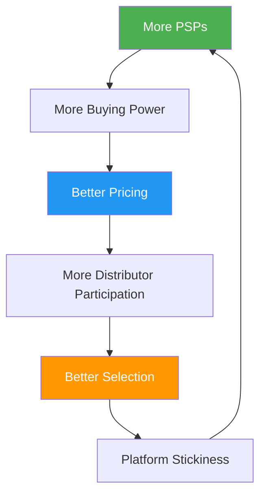
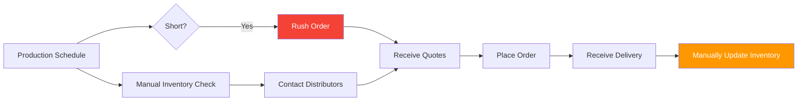
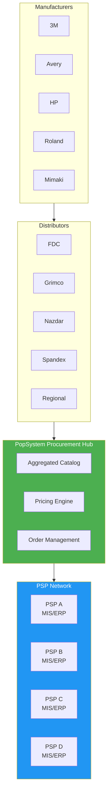
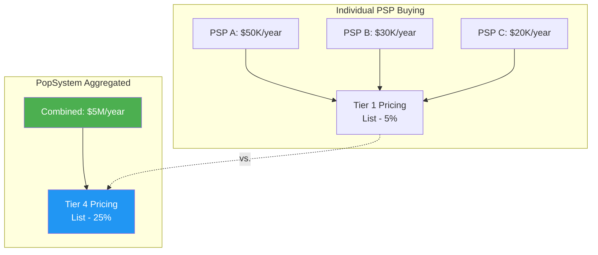
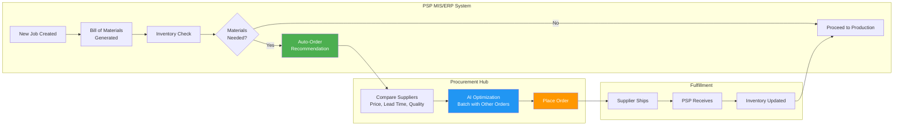
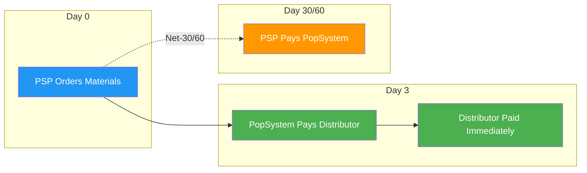
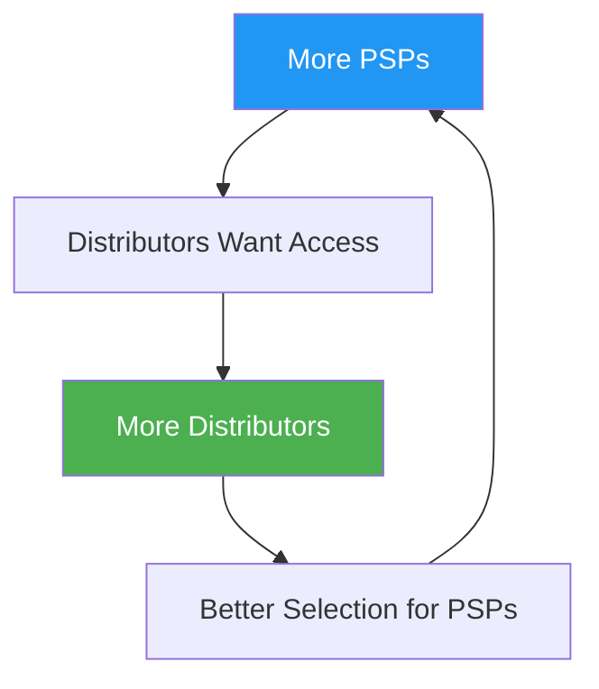

# P12: Procurement Marketplace

**Capability Pillar**: Supply Chain Integration & Materials Procurement
**Version**: 1.0
**Last Updated**: 2025-12-22
**Target Release**: v4+
**Effort Level**: XL (18-24 months)

---

## 1. Executive Summary

The Procurement Marketplace transforms PopSystem from a software platform into essential industry infrastructure by embedding materials procurement directly into the PSP workflow. By aggregating purchasing power across the PSP network, PopSystem can negotiate volume pricing, streamline ordering, and create powerful network effects that make the platform indispensable.

**Vision Statement**: Create a seamless procurement ecosystem where PSPs order materials directly through their MIS/ERP system with aggregated pricing, just-in-time delivery, and AI-optimized inventory management—while distributors and manufacturers gain predictable demand signals and direct access to the PSP network.

**Strategic Value**:

| Dimension | Value |
|-----------|-------|
| **Platform Stickiness** | PSPs can't leave without losing supplier relationships and pricing |
| **Network Effects** | More PSPs = better pricing = more PSPs; More distributors = better selection = more PSPs |
| **Data Moat** | Purchasing data enables demand forecasting, pricing intelligence, quality correlation |
| **Revenue Diversification** | Transaction fees, financing, premium supplier placement, data services |
| **Competitive Moat** | Aggregated buying power is defensible; competitors can't replicate overnight |

**The Ecosystem Flywheel**:


---

## 2. Current State Analysis

### How PSPs Procure Materials Today

**Fragmented Procurement**:
- Each PSP negotiates independently with distributors
- No collective bargaining power
- Manual ordering via phone, email, distributor websites
- Inventory managed in separate systems (spreadsheets, standalone inventory software)
- No connection between production scheduling and procurement
- Reactive ordering leads to stockouts or excess inventory

**Pain Points**:

| Pain Point | Impact | Frequency |
|------------|--------|-----------|
| **Price Disadvantage** | Small PSPs pay 15-30% more than large competitors | Constant |
| **Stockouts** | Rush orders cost 25%+ premium; delays campaigns | Weekly |
| **Excess Inventory** | Cash tied up in unused materials | Ongoing |
| **Manual Ordering** | Hours spent on procurement admin | Daily |
| **Vendor Management** | Multiple relationships to maintain | Ongoing |
| **No Quality Tracking** | Can't correlate material lots with defects | Per-incident |
| **Payment Terms** | Small PSPs get worse credit terms | Constant |

**Current Workflow**:


**Data Gaps**:
- No aggregated demand visibility across PSP network
- No quality-to-material traceability
- No price benchmarking across distributors
- Limited forecasting capability

---

## 3. Procurement Marketplace Vision

### Integrated Supply Chain Ecosystem

**Target Architecture**:


### Value Proposition by Stakeholder

**For PSPs**:
| Benefit | Mechanism | Quantified Value |
|---------|-----------|------------------|
| **Lower Material Costs** | Aggregated volume pricing | 10-20% savings |
| **Zero Stockouts** | AI-powered auto-reorder linked to production | Eliminate rush premiums |
| **Less Cash Tied Up** | JIT inventory, better payment terms | 25-40% inventory reduction |
| **Time Savings** | Integrated ordering from MIS | 5-10 hours/week saved |
| **Quality Traceability** | Link material lots to production outcomes | Faster defect resolution |
| **Better Payment Terms** | Platform-backed financing | Net-30/60 vs. COD |

**For Distributors**:
| Benefit | Mechanism | Quantified Value |
|---------|-----------|------------------|
| **Demand Visibility** | Aggregated forecasts from PSP production schedules | Better inventory planning |
| **Lower Sales Costs** | Direct platform access vs. individual PSP relationships | Reduced CAC |
| **Guaranteed Volume** | Platform commitments for pricing tiers | Revenue predictability |
| **Market Intelligence** | Anonymized demand trends, product popularity | Strategic insights |
| **Payment Guarantee** | Platform intermediates payments | Reduced credit risk |

**For Manufacturers**:
| Benefit | Mechanism | Quantified Value |
|---------|-----------|------------------|
| **Market Insights** | Real-time demand signals from PSP network | Product development input |
| **Quality Feedback** | Defect correlation with material batches | Quality improvement loop |
| **Channel Efficiency** | Direct visibility into end-user consumption | Optimized distribution |
| **New Product Launches** | Platform for beta testing, early adoption | Faster market validation |

**For PopSystem**:
| Benefit | Mechanism | Quantified Value |
|---------|-----------|------------------|
| **Platform Stickiness** | Can't leave without losing pricing/relationships | Reduced churn |
| **Transaction Revenue** | 1-3% of GMV on transactions | Recurring revenue |
| **Data Asset** | Purchasing patterns, demand signals | AI training, insights products |
| **Financing Revenue** | Payment terms arbitrage, factoring | Interest margin |
| **Competitive Moat** | Network effects are defensible | Market protection |

---

## 4. Core Features

### 4.1 Unified Product Catalog

**What It Does**: Aggregates product offerings from multiple distributors into a single, searchable catalog within the MIS/ERP system.

**Catalog Structure**:
```
┌─────────────────────────────────────────────────────────────────┐
│ PopSystem Materials Catalog                              🔍     │
├─────────────────────────────────────────────────────────────────┤
│                                                                 │
│ Categories:                                                     │
│ ├── Substrates                                                  │
│ │   ├── Vinyl (cast, calendered, specialty)                   │
│ │   ├── Banner Materials                                       │
│ │   ├── Rigid Boards (PVC, acrylic, foam, corrugated)         │
│ │   ├── Paper/Cardstock                                        │
│ │   └── Specialty (fabric, mesh, reflective)                  │
│ ├── Inks & Consumables                                         │
│ │   ├── Latex Inks                                             │
│ │   ├── UV Inks                                                │
│ │   ├── Solvent/Eco-Solvent                                   │
│ │   └── Printer Supplies                                       │
│ ├── Laminates & Finishes                                       │
│ │   ├── Overlaminates                                          │
│ │   ├── Mounting Adhesives                                     │
│ │   └── Protective Coatings                                    │
│ ├── Hardware & Mounting                                         │
│ │   ├── Frames & Standoffs                                     │
│ │   ├── Hanging Systems                                        │
│ │   └── Installation Supplies                                  │
│ └── Equipment & Parts                                           │
│     ├── Replacement Parts                                       │
│     ├── Maintenance Supplies                                    │
│     └── Small Equipment                                         │
│                                                                 │
│ Featured: [HP Latex Ink Set] [3M IJ40C Vinyl] [Drytac Polar]   │
│                                                                 │
└─────────────────────────────────────────────────────────────────┘
```

**Product Comparison**:
```
┌─────────────────────────────────────────────────────────────────┐
│ Product Comparison: 54" White Gloss Vinyl                       │
├─────────────────────────────────────────────────────────────────┤
│                                                                 │
│ Product             Distributor   Price/Roll  Lead Time  Rating │
│ ─────────────────────────────────────────────────────────────── │
│ 3M IJ40C-10         FDC Graphics    $342      2 days     ★★★★★ │
│ Avery MPI 1005      Grimco          $318      3 days     ★★★★☆ │
│ Oracal 3651         Spandex         $295      2 days     ★★★★☆ │
│ HP PVC-Free         HP Direct       $385      5 days     ★★★★★ │
│ Generic Economy     RegionalCo      $245      1 day      ★★★☆☆ │
│                                                                 │
│ 💡 AI Recommendation: Avery MPI 1005                           │
│    Best price-performance for your typical jobs                 │
│    Your historical quality score: 97.2%                         │
│                                                                 │
│ [Add to Cart] [Set as Default] [View Specs] [Quality History]  │
└─────────────────────────────────────────────────────────────────┘
```

---

### 4.2 Aggregated Pricing Tiers

**What It Does**: Combines purchasing volume across the PSP network to unlock pricing tiers that individual PSPs couldn't achieve alone.

**Pricing Model**:


**Tier Structure Example**:
| Annual Volume | Typical Discount | Who Gets This |
|---------------|------------------|---------------|
| <$50K | List - 5% | Small PSP alone |
| $50K-$200K | List - 10% | Mid PSP alone |
| $200K-$500K | List - 15% | Large PSP alone |
| $500K-$2M | List - 20% | Very large PSP or small group |
| $2M-$10M | List - 25% | **PopSystem Aggregated** |
| >$10M | List - 30%+ | **PopSystem at scale** |

**Pricing Dashboard (PSP View)**:
```
┌─────────────────────────────────────────────────────────────────┐
│ Your Procurement Savings - November 2026                        │
├─────────────────────────────────────────────────────────────────┤
│                                                                 │
│ Your Volume This Month:           $12,450                       │
│ Your Individual Tier Would Be:    Tier 1 (5% discount)          │
│ PopSystem Network Tier:           Tier 4 (25% discount)         │
│                                                                 │
│ YOUR SAVINGS THIS MONTH:                                        │
│ ┌─────────────────────────────────────────────────────────────┐ │
│ │                                                             │ │
│ │   Without PopSystem:    $12,450 × (1 - 5%)  = $11,828      │ │
│ │   With PopSystem:       $12,450 × (1 - 25%) = $9,338       │ │
│ │                                                             │ │
│ │   💰 Your Savings:      $2,490 (20% additional)            │ │
│ │                                                             │ │
│ └─────────────────────────────────────────────────────────────┘ │
│                                                                 │
│ Year-to-Date Savings: $24,830                                   │
│ Projected Annual Savings: $29,880                               │
│                                                                 │
│ Network Status: 847 PSPs | $4.2M monthly volume                │
│                                                                 │
└─────────────────────────────────────────────────────────────────┘
```

---

### 4.3 MIS/ERP Integration

**What It Does**: Embeds procurement directly into the production workflow, eliminating manual ordering and enabling just-in-time inventory.

**Integrated Workflow**:


**Order Interface (Within MIS)**:
```
┌─────────────────────────────────────────────────────────────────┐
│ Job #4521 - Nike Summer Campaign                                │
├─────────────────────────────────────────────────────────────────┤
│                                                                 │
│ BILL OF MATERIALS                                               │
│ ┌─────────────────────────────────────────────────────────────┐ │
│ │ Material              Needed   In Stock   To Order   Status │ │
│ │ ───────────────────────────────────────────────────────────│ │
│ │ 54" White Gloss Vinyl   450sf    120sf     330sf    ⚠️ Low │ │
│ │ 3M 8518 Laminate        450sf    500sf       -      ✅ OK  │ │
│ │ HP Latex Cyan 3L          2L      1.5L     0.5L    ⚠️ Low │ │
│ │ Mounting Adhesive        10rl     12rl       -      ✅ OK  │ │
│ └─────────────────────────────────────────────────────────────┘ │
│                                                                 │
│ 🛒 AUTO-ORDER RECOMMENDATION                                    │
│ ┌─────────────────────────────────────────────────────────────┐ │
│ │                                                             │ │
│ │ 54" White Gloss Vinyl - Avery MPI 1005                     │ │
│ │ Quantity: 1 roll (500 sf) - covers this job + safety stock │ │
│ │ Price: $318.00 (PopSystem Tier 4)                          │ │
│ │ Delivery: Dec 24 (2 days) from Grimco                      │ │
│ │                                                             │ │
│ │ HP Latex Cyan 3L                                            │ │
│ │ Quantity: 1 unit (3L)                                       │ │
│ │ Price: $142.00 (PopSystem Tier 4)                          │ │
│ │ Delivery: Dec 24 (2 days) from FDC                         │ │
│ │                                                             │ │
│ │ 💡 Combine with 2 other orders shipping today = FREE ship  │ │
│ │                                                             │ │
│ │ Total: $460.00                                              │ │
│ │                                                             │ │
│ │ [Order Now] [Modify Quantities] [Choose Different Product] │ │
│ └─────────────────────────────────────────────────────────────┘ │
│                                                                 │
└─────────────────────────────────────────────────────────────────┘
```

---

### 4.4 AI-Powered Inventory Optimization

**What It Does**: Uses production scheduling data and demand forecasting to automatically maintain optimal inventory levels.

**Optimization Features**:
| Feature | How It Works | Benefit |
|---------|--------------|---------|
| **Demand Forecasting** | Analyzes upcoming jobs, seasonal patterns, campaign calendars | Order before you need it |
| **Reorder Points** | Dynamic thresholds based on lead times and usage patterns | Never run out |
| **Batch Optimization** | Combines orders to hit volume breaks and free shipping | Lower costs |
| **Waste Prediction** | Accounts for typical waste rates per job type | Accurate quantities |
| **Expiry Management** | Tracks shelf life, prioritizes older stock | Reduce spoilage |

**Inventory Intelligence Dashboard**:
```
┌─────────────────────────────────────────────────────────────────┐
│ Smart Inventory Management                                       │
├─────────────────────────────────────────────────────────────────┤
│                                                                 │
│ INVENTORY HEALTH                                                │
│ ████████████████████████████░░ 87% Optimized                   │
│                                                                 │
│ UPCOMING DEMAND (Next 14 Days)                                  │
│ ┌─────────────────────────────────────────────────────────────┐ │
│ │ Material              On Hand   Needed   Gap     Action     │ │
│ │ ─────────────────────────────────────────────────────────── │ │
│ │ 54" White Gloss       120 sf    580 sf   460 sf  🔴 Order  │ │
│ │ 48" Clear Vinyl       200 sf    150 sf     -     ✅ OK     │ │
│ │ PVC Board 3mm          45 sh     60 sh    15 sh  🟡 Soon   │ │
│ │ HP Latex Ink Set      1.5 set   2 sets   0.5 set 🟡 Soon   │ │
│ │ Mounting Adhesive      12 rl     8 rl      -     ✅ OK     │ │
│ └─────────────────────────────────────────────────────────────┘ │
│                                                                 │
│ 🤖 AI RECOMMENDATIONS                                           │
│                                                                 │
│ 1. Order 54" White Gloss NOW                                    │
│    Lead time: 2 days | You need it by: Dec 26                  │
│    Recommended qty: 2 rolls (1000 sf)                          │
│    Reason: Covers demand + builds safety stock                 │
│    [Auto-Order] [Adjust]                                        │
│                                                                 │
│ 2. PVC Board order can wait until Dec 26                       │
│    Combining with another order saves $45 shipping             │
│    [Schedule for Dec 26] [Order Now Anyway]                    │
│                                                                 │
│ 💰 OPTIMIZATION SAVINGS THIS MONTH                              │
│ • Avoided 3 stockouts:                    $450 rush avoided    │
│ • Batch shipping consolidation:           $180 saved           │
│ • Volume break optimization:              $340 saved           │
│ • Total:                                  $970 saved           │
│                                                                 │
└─────────────────────────────────────────────────────────────────┘
```

---

### 4.5 Quality-to-Material Traceability

**What It Does**: Links material lot numbers to production outcomes, enabling root cause analysis when defects occur.

**Traceability Flow**:


**Defect-Material Correlation Report**:
```
┌─────────────────────────────────────────────────────────────────┐
│ Material Quality Analysis - November 2026                        │
├─────────────────────────────────────────────────────────────────┤
│                                                                 │
│ DEFECT CORRELATION BY MATERIAL LOT                              │
│                                                                 │
│ ⚠️ ALERT: Elevated defect rate detected                        │
│                                                                 │
│ Material: Avery MPI 1005 White Gloss                            │
│ Lot #: AVY-2026-1847                                            │
│ Received: Nov 12, 2026                                          │
│ Distributor: Grimco                                             │
│                                                                 │
│ Jobs Using This Lot: 23                                         │
│ Defect Rate: 8.7% (vs. 2.1% historical average)                │
│                                                                 │
│ Defect Pattern:                                                 │
│ • Ink adhesion failure on 2 jobs                               │
│ • Color inconsistency on 3 jobs                                │
│ • Premature laminate lift on 1 job                             │
│                                                                 │
│ AI Analysis: Pattern consistent with material batch issue       │
│ Recommendation: Quarantine remaining stock, contact supplier    │
│                                                                 │
│ Remaining Inventory: 245 sf from this lot                       │
│                                                                 │
│ [Quarantine Lot] [File Supplier Claim] [View Affected Jobs]    │
│                                                                 │
│ ───────────────────────────────────────────────────────────────│
│                                                                 │
│ SUPPLIER QUALITY SCORECARD                                      │
│                                                                 │
│ Supplier         Jobs    Defect Rate   Trend    Score          │
│ Grimco           342       2.4%         →       ★★★★☆ (87)     │
│ FDC Graphics     256       1.8%         ↘       ★★★★★ (94)     │
│ Spandex          189       3.1%         ↗       ★★★★☆ (82)     │
│ HP Direct         87       0.9%         →       ★★★★★ (98)     │
│                                                                 │
└─────────────────────────────────────────────────────────────────┘
```

---

### 4.6 Payment & Financing Services

**What It Does**: Provides better payment terms to PSPs through platform-backed financing, while guaranteeing payment to distributors.

**Financing Options**:
| Option | Terms | Who Benefits | Revenue to PopSystem |
|--------|-------|--------------|---------------------|
| **Net-30** | Pay in 30 days | PSPs with good history | 1% transaction fee |
| **Net-60** | Pay in 60 days | Premium PSPs | 2% transaction fee |
| **Factoring** | Immediate payment to supplier | Distributors | 2-3% discount |
| **Purchase Financing** | Equipment/large orders | Growing PSPs | Interest margin |

**Payment Flow**:


**Value Exchange**:
- **PopSystem earns**: Float interest + transaction fee
- **PSP gets**: Better terms than negotiating alone
- **Distributor gets**: Guaranteed payment, no credit risk

---

### 4.7 Equipment Marketplace (Future)

**What It Does**: Extends the procurement model to equipment sales, leasing, and maintenance contracts.

**Equipment Categories**:
- Large format printers (HP, Roland, Mimaki, Canon, Epson)
- Cutters and finishing equipment
- Laminators
- Installation tools
- Replacement parts

**Value Proposition**:
| Model | PSP Benefit | Platform Revenue |
|-------|-------------|------------------|
| **New Equipment Sales** | Volume pricing, trade-in programs | Sales commission |
| **Certified Used** | Lower cost entry, quality guaranteed | Marketplace fees |
| **Leasing** | CapEx → OpEx, includes maintenance | Leasing margin |
| **Parts & Supplies** | Integrated with maintenance alerts | Transaction fees |
| **Maintenance Contracts** | Bundled with predictive maintenance AI | Service fees |

---

## 5. Network Effects Analysis

### Two-Sided Marketplace Dynamics

**Supply Side (Distributors/Manufacturers)**:


**Demand Side (PSPs)**:


**Cross-Side Effects**:


### Competitive Moat Strength

| Moat Element | Strength | Time to Replicate |
|--------------|----------|-------------------|
| **Aggregated Volume** | Strong | Years (need PSP network first) |
| **Pricing Tiers** | Strong | Requires volume commitment |
| **MIS Integration** | Medium | Can be built, but switching cost high |
| **Quality Data** | Strong | Historical data can't be recreated |
| **Supplier Relationships** | Medium | Relationships can be built |
| **Payment Terms** | Medium | Requires capital and trust |

### Tipping Point Analysis

**Critical Mass Targets**:
| Metric | Tipping Point | Current (est.) | Strategy |
|--------|---------------|----------------|----------|
| PSPs on platform | 200+ | 50 | MIS/ERP adoption drives this |
| Monthly GMV | $500K+ | $0 | Follows PSP adoption |
| Distributors | 5+ major | 0 | Partner with industry leaders first |
| Product SKUs | 10,000+ | 0 | Start with top 1,000 SKUs |

---

## 6. Revenue Model

### Revenue Streams

| Stream | Model | Target Rate | At Scale ($50M GMV) |
|--------|-------|-------------|---------------------|
| **Transaction Fees** | % of GMV | 1-3% | $500K-$1.5M/year |
| **Payment Float** | Interest on Net-30/60 | ~5% APR on float | $200K-$400K/year |
| **Premium Placement** | Supplier advertising | Per-impression | $100K-$300K/year |
| **Data Services** | Demand forecasts, market reports | Subscription | $50K-$150K/year |
| **Financing Margin** | Equipment leasing, factoring | 3-5% spread | $100K-$300K/year |

**Total Revenue Potential**: $1M-$2.5M/year at $50M GMV

### Cost Structure

| Cost | Description | Estimate |
|------|-------------|----------|
| **Payment Processing** | Credit card fees | 0.5-1% of GMV |
| **Credit Risk** | Bad debt on Net-30/60 | 0.2-0.5% of GMV |
| **Operations** | Procurement team, support | $200K-$400K/year |
| **Technology** | Platform development, maintenance | $150K-$300K/year |

**Net Margin Target**: 50-60% of revenue

---

## 7. Implementation Roadmap

### Phase 1: Foundation (v4 - Months 1-6)

**Objective**: Prove concept with limited SKUs and select partners

**Deliverables**:
- [ ] Partner with 2-3 major distributors (FDC, Grimco, regional)
- [ ] Catalog of top 500 SKUs (substrates, inks)
- [ ] Basic ordering interface within MIS/ERP
- [ ] Manual pricing tier negotiation
- [ ] Simple inventory tracking

**Success Metrics**:
- 50 PSPs placing at least 1 order/month
- $100K monthly GMV
- 10% average savings demonstrated

### Phase 2: Automation (v4 - Months 7-12)

**Objective**: Automate ordering and add AI optimization

**Deliverables**:
- [ ] AI-powered reorder recommendations
- [ ] Production-to-procurement integration (auto-BOM)
- [ ] Expanded catalog (2,000+ SKUs)
- [ ] Additional distributor partners (5+)
- [ ] Net-30 payment terms pilot

**Success Metrics**:
- 150 PSPs active
- $300K monthly GMV
- 15% average savings
- 90% auto-order acceptance rate

### Phase 3: Scale (v4+ - Months 13-24)

**Objective**: Achieve network effects and full ecosystem

**Deliverables**:
- [ ] Full catalog (10,000+ SKUs)
- [ ] Equipment marketplace
- [ ] Manufacturer direct partnerships
- [ ] Net-60 and financing products
- [ ] Quality-to-material traceability
- [ ] Demand forecasting for suppliers

**Success Metrics**:
- 500+ PSPs active
- $2M+ monthly GMV
- 20% average savings
- Distributor-funded premium placement revenue

### Phase 4: Ecosystem Lock-in (v4+ - Months 24+)

**Objective**: Make PopSystem indispensable infrastructure

**Deliverables**:
- [ ] Exclusive pricing tiers (only available through PopSystem)
- [ ] Manufacturer co-development programs
- [ ] Industry data products
- [ ] Equipment leasing at scale
- [ ] Regional warehouse/fulfillment (if volume justifies)

**Success Metrics**:
- 1,000+ PSPs active
- $5M+ monthly GMV
- Platform recognized as industry standard

---

## 8. Integration Points

### With MIS/ERP (P07)
- Bill of materials auto-generation
- Inventory sync
- Job costing with actual material costs
- Production scheduling integration

### With Production AI (AI_Production)
- Demand forecasting feeds procurement
- Quality prediction correlates with materials
- Equipment maintenance triggers parts orders
- Defect tracking links to material lots

### With Marketplace (P11)
- PSP quality scores include material quality
- Cost optimization considers material costs
- Vendor routing based on material availability

### With Analytics (P09)
- Purchasing trend dashboards
- Savings reports
- Material quality analytics
- Demand forecasting accuracy

---

## 9. Risk Mitigation

| Risk | Probability | Impact | Mitigation |
|------|-------------|--------|------------|
| **Distributors won't participate** | Medium | High | Start with guaranteed volume commitments; offer data insights as incentive |
| **PSPs don't adopt** | Medium | High | Make savings clear; integrate seamlessly with MIS workflow |
| **Credit losses on Net-30** | Low | Medium | Start with creditworthy PSPs; build credit scoring model |
| **Antitrust concerns** | Low | High | Ensure open platform; don't force exclusivity |
| **Distributor disintermediation** | Medium | Medium | Provide value to distributors (demand signals, reduced sales cost) |

---

## 10. Success Metrics

### Platform Health

| Metric | Phase 1 Target | Phase 2 Target | At Scale |
|--------|----------------|----------------|----------|
| Active PSPs | 50 | 150 | 500+ |
| Monthly GMV | $100K | $300K | $2M+ |
| Active Distributors | 3 | 5 | 10+ |
| Catalog SKUs | 500 | 2,000 | 10,000+ |

### Value Delivery

| Metric | Target | Measurement |
|--------|--------|-------------|
| Average PSP savings | 15%+ | Compare to pre-platform pricing |
| Stockout reduction | 90%+ | Rush orders vs. baseline |
| Order time savings | 5+ hours/week | PSP survey |
| Inventory reduction | 25%+ | Average inventory value |

### Business Performance

| Metric | Target | Measurement |
|--------|--------|-------------|
| Transaction revenue | 2% of GMV | Platform fees collected |
| Net margin | 50%+ | Revenue minus costs |
| PSP retention | 95%+ | Annual renewal rate |
| NPS (PSPs) | 50+ | Quarterly survey |

---

## 11. Related Documents

- [P07_MIS_ERP.md](P07_MIS_ERP.md) - MIS/ERP integration point
- [P11_Marketplace.md](P11_Marketplace.md) - Marketplace model reference
- [05_AI_Production.md](../17_AI_Capabilities/05_AI_Production.md) - AI-powered inventory and demand forecasting
- [00_AI_Overview.md](../17_AI_Capabilities/00_AI_Overview.md) - AI capabilities overview

---

*The Procurement Marketplace transforms PopSystem from software into industry infrastructure, creating powerful network effects that benefit PSPs, distributors, and the platform while building an unassailable competitive moat.*
