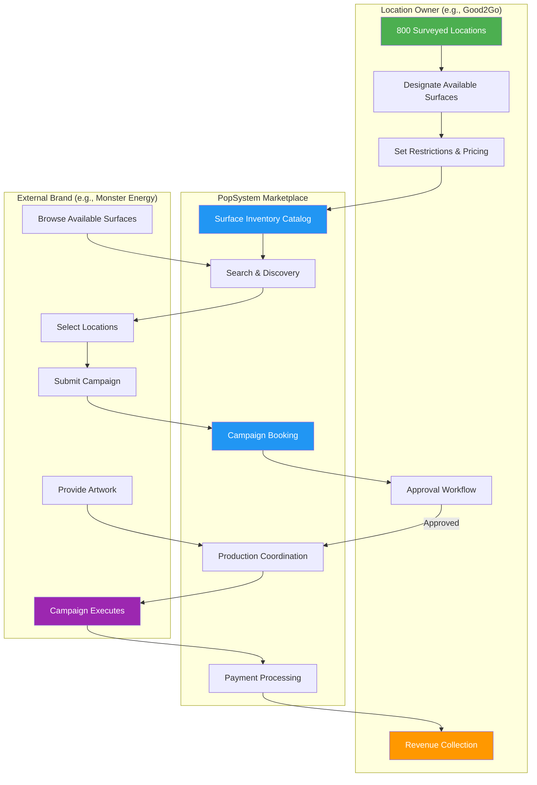
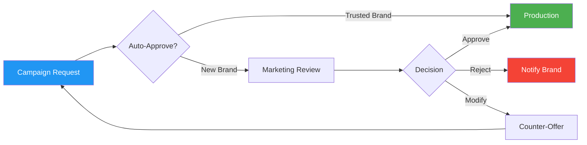

# Retail Media Network

## Executive Summary

The Retail Media Network transforms surveyed client locations into an advertising marketplace. Clients who own physical locations (stores, hospitals, gas stations, banks) can optionally open specific brandable surfaces to external brand campaigns—with full approval controls and revenue sharing. This creates passive income for location owners while giving external brands access to pre-surveyed, production-ready advertising placements.

**Prerequisites:**
- Survey as a Service established (see [Survey_as_a_Service.md](Survey_as_a_Service.md))
- Client has surveyed locations in platform
- Client opts into the marketplace program

**Value Proposition:**
- **Location Owners:** Monetize existing surfaces; one survey investment generates ongoing revenue
- **External Brands:** Access pre-measured, production-ready placements without survey overhead
- **Platform:** Transaction fees on advertising bookings; increased survey adoption

---

## 1. How It Works

---

## 2. Participants & Roles

### 2.1 Location Owners (Supply Side)

Clients who own physical locations and opt to make surfaces available:

| Client Type | Location Count | Available Surfaces | Potential Advertisers |
|-------------|---------------|-------------------|----------------------|
| **Good2Go** (c-stores) | 800 | Cooler doors, windows, pump toppers, floor graphics | Beverage brands, snack brands, lottery |
| **Regional Bank** | 150 | Lobby displays, ATM surrounds, window clings | Auto dealers, insurance, local business |
| **Banner Medical** | 450 | Waiting room posters, pharmacy counters, directories | Pharma, medical devices, health services |
| **Fitness Chain** | 200 | Locker room, entrance, equipment areas | Supplements, apparel, sports drinks |

### 2.2 External Brands (Demand Side)

Brands seeking physical advertising placements:

| Brand Type | Campaign Goals | Preferred Locations |
|------------|---------------|---------------------|
| **CPG Brands** | Point-of-purchase influence | Retail, c-stores, grocery |
| **Local Services** | Geographic targeting | Banks, medical, community spaces |
| **National Brands** | Awareness, reach | High-traffic retail, transit |
| **Co-Marketing** | Complementary products | Partner locations (Nike + Gatorade) |

### 2.3 Platform (PopSystem)

- Hosts marketplace infrastructure
- Ensures survey data quality
- Processes bookings and payments
- Coordinates production with PSPs
- Manages installation scheduling

---

## 3. Owner Controls & Safeguards

Location owners maintain full control over their surfaces:

### 3.1 Surface Designation

| Control | Options | Example |
|---------|---------|---------|
| **Which Surfaces** | Select specific surfaces to make available | "Windows available, but not entrance doors" |
| **Which Locations** | By location, region, or type | "Urban stores only, not rural" |
| **Availability Calendar** | Blackout dates, seasonal restrictions | "Not during our own Q4 campaigns" |

### 3.2 Brand Restrictions

| Restriction Type | Implementation | Example |
|-----------------|----------------|---------|
| **Category Exclusions** | Block entire product categories | "No alcohol or tobacco" |
| **Competitor Blocks** | Prevent direct competitors | "No other convenience store brands" |
| **Brand Blacklist** | Block specific brands | "Not Brand X due to past issues" |
| **Content Approval** | Review creative before booking | "All campaigns require marketing approval" |

### 3.3 Pricing Controls

| Pricing Model | Description | Best For |
|--------------|-------------|----------|
| **Fixed Rate** | Set price per surface per period | Predictable revenue |
| **Dynamic Pricing** | Platform adjusts based on demand | Maximize revenue |
| **Minimum Floor** | Set minimum, platform optimizes above | Balance control + optimization |
| **Negotiated** | Case-by-case for large campaigns | Enterprise deals |

### 3.4 Approval Workflow

---

## 4. Revenue Model

### 4.1 Revenue Split

| Party | Share | Rationale |
|-------|-------|-----------|
| **Location Owner** | 60-70% | Owns the real estate, bears brand risk |
| **Platform** | 20-30% | Marketplace, production coordination, payments |
| **Installer** (if needed) | 10% | Installation services |

### 4.2 Pricing Examples

| Surface Type | Duration | Rate Range | Owner Revenue |
|--------------|----------|------------|---------------|
| C-store cooler door | 4 weeks | $50-150/location | $30-105/location |
| Window cling (large) | 4 weeks | $75-200/location | $45-140/location |
| Floor graphic | 4 weeks | $100-300/location | $60-210/location |
| Waiting room poster | 4 weeks | $25-75/location | $15-52/location |

### 4.3 Revenue Potential (Example: Good2Go)

| Scenario | Surfaces | Locations | Rate | Duration | Gross Revenue | Owner Share (65%) |
|----------|----------|-----------|------|----------|--------------|-------------------|
| Single Campaign | 1 | 800 | $100 | 4 weeks | $80,000 | $52,000 |
| Multiple Campaigns | 3 | 800 | $100 | 4 weeks | $240,000 | $156,000 |
| Annual (4 campaigns) | 3 | 800 | $100 | 16 weeks | $960,000 | $624,000 |

*Passive income from surfaces already being surveyed for their own campaigns*

---

## 5. Campaign Workflow

### 5.1 Brand Experience

1. **Discovery:** Browse available surfaces by location type, geography, demographics
2. **Selection:** Choose specific surfaces and locations for campaign
3. **Booking Request:** Submit campaign details, duration, budget
4. **Artwork Submission:** Upload creative files (or use platform design tools)
5. **Production:** Platform coordinates with PSPs for print production
6. **Installation:** Scheduled installation across all locations
7. **Verification:** Photo documentation confirms installation
8. **Reporting:** Campaign performance data (if tracking enabled)

### 5.2 Owner Experience

1. **Setup:** Designate available surfaces, set restrictions and pricing
2. **Notifications:** Receive booking requests
3. **Review:** Approve, reject, or counter-offer
4. **Coordination:** Confirm installation windows
5. **Payment:** Receive revenue share after campaign completion
6. **Analytics:** View earnings, utilization, brand mix

---

## 6. Platform Features

### 6.1 Marketplace Portal

**For External Brands:**
- Surface search with filters (type, location, price, availability)
- Location demographics and traffic data
- Historical campaign performance (anonymized)
- Budget planning tools
- Creative templates sized to available surfaces

**For Location Owners:**
- Inventory management dashboard
- Booking calendar and availability
- Revenue tracking and forecasting
- Brand relationship management
- Campaign performance analytics

### 6.2 Integration Points

| Integration | Purpose |
|-------------|---------|
| **Survey Data** | Surface measurements, photos, templates |
| **PSP Network** | Production fulfillment |
| **Installer Marketplace** | Installation services |
| **Payment Processing** | Booking payments, owner payouts |
| **Analytics** | Performance tracking, attribution |

---

## 7. Trust & Safety

### 7.1 Brand Verification

- Business verification before booking
- Payment method validation
- Content policy agreement
- Campaign history tracking

### 7.2 Content Policies

| Policy | Enforcement |
|--------|-------------|
| **No deceptive content** | Pre-flight review, post-install audit |
| **Category restrictions** | System-enforced by owner settings |
| **Legal compliance** | Regional advertising law checks |
| **Brand safety** | Owner approval workflow |

### 7.3 Dispute Resolution

| Issue | Resolution Path |
|-------|-----------------|
| **Campaign not installed** | Refund or credit |
| **Wrong location/surface** | Partial refund, correction |
| **Early removal** | Pro-rated refund |
| **Quality issues** | Reinstall or credit |

---

## 8. Implementation Phases

### Phase 1: Pilot (Months 1-3)
- 2-3 location owners with 100+ locations each
- Manual booking process
- Limited surface types
- Direct brand outreach

### Phase 2: Beta Marketplace (Months 4-6)
- Self-service booking portal
- Automated approval workflows
- Payment processing integration
- 10+ location owners

### Phase 3: Public Launch (Months 7-12)
- Open to all surveyed clients
- Brand self-registration
- Full automation
- Analytics and reporting

### Phase 4: Scale (Year 2+)
- Programmatic booking
- Dynamic pricing
- Attribution integration
- National brand partnerships

---

## 9. Success Metrics

| Metric | Phase 1 | Phase 2 | Phase 3 |
|--------|---------|---------|---------|
| Location owners enrolled | 3 | 10 | 50+ |
| Surfaces available | 500 | 2,000 | 10,000+ |
| Campaigns booked | 5 | 25 | 200+ |
| Platform revenue | $25K | $150K | $1M+ |
| Owner satisfaction | 80%+ | 85%+ | 90%+ |
| Brand repeat rate | — | 50%+ | 70%+ |

---

## 10. Risks & Mitigations

| Risk | Likelihood | Impact | Mitigation |
|------|------------|--------|------------|
| Owners reject most campaigns | Medium | High | Clear guidelines, trusted brand tiers |
| Brand creative quality issues | Medium | Medium | Pre-flight review, templates |
| Cannibalization of owner campaigns | Low | High | Owner sets availability windows |
| Payment disputes | Low | Medium | Clear terms, escrow model |
| Regulatory issues | Low | High | Legal review by market |

---

## 11. Related Documents

- [Survey_as_a_Service.md](Survey_as_a_Service.md) - Foundation for surface data
- [POP_Installer_Marketplace_Strategy.md](POP_Installer_Marketplace_Strategy.md) - Installation services
- [Vehicle_Fleet_Branding.md](Vehicle_Fleet_Branding.md) - Mobile advertising surfaces

---

*This capability requires Survey as a Service to be established first. The Retail Media Network is a Phase 3+ expansion that creates new revenue streams from existing survey investments.*
