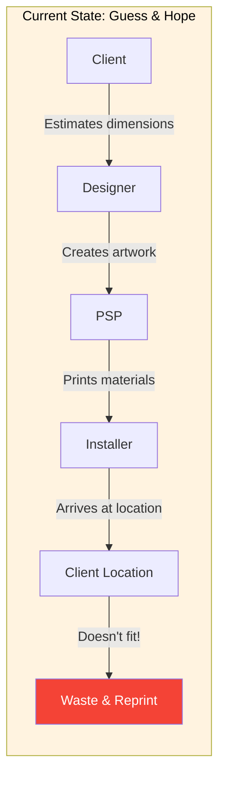
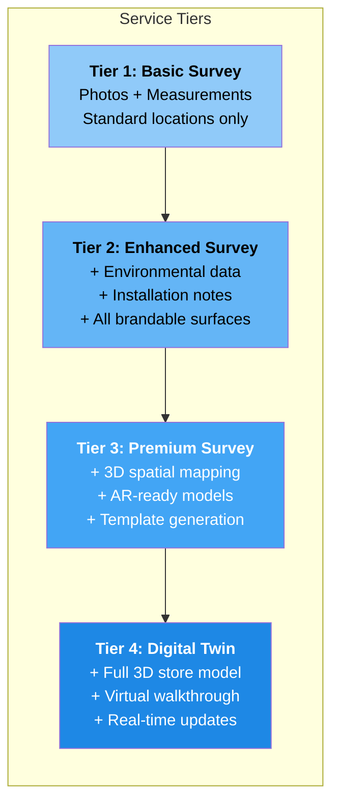
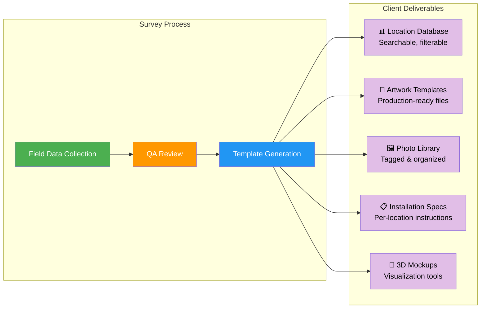
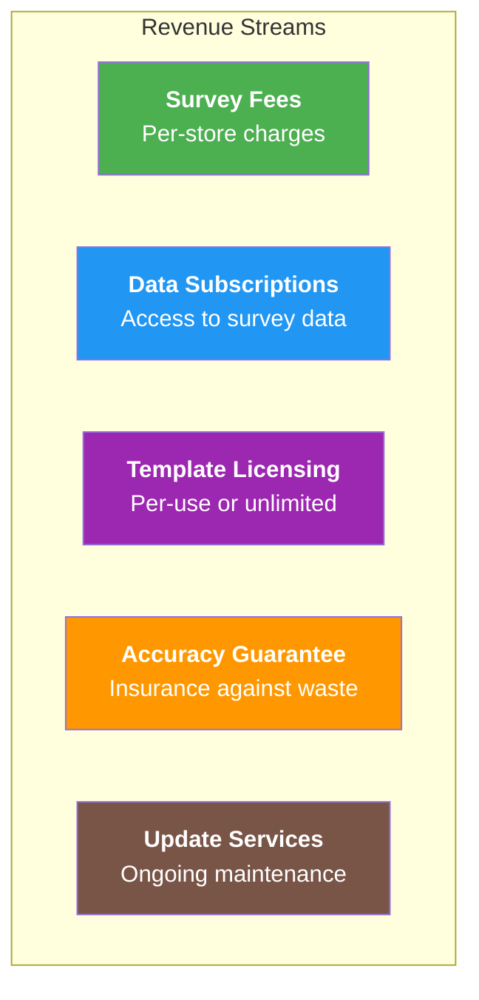
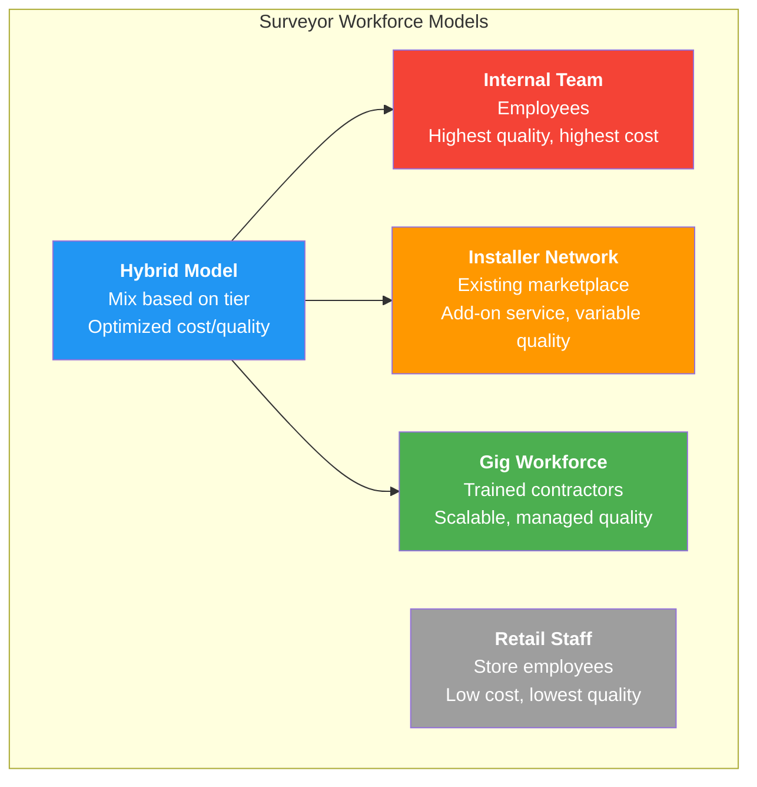
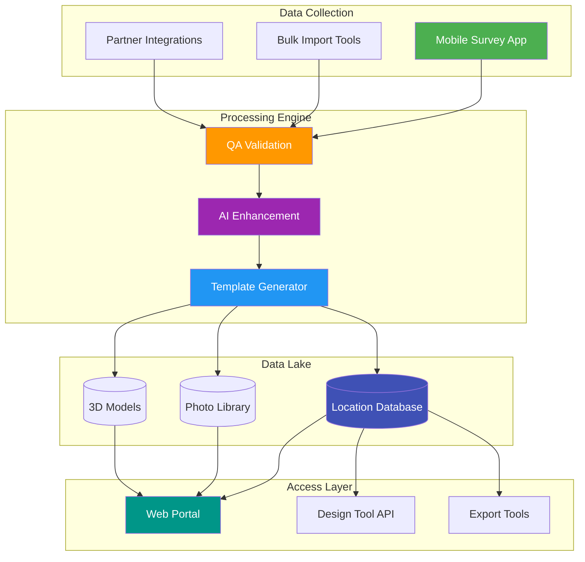
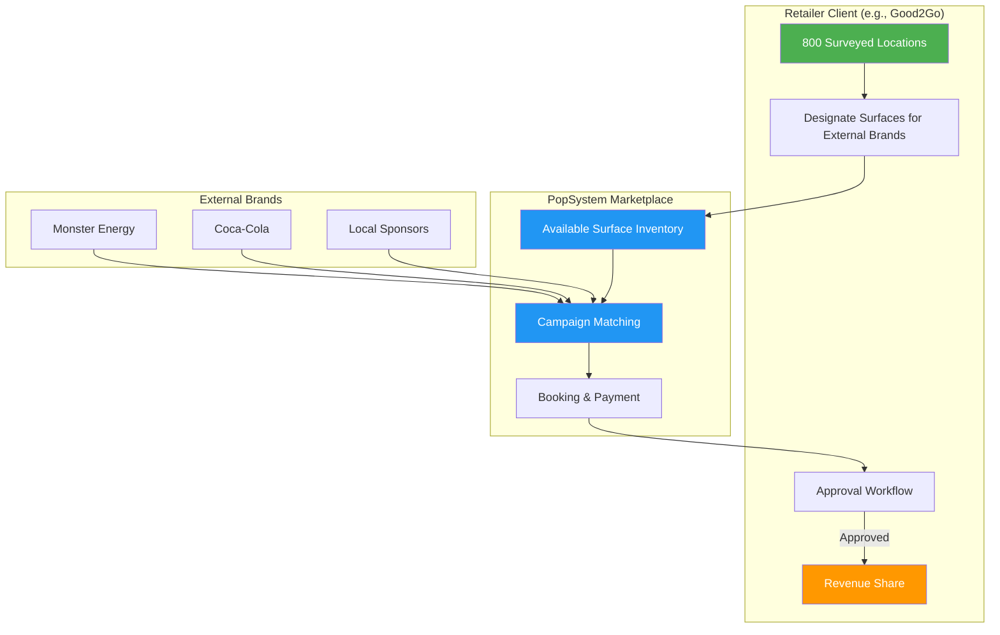
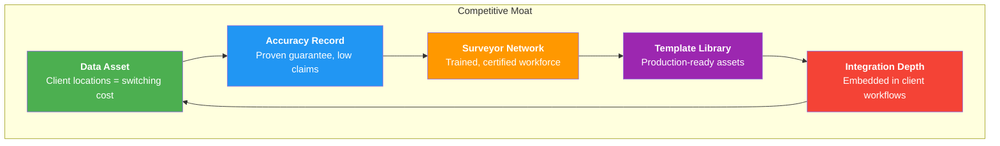

# Survey as a Service (SaaS²)

## Executive Summary

Survey as a Service transforms the painful, error-prone process of measuring client locations into a turnkey solution that creates lasting value. Professional surveyors capture every brandable surface across a client's location network—photos, precise measurements, environmental conditions, and installation constraints—then deliver production-ready artwork templates and 3D mockups. The result: clients order with confidence, PSPs print without waste, and installers execute flawlessly.

**Client Examples:**
- **Nike:** 1,200 retail stores and outlet locations
- **Banner Medical:** 450 hospitals, doctors offices, and kiosks
- **Good2Go:** 800 convenience stores and gas stations
- **Regional Bank:** 150 branches across 5 states

**The Core Value Proposition:**
- **For Clients:** "Survey once, use forever—every campaign benefits from accurate data"
- **For PSPs:** "Print right the first time, every time"
- **For Installers:** "Arrive prepared, finish faster"
- **For Platform:** "Sticky client relationships through valuable data asset"

**Strategic Importance:**
Survey data becomes a client retention asset. Once we've surveyed Good2Go's 800 locations, that data serves EVERY future campaign—seasonal promotions, rebrands, new product launches, compliance updates. The switching cost becomes the value of that survey investment. Clients stay because their location data lives in our platform.

---

## 1. The Problem We're Solving

### 1.1 Current Pain Points

**Quantified Waste:**
| Issue | Frequency | Cost Impact |
|-------|-----------|-------------|
| Signage doesn't fit location | 15-25% of orders | Reprint + reshipping |
| Wrong substrate for environment | 10-15% of orders | Premature failure, replacement |
| Installer lacks mounting hardware | 20-30% of jobs | Return trip, labor waste |
| Artwork doesn't match store layout | 10-20% of campaigns | Reduced brand impact |
| Measurements taken by untrained staff | 40%+ of DIY surveys | Systematic errors |

**The Hidden Cost:** A single reprint on a 1,000-store rollout at $50/unit = $50,000 in waste. Professional surveys at $200/store = $200,000 upfront but eliminates reprints across ALL future campaigns.

### 1.2 Why This Hasn't Been Solved

1. **Fragmented Responsibility:** Brands think retailers should provide data; retailers think brands should survey; neither invests
2. **One-Time Thinking:** Surveys seen as campaign expense, not reusable asset
3. **No Standard Format:** Every brand captures data differently, can't be shared
4. **Technology Gap:** Paper forms, inconsistent photos, no integration with design tools

---

## 2. The Survey as a Service Model

### 2.1 Service Tiers

### 2.2 What We Capture

**Per Location (Brandable Surface):**

| Data Category | Specific Measurements | Purpose |
|--------------|----------------------|---------|
| **Dimensions** | Height, width, depth, radius (for curves) | Artwork sizing |
| **Position** | Height from floor, distance from fixtures | Visibility analysis |
| **Surface** | Material type, texture, color | Substrate selection |
| **Environment** | Lighting (lumens, color temp), temperature range, humidity | Material durability |
| **Mounting** | Wall type, existing hardware, power availability | Installation planning |
| **Obstructions** | Sprinklers, vents, fixtures within 24" | Design constraints |
| **Visibility** | Sightlines, viewing distances, traffic flow | Placement optimization |
| **Photos** | Wide shot, detail shot, with scale reference | Visual verification |

**Per Store:**

| Data Category | Details | Purpose |
|--------------|---------|---------|
| **Floor Plan** | Layout sketch or CAD integration | Campaign planning |
| **Traffic Patterns** | Entry points, high-dwell areas | Placement strategy |
| **Existing Signage** | Competitor presence, permanent fixtures | Competitive context |
| **Access Constraints** | Operating hours, ladder restrictions, union rules | Installation scheduling |
| **Contact Info** | Store manager, facilities contact | Coordination |

### 2.3 Deliverables

---

## 3. Monetization Strategies

### 3.1 Revenue Model Options

### 3.2 Pricing Framework

**Option A: Per-Location Survey Pricing**
| Tier | Per Location | Includes | Best For |
|------|-----------|----------|----------|
| Basic | $150-250 | 10 brandable surfaces, photos, measurements | Small format (kiosks, offices) |
| Enhanced | $300-500 | 25 surfaces + environmental data | Standard locations (stores, branches) |
| Premium | $600-1,000 | Unlimited surfaces + templates | Large format (hospitals, flagships) |
| Digital Twin | $2,000-5,000 | Full 3D model | Complex facilities, experiential |

*Client owns their survey data; accessible to their PSPs through platform*

**Option B: Volume/Enterprise Pricing**
| Location Count | Discount | Effective Per-Location |
|----------------|----------|------------------------|
| 1-50 | Standard | $300-500 |
| 51-200 | 15% off | $255-425 |
| 201-500 | 25% off | $225-375 |
| 500+ | 35% off | $195-325 |

*Incentivizes clients to survey entire networks vs. piecemeal*

**Option C: Bundled with Platform Subscription**
| Platform Tier | Survey Inclusion | Additional Surveys |
|---------------|------------------|-------------------|
| Starter | 10 locations/year | $350/location |
| Professional | 50 locations/year | $300/location |
| Enterprise | 200 locations/year | $250/location |

*Survey becomes part of platform value, increases stickiness*

### 3.3 The Accuracy Guarantee

**"Fit or Free" Promise:**
If materials produced using our survey data and templates don't fit the specified location, we cover:
- Reprint costs (up to 100% of original order)
- Expedited shipping
- Installation rescheduling fees

**How This Works Financially:**
- Survey accuracy target: 99.5%+
- Reserve 5% of survey revenue for guarantee claims
- Historical waste rate (15-25%) vs. guaranteed rate (<0.5%) = massive value

**Guarantee Tiers:**
| Level | Coverage | Premium |
|-------|----------|---------|
| Standard | Dimensional accuracy only | Included |
| Enhanced | + Substrate suitability | +10% |
| Platinum | + Installation success | +20% |

---

## 4. Survey Workforce Model

### 4.1 Surveyor Network Options

### 4.2 Recommended: Hybrid Model

| Survey Tier | Workforce | Rationale |
|-------------|-----------|-----------|
| Basic | Trained gig workers | Volume play, standardized process |
| Enhanced | Certified installers | Already understand materials, installation |
| Premium | Internal specialists | Complex measurements, template creation |
| Digital Twin | Partner firms (3D scanning) | Specialized equipment, expertise |

### 4.3 Surveyor Certification Program

**Training Modules:**
1. Measurement fundamentals (2 hours)
2. Photography standards (1 hour)
3. Environmental assessment (1 hour)
4. Mobile app usage (1 hour)
5. Quality standards & QA (1 hour)
6. Field practicum (4 hours)

**Certification Levels:**
| Level | Requirements | Can Survey |
|-------|-------------|------------|
| Bronze | Pass basic training | Tier 1 only |
| Silver | Bronze + 50 surveys, 95%+ QA | Tier 1-2 |
| Gold | Silver + advanced training, 98%+ QA | Tier 1-3 |
| Platinum | Gold + 3D scanning certification | All tiers |

**Surveyor Economics:**
| Tier | Time per Store | Surveyor Pay | Platform Margin |
|------|---------------|--------------|-----------------|
| Basic | 30-45 min | $50-75 | 50-60% |
| Enhanced | 60-90 min | $100-150 | 50-55% |
| Premium | 2-3 hours | $200-300 | 45-50% |

---

## 5. Technology Platform

### 5.1 Mobile Survey App

**Core Features:**
- Guided survey workflow (step-by-step)
- AR-assisted measurement (phone camera + LiDAR)
- Automatic photo tagging and organization
- Offline mode with sync
- Real-time QA feedback
- GPS verification (proof of presence)

**Measurement Tools:**
| Method | Accuracy | Best For |
|--------|----------|----------|
| Manual (tape measure) | ±1/8" | Precision requirements |
| AR (phone LiDAR) | ±1/2" | Speed, most applications |
| Laser measure (Bluetooth) | ±1/16" | Large spaces |
| 3D scanning | ±1/4" | Digital twin creation |

### 5.2 Data Platform

### 5.3 AI Enhancement Layer

**Automated Processing:**
| Function | AI Capability | Benefit |
|----------|--------------|---------|
| Photo Analysis | Detect surfaces, estimate dimensions from images | Backup validation |
| Template Generation | Auto-create artwork templates from measurements | Speed to value |
| Anomaly Detection | Flag unusual measurements for review | Quality assurance |
| Surface Recognition | Identify material types from photos | Substrate recommendations |
| Competitive Analysis | Detect competitor signage in photos | Market intelligence |
| Change Detection | Compare resurvey to original, flag changes | Update efficiency |

---

## 6. Integration with Platform

### 6.1 Workflow Integration

### 6.2 Data Flow

**From Survey to Order:**
1. **Survey captures:** Window #3, Store #1234, 48" x 36", vinyl-safe glass, south-facing
2. **Template created:** 48x36_window_vinyl.ai with bleed, safe zones marked
3. **Brand designs:** Uses template, artwork fits perfectly
4. **Order placed:** Specs auto-populated (substrate, finish, mounting)
5. **PSP produces:** No guesswork, prints to exact spec
6. **Installer arrives:** Knows hardware needed, time estimate accurate
7. **Verification:** Photo confirms match to survey

### 6.3 Marketplace Synergies

| Marketplace Actor | Survey Benefit |
|-------------------|----------------|
| **Installers** | Can offer survey services; arrive prepared for installs |
| **Designers** | Access templates, reduce revision cycles |
| **PSPs** | Accurate specs reduce waste, improve margins |
| **Clients** | Campaign confidence, faster rollouts, reusable data asset |

---

## 6A. Future Expansion: Retail Media Network

**Concept:** Once clients have surveyed their locations, they can optionally open specific surfaces to external brand campaigns—with approval controls and revenue sharing.

### How It Would Work

### Example Scenarios

| Retailer Client | Available Surfaces | External Brand | Campaign |
|-----------------|-------------------|----------------|----------|
| Good2Go (800 c-stores) | Cooler doors, window clings, pump toppers | Monster Energy | Summer promotion |
| Regional Bank (150 branches) | Lobby displays, ATM screens | Local auto dealer | Car loan promo |
| Banner Medical (450 facilities) | Waiting room posters, pharmacy counters | Pharma brands | Patient education |
| Nike Outlets (200 stores) | Could host complementary brands | Gatorade, Apple Watch | Co-branded campaigns |

### Monetization Model

| Party | Revenue Share | Value Received |
|-------|--------------|----------------|
| Retailer Client | 60-70% | Passive income from existing locations |
| Platform | 20-30% | Marketplace transaction fee |
| Installer (if needed) | 10% | Installation services |

### Controls & Safeguards

- **Approval Required:** Retailer reviews and approves each campaign before booking
- **Brand Restrictions:** Retailer can blacklist competitors, categories (e.g., "no alcohol brands")
- **Surface Limits:** Retailer controls which surfaces are available (keep premium for own use)
- **Exclusivity Options:** Retailer can offer category exclusivity (one energy drink brand only)
- **Campaign Scheduling:** Retailer controls timing, duration, blackout dates

### Why This is Powerful

1. **For Retailer Clients:** Monetize survey investment beyond own campaigns
2. **For External Brands:** Access to pre-surveyed, production-ready locations
3. **For Platform:** Transaction revenue + increased survey adoption (survey = unlock revenue)
4. **Network Effect:** More surveyed locations → more attractive to brands → more retailer revenue → more surveys

**Note:** This is a Phase 3+ capability. Core Survey as a Service must prove value for client's own campaigns first.

---

## 7. Related Expansion Opportunities

Survey as a Service creates a foundation for significant platform expansion. Each of these is documented separately:

| Expansion | Document | Summary |
|-----------|----------|---------|
| **Retail Media Network** | [Retail_Media_Network.md](Retail_Media_Network.md) | Enable clients to monetize surveyed locations by hosting external brand campaigns |
| **Vehicle Fleet Branding** | [Vehicle_Fleet_Branding.md](Vehicle_Fleet_Branding.md) | Extend surveys to client vehicle fleets—treat vehicles as mobile locations |
| **Marketing Platform Evolution** | [Marketing_Platform_Evolution.md](Marketing_Platform_Evolution.md) | Strategic roadmap from print fulfillment to advertising platform |

---

## 8. Competitive Advantages

### 8.1 Defensibility

### 8.2 Why Competitors Can't Easily Replicate

| Barrier | Time to Replicate | Investment Required |
|---------|------------------|---------------------|
| Survey 100,000 locations | 2-3 years | $20-50M |
| Build surveyor network | 1-2 years | $2-5M |
| Develop technology platform | 1 year | $1-2M |
| Establish accuracy track record | 2+ years | Performance-dependent |
| Integrate with design/print workflow | 6-12 months | Platform-dependent |

**Switching Cost Reality:** Once a client has invested $150K to survey their 500 locations, that data lives in our platform. To switch to a competitor, they'd need to:
1. Re-survey all locations (another $150K+)
2. Rebuild all templates
3. Lose historical campaign data tied to locations
4. Retrain staff on new system

The survey investment creates natural lock-in without contractual traps.

---

## 9. Implementation Roadmap

### 9.1 Phase 1: Pilot (Months 1-3)

**Objective:** Validate survey process and technology with limited scope

**Scope:**
- 1-2 pilot clients, 50-100 locations total
- Internal survey team (5-10 surveyors)
- Basic survey tier only
- Manual template creation

**Deliverables:**
- Survey app MVP
- Survey process documentation
- Template standards
- QA process
- Initial accuracy metrics

**Success Criteria:**
- 95%+ measurement accuracy
- 4+ locations surveyed per surveyor per day
- Templates usable by design team
- Positive client feedback
- At least one campaign executed using survey data

### 9.2 Phase 2: Scale (Months 4-8)

**Objective:** Expand survey capacity and automate template generation

**Scope:**
- 5-10 clients, 500-1,000 locations total
- Hybrid workforce (internal + certified contractors)
- Enhanced survey tier
- Automated template generation

**Deliverables:**
- Surveyor certification program
- Contractor management platform
- AI-assisted template generator
- Client survey portal
- Accuracy guarantee program

**Success Criteria:**
- 98%+ measurement accuracy
- Surveyor network of 50+ certified
- Template generation <24 hours from survey
- Repeat survey orders from pilot clients (network expansion)

### 9.3 Phase 3: Product Launch (Months 9-12)

**Objective:** Survey as a Service becomes standard platform capability

**Scope:**
- Available to all platform clients
- Full surveyor marketplace (including installers)
- All survey tiers including Digital Twin
- Complete integration with design/order workflow

**Deliverables:**
- Self-service survey ordering
- Installer survey add-on service
- Design tool integrations (template auto-load)
- API access for enterprise clients
- Premium 3D/AR features

**Success Criteria:**
- Survey revenue $1M+ ARR
- 10,000+ locations in database
- Survey data accessed in 50%+ of orders
- Guarantee claims <0.5%

### 9.4 Phase 4: Retail Media Network (Months 12+)

**Objective:** Enable cross-client advertising marketplace

**Scope:**
- Opt-in program for clients with surveyed locations
- External brand discovery and booking
- Approval workflows and revenue sharing

**Success Criteria:**
- 10+ clients offering surfaces
- First external brand campaigns booked
- Platform taking transaction fees

---

## 10. Financial Projections

### 10.1 Revenue Model (Year 1-3)

| Revenue Stream | Year 1 | Year 2 | Year 3 |
|---------------|--------|--------|--------|
| Survey Fees | $400K | $1.2M | $2.5M |
| Data Subscriptions | $100K | $500K | $1.5M |
| Template Licensing | $50K | $200K | $500K |
| Accuracy Guarantee Premium | $25K | $150K | $400K |
| Update Services | $25K | $150K | $400K |
| **Total Revenue** | **$600K** | **$2.2M** | **$5.3M** |

### 10.2 Cost Structure

| Cost Category | Year 1 | Year 2 | Year 3 |
|--------------|--------|--------|--------|
| Surveyor Payments (50%) | $200K | $600K | $1.25M |
| Technology Development | $300K | $200K | $150K |
| QA & Operations | $100K | $200K | $300K |
| Guarantee Reserve (5%) | $30K | $110K | $265K |
| **Total Costs** | **$630K** | **$1.11M** | **$1.97M** |

### 10.3 Margin Progression

| Metric | Year 1 | Year 2 | Year 3 |
|--------|--------|--------|--------|
| Gross Margin | -5% | 50% | 63% |
| Cumulative Locations | 5,000 | 25,000 | 75,000 |
| Revenue per Location | $120 | $88 | $71 |
| Lifetime Value per Location | $120 | $200+ | $350+ |

*Note: Negative Year 1 margin reflects platform investment; locations become recurring revenue assets*

---

## 11. Risk Mitigation

### 11.1 Key Risks

| Risk | Likelihood | Impact | Mitigation |
|------|------------|--------|------------|
| Client access denied | Medium | High | Build relationships, demonstrate value, minimal disruption approach |
| Survey quality inconsistent | Medium | High | Rigorous training, QA automation, certification requirements |
| Competitor replicates | Low | Medium | Speed to scale, client exclusivity, data moat |
| Accuracy guarantee claims | Low | Medium | Conservative tolerances, QA gates, reserve fund |
| Surveyor shortage | Medium | Low | Multiple workforce models, competitive pay, certification pipeline |

### 11.2 Client Objection Handling

| Objection | Response |
|-----------|----------|
| "Disrupts store operations" | Surveyors work during low-traffic hours; 30-90 min per store |
| "We don't want data shared" | Client controls access; can restrict to approved PSPs/partners |
| "Why should we pay for this?" | Survey pays for itself in first campaign through eliminated waste |
| "We have our own data" | Offer to digitize/validate existing data; ensure our format |
| "What if data is wrong?" | Accuracy guarantee; we stand behind our measurements |

---

## 12. Success Metrics

### 12.1 Operational KPIs

| Metric | Target | Measurement |
|--------|--------|-------------|
| Survey Accuracy | 99.5%+ | QA validation + post-install verification |
| Survey Throughput | 6 stores/surveyor/day | Average across all tiers |
| Template Turnaround | <24 hours | Survey complete to template available |
| QA Pass Rate | 95%+ first submission | Surveys passing without revision |
| Surveyor Utilization | 80%+ | Scheduled vs. available hours |

### 12.2 Business KPIs

| Metric | Target | Measurement |
|--------|--------|-------------|
| Location Database Growth | 5K → 75K (Year 1-3) | Cumulative surveyed locations |
| Data Utilization Rate | 50%+ | Orders using survey data vs. total orders |
| Guarantee Claim Rate | <0.5% | Claims paid vs. surveys delivered |
| Customer Retention | 90%+ | Subscription renewals |
| Net Promoter Score | 50+ | Client satisfaction surveys |

---

## 13. Appendix: Location Taxonomy

### 13.1 Standard Brandable Locations

**Exterior:**
- Window (by size: small <4 sq ft, medium 4-16 sq ft, large >16 sq ft)
- Door (entry, exit, emergency)
- Facade (above door, canopy, building face)
- Sidewalk (A-frame, bollard, ground graphic)
- Parking (pole sign, directional, reserved)
- Drive-through (menu board, window, lane marker)

**Interior - Permanent:**
- Wall (end cap, aisle, behind register, department header)
- Ceiling (hanging, mounted, banner)
- Floor (entry mat, directional, promotional zone)
- Fixture (shelf talker, cooler door, display case)
- Counter (register, service desk, checkout)
- Pillar/Column (wrap, banner, directional)

**Interior - Temporary:**
- Display stand (floor, counter, end cap)
- Banner stand (retractable, X-frame, tension)
- Table tent (counter, table, register)
- Poster frame (wall, easel, hanging)

### 13.2 Environmental Classifications

| Environment | Characteristics | Material Implications |
|-------------|-----------------|----------------------|
| Climate-controlled indoor | 65-75°F, low humidity | Standard materials |
| Non-climate indoor | Variable temp, possible moisture | Durable substrates |
| Covered outdoor | UV exposure, temperature swings | UV-resistant, weatherproof |
| Exposed outdoor | Full weather exposure | Outdoor-rated only |
| Refrigerated | 35-40°F, condensation | Cold-rated adhesives |
| Freezer | Below 32°F, frost | Specialty materials only |
| High-traffic floor | Foot traffic, cleaning chemicals | Laminated, slip-rated |

---

*This document defines the Survey as a Service offering. Implementation should begin with Phase 1 pilot to validate assumptions before scaling.*
