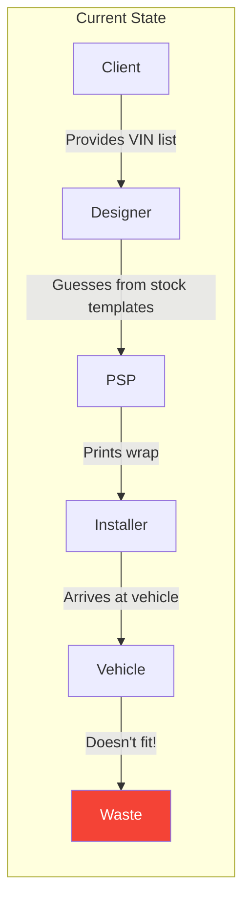
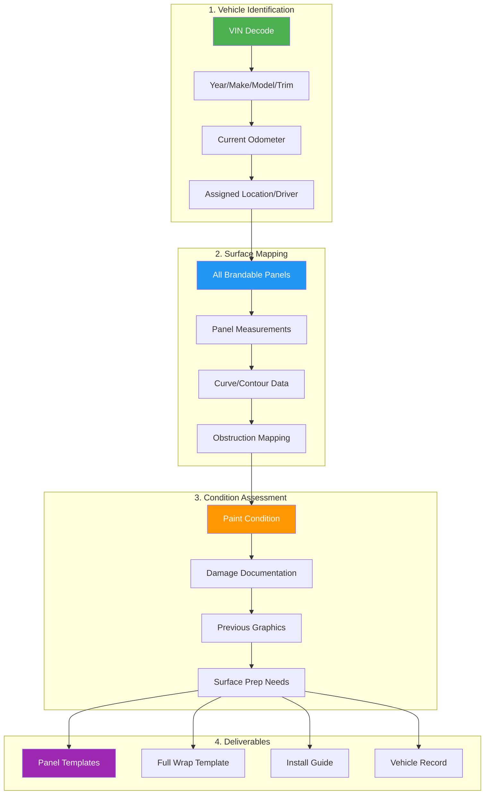
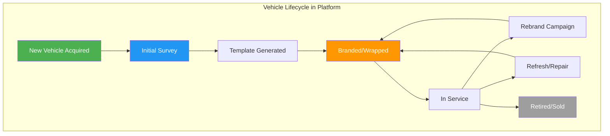

# Vehicle Fleet Branding

## Executive Summary

Vehicle Fleet Branding extends Survey as a Service to treat client vehicle fleets as "mobile locations." Each vehicle becomes a brandable asset that can be surveyed, templated, and managed through the platform—just like physical stores. This addresses a significant pain point for clients with service vehicles, delivery trucks, and corporate fleets who struggle with inconsistent branding, wasted wraps, and manual tracking.

**The Opportunity:**
- **Addressable Market:** 15M+ commercial vehicles in the US alone
- **Pain Point:** Vehicle wraps average $2,500-5,000 each; mis-sized wraps waste 10-15%
- **Recurring Need:** Fleet turnover, rebrands, and refreshes create ongoing demand

**Value Proposition:**
- **For Clients:** Survey once per vehicle, execute unlimited campaigns with confidence
- **For PSPs:** Accurate templates eliminate reprints and material waste
- **For Installers:** Pre-measured vehicles reduce on-site time by 30-40%
- **For Platform:** High-value, sticky service with recurring revenue

---

## 1. The Vehicle Branding Problem

### 1.1 Current Pain Points

**Why Vehicle Wraps Fail:**

| Issue | Frequency | Cost Impact |
|-------|-----------|-------------|
| Wrong template for trim level | 15-20% | $500-1,500 reprint |
| Aftermarket mods not accounted for | 10-15% | Field modification or reprint |
| Wear/damage not documented | 20-30% | Poor adhesion, early failure |
| Outdated fleet records | 25-40% | Wrong vehicle at install |
| No curve/contour data | 30%+ | Bubbling, lifting, poor fit |

### 1.2 Why "Stock Templates" Fail

| Factor | Reality |
|--------|---------|
| **Model Variations** | 2024 Ford Transit has 12+ configurations |
| **Trim Packages** | Different mirrors, handles, roof heights |
| **Aftermarket Mods** | Ladder racks, toolboxes, lift gates, graphics |
| **Wear Patterns** | Dents, rust, previous graphics residue |
| **Regional Specs** | Different specs by market |

**Stock templates assume "average" vehicle. Real fleets have zero average vehicles.**

---

## 2. Vehicle Survey Process

### 2.1 Survey Workflow

### 2.2 What We Capture Per Vehicle

**Identification Data:**
| Field | Source | Purpose |
|-------|--------|---------|
| VIN | Scan or manual | Decode exact configuration |
| Year/Make/Model | VIN decode | Base template selection |
| Trim Level | VIN decode + visual | Accurate measurements |
| Color Code | VIN decode | Background for partial wraps |
| Fleet Number | Client system | Internal tracking |
| Assigned Location | Client system | Logistics coordination |

**Surface Measurements:**
| Panel | Measurements Captured | Special Considerations |
|-------|----------------------|------------------------|
| Driver Door | Height, width, handle position, mirror cutout | Window reveal, lock position |
| Passenger Door | Same as driver | May differ from driver side |
| Sliding Door | Full panel, track area, handle | Track must remain clear |
| Rear Doors | Full panel, handle, hinges | Swing clearance |
| Hood | Full panel, contours | Vents, air intakes |
| Tailgate | Full panel, handle, camera | Latch clearance |
| Roof | Full area, rack mounts | Solar panels, vents |
| Bumpers | Front/rear coverage area | Sensors, tow hooks |
| Box/Cargo | Each side, rear, roof | Rivets, doors, vents |

**Condition Data:**
| Item | Rating Scale | Action Triggers |
|------|--------------|-----------------|
| Paint Condition | 1-5 | Below 3 = surface prep required |
| Dents/Damage | Count + location | Affects template design |
| Rust/Corrosion | Yes/No + location | May void warranty |
| Previous Graphics | Yes/No + type | Removal required |
| Clear Coat | Intact/Failing | Affects adhesion |

### 2.3 Technology Options

| Method | Accuracy | Speed | Cost | Best For |
|--------|----------|-------|------|----------|
| **Manual Measurement** | ±1/8" | 45-60 min | Low | Precision requirements |
| **Photo + AI** | ±1/2" | 15-20 min | Medium | Standard fleet vehicles |
| **LiDAR Scan** | ±1/4" | 10-15 min | Medium | Complex curves, 3D data |
| **3D Scanner** | ±1/16" | 30-45 min | High | Custom vehicles, digital twins |

---

## 3. Template Deliverables

### 3.1 Template Types

### 3.2 Template Specifications

| Template Component | Included Data |
|-------------------|---------------|
| **Dimensions** | Exact panel size with bleed |
| **Safe Zone** | Area clear of handles, mirrors, edges |
| **Obstruction Mapping** | Handles, locks, lights, sensors |
| **Fold/Wrap Lines** | Where material wraps edges |
| **Registration Marks** | Alignment guides for installers |
| **Layer Structure** | Separated for design flexibility |

### 3.3 File Formats

| Format | Use Case |
|--------|----------|
| Adobe Illustrator (.ai) | Primary design format |
| PDF (vector) | Universal compatibility |
| EPS | Legacy systems |
| PNG (preview) | Quick visualization |
| 3D Model (optional) | AR preview, complex curves |

---

## 4. Fleet Management Integration

### 4.1 Vehicle Lifecycle

### 4.2 Integration Points

| System | Integration | Data Flow |
|--------|-------------|-----------|
| **Fleet Management Software** | API sync | Vehicle adds/removes, assignments |
| **ERP/Asset Management** | API sync | Cost tracking, depreciation |
| **GPS/Telematics** | Optional | Location for mobile surveys |
| **Maintenance Systems** | Optional | Damage reports trigger resurvey |

### 4.3 Fleet Dashboard Features

**For Fleet Managers:**
- Vehicle inventory with branding status
- Campaign rollout progress
- Cost per vehicle tracking
- Upcoming refresh schedule
- Compliance reporting (branding standards)

**For Marketing:**
- Brand consistency audits
- Campaign coverage maps
- Creative version control
- A/B testing across regions

---

## 5. Monetization

### 5.1 Pricing Model

| Service | Price Range | Includes |
|---------|-------------|----------|
| **Per-Vehicle Survey** | $75-150 | Measurements, photos, single template set |
| **Fleet Survey (10+)** | $50-100/vehicle | Volume discount |
| **Fleet Survey (50+)** | $40-75/vehicle | Additional volume discount |
| **Fleet Survey (200+)** | $30-60/vehicle | Enterprise pricing |
| **Annual Audit** | $25/vehicle | Condition check, template updates |
| **Rush Survey** | +50% | 24-48 hour turnaround |

### 5.2 Value-Add Services

| Service | Price | Value |
|---------|-------|-------|
| **Template Library Access** | $500/mo | Stock templates for common vehicles |
| **3D Preview Rendering** | $50/vehicle | Photorealistic mockups |
| **AR Preview** | $100/vehicle | View wrap on actual vehicle via phone |
| **Fleet Branding Audit** | $2,500+ | Consistency review across fleet |
| **Design Services** | Hourly | Custom wrap design |

### 5.3 Revenue Projection

| Client Size | Vehicles | Survey Revenue | Annual Refresh | Total Year 1 |
|-------------|----------|----------------|----------------|--------------|
| Small Fleet | 25 | $2,500 | $625 | $3,125 |
| Medium Fleet | 100 | $7,500 | $2,500 | $10,000 |
| Large Fleet | 500 | $25,000 | $12,500 | $37,500 |
| Enterprise | 2,000 | $80,000 | $50,000 | $130,000 |

---

## 6. Surveyor Requirements

### 6.1 Vehicle Certification Add-On

Surveyors with location certification can add vehicle certification:

| Module | Duration | Content |
|--------|----------|---------|
| Vehicle Measurement Fundamentals | 2 hours | Panel identification, measurement techniques |
| VIN Decoding | 1 hour | Understanding vehicle configurations |
| Condition Assessment | 1 hour | Documenting damage, wear, prep needs |
| Template Verification | 1 hour | QA checking generated templates |
| Practicum | 3 hours | Survey 5 vehicles with supervision |

### 6.2 Equipment Requirements

| Equipment | Purpose | Estimated Cost |
|-----------|---------|----------------|
| Smartphone (LiDAR capable) | AR measurements, photos | $800-1,200 |
| Laser Measure | Precise panel dimensions | $50-150 |
| Flexible Tape | Curved surfaces | $20 |
| Inspection Light | Reveal damage/texture | $30 |
| Knee Pads | Comfort for low panels | $25 |
| Survey App | Data capture, sync | Included |

---

## 7. Client Use Cases

### 7.1 Example: Good2Go (C-Store Chain)

| Fleet Segment | Vehicles | Use Case |
|---------------|----------|----------|
| Fuel Delivery | 50 tanker trucks | Full wrap, DOT compliance |
| Maintenance | 80 service vans | Partial wrap, panel graphics |
| Management | 30 SUVs | Spot graphics, door logos |
| **Total** | **160** | Mixed coverage levels |

**Campaign Example:** Rebrand 160 vehicles
- Survey cost: 160 × $60 = $9,600
- Without survey: 15% waste = $60,000+ in reprints
- ROI: 6x survey cost saved in first campaign

### 7.2 Example: Banner Medical

| Fleet Segment | Vehicles | Use Case |
|---------------|----------|----------|
| Patient Transport | 100 vans | Full wrap, accessibility graphics |
| Home Health | 150 sedans | Magnetic panels, door logos |
| Facilities | 50 trucks | Box truck sides, partial wrap |
| **Total** | **300** | Compliance-critical branding |

### 7.3 Example: HVAC/Trades Company

| Fleet Segment | Vehicles | Use Case |
|---------------|----------|----------|
| Service Vans | 200 | Full wrap, contact info |
| Box Trucks | 25 | Sides + rear, product showcase |
| Sales Vehicles | 30 | Partial wrap, professional look |
| **Total** | **255** | Lead generation branding |

---

## 8. Integration with Advertising Platform

### 8.1 Vehicles as Mobile Advertising

Just like physical locations, vehicles can participate in the Retail Media Network:

| Scenario | Example |
|----------|---------|
| **Co-Branded Wraps** | Good2Go trucks display Monster Energy promotion |
| **Sponsored Panels** | Delivery truck sides sold to advertisers |
| **Regional Campaigns** | Different sponsors for different territories |

### 8.2 Revenue Opportunity

| Vehicle Type | Ad Potential | Advertiser Value |
|--------------|--------------|------------------|
| Delivery Trucks | High | 30,000-70,000 impressions/day |
| Service Vans | Medium | Local service area coverage |
| Fleet Cars | Low | Limited visibility |

---

## 9. Implementation Roadmap

### Phase 1: Pilot (Months 1-2)
- 2 clients with 50+ vehicles each
- Manual survey process
- Template generation <48 hours
- Validate accuracy with installations

### Phase 2: Process Refinement (Months 3-4)
- AI-assisted measurements
- Same-day template delivery
- Surveyor certification program
- QA automation

### Phase 3: Scale (Months 5-8)
- Self-service fleet upload
- Bulk survey scheduling
- Fleet management integrations
- Template library for common vehicles

### Phase 4: Advanced Features (Months 9-12)
- AR preview tools
- 3D digital twins
- Condition monitoring
- Advertising integration

---

## 10. Success Metrics

| Metric | Target | Measurement |
|--------|--------|-------------|
| Template Accuracy | 99%+ | Post-install fit verification |
| Survey Throughput | 8 vehicles/surveyor/day | Average across vehicle types |
| Template Turnaround | <24 hours | Survey complete to template delivery |
| Client Satisfaction | 90%+ | Post-campaign survey |
| Waste Reduction | 90%+ vs. baseline | Reprints before/after survey adoption |
| Fleet Coverage | 100% | All client vehicles surveyed |

---

## 11. Related Documents

- [Survey_as_a_Service.md](Survey_as_a_Service.md) - Core survey methodology
- [Retail_Media_Network.md](Retail_Media_Network.md) - Advertising integration
- [POP_Installer_Marketplace_Strategy.md](POP_Installer_Marketplace_Strategy.md) - Installation services

---

*Vehicle Fleet Branding is an extension of Survey as a Service. Clients should have location surveys established before expanding to fleet vehicles.*
