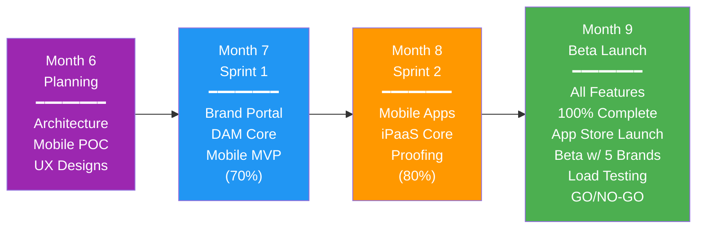

# Phase 2 Roadmap: Enhanced Tools for Brands Served by PSPs

**Version:** 2.0
**Timeline:** Months 6-9 (Q3-Q4 2026)
**Vision:** Deliver enhanced tools that empower brands served by PSPs with configuration control, asset management, and mobile capabilities

---

## Executive Summary

Phase 2 transforms PopSystem from a foundational PSP platform into a comprehensive brand enablement solution. This phase focuses on giving brands direct control over their POP programs while maintaining PSP oversight, introducing mobile capabilities for field execution, and establishing the integration infrastructure needed for enterprise adoption.

**Key Outcomes:**
- Brands can self-configure programs and manage assets independently
- Mobile apps enable field teams to execute POP campaigns efficiently
- Design proofing workflows reduce approval cycles by 60%
- iPaaS foundation supports 10+ common enterprise integrations
- Platform demonstrates readiness for multi-PSP network expansion

**Investment Required:** $850K-$1.2M
**Expected ROI:** 180% by month 12 through brand retention and reduced support costs

---

## Phase 2 Scope by Pillar

| Pillar | Features | Priority | Complexity | Duration |
|--------|----------|----------|------------|----------|
| **Brand Portal** | Brand configuration UI, program templates, user role management, brand analytics dashboard | P0 | High | 10 weeks |
| **Digital Asset Management** | Asset library, metadata tagging, version control, search/filter, basic approvals, storage optimization | P0 | High | 12 weeks |
| **Mobile Applications** | iOS/Android native apps, offline mode, barcode scanning, photo upload, location services, push notifications | P0 | Very High | 16 weeks |
| **Design Proofing** | Markup tools, approval workflows, version comparison, comment threads, notification system | P1 | Medium | 8 weeks |
| **iPaaS Foundation** | Integration hub, pre-built connectors (Salesforce, NetSuite, Shopify, HubSpot), webhook manager, API rate limiting | P1 | High | 10 weeks |
| **Enhanced Ordering** | Saved cart templates, bulk order import, approval routing, budget enforcement | P1 | Medium | 6 weeks |
| **Reporting v2** | Custom report builder, scheduled reports, export templates, brand-specific KPIs | P2 | Medium | 6 weeks |

---

## Monthly Milestones

### Month 6: Foundation & Planning
**Theme:** Architecture & Discovery

**Deliverables:**
- Technical architecture for brand portal and DAM completed
- Mobile app framework selection and POC (React Native vs Flutter)
- iPaaS platform evaluation and vendor selection
- UX/UI designs for brand configuration flows
- Database schema updates for multi-tenancy enhancements

**Success Criteria:**
- Architecture review approved by CTO
- Mobile framework POC demonstrates offline capability
- Design mockups validated with 3 beta brands

**Risks:**
- Mobile framework choice impacts long-term maintenance costs
- DAM storage costs may exceed budget projections

---

### Month 7: Core Development Sprint 1
**Theme:** Brand Portal & DAM Core

**Deliverables:**
- Brand configuration UI (70% complete)
  - Program settings management
  - User invitation and role assignment
  - Basic branding customization
- DAM core functionality (60% complete)
  - File upload and organization
  - Metadata schema definition
  - Basic search functionality
- Mobile app MVP (40% complete)
  - Authentication flow
  - Product catalog browsing
  - Order history view

**Success Criteria:**
- Brand admin can create and configure a new program
- 1000+ assets uploaded to DAM in test environment
- Mobile app successfully authenticates and displays data

**Risks:**
- DAM performance with large file sets (10K+ assets)
- Mobile offline sync complexity underestimated

---

### Month 8: Core Development Sprint 2
**Theme:** Mobile & Integration

**Deliverables:**
- Mobile apps (80% complete)
  - Offline ordering with sync
  - Photo capture and upload
  - Barcode scanning integration
  - Push notification system
- iPaaS foundation (60% complete)
  - Salesforce connector (CRM sync)
  - NetSuite connector (financial sync)
  - Webhook management UI
- Design proofing system (50% complete)
  - PDF markup tools
  - Basic approval workflow
- Brand portal (90% complete)
  - Program templates library
  - Analytics dashboard
  - Budget management tools

**Success Criteria:**
- Mobile app processes orders offline and syncs successfully
- Salesforce integration demonstrates bidirectional data flow
- Design proofing handles 50-page catalogs without performance issues

**Risks:**
- App store approval delays (2-4 weeks)
- Enterprise firewall issues blocking webhook callbacks
- Design file rendering performance with high-resolution PDFs

---

### Month 9: Integration & Launch Preparation
**Theme:** Polish, Performance & Beta Launch

**Deliverables:**
- All P0 and P1 features 100% complete
- Mobile apps submitted to App Store and Google Play
- iPaaS with 4 pre-built connectors operational
- DAM supporting 50K assets with <2s search times
- Design proofing integrated with order workflow
- Beta program with 5 brands launched
- Training materials and documentation complete

**Success Criteria:**
- Mobile apps approved and available in stores
- Beta brands process 100+ orders through new features
- System handles 10K concurrent users (load testing)
- NPS score from beta brands >40
- Zero P0 bugs in production

**Go/No-Go Decision Point:**
- Minimum 3 beta brands successfully using mobile apps
- All security audits passed (especially DAM file access)
- Performance benchmarks met (95th percentile <3s page load)
- Mobile app crash rate <1%

**Risks:**
- Beta brand feedback requires significant feature rework
- App store rejection requires resubmission (2-week delay)
- Integration issues discovered in production environments

---

## Feature Deep Dive

### Brand Configuration Portal
**Business Value:** Reduces PSP support burden by 40%, increases brand satisfaction by enabling self-service

**Technical Approach:**
- Multi-tenant architecture with brand-level customization
- Template system for rapid program setup
- Role-based access control (RBAC) with granular permissions
- Real-time validation of configuration changes

**Dependencies:**
- Requires database schema refactoring for tenant isolation
- Integrates with DAM for logo/asset management
- Connects to identity provider for SSO

---

### Digital Asset Management (DAM)
**Business Value:** Eliminates version control errors, reduces design rework by 30%

**Technical Approach:**
- Cloud storage (AWS S3 or Azure Blob) with CDN
- Elasticsearch for fast metadata search
- Automated thumbnail generation and format conversion
- Version control with rollback capability
- Access control tied to brand permissions

**Capacity Planning:**
- Support 100K assets by end of Phase 2
- 99.9% uptime SLA
- <2s search response time at 50K assets

**Dependencies:**
- CDN provider selection and setup
- Storage cost modeling and optimization
- Integration with design proofing system

---

### Mobile Applications
**Business Value:** Enables field teams to execute campaigns 50% faster, increases order accuracy

**Technical Approach:**
- Native apps (iOS/Android) using React Native
- Offline-first architecture with SQLite local storage
- Background sync with conflict resolution
- Device camera integration for proof of execution
- QR/barcode scanning for inventory management
- Location services for store verification

**Feature Set:**
- Product browsing with filters
- Offline ordering with cart management
- Order history and tracking
- Photo upload for campaign compliance
- Push notifications for order status
- Store locator with navigation

**Dependencies:**
- Mobile backend API enhancements
- App store developer accounts
- Push notification service (Firebase/APNs)
- Beta testing infrastructure (TestFlight/Firebase App Distribution)

---

### Design Proofing System
**Business Value:** Reduces approval cycle time from 5 days to <24 hours

**Technical Approach:**
- PDF rendering with annotation layer
- Real-time collaboration using WebSockets
- Version comparison with visual diff
- Approval workflow engine
- Email/Slack notifications for updates

**Integration Points:**
- DAM for file retrieval
- Order system for approved designs
- User management for approver routing

---

### iPaaS Foundation
**Business Value:** Eliminates manual data entry, enables enterprise-grade workflows

**Phase 2 Connectors:**
1. **Salesforce** - CRM sync (accounts, contacts, opportunities)
2. **NetSuite** - Financial sync (orders, invoices, payments)
3. **Shopify** - E-commerce sync (products, inventory)
4. **HubSpot** - Marketing automation (campaigns, leads)

**Technical Approach:**
- API gateway with rate limiting and retry logic
- Webhook receiver with signature verification
- Mapping UI for field transformations
- Error handling and monitoring dashboard
- Audit log for all data transfers

**Dependencies:**
- OAuth 2.0 implementation for each platform
- Data transformation engine
- Queue system for async processing (RabbitMQ/AWS SQS)

---

## Timeline and Dependencies

**Critical Path:**
1. Mobile framework selection (Month 6) → Mobile development (Month 7-8) → App store submission (Month 9)
2. DAM architecture (Month 6) → Core development (Month 7) → Performance optimization (Month 8) → Beta (Month 9)
3. Brand portal UX (Month 6) → Development (Month 7-8) → Beta testing (Month 9)

**Cross-Feature Dependencies:**
- Brand portal requires DAM for logo/asset upload
- Design proofing requires DAM for file storage
- Mobile apps require iPaaS for Salesforce field data sync
- All features require enhanced user management/RBAC

---

## Success Criteria

### Quantitative Metrics
- **Adoption:** 30% of brands using brand portal within 2 months of launch
- **Mobile:** 500+ active mobile users by end of Month 9
- **DAM:** 75K+ assets uploaded, 1000+ searches/day
- **Proofing:** Average approval time <24 hours (vs 5 days baseline)
- **Integration:** 20+ active iPaaS connections across beta brands
- **Performance:** 99.5% uptime, <3s average page load
- **Quality:** <5 P0 bugs in first month of production

### Qualitative Metrics
- **Brand NPS:** Score >40 from beta participants
- **PSP Feedback:** Reduced support tickets for brand configuration (target: -40%)
- **Sales Impact:** Mobile apps mentioned in 50%+ of new brand pitches
- **Market Position:** Featured in at least 2 industry publications as innovator

---

## Risk Management

| Risk | Probability | Impact | Mitigation Strategy |
|------|-------------|--------|---------------------|
| Mobile app store rejection | Medium | High | Early submission of basic version, maintain relationship with app review teams, have web-based fallback |
| DAM storage costs exceed budget | Medium | Medium | Implement tiered storage (hot/cold), compress assets, negotiate volume discounts, monitor usage weekly |
| iPaaS integration complexity underestimated | High | Medium | Start with read-only integrations, hire integration specialist, limit to 4 connectors in Phase 2 |
| Brand portal feature creep | High | Medium | Lock scope after Month 6, create Phase 3 backlog, enforce change control process |
| Mobile offline sync issues | Medium | High | Extensive testing with poor connectivity, implement conflict resolution UI, provide manual sync option |
| Beta brands not available/engaged | Medium | High | Recruit 10 candidates for 5 slots, offer incentives (discounts, early access), assign dedicated success manager |
| Key developer departure | Low | High | Document architecture decisions, pair programming, cross-train team members |
| Performance issues with DAM at scale | Medium | High | Load testing at 2x expected capacity, implement caching strategy, CDN for global access |
| Design proofing doesn't meet brand expectations | Medium | Medium | Weekly demos with beta brands, iterate on feedback, have plan B for third-party integration |

---

## Go/No-Go Decision Gates

### Month 7 Gate: Foundation Readiness
**Go Criteria:**
- Brand portal demonstrates core configuration flow
- DAM handles 10K assets with acceptable performance
- Mobile app authenticates and displays product catalog
- Technical debt backlog <20% of sprint capacity

**No-Go Triggers:**
- Major architecture flaws discovered requiring redesign
- Mobile framework unable to support offline requirements
- DAM performance fundamentally broken (requires platform change)

**No-Go Response:** Extend Month 7 by 2 weeks, reassess technical approach

---

### Month 8 Gate: Integration Validation
**Go Criteria:**
- Mobile apps demonstrate full offline ordering cycle
- At least 2 iPaaS connectors functionally complete
- Design proofing handles real-world files (100+ pages)
- Beta brand candidates confirmed and onboarding scheduled

**No-Go Triggers:**
- Mobile sync reliability <90%
- iPaaS integrations require custom development per client
- Critical security vulnerabilities discovered

**No-Go Response:** Delay beta launch by 4 weeks, focus on stability over features

---

### Month 9 Gate: Production Launch
**Go Criteria:**
- All P0 features 100% complete and tested
- Mobile apps approved in both app stores
- Load testing demonstrates 10K concurrent user capacity
- Security audit passed with no P0/P1 findings
- Minimum 3 beta brands ready to launch
- Support team trained and runbooks complete
- Rollback plan documented and tested

**No-Go Triggers:**
- Mobile app crash rate >2%
- Critical bugs discovered in beta testing
- Performance benchmarks not met (<90% of targets)
- Fewer than 3 beta brands confirmed

**No-Go Response:** Delay general availability by 6 weeks, continue beta with limited audience, address blocking issues

---

## Resource Requirements

### Team Composition (FTE)
- Product Manager: 1.0
- Engineering Lead: 1.0
- Backend Engineers: 4.0
- Frontend Engineers: 3.0
- Mobile Engineers: 2.0 (iOS + Android)
- Integration Engineer: 1.0
- UX/UI Designer: 1.0
- QA Engineers: 2.0
- DevOps Engineer: 1.0
- **Total: 16 FTE**

### External Resources
- Mobile app design consultant (Month 6-7)
- iPaaS implementation partner (Month 7-9)
- Security audit firm (Month 9)
- Technical writer for documentation (Month 8-9)

### Infrastructure Costs (Monthly)
- Additional cloud storage (DAM): $5K-$15K
- CDN for global asset delivery: $2K-$5K
- iPaaS platform licenses: $3K-$8K
- Mobile push notification service: $500
- Load testing infrastructure: $1K
- **Estimated Monthly: $11.5K-$29.5K**

---

## Transition to Phase 3

### Handoff Requirements
- All Phase 2 features in production and stable
- 20+ brands actively using brand portal
- 1000+ mobile app users
- DAM containing 100K+ assets
- iPaaS processing 10K+ transactions/month
- Documentation complete (technical, user, API)
- Support team trained and handling issues independently

### Phase 3 Prerequisites
- Multi-PSP routing requires brand portal role management
- AI insights require DAM metadata and usage data
- Workflow builder depends on iPaaS foundation
- Network effects require critical mass of brands (target: 50+)

### Success Metrics Baseline for Phase 3
- Brand retention rate: >90%
- Mobile app DAU/MAU ratio: >0.3
- DAM search success rate: >80%
- Integration uptime: >99.5%
- Support ticket volume stabilized (<10% growth month-over-month)

---

## Appendix

### Glossary
- **DAM:** Digital Asset Management
- **iPaaS:** Integration Platform as a Service
- **PSP:** Print Service Provider
- **RBAC:** Role-Based Access Control
- **NPS:** Net Promoter Score
- **CDN:** Content Delivery Network

### References
- Phase 1 Retrospective Document
- Brand Portal UX Research Report
- Mobile App Market Analysis
- iPaaS Vendor Evaluation Matrix
- DAM Technical Architecture Specification

---

**Document Control**
**Created:** 2025-12-21
**Owner:** Product Management
**Review Cycle:** Monthly
**Next Review:** Month 6 Sprint Planning
