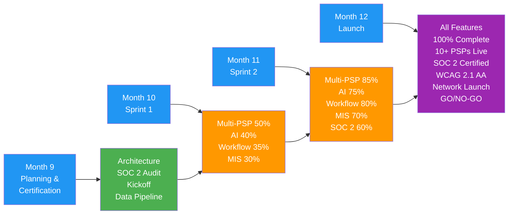

# Phase 3 Roadmap: Join the POP Network

**Version:** 3.0
**Timeline:** Months 9-12 (Q1-Q2 2027)
**Vision:** Transform PopSystem into a network platform where brands can access multiple PSPs, leveraging AI for insights and automation

---

## Executive Summary

Phase 3 represents a paradigm shift from a single-PSP platform to a network marketplace. This phase introduces multi-PSP routing, allowing brands to work with multiple print providers while maintaining a single interface. AI-powered insights optimize ordering patterns, predict demand, and recommend cost savings. The workflow builder enables brands and PSPs to automate complex processes without code.

**Key Outcomes:**
- Brands can route orders to multiple PSPs based on capability, cost, and performance
- AI engine analyzes 1M+ data points to deliver actionable insights
- No-code workflow builder reduces custom development requests by 70%
- Basic MIS functionality provides PSPs with production planning tools
- Industry certifications establish PopSystem as enterprise-ready platform

**Investment Required:** $1.1M-$1.5M
**Expected ROI:** 240% by month 18 through network effects and premium feature adoption

---

## Phase 3 Scope by Pillar

| Pillar | Features | Priority | Complexity | Duration |
|--------|----------|----------|------------|----------|
| **Multi-PSP Network** | PSP discovery, routing rules engine, capability matching, SLA tracking, performance scoring, dispute resolution | P0 | Very High | 14 weeks |
| **AI Insights Engine** | Predictive analytics, spend optimization, demand forecasting, anomaly detection, recommendation system, natural language queries | P0 | Very High | 16 weeks |
| **Workflow Builder** | Visual workflow designer, trigger/action library, conditional logic, integration connectors, template marketplace, version control | P0 | High | 12 weeks |
| **Basic MIS** | Job scheduling, capacity planning, material tracking, basic costing, production status dashboard | P1 | High | 10 weeks |
| **Certifications & Compliance** | SOC 2 Type II, ISO 27001, WCAG 2.1 AA, GDPR enhancements, audit logging, compliance dashboard | P0 | Medium | 12 weeks (parallel) |
| **Advanced DAM** | AI tagging, brand guidelines enforcement, rights management, automated resizing, video support | P1 | Medium | 8 weeks |
| **Enhanced Mobile** | Augmented reality preview, voice ordering, smart notifications, geo-fencing, offline workflow execution | P2 | High | 10 weeks |

---

## Monthly Milestones

### Month 9: Architecture & Certification Kickoff
**Theme:** Network Foundation & Compliance Planning

**Deliverables:**
- Multi-PSP architecture design completed
  - Data model for PSP profiles and capabilities
  - Routing algorithm specification
  - SLA framework definition
- AI/ML infrastructure plan
  - Data warehouse schema for analytics
  - ML model selection (forecasting, classification)
  - Feature engineering pipeline design
- SOC 2 Type II audit initiated
  - Gap analysis completed
  - Remediation plan for controls
  - Evidence collection process established
- Workflow builder UX research
  - Competitive analysis (Zapier, Make, n8n)
  - User journey mapping
  - Low-fidelity wireframes

**Success Criteria:**
- Architecture review approved for multi-PSP routing
- SOC 2 auditor engaged and kickoff meeting held
- AI data warehouse contains 6+ months of historical data
- Workflow builder designs validated with 5 users

**Risks:**
- Multi-PSP routing complexity exceeds estimates
- Insufficient historical data for AI model training
- SOC 2 gap remediation requires significant infrastructure changes

---

### Month 10: Core Development Sprint 1
**Theme:** Network & Intelligence

**Deliverables:**
- Multi-PSP routing (50% complete)
  - PSP profile management UI
  - Capability taxonomy and matching engine
  - Basic routing rules (geography, capacity, capability)
- AI insights engine (40% complete)
  - Data pipeline for analytics (ETL)
  - Spend analysis dashboard
  - Basic forecasting model (time series)
- Workflow builder (35% complete)
  - Visual designer UI (drag-and-drop)
  - Trigger library (order events, schedule, webhooks)
  - 10 pre-built action connectors
- Basic MIS (30% complete)
  - Job board UI
  - Capacity calendar
  - Material inventory tracking

**Success Criteria:**
- System can route orders to 2+ PSPs based on simple rules
- AI dashboard displays spend analysis for 10+ brands
- Workflow builder can create simple automation (e.g., email on order)
- MIS tracks 100+ jobs across production floor

**Risks:**
- PSP onboarding friction (may require dedicated team)
- AI models require more training data than available
- Workflow builder UX not intuitive for non-technical users
- MIS feature scope creep from PSP feedback

---

### Month 11: Core Development Sprint 2
**Theme:** Automation & Intelligence Maturity

**Deliverables:**
- Multi-PSP routing (85% complete)
  - Advanced routing rules (cost optimization, load balancing)
  - SLA monitoring and alerts
  - PSP performance dashboard
  - Brand preference management
- AI insights engine (75% complete)
  - Demand forecasting (30-90 day predictions)
  - Anomaly detection (unusual spend, errors)
  - Cost optimization recommendations
  - Natural language query interface (beta)
- Workflow builder (80% complete)
  - Conditional logic and branching
  - 25+ action connectors (including Phase 2 iPaaS integrations)
  - Error handling and retry logic
  - Template marketplace (10 starter workflows)
  - Workflow execution monitoring
- Basic MIS (70% complete)
  - Production scheduling with dependencies
  - Basic costing and margin calculation
  - Real-time production status tracking
  - Reporting module
- Certifications (60% complete)
  - SOC 2 controls implementation
  - WCAG 2.1 AA accessibility audit and remediation
  - Enhanced audit logging across all modules

**Success Criteria:**
- 5+ PSPs onboarded and processing orders through routing engine
- AI forecasting accuracy >70% for established brands
- 50+ workflows created by brands using workflow builder
- MIS manages production for 3+ PSP facilities
- SOC 2 audit fieldwork scheduled

**Risks:**
- PSP network effects not materializing (chicken-and-egg problem)
- AI recommendations not trusted by brands (adoption challenge)
- Workflow builder performance issues with complex workflows
- SOC 2 audit uncovers critical control deficiencies

---

### Month 12: Network Launch & Certification
**Theme:** Production Launch, Certification, and Network Activation

**Deliverables:**
- All P0 and P1 features 100% complete
- Multi-PSP network live with 10+ PSPs
  - Routing engine processing 1000+ orders/month across network
  - SLA compliance >95%
  - PSP onboarding documentation and support
- AI insights deployed to all brands
  - Forecasting models trained on 12+ months data
  - Recommendation engine delivering 5+ insights/brand/month
  - Natural language queries available for premium tier
- Workflow builder general availability
  - 50+ pre-built workflow templates
  - Integration with all Phase 2 iPaaS connectors
  - Self-service workflow publishing
- MIS deployed to 5+ PSPs
  - Managing 500+ jobs/month
  - Integration with existing PSP systems (ERP, production)
- **SOC 2 Type II certification achieved**
- **ISO 27001 certification in progress** (completion Month 13)
- WCAG 2.1 AA compliance certified
- Network launch event and marketing campaign

**Success Criteria:**
- 10+ PSPs actively participating in network
- 20+ brands using multi-PSP routing
- AI insights viewed by 60%+ of active brands monthly
- 100+ active workflows in production
- SOC 2 certification with zero qualifications
- Zero P0 security incidents during audit period
- Network GMV (Gross Merchandise Value) >$500K/month

**Go/No-Go Decision Point:**
- Minimum 8 PSPs committed to network with signed agreements
- AI forecasting accuracy >65% (acceptable threshold)
- Workflow builder NPS >30
- SOC 2 audit on track for certification (no critical findings)
- System stability >99.7% uptime
- Multi-PSP routing disputes <5% of orders

**Risks:**
- PSP adoption below critical mass (need 10+ for network effects)
- SOC 2 audit delayed or requires remediation period
- AI insights not driving measurable brand value
- Workflow builder complexity limits adoption to technical users
- Network routing creates channel conflict with existing PSP relationships

---

## Feature Deep Dive

### Multi-PSP Network & Routing
**Business Value:** Increases brand choice, reduces costs through competition, improves fulfillment speed

**Core Capabilities:**

1. **PSP Discovery & Profiles**
   - Comprehensive PSP directory with capabilities, certifications, geography
   - Self-service PSP registration and profile management
   - Capability taxonomy (digital, offset, large format, specialty finishes, etc.)
   - Equipment inventory and capacity availability
   - Pricing transparency (optional public pricing grids)

2. **Intelligent Routing Engine**
   - Rule-based routing (capability, geography, cost, preferred vendors)
   - AI-optimized routing (historical performance, quality scores)
   - Load balancing across PSP network
   - Fallback routing for capacity constraints
   - Override capability for manual PSP selection

3. **SLA Management**
   - Define SLAs per PSP (turnaround time, quality standards)
   - Real-time SLA tracking and alerts
   - Performance scoring dashboard
   - Automated escalation for SLA breaches

4. **Network Governance**
   - PSP vetting and approval process
   - Quality standards enforcement
   - Dispute resolution workflow
   - Rating and review system
   - Network health dashboard (for platform admin)

**Technical Architecture:**
- Microservices for routing, matching, and SLA tracking
- Graph database for PSP relationship mapping
- Real-time event processing for order routing
- Machine learning model for performance prediction

**Data Model:**
```
PSP Profile: capabilities[], certifications[], geography, capacity, pricing
Routing Rule: conditions[], priority, psp_preferences[], constraints[]
SLA: metrics[], thresholds[], penalties[], escalation_rules[]
Performance Score: quality_rating, on_time_delivery%, defect_rate, response_time
```

**Dependencies:**
- Requires enhanced order management system
- Integration with PSP production systems (API or EDI)
- Dispute management and communication platform
- Financial settlement system for multi-PSP transactions

---

### AI Insights Engine
**Business Value:** Reduces costs by 15-25%, improves planning accuracy, identifies optimization opportunities

**AI/ML Capabilities:**

1. **Spend Optimization**
   - Identify cost-saving opportunities (bulk ordering, PSP switching)
   - Analyze pricing trends and negotiate leverage
   - Detect overspending vs. similar brands
   - Recommend budget reallocation

2. **Demand Forecasting**
   - Predict POP material needs 30-90 days ahead
   - Seasonal trend analysis
   - New product launch planning
   - Store opening/remodel forecasting

3. **Anomaly Detection**
   - Unusual spending patterns (fraud prevention)
   - Quality issues (spike in defect rates)
   - Delivery delays (supply chain disruptions)
   - Inventory imbalances (overstock/stockout)

4. **Recommendation System**
   - Suggest optimal PSPs for specific jobs
   - Recommend workflow automations based on patterns
   - Identify underutilized materials/products
   - Propose bundling opportunities

5. **Natural Language Queries (Beta)**
   - "Show me spend on window clings for Q4"
   - "Which stores ordered the most materials last month?"
   - "What's the forecast for signage next quarter?"
   - "Compare my costs to industry benchmarks"

**Technical Stack:**
- Data warehouse: Snowflake or BigQuery
- ML framework: TensorFlow/PyTorch for forecasting models
- NLP: OpenAI GPT-4 or similar for natural language interface
- Visualization: Custom dashboards with Plotly/D3.js
- Feature store for ML model inputs

**Models:**
- Time series forecasting (ARIMA, Prophet, LSTM)
- Classification (PSP recommendation, quality prediction)
- Clustering (brand segmentation, spend patterns)
- Anomaly detection (Isolation Forest, autoencoders)

**Data Requirements:**
- 12+ months historical order data
- Product catalog with attributes
- PSP performance metrics
- External data (seasonality, industry benchmarks)

**Privacy & Ethics:**
- Anonymized benchmarking across brands
- Opt-in for data sharing
- Explainable AI (show why recommendations made)
- Bias monitoring (ensure fair PSP recommendations)

---

### Workflow Builder
**Business Value:** Reduces custom development costs by 70%, enables business users to automate processes

**Core Features:**

1. **Visual Workflow Designer**
   - Drag-and-drop interface (nodes and connections)
   - Trigger configuration (events, schedules, webhooks, manual)
   - Action library (50+ pre-built actions)
   - Conditional branching (if/then/else logic)
   - Loops and iterations
   - Error handling and retry policies

2. **Trigger Library**
   - Order events (created, approved, shipped, completed)
   - Inventory thresholds (low stock alerts)
   - Schedule-based (daily reports, monthly reconciliation)
   - Webhooks from external systems
   - Manual triggers (button click, API call)
   - File upload/change events

3. **Action Connectors** (50+ total)
   - **Internal:** Create order, update inventory, send notification, generate report
   - **Communication:** Send email, Slack message, SMS, Teams notification
   - **CRM:** Salesforce create/update, HubSpot log activity
   - **ERP:** NetSuite create invoice, update GL
   - **E-commerce:** Shopify sync inventory, update product
   - **Storage:** Save to Google Drive, Dropbox, SharePoint
   - **Data:** Transform JSON, filter data, aggregate, lookup table
   - **AI:** Classify image, extract text (OCR), sentiment analysis

4. **Template Marketplace**
   - 50+ pre-built workflow templates
   - Community-contributed workflows
   - Industry-specific templates (retail, hospitality, healthcare)
   - Version control and rollback
   - Fork and customize templates

5. **Workflow Management**
   - Execution history and logs
   - Performance monitoring (execution time, success rate)
   - Error debugging tools
   - Workflow versioning
   - A/B testing for workflow optimization
   - Permissions and sharing (team workflows)

**Technical Architecture:**
- Workflow engine: Apache Airflow or Temporal
- Node.js runtime for action execution
- Redis for workflow state management
- WebSocket for real-time execution updates
- Sandbox environment for testing workflows

**User Experience:**
- No-code for 80% of use cases
- Low-code (JavaScript expressions) for advanced logic
- Workflow testing in sandbox before production
- Rollback capability for failed workflows
- Copy/paste workflows across environments

**Example Workflows:**
1. **Auto-reorder on low inventory:** Trigger when stock <100 → Check forecast → Create order → Notify manager
2. **New store opening kit:** Trigger on new store in Salesforce → Create order for starter kit → Assign to local PSP → Track shipment
3. **Campaign compliance check:** Trigger on photo upload → AI check for brand guidelines → Approve/reject → Notify field team
4. **Monthly spend report:** Schedule on 1st of month → Aggregate spend by category → Generate PDF → Email to finance team

---

### Basic MIS (Management Information System)
**Business Value:** Improves PSP production efficiency by 20%, reduces manual scheduling effort

**Core Features:**

1. **Job Scheduling**
   - Gantt chart view of production schedule
   - Drag-and-drop job sequencing
   - Capacity-based scheduling (machine hours, labor)
   - Dependency management (job A must complete before B)
   - Automated scheduling recommendations

2. **Capacity Planning**
   - Machine utilization tracking
   - Labor availability and shifts
   - Material availability checks
   - Bottleneck identification
   - What-if scenario planning

3. **Material Tracking**
   - Inventory of substrates, inks, finishes
   - Usage tracking per job
   - Reorder point alerts
   - Waste tracking and reporting
   - Supplier integration for replenishment

4. **Basic Costing**
   - Material cost calculation
   - Labor time tracking
   - Machine cost allocation
   - Job profitability analysis
   - Actual vs. estimated cost variance

5. **Production Dashboard**
   - Real-time job status (queued, in-progress, completed)
   - Production floor overview (by machine, by operator)
   - Daily output metrics
   - Quality metrics (defect rate, rework)
   - On-time delivery percentage

**Integration Points:**
- Order management system (job intake)
- Equipment sensors (machine status, uptime)
- Time tracking systems (labor hours)
- Accounting systems (cost GL posting)
- Shipping systems (job completion trigger)

**Phase 3 Limitations (Full MIS in Phase 4):**
- Basic scheduling only (no advanced optimization)
- Limited financial features (no full GL integration)
- Simple material tracking (no lot/serial numbers)
- Manual data entry required (no full IoT integration)
- Single-facility support (multi-facility in Phase 4)

---

### Certifications & Compliance
**Business Value:** Enables enterprise sales, reduces security risk, demonstrates platform maturity

**Certification Targets:**

1. **SOC 2 Type II** (Complete Month 12)
   - **Scope:** Security, availability, confidentiality
   - **Controls:**
     - Access control (MFA, RBAC, least privilege)
     - Change management (code review, deployment controls)
     - Incident response (monitoring, alerting, runbooks)
     - Data encryption (at rest, in transit)
     - Vendor management (third-party risk assessment)
     - Business continuity (backup, disaster recovery)
   - **Audit Period:** 6 months (Month 7-12)
   - **Auditor:** Big 4 or recognized cybersecurity firm
   - **Deliverables:** SOC 2 Type II report with zero qualifications

2. **ISO 27001** (In progress, complete Month 13-14)
   - **Scope:** Information Security Management System (ISMS)
   - **Requirements:**
     - ISMS documentation (policies, procedures)
     - Risk assessment and treatment
     - Information security controls (Annex A)
     - Internal audit program
     - Management review process
   - **Certification Body:** ANSI-accredited registrar
   - **Deliverables:** ISO 27001 certificate

3. **WCAG 2.1 AA** (Complete Month 12)
   - **Scope:** Web application accessibility
   - **Requirements:**
     - Perceivable (alt text, captions, adaptable layouts)
     - Operable (keyboard navigation, no time limits)
     - Understandable (readable, predictable)
     - Robust (assistive technology compatible)
   - **Testing:** Automated (aXe, WAVE) + manual audit
   - **Deliverables:** VPAT (Voluntary Product Accessibility Template)

4. **GDPR Enhancements**
   - Data processing agreement templates
   - Right to erasure (delete account and data)
   - Data portability (export user data)
   - Consent management for marketing
   - Privacy by design documentation

**Compliance Infrastructure:**
- **Audit Logging:** Immutable logs for all user actions, data access, system changes
- **Compliance Dashboard:** Real-time view of control status, evidence collection
- **Policy Management:** Centralized repository for security policies
- **Vendor Risk Management:** Assessment of all third-party integrations
- **Employee Training:** Security awareness, data privacy training

**Ongoing Compliance:**
- Quarterly internal audits
- Annual SOC 2 re-certification
- ISO 27001 surveillance audits (annual)
- WCAG regression testing in CI/CD pipeline
- Penetration testing (annual)

---

## Timeline and Dependencies



**Critical Path:**
1. SOC 2 audit (Month 9-12) → Controls implementation → Certification
2. Multi-PSP architecture (Month 9) → Routing engine (Month 10-11) → Network launch (Month 12)
3. AI data pipeline (Month 9) → Model training (Month 10) → Insights deployment (Month 11-12)
4. Workflow builder UX (Month 9) → Core development (Month 10-11) → Template marketplace (Month 12)

**Cross-Feature Dependencies:**
- AI insights require multi-PSP data for optimization recommendations
- Workflow builder requires iPaaS connectors from Phase 2
- MIS requires multi-PSP routing data for capacity planning
- Network launch requires SOC 2 certification for enterprise PSP participation

---

## Success Criteria

### Quantitative Metrics
- **Network:** 10+ PSPs onboarded, 20+ brands using multi-PSP routing
- **GMV:** $500K+/month through multi-PSP network
- **AI Adoption:** 60% of brands viewing insights monthly
- **Forecasting Accuracy:** >70% for established brands (>6 months data)
- **Cost Savings:** Brands realize average 15% savings through AI recommendations
- **Workflows:** 100+ active workflows in production, 50+ templates published
- **Workflow Adoption:** 40% of brands create at least one workflow
- **MIS:** 5+ PSPs using MIS to manage 500+ jobs/month
- **Certifications:** SOC 2 Type II achieved, ISO 27001 in audit, WCAG 2.1 AA certified
- **Performance:** 99.7% uptime, <3s average page load
- **Quality:** <3 P0 bugs per month in production

### Qualitative Metrics
- **Brand NPS:** Score >50 (from >40 in Phase 2)
- **PSP NPS:** Score >30 (new metric for network participants)
- **Enterprise Readiness:** Security certifications mentioned in 80%+ of enterprise RFPs
- **Market Position:** Recognized as "network platform" vs "single-PSP tool" in industry
- **Innovation:** AI insights featured in at least 3 industry case studies

### Network Health Metrics
- **PSP Performance:** Average SLA compliance >95%
- **Routing Efficiency:** <5% of orders require manual PSP assignment
- **Dispute Rate:** <3% of orders escalated to dispute resolution
- **PSP Churn:** <10% annual churn rate for network PSPs
- **Brand Multi-PSP Usage:** 30%+ of brands using 2+ PSPs through platform

---

## Risk Management

| Risk | Probability | Impact | Mitigation Strategy |
|------|-------------|--------|---------------------|
| PSP network adoption below critical mass | High | Critical | Recruit 20 PSP candidates for 10 slots, offer revenue share incentives, create PSP success team, highlight network benefits in sales materials |
| SOC 2 audit uncovers major control deficiencies | Medium | High | Hire security consultant for pre-audit, implement controls early (Month 9), maintain continuous monitoring, budget for remediation |
| AI models fail to deliver accurate predictions | Medium | High | Start with descriptive analytics, set conservative accuracy targets (>65%), offer manual override, collect more training data, hire ML specialist |
| Workflow builder too complex for target users | Medium | Medium | Extensive user testing, invest in UX design, create video tutorials, offer workflow consulting service, build robust template library |
| Multi-PSP routing creates channel conflict | High | Medium | Clear PSP agreements on routing rules, transparent performance metrics, opt-in for network participation, brand control over PSP preferences |
| Insufficient historical data for AI training | Medium | Medium | Extend data collection period, use synthetic data for testing, start with simpler models, partner with data provider for external benchmarks |
| Key PSPs refuse to share production data for MIS | Medium | Medium | Make MIS opt-in, demonstrate value through pilot, ensure data privacy controls, offer competitive advantage messaging |
| Certifications delayed or denied | Low | High | Engage auditors early, hire compliance experts, allocate buffer time, have backup plan for phased certification |
| Network routing disputes damage brand trust | Medium | High | Build robust dispute resolution process, maintain escrow for disputed transactions, SLA penalties for PSPs, 24/7 support for network issues |
| Competitor launches similar network first | Medium | Medium | Accelerate development if needed, differentiate on AI and workflows, leverage existing brand relationships, emphasize certification credibility |

---

## Go/No-Go Decision Gates

### Month 10 Gate: Foundation Validation
**Go Criteria:**
- Multi-PSP routing demonstrates capability matching for 3+ PSPs
- AI data pipeline ingesting and processing 1M+ data points
- Workflow builder allows creation of simple 3-step automation
- SOC 2 control implementation >50% complete
- At least 5 PSPs committed to network (signed LOIs)

**No-Go Triggers:**
- Routing engine architecture fundamentally flawed
- AI data quality too poor for model training (<60% clean data)
- Workflow builder UX testing reveals major usability issues
- SOC 2 auditor identifies critical control gaps requiring >2 months remediation

**No-Go Response:** Extend Month 10 by 3 weeks, address blocking issues, reassess scope

---

### Month 11 Gate: Production Readiness
**Go Criteria:**
- 5+ PSPs processing test orders through routing engine
- AI forecasting model achieves >60% accuracy on test set
- 20+ workflows created by beta users
- MIS managing production for 2+ PSP facilities
- SOC 2 audit fieldwork completed with no critical findings
- WCAG remediation >90% complete

**No-Go Triggers:**
- PSP adoption <3 (insufficient for network)
- AI models fail to beat simple baseline (moving average)
- Workflow builder has critical bugs or performance issues
- SOC 2 audit reveals qualification issues

**No-Go Response:** Delay network launch by 6 weeks, focus on PSP recruitment and certification remediation

---

### Month 12 Gate: Network Launch
**Go Criteria:**
- 8+ PSPs ready to participate in live network
- All P0 features 100% complete and tested
- SOC 2 Type II certification achieved (or confirmation received)
- AI insights deployed and delivering recommendations
- Workflow builder has 50+ templates published
- MIS in production at 3+ PSP facilities
- Load testing demonstrates 20K concurrent user capacity
- Security penetration test passed with no P0/P1 findings
- Network GMV pilot >$250K (in beta phase)
- Support team trained on network operations

**No-Go Triggers:**
- PSP network <6 participants (below critical mass)
- SOC 2 certification denied or delayed >4 weeks
- AI insights causing brand confusion or distrust (NPS impact)
- Critical bugs discovered in multi-PSP routing
- Workflow builder crash rate >3%
- Network routing disputes >10% in beta

**No-Go Response:** Delay general network launch by 8 weeks, continue with limited beta (3-5 PSPs), address blocking issues, consider soft launch with limited features

---

## Resource Requirements

### Team Composition (FTE)
- Product Manager: 1.5 (network PM added)
- Engineering Lead: 1.0
- Backend Engineers: 5.0 (network complexity)
- Frontend Engineers: 3.0
- Data Engineers: 2.0 (AI pipeline)
- ML Engineers: 2.0 (AI models)
- Mobile Engineers: 1.0 (Phase 2 maintenance + enhancements)
- Integration Engineer: 1.5
- UX/UI Designer: 1.0
- QA Engineers: 2.5
- Security Engineer: 1.0 (compliance)
- DevOps Engineer: 1.5
- PSP Success Manager: 2.0 (new role)
- **Total: 24.5 FTE**

### External Resources
- SOC 2 Type II auditor (Month 9-12)
- ISO 27001 consultant (Month 9-13)
- WCAG accessibility auditor (Month 11-12)
- ML/AI consultant for model optimization (Month 10-11)
- Penetration testing firm (Month 12)
- Legal counsel for PSP network agreements (Month 9-12)
- Technical writer for API documentation (Month 11-12)

### Infrastructure Costs (Monthly)
- AI/ML infrastructure (GPU instances, data warehouse): $15K-$30K
- Additional cloud compute for workflow execution: $5K-$10K
- Network monitoring and observability tools: $3K-$5K
- Security tools (SIEM, vulnerability scanning): $4K-$8K
- Compliance management platform: $2K-$4K
- Third-party API costs (Salesforce, NetSuite, etc.): $3K-$6K
- **Estimated Monthly: $32K-$63K**

### Certification Costs (One-Time)
- SOC 2 Type II audit: $60K-$100K
- ISO 27001 certification: $40K-$70K
- WCAG accessibility audit: $20K-$30K
- Penetration testing: $25K-$40K
- Legal (PSP agreements, terms): $30K-$50K
- **Total Certification Investment: $175K-$290K**

---

## Transition to Phase 4

### Handoff Requirements
- Multi-PSP network operational with 15+ active PSPs
- 50+ brands using multi-PSP routing regularly
- AI insights demonstrating measurable ROI (15%+ cost savings)
- 200+ active workflows in production
- MIS deployed to 10+ PSP facilities
- SOC 2 Type II and WCAG 2.1 AA certified
- ISO 27001 certification achieved (early Phase 4)
- Network GMV >$1M/month
- Documentation complete (API, workflows, network operations)
- PSP success team operational and scaling

### Phase 4 Prerequisites
- **Marketplace:** Requires robust PSP network (15+ PSPs)
- **Full MIS:** Requires basic MIS adoption and feedback from Phase 3
- **Embedded Designer:** Requires DAM maturity and AI tagging from Phase 3
- **Enterprise Integrations:** Requires workflow builder and iPaaS foundation
- **AR/VR:** Requires mobile app platform and 3D asset support

### Success Metrics Baseline for Phase 4
- Network health score: >80/100
- PSP satisfaction (NPS): >30
- Brand retention on network: >92%
- AI insights engagement: >60% monthly active
- Workflow builder MAU: >500 users
- MIS facility count: 10+ production facilities
- Security posture: Zero breaches, SOC 2 clean opinion

---

## Appendix

### PSP Network Launch Checklist
- [ ] PSP onboarding portal and documentation
- [ ] PSP vetting and approval process defined
- [ ] Network terms and conditions finalized
- [ ] Routing algorithm tested with production data
- [ ] SLA tracking and alerting operational
- [ ] Dispute resolution process documented
- [ ] PSP performance dashboard live
- [ ] Brand PSP preference management UI
- [ ] Financial settlement process for multi-PSP orders
- [ ] Network health monitoring dashboard
- [ ] PSP success team hired and trained
- [ ] Launch marketing materials prepared

### AI Model Performance Targets
| Model | Metric | Phase 3 Target | Acceptable Threshold |
|-------|--------|----------------|---------------------|
| Demand Forecasting | MAPE (Mean Absolute Percentage Error) | <30% | <35% |
| PSP Recommendation | Precision@5 | >75% | >65% |
| Anomaly Detection | F1 Score | >80% | >70% |
| Cost Optimization | Actual Savings Realized | >15% | >10% |

### Workflow Builder Template Categories
- Order Automation (15 templates)
- Inventory Management (10 templates)
- Reporting & Analytics (8 templates)
- Notification & Alerts (10 templates)
- Compliance & Approvals (7 templates)
- Integration Sync (5 templates)

### Glossary
- **MIS:** Management Information System
- **GMV:** Gross Merchandise Value
- **MAPE:** Mean Absolute Percentage Error
- **ISMS:** Information Security Management System
- **VPAT:** Voluntary Product Accessibility Template
- **SLA:** Service Level Agreement
- **ML:** Machine Learning
- **NLP:** Natural Language Processing

### References
- Phase 2 Retrospective Document
- Multi-PSP Network Architecture Specification
- AI/ML Model Documentation
- SOC 2 Audit Plan and Scope
- PSP Network Agreement Template
- Workflow Builder Technical Specification

---

**Document Control**
**Created:** 2025-12-21
**Owner:** Product Management
**Review Cycle:** Monthly
**Next Review:** Month 9 Sprint Planning
