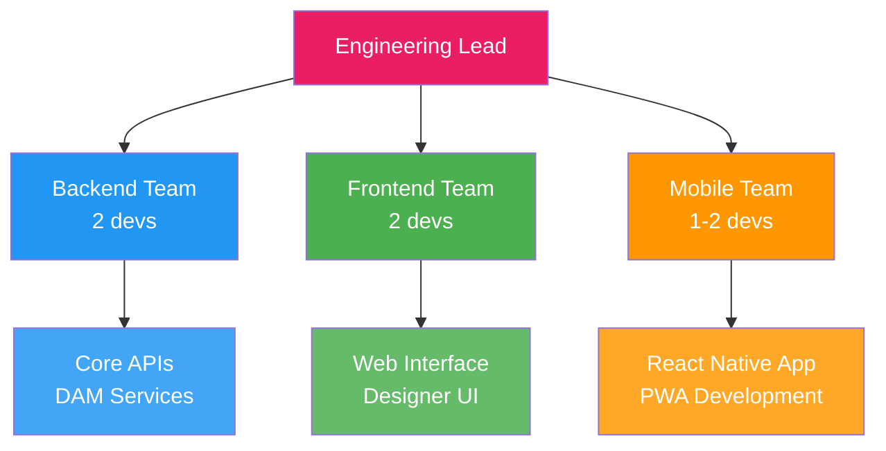
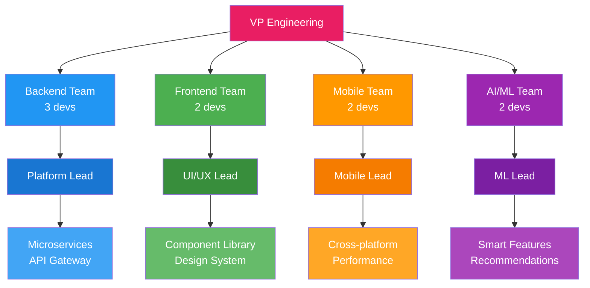
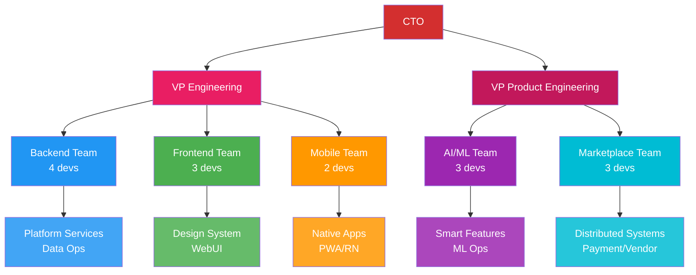
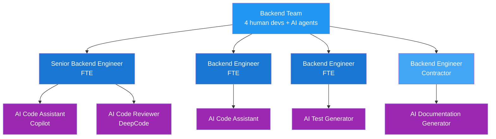

# Team Planning

## Executive Summary

This document outlines the resource requirements, organizational structure evolution, and team composition strategy for the PopSystem platform development across v2, v3, and v4 phases. It covers hiring timelines, contractor vs FTE decisions, remote work policies, skill development programs, and the integration of AI agent augmentation for hybrid team models.

---

## Resource Requirements by Phase

| Phase | Team Size | Key Hires | Skills Needed | Duration |
|-------|-----------|-----------|---------------|----------|
| **v2** | 4-6 devs | Mobile Developer, Frontend Specialist | React Native, PWA, TypeScript, Responsive Design | 6-9 months |
| **v3** | 6-10 devs | AI/ML Engineer, DevOps Engineer, Backend Specialist | Python, TensorFlow/PyTorch, Kubernetes, Docker, CI/CD | 9-12 months |
| **v4** | 10-15 devs | Marketplace Architect, Data Engineer, Security Specialist | Distributed Systems, Microservices, Apache Kafka, Security Compliance | 12-18 months |

---

## Organizational Structure Evolution

### Phase v2: Foundation Team (Months 1-9)

**Team Composition:**
- 1 Engineering Lead (FTE)
- 2 Backend Developers (1 FTE, 1 Contractor)
- 2 Frontend Developers (FTE)
- 1-2 Mobile Developers (Contractor)
- 1 Part-time DevOps (Contractor)

### Phase v3: Scaling Team (Months 10-21)

**Team Composition:**
- 1 VP Engineering (FTE)
- 1 Backend Platform Lead (FTE)
- 2 Backend Developers (FTE)
- 1 Frontend Lead (FTE)
- 2 Frontend Developers (1 FTE, 1 Contractor)
- 1 Mobile Lead (FTE)
- 1 Mobile Developer (Contractor)
- 1 AI/ML Lead (FTE)
- 1 ML Engineer (FTE)
- 1 DevOps Engineer (FTE)
- 1 QA Engineer (FTE)

### Phase v4: Full Platform Team (Months 22+)

**Team Composition:**
- 1 CTO (FTE)
- 1 VP Engineering (FTE)
- 1 VP Product Engineering (FTE)
- 4 Backend Engineers including Platform Lead (3 FTE, 1 Senior Contractor)
- 3 Frontend Engineers including UI/UX Lead (FTE)
- 2 Mobile Engineers (1 FTE, 1 Contractor)
- 3 AI/ML Engineers including ML Lead (2 FTE, 1 Specialist Contractor)
- 3 Marketplace Engineers including Architect (2 FTE, 1 Contractor)
- 2 DevOps Engineers (FTE)
- 2 QA Engineers (FTE)
- 1 Security Engineer (FTE)
- 1 Data Engineer (FTE)

---

## Hiring Timeline

### Quarter 1-2 (v2 Start)
- **Month 1:** Engineering Lead (FTE)
- **Month 1-2:** 2 Backend Developers (1 FTE, 1 Contractor)
- **Month 2:** 2 Frontend Developers (FTE)
- **Month 3:** Mobile Developer (Contractor)
- **Month 3:** Part-time DevOps (Contractor)

### Quarter 3-4 (v2 to v3 Transition)
- **Month 7:** VP Engineering (FTE) - promote or hire
- **Month 8:** AI/ML Lead (FTE)
- **Month 9:** DevOps Engineer (FTE)
- **Month 10:** Mobile Lead (FTE)
- **Month 10:** Backend Platform Lead (FTE)
- **Month 11:** ML Engineer (FTE)
- **Month 12:** QA Engineer (FTE)

### Quarter 5-6 (v3 Scaling)
- **Month 13:** Frontend Lead (FTE)
- **Month 14:** Additional Backend Developer (FTE)
- **Month 15:** Additional Mobile Developer (Contractor)
- **Month 16:** Additional Frontend Developer (Contractor)

### Quarter 7-8 (v3 to v4 Transition)
- **Month 19:** CTO or VP Product Engineering (FTE)
- **Month 20:** Marketplace Architect (FTE)
- **Month 21:** Security Engineer (FTE)
- **Month 22:** Data Engineer (FTE)
- **Month 22:** Additional Marketplace Engineers (1 FTE, 1 Contractor)

### Quarter 9+ (v4 Expansion)
- **Month 24:** Additional DevOps Engineer (FTE)
- **Month 24:** Additional QA Engineer (FTE)
- **Month 25:** Additional Backend Developer (Senior Contractor)
- **Month 26:** Additional AI/ML Engineer (Specialist Contractor)

---

## Contractor vs Full-Time Employee (FTE) Strategy

### FTE Positions
**Core Platform & Leadership:**
- Engineering leadership (Leads, VPs, CTO)
- Backend platform engineers
- AI/ML core team
- DevOps and infrastructure
- Security and compliance
- QA engineers

**Rationale:**
- Long-term platform knowledge retention
- Architectural consistency
- Security and compliance requirements
- Cultural and process ownership
- Reduced onboarding overhead

### Contractor Positions
**Specialized & Flexible Capacity:**
- Mobile developers (platform-specific expertise)
- Frontend specialists (short-term UI sprints)
- Senior backend consultants (specific technical challenges)
- ML specialists (model optimization, specific algorithms)
- Marketplace integration specialists

**Rationale:**
- Access to specialized skills on-demand
- Flexibility to scale up/down based on phase
- Cost efficiency for short-term projects
- Reduced benefits overhead
- Trial period before FTE conversion

### Conversion Strategy
- Contractors performing well in v2/v3 can convert to FTE
- Evaluation criteria: technical excellence, cultural fit, communication
- Typical conversion timeline: 6-12 months
- Priority conversion areas: Mobile Lead, Senior Backend, ML Engineer

---

## Remote vs Co-located Strategy

### Hybrid Model (Recommended)

**Co-located (Office/Hub):**
- Engineering leadership
- Core platform team (50% time)
- Weekly sprint planning and retrospectives
- Quarterly all-hands and architecture reviews
- Onboarding for first 2-4 weeks

**Remote-First:**
- Distributed team members across time zones
- Specialized contractors
- Async communication via Slack, Notion, GitHub
- Daily standups via video
- Quarterly in-person offsites

### Geographic Distribution

**Primary Hub (Recommended):**
- Main office in tech hub (e.g., Austin, Denver, Seattle)
- 40-60% of team co-located
- Core backend and AI/ML teams

**Remote Locations:**
- East Coast (Frontend, Mobile)
- West Coast (ML specialists, Marketplace)
- International contractors (Mobile, specialized skills)

**Benefits:**
- Access to broader talent pool
- Cost optimization (lower cost-of-living areas)
- 24-hour development cycle potential
- Improved work-life balance and retention

**Challenges:**
- Communication overhead
- Time zone coordination
- Cultural cohesion
- Equipment and security management

---

## Skill Development & Training Programs

### Technical Skills Development

**v2 Phase Focus:**
- React Native and PWA best practices
- TypeScript advanced patterns
- Responsive design and accessibility
- API design and RESTful principles
- Cloud infrastructure basics (AWS/GCP)

**v3 Phase Focus:**
- Microservices architecture
- Kubernetes and container orchestration
- Machine learning fundamentals
- Python for AI/ML applications
- CI/CD pipeline optimization
- Performance monitoring and optimization

**v4 Phase Focus:**
- Distributed systems design
- Event-driven architecture
- Apache Kafka and message queues
- Payment gateway integrations
- Security and compliance standards
- Scalability and high-availability patterns

### Training Budget Allocation

| Phase | Annual Training Budget | Per-Employee Budget | Focus Areas |
|-------|------------------------|---------------------|-------------|
| v2 | $20,000 | $3,000-5,000 | Frontend, Mobile, Cloud |
| v3 | $50,000 | $4,000-6,000 | AI/ML, DevOps, Architecture |
| v4 | $80,000 | $5,000-7,000 | Distributed Systems, Security |

### Training Programs

**Internal:**
- Weekly tech talks and brown bags
- Monthly architecture reviews
- Code review workshops
- Pair programming sessions
- Internal hackathons (quarterly)

**External:**
- Conference attendance (2-3 per year per team lead)
- Online courses (Pluralsight, Udemy, Coursera)
- Certifications (AWS, Kubernetes, ML)
- External workshops and bootcamps
- Open-source contribution time (20% time for interested engineers)

### Knowledge Sharing

- Comprehensive documentation in Notion/Confluence
- Architecture Decision Records (ADRs)
- Technical blog (internal and public)
- Lunch-and-learn sessions
- Mentorship program (senior to junior engineers)

---

## AI Agent Augmentation: Hybrid Teams

### Vision for AI-Augmented Development

As AI capabilities advance, PopSystem will integrate AI agents into the development workflow to enhance productivity, code quality, and innovation. This creates a hybrid team model where human engineers collaborate with AI assistants.

### AI Agent Use Cases

**Code Generation & Assistance:**
- AI-powered code completion (GitHub Copilot, Cursor)
- Automated boilerplate generation
- Unit test generation
- Documentation generation from code

**Code Review & Quality:**
- Automated code review for best practices
- Security vulnerability detection
- Performance optimization suggestions
- Accessibility compliance checks

**DevOps & Operations:**
- Infrastructure-as-code generation
- Log analysis and anomaly detection
- Automated incident response
- Capacity planning recommendations

**AI/ML Development:**
- AutoML for model selection
- Hyperparameter optimization
- Dataset augmentation and validation
- Model monitoring and drift detection

**Project Management:**
- Sprint planning assistance
- Dependency analysis
- Risk identification
- Effort estimation

### Hybrid Team Composition Example (v4)

### AI Agent Integration Phases

**v2 (Foundation):**
- Adopt GitHub Copilot or similar for all developers
- Experiment with AI-powered code review tools
- Use AI for documentation generation

**v3 (Expansion):**
- Integrate AI agents for automated testing
- Deploy AI-powered DevOps assistants
- Use AI for log analysis and monitoring
- Experiment with AutoML for ML feature development

**v4 (Maturity):**
- Full AI-augmented development workflow
- AI agents for project planning and estimation
- AI-powered security and compliance scanning
- Custom AI agents for PopSystem-specific tasks

### Benefits of AI Augmentation

**Productivity:**
- 20-30% faster code development
- Reduced time on boilerplate and repetitive tasks
- Faster bug detection and resolution

**Quality:**
- More consistent code style and patterns
- Improved test coverage
- Reduced security vulnerabilities

**Innovation:**
- More time for creative problem-solving
- Faster prototyping and experimentation
- Better architecture decisions with AI insights

**Cost Efficiency:**
- Smaller team can accomplish more
- Reduced technical debt
- Lower maintenance overhead

### Challenges & Mitigation

**Challenges:**
- Over-reliance on AI-generated code
- Code quality variability
- Security concerns with AI tools
- Learning curve for developers

**Mitigation:**
- Strong code review culture
- Human oversight for critical systems
- Secure AI tool selection and configuration
- Training on AI tool best practices
- Clear guidelines on AI usage

---

## Skill Matrix & Gap Analysis

### Current Team Skills (Assumed Starting Point)

| Skill Area | v2 Start | v3 Target | v4 Target |
|------------|----------|-----------|-----------|
| React/Frontend | Strong | Strong | Expert |
| React Native/Mobile | Basic | Strong | Expert |
| Backend/Node.js | Strong | Expert | Expert |
| Python | Basic | Strong | Expert |
| AI/ML | None | Strong | Expert |
| DevOps/Kubernetes | Basic | Strong | Expert |
| Distributed Systems | None | Basic | Strong |
| Security | Basic | Strong | Expert |

### Skill Development Strategy

**Hire for Gaps:**
- v2: Mobile expertise
- v3: AI/ML, DevOps
- v4: Distributed systems, Marketplace architecture

**Train for Growth:**
- Backend team learns Python and AI/ML fundamentals
- Frontend team learns advanced React patterns and performance
- Mobile team learns cross-platform optimization
- All teams learn distributed systems concepts by v4

**Consultants for Spikes:**
- Security audits (external)
- ML model optimization (specialist contractors)
- Marketplace architecture review (external consultant)

---

## Team Culture & Retention

### Culture Pillars

**Technical Excellence:**
- High code quality standards
- Continuous learning mindset
- Innovation and experimentation encouraged

**Collaboration:**
- Transparent communication
- Cross-functional teamwork
- Knowledge sharing

**Work-Life Balance:**
- Flexible work arrangements
- Reasonable on-call rotations
- Vacation and PTO encouraged

**Impact:**
- Clear connection between work and user value
- Ownership and autonomy
- Recognition and celebration of wins

### Retention Strategies

**Compensation:**
- Competitive salaries (market rate or above)
- Equity/stock options
- Performance bonuses (10-20% of base)
- Annual raises (3-5% base, more for high performers)

**Growth:**
- Clear career ladders (Junior → Mid → Senior → Staff → Principal)
- Technical and management tracks
- Promotion opportunities every 12-18 months
- Training and conference budgets

**Engagement:**
- Regular 1-on-1s with managers
- Quarterly engagement surveys
- Team building activities (remote and in-person)
- Hackathons and innovation days

**Benefits:**
- Health, dental, vision insurance
- 401k matching
- Parental leave
- Home office stipend (remote workers)
- Professional development budget

---

## Risk Mitigation

### Key Hiring Risks

| Risk | Impact | Probability | Mitigation |
|------|--------|-------------|------------|
| Difficulty hiring mobile devs | High | Medium | Use contractors, remote hiring, competitive comp |
| AI/ML talent shortage | High | High | Partner with universities, offer learning opportunities, contractors |
| Attrition of key engineers | High | Medium | Retention programs, competitive comp, career growth |
| Remote team coordination | Medium | Medium | Strong processes, tools, regular offsites |
| Skill gaps in distributed systems | High | Medium | Hire experienced architect, training, consultants |

### Contingency Plans

**Hiring Delays:**
- Contractors as stop-gap
- Extend timelines if needed
- Reprioritize features

**Attrition:**
- Knowledge documentation
- Cross-training
- Succession planning for key roles

**Skill Gaps:**
- External consultants
- Training programs
- Hire experienced leads

---

## Summary & Recommendations

**Key Recommendations:**

1. **Start Lean:** Begin v2 with 4-6 developers, mix of FTE and contractors
2. **Hire Strategically:** Focus on FTE for core platform, contractors for specialized/flexible needs
3. **Embrace Remote:** Hybrid model with primary hub and distributed team
4. **Invest in Training:** Allocate 3-7% of total comp for continuous learning
5. **AI Augmentation:** Integrate AI agents early (v2) to boost productivity
6. **Culture First:** Build strong engineering culture from day one to attract and retain top talent
7. **Plan for Scale:** Design org structure and processes for 10-15 person team by v4

**Success Metrics:**

- Time to hire (< 60 days for critical roles)
- Attrition rate (< 10% annually)
- Team satisfaction score (> 8/10)
- AI productivity gain (20-30% by v4)
- Skill development progress (measured quarterly)

By following this team planning strategy, PopSystem can build a world-class engineering organization capable of delivering a sophisticated, scalable platform across all development phases.
