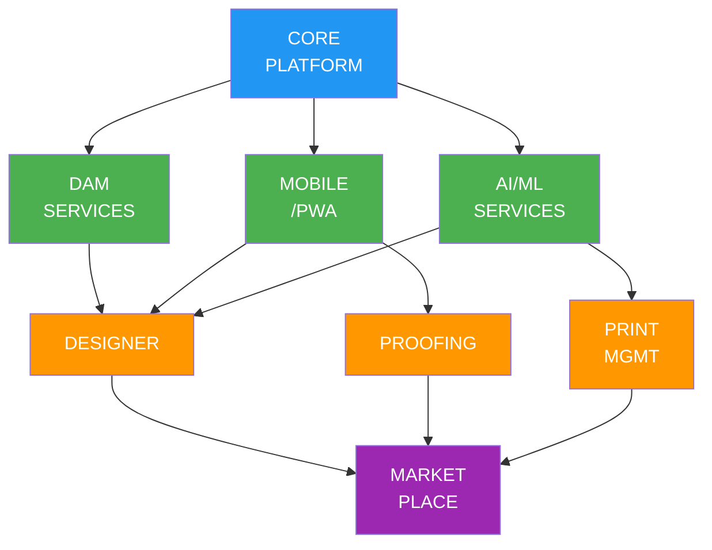
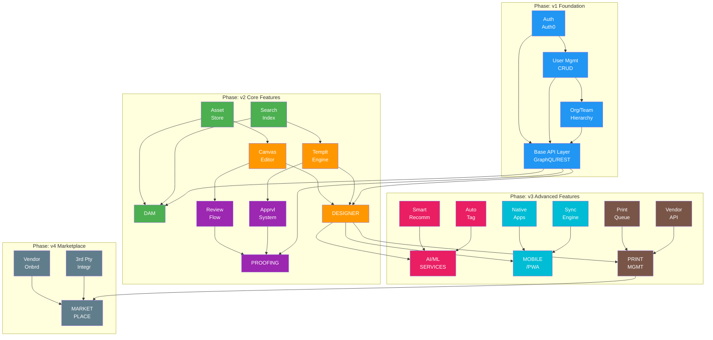

# Technical Dependencies

## Executive Summary

This document outlines the cross-pillar technical dependencies, sequencing requirements, and integration strategies for the PopSystem platform. It provides dependency graphs, critical path analysis, parallel development opportunities, API contract requirements, shared component strategy, and integration testing approach.

---

## System Architecture Overview

PopSystem is composed of multiple interconnected pillars that must be developed in a coordinated sequence to minimize blocking dependencies while maximizing parallel development opportunities.

### Core Pillars

1. **Core Platform** - Authentication, user management, base infrastructure
2. **Digital Asset Management (DAM)** - Asset storage, organization, metadata
3. **Designer** - Creative tools, templates, design system
4. **Proofing** - Review workflows, approval processes
5. **Print Management** - Print-on-demand, vendor integration
6. **Marketplace** - Third-party integrations, vendor ecosystem
7. **Mobile/PWA** - Cross-platform mobile experience
8. **AI/ML Services** - Smart features, recommendations, automation

---

## Dependency Graph

### High-Level Pillar Dependencies



### Detailed Dependency Flow



---

## Critical Path Analysis

### Phase v2 Critical Path

```
START → Core Auth (2w) → User Mgmt (3w) → Org Hierarchy (2w) →
        DAM Storage (4w) → DAM Search (3w) →
        Designer Canvas (6w) → Designer Templates (4w) →
        Proofing Workflow (4w) → Integration Testing (2w) → END

Total Critical Path Duration: 30 weeks
```

**Critical Path Components:**

1. **Core Authentication** (2 weeks) - BLOCKING
   - No other work can proceed without auth
   - Must be stable and tested

2. **User Management** (3 weeks) - BLOCKING
   - Required for all user-facing features
   - Dependency for org hierarchy

3. **Organization Hierarchy** (2 weeks) - BLOCKING
   - Required for DAM permissions
   - Required for proofing workflows

4. **DAM Storage** (4 weeks) - BLOCKING
   - Required for Designer asset integration
   - Required for template system

5. **DAM Search** (3 weeks) - BLOCKING
   - Required for Designer asset picker
   - Critical for user experience

6. **Designer Canvas** (6 weeks) - BLOCKING
   - Core creative tool
   - Longest single component on critical path

7. **Designer Templates** (4 weeks) - BLOCKING
   - Required for proofing workflow testing
   - Core value proposition

8. **Proofing Workflow** (4 weeks) - BLOCKING
   - Final major feature for v2 release
   - Integration point for all previous work

**Non-Critical Path (Parallel Opportunities):**
- Mobile/PWA development (can start after Core Auth)
- AI/ML research and prototyping
- Print management design and vendor research
- UI/UX design system development

### Phase v3 Critical Path

```
v2 END → AI Asset Tagging (4w) → AI Recommendations (3w) →
         Mobile Sync Engine (5w) → Offline Support (3w) →
         Print Queue System (4w) → Vendor API Integration (5w) →
         Performance Optimization (3w) → END

Total Critical Path Duration: 27 weeks
```

### Phase v4 Critical Path

```
v3 END → Marketplace Architecture (4w) → Vendor Onboarding (6w) →
         Third-party Integration Framework (5w) → Payment Processing (4w) →
         Distributed System Migration (6w) → Load Testing (2w) → END

Total Critical Path Duration: 27 weeks
```

---

## Parallel Development Opportunities

### Phase v2 Parallel Streams

```
Month 1-3:
┌─────────────────┐  ┌─────────────────┐  ┌─────────────────┐
│   CRITICAL      │  │   PARALLEL      │  │   PARALLEL      │
│   PATH          │  │   STREAM 1      │  │   STREAM 2      │
├─────────────────┤  ├─────────────────┤  ├─────────────────┤
│ Core Auth       │  │ Design System   │  │ Mobile POC      │
│ User Mgmt       │  │ Component Lib   │  │ React Native    │
│ Org Hierarchy   │  │ UI/UX Patterns  │  │ Setup           │
└─────────────────┘  └─────────────────┘  └─────────────────┘

Month 4-6:
┌─────────────────┐  ┌─────────────────┐  ┌─────────────────┐
│   CRITICAL      │  │   PARALLEL      │  │   PARALLEL      │
│   PATH          │  │   STREAM 1      │  │   STREAM 2      │
├─────────────────┤  ├─────────────────┤  ├─────────────────┤
│ DAM Storage     │  │ Mobile UI       │  │ AI/ML Research  │
│ DAM Search      │  │ Asset Browser   │  │ Model Selection │
│ Designer Canvas │  │ Sync Planning   │  │ Dataset Prep    │
└─────────────────┘  └─────────────────┘  └─────────────────┘

Month 7-9:
┌─────────────────┐  ┌─────────────────┐  ┌─────────────────┐
│   CRITICAL      │  │   PARALLEL      │  │   PARALLEL      │
│   PATH          │  │   STREAM 1      │  │   STREAM 2      │
├─────────────────┤  ├─────────────────┤  ├─────────────────┤
│ Designer Templt │  │ Mobile Designer │  │ Print Research  │
│ Proofing Flow   │  │ View-only Mode  │  │ Vendor Analysis │
│ Integration     │  │ Basic Proofing  │  │ API Design      │
└─────────────────┘  └─────────────────┘  └─────────────────┘
```

**Benefits of Parallel Development:**
- 3x effective team productivity
- Reduced time to market by ~40%
- Risk mitigation through independent streams
- Flexibility to adjust priorities

**Coordination Requirements:**
- Weekly cross-stream sync meetings
- Shared API contract definitions
- Integrated CI/CD pipeline
- Regular integration testing

---

## API Contract Requirements

### Contract-First Development Approach

All teams must define API contracts BEFORE implementation to enable parallel development.

### Core Platform APIs

**Authentication API**
```
POST   /api/v1/auth/login
POST   /api/v1/auth/logout
POST   /api/v1/auth/refresh
GET    /api/v1/auth/me

Response Contract:
{
  "user": {
    "id": "uuid",
    "email": "string",
    "role": "enum",
    "orgId": "uuid"
  },
  "token": "string",
  "expiresAt": "timestamp"
}
```

**User Management API**
```
GET    /api/v1/users
GET    /api/v1/users/:id
POST   /api/v1/users
PUT    /api/v1/users/:id
DELETE /api/v1/users/:id

Response Contract:
{
  "id": "uuid",
  "email": "string",
  "firstName": "string",
  "lastName": "string",
  "role": "enum",
  "orgId": "uuid",
  "permissions": ["string"],
  "createdAt": "timestamp",
  "updatedAt": "timestamp"
}
```

**Organization API**
```
GET    /api/v1/orgs
GET    /api/v1/orgs/:id
POST   /api/v1/orgs
PUT    /api/v1/orgs/:id
GET    /api/v1/orgs/:id/teams
GET    /api/v1/orgs/:id/users
```

### DAM APIs

**Asset Management API**
```
GET    /api/v1/assets
GET    /api/v1/assets/:id
POST   /api/v1/assets (multipart/form-data)
PUT    /api/v1/assets/:id
DELETE /api/v1/assets/:id
GET    /api/v1/assets/:id/versions
POST   /api/v1/assets/:id/versions

Response Contract:
{
  "id": "uuid",
  "fileName": "string",
  "fileType": "string",
  "fileSize": "number",
  "url": "string",
  "thumbnailUrl": "string",
  "metadata": {
    "width": "number",
    "height": "number",
    "format": "string",
    "colorSpace": "string"
  },
  "tags": ["string"],
  "folderId": "uuid",
  "uploadedBy": "uuid",
  "createdAt": "timestamp",
  "updatedAt": "timestamp"
}
```

**Search API**
```
GET    /api/v1/assets/search?q=string&filters=json&sort=string&page=number

Response Contract:
{
  "results": [Asset],
  "total": "number",
  "page": "number",
  "pageSize": "number",
  "facets": {
    "fileType": {"image": 100, "video": 20},
    "tags": {"logo": 50, "banner": 30}
  }
}
```

### Designer APIs

**Template API**
```
GET    /api/v1/templates
GET    /api/v1/templates/:id
POST   /api/v1/templates
PUT    /api/v1/templates/:id
DELETE /api/v1/templates/:id

Response Contract:
{
  "id": "uuid",
  "name": "string",
  "category": "string",
  "canvas": {
    "width": "number",
    "height": "number",
    "unit": "string",
    "layers": [Layer]
  },
  "variables": [Variable],
  "thumbnailUrl": "string",
  "createdBy": "uuid",
  "createdAt": "timestamp"
}
```

**Design API**
```
GET    /api/v1/designs
GET    /api/v1/designs/:id
POST   /api/v1/designs
PUT    /api/v1/designs/:id
DELETE /api/v1/designs/:id
POST   /api/v1/designs/:id/export
```

### Proofing APIs

**Proof Workflow API**
```
GET    /api/v1/proofs
GET    /api/v1/proofs/:id
POST   /api/v1/proofs
PUT    /api/v1/proofs/:id
POST   /api/v1/proofs/:id/approve
POST   /api/v1/proofs/:id/reject
POST   /api/v1/proofs/:id/comments

Response Contract:
{
  "id": "uuid",
  "designId": "uuid",
  "status": "enum(pending|approved|rejected|revision)",
  "assignedTo": ["uuid"],
  "comments": [Comment],
  "version": "number",
  "createdBy": "uuid",
  "createdAt": "timestamp",
  "updatedAt": "timestamp"
}
```

### AI/ML APIs

**Smart Tagging API**
```
POST   /api/v1/ml/auto-tag
Body: { "assetId": "uuid" }

Response Contract:
{
  "assetId": "uuid",
  "tags": [
    {"tag": "string", "confidence": "float"}
  ],
  "processedAt": "timestamp"
}
```

**Recommendation API**
```
GET    /api/v1/ml/recommend/assets?userId=uuid&context=string

Response Contract:
{
  "recommendations": [
    {
      "assetId": "uuid",
      "score": "float",
      "reason": "string"
    }
  ]
}
```

### Print Management APIs

**Print Job API**
```
POST   /api/v1/print/jobs
GET    /api/v1/print/jobs/:id
GET    /api/v1/print/jobs/:id/status

Response Contract:
{
  "id": "uuid",
  "designId": "uuid",
  "vendorId": "uuid",
  "status": "enum(queued|processing|sent|completed|failed)",
  "quantity": "number",
  "specifications": {
    "material": "string",
    "size": "string",
    "finish": "string"
  },
  "estimatedCost": "number",
  "trackingNumber": "string",
  "createdAt": "timestamp"
}
```

### API Contract Versioning

**Version Strategy:**
- URL-based versioning: `/api/v1/`, `/api/v2/`
- Maintain backward compatibility for at least 2 versions
- Deprecation notices 6 months before sunset
- Clear migration guides for breaking changes

**Contract Testing:**
- Pact for consumer-driven contracts
- OpenAPI/Swagger spec for documentation
- Automated contract validation in CI/CD
- Mock servers for parallel development

---

## Shared Component Library

### Component Library Architecture

```mermaid
graph TD
    A[@popsystem/ui-components]
    B[atoms/]
    C[molecules/]
    D[organisms/]
    E[templates/]
    F[theme/]

    B1[Button]
    B2[Input]
    B3[Icon]
    B4[Badge]
    B5[Avatar]

    C1[Card]
    C2[Modal]
    C3[Dropdown]
    C4[SearchBar]
    C5[FileUpload]

    D1[Header]
    D2[Sidebar]
    D3[AssetGrid]
    D4[ProofingPanel]
    D5[DesignerToolbar]

    E1[DashboardLayout]
    E2[EditorLayout]
    E3[AuthLayout]

    F1[colors.ts]
    F2[typography.ts]
    F3[spacing.ts]
    F4[breakpoints.ts]

    A --> B
    A --> C
    A --> D
    A --> E
    A --> F

    B --> B1
    B --> B2
    B --> B3
    B --> B4
    B --> B5

    C --> C1
    C --> C2
    C --> C3
    C --> C4
    C --> C5

    D --> D1
    D --> D2
    D --> D3
    D --> D4
    D --> D5

    E --> E1
    E --> E2
    E --> E3

    F --> F1
    F --> F2
    F --> F3
    F --> F4

    style A fill:#2196f3,color:#fff
    style B fill:#4caf50,color:#fff
    style C fill:#ff9800,color:#fff
    style D fill:#9c27b0,color:#fff
    style E fill:#e91e63,color:#fff
    style F fill:#00bcd4,color:#fff
    style B1 fill:#4caf50,color:#fff
    style B2 fill:#4caf50,color:#fff
    style B3 fill:#4caf50,color:#fff
    style B4 fill:#4caf50,color:#fff
    style B5 fill:#4caf50,color:#fff
    style C1 fill:#ff9800,color:#fff
    style C2 fill:#ff9800,color:#fff
    style C3 fill:#ff9800,color:#fff
    style C4 fill:#ff9800,color:#fff
    style C5 fill:#ff9800,color:#fff
    style D1 fill:#9c27b0,color:#fff
    style D2 fill:#9c27b0,color:#fff
    style D3 fill:#9c27b0,color:#fff
    style D4 fill:#9c27b0,color:#fff
    style D5 fill:#9c27b0,color:#fff
    style E1 fill:#e91e63,color:#fff
    style E2 fill:#e91e63,color:#fff
    style E3 fill:#e91e63,color:#fff
    style F1 fill:#00bcd4,color:#fff
    style F2 fill:#00bcd4,color:#fff
    style F3 fill:#00bcd4,color:#fff
    style F4 fill:#00bcd4,color:#fff
```

### Component Development Workflow

1. **Design System First:** UI/UX team designs components in Figma
2. **Component Spec:** Document props, states, accessibility requirements
3. **Implementation:** Build component in Storybook
4. **Testing:** Unit tests, visual regression tests, accessibility tests
5. **Documentation:** Usage examples, best practices
6. **Publish:** Semantic versioning, changelog
7. **Consume:** Import in applications

### Shared Component Benefits

- **Consistency:** Unified UI/UX across all pillars
- **Velocity:** Faster feature development
- **Quality:** Centralized testing and accessibility
- **Maintenance:** Single source of truth for updates

### Component Library Dependencies

```mermaid
graph LR
    A[Designer]
    B[Proofing]
    C[Mobile]
    D[Marketplace]
    E[@popsystem/ui-components]
    F[Design System<br>Figma]

    A --> E
    B --> E
    C --> E
    D --> E
    F --> E

    style A fill:#ff9800,color:#fff
    style B fill:#9c27b0,color:#fff
    style C fill:#00bcd4,color:#fff
    style D fill:#607d8b,color:#fff
    style E fill:#2196f3,color:#fff
    style F fill:#4caf50,color:#fff
```

---

## Integration Testing Strategy

### Integration Testing Levels

**Level 1: API Integration Tests**
- Test API contracts between services
- Validate request/response formats
- Test error handling and edge cases
- Run in CI/CD for every commit

**Level 2: Cross-Pillar Integration Tests**
- Test workflows across multiple pillars
- Example: Upload asset (DAM) → Use in design (Designer) → Send for proof (Proofing)
- Run nightly or before releases

**Level 3: End-to-End Tests**
- Full user journey testing
- Browser automation (Playwright, Cypress)
- Mobile app testing (Detox)
- Run before releases

**Level 4: Performance & Load Tests**
- Stress test APIs under load
- Test database performance
- Validate caching strategies
- Run weekly or before major releases

### Integration Test Scenarios

**Scenario 1: Asset Upload to Design**
```
1. User logs in (Core Platform)
2. User uploads image (DAM)
3. DAM processes and indexes image
4. User creates new design (Designer)
5. User searches for uploaded image (DAM Search)
6. User adds image to design canvas (Designer)
7. User saves design

Assert:
- Asset appears in DAM library
- Asset searchable by filename/tags
- Asset loads in Designer
- Design contains asset reference
```

**Scenario 2: Design to Proof Workflow**
```
1. User creates design from template (Designer)
2. User customizes design with assets (Designer + DAM)
3. User submits design for approval (Proofing)
4. Approver receives notification (Core Platform)
5. Approver reviews design (Proofing)
6. Approver adds comments (Proofing)
7. Approver approves design (Proofing)
8. Original user receives approval notification

Assert:
- Proof workflow created
- Notifications sent correctly
- Comments persisted
- Design status updated to approved
```

**Scenario 3: Design to Print**
```
1. User retrieves approved design (Designer + Proofing)
2. User sends design to print (Print Management)
3. System validates design specs (Print Management)
4. System generates print-ready file (Print Management)
5. System sends to vendor API (Print Management)
6. System receives vendor confirmation

Assert:
- Print job created
- Vendor API called successfully
- Job status tracked
- User notified of progress
```

### Integration Test Infrastructure

```
┌─────────────────────────────────────────────────────┐
│              Integration Test Environment           │
├─────────────────────────────────────────────────────┤
│                                                     │
│  ┌───────────┐  ┌───────────┐  ┌───────────┐      │
│  │  Test     │  │  Test     │  │  Test     │      │
│  │  Database │  │  S3       │  │  Redis    │      │
│  └───────────┘  └───────────┘  └───────────┘      │
│                                                     │
│  ┌───────────┐  ┌───────────┐  ┌───────────┐      │
│  │  Core API │  │  DAM API  │  │ Designer  │      │
│  │  (Docker) │  │  (Docker) │  │   API     │      │
│  └───────────┘  └───────────┘  └───────────┘      │
│                                                     │
│  ┌───────────────────────────────────────────┐    │
│  │       Integration Test Suite              │    │
│  │       (Playwright, Jest, Pact)            │    │
│  └───────────────────────────────────────────┘    │
│                                                     │
└─────────────────────────────────────────────────────┘
```

**Infrastructure Requirements:**
- Docker Compose for local testing
- Kubernetes for CI/CD testing
- Test data seeding scripts
- Database migrations for test environment
- Mock external services (vendor APIs, payment gateways)

### Integration Test Metrics

| Metric | Target | Monitoring |
|--------|--------|------------|
| API Integration Test Coverage | > 80% | Code coverage tools |
| Cross-Pillar Scenario Coverage | 100% critical paths | Manual tracking |
| E2E Test Success Rate | > 95% | CI/CD dashboard |
| Integration Test Execution Time | < 30 min | CI/CD metrics |
| Flaky Test Rate | < 5% | Test stability tracking |

---

## Dependency Management & Versioning

### Service Dependency Matrix

| Service | Depends On | Version Constraints | Breaking Change Impact |
|---------|------------|---------------------|------------------------|
| DAM | Core Platform | v1.x | High - affects all downstream |
| Designer | Core Platform, DAM | v1.x, v1.x | High - core feature |
| Proofing | Core Platform, Designer | v1.x, v1.x | Medium - workflow feature |
| Mobile | All APIs | v1.x | Low - client-side only |
| AI/ML | DAM, Designer | v1.x, v1.x | Low - optional enhancement |
| Print | Designer, Proofing | v1.x, v1.x | Low - optional feature |
| Marketplace | All | v1.x+ | Low - extension point |

### Versioning Strategy

**Semantic Versioning:**
- MAJOR.MINOR.PATCH (e.g., 1.2.3)
- MAJOR: Breaking API changes
- MINOR: New features, backward compatible
- PATCH: Bug fixes, backward compatible

**Service Compatibility:**
- Core Platform: All services must support current and previous MAJOR version
- Feature Services: Must support current MINOR version of dependencies
- Deprecation: 6-month notice for MAJOR version changes

---

## Risk Mitigation

### Dependency Risks

| Risk | Impact | Mitigation |
|------|--------|------------|
| Core Platform delays block all work | Critical | Prioritize Core Platform, add buffer time, parallel research work |
| API contract changes break integrations | High | Contract testing, versioning, change management process |
| Team coordination overhead | Medium | Clear API contracts, regular sync meetings, shared documentation |
| Integration test failures late in cycle | High | Continuous integration testing, early API integration |
| Vendor API changes break Print/Marketplace | Medium | Adapter pattern, mock services, vendor communication |

---

## Development Sequencing Recommendations

### Phase v2 (Months 1-9)

**Month 1-3: Foundation**
- CRITICAL PATH: Core Platform (Auth, User Mgmt, Org Hierarchy)
- PARALLEL: Design System, Mobile POC, AI/ML research

**Month 4-6: Core Features**
- CRITICAL PATH: DAM (Storage, Search), Designer (Canvas)
- PARALLEL: Mobile Asset Browser, Print vendor research

**Month 7-9: Advanced Features**
- CRITICAL PATH: Designer (Templates), Proofing (Workflow)
- PARALLEL: Mobile Designer view, Print API design

### Phase v3 (Months 10-18)

**Month 10-12: Intelligence**
- CRITICAL PATH: AI Auto-tagging, Recommendations
- PARALLEL: Mobile sync engine, Print queue

**Month 13-15: Mobile & Print**
- CRITICAL PATH: Mobile offline support, Print vendor integration
- PARALLEL: Performance optimization, AI model refinement

**Month 16-18: Polish**
- CRITICAL PATH: Performance optimization, Load testing
- PARALLEL: Marketplace architecture planning

### Phase v4 (Months 19-27)

**Month 19-21: Marketplace Foundation**
- CRITICAL PATH: Marketplace architecture, Vendor onboarding
- PARALLEL: Distributed system migration planning

**Month 22-24: Integration & Scale**
- CRITICAL PATH: Third-party integrations, Payment processing
- PARALLEL: Security hardening, Compliance

**Month 25-27: Launch**
- CRITICAL PATH: Distributed system migration, Load testing
- PARALLEL: Marketing site, Launch planning

---

## Summary & Key Takeaways

**Critical Success Factors:**

1. **Core Platform First:** Nothing proceeds without stable authentication and user management
2. **API Contracts Early:** Define and validate contracts before implementation
3. **Parallel Streams:** Maximize parallel development with clear boundaries
4. **Continuous Integration:** Test integrations daily, not just before releases
5. **Shared Components:** Invest in component library to accelerate all teams
6. **Version Management:** Clear versioning strategy prevents integration chaos

**Dependency Coordination:**

- Weekly cross-team sync meetings
- Shared API contract repository (OpenAPI specs)
- Integrated CI/CD with cross-service testing
- Clear escalation path for blocking dependencies

**Metrics for Success:**

- Zero critical path blockers > 3 days
- API contract compliance > 95%
- Integration test success rate > 95%
- Shared component usage > 80%
- Cross-team coordination overhead < 20% of dev time

By following this technical dependency strategy, PopSystem can orchestrate complex cross-pillar development while minimizing blocking dependencies and maximizing team velocity.
