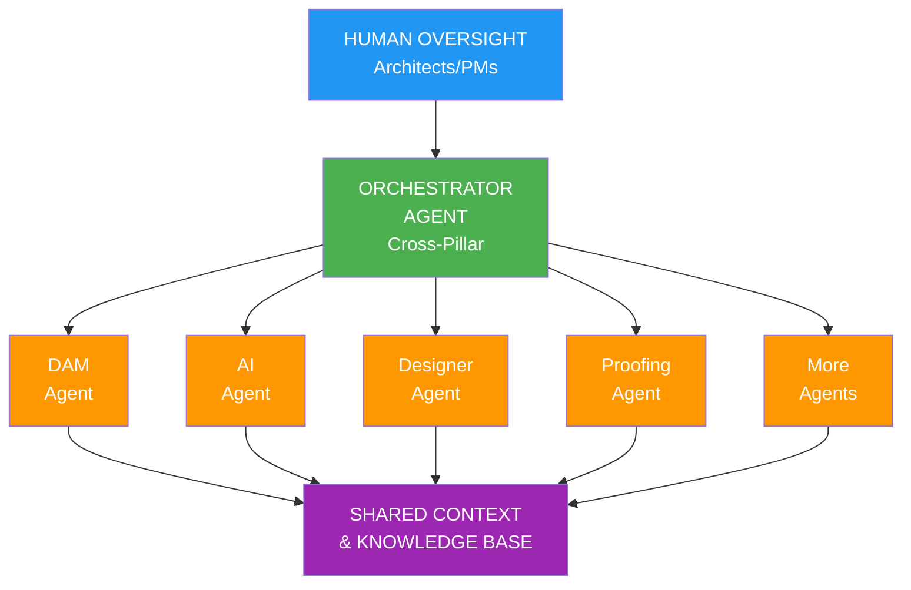
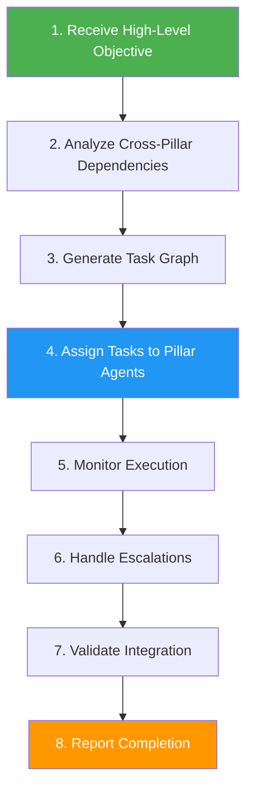
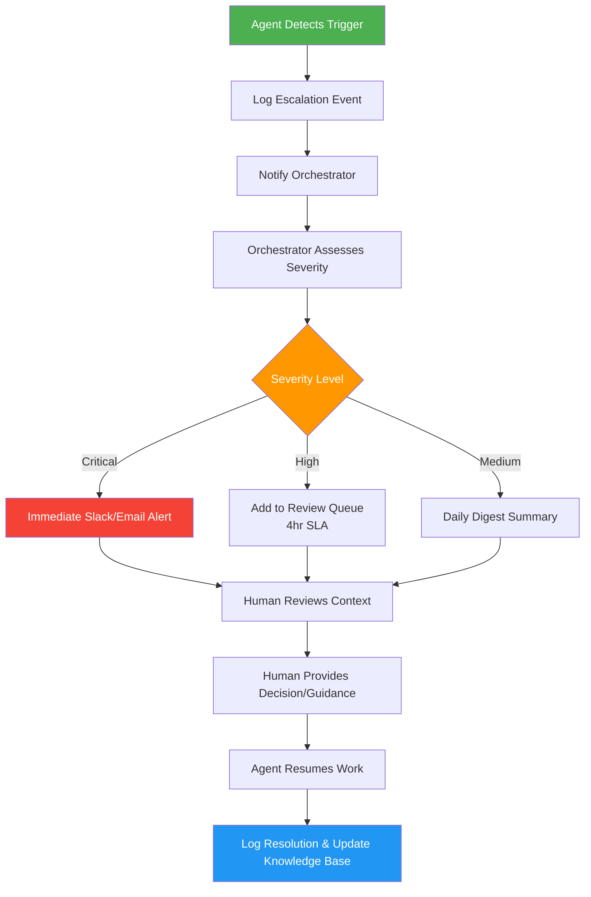
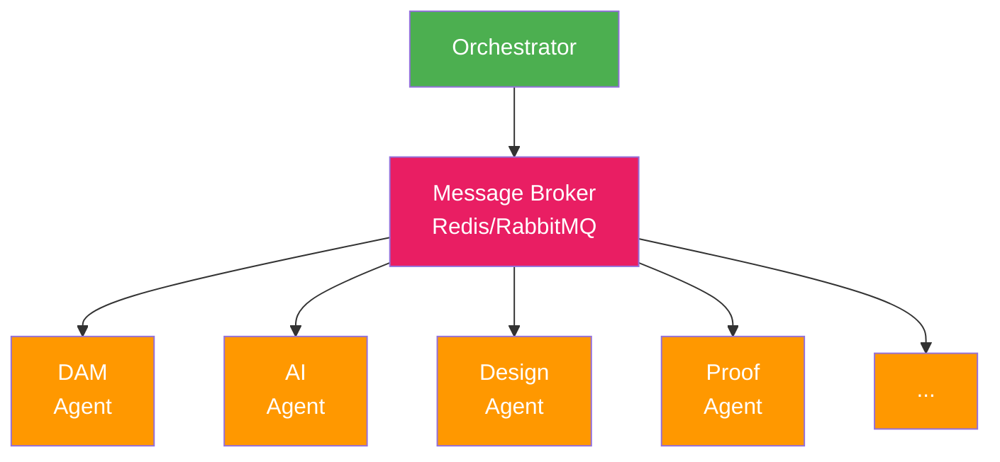

# PopSystem Agent Architecture

## Executive Summary

The PopSystem AI Agent Harness framework enables autonomous development teams organized by platform pillars. Each specialized agent operates within controlled boundaries while an orchestrator coordinates cross-functional work, with human oversight providing strategic guidance and quality assurance.

## Architectural Overview



## Agent Harness Concept

### Definition
An **Agent Harness** is a controlled execution environment that provides:
- **Boundary enforcement**: Scope limitations, resource quotas, permission controls
- **Tool provisioning**: Access to MCP servers, APIs, development tools
- **Context management**: Persistent memory, knowledge retrieval, decision logging
- **Quality gates**: Automated testing, code review, deployment checks
- **Escalation mechanisms**: Human-in-the-loop triggers for complex decisions

### Core Principles

1. **Autonomy with Guardrails**
   - Agents operate independently within defined domains
   - Hard limits prevent scope creep and resource overuse
   - Automatic rollback on quality gate failures

2. **Specialized Expertise**
   - Each agent focuses on one pillar's technology stack
   - Deep domain knowledge via RAG-enhanced documentation
   - Continuous learning from codebase patterns

3. **Collaborative Coordination**
   - Agents communicate via structured protocols
   - Orchestrator resolves dependencies and conflicts
   - Shared context prevents duplication

4. **Human Partnership**
   - Agents handle repetitive/well-defined tasks
   - Humans provide strategic direction and complex judgment
   - Escalation triggers ensure critical review

## Orchestration Layer

### Responsibilities

The Orchestrator Agent serves as the central coordination point:

- **Task Decomposition**: Breaks epics into pillar-specific work items
- **Dependency Management**: Sequences work based on technical dependencies
- **Resource Allocation**: Assigns tasks to appropriate agents based on capacity
- **Conflict Resolution**: Mediates when agents have competing requirements
- **Progress Aggregation**: Rolls up status across all pillars
- **Risk Assessment**: Identifies bottlenecks and escalates concerns

### Orchestration Workflow



### Communication Protocol

Agents communicate via structured JSON messages:

```json
{
  "message_id": "uuid",
  "timestamp": "ISO-8601",
  "from_agent": "DAM",
  "to_agent": "Orchestrator",
  "type": "status_update | request | escalation",
  "priority": "low | medium | high | critical",
  "content": {
    "task_id": "task-123",
    "status": "in_progress | blocked | completed",
    "progress": 0.65,
    "blockers": [],
    "artifacts": ["file_paths", "urls"],
    "next_actions": []
  }
}
```

## Human Escalation Triggers

### Automatic Escalation Conditions

Agents must escalate to humans when:

1. **Technical Complexity**
   - Architecture decision impacts multiple pillars
   - Security vulnerability discovered
   - Performance issue requires infrastructure changes
   - New technology adoption needed

2. **Business Impact**
   - Feature request conflicts with product vision
   - Cost implications exceed threshold ($1000+/month)
   - User-facing changes alter core workflows
   - Competitive intelligence requires strategic response

3. **Quality Concerns**
   - Test coverage below threshold (80%)
   - Critical bug in production code
   - Integration test failures across pillars
   - Technical debt exceeds acceptable levels

4. **Resource Constraints**
   - Task blocked for >4 hours
   - API rate limits approached
   - Context window exhausted
   - External dependency unavailable

### Escalation Workflow



## Quality Gates

### Pre-Commit Gates

Every code change must pass:

1. **Static Analysis**
   - Linting (ESLint, Pylint, etc.)
   - Type checking (TypeScript, mypy)
   - Code formatting (Prettier, Black)
   - Complexity metrics (cyclomatic complexity < 10)

2. **Security Scanning**
   - Dependency vulnerability checks (npm audit, Snyk)
   - Secret detection (no API keys in code)
   - OWASP compliance for user inputs

3. **Unit Tests**
   - All tests pass
   - Coverage ≥ 80% for new code
   - No flaky tests

### Pre-Deployment Gates

Before any deployment:

1. **Integration Tests**
   - API contract tests pass
   - Cross-pillar integration verified
   - Database migration dry-run successful

2. **Performance Tests**
   - Response times within SLA
   - Memory usage within bounds
   - No N+1 query regressions

3. **Human Review**
   - Architect approval for architectural changes
   - PM approval for feature scope
   - Security review for auth/data handling

### Continuous Monitoring

Post-deployment:

- Error rate monitoring (< 0.1%)
- Performance metrics (p95 latency)
- User feedback sentiment
- Rollback triggers if thresholds exceeded

## Agent Communication Protocols

### Inter-Agent Communication Patterns

1. **Request-Response**
   - Agent A needs information from Agent B
   - Synchronous blocking for critical path
   - Example: Designer Agent requests asset metadata from DAM Agent

2. **Event Broadcasting**
   - Agent publishes event to shared bus
   - Interested agents subscribe and react
   - Example: DAM Agent broadcasts "new_asset_uploaded" event

3. **Shared State Updates**
   - Agents read/write to shared knowledge base
   - Optimistic locking for conflict resolution
   - Example: All agents update technical debt register

### API Contracts

Agents expose standardized endpoints:

- `GET /status` - Current task status and health
- `POST /tasks` - Accept new task assignment
- `GET /capabilities` - List available tools and skills
- `POST /escalate` - Trigger human escalation
- `GET /artifacts` - Retrieve generated code/docs

### Message Queue Architecture



Benefits:
- Async communication prevents blocking
- Retry logic for transient failures
- Message persistence for audit trail
- Load balancing across agent instances

## Context Management

### Context Window Strategy

Each agent maintains:

1. **Persistent Context** (Vector DB)
   - Codebase architecture knowledge
   - Historical decisions and rationale
   - Domain-specific best practices
   - Dependency relationships

2. **Session Context** (In-Memory)
   - Current task objectives
   - Recent file changes
   - Active conversation history
   - Temporary working knowledge

3. **Summarization Layers**
   - Long-term memory (compressed summaries)
   - Medium-term memory (recent sprint work)
   - Short-term memory (current session)

### Context Refresh Triggers

- New task assignment: Load relevant codebase context
- File modification: Update impacted components graph
- Escalation resolution: Incorporate human guidance
- Daily: Compress old sessions, prune stale context

### Knowledge Base Structure

```mermaid
graph TD
    A[knowledge_base/]
    B[architecture/]
    C[decisions/]
    D[technical_debt/]
    E[runbooks/]
    F[patterns/]

    B1[system_overview.md]
    B2[pillar_boundaries.md]
    B3[integration_patterns.md]

    C1[adr-001-database-choice.md]
    C2[adr-002-auth-strategy.md]
    C3[...]

    D1[dam_debt_register.md]
    D2[ai_debt_register.md]
    D3[...]

    E1[deployment_procedures.md]
    E2[incident_response.md]
    E3[...]

    F1[api_design_patterns.md]
    F2[error_handling.md]
    F3[testing_strategies.md]

    A --> B
    A --> C
    A --> D
    A --> E
    A --> F

    B --> B1
    B --> B2
    B --> B3

    C --> C1
    C --> C2
    C --> C3

    D --> D1
    D --> D2
    D --> D3

    E --> E1
    E --> E2
    E --> E3

    F --> F1
    F --> F2
    F --> F3

    style A fill:#2196f3,color:#fff
    style B fill:#4caf50,color:#fff
    style C fill:#4caf50,color:#fff
    style D fill:#4caf50,color:#fff
    style E fill:#4caf50,color:#fff
    style F fill:#4caf50,color:#fff
    style B1 fill:#9c27b0,color:#fff
    style B2 fill:#9c27b0,color:#fff
    style B3 fill:#9c27b0,color:#fff
    style C1 fill:#9c27b0,color:#fff
    style C2 fill:#9c27b0,color:#fff
    style C3 fill:#9c27b0,color:#fff
    style D1 fill:#9c27b0,color:#fff
    style D2 fill:#9c27b0,color:#fff
    style D3 fill:#9c27b0,color:#fff
    style E1 fill:#9c27b0,color:#fff
    style E2 fill:#9c27b0,color:#fff
    style E3 fill:#9c27b0,color:#fff
    style F1 fill:#9c27b0,color:#fff
    style F2 fill:#9c27b0,color:#fff
    style F3 fill:#9c27b0,color:#fff
```



## Tool Access Patterns

### Tool Categories

1. **Development Tools**
   - Code editors/IDEs
   - Version control (Git)
   - Package managers (npm, pip, etc.)
   - Build systems (Webpack, Vite, etc.)

2. **Testing Tools**
   - Unit test frameworks (Jest, pytest)
   - Integration test tools (Playwright, Cypress)
   - API testing (Postman, Insomnia)
   - Load testing (k6, Locust)

3. **Research Tools**
   - Web search APIs
   - Documentation scrapers
   - Competitive analysis tools
   - Stack Overflow search

4. **Domain-Specific Tools (via MCP)**
   - Cloud provider APIs (AWS, GCP, Azure)
   - SaaS integration APIs (Cloudinary, Stripe)
   - AI/ML platforms (OpenAI, Anthropic, HuggingFace)
   - Design tools (Figma, Canva)

### Access Control Matrix

| Tool Type | DAM | AI | Design | Proof | Workflow | MIS | Mobile | Platform | Marketplace |
|-----------|-----|-------|--------|-------|----------|-----|--------|----------|-------------|
| Git Read  | ✓   | ✓     | ✓      | ✓     | ✓        | ✓   | ✓      | ✓        | ✓           |
| Git Write | ✓   | ✓     | ✓      | ✓     | ✓        | ✓   | ✓      | ✓        | ✓           |
| Deploy    | -   | -     | -      | -     | -        | -   | -      | Orch     | -           |
| Cloud API | ✓   | ✓     | -      | -     | ✓        | -   | -      | ✓        | ✓           |
| DB Write  | ✓   | ✓     | -      | ✓     | ✓        | ✓   | -      | ✓        | ✓           |

### Tool Usage Quotas

Prevent runaway costs:

- API calls: 1000/hour per agent
- Compute time: 10 CPU-hours/day per agent
- Storage: 10GB per agent
- External API costs: $50/day budget

Quota exceeded → Auto-pause + escalate to human

## Security & Safety

### Sandboxing

Each agent operates in isolated environment:

- **Network isolation**: No direct internet access, only via approved proxies
- **Filesystem isolation**: Read/write only to assigned directories
- **Credential management**: Secrets via vault, never in code
- **Audit logging**: All actions logged with timestamps

### Code Review Requirements

Agent-generated code must:

1. Pass automated security scans
2. Include inline documentation
3. Have corresponding tests
4. Be reviewed by Orchestrator for cross-pillar impacts
5. [For critical systems] Be reviewed by human architect

### Rollback Mechanisms

If issues detected post-deployment:

1. **Automated Rollback** (< 1 min)
   - Error rate spike > 5%
   - Performance degradation > 50%
   - Security alert triggered

2. **Manual Rollback** (< 5 min)
   - Human detects user-facing bug
   - Business logic error discovered
   - Data integrity concern

## Success Metrics

### Agent Performance

- **Velocity**: Tasks completed per sprint
- **Quality**: Defect rate, test coverage, code review pass rate
- **Efficiency**: Cost per task vs. human developer
- **Autonomy**: Percentage of tasks completed without escalation

### System Performance

- **Throughput**: Stories delivered per month across all pillars
- **Reliability**: Uptime, error rates, rollback frequency
- **Collaboration**: Cross-pillar integration success rate
- **Learning**: Reduction in repeated mistakes over time

### Business Impact

- **Time to Market**: Feature development cycle time
- **Cost Savings**: Agent team vs. traditional dev team costs
- **Innovation Rate**: New experiments launched per quarter
- **Technical Debt**: Trend over time (increasing or decreasing)

## Implementation Phases

### Phase 1: Foundation (Months 1-2)
- Set up orchestrator agent framework
- Implement quality gates and escalation system
- Build shared knowledge base infrastructure
- Deploy first pilot agent (Platform or DAM)

### Phase 2: Expansion (Months 3-4)
- Deploy 3-4 additional pillar agents
- Establish inter-agent communication protocols
- Refine context management based on learnings
- Build human review dashboards

### Phase 3: Optimization (Months 5-6)
- Deploy remaining agents
- Optimize agent coordination patterns
- Implement advanced monitoring and analytics
- Conduct cost-benefit analysis

### Phase 4: Scaling (Months 7+)
- Increase agent autonomy based on trust scores
- Expand tool access as safety is proven
- Develop agent training/onboarding processes
- Share learnings across organization

## Risk Mitigation

### Technical Risks

| Risk | Mitigation |
|------|------------|
| Agent produces insecure code | Multi-layer security scanning, human review for auth/payments |
| Context drift over time | Daily context summarization, weekly knowledge base pruning |
| Cross-agent conflicts | Orchestrator mediates, maintains dependency graph |
| Tool API changes break agents | Version pinning, change detection alerts |

### Operational Risks

| Risk | Mitigation |
|------|------------|
| Cost overruns | Hard quotas, budget alerts, cost dashboards |
| Quality degradation | Quality gates enforced, trend monitoring |
| Over-reliance on agents | Maintain human expertise, regular reviews |
| Knowledge loss | Version-controlled knowledge base, decision logs |

## Conclusion

The PopSystem Agent Harness architecture enables a scalable, safe, and efficient AI-powered development approach. By combining specialized pillar agents with orchestration, quality gates, and human oversight, we achieve the productivity benefits of AI while maintaining the quality and strategic direction that only human expertise provides.

This framework is designed to evolve—starting with high human oversight and gradually increasing agent autonomy as trust is earned and patterns are proven.
