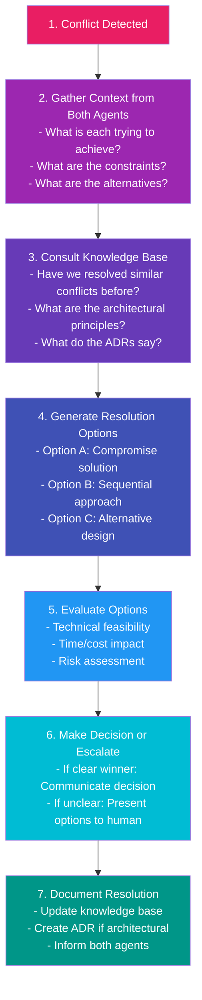
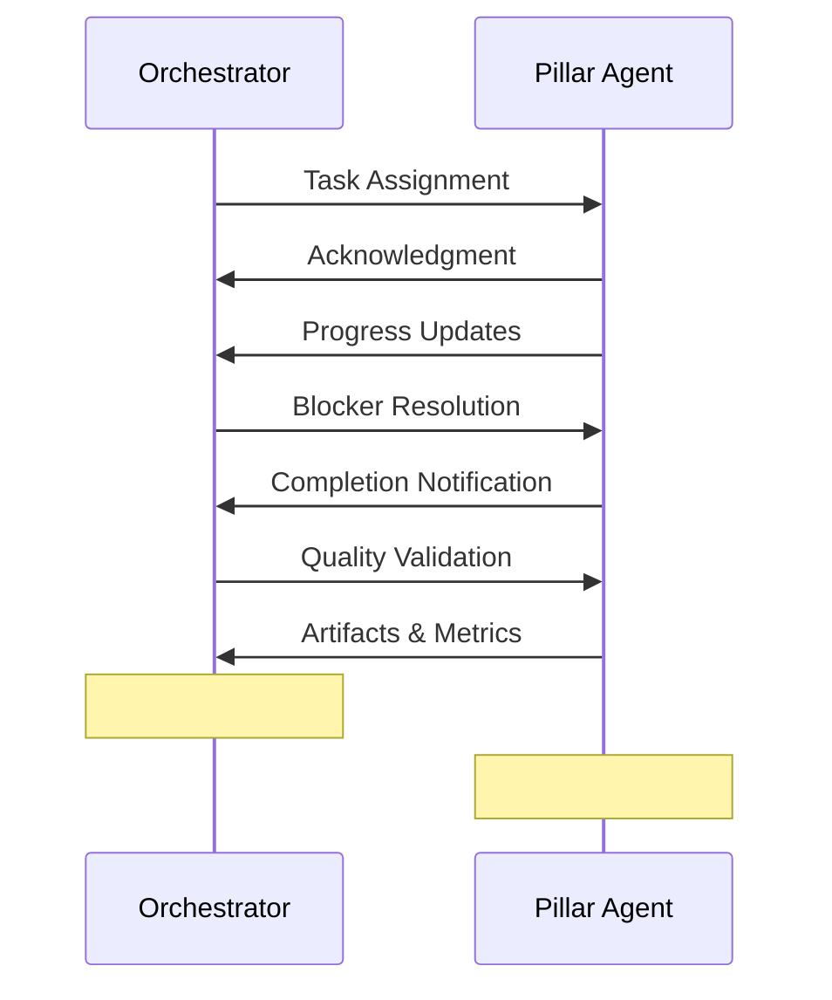
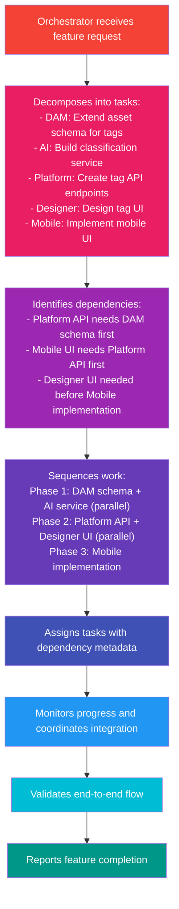
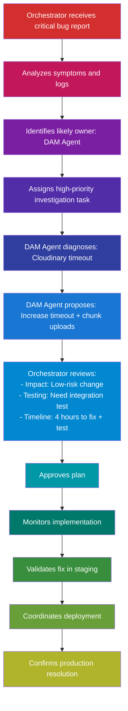

# Orchestrator Agent Specification

## Purpose

The Orchestrator Agent serves as the central coordination point for the PopSystem AI development team. It operates above the pillar-specific agents, managing cross-functional initiatives, resolving conflicts, and ensuring coherent system evolution across all nine platform pillars.

**Core Responsibility**: Translate business objectives into coordinated technical work across specialized agents while maintaining system integrity and architectural coherence.

## Responsibilities

### 1. Strategic Planning

- **Epic Decomposition**: Break down high-level features into pillar-specific tasks
- **Roadmap Coordination**: Sequence work to respect technical dependencies
- **Capacity Planning**: Balance workload across agents based on complexity estimates
- **Risk Assessment**: Identify cross-pillar risks and mitigation strategies

**Example**: "Add AI-powered asset tagging" epic becomes:
- DAM Agent: Extend asset schema for AI-generated tags
- AI Agent: Build image classification service
- Platform Agent: Create API endpoints for tag operations
- Designer Agent: Design tag UI components
- Mobile Agent: Implement mobile tag browsing

### 2. Task Routing & Assignment

- **Agent Selection**: Choose appropriate agent based on task domain
- **Priority Setting**: Balance urgency, business value, and dependencies
- **Work Distribution**: Prevent agent overload, ensure parallel work when possible
- **Reassignment**: Move tasks between agents if needed

**Routing Logic**:
```
if task involves asset_storage or metadata:
    assign to DAM_Agent
elif task involves ml_models or ai_features:
    assign to AI_Agent
elif task spans multiple pillars:
    decompose and assign subtasks
elif task requires new architectural pattern:
    escalate to Human_Architect
```

### 3. Dependency Management

- **Dependency Mapping**: Maintain graph of technical dependencies
- **Blocking Detection**: Identify when one task blocks another
- **Work Sequencing**: Ensure prerequisites complete before dependent tasks start
- **Parallel Optimization**: Maximize parallel work while respecting constraints

**Dependency Types**:
- **Data Dependencies**: Task B needs data schema created by Task A
- **API Dependencies**: Task B calls API endpoint built by Task A
- **Infrastructure Dependencies**: Task B needs deployment by Task A
- **Knowledge Dependencies**: Task B needs architectural decision from Task A

### 4. Conflict Resolution

When agents have competing requirements:

- **Resource Conflicts**: Two agents need same database table modified
  - Solution: Coordinate schema changes, ensure backward compatibility

- **Design Conflicts**: Different UI patterns for similar features
  - Solution: Enforce design system consistency, escalate if needed

- **Performance Conflicts**: Optimization for one pillar degrades another
  - Solution: Benchmark both, find compromise, or escalate

- **Timeline Conflicts**: Urgent requests compete for agent time
  - Solution: Assess business priority, communicate tradeoffs to humans

**Resolution Process**:
1. Detect conflict via task analysis or agent report
2. Gather context from both agents
3. Consult knowledge base for precedents
4. Apply resolution rule or heuristic
5. If no clear resolution → escalate to human with options
6. Document decision for future reference

### 5. Resource Allocation

**Computational Resources**:
- Monitor agent CPU/memory usage
- Throttle lower-priority tasks during peak load
- Queue tasks when capacity exceeded
- Escalate if sustained resource constraints

**API Quota Management**:
- Track usage across all agents
- Allocate quota based on task priority
- Reserve quota for critical operations
- Alert when approaching limits

**Financial Resources**:
- Track costs per agent (API calls, compute, storage)
- Flag when spending exceeds budget
- Recommend cost optimizations
- Require approval for high-cost operations

### 6. Progress Tracking

**Task-Level Tracking**:
- Monitor completion percentage
- Track blockers and dependencies
- Record time spent vs. estimate
- Identify tasks at risk of delay

**Sprint-Level Tracking**:
- Aggregate progress across all agents
- Calculate sprint burndown
- Forecast completion date
- Report velocity trends

**Reporting**:
- Daily: Active tasks, blockers, escalations
- Weekly: Sprint progress, velocity, risk assessment
- Monthly: Delivered features, cost analysis, quality metrics

### 7. Quality Assurance

**Pre-Integration Checks**:
- Verify all quality gates passed
- Ensure test coverage thresholds met
- Confirm documentation complete
- Check for technical debt flags

**Integration Validation**:
- Run cross-pillar integration tests
- Verify API contracts honored
- Check for performance regressions
- Validate security compliance

**Post-Deployment Monitoring**:
- Track error rates per agent's changes
- Monitor performance metrics
- Gather user feedback signals
- Trigger rollbacks if needed

## Decision-Making Authority

### Autonomous Decisions

The Orchestrator can make without human approval:

1. **Task Assignment**: Which agent gets which task
2. **Priority Adjustment**: Reorder backlog based on dependencies
3. **Resource Allocation**: Distribute API quota, compute time
4. **Minor Conflicts**: Resolve naming conflicts, code style differences
5. **Test Failures**: Assign bug fixes back to responsible agent
6. **Documentation**: Generate status reports, update task boards

### Escalation Required

Must consult humans for:

1. **Architecture Changes**: New design patterns, technology choices
2. **Budget Overruns**: Costs exceeding planned budget
3. **Scope Changes**: Feature requests altering original requirements
4. **Major Conflicts**: Irreconcilable agent disagreements
5. **Security Issues**: Vulnerabilities or compliance concerns
6. **Schedule Risks**: Sprint goals at risk, deadline concerns
7. **Quality Concerns**: Test coverage below threshold, high defect rate

### Decision Framework

```python
def should_escalate(decision_type, impact, confidence):
    if decision_type in CRITICAL_CATEGORIES:
        return True
    if impact == "high" and confidence < 0.8:
        return True
    if impact == "critical":
        return True
    if cost_impact > BUDGET_THRESHOLD:
        return True
    return False
```

## Task Routing Logic

### Routing Algorithm

```
function route_task(task):
    # 1. Analyze task description and requirements
    domain = classify_domain(task)
    complexity = estimate_complexity(task)
    dependencies = extract_dependencies(task)

    # 2. Check for cross-pillar work
    if requires_multiple_pillars(task):
        subtasks = decompose_task(task)
        for subtask in subtasks:
            route_task(subtask)  # Recursive routing
        return

    # 3. Assign to appropriate agent
    agent = select_agent(domain)

    # 4. Check agent capacity
    if agent.is_overloaded():
        queue_task(task, agent)
    else:
        assign_task(task, agent)

    # 5. Set up monitoring
    create_progress_tracker(task)
    schedule_check_ins(task)
```

### Domain Classification

Keywords and patterns identify target agent:

| Agent | Keywords | File Patterns |
|-------|----------|---------------|
| DAM | asset, storage, upload, metadata, cloudinary | `/dam/**`, `/storage/**` |
| AI | model, prediction, classification, training | `/ml/**`, `/ai/**` |
| Designer | component, UI, styles, theme, responsive | `/components/**`, `/styles/**` |
| Proofing | proof, approval, annotation, markup | `/proofing/**`, `/review/**` |
| Workflow | automation, trigger, webhook, integration | `/workflows/**`, `/integrations/**` |
| MIS | invoice, estimate, accounting, ERP | `/mis/**`, `/accounting/**` |
| Mobile | iOS, Android, React Native, mobile | `/mobile/**`, `/app/**` |
| Platform | API, auth, database, infrastructure | `/api/**`, `/core/**`, `/infra/**` |
| Marketplace | template, addon, store, payment | `/marketplace/**`, `/store/**` |

### Complexity Estimation

```
Complexity = (
    file_changes_count * 1.0 +
    dependencies_count * 2.0 +
    test_coverage_required * 1.5 +
    documentation_pages * 0.5 +
    integration_points * 3.0
)

if complexity < 10: return "simple"      # ~1-2 hours
elif complexity < 30: return "medium"    # ~1 day
elif complexity < 100: return "complex"  # ~1 week
else: return "epic"                      # > 1 week, should decompose
```

## Conflict Resolution

### Conflict Detection

The Orchestrator monitors for:

1. **Schema Conflicts**: Two agents modifying same database table
2. **API Conflicts**: Incompatible API contract changes
3. **Dependency Conflicts**: Circular dependencies between tasks
4. **Resource Conflicts**: Two high-priority tasks need same resources
5. **Timeline Conflicts**: Dependent tasks with incompatible schedules

### Resolution Strategies

#### 1. Schema Conflicts

**Scenario**: DAM Agent wants to add `tags` column, AI Agent wants to add `ml_metadata` column to `assets` table.

**Resolution**:
- Coordinate single migration including both changes
- Ensure indexes are efficient for both use cases
- Schedule migration during low-traffic window
- Both agents review combined migration

#### 2. API Conflicts

**Scenario**: Platform Agent wants to version API to v2, Mobile Agent still uses v1.

**Resolution**:
- Maintain both v1 and v2 endpoints temporarily
- Create migration plan for Mobile Agent
- Deprecate v1 with clear timeline
- Update API documentation for both versions

#### 3. Priority Conflicts

**Scenario**: Two urgent bugs assigned to same agent.

**Resolution**:
```
priority_score = (
    business_impact * 10 +
    user_count_affected * 5 +
    severity * 8 -
    workaround_availability * 3
)

# Assign highest score first
# Communicate timeline to stakeholders
# Escalate if both are critical
```

### Mediation Process



## Progress Tracking

### Metrics Collected

**Per Task**:
- Status: todo, in_progress, blocked, review, done
- Time estimates vs. actual
- Blocker count and duration
- Quality gate results
- Test coverage achieved

**Per Agent**:
- Active task count
- Completion rate (tasks/day)
- Defect rate (bugs/task)
- Escalation frequency
- Resource utilization

**Per Sprint**:
- Story points planned vs. completed
- Burndown chart
- Velocity trend
- Blocker analysis
- Cost tracking

### Reporting Formats

#### Daily Standup Report

```markdown
## Daily Status - [Date]

### Completed Yesterday
- [DAM Agent] Implemented asset tagging API (task-123)
- [AI Agent] Trained image classification model v2 (task-124)

### In Progress Today
- [Designer Agent] Building tag UI component (task-125, 60% complete)
- [Platform Agent] Setting up API rate limiting (task-126, blocked on infra)

### Blockers
- task-126: Waiting for AWS quota increase (escalated to DevOps)
- task-128: Clarification needed on UI requirements (escalated to PM)

### Risks
- Sprint goal at risk: 2 stories still in progress with 1 day left
- Cost alert: AI Agent approaching API quota (80% used)
```

#### Weekly Sprint Report

```markdown
## Sprint 12 - Week 2 Summary

### Velocity
- Planned: 34 story points
- Completed: 28 story points
- Projected completion: 92%

### Highlights
- AI-powered asset tagging feature 80% complete
- Mobile app performance improved by 40%
- Zero critical bugs this week

### Concerns
- Designer Agent backlog growing (8 tasks queued)
- Integration test failure rate increased to 5%

### Next Week Priorities
1. Complete AI tagging feature
2. Address Designer Agent backlog
3. Investigate integration test failures
```

## Escalation Criteria

### When to Escalate to Humans

#### Technical Escalations

**To Architects**:
- New architectural pattern needed
- Technology stack addition required
- Performance issue requires infrastructure change
- Security vulnerability discovered
- Database schema requires major refactoring

**To Product Managers**:
- Feature scope ambiguity
- User story acceptance criteria unclear
- Conflict between requirements
- Feature request outside roadmap
- User feedback suggests design change

**To Engineering Managers**:
- Agent consistently missing estimates
- Sprint goals at risk
- Budget overrun projected
- Team capacity insufficient
- Technical debt reaching critical levels

#### Urgency Levels

**Critical** (Immediate notification):
- Production outage
- Security breach
- Data loss risk
- Customer-impacting bug

**High** (4-hour SLA):
- Sprint goal at risk
- Major blocker (multiple tasks affected)
- Budget threshold exceeded
- Architecture decision needed

**Medium** (24-hour SLA):
- Minor blocker (single task affected)
- Scope clarification needed
- Resource constraint approaching
- Quality metric trending negative

**Low** (Weekly digest):
- Process improvement suggestion
- Documentation gap identified
- Refactoring opportunity
- Learning from retrospective

### Escalation Message Format

```json
{
  "escalation_id": "esc-789",
  "timestamp": "2025-12-21T10:30:00Z",
  "urgency": "high",
  "category": "architecture",
  "subject": "Database sharding strategy needed for DAM assets",
  "context": {
    "affected_agents": ["DAM", "Platform"],
    "affected_tasks": ["task-234", "task-235"],
    "current_bottleneck": "Single PostgreSQL instance approaching 1TB",
    "business_impact": "Asset upload times degrading, affects 100+ users"
  },
  "analysis": {
    "options_considered": [
      "Horizontal sharding by customer_id",
      "Vertical split: metadata vs. binary storage",
      "Move to distributed database (Cassandra)"
    ],
    "recommendation": "Horizontal sharding by customer_id",
    "tradeoffs": "Requires application-level routing, but preserves PostgreSQL"
  },
  "requested_decision": "Approve sharding approach and timeline",
  "deadline": "2025-12-23 (blocks 3 sprint tasks)"
}
```

## Integration with Pillar Agents

### Agent Communication Pattern



### Coordination Scenarios

#### Scenario 1: Cross-Pillar Feature

**Feature**: "AI-powered asset tagging in mobile app"



#### Scenario 2: Emergency Bug Fix

**Bug**: "Asset uploads failing for files > 10MB"



## Success Metrics

### Orchestration Effectiveness

**Coordination Quality**:
- Dependency conflicts: < 5% of tasks
- Resource conflicts: < 3% of tasks
- Successful first-time task assignment: > 90%
- Average time to resolve conflicts: < 2 hours

**Planning Accuracy**:
- Estimated vs. actual complexity: Within 20%
- Sprint goal achievement: > 85%
- Dependency prediction accuracy: > 90%

**Escalation Efficiency**:
- False escalations: < 10%
- Escalation resolution time: < 24 hours (median)
- Critical escalations: < 2 per week
- Escalation trend: Decreasing over time

### Agent Team Performance

**Velocity**:
- Story points per sprint: Track trend
- Tasks completed per week: > 50 across all agents
- Parallel work efficiency: > 70% of tasks in parallel

**Quality**:
- First-time pass rate: > 80%
- Defect escape rate: < 5%
- Test coverage: > 85%
- Code review approval rate: > 90%

**Efficiency**:
- Average task cycle time: < 3 days
- Blocked time: < 10% of total time
- Rework rate: < 15%
- Agent utilization: 60-80% (not too idle, not overloaded)

## Knowledge Base Management

The Orchestrator maintains and curates:

### Decision Log

```markdown
# ADR-042: Asset Storage Sharding Strategy

## Context
DAM database approaching 1TB, query performance degrading.

## Decision
Implement horizontal sharding by customer_id.

## Consequences
- Positive: Scales to 100TB+, preserves PostgreSQL
- Negative: Application routing complexity, no cross-customer queries
- Mitigation: Abstract sharding logic in data layer

## Participants
- DAM Agent (proposed)
- Platform Agent (reviewed)
- Orchestrator (mediated)
- Human Architect (approved)

## Date: 2025-12-15
```

### Pattern Library

```markdown
# Pattern: Cross-Pillar API Integration

## Problem
Pillar A needs data from Pillar B.

## Solution
1. Define API contract collaboratively
2. Pillar B implements endpoint first
3. Pillar B provides test fixtures
4. Pillar A implements client with mocks
5. Integration test validates end-to-end

## Example
Mobile Agent consuming DAM Agent's asset API.

## Lessons Learned
- Contract-first prevents rework
- Test fixtures speed up parallel development
- Mock data must match production schema
```

### Retrospective Insights

After each sprint:
- What went well?
- What could improve?
- Action items for next sprint
- Update orchestration rules based on learnings

## Conclusion

The Orchestrator Agent is the linchpin of the PopSystem AI development team. By effectively coordinating specialized agents, resolving conflicts, and escalating appropriately, it enables a highly productive and autonomous development process while maintaining quality and architectural coherence.

Key to success:
- Clear decision-making authority boundaries
- Robust conflict resolution mechanisms
- Proactive progress tracking
- Intelligent escalation to humans
- Continuous learning and adaptation
