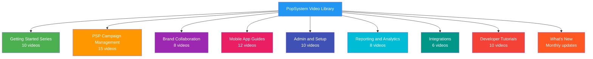

# Documentation Plan

## Overview
This document defines the comprehensive documentation strategy for PopSystem, covering content creation, management, and distribution across all user types and technical audiences. Our documentation approach emphasizes clarity, accessibility, and continuous improvement to enable user success and reduce support burden.

## Documentation Philosophy

### Core Principles

**User-Centric Design:**
- Documentation tailored to specific user roles and skill levels
- Task-oriented content that solves real problems
- Progressive disclosure of complexity
- Multiple learning modalities (text, video, interactive)

**Accuracy and Currency:**
- Documentation updated with every product release
- Version-specific content management
- Deprecated content clearly marked
- Regular audits for accuracy

**Discoverability:**
- SEO-optimized for external search
- Robust internal search functionality
- Contextual help within the application
- Clear information architecture

**Quality Standards:**
- Consistent voice and style
- Professional editing and review
- User testing before publication
- Metrics-driven improvement

## Documentation Types

### 1. User Guides

**Purpose:** Enable end-users to accomplish tasks and understand features

**Content Categories:**

**Getting Started Guides:**
- Platform overview and navigation
- First-time setup walkthroughs
- Quick wins and initial value
- Common workflows introduction
- Role-specific orientation

**Feature Documentation:**
- Comprehensive feature explanations
- Step-by-step instructions with screenshots
- Use cases and examples
- Best practices and tips
- Limitations and constraints

**How-To Guides:**
- Task-focused instructions
- Problem-solving approaches
- Workflow optimization
- Integration guides
- Troubleshooting common issues

**Format:**
- Web-based knowledge base articles
- Searchable and indexed
- Rich media (screenshots, GIFs, videos)
- Mobile-responsive design
- Print-friendly versions

**Update Frequency:**
- Major releases: Complete review
- Minor releases: Incremental updates
- Bug fixes: As needed
- Quarterly: Comprehensive audit

### 2. API Documentation

**Purpose:** Enable developers to integrate with PopSystem programmatically

**Content Structure:**

**Overview Section:**
- API architecture and design principles
- Authentication and authorization
- Rate limiting and quotas
- Versioning strategy
- Changelog and deprecation notices

**Reference Documentation:**
- Complete endpoint catalog
- Request/response schemas
- Error codes and messages
- Data types and models
- Code examples in multiple languages

**Integration Guides:**
- Quickstart tutorials
- Common integration patterns
- Webhook configuration
- OAuth flow implementation
- SDK usage examples

**Technical Specifications:**
- OpenAPI 3.0 specification file
- Postman collection
- GraphQL schema (if applicable)
- WebSocket protocols
- Batch operation guidelines

**Format:**
- Developer portal (e.g., Readme.io, Stoplight)
- Interactive API explorer
- Auto-generated from code annotations
- Versioned documentation
- Downloadable OpenAPI spec

**Update Frequency:**
- Every API version release
- Real-time for breaking changes
- Monthly: Example improvements
- Quarterly: Comprehensive review

### 3. Administrator Guides

**Purpose:** Enable administrators to configure, manage, and optimize their PopSystem instance

**Content Areas:**

**Account Administration:**
- User management and permissions
- Role-based access control
- Team and organizational structure
- SSO and authentication setup
- Security settings and policies

**System Configuration:**
- Account settings and customization
- Branding and white-labeling
- Notification rules and preferences
- Integration configuration
- API key management

**Operational Guides:**
- Data import and export
- Bulk operations
- Reporting and analytics setup
- Audit logs and compliance
- Performance optimization

**Advanced Topics:**
- Multi-tenant configuration (Enterprise)
- Custom field creation
- Automation rules
- Workflow design
- Advanced permissions

**Format:**
- Dedicated admin section in knowledge base
- PDF download option
- Video walkthroughs
- Configuration templates
- Checklist resources

**Update Frequency:**
- Major releases: Full review
- New features: Immediate documentation
- Monthly: Best practice updates
- Quarterly: Security and compliance review

### 4. Training Materials

**Purpose:** Structured learning paths for formal training programs

**Content Types:**

**Instructor-Led Training (ILT):**
- Slide decks and presenter notes
- Hands-on lab exercises
- Assessment quizzes
- Participant workbooks
- Certification exams

**Self-Paced Learning:**
- Video course libraries
- Interactive tutorials
- Progress tracking
- Knowledge checks
- Completion certificates

**Role-Based Curricula:**
- PSP Administrator track (8 hours)
- Campaign Manager track (6 hours)
- Brand User track (3 hours)
- Store/Installer track (1 hour)
- Developer track (4 hours)

**Training Programs:**

```mermaid
graph TD
    A["Training Programs"]
    B["Foundation Level"]
    C["Platform Overview<br>30 min"]
    D["Navigation and Basics<br>45 min"]
    E["Your First Campaign<br>60 min"]
    F["Reporting Essentials<br>45 min"]
    G["Intermediate Level"]
    H["Advanced Campaigns<br>90 min"]
    I["Automation and Workflows<br>60 min"]
    J["Integrations<br>60 min"]
    K["Analytics Deep Dive<br>90 min"]
    L["Advanced Level"]
    M["API Development<br>120 min"]
    N["System Optimization<br>60 min"]
    O["Enterprise Features<br>90 min"]
    P["Custom Solutions<br>120 min"]

    A --> B
    A --> G
    A --> L
    B --> C
    B --> D
    B --> E
    B --> F
    G --> H
    G --> I
    G --> J
    G --> K
    L --> M
    L --> N
    L --> O
    L --> P

    style A fill:#2196f3,color:#fff
    style B fill:#4caf50,color:#fff
    style C fill:#ff9800,color:#fff
    style D fill:#ff9800,color:#fff
    style E fill:#ff9800,color:#fff
    style F fill:#ff9800,color:#fff
    style G fill:#9c27b0,color:#fff
    style H fill:#e91e63,color:#fff
    style I fill:#e91e63,color:#fff
    style J fill:#e91e63,color:#fff
    style K fill:#e91e63,color:#fff
    style L fill:#f44336,color:#fff
    style M fill:#3f51b5,color:#fff
    style N fill:#3f51b5,color:#fff
    style O fill:#3f51b5,color:#fff
    style P fill:#3f51b5,color:#fff
```



**Format:**
- Learning Management System (LMS)
- Video platform (Wistia, Vimeo)
- Interactive product tours (Pendo, Appcues)
- Downloadable workbooks (PDF)
- Virtual classroom (Zoom, WebEx)

**Update Frequency:**
- Annual: Curriculum review
- Quarterly: Content refresh
- Monthly: New feature additions
- Weekly: Bug fixes and improvements

## Documentation by Audience

### PSP (Point-of-Purchase Service Provider) Documentation

**Target Users:** Marketing agencies, merchandising companies, retail execution firms

**Key Content Areas:**

**Account Setup and Configuration:**
- Initial account provisioning
- Branding and customization
- Team structure and permissions
- Integration with existing systems
- Mobile app deployment

**Campaign Management:**
- Campaign creation and planning
- Store network management
- Task and workflow design
- Scheduling and assignment
- Approval workflows

**Field Operations:**
- Mobile app administration
- Installer/merchandiser management
- Real-time monitoring
- Quality control processes
- Communication tools

**Reporting and Analytics:**
- Dashboard configuration
- Campaign performance metrics
- Resource utilization reports
- Client reporting
- Export and API access

**Content Formats:**
- Comprehensive admin guide (100+ pages)
- Video tutorial library (50+ videos)
- Quick reference cards
- Best practice playbooks
- Template library

### Brand Documentation

**Target Users:** Brand managers, marketing teams, retail marketing professionals

**Key Content Areas:**

**Getting Started:**
- Account activation
- Platform navigation
- PSP partner collaboration
- Asset management
- Campaign brief creation

**Campaign Collaboration:**
- Submitting campaign requests
- Working with PSP partners
- Approval and feedback workflows
- Communication tools
- Asset library management

**Visibility and Reporting:**
- Campaign tracking
- Execution visibility
- Photo review and approval
- Performance analytics
- ROI measurement

**Best Practices:**
- Campaign planning guides
- Asset preparation guidelines
- Effective brief writing
- Quality standards
- Industry-specific use cases

**Content Formats:**
- Quick-start guide (20 pages)
- Video tutorials (15 videos)
- Campaign brief templates
- Asset specification guides
- FAQ library

### Store/Installer Documentation

**Target Users:** In-store merchandisers, installers, field representatives

**Key Content Areas:**

**Mobile App Basics:**
- App download and installation
- Login and profile setup
- Navigation and interface
- Notification management
- Offline functionality

**Task Execution:**
- Viewing assignments
- Accepting tasks
- Photo capture guidelines
- Form completion
- Submission process

**Best Practices:**
- Photo quality standards
- Execution guidelines
- Safety protocols
- Communication etiquette
- Efficiency tips

**Support and Troubleshooting:**
- Common issues and solutions
- Help and support access
- Reporting problems
- Payment and compensation
- Performance feedback

**Content Formats:**
- Mobile quick-start guide (5 pages)
- In-app video tutorials (3-5 min each)
- Photo quality examples
- FAQ sheet
- Safety guidelines

### Developer Documentation

**Target Users:** Software engineers, integration specialists, technical partners

**Key Content Areas:**

**API Reference:**
- Complete endpoint documentation
- Authentication methods
- Request/response formats
- Error handling
- Rate limits and quotas

**Integration Guides:**
- Quickstart tutorial
- Common integration patterns
- Webhook implementation
- OAuth 2.0 flow
- SDK usage (if available)

**Data Models:**
- Schema documentation
- Relationship diagrams
- Data types and constraints
- Validation rules
- Migration guides

**Advanced Topics:**
- Batch operations
- Async processing
- Event streaming
- Custom integrations
- Performance optimization

**Content Formats:**
- Developer portal
- Interactive API explorer
- Code samples repository (GitHub)
- OpenAPI/Swagger specification
- SDK documentation

## Content Management System

### Platform Selection

**Requirements:**

**Core Features:**
- Version control for all content
- Multi-author collaboration
- Approval workflows
- Rich media support
- Search and indexing
- Analytics and reporting
- Mobile-responsive
- Multi-language support

**Integration Capabilities:**
- Single sign-on (SSO)
- CRM integration (user data)
- Product integration (contextual help)
- Support system integration
- Analytics integration

**Platform Options:**

**Knowledge Base Solutions:**
- Zendesk Guide
- Intercom Articles
- HubSpot Knowledge Base
- Guru
- Document360

**Developer Portal Solutions:**
- Readme.io
- Stoplight
- Swagger UI + custom portal
- GitBook
- Redoc

**Recommended Stack:**
- User documentation: Zendesk Guide (integrated with support)
- Developer documentation: Readme.io (interactive, versioned)
- Training content: Vimeo or Wistia (video hosting)
- Internal docs: Notion or Confluence (team collaboration)

### Content Organization

**Information Architecture:**

```mermaid
graph TD
    A["PopSystem Documentation"]
    B["Getting Started"]
    C["Platform Overview"]
    D["Quick Start by Role"]
    E["Key Concepts"]
    F["First Steps Checklist"]
    G["User Guides"]
    H["PSP Users"]
    I["Account Setup"]
    J["Campaign Management"]
    K["Field Operations"]
    L["Reporting"]
    M["Brand Users"]
    N["Getting Started"]
    O["Campaign Briefs"]
    P["Collaboration"]
    Q["Analytics"]
    R["Store/Installer"]
    S["Mobile App Guide"]
    T["Task Execution"]
    U["Best Practices"]
    V["Administrator Guides"]
    W["Account Administration"]
    X["User Management"]
    Y["Security Settings"]
    Z["Integrations"]
    AA["Advanced Configuration"]
    AB["Developer Documentation"]
    AC["API Reference"]
    AD["Integration Guides"]
    AE["SDKs and Tools"]
    AF["Webhooks"]
    AG["Code Examples"]
    AH["Integrations"]
    AI["CRM Systems"]
    AJ["Inventory Management"]
    AK["Analytics Tools"]
    AL["Authentication SSO"]
    AM["Troubleshooting"]
    AN["Common Issues"]
    AO["Error Messages"]
    AP["Performance Tips"]
    AQ["Browser Compatibility"]
    AR["Release Notes"]
    AS["Latest Release"]
    AT["Version History"]
    AU["Deprecation Notices"]

    A --> B
    B --> C
    B --> D
    B --> E
    B --> F
    A --> G
    G --> H
    H --> I
    H --> J
    H --> K
    H --> L
    G --> M
    M --> N
    M --> O
    M --> P
    M --> Q
    G --> R
    R --> S
    R --> T
    R --> U
    A --> V
    V --> W
    V --> X
    V --> Y
    V --> Z
    V --> AA
    A --> AB
    AB --> AC
    AB --> AD
    AB --> AE
    AB --> AF
    AB --> AG
    A --> AH
    AH --> AI
    AH --> AJ
    AH --> AK
    AH --> AL
    A --> AM
    AM --> AN
    AM --> AO
    AM --> AP
    AM --> AQ
    A --> AR
    AR --> AS
    AR --> AT
    AR --> AU

    style A fill:#2196f3,color:#fff
    style B fill:#4caf50,color:#fff
    style C fill:#ff9800,color:#fff
    style D fill:#ff9800,color:#fff
    style E fill:#ff9800,color:#fff
    style F fill:#ff9800,color:#fff
    style G fill:#9c27b0,color:#fff
    style H fill:#e91e63,color:#fff
    style I fill:#673ab7,color:#fff
    style J fill:#673ab7,color:#fff
    style K fill:#673ab7,color:#fff
    style L fill:#673ab7,color:#fff
    style M fill:#e91e63,color:#fff
    style N fill:#3f51b5,color:#fff
    style O fill:#3f51b5,color:#fff
    style P fill:#3f51b5,color:#fff
    style Q fill:#3f51b5,color:#fff
    style R fill:#e91e63,color:#fff
    style S fill:#00bcd4,color:#fff
    style T fill:#00bcd4,color:#fff
    style U fill:#00bcd4,color:#fff
    style V fill:#f44336,color:#fff
    style W fill:#795548,color:#fff
    style X fill:#795548,color:#fff
    style Y fill:#795548,color:#fff
    style Z fill:#795548,color:#fff
    style AA fill:#795548,color:#fff
    style AB fill:#009688,color:#fff
    style AC fill:#607d8b,color:#fff
    style AD fill:#607d8b,color:#fff
    style AE fill:#607d8b,color:#fff
    style AF fill:#607d8b,color:#fff
    style AG fill:#607d8b,color:#fff
    style AH fill:#8bc34a,color:#fff
    style AI fill:#cddc39,color:#000
    style AJ fill:#cddc39,color:#000
    style AK fill:#cddc39,color:#000
    style AL fill:#cddc39,color:#000
    style AM fill:#ffc107,color:#000
    style AN fill:#ff5722,color:#fff
    style AO fill:#ff5722,color:#fff
    style AP fill:#ff5722,color:#fff
    style AQ fill:#ff5722,color:#fff
    style AR fill:#9e9e9e,color:#fff
    style AS fill:#607d8b,color:#fff
    style AT fill:#607d8b,color:#fff
    style AU fill:#607d8b,color:#fff
```



### Metadata and Tagging

**Required Metadata:**
- Title and description
- Target audience (PSP, Brand, Store, Developer, Admin)
- User level (Beginner, Intermediate, Advanced)
- Product version compatibility
- Last updated date
- Document owner
- Related articles
- Keywords and tags

**Tagging Taxonomy:**
```
Audience: [PSP, Brand, Store, Installer, Developer, Admin]
Topic: [Campaigns, Reporting, Mobile, API, Integrations, Security]
Feature: [Specific feature names]
User Level: [Beginner, Intermediate, Advanced]
Content Type: [Guide, Tutorial, Reference, Troubleshooting, FAQ]
```

## Version Control for Documentation

### Versioning Strategy

**Product Version Alignment:**
- Documentation versioned to match product releases
- Version selector in documentation portal
- Each major version maintains separate docs
- Legacy version documentation archived but accessible

**Version Numbering:**
```
Major.Minor.Patch
Example: v2.5.1

Major (2): Breaking changes, major feature releases
Minor (5): New features, non-breaking changes
Patch (1): Bug fixes, minor corrections
```

**Version Lifecycle:**

**Current Version (Latest):**
- Actively maintained
- Regular updates
- Featured prominently
- Full feature documentation

**Previous Major Version (N-1):**
- Maintained for 12 months
- Critical updates only
- Deprecation notices
- Migration guides

**Legacy Versions (N-2 and older):**
- Archived and read-only
- No active maintenance
- Migration path documented
- Sunset date announced

### Change Management

**Documentation Review Process:**

**1. Planning:**
- Product release schedule reviewed
- Documentation scope defined
- Resources assigned
- Timeline established

**2. Drafting:**
- Writers create/update content
- Subject matter experts provide input
- Screenshots and media created
- Code examples tested

**3. Review:**
- Technical accuracy review (Product/Engineering)
- Editorial review (grammar, style, consistency)
- User testing (sample customers)
- Accessibility check

**4. Approval:**
- Product manager sign-off
- Documentation lead approval
- Legal review (if needed)
- Release notes compiled

**5. Publication:**
- Staged to preview environment
- Final QA check
- Published to production
- Announcements sent
- Old version archived

**Version Control Tools:**
- Git repository for source content (Markdown)
- GitHub/GitLab for collaboration
- Branching strategy aligned with product
- Pull request reviews required
- Automated builds and deploys

### Deprecation Management

**Deprecation Notice Process:**

**Phase 1: Announcement (T-90 days):**
- Deprecation notice in documentation
- Banner on affected pages
- Release notes entry
- Email to affected customers
- Alternative solution documented

**Phase 2: Warning (T-30 days):**
- Increased visibility of deprecation
- Migration guide published
- Support team briefed
- Customer success outreach

**Phase 3: Removal (T-0):**
- Feature removed from product
- Documentation archived
- Redirect to new solution
- Support for migration

## Localization Approach

### Language Strategy

**Phase 1: English Only (Launch)**
- All documentation in English
- International English (UK spelling, date formats)
- Clear, simple language
- Translation-friendly writing

**Phase 2: Primary Markets (6-12 months)**
- Spanish (Latin America)
- French (Canada)
- Portuguese (Brazil)

**Phase 3: Expansion Markets (12-24 months)**
- German
- Japanese
- Chinese (Simplified)

**Priority Content for Translation:**
1. Getting started guides
2. Mobile app documentation
3. UI text and messages
4. Training videos (subtitles first, then dubbing)
5. API documentation (lower priority)

### Localization Process

**Translation Workflow:**

**1. Content Preparation:**
- Source content finalized
- Strings extracted for translation
- Context provided for translators
- Cultural considerations noted

**2. Translation:**
- Professional translation service
- Native speakers for accuracy
- Subject matter expertise required
- Glossary and style guide provided

**3. Review:**
- In-country review
- Technical accuracy check
- Cultural appropriateness
- Formatting and layout

**4. Quality Assurance:**
- Localization testing
- Screenshot updates
- Link verification
- User acceptance testing

**5. Publication:**
- Language-specific URLs
- Language selector in UI
- Search indexed by language
- Analytics by language

**Translation Management:**
- TMS (Translation Management System): Smartling or Phrase
- Integration with CMS
- Translation memory for consistency
- Automated string extraction
- Version control for translations

### Cultural Adaptation

**Localization Beyond Translation:**
- Date and time formats
- Currency and measurements
- Examples and use cases (locally relevant)
- Screenshots with localized UI
- Culturally appropriate imagery
- Regional compliance requirements
- Local contact information

## Self-Service Knowledge Base

### Structure and Organization

**Knowledge Base Architecture:**

**Homepage:**
- Search bar (prominent)
- Popular articles
- Browse by role/audience
- Browse by topic
- Recent updates
- Video library access
- Community forum link

**Article Structure:**

**Standard Article Template:**
```markdown
# Article Title (Clear, Action-Oriented)

## Overview
Brief description of what this article covers

## Prerequisites
- What you need before starting
- Required permissions
- Related knowledge

## Step-by-Step Instructions
1. First step with screenshot
2. Second step with annotated image
3. Third step with video embed

## Best Practices
- Tips for success
- Common pitfalls to avoid
- Optimization suggestions

## Troubleshooting
- Common issues and solutions
- Error messages explained
- Where to get help

## Related Articles
- Link to related topic 1
- Link to related topic 2
- Link to advanced guide

## Was This Helpful?
[Yes] [No] [Feedback form]
```

**Navigation Design:**
- Breadcrumb navigation
- Table of contents (long articles)
- Previous/Next article links
- Related articles sidebar
- Category browsing
- Tag-based discovery

### Search Optimization

**Internal Search:**
- Full-text search across all content
- Synonym recognition
- Autocomplete suggestions
- Faceted filtering (by audience, topic, type)
- Search analytics to improve results
- "No results" helpful fallback

**SEO Strategy:**
- Keyword research for common queries
- Meta descriptions for all articles
- Descriptive URLs (slug-based)
- Internal linking strategy
- Sitemap generation
- Schema markup for rich snippets

**Search Performance Metrics:**
- Search success rate (>80% find answer)
- Average time to find information (<3 min)
- Search exit rate (<15%)
- Common "no results" queries (optimize)
- Most searched terms (prioritize content)

### User Feedback Mechanisms

**Article-Level Feedback:**
- "Was this helpful?" yes/no voting
- Optional comment/suggestion box
- Rating system (1-5 stars)
- Report broken links or errors
- Request clarification

**Knowledge Base Feedback:**
- Quarterly user survey (NPS for docs)
- Missing content requests
- Usability testing sessions
- A/B testing variations
- Heat mapping and analytics

**Feedback Loop:**
- Weekly review of negative feedback
- Monthly content improvement sprints
- Quarterly roadmap for new content
- Annual comprehensive audit

## Video Tutorial Strategy

### Video Content Types

**Quick Tips (1-3 minutes):**
- Single feature demonstrations
- Common task walkthroughs
- Problem-solving tips
- Keyboard shortcuts
- Mobile app quick guides

**Feature Tutorials (5-10 minutes):**
- Comprehensive feature overview
- Multiple use cases
- Step-by-step instructions
- Best practices
- Advanced configurations

**Course Lessons (10-20 minutes):**
- In-depth training modules
- Part of structured curriculum
- Includes assessments
- Downloadable resources
- Certificate-eligible

**Webinar Recordings (30-60 minutes):**
- Live training sessions
- Product announcements
- Expert panels
- Customer showcases
- Q&A sessions

### Production Standards

**Video Quality Requirements:**

**Technical Specs:**
- Resolution: 1080p minimum
- Frame rate: 30 fps
- Audio: Clear narration, noise-free
- Bitrate: Optimized for streaming
- Captions: Required for all videos
- Transcript: Available for download

**Visual Standards:**
- Branded intro/outro (5 seconds)
- Clear screen recording (1920x1080)
- Zoom effects for emphasis
- Annotations and callouts
- Consistent voice-over
- Background music (subtle)

**Accessibility:**
- Closed captions (auto-generated, then edited)
- Transcripts available
- Audio descriptions (for complex visuals)
- Keyboard navigation support
- Screen reader compatibility

### Video Library Organization

**Platform Structure:**



**Video Hosting:**
- Platform: Vimeo Business or Wistia
- Embedded in knowledge base
- Direct link sharing
- Download option (for training)
- Analytics and engagement tracking

**Video Metadata:**
- Descriptive title
- Detailed description
- Target audience
- Duration
- Difficulty level
- Related videos
- Corresponding written guide
- Transcript link

### Update and Maintenance

**Video Refresh Schedule:**
- Major UI changes: Immediate re-record
- Feature updates: Within 1 sprint
- Quarterly review: Update outdated content
- Annual audit: Comprehensive refresh

**Versioning Strategy:**
- Version tag in video title
- Deprecation notice on old videos
- Redirect to updated version
- Archive but keep accessible

## Release Notes Process

### Release Notes Structure

**Release Note Template:**

```markdown
# Release vX.Y.Z - [Release Name]
**Release Date:** YYYY-MM-DD
**Release Type:** [Major | Minor | Patch]

## Overview
Brief summary of the release and key highlights

## What's New
### [Feature Category 1]
- **[Feature Name]**: Description of new feature, benefits, and how to access
- **[Feature Name]**: Description

### [Feature Category 2]
- **[Feature Name]**: Description

## Improvements
- Enhancement description
- Performance improvement
- Usability refinement

## Bug Fixes
- Fixed issue description
- Resolved bug description
- Corrected behavior

## API Changes
- New endpoints
- Modified parameters
- Deprecated methods
- Breaking changes (if any)

## Documentation Updates
- New articles published
- Updated guides
- Video tutorials added

## Known Issues
- Issue description and workaround
- Expected resolution timeline

## Upgrade Notes
- Migration steps (if needed)
- Configuration changes required
- Compatibility considerations

## Related Resources
- [Link to documentation]
- [Link to training video]
- [Link to migration guide]
```

### Distribution Channels

**In-App Notifications:**
- "What's New" modal on login (for major releases)
- Notification badge on new features
- In-context tooltips
- Feature announcements banner

**Email Communications:**
- Release announcement email (all users)
- Technical release notes (admins)
- Developer changelog (API users)
- Segmented by user type

**Public Channels:**
- Release notes page on website
- Blog post (major releases)
- Social media announcements
- Newsletter feature
- Press releases (major milestones)

**Internal Channels:**
- Support team briefing (pre-release)
- Sales enablement materials
- Customer success playbook updates
- Training material updates

### Audience-Specific Release Notes

**End User Release Notes:**
- Focus on benefits and user impact
- Non-technical language
- Screenshots and visuals
- How to access new features
- Video demos

**Administrator Release Notes:**
- Configuration changes
- New admin capabilities
- Permission updates
- Integration changes
- Migration requirements

**Developer Release Notes:**
- API changes (detailed)
- Breaking changes highlighted
- New endpoints and methods
- Deprecation warnings
- Code examples
- Migration scripts

### Version History

**Release Archive:**
- Chronological listing of all releases
- Filter by version type (major, minor, patch)
- Search functionality
- Link to full release notes
- Download PDF version

**Changelog Format:**
```
Version  Date        Type    Summary
v2.5.1   2025-12-15  Patch   Bug fixes and performance improvements
v2.5.0   2025-12-01  Minor   Campaign templates, enhanced reporting
v2.0.0   2025-09-15  Major   Complete UI redesign, new API v2
```

## API Documentation (OpenAPI/Swagger)

### OpenAPI Specification

**Specification Standards:**
- OpenAPI 3.0.x format
- Machine-readable YAML/JSON
- Human-readable descriptions
- Complete schema definitions
- Example values for all fields
- Validation rules documented

**Core Components:**

**API Information:**
```yaml
openapi: 3.0.3
info:
  title: PopSystem API
  version: 2.0.0
  description: Complete API for PopSystem platform
  contact:
    name: API Support
    email: api-support@popsystem.com
    url: https://developer.popsystem.com/support
  license:
    name: Proprietary
servers:
  - url: https://api.popsystem.com/v2
    description: Production
  - url: https://api-staging.popsystem.com/v2
    description: Staging
```

**Authentication:**
- OAuth 2.0 flows documented
- API key authentication
- JWT token usage
- Refresh token handling
- Scope definitions

**Endpoints:**
- Complete CRUD operations
- Path parameters
- Query parameters
- Request body schemas
- Response schemas
- Error responses

**Example Endpoint Documentation:**
```yaml
/campaigns:
  get:
    summary: List campaigns
    description: Retrieve a paginated list of campaigns
    tags:
      - Campaigns
    parameters:
      - name: page
        in: query
        schema:
          type: integer
          default: 1
      - name: limit
        in: query
        schema:
          type: integer
          default: 20
          maximum: 100
    responses:
      200:
        description: Successful response
        content:
          application/json:
            schema:
              $ref: '#/components/schemas/CampaignList'
      401:
        $ref: '#/components/responses/Unauthorized'
```

### Interactive API Explorer

**Features:**
- Try-it-now functionality
- Authentication sandbox
- Request builder
- Response viewer
- Code generation (multiple languages)
- Error simulation

**Supported Languages for Code Examples:**
- JavaScript/Node.js
- Python
- Ruby
- PHP
- Java
- C#
- cURL
- Go

### API Reference Portal

**Portal Components:**

**Getting Started:**
- Authentication guide
- Quick start tutorial
- First API call walkthrough
- Postman collection download
- SDK installation

**Reference Documentation:**
- Auto-generated from OpenAPI spec
- Interactive explorer
- Try-it-now capability
- Response examples
- Error code reference

**Guides and Tutorials:**
- Common use cases
- Integration patterns
- Best practices
- Rate limiting strategies
- Pagination handling
- Webhook setup

**API Changelog:**
- Version history
- Breaking changes
- New endpoints
- Deprecated endpoints
- Migration guides

**Support Resources:**
- API status page
- Support channels
- Community forum
- Issue tracker
- SLA documentation

### Code Examples and SDKs

**Sample Code Repository (GitHub):**
- Example implementations
- Integration patterns
- Starter templates
- Common workflows
- Best practice examples

**SDK Documentation:**
- Installation instructions
- Initialization and configuration
- Method reference
- Error handling
- Advanced usage
- Changelog

**Code Quality Standards:**
- Well-commented examples
- Error handling demonstrated
- Best practices followed
- Production-ready patterns
- Security considerations

## Developer Portal Requirements

### Portal Architecture

**Core Pages:**

**Homepage:**
- Getting started CTA
- API reference link
- Popular guides
- Latest updates
- Code example showcase
- Community highlights

**API Reference:**
- Complete endpoint listing
- Interactive explorer
- Search functionality
- Filter by tag/category
- Version selector

**Guides Section:**
- Tutorials by use case
- Integration guides
- Best practices
- Advanced topics
- Video tutorials

**Resources:**
- OpenAPI spec download
- Postman collection
- SDK downloads
- Code samples (GitHub)
- Changelog
- Status page

**Support:**
- Documentation search
- FAQ
- Community forum
- Support tickets
- Contact information

### Authentication and Access

**Developer Account Management:**
- Self-service registration
- Email verification
- Profile management
- Organization association
- API key generation
- Usage dashboard

**API Key Management:**
- Create/revoke keys
- Environment-specific keys (dev, staging, prod)
- Scopes and permissions
- Rate limit visibility
- Usage analytics
- Webhook secret management

### Analytics and Monitoring

**Developer Dashboard:**
- API usage metrics
- Request volume over time
- Error rate tracking
- Response time stats
- Rate limit status
- Top endpoints used

**Alerts and Notifications:**
- Rate limit warnings
- Error spike alerts
- Breaking change announcements
- Maintenance notifications
- New feature announcements

### Community and Support

**Developer Community:**
- Discussion forum
- Q&A section
- Feature requests
- Bug reports
- Code sharing
- Best practice discussions

**Support Channels:**
- Documentation search (primary)
- Community forum (peer support)
- Email support (paid plans)
- Slack/Discord channel (Enterprise)
- Dedicated support engineer (Enterprise+)

**Developer Feedback:**
- API satisfaction survey
- Feature request voting
- Documentation feedback
- Bug reporting
- Beta program participation

## Content Creation Workflow

### Roles and Responsibilities

**Content Team:**

**Technical Writer:**
- Draft user-facing documentation
- Create how-to guides
- Maintain knowledge base
- Edit and proofread
- Conduct user testing

**Developer Advocate:**
- Write API documentation
- Create code examples
- Maintain developer portal
- Engage with developer community
- Produce technical tutorials

**Video Producer:**
- Script video tutorials
- Record and edit videos
- Create video library
- Optimize for accessibility
- Manage video platform

**Content Manager:**
- Documentation strategy
- Editorial calendar
- Quality standards
- Publishing workflow
- Analytics and reporting

**Subject Matter Experts (SMEs):**
- Product Managers: Feature documentation review
- Engineers: Technical accuracy validation
- Support Team: Common issue insights
- Customer Success: User feedback integration

### Editorial Standards

**Style Guide:**
- Voice and tone guidelines
- Terminology and glossary
- Formatting conventions
- Screenshot standards
- Code example standards
- Accessibility requirements

**Writing Guidelines:**
- Active voice preferred
- Clear, concise language
- Second person ("you")
- Present tense
- Avoid jargon
- Define technical terms
- Use examples liberally

**Quality Checklist:**
- [ ] Technically accurate
- [ ] Clear and concise
- [ ] Grammar and spelling checked
- [ ] Screenshots current and annotated
- [ ] Links tested and valid
- [ ] Metadata complete
- [ ] Accessibility reviewed
- [ ] User-tested (for major content)

### Publication Workflow

**Content Lifecycle:**

**1. Planning (Weekly):**
- Review product roadmap
- Identify documentation needs
- Prioritize content backlog
- Assign writers
- Set deadlines

**2. Creation (Ongoing):**
- Research and outline
- Draft content
- Create media (screenshots, videos)
- Internal review
- Revision

**3. Review (Before publish):**
- Technical accuracy (SME review)
- Editorial review (style, grammar)
- Peer review
- User testing (major content)
- Accessibility check

**4. Approval (Final gate):**
- Product manager approval
- Legal review (if needed)
- Final QA check
- Publishing approval

**5. Publication:**
- Publish to staging
- Final review in staging
- Publish to production
- Update related content
- Announce (if significant)

**6. Maintenance (Ongoing):**
- Monitor feedback
- Update for product changes
- Refresh outdated content
- Archive deprecated content
- Analytics review

## Metrics and Analytics

### Documentation Effectiveness Metrics

**Usage Metrics:**
- Page views by article
- Unique visitors
- Time on page
- Bounce rate
- Search queries
- Video views and completion rates

**Engagement Metrics:**
- Helpful votes (yes/no)
- Article ratings
- Comments and feedback
- Social shares
- Download counts (PDFs, videos)

**Conversion Metrics:**
- Documentation to support ticket ratio
- Self-service resolution rate
- Time to find answer
- Documentation-assisted conversions
- User onboarding completion rates

### Success Criteria

**Target Metrics:**
- Documentation coverage: 95% of features documented
- Self-service success rate: >70%
- Average article helpfulness: >80% "yes" votes
- Search success rate: >85%
- Video completion rate: >60%
- Documentation NPS: >50

**Support Impact:**
- 40% reduction in "how to" support tickets
- Documentation referenced in 60%+ of support responses
- 30% of users self-solve via documentation
- Average time to find answer: <3 minutes

### Analytics Tools

**Documentation Analytics:**
- Google Analytics (traffic and behavior)
- Hotjar or FullStory (session replay, heatmaps)
- Knowledge base platform analytics (Zendesk, Intercom)
- Video platform analytics (Wistia, Vimeo)
- Search analytics (top queries, no-result queries)

**Feedback Collection:**
- In-article feedback widgets
- Quarterly documentation surveys
- User testing sessions
- Support ticket analysis
- Customer success feedback

### Continuous Improvement

**Review Cycles:**

**Weekly:**
- New feedback review
- High-priority updates
- Broken link fixes
- Quick wins

**Monthly:**
- Analytics review
- Content performance analysis
- Top search queries optimization
- Low-performing content improvement

**Quarterly:**
- Comprehensive content audit
- User survey analysis
- Documentation roadmap update
- Team retrospective
- Process improvements

**Annual:**
- Complete documentation review
- Tooling and platform evaluation
- Localization expansion
- Major restructuring (if needed)
- Strategy refresh

---

**Document Owner:** VP of Product Marketing / Director of Documentation
**Last Updated:** 2025-12-21
**Next Review:** Quarterly
**Related Documents:** Support_Tiers.md, Customer_Success_Playbook.md, Onboarding_Process.md, Runbook_Templates.md
