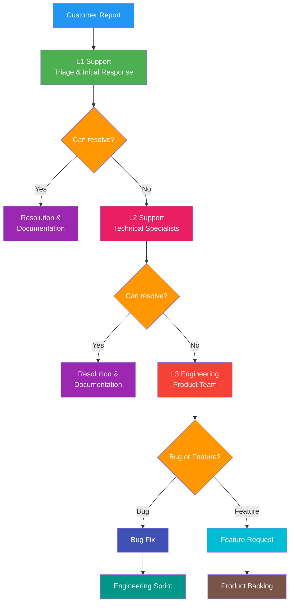
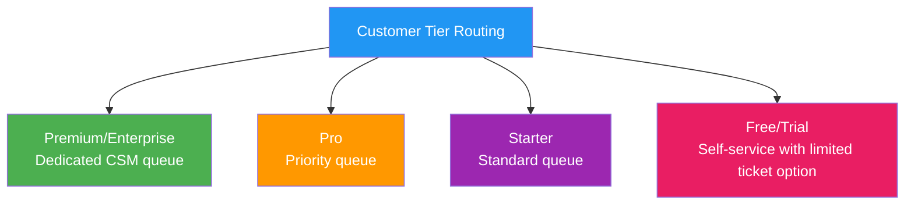
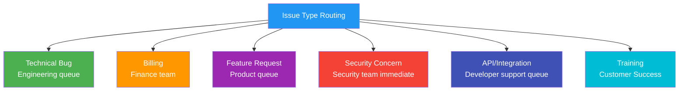
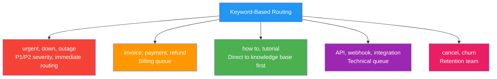

# Support Tiers

## Overview
This document defines the customer support structure for PopSystem, outlining service level agreements (SLAs), support channels, escalation procedures, and the tools and processes that enable our support operations.

## Support Tier Structure

| Tier | Response SLA | Channels | Included In |
|------|--------------|----------|-------------|
| Self-Service | N/A | Help docs, community | All plans |
| Standard | 24-48 hours | Email, chat | Starter |
| Priority | 4-8 hours | Email, chat, phone | Pro |
| Enterprise | 1-4 hours | Dedicated CSM | Enterprise |
| Premium | < 1 hour | 24/7 phone, dedicated | Enterprise+ |

## Tier Details

### Self-Service
**Target Audience:** All users, particularly free tier and trial users

**Capabilities:**
- Comprehensive help documentation
- Video tutorials and guides
- Community forum access
- In-app contextual help
- Chatbot for common queries
- Knowledge base search

**Success Metrics:**
- Documentation coverage: 95% of common issues
- Self-service resolution rate: >60%
- Average time to find answer: <3 minutes

### Standard Support
**Target Audience:** Starter plan customers

**Service Levels:**
- First response: 24-48 business hours
- Resolution target: 3-5 business days
- Business hours coverage: 9 AM - 6 PM local time (M-F)

**Channels:**
- Email support
- In-app chat (business hours)
- Ticket system access

**Coverage:**
- Platform usage questions
- Bug reports (non-critical)
- Feature clarification
- Basic troubleshooting

### Priority Support
**Target Audience:** Pro plan customers

**Service Levels:**
- First response: 4-8 business hours
- Resolution target: 24-48 hours
- Extended hours: 7 AM - 8 PM local time (M-F)

**Channels:**
- Email support (priority queue)
- Live chat (extended hours)
- Phone support (callback during business hours)
- Screen sharing for troubleshooting

**Coverage:**
- All Standard support items
- Performance optimization
- Integration support
- Priority bug fixes
- Configuration assistance

### Enterprise Support
**Target Audience:** Enterprise plan customers

**Service Levels:**
- First response: 1-4 hours (24/7)
- Resolution target: 4-24 hours depending on severity
- 24/7/365 coverage for critical issues

**Channels:**
- Dedicated Customer Success Manager (CSM)
- Priority email and chat
- Direct phone line
- Scheduled check-ins (weekly/monthly)
- Quarterly Business Reviews (QBRs)

**Coverage:**
- All Priority support items
- Dedicated onboarding specialist
- Custom integration support
- Account optimization reviews
- Early access to new features
- Custom training sessions

### Premium Support
**Target Audience:** Enterprise+ customers (typically $100K+ ARR)

**Service Levels:**
- First response: <1 hour (24/7)
- Critical issue resolution: <4 hours
- 24/7/365 dedicated coverage

**Channels:**
- Named technical account manager
- 24/7 emergency hotline
- Slack/Teams direct channel
- On-site support (as needed)
- Executive escalation path

**Coverage:**
- All Enterprise support items
- Proactive monitoring and alerts
- Custom SLA agreements
- Dedicated development resources for critical issues
- Strategic planning sessions
- White-glove implementation support

## Escalation Procedures

### Severity Levels

**P1 - Critical (Production Down)**
- Definition: Complete service outage, critical functionality unavailable
- Initial response: 15 minutes
- Update frequency: Every 30 minutes
- Escalation path: Support → Engineering Lead → VP Engineering → CTO
- Auto-escalation: If not resolved in 2 hours

**P2 - High (Major Impact)**
- Definition: Significant functionality degraded, multiple users affected
- Initial response: 1-4 hours (based on tier)
- Update frequency: Every 4 hours
- Escalation path: Support → Senior Engineer → Engineering Manager
- Auto-escalation: If not resolved in 8 hours

**P3 - Medium (Limited Impact)**
- Definition: Minor functionality issue, workaround available
- Initial response: 4-24 hours (based on tier)
- Update frequency: Daily
- Escalation path: Support → Engineering team
- Auto-escalation: If not resolved in 3 business days

**P4 - Low (Minimal Impact)**
- Definition: Cosmetic issue, feature request, question
- Initial response: 24-48 hours (based on tier)
- Update frequency: As needed
- Escalation path: Support handles or documents for future release
- Auto-escalation: None

### Escalation Matrix



### Escalation Triggers

**Technical Escalation:**
- Ticket unresolved after 2 response cycles
- Requires code-level investigation
- Affects multiple customers
- Security or data integrity concerns
- Requires product decision

**Management Escalation:**
- Customer dissatisfaction score <3/5
- Repeated issues from same customer
- Renewal risk identified
- Contract SLA breach imminent
- Executive involvement requested

**Emergency Escalation:**
- P1 severity issues (automatic)
- Data loss or security breach (automatic)
- Negative publicity risk
- Customer threatening to churn
- Legal or compliance concern

## Ticket Routing Logic

### Automated Routing Rules

**By Customer Tier:**



**By Issue Type:**



**By Keywords/Tags:**



### Intelligent Routing Features

**Sentiment Analysis:**
- Negative sentiment detected → Higher priority, faster routing
- Frustrated customer → Route to senior support

**Customer Health Score:**
- Red health score → Route to CSM or retention team
- Yellow health score → Flag for CSM attention
- Green health score → Standard routing

**Historical Context:**
- Repeat issue → Route to same agent if available
- Multiple recent tickets → Flag for CSM review
- Previous escalations → Start at L2 support

**Skills-Based Routing:**
- Language detection → Route to appropriate language support
- Technical complexity → Route to specialized agents
- Product area → Route to product specialists

## SLA Measurement

### Key Metrics

**Response Time Metrics:**
- First Response Time (FRT): Time from ticket creation to first agent response
- First Resolution Time: Time to initial resolution attempt
- Full Resolution Time: Time to complete resolution

**Quality Metrics:**
- Customer Satisfaction Score (CSAT): Post-resolution survey
- First Contact Resolution (FCR): Percentage resolved without escalation
- Ticket Reopen Rate: Percentage of tickets reopened
- SLA Compliance Rate: Percentage of tickets meeting SLA

### Tracking and Reporting

**Real-Time Dashboards:**
- Active tickets by severity
- SLA breach risk alerts
- Agent workload distribution
- Response time averages
- Queue depth by tier

**Weekly Reports:**
- SLA compliance by tier
- Resolution time trends
- Top issue categories
- Agent performance metrics
- Customer satisfaction scores

**Monthly Reports:**
- SLA achievement vs targets
- Trend analysis
- Support cost per ticket
- Self-service adoption rate
- Knowledge base effectiveness

### SLA Breach Handling

**Pre-Breach Alerts:**
- 75% of SLA elapsed: Warning to agent
- 90% of SLA elapsed: Alert to supervisor
- 95% of SLA elapsed: Auto-escalate

**Breach Procedures:**
- Automatic notification to customer
- Immediate supervisor involvement
- Root cause documentation required
- Remediation plan created
- Customer follow-up and apology

## Support Tools

### Primary Platform: Zendesk

**Configuration:**
- Multi-brand setup (PSP, Brand, Store interfaces)
- Integrated with CRM (HubSpot/Salesforce)
- Custom fields for customer tier, severity, product area
- Automated workflows for routing and escalation
- SLA tracking and alerting

**Features in Use:**
- Ticket management
- Email integration
- Live chat widget
- Knowledge base hosting
- Reporting and analytics
- Customer satisfaction surveys
- API integrations

### Communication: Intercom

**Use Cases:**
- In-app messaging
- Proactive customer outreach
- Product tours and announcements
- Chatbot for common questions
- Customer segmentation

**Integration:**
- Synced with Zendesk for ticket creation
- Connected to user database for context
- Integrated with product analytics
- Automated message triggers based on user behavior

### Additional Tools

**Slack Integration:**
- Internal alerts for P1/P2 issues
- Customer success team collaboration
- Engineering escalation channels
- Daily digest of support metrics

**Zoom/Google Meet:**
- Screen sharing for troubleshooting
- Training sessions
- QBRs with Enterprise customers

**Loom/ScreenFlow:**
- Creating video responses
- Recording bug reproductions
- Tutorial creation

**Jira:**
- Bug tracking integration
- Feature request management
- Engineering ticket handoff

**Metabase/Tableau:**
- Custom support analytics
- Customer health dashboards
- Trend analysis

## Knowledge Base Management

### Content Structure

**User-Facing Documentation:**

```mermaid
graph TD
    A["Knowledge Base"]
    B["Getting Started"]
    C["Account Setup"]
    D["First Campaign"]
    E["Platform Overview"]
    F["Feature Guides"]
    G["Campaign Management"]
    H["Store Operations"]
    I["Reporting & Analytics"]
    J["Integrations"]
    K["Admin Guides"]
    L["User Management"]
    M["Billing & Subscriptions"]
    N["Security Settings"]
    O["API Access"]
    P["Troubleshooting"]
    Q["Common Issues"]
    R["Error Messages"]
    S["Performance Tips"]
    T["Browser Compatibility"]

    A --> B
    B --> C
    B --> D
    B --> E
    A --> F
    F --> G
    F --> H
    F --> I
    F --> J
    A --> K
    K --> L
    K --> M
    K --> N
    K --> O
    A --> P
    P --> Q
    P --> R
    P --> S
    P --> T

    style A fill:#2196f3,color:#fff
    style B fill:#4caf50,color:#fff
    style C fill:#ff9800,color:#fff
    style D fill:#ff9800,color:#fff
    style E fill:#ff9800,color:#fff
    style F fill:#9c27b0,color:#fff
    style G fill:#e91e63,color:#fff
    style H fill:#e91e63,color:#fff
    style I fill:#e91e63,color:#fff
    style J fill:#e91e63,color:#fff
    style K fill:#3f51b5,color:#fff
    style L fill:#00bcd4,color:#fff
    style M fill:#00bcd4,color:#fff
    style N fill:#00bcd4,color:#fff
    style O fill:#00bcd4,color:#fff
    style P fill:#f44336,color:#fff
    style Q fill:#ff5722,color:#fff
    style R fill:#ff5722,color:#fff
    style S fill:#ff5722,color:#fff
    style T fill:#ff5722,color:#fff
```



### Content Creation Workflow

**1. Identification:**
- Support tickets requesting same information
- New feature releases
- Product updates
- Frequently asked questions

**2. Creation:**
- Technical writer drafts content
- Subject matter expert review
- Support team validation
- Customer beta testing (for critical docs)

**3. Publishing:**
- SEO optimization
- Related article linking
- Multi-format (text, video, screenshots)
- Version tagging

**4. Maintenance:**
- Quarterly review cycle
- Update based on product changes
- Deprecate outdated content
- Analytics on article usage

### Quality Standards

**Article Requirements:**
- Clear, concise title (SEO-friendly)
- Summary paragraph
- Step-by-step instructions with screenshots
- Video walkthrough for complex topics
- Related articles section
- Last updated date
- Feedback mechanism

**Searchability:**
- Keyword optimization
- Synonyms and common misspellings
- Tagging and categorization
- Related search suggestions

**Analytics Tracking:**
- Views per article
- Search terms with no results
- Time spent on article
- Helpfulness ratings
- Bounce rate

## Community Forum Strategy

### Forum Structure

**Categories:**
- General Discussion
- Feature Requests
- Bug Reports
- Best Practices
- Success Stories
- PSP Community
- Brand Community
- Developer Corner

### Moderation Approach

**Community Guidelines:**
- Respectful communication
- No spam or self-promotion
- Search before posting
- Constructive feedback
- Protect customer privacy

**Moderator Roles:**
- Company moderators (support team)
- Community champions (power users)
- Category experts (volunteers)

**Moderation Activities:**
- Answer questions within 24 hours
- Flag and resolve reported content
- Highlight best answers
- Feature success stories
- Connect similar threads

### Engagement Strategy

**Recognition Program:**
- Top contributor badges
- Monthly spotlight
- Early access to features
- Exclusive webinars
- Annual community awards

**Company Participation:**
- Product managers share roadmap updates
- Engineering team technical deep-dives
- CEO quarterly AMAs
- Release announcements and demos

**Content Generation:**
- Weekly discussion prompts
- Monthly challenges
- User spotlights
- Best practice sharing
- Case study features

### Integration with Support

**Forum to Ticket:**
- Escalate complex issues to support tickets
- Track unresolved forum posts
- Convert feature requests to product backlog

**Ticket to Forum:**
- Publish resolutions as knowledge base articles
- Reference forum discussions in responses
- Encourage users to share solutions

**Analytics:**
- Active users and growth rate
- Posts per category
- Response time metrics
- Solution rate
- Traffic from search engines

## Support Operations

### Team Structure

**Support Tiers:**
- L1: Frontline support (handle 70% of tickets)
- L2: Technical specialists (handle 25% of tickets)
- L3: Engineering escalations (handle 5% of tickets)

**Specializations:**
- PSP product specialists
- Brand platform specialists
- Store/Installer specialists
- API/Developer support
- Billing and account specialists

### Staffing Model

**Coverage Requirements:**
```
Standard Support: 9 AM - 6 PM local (M-F)
Priority Support: 7 AM - 8 PM local (M-F)
Enterprise Support: 24/7 with follow-the-sun model
Premium Support: 24/7 dedicated coverage
```

**Agent-to-Customer Ratios:**
- Self-Service: N/A
- Standard: 1:200
- Priority: 1:100
- Enterprise: 1:50 (CSM model)
- Premium: 1:10 (dedicated model)

### Training Program

**New Hire Onboarding (30 days):**
- Week 1: Product training, shadow senior agents
- Week 2: Ticket handling with supervision
- Week 3: Independent work with review
- Week 4: Specialization training

**Ongoing Training:**
- Monthly product updates
- Quarterly skills development
- Annual certification renewal
- Peer learning sessions

**Career Progression:**
- L1 Support → L2 Specialist (6-12 months)
- L2 Specialist → Team Lead (12-18 months)
- Team Lead → Support Manager (18-24 months)
- Lateral moves: Support → Customer Success → Product

## Success Metrics

### Operational KPIs

**Volume Metrics:**
- Total tickets per week/month
- Tickets by tier and severity
- Channel distribution
- Peak volume times

**Performance Metrics:**
- SLA compliance rate: >95%
- First contact resolution: >70%
- Customer satisfaction: >4.5/5
- Ticket reopen rate: <5%

**Efficiency Metrics:**
- Average handle time by tier
- Escalation rate: <15%
- Self-service deflection rate: >60%
- Knowledge base article usage

### Business Impact

**Revenue Protection:**
- Churn prevention attribution
- Upsell opportunities identified
- Renewal risk early detection

**Product Improvement:**
- Bug reports submitted to engineering
- Feature requests validated and prioritized
- User experience friction points identified

**Cost Optimization:**
- Support cost per customer
- Self-service adoption rate
- Automation efficiency gains

## Continuous Improvement

### Feedback Loops

**Customer Feedback:**
- Post-ticket CSAT surveys
- Monthly NPS surveys
- Annual customer advisory board
- User testing for documentation

**Agent Feedback:**
- Weekly team retrospectives
- Monthly one-on-ones
- Quarterly engagement surveys
- Anonymous suggestion box

**Data-Driven Insights:**
- Ticket trend analysis
- Common issue identification
- Knowledge gap detection
- SLA performance review

### Optimization Initiatives

**Quarterly Focus Areas:**
- Q1: Self-service content expansion
- Q2: Agent training and certification
- Q3: Automation and efficiency
- Q4: Customer satisfaction and retention

**Annual Goals:**
- Reduce average resolution time by 20%
- Increase FCR by 10%
- Improve CSAT to 4.7/5
- Grow self-service resolution to 70%

---

**Document Owner:** VP of Customer Support
**Last Updated:** 2025-12-21
**Next Review:** Quarterly
**Related Documents:** Customer_Success_Playbook.md, Onboarding_Process.md
