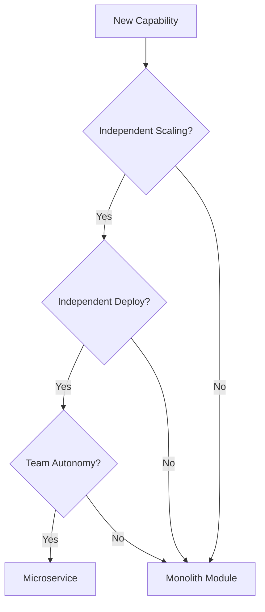
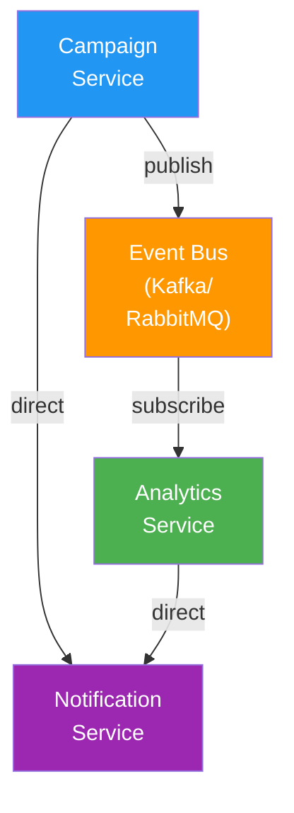
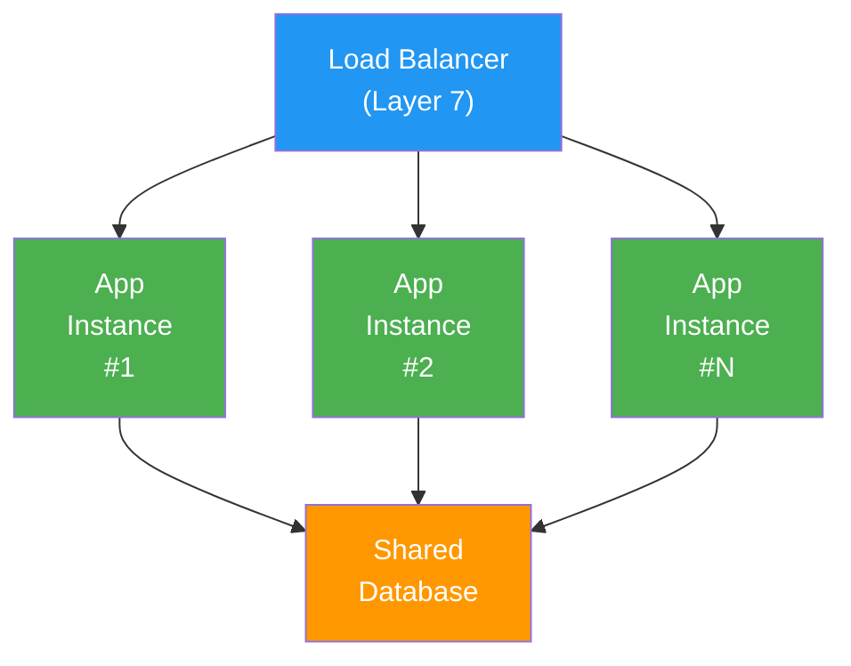

# Architecture Principles

## Overview

This document outlines the core architectural philosophy and guiding principles for the PopSystem platform. These principles serve as the foundation for all technical decisions, ensuring consistency, scalability, and maintainability as the platform evolves from v1 through v4 and beyond.

## Core Philosophy

PopSystem's architecture is built on the principle of **progressive evolution** - starting with pragmatic choices for v1 that can evolve into sophisticated, enterprise-grade systems without requiring complete rewrites.

```
FOUNDATION → SCALE → SOPHISTICATION → OPTIMIZATION
    v1          v2-v3        v4              v4+
```

---

## 1. API-First Design

### Principle
All functionality must be accessible through well-designed APIs before building user interfaces.

### Rationale
- Enables multiple client types (web, mobile, third-party integrations)
- Forces clear separation of concerns
- Facilitates testing and documentation
- Enables parallel development of frontend and backend teams

### Implementation Guidelines
- Design API contracts before implementation
- Use OpenAPI/Swagger for API documentation
- Version all APIs from day one
- Treat internal APIs with the same rigor as public APIs
- Build SDK/client libraries from API specs

### Evolution Path
```
v1: RESTful APIs with basic documentation
v2: OpenAPI 3.0 specs, auto-generated SDKs
v3: GraphQL endpoints for complex queries, REST for mutations
v4: Federated GraphQL, API gateway with intelligent routing
```

---

## 2. Microservices vs Modular Monolith

### Principle
Start with a **modular monolith**, evolve to **selective microservices** only when justified.

### Decision Framework



### Modular Monolith (v1-v2)
**Structure:**
```
/src
  /modules
    /campaigns
      /api
      /services
      /models
      /tests
    /analytics
    /influencers
    /payments
  /shared
    /auth
    /logging
    /database
```

**Benefits:**
- Simpler deployment and debugging
- Easier to refactor and reorganize
- Lower operational overhead
- Better for small teams
- Faster development cycles

### Microservices Candidates (v3+)
Extract services when they meet **2+ criteria**:
1. **Independent scaling needs** (e.g., AI processing, video transcoding)
2. **Different technology requirements** (e.g., Python for ML, Go for high-performance)
3. **Team ownership boundaries** (e.g., dedicated ML team)
4. **Third-party integration isolation** (e.g., payment processing)
5. **Security isolation requirements** (e.g., PII handling)

**Priority Services for Extraction:**
1. AI/ML Processing (Python-based, GPU requirements)
2. Video Processing (resource-intensive, async)
3. Analytics Engine (different database, read-heavy)
4. Payment Processing (PCI compliance isolation)
5. Notification Service (high volume, separate scaling)

---

## 3. Event-Driven Architecture

### Principle
Decouple systems through asynchronous event messaging for scalability and resilience.

### Event Categories

| Category | Pattern | Example | Delivery |
|----------|---------|---------|----------|
| Domain Events | Pub/Sub | `CampaignPublished` | At-least-once |
| Commands | Queue | `ProcessVideo` | Exactly-once |
| Queries | Request/Reply | `GetAnalytics` | Synchronous |
| Integrations | Webhook | `InfluencerPosted` | Best-effort |

### Architecture Diagram


### Implementation Guidelines
- Use events for **cross-module communication**
- Keep synchronous calls for **user-facing operations**
- Events must be **idempotent** (can be processed multiple times)
- Include **event versioning** from the start
- Store events in **event store** for replay and debugging

### Evolution Path
```
v1: Simple message queue (RabbitMQ/SQS)
v2: Event sourcing for critical entities
v3: Event streaming platform (Kafka)
v4: Complex event processing, real-time analytics
```

---

## 4. Multi-Tenancy Approach

### Principle
Support multiple organizations with data isolation, customization, and fair resource allocation.

### Isolation Models

#### Shared Database, Shared Schema (v1-v2)
```sql
CREATE TABLE campaigns (
  id UUID PRIMARY KEY,
  tenant_id UUID NOT NULL,
  name VARCHAR(255),
  -- All tenant data in same table
  CONSTRAINT fk_tenant FOREIGN KEY (tenant_id) REFERENCES tenants(id)
);

-- Row-Level Security
CREATE POLICY tenant_isolation ON campaigns
  USING (tenant_id = current_setting('app.current_tenant')::UUID);
```

**Pros:** Simple, cost-effective, easy to maintain
**Cons:** Limited customization, noisy neighbor risk

#### Shared Database, Separate Schema (v3)
```
Database: popsystem_prod
  Schema: tenant_abc123
  Schema: tenant_def456
  Schema: shared
```

**Pros:** Better isolation, schema-level customization
**Cons:** More complex migrations, higher DB overhead

#### Separate Database (v4 - Enterprise Tier)
```
Database: tenant_enterprise_1
Database: tenant_enterprise_2
Database: shared_services
```

**Pros:** Complete isolation, custom SLAs, regulatory compliance
**Cons:** Highest cost, complex operations

### Tenant Context Propagation
```typescript
// Middleware ensures tenant_id in all requests
interface RequestContext {
  tenantId: string;
  userId: string;
  permissions: string[];
}

// Automatically filtered at data layer
class CampaignRepository {
  async findAll(context: RequestContext) {
    return db.campaigns.findMany({
      where: { tenantId: context.tenantId }
    });
  }
}
```

---

## 5. Horizontal Scalability

### Principle
Design every component to scale by adding instances, not increasing instance size.

### Stateless Application Tier


### Design Requirements
1. **No local state** - Use Redis/database for sessions
2. **Shared nothing** - Each instance independent
3. **Database connection pooling** - PgBouncer/connection limits
4. **Distributed caching** - Redis cluster
5. **Sticky sessions avoided** - Unless absolutely necessary

### Data Tier Scalability
```
v1: Single PostgreSQL instance with read replicas
v2: Connection pooling, query optimization
v3: Database sharding by tenant_id
v4: Multi-region deployment with geo-routing
```

### Scaling Metrics
```
Trigger scaling when:
- CPU > 70% for 5 minutes
- Memory > 80%
- Request queue depth > 100
- Response time P95 > 500ms
```

---

## 6. Security by Design

### Principle
Security is not a feature to add later - it's embedded in every architectural decision.

### Defense in Depth
```
Layer 1: Perimeter (WAF, DDoS protection)
Layer 2: Network (VPC, Security Groups)
Layer 3: Application (Authentication, Authorization)
Layer 4: Data (Encryption, Tokenization)
Layer 5: Monitoring (Audit logs, Anomaly detection)
```

### Security Requirements Checklist
Every feature must address:
- [ ] Authentication mechanism
- [ ] Authorization rules (RBAC)
- [ ] Input validation
- [ ] Output encoding
- [ ] Data encryption requirements
- [ ] Audit logging
- [ ] Rate limiting
- [ ] Error handling (no info leakage)

### Secure Defaults
```typescript
// All API responses encrypted in transit
app.use(helmet()); // Security headers
app.use(cors({ origin: allowedOrigins })); // Strict CORS

// All database queries parameterized
db.query('SELECT * FROM users WHERE id = $1', [userId]); // No SQL injection

// All sensitive data encrypted at rest
const encrypted = encrypt(data, {
  algorithm: 'aes-256-gcm',
  key: process.env.ENCRYPTION_KEY
});
```

### Security Review Gates
- **Design Phase:** Threat modeling
- **Development:** Static code analysis (SAST)
- **Testing:** Dynamic security testing (DAST)
- **Deployment:** Vulnerability scanning
- **Production:** Continuous monitoring

---

## 7. Observability as Requirement

### Principle
Every service must be observable through metrics, logs, and traces - not optional, not added later.

### Three Pillars of Observability

#### 1. Metrics (What's happening?)
```
Business Metrics:
- Campaigns created per hour
- Active influencers
- Revenue per tenant

Technical Metrics:
- Request rate (RPS)
- Error rate (%)
- Response time (P50, P95, P99)
- Resource utilization (CPU, memory, disk)
```

#### 2. Logs (Why did it happen?)
```json
{
  "timestamp": "2025-12-21T10:30:45.123Z",
  "level": "ERROR",
  "service": "campaign-service",
  "traceId": "abc123",
  "tenantId": "tenant-456",
  "userId": "user-789",
  "message": "Failed to publish campaign",
  "error": {
    "type": "ValidationError",
    "code": "INVALID_BUDGET",
    "details": {...}
  }
}
```

#### 3. Traces (How did it flow?)
```
Request: POST /api/campaigns
├─ [10ms] Auth middleware
├─ [5ms] Validation
├─ [50ms] Database insert
│  └─ [45ms] Query execution
├─ [200ms] Image processing
│  ├─ [150ms] S3 upload
│  └─ [50ms] Thumbnail generation
└─ [20ms] Event publishing
Total: 285ms
```

### Observability Stack
```
v1: CloudWatch/Application Insights + Structured logging
v2: Prometheus + Grafana + ELK Stack
v3: OpenTelemetry + Jaeger + DataDog/New Relic
v4: Full observability platform with AIOps
```

### Instrumentation Requirements
```typescript
// Every service endpoint
@Trace()
@Metrics({ operation: 'createCampaign' })
async createCampaign(data: CampaignData, context: RequestContext) {
  const span = tracer.startSpan('createCampaign');

  try {
    logger.info('Creating campaign', {
      tenantId: context.tenantId,
      campaignType: data.type
    });

    const campaign = await this.repository.create(data, context);

    metrics.increment('campaigns.created', {
      tenant: context.tenantId
    });

    return campaign;
  } catch (error) {
    logger.error('Campaign creation failed', { error });
    metrics.increment('campaigns.errors');
    throw error;
  } finally {
    span.end();
  }
}
```

---

## 8. Documentation as Code

### Principle
Documentation lives with the code, versioned together, and is automatically generated where possible.

### Documentation Layers

#### 1. API Documentation
```yaml
# OpenAPI 3.0 spec in repository
openapi: 3.0.0
paths:
  /campaigns:
    post:
      summary: Create new campaign
      description: |
        Creates a new marketing campaign. Campaign will be in DRAFT
        status until explicitly published.
      requestBody:
        required: true
        content:
          application/json:
            schema:
              $ref: '#/components/schemas/Campaign'
```

#### 2. Architecture Decision Records (ADRs)
```markdown
# ADR-015: Event Bus Selection

Date: 2025-12-21
Status: Accepted

## Context
Need async communication between services for v2 architecture.

## Decision
Use RabbitMQ for v2, migrate to Kafka for v3+.

## Consequences
- Simpler operations for v2
- Migration path requires dual-write strategy
- Team needs RabbitMQ expertise
```

#### 3. Code Documentation
```typescript
/**
 * Campaign repository with automatic tenant isolation.
 *
 * All queries automatically filter by tenant_id from request context.
 * Uses row-level security for defense in depth.
 *
 * @example
 * const repo = new CampaignRepository();
 * const campaigns = await repo.findAll(context);
 *
 * @see ADR-008 for multi-tenancy approach
 */
export class CampaignRepository {
  // Implementation
}
```

#### 4. Runbooks
```markdown
# Runbook: Database Migration Failure

## Symptoms
- Deployment fails at migration step
- Application cannot connect to database

## Investigation
1. Check migration logs: `kubectl logs deployment/app-api`
2. Verify database connectivity: `psql -h db.prod ...`
3. Check current migration version: `SELECT * FROM migrations;`

## Resolution
...
```

### Documentation Toolchain
```
Source: Code repository
├─ API: OpenAPI → Swagger UI / Redoc
├─ Code: TSDoc → TypeDoc → GitHub Pages
├─ Architecture: Markdown → Docusaurus
└─ Runbooks: Markdown → Wiki / Notion
```

### Automation
- API docs generated on every commit
- Breaking changes detected automatically
- Documentation tests (verify examples compile)
- Changelog auto-generated from conventional commits

---

## Architecture Governance

### Review Process
All significant architectural changes require:
1. **RFC (Request for Comments)** - Proposal document
2. **Design Review** - Architecture team review
3. **Security Review** - Security team sign-off
4. **ADR** - Document decision and rationale
5. **Implementation Plan** - Phased rollout strategy

### Architecture Evolution Matrix

| Principle | v1 | v2 | v3 | v4 |
|-----------|----|----|----|----|
| API-First | REST only | REST + GraphQL | Federated GraphQL | API Gateway |
| Architecture | Modular Monolith | Monolith + 1-2 services | Selective microservices | Full microservices |
| Events | Simple queue | Event bus | Event streaming | CEP + Real-time |
| Multi-tenancy | Shared schema | Shared + RLS | Mixed model | Full isolation option |
| Scalability | Vertical | Horizontal app tier | Horizontal all tiers | Multi-region |
| Security | Basic auth/authz | OAuth 2.0 + MFA | Zero-trust | Full compliance |
| Observability | Basic logging | Metrics + logs | Full tracing | AIOps |
| Documentation | Manual | Semi-automated | Fully automated | AI-assisted |

---

## Key Takeaways

1. **Pragmatism over Perfection** - Start simple, evolve based on real needs
2. **Consistency Matters** - Apply principles uniformly across all services
3. **Measure Everything** - Data-driven decisions for architectural evolution
4. **Security First** - Cannot be retrofitted, must be foundational
5. **Document Decisions** - Future you will thank present you

---

## References

- [12-Factor App Methodology](https://12factor.net/)
- [AWS Well-Architected Framework](https://aws.amazon.com/architecture/well-architected/)
- [Microsoft Azure Architecture Center](https://learn.microsoft.com/en-us/azure/architecture/)
- [Martin Fowler - Microservices Guide](https://martinfowler.com/microservices/)
- [OpenAPI Specification](https://spec.openapis.org/oas/latest.html)

---

**Document Version:** 1.0
**Last Updated:** 2025-12-21
**Owner:** Engineering Leadership
**Review Cycle:** Quarterly
